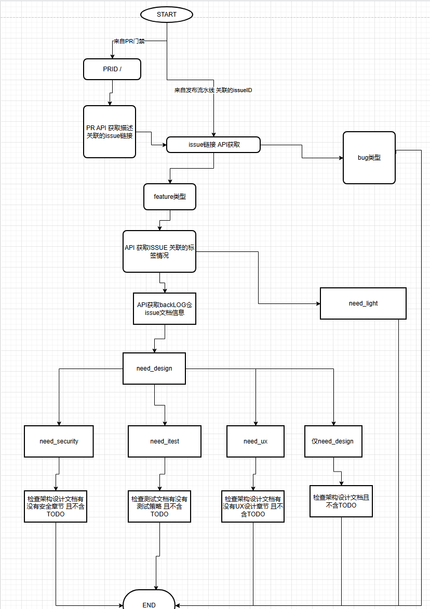
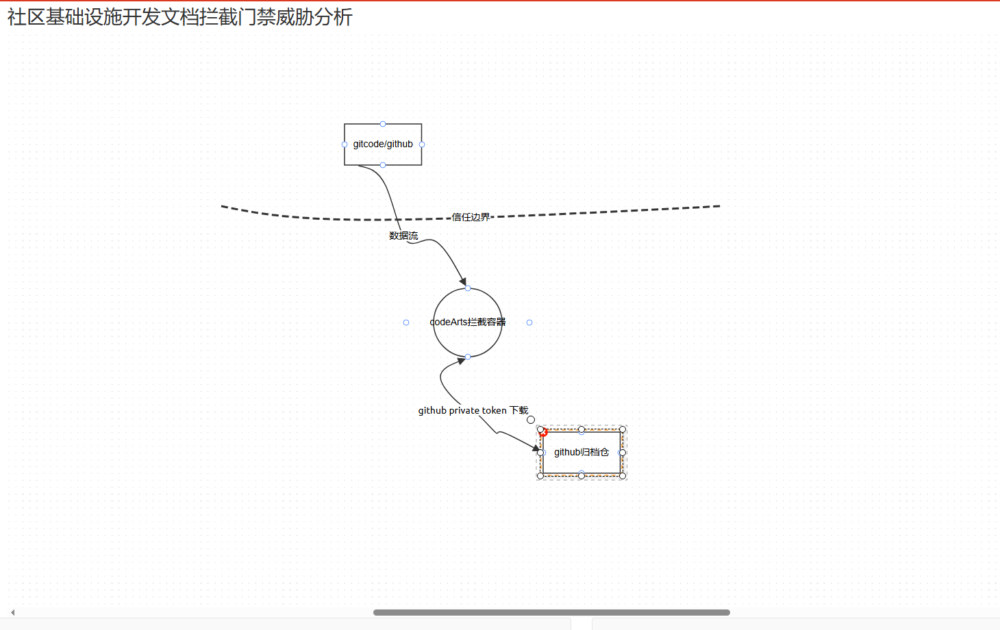
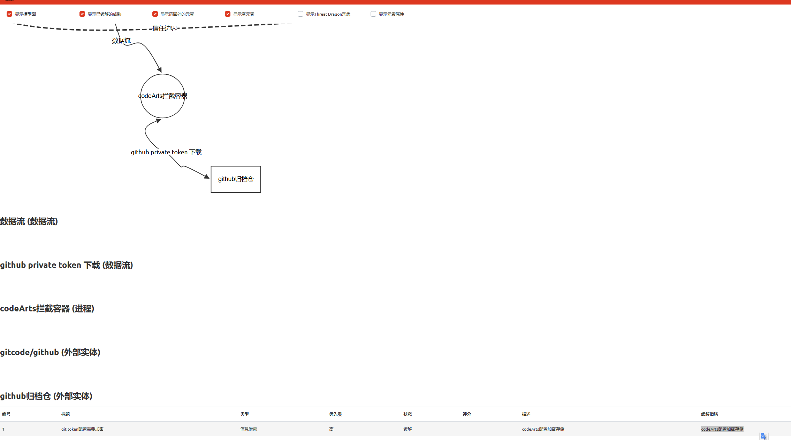

#1 社区基础设施代码合入文档设计交付件检查门禁能力建设架构设计说明书 (Architecture Design Document)
---

## 1. 基础信息

* **需求链接**: https://github.com/opensourceways/backlog/issues/2
* **需求名称**: 社区基础设施代码合入文档设计交付件检查门禁能力建设
* **开发责任人**: zkhzkhz
* **设计目标**: 通过codeArts门禁实现基础设施开发的设计文档交付件拦截

---

## 2. 功能设计

> **说明**：描述系统的组件构成、职责划分及交互逻辑。

### 2.1 架构图

> 此处建议插入架构拓扑系统组件图或时序图,描述组件间的交互关系。建议使用[https:
> //app.diagrams.net/?src=about](https://app.diagrams.net/?src=about)，开源免费支持多语言多种软件设计图，可保存原件到github下用于归档复用。
> **建议归档服务模块设计图，后续需要可增量复用（导入设计文件到工具中即可复用增量设计）。**
> **不涉及需要说明原因**

**设计说明/归档：** [开发过程文档检查流程.drawio.xml](..%2F..%2F..%2F%E5%85%AC%E5%85%B1%E6%96%87%E6%A1%A3%2F%E5%BC%80%E5%8F%91%E8%BF%87%E7%A8%8B%E6%96%87%E6%A1%A3%E6%A3%80%E6%9F%A5%E6%B5%81%E7%A8%8B.drawio.xml)

### 2.2 数据流图

> 此处建议插入数据流图，描述核心业务数据的生命周期，即威胁建模。
> 建议使用[https://www.threatdragon.com/#/](https://www.threatdragon.com/#/)
> ,开源免费支持多语言可保存到GitHub
> **建议归档服务模块设计图，后续需要可增量复用（导入设计文件到工具中即可复用增量设计）。**
> **不涉及需要说明原因**

**设计说明/归档：**[社区基础设施开发文档拦截门禁威胁分析.json](..%2F..%2F..%2F%E5%85%AC%E5%85%B1%E6%96%87%E6%A1%A3%2F%E7%A4%BE%E5%8C%BA%E5%9F%BA%E7%A1%80%E8%AE%BE%E6%96%BD%E5%BC%80%E5%8F%91%E6%96%87%E6%A1%A3%E6%8B%A6%E6%88%AA%E9%97%A8%E7%A6%81%E5%A8%81%E8%83%81%E5%88%86%E6%9E%90.json)

### 2.3 组件职责与接口

> 列出新增/修改的组件及其定义的 API 规范。**不涉及需要说明原因**

**设计说明/归档：** 不涉及对外接口

### 2.4 UX设计

> 设计目标：确保功能不仅“可用”，而且“好用”，降低开发者的认知负担和运维人员的误操作风险。 **不涉及需要说明原因**

**设计说明/归档：** 不涉及用户交互

### 2.5 SOD设计

> 设计目标：通过维护SOD权限设计文档，确保权限设计可审计、可复用、可跨服务重用。
**不涉及需要说明原因**
**需要说明文档位置**

**设计说明/归档：** 不涉及权限设计

### 2.6 功能设计分解TASK清单

| 任务 ID     | 可服务性任务描述   | 责任人                      |
|-----------|------------|--------------------------|
| **TASK1** | 门禁脚本核心逻辑实现 | zkhzkhz                  |
| **TASK2** | 门禁环境安全加固   | zkhzkhz                  |
| **TASK3** | 适配到发布流水线   | zkhzkhz,githubliuyang777 |

---

## 3. 非功能设计

### 3.1 安全与隐私设计评估和设计

> **注意**：仅当需求判定为 **`need_security`** 时，本章节为必填项。 **无该标签可删除本章节。**

> 关注点：防御能力与合规边界。

### 3.1.1 威胁分析 (Threat Modeling)

> 基于 **STRIDE** 或类似模型，识别本项目可能面临的安全威胁。可直接复制threatdragon威胁分析报告
> **建议归档服务模块设计图，后续需要可增量复用（导入设计文件到工具中即可复用增量设计）。**

| 威胁类别     | 攻击场景描述 (Scenario) | 风险等级/评分 | 对应减缓措施 (Mitigation) |
|----------|-------------------|---------|---------------------|
| **信息泄露** | git token配置需要加密   | 高       | codeArts配置加密存储      |

### 3.1.2 安全设计实现 (Security Mechanisms)

> **参考：**
> 威胁模型评估：
> * 是否已根据业务逻辑绘制 Data Flow Diagram 并识别单点风险？
>
> 软件供应链：
>* 是否扫描并修补了已知漏洞（CVE）？
>* 是否限制了第三方二进制包的直接引入？
>*
>凭证管理：
>* 严禁硬编码。
>* 密钥是否定期自动轮转（Rotation）？
>
>身份认证：
>* 是否具备多因素认证支持或联邦认证（OIDC）对接能力？
>* 内部微服务调用是否执行了身份校验（Identity-based Auth）？
>
>数据安全：
>* 传输加密（TLS 1.2+）与静态加密（AES-128）是否全覆盖？
>* 是否对高敏感字段（如手机号、秘钥）执行了哈希/加盐或差分隐私处理？
>
>运行时隔离：
>* 容器是否以非 Root 用户运行（Non-root Enforcement）？
>* 是否配置了 Read-only Root Filesystem 防止二进制篡改？
>
>日志审计：
>* 关键操作日志是否具备防篡改性？
>* 是否包含了足够用于追溯的 4W 信息（Who, When, Where, What）？

**设计说明/归档：**  利用codeArts能力，token加密存储，考虑到本任务不执行外部不可信代码，故无需额外加固。

### 3.1.3 安全任务分解 (Security Task Breakdown)

> 将安全设计转化为具体的开发任务，需在代码或后续开发流程的安全配置中落实。

** 安全任务分解TASK清单:**

**设计说明/归档：** 上述功能设计已分解

### 3.2 可靠性与韧性设计评估和设计（可选）

> **注意**：根据项目定级决定，含Core、Critical服务变更需要完成

> **关注点**：极端情况下的生存与恢复能力。
> **参考：**
> * 面向失败设计：是否识别了强依赖风险？当游依赖失效时，本服务是否具备降级或熔断能力？
> * 重试与避让：重试逻辑中是否包含指数退避和随机抖动以防止请求风暴？
> * 熔断限流：核心接口是否定义了明确的限流阈值？是否实现了断路器模式以保护下游？
> * 幂等设计：所有涉及写操作的任务是否支持重复调用而无副作用？

**设计说明/归档：** 内部服务不涉及

---

### 3.3 可服务性与可观测性评估和设计（可选）

> **关注点**：排障效率与全生命周期管理，确保故障可感知、可定位、可修复。

> **参考：**
>* 排障文档：是否提供了错误码对照表及对应的排障步骤？
>* 健康诊断：是否提供 /health 或 /status 接口，展示系统内部子模块的状态？
>* 平滑变更：升级或配置变更时如何实现灰度发布？是否具备一键回滚的判定指标？
>* 黄金指标覆盖：是否已定义并暴露出延迟、错误、流量和饱和度指标？

**设计说明/归档：** 内部服务不涉及

---

### 3.4 性能与伸缩性评估和设计（可选）

> **关注点**：社区生态兼容性与未来扩展。

> **参考：**
> * 并发模型：在高并发场景下，锁竞争、连接池和线程池的配置是否已评估？
> * 水平扩展：服务是否实现了完全无状态化，支持快速扩容？
> * 延迟评估：关键路径的延迟是否业务需求？是否存在明显的 IO 或计算瓶颈？

**设计说明/归档：** 内部服务不涉及

---
