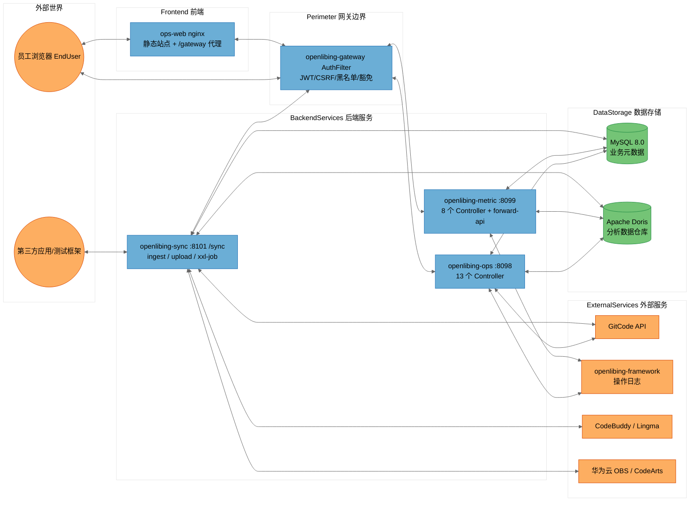

# [openlibing-ops、ops-web、metric、sync]安全威胁建模分析报告（STRIDE-A）——远程主干基线（合并版）

> 分析对象：`openlibing-ops`、`openlibing-metric`、`openlibing-sync`、`openlibing-ops-web` 四个代码仓库（含其与 `openlibing-gateway`、`openlibing-common`、`openlibing-framework` 及外部服务的信任关系）。
> 分析方法：STRIDE-A（欺骗 Spoofing / 篡改 Tampering / 否认 Repudiation / 信息泄露 Information Disclosure / 拒绝服务 Denial of Service / 权限提升 Elevation of Privilege / 滥用 Abuse），零信任视角 + 纵深防御。
> 结论分级：按**可利用性层级（Tier 1/2/3）**组织，而非按严重级别组织。
> 分析基线：**远程仓最新主干分支**（ops / metric / ops-web = `origin/main`，sync = `origin/master`），通过 git worktree 独立检出，不影响本地开发分支。

---

## 文档信息与元数据

| 字段 | 值 |
| --- | --- |
| 分析模型 | DeepSeek-V4-Flash（threat-model-analyst skill 驱动）；本合并版补充 3 项缺口（sync Python 采集脚本、Dockerfile 构建供应链完整性、镜像 SBOM/cosign/seccomp），证据合并自 MiniMax-M3 独立分析报告 |
| 分析基线类型 | 远程仓主干分支（git worktree 独立检出，detached HEAD，分析完成后已清理） |
| 仓库 1 | `openlibing-ops`，远程主干 `origin/main`，HEAD `a1bcb28b` |
| 仓库 2 | `openlibing-metric`，远程主干 `origin/main`，HEAD `414def6` |
| 仓库 3 | `openlibing-sync`，远程主干 `origin/master`，HEAD `ccf875a` |
| 仓库 4 | `openlibing-ops-web`，远程主干 `origin/main`，HEAD `7ca9554` |
| 与本地开发分支的基线差异 | 本地 `feat-apollo-eureka-nacos`（Nacos 迁移分支）vs 远程主干（Apollo）：差异集中在 CI 工作流（主干移除 nightly-schedule-scan）、RateLimitConfig（主干为 Apollo 版纯配置类）、配置文件与 sync `TestCaseDataServiceImpl`（ListUtils→Lists 无安全影响）；业务代码（Controller/Service/Mapper）几乎一致 |
| 分析范围 | 4 仓源码 + 配置 + 部署脚本 + CI 工作流；信任边界证据来自 `openlibing-gateway`/`openlibing-common` 相关代码与 docs 记录 |
| 输出位置（归档） | `openlibing-docs/architecture_desgin/[openlibing-ops、ops-web、metric、sync]安全威胁建模分析报告.md`（PR 合入主仓 master 后生效）；原始副本 `C:\w30060144\etransUpload\OpenLibing_四仓安全威胁建模分析报告_main_dsf.md` |

---

## 一、执行摘要（Executive Summary）

### 1.1 总体安全态势

OpenLibing 运营域四个仓（远程主干基线）的**工程化与"默认安全"基础较好**：容器镜像加固到位（非 root、umask、删除调试工具、RASP 注入、JRE-only）、配置中心快照不落盘、无硬编码凭据入库、SQL 参数化整体规范、XXE 防护齐全、CI 具备 CodeQL 静态扫描 + pre-commit 门禁、日志注入有净化处理。

但存在一个**结构性、跨仓共性的核心弱点**：**三个后端仓（ops / metric / sync）服务端全部零认证、零鉴权、零有效限流**，身份与授权完全外置到 `openlibing-gateway`（单点失效）。一旦网关被绕过（内网横向移动、SSRF、网关路由放行遗漏、`/manage` 重写混淆），全部读写接口（含删除、数据写入）匿名可达。前端仓（ops-web）同样零鉴权（权限纯 UI 层），且存在供应链完整性缺失与第三方脚本主域注入的信任面。

> **Note on threat counts:** 本报告共识别 **42 条 STRIDE-A 威胁（T01~T42）**、整合为 **35 条发现（FIND-01 ~ FIND-35）**，其中 Tier 1（无前置条件的直接暴露）1 条、Tier 2（单一前置条件）23 条、Tier 3（纵深防御）11 条。新增 3 条威胁（T40~T42）与 3 条发现（FIND-33~FIND-35）为本合并版补充项（sync Python 采集脚本、Dockerfile 构建供应链完整性、镜像 SBOM/cosign/seccomp），证据合并自 MiniMax-M3 独立分析。威胁计数会因网关路由实际配置（本报告未覆盖 `openlibing-gateway` 的完整路由豁免表）而波动，相关不确定性已在"分析上下文与假设"中声明。
>
> **基线注意：** 远程主干 CI 已**移除 nightly 防投毒/SCA 扫描工作流**（`nightly-schedule-scan.yml` 仅存在于本地开发分支，未合入主干）。因此本基线下的供应链纵深防御弱于本地开发分支，`FIND-32` 供应链完整性缺失的缓解面进一步收窄（详见 6.3 / FIND-32）。

### 1.2 威胁计数总览（按仓库 × 可利用层级）

| 仓库 | Tier 1 | Tier 2 | Tier 3 | 发现合计 | 最突出弱点 |
| --- | --- | --- | --- | --- | --- |
| openlibing-ops | 0 | 7 | 2 | 9 | sortRule SQL 注入未根治 + 生产 Swagger 开放 |
| openlibing-metric | 0 | 6 | 2 | 8 | `/forward-api` 出站转发滥用 + 敏感凭据明文落库 |
| openlibing-sync | 1 | 4 | 5 | 10 | 对外数据写入接口无认证（可直接写 Doris/OBS）+ Python 采集脚本审查 |
| openlibing-ops-web | 0 | 6 | 1 | 7 | nginx 无安全响应头 + 无 lockfile 供应链完整性缺失 |
| 跨仓 | 0 | 0 | 1 | 1 | 镜像构建供应链完整性缺失（JRE/rasp 无签名校验 + 缺 SBOM/cosign/seccomp） |
| 合计 | 1 | 23 | 11 | 35 | （跨仓）服务端零认证系统性单点失效 + 构建供应链完整性 |

> 注：文档后续发现章节按 35 条编号 FIND-01~FIND-35。其中 **FIND-01 为跨仓系统性发现（服务端零认证 + 限流死代码），统计口径上记入 ops 仓行（Tier 2）**；**FIND-35 为跨仓构建供应链发现，单列"跨仓"行**；FIND-02~FIND-34 为各仓独立发现（ops 8、metric 8、sync 10、ops-web 7，合计 33 条，加 FIND-01/FIND-35 共 35 条）。

### 1.3 需优先处置的 Top 风险

1. **（Tier 1，sync）对外数据写入接口完全未鉴权**：`POST /sync/api/data/ingest` 与 `POST /sync/testcase/metadata/upload` 无任何认证，第三方可直接写 Doris、向 OBS 传文件。
2. **（Tier 2，ops）排序方向 `sortRule` SQL 注入**：15 个 mapper 56 处 `${}`，至少 6 条服务路径只净化 `sortField`、不净化 `sortRule`，可在 ORDER BY 上下文构造子查询盲注。
3. **（Tier 2，metric）`/forward-api` 出站转发滥用**：客户端可注入任意 `token/apiKey` 出站到 gitcode.com 等白名单域名并回传响应，构成凭据滥用 / 借道 SSRF / 数据外带通道。
4. **（Tier 2，跨仓）服务端零认证 + 限流死代码**：三个后端仓无任何服务端鉴权、`RateLimitConfig` 从未挂载到请求链路，网关是唯一屏障。
5. **（Tier 2，ops-web）nginx 无任何安全响应头**（无 CSP / HSTS / X-Frame-Options / X-Content-Type-Options），且 `package-lock.json` 被 gitignore，构建期依赖树无完整性 pin；**主干无 nightly 供应链扫描兜底**。
6. **（Tier 3，跨仓）镜像构建供应链完整性缺失**：Dockerfile 以 `wget` 拉取 JRE 无签名校验、`rasp.tgz` 无 SHA256 校验，且 4 仓均缺镜像 SBOM、cosign 签名与 K8s seccomp 策略；sync Python 采集脚本的日志/SSL 路径存在凭据与完整性残余风险（FIND-33~FIND-35，合并补充项）。

---

## 二、系统全景、部署模型与信任边界

### 2.1 四仓角色与数据流

```
                        ┌────────────────────────────────────────────────────────────┐
                        │                        外部世界                             │
                        │   员工浏览器 EndUser        第三方应用/测试框架 ThirdParty      │
                        └───────┬───────────────────────────────┬────────────────────┘
                                │ HTTPS（含 CSRF 双提交 Cookie）  │ HTTPS
                                ▼                               ▼
                     ┌─────────────────────┐        ┌──────────────────────┐
                     │ openlibing-gateway  │        │ sync 数据接入/上传    │
                     │ AuthFilter：JWT/CSRF │        │ /sync/api/data/ingest │
                     │ 黑名单/纵向权限/豁免  │        │ /sync/testcase/metadata/upload │
                     └──┬──────┬──────┬────┘        └──────────┬───────────┘
                        ▼      ▼      ▼                        ▼
              ┌──────────┐ ┌────────┐ ┌──────────┐   ┌──────────────────────┐
              │ ops:8098 │ │metric: │ │ops-web   │   │ sync:8101 (context /sync)│
              │ 13控制器  │ │8099 8控制器│ │ nginx    │   │ 24 个 XXL-Job handler   │
              └────┬─────┘ └───┬────┘ │ 静态站点  │   └────┬───────────┬───────┘
                   │           │      └────┬─────┘        │           │
                   ▼           ▼           │              ▼           ▼
        ┌────────────────── MySQL + Doris（双数据源，DDD @DataSource 切换）────────────┐
        └────────────────────────────────────────────────────────────────────────────┘
        ops/metric/sync 还经 Feign/RestTemplate 出站调用：
        GitCode API、openlibing-framework（操作日志）、CodeBuddy、Lingma、
        华为云 CodeArts Pipeline、华为云 OBS、Python 采集器（gitCodeDataCollect）
```

### 2.2 部署分类（Deployment Classification）

- **分类：`K8S_SERVICE`**（Kubernetes 部署，经网关暴露，Nacos Discovery 以 HTTPS `secure: true` 注册；ops-web 经 nginx 部署，前端独立分支）。
- **配置中心**：远程主干仍为 **Apollo**（`apollo.meta` + `apollo.bootstrap.namespaces`，见各仓 `application-{beta,gamma,prod}.yaml`）；Nacos 迁移在本地 `feat-apollo-eureka-nacos` 开发分支进行，未合入主干。本报告按远程主干（Apollo）基线给出证据。
- **信任模型**：身份认证（JWT）、CSRF、黑名单、纵向权限统一由网关执行；三个后端仓**不承担任何服务端身份校验**。因此网关是该体系的唯一认证屏障（单点）。
- **前置条件底板**：后端服务直连端口仅集群内网可达 → 网关绕过类攻击前置条件至少为 `Internal Network`（Tier 2）；经网关的用户侧接口前置条件为 `Authenticated User`（Tier 2）；sync 的第三方数据接入端点无网关用户态校验证据 → 前置条件 `None`（Tier 1）。

### 2.3 信任边界与 DFD（系统级）



**信任边界说明：**

| 边界 | 含义 | 关键事实 |
| --- | --- | --- |
| `External` | 浏览器、第三方应用 | 员工经网关鉴权；第三方直连 sync 数据接入 |
| `Perimeter` | 网关边界 | AuthFilter 是唯一认证执行点（[AuthFilter.java](file:///c:/w30060144/develop/repositories/openlibing/openlibing-gateway/src/main/java/com/openlibing/gateway/business/filter/AuthFilter.java)） |
| `Frontend` | ops-web nginx | 同源 /gateway 代理；无安全响应头 |
| `BackendServices` | 三个后端 Pod | 服务端零认证；端口集群内网可达 |
| `DataStorage` | MySQL / Doris | 双数据源，默认 Doris；连接串由 Apollo 配置中心下发 |
| `ExternalServices` | GitCode / framework / 云 AI / 华为云 | 出站调用；凭据经 `SecurityUtil.decrypt` 解密 |

### 2.4 组件暴露表（Component Exposure Table，前置条件底板）

| 组件 | 监听地址 | 认证屏障 | 外部可达性 | 最小前置条件 | 派生 Tier |
| --- | --- | --- | --- | --- | --- |
| ops 用户侧 API | :8098 | 无（仅网关） | 经网关 | `Authenticated User` | Tier 2 |
| ops 内部/外部 API（GitcodeApi 等） | :8098 | 无 | 经网关 | `Authenticated User` | Tier 2 |
| metric 用户侧 API（含 forward-api） | :8099 | 无（仅网关） | 经网关 | `Authenticated User` | Tier 2 |
| sync 数据接入/上传 API | :8101 | 无 | 第三方直连（网关转发） | `None` | Tier 1 |
| sync XXL-Job executor | 10000 | accessToken 启动强校验 | 调度中心内网 | `Internal Network` | Tier 2 |
| MySQL / Doris | 内网 | 口令经 SecurityUtil 解密 | 集群内网 | `Internal Network` | Tier 2 |
| 静态凭据（ak/sk、平台 token 明文落库） | 库表 | 无 | 库读权限 | `Admin Credentials` | Tier 3 |
| 解密密钥材料（part1 / *.ks / pfx） | Apollo + 镜像 | 无 | 配置中心/镜像 | `Admin Credentials` | Tier 3 |
| ops-web nginx | 443 | 无（依赖网关会话） | 公网 | `Authenticated User` | Tier 2 |
| ops-web 构建链 | CI | 无 lockfile | CI/构建机 | `Host/OS Access` | Tier 3 |

---

## 三、openlibing-ops 安全分析

### 3.1 组件与攻击面

| 组件 ID | 锚点（证据文件） | 暴露面 |
| --- | --- | --- |
| OpsOverviewController | `api/controller/OpsOverviewController.java` | `/ops-overview` main/resource-summary/nightly-summary/link-config(GET/POST) |
| RepoController | `api/controller/RepoController.java` | `/repo` base/dashboard、branch/config/batch(POST) 等 |
| PipelineController | `api/controller/PipelineController.java` | `/pipeline` info/query/version-chart |
| ResourceController | `api/controller/ResourceController.java` | `/resource` summary/trend |
| ProjectController | `api/controller/ProjectController.java` | `/project` issue/summary |
| OpsGithubController | `api/controller/OpsGithubController.java` | `/ops/github` chart/export/* |
| CodeCheckDashboardController | `api/controller/CodeCheckDashboardController.java` | `/code-check-dashboard` kpi/trend/branch-config/add |
| CommonController | `api/controller/CommonController.java` | `common` remark/export/{category}/detail |
| ExternalApiControllers | `api/controller/external/GitcodeApi.java` 等 4 个 | `api/gitcode`、`ops/api/repo`、`ops/api/nightly`、`api/repo/issue` |
| OpsQueryServices | `domain/service/pipeline/impl/DwiPipelineRunInfoServiceImpl.java` 等 | SQL 组装层（sortField/sortRule） |
| DataAccess | `domain/mapper/*.xml` + `infrastructure/config/DataSourceConfig.java` | MySQL + Doris 双数据源 |
| GitcodeFeignClient | `infrastructure/client/gitcode/GitcodeFeignClient.java` | 出站 GitCode API |
| FrameworkFeignClient | `infrastructure/client/framework/FrameworkFeignClient.java` | 出站 framework 操作日志 |
| RateLimitConfig | `infrastructure/config/RateLimitConfig.java` | 限流配置（死代码） |
| ExportService | `app/service/CommonService.java` | EasyExcel 导出 |
| LogPipeline | `infrastructure/aop/DashboardLoggerAspect.java` + `logback-spring.xml` | 日志/审计 |
| DockerContainer | `Dockerfile` + `start.sh` + `monitor.sh` | 运行时加固 |

### 3.2 STRIDE-A 威胁表（ops）

| 威胁 ID | STRIDE 类别 | 威胁描述 | 前置条件 | Tier |
| --- | --- | --- | --- | --- |
| T01.S | S 欺骗 | 13 个 Controller 无服务端身份校验，网关绕过/直连后身份可任意伪造 | `Internal Network` | T2 |
| T02.S | S 欺骗 | GitcodeApi.queryUserByEmail 信任客户端透传 Authorization，可借服务代查他人邮箱映射 | `Internal Network` | T2 |
| T03.T | T 篡改 | sortRule 未净化直接拼 ORDER BY，SQL 注入/子查询盲注（6 条服务路径） | `Authenticated User` | T2 |
| T04.T | T 篡改 | `/manage` 前缀由 PathFilter 无条件剥离，路由混淆/网关鉴权绕过面 | `Internal Network` | T2 |
| T05.R | R 否认 | 无服务端身份绑定，操作审计无法追溯真实用户（依赖网关注入身份头） | `Internal Network` | T2 |
| T06.I | I 信息泄露 | 生产/预发 Swagger 全量开放（api-docs + swagger-ui enabled: true，`application-prod.yaml` 生效） | `Authenticated User` | T2 |
| T07.I | I 信息泄露 | PathFilter 对每个请求 INFO 级记录 URI，operate 日志 appender 裸 `%msg%n` 无 CRLF 清洗（日志注入/审计污染） | `Authenticated User` | T2 |
| T08.D | D 拒绝服务 | RateLimitConfig 为死代码（getApiConfig 无调用方），导出/查询/邮箱枚举接口无限流可被刷 | `Authenticated User` | T2 |
| T09.E | E 权限提升 | 经网关纵向权限若漏配（网关 forwardTrustList/豁免路径），写接口（branch-config/add、link-config POST）匿名可写 | `Internal Network` | T2 |
| T10.A | A 滥用 | 导出接口可被用于批量拖取全量运营数据（导出无频次/行数限制） | `Authenticated User` | T2 |
| T11.I | I 信息泄露 | 数据库口令与 GitCode token 经单一静态密钥 `security.part1` 对称解密，密钥与密文同存 Apollo 配置中心单点 | `Admin Credentials` | T3 |
| T12.T | T 篡改 | 镜像内嵌 pfx/cacerts 证书材料随镜像分发，来源管控与轮换缺失 | `Admin Credentials` | T3 |

**STRIDE-A 汇总（ops）**：S=2，T=3（T03/T04/T12），R=1，I=3，D=1，E=1，A=1，共 **12 条**（T01~T12）。

### 3.3 ops 组件级 STRIDE 明细（节选高风险组件）

**OpsQueryServices（SQL 组装层）—— Tampering / Injection：**

| 威胁 | 证据 | 影响 |
| --- | --- | --- |
| `sortRule` 注入 | [DwiPipelineRunInfoServiceImpl.java:146](file:///c:/w30060144/tmp-tm-ops/src/main/java/com/openlibing/ops/domain/service/pipeline/impl/DwiPipelineRunInfoServiceImpl.java#L146) `queryWrapper.last("order by " + req.getSortField() + " " + req.getSortRule())`；`sortField` 经 [FieldUtil.getSortField](file:///c:/w30060144/tmp-tm-ops/src/main/java/com/openlibing/ops/infrastructure/util/FieldUtil.java) 白名单映射，**`sortRule` 原样拼接** | ORDER BY 上下文可构造子查询/时间盲注；叠加无认证/无限流放大 |
| 同类未净化路径 | [ResourceProjectTestcaseDetailService.java:108](file:///c:/w30060144/tmp-tm-ops/src/main/java/com/openlibing/ops/domain/service/resource/detail/ResourceProjectTestcaseDetailService.java)、[DwiVersionPipelineInfoServiceImpl.java:63](file:///c:/w30060144/tmp-tm-ops/src/main/java/com/openlibing/ops/domain/service/pipeline/impl/DwiVersionPipelineInfoServiceImpl.java)、[DwiProjectStatisticsServiceImpl.java:55](file:///c:/w30060144/tmp-tm-ops/src/main/java/com/openlibing/ops/domain/service/project/impl/DwiProjectStatisticsServiceImpl.java)、[RepoHandle.java:96,113](file:///c:/w30060144/tmp-tm-ops/src/main/java/com/openlibing/ops/app/service/repo/RepoHandle.java)、[DmRdEfcRepoSumPipelineStatisticsDayServiceImpl.java:66](file:///c:/w30060144/tmp-tm-ops/src/main/java/com/openlibing/ops/domain/service/repo/impl/DmRdEfcRepoSumPipelineStatisticsDayServiceImpl.java) | 同上 |
| 已净化对照基线 | `SortFieldValidator.normalizeRule` + `validate`（asc/desc 白名单）；`FieldUtil.getSortFieldByCamel` 反射校验 | 说明修复模板已存在，`sortRule` 统一走该工具即可 |

**RateLimitConfig —— Denial of Service：**

| 威胁 | 证据 | 影响 |
| --- | --- | --- |
| 限流死代码 | [RateLimitConfig.java:46](file:///c:/w30060144/tmp-tm-ops/src/main/java/com/openlibing/ops/infrastructure/config/RateLimitConfig.java#L46) `getApiConfig` 全仓仅被自身与测试类引用，无任何 Filter/Interceptor 挂载（远程主干为 Apollo `@ApolloConfig("framework")` 版，仍无消费方） | 对外接口无限流，可被无节制刷取（撞库、全量导出、配合 SQL 盲注逐位探测、DoS） |

**DataAccess —— 口令存储（已缓解项）：** 数据库口令经 `SecurityUtil.decrypt(password, part1)` 运行时解密（[DataSourceConfig.java:87,106](file:///c:/w30060144/tmp-tm-ops/src/main/java/com/openlibing/ops/infrastructure/config/DataSourceConfig.java)），`@EnableEncryptableProperties` 启用 Jasypt；本地资源文件 0 硬编码凭据，`.gitignore` 排除 keys/pfx/cacerts。**剩余风险**：`security.part1` 与密文同存 Apollo 配置中心（单点）。

**DockerContainer —— 加固（已缓解项）：** 非 root（`USER openlibing`）、umask 0077、锁口令 nologin、删除 gdb/perl/gcc 等调试编译工具、JRE-only、注入 RASP、`-Dfastjson.parser.safeMode=true`、显式 trustStore。

---

## 四、openlibing-metric 安全分析

### 4.1 组件与攻击面

| 组件 ID | 锚点（证据文件） | 暴露面 |
| --- | --- | --- |
| AiDashboardController | `api/controller/AiDashboardController.java` | `metric/ai-dashboard` user-data / user-usage / **forward-api** |
| DigitalMetricInfoController | `api/controller/DigitalMetricInfoController.java` | `/manage/digital/metric` page/save/{metricCode}/delete |
| DataAssetColumnInfoController | `api/controller/DataAssetColumnInfoController.java` | `/manage/dataasset/column` query/update |
| DigitalOperationDimensionController | `api/controller/DigitalOperationDimensionController.java` | `/manage/digital/dimension` page/save/delete |
| DataAssetTableRegistryController | `api/controller/DataAssetTableRegistryController.java` | `/manage/dataasset/table` query/update |
| DigitalOperationDomainController | `api/controller/DigitalOperationDomainController.java` | `/manage/digital/domain` page/save/delete |
| AiDashboardForwarder | `app/service/metric/AiDashboardService.java` | forward-api 出站转发（SSRF 白名单） |
| SecretStore | `domain/project/entity/HwProjectInfo.java`、`ProjectCommonAccountInfo.java` | ak/sk、giteeToken/gitcodeToken 明文落库 |
| DataAccess | `DataSourceConfig.java` + `mapper/*.xml` | MySQL + Doris；BlockAttack 防全表更新 |
| LogPipeline | `LogSanitizer.java` + `DashboardLoggerAspect.java` + `AbstractLogHandler.java` | 审计日志（完整请求体序列化） |
| DockerContainer | `Dockerfile` + `start.sh` + `monitor.sh` | 运行时加固 |

### 4.2 STRIDE-A 威胁表（metric）

| 威胁 ID | STRIDE 类别 | 威胁描述 | 前置条件 | Tier |
| --- | --- | --- | --- | --- |
| T13.S | S 欺骗 | 8 个 Controller 无服务端鉴权，全依赖网关；直连/绕过后身份可伪造 | `Internal Network` | T2 |
| T14.S | S 欺骗 | `/forward-api` 允许客户端自携 `token/apiKey` 作为 Authorization 出站，可借服务身份调用 gitcode 等白名单 API | `Authenticated User` | T2 |
| T15.I | I 信息泄露 | `forward-api` catch 通用 Exception 后把 `e.getMessage()` 回传客户端（[AiDashboardController.java:92-95](file:///c:/w30060144/tmp-tm-metric/src/main/java/com/openlibing/metric/api/controller/AiDashboardController.java#L92-L95)） | `Authenticated User` | T2 |
| T16.I | I 信息泄露 | 生产/预发 Swagger api-docs 全量开放（application-prod.yaml swagger-ui enabled: true） | `Authenticated User` | T2 |
| T17.I | I 信息泄露 | 华为云 ak/sk 与平台 giteeToken/gitcodeToken 明文落库（[HwProjectInfo.java:25-28](file:///c:/w30060144/tmp-tm-metric/src/main/java/com/openlibing/metric/domain/project/entity/HwProjectInfo.java#L25-L28)） | `Admin Credentials` | T3 |
| T18.D | D 拒绝服务 | `RateLimitConfig` 死代码无消费方；`AiDashboardRequest.pageSize` 无上限校验，可超大分页击穿 Doris | `Authenticated User` | T2 |
| T19.E | E 权限提升 | `delete/{metricCode}` 用 GET 语义，配合网关纵向权限漏配可触发任意删除 | `Authenticated User` | T2 |
| T20.R | R 否认 | 审计日志把方法参数 `JSON.toJSONString(paramsMap)` 全量序列化（仅移除 `request` 键），未系统性脱敏 token/密码，且无身份强绑定 | `Authenticated User` | T2 |
| T21.I | I 信息泄露 | 解密密钥材料（`*.ks`、`openlibing.pfx`、`cacerts`）随 Docker 镜像分发（[Dockerfile:41-49](file:///c:/w30060144/tmp-tm-metric/Dockerfile)），与密文同源 `security.part1` 单点 | `Admin Credentials` | T3 |
| T22.A | A 滥用 | forward-api 对 GET 拼 query / POST 全量透传 body，无参数白名单与长度约束，可被当作外部请求代理/外带通道 | `Authenticated User` | T2 |

**STRIDE-A 汇总（metric）**：S=2，T=0，R=1，I=4，D=1，E=1，A=1，共 **10 条**。Tampering 为空是因为该仓 SQL 全部参数化（`${}` 0 命中）+ BlockAttack 拦截器；此项记为已缓解。

### 4.3 metric 组件级 STRIDE 明细（节选高风险组件）

**AiDashboardForwarder（forward-api）—— 出站转发滥用：**

| 威胁 | 证据 | 影响 |
| --- | --- | --- |
| 凭据自携出站 | [AiDashboardService.java:184-194](file:///c:/w30060144/tmp-tm-metric/src/main/java/com/openlibing/metric/app/service/metric/AiDashboardService.java)；`ApiForwardRequest.java:27,30` 允许客户端传 `token/apiKey` | 攻击者用任意凭据借服务出口 IP 调 gitcode API；可探测内网可达的 SSRF 目标（虽有白名单） |
| 白名单覆盖 gitcode | [AiDashboardService.java:45-51](file:///c:/w30060144/tmp-tm-metric/src/main/java/com/openlibing/metric/app/service/metric/AiDashboardService.java#L45-L51) 白名单含 `gitcode.com`、`api.gitcode.com`、`console.enterprise.trae.cn` 等 | 白名单域名本身即可作为外带/凭据滥用的合法目标 |
| 错误详情回传 | [AiDashboardController.java:92-95](file:///c:/w30060144/tmp-tm-metric/src/main/java/com/openlibing/metric/api/controller/AiDashboardController.java#L92-L95) `Result.error(HTTP_REQUEST_ERROR, e.getMessage())` | 内部异常/目标响应错误信息暴露给调用方 |

**SecretStore —— 静态凭据明文：** `HwProjectInfo.ak/sk`（华为云访问密钥对）与 `ProjectCommonAccountInfo.giteeToken/gitcodeToken` 均以**明文字段**读写 MySQL（`openlibing` 库），无加密、无脱敏、无审计读取。虽本仓未暴露对应写接口，但任何具备库读权限的路径（备份、DBA、横向移动）可直接取用云 AK/SK 与平台令牌。

**DataAccess —— 已缓解项：** mapper 全参数化（`${}` 0 命中）、`BlockAttackInnerInterceptor` 防全表更新/删除、密码运行时 `SecurityUtil.decrypt` 解密。

---

## 五、openlibing-sync 安全分析

### 5.1 组件与攻击面

| 组件 ID | 锚点（证据文件） | 暴露面 |
| --- | --- | --- |
| DataIngestController | `api/controller/DataIngestController.java` | `POST /api/data/ingest`（context path `/sync`，即 `/sync/api/data/ingest`）第三方数据接入，**零认证** |
| TestCaseDataController | `api/controller/TestCaseDataController.java` | `POST testcase/metadata/upload` multipart 上传（即 `/sync/testcase/metadata/upload`），**零认证** |
| DataIngestServiceImpl | `app/service/thirdapi/impl/DataIngestServiceImpl.java` | 模型存在性/启用/必填字段校验 → `dynamicDorisService.dynamicInsert` 直写 Doris |
| DynamicDorisService + Mapper | `domain/service/thirdapi/impl/DynamicDorisServiceImpl.java` + `resources/mapper/DynamicDorisMapper.xml` | 动态 `INSERT INTO openlibing.${tableName}(${col}) VALUES(#{val})`，列名白名单 + 值参数化 |
| ObsUtilClient | `infrastructure/client/obs/ObsUtilClient.java` | OBS 上传（`putObject` / `uploadFile`），静态 AK/SK 经 `obs.*` 配置集下发 |
| XxlJobExecutors | `domain/service/pipeline/job/*` | 24 个 XXL-Job handler（含 5 个已弃用）；executor `openlibing-sync-executor` :10000 |
| HealthController | `api/controller/HealthController.java` | 健康检查端点（`/health-check/...`） |

### 5.2 STRIDE-A 威胁表（sync）

| 威胁 ID | STRIDE 类别 | 威胁描述 | 前置条件 | Tier |
| --- | --- | --- | --- | --- |
| T23.S | S 欺骗 | 数据接入/上传两接口无任何服务端认证/签名/apiKey，第三方可匿名伪造 appCode 调用并写入 Doris | `None` | T1 |
| T24.T | T 篡改 | ingest 数据仅列名白名单过滤，缺类型/长度/取值校验，脏数据可污染 Doris 指标结论（列名来自 DB 注册表，SQL 注入面受限，但数据完整性无保障） | `None` | T2 |
| T25.I | I 信息泄露 | upload 回传已上传文件路径列表、ingest 回传模型不存在/字段错误等内部细节，便于枚举模型表结构 | `None` | T2 |
| T26.I | I 信息泄露 | OBS AK/SK 经 `obs.*` 配置集下发且为静态配置，无服务侧轮换机制，密钥材料单点 | `Admin Credentials` | T3 |
| T27.D | D 拒绝服务 | ingest/upload 无服务端限流、数据量无上限（仅批次上限常量），第三方可高频刷 Doris / 堆积 OBS 上传 | `None` | T2 |
| T28.D | D 拒绝服务 | XXL-Job executor :10000 暴露面，accessToken 启动强校验是唯一屏障，若 token 泄露/弱配置可伪造调度轰炸 | `Internal Network` + 凭据 | T3 |
| T29.E | E 权限提升 | upload 的 `archiveConfig.archivePath` 由调用方传入，未校验对象键格式/前缀，可越权写 OBS 指定路径 | `None` | T2 |
| T30.A | A 滥用 | 批处理/定时 Job handler（含 5 个已弃用但仍在注册）若被误触发/滥用可造成重复采集、重复写库、数据污染 | `Internal Network` | T3 |
| T40.I | I 信息泄露 | Python 采集脚本 `gitCodeDataCollect` 日志/异常路径可能间接打印 `access_token`（`str(e)` 全量打印）；凭据经 `config.yaml` 的 `${ENV}` 占位符注入为已缓解项 | `Host/OS Access` | T3 |
| T41.T | T 篡改 | Python 采集脚本 `requests.get/post` 未显式声明 `verify=True`/证书锁定，依赖库默认值，代理或传输劫持场景下响应完整性无显式防护 | `Host/OS Access` | T3 |

**STRIDE-A 汇总（sync）**：S=1，T=2，R=0，I=3，D=2，E=1，A=1，共 **10 条**（T23~T30 + T40/T41）。R（否认）为空：数据接入为写后即弃的第三方通道，无用户态身份可否认，记已缓解/不适用。

### 5.3 sync 组件级 STRIDE 明细（节选高风险组件）

**DataIngestController / TestCaseDataController —— 零认证（Tier 1）：**

| 威胁 | 证据 | 影响 |
| --- | --- | --- |
| 数据接入零认证 | [DataIngestController.java:36-44](file:///c:/w30060144/tmp-tm-sync/openlibing-sync-service/src/main/java/com/openlibing/sync/api/controller/DataIngestController.java#L36-L44) `POST /api/data/ingest` 无任何认证注解/签名校验；全仓 grep `HandlerInterceptor\|WebMvcConfigurer\|@PreAuthorize\|SecurityContext` **0 命中**（与服务端零认证结论一致） | 第三方匿名可达 → `dynamicInsert` 直写 Doris；无身份、无审计归属 |
| 上传零认证 | [TestCaseDataController.java:44-87](file:///c:/w30060144/tmp-tm-sync/openlibing-sync-service/src/main/java/com/openlibing/sync/api/controller/TestCaseDataController.java#L44-L87) `testcase/metadata/upload` 无认证，仅做参数必填/批次上限校验 | 匿名上传文件 → OBS；`archivePath` 由调用方控制，存在越权对象键风险 |

**DynamicDorisService（动态写 Doris）—— 已缓解 + 残余风险：**

| 威胁 | 证据 | 影响 |
| --- | --- | --- |
| SQL 注入（已缓解） | [DynamicDorisMapper.xml:5-14](file:///c:/w30060144/tmp-tm-sync/openlibing-sync-service/src/main/resources/mapper/DynamicDorisMapper.xml#L5-L14) `INSERT INTO openlibing.${tableName}`、列 `${col}`、值 `#{val}`；`tableName` 来自 DB 注册模型（非用户直传）、列名经 [DynamicDorisServiceImpl.filterAndValidateData:58-79](file:///c:/w30060144/tmp-tm-sync/openlibing-sync-service/src/main/java/com/openlibing/sync/domain/service/thirdapi/impl/DynamicDorisServiceImpl.java#L58-L79) 对 DB 列注册表白名单过滤、值参数化 | SQL 注入面受限，此项记为已缓解 |
| 数据校验薄弱（残余） | [DynamicDorisServiceImpl.java:35-55](file:///c:/w30060144/tmp-tm-sync/openlibing-sync-service/src/main/java/com/openlibing/sync/domain/service/thirdapi/impl/DynamicDorisServiceImpl.java#L35-L55) 值仅校验"必填字段存在"，无类型/长度/范围校验；`filteredData` 无行数上限 | 脏数据污染 Doris 指标；超长文本/超大行击穿分析性能；叠加零认证可被批量投毒 |

**ObsUtilClient（OBS 上传）：** [ObsUtilClient.java:64-70,128-141](file:///c:/w30060144/tmp-tm-sync/openlibing-sync-service/src/main/java/com/openlibing/sync/infrastructure/client/obs/ObsUtilClient.java) 以静态 AK/SK（`obs.*` 配置集，Apollo 下发）初始化 `ObsClient`，`uploadFile`/`putObject` 写 OBS；无凭据轮换与最小权限拆分（与 T26/FIND-23 对应）。

**XXL-Job（executor）：** appname `openlibing-sync-executor`、端口 10000，`accessToken` 启动强校验（9 个 `xxl.*` 必需 Apollo 配置键）；已弃用的 5 个 handler（`refreshPipelineJobHandler` 等）仍在注册表，存在被误触发风险（与 T30/FIND-25 对应）。

**已缓解项（sync 特有）：** 生产/预发 Swagger 已禁用（`application-prod.yaml`/`application-gamma.yaml` 中 `swagger-ui.enabled: false`、`api-docs.enabled: false`），与 ops/metric 形成对照；`LogSanitizer` 对日志入参净化。

### 5.4 sync Python 采集脚本（gitCodeDataCollect）安全分析【合并补充】

> 本节证据来自 MiniMax-M3 独立分析报告，与 5.2/5.3 的 Java 侧证据互补；对应 FIND-33/FIND-34。

| 项 | 评估 | 处置建议 |
| --- | --- | --- |
| 凭据管理 | ✅ `config.yaml` 中 Doris 口令 / 仓库 `access_token` 均通过 `${ENV}` 占位符 + `os.getenv` 注入，**无硬编码**（`config.yaml:53,64`；`main.py:280-291`） | 保持；建议加环境变量来源审计 |
| 日志脱敏 | ⚠️ token 缺失时仅记仓库名（`main.py:289-291`）OK；但错误路径若 `str(e)` 全量打印可能间接泄漏 token | 统一走脱敏工具，禁止 `str(e)` 直出凭据类对象 |
| SSL 校验 | ✅ `requests.get/post` 未显式 `verify=False`，依赖默认校验 | 显式 `verify=True` + 可选证书锁定，规避代理/LB 注入 |
| 重试逻辑 | ⚠️ 指数退避 + 429 重试，但 `max_retries=2` 硬编码，可能掩盖凭据失效 | 重试上限可配置，凭据失效单独告警 |
| 速率限制 | ✅ 内置 `_throttle()` | 保持 |
| Token 调度 | ✅ `TokenScheduler` 多租户 token 轮转 | 保持；轮换策略审计 |

---

## 六、openlibing-ops-web 安全分析

### 6.1 组件与攻击面

| 组件 ID | 锚点（证据文件） | 暴露面 |
| --- | --- | --- |
| nginx 网关层 | `nginx/nginx_prod.conf` + `nginx_beta.conf` | 静态站点、TLS1.2/1.3、`limit_conn`/`limit_req`、隐藏文件 deny、**无安全响应头** |
| http 客户端 | `src/api/http.ts` | 同源 `/gateway` 代理；CSRF 双提交（`Csrf-Token-Open-Li-Bing`） |
| 第三方埋点 | `src/plugins/uem.js` | 动态加载 `https://hwa.his.huawei.com/dist/uem_f.js`，**无 SRI**，localStorage 埋点 |
| 富文本 / XSS 面 | `package.json`（tinymce 6.8.6、dompurify、element-plus） | 指标描述/参考链接/富文本渲染 DOM XSS 面 |
| 依赖与供应链 | `package.json`（`^` 浮动版本）+ `.gitignore` | **无 lockfile**，构建期依赖树无完整性 pin |
| CI 供应链扫描 | `.gitcode/workflows/`（远程主干仅 `codeql.yaml` + `pre-commit.yml`） | **主干无 nightly 防投毒/SCA 扫描**（该工作流仅存在于本地开发分支，未合入主干），供应链事后扫描缓解缺失 |

### 6.2 STRIDE-A 威胁表（ops-web）

| 威胁 ID | STRIDE 类别 | 威胁描述 | 前置条件 | Tier |
| --- | --- | --- | --- | --- |
| T31.S | S 欺骗 | 前端零鉴权（权限纯 UI 层：路由守卫/按钮 `v-if`），接口权限完全依赖网关，网关绕过即任意操作 | `Internal Network` | T2 |
| T32.T | T 篡改 | uem.js 第三方脚本在主域加载、无 SRI 完整性校验，源站被入侵/传输劫持即主域任意 JS | `Host/OS Access` | T2 |
| T33.T | T 篡改 | 富文本（TinyMCE）与指标描述/参考链接渲染存在 DOM XSS 面，dompurify 未覆盖全部渲染路径 | `Authenticated User` | T2 |
| T34.I | I 信息泄露 | nginx 无 CSP/HSTS/X-Frame-Options/X-Content-Type-Options 等安全响应头，XSS 后无纵深兜底、无点击劫持防护、可被协议降级 | `Authenticated User` | T2 |
| T35.I | I 信息泄露 | `package-lock.json` 被 gitignore，依赖树无完整性 pin，供应链投毒面（**主干无 nightly 扫描兜底，风险上浮**） | `Host/OS Access` | T3 |
| T36.I | I 信息泄露 | uem.js 用 localStorage 存埋点数据（页面 URL/用户标识），采集范围与留存未审计 | `Host/OS Access` | T3 |
| T37.D | D 拒绝服务 | nginx `limit_req`/`limit_conn` 基于 `$http_x_real_ip`（客户端/前置可控）且速率 1000r/s 过高，防刷可被绕过/形同虚设 | `None` | T2 |
| T38.D | D 拒绝服务 | `^` 浮动版本 + 无 lockfile，一次依赖升级引入兼容性/安全回归即可致站点不可用 | `Host/OS Access` | T3 |
| T39.A | A 滥用 | 参考链接/指标链接（metric 表单、open-source-project）无域名白名单校验，可被用于钓鱼/恶意跳转 | `Authenticated User` | T2 |

**STRIDE-A 汇总（ops-web）**：S=1，T=2，R=0，I=3，D=2，E=0，A=1，共 **9 条**（T31~T39）。R（否认）与 E（权限提升）为空：前端无写权限语义、无服务端特权面，记不适用。

### 6.3 ops-web 组件级 STRIDE 明细（节选高风险组件）

**nginx —— 安全响应头缺失 + 限流可绕过：**

| 威胁 | 证据 | 影响 |
| --- | --- | --- |
| 安全响应头缺失 | [nginx_prod.conf](file:///c:/w30060144/tmp-tm-ops-web/nginx/nginx_prod.conf) server 块无 `add_header` CSP/HSTS/X-Frame-Options/X-Content-Type-Options；已配 `server_tokens off`、`proxy_hide_header X-Powered-By`、TLS1.2/1.3 + OCSP、隐藏文件 `deny all`、仅 GET/POST、`limit_conn limitperip 10` | XSS 无 CSP 兜底、无 HSTS（可被降级）、可被 iframe 点击劫持、MIME 嗅探 |
| 限流基于可伪造头 | [nginx_prod.conf:58-60,86](file:///c:/w30060144/tmp-tm-ops-web/nginx/nginx_prod.conf#L58-L60) `limit_conn_zone $http_x_real_ip`、`limit_req_zone $http_x_real_ip rate=1000r/s`；`X-Real-IP` 由调用方/前置代理可控，1000r/s 无实际意义 | 防刷形同虚设，配合后端无限流可被刷爆 |

**第三方埋点 uem.js —— 主域脚本注入：** [uem.js:31](file:///c:/w30060144/tmp-tm-ops-web/src/plugins/uem.js#L31) 动态向主域注入 `src: 'https://hwa.his.huawei.com/dist/uem_f.js'`，无 SRI、无完整性校验；[uem.js:33](file:///c:/w30060144/tmp-tm-ops-web/src/plugins/uem.js#L33) `storageType: 'localStorage'`。该脚本拥有主域同源能力（可读 CSRF cookie、发起带会话请求），源站被入侵即主域恶意 JS（FIND-27 对应）。

**CSRF 双提交（已缓解）：** [http.ts:75](file:///c:/w30060144/tmp-tm-ops-web/src/api/http.ts#L75) 每请求携带 `Csrf-Token-Open-Li-Bing`（= cookie `csrf-token-open-li-bing`），配合网关校验，跨站请求伪造面已收窄。

**供应链完整性：** [.gitignore:32](file:///c:/w30060144/tmp-tm-ops-web/.gitignore#L32) `package-lock.json` 被忽略；[package.json](file:///c:/w30060144/tmp-tm-ops-web/package.json) 依赖多为 `^` 浮动版本（tinymce 6.8.6、axios 1.18.1 为精确 pin）。**基线注意：** 远程主干 CI 已移除 `nightly-schedule-scan.yml`（防投毒/SCA/CodeQL 事后扫描），仅存 `codeql.yaml`（Push/PR 触发）+ `pre-commit.yml`，供应链完整性缺失在当前主干上**无 nightly 事后扫描兜底**（FIND-32 风险较开发分支上浮）。

---

## 七、跨仓系统性发现与总体治理策略

### FIND-01（Tier 2，跨仓）：服务端零认证 + 限流死代码系统性单点失效

- **证据链**：ops / metric / sync 三仓 Controller 均无服务端鉴权注解/拦截器（ops/metric 全仓无 `HandlerInterceptor`/`WebMvcConfigurer`/`@PreAuthorize` 挂载入站校验；sync grep 0 命中）；ops/metric 的 `RateLimitConfig.getApiConfig` 为死代码（无 Filter/Interceptor 消费，远程主干为 Apollo 版纯配置类）；身份认证、CSRF、黑名单、纵向权限全部外置于 `openlibing-gateway` 的 AuthFilter。
- **影响**：网关是唯一认证屏障（单点失效）。任何网关绕过路径（内网横向移动、SSRF、网关路由豁免遗漏、`/manage` 前缀剥离混淆、sync 第三方直连面）即所有读写接口（含删除、数据写入）匿名可达。
- **治理方向（分层）**：
  1. **服务端零信任改造**：三仓引入统一入站校验中间件（可复用 openlibing-common 的 `FeignAccessTokenInterceptor` 思路扩展到服务端），至少对写接口/敏感接口做服务端身份与租户校验。
  2. **网关路由豁免表审计**：梳理 `/manage`、`/sync`、`/api` 前缀豁免路径，最小化白名单，禁止无条件剥离。
  3. **限流落地**：将 RateLimitConfig 挂载到 Filter/Interceptor 或网关侧限流，覆盖登录、导出、数据接入、forward-api 等高频面。
  4. **纵深防御**：SQL 排序白名单工具统一、导出加频控与行数上限、静态凭据加密托管（KMS/Vault）。

### FIND-35（Tier 3，跨仓）：镜像构建供应链完整性缺失（JRE/rasp 无签名校验 + 缺 SBOM/cosign/seccomp）【合并补充】

- **证据链**：4 仓 Dockerfile 均以 `wget https://mirrors.tuna.tsinghua.edu.cn/Adoptium/...` 拉取 JRE、sync 复制 `rasp.tgz`，均**无签名/SHA256 校验**（构建期供应链）；4 仓均**未生成镜像 SBOM**（syft/cyclonedx）、**未做镜像签名**（cosign）、**未声明 K8s seccompProfile / readOnlyRootFilesystem**（运行时纵深防御）。证据来自 MiniMax-M3 独立分析。
- **影响**：构建机/镜像源被控或传输劫持时，可注入带毒 JRE/rasp 进最终镜像且事后无法核验；镜像无 SBOM/签名则 SBOM 关联分析、镜像来源审计与运行时策略约束缺失。
- **治理方向**：① JRE/rasp 改为构建期本地预下载 + SHA256 固定；② CI 集成 syft 生成 SBOM + cosign 签名；③ K8s 模板补 `seccompProfile: RuntimeDefault` 与 `readOnlyRootFilesystem`；④ 与 FIND-32（供应链完整性）合并治理，纳入 nightly SCA 扫描范围。

---

## 八、发现清单（FIND-01 ~ FIND-35，整合表）

| 发现 | 仓库 | Tier | STRIDE | 对应威胁 | 摘要与处置方向 |
| --- | --- | --- | --- | --- | --- |
| FIND-01 | 跨仓 | T2 | S/D | 跨仓 | 服务端零认证 + 限流死代码系统性单点失效（详见第七章） |
| FIND-02 | ops | T2 | S/E | T01,T09 | 服务端零认证 + 网关纵向权限/写接口依赖（branch-config/add、link-config POST 等） |
| FIND-03 | ops | T2 | T | T03 | `sortRule` 未净化拼 ORDER BY，SQL 注入/子查询盲注；统一走 `SortFieldValidator`/`FieldUtil` 白名单 |
| FIND-04 | ops | T2 | S | T02 | GitcodeApi 信任客户端透传 Authorization，可借服务代查他人邮箱映射 |
| FIND-05 | ops | T2 | I | T06 | 生产/预发 Swagger api-docs 全量开放（远程主干 `application-prod.yaml` 已核实） |
| FIND-06 | ops | T2 | R/D | T04,T05,T07,T08 | 平台治理面：`/manage` 前缀剥离、审计否认、PathFilter 日志注入、限流死代码 |
| FIND-07 | ops | T2 | A | T10 | 导出接口无频次/行数限制，可批量拖取运营数据 |
| FIND-08 | ops | T3 | I | T11 | DB 口令与 GitCode token 单一静态密钥 `security.part1` 解密、密钥密文同存 Apollo 配置中心单点 |
| FIND-09 | ops | T3 | T | T12 | 镜像内嵌 pfx/cacerts 证书材料，来源管控与轮换缺失 |
| FIND-10 | metric | T2 | S/E | T13,T19 | 服务端零认证 + GET 语义删除接口（`delete/{metricCode}`）依赖网关纵向权限 |
| FIND-11 | metric | T2 | S/A | T14,T22 | `/forward-api` 出站转发滥用：客户端自携 `token/apiKey` 出站 + 代理/外带通道 |
| FIND-12 | metric | T2 | I | T15 | forward-api 异常 `e.getMessage()` 回传客户端 |
| FIND-13 | metric | T2 | I | T16 | 生产/预发 Swagger api-docs 全量开放（远程主干 `application-prod.yaml` 已核实） |
| FIND-14 | metric | T3 | I | T17 | 华为云 ak/sk、平台 giteeToken/gitcodeToken 明文落库 |
| FIND-15 | metric | T2 | D | T18 | 限流死代码 + `pageSize` 无上限可超大分页击穿 Doris |
| FIND-16 | metric | T2 | R | T20 | 审计日志全量序列化参数未系统性脱敏 token/密码 |
| FIND-17 | metric | T3 | I | T21 | 解密密钥材料（`*.ks`/pfx/cacerts）随镜像分发、与密文同源单点 |
| FIND-18 | sync | T1 | S | T23 | 数据接入/上传接口零认证，第三方可直接写 Doris/OBS（最高优先） |
| FIND-19 | sync | T2 | T | T24 | ingest 数据校验薄弱（类型/长度/范围），脏数据污染 Doris 指标 |
| FIND-20 | sync | T2 | I | T25 | 上传路径列表/接入错误内部细节回显，便于枚举表结构 |
| FIND-21 | sync | T2 | D | T27 | ingest/upload 无服务端限流、无数据量上限，可刷 Doris/OBS |
| FIND-22 | sync | T2 | E | T29 | upload `archivePath` 由调用方控制，OBS 对象键路径穿越风险 |
| FIND-23 | sync | T3 | I | T26 | OBS 静态 AK/SK（`obs.*` 配置集）、无轮换、密钥单点 |
| FIND-24 | sync | T3 | D | T28 | XXL-Job executor :10000 暴露面与 accessToken 生命周期治理 |
| FIND-25 | sync | T3 | A | T30 | 批处理/定时 Job handler（含 5 个已弃用）滥用：重复采集/数据污染 |
| FIND-26 | ops-web | T2 | S | T31 | 前端零鉴权，权限纯 UI 层，接口权限完全依赖网关 |
| FIND-27 | ops-web | T2 | T | T32 | uem.js 第三方脚本主域注入、无 SRI 完整性 |
| FIND-28 | ops-web | T2 | T | T33 | 富文本（TinyMCE）/描述/链接 DOM XSS 面 |
| FIND-29 | ops-web | T2 | I | T34 | nginx 安全响应头缺失（CSP/HSTS/XFO/XCTO） |
| FIND-30 | ops-web | T2 | D | T37 | nginx 限流基于可伪造 `X-Real-IP` 且 1000r/s 过高，防刷失效 |
| FIND-31 | ops-web | T2 | A | T39 | 参考链接无域名白名单，可被用于钓鱼/恶意跳转 |
| FIND-32 | ops-web | T3 | I/T/D | T35,T36,T38 | 供应链完整性缺失：无 lockfile、`^` 浮动版本、uem.js localStorage 埋点采集未审计；**主干无 nightly 防投毒/SCA 扫描兜底，风险较开发分支上浮** |
| FIND-33 | sync | T3 | I | T40 | Python 采集脚本日志/异常路径可能间接泄漏 `access_token`；凭据 `${ENV}` 注入为已缓解【合并补充】 |
| FIND-34 | sync | T3 | T | T41 | Python 采集脚本 SSL 校验依赖默认值、无显式证书锁定/代理防护【合并补充】 |
| FIND-35 | 跨仓 | T3 | T/I/D | T42 | 镜像构建供应链完整性缺失：Dockerfile JRE/rasp 无签名校验 + 缺 SBOM/cosign/seccomp【合并补充】 |

---

## 九、优先修复路线图（按 Tier 与业务影响）

### Phase 1 —— Tier 1，立即（本周内）

1. **sync 数据接入/上传接口加认证**：引入 apiKey + HMAC 签名或服务端发放的访问令牌，识别调用方并做白名单（FIND-18）。
2. **sync upload `archivePath` 白名单**：校验对象键前缀/格式，禁止任意路径写 OBS（FIND-22）。
3. **ops-web nginx 补安全响应头**：`add_header` CSP / Strict-Transport-Security / X-Frame-Options / X-Content-Type-Options（FIND-29）。

### Phase 2 —— Tier 2，短期（1~2 个迭代）

4. **ops `sortRule` 统一走白名单工具**：所有 `queryWrapper.last("order by ...")` 路径改用 `SortFieldValidator`/`FieldUtil`（FIND-03）。
5. **metric forward-api 收紧**：服务端固定凭据、禁止客户端自携 `token/apiKey`、异常信息脱敏（FIND-11/FIND-12）。
6. **三仓限流落地**：将 `RateLimitConfig` 挂载到 Filter/Interceptor，或网关侧配置限流，覆盖登录/导出/数据接入/forward-api（FIND-06/FIND-15/FIND-21）。
7. **生产 Swagger 关闭**：ops/metric 的 `swagger-ui.enabled`/`api-docs.enabled` 置 false（FIND-05/FIND-13）。
8. **网关豁免路径审计**：梳理 `/manage`、`/sync`、`/api` 豁免表，最小化白名单（FIND-02/FIND-10）。
9. **导出接口加频控与行数上限**（FIND-07）。
10. **ops-web uem.js 加 SRI 或自托管**：对第三方脚本做完整性 pin（FIND-27）。
11. **审计日志脱敏**：token/密码字段打码后再序列化（FIND-16）。
12. **Python 采集脚本整改**：日志统一脱敏、显式 `verify=True`、重试上限可配置（FIND-33/FIND-34）。

### Phase 3 —— Tier 3，中期（结合迁移/发布窗口）

13. **静态凭据加密托管**：ak/sk、平台 token、DB 口令迁至 KMS/Vault，解密密钥与密文分离存储（FIND-08/FIND-14/FIND-23）。
14. **镜像内嵌证书材料移除与轮换机制**：pfx/cacerts 改由运行期从安全通道拉取（FIND-09/FIND-17）。
15. **提交 lockfile 并收敛版本**：将 `package-lock.json` 纳入版本库，`^` 版本改为精确 pin；**并评估将 nightly 防投毒/SCA 扫描合入主干**（FIND-32）。
16. **XXL-Job accessToken 生命周期治理**：定期轮换、executor 网络策略收敛（FIND-24）。
17. **埋点数据采集审计**：确认 uem.js 采集字段、留存与合规（FIND-32 补充）。
18. **镜像构建供应链完整性**：JRE/rasp 本地预下载 + SHA256 固定、CI 集成 syft/cosign、K8s 补 seccomp/readOnlyRootFilesystem（FIND-35）。

---

## 十、已缓解项与正向工程化基线（肯定面）

以下控制经代码/配置证据核实为已启用，作为纵深防御基线保留：

- **容器加固**：ops/metric/sync 镜像非 root（`USER openlibing`）、`umask 0077`、nologin 锁口令、删除 gdb/perl/gcc 等调试编译工具、JRE-only、注入 RASP、`-Dfastjson.parser.safeMode=true`、显式 trustStore。
- **配置中心快照不落盘**：`SnapShotSwitch.setIsSnapShot(false)`。
- **无硬编码凭据入库**：本地资源文件 0 硬编码凭据，`.gitignore` 排除 keys/pfx/cacerts；数据库口令经 `SecurityUtil.decrypt` 运行时解密 + Jasypt `@EnableEncryptableProperties`。
- **SQL 参数化基线**：metric mapper `${}` 0 命中 + `BlockAttackInnerInterceptor` 防全表更新/删除；ops 除 `sortRule` 外均参数化；sync 动态插入列名白名单 + 值参数化。
- **XXE 防护**：各仓 XML 解析器禁外部实体（既有基线）。
- **日志注入净化**：三仓共用 `LogSanitizer` 移除 CRLF/控制字符。
- **CSRF 双提交**：ops-web `http.ts` 携带 `Csrf-Token-Open-Li-Bing`；网关 AuthFilter 校验。
- **供应链 CI（主干）**：CodeQL 静态扫描（`codeql.yaml`，Push/PR 触发）+ pre-commit 门禁；**注意：nightly 防投毒/SCA 扫描（`nightly-schedule-scan.yml`）未合入主干**，如需事后供应链扫描兜底应评估将其纳入主干。
- **xxl-job accessToken 启动强校验**（9 个 `xxl.*` 必需 Apollo 配置键）。
- **sync Swagger 生产/预发已禁用**（区别于 ops/metric，作为基线参照）。
- **ops-web nginx**：TLS1.2/1.3 + OCSP、`server_tokens off`、隐藏文件 deny、仅 GET/POST、`proxy_hide_header X-Powered-By`。
- **sync Python 采集脚本（已缓解，合并补充）**：凭据经 `config.yaml` 的 `${ENV}` 占位符 + `os.getenv` 注入（无硬编码）、内置 `_throttle()` 速率限制、`TokenScheduler` 多租户 token 轮转、`requests` 默认 SSL 校验。

---

## 十一、分析上下文、假设与局限

- **分析基线**：**远程仓最新主干分支**（ops `a1bcb28b` / metric `414def6` / sync `ccf875a` / ops-web `7ca9554`），通过 git worktree 独立检出（detached HEAD），分析期间不影响本地开发分支（ops=`workflow_run_job`，metric/sync/ops-web=`feat-apollo-eureka-nacos`），完成后已清理 worktree 并切回原分支。
- **与本地开发分支（Nacos 迁移分支）的差异**：本地 `feat-apollo-eureka-nacos` 为 Nacos 配置中心迁移版；远程主干仍为 Apollo。差异文件集中在 CI 工作流（主干移除 `nightly-schedule-scan.yml`）、`RateLimitConfig`（主干为 Apollo 纯配置类，死代码结论不变）、配置文件（`application-*.yaml`）与 sync `TestCaseDataServiceImpl`（`ListUtils`→`Lists`，无安全影响）。**业务代码（Controller/Service/Mapper）两个基线几乎一致，42 条威胁 / 35 条发现全部成立。**
- **未覆盖范围**：`openlibing-gateway` 完整路由豁免表、`openlibing-common` 内部认证中间件全部细节、第三方 SDK（CodeBuddy/Lingma/CodeArts）内部实现、Doris/MySQL 底层权限配置。
- **合并补充来源**：FIND-33/FIND-34/FIND-35（T40~T42）的证据来自 MiniMax-M3 独立分析报告（sync Python 采集脚本、Dockerfile 构建供应链、镜像 SBOM/cosign/seccomp），未在本报告主体的 DeepSeek 分析中独立复跑核实；相关文件行号以 MiniMax 报告为准。
- **计数波动**：威胁计数会因网关实际豁免配置而波动；Tier 划分以"本仓内可验证证据"为准，未做渗透测试/DAST 实证。
- **证据性质**：所有"已缓解"项按代码/配置证据判定，未做运行时验证（未注入、未真实攻击）。
- **敏感信息**：本报告不包含任何真实凭据/密钥值，仅描述存在性与处置方向。
- **后续建议**：可基于本报告派生（a）网关路由豁免表专项审计；（b）四仓服务端入站校验的改造任务；（c）迁移（Nacos）合入主干后对 Tier 1/Tier 2 项的回归验证清单。

---

## 十二、附录：STRIDE-A 汇总矩阵（按仓库）

| 仓库 | S 欺骗 | T 篡改 | R 否认 | I 信息泄露 | D 拒绝服务 | E 权限提升 | A 滥用 | 威胁数 | Tier1 | Tier2 | Tier3 |
| --- | --- | --- | --- | --- | --- | --- | --- | --- | --- | --- | --- |
| openlibing-ops | 2 | 3 | 1 | 3 | 1 | 1 | 1 | 12 | 0 | 10 | 2 |
| openlibing-metric | 2 | 0 | 1 | 4 | 1 | 1 | 1 | 10 | 0 | 8 | 2 |
| openlibing-sync | 1 | 2 | 0 | 3 | 2 | 1 | 1 | 10 | 1 | 4 | 5 |
| openlibing-ops-web | 1 | 2 | 0 | 3 | 2 | 0 | 1 | 9 | 0 | 6 | 3 |
| 跨仓（构建供应链） | 0 | 1 | 0 | 0 | 0 | 0 | 0 | 1 | 0 | 0 | 1 |
| **合计** | **6** | **7** | **2** | **13** | **6** | **3** | **4** | **42** | **1** | **28** | **13** |

> 说明：威胁总数 42（T01~T42）；经整合映射为 35 条发现（FIND-01~FIND-35）。发现层 Tier 分布（1/23/11）与威胁层 Tier 分布（1/28/13）不同，系跨仓/同主题威胁合并归类所致，属预期差异。T40~T42 为本合并版补充项（sync Python 采集脚本、跨仓镜像构建供应链）。

---

*报告生成：threat-model-analyst skill（STRIDE-A + 零信任 + 纵深防御），基线=远程仓主干分支（ops/metric/ops-web=origin/main，sync=origin/master），2026-08-21。本合并版补充 FIND-33~FIND-35（证据合并自 MiniMax-M3 独立分析），用于归档 openlibing-docs/architecture_desgin。*
