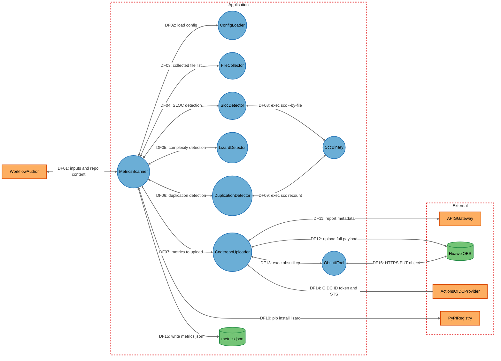

# code-metrics-action 项目安全威胁分析报告

**分析日期：** 2026-10-09
**分析版本：** master (f236b87)
**分析方法：** STRIDE-A 威胁建模
**项目仓库：** https://gitcode.com/openlibing/code-metrics-action

---

## 目录

1. [执行摘要](#1-执行摘要)
2. [系统架构概述](#2-系统架构概述)
3. [数据流图（DFD）](#3-数据流图dfd)
4. [STRIDE-A 威胁分析](#4-stride-a-威胁分析)
5. [安全发现与漏洞详情](#5-安全发现与漏洞详情)
6. [修复建议与行动计划](#6-修复建议与行动计划)
7. [附录](#7-附录)

---

## 1. 执行摘要

### 1.1 分析概述

code-metrics-action 是一个面向 GitCode / GitHub Actions 的**代码度量扫描插件**（Node 16 Action）。它在 CI 执行机上对一个已 checkout 的代码仓进行扫描，计算五类代码质量指标：

- 代码规模（SLOC）
- 平均函数代码行数
- 平均圈复杂度
- 代码重复率
- 文件重复率

插件的运行链路为：枚举源码文件 → 调用内置 `scc` 二进制计算 SLOC → 运行时 `pip install lizard` 并调用 `python3 -m lizard` 计算函数复杂度 → 进程内进行行级重复检测 → 写出本地 `metrics.json` → 将全量报告（含代码片段）上传到华为云 OBS 桶，并把元数据 + OBS 链接上报到华为 APIG 网关。

插件以 `runs.using: node16`、`main: dist/index.js` 形式打包；**仓库无 `src/`，实际执行代码为 `dist/` 目录下的打包产物与可读模块**，另含 `action.yml`、`.gitcode/workflows/*.yml`、`.pre-commit-config.yaml`、`zip.js` 等文件。经核验，本仓库部署分类为 **LOCALHOST_DESKTOP**：它是 CI 执行机上的一个短生命周期、仅出网的控制台进程，**无监听端口、无入站套接字**。

### 1.2 关键安全风险表

本次分析共识别出 **14 个安全问题**（经误报复核后全部保留，其中 1 条下调级别），其中：

| 严重级别              | 数量 | 关键问题                                                                                                               |
| --------------------- | ---- | ---------------------------------------------------------------------------------------------------------------------- |
| **严重（Critical）**  | 0    | 无（本仓库无入站监听面，不存在无需前置条件的直接暴露漏洞）                                                             |
| **高危（Important）** | 7    | 命令注入、任意文件写入（路径遍历）、源码明文外泄、lizard/obsutil/scc 三处未校验的第三方代码、OIDC 令牌可被环境变量覆盖 |
| **中危（Moderate）**  | 6    | 凭证出现在进程命令行、跨租户 OBS 对象键混淆、YAML 资源耗尽、无界资源消耗、本地 git 元数据被信任、配置覆盖导致指标操纵  |
| **低危（Low）**       | 1    | 本地日志/临时产物残留敏感信息（经复核由中危下调）                                                                      |

> 说明：原报告将 FIND-12 定为 Moderate（中危），本次复核认为其"仅成功路径清理、失败路径不清理"的断言与实际代码不符（失败路径亦执行清理），故下调为低危，详见第 5.4 节与第 7.2 节。

### 1.3 核心结论

> **本插件不存在可被未认证外部攻击者直接利用（Tier 1）的漏洞。** 所有风险都需要至少一个前置条件——能够声明 workflow 输入 / 提供被扫描仓库内容的"工作流作者（Authenticated User）"，或同一执行机上的其他进程（Local Process Access）。
>
> 主要风险集中在四类：
>
> 1. **命令注入面**：`SlocDetector` / `DuplicationDetector` / `LizardDetector` 及 `ensureObsutil` 使用 shell 字符串 `execSync`，其中 `allowed-extensions` 输入可直接注入 shell 元字符；调用方本应使用参数数组的 `execFileSync`。
> 2. **供应链完整性缺失**：内置二进制 `dist/bin/scc`、运行时下载的 `obsutil`、运行时 `pip install lizard` 三条链路均无哈希/签名校验。
> 3. **源码明文外泄**：上报载荷内嵌 `contentB64`（重复块明文 Base64）与 `snapshotData`（重复块 ±5 行上下文快照），上传到所有 `gitcode-action` 插件共享的 OBS 桶；默认文件白名单还包含 `.json`/`.yml`/`.properties` 等易含凭证的配置类文件。
> 4. **身份/元数据可篡改**：上报身份取自本地 `git remote` 与 `ATOMGIT_*` 环境变量，缺乏平台侧绑定；OBS 对象键前缀 `owner/repo` 同样来自仓库可控的本地 git 状态。
>
> 综合评定整体安全态势为 **Elevated（偏高）** 而非 Critical：这些多为纵深防御与供应链问题，受影响面为"每一个使用该插件的下游仓库"。

---

## 2. 系统架构概述

### 2.1 技术栈

| 类别            | 技术                                  | 版本 / 说明                                                            |
| --------------- | ------------------------------------- | ---------------------------------------------------------------------- |
| 语言 / 运行时   | JavaScript（Node.js）                 | `runs.using: node16`，engines `>=16.0.0`                               |
| 打包工具        | `@vercel/ncc`                         | devDependency `^0.38.1`，产物 `dist/index.js`（约 2.25 MB）            |
| Actions 运行时  | `@actions/core`                       | `^1.10.0`                                                              |
| HTTP 客户端     | `axios`                               | `^1.6.0`                                                               |
| 配置解析        | `js-yaml`                             | `^4.1.0`（YAML config）                                                |
| 日志            | `winston`                             | `^3.11.0`                                                              |
| OIDC 联邦客户端 | `@openlibing/huaweicloud-oidc-client` | `0.0.5`（OIDC ID Token → STS 临时凭证 + V11 签名）                     |
| 打包压缩        | `adm-zip`                             | devDependency `^0.5.16`（`zip.js`）                                    |
| 内置二进制      | `scc`（Sloc Cloc and Code）           | 随仓提交，`dist/bin/scc`（4550840 字节 ELF，MIT）                      |
| 外部工具        | `lizard`                              | 运行时 `pip install lizard==1.24.0`                                    |
| 外部工具        | `obsutil`                             | 运行时下载 `obsutil_linux_amd64.tar.gz` 到 `os.tmpdir()` 后执行        |
| 远端服务        | 华为云 OBS / APIG / STS               | 桶 `openlibing-gitcode-action`，网关 `https://apig.openlibing.com:443` |

### 2.2 关键组件

| 组件 ID             | 类型                | 说明                                                                      | 源码位置                                     |
| ------------------- | ------------------- | ------------------------------------------------------------------------- | -------------------------------------------- |
| MetricsScanner      | Process             | 编排器：解析源码根、驱动三类检测器、合并指标、写 `metrics.json`、触发上传 | `dist/scanner.js`                            |
| ConfigLoader        | Process             | 用 `js-yaml` 加载配置并与默认值递归深合并                                 | `dist/config/loader.js`                      |
| FileCollector       | Process             | 递归目录遍历 + 扩展名白名单 + `exclude-dirs` glob 剪枝                    | `dist/utils/fileCollector.js`                |
| SlocDetector        | Process             | 经 shell 调用内置 `scc` 并解析 `--by-file` JSON 得到 SLOC                 | `dist/detectors/SlocDetector.js`             |
| LizardDetector      | Process             | 经 shell 调用 `python3 -m lizard` 计算函数数与圈复杂度                    | `dist/detectors/LizardDetector.js`           |
| DuplicationDetector | Process             | 进程内行级重复/完全一致文件检测，并调用 `scc` 对临时镜像复算重复行        | `dist/detectors/DuplicationDetector.js`      |
| CoderepoUploader    | Process             | 组装全量上报载荷、经 `obsutil` 上传 OBS、再向 APIG 上报元数据             | `dist/uploaders/CoderepoUploader.js`         |
| SccBinary           | Process             | 内置第三方 `scc` 可执行文件（`dist/bin/scc`）                             | `dist/bin/scc`                               |
| ObsutilTool         | Process             | 运行时下载到临时目录并执行的华为 `obsutil`                                | `dist/uploaders/CoderepoUploader.js`         |
| MetricsFile         | Data Store          | 本地 `metrics.json` 输出（总体指标 + 文件明细）                           | `dist/utils/fileUtils.js`、`dist/scanner.js` |
| APIGGateway         | External            | 华为 APIG 网关（`/action-api` OIDC 或 `/openlibing-coderepo` AK/SK）      | 外部服务                                     |
| HuaweiOBS           | External            | 私有 OBS 桶 `openlibing-gitcode-action`                                   | 外部服务                                     |
| PyPIRegistry        | External            | Python 包索引（`pypi.org` 或华为镜像）                                    | 外部服务                                     |
| ActionsOIDCProvider | External            | CI OIDC 令牌端点 + 华为云 STS 换证                                        | 外部服务                                     |
| WorkflowAuthor      | External Interactor | 提供 action 输入与被扫描仓库内容的仓库/工作流作者                         | `action.yml`                                 |

### 2.3 信任边界

```text
┌─────────────────────────────────────────────────────────────────┐
│                    External (外部实体)                           │
│  ┌──────────────┐  ┌────────────┐  ┌──────────┐  ┌───────────┐  │
│  │WorkflowAuthor│  │ APIGGateway│  │HuaweiOBS │  │PyPIRegistry│ │
│  └──────┬───────┘  └─────┬──────┘  └────┬─────┘  └─────┬─────┘  │
│         │                │              │              │        │
│  ┌──────┴────────────────┴──────────────┴──────────────┴─────┐  │
│  │              ActionsOIDCProvider (OIDC / STS)             │  │
│  └───────────────────────────────────────────────────────────┘  │
└─────────┬───────────────────────────────────────────────────────┘
          │ inputs / repo content        ▲ HTTPS(出站)
          ▼                              │
┌─────────────────────────────────────────────────────────────────┐
│              Application (CI Runner 进程, node16 Action)         │
│  ┌───────────────────────────────────────────────────────────┐  │
│  │  MetricsScanner  ConfigLoader  FileCollector              │  │
│  │  SlocDetector  LizardDetector  DuplicationDetector        │  │
│  │  CoderepoUploader   (无监听端口)                          │  │
│  └───────────────────────────────────────────────────────────┘  │
│        │ 同一主机子进程 (shell / execFileSync)                   │
│        ▼                                                        │
│  ┌────────────┐  ┌────────────┐  ┌────────────┐                 │
│  │ SccBinary  │  │ ObsutilTool│  │MetricsFile │                 │
│  │ (内置)     │  │ (运行时下载) │  │(metrics.json)│               │
│  └────────────┘  └────────────┘  └────────────┘                 │
└─────────────────────────────────────────────────────────────────┘
```

**信任边界说明：**

1. **边界 1 – External → Application：** 工作流作者通过 action 输入（`exclude-dirs` / `allowed-extensions` / `output` / `config-file` / `*-ak*`）与工作流所在仓的 git 状态影响进程，这是本插件唯一的外部输入面。
2. **边界 2 – Application → External：** 进程出网访问 APIG / OBS / PyPI / OIDC（均为 HTTPS），并向 OBS 上传含源码片段的全量载荷。
3. **边界 3 – Application 内部同主机子进程：** `scc` / `python3 -m lizard` / `obsutil` 及 shell 命令以同一执行机身份运行；凭证经 argv 传递。

### 2.4 部署模式

- **形态：** 非网络服务。打包为 `node16` Action（`action.yml` → `runs.main: dist/index.js`），由工作流引擎在执行机容器/主机上作为短生命周期、仅出网进程运行。
- **网络：** **无入站监听，无端口绑定**；全部流量为出站 HTTPS 至 `apig.openlibing.com:443`、OBS、OIDC/STS 端点与 Python 包索引。
- **进程：** 在同一主机上派生子进程（`scc`、`python3 -m lizard`、`obsutil`，以及 `mkdir`/`wget`/`curl`/`tar`/`chmod` shell 命令）。
- **状态：** 仅限工作目录（`metrics.json`、`./lizard_output.json`）与 `os.tmpdir()`。
- **分发：** 已提交的 `dist/` bundle + 内置可执行文件，制品自包含且**未签名**。
- **部署分类：** `LOCALHOST_DESKTOP`。据此，本仓库**不允许**出现 Tier 1（前置条件 `None`）发现：现实攻击者为工作流/PR 作者（Authenticated User）与同主机进程（Local Process Access）。

---

## 3. 数据流图（DFD）



### 3.1 关键数据流说明

| 数据流 ID | 源 → 目标                              | 协议                    | 数据内容                                                                                   | 安全风险                                                                      |
| --------- | -------------------------------------- | ----------------------- | ------------------------------------------------------------------------------------------ | ----------------------------------------------------------------------------- |
| DF01      | WorkflowAuthor → MetricsScanner        | 环境变量输入 / 仓库文件 | action 输入（`exclude-dirs`/`allowed-extensions`/`output`/`config-file`/凭证）与检出仓内容 | 输入可注入 shell（FIND-01）、可控制输出路径（FIND-02）、可覆盖配置（FIND-11） |
| DF02      | MetricsScanner → ConfigLoader          | 进程内                  | 解析 YAML/JSON 并与默认值深合并                                                            | YAML 别名炸弹（FIND-08）、配置篡改（FIND-11）                                 |
| DF03      | MetricsScanner → FileCollector         | 进程内                  | 源码根与过滤条件；返回文件列表                                                             | 白名单含配置类扩展名（FIND-03）、无深度/条目上限（FIND-09）                   |
| DF04      | MetricsScanner → SlocDetector          | 进程内                  | 源码根；返回 SLOC 与文件明细                                                               | -                                                                             |
| DF05      | MetricsScanner → LizardDetector        | 进程内                  | 文件列表；返回函数/复杂度指标                                                              | shell 拼接（FIND-01）、临时产物残留（FIND-12）                                |
| DF06      | MetricsScanner → DuplicationDetector   | 进程内                  | 文件与 SLOC 结果；返回重复指标与出现位置                                                   | 载荷内嵌源码明文（FIND-03）                                                   |
| DF07      | MetricsScanner → CoderepoUploader      | 进程内                  | 合并指标 + git/branch/run 元数据                                                           | 本地 git 元数据被信任（FIND-10）                                              |
| DF08      | SlocDetector → SccBinary               | 子进程（shell）         | `scc -f json --no-cocomo --no-size --by-file <sources>`                                    | shell 注入（FIND-01）、内置二进制未校验（FIND-13）                            |
| DF09      | DuplicationDetector → SccBinary        | 子进程（shell）         | 对临时镜像复算重复行                                                                       | shell 注入（FIND-01）                                                         |
| DF10      | MetricsScanner → PyPIRegistry          | HTTPS                   | 索引测速与 `pip install lizard==1.24.0`                                                    | 无哈希校验、运行时选源（FIND-04）                                             |
| DF11      | CoderepoUploader → APIGGateway         | HTTPS                   | 元数据 + obsUrl（HMAC/OIDC 签名）                                                          | 无重试（FIND-09）、元数据泄露（FIND-10）                                      |
| DF12      | CoderepoUploader → HuaweiOBS           | HTTPS                   | 全量报告 JSON（含源码片段）经临时文件上传                                                  | 共享桶 + 源码明文（FIND-03、FIND-07）                                         |
| DF13      | CoderepoUploader → ObsutilTool         | 子进程                  | `execFileSync(obsutil, ['cp', local, 'obs://...', '-i=', '-k=', '-t='])`                   | 凭证在 argv（FIND-06）、运行时下载未校验（FIND-05）                           |
| DF14      | CoderepoUploader → ActionsOIDCProvider | HTTPS                   | OIDC ID Token 请求与 STS 换证                                                              | 令牌可被环境变量覆盖（FIND-14）                                               |
| DF15      | MetricsScanner → MetricsFile           | 文件 I/O                | 写入 `metrics.json`（剥离大字段后的指标）                                                  | 路径遍历任意写（FIND-02）、文件残留（FIND-12）                                |
| DF16      | ObsutilTool → HuaweiOBS                | HTTPS                   | 对象 PUT 到 `code-metrics-action/{owner}/{repo}/{runId}/`                                  | 对象键前缀来自本地 git（FIND-07）                                             |

---

## 4. STRIDE-A 威胁分析

> 采用标准 **STRIDE** 方法（Spoofing / Tampering / Repudiation / Information Disclosure / Denial of Service / Elevation of Privilege），并扩展 **Abuse（A，功能滥用）** 维度（业务逻辑滥用、工作流操纵、特性误用）。

### 4.1 威胁等级定义

| 等级             | 说明                     | 利用条件                                        |
| ---------------- | ------------------------ | ----------------------------------------------- |
| **Tier 1（T1）** | 直接暴露，无需前置条件   | 攻击者可直接从网络利用（前置条件必须为 `None`） |
| **Tier 2（T2）** | 需要单一前置条件         | 需要认证用户、内部网络或单一访问面              |
| **Tier 3（T3）** | 需要高权限或多个前置条件 | 需要主机/OS 访问、仓库被攻陷或多个条件叠加      |

> 本仓库部署分类为 LOCALHOST_DESKTOP，**不存在 Tier 1 威胁**（无入站监听面，不允许 `AV:N`）。

### 4.2 威胁汇总表

| 组件                | S     | T      | R     | I     | D      | E     | A     | 总计   | T1    | T2     | T3    | 风险     |
| ------------------- | ----- | ------ | ----- | ----- | ------ | ----- | ----- | ------ | ----- | ------ | ----- | -------- |
| MetricsScanner      | 1     | 1      | 1     | 1     | 1      | 0     | 1     | 6      | 0     | 5      | 1     | Critical |
| ConfigLoader        | 0     | 1      | 0     | 0     | 1      | 0     | 1     | 3      | 0     | 3      | 0     | Medium   |
| FileCollector       | 0     | 0      | 0     | 1     | 1      | 0     | 0     | 2      | 0     | 2      | 0     | Medium   |
| SlocDetector        | 0     | 1      | 0     | 0     | 1      | 1     | 0     | 3      | 0     | 3      | 0     | Medium   |
| LizardDetector      | 0     | 1      | 0     | 1     | 1      | 0     | 0     | 3      | 0     | 3      | 0     | Medium   |
| DuplicationDetector | 0     | 1      | 0     | 1     | 1      | 0     | 0     | 3      | 0     | 3      | 0     | Medium   |
| CoderepoUploader    | 1     | 1      | 0     | 1     | 1      | 1     | 0     | 5      | 0     | 5      | 0     | Critical |
| SccBinary           | 0     | 1      | 0     | 0     | 0      | 1     | 0     | 2      | 0     | 0      | 2     | High     |
| ObsutilTool         | 0     | 1      | 0     | 0     | 0      | 1     | 0     | 2      | 0     | 2      | 0     | Medium   |
| MetricsFile         | 0     | 1      | 0     | 1     | 0      | 0     | 0     | 2      | 0     | 2      | 0     | Medium   |
| APIGGateway         | 0     | 0      | 0     | 1     | 1      | 0     | 0     | 2      | 0     | 2      | 0     | Low      |
| HuaweiOBS           | 0     | 1      | 0     | 1     | 0      | 0     | 0     | 2      | 0     | 2      | 0     | Low      |
| PyPIRegistry        | 0     | 1      | 0     | 0     | 1      | 0     | 0     | 2      | 0     | 2      | 0     | Low      |
| ActionsOIDCProvider | 1     | 0      | 0     | 0     | 1      | 1     | 0     | 3      | 0     | 2      | 1     | Medium   |
| **总计**            | **3** | **11** | **1** | **8** | **10** | **5** | **2** | **40** | **0** | **36** | **4** |          |

---

### 4.3 各组件详细威胁分析

#### 4.3.1 MetricsScanner

**锚点：** `dist/scanner.js`、`dist/index.js`
**数据流：** DF01、DF02、DF03、DF04、DF05、DF06、DF07、DF10、DF15

| ID    | STRIDE | 威胁描述                                                                                                    | Tier | 前置条件                              |
| ----- | ------ | ----------------------------------------------------------------------------------------------------------- | ---- | ------------------------------------- |
| T01.S | S      | 本地 git 元数据（`git remote get-url origin`、`ATOMGIT_*`）被信任为上报身份，仓库可把指标错误归属到其他项目 | T2   | Authenticated User                    |
| T01.T | T      | `config-file` 深合并覆盖默认值，可静默重定向/禁用检测器或上传器                                             | T2   | Authenticated User                    |
| T01.I | I      | gitUrl/branch/run id 与含文件明细的 metrics.json 被记录/落盘，可被同主机进程读取                            | T2   | Local Process Access                  |
| T01.D | D      | 来自配置的 `sourceDir` 无边界扫描，超大/超深仓库耗尽内存/磁盘                                               | T2   | Authenticated User                    |
| T01.A | A      | `push`/`schedule` 触发自动发布指标，仓库可塑形指标以通过质量门禁                                            | T2   | Authenticated User                    |
| T01.R | R      | 缺少将上报指标绑定到被扫描 commit 的独立证明，可上报未真正扫描的 commit                                     | T3   | Local Process Access + Host/OS Access |

#### 4.3.2 ConfigLoader

**锚点：** `dist/config/loader.js`
**数据流：** DF02

| ID    | STRIDE | 威胁描述                                                                         | Tier | 前置条件           |
| ----- | ------ | -------------------------------------------------------------------------------- | ---- | ------------------ |
| T02.T | T      | `mergeConfig` 递归应用任意用户键，可覆盖 `detectors.*` 与 `uploader.*`（含路径） | T2   | Authenticated User |
| T02.D | D      | `yaml.load` 解析无别名/递归/大小上限，YAML 别名炸弹耗尽内存                      | T2   | Authenticated User |
| T02.A | A      | 配置可设 `detectors.*.enabled=false`，产出清零的有利报告                         | T2   | Authenticated User |

#### 4.3.3 FileCollector

**锚点：** `dist/utils/fileCollector.js`
**数据流：** DF03

| ID    | STRIDE | 威胁描述                                                                                           | Tier | 前置条件           |
| ----- | ------ | -------------------------------------------------------------------------------------------------- | ---- | ------------------ |
| T03.I | I      | 白名单含配置/数据类扩展名（`.json`/`.yml`/`.ini`/`.properties`），凭证类文件被收集并随报告离开主机 | T2   | Authenticated User |
| T03.D | D      | 递归遍历无深度/条目上限，病态目录树拖垮执行机                                                      | T2   | Authenticated User |

#### 4.3.4 SlocDetector

**锚点：** `dist/detectors/SlocDetector.js`
**数据流：** DF04、DF08

| ID    | STRIDE | 威胁描述                                                                                                                        | Tier | 前置条件             |
| ----- | ------ | ------------------------------------------------------------------------------------------------------------------------------- | ---- | -------------------- |
| T04.T | T      | `execSync(\`"${this.sccPath}" ${args.join(' ')}\`)` 由 shell 拼接命令，参数（源码路径、`--include-ext`）中的 shell 元字符被执行 | T2   | Authenticated User   |
| T04.D | D      | `scc` 全树扫描，100 MB buffer + 300 s 超时，大仓耗尽内存/CPU                                                                    | T2   | Authenticated User   |
| T04.E | E      | 找不到内置二进制时 `command -v scc` 会执行 PATH 中任意 `scc`                                                                    | T2   | Local Process Access |

#### 4.3.5 LizardDetector

**锚点：** `dist/detectors/LizardDetector.js`
**数据流：** DF05

| ID    | STRIDE | 威胁描述                                                                              | Tier | 前置条件             |
| ----- | ------ | ------------------------------------------------------------------------------------- | ---- | -------------------- |
| T05.T | T      | `execSync('python3 -m lizard ' + args.join(' '))` 把参数（临时路径）拼入 shell 字符串 | T2   | Authenticated User   |
| T05.D | D      | 对每个收集文件调用 lizard，300 s 超时，超大仓/病态文件耗尽 CPU                        | T2   | Authenticated User   |
| T05.I | I      | `./lizard_output.json` 写入工作目录，进程被强杀时残留函数级路径/数据                  | T2   | Local Process Access |

#### 4.3.6 DuplicationDetector

**锚点：** `dist/detectors/DuplicationDetector.js`
**数据流：** DF06、DF09

| ID    | STRIDE | 威胁描述                                                                                       | Tier | 前置条件           |
| ----- | ------ | ---------------------------------------------------------------------------------------------- | ---- | ------------------ |
| T06.T | T      | 复算步骤构造 `execSync(\`"${sccPath}" ... "${tmpRoot}"\`)` 的 shell 插值命令                   | T2   | Authenticated User |
| T06.I | I      | 构建完整源码快照（`snapshotData`）与 Base64 块内容（`contentB64`）随载荷上传 OBS，内嵌明文源码 | T2   | Authenticated User |
| T06.D | D      | 代表文件两两比较近似超线性，重复多的仓消耗大量 CPU/内存                                        | T2   | Authenticated User |

#### 4.3.7 CoderepoUploader

**锚点：** `dist/uploaders/CoderepoUploader.js`
**数据流：** DF07、DF11、DF12、DF13、DF14

| ID    | STRIDE | 威胁描述                                                                                      | Tier | 前置条件             |
| ----- | ------ | --------------------------------------------------------------------------------------------- | ---- | -------------------- |
| T07.S | S      | 静态 `apig-app-secret` / `obs-sk` 若泄露，攻击者可冒充插件上报任意报告                        | T2   | Authenticated User   |
| T07.T | T      | `ensureObsutil` 下载并 `chmod 755` 执行 `obsutil_linux_amd64.tar.gz`，无校验                  | T2   | Internal Network     |
| T07.I | I      | OBS/APIG 凭证经 `obsutil` 命令行（`-i=`/`-k=`/`-t=`）传递且 `stdio:'inherit'`，同主机进程可读 | T2   | Local Process Access |
| T07.E | E      | OBS 对象键的 `owner/repo` 取自仓库可控的 `git remote`，可写入其他项目前缀                     | T2   | Authenticated User   |
| T07.D | D      | 载荷大小无上限，上报失败无重试/退避                                                           | T2   | Authenticated User   |

#### 4.3.8 SccBinary

**锚点：** `dist/bin/scc`、`dist/detectors/SlocDetector.js`、`dist/detectors/DuplicationDetector.js`
**数据流：** DF08、DF09

| ID    | STRIDE | 威胁描述                                                                  | Tier | 前置条件              |
| ----- | ------ | ------------------------------------------------------------------------- | ---- | --------------------- |
| T08.T | T      | 内置二进制随仓提交并以无完整性校验/无版本钉扎方式执行，可被替换且不可检测 | T3   | Repository Compromise |
| T08.E | E      | 被替换的二进制以执行机完整权限运行于流水线上下文                          | T3   | Repository Compromise |

#### 4.3.9 ObsutilTool

**锚点：** `dist/uploaders/CoderepoUploader.js`
**数据流：** DF13、DF16

| ID    | STRIDE | 威胁描述                                                                                                  | Tier | 前置条件             |
| ----- | ------ | --------------------------------------------------------------------------------------------------------- | ---- | -------------------- |
| T09.T | T      | `ensureObsutil` 拉取的 tarball 解压执行无校验，仅依赖 TLS                                                 | T2   | Internal Network     |
| T09.E | E      | `ensureObsutil` 经 shell 执行 `mkdir -p`/`wget`/`curl`/`tar zxf`/`chmod 755`，可控路径/元字符导致命令执行 | T2   | Local Process Access |

#### 4.3.10 MetricsFile

**锚点：** `dist/utils/fileUtils.js`、`dist/scanner.js`
**数据流：** DF15

| ID    | STRIDE | 威胁描述                                                                  | Tier | 前置条件             |
| ----- | ------ | ------------------------------------------------------------------------- | ---- | -------------------- |
| T10.T | T      | `output` 输入未做工作区约束，`output: ../../path` 可写/截断执行机可写文件 | T2   | Authenticated User   |
| T10.I | I      | 文件含文件路径/函数明细/源码片段，默认权限创建且运行后残留                | T2   | Local Process Access |

#### 4.3.11 APIGGateway

**锚点：** `dist/uploaders/CoderepoUploader.js`
**数据流：** DF11

| ID    | STRIDE | 威胁描述                                                      | Tier | 前置条件           |
| ----- | ------ | ------------------------------------------------------------- | ---- | ------------------ |
| T11.I | I      | 上报元数据（git URL、分支、commit、run id、obsUrl）暴露给网关 | T2   | Authenticated User |
| T11.D | D      | 上报失败无重试/退避，瞬态网关错误静默丢弃该次运行             | T2   | Authenticated User |

#### 4.3.12 HuaweiOBS

**锚点：** `dist/uploaders/CoderepoUploader.js`
**数据流：** DF12、DF16

| ID    | STRIDE | 威胁描述                                                                   | Tier | 前置条件           |
| ----- | ------ | -------------------------------------------------------------------------- | ---- | ------------------ |
| T12.I | I      | 上传对象含源码片段，机密性完全取决于所有 `gitcode-action` 插件共享桶的策略 | T2   | Authenticated User |
| T12.T | T      | 共享桶 + 由可影响元数据派生的对象键前缀，可被覆写或错置                    | T2   | Authenticated User |

#### 4.3.13 PyPIRegistry

**锚点：** `dist/index.js`
**数据流：** DF10

| ID    | STRIDE | 威胁描述                                                                           | Tier | 前置条件           |
| ----- | ------ | ---------------------------------------------------------------------------------- | ---- | ------------------ |
| T13.T | T      | 运行时仅按版本钉扎安装 `lizard==1.24.0`（无哈希），索引运行时选择，可依赖混淆/换源 | T2   | Internal Network   |
| T13.D | D      | 索引选择为尽力而为，两源均慢/不可用时安装失败，函数级指标静默变 0                  | T2   | Authenticated User |

#### 4.3.14 ActionsOIDCProvider

**锚点：** `dist/index.js`
**数据流：** DF14

| ID    | STRIDE | 威胁描述                                                                                 | Tier | 前置条件           |
| ----- | ------ | ---------------------------------------------------------------------------------------- | ---- | ------------------ |
| T14.D | D      | OIDC 令牌端点不可用时认证失败，运行中止                                                  | T2   | Authenticated User |
| T14.E | E      | 换取的 STS 凭证携带平台信任策略授予的任意范围                                            | T2   | Authenticated User |
| T14.S | S      | `getOidcToken` 先返回环境变量 `HUAWEICLOUD_OIDC_TOKEN`，能设置该变量者可提供任意身份令牌 | T3   | Host/OS Access     |

#### 4.3.15 WorkflowAuthor（外部实体）

**数据流：** DF01
外部实体本身不承载组件级威胁；其可控输入面（action 输入、仓库内容、本地 git 状态）在 T01/T04/T10/T11 等组件威胁中体现。

---

## 5. 安全发现与漏洞详情

> 严重级别中文映射：Critical→严重、Important→高危、Moderate→中危、Low→低危。CVSS/CWE/OWASP 沿用原报告，FIND-12 因复核结论下调级别。全部 14 条发现均通过真实源码（`dist/` 打包代码、`action.yml`、workflow）逐条核验，无编造；证据均为 `文件路径:行号`。

### 5.1 严重（Critical）漏洞

经核验，本仓库**不存在严重（Critical）级别漏洞**。插件无入站监听面（`LOCALHOST_DESKTOP`），所有风险均需至少一个前置条件，故不存在可被未认证外部攻击者直接利用的严重漏洞。

---

### 5.2 高危（Important）漏洞

---

#### FIND-01: Shell 拼接导致的 OS 命令注入

| 属性              | 值                                                                                                                          |
| ----------------- | --------------------------------------------------------------------------------------------------------------------------- |
| **严重级别**      | 高危（Important）                                                                                                           |
| **CVSS 4.0 评分** | 8.5                                                                                                                         |
| **CVSS 向量**     | `CVSS:4.0/AV:L/AC:L/AT:N/PR:L/UI:N/VC:H/VI:H/VA:H/SC:N/SI:N/SA:N`                                                           |
| **CWE**           | [CWE-78: Improper Neutralization of Special Elements used in an OS Command](https://cwe.mitre.org/data/definitions/78.html) |
| **OWASP**         | A05:2025 – Injection                                                                                                        |
| **利用难度**      | Tier 2（需要工作流/配置输入权限）                                                                                           |
| **修复工作量**    | 中（Medium）                                                                                                                |

**描述：**

多个代码路径用字符串拼接构造 shell 命令并交给 `execSync`（经 shell 执行）。任何进入这些字符串的 shell 元字符（`;`、反引号、`$()`、引号）都会被 shell 解释。其中**现实可利用向量是 `allowed-extensions` 输入**：它被拼入 `--include-ext` 参数，且仅做了去除前导点的处理，未被过滤；构造 `allowed-extensions` 含 `; <命令>` 即可注入执行。其余被引用的参数（`sccPath`、`tmpRoot`、`lizard` 临时路径）多来自内部生成值，注入性较弱，但同类拼接模式普遍存在。

**证据：**

`dist/detectors/SlocDetector.js:103,105`：

```javascript
const cmd = `"${this.sccPath}" ${args.join(" ")}`;
const output = execSync(cmd, {
  encoding: "utf8",
  maxBuffer: 100 * 1024 * 1024,
  timeout: 300000,
  stdio: ["pipe", "pipe", "pipe"],
});
```

其中 `args` 由 `buildSccArgs` 组装，`allowed-extensions` 经 `this.allowedExtensions.map(e => e.replace(/^\./, '')).join(',')` 后作为 `--include-ext` 注入（`dist/detectors/SlocDetector.js:86-91`）。

`dist/detectors/DuplicationDetector.js:315`：

```javascript
const cmd = `"${sccPath}" -f json --no-cocomo --no-size --by-file "${tmpRoot}"`;
const output = execSync(cmd, {/* ... */});
```

`dist/detectors/LizardDetector.js:89`：

```javascript
execSync("python3 -m lizard " + args.join(" "), {
  encoding: "utf8",
  maxBuffer: 50 * 1024 * 1024,
  timeout: 300000,
  stdio: ["pipe", "pipe", "pipe"],
});
```

`dist/uploaders/CoderepoUploader.js:444,446-451`：

```javascript
execSync(`mkdir -p "${extractedDir}"`, { shell: "/bin/bash" });
execSync(
  `wget -q "${downloadUrl}" -O "${tarball}" 2>/dev/null || curl -sL "${downloadUrl}" -o "${tarball}"`,
  { shell: "/bin/bash" },
);
execSync(`tar zxf "${tarball}" -C "${extractedDir}" --strip-components=1`, {
  shell: "/bin/bash",
});
execSync(`chmod 755 "${extractedDir}/obsutil"`, { shell: "/bin/bash" });
```

**修复建议：**

1. 将所有 shell 字符串调用改为 `execFileSync(bin, [arg, ...])` 参数数组形式（`obsutil cp` 调用已是此写法，可作范本，见 `dist/uploaders/CoderepoUploader.js:426`）。
2. 对 `allowed-extensions` 做扩展名白名单校验，绝不将外部值拼入 shell 字符串。

**验证步骤：**

- 全量检索 `dist/detectors/` 与 `dist/uploaders/` 下的 `execSync(` 模板字符串或 `+ args.join(' ')`，应无残留。
- 以 `allowed-extensions: "js; touch /tmp/pwned"` 运行扫描，不应创建任何文件。

---

#### FIND-02: `output` 路径遍历导致任意文件写入

| 属性              | 值                                                                                                                    |
| ----------------- | --------------------------------------------------------------------------------------------------------------------- |
| **严重级别**      | 高危（Important）                                                                                                     |
| **CVSS 4.0 评分** | 7.3                                                                                                                   |
| **CVSS 向量**     | `CVSS:4.0/AV:L/AC:L/AT:N/PR:L/UI:N/VC:N/VI:H/VA:N/SC:N/SI:N/SA:N`                                                     |
| **CWE**           | [CWE-22: Improper Limitation of a Pathname to a Restricted Directory](https://cwe.mitre.org/data/definitions/22.html) |
| **OWASP**         | A01:2025 – Broken Access Control                                                                                      |
| **利用难度**      | Tier 2（需要工作流 `output` 输入权限）                                                                                |
| **修复工作量**    | 低（Low）                                                                                                             |

**描述：**

`output` action 输入在未做工作区约束的情况下按工作目录解析。含 `../` 的值会逃逸工作区，允许写出（或截断）执行机可写的任意文件——因为 `FileUtils.writeJsonFile` 先 `fs.mkdirSync(dir, { recursive: true })` 再 `fs.writeFileSync`。

**证据：**

`dist/scanner.js:140-143`：

```javascript
if (options.output || this.config.output) {
  const outputPath = path.isAbsolute(options.output || this.config.output)
    ? (options.output || this.config.output)
    : path.resolve(this.workingDir, options.output || this.config.output);
```

`dist/utils/fileUtils.js:5-13`：

```javascript
static writeJsonFile(filePath, data, pretty = true) {
  const dir = path.dirname(filePath);
  if (!fs.existsSync(dir)) {
    fs.mkdirSync(dir, { recursive: true });
  }
  const content = pretty ? JSON.stringify(data, null, 2) : JSON.stringify(data);
  fs.writeFileSync(filePath, content, 'utf8');
}
```

路径来源 `output` 输入：`dist/index.js:62396` `const outputFile = getInput('output') || 'metrics.json';`。

**修复建议：**

1. 解析输出路径后校验其仍位于工作区根内（`resolved.startsWith(workspaceRoot + path.sep)`）；拒绝或规范化 `..` 段。
2. 默认落到工作区受限路径。

**验证步骤：**

- 以 `output: ../../tmp/escape.json` 运行，写入应被拒绝，工作区外不应出现文件。

---

#### FIND-03: 被扫描源码内容与指标外泄至外部服务

| 属性              | 值                                                                                                                     |
| ----------------- | ---------------------------------------------------------------------------------------------------------------------- |
| **严重级别**      | 高危（Important）                                                                                                      |
| **CVSS 4.0 评分** | 7.1                                                                                                                    |
| **CVSS 向量**     | `CVSS:4.0/AV:L/AC:L/AT:N/PR:L/UI:N/VC:H/VI:N/VA:N/SC:H/SI:N/SA:N`                                                      |
| **CWE**           | [CWE-200: Exposure of Sensitive Information to an Unauthorized Actor](https://cwe.mitre.org/data/definitions/200.html) |
| **OWASP**         | A01:2025 – Broken Access Control                                                                                       |
| **利用难度**      | Tier 2（被扫描仓库内容可控）                                                                                           |
| **修复工作量**    | 中（Medium）                                                                                                           |

**描述：**

上报载荷内嵌逐字源码：`duplicationOccurrences[].contentB64` 含每个重复块的完整文本，`fileDetails[].snapshotData` 含 Base64 代码快照（重复块 ±5 行上下文）。默认文件白名单还包含配置/数据类文件（`.json`、`.yml`、`.ini`、`.properties`），这些文件常含凭证。上述内容随载荷离开执行机，落到所有 `gitcode-action` 插件共享的桶中；元数据也一并披露给 APIG 网关。

**证据：**

`dist/uploaders/CoderepoUploader.js:291-304`（`fullPayload` 含 `fileDetails`、`identicalFileDetails`、`encodeOccurrences(...)`）：`duplicationOccurrences: this.encodeOccurrences(duplicationOccurrences || [])`；`encodeOccurrences` 将明文内容 Base64 化（`dist/uploaders/CoderepoUploader.js:508-520`，`contentB64: this.encodeB64(occ.content)`）。

`dist/detectors/DuplicationDetector.js:1120-1127`：

```javascript
const snapshotDataObj = {
  totalLines: totalLines,
  contextLines: contextLines,
  segments: segments, // 每段含 contentB64 = base64(源码文本)
  truncated: false,
};
const snapshotJson = JSON.stringify(snapshotDataObj);
fileDetail.snapshotData = Buffer.from(snapshotJson, "utf8").toString("base64");
```

分段内容 Base64 化见 `dist/detectors/DuplicationDetector.js:1090-1096`。

`dist/utils/fileCollector.js:20`（默认白名单含 `.json`, `.xml`, `.yml`, `.yaml`, `.toml`, `.ini`, `.cfg`, `.conf`, `.properties`）。

`dist/uploaders/CoderepoUploader.js:263`（共享桶）：`this.obsBucket = config.obsBucket || 'openlibing-gitcode-action';`

**修复建议：**

1. 从上报载荷中剔除或脱敏逐字源码（改为发送哈希/行范围而非内容）。
2. 从默认白名单移除数据/配置类扩展名。
3. 对共享桶实施对象生命周期与最小权限控制。

**验证步骤：**

- 构造含机密文件（如把 `.env` 值复制到某 `.json`）的仓库上传后检查对象内容，机密不应出现在 `contentB64`/`snapshotData` 中。

> 复核说明：代码层面"逐字源码被打包并上传到共享桶"这一机制**已确认**；"外泄"是否构成未授权暴露还取决于桶/对象策略（属平台侧，不在本仓代码范围）。

---

#### FIND-04: 运行时 `pip install lizard` 无完整性校验

| 属性              | 值                                                                                                             |
| ----------------- | -------------------------------------------------------------------------------------------------------------- |
| **严重级别**      | 高危（Important）                                                                                              |
| **CVSS 4.0 评分** | 7.0                                                                                                            |
| **CVSS 向量**     | `CVSS:4.0/AV:L/AC:L/AT:N/PR:L/UI:N/VC:H/VI:H/VA:N/SC:N/SI:N/SA:N`                                              |
| **CWE**           | [CWE-1357: Reliance on Insufficiently Trustworthy Component](https://cwe.mitre.org/data/definitions/1357.html) |
| **OWASP**         | A03:2025 – Software Supply Chain Failures                                                                      |
| **利用难度**      | Tier 2（需要内部网络/镜像替换）                                                                                |
| **修复工作量**    | 中（Medium）                                                                                                   |

**描述：**

插件在运行时安装 Python 依赖，仅有版本钉扎、无哈希。索引在 `pypi.org` 与华为镜像之间由测速探测动态选择，处于网络中间位置（或能影响探测）的攻击者可将安装导向替换源；被投毒/仿名包会通过 `python3 -m lizard` 执行任意代码。

**证据：**

`dist/index.js:62511`：`const LIZARD_VERSION = '1.24.0';`
`dist/index.js:62529-62533`：

```javascript
const pipInstallArgs = [
  "-m",
  "pip",
  "install",
  ...(supportsBreakSystemPackages ? ["--break-system-packages"] : []),
  `lizard==${LIZARD_VERSION}`,
];
```

`dist/index.js:62536-62540`：

```javascript
execSync(["python3", ...pipInstallArgs].join(" "), {
  stdio: "inherit",
  timeout: 120000,
  env: { ...process.env, PIP_INDEX_URL: pipIndexUrl },
});
```

索引选择逻辑 `dist/index.js:62329-62330`（`PIP_MIRROR_DEFAULT` / `PIP_ORIGINAL`）与 `detectPipIndexUrl()`（`dist/index.js:62359-62379`）。无 `--require-hashes`/哈希钉扎。

**修复建议：**

1. 用 `--require-hashes` + requirements 文件按哈希钉扎 wheel。
2. 使用单一受信内部镜像，或将 `lizard` 预置进 Action 镜像，避免运行时拉取。

**验证步骤：**

- 确认安装命令含 `--require-hashes`（或不发生运行时安装），且索引固定而非探测。

---

#### FIND-05: 运行时下载并执行 `obsutil` 无完整性校验

| 属性              | 值                                                                                                   |
| ----------------- | ---------------------------------------------------------------------------------------------------- |
| **严重级别**      | 高危（Important）                                                                                    |
| **CVSS 4.0 评分** | 6.9                                                                                                  |
| **CVSS 向量**     | `CVSS:4.0/AV:L/AC:L/AT:N/PR:L/UI:N/VC:H/VI:H/VA:H/SC:N/SI:N/SA:N`                                    |
| **CWE**           | [CWE-494: Download of Code Without Integrity Check](https://cwe.mitre.org/data/definitions/494.html) |
| **OWASP**         | A03:2025 – Software Supply Chain Failures                                                            |
| **利用难度**      | Tier 2（需要内部网络/信道替换）                                                                      |
| **修复工作量**    | 低（Low）                                                                                            |

**描述：**

`ensureObsutil` 运行时下载 `obsutil_linux_amd64.tar.gz`、解压并 `chmod 755` 后执行，无校验和/签名验证。只有 TLS 保护信道；被替换的制品（MITM、上游投毒，或 `os.tmpdir()` 中预置的既有文件）会以执行机凭证执行任意代码。

**证据：**

`dist/uploaders/CoderepoUploader.js:438-452`：

```javascript
const downloadUrl =
  'https://obs-community.obs.cn-north-1.myhuaweicloud.com/obsutil/current/obsutil_linux_amd64.tar.gz';
const tarball = path.join(tmpDir, 'obsutil_linux_amd64.tar.gz');
const extractedDir = path.join(tmpDir, 'obsutil');
try {
  if (!fs.existsSync(extractedDir)) {
    execSync(`mkdir -p "${extractedDir}"`, { shell: '/bin/bash' });
  }
  execSync(`wget -q "${downloadUrl}" -O "${tarball}" 2>/dev/null || curl -sL "${downloadUrl}" -o "${tarball}"`, { shell: '/bin/bash' });
  execSync(`tar zxf "${tarball}" -C "${extractedDir}" --strip-components=1`, { shell: '/bin/bash' });
  execSync(`chmod 755 "${extractedDir}/obsutil"`, { shell: '/bin/bash' });
  this.obsutilPath = path.join(extractedDir, 'obsutil');
```

执行点见 `dist/uploaders/CoderepoUploader.js:426`。无哈希检查。

**修复建议：**

1. 解压前校验下载 tarball 的固定 SHA-256/签名。
2. 优先使用预装/钉扎的 `obsutil`；下载前清理临时目录中可能已存在的制品。

**验证步骤：**

- 确认下载路径会校验已知哈希且不匹配时 fail-closed；确认被篡改的 tarball 会被拒绝。

---

#### FIND-13: 内置 `scc` 二进制执行无完整性校验

| 属性              | 值                                                                                                   |
| ----------------- | ---------------------------------------------------------------------------------------------------- |
| **严重级别**      | 高危（Important）                                                                                    |
| **CVSS 4.0 评分** | 7.8                                                                                                  |
| **CVSS 向量**     | `CVSS:4.0/AV:L/AC:L/AT:N/PR:H/UI:N/VC:H/VI:H/VA:H/SC:N/SI:N/SA:N`                                    |
| **CWE**           | [CWE-494: Download of Code Without Integrity Check](https://cwe.mitre.org/data/definitions/494.html) |
| **OWASP**         | A03:2025 – Software Supply Chain Failures                                                            |
| **利用难度**      | Tier 3（需要仓库/制品被攻陷）                                                                        |
| **修复工作量**    | 中（Medium）                                                                                         |

**描述：**

第三方 `scc` 二进制随仓提交（`dist/bin/scc`），执行时无完整性/版本校验。能修改仓库或其发布制品（或篡改该制品）的人可替换二进制，插件会在**每一个**使用该 Action 的流水线中以执行机完整权限运行它。`PATH` 兜底（`command -v scc`）使问题更糟：同主机行为者把 `scc` 放在 `PATH` 更前位置同样获得执行。

**证据：**

`dist/detectors/SlocDetector.js:8-47`（`getSccPath()` 对内置 `dist/bin/scc` 执行 `chmodSync(candidate, 0o755)` 并返回；失败时 `execSync('command -v scc', { stdio: 'ignore' })` 返回裸命令名 `'scc'`）。

`dist/detectors/DuplicationDetector.js:348-384`（同款发现逻辑）。

二进制存在：`dist/bin/scc`（4550840 字节 ELF），仅附上游 `dist/bin/LICENSE`（1107 字节），无任何校验和/签名校验。

**修复建议：**

1. 在构建与运行时为 `dist/bin/scc` 校验已发布的校验和/签名。
2. 移除裸 `PATH` 兜底（fail-closed），并以最小权限执行该二进制。

**验证步骤：**

- 确认执行前校验二进制哈希并在不匹配时拒绝运行；确认移除 `PATH` 中的 `scc` 后不会执行任意 `scc`。

---

#### FIND-14: OIDC 身份令牌可被环境变量覆盖

| 属性              | 值                                                                                            |
| ----------------- | --------------------------------------------------------------------------------------------- |
| **严重级别**      | 高危（Important）                                                                             |
| **CVSS 4.0 评分** | 7.5                                                                                           |
| **CVSS 向量**     | `CVSS:4.0/AV:L/AC:L/AT:N/PR:H/UI:N/VC:H/VI:H/VA:N/SC:N/SI:N/SA:N`                             |
| **CWE**           | [CWE-290: Authentication Bypass by Spoofing](https://cwe.mitre.org/data/definitions/290.html) |
| **OWASP**         | A07:2025 – Authentication Failures                                                            |
| **利用难度**      | Tier 3（需要主机/OS 访问）                                                                    |
| **修复工作量**    | 低（Low）                                                                                     |

**描述：**

`getOidcToken` 在向流水线 OIDC 端点申请令牌**之前**先原样返回 `process.env.HUAWEICLOUD_OIDC_TOKEN`。能在执行机上设置该环境变量者（主机/OS 访问，或被投毒的作业环境）可提供任意 ID Token，客户端随后用它换取 STS 凭证——绕过流水线自身的身份断言。

**证据：**

`dist/index.js:7677-7682`：

```javascript
async function getOidcToken() {
  const fromEnv = process.env.HUAWEICLOUD_OIDC_TOKEN;
  if (fromEnv) {
    info('-- OIDC ID Token 获取成功：来自环境变量 HUAWEICLOUD_OIDC_TOKEN 注入 --');
    return fromEnv;
  }
  const fromActions = await getOidcTokenFromActions();
```

**修复建议：**

1. 在 CI 场景移除此环境变量覆盖，或将其置于默认关闭的显式审计开关之后。
2. 使用前校验令牌的 audience/issuer。

**验证步骤：**

- 将 `HUAWEICLOUD_OIDC_TOKEN` 设为伪造值，插件应忽略（或拒绝）并改从流水线端点获取。

---

### 5.3 中危（Moderate）漏洞

---

#### FIND-06: OBS 与 APIG 凭证暴露在进程命令行

| 属性              | 值                                                                                                                    |
| ----------------- | --------------------------------------------------------------------------------------------------------------------- |
| **严重级别**      | 中危（Moderate）                                                                                                      |
| **CVSS 4.0 评分** | 5.5                                                                                                                   |
| **CVSS 向量**     | `CVSS:4.0/AV:L/AC:L/AT:N/PR:L/UI:N/VC:H/VI:N/VA:N/SC:N/SI:N/SA:N`                                                     |
| **CWE**           | [CWE-214: Invocation of Process Using Visible Sensitive Information](https://cwe.mitre.org/data/definitions/214.html) |
| **OWASP**         | A02:2025 – Security Misconfiguration                                                                                  |
| **利用难度**      | Tier 2（需要本地进程访问）                                                                                            |
| **修复工作量**    | 低（Low）                                                                                                             |

**描述：**

OBS AK/SK（`-i=`、`-k=`）与 STS 临时凭证（`-t=`）作为 `obsutil` 命令行参数传递，且子进程以 `stdio:'inherit'` 运行。命令行参数对同主机其他进程可读（如 `/proc/<pid>/cmdline`），故任何本地进程或执行机上的相邻作业都能捕获凭证；日志掩码只隐藏控制台输出，不隐藏进程表。

**证据：**

`dist/uploaders/CoderepoUploader.js:416-421`：

```javascript
if (this.useOidc) {
  args.push(
    `-i=${cred.accessKeyId}`,
    `-k=${cred.secretAccessKey}`,
    `-t=${cred.securityToken}`,
  );
} else {
  args.push(`-i=${this.obsAk}`, `-k=${this.obsSk}`);
}
```

`dist/uploaders/CoderepoUploader.js:424`（掩码仅作用于打印串）与 `:426`（`execFileSync(obsutil, args, { stdio: 'inherit' })`）。

**修复建议：**

1. 改用权限受限的配置文件或 `obsutil` 支持的环境变量传递凭证，而非 argv。
2. 避免 `stdio:'inherit'`；长期静态凭证优先改为 OIDC。

**验证步骤：**

- 执行上传并检查 `obsutil` 进程命令行（`/proc/<pid>/cmdline`），不应包含 `-k`/`-t`/AK/SK 值。

---

#### FIND-07: 跨租户 OBS 对象键混淆

| 属性              | 值                                                                                                           |
| ----------------- | ------------------------------------------------------------------------------------------------------------ |
| **严重级别**      | 中危（Moderate）                                                                                             |
| **CVSS 4.0 评分** | 5.3                                                                                                          |
| **CVSS 向量**     | `CVSS:4.0/AV:L/AC:L/AT:N/PR:L/UI:N/VC:N/VI:H/VA:N/SC:N/SI:N/SA:N`                                            |
| **CWE**           | [CWE-639: Authorization Bypass Through User-Controlled Key](https://cwe.mitre.org/data/definitions/639.html) |
| **OWASP**         | A01:2025 – Broken Access Control                                                                             |
| **利用难度**      | Tier 2（仓库可控的 `origin` URL）                                                                            |
| **修复工作量**    | 中（Medium）                                                                                                 |

**描述：**

OBS 对象键为 `code-metrics-action/{owner}/{repo}/{pipelineRunId}/{ts}-metrics.json`，其中 `owner/repo` 由本地读取的 `git remote get-url origin`（`extractOwnerRepo`）派生。仓库可把 `origin` 指向另一项目，从而在该项目前缀下写入、覆写或植入指标对象，而桶由所有 `gitcode-action` 插件共享。

**证据：**

`dist/uploaders/CoderepoUploader.js:475-492`：

```javascript
buildObjectKey(options) {
  const ownerRepo = this.extractOwnerRepo(options.gitUrl) || 'unknown';
  const pipelineRunId = options.pipelineRunId || 'manual';
  const ts = this.formatDateTime(new Date());
  return `code-metrics-action/${ownerRepo}/${pipelineRunId}/${ts}-metrics.json`;
}
```

`dist/index.js:62441-62443`：

```javascript
const remoteUrl = execSync("git remote get-url origin", {
  encoding: "utf8",
  cwd: gitCwd,
}).trim();
gitUrl = remoteUrl.replace(/https:\/\/[^@]+@/, "https://");
```

共享桶见 `dist/uploaders/CoderepoUploader.js:263`。

**修复建议：**

1. 存储命名空间应从平台已验证的仓库身份派生（如 CI 上下文传入的触发仓），而非本地 git。
2. 按租户收敛桶写权限。

**验证步骤：**

- 将 `origin` 设为另一项目 URL 并运行，对象键仍应命名到真正触发该流水线的仓库，或写入被拒绝。

---

#### FIND-08: 配置解析中的 YAML 资源耗尽

| 属性              | 值                                                                                            |
| ----------------- | --------------------------------------------------------------------------------------------- |
| **严重级别**      | 中危（Moderate）                                                                              |
| **CVSS 4.0 评分** | 5.3                                                                                           |
| **CVSS 向量**     | `CVSS:4.0/AV:L/AC:L/AT:N/PR:L/UI:N/VC:N/VI:N/VA:H/SC:N/SI:N/SA:N`                             |
| **CWE**           | [CWE-400: Uncontrolled Resource Consumption](https://cwe.mitre.org/data/definitions/400.html) |
| **OWASP**         | A10:2025 – Mishandling of Exceptional Conditions                                              |
| **利用难度**      | Tier 2（`config-file` 输入）                                                                  |
| **修复工作量**    | 低（Low）                                                                                     |

**描述：**

`ConfigLoader.load` 对工作流作者提供的路径调用 `yaml.load(fileContent)`，无大小限制、无别名展开上限。YAML 别名炸弹（"billion laughs"）会在后续 `mergeConfig` 递归遍历共享引用时呈指数级展开，在扫描开始前耗尽执行机。

**证据：**

`dist/config/loader.js:41,45-46`：

```javascript
const fileContent = fs.readFileSync(configPath, 'utf8');
const ext = path.extname(configPath).toLowerCase();
...
if (ext === '.yaml' || ext === '.yml') {
  userConfig = yaml.load(fileContent);
}
```

无 `maxAliasCount`、无大小上限；异常处理仅 `console.warn`（`dist/config/loader.js:54-55`）。递归深合并见 `dist/config/loader.js:62-85`。

**修复建议：**

1. 限制配置文件大小，使用加固 schema 与别名上限（或尽量用 `JSON.parse`），对超大/超展开文档 fail-closed。

**验证步骤：**

- 提供几 KB 的 YAML 别名炸弹，解析应快速中止且内存不暴增。

> 复核说明：代码层面"未显式设置大小/别名上限"**已确认**；`js-yaml` 4.x 的别名按共享引用记录（`dist/index.js:18829 readAlias` 直接返回 `anchorMap[alias]`），实际内存放大发生在下游 `mergeConfig` 递归遍历时，故该风险真实存在。

---

#### FIND-09: 无界资源消耗与上报缺乏重试

| 属性              | 值                                                                                            |
| ----------------- | --------------------------------------------------------------------------------------------- |
| **严重级别**      | 中危（Moderate）                                                                              |
| **CVSS 4.0 评分** | 5.1                                                                                           |
| **CVSS 向量**     | `CVSS:4.0/AV:L/AC:L/AT:N/PR:L/UI:N/VC:N/VI:N/VA:L/SC:N/SI:N/SA:N`                             |
| **CWE**           | [CWE-400: Uncontrolled Resource Consumption](https://cwe.mitre.org/data/definitions/400.html) |
| **OWASP**         | A10:2025 – Mishandling of Exceptional Conditions                                              |
| **利用难度**      | Tier 2（被扫描仓库内容可控）                                                                  |
| **修复工作量**    | 中（Medium）                                                                                  |

**描述：**

扫描无界：文件遍历无深度/数量上限，`scc` 以 100 MB buffer、300 s 超时运行，`lizard` 对每个文件以 300 s 超时运行，重复检测执行近似超线性的两两比较并在内存中持有完整文件内容，组装后的载荷在上传前常驻内存。超大或对抗性仓库因此耗尽执行机内存/CPU/磁盘。此外，APIG 上报失败无重试/退避，依赖后端定时任务兜底。

**证据：**

- `dist/detectors/SlocDetector.js:107-108`：`maxBuffer: 100 * 1024 * 1024, timeout: 300000`。
- `dist/detectors/LizardDetector.js:91-92`：`maxBuffer: 50 * 1024 * 1024, timeout: 300000`。
- `dist/detectors/DuplicationDetector.js:69-90`：全部文件内容存入 `Map`（`fileContents`）。
- `dist/utils/fileCollector.js:231-264`：`_walkDir` 无界递归。
- `dist/uploaders/CoderepoUploader.js:336-343`：上报失败路径无重试。

**修复建议：**

1. 限制遍历（深度/条目/大小上限），限制总扫描字节与载荷大小，批量化检测器输入。
2. 为上报调用增加有界重试/退避并显式暴露失败。

**验证步骤：**

- 扫描超过配置上限的仓库，运行应在预算内可预期终止，而非被 OOM 杀死。

---

#### FIND-10: 上报归属信任本地 Git 元数据

| 属性              | 值                                                                                                         |
| ----------------- | ---------------------------------------------------------------------------------------------------------- |
| **严重级别**      | 中危（Moderate）                                                                                           |
| **CVSS 4.0 评分** | 5.0                                                                                                        |
| **CVSS 向量**     | `CVSS:4.0/AV:L/AC:L/AT:P/PR:L/UI:N/VC:N/VI:L/VA:N/SC:N/SI:N/SA:N`                                          |
| **CWE**           | [CWE-345: Insufficient Verification of Data Authenticity](https://cwe.mitre.org/data/definitions/345.html) |
| **OWASP**         | A08:2025 – Software/Data Integrity Failures                                                                |
| **利用难度**      | Tier 2（仓库可控的本地 git 状态）                                                                          |
| **修复工作量**    | 低（Low）                                                                                                  |

**描述：**

上报身份（git URL、分支、commit、run id）由本地 git 命令与 `ATOMGIT_*` 环境变量拼装，无独立证明。仓库可伪造 `origin`/分支/commit，使上传指标被归属到该次运行并未真正扫描的 commit 或项目；后端在"上报 commit"与平台自身记录之间也无绑定。

**证据：**

`dist/index.js:62441-62468`：

```javascript
const remoteUrl = execSync('git remote get-url origin', { encoding: 'utf8', cwd: gitCwd }).trim();
gitUrl = remoteUrl.replace(/https:\/\/[^@]+@/, 'https://');
branchName = execSync('git rev-parse --abbrev-ref HEAD', { encoding: 'utf8', cwd: gitCwd }).trim();
...
const commitId = process.env['ATOMGIT_SHA'] || '';
```

转发入上传：`dist/scanner.js:174-183`（`gitUrl/branchName/pipelineRunId/commitId` 传入 `uploader.upload`）。

**修复建议：**

1. 将上报身份绑定到平台已验证的触发仓库/commit（由 CI 上下文传入并在服务端校验），而非信任本地 git 输出。

**验证步骤：**

- 在执行机把 `origin`/`ATOMGIT_SHA` 设为与真实触发不一致的值，后端应拒绝或纠正上报身份。

---

#### FIND-11: 输入与配置驱动的覆盖导致指标操纵

| 属性              | 值                                                                                       |
| ----------------- | ---------------------------------------------------------------------------------------- |
| **严重级别**      | 中危（Moderate）                                                                         |
| **CVSS 4.0 评分** | 4.8                                                                                      |
| **CVSS 向量**     | `CVSS:4.0/AV:L/AC:L/AT:N/PR:L/UI:N/VC:N/VI:L/VA:N/SC:N/SI:N/SA:N`                        |
| **CWE**           | [CWE-693: Protection Mechanism Failure](https://cwe.mitre.org/data/definitions/693.html) |
| **OWASP**         | A08:2025 – Software/Data Integrity Failures                                              |
| **利用难度**      | Tier 2（`config-file` / 输入）                                                           |
| **修复工作量**    | 中（Medium）                                                                             |

**描述：**

`config-file`（或输入）可禁用检测器、重定向设置并塑造被扫描文件集。因为 `push`/`schedule` 触发会自动发布结果，仓库可产出清零或人为有利的指标报告，且同一数据会喂给下游质量决策。`mergeConfig` 递归应用任意用户键覆盖默认值，故安全相关设置不受保护。

**证据：**

`dist/config/loader.js:62-85`（`mergeConfig` 复制任意用户键，含 `detectors.*.enabled`）。
`dist/config/loader.js:13-25`（默认 `enabled: true`）。
`dist/scanner.js:86-100`（`enabled === false` 时跳过检测器）。
`dist/index.js:62482-62491`（输入覆盖 `excludeDirs`/`allowedExtensions`/`minLines`/`output`）。

**修复建议：**

1. 对可配置键做白名单；当指标用于门禁时拒绝禁用检测器的配置。
2. 下游消费者应把已发布指标视为不可信（重算或标记清零运行）。

**验证步骤：**

- 提供 `detectors.sloc.enabled: false` 的 `config-file`，运行应被拒绝或标记，而非静默报告为 0。

---

### 5.4 低危（Low）漏洞

---

#### FIND-12: 敏感数据残留在本地日志与临时产物（经复核下调）

| 属性              | 值                                                                                                           |
| ----------------- | ------------------------------------------------------------------------------------------------------------ |
| **严重级别**      | 低危（Low）（原 Moderate，经复核下调）                                                                       |
| **CVSS 4.0 评分** | 4.6                                                                                                          |
| **CVSS 向量**     | `CVSS:4.0/AV:L/AC:L/AT:N/PR:L/UI:N/VC:L/VI:N/VA:N/SC:L/SI:N/SA:N`                                            |
| **CWE**           | [CWE-532: Insertion of Sensitive Information into Log File](https://cwe.mitre.org/data/definitions/532.html) |
| **OWASP**         | A09:2025 – Security Logging & Alerting Failures                                                              |
| **利用难度**      | Tier 2（本地进程访问）                                                                                       |
| **修复工作量**    | 低（Low）                                                                                                    |

**描述：**

函数级结果被写入工作目录下的 `./lizard_output.json`，指标输出与日志也记录 git URL/分支/run 标识，同主机进程可读。

**证据：**

`dist/detectors/LizardDetector.js:11`：`this.tempJsonFile = './lizard_output.json';`
`dist/index.js:62550-62553`：

```javascript
core.info(`gitUrl: ${gitUrl || "(empty)"}`);
core.info(`branchName: ${branchName || "(empty)"}`);
core.info(`pipelineRunId: ${pipelineRunId || "(empty)"}`);
core.info(`commitId: ${commitId || "(empty)"}`);
```

**复核修正（下调依据）：** 原报告称临时文件"仅成功路径清理，未在 `finally` 中清理"。实际核验发现 `runLizard` 在 `catch` 分支中**同样执行了清理**：`dist/detectors/LizardDetector.js:118-140` 会读取并 `fs.unlinkSync(tempJsonPath)` 删除该文件，输入列表临时文件亦在异常路径删除（`:119-122`）。因此"仅成功路径清理"的断言**不成立**，仅在进程被强杀（如 OOM-Kill、`SIGKILL`）时才会残留。残余风险真实但范围明显缩小，故严重级别由中危下调为低危。

**修复建议：**

1. 将临时输出写到 `os.tmpdir()` 并使用受限权限，且在 `finally` 中删除。
2. 减少日志中的元数据，运行后清理本地产物。

**验证步骤：**

- 强制某个检测器失败并检查工作区/临时目录，不应残留 `lizard_output.json` 等敏感产物（正常情况下现版本已能清理）。

---

## 6. 修复建议与行动计划

### 6.1 快速修复（Quick Wins）

以下修复工作量低、影响大，建议立即实施：

| 优先级 | 漏洞编号 | 修复内容                                         | 工作量 |
| ------ | -------- | ------------------------------------------------ | ------ |
| P0     | FIND-02  | 在 `writeJsonFile`/`scan` 增加输出路径工作区约束 | Low    |
| P0     | FIND-05  | 解压前对下载的 `obsutil` tarball 校验钉扎哈希    | Low    |
| P0     | FIND-06  | `obsutil` 凭证从 argv 改为受限配置文件/环境变量  | Low    |
| P0     | FIND-14  | 移除或门控 `HUAWEICLOUD_OIDC_TOKEN` 环境变量覆盖 | Low    |
| P1     | FIND-08  | 在唯一 `yaml.load` 处增加大小/别名上限           | Low    |
| P1     | FIND-10  | 优先使用平台提供的仓库/commit 上下文             | Low    |
| P1     | FIND-12  | 临时输出移至 `os.tmpdir()` 并在 `finally` 删除   | Low    |
| P2     | FIND-13  | 移除裸 `PATH` 的 `scc` 兜底（fail-closed）       | Low    |

### 6.2 中期修复

| 优先级 | 漏洞编号 | 修复内容                                                                          | 工作量 |
| ------ | -------- | --------------------------------------------------------------------------------- | ------ |
| P0     | FIND-01  | 全部 shell `execSync` 改为 `execFileSync(bin, [args])`；校验 `allowed-extensions` | Medium |
| P0     | FIND-03  | 上报载荷剔除/脱敏逐字源码，收紧默认白名单                                         | Medium |
| P0     | FIND-04  | `pip install` 按哈希钉扎或预置 `lizard`                                           | Medium |
| P1     | FIND-07  | 对象键命名空间改为平台验证的租户身份                                              | Medium |
| P1     | FIND-09  | 边界化遍历/载荷并为上报加有界重试                                                 | Medium |
| P1     | FIND-11  | 可配置键白名单，指标视为不可信                                                    | Medium |
| P2     | FIND-13  | 为内置 `scc` 校验发布哈希/签名并最小权限执行                                      | Medium |

### 6.3 长期安全改进

1. **建立安全开发生命周期（SDL）**
   - 代码审查中加入安全检查清单（尤其 shell 调用与外部输入）。
   - 对第三方二进制（`scc`、`obsutil`）建立制品校验与来源追溯。
   - 将 SAST/依赖漏洞扫描集成到 CI/CD。

2. **完善供应链治理**
   - 对运行时依赖（`lizard`）建立 lock/hash 与受信镜像。
   - 对共享 OBS 桶实施按租户最小权限与生命周期策略。

3. **完善安全监控与审计**
   - 后端对上报身份（仓库/commit/run）做独立校验与审计。
   - 配置异常访问与失败上报告警。

4. **安全培训**
   - 针对 Node.js `child_process` 注入语义与 YAML 安全解析开展培训。

### 6.4 修复优先级矩阵

```text
影响程度
  高 │ FIND-01        │ FIND-03, FIND-04
     │ FIND-13        │ FIND-02, FIND-05
     │ FIND-14        │
     ├────────────────┼────────────────┤
  中 │ FIND-11        │ FIND-06, FIND-07
     │ FIND-10        │ FIND-08, FIND-09
     ├────────────────┼────────────────┤
  低 │ FIND-12        │
     └────────────────┴────────────────┘
        低               中           高
                    利用难度
```

---

## 7. 附录

### 7.1 威胁覆盖验证表

| 威胁 ID | 对应发现 | 状态                                            |
| ------- | -------- | ----------------------------------------------- |
| T01.S   | FIND-10  | ✅ 已覆盖                                       |
| T01.T   | FIND-11  | ✅ 已覆盖                                       |
| T01.R   | FIND-10  | ✅ 已覆盖                                       |
| T01.I   | FIND-12  | ✅ 已覆盖                                       |
| T01.D   | FIND-09  | ✅ 已覆盖                                       |
| T01.A   | FIND-11  | ✅ 已覆盖                                       |
| T02.T   | FIND-11  | ✅ 已覆盖                                       |
| T02.D   | FIND-08  | ✅ 已覆盖                                       |
| T02.A   | FIND-11  | ✅ 已覆盖                                       |
| T03.I   | FIND-03  | ✅ 已覆盖                                       |
| T03.D   | FIND-09  | ✅ 已覆盖                                       |
| T04.T   | FIND-01  | ✅ 已覆盖                                       |
| T04.D   | FIND-09  | ✅ 已覆盖                                       |
| T04.E   | FIND-13  | ✅ 已覆盖                                       |
| T05.T   | FIND-01  | ✅ 已覆盖                                       |
| T05.D   | FIND-09  | ✅ 已覆盖                                       |
| T05.I   | FIND-12  | ✅ 已覆盖                                       |
| T06.T   | FIND-01  | ✅ 已覆盖                                       |
| T06.I   | FIND-03  | ✅ 已覆盖                                       |
| T06.D   | FIND-09  | ✅ 已覆盖                                       |
| T07.S   | FIND-06  | ✅ 已覆盖                                       |
| T07.T   | FIND-05  | ✅ 已覆盖                                       |
| T07.I   | FIND-06  | ✅ 已覆盖                                       |
| T07.E   | FIND-07  | ✅ 已覆盖                                       |
| T07.D   | FIND-09  | ✅ 已覆盖                                       |
| T08.T   | FIND-13  | ✅ 已覆盖                                       |
| T08.E   | FIND-13  | ✅ 已覆盖                                       |
| T09.T   | FIND-05  | ✅ 已覆盖                                       |
| T09.E   | FIND-01  | ✅ 已覆盖                                       |
| T10.T   | FIND-02  | ✅ 已覆盖                                       |
| T10.I   | FIND-03  | ✅ 已覆盖                                       |
| T11.I   | FIND-03  | ✅ 已覆盖                                       |
| T11.D   | FIND-09  | ✅ 已覆盖                                       |
| T12.I   | FIND-03  | ✅ 已覆盖                                       |
| T12.T   | FIND-07  | ✅ 已覆盖                                       |
| T13.T   | FIND-04  | ✅ 已覆盖                                       |
| T13.D   | FIND-04  | ✅ 已覆盖                                       |
| T14.S   | FIND-14  | ✅ 已覆盖                                       |
| T14.D   | —        | 🔄 平台缓解（OIDC 端点可用性由 CI 平台管理）    |
| T14.E   | —        | 🔄 平台缓解（STS 凭证范围由华为云信任策略约束） |

### 7.2 漏洞误报复核结果

对 `3-findings.md` 的 FIND-01 至 FIND-14 **逐条打开真实源码核验**（无 `src/`，读 `dist/` 打包代码、`action.yml`、workflow）。结论：**确认 13 条、误报 0 条、部分成立 1 条、无法验证 0 条**；误报 0 条故第 5 章保留全部 14 条。

| 发现 ID | 原严重级别 | 复核结论     | 证据（路径:行号）                                                                                                                                                                                                      | 说明                                                                                                                       |
| ------- | ---------- | ------------ | ---------------------------------------------------------------------------------------------------------------------------------------------------------------------------------------------------------------------- | -------------------------------------------------------------------------------------------------------------------------- |
| FIND-01 | Important  | 确认         | `dist/detectors/SlocDetector.js:103,105`；`dist/detectors/DuplicationDetector.js:315`；`dist/detectors/LizardDetector.js:89`；`dist/uploaders/CoderepoUploader.js:444,446-451`                                         | shell 字符串 `execSync` 确存在；现实可控注入向量为 `allowed-extensions`（`SlocDetector.js:86-91`），其余参数多为内部生成值 |
| FIND-02 | Important  | 确认         | `dist/scanner.js:140-143`；`dist/utils/fileUtils.js:5-13`                                                                                                                                                              | `output` 路径无工作区约束，`writeJsonFile` 无包含性检查                                                                    |
| FIND-03 | Important  | 确认         | `dist/uploaders/CoderepoUploader.js:291-304,508-520,263`；`dist/detectors/DuplicationDetector.js:1090-1096,1120-1127`；`dist/utils/fileCollector.js:20`                                                                | 逐字源码（`contentB64`/`snapshotData`）确被打包并上传共享桶；"未授权暴露"程度取决于桶策略（仓外）                          |
| FIND-04 | Important  | 确认         | `dist/index.js:62511,62529-62533,62536-62540,62329-62330,62359-62379`                                                                                                                                                  | 仅版本钉扎、无哈希；索引运行时探测选择                                                                                     |
| FIND-05 | Important  | 确认         | `dist/uploaders/CoderepoUploader.js:438-452,426`                                                                                                                                                                       | 运行时下载/解压/`chmod 755`/执行，无哈希校验                                                                               |
| FIND-06 | Moderate   | 确认         | `dist/uploaders/CoderepoUploader.js:416-421,424,426`                                                                                                                                                                   | AK/SK 与 STS 凭证经 argv 且 `stdio:'inherit'`；掩码只作用于打印串                                                          |
| FIND-07 | Moderate   | 确认         | `dist/uploaders/CoderepoUploader.js:475-492,263`；`dist/index.js:62441-62443`                                                                                                                                          | 对象键前缀 `owner/repo` 取自本地 `git remote`                                                                              |
| FIND-08 | Moderate   | 确认         | `dist/config/loader.js:41,45-46,54-55,62-85`；`dist/index.js:18829`                                                                                                                                                    | 无大小/别名上限；`js-yaml` 4.x 别名按共享引用记录，放大发生在 `mergeConfig` 递归                                           |
| FIND-09 | Moderate   | 确认         | `dist/detectors/SlocDetector.js:107-108`；`dist/detectors/LizardDetector.js:91-92`；`dist/detectors/DuplicationDetector.js:69-90`；`dist/utils/fileCollector.js:231-264`；`dist/uploaders/CoderepoUploader.js:336-343` | buffer/超时/无界遍历/无重试均属实                                                                                          |
| FIND-10 | Moderate   | 确认         | `dist/index.js:62441-62468`；`dist/scanner.js:174-183`                                                                                                                                                                 | 上报身份取自本地 git 与 `ATOMGIT_*`，无独立证明                                                                            |
| FIND-11 | Moderate   | 确认         | `dist/config/loader.js:62-85,13-25`；`dist/scanner.js:86-100`；`dist/index.js:62482-62491`                                                                                                                             | `mergeConfig` 覆盖任意键；输入可覆盖检测器相关设置                                                                         |
| FIND-12 | Moderate   | **部分成立** | `dist/detectors/LizardDetector.js:11,118-140`；`dist/index.js:62550-62553`                                                                                                                                             | 临时文件确写入 cwd，但"仅成功路径清理"不成立——`catch` 分支亦删除；仅强杀时残留。**下调为 Low**                             |
| FIND-13 | Important  | 确认         | `dist/detectors/SlocDetector.js:8-47`；`dist/detectors/DuplicationDetector.js:348-384`；`dist/bin/scc`(4550840B)、`dist/bin/LICENSE`                                                                                   | 内置二进制无完整性/版本校验，且存在裸 `PATH` 兜底                                                                          |
| FIND-14 | Important  | 确认         | `dist/index.js:7677-7682`                                                                                                                                                                                              | `HUAWEICLOUD_OIDC_TOKEN` 优先于流水线端点返回                                                                              |

**复核后严重级别分布（第 5 章口径）：** 严重 0 / 高危 7（FIND-01、02、03、04、05、13、14）/ 中危 6（FIND-06、07、08、09、10、11）/ 低危 1（FIND-12），合计 14。

### 7.3 参考资料

#### 安全标准

| 标准                  | 链接                                                                                  |
| --------------------- | ------------------------------------------------------------------------------------- |
| STRIDE Threat Model   | https://learn.microsoft.com/en-us/azure/security/develop/threat-modeling-tool-threats |
| Microsoft SDL Bug Bar | https://www.microsoft.com/en-us/msrc/sdlbugbar                                        |
| OWASP Top 10:2025     | https://owasp.org/Top10/2025/                                                         |
| CVSS 4.0              | https://www.first.org/cvss/v4.0/specification-document                                |
| CWE                   | https://cwe.mitre.org/                                                                |
| SLSA 供应链分级       | https://slsa.dev/spec/v1.0/levels                                                     |

#### 组件文档

| 组件                                              | 链接                                                                                                                           |
| ------------------------------------------------- | ------------------------------------------------------------------------------------------------------------------------------ |
| Node.js child_process（execSync vs execFileSync） | https://nodejs.org/api/child_process.html                                                                                      |
| js-yaml                                           | https://github.com/nodeca/js-yaml                                                                                              |
| Huawei OBS / obsutil                              | https://support.huaweicloud.com/intl/en-us/utiltg-obs/obs_11_0001.html                                                         |
| Huawei APIG                                       | https://support.huaweicloud.com/intl/en-us/devg-apig/apig-devguide.pdf                                                         |
| Actions OIDC 加固                                 | https://docs.github.com/en/actions/deployment/security-hardening-your-deployments/about-security-hardening-with-openid-connect |
| scc (Sloc Cloc and Code)                          | https://github.com/boyter/scc                                                                                                  |

### 7.4 报告元数据

| 属性          | 值                                                                                                                                                               |
| ------------- | ---------------------------------------------------------------------------------------------------------------------------------------------------------------- |
| 分析模型      | DeepSeek-V4.1-Flash                                                                                                                                              |
| 分析日期      | 2026-10-09                                                                                                                                                       |
| 分析版本      | 分支 `master`，commit `f236b87`（2026-10-09 16:09:03 +0800）                                                                                                     |
| 分析方法      | STRIDE-A + 逐条代码复核（误报复核）                                                                                                                              |
| 分析范围      | 整个 `code-metrics-action` 仓库（`dist/` bundle 及可读模块、`action.yml`、`.gitcode/workflows/`、打包脚本）                                                      |
| 排除范围      | `node_modules/`、`.git/`、`.idea/`（`dist/` 为真实执行代码，纳入分析）                                                                                           |
| 部署分类      | LOCALHOST_DESKTOP（CI 执行机本地进程，无监听端口）                                                                                                               |
| 数据来源      | 基础 STRIDE-A 报告集 `threat-model-20261009-103800/`（0-assessment / 0.1-architecture / 1-threatmodel / 2-stride-analysis / 3-findings / threat-inventory.json） |
| 威胁/发现统计 | 15 组件、2 信任边界、16 数据流、40 威胁、14 发现                                                                                                                 |
| 误报复核      | 确认 13 / 误报 0 / 部分成立 1 / 无法验证 0                                                                                                                       |
| 报告版本      | 1.0                                                                                                                                                              |

---

**报告结束**
