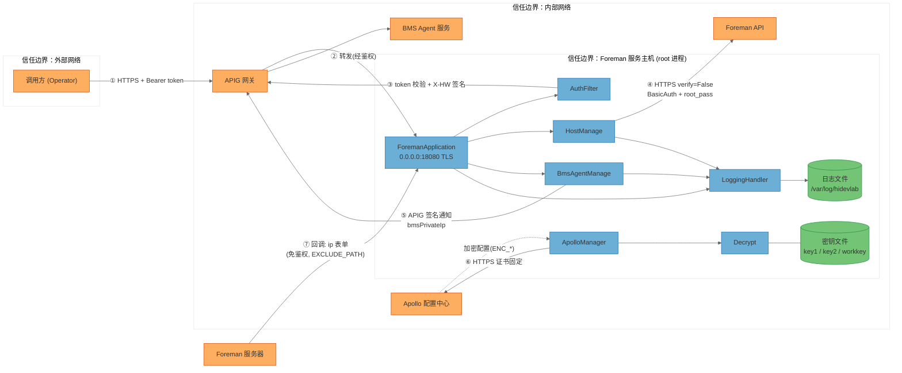
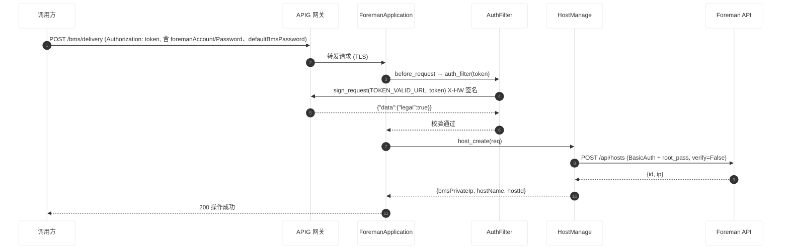
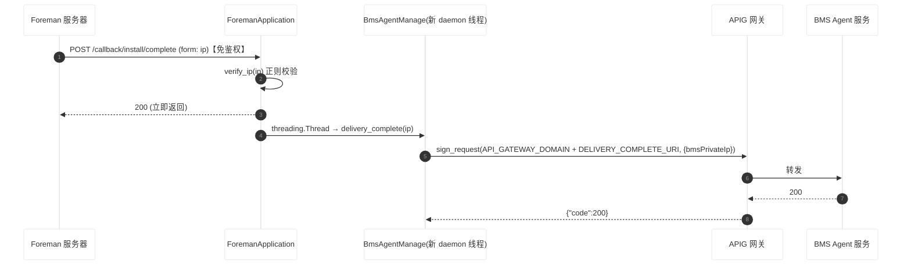
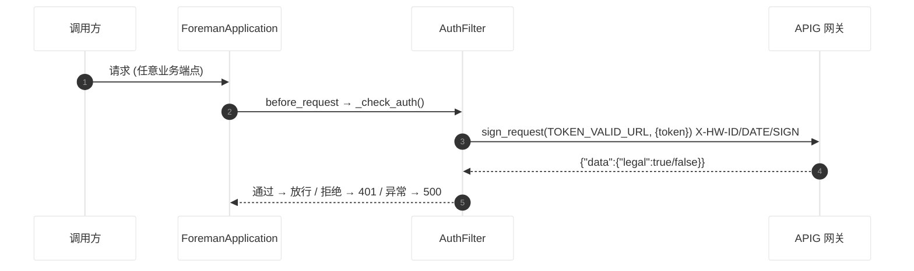

# HiDevLab Foreman 代理服务安全分析报告（STRIDE-A 威胁建模）

> 分析对象：hidevlab-foreman-service（华为 HiDevLab 平台 Foreman 代理服务）
> 分析方法：STRIDE-A（STRIDE + Abuse）威胁建模 + 零信任原则 + 纵深防御分析
> 报告语言：简体中文

---

## 0. 报告元数据

| 项目 | 值 |
|------|-----|
| 分析模型 | GLM-5.3（Trae 代理） |
| 仓库 | https://gitcode.com/openlibing/hidevlab-foreman-service.git |
| 分支 / 提交 | master / df916d6（提交时间 2026-08-25 16:04:17 +0800） |
| 分析开始 | 2026-08-27 12:03:08 UTC |
| 分析完成 | 2026-08-27 12:11:00 UTC |
| 部署分类 | INTERNAL_SERVICE（内网服务，经 APIG 网关对外暴露） |
| 源文件数 | ~15（小型仓库） |
| 威胁总数 | 25（开放 18 / 已缓解 7 / Tier 1：0、Tier 2：16、Tier 3：9） |
| 发现总数 | 12（Tier 2：6、Tier 3：6） |

---

## 1. 执行摘要

本服务是 HiDevLab 平台的 BMS 裸金属服务器交付代理：对外经 APIG 网关提供 BMS 交付 / 删除接口，对内调用 Foreman API 创建、删除主机，并在 Foreman 装机完成后回调通知 BMS Agent 服务。服务以 Flask + Gunicorn（sync worker）部署，自带 TLS，配置统一走 Apollo 配置中心，密钥采用"双密钥异或 + PBKDF2 + AES-GCM"解密方案，日志为 JSON 结构化并做了脱敏处理。

**整体评价：** 该项目在输入校验（IP 正则、hostId 白名单防 SSRF）、日志注入防护（`sanitize_for_log`）、敏感字段脱敏（`redact_sensitive` / `mask`）、随机主机名（`secrets` 模块）、AES-GCM 加密、CI 侧 CodeQL + gitleaks 等方面有良好的安全意识，基础控制相当完善。主要风险集中在三个方向：

1. **信任边界执行不彻底**——装机完成回调端点默认免鉴权（`EXCLUDE_PATH` 默认排除），任何能触达该端口（`0.0.0.0:18080`）的内网主体都可以伪造"装机完成"事件，驱动 BMS Agent 对任意 IP 执行后续动作（FIND-01）。
2. **出站连接的传输安全缺口**——与 Foreman 的全部交互关闭了证书校验（`verify=False`），Basic Auth 凭据与 BMS root 密码在同一信道明文编码传输，存在中间人窃取风险（FIND-02）。
3. **资源治理与可审计性不足**——无速率限制、无请求体大小限制、回调每请求新建无上限线程、认证异常未捕获，组合起来构成较完整的拒绝服务链（FIND-04、FIND-05）；同时鉴权失败无日志、后台线程异常静默丢失，形成审计盲区（FIND-10）。

> **Note on threat counts:** 本次分析共识别 25 项威胁（Tier 1：0；Tier 2：16；Tier 3：9）。其中 7 项已有代码级缓解措施（标记 Mitigated），18 项开放威胁全部映射到 12 项发现（FIND-01 至 FIND-12），无已接受风险。由于部署分类为 INTERNAL_SERVICE 且未发现公网直接暴露证据，无 Tier 1（无前提、未认证外部攻击者可直接利用）发现；若 18080 端口实际可从公网访问，FIND-01 / FIND-04 将升级为 Tier 1，需立即复核网络边界（见 §1.1 待验证项）。

---

## 1.1 分析上下文与假设

### 分析范围

- 全部 Python 源码：`foreman.py`、`gunicorn_config.py`、`base/`（apollo_manager、auth_filter、common、config、decrypt、logging_handler）、`service/`（host_manage、bms_agent_manage）、`utils/`（log_sanitizer、mask_string、random_string、regex_util）
- 部署工件：`foreman-agent.service`（systemd，User=root）、`requirements.txt`
- CI/CD：`.gitcode/workflows/codeql.yaml`、`.pre-commit-config.yaml`（gitleaks 敏感信息扫描）
- 排除：`spec/`（历史规格文档）、`.git`

### 分析假设

1. 服务部署于内网，`0.0.0.0:18080` 不直接暴露公网；外部流量统一经 APIG 网关进入（依据：`config.py` 中 `API_GATEWAY_DOMAIN` / `TOKEN_VALID_URL` / `REFERER` 等 APIG 相关配置）。
2. APIG 网关侧对 `X-HW-DATE` 时间戳做时效校验（签名无 nonce，防重放依赖网关行为）。
3. Apollo 配置中心、APIG 网关、Foreman、BMS Agent 服务自身的安全性不在本次范围内，仅分析本服务与其交互的信任边界。
4. 密钥文件（`AES_KEY1_PATH` / `AES_KEY2_PATH` / `WORK_KEY_PATH`）由部署流程下发，主机文件权限由部署方保障。

### 待验证项（Needs Verification）

| 编号 | 待验证内容 | 潜在影响 |
|------|-----------|---------|
| NV-01 | 18080 端口是否可从公网 / 非信任网段直接访问 | 若可，FIND-01、FIND-04 升级为 Tier 1 |
| NV-02 | APIG 是否校验 `X-HW-DATE` 时间窗，拒绝过期签名 | 若否，存在令牌校验 / 签名请求重放窗口（T08） |
| NV-03 | Foreman 内网域名是否为 HTTPS（`FOREMAN_INNER_NET_DOMAIN` 值未在仓库内） | 若为 HTTP，FIND-02 直接成立且无需中间人位置假设 |
| NV-04 | Apollo `app_id` 命名空间实际配置值（`ENABLE_AUTH` 当前是否为 true） | 直接决定鉴权面是否生效 |

### 已识别的缓解控制（安全基础设施盘点）

| 类别 | 控制 | 证据 |
|------|------|------|
| 传输加密（入站） | 服务自带 TLS（证书经 Apollo 加密下发，解密后加载，`when_ready` 删除临时文件） | `foreman.py` / `gunicorn_config.py` |
| 传输加密（出站-Apollo） | 证书固定（verify 指向 `/home/apollo/https/apollo.pem`） | `apollo_manager.py` |
| 认证 | APIG 令牌校验（`before_request` 全局拦截，`ENABLE_AUTH` 默认 true） | `foreman.py` `_check_auth` |
| 出站认证 | APIG 侧 X-HW-ID / X-HW-APPKEY SHA-256 签名 | `auth_filter.py` `sign_request` |
| 输入校验 | IP 正则校验、hostId 字符白名单（注释明确防 SSRF）、必填字段检查 | `regex_util.py` / `host_manage.py` |
| 日志安全 | 日志注入转义（`sanitize_for_log`）、敏感键递归脱敏（`redact_sensitive`）、账号掩码（`mask`）、operator SHA-256 哈希 | `utils/` / `logging_handler.py` |
| 加密 | AES-256-GCM + PBKDF2(100k) 派生根密钥，双密钥异或托管 | `decrypt.py` |
| 供应链（部分） | CodeQL 静态分析、gitleaks 密钥扫描、ruff 格式化 | `.gitcode/` / `.pre-commit-config.yaml` |

---

## 2. 系统架构

### 2.1 架构概述

```
调用方(Portal/APIG客户端)
      │ HTTPS + Authorization token
      ▼
  APIG 网关 ──(令牌校验回调)──▶ 本服务 AuthFilter
      │ HTTPS(自签TLS, 0.0.0.0:18080)
      ▼
ForemanApplication (Flask/Gunicorn, 8×sync worker, root)
      ├─▶ HostManage ──HTTPS(verify=False, BasicAuth)──▶ Foreman API
      ├─▶ BmsAgentManage ──APIG签名──▶ APIG ──▶ BMS Agent 服务
      ├─▶ ApolloManager ──HTTPS(证书固定)──▶ Apollo 配置中心
      ├─▶ Decrypt(读密钥文件: key1/key2/workkey)
      └─▶ LoggingHandler ──▶ /var/log/hidevlab/foreman-{region}.*.json

Foreman 服务器 ──HTTPS 回调(免鉴权, EXCLUDE_PATH)──▶ ForemanApplication
```

### 2.2 组件清单（含代码锚点）

| 组件 ID | 类型 | 代码锚点 | 职责 |
|---------|------|---------|------|
| ForemanApplication | 进程（HTTP 监听） | `foreman.py` | Flask 入口：3 个业务端点 + 健康检查 + 全局 `before_request` 鉴权 |
| AuthFilter | 进程内模块（出站） | `base/auth_filter.py` | 调 APIG 校验令牌；构造 X-HW APIG 签名请求 |
| HostManage | 进程内模块（出站） | `service/host_manage.py` | 调 Foreman API 创建 / 删除主机（BasicAuth，verify=False） |
| BmsAgentManage | 进程内模块（出站） | `service/bms_agent_manage.py` | 装机完成后经 APIG 签名通知 BMS Agent |
| ApolloManager | 进程内模块（出站） | `base/apollo_manager.py` + `base/config.py` | Apollo 配置加载（证书固定），进程启动时读取全部配置 |
| Decrypt | 进程内模块 | `base/decrypt.py` | 双密钥异或 → PBKDF2 → 解密工作密钥 → AES-GCM 解密配置密文 |
| LoggingHandler | 进程内模块 | `base/logging_handler.py` | JSON 结构化日志、按日轮转、operator 哈希脱敏 |
| Foreman | 外部系统 | 集成点：`FOREMAN_INNER_NET_DOMAIN`（config.py） | 裸金属主机管理（创建/删除），装机完成后回调本服务 |
| APIG | 外部系统 | 集成点：`API_GATEWAY_DOMAIN` / `TOKEN_VALID_URL`（config.py） | 网关：令牌校验、签名验证 |
| BmsAgentService | 外部系统 | 集成点：`DELIVERY_COMPLETE_URI`（config.py） | 装机完成后续处理 |
| ApolloConfigCenter | 外部系统 | 集成点：`/home/apollo/apollo_config_foreman.yaml` | 配置中心 |
| Operator | 外部角色 | — | 调用方（Portal 用户 / APIG 客户端） |
| ForemanServer | 外部角色 | — | 回调调用方（Foreman 服务器进程） |

### 2.3 部署分类与组件暴露表

**部署分类：INTERNAL_SERVICE**（依据：`SERVICE_HOST` 默认 `0.0.0.0`、`SERVICE_PORT` 默认 18080，配置与代码中存在 APIG 网关前置证据，未发现公网直暴露证据）。

| 组件 | 监听地址 | 鉴权屏障 | 外部可达性 | 最低攻击前提 |
|------|---------|---------|-----------|-------------|
| ForemanApplication（业务端点） | 0.0.0.0:18080（TLS） | APIG 令牌校验（可配置） | 经 APIG 对外可达 / 内网直连 | Internal Network |
| ForemanApplication（回调端点，默认 EXCLUDE_PATH） | 同上 | **无**（EXCLUDE_PATH 默认排除） | 内网直连 | Internal Network |
| ForemanApplication（/health） | 同上 | APIG 令牌校验 | 同上 | Internal Network |
| AuthFilter | 无监听（出站） | — | — | Host/OS Access |
| HostManage | 无监听（出站） | — | — | Host/OS Access |
| BmsAgentManage | 无监听（出站） | — | — | Host/OS Access |
| ApolloManager | 无监听（出站） | — | — | Host/OS Access |
| Decrypt / LoggingHandler | 无监听 | — | — | Host/OS Access |

> 本表是威胁前提的"唯一事实来源"：任何威胁 / 发现的攻击前提不得低于对应组件在此表中允许的最低前提。

### 2.4 数据流图（DFD）



### 2.5 关键场景时序图

**场景 1：BMS 交付（创建主机）**



**场景 2：装机完成回调（异步通知 BMS Agent）**



**场景 3：请求认证（全局鉴权）**



---

## 3. STRIDE-A 威胁分析

### 3.1 威胁汇总表

> 分类含义：S 伪装（Spoofing）、T 篡改（Tampering）、R 抵赖（Repudiation）、I 信息泄露（Information Disclosure）、D 拒绝服务（Denial of Service）、E 权限提升（Elevation of Privilege）、A 滥用（Abuse，业务逻辑 / 流程操纵）。

| 组件 | S | T | R | I | D | E | A | Tier 1 | Tier 2 | Tier 3 | 状态汇总 |
|------|---|---|---|---|---|---|---|--------|--------|--------|---------|
| ForemanApplication | T01 | T02 | T03 | T04 | T05 | T06 | T07 | 0 | 7 | 0 | 开放 6 / 缓解 1 |
| AuthFilter | T08 | — | — | T10 | T09 | — | — | 0 | 1 | 2 | 开放 2 / 缓解 1 |
| HostManage | — | T12 | T13 | T11 | T15 | — | T14 | 0 | 5 | 0 | 开放 4 / 缓解 1 |
| BmsAgentManage | T17 | — | T16 | — | T18 | — | — | 0 | 1 | 2 | 开放 2 / 缓解 1 |
| ApolloManager | — | T19 | — | — | — | — | — | 0 | 0 | 2 | 开放 1 / 缓解 1 |
| Decrypt | — | T21 | — | T22 | — | — | — | 0 | 0 | 2 | 开放 2 |
| LoggingHandler | — | T24 | — | T23, T25 | — | — | — | 0 | 2 | 1 | 开放 1 / 缓解 2 |
| **合计** | 3 | 3 | 3 | 4 | 4 | 1 | 2 | **0** | **16** | **9** | **开放 18 / 缓解 7** |

### 3.2 ForemanApplication（foreman.py）

#### Tier 2

| ID | 类别 | 威胁 | 前提 | 状态 | 映射 |
|----|------|------|------|------|------|
| T01 | S | 伪装回调调用方：`/callback/install/complete` 在 `EXCLUDE_PATH` 默认排除清单中，端点免鉴权且无法验证请求确实来自 Foreman 服务器，任何内网主体可伪造回调 | Internal Network | 开放 | [FIND-01](#4-安全发现按可利用性分层) |
| T07 | A | 业务流程操纵：伪造任意合法 IP 的"装机完成"事件，驱动 BMS Agent 对非目标主机执行装机后续动作（业务状态被污染） | Internal Network | 开放 | FIND-01 |
| T06 | E | 鉴权旁路面：`ENABLE_AUTH` 为 Apollo 可配置布尔开关；`EXCLUDE_PATH` 可任意追加排除路径。配置错误或恶意变更可整体关闭认证 | Privileged User | 开放 | FIND-03 |
| T04 | I | 请求体大小无限制（Flask 默认 `MAX_CONTENT_LENGTH=None`），大 JSON 可造成内存放大 | Internal Network | 开放 | FIND-04 |
| T05 | D | 回调端点每个请求 `threading.Thread` 新建无上限 daemon 线程，可无成本打满线程/内存 | Internal Network | 开放 | FIND-04 |
| T03 | R | 鉴权失败（401）与被 `EXCLUDE_PATH` 排除的请求完全不落审计日志，无法事后追溯谁在何时探测/攻击端点 | Internal Network | 开放 | FIND-10 |
| T02 | T | 请求字段（mac、各 foreman*Id、defaultBmsPassword 等）仅做非空检查，未做类型/格式白名单即转发 Foreman | Authenticated User | 已缓解 | — |

> T02 缓解说明：所有字段经 JSON 结构化序列化转发（`requests.post(json=...)`），无字符串拼接注入面；数值 ID 由 Foreman 服务端校验；hostId 已有正则白名单（`_HOST_ID_PATTERN`，注释明确防 SSRF）。

### 3.3 AuthFilter（base/auth_filter.py）

#### Tier 2

| ID | 类别 | 威胁 | 前提 | 状态 | 映射 |
|----|------|------|------|------|------|
| T09 | D | 认证依赖无容错：`auth_filter()` 对 `.json()`、`result["data"]["legal"]` 无异常处理，令牌校验服务异常/慢响应时 `before_request` 抛异常 → 全站 500（级联故障）；且每个请求串行调用一次外部服务，无缓存 | Internal Network | 开放 | FIND-05 |

#### Tier 3

| ID | 类别 | 威胁 | 前提 | 状态 | 映射 |
|----|------|------|------|------|------|
| T08 | S | APIG 签名无 nonce，仅含 `X-HW-DATE` 时间戳，捕获报文后时间窗内可重放 | Internal Network + 报文捕获 | 已缓解（待验证 NV-02） | — |
| T10 | I | `X_HW_APPKEY` 在模块导入时解密并常驻进程内存，进程内存转储可提取 | Host/OS Access | 开放 | FIND-09 |

### 3.4 HostManage（service/host_manage.py）

#### Tier 2

| ID | 类别 | 威胁 | 前提 | 状态 | 映射 |
|----|------|------|------|------|------|
| T11 | I | 出站 MITM 窃取凭据：对 Foreman 全部请求 `verify=False` 关闭证书校验，`HTTPBasicAuth(foremanAccount, foremanPassword)` 与 `root_pass`（defaultBmsPassword）在同一信道传输，内网中间人可直接截获 Foreman 管理凭据与 BMS root 密码 | Internal Network（MITM 位置） | 开放 | FIND-02 |
| T15 | D | 重试风暴阻塞 worker：创建/删除最多 3 次尝试 × 120s 超时 = 最长 360s，超过 Gunicorn `timeout=120`，worker 被 kill；sync worker 池（8 个）可被少量慢请求耗尽 | Authenticated User | 开放 | FIND-04 |
| T14 | A | 重复交付无幂等控制：`create` 每次生成随机 hostName，同一台 BMS 的重复请求会创建多台 Foreman 主机记录，业务状态漂移 | Authenticated User | 开放 | FIND-06 |
| T13 | R | 删除失败仅记录 info 级日志且消息为"success"字样（`delete host success` 在非 404 分支也输出），失败语义混淆，审计不可靠 | Authenticated User | 开放 | FIND-10 |
| T12 | T | hostId 注入 / SSRF：hostId 拼入 Foreman URL 路径 | Authenticated User | 已缓解 | — |

> T12 缓解说明：`_HOST_ID_PATTERN = ^[a-zA-Z0-9_\-\.]+$` 白名单（host_manage.py），代码注释明确以 SSRF 防护为目的。

### 3.5 BmsAgentManage（service/bms_agent_manage.py）

#### Tier 2

| ID | 类别 | 威胁 | 前提 | 状态 | 映射 |
|----|------|------|------|------|------|
| T18 | D | `delivery_complete` 在无上限 daemon 线程中最多 3 次重试 + sleep，回调洪泛时线程与出站连接同步放大 | Internal Network | 开放 | FIND-04 |

#### Tier 3

| ID | 类别 | 威胁 | 前提 | 状态 | 映射 |
|----|------|------|------|------|------|
| T16 | R | daemon 线程内 `BusinessException` 被线程默认行为吞掉（仅最终 attempt 有 LOG.error），通知失败可能无审计痕迹 | Host/OS Access | 开放 | FIND-10 |
| T17 | S | 伪造"通知 BMS Agent"的请求来源 | ForemanApplication Compromise | 已缓解（APIG X-HW 签名） | — |

### 3.6 ApolloManager（base/apollo_manager.py / base/config.py）

#### Tier 3

| ID | 类别 | 威胁 | 前提 | 状态 | 映射 |
|----|------|------|------|------|------|
| T19 | T | 配置平面篡改：能改 Apollo 配置即控制服务信任边界——`FOREMAN_INNER_NET_DOMAIN` 可指向凭据收集服务器（配合 T11，凭据被直接外发）、`ENABLE_AUTH=false` 关闭鉴权、`EXCLUDE_PATH` 扩大免鉴权面 | Admin Credentials（Apollo 控制台） | 开放 | FIND-03 |
| T20 | S | 伪造 Apollo 配置中心 | Host/OS Access | 已缓解（证书固定：verify 指向 apollo.pem） | — |

### 3.7 Decrypt（base/decrypt.py）

#### Tier 3

| ID | 类别 | 威胁 | 前提 | 状态 | 映射 |
|----|------|------|------|------|------|
| T21 | T | 解密失败静默回退：`decrypt()` 捕获所有异常后**原样返回密文**，密文被当作明文使用（如 SSL 证书内容、X_HW_APPKEY），故障被掩盖且行为不可预期 | Privileged User（触发条件）/ 配置错误 | 开放 | FIND-08 |
| T22 | I | 密钥文件常驻磁盘（key1/key2/workkey，无轮换机制），服务以 root 运行，任何 root 级进程可读取并离线推导工作密钥 | Host/OS Access | 开放 | FIND-09 |

### 3.8 LoggingHandler（base/logging_handler.py）

#### Tier 2

| ID | 类别 | 威胁 | 前提 | 状态 | 映射 |
|----|------|------|------|------|------|
| T25 | I | 敏感字段（root_pass、密码、账号、token）写入日志 | Authenticated User | 已缓解（`redact_sensitive` 递归脱敏 + `mask` 掩码） | — |
| T24 | T | CRLF 日志注入伪造日志行 | Authenticated User | 已缓解（`sanitize_for_log` 应用于 ip / referer / hostId） | — |

> T24 部分残留：异常文本（如 `create host fail: {e}`）未过滤即入日志，`utils/log_sanitizer.py` 文档自述"尚未在所有路径应用"。缓解评级保留，残留面并入 FIND-10。

#### Tier 3

| ID | 类别 | 威胁 | 前提 | 状态 | 映射 |
|----|------|------|------|------|------|
| T23 | I | operator 脱敏使用硬编码盐 `hidevlab_log_salt_2024` + SHA-256(IP)，IPv4 空间小，可离线彩虹表批量还原源 IP，"脱敏"保护弱于预期 | Host/OS Access（读日志） | 开放 | FIND-11 |

---

## 4. 安全发现（按可利用性分层）

> 分层规则：Tier 1 = 无前提、未认证外部攻击者可直接利用；Tier 2 = 需单一前提（内网位置 / 已认证用户 / 特权用户）；Tier 3 = 需主机/OS 权限、管理员凭据或多重前提。
> 本服务部署分类为 INTERNAL_SERVICE，经证据核查无 Tier 1 发现。

### Tier 2 — 有条件风险（需内网位置或已认证身份）

#### FIND-01 装机完成回调端点免鉴权，可伪造任意 IP 的"装机完成"事件

- **可利用性层级：** Tier 2　|　**前提：** Internal Network　|　**修复成本：** Medium
- **CVSS 4.0：** 7.3（高）　`CVSS:4.0/AV:A/AC:L/AT:N/PR:N/UI:N/VC:N/VI:H/VA:L/SC:L/SI:L/SA:N`
- **CWE：** [CWE-306](https://cwe.mitre.org/data/definitions/306.html)（关键功能缺失认证）
- **OWASP：** A01:2025 – Broken Access Control
- **证据：** `foreman.py` `EXCLUDE_PATH` 默认值 `/hidevlabforemanagent/v1/foreman/callback/install/complete`；`_check_auth()` 对排除路径直接放行；端点仅校验 IP 格式（`verify_ip`）后即触发 `delivery_complete`。关联威胁 T01·S、T07·A。
- **影响：** 内网任意主体可对任意合法 IP 伪造装机完成通知 → BMS Agent 对错误主机执行后续流程，业务状态被污染，可能中断真实交付流程（完整性 + 后续系统可用性影响）。
- **修复建议：**
  1. 为回调端点增加来源验证：共享密钥 / HMAC 签名（Foreman 回调时携带），或限定防火墙/安全组仅允许 Foreman 服务器 IP 访问该端口；
  2. 至少校验 `X-Forwarded-For` / `remote_addr` 是否为 Foreman 服务器地址；
  3. 回调与业务端点分端口部署，业务端口只经 APIG 暴露。

#### FIND-02 与 Foreman 的全部交互关闭 TLS 证书校验，凭据与 root 密码可被中间人窃取

- **可利用性层级：** Tier 2　|　**前提：** Internal Network（MITM 位置）　|　**修复成本：** Low
- **CVSS 4.0：** 6.6（中）　`CVSS:4.0/AV:A/AC:H/AT:N/PR:N/UI:N/VC:H/VI:H/VA:N/SC:L/SI:L/SA:N`
- **CWE：** [CWE-295](https://cwe.mitre.org/data/definitions/295.html)（不当证书校验）
- **OWASP：** A04:2025 – Cryptographic Failures
- **证据：** `host_manage.py` 创建与删除请求均为 `requests.post/delete(..., auth=HTTPBasicAuth(foremanAccount, foremanPassword), verify=False, timeout=120)`；`foreman.py` / `apollo_manager.py` 两处 `urllib3.disable_warnings(InsecureRequestWarning)` 压制告警；`root_pass`（defaultBmsPassword）随创建请求体明文发送。关联威胁 T11·I。
- **影响：** 处于内网路径的攻击者可截获 Foreman 管理凭据（Basic Auth 为 Base64 明文等价）与 BMS root 密码，直接获得 Foreman 控制权与新装主机的 root 权限。
- **修复建议：**
  1. 将 `verify=False` 改为证书校验（自签证书可用 CA bundle 固定，参考 Apollo 的做法：verify 指向 pem 文件）；
  2. 移除 `urllib3.disable_warnings`，恢复告警可见性；
  3. `FOREMAN_INNER_NET_DOMAIN` 确认为 HTTPS（待验证 NV-03）。

#### FIND-03 鉴权开关与信任路径集中于 Apollo 配置平面，配置面即攻击面

- **可利用性层级：** Tier 2　|　**前提：** Privileged User（Apollo 配置管理权限）　|　**修复成本：** Medium
- **CVSS 4.0：** 5.8（中）　`CVSS:4.0/AV:A/AC:L/AT:N/PR:H/UI:N/VC:H/VI:H/VA:N/SC:N/SI:N/SA:N`
- **CWE：** [CWE-284](https://cwe.mitre.org/data/definitions/284.html)（不当访问控制）
- **OWASP：** A02:2025 – Security Misconfiguration
- **证据：** `config.py`：`ENABLE_AUTH`（Apollo 布尔配置，进程启动时加载）、`EXCLUDE_PATH`（可任意扩展免鉴权路径）、`FOREMAN_INNER_NET_DOMAIN`（出站目标可控）。关联威胁 T06·E、T19·T。
- **影响：** Apollo 配置被篡改（凭据泄露 / 控制台失陷 / 误操作）即可：关闭全部鉴权、扩大免鉴权面、或将 Foreman 凭据外发至攻击者控制的域名。配置变更缺少防护（无变更审计联动、无启动时配置合法性校验）。
- **修复建议：**
  1. `ENABLE_AUTH` 增加编译期/环境级保护（如生产环境禁止 false 值，启动时校验并告警）；
  2. `EXCLUDE_PATH` 改为代码内常量或启动时严格白名单校验，禁止运行时任意追加；
  3. 对 `FOREMAN_INNER_NET_DOMAIN` 等出站域名做启动时域名校验 / IP 段限制；
  4. Apollo 命名空间启用变更审计与访问控制（最小权限）。

#### FIND-04 无速率限制、无请求体大小限制、回调线程无上限，sync worker 易被资源耗尽

- **可利用性层级：** Tier 2　|　**前提：** Internal Network　|　**修复成本：** Medium
- **CVSS 4.0：** 6.9（中）　`CVSS:4.0/AV:A/AC:L/AT:N/PR:N/UI:N/VC:N/VI:N/VA:H/SC:N/SI:N/SA:N`
- **CWE：** [CWE-770](https://cwe.mitre.org/data/definitions/770.html)（无限制或无节流的资源分配）
- **OWASP：** A06:2025 – Insecure Design
- **证据：** 回调端点 `threading.Thread(target=delivery_complete, args=(ip,), daemon=True).start()` 每请求一线程，无队列无上限；全服务无任何速率限制中间件；Flask 未设置 `MAX_CONTENT_LENGTH`；`host_manage.py` 3 次重试 × 120s 超时与 Gunicorn `timeout=120` 冲突；`gunicorn_config.py` 固定 8 个 sync worker。关联威胁 T04·I、T05·D、T15·D、T18·D。
- **影响：** 内网攻击者可用极低成本（无需凭据）打满线程 / worker / 内存，使服务完全不可用；回调洪泛还会同步放大对 APIG 的出站请求量。
- **修复建议：**
  1. 异步任务改用有界线程池 / 任务队列（如 `concurrent.futures.ThreadPoolExecutor(max_workers=N)`）；
  2. 增加 IP 级速率限制（如 Flask-Limiter，对回调端点从严）；
  3. 设置 `MAX_CONTENT_LENGTH`（如 64KB）；
  4. 调整重试/超时预算使其小于 Gunicorn timeout，或将 Foreman 调用改异步。

#### FIND-05 认证外部调用无容错与缓存，令牌校验服务异常导致全站 500（级联故障）

- **可利用性层级：** Tier 2　|　**前提：** Internal Network（或认证服务自身故障）　|　**修复成本：** Low
- **CVSS 4.0：** 5.4（中）　`CVSS:4.0/AV:A/AC:H/AT:N/PR:N/UI:N/VC:N/VI:N/VA:H/SC:N/SI:N/SA:N`
- **CWE：** [CWE-755](https://cwe.mitre.org/data/definitions/755.html)（异常条件处理不当）
- **OWASP：** A10:2025 – Mishandling of Exceptional Conditions
- **证据：** `auth_filter.py` `auth_filter()`：`result = sign_request(...).json()`、`result["data"]["legal"]` 均无异常处理与超时控制（`requests.post` 未显式传 timeout，走全局默认）；`foreman.py` `before_request` 调用处亦无 try/except。关联威胁 T09·D。
- **影响：** 令牌校验服务返回非 JSON / 结构异常 / 慢响应时，所有请求（包括健康端点）抛 500，服务整体不可用；虽然行为属于"故障关闭"（fail-closed），但缺乏优雅降级与可观测性。
- **修复建议：**
  1. `auth_filter()` 增加 try/except + 显式超时，异常时按"认证失败"（401）处理并记录 error 日志；
  2. 考虑令牌校验结果短 TTL 缓存，降低认证服务压力；
  3. `/health` 纳入 `EXCLUDE_PATH`，保证探活不依赖外部认证。

#### FIND-06 交付接口无幂等控制，重复请求产生多台 Foreman 主机

- **可利用性层级：** Tier 2　|　**前提：** Authenticated User　|　**修复成本：** Medium
- **CVSS 4.0：** 3.1（低）　`CVSS:4.0/AV:A/AC:L/AT:N/PR:L/UI:N/VC:N/VI:L/VA:N/SC:N/SI:N/SA:N`
- **CWE：** [CWE-837](https://cwe.mitre.org/data/definitions/837.html)（未正确强制唯一执行点）
- **OWASP：** A06:2025 – Insecure Design
- **证据：** `host_manage.py` `create()`：`host_name = "hostname-" + get_random_string(5)`，无基于 mac / 业务键的去重；重复提交同一 mac 的交付请求将创建多条 Foreman 主机记录。关联威胁 T14·A。
- **影响：** 已认证调用方（或被重放的请求）重复触发交付，造成 Foreman 主机记录 / PXE 资源泄漏与业务状态漂移。
- **修复建议：** 以 mac 或调用方提供的业务幂等键做去重（先查询 Foreman 是否已存在同 mac 主机，存在则返回已有结果）。

### Tier 3 — 纵深防御（需主机/OS 权限或管理员凭据）

#### FIND-07 服务以 root 运行（systemd User=root）

- **可利用性层级：** Tier 3　|　**前提：** Host/OS Access　|　**修复成本：** Low
- **CVSS 4.0：** 6.0（中）　`CVSS:4.0/AV:L/AC:H/AT:N/PR:H/UI:N/VC:H/VI:H/VA:H/SC:L/SI:L/SA:L`
- **CWE：** [CWE-250](https://cwe.mitre.org/data/definitions/250.html)（以非必要特权运行）
- **OWASP：** A02:2025 – Security Misconfiguration
- **证据：** `foreman-agent.service`：`User=root`；服务需写 `/var/log/hidevlab`、读密钥文件，均可用专用低权账号 + 目录授权实现。
- **影响：** 任何应用层漏洞（如 FIND-04 触发的资源类缺陷、依赖漏洞）被利用后的横向影响被放大到整个主机；违反最小权限原则。
- **修复建议：** 创建专用服务用户，授权日志目录与密钥文件（0400、属主只读）；配合 systemd 加固项（`ProtectSystem=strict`、`NoNewPrivileges=true` 等）。

#### FIND-08 解密失败静默返回密文，故障被掩盖且密文被当明文使用

- **可利用性层级：** Tier 3　|　**前提：** Privileged User（可触发的配置错误）/ 运维异常　|　**修复成本：** Low
- **CVSS 4.0：** 3.6（低）　`CVSS:4.0/AV:A/AC:L/AT:P/PR:L/UI:N/VC:L/VI:L/VA:L/SC:N/SI:N/SA:N`
- **CWE：** [CWE-703](https://cwe.mitre.org/data/definitions/703.html)（异常条件检查或处理不当）
- **OWASP：** A08:2025 – Software and Data Integrity Failures
- **证据：** `decrypt.py` `decrypt()`：`except Exception as ex: return ciphertext`——解密失败时把密文原样返回给调用方（用于 SSL 证书内容、X_HW_APPKEY 等），且无任何日志。关联威胁 T21·T。
- **影响：** 密钥/配置错误时服务以不可预期状态启动（如以密文字符串当证书内容），故障根因被掩盖，排障困难；也构成"以异常输入静默降级"的反模式。
- **修复建议：** 解密失败应抛出异常并终止启动（fail-fast），至少记录 error 日志；删除静默回退分支。

#### FIND-09 密钥文件常驻磁盘无轮换，敏感密钥常驻进程内存

- **可利用性层级：** Tier 3　|　**前提：** Host/OS Access　|　**修复成本：** Medium
- **CVSS 4.0：** 3.9（低）　`CVSS:4.0/AV:L/AC:H/AT:N/PR:H/UI:N/VC:H/VI:L/VA:N/SC:N/SI:N/SA:N`
- **CWE：** [CWE-320](https://cwe.mitre.org/data/definitions/320.html)（密钥管理错误）
- **OWASP：** A04:2025 – Cryptographic Failures
- **证据：** `decrypt.py`：key1/key2/workkey 从 `AES_KEY1_PATH` 等文件常驻读取；异或+PBKDF2 派生后工作密钥无轮换机制；`auth_filter.py`：`X_HW_APPKEY = decrypt(ENC_X_HW_APPKEY)` 模块级常驻内存。另：`gunicorn_config.py` 临时证书文件 `delete=False` 写入磁盘，`when_ready` 后删除（窗口小、tempfile 权限 0600，风险低但存在 unlink 失败残留可能）。关联威胁 T10·I、T22·I。
- **影响：** 主机失陷后可离线恢复工作密钥并解密全部 ENC_* 配置（含 SSL 私钥、APIG APPKEY）；密钥长期不轮换放大暴露窗口。
- **修复建议：** 密钥文件权限最小化（0400 + 专用属主，配合 FIND-07）；建立轮换流程（Apollo 侧更新 ENC_ 值 + 新 workkey）；考虑内存中用后清零（效果有限，优先轮换）。

#### FIND-10 审计日志缺口：鉴权失败无记录、后台线程异常静默、部分异常文本未过滤

- **可利用性层级：** Tier 3　|　**前提：** Internal Network（触发）/ Host/OS Access（利用）　|　**修复成本：** Low
- **CVSS 4.0：** 3.3（低）　`CVSS:4.0/AV:A/AC:L/AT:N/PR:N/UI:N/VC:L/VI:N/VA:N/SC:N/SI:N/SA:N`
- **CWE：** [CWE-778](https://cwe.mitre.org/data/definitions/778.html)（审计日志不足）
- **OWASP：** A09:2025 – Security Logging and Alerting Failures
- **证据：** `foreman.py` `_check_auth` 返回 False 时仅回 401，无任何日志；`bms_agent_manage.py` `delivery_complete` 在 daemon 线程中 raise 的 BusinessException 被线程吞掉（仅最终 attempt 有 LOG.error）；`host_manage.py` `delete()` 非 404 分支日志文案统一为 "delete host success"（失败语义混淆）；`LOG.info(f"create host fail: {e}")` 异常文本未经 `sanitize_for_log` 过滤。关联威胁 T03·R、T13·R、T16·R、T24 残留。
- **影响：** 攻击者可无痕迹地探测端点、伪造回调（配合 FIND-01）与触发通知失败，事后无法取证；日志内容可能被异常文本中的控制字符污染。
- **修复建议：** 鉴权失败记录 warning 日志（含 request_id 与源 IP 哈希）；线程内异常统一捕获并 error 记录；`delete` 按状态码区分 success/failed 文案；异常文本入日志前过 `sanitize_for_log`。

#### FIND-11 日志 operator 脱敏使用硬编码盐值，源 IP 可被离线还原

- **可利用性层级：** Tier 3　|　**前提：** Host/OS Access（获取日志文件）　|　**修复成本：** Low
- **CVSS 4.0：** 2.5（低）　`CVSS:4.0/AV:A/AC:H/AT:N/PR:L/UI:N/VC:L/VI:N/VA:N/SC:N/SI:N/SA:N`
- **CWE：** [CWE-327](https://cwe.mitre.org/data/definitions/327.html)（使用有风险或破解的密码学算法）
- **OWASP：** A04:2025 – Cryptographic Failures
- **证据：** `logging_handler.py` `get_operator()`：`salt = "hidevlab_log_salt_2024"` 硬编码于源码，`SHA256(salt + remote_addr)[:16]`。IPv4 仅约 43 亿个取值，离线枚举即可批量反查。关联威胁 T23·I。
- **影响：** 拿到日志的内部人员可还原全部历史访问源 IP，脱敏承诺失效（合规/隐私风险）。
- **修复建议：** 盐值改由部署环境注入（Apollo / 环境变量），每环境独立且不入库；或改用带密钥的 HMAC（密钥不入日志系统）；如需可关联性，可用 request_id 替代。

#### FIND-12 依赖版本未锁定（无上界、无 lockfile）

- **可利用性层级：** Tier 3　|　**前提：** 构建环境 / 上游依赖被投毒　|　**修复成本：** Low
- **CVSS 4.0：** 5.9（中）　`CVSS:4.0/AV:N/AC:H/AT:N/PR:N/UI:N/VC:H/VI:H/VA:H/SC:N/SI:N/SA:N`
- **CWE：** [CWE-1395](https://cwe.mitre.org/data/definitions/1395.html)（依赖存在漏洞的第三方组件）
- **OWASP：** A03:2025 – Software Supply Chain Failures
- **证据：** `requirements.txt` 全部使用 `>=` 无上界（flask>=3.0.0、requests>=2.31.0 等），无 lockfile，无哈希固定；CI 已有 CodeQL（缓解静态层面）但无依赖 SBOM/扫描卡点。
- **影响：** 新版本依赖引入的漏洞 / 恶意版本（如曾经的供应链投毒事件模式）会在下次构建时无感知进入生产。
- **修复建议：** 生成并提交 lockfile（`pip-compile` / `uv lock`，含哈希）；CI 增加依赖漏洞扫描（pip-audit）并作为合并卡点；定期更新依赖。

---

## 5. 威胁覆盖核对表

> 规则：每项"开放"威胁必须映射到一项发现；"已缓解"威胁需注明缓解证据。

| 威胁 | 组件 | 类别 | 状态 | 覆盖 |
|------|------|------|------|------|
| T01 | ForemanApplication | S | 开放 | ✅ FIND-01 |
| T02 | ForemanApplication | T | 已缓解 | 🔄 JSON 序列化转发 + Foreman 服务端校验 |
| T03 | ForemanApplication | R | 开放 | ✅ FIND-10 |
| T04 | ForemanApplication | I | 开放 | ✅ FIND-04 |
| T05 | ForemanApplication | D | 开放 | ✅ FIND-04 |
| T06 | ForemanApplication | E | 开放 | ✅ FIND-03 |
| T07 | ForemanApplication | A | 开放 | ✅ FIND-01 |
| T08 | AuthFilter | S | 已缓解 | 🔄 APIG 校验 X-HW-DATE 时效（待验证 NV-02） |
| T09 | AuthFilter | D | 开放 | ✅ FIND-05 |
| T10 | AuthFilter | I | 开放 | ✅ FIND-09 |
| T11 | HostManage | I | 开放 | ✅ FIND-02 |
| T12 | HostManage | T | 已缓解 | 🔄 hostId 正则白名单（`_HOST_ID_PATTERN`，防 SSRF） |
| T13 | HostManage | R | 开放 | ✅ FIND-10 |
| T14 | HostManage | A | 开放 | ✅ FIND-06 |
| T15 | HostManage | D | 开放 | ✅ FIND-04 |
| T16 | BmsAgentManage | R | 开放 | ✅ FIND-10 |
| T17 | BmsAgentManage | S | 已缓解 | 🔄 APIG X-HW 签名 |
| T18 | BmsAgentManage | D | 开放 | ✅ FIND-04 |
| T19 | ApolloManager | T | 开放 | ✅ FIND-03 |
| T20 | ApolloManager | S | 已缓解 | 🔄 Apollo 证书固定（apollo.pem） |
| T21 | Decrypt | T | 开放 | ✅ FIND-08 |
| T22 | Decrypt | I | 开放 | ✅ FIND-09 |
| T23 | LoggingHandler | I | 开放 | ✅ FIND-11 |
| T24 | LoggingHandler | T | 已缓解 | 🔄 `sanitize_for_log` 应用于 ip/referer/hostId（异常文本残留面并入 FIND-10） |
| T25 | LoggingHandler | I | 已缓解 | 🔄 `redact_sensitive` 递归脱敏 + `mask` 掩码 |

**覆盖统计：** 25 项威胁中 18 项开放全部映射到 12 项发现（✅），7 项已缓解有代码级证据（🔄）。无已接受风险、无未覆盖威胁。

---

## 6. 行动总结

### 优先级排序（按可利用性层级 × 影响排序）

| 优先级 | 发现 | 一句话行动 |
|--------|------|-----------|
| 1 | FIND-01 | 给回调端点加来源验证（HMAC/防火墙限源），阻断伪造装机完成事件 |
| 2 | FIND-02 | Foreman 连接启用证书校验，撤掉 verify=False 与告警压制 |
| 3 | FIND-04 | 有界线程池 + 速率限制 + 请求体大小上限 |
| 4 | FIND-05 | auth_filter 加异常处理与超时，异常按 401 处理并记录 |
| 5 | FIND-03 | 收敛配置面：ENABLE_AUTH/EXCLUDE_PATH 加启动校验与变更防护 |
| 6 | FIND-10 | 补齐鉴权失败、线程异常的审计日志 |
| 7 | FIND-07 | 服务改非 root 运行 |
| 8 | FIND-12 | 锁定依赖版本并加 pip-audit CI 卡点 |
| 9 | FIND-06 | 交付接口按 mac 幂等去重 |
| 10 | FIND-08 | 解密失败 fail-fast，删除静默回退 |
| 11 | FIND-09 | 密钥文件权限最小化 + 建立轮换流程 |
| 12 | FIND-11 | 日志盐值改为环境注入或换 HMAC |

### Quick Wins（低成本高收益，建议立即实施）

| 发现 | 措施 | 成本 | 预期收益 |
|------|------|------|---------|
| FIND-02 | `verify=False` → 证书固定（参照 Apollo 的 pem 方案）；移除两处 `disable_warnings` | Low | 消除内网 MITM 窃取 Foreman 凭据与 root 密码的主通道 |
| FIND-05 | `auth_filter()` 加 try/except + 显式 timeout | Low | 消除认证服务异常引发的全站 500 |
| FIND-07 | systemd 专用用户 + 目录授权 | Low | 大幅缩小应用层漏洞的影响半径 |
| FIND-10 | 鉴权失败 / 线程异常补日志 | Low | 建立攻击可观测性与取证能力 |
| FIND-08 | 删除 `decrypt` 静默回退分支，fail-fast | Low | 消除配置故障被掩盖的反模式 |
| FIND-11 | 硬编码盐改环境注入 | Low | 恢复日志脱敏的有效性 |
| FIND-12 | 生成 lockfile + pip-audit CI | Low | 封闭供应链漂移风险 |

### 需要业务/运维确认的事项

1. **网络边界核实（NV-01）**：确认 18080 是否仅内网可达——若可公网访问，FIND-01 / FIND-04 升级为 Tier 1，处置优先级需提到最高。
2. **APIG 时效校验（NV-02）**：确认网关对 `X-HW-DATE` 的重放防护策略。
3. **幂等策略（FIND-06）**：交付流程是否由调用方保证唯一性，需与 Portal 侧对齐。

---

## 7. 参考资料

### 安全标准

| 标准 | 版本/年份 | 链接 |
|------|----------|------|
| OWASP Top 10 | 2025 | https://owasp.org/Top10/2025/ |
| CVSS | 4.0 | https://www.first.org/cvss/v4.0/specification |
| CWE | — | https://cwe.mitre.org/data/definitions/ |
| STRIDE | — | https://learn.microsoft.com/azure/security/develop/threat-modeling-tool-threats |

### 组件文档

| 组件 | 版本 | 链接 |
|------|------|------|
| Flask | 3.0+ | https://flask.palletsprojects.com/ |
| Gunicorn | 21.2+ | https://docs.gunicorn.org/ |
| PyCryptodome | 3.20+ | https://pycryptodome.readthedocs.io/ |
| requests | 2.31+ | https://requests.readthedocs.io/ |
| Foreman API | — | https://apidocs.theforeman.org/ |

---

## 8. 分类参考

### 可利用性层级（Exploitability Tier）

| 层级 | 含义 | 前提 |
|------|------|------|
| Tier 1 | 直接暴露 | 无（未认证外部攻击者，无任何先决访问） |
| Tier 2 | 有条件风险 | 单一前提：内网位置 / 已认证用户 / 特权用户 |
| Tier 3 | 纵深防御 | 主机或 OS 权限、管理员凭据、其他组件失陷或多重前提 |

### CVSS 4.0 严重度区间

| 区间 | 严重度 |
|------|--------|
| 9.0–10.0 | 严重 |
| 7.0–8.9 | 高 |
| 4.0–6.9 | 中 |
| 0.1–3.9 | 低 |

### 修复成本

Low（代码级局部修改）/ Medium（跨模块或需配置、流程配合）/ High（架构级变更）

---

*报告结束。分析基于提交 df916d6 的代码静态证据；待验证项（NV-01 至 NV-04）需结合实际部署环境复核后可能调整相关发现的层级与评分。*