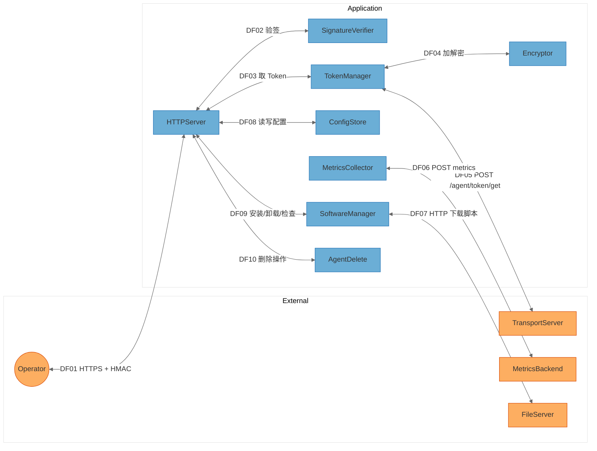

# HiD-Agent项目安全威胁分析报告

> 本文档基于 STRIDE-A（STRIDE + Abuse）威胁建模框架，对 HiD-Agent 项目进行安全威胁分析。
> 文中所有项目内文件、脚本、配置引用均使用相对于项目根目录（`d:\Code\hidevlab-hid-agent-master`）的相对路径；
> 部署/运行时的系统路径（如 `/usr/local/hidagent`、`/home/install.sh`）属于部署环境路径，并非项目内路径，文中已作标注。

---

## 1. 报告元数据

| 字段 | 值 |
|------|----|
| 分析对象 | HiD-Agent（hidagent，Go 语言实现的主机监控与运维代理） |
| 分析方法 | STRIDE-A 威胁建模、CVSS v4.0、CWE、OWASP Top 10:2025、可利用性分层 |
| 分析模型 | DeepSeek-V4-Flash 正式版 |
| 分析开始时间 | 2026-08-27 |
| 分析完成时间 | 2026-08-27 11:15:48 |
| 分析范围 | 项目全部源码、配置文件、部署脚本与文档 |
| 组件数量 | 11 个（含 2 个外部服务 + 1 个外部角色） |
| 信任边界 | 2 个（`Application` / `External`） |
| 数据流数量 | 10 条 |
| 威胁总数 | 24 条 |
| 发现项总数 | 12 条（FIND-01 ~ FIND-12） |

> **威胁计数说明：** 威胁总数为 24 条，其中 Tier 1（无需任何前置条件）1 条、Tier 2（需认证/网络位置）21 条、Tier 3（需特权）2 条；发现项 12 条，其中严重（Critical）1 条、高危（High）3 条、中危（Medium）6 条、低危（Low）1 条、无风险（None）1 条。每条威胁均已映射到对应发现项，详见第 9 节威胁覆盖验证表。

---

## 2. 执行摘要

HiD-Agent 是一个部署在数据中心服务器（BMS/VM）上的监控运维代理，主要功能包括：

1. 周期性采集系统指标（CPU、内存、磁盘、SSH 会话、NPU 使用情况等）并上报后端；
2. 通过 HTTPS（自签名证书）+ HMAC-SHA256 签名对外暴露配置接口（`/config`）；
3. 提供软件预制安装/卸载/检查接口（`/software/*`）；
4. 提供 Agent 删除（`/agent/delete`）与网络配置删除（`/net_config/delete`）等破坏性运维接口；
5. 启动时从后端获取共享 Token，并使用三段式加密（XOR + PBKDF2 + AES-GCM）落盘存储。

整体而言，项目在**本地 API 防护**方面具备一定的安全基础设施（HTTPS + 签名校验 + Token 加密存储），但在**边界完整性、密钥管理与授权分离**方面存在若干需要优先处理的问题：

- **最严重的问题**：单一共享 Token 同时授权配置、软件安装和「删除 Agent / 删除整机网络配置」等破坏性操作（FIND-06，CVSS 9.4 Critical）。Token 一旦泄露或被盗用，攻击者可远程自毁 Agent 并破坏目标主机网络配置。
- **信任链缺陷**：Agent 与后端、文件服务器之间几乎所有出站/下载链路要么跳过了 TLS 证书校验（`InsecureSkipVerify: true`），要么直接使用明文 HTTP 并执行下载的脚本（FIND-02、FIND-03）。配合自签名证书无固定（FIND-05），中间人可窃取 Token 或植入恶意脚本实现 root 级任意代码执行。
- **密钥与配置管理薄弱**：三段式加密的 3 个密钥文件与密文、配置文件存放在同一目录（FIND-07、FIND-10），“加密”实际为本地混淆；配置文件中内置了大量内部 IP/区域拓扑信息（FIND-12）。
- **运行环境加固不足**：Agent 以 root 身份运行（FIND-08），升级包无完整性校验（FIND-11），破坏性操作缺少可审计记录（FIND-09）。

**建议优先行动（Quick Wins）**：为破坏性接口启用独立的低权限 Token 或二次授权、为所有出站连接启用证书校验、将脚本下载切换为 HTTPS + 校验和、限制配置文件权限、为破坏性操作增加审计与人工确认。详见第 10 节行动摘要。

---

## 3. 分析上下文与假设

### 3.1 分析范围与方法

- 对项目根目录下全部源码（`main.go`、`service/`、`tools/`、`constant/`）、部署脚本（`install.sh`、`upgrade-agent.sh`）、配置（`config/config.example.json`、`etc/hidagent.service`）及文档（`docs/`）进行了逐文件审阅。
- 采用 STRIDE-A 六类威胁 + 滥用（Abuse）类别，对每个组件进行完整的 7 类威胁分析。
- 每个发现项均给出 CVSS v4.0（分值 + 完整向量）、CWE（含链接）、OWASP Top 10:2025 分类、可利用性层级与修复工作量。

### 3.2 需要验证的事项

| # | 待验证事项 | 原因 |
|---|-----------|------|
| 1 | 实际部署时端口 `51234` 是否仅绑定内网/特定网段 | 常量 `constant/const.go` 中 `LISTEN_PORT = ":51234"` 绑定所有接口，若该端口暴露到非信任网络将显著提升 Tier 1 威胁的实际风险 |
| 2 | Token 的分发渠道与客户端（操作台）持有范围 | 单 Token 机制下，Token 暴露面即 Agent 完全控制面 |
| 3 | `service/software.go` 中 `install.sh` / `uninstall.sh` 在 `/home` 下的实际内容与来源 | 决定脚本是否包含校验逻辑，以及 `env.sh` 被 `source` 时是否可注入命令 |
| 4 | 后端 `MetricsBackend` / `TransportServer` 是否对 Agent 上报数据做完整性校验 | 出站链路跳过证书校验时，后端侧若同样弱校验则风险叠加 |
| 5 | 生产环境 `config/config.json` 的实际文件权限与存放位置 | `service/config.go` 以默认权限写入，实际 umask 决定可读范围 |
| 6 | CI/CD（`.gitcode/workflows/`）构建与发布链路是否具备签名/校验 | 影响 FIND-11 供应链风险的评估与缓解方案 |

### 3.3 发现项覆盖说明

- 本次分析为**单次完整分析**（非增量更新），无基线报告可对比。
- `service/software.go` 中的安装/卸载/检查目前为 **mock 实现**（代码注释已标明），但其中下载并执行外部脚本的链路真实存在，故按实际代码路径评估。
- 项目目录当前**不是 git 仓库**（未发现 `.git`），因此无法获取 git 元数据（commit/分支）；报告完成时间取自当前系统时间。

---

## 4. 系统架构概述

### 4.1 系统用途

HiD-Agent（`hidagent`）是 HiDevLab 平台的轻量级主机代理，运行在数据中心各类服务器上（通过 `constant/const.go` 中 IP→区域映射识别所属机房/环境）。它承担三项核心职责：

1. **指标采集与上报**：按可配置间隔采集 CPU/内存/磁盘/SSH 会话/NPU 用量/命令执行状态等指标，经 HMAC 签名后上报区域后端；
2. **本地配置管理**：对外提供 HTTPS API 供运维平台修改采集配置；
3. **软件预制与自管理**：支持软件预制安装/卸载/检查，以及 Agent 自身与网络配置的远程删除。

### 4.2 关键组件（含锚定文件）

| 组件 ID | 类型 | 锚定文件（相对路径） | 职责 |
|---------|------|---------------------|------|
| HTTPServer | 进程 | `main.go` | HTTP(S) 监听、路由分发、签名校验入口 |
| SignatureVerifier | 进程 | `tools/signature.go` | HMAC-SHA256 签名生成与校验 |
| TokenManager | 进程 | `service/token.go` | Token 获取（后端 API）、缓存、落盘/读盘 |
| Encryptor | 进程 | `tools/encryptor.go` | 三段式加密（XOR+PBKDF2+AES-GCM） |
| ConfigStore | 进程 | `service/config.go` | 配置加载、校验、保存与导出 |
| MetricsCollector | 进程 | `service/collect.go` | 指标采集、签名、上报 |
| SoftwareManager | 进程 | `service/software.go` | 软件预制安装/卸载/检查、下载脚本并执行 |
| AgentDelete | 进程 | `service/delete.go` | Agent 删除、网络配置删除、systemd 操作 |
| TransportServer | 外部服务 | `constant/const.go`（`REGION_TO_TRANSPORT_ENDPOINT`） | 后端 Token 签发等服务 |
| MetricsBackend | 外部服务 | `constant/const.go`（`REGION_TO_METRICS_URL`） | 指标接收服务 |
| FileServer | 外部服务 | `constant/const.go`（`REGION_TO_FILESERVER_ENDPOINT`） | 软件脚本下载服务器 |
| Operator | 外部角色 | `docs/API.md` | 持有 Token 的运维平台/操作者 |

### 4.3 信任边界

本项目为**单进程**应用，按部署拓扑划分为 2 个信任边界：

- **`Application`**：HiD-Agent 进程本身（`hidagent` 二进制），包含 HTTPServer、SignatureVerifier、TokenManager、Encryptor、ConfigStore、MetricsCollector、SoftwareManager、AgentDelete 全部组件；
- **`External`**：外部服务（TransportServer、MetricsBackend、FileServer）与外部角色（Operator）。

所有本地组件间的调用均为进程内调用，不构成新的信任边界。

### 4.4 主要数据流

| 流 ID | 数据流 | 协议/机制 | 安全措施 |
|-------|--------|-----------|----------|
| DF01 | Operator ↔ HTTPServer | HTTPS（自签名证书）+ JSON | HMAC-SHA256 签名 |
| DF02 | HTTPServer ↔ SignatureVerifier | 进程内 | — |
| DF03 | HTTPServer ↔ TokenManager | 进程内 | 内存缓存 |
| DF04 | TokenManager ↔ Encryptor | 进程内 | AES-GCM 加解密 |
| DF05 | TokenManager ↔ TransportServer | HTTPS（POST `/agent/token/get`） | **跳过证书校验**（`InsecureSkipVerify: true`） |
| DF06 | MetricsCollector ↔ MetricsBackend | HTTPS（POST 指标） | HMAC 签名；**跳过证书校验** |
| DF07 | SoftwareManager ↔ FileServer | **明文 HTTP** 下载 `install.sh`/`uninstall.sh` | 无 |
| DF08 | HTTPServer ↔ ConfigStore | 进程内 | 文件 `config/config.json` |
| DF09 | HTTPServer ↔ SoftwareManager | 进程内（经签名校验） | HMAC 签名 |
| DF10 | HTTPServer ↔ AgentDelete | 进程内（经签名校验） | HMAC 签名 |

### 4.5 部署分类

- **部署形态**：`LOCALHOST_SERVICE`（systemd 服务，见 `etc/hidagent.service`，`User=root`）。
- **网络暴露**：`constant/const.go` 中 `LISTEN_PORT = ":51234"` 监听所有接口；在数据中心内网中可被运维平台访问。
- **运行身份**：root（`etc/hidagent.service` 中 `User=root` / `Group=root`）。
- **落盘位置**：安装后位于 `/usr/local/hidagent`（系统路径，见 `install.sh`、`constant/const.go`）。

### 4.6 组件暴露表

| 组件 | 监听地址 | 认证屏障 | 外部可达性 | 最低前置条件 | 派生层级 |
|------|----------|----------|-----------|--------------|----------|
| HTTPServer | 0.0.0.0:51234 | HMAC 签名（先读体后验签） | 是（内网） | 无 | T1 |
| SignatureVerifier | 进程内 | — | 否 | 本地进程访问 | T2 |
| TokenManager | 出站连接 | — | 否（发起方） | 无 | T2 |
| Encryptor | 本地文件 | 文件权限 0600 | 否 | 本地进程访问 | T2 |
| ConfigStore | 本地文件 `config/config.json` | 默认权限 | 否 | 本地进程访问 | T2 |
| MetricsCollector | 出站连接 | HMAC 签名 | 否（发起方） | 无 | T2 |
| SoftwareManager | 经 HTTPServer | HMAC 签名 | 经 HTTPServer | 认证用户 | T2 |
| AgentDelete | 经 HTTPServer | HMAC 签名 | 经 HTTPServer | 认证用户 | T2 |
| TransportServer | 外部 :18888/:18889 | 无（Agent 侧跳过校验） | 外部 | 无 | T2 |
| MetricsBackend | 外部 | HMAC 签名 | 外部 | 无 | T2 |
| FileServer | 外部 :18443 | 无（明文 HTTP） | 外部 | 无 | T2 |

---

## 5. 安全基础设施清单

在标记安全缺口之前，先盘点项目已有的安全机制：

| 安全基础设施 | 状态 | 说明（相对路径） |
|--------------|------|------------------|
| 传输加密（本地 API） | ✅ 已启用 | `main.go` 中 `tls.Config{MinVersion: TLS1.2}`，HTTPS 监听 |
| 传输加密（出站） | ⚠️ 已启用但绕过校验 | `service/token.go`、`service/collect.go` 使用 `InsecureSkipVerify: true` |
| 请求认证 | ✅ 已启用 | HMAC-SHA256 签名校验，`tools/signature.go` |
| 敏感数据存储 | ⚠️ 部分 | Token 经三段式加密落盘（`tools/encryptor.go`），但密钥与密文同目录 |
| 文件权限控制 | ⚠️ 部分 | Token 文件 0600；`config/config.json` 使用默认权限写入 |
| 日志记录 | ⚠️ 部分 | zap 输出 stdout（`tools/log.go`），由 journald 采集（`etc/journald@hidagent.conf`）；无结构化审计 |
| 最小权限运行 | ❌ 缺失 | root 运行（`etc/hidagent.service`） |
| 完整性校验（下载/升级） | ❌ 缺失 | `service/software.go`、`upgrade-agent.sh` 无校验和/签名 |
| 限流/防滥用 | ❌ 缺失 | 所有 HTTP 接口无速率限制 |
| 证书信任管理 | ❌ 缺失 | 自签名证书无固定/无预置 CA（`tools/cert.go`） |

---

## 6. 数据流图（DFD）

---

## 7. STRIDE-A 威胁分析

### 7.1 可利用性层级定义

| 层级 | 定义 | 前置条件 |
|------|------|----------|
| Tier 1 | 直接暴露，无前置条件 | 无 |
| Tier 2 | 需要认证用户或内网/网络位置 | 认证用户 / 内部网络 / 本地进程访问 |
| Tier 3 | 需要特权 | 特权用户 / 管理员凭据 / 主机级访问 |

### 7.2 STRIDE-A 摘要表

> 摘要表仅统计**具体威胁**数量；`N/A` 表示该类别对该组件不适用（理由见各组件小节），不计入威胁总数。A = Abuse（业务逻辑滥用/功能误用）。

| 组件 | S | T | R | I | D | E | A | 合计 |
|------|---|---|---|---|---|---|---|------|
| HTTPServer | 1 | 1 | 1 | 0 | 1 | 1 | 0 | 5 |
| SignatureVerifier | 0 | 1 | 0 | 0 | 0 | 0 | 0 | 1 |
| TokenManager | 0 | 1 | 0 | 1 | 0 | 1 | 0 | 3 |
| Encryptor | 0 | 0 | 0 | 1 | 0 | 0 | 0 | 1 |
| ConfigStore | 0 | 1 | 0 | 1 | 0 | 0 | 0 | 2 |
| MetricsCollector | 1 | 0 | 0 | 1 | 0 | 0 | 0 | 2 |
| SoftwareManager | 0 | 1 | 0 | 0 | 0 | 0 | 1 | 2 |
| AgentDelete | 0 | 1 | 0 | 0 | 1 | 0 | 0 | 2 |
| TransportServer | 1 | 0 | 0 | 0 | 0 | 0 | 0 | 1 |
| FileServer | 0 | 1 | 0 | 0 | 0 | 0 | 0 | 1 |
| RunAsRoot（运行身份） | 0 | 0 | 0 | 0 | 0 | 1 | 0 | 1 |
| SupplyChain（升级链路） | 0 | 1 | 0 | 0 | 0 | 0 | 0 | 1 |
| HardcodedInfra（内置拓扑） | 0 | 0 | 0 | 1 | 0 | 0 | 0 | 1 |
| **合计** | **4** | **9** | **2** | **5** | **2** | **3** | **1** | **24** |

### 7.3 组件详细威胁分析

#### HTTPServer

锚定：`main.go`。监听 `:51234`，路由 `/config`、`/software/install`、`/software/uninstall`、`/software/check`、`/agent/delete`、`/net_config/delete`。

| 威胁 ID | 类别 | 威胁描述 | 相关发现 |
|---------|------|----------|----------|
| T01.S | Spoofing | 服务端使用运行时生成的自签名证书（`tools/cert.go`），客户端无证书固定，中间人可冒充 Agent 服务端并截获配置 | FIND-05 |
| T02.T | Tampering | 签名仅覆盖请求体（`tools/signature.go`），无时间戳/随机数，已捕获的合法签名请求可被重放以篡改配置或重复触发操作 | FIND-04 |
| T03.R | Repudiation | 配置变更/破坏性操作无“谁在何时做了什么”的可审计记录，无法追溯责任 | FIND-09 |
| T04.D | DoS | 所有接口（含无需有效签名的部分流程）无速率限制，攻击者可低成本打满连接/计算资源 | FIND-01 |
| T05.E | Elevation | 单一 Token 同时授权读配置、改配置、装/卸软件、删除 Agent 与整机网络配置，Token 持有者可获得最高权限 | FIND-06 |
| I | N/A | 信息泄露需先通过签名认证（`GET /config` 需有效签名），未发现未授权信息泄露路径 | — |
| A | N/A | 本地 API 面向运维平台，未发现可被滥用骗取业务利益的合法功能路径 | — |

#### SignatureVerifier

锚定：`tools/signature.go`。`ValidateSignature` 使用 HMAC-SHA256 对请求体签名并与 `X-HiD-Signature` 头比对。

| 威胁 ID | 类别 | 威胁描述 | 相关发现 |
|---------|------|----------|----------|
| T06.T | Tampering | 签名比对使用普通字符串相等判断（`clientSignature != serverSignature`），非恒定时间比较，存在理论上的时序侧信道（因 HMAC 已被攻破方可利用，实际风险低） | FIND-04 |
| S / R / I / D / E / A | N/A | 该组件为纯计算函数，不持有状态、不持久化数据、不直接暴露网络，其余类别不适用 | — |

#### TokenManager

锚定：`service/token.go`。负责从后端获取 Token、缓存、加解密落盘。

| 威胁 ID | 类别 | 威胁描述 | 相关发现 |
|---------|------|----------|----------|
| T07.I | Information Disclosure | 获取 Token 的出站 HTTPS 请求跳过证书校验（`InsecureSkipVerify: true`），中间人可窃取 Token | FIND-02 |
| T08.T | Tampering | Token 以文件 `config/tk.txt` 落盘，解密密钥与密文同目录存放，具备本地文件访问者可篡改/还原 | FIND-07 |
| T09.E | Elevation | Token 被设计为全局共享密钥，一旦泄露即获得全部 API（含破坏性接口）调用能力 | FIND-06 |
| S / R / D / A | N/A | Token 获取流程无攻击者可控的本地监听面；未发现可审计性/可用性/业务滥用风险点 | — |

#### Encryptor

锚定：`tools/encryptor.go`，算法说明见 `docs/三段式加密.md`。

| 威胁 ID | 类别 | 威胁描述 | 相关发现 |
|---------|------|----------|----------|
| T10.I | Information Disclosure | 三段式加密的 3 个密钥文件 `build1.rk`/`build2.rk`/`build3.rk` 与密文 `config/tk.txt` 存放于同一 `config/` 目录；获取该目录读取权限即可解密 Token，加密退化为本地混淆 | FIND-07 |
| S / T / R / D / E / A | N/A | Encryptor 为纯加解密组件，不参与网络与业务逻辑，其余类别不适用 | — |

#### ConfigStore

锚定：`service/config.go`。

| 威胁 ID | 类别 | 威胁描述 | 相关发现 |
|---------|------|----------|----------|
| T11.I | Information Disclosure | `config/config.json` 由 `os.Create` 以默认权限写入（通常 0644），包含 `agent_id`、区域、环境等敏感信息，本机其他用户可读 | FIND-10 |
| T12.T | Tampering | 配置以默认权限落盘且无完整性保护，具备本地写权限者可篡改采集行为或区域映射 | FIND-10 |
| S / R / D / E / A | N/A | 配置组件不对外暴露、不处理身份认证、不参与业务规则，其余类别不适用 | — |

#### MetricsCollector

锚定：`service/collect.go`。

| 威胁 ID | 类别 | 威胁描述 | 相关发现 |
|---------|------|----------|----------|
| T13.S | Spoofing | 指标上报的出站连接跳过证书校验（`InsecureSkipVerify: true`），攻击者可冒充后端接收并伪造确认 | FIND-02 |
| T14.I | Information Disclosure | 上报数据含 SSH 会话数、命令执行状态（基于 `/root/.bash_history`）、NPU 用量等，经不受信任的 TLS 链路传输可被中间人窃听 | FIND-02 |
| T / R / D / E / A | N/A | 采集器无输入篡改面；上报队列满时丢弃数据属于可接受的降级行为（代码注释已注明），其余类别不适用 | — |

#### SoftwareManager

锚定：`service/software.go`，需求文档见 `docs/Agent软件预制功能.md`。

| 威胁 ID | 类别 | 威胁描述 | 相关发现 |
|---------|------|----------|----------|
| T15.T | Tampering | `install.sh`/`uninstall.sh` 通过**明文 HTTP** 从 FileServer 下载（`http://%s/software/install.sh`）后直接落盘并 `bash` 执行，无校验和/签名，中间人可替换为恶意脚本并以 root 执行 | FIND-03 |
| T16.A | Abuse | `env.sh` 由请求中的 `software[].name`/`version` 直接拼接生成（`IS_INSTALL_%s=true`、`%s_VERSION=...`），若脚本 `source` 该文件且名称含 shell 元字符，可注入任意命令 | FIND-03 |
| S / R / I / D / E | N/A | 该组件仅经 HTTPServer 签名入口调用；日志输出到 stdout 由 journald 采集；未发现其他类别直接风险 | — |

#### AgentDelete

锚定：`service/delete.go`。

| 威胁 ID | 类别 | 威胁描述 | 相关发现 |
|---------|------|----------|----------|
| T17.T | Tampering | `/agent/delete` 与 `/net_config/delete` 仅依赖单一共享 Token 授权即可删除 Agent 安装目录、服务文件并清理整机网络配置（`/etc/sysconfig/network-scripts`、netplan、NetworkManager 等），Token 泄露即灾难 | FIND-06 |
| T18.D | DoS | 成功删除后 Agent 自退出（`os.Exit(0)`），网络配置被重置可导致主机失联，形成可用性破坏 | FIND-06 |
| S / R / I / E / A | N/A | 删除流程无新增身份维度；删除动作记录在日志但无独立审计；其余类别不适用 | — |

#### TransportServer（外部服务）

锚定：`constant/const.go`（`REGION_TO_TRANSPORT_ENDPOINT`）。Agent 视角下的外部 Token 签发服务。

| 威胁 ID | 类别 | 威胁描述 | 相关发现 |
|---------|------|----------|----------|
| T19.S | Spoofing | Agent 使用 `InsecureSkipVerify: true` 访问 TransportServer，不验证服务端身份；攻击者在内网仿冒该服务即可向 Agent 签发任意 Token | FIND-02 |
| T / R / I / D / E / A | N/A | TransportServer 为外部系统（不同团队管理），其自身配置不在本仓库范围内；其余类别的缓解职责在外部队列 | — |

#### FileServer（外部服务）

锚定：`constant/const.go`（`REGION_TO_FILESERVER_ENDPOINT`）。提供软件脚本下载。

| 威胁 ID | 类别 | 威胁描述 | 相关发现 |
|---------|------|----------|----------|
| T20.T | Tampering | FileServer 以明文 HTTP 提供脚本且无完整性校验，链路中任何节点可篡改；Agent 端无条件信任并执行 | FIND-03 |
| S / R / I / D / E / A | N/A | FileServer 为外部系统，其余类别风险由外部团队负责 | — |

#### RunAsRoot（运行身份）

锚定：`etc/hidagent.service`（`User=root`、`Group=root`）。

| 威胁 ID | 类别 | 威胁描述 | 相关发现 |
|---------|------|----------|----------|
| T21.E | Elevation | Agent 以 root 运行，脚本下载执行、网络配置删除等均以最高权限落地；任何 Agent 进程漏洞（或上述脚本/注入类问题）都将直接升级为整机 root 接管 | FIND-08 |
| 其余类别 | N/A | 运行身份是放大因子而非独立攻击面，其余类别不适用 | — |

#### SupplyChain（升级链路）

锚定：`upgrade-agent.sh`、`install.sh`、`.gitcode/workflows/`。

| 威胁 ID | 类别 | 威胁描述 | 相关发现 |
|---------|------|----------|----------|
| T22.T | Tampering | `upgrade-agent.sh` 直接 `unzip` 安装包并 `bash install.sh`（root），安装/升级包无签名或校验和校验；若发布/传输链路被入侵，可向所有服务器植入恶意 Agent | FIND-11 |
| 其余类别 | N/A | 其余类别不适用 | — |

#### HardcodedInfra（内置拓扑信息）

锚定：`constant/const.go`。

| 威胁 ID | 类别 | 威胁描述 | 相关发现 |
|---------|------|----------|----------|
| T23.I | Information Disclosure | 源码内置大量机房内部 IP 段、区域映射、后端/文件服务器地址（含测试环境 CIDR），随二进制分发后泄露内部网络拓扑 | FIND-12 |
| 其余类别 | N/A | 其余类别不适用 | — |

---

## 8. 发现项（按可利用性分层）

### 8.1 分层与排序规则

- 发现项按**可利用性层级**组织（Tier 1 → Tier 2 → Tier 3），层级内按严重级别（Critical → High → Moderate → Low）再按 CVSS 分值降序。
- 每个发现项包含 10 项必填属性：CVSS 4.0、CWE（含链接）、OWASP:2025、可利用性层级、前置条件、修复工作量、描述、证据、修复建议、验证，以及相关威胁链接。
- **前置条件取值**限定为：无 / 认证用户 / 特权用户 / 内部网络 / 本地进程访问 / 主机级访问 / 管理员凭据 / 物理访问 / {组件} 失陷。

### 8.2 Tier 1 — 直接暴露（无前置条件）

#### FIND-01：HTTP API 无速率限制，可被未认证攻击者滥用实施拒绝服务

| 属性 | 值 |
|------|----|
| CVSS 4.0 | 6.9（中危）`CVSS:4.0/AV:N/AC:L/AT:N/PR:N/UI:N/VC:N/VI:N/VA:L/SC:N/SI:N/SA:N` |
| CWE | [CWE-799](https://cwe.mitre.org/data/definitions/799.html)：对交互频率的控制不当 |
| OWASP | A04:2025 – Insecure Design |
| 可利用性层级 | Tier 1 |
| 前置条件 | 无 |
| 修复工作量 | 低 |

**描述**：`main.go` 中所有 HTTP 处理函数（`setConfig`、`handleSoftwareInstall`、`handleSoftwareUninstall`、`handleSoftwareCheck`、`handleAgentDelete`、`handleNetConfigDelete`）均未做速率限制、请求体大小限制或并发上限。监听端口 `:51234` 绑定所有接口，任何可达该端口的攻击者无需有效签名即可持续发送请求，耗尽连接与计算资源；`/software/*` 还可能触发后台 `bash` 脚本执行，放大资源消耗。

**证据**：

- `constant/const.go`：`LISTEN_PORT = ":51234"`（绑定所有接口）。
- `main.go`：六个处理函数均无限流/请求体大小校验。
- `service/software.go`：`InstallSoftware`/`UninstallSoftware` 每收到请求即在 `go func(){...}` 中启动 `bash install.sh`/`uninstall.sh`，无并发限制。

**修复建议**：

1. 在 HTTP 层增加按来源 IP 的令牌桶/滑动窗口限流（如 `golang.org/x/time/rate`）；
2. 限制请求体最大字节数，并为软件安装/卸载任务增加并发上限与任务去重；
3. 若端口无需对所有网卡开放，将监听地址收敛为受控网段。

**验证**：发送短时间高频请求观察响应延迟与连接数；在未提供有效签名时验证限流是否生效。

**相关威胁**：[T04.D](#HTTPServer)

### 8.3 Tier 2 — 需要认证或内网/网络位置

#### FIND-06：单一共享 Token 授权全部 API，含删除 Agent 与整机网络配置等破坏性操作

| 属性 | 值 |
|------|----|
| CVSS 4.0 | 9.4（严重）`CVSS:4.0/AV:N/AC:L/AT:N/PR:L/UI:N/VC:H/VI:H/VA:H/SC:H/SI:H/SA:H` |
| CWE | [CWE-862](https://cwe.mitre.org/data/definitions/862.html)：缺少授权 |
| OWASP | A01:2025 – Broken Access Control |
| 可利用性层级 | Tier 2 |
| 前置条件 | 认证用户（持有 Token） |
| 修复工作量 | 中 |

**描述**：`service/token.go` 管理的全局 Token 被用于所有接口的签名校验。`/agent/delete`（删除 Agent 安装目录、服务文件、journald 配置，`service/delete.go` 的 `DeleteAgent`）与 `/net_config/delete`（清空 RHEL/Debian/netplan/NetworkManager 网络配置，`DeleteNetworkConfigs`）与普通配置接口共用一个授权维度，且**无二次确认、无权限分级、无审计要求**。任何持有该 Token 的实体即可远程销毁监控并破坏主机网络。若 Token 再经 FIND-02/FIND-07 泄露，该影响可被未授权者达成。

**证据**：

- `main.go`：`handleAgentDelete`（第 421-494 行）与 `handleNetConfigDelete`（第 496-561 行）仅调用 `tools.ValidateSignature(body, clientSignature, token)`，与 `/config` 使用同一 `service.GetToken()`。
- `service/delete.go`：`DeleteAgent` 删除 `constant.AGENT_INSTALL_DIR`、`AGENT_SERVICE_FILE`、`JOURNALD_CONF_FILE`；`DeleteNetworkConfigs` 清理网络脚本/网络管理器配置。

**修复建议**：

1. 将破坏性接口与配置接口**授权分离**：为删除类操作使用独立低权限 Token 或独立的签名密钥；
2. 增加二次授权（如管理端确认、一次性验证码）；
3. 删除前校验目标 IP 与 Agent 归属，避免误删/跨域删除；
4. 对删除操作强制记录审计并延迟生效（预留撤销窗口）。

**验证**：使用仅具备配置权限的 Token 调用 `/agent/delete` 应被拒绝；删除前应出现二次授权提示。

**相关威胁**：[T05.E](#HTTPServer)、[T09.E](#TokenManager)、[T17.T](#AgentDelete)、[T18.D](#AgentDelete)

#### FIND-02：出站 TLS 连接跳过证书校验，Token 与指标存在窃听/篡改风险

| 属性 | 值 |
|------|----|
| CVSS 4.0 | 8.6（高危）`CVSS:4.0/AV:A/AC:L/AT:N/PR:N/UI:N/VC:H/VI:H/VA:N/SC:N/SI:N/SA:N` |
| CWE | [CWE-295](https://cwe.mitre.org/data/definitions/295.html)：证书校验不当 |
| OWASP | A02:2025 – Cryptographic Failures |
| 可利用性层级 | Tier 2 |
| 前置条件 | 内部网络（网络路径中间人） |
| 修复工作量 | 低 |

**描述**：`service/token.go` 的 `fetchTokenFromAPI` 与 `service/collect.go` 的 `uploadMetrics` 均构造 `tls.Config{InsecureSkipVerify: true}` 的 HTTP 客户端。这意味着 Agent 不验证后端身份，攻击者在内网路径上可：
1. 冒充 TransportServer 截获 `POST /agent/token/get` 的 Token；
2. 冒充 MetricsBackend 窃听/篡改含 SSH 会话、命令执行状态（`/root/.bash_history`）等敏感指标。

**证据**：

- `service/token.go` 第 206-209 行：`tr := &http.Transport{TLSClientConfig: &tls.Config{InsecureSkipVerify: true}}`。
- `service/collect.go` 第 195-197 行：`uploadMetrics` 同样 `InsecureSkipVerify: true`。

**修复建议**：

1. 移除 `InsecureSkipVerify: true`，改为校验后端证书；
2. 后端使用受信 CA 证书，或将后端证书指纹固定（certificate pinning）；
3. 优先使用域名而非 IP 直连，便于证书管理。

**验证**：将后端地址指向自签/错误证书的服务，确认 Agent 请求被拒绝而非静默通过。

**相关威胁**：[T07.I](#TokenManager)、[T13.S](#MetricsCollector)、[T14.I](#MetricsCollector)、[T19.S](#TransportServer)

#### FIND-03：软件脚本经明文 HTTP 下载并无条件以 root 执行，可导致远程命令执行

| 属性 | 值 |
|------|----|
| CVSS 4.0 | 8.6（高危）`CVSS:4.0/AV:A/AC:L/AT:N/PR:N/UI:N/VC:N/VI:H/VA:H/SC:H/SI:H/SA:H` |
| CWE | [CWE-494](https://cwe.mitre.org/data/definitions/494.html)：无完整性校验的代码下载 + [CWE-78](https://cwe.mitre.org/data/definitions/78.html)：OS 命令注入 |
| OWASP | A08:2025 – Software and Data Integrity Failures |
| 可利用性层级 | Tier 2 |
| 前置条件 | 内部网络（中间人）或认证用户（构造恶意软件名） |
| 修复工作量 | 中 |

**描述**：`service/software.go` 从 FileServer 以**明文 HTTP** 下载 `install.sh`/`uninstall.sh`（`installURL := fmt.Sprintf("http://%s/software/install.sh", serverIP)`），无校验和、无签名，直接写入 `/home/install.sh` 并 `bash install.sh` 后台执行（`exec.Command("bash", "install.sh")`）。攻击者若可中间人/仿冒 FileServer，即可替换脚本实现 root 级任意代码执行。此外，`env.sh` 由请求中的 `software[].name`/`version` 拼接生成，若安装脚本 `source` 该文件，名称含 shell 元字符可注入命令（`fmt.Sprintf("IS_INSTALL_%s=true", strings.ToUpper(sw.Name))`）。

**证据**：

- `service/software.go`：第 98-100 行 `http.Get("http://%s/software/install.sh")`；第 106 行写入 `/home/install.sh`；第 137 行 `exec.Command("bash", "install.sh")`；第 118-129 行生成 `env.sh`（含 `IS_INSTALL_%s` 拼接）。
- 卸载路径同文件第 200-237 行（`uninstall.sh`）。

**修复建议**：

1. 脚本下载切换到 HTTPS 并校验服务端证书；
2. 下载后校验 SHA-256 校验和/数字签名（白名单允许清单）再执行；
3. 对 `software[].name`/`version` 做严格白名单字符校验（仅字母数字与 `_`），禁止 shell 元字符；
4. `env.sh` 生成改为键值对编码（如 base64）或避免直接 `source`。

**验证**：向 `/software/install` 提交含 `;`、`$()`、反引号等字符的 `software.name`，确认不产生命令执行；模拟篡改 `install.sh` 内容，确认 Agent 拒绝执行。

**相关威胁**：[T15.T](#SoftwareManager)、[T16.A](#SoftwareManager)、[T20.T](#FileServer)

#### FIND-04：请求签名无时间戳/随机数，已捕获的合法请求可被重放

| 属性 | 值 |
|------|----|
| CVSS 4.0 | 7.2（高危）`CVSS:4.0/AV:A/AC:L/AT:N/PR:N/UI:N/VC:L/VI:H/VA:H/SC:N/SI:N/SA:N` |
| CWE | [CWE-294](https://cwe.mitre.org/data/definitions/294.html)：重放绕过认证 |
| OWASP | A07:2025 – Identification and Authentication Failures |
| 可利用性层级 | Tier 2 |
| 前置条件 | 内部网络（捕获合法签名请求） |
| 修复工作量 | 中 |

**描述**：`tools/signature.go` 的签名 = `HMAC-SHA256(request_body, token)`，请求体中无时间戳、随机数或请求 ID；`main.go` 各处理函数校验通过后直接执行。攻击者在内网嗅探到一次合法签名请求（例如一次 `/software/install` 或 `/agent/delete`）后，可无限重放该请求，反复触发安装/删除等操作。`/agent/delete` 重放将导致 Agent 被反复删除。

**证据**：

- `tools/signature.go`：`ValidateSignature` 仅比对 `HMAC(body, key)`，无时效性字段。
- `main.go`：`handleSoftwareInstall` 等函数解析请求体即执行，无请求幂等键/时间窗校验。

**修复建议**：

1. 请求体中增加时间戳字段，服务端校验时间窗（如 ±5 分钟）；
2. 增加随机数/请求 ID，服务端维护已消费集合防重放；
3. 破坏性接口强制要求一次性请求标识。

**验证**：捕获一次合法 `/software/install` 请求并延迟重放，确认被拒绝。

**相关威胁**：[T02.T](#HTTPServer)、[T06.T](#SignatureVerifier)

#### FIND-07：三段式加密密钥与密文同目录存放，本地可还原 Token

| 属性 | 值 |
|------|----|
| CVSS 4.0 | 6.7（中危）`CVSS:4.0/AV:L/AC:L/AT:N/PR:H/UI:N/VC:H/VI:N/VA:N/SC:N/SI:N/SA:N` |
| CWE | [CWE-522](https://cwe.mitre.org/data/definitions/522.html)：凭据保护不足 |
| OWASP | A02:2025 – Cryptographic Failures |
| 可利用性层级 | Tier 2 |
| 前置条件 | 本地进程访问（可读取 `config/` 目录） |
| 修复工作量 | 中 |

**描述**：`tools/encryptor.go` 的三段式加密将 3 个密钥文件（`build1.rk`/`build2.rk`/`build3.rk`）与密文（`config/tk.txt`）、配置文件同放于 `config/` 目录。密钥与密文同机同目录使加密退化为“混淆”：任何能读取该目录的本地进程/用户均可按 `docs/三段式加密.md` 描述的流程还原 Token。算法本身（XOR+PBKDF2 100000 次+AES-GCM）实现正确，问题在于密钥管理与明文等价的存储方式。

**证据**：

- `tools/encryptor.go`：`NewEncryptor("config")` 将 `build1.rk`…`build3.rk` 置于 `config/`；`service/token.go` 将密文写入 `config/tk.txt`（0600）。
- `docs/三段式加密.md`：完整描述了还原流程。

**修复建议**：

1. 将密钥材料移出进程/应用目录，改为独立密钥管理系统（KMS）、受保护硬件或仅 root 可读且分离存放；
2. 若无法引入 KMS，至少将密钥目录权限收紧至 0700/0600 并启用 LUKS/文件系统加密；
3. 记录密钥轮换机制，Token 到期自动重新获取。

**验证**：以非 root 用户尝试读取 `config/build1.rk` 应被拒绝；验证密钥与密文不在同一可读目录。

**相关威胁**：[T08.T](#TokenManager)、[T10.I](#Encryptor)

#### FIND-12：源码内置机房内部 IP、区域映射与后端地址，泄露网络拓扑

| 属性 | 值 |
|------|----|
| CVSS 4.0 | 5.1（中危）`CVSS:4.0/AV:L/AC:L/AT:N/PR:N/UI:N/VC:L/VI:N/VA:N/SC:N/SI:N/SA:N` |
| CWE | [CWE-200](https://cwe.mitre.org/data/definitions/200.html)：敏感信息暴露 |
| OWASP | A05:2025 – Security Misconfiguration |
| 可利用性层级 | Tier 2 |
| 前置条件 | 认证用户（可获取源码/安装包） |
| 修复工作量 | 低 |

**描述**：`constant/const.go` 中硬编码了 `IP_TO_REGION`（大量内部网段）、`REGION_TO_TRANSPORT_ENDPOINT`、`REGION_TO_METRICS_URL`、`REGION_TO_FILESERVER_ENDPOINT`（含内部 IP 与端口）及 `TEST_ENV_IP_CIDRS`。这些信息随二进制分发，任何获取源码或安装包者即可获知内部网络拓扑、测试环境网段与后端服务地址，为后续针对性攻击提供情报。

**证据**：

- `constant/const.go`：第 55-84 行 `IP_TO_REGION`；第 87-98 行 `REGION_TO_METRICS_URL`；第 100-112 行 `REGION_TO_TRANSPORT_ENDPOINT`；第 114-126 行 `REGION_TO_FILESERVER_ENDPOINT`。

**修复建议**：

1. 将区域/端点映射迁移至配置或服务发现机制，不再编译进二进制；
2. 测试环境网段与生产拓扑信息从发行版中剥离；
3. 对外只保留必要的发现接口，避免直接暴露 IP:端口。

**验证**：检查发行二进制/源码中是否仍包含内部 IP 字面量。

**相关威胁**：[T23.I](#HardcodedInfra)

#### FIND-10：配置文件以默认权限落盘，本机其他用户可读

| 属性 | 值 |
|------|----|
| CVSS 4.0 | 4.8（中危）`CVSS:4.0/AV:L/AC:L/AT:N/PR:L/UI:N/VC:L/VI:N/VA:N/SC:N/SI:N/SA:N` |
| CWE | [CWE-276](https://cwe.mitre.org/data/definitions/276.html)：默认权限不正确 |
| OWASP | A05:2025 – Security Misconfiguration |
| 可利用性层级 | Tier 2 |
| 前置条件 | 本地进程访问 |
| 修复工作量 | 低 |

**描述**：`service/config.go` 的 `Save()` 使用 `os.Create(ConfigPath)`（通常产生 0644 权限）写入 `config/config.json`，其中包含 `agent_id`、区域、环境等信息；Token 密文文件 `config/tk.txt` 以 0600 写入（良好），但 `config.json` 权限未收紧，本机其他用户可读取 Agent 元信息。

**证据**：

- `service/config.go`：第 79 行 `os.Create(ConfigPath)`；`ConfigPath = "config/config.json"`。
- `install.sh`：将 `config/config.json` 拷贝至 `/usr/local/hidagent/config/`（未显式 `chmod`）。

**修复建议**：

1. 写配置时显式设置 `0600` 或 `0640`（属主 root）；
2. 安装脚本对配置文件显式 `chmod 600`；
3. 敏感字段（agent_id 等）最小化暴露。

**验证**：`ls -l config/config.json` 确认权限为 600/640。

**相关威胁**：[T11.I](#ConfigStore)、[T12.T](#ConfigStore)

#### FIND-05：自签名证书无固定机制，本地 API 存在中间人风险

| 属性 | 值 |
|------|----|
| CVSS 4.0 | 2.3（低危）`CVSS:4.0/AV:A/AC:H/AT:P/PR:N/UI:N/VC:L/VI:N/VA:N/SC:N/SI:N/SA:N` |
| CWE | [CWE-295](https://cwe.mitre.org/data/definitions/295.html)：证书校验不当 |
| OWASP | A02:2025 – Cryptographic Failures |
| 可利用性层级 | Tier 2 |
| 前置条件 | 内部网络 + 用户忽略证书告警 |
| 修复工作量 | 低 |

**描述**：`tools/cert.go` 在进程启动时生成随机 ECDSA 自签名证书（有效期 365 天，`SerialNumber` 固定为 1），无预置 CA 或固定机制；客户端（见 `docs/API.md` 描述的自签名证书方案）只能依赖人工确认证书。这使本地 HTTPS API 在首连/证书更换时面临中间人冒充风险；串号固定为 1 也降低了证书唯一性。

**证据**：

- `tools/cert.go`：`GenerateSelfSignedCert` 使用 `big.NewInt(1)` 作为 `SerialNumber`，无 CA/固定逻辑。
- `docs/API.md`：明确说明“所有 API 通信都使用自签名证书”。

**修复建议**：

1. 为本地 API 部署受信 CA 签发的证书，或实现证书指纹固定（client pinning）；
2. 证书序列号使用安全随机值；
3. 明确证书的信任锚与轮换流程。

**验证**：使用带固定指纹的客户端连接，确认能识别证书变更。

**相关威胁**：[T01.S](#HTTPServer)

#### FIND-09：破坏性操作缺少结构化审计与责任追溯能力

| 属性 | 值 |
|------|----|
| CVSS 4.0 | 0.0（无）`CVSS:4.0/AV:N/AC:L/AT:N/PR:N/UI:N/VC:N/VI:N/VA:N/SC:N/SI:N/SA:N` |
| CWE | [CWE-778](https://cwe.mitre.org/data/definitions/778.html)：日志记录不足 |
| OWASP | A09:2025 – Security Logging and Monitoring Failures |
| 可利用性层级 | Tier 2 |
| 前置条件 | 认证用户（操作发生时才体现） |
| 修复工作量 | 中 |

**描述**：Agent 日志经 zap 输出到 stdout（`tools/log.go`），由 journald 采集（`etc/journald@hidagent.conf`，保留 1 周、上限 50M）。日志虽记录了操作，但：无“操作者身份/来源 IP”维度的结构化审计；配置变更、删除等敏感操作无独立不可篡改的审计记录；`service/delete.go` 删除 Agent 时会移除 journald 配置与安装目录，日志可被操作本身清除；无告警联动。因此破坏性操作存在不可否认性与溯源缺口。

**证据**：

- `tools/log.go`：日志仅写 `os.Stdout`，无审计通道。
- `etc/journald@hidagent.conf`：`MaxRetentionSec=1w`、`SystemMaxUse=50M`。
- `service/delete.go`：`removeAgentFiles` 删除 `JOURNALD_CONF_FILE` 与安装目录。

**修复建议**：

1. 对配置变更/删除类操作记录结构化审计日志（操作者、来源 IP、时间、动作、结果）；
2. 审计日志发送至独立、Agent 无法自毁的远程存储；
3. 为破坏性操作配置实时告警。

**验证**：执行一次 `/agent/delete`，确认审计日志在独立存储可查询且不被删除。

**相关威胁**：[T03.R](#HTTPServer)

### 8.4 Tier 3 — 需要特权

#### FIND-11：升级链路无完整性校验，可被供应链投毒

| 属性 | 值 |
|------|----|
| CVSS 4.0 | 6.3（中危）`CVSS:4.0/AV:N/AC:H/AT:P/PR:N/UI:N/VC:L/VI:L/VA:L/SC:N/SI:N/SA:N` |
| CWE | [CWE-1357](https://cwe.mitre.org/data/definitions/1357.html)：依赖不受控组件 |
| OWASP | A08:2025 – Software and Data Integrity Failures |
| 可利用性层级 | Tier 3 |
| 前置条件 | 特权用户（或发布/传输链路失陷） |
| 修复工作量 | 中 |

**描述**：`upgrade-agent.sh` 直接 `unzip` 安装包并执行 `bash install.sh`（root），安装包无数字签名或校验和校验；`.gitcode/workflows/` 中的 CI 流程（`codeql.yaml`、`pre-commit.yml`）未体现构建产物签名环节。若发布仓库、构建或分发通道被入侵，攻击者可向所有服务器分发恶意 Agent 二进制。

**证据**：

- `upgrade-agent.sh`：`unzip "$AGENT_PKG_NAME.zip"` → `bash "$AGENT_PKG_NAME/install.sh"`。
- `install.sh`：以 root 拷贝二进制并 `systemctl start hidagent`。
- `.gitcode/workflows/`：现有工作流无产物签名/校验步骤。

**修复建议**：

1. 构建产物签名（如 cosign/GPG），升级脚本校验签名与校验和；
2. 安装包通过 HTTPS + 固定证书分发；
3. CI 中增加 SBOM 与制品校验。

**验证**：篡改安装包后执行 `upgrade-agent.sh`，确认安装被拒绝。

**相关威胁**：[T22.T](#SupplyChain)

#### FIND-08：Agent 以 root 运行，放大任何漏洞的影响

| 属性 | 值 |
|------|----|
| CVSS 4.0 | 6.3（中危）`CVSS:4.0/AV:L/AC:L/AT:N/PR:L/UI:N/VC:L/VI:L/VA:L/SC:H/SI:H/SA:H` |
| CWE | [CWE-250](https://cwe.mitre.org/data/definitions/250.html)：以不必要的特权执行 |
| OWASP | A04:2025 – Insecure Design |
| 可利用性层级 | Tier 3 |
| 前置条件 | 特权用户（或借助其他漏洞获得进程内执行） |
| 修复工作量 | 低 |

**描述**：`etc/hidagent.service` 指定 `User=root`/`Group=root`。Agent 需 root 以执行某些采集（读 `/root/.bash_history`、`systemctl`）与网络配置清理，但整体以 root 运行意味着 FIND-03 等任何脚本/注入漏洞一旦被触发即直接获得整机 root 权限。应遵循最小权限原则，将不必要的高危能力拆分。

**证据**：

- `etc/hidagent.service`：第 12-13 行 `User=root`、`Group=root`。
- `service/collect.go`：`collectCommandExecStatus` 读取 `/root/.bash_history`。

**修复建议**：

1. 使用独立低权限账号运行 Agent，仅对确需特权的子命令通过受控 `sudo`/capabilities 授权；
2. 将 `bash_history` 读取、网络配置修改等能力最小化；
3. 启用 systemd 的 `ProtectSystem`、`NoNewPrivileges` 等加固选项。

**验证**：确认 Agent 进程以非 root UID 运行且核心功能可用。

**相关威胁**：[T21.E](#RunAsRoot)

---

## 9. 威胁覆盖验证

> 下表逐一映射第 7 节全部 24 条威胁到第 8 节发现项。`✅ 已覆盖` = 有对应发现项；本分析未采用“平台缓解”与“接受风险”状态（工具不代替用户接受风险）。

| 威胁 ID | 类别 | 组件 | 状态 | 对应发现 |
|---------|------|------|------|----------|
| T01.S | Spoofing | HTTPServer | ✅ 已覆盖 | [FIND-05](#find-05自签名证书无固定机制本地-api-存在中间人风险) |
| T02.T | Tampering | HTTPServer | ✅ 已覆盖 | [FIND-04](#find-04请求签名无时间戳随机数已捕获的合法请求可被重放) |
| T03.R | Repudiation | HTTPServer | ✅ 已覆盖 | [FIND-09](#find-09破坏性操作缺少结构化审计与责任追溯能力) |
| T04.D | DoS | HTTPServer | ✅ 已覆盖 | [FIND-01](#find-01http-api-无速率限制可被未认证攻击者滥用实施拒绝服务) |
| T05.E | Elevation | HTTPServer | ✅ 已覆盖 | [FIND-06](#find-06单一共享-token-授权全部-api含删除-agent-与整机网络配置等破坏性操作) |
| T06.T | Tampering | SignatureVerifier | ✅ 已覆盖 | [FIND-04](#find-04请求签名无时间戳随机数已捕获的合法请求可被重放) |
| T07.I | Information Disclosure | TokenManager | ✅ 已覆盖 | [FIND-02](#find-02出站-tls-连接跳过证书校验token-与指标存在窃听篡改风险) |
| T08.T | Tampering | TokenManager | ✅ 已覆盖 | [FIND-07](#find-07三段式加密密钥与密文同目录存放本地可还原-token) |
| T09.E | Elevation | TokenManager | ✅ 已覆盖 | [FIND-06](#find-06单一共享-token-授权全部-api含删除-agent-与整机网络配置等破坏性操作) |
| T10.I | Information Disclosure | Encryptor | ✅ 已覆盖 | [FIND-07](#find-07三段式加密密钥与密文同目录存放本地可还原-token) |
| T11.I | Information Disclosure | ConfigStore | ✅ 已覆盖 | [FIND-10](#find-10配置文件以默认权限落盘本机其他用户可读) |
| T12.T | Tampering | ConfigStore | ✅ 已覆盖 | [FIND-10](#find-10配置文件以默认权限落盘本机其他用户可读) |
| T13.S | Spoofing | MetricsCollector | ✅ 已覆盖 | [FIND-02](#find-02出站-tls-连接跳过证书校验token-与指标存在窃听篡改风险) |
| T14.I | Information Disclosure | MetricsCollector | ✅ 已覆盖 | [FIND-02](#find-02出站-tls-连接跳过证书校验token-与指标存在窃听篡改风险) |
| T15.T | Tampering | SoftwareManager | ✅ 已覆盖 | [FIND-03](#find-03软件脚本经明文-http-下载并无条件以-root-执行可导致远程命令执行) |
| T16.A | Abuse | SoftwareManager | ✅ 已覆盖 | [FIND-03](#find-03软件脚本经明文-http-下载并无条件以-root-执行可导致远程命令执行) |
| T17.T | Tampering | AgentDelete | ✅ 已覆盖 | [FIND-06](#find-06单一共享-token-授权全部-api含删除-agent-与整机网络配置等破坏性操作) |
| T18.D | DoS | AgentDelete | ✅ 已覆盖 | [FIND-06](#find-06单一共享-token-授权全部-api含删除-agent-与整机网络配置等破坏性操作) |
| T19.S | Spoofing | TransportServer | ✅ 已覆盖 | [FIND-02](#find-02出站-tls-连接跳过证书校验token-与指标存在窃听篡改风险) |
| T20.T | Tampering | FileServer | ✅ 已覆盖 | [FIND-03](#find-03软件脚本经明文-http-下载并无条件以-root-执行可导致远程命令执行) |
| T21.E | Elevation | RunAsRoot | ✅ 已覆盖 | [FIND-08](#find-08agent-以-root-运行放大任何漏洞的影响) |
| T22.T | Tampering | SupplyChain | ✅ 已覆盖 | [FIND-11](#find-11升级链路无完整性校验可被供应链投毒) |
| T23.I | Information Disclosure | HardcodedInfra | ✅ 已覆盖 | [FIND-12](#find-12源码内置机房内部-ip区域映射与后端地址泄露网络拓扑) |

---

## 10. 行动摘要（Action Summary）

### 10.1 优先级矩阵

| 优先级 | 发现项 | CVSS | 层级 | 修复工作量 |
|--------|--------|------|------|-----------|
| P0（立即） | FIND-06 单一 Token 授权破坏性操作 | 9.4 | T2 | 中 |
| P0（立即） | FIND-03 明文 HTTP 下载脚本并 root 执行 | 8.6 | T2 | 中 |
| P1（本周） | FIND-02 出站 TLS 跳过证书校验 | 8.6 | T2 | 低 |
| P1（本周） | FIND-04 签名请求可重放 | 7.2 | T2 | 中 |
| P1（本周） | FIND-01 HTTP API 无速率限制 | 6.9 | T1 | 低 |
| P2（近期） | FIND-07 密钥与密文同目录 | 6.7 | T2 | 中 |
| P2（近期） | FIND-11 升级链路无校验 | 6.3 | T3 | 中 |
| P2（近期） | FIND-08 以 root 运行 | 6.3 | T3 | 低 |
| P2（近期） | FIND-12 内置拓扑信息 | 5.1 | T2 | 低 |
| P2（近期） | FIND-10 配置文件权限 | 4.8 | T2 | 低 |
| P3（规划） | FIND-05 自签名证书无固定 | 2.3 | T2 | 低 |
| P3（规划） | FIND-09 缺少结构化审计 | 0.0 | T2 | 中 |

### 10.2 Quick Wins（Tier 1/Tier 2 中低工作量项）

| 发现项 | 快速修复动作 | 工作量 |
|--------|--------------|--------|
| FIND-01 | HTTP 层接入限流中间件（如 `golang.org/x/time/rate`）并限制请求体大小 | 低 |
| FIND-02 | 移除 `InsecureSkipVerify: true`，改用 CA 校验或证书固定 | 低 |
| FIND-05 | 部署 CA 证书或实现客户端证书指纹固定 | 低 |
| FIND-08 | systemd 单元增加 `NoNewPrivileges=yes`、`ProtectSystem=strict` 等加固，逐步迁移低权限运行 | 低 |
| FIND-10 | 配置写入显式 `0600`，安装脚本 `chmod 600 config.json` | 低 |
| FIND-12 | 将区域/端点映射外置到配置，测试网段从发行版剥离 | 低 |
| FIND-03（部分） | 对 `software.name`/`version` 增加字符白名单校验 | 低 |

---

## 11. 技术栈安全清单覆盖

| 技术/组件 | 覆盖情况 |
|-----------|----------|
| Go 运行时与依赖（gopsutil、zap、x/crypto） | ✅ `go.mod` 依赖均来自官方仓库；未发现已知高危依赖告警（建议定期 `govulncheck`） |
| HTTPS/TLS（本地 API） | ✅ 已启用 TLS1.2-1.3（`main.go`）；⚠️ 自签名证书无固定 → FIND-05 |
| 出站 TLS | ❌ `InsecureSkipVerify: true` → FIND-02 |
| HMAC-SHA256 请求签名 | ✅ 已实现（`tools/signature.go`）；⚠️ 无时间戳/防重放 → FIND-04 |
| 三段式加密（XOR+PBKDF2+AES-GCM） | ✅ 算法实现合理（`tools/encryptor.go`）；⚠️ 密钥与密文同目录 → FIND-07 |
| systemd 服务 | ⚠️ root 运行、未启用加固选项 → FIND-08；journald 日志保留有限 → FIND-09 |
| shell 脚本（`install.sh`/`upgrade-agent.sh`） | ❌ 无签名/校验和、`set -e` 外无加固 → FIND-11、FIND-03 |
| 明文 HTTP 文件下载 | ❌ `http://` 下载并执行 → FIND-03 |
| CI/CD（`.gitcode/workflows/`） | ⚠️ 无制品签名/SBOM 环节 → FIND-11 |

---

## 12. 参考文献

### 12.1 安全标准

| 标准 | 说明 | 链接 |
|------|------|------|
| OWASP Top 10:2025 | 漏洞分类基准 | https://owasp.org/Top10/ |
| CWE（Common Weakness Enumeration） | 弱点分类 | https://cwe.mitre.org/ |
| CVSS v4.0（FIRST） | 漏洞评分 | https://www.first.org/cvss/ |
| STRIDE（微软） | 威胁建模框架 | https://learn.microsoft.com/en-us/azure/security/develop/threat-modeling-tool-threats |

### 12.2 组件文档（相对路径）

| 文件 | 说明 |
|------|------|
| `main.go` | 入口、路由与签名校验调用 |
| `service/token.go` | Token 获取/缓存/落盘 |
| `service/collect.go` | 指标采集与上报 |
| `service/config.go` | 配置加载与保存 |
| `service/delete.go` | Agent 与网络配置删除 |
| `service/software.go` | 软件预制安装/卸载/检查 |
| `tools/signature.go` | HMAC 签名 |
| `tools/cert.go` | 自签名证书生成 |
| `tools/encryptor.go` | 三段式加密 |
| `tools/log.go` | 日志 |
| `constant/const.go` | 常量、区域/端点映射 |
| `etc/hidagent.service` | systemd 服务配置 |
| `etc/journald@hidagent.conf` | journald 日志配置 |
| `install.sh` / `upgrade-agent.sh` | 安装与升级脚本 |
| `config/config.example.json` | 配置示例 |
| `docs/API.md` | API 文档（签名与端点） |
| `docs/三段式加密.md` | 加密方案说明 |
| `docs/Agent软件预制功能.md` | 软件预制需求 |
| `docs/openapi.yaml` | OpenAPI 定义 |
