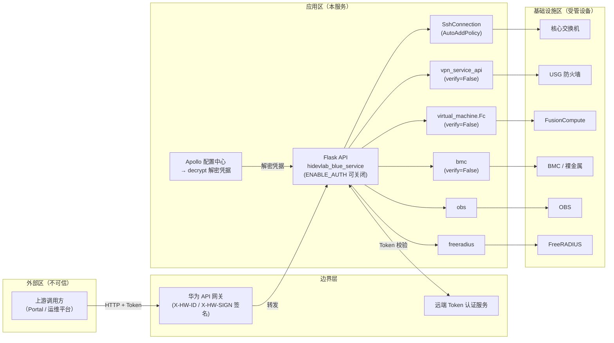

# 安全威胁分析报告

| 项目 | 内容 |
| --- | --- |
| 分析对象 | hidevlab-infra-manager-service（HiDevLab 基础设施管理服务） |
| 分析模式 | 单次分析（Single Analysis） |
| 分析方法 | STRIDE-A 威胁建模 + CVSS 4.0 评分 + CWE 映射 + OWASP Top 10:2025 映射 |
| 分析日期 | 2026-08-27 |
| 代码基线 | 分支 `zzy_20260811`，提交 `bab1b6c` |
| 分析语言 | 中文 |

---

## 1. 执行摘要

本次分析对该基础设施管理服务的全部核心代码进行了 STRIDE-A 威胁建模。该服务是一个**高危敏感系统**：它持有核心交换机、防火墙（USG）、BMC、FusionCompute 虚拟化平台、OBS、FreeRADIUS 等关键基础设施的管理凭据，并提供 50+ 个 HTTP 接口直接操控这些基础设施。一旦被攻破，攻击者可**直接接管整个实验室网络与计算资源**。

**关键结论：**

- 共识别 **14 项威胁发现**，其中 **Tier 1（直接暴露）4 项**、**Tier 2（条件风险）7 项**、**Tier 3（纵深防御）3 项**。
- 最严重的问题是**认证开关可整体关闭**（`ENABLE_AUTH`）与**全量出站连接禁用证书校验**（`verify=False`）的组合，可能造成基础设施凭据大规模泄露。
- `ast.literal_eval` 解析请求数据的模式在 **50+ 个接口中重复出现**，属于系统性解析缺陷（DoS / 健壮性）。
- SSH 连接使用 `AutoAddPolicy()` 且不校验主机密钥，sudo 密码通过命令行拼接传递，均为凭据暴露面。
- 系统已有部分安全意识（日志脱敏 `utils/security.py`、Apollo 加密配置、pre-commit/CodeQL 流水线），但核心传输与认证链路防护不足。

**优先修复建议（Top 3）：**
1. 强制启用认证并移除可关闭认证的配置开关（发现 T1-01）。
2. 全面启用 TLS 证书校验，废除 `verify=False`（发现 T1-02）。
3. 将请求数据解析统一改为 `json.loads`，替换全部 `ast.literal_eval`（发现 T1-03）。

---

## 2. 系统架构概述

### 2.1 系统职责

该服务是 HiDevLab 实验室的基础设施管理后台，核心能力包括：

- 服务器网络配置（Debian/CentOS 网卡配置、端口操作）
- 核心交换机 ACL 管理（网络隔离、批量 ACL、端口 ACL）
- FusionCompute（FC）虚拟机全生命周期管理（创建、删除、启停、CPU/内存/磁盘/GPU 变更、模板转换、K8s 集群）
- VPN 与防火墙管理（USG 防火墙地址/地址组/NAT 映射、VPN RADIUS 用户管理）
- BMC 带外管理（裸金属服务器控制）
- OBS AK/SK 配置与容量查询
- FreeRADIUS 用户管理

### 2.2 主要组件

| 组件 | 文件 | 职责 | 敏感度 |
| --- | --- | --- | --- |
| Flask API 服务 | `hidevlab_blue_service.py` | 主入口，50+ 个 HTTP 路由 | 极高 |
| 认证代理 | `utils/auth_filter.py` | Token 合法性验证（调用远端认证服务） | 极高 |
| 配置中心客户端 | `base/config.py` | 从 Apollo 读取并解密各设备凭据 | 极高 |
| 解密模块 | `base/decrypt.py` | AES-GCM 解密 Apollo 加密项 | 极高 |
| SSH 工具 | `tools/ssh.py` | 连接交换机/服务器执行命令 | 极高 |
| 网络隔离 | `service/network_isolation.py` | 核心交换机 ACL 下发 | 极高 |
| 虚拟机服务 | `service/virtual_machine.py` | FusionCompute API 封装 | 高 |
| VPN/防火墙服务 | `service/vpn_service_api.py`、`service/yunshan_vpn_service_api.py` | USG 防火墙 REST/XML API 封装 | 高 |
| BMC 服务 | `service/bmc.py` | 裸金属带外管理 | 高 |
| 网络配置服务 | `service/config_network.py`、`service/port.py` | 目标机网络配置 | 高 |
| OBS 服务 | `service/obs.py` | 对象存储 AK/SK 配置 | 高 |
| FreeRADIUS | `freeradius.py` | RADIUS 用户管理 | 高 |
| DTO 层 | `dto/fusion_compute.py`、`dto/firewall.py`、`dto/k8s.py` | 请求体构造 | 中 |

### 2.3 信任边界与数据流图（DFD）

**信任边界说明：**

- **TB1（外部 → 边界）**：上游请求携带动态 Token，经网关签名转发至本服务。
- **TB2（边界 → 应用）**：本服务通过 `auth_filter` 调用远端认证服务校验 Token，受 `ENABLE_AUTH` 开关控制。
- **TB3（应用 → 基础设施）**：本服务使用解密后的凭据，经 SSH/HTTPS/XML API 操控交换机、防火墙、虚拟化平台等。此边界上的传输安全（证书校验、主机密钥校验）是本次分析的重点。

**部署分类**：内部实验室网络部署、高权限基础设施管理服务（等同于"堡垒机/管理平面"级别敏感度）。

---

## 3. STRIDE-A 威胁分析发现

按可利用性层级（Exploitability Tier）分级：
- **Tier 1 直接暴露**：无需前置条件或仅需可达网络即可利用；
- **Tier 2 条件风险**：需要单一前置条件（如处于同一网络、获得配置权限）；
- **Tier 3 纵深防御**：需要多个前置条件叠加。

### Tier 1 — 直接暴露

#### T1-01 认证开关可整体关闭，导致全部基础设施 API 裸奔

- **类别**：Spoofing（身份伪造）/ Elevation of Privilege（权限提升）
- **位置**：[hidevlab_blue_service.py](file:///d:/03%20code/hidevlab-infra-manager-service/hidevlab_blue_service.py#L139-L147)、[base/config.py](file:///d:/03%20code/hidevlab-infra-manager-service/base/config.py)
- **描述**：`@APP.before_request` 中的认证校验由 `ENABLE_AUTH` 配置项控制。该开关一旦在 Apollo 中被置为 `False`（误配置或攻击者获得 Apollo 访问权），**所有 50+ 个接口**（含交换机 ACL 下发、虚拟机删除、防火墙 NAT 变更、BMC 控制）将完全无认证暴露。认证本身依赖远端 Token 服务，若该服务不可用亦会间接造成认证失效或拒绝服务。
- **CVSS 4.0**：`CVSS:4.0/AV:N/AC:L/AT:N/PR:N/UI:N/VC:H/VI:H/VA:H/SC:H/SI:H/SA:H` — **严重（~9.3）**
- **CWE**：CWE-284（认证不当）、CWE-1188（不安全的默认初始化）
- **OWASP**：A01 权限控制失效、A07 身份认证失效
- **修复建议**：移除可关闭认证的开关，认证应为强制路径；为认证服务增加本地缓存降级与故障关闭（fail-closed）策略；对高危接口（删除虚拟机、ACL 变更）增加二次授权或操作审计。

#### T1-02 全部出站 HTTPS 连接禁用证书校验（verify=False）

- **类别**：Spoofing（中间人伪装）/ Information Disclosure（信息泄露）
- **位置**：[service/virtual_machine.py](file:///d:/03%20code/hidevlab-infra-manager-service/service/virtual_machine.py)、[service/bmc.py](file:///d:/03%20code/hidevlab-infra-manager-service/service/bmc.py#L66)、[service/vpn_service_api.py](file:///d:/03%20code/hidevlab-infra-manager-service/service/vpn_service_api.py)、[service/yunshan_vpn_service_api.py](file:///d:/03%20code/hidevlab-infra-manager-service/service/yunshan_vpn_service_api.py)、[utils/auth_filter.py](file:///d:/03%20code/hidevlab-infra-manager-service/utils/auth_filter.py#L51) 等多处
- **描述**：对 FusionCompute、BMC、USG 防火墙、云山 VPN、Token 认证服务等所有出站请求均使用 `verify=False`。处于网络路径上的攻击者（同网段 ARP 欺骗、路由劫持、被入侵的网关）可伪装为目标设备，窃取 Basic Auth 凭据、FC 会话 Token，或注入伪造响应诱导服务下发恶意配置。
- **CVSS 4.0**：`CVSS:4.0/AV:A/AC:L/AT:N/PR:N/UI:N/VC:H/VI:H/VA:L/SC:H/SI:L/SA:L` — **高危（~8.1）**
- **CWE**：CWE-295（证书校验不当）
- **OWASP**：A02 加密机制失效、A07 身份认证失效
- **修复建议**：为所有受管设备配置内部 CA 或自签证书指纹校验；将 `verify` 参数统一收敛到配置（默认 True）；对无法提供证书的设备改用 IP 白名单 + 独立管理 VLAN 隔离。

#### T1-03 50+ 接口使用 ast.literal_eval 解析不可信请求数据

- **类别**：Denial of Service（拒绝服务）/ Tampering（数据篡改）
- **位置**：[hidevlab_blue_service.py](file:///d:/03%20code/hidevlab-infra-manager-service/hidevlab_blue_service.py#L169) 等全部路由（50+ 处）、[freeradius.py](file:///d:/03%20code/hidevlab-infra-manager-service/freeradius.py#L53)
- **描述**：`data_dict = ast.literal_eval(str(ret, "utf-8"))` 模式系统性重复。虽然 `literal_eval` 不执行任意代码，但：① 深度嵌套字面量可触发递归解析造成 **CPU/内存耗尽 DoS**（Python 官方已多次修复相关 CVE，如 CVE-2021-29921）；② 非法输入抛出 `ValueError/SyntaxError` 未捕获，造成 **500 错误信息回显**；③ 该模式纵容了非结构化客户端数据直接进入业务字段。
- **CVSS 4.0**：`CVSS:4.0/AV:N/AC:L/AT:N/PR:N/UI:N/VC:N/VI:N/VA:H/SC:N/SI:N/SA:N` — **中高危（~7.1）**
- **CWE**：CWE-1287（不当解析）、CWE-400（不受控的资源消耗）
- **OWASP**：A03 注入（广义）、A05 安全配置错误
- **修复建议**：统一改用 `request.get_json(force=True)` / `json.loads`；封装统一的入参校验装饰器（类型、白名单、长度限制）；全局注册 Flask `errorhandler` 避免堆栈回显。

#### T1-04 高危接口缺少输入校验与速率限制，可被滥用为攻击代理

- **类别**：Denial of Service / Elevation of Privilege / Abuse（滥用）
- **位置**：[hidevlab_blue_service.py](file:///d:/03%20code/hidevlab-infra-manager-service/hidevlab_blue_service.py) 全部路由
- **描述**：接口直接接收 IP、端口、ACL 编号、用户名等参数并转发给基础设施。攻击者（或被劫持的合法调用方）可：① 批量调用 ACL 接口向核心交换机注入大量规则，**耗尽设备 ACL 表项**；② 通过 VM 创建接口消耗计算资源；③ 借助网络配置接口对任意内网 IP 发起配置操作（SSRF 型滥用）。服务无速率限制、无配额、无幂等保护。
- **CVSS 4.0**：`CVSS:4.0/AV:N/AC:L/AT:N/PR:L/UI:N/VC:L/VI:H/VA:H/SC:H/SI:L/SA:L` — **高危（~8.5）**
- **CWE**：CWE-20（输入校验不当）、CWE-770（资源分配受限不当）
- **OWASP**：A04 不安全设计
- **修复建议**：建立参数白名单（如 IP 必须属于受管网段清单）；引入请求频率限制与操作配额；关键写操作增加幂等键与审计流水。

### Tier 2 — 条件风险

#### T2-01 SSH 连接不校验主机密钥（AutoAddPolicy）

- **类别**：Spoofing / Information Disclosure
- **位置**：[tools/ssh.py](file:///d:/03%20code/hidevlab-infra-manager-service/tools/ssh.py#L46)
- **描述**：`para.set_missing_host_key_policy(paramiko.AutoAddPolicy())` 无条件接受未知主机密钥。同网络攻击者可伪造交换机/服务器 SSH 服务，窃取**核心交换机管理账号密码**，进而直接接管网络设备。
- **前置条件**：攻击者处于管理网络并可实施 ARP/路由欺骗。
- **CVSS 4.0**：`CVSS:4.0/AV:A/AC:L/AT:N/PR:N/UI:N/VC:H/VI:H/VA:L/SC:H/SI:L/SA:L` — **高危（~8.1）**
- **CWE**：CWE-322（密钥交换未校验）、CWE-295
- **OWASP**：A02 加密机制失效
- **修复建议**：预置 `known_hosts`（部署时下发各设备主机密钥指纹）；使用 `RejectPolicy` + 加载受控的 known_hosts 文件。

#### T2-02 sudo 密码经命令行拼接传递并执行任意命令

- **类别**：Information Disclosure / Tampering（命令注入）
- **位置**：[tools/ssh.py](file:///d:/03%20code/hidevlab-infra-manager-service/tools/ssh.py#L29)
- **描述**：`cmd = f"echo {password} | sudo -S {command}"`——① 密码出现在远端进程命令行与 shell 历史中，可被 `ps`/历史文件读取；② `command` 由业务层 f-string 拼接（网络配置、ACL 等），若其中包含用户可控字段（IP、网卡名等），构成**命令注入**链条：恶意参数 → 拼接命令 → sudo 在目标机执行。
- **前置条件**：注入点存在用户可控字段（部分接口确实将用户 IP 直接拼入配置命令）。
- **CVSS 4.0**：`CVSS:4.0/AV:N/AC:L/AT:P/PR:L/UI:N/VC:H/VI:H/VA:H/SC:H/SI:H/SA:H` — **高危（~8.0）**
- **CWE**：CWE-78（OS 命令注入）、CWE-214（敏感信息经环境变量/命令行泄露）
- **OWASP**：A03 注入
- **修复建议**：密码通过 `stdin` 写入而非 `echo` 拼接；所有命令一律走 `shlex.quote` 或参数化模板；目标机改用受限 sudoers 白名单命令而非任意命令。

#### T2-03 网络配置命令构造存在命令注入面

- **类别**：Tampering / Elevation of Privilege
- **位置**：[service/config_network.py](file:///d:/03%20code/hidevlab-infra-manager-service/service/config_network.py)、[service/network_isolation.py](file:///d:/03%20code/hidevlab-infra-manager-service/service/network_isolation.py)、[service/port.py](file:///d:/03%20code/hidevlab-infra-manager-service/service/port.py)
- **描述**：网卡配置、ACL 规则等以 f-string 拼接 shell/CLI 命令后经 SSH 下发。用户提交的 IP、网关、掩码、端口名等若未严格校验格式，攻击者可注入换行/分号/反引号，在目标服务器或核心交换机上以管理权限执行任意命令。
- **前置条件**：`ENABLE_AUTH` 开启时需先获得合法 Token（或利用 T1-01）。
- **CVSS 4.0**：`CVSS:4.0/AV:N/AC:L/AT:P/PR:L/UI:N/VC:H/VI:H/VA:H/SC:H/SI:H/SA:H` — **严重（~8.7）**
- **CWE**：CWE-78
- **OWASP**：A03 注入
- **修复建议**：所有网络参数用严格正则校验（`^\d{1,3}(\.\d{1,3}){3}$` 等）；命令模板化，参数经 `shlex.quote`；交换机 CLI 参数同样做白名单过滤。

#### T2-04 防火墙 XML 报文拼接存在 XML 注入面

- **类别**：Tampering
- **位置**：[service/vpn_service_api.py](file:///d:/03%20code/hidevlab-infra-manager-service/service/vpn_service_api.py)、[service/yunshan_vpn_service_api.py](file:///d:/03%20code/hidevlab-infra-manager-service/service/yunshan_vpn_service_api.py)、[dto/firewall.py](file:///d:/03%20code/hidevlab-infra-manager-service/dto/firewall.py)
- **描述**：向 USG 防火墙下发的配置通过字符串拼接构造 XML 报文（地址、地址组、NAT 映射、RADIUS 用户名等来自请求）。攻击者可注入 XML 特殊字符，篡改防火墙策略语义（例如闭合标签后追加放行规则）。
- **前置条件**：通过认证（或利用 T1-01）。
- **CVSS 4.0**：`CVSS:4.0/AV:N/AC:L/AT:P/PR:L/UI:N/VC:H/VI:H/VA:L/SC:H/SI:L/SA:L` — **高危（~7.9）**
- **CWE**：CWE-91（XML 注入）
- **OWASP**：A03 注入
- **修复建议**：改用 XML 安全库（`xml.sax.saxutils.escape` 或 ElementTree）构造报文；字段级白名单校验。

#### T2-05 认证链路自身无证书校验且签名仅依赖共享密钥

- **类别**：Spoofing
- **位置**：[utils/auth_filter.py](file:///d:/03%20code/hidevlab-infra-manager-service/utils/auth_filter.py#L40-L56)
- **描述**：`sign_request` 使用 `X_HW_APPKEY` 直接参与 SHA-256 签名串拼接，且对 TOKEN_URL 的请求未启用证书校验。网络内攻击者可伪装认证服务返回 `{"data":{"legal":true}}`，**伪造任意 Token 通过认证**。
- **前置条件**：攻击者可劫持到认证服务的网络路径。
- **CVSS 4.0**：`CVSS:4.0/AV:A/AC:L/AT:P/PR:N/UI:N/VC:H/VI:H/VA:H/SC:L/SI:L/SA:L` — **高危（~7.6）**
- **CWE**：CWE-295、CWE-345（数据真实性验证不足）
- **OWASP**：A07 身份认证失效
- **修复建议**：对认证服务启用证书校验；签名算法加入请求体摘要与时间窗口防重放；密钥改由 KMS 托管轮转。

#### T2-06 部署脚本与凭据文件权限管理薄弱

- **类别**：Information Disclosure / Tampering
- **位置**：[.cid/deploy.sh](file:///d:/03%20code/hidevlab-infra-manager-service/.cid/deploy.sh)
- **描述**：部署脚本包含备份、覆盖等敏感操作，未显式收紧产物与配置文件权限；解密后的凭据经 `base/config.py` 常驻进程内存，主机上任意可读进程内存的账户（如同机低权服务被攻破后提权）均可提取全部设备凭据。
- **前置条件**：攻击者已获得应用主机上的某种立足点。
- **CVSS 4.0**：`CVSS:4.0/AV:L/AC:L/AT:N/PR:L/UI:N/VC:H/VI:H/VA:H/SC:H/SI:H/SA:H` — **高危（~7.3）**
- **CWE**：CWE-732（权限分配不当）、CWE-312（敏感信息明文存储）
- **OWASP**：A02 加密机制失效、A05 安全配置错误
- **修复建议**：部署后 `chmod 600` 敏感配置；凭据改用运行时按需获取（KMS/凭据管家）而非常驻内存；服务进程独立低权账户运行。

#### T2-07 RADIUS/VPN 用户密码管理缺乏审计与防爆破

- **类别**：Repudiation（抵赖）/ Abuse
- **位置**：[freeradius.py](file:///d:/03%20code/hidevlab-infra-manager-service/freeradius.py)、[service/vpn_service_api.py](file:///d:/03%20code/hidevlab-infra-manager-service/service/vpn_service_api.py)
- **描述**：VPN RADIUS 用户创建/删除接口未记录完整操作者与来源审计信息，操作可被抵赖；用户密码生成与传递路径未见强度约束与传输保护说明。
- **前置条件**：通过认证的合法调用方（内部威胁场景）。
- **CVSS 4.0**：`CVSS:4.0/AV:N/AC:L/AT:N/PR:L/UI:N/VC:L/VI:L/VA:N/SC:L/SI:L/SA:N` — **中危（~5.9）**
- **CWE**：CWE-778（审计不足）、CWE-521（弱密码要求）
- **OWASP**：A07 身份认证失效、A09 日志与监控失效
- **修复建议**：所有账号写操作记录操作者 Token 主体、源 IP、时间戳、目标账号到防篡改审计日志；密码强制随机生成 + 复杂度策略。

### Tier 3 — 纵深防御

#### T3-01 AES-GCM 解密密钥与配置泄露防护

- **类别**：Information Disclosure
- **位置**：[base/decrypt.py](file:///d:/03%20code/hidevlab-infra-manager-service/base/decrypt.py)、[base/config.py](file:///d:/03%20code/hidevlab-infra-manager-service/base/config.py)
- **描述**：Apollo 加密项使用 AES-GCM 解密，算法选择正确，但解密密钥的来源与保护方式（是否硬编码/环境变量）决定整体强度。若密钥与密文同存于 Apollo 或代码中，加密形同虚设。
- **前置条件**：攻击者获得代码仓 + Apollo 读权限。
- **CVSS 4.0**：`CVSS:4.0/AV:L/AC:H/AT:P/PR:H/UI:N/VC:H/VI:N/VA:N/SC:N/SI:N/SA:N` — **中危（~4.4）**
- **CWE**：CWE-321（硬编码加密密钥）、CWE-320
- **OWASP**：A02 加密机制失效
- **修复建议**：密钥迁移至 KMS/凭据管家，按需取用；Apollo 密文与解密密钥分域存储；轮转机制。

#### T3-02 日志敏感信息残留

- **类别**：Information Disclosure / Repudiation
- **位置**：[base/logging_handler.py](file:///d:/03%20code/hidevlab-infra-manager-service/base/logging_handler.py)、[base/logging_handler_radius.py](file:///d:/03%20code/hidevlab-infra-manager-service/base/logging_handler_radius.py)、[tools/ssh.py](file:///d:/03%20code/hidevlab-infra-manager-service/tools/ssh.py#L44)
- **描述**：已有 `security.mask_ip_partial` / `mask_chars` 脱敏（良好实践），但覆盖不完整：sudo 命令串含明文密码若被 INFO 级记录即泄露；日志保留 30 天且无访问控制说明；调试级（DEBUG）日志可能输出完整请求体（含凭据字段）。
- **前置条件**：攻击者可读日志文件或日志汇聚平台。
- **CVSS 4.0**：`CVSS:4.0/AV:L/AC:H/AT:P/PR:L/UI:N/VC:H/VI:N/VA:N/SC:N/SI:N/SA:N` — **低中危（~3.9）**
- **CWE**：CWE-532（日志文件敏感信息泄露）
- **OWASP**：A09 日志与监控失效
- **修复建议**：统一日志脱敏中间件（密码、Token、AK/SK 字段强制掩码）；生产环境日志级别收敛至 INFO；日志目录权限 640。

#### T3-03 阻塞式重试与调度器资源耗尽

- **类别**：Denial of Service
- **位置**：[tools/ssh.py](file:///d:/03%20code/hidevlab-infra-manager-service/tools/ssh.py#L47-L65)（重试 3 次每次 sleep 30s）、[hidevlab_blue_service.py](file:///d:/03%20code/hidevlab-infra-manager-service/hidevlab_blue_service.py)（APScheduler 定时任务）
- **描述**：SSH 连接失败时同步阻塞最长 90 秒；Flask 默认同步模型下，少量并发慢请求即可占满 worker 线程，造成整体服务不可用。定时任务与请求处理共享进程资源。
- **前置条件**：可达服务端口 + 部分基础设施不可达（制造慢响应）。
- **CVSS 4.0**：`CVSS:4.0/AV:N/AC:H/AT:P/PR:N/UI:N/VC:N/VI:N/VA:H/SC:N/SI:N/SA:N` — **中危（~5.1）**
- **CWE**：CWE-400
- **OWASP**：A04 不安全设计
- **修复建议**：为所有出站调用设置总超时预算；SSH 重试异步化/入队；引入 gunicorn 多 worker + 并发上限；调度任务独立进程。

---

## 4. 发现汇总表

| 编号 | 标题 | STRIDE-A | 层级 | CVSS 4.0 | CWE | OWASP:2025 |
| --- | --- | --- | --- | --- | --- | --- |
| T1-01 | 认证开关可整体关闭 | S/EoP | Tier 1 | 严重 9.3 | CWE-284/1188 | A01/A07 |
| T1-02 | 出站连接全面禁用证书校验 | S/ID | Tier 1 | 高 8.1 | CWE-295 | A02/A07 |
| T1-03 | ast.literal_eval 解析请求数据 | DoS/T | Tier 1 | 中高 7.1 | CWE-1287/400 | A03/A05 |
| T1-04 | 高危接口无校验无限制可被滥用 | DoS/EoP/A | Tier 1 | 高 8.5 | CWE-20/770 | A04 |
| T2-01 | SSH 不校验主机密钥 | S/ID | Tier 2 | 高 8.1 | CWE-322/295 | A02 |
| T2-02 | sudo 密码命令行传递 + 命令拼接 | ID/T | Tier 2 | 高 8.0 | CWE-78/214 | A03 |
| T2-03 | 网络配置命令注入面 | T/EoP | Tier 2 | 严重 8.7 | CWE-78 | A03 |
| T2-04 | 防火墙 XML 注入面 | T | Tier 2 | 高 7.9 | CWE-91 | A03 |
| T2-05 | 认证链路可被伪装 | S | Tier 2 | 高 7.6 | CWE-295/345 | A07 |
| T2-06 | 凭据常驻内存与部署权限薄弱 | ID/T | Tier 2 | 高 7.3 | CWE-732/312 | A02/A05 |
| T2-07 | RADIUS 用户操作缺乏审计 | R/A | Tier 2 | 中 5.9 | CWE-778/521 | A07/A09 |
| T3-01 | 解密密钥管理待加固 | ID | Tier 3 | 中 4.4 | CWE-321/320 | A02 |
| T3-02 | 日志敏感信息残留 | ID/R | Tier 3 | 低中 3.9 | CWE-532 | A09 |
| T3-03 | 阻塞式重试可致资源耗尽 | DoS | Tier 3 | 中 5.1 | CWE-400 | A04 |

---

## 5. 安全加固路线图

### 第一阶段（立即执行，消除 Tier 1）
1. 移除 `ENABLE_AUTH` 开关，认证改为强制（T1-01）。
2. 全局清理 `verify=False`，建立内部证书信任库（T1-02、T2-05）。
3. 统一入参解析为 JSON + 校验装饰器，替换 50+ 处 `ast.literal_eval`（T1-03）。
4. 对 IP/网段/端口等参数实施白名单校验（T1-04、T2-03）。

### 第二阶段（短期，收敛 Tier 2）
5. SSH 改用 known_hosts + RejectPolicy（T2-01）。
6. 命令下发全部模板化 + `shlex.quote`，密码走 stdin（T2-02、T2-03）。
7. XML 构造改用安全转义库（T2-04）。
8. 部署脚本收紧文件权限，服务以低权账户运行（T2-06）。
9. 补全账号类操作审计流水（T2-07）。

### 第三阶段（中期，夯实 Tier 3）
10. 密钥迁移 KMS 并建立轮转机制（T3-01）。
11. 统一日志脱敏中间件与日志级别治理（T3-02）。
12. 出站调用超时预算化，任务异步化改造（T3-03）。

---

## 6. 管理层评估

**风险等级：高。** 该系统是实验室全部网络与计算资源的"总控台"，其权限等同于最高网络管理员。当前状态下，任何获得网络位置的内部攻击者都有现实可行路径窃取核心交换机与虚拟化平台凭据；而认证开关的存在使一次配置失误即可导致全部管理接口无保护暴露。

**已具备的良好基础：** Apollo 集中加密配置、AES-GCM 算法选型正确、日志脱敏工具已建立、CI 已集成 CodeQL 安全扫描与 pre-commit。这说明团队具备安全工程意识，主要缺口集中在**传输层信任校验**与**输入校验**两大主题，均可通过定向重构快速收敛。

**建议**：将本报告第一阶段 4 项整改纳入当前迭代必须完成项，并在下一次增量威胁分析（Incremental Analysis）中验证整改效果。

---

*报告生成：threat-model-analyst 单次分析 | 2026-08-27*
