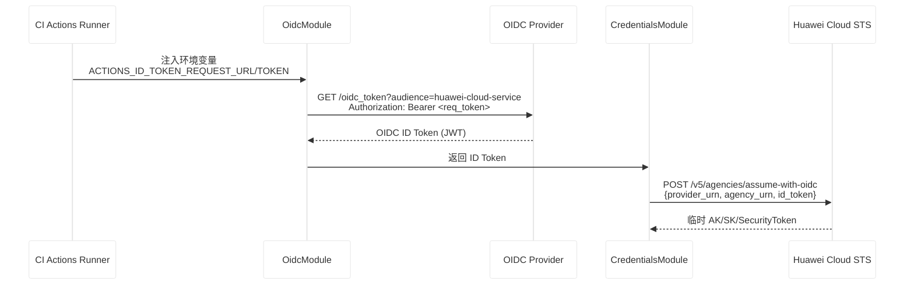
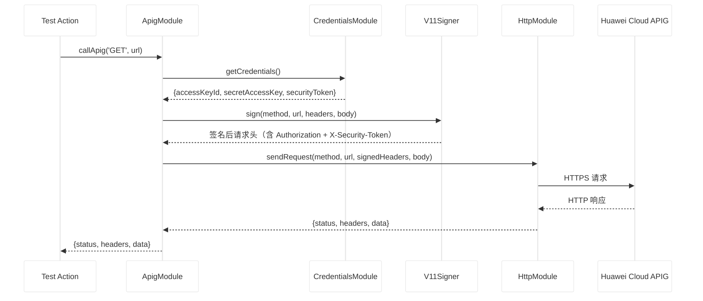
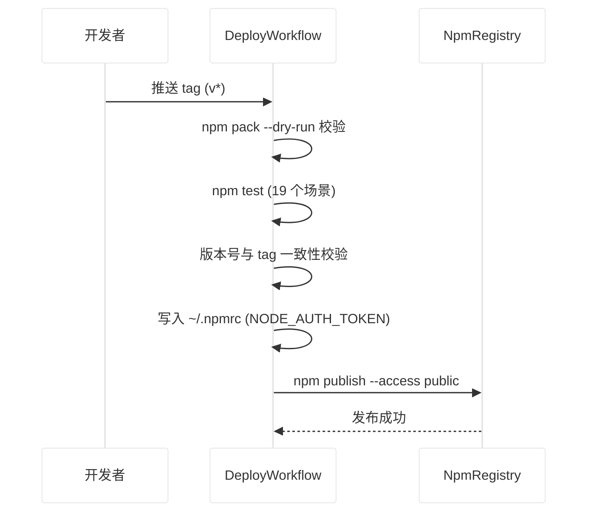
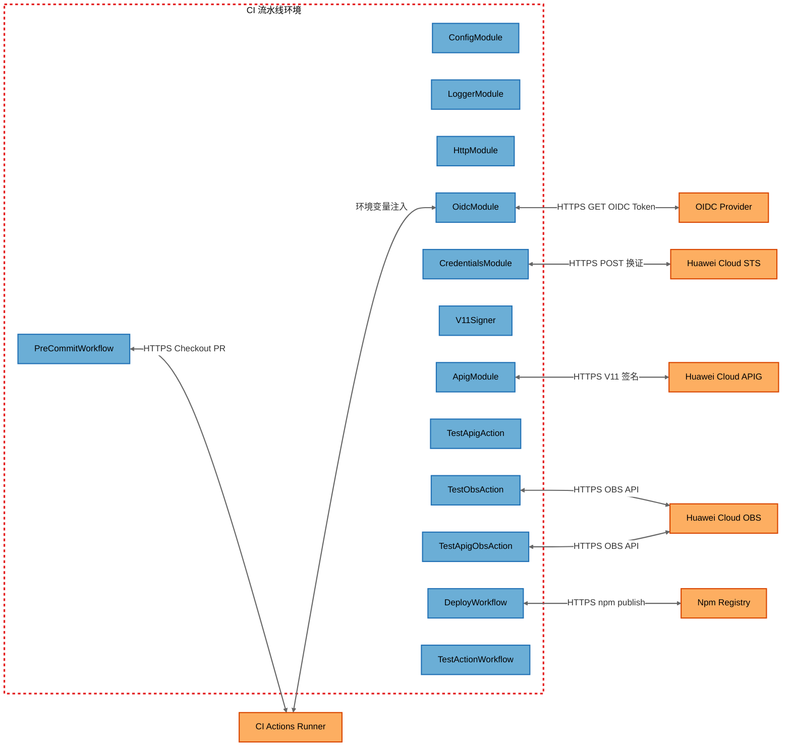

# huaweicloud-oidc-sdk-nodejs 威胁分析报告（STRIDE-A）

## 1. 报告元数据

| 字段                | 值                                                                                                                                                                                                                                                                                                                                                                                                                                                                                                                                                                                       |
| ------------------- | ---------------------------------------------------------------------------------------------------------------------------------------------------------------------------------------------------------------------------------------------------------------------------------------------------------------------------------------------------------------------------------------------------------------------------------------------------------------------------------------------------------------------------------------------------------------------------------------- |
| 分析对象            | @openlibing/huaweicloud-oidc-client（npm 包，SDK 与配套 CI 工作流）                                                                                                                                                                                                                                                                                                                                                                                                                                                                                                                      |
| 仓库                | `https://gitcode.com/openlibing/huaweicloud-oidc-sdk-nodejs.git`                                                                                                                                                                                                                                                                                                                                                                                                                                                                                                                         |
| 分支 / Commit       | `main` / `f61da3c`                                                                                                                                                                                                                                                                                                                                                                                                                                                                                                                                                                       |
| Commit 日期         | 2026-10-09 16:08:44 +0800                                                                                                                                                                                                                                                                                                                                                                                                                                                                                                                                                                |
| 分析模型            | GLM-5.3 · STRIDE-A 威胁建模                                                                                                                                                                                                                                                                                                                                                                                                                                                                                                                                                              |
| 分析开始 / 完成时间 | 2026-10-10 00:54:40 UTC / 2026-10-10 01:02:32 UTC（约 8 分钟）                                                                                                                                                                                                                                                                                                                                                                                                                                                                                                                           |
| 部署分类            | `CI_PIPELINE`（CI 流水线环境：GitCode/GitHub Actions self-hosted runner）                                                                                                                                                                                                                                                                                                                                                                                                                                                                                                                |
| 复核修订记录        | 2026-10-10 二次复核（对照源码逐项）：FIND-01 确认有效（细节修正：ROBOT_TOKEN 不在 pre-commit job 暴露，真实风险为 workflow token pr:write + self-hosted runner 污染）；FIND-06 确认有效（风险升级：~/.npmrc 无清理，token 持久残留 self-hosted runner）；FIND-04 部分有效（降为非安全改进：undici 默认 300s 超时，非"无限期挂起"）；FIND-11 威胁误报但发现相邻真 bug（credentials.js:170 promise 引用误清，归入 P1）；其余 8 项（FIND-02/03/05/07/08/09/10/12）误报。整理版对 FIND-01/06 及抽查项（FIND-03/08/09、credentials.js:170）重新对照代码逐行验证，结论与原报告一致，未发现偏差 |
| 报告版本            | 整理版 v1.0（2026-10-10）                                                                                                                                                                                                                                                                                                                                                                                                                                                                                                                                                                |
| 原始报告路径        | `d:\01zw\安全分析漏洞挖掘\huaweicloud-oidc-sdk-nodejs\threat-model-20261010-010240\威胁分析报告.md`（配套结构化清单 `threat-inventory.json`）                                                                                                                                                                                                                                                                                                                                                                                                                                            |

---

## 2. 分析结论速览

### 2.1 发现状态汇总

| 状态                           | 数量 | 发现编号                                |
| ------------------------------ | ---- | --------------------------------------- |
| ✅ 需修复（安全）              | 2    | FIND-01、FIND-06                        |
| ⚠️ 建议改进（非安全/代码质量） | 1    | FIND-04                                 |
| ℹ️ 设计决策（非漏洞）          | 0    | —                                       |
| ❌ 误报                        | 9    | FIND-02、03、05、07、08、09、10、11、12 |

> 共 12 项发现。说明：FIND-11 威胁本身判定为误报，但其复核过程中发现的相邻真 bug（[credentials.js:170](file:///d:/01zw/安全分析漏洞挖掘/huaweicloud-oidc-sdk-nodejs/src/credentials.js#L170) promise 引用误清）作为独立代码质量问题列入 P1 行动项。

### 2.2 需修复问题（按优先级）

| 优先级 | 发现编号                        | 等级            | 问题概述                                                                                                                                                                                       | 修复方案要点                                                                                                                                                                                                       |
| ------ | ------------------------------- | --------------- | ---------------------------------------------------------------------------------------------------------------------------------------------------------------------------------------------- | ------------------------------------------------------------------------------------------------------------------------------------------------------------------------------------------------------------------ |
| **P0** | FIND-01                         | Critical        | pre-commit 工作流 `pull_request_target` + `allow-unsafe-pr-checkout: true` 导致 fork PR 任意代码执行（RCE）；真实暴露面为 workflow 级 token（`pr: write`）滥用与 self-hosted runner 持久化污染 | 拆分 workflow：检查 job 改用 `pull_request` 事件（不携带 secrets），label job 保留 `pull_request_target`（不检出 PR 代码）；不可直接单行删除 `allow-unsafe-pr-checkout`（会导致 fork PR 流水线失败），必须事件拆分 |
| **P0** | FIND-06                         | High            | deploy.yml 将 NPM_TOKEN 明文写入 `~/.npmrc` 后无清理步骤，Automation token 持久留在 region=cn 的 self-hosted runner 上，后续任意 job 可读                                                      | 发布步骤后追加 `rm -f ~/.npmrc`（`if: always()`），并使用仅具备 publish 权限的 Automation 类型 token 限制泄露影响                                                                                                  |
| **P1** | FIND-04（有效部分）             | Medium          | sendRequest 无显式超时设置，CI 场景下 undici 默认 300s 过长（非"无限期挂起"，属可用性改进而非安全漏洞）                                                                                        | 增加 `AbortController` 超时（建议 30s），支持通过 configure() 或函数参数配置                                                                                                                                       |
| **P1** | FIND-11（复核发现的相邻真 bug） | Low（代码质量） | credentials.js:170 无条件清空 `_credentialPromise`，误清后续并发请求的去重引用，导致并发去重失效、产生多余 STS 调用（浪费配额，非安全问题）                                                    | 第 170 行改为仅当 `_credentialPromise` 仍指向当前 promise 时才置 null                                                                                                                                              |

### 2.3 误报清单及驳回理由

| 发现编号 | 初版定级  | 驳回理由（一句话）                                                                                                                                       |
| -------- | --------- | -------------------------------------------------------------------------------------------------------------------------------------------------------- |
| FIND-02  | Important | 环境变量注入是 AGENTS.md 明文设计的功能（非 Actions 平台接入方式），伪造 JWT 会被华为云 STS 用注册提供商 JWKS 验签拒绝，且能设置环境变量即已完全控制进程 |
| FIND-03  | Important | 客户端代理不做本地验签是业界常态（同 AWS SDK web identity 流程），信任决策方是 STS，Token 经 HTTPS 直取签发方，传输完整性由 TLS 保证                     |
| FIND-05  | Moderate  | iss/aud/sub 均为公开信息（public repo），凭证已脱敏且为 1 小时临时凭证，AK 前 6 位无 SK 不可用，debug 为显式 opt-in                                      |
| FIND-07  | Moderate  | 附注标签是流程规范非安全边界，能推轻量标签的权限同样能推附注标签，且 workflow_dispatch 本就允许无 tag 发布                                               |
| FIND-08  | Moderate  | 真实 OIDC token 的 payload 至少含 iss/aud/sub，段长远超 10 字符，`{10,}` 正则覆盖所有实际场景，脱敏保留的前 20 字符恰为公开 header 段                    |
| FIND-09  | Moderate  | SSRF 不适用于客户端库：调用方为进程内可信代码，仓库内三个 action 的 URL 全部硬编码，URL 可控意味着调用方已被篡改（届时直接调 getCredentials() 即可）     |
| FIND-10  | Low       | 华为云账号 ID 非机密（同 AWS account ID，官方明确不算 secret），出现在 URN 中是零配置设计的必然，仅知 ID 无凭证无任何用处                                |
| FIND-11  | Low       | "配置变更后返回旧配置凭证"是请求级一致性的预期行为，非漏洞（复核发现的 credentials.js:170 相邻真 bug 另列入 P1）                                         |
| FIND-12  | Low       | 客户端 SDK 不做证书锁定是业界实践（AWS/GCP SDK 均不做），华为云 CA 轮换会直接打断所有用户，标准 CA 校验已足够                                            |

---

## 3. 系统架构概述

### 3.1 系统目的

`@openlibing/huaweicloud-oidc-client` 是 openlibing 平台对接华为云的 SDK（npm 包），提供基于 OIDC 免 AK/SK 的认证与调用能力。核心链路：

```
CI 流水线 OIDC ID Token（GitHub Actions / GitCode Actions）
  -> 华为云 STS AssumeAgencyWithOIDC 换临时凭证
    -> OBS 上传 / APIG 调用（V11-HMAC-SHA256 签名 + X-Security-Token）
```

### 3.2 技术栈

| 技术                      | 用途                          |
| ------------------------- | ----------------------------- |
| Node.js 18+               | 运行时（内置 fetch、crypto）  |
| undici ^5.29.0            | Node 16 回退 HTTP 客户端      |
| esdk-obs-nodejs 3.26.2    | OBS 上传（test actions）      |
| @actions/core             | CI 流水线交互（test actions） |
| ncc                       | Action 产物打包内联           |
| HMAC-SHA256 / HKDF-SHA256 | APIG V11 签名                 |

### 3.3 部署模型与分类

**部署分类：`CI_PIPELINE`**（CI 流水线环境）

SDK 作为库被三个 test action 引入，运行在 GitCode/GitHub Actions 的 self-hosted runner 上（deploy.yml 与 test-action-workflow.yml 使用 `region=cn` 标签，pre-commit.yml 的检查 job 使用 `region=overseas` 标签）。Runner 具有出站网络访问能力（HTTPS 到华为云端点），无入站监听。CI 流水线通过 `id-token: write` 权限申请 OIDC JWT。

### 3.4 组件清单

| 组件 ID            | 类型     | 锚定文件                                                                                                                                                      | 信任边界   | 说明                                        |
| ------------------ | -------- | ------------------------------------------------------------------------------------------------------------------------------------------------------------- | ---------- | ------------------------------------------- |
| ConfigModule       | Process  | [src/config.js](file:///d:/01zw/安全分析漏洞挖掘/huaweicloud-oidc-sdk-nodejs/src/config.js)                                                                   | CIPipeline | 内置配置 + configure() 覆盖（模块级单例）   |
| LoggerModule       | Process  | [src/logger.js](file:///d:/01zw/安全分析漏洞挖掘/huaweicloud-oidc-sdk-nodejs/src/logger.js)                                                                   | CIPipeline | 分级日志 + 敏感字段脱敏工具                 |
| HttpModule         | Process  | [src/http.js](file:///d:/01zw/安全分析漏洞挖掘/huaweicloud-oidc-sdk-nodejs/src/http.js)                                                                       | CIPipeline | sendRequest HTTPS 请求工具                  |
| OidcModule         | Process  | [src/oidc.js](file:///d:/01zw/安全分析漏洞挖掘/huaweicloud-oidc-sdk-nodejs/src/oidc.js)                                                                       | CIPipeline | OIDC ID Token 申请                          |
| CredentialsModule  | Process  | [src/credentials.js](file:///d:/01zw/安全分析漏洞挖掘/huaweicloud-oidc-sdk-nodejs/src/credentials.js)                                                         | CIPipeline | OIDC → STS 换证（缓存/force/并发去重）      |
| V11Signer          | Process  | [src/signer-v11.js](file:///d:/01zw/安全分析漏洞挖掘/huaweicloud-oidc-sdk-nodejs/src/signer-v11.js)                                                           | CIPipeline | APIG V11-HMAC-SHA256 签名器                 |
| ApigModule         | Process  | [src/apig.js](file:///d:/01zw/安全分析漏洞挖掘/huaweicloud-oidc-sdk-nodejs/src/apig.js)                                                                       | CIPipeline | callApig 一行调用 APIG                      |
| TestApigAction     | Process  | [.gitcode/actions/test-apig-action/index.js](file:///d:/01zw/安全分析漏洞挖掘/huaweicloud-oidc-sdk-nodejs/.gitcode/actions/test-apig-action/index.js)         | CIPipeline | APIG 调用测试 Action                        |
| TestObsAction      | Process  | [.gitcode/actions/test-obs-action/index.js](file:///d:/01zw/安全分析漏洞挖掘/huaweicloud-oidc-sdk-nodejs/.gitcode/actions/test-obs-action/index.js)           | CIPipeline | OBS 上传测试 Action                         |
| TestApigObsAction  | Process  | [.gitcode/actions/test-apig-obs-action/index.js](file:///d:/01zw/安全分析漏洞挖掘/huaweicloud-oidc-sdk-nodejs/.gitcode/actions/test-apig-obs-action/index.js) | CIPipeline | APIG + OBS 组合测试 Action                  |
| DeployWorkflow     | Process  | [.gitcode/workflows/deploy.yml](file:///d:/01zw/安全分析漏洞挖掘/huaweicloud-oidc-sdk-nodejs/.gitcode/workflows/deploy.yml)                                   | CIPipeline | npm 发布流水线                              |
| TestActionWorkflow | Process  | [.gitcode/workflows/test-action-workflow.yml](file:///d:/01zw/安全分析漏洞挖掘/huaweicloud-oidc-sdk-nodejs/.gitcode/workflows/test-action-workflow.yml)       | CIPipeline | 测试工作流                                  |
| PreCommitWorkflow  | Process  | [.gitcode/workflows/pre-commit.yml](file:///d:/01zw/安全分析漏洞挖掘/huaweicloud-oidc-sdk-nodejs/.gitcode/workflows/pre-commit.yml)                           | CIPipeline | Pre-commit 检查工作流                       |
| CIActionsRunner    | External | —                                                                                                                                                             | External   | GitHub/GitCode Actions Runner（外部执行者） |
| OIDCProvider       | External | —                                                                                                                                                             | External   | OIDC Token 签发方（GitHub/GitCode Actions） |
| HuaweiCloudSTS     | External | —                                                                                                                                                             | External   | 华为云 STS 端点                             |
| HuaweiCloudAPIG    | External | —                                                                                                                                                             | External   | 华为云 APIG 网关                            |
| HuaweiCloudOBS     | External | —                                                                                                                                                             | External   | 华为云 OBS 存储                             |
| NpmRegistry        | External | —                                                                                                                                                             | External   | npm 注册表                                  |

### 3.5 组件暴露表

| 组件               | 监听地址     | 认证屏障      | 外部可达性       | 最低前提条件           | 推导层级 |
| ------------------ | ------------ | ------------- | ---------------- | ---------------------- | -------- |
| ConfigModule       | 无（库模块） | 无            | 不可达           | Local Process Access   | T2       |
| LoggerModule       | 无（库模块） | 无            | 不可达           | Local Process Access   | T2       |
| HttpModule         | 无（库模块） | 无            | 不可达           | Local Process Access   | T2       |
| OidcModule         | 无（库模块） | 无            | 不可达           | Local Process Access   | T2       |
| CredentialsModule  | 无（库模块） | 无            | 不可达           | Local Process Access   | T2       |
| V11Signer          | 无（库模块） | 无            | 不可达           | Local Process Access   | T2       |
| ApigModule         | 无（库模块） | 无            | 不可达           | Local Process Access   | T2       |
| TestApigAction     | 无（CI Job） | CI 触发       | CI Runner 不可达 | Authenticated User     | T2       |
| TestObsAction      | 无（CI Job） | CI 触发       | CI Runner 不可达 | Authenticated User     | T2       |
| TestApigObsAction  | 无（CI Job） | CI 触发       | CI Runner 不可达 | Authenticated User     | T2       |
| DeployWorkflow     | 无（CI Job） | Tag 推送/手动 | CI Runner 不可达 | Privileged User        | T2       |
| TestActionWorkflow | 无（CI Job） | Push/手动     | CI Runner 不可达 | Authenticated User     | T2       |
| PreCommitWorkflow  | 无（CI Job） | PR/Push       | CI Runner 不可达 | None（fork PR 可触发） | T1       |

### 3.6 数据流与信任边界

**信任边界：**

| 边界 ID    | 显示名称      | 包含组件                                                                                                                                                                                              |
| ---------- | ------------- | ----------------------------------------------------------------------------------------------------------------------------------------------------------------------------------------------------- |
| CIPipeline | CI 流水线环境 | ConfigModule, LoggerModule, HttpModule, OidcModule, CredentialsModule, V11Signer, ApigModule, TestApigAction, TestObsAction, TestApigObsAction, DeployWorkflow, TestActionWorkflow, PreCommitWorkflow |
| External   | 外部云服务    | OIDCProvider, HuaweiCloudSTS, HuaweiCloudAPIG, HuaweiCloudOBS, NpmRegistry                                                                                                                            |

**数据流：**

| 流 ID | 源                | 目标            | 协议           | 说明                                        |
| ----- | ----------------- | --------------- | -------------- | ------------------------------------------- |
| DF01  | CIActionsRunner   | OidcModule      | 环境变量       | OIDC 请求 URL/Token 注入                    |
| DF02  | OidcModule        | OIDCProvider    | HTTPS GET      | 申请 OIDC ID Token                          |
| DF03  | CredentialsModule | HuaweiCloudSTS  | HTTPS POST     | AssumeAgencyWithOIDC 换证                   |
| DF04  | ApigModule        | HuaweiCloudAPIG | HTTPS V11 签名 | APIG 调用                                   |
| DF05  | TestObsAction     | HuaweiCloudOBS  | HTTPS OBS API  | OBS 上传                                    |
| DF06  | DeployWorkflow    | NpmRegistry     | HTTPS npm API  | npm 发布                                    |
| DF07  | ConfigModule      | 所有 SDK 模块   | 进程内引用     | 配置共享（模块级单例，广播至所有 SDK 模块） |
| DF08  | PreCommitWorkflow | CIActionsRunner | HTTPS Checkout | PR 代码检出                                 |

**关键场景 1：OIDC 免密换证流程**



**关键场景 2：APIG 调用流程**



**关键场景 3：npm 发布流程**



### 3.7 已有安全控制

| 控制              | 说明                                                                                                                                              |
| ----------------- | ------------------------------------------------------------------------------------------------------------------------------------------------- |
| OIDC 免密认证     | 无长期 AK/SK 落盘，CI 流水线签发的短期 ID Token 换取 1 小时临时凭证（durationSeconds=3600）                                                       |
| 全链路 HTTPS      | OIDC 申请、STS 换证、APIG 调用、OBS 上传均使用 HTTPS 端点                                                                                         |
| 日志脱敏          | SENSITIVE_KEYS 敏感字段名脱敏 + JWT 正则识别脱敏（maskText/maskDeep/maskBody/maskHeaders）；调试日志默认关闭（debug: false，需显式 opt-in）       |
| 凭证缓存治理      | 300 秒提前刷新缓冲（refreshBufferSeconds）、force 强制刷新、`_credentialPromise` 并发去重、`_configGeneration` 配置代次防止旧配置换证结果回写缓存 |
| APIG V11 签名     | V11-HMAC-SHA256 请求签名（HKDF 派生密钥），X-Security-Token 随签名头传递                                                                          |
| Workflow 权限声明 | pre-commit.yml（repository: read + pr: write）、deploy.yml（repository: read）、test-action-workflow.yml 按声明最小权限                           |
| 发布前校验        | npm pack --dry-run、npm test（19 个场景）、版本号与 tag 一致性校验                                                                                |

---

## 4. STRIDE-A 威胁分析

**分析指标：**

| 统计项              | 数量                                              |
| ------------------- | ------------------------------------------------- |
| 总组件数            | 19（含 6 个外部实体）                             |
| 总威胁数            | 69                                                |
| Tier 1 / 2 / 3 威胁 | 4 / 36 / 29                                       |
| STRIDE 威胁分布     | S:6、T:16、R:2、I:16、D:11、E:5、A:13             |
| 总发现数            | 12（Tier 1 发现 1、Tier 2 发现 8、Tier 3 发现 3） |

**STRIDE-A 分类参考：**

| 类别                                  | 说明                               |
| ------------------------------------- | ---------------------------------- |
| S — 欺骗 (Spoofing)                   | 冒充合法身份                       |
| T — 篡改 (Tampering)                  | 修改数据或代码                     |
| R — 否认 (Repudiation)                | 否认操作行为                       |
| I — 信息泄露 (Information Disclosure) | 敏感信息暴露                       |
| D — 拒绝服务 (Denial of Service)      | 服务中断或资源耗尽                 |
| E — 权限提升 (Elevation of Privilege) | 获得未授权权限                     |
| A — 滥用 (Abuse)                      | 业务逻辑滥用、工作流操纵、功能误用 |

### 4.1 数据流图



**可利用性层级说明（Tier）：**

| 层级   | 标签     | 前提条件 | 赋值规则                                              |
| ------ | -------- | -------- | ----------------------------------------------------- |
| Tier 1 | 直接暴露 | 无       | 未认证外部攻击者，无需任何先决访问                    |
| Tier 2 | 条件风险 | 单一前提 | 需要一种形式的访问（认证用户/特权用户/内网/本地进程） |
| Tier 3 | 纵深防御 | 多重前提 | 需要主机访问/管理员凭证/组件沦陷或多重前提            |

### 4.2 威胁清单总表

| 威胁 ID | STRIDE | 威胁描述                                                                                                                | 组件               | 利用前提                                      | Tier | 对应 FIND                                            |
| ------- | ------ | ----------------------------------------------------------------------------------------------------------------------- | ------------------ | --------------------------------------------- | ---- | ---------------------------------------------------- |
| T01.S   | S      | configure() 可覆盖 accountId/agencyName/oidcProviderName 等安全相关字段且无身份验证，可将 STS 换证指向攻击者的账号/委托 | ConfigModule       | Local Process Access                          | T2   | FIND-10（上下文）                                    |
| T01.T   | T      | 模块级单例 cfg 进程内共享，可直接修改属性绕过 configure() 白名单                                                        | ConfigModule       | Local Process Access                          | T2   | FIND-10（上下文）                                    |
| T01.I   | I      | 硬编码 accountId 在源码与 npm 包中可见，暴露华为云账号 ID                                                               | ConfigModule       | Local Process Access                          | T2   | FIND-10                                              |
| T01.E   | E      | configure() 无权限检查，可更改 region / 将 oidcProviderName 指向攻击者注册的提供商                                      | ConfigModule       | Local Process Access + OIDC Provider 注册权限 | T3   | FIND-10（上下文）                                    |
| T01.A   | A      | 恶意频繁调用 configure() 变更身份字段，触发缓存反复失效致 STS 换证风暴                                                  | ConfigModule       | Local Process Access + 网络访问               | T3   | FIND-11（上下文）                                    |
| T02.T   | T      | 外部数据未转义写入日志，可注入换行/控制字符伪造审计条目                                                                 | LoggerModule       | Authenticated User                            | T2   | FIND-08                                              |
| T02.I   | I      | JWT 脱敏正则仅匹配标准格式，段长不足 10 字符的 Token 可能不脱敏                                                         | LoggerModule       | Authenticated User                            | T2   | FIND-08                                              |
| T02.D   | D      | maskDeep() 递归深层嵌套 JSON 可能产生大量临时对象，极端情况内存/性能问题                                                | LoggerModule       | Authenticated User + debug: true              | T2   | FIND-04                                              |
| T02.R   | R      | 日志仅输出 console，无防篡改存储或远程聚合                                                                              | LoggerModule       | Host/OS Access                                | T3   | FIND-05                                              |
| T02.A   | A      | 生产 CI 开 debug: true 打印所有请求/响应详情，泄露运维信息                                                              | LoggerModule       | Authenticated User + 工作流触发权限           | T3   | FIND-05                                              |
| T03.S   | S      | sendRequest 未校验 URL 协议，传入 http:// 将明文发送                                                                    | HttpModule         | Local Process Access                          | T2   | FIND-09                                              |
| T03.I   | I      | 调试模式响应体完整打印（clip 4096 字符），非标准字段名或嵌套结构可能脱敏遗漏                                            | HttpModule         | Authenticated User + debug: true              | T2   | FIND-05                                              |
| T03.D   | D      | sendRequest 无显式超时，远端不响应时请求长时间挂起，阻塞 CI Job                                                         | HttpModule         | Local Process Access                          | T2   | FIND-04                                              |
| T03.T   | T      | 未做 TLS 证书锁定，DNS 劫持/CA 入侵时中间人可拦截换证请求返回伪造凭证                                                   | HttpModule         | Network MITM + DNS 劫持                       | T3   | FIND-12                                              |
| T03.A   | A      | sendRequest 接受任意 URL，可发起 SSRF 泄露请求头凭证                                                                    | HttpModule         | Local Process Access + URL 可控               | T3   | FIND-09                                              |
| T04.S   | S      | HUAWEICLOUD_OIDC_TOKEN 允许注入 OIDC Token，绕过流水线 OIDC 申请流程                                                    | OidcModule         | Local Process Access                          | T2   | FIND-02                                              |
| T04.T   | T      | SDK 不验证 OIDC JWT 签名，Token 传输中被篡改时无法本地检测                                                              | OidcModule         | Local Process Access                          | T2   | FIND-03                                              |
| T04.I   | I      | 调试日志完整打印 Token 声明（iss/aud/azp/sub），泄露流水线身份信息                                                      | OidcModule         | Authenticated User + debug: true              | T3   | FIND-05                                              |
| T04.A   | A      | 环境变量优先于流水线申请，变量残留（如上一 Job）导致使用错误 Token                                                      | OidcModule         | Local Process Access + 环境变量残留           | T3   | FIND-02                                              |
| T05.S   | S      | 缓存凭证在 refreshBufferSeconds（300s）缓冲内有效，权限撤销后仍可使用，构成提权窗口                                     | CredentialsModule  | Local Process Access                          | T2   | FIND-11（上下文）                                    |
| T05.T   | T      | 并发去重机制下，MITM 返回 200+伪造凭证会扩散给所有并发等待方                                                            | CredentialsModule  | Local Process Access + Network MITM           | T2   | FIND-12（上下文）                                    |
| T05.I   | I      | 临时凭证驻留模块级变量 _credentials，进程内存可被 dump                                                                  | CredentialsModule  | Local Process Access                          | T2   | FIND-05（上下文）                                    |
| T05.D   | D      | 并发去重单点阻塞：唯一 STS 请求挂起时所有并发 getCredentials() 调用阻塞                                                 | CredentialsModule  | Local Process Access                          | T2   | FIND-04                                              |
| T05.R   | R      | 凭证使用无审计日志，不记录哪个调用方使用了凭证、用于哪个 API                                                            | CredentialsModule  | Host/OS Access                                | T3   | FIND-05（上下文）                                    |
| T05.E   | E      | force: true 强制刷新无频率限制，可反复触发换证致 STS 限流/安全告警                                                      | CredentialsModule  | Local Process Access + 网络访问               | T3   | FIND-04（上下文）                                    |
| T05.A   | A      | 配置换证进行中 configure() 变更，旧配置结果不回写缓存但仍返回调用方                                                     | CredentialsModule  | Local Process Access + 时序竞争               | T3   | FIND-11                                              |
| T06.T   | T      | V11 签名可重放：x-sdk-date 由客户端生成，无服务端时间窗口校验时可重放                                                   | V11Signer          | Local Process Access + 网络截获               | T2   | FIND-12（上下文）                                    |
| T06.I   | I      | HKDF 派生密钥与签名均在内存中，进程 dump 可提取 AK/SK 重建签名器                                                        | V11Signer          | Local Process Access                          | T2   | FIND-05（上下文）                                    |
| T06.A   | A      | Key/Secret 公开属性可被外部代码直接读取/修改，可在签名后篡改签名头                                                      | V11Signer          | Local Process Access                          | T3   | FIND-09（上下文）                                    |
| T07.T   | T      | X-Security-Token 明文置于请求头传输，TLS 降级/截获时可被提取                                                            | ApigModule         | Local Process Access + Network MITM           | T2   | FIND-12（上下文）                                    |
| T07.D   | D      | callApig 无重试限制和速率控制，可无限调用致 APIG 限流/安全告警                                                          | ApigModule         | Local Process Access + 网络访问               | T3   | FIND-04（上下文）                                    |
| T07.A   | A      | callApig 接受任意 URL，SSRF 可将签名头中的 X-Security-Token 泄露给目标服务器                                            | ApigModule         | Local Process Access + URL 可控               | T3   | FIND-09                                              |
| T08.I   | I      | 硬编码 APIG 端点 URL 通过 npm 包/dist 产物可见，暴露内部 API 地址                                                       | TestApigAction     | Authenticated User                            | T2   | FIND-10（上下文）                                    |
| T08.A   | A      | 反例测试 URL 硬编码，端点变更/失效时反例测试产生虚假安全感                                                              | TestApigAction     | Host/OS Access                                | T3   | FIND-10（上下文）                                    |
| T09.T   | T      | file-path 仅用 fs.existsSync 校验存在性、path.basename 取文件名，未做白名单校验                                         | TestObsAction      | Authenticated User（Action 输入）             | T2   | FIND-09（上下文）                                    |
| T09.I   | I      | 临时凭证（AK/SK/SecurityToken）直接传给 ObsClient，进程内存明文存在                                                     | TestObsAction      | Local Process Access                          | T2   | FIND-05（上下文）                                    |
| T09.D   | D      | 上传文件大小无限制，大文件可耗尽 CI Runner 内存与网络带宽                                                               | TestObsAction      | Authenticated User + 大文件                   | T3   | FIND-04（上下文）                                    |
| T09.A   | A      | 桶名 openlibing-gitcode-action 硬编码，任何有 OIDC 权限的 CI Job 可上传，无路径级 ACL                                   | TestObsAction      | Authenticated User                            | T3   | FIND-10（上下文）                                    |
| T10.A   | A      | 复用缓存凭证遇 STS 权限生效延迟（OBS 403 问题），force 刷新默认未启用                                                   | TestApigObsAction  | Local Process Access                          | T3   | FIND-11（上下文）                                    |
| T11.S   | S      | workflow_dispatch 允许有仓库写权限用户绕过 tag 流程直接触发 npm 发布                                                    | DeployWorkflow     | Privileged User                               | T2   | FIND-07                                              |
| T11.I   | I      | NPM_TOKEN 经 env: NODE_AUTH_TOKEN 注入进程环境并写入 ~/.npmrc，恶意 step 可提取                                         | DeployWorkflow     | Privileged User                               | T2   | FIND-06                                              |
| T11.T   | T      | npm 发布无包完整性签名，registry 被入侵/包名被抢注时下游可能安装恶意版本                                                | DeployWorkflow     | NpmRegistry 沦陷                              | T3   | FIND-07（上下文）                                    |
| T11.E   | E      | tag 触发发布无签名验证，不要求附注标签，有 push 权限者可推任意 tag 触发发布                                             | DeployWorkflow     | Privileged User（push 权限）                  | T3   | FIND-07                                              |
| T11.A   | A      | 发布前 npm test 运行在 self-hosted runner，runner 被污染（如 node_modules 篡改）时测试可被绕过                          | DeployWorkflow     | Host/OS Access + Runner 污染                  | T3   | FIND-07（上下文）                                    |
| T12.T   | T      | id-token: write 权限在 job 级别声明，三个 job 均获 OIDC 签发能力，任一 Action 被篡改可滥用                              | TestActionWorkflow | Authenticated User                            | T2   | FIND-05（上下文）                                    |
| T12.I   | I      | debug 输入可开启 SDK 调试日志，CI 日志对所有有仓库读权限用户可见                                                        | TestActionWorkflow | Authenticated User                            | T2   | FIND-05                                              |
| T12.E   | E      | self-hosted runner（region=cn）持久化状态可能跨 Job 泄露（环境变量残留、临时文件未清理）                                | TestActionWorkflow | Host/OS Access                                | T3   | FIND-06（上下文）                                    |
| T12.A   | A      | push main 触发三个测试 Job，无速率限制消耗 CI 资源                                                                      | TestActionWorkflow | Privileged User                               | T3   | FIND-04（上下文）                                    |
| T13.S   | S      | pull_request_target + allow-unsafe-pr-checkout：fork PR 恶意代码在 main 分支信任上下文执行                              | PreCommitWorkflow  | 无                                            | T1   | FIND-01                                              |
| T13.T   | T      | unsafe 检出关闭 fork PR 拦截，恶意 PR 代码可修改 CI 环境文件、注入后续 step 恶意命令                                    | PreCommitWorkflow  | 无                                            | T1   | FIND-01                                              |
| T13.I   | I      | 恶意 PR 代码运行在 main 分支上下文，可访问 ROBOT_TOKEN 与仓库级 secrets 并外泄                                          | PreCommitWorkflow  | 无                                            | T1   | FIND-01（细节修正：ROBOT_TOKEN 仅在 label job 暴露） |
| T13.D   | D      | /pre-commit 评论即触发执行，可反复评论消耗 CI 资源                                                                      | PreCommitWorkflow  | Authenticated User                            | T2   | FIND-04（上下文）                                    |
| T13.E   | E      | region=overseas runner 与 region=cn runner 安全基线不同，跨区域状态泄露风险                                             | PreCommitWorkflow  | Host/OS Access                                | T3   | FIND-01（上下文）                                    |
| T13.A   | A      | 双触发机制：先提交恶意 PR 再评论 /pre-commit，实现代码执行                                                              | PreCommitWorkflow  | 无                                            | T1   | FIND-01                                              |
| T14.T   | T      | OIDC Provider 密钥泄露可伪造任意 iss/aud/sub 的 JWT，骗过 STS 信任策略                                                  | OIDCProvider       | OIDCProvider 沦陷                             | T2   | FIND-12（上下文）                                    |
| T14.I   | I      | Token 声明（sub/iss/aud）泄露可帮助攻击者了解 CI 流水线身份                                                             | OIDCProvider       | Authenticated User                            | T2   | FIND-05（上下文）                                    |
| T14.D   | D      | OIDC Provider 不可用时所有换证流程失败，SDK 功能不可用                                                                  | OIDCProvider       | Provider 不可用                               | T3   | FIND-04（上下文）                                    |
| T15.T   | T      | STS 返回的临时凭证传输中被截获（TLS 降级），有效期内可冒用访问华为云资源                                                | HuaweiCloudSTS     | Network MITM                                  | T2   | FIND-12                                              |
| T15.I   | I      | STS 响应含 access_key_id/secret_access_key/security_token，被日志记录或截获可滥用                                       | HuaweiCloudSTS     | Network MITM + debug: true                    | T2   | FIND-05                                              |
| T15.D   | D      | STS 限流/不可用时 getCredentials() 失败，依赖凭证的操作全部不可用                                                       | HuaweiCloudSTS     | STS 服务不可用                                | T3   | FIND-04（上下文）                                    |
| T16.T   | T      | APIG 端点未强制 TLS 时签名请求可被中间人截获篡改（V11 仅保证完整性）                                                    | HuaweiCloudAPIG    | Network MITM                                  | T2   | FIND-12（上下文）                                    |
| T16.I   | I      | APIG 响应可能包含敏感业务数据，被截获或日志记录可泄露                                                                   | HuaweiCloudAPIG    | Network MITM                                  | T2   | FIND-05（上下文）                                    |
| T16.D   | D      | APIG 遭 DDoS 时调用失败/超时，SDK 无重试/熔断，CI 流水线直接失败                                                        | HuaweiCloudAPIG    | APIG 服务不可用                               | T3   | FIND-04（上下文）                                    |
| T17.T   | T      | OBS 上传凭证有效期内被截获，攻击者可修改/删除已上传对象                                                                 | HuaweiCloudOBS     | Network MITM                                  | T2   | FIND-12（上下文）                                    |
| T17.I   | I      | 桶 openlibing-gitcode-action 访问策略配置宽松时，已上传文件可被未授权访问                                               | HuaweiCloudOBS     | 桶策略配置错误                                | T2   | 需复核（V-05）                                       |
| T17.D   | D      | OBS 服务不可用时上传失败，SDK 无重试，CI 流水线直接失败                                                                 | HuaweiCloudOBS     | OBS 服务不可用                                | T3   | FIND-04（上下文）                                    |
| T18.T   | T      | NPM_TOKEN 泄露可发布恶意版本，下游用户安装后可能执行恶意代码                                                            | NpmRegistry        | NPM_TOKEN 泄露                                | T2   | FIND-06                                              |
| T18.I   | I      | npm 包含源码与 dist 产物，硬编码的 accountId、APIG URL 等公开可见                                                       | NpmRegistry        | Authenticated User                            | T2   | FIND-10（上下文）                                    |
| T18.D   | D      | npm registry 不可用时发布失败，下游用户无法安装新版本                                                                   | NpmRegistry        | Registry 不可用                               | T3   | FIND-04（上下文）                                    |

### 4.3 各类威胁详细分析

#### S — 欺骗（Spoofing，6 项）

| 威胁 ID | 组件              | Tier | 前提条件             | 威胁描述                                                                                                                                                                                                                                                                                    |
| ------- | ----------------- | ---- | -------------------- | ------------------------------------------------------------------------------------------------------------------------------------------------------------------------------------------------------------------------------------------------------------------------------------------- |
| T01.S   | ConfigModule      | T2   | Local Process Access | configure() 允许覆盖 accountId/agencyName/oidcProviderName 等安全相关字段，无身份验证。攻击者若能调用 configure()，可将 STS 换证指向自己的账号/委托，获取该委托下的临时凭证                                                                                                                 |
| T03.S   | HttpModule        | T2   | Local Process Access | sendRequest 未校验 URL 协议——若传入 `http://` URL，请求将以明文发送，中间人可截获/篡改请求内容（含 OIDC Token、临时凭证等）                                                                                                                                                                 |
| T04.S   | OidcModule        | T2   | Local Process Access | 环境变量 `HUAWEICLOUD_OIDC_TOKEN` 允许直接注入 OIDC Token，绕过 Actions 流水线的 OIDC 申请流程。攻击者若能设置环境变量，可注入伪造 JWT 骗过 STS（若 STS 未严格验证签名）                                                                                                                    |
| T05.S   | CredentialsModule | T2   | Local Process Access | 缓存凭证在 refreshBufferSeconds（300 秒）缓冲内有效，但华为云 IAM 权限可能在此期间被撤销。已缓存的凭证在过期前仍可使用，构成权限提升窗口                                                                                                                                                    |
| T11.S   | DeployWorkflow    | T2   | Privileged User      | `workflow_dispatch` 允许手动触发发布——任何有仓库写权限的用户可在未经 tag 流程的情况下直接触发 npm 发布                                                                                                                                                                                      |
| T13.S   | PreCommitWorkflow | T1   | 无                   | `pull_request_target` 事件使用 main 分支的 workflow 配置，但 `allow-unsafe-pr-checkout: true` 检出 PR 的代码。fork PR 的代码在 main 分支的信任上下文中执行——恶意 PR 可通过 pre-commit 钩子执行任意代码（复核修正：pre-commit job 本身未引用 secrets，暴露面为 workflow 级 token 与 runner） |

#### T — 篡改（Tampering，16 项）

| 威胁 ID | 组件               | Tier | 前提条件                            | 威胁描述                                                                                                                                                                                                                             |
| ------- | ------------------ | ---- | ----------------------------------- | ------------------------------------------------------------------------------------------------------------------------------------------------------------------------------------------------------------------------------------ |
| T01.T   | ConfigModule       | T2   | Local Process Access                | 模块级单例 cfg 在进程内共享，任何能引入 config.js 的代码均可直接修改 cfg 对象属性，绕过 configure() 的白名单限制                                                                                                                     |
| T02.T   | LoggerModule       | T2   | Authenticated User                  | 日志注入：外部数据（如 STS 错误响应、APIG 响应）未经转义直接写入日志，攻击者可注入换行或控制字符伪造日志条目，混淆审计追踪                                                                                                           |
| T03.T   | HttpModule         | T3   | Network MITM + DNS 劫持             | 未做 TLS 证书锁定（certificate pinning），若 DNS 被劫持或 CA 被入侵，中间人可拦截 STS 换证请求并返回伪造凭证                                                                                                                         |
| T04.T   | OidcModule         | T2   | Local Process Access                | SDK 不验证 OIDC JWT 的签名——获取 Token 后直接传给 STS，不做本地签名校验。若 Token 在传输过程中被篡改，SDK 无法检测                                                                                                                   |
| T05.T   | CredentialsModule  | T2   | Local Process Access + Network MITM | _credentialPromise 并发去重机制：若第一次换证请求返回错误响应（非 200），promise 被 reject 并清空。但若返回 200 带伪造凭证（MITM 场景），所有并发等待方将获得同一伪造凭证                                                            |
| T06.T   | V11Signer          | T2   | Local Process Access + 网络截获     | V11 签名基于请求内容的 HMAC-SHA256，但 x-sdk-date 时间戳由客户端生成。若攻击者截获一个有效签名请求，在 x-sdk-date 时间内（无服务端时间窗口校验时）可重放该请求                                                                       |
| T07.T   | ApigModule         | T2   | Local Process Access + Network MITM | callApig 将 X-Security-Token 注入请求头后由 V11Signer 签名。但 X-Security-Token 本身是明文放在请求头中传输的，若 TLS 被降级/截获，Token 可被提取                                                                                     |
| T09.T   | TestObsAction      | T2   | Authenticated User（Action 输入）   | file-path 输入仅用 `fs.existsSync` 校验存在性，用 `path.basename` 取文件名。但 `path.basename` 不防止目录遍历——若文件名包含 `..`，objectKey 可能指向非预期 OBS 路径。实际 `path.basename` 会提取最后一段，风险较低，但未做白名单校验 |
| T11.T   | DeployWorkflow     | T3   | NpmRegistry 沦陷                    | npm 发布无包完整性签名（仅 npm registry 的默认校验）。若 npm registry 被入侵或包名被抢注，下游用户可能安装到恶意版本                                                                                                                 |
| T12.T   | TestActionWorkflow | T2   | Authenticated User                  | `id-token: write` 权限在 job 级别声明，所有三个 job 均获得 OIDC Token 签发能力。若任一 job 的 Action 被篡改（如 checkout 出的代码被注入恶意逻辑），可滥用 OIDC Token                                                                 |
| T13.T   | PreCommitWorkflow  | T1   | 无                                  | `allow-unsafe-pr-checkout: true` 显式关闭了 fork PR 检出拦截。恶意 PR 的代码在 pre-commit step 中运行，可修改 CI 环境中的文件、注入后续 step 的恶意命令                                                                              |
| T14.T   | OIDCProvider       | T2   | OIDCProvider 沦陷                   | OIDC Provider 签发的 Token 若密钥泄露或被入侵，攻击者可伪造任意 iss/aud/sub 的 JWT，骗过华为云 STS 信任策略                                                                                                                          |
| T15.T   | HuaweiCloudSTS     | T2   | Network MITM                        | STS 返回的临时凭证在传输中若被截获（TLS 降级攻击），攻击者可在凭证有效期内冒用该凭证访问华为云资源                                                                                                                                   |
| T16.T   | HuaweiCloudAPIG    | T2   | Network MITM                        | APIG 端点若未强制 TLS 或允许 HTTP 降级，签名请求可被中间人截获并篡改。V11 签名仅保证请求完整性，不保证传输机密性                                                                                                                     |
| T17.T   | HuaweiCloudOBS     | T2   | Network MITM                        | OBS 上传使用临时凭证，若凭证在有效期内被截获，攻击者可修改/删除已上传的对象                                                                                                                                                          |
| T18.T   | NpmRegistry        | T2   | NPM_TOKEN 泄露                      | 若 NPM_TOKEN 泄露，攻击者可发布恶意版本的 @openlibing/huaweicloud-oidc-client，下游用户安装后可能执行恶意代码                                                                                                                        |

#### R — 否认（Repudiation，2 项）

| 威胁 ID | 组件              | Tier | 前提条件       | 威胁描述                                                                                         |
| ------- | ----------------- | ---- | -------------- | ------------------------------------------------------------------------------------------------ |
| T02.R   | LoggerModule      | T3   | Host/OS Access | 日志仅输出到 console（stdout/stderr），无防篡改存储或远程日志聚合，CI 产物中的日志可被删除或修改 |
| T05.R   | CredentialsModule | T3   | Host/OS Access | 凭证使用无审计日志——info 日志仅记录换证开始/成功，不记录哪个调用方使用了凭证、用于调用哪个 API   |

#### I — 信息泄露（Information Disclosure，16 项）

| 威胁 ID | 组件               | Tier | 前提条件                         | 威胁描述                                                                                                                                                                                                   |
| ------- | ------------------ | ---- | -------------------------------- | ---------------------------------------------------------------------------------------------------------------------------------------------------------------------------------------------------------- |
| T01.I   | ConfigModule       | T2   | Local Process Access             | 硬编码 accountId（`4d29a984c4fe4e6eb5d404a853d0084e`）在源码中，通过 npm 包或源码可见，暴露目标华为云账号 ID                                                                                               |
| T02.I   | LoggerModule       | T2   | Authenticated User               | JWT 脱敏正则 `/eyJ[A-Za-z0-9_-]{10,}\.[A-Za-z0-9_-]{10,}\.[A-Za-z0-9_-]{10,}/g` 仅匹配标准 JWT 格式。非标准 JWT（如段长度不足 10 字符的 token）不会被脱敏，可能在调试日志中泄露                            |
| T03.I   | HttpModule         | T2   | Authenticated User + debug: true | 调试模式下响应体完整打印（clip 截断 4096 字符），STS 响应中包含 access_key_id/secret_access_key/security_token 等字段虽有脱敏，但非标准字段名或嵌套结构可能遗漏                                            |
| T04.I   | OidcModule         | T3   | Authenticated User + debug: true | OIDC Token 在调试日志中按长度脱敏（mask），但 Token 声明（iss/aud/azp/sub）完整打印。这些声明虽非密钥，但可泄露流水线身份信息                                                                              |
| T05.I   | CredentialsModule  | T2   | Local Process Access             | 临时凭证（accessKeyId/secretAccessKey/securityToken）存储在模块级变量 _credentials 中，进程内存可被 dump 或通过 /proc/\<pid\>/mem 访问                                                                     |
| T06.I   | V11Signer          | T2   | Local Process Access             | 签名密钥（Secret）通过 HKDF 派生后用于 HMAC 计算，派生密钥和签名均在内存中。若进程内存被 dump，可提取 AK/SK 并重建签名器                                                                                   |
| T08.I   | TestApigAction     | T2   | Authenticated User               | 测试中硬编码了 APIG 端点 URL（`https://242b859e54a641069d7af46c8b63d9fe.apic.cn-southwest-2.huaweicloudapis.com/version`），通过 npm 包或 dist 产物可见，暴露内部 API 地址                                 |
| T09.I   | TestObsAction      | T2   | Local Process Access             | 临时凭证（AK/SK/SecurityToken）直接传给 ObsClient 构造函数，在进程内存中明文存在。OBS SDK 内部日志可能记录凭证信息                                                                                         |
| T11.I   | DeployWorkflow     | T2   | Privileged User                  | NPM_TOKEN 通过 `env: NODE_AUTH_TOKEN` 注入到 `npm whoami` 和 `npm publish` 步骤。Token 在进程环境中存在，恶意 step 可通过 `printenv` 或进程枚举提取                                                        |
| T12.I   | TestActionWorkflow | T2   | Authenticated User               | debug 输入可开启 SDK 调试日志，打印请求/响应详情（含脱敏后敏感字段）。CI 日志通常对所有有仓库读权限的用户可见                                                                                              |
| T13.I   | PreCommitWorkflow  | T1   | 无                               | 恶意 PR 代码运行在 main 分支上下文中，可访问 `${{ secrets.ROBOT_TOKEN }}`（用于 pr-label-action）和其他仓库级 secrets，将其外泄到攻击者控制的服务器（复核修正：ROBOT_TOKEN 仅注入 label job 的 step 环境） |
| T14.I   | OIDCProvider       | T2   | Authenticated User               | OIDC Token 中包含 sub（流水线身份标识）、iss（签发者 URL）、aud（受众）等声明，泄露这些信息可帮助攻击者了解 CI 流水线身份                                                                                  |
| T15.I   | HuaweiCloudSTS     | T2   | Network MITM + debug: true       | STS 响应包含 access_key_id/secret_access_key/security_token/expiration，若响应被日志记录（调试模式）或被中间人截获，凭证可被滥用                                                                           |
| T16.I   | HuaweiCloudAPIG    | T2   | Network MITM                     | APIG 响应可能包含敏感业务数据，若 TLS 被截获或响应被日志记录，数据可泄露                                                                                                                                   |
| T17.I   | HuaweiCloudOBS     | T2   | 桶策略配置错误                   | OBS 桶 `openlibing-gitcode-action` 的访问策略若配置宽松（如允许列表），已上传的文件可能被未授权用户访问                                                                                                    |
| T18.I   | NpmRegistry        | T2   | Authenticated User               | npm 包中包含源码（src/）、dist 产物（含 Action 代码），其中硬编码的 accountId、APIG URL 等信息通过 npm registry 公开                                                                                       |

#### D — 拒绝服务（Denial of Service，11 项）

| 威胁 ID | 组件              | Tier | 前提条件                         | 威胁描述                                                                                                                                                     |
| ------- | ----------------- | ---- | -------------------------------- | ------------------------------------------------------------------------------------------------------------------------------------------------------------ |
| T02.D   | LoggerModule      | T2   | Authenticated User + debug: true | 调试模式下 clip() 截断阈值为 4096 字符，但 maskDeep() 递归处理深层嵌套 JSON 时可能产生大量临时对象，极端情况下导致内存/性能问题                              |
| T03.D   | HttpModule        | T2   | Local Process Access             | sendRequest 无显式超时设置——若远端不响应，请求将长时间挂起（复核修正：undici 默认 headersTimeout/bodyTimeout 各 300s，非无限期），阻塞 CI Job 导致流水线超时 |
| T05.D   | CredentialsModule | T2   | Local Process Access             | 并发去重仅允许一个 STS 请求——若该请求因网络问题挂起，所有并发的 getCredentials() 调用将阻塞直到请求超时或失败                                                |
| T07.D   | ApigModule        | T3   | Local Process Access + 网络访问  | callApig 无重试限制和速率控制——调用方可无限次调用导致 APIG 端点限流或触发华为云安全告警                                                                      |
| T09.D   | TestObsAction     | T3   | Authenticated User + 大文件      | 上传文件大小无限制——若 file-path 指向大文件，OBS 上传可能耗尽 CI Runner 的内存和网络带宽                                                                     |
| T13.D   | PreCommitWorkflow | T2   | Authenticated User               | `pull_request_comment` 事件触发 `/pre-commit` 评论即执行——恶意用户可反复评论 `/pre-commit` 消耗 CI 资源                                                      |
| T14.D   | OIDCProvider      | T3   | Provider 不可用                  | OIDC Provider 不可用时，所有 OIDC 换证流程失败——CI 流水线无法获取临时凭证，SDK 功能不可用                                                                    |
| T15.D   | HuaweiCloudSTS    | T3   | STS 服务不可用                   | STS 服务限流或不可用时，SDK 的 getCredentials() 将失败，所有依赖凭证的操作（APIG 调用、OBS 上传）均不可用                                                    |
| T16.D   | HuaweiCloudAPIG   | T3   | APIG 服务不可用                  | APIG 端点遭受 DDoS 攻击时，SDK 的 callApig() 调用将失败或超时。SDK 无重试/熔断机制，CI 流水线将直接失败                                                      |
| T17.D   | HuaweiCloudOBS    | T3   | OBS 服务不可用                   | OBS 服务不可用时，上传操作失败。SDK 无重试机制，CI 流水线直接失败                                                                                            |
| T18.D   | NpmRegistry       | T3   | Registry 不可用                  | npm registry 不可用时，发布流水线失败，下游用户无法安装新版本                                                                                                |

#### E — 权限提升（Elevation of Privilege，5 项）

| 威胁 ID | 组件               | Tier | 前提条件                                      | 威胁描述                                                                                                                                              |
| ------- | ------------------ | ---- | --------------------------------------------- | ----------------------------------------------------------------------------------------------------------------------------------------------------- |
| T01.E   | ConfigModule       | T3   | Local Process Access + OIDC Provider 注册权限 | configure() 无权限检查，任何引入 SDK 的代码均可覆盖配置（如更改 region 到其他区域、更改 oidcProviderName 指向攻击者注册的提供商）                     |
| T05.E   | CredentialsModule  | T3   | Local Process Access + 网络访问               | force: true 强制刷新绕过缓存，但无频率限制。恶意调用方可反复触发 STS 换证，可能导致华为云 STS API 限流或触发安全告警                                  |
| T11.E   | DeployWorkflow     | T3   | Privileged User（push 权限）                  | tag 触发发布无 tag 签名验证——有 push 权限的用户可推送任意 tag 触发发布，不要求 tag 为附注标签（尽管 AGENTS.md 约定使用附注标签，workflow 未强制校验） |
| T12.E   | TestActionWorkflow | T3   | Host/OS Access                                | 工作流使用 self-hosted runner（`runs-on: ["self-hosted", "region=cn"]`），runner 上的持久化状态可能跨 Job 泄露（如环境变量残留、临时文件未清理）      |
| T13.E   | PreCommitWorkflow  | T3   | Host/OS Access                                | pre-commit 在 `region=overseas` runner 上运行，该 runner 可能与 `region=cn` runner 有不同的网络策略和安全基线——跨区域 runner 间的状态泄露风险         |

#### A — 滥用（Abuse，13 项）

| 威胁 ID | 组件               | Tier | 前提条件                            | 威胁描述                                                                                                                                                                                                                     |
| ------- | ------------------ | ---- | ----------------------------------- | ---------------------------------------------------------------------------------------------------------------------------------------------------------------------------------------------------------------------------- |
| T01.A   | ConfigModule       | T3   | Local Process Access + 网络访问     | 恶意调用 configure() 频繁变更凭证身份字段，触发缓存反复失效，导致 STS 换证风暴                                                                                                                                               |
| T02.A   | LoggerModule       | T3   | Authenticated User + 工作流触发权限 | 在生产 CI 中开启 debug: true 会打印所有 HTTP 请求/响应详情（含脱敏后的敏感字段），可能泄露运维信息（端点地址、错误码、配置值等）                                                                                             |
| T03.A   | HttpModule         | T3   | Local Process Access + URL 可控     | sendRequest 接受任意 URL，若调用方传入攻击者控制的 URL，可发起 SSRF 请求到内部网络或攻击者服务器，泄露请求头中的凭证                                                                                                         |
| T04.A   | OidcModule         | T3   | Local Process Access + 环境变量残留 | HUAWEICLOUD_OIDC_TOKEN 环境变量优先于 Actions 流水线申请——若该变量被意外设置（如上一 Job 残留），将使用错误的 Token 而非流水线签发的 Token                                                                                   |
| T05.A   | CredentialsModule  | T3   | Local Process Access + 时序竞争     | 配置代次机制（_configGeneration）在 configure() 变更时递增并清空缓存，但若换证请求正在进行中，旧配置的换证结果在代次不匹配时不会回写缓存但仍返回给调用方（复核修正：属请求级一致性的预期行为；真实 bug 见 FIND-11 相邻问题） |
| T06.A   | V11Signer          | T3   | Local Process Access                | V11Signer 是无状态签名器，Key/Secret 公开属性可被外部代码直接读取/修改。恶意代码可在签名后篡改签名头，注入额外的签名信息                                                                                                     |
| T07.A   | ApigModule         | T3   | Local Process Access + URL 可控     | callApig 接受任意 URL 参数，若 URL 来自不可信输入，可发起 SSRF 请求到内部网络或攻击者端点，签名头中的 X-Security-Token 将泄露给目标服务器                                                                                    |
| T08.A   | TestApigAction     | T3   | Host/OS Access                      | 反例测试 URL（`https://apig.openlibing.com/openlibing-xxl-job/xxl-job-admin/health-check`）硬编码——若该端点变更或失效，反例测试可能给出虚假的安全感（未配置鉴权的接口变为 404，仍返回非 2xx）                                |
| T09.A   | TestObsAction      | T3   | Authenticated User                  | BUCKET 名称 `openlibing-gitcode-action` 硬编码——任何有 OIDC 权限的 CI Job 都可上传文件到该桶，无路径级 ACL 控制                                                                                                              |
| T10.A   | TestApigObsAction  | T3   | Local Process Access                | 同进程复用缓存凭证：第二次 getCredentials() 复用第一次的缓存。若 STS 权限生效有延迟（注释中提到的 OBS 403 问题），可能需要 force: true 强制刷新——但该选项默认未启用                                                          |
| T11.A   | DeployWorkflow     | T3   | Host/OS Access + Runner 污染        | 发布流水线先执行 `npm test` 再发布，但 test 运行在 self-hosted runner 上——若 runner 环境被污染（如 node_modules 被篡改），测试可能被绕过                                                                                     |
| T12.A   | TestActionWorkflow | T3   | Privileged User                     | push 触发（`push: branches: [main]`）——任何能推送到 main 的用户都触发三个测试 Job 消耗 CI 资源，无速率限制                                                                                                                   |
| T13.A   | PreCommitWorkflow  | T1   | 无                                  | `pull_request_target` + `pull_request_comment` 双触发机制——恶意用户可先提交恶意 PR，再在 PR 上评论 `/pre-commit` 触发执行，实现代码执行                                                                                      |

> 注：T13.A 触发条件为 None，按赋值规则归入 Tier 1（直接暴露）。

**待验证假设：**

| 编号 | 描述                                                                                                            |
| ---- | --------------------------------------------------------------------------------------------------------------- |
| V-01 | 华为云 STS 是否严格验证 OIDC JWT 签名（复核已确认：STS 用注册提供商 JWKS 验签，V-01 已关闭）                    |
| V-02 | GitCode Actions 的 `pull_request_target` 事件是否与 GitHub Actions 行为一致（fork PR 是否可触发）               |
| V-03 | self-hosted runner 上的持久化状态清理策略（环境变量残留、临时文件清理）——FIND-06 的 ~/.npmrc 残留即为该风险实例 |
| V-04 | 华为云 APIG V11 签名是否有时间窗口校验（影响签名重放风险）                                                      |
| V-05 | OBS 桶 `openlibing-gitcode-action` 的访问策略配置                                                               |

**覆盖说明：**

| 编号 | 描述                                                                                                                                |
| ---- | ----------------------------------------------------------------------------------------------------------------------------------- |
| O-01 | OIDC Provider/STS/APIG/OBS 的 D 类威胁（服务不可用导致的 DoS）合并到 FIND-04（无超时）的上下文中，因为 SDK 侧无法控制外部服务可用性 |
| O-02 | 外部服务的 R 类威胁（否认）评估为 N/A——外部服务由华为云管理，审计日志由云平台提供                                                   |

---

## 5. 安全发现详情

### FIND-01：Pre-commit 工作流 fork PR 任意代码执行（pull_request_target + allow-unsafe-pr-checkout）

| 项目            | 内容                                                                                            |
| --------------- | ----------------------------------------------------------------------------------------------- |
| 状态            | ✅ 需修复（安全）                                                                               |
| 等级            | Critical                                                                                        |
| STRIDE 类别     | S（欺骗）/ T（篡改）/ I（信息泄露）/ A（滥用）                                                  |
| 可利用性层级    | Tier 1（直接暴露，无需前提条件）                                                                |
| 组件            | PreCommitWorkflow                                                                               |
| 利用前提        | 无（fork PR 即可触发）                                                                          |
| 关联威胁        | T13.S / T13.T / T13.I / T13.A / T13.E（上下文）                                                 |
| 初版 CVSS / CWE | 9.8（CVSS:4.0/AV:N/AC:L/AT:N/PR:N/UI:N/VC:H/VI:H/VA:H/SC:H/SI:H/SA:H）· CWE-94 · OWASP A03:2025 |

**威胁描述**

Pre-commit 工作流使用 `pull_request_target` 事件，该事件以 main 分支（默认分支）的 workflow 配置运行，拥有 main 分支的 secrets 访问权限。同时，`allow-unsafe-pr-checkout: true` 显式关闭了 fork PR 检出拦截，导致 PR 的不可信代码在 main 分支的信任上下文中被 checkout 并执行。

攻击流程：

1. 攻击者 fork 仓库
2. 在 fork 中修改 pre-commit 钩子（如 `.pre-commit-config.yaml` 引用的 hooks）或在检出代码中植入恶意脚本
3. 提交 PR 到原仓库
4. `pull_request_target` 自动触发，以 main 分支上下文运行
5. `allow-unsafe-pr-checkout: true` 检出 PR 的代码
6. pre-commit 钩子执行 PR 中的恶意代码
7. 恶意代码可访问 workflow 级 token（`pr: write`）、self-hosted runner 文件系统

**复核判定**

✅ 确认有效（细节修正）。代码证据（整理版已逐行核对属实）：

- [pre-commit.yml:8](file:///d:/01zw/安全分析漏洞挖掘/huaweicloud-oidc-sdk-nodejs/.gitcode/workflows/pre-commit.yml#L8)：`pull_request_target` 触发，`branches: "*"` 接受所有分支的 PR
- [pre-commit.yml:17-19](file:///d:/01zw/安全分析漏洞挖掘/huaweicloud-oidc-sdk-nodejs/.gitcode/workflows/pre-commit.yml#L17)：workflow 级 `permissions: repository: read + pr: write`
- [pre-commit.yml:48](file:///d:/01zw/安全分析漏洞挖掘/huaweicloud-oidc-sdk-nodejs/.gitcode/workflows/pre-commit.yml#L48)：`allow-unsafe-pr-checkout: true`（注释自述"关闭 fork PR 检出拦截，避免流水线在 fork PR 场景失败"）
- [pre-commit.yml:47](file:///d:/01zw/安全分析漏洞挖掘/huaweicloud-oidc-sdk-nodejs/.gitcode/workflows/pre-commit.yml#L47)：检出 PR 的 `merge_commit_sha || head.sha`
- [pre-commit.yml:42](file:///d:/01zw/安全分析漏洞挖掘/huaweicloud-oidc-sdk-nodejs/.gitcode/workflows/pre-commit.yml#L42)：pre-commit job 运行在 `["self-hosted", "region=overseas"]` runner
- [pre-commit.yml:33](file:///d:/01zw/安全分析漏洞挖掘/huaweicloud-oidc-sdk-nodejs/.gitcode/workflows/pre-commit.yml#L33)、[pre-commit.yml:83](file:///d:/01zw/安全分析漏洞挖掘/huaweicloud-oidc-sdk-nodejs/.gitcode/workflows/pre-commit.yml#L83)：`secrets.ROBOT_TOKEN` 仅注入 `pr-label-running` 与 `label-pr` 两个 label job

细节修正：初版称可窃取 `ROBOT_TOKEN` 不准确——该 token 仅注入 label job 的 step 环境，pre-commit job 未引用任何 secrets。真实暴露面为：

1. workflow 级 token（`pr: write`）可被 PR 代码滥用（改标签/发评论）
2. region=overseas self-hosted runner 被执行任意代码后，可植入持久化后门、横向污染同 runner 上的其他任务（此为最高价值攻击路径）

**修复建议**

P0——拆分 workflow 事件：

1. 检查 job 改用 `pull_request` 事件（不携带 secrets，在非信任上下文运行）
2. label job 保留 `pull_request_target`（不检出 PR 代码），确保 secrets 只在不接触 PR 代码的 job 中使用
3. 注意：直接删除 `allow-unsafe-pr-checkout` 会导致 fork PR 流水线失败（该配置即为此场景而加），必须事件拆分而非单行删除

### FIND-02：HUAWEICLOUD_OIDC_TOKEN 环境变量注入绕过 OIDC 认证流程

| 项目            | 内容                                                                            |
| --------------- | ------------------------------------------------------------------------------- |
| 状态            | ❌ 误报                                                                         |
| 等级            | High（初版 Important）                                                          |
| STRIDE 类别     | S（欺骗）/ A（滥用）                                                            |
| 可利用性层级    | Tier 2                                                                          |
| 组件            | OidcModule                                                                      |
| 利用前提        | Local Process Access                                                            |
| 关联威胁        | T04.S / T04.A                                                                   |
| 初版 CVSS / CWE | 7.3（CVSS:4.0/AV:L/AC:L/AT:N/PR:L/UI:N/VC:H/VI:L/VA:L/SC:N/SI:N/SA:N）· CWE-287 |

**威胁描述**

getOidcToken() 优先检查环境变量 `HUAWEICLOUD_OIDC_TOKEN`，若存在则直接返回该值，跳过 Actions 流水线的 OIDC 申请流程，允许攻击者通过设置环境变量注入任意 JWT Token。

**复核判定**

❌ 误报。代码证据：[oidc.js:16-20](file:///d:/01zw/安全分析漏洞挖掘/huaweicloud-oidc-sdk-nodejs/src/oidc.js#L16) 确实存在"环境变量存在即直接返回"的逻辑（事实存在），但驳回理由成立：

1. 环境变量注入是 AGENTS.md 明文设计的功能——用于非 Actions 平台的接入方式，属设计意图而非缺陷
2. 伪造 JWT 会被华为云 STS 用注册提供商的 JWKS 公钥验签拒绝——OIDC 联邦的核心机制即 STS 侧验签，初版"若 STS 未严格验证签名"的前提不成立（STS 侧验证是协议强制要求）
3. 能设置进程环境变量即已完全控制进程，该攻击面不产生额外风险

**修复建议**

无需行动——环境变量注入为设计功能，STS 侧 JWKS 验签构成实际安全边界。

### FIND-03：SDK 不验证 OIDC JWT 签名

| 项目            | 内容                                                                            |
| --------------- | ------------------------------------------------------------------------------- |
| 状态            | ❌ 误报                                                                         |
| 等级            | High（初版 Important）                                                          |
| STRIDE 类别     | T（篡改）                                                                       |
| 可利用性层级    | Tier 2                                                                          |
| 组件            | OidcModule                                                                      |
| 利用前提        | Local Process Access                                                            |
| 关联威胁        | T04.T                                                                           |
| 初版 CVSS / CWE | 7.3（CVSS:4.0/AV:L/AC:L/AT:N/PR:L/UI:N/VC:H/VI:L/VA:L/SC:N/SI:N/SA:N）· CWE-347 |

**威胁描述**

SDK 获取 OIDC Token 后仅解析 payload（`_parseTokenClaims`）用于日志打印，不做 JWT 签名验证即传递给 STS，客户端缺乏 Token 完整性校验。

**复核判定**

❌ 误报。代码证据（整理版已核对属实）：[credentials.js:68-75](file:///d:/01zw/安全分析漏洞挖掘/huaweicloud-oidc-sdk-nodejs/src/credentials.js#L68) 的 `_parseTokenClaims` 确实仅做 base64url 解码提取 iss/aud/azp/sub，无验签代码；[oidc.js:40-58](file:///d:/01zw/安全分析漏洞挖掘/huaweicloud-oidc-sdk-nodejs/src/oidc.js#L40) 的 `getOidcTokenFromActions` 经 HTTPS 直接向签发方申请 Token（事实存在）。驳回理由成立：

1. SDK 是客户端代理，信任决策方是华为云 STS（真正的依赖方），STS 用注册提供商 JWKS 验签
2. Token 经 HTTPS 直接从签发方获取，传输完整性由 TLS 保证，客户端本地验签不防御任何 TLS 未覆盖的现实威胁
3. 业界客户端库（如 AWS SDK 的 web identity 流程）同样不做本地验签

**修复建议**

无需行动——客户端不做本地验签是业界常态，信任决策在 STS 侧。

### FIND-04：sendRequest 无超时配置

| 项目            | 内容                                                                            |
| --------------- | ------------------------------------------------------------------------------- |
| 状态            | ⚠️ 建议改进（非安全/代码质量）                                                  |
| 等级            | Medium（初版 Moderate，复核降为非安全改进）                                     |
| STRIDE 类别     | D（拒绝服务）                                                                   |
| 可利用性层级    | Tier 2                                                                          |
| 组件            | HttpModule                                                                      |
| 利用前提        | Local Process Access                                                            |
| 关联威胁        | T03.D / T05.D                                                                   |
| 初版 CVSS / CWE | 6.2（CVSS:4.0/AV:L/AC:L/AT:N/PR:L/UI:N/VC:N/VI:N/VA:H/SC:N/SI:N/SA:N）· CWE-400 |

**威胁描述**

sendRequest 使用 Node 内置 fetch 且未设置任何超时。初版认为若远端（STS/OIDC Provider/APIG）不响应，请求将"无限期挂起"，导致 CI Job 超时。

**复核判定**

⚠️ 部分有效（非安全问题）。代码证据（整理版已核对属实）：[http.js:34-39](file:///d:/01zw/安全分析漏洞挖掘/huaweicloud-oidc-sdk-nodejs/src/http.js#L34) 的 fetchImpl 调用确无 `signal`/`timeout` 参数。但初版"无限期挂起"描述错误——Node 内置 fetch（undici）默认 `headersTimeout`/`bodyTimeout` 各 300 秒，请求最多挂 5 分钟后报错，且 CI Job 自身有超时兜底。属可用性改进而非安全漏洞：CI 场景下 5 分钟等待过长。

**修复建议**

P1（建议改进）——使用 `AbortController` 设置默认超时（建议 30 秒），可通过 configure() 配置，或在 sendRequest 函数签名中增加可选 timeout 参数。

### FIND-05：调试模式在 CI 日志中暴露敏感运维信息

| 项目            | 内容                                                                                           |
| --------------- | ---------------------------------------------------------------------------------------------- |
| 状态            | ❌ 误报                                                                                        |
| 等级            | Medium（初版 Moderate）                                                                        |
| STRIDE 类别     | I（信息泄露）/ A（滥用）                                                                       |
| 可利用性层级    | Tier 2                                                                                         |
| 组件            | LoggerModule（及 TestActionWorkflow、TestApigAction、TestObsAction、TestApigObsAction 使用方） |
| 利用前提        | Authenticated User                                                                             |
| 关联威胁        | T02.A / T12.I                                                                                  |
| 初版 CVSS / CWE | 5.3（CVSS:4.0/AV:N/AC:L/AT:N/PR:L/UI:N/VC:L/VI:N/VA:N/SC:N/SI:N/SA:N）· CWE-532                |

**威胁描述**

开启 `debug: true` 后，SDK 打印所有 HTTP 请求/响应详情。虽然敏感字段（Authorization、X-Security-Token、id_token、access_key_id 等）经过脱敏，但脱敏后的部分内容（如 AK 前 6 位、Token 前 20 位）仍可帮助攻击者缩小暴力破解范围。此外，OIDC Token 声明（iss/aud/azp/sub）完整打印，泄露 CI 流水线身份信息；CI 日志对所有有仓库读权限的用户可见。

**复核判定**

❌ 误报。代码证据：[credentials.js:83-88](file:///d:/01zw/安全分析漏洞挖掘/huaweicloud-oidc-sdk-nodejs/src/credentials.js#L83) 的 `_printTokenClaims` 确实完整打印 iss/aud/azp/sub 声明（事实存在）。驳回理由成立：

1. 本仓库为 public repo——iss 是公开 URL（token.actions.githubusercontent.com 等），aud 是 [config.js:13](file:///d:/01zw/安全分析漏洞挖掘/huaweicloud-oidc-sdk-nodejs/src/config.js#L13) 中的内置公开配置（`huawei-cloud-service`），sub 是公开仓库路径，均不涉密
2. 凭证已脱敏且为 1 小时临时凭证（durationSeconds=3600），AK 前 6 位无 SK 不可用
3. debug 为显式 opt-in（默认 `debug: false`，需 configure({ debug: true }) 显式开启）

**修复建议**

无需行动——打印内容均为公开信息，凭证脱敏且短时效，debug 需显式开启。

### FIND-06：Deploy 工作流 NPM_TOKEN 暴露在进程环境（~/.npmrc 无清理）

| 项目            | 内容                                                                            |
| --------------- | ------------------------------------------------------------------------------- |
| 状态            | ✅ 需修复（安全）                                                               |
| 等级            | High（初版 Important，self-hosted 场景下风险升级）                              |
| STRIDE 类别     | I（信息泄露）                                                                   |
| 可利用性层级    | Tier 2                                                                          |
| 组件            | DeployWorkflow                                                                  |
| 利用前提        | Privileged User                                                                 |
| 关联威胁        | T11.I / T18.T / T12.E（上下文）                                                 |
| 初版 CVSS / CWE | 6.6（CVSS:4.0/AV:L/AC:H/AT:N/PR:H/UI:N/VC:H/VI:H/VA:H/SC:N/SI:N/SA:N）· CWE-312 |

**威胁描述**

NPM_TOKEN 通过 `env: NODE_AUTH_TOKEN` 注入到发布步骤环境，并明文写入 `~/.npmrc` 文件。Token 在进程环境中以明文存在，恶意 step 或被篡改的 npm 包可通过 `process.env` 或读取 `~/.npmrc` 获取 Token。

**复核判定**

✅ 确认有效（self-hosted 场景下风险升级）。代码证据（整理版已逐行核对属实）：

- [deploy.yml:53-59](file:///d:/01zw/安全分析漏洞挖掘/huaweicloud-oidc-sdk-nodejs/.gitcode/workflows/deploy.yml#L53)："Configure npm auth" 步骤执行 `echo "//registry.npmjs.org/:_authToken=\${NODE_AUTH_TOKEN}" > ~/.npmrc`（注释自述 GitCode 内置 setup-node 不写 ~/.npmrc，故显式配置）
- [deploy.yml:61-68](file:///d:/01zw/安全分析漏洞挖掘/huaweicloud-oidc-sdk-nodejs/.gitcode/workflows/deploy.yml#L61)：Publish 步骤之后 workflow 直接结束，无任何 ~/.npmrc 清理步骤
- [deploy.yml:16](file:///d:/01zw/安全分析漏洞挖掘/huaweicloud-oidc-sdk-nodejs/.gitcode/workflows/deploy.yml#L16)：`runs-on: ["self-hosted", "region=cn"]`

step 级 `env: NODE_AUTH_TOKEN` 随 step 结束消失，但 `~/.npmrc` 写入后无清理，文件持久留在 region=cn 的 self-hosted runner 上——任何后续在该 runner 上执行的 job 都能读到 NPM_TOKEN（Automation token 可直接发版），构成跨 Job 的凭据泄露。

**修复建议**

P0——发布步骤后立即追加 `rm -f ~/.npmrc`（`if: always()`），消除 self-hosted runner 上的持久 token 残留；并使用仅具备 publish 权限的 Automation 类型 token 限制泄露影响。

### FIND-07：Deploy 工作流 tag 触发未校验附注标签

| 项目            | 内容                                                                            |
| --------------- | ------------------------------------------------------------------------------- |
| 状态            | ❌ 误报                                                                         |
| 等级            | Medium（初版 Moderate）                                                         |
| STRIDE 类别     | E（权限提升）                                                                   |
| 可利用性层级    | Tier 2                                                                          |
| 组件            | DeployWorkflow                                                                  |
| 利用前提        | Privileged User                                                                 |
| 关联威胁        | T11.E / T11.S / T11.T / T11.A（上下文）                                         |
| 初版 CVSS / CWE | 6.5（CVSS:4.0/AV:N/AC:L/AT:N/PR:H/UI:N/VC:H/VI:H/VA:L/SC:N/SI:N/SA:N）· CWE-287 |

**威胁描述**

deploy.yml 通过 `push: tags: ["v*"]` 触发发布，但未校验 tag 是否为附注标签（annotated tag）。AGENTS.md 约定使用附注标签，但 workflow 未强制执行此检查。轻量标签可由任何有 push 权限的用户快速创建，绕过附注标签的描述规范。

**复核判定**

❌ 误报。代码证据：[deploy.yml:4-8](file:///d:/01zw/安全分析漏洞挖掘/huaweicloud-oidc-sdk-nodejs/.gitcode/workflows/deploy.yml#L4) 确为 `workflow_dispatch` + `push: tags: ["v*"]` 触发，无 tag 类型校验逻辑（事实存在）。驳回理由成立：附注标签是 AGENTS.md 的流程规范，不是安全边界——能推轻量标签的权限同样能推附注标签，且 `workflow_dispatch` 本就允许无 tag 手动发布；真正的控制点是"谁有 tag 推送 / dispatch 权限"，属仓库权限管理范畴，workflow 层校验 tag 类型不产生安全增益。

**修复建议**

无需行动——tag 类型属流程规范而非安全边界，发布权限控制应在仓库权限管理层面。

### FIND-08：调试日志 JWT 脱敏正则不完整

| 项目            | 内容                                                                             |
| --------------- | -------------------------------------------------------------------------------- |
| 状态            | ❌ 误报                                                                          |
| 等级            | Medium（初版 Moderate）                                                          |
| STRIDE 类别     | I（信息泄露）                                                                    |
| 可利用性层级    | Tier 2                                                                           |
| 组件            | LoggerModule                                                                     |
| 利用前提        | Authenticated User                                                               |
| 关联威胁        | T02.I                                                                            |
| 初版 CVSS / CWE | 4.3（CVSS:4.0/AV:N/AC:L/AT:N/PR:L/UI:N/VC:L/VI:N/VA:N/SC:N/SI:N/SA:N）· CWE-1335 |

**威胁描述**

JWT 脱敏正则要求每段至少 10 个字符。紧凑型或特殊格式 Token 可能不匹配，导致在调试日志中完整暴露。

**复核判定**

❌ 误报。代码证据（整理版已核对属实）：[logger.js:48](file:///d:/01zw/安全分析漏洞挖掘/huaweicloud-oidc-sdk-nodejs/src/logger.js#L48) 的 `JWT_RE = /eyJ[A-Za-z0-9_-]{10,}\.[A-Za-z0-9_-]{10,}\.[A-Za-z0-9_-]{10,}/g`；[logger.js:52](file:///d:/01zw/安全分析漏洞挖掘/huaweicloud-oidc-sdk-nodejs/src/logger.js#L52) 的 `mask(m, 20, 10)` 保留前 20 字符。驳回理由成立：

1. 真实 OIDC token 的 payload 至少含 iss/aud/sub 声明，base64url 编码后段长远超 10 字符，`{10,}` 门槛覆盖所有实际场景，"段长不足 10 字符的 JWT"在本上下文中不存在
2. 脱敏保留的前 20 字符恰为公开的 header 段（`{"alg":...}` 的 base64url 编码），不含敏感信息

**修复建议**

无需行动——正则覆盖所有实际场景，保留前缀为公开 header 段。

### FIND-09：sendRequest 接受任意 URL（SSRF 风险）

| 项目            | 内容                                                                            |
| --------------- | ------------------------------------------------------------------------------- |
| 状态            | ❌ 误报                                                                         |
| 等级            | Medium（初版 Moderate）                                                         |
| STRIDE 类别     | A（滥用）                                                                       |
| 可利用性层级    | Tier 2                                                                          |
| 组件            | HttpModule、ApigModule                                                          |
| 利用前提        | Local Process Access                                                            |
| 关联威胁        | T03.A / T07.A                                                                   |
| 初版 CVSS / CWE | 4.3（CVSS:4.0/AV:L/AC:L/AT:N/PR:L/UI:N/VC:L/VI:N/VA:N/SC:N/SI:N/SA:N）· CWE-918 |

**威胁描述**

sendRequest 与 callApig 均接受任意 URL，不校验协议（HTTP/HTTPS）与域名白名单。若调用方传入攻击者控制的 URL，SDK 将携带签名头（含 X-Security-Token）发送请求到该 URL，泄露临时凭证。

**复核判定**

❌ 误报。代码证据（整理版已核对属实）：[http.js:25-58](file:///d:/01zw/安全分析漏洞挖掘/huaweicloud-oidc-sdk-nodejs/src/http.js#L25) 的 sendRequest 与 [apig.js:27-45](file:///d:/01zw/安全分析漏洞挖掘/huaweicloud-oidc-sdk-nodejs/src/apig.js#L27) 的 callApig 确无 URL 校验（事实存在）。驳回理由成立：

1. SSRF 威胁模型不适用于客户端库——调用方是进程内可信代码
2. 仓库内三个 test action 的 URL 全部硬编码，不存在不可信 URL 来源：[test-apig-action/index.js:16-17](file:///d:/01zw/安全分析漏洞挖掘/huaweicloud-oidc-sdk-nodejs/.gitcode/actions/test-apig-action/index.js#L16)、[test-apig-obs-action/index.js:21](file:///d:/01zw/安全分析漏洞挖掘/huaweicloud-oidc-sdk-nodejs/.gitcode/actions/test-apig-obs-action/index.js#L21)、[test-obs-action/index.js:39](file:///d:/01zw/安全分析漏洞挖掘/huaweicloud-oidc-sdk-nodejs/.gitcode/actions/test-obs-action/index.js#L39)
3. 假想的"攻击者控制 URL"意味着调用方代码已被篡改，届时攻击者可直接调 `getCredentials()` 获取凭证，无需绕道 URL

**修复建议**

无需行动——客户端库无不可信 URL 来源，"URL 可控"前提等价于进程已被控制。

### FIND-10：源码中硬编码华为云账号 ID

| 项目            | 内容                                                                            |
| --------------- | ------------------------------------------------------------------------------- |
| 状态            | ❌ 误报                                                                         |
| 等级            | Low                                                                             |
| STRIDE 类别     | I（信息泄露）                                                                   |
| 可利用性层级    | Tier 3                                                                          |
| 组件            | ConfigModule                                                                    |
| 利用前提        | Host/OS Access（源码或 npm 包访问）                                             |
| 关联威胁        | T01.I                                                                           |
| 初版 CVSS / CWE | 2.7（CVSS:4.0/AV:N/AC:L/AT:N/PR:N/UI:N/VC:L/VI:N/VA:N/SC:N/SI:N/SA:N）· CWE-200 |

**威胁描述**

src/config.js 第 11 行硬编码了华为云账号 ID `4d29a984c4fe4e6eb5d404a853d0084e`。该 ID 通过 npm 公开包和 GitCode/GitHub 仓库对所有人可见，可被用于针对性的 IAM 枚举攻击（如尝试构造该账号下的 provider_urn/agency_urn）。

**复核判定**

❌ 误报。代码证据：[config.js:11](file:///d:/01zw/安全分析漏洞挖掘/huaweicloud-oidc-sdk-nodejs/src/config.js#L11) 硬编码事实存在。驳回理由成立：华为云账号 ID 非机密（同 AWS account ID，云厂商官方明确其不属于 secret）；出现在 agency_urn / provider_urn（[credentials.js:99](file:///d:/01zw/安全分析漏洞挖掘/huaweicloud-oidc-sdk-nodejs/src/credentials.js#L99)、[credentials.js:114](file:///d:/01zw/安全分析漏洞挖掘/huaweicloud-oidc-sdk-nodejs/src/credentials.js#L114)）中是 OIDC 联邦设计的必然，也是零配置开箱即用体验的基础；仅知账号 ID 无凭证无任何用处，无法构造有效攻击。

**修复建议**

无需行动——账号 ID 是公开信息非密钥，且为零配置设计的必然产物。

### FIND-11：凭证缓存配置代次竞争条件

| 项目            | 内容                                                                            |
| --------------- | ------------------------------------------------------------------------------- |
| 状态            | ❌ 误报（复核发现相邻真 bug，另列 P1 行动项）                                   |
| 等级            | Low                                                                             |
| STRIDE 类别     | A（滥用）                                                                       |
| 可利用性层级    | Tier 3                                                                          |
| 组件            | CredentialsModule                                                               |
| 利用前提        | Local Process Access + 时序竞争                                                 |
| 关联威胁        | T05.A                                                                           |
| 初版 CVSS / CWE | 2.7（CVSS:4.0/AV:L/AC:H/AT:N/PR:L/UI:N/VC:L/VI:N/VA:N/SC:N/SI:N/SA:N）· CWE-362 |

**威胁描述**

换证请求进行中若 configure() 变更换证身份字段，`_configGeneration` 递增并清空缓存，旧配置的换证结果在代次不匹配时不回写缓存但仍返回给调用方，调用方获得基于旧配置、可能与新配置不匹配的凭证（如不同的 region/agency）。

**复核判定**

❌ 威胁本身为误报，但发现一个相邻真 bug。代码证据（整理版已逐行核对属实）：

- [credentials.js:167-171](file:///d:/01zw/安全分析漏洞挖掘/huaweicloud-oidc-sdk-nodejs/src/credentials.js#L167)：`if (generation === _configGeneration) { _credentials = result; } _credentialPromise = null; return result;`——初版描述的"代次不匹配仍返回旧结果"事实存在
- 驳回："配置变更后返回旧配置凭证"是请求级一致性的预期行为（调用方发起请求时代次就是旧的），语义正确、非漏洞

**相邻真 bug（归入 P1）**：[credentials.js:22](file:///d:/01zw/安全分析漏洞挖掘/huaweicloud-oidc-sdk-nodejs/src/credentials.js#L22) 的 `onConfigChange` 回调将 `_credentialPromise` 置 null 后，若新请求 B 已启动（`_credentialPromise = P2`），旧请求 P1 完成时[credentials.js:170](file:///d:/01zw/安全分析漏洞挖掘/huaweicloud-oidc-sdk-nodejs/src/credentials.js#L170) 会把 P2 的引用一并清掉——后续请求 C 无法复用 P2 的并发去重（[credentials.js:179-182](file:///d:/01zw/安全分析漏洞挖掘/huaweicloud-oidc-sdk-nodejs/src/credentials.js#L179) 判空后另起请求），产生多余 STS 调用。影响是浪费 STS 配额，非安全问题。

**修复建议**

威胁本身无需行动——旧配置结果返回为请求级一致性的预期语义。相邻 bug 修复（P1，代码质量）：[credentials.js:170](file:///d:/01zw/安全分析漏洞挖掘/huaweicloud-oidc-sdk-nodejs/src/credentials.js#L170) 改为仅当 `_credentialPromise` 仍指向当前 promise 时才置 null。

### FIND-12：无 TLS 证书锁定（Certificate Pinning）

| 项目            | 内容                                                                            |
| --------------- | ------------------------------------------------------------------------------- |
| 状态            | ❌ 误报                                                                         |
| 等级            | Low                                                                             |
| STRIDE 类别     | T（篡改）                                                                       |
| 可利用性层级    | Tier 3                                                                          |
| 组件            | HttpModule（及 OidcModule、CredentialsModule 使用方）                           |
| 利用前提        | Network MITM + DNS 劫持或 CA 入侵                                               |
| 关联威胁        | T03.T / T15.T                                                                   |
| 初版 CVSS / CWE | 3.1（CVSS:4.0/AV:A/AC:H/AT:N/PR:N/UI:N/VC:L/VI:L/VA:L/SC:N/SI:N/SA:N）· CWE-295 |

**威胁描述**

SDK 的所有 HTTPS 请求（OIDC Token 申请、STS 换证、APIG 调用）均依赖 Node fetch 的默认 TLS 验证，未对华为云端点做证书锁定。若 DNS 被劫持或 CA 被入侵，中间人可拦截请求并返回伪造响应。

**复核判定**

❌ 误报。代码证据：[http.js:34-39](file:///d:/01zw/安全分析漏洞挖掘/huaweicloud-oidc-sdk-nodejs/src/http.js#L34) 的 fetchImpl 调用确无自定义 TLS 选项（事实存在）。驳回理由成立：对客户端 SDK 做证书锁定不是业界实践（AWS/GCP SDK 均不做）——华为云轮换中间 CA 时会直接打断所有终端用户，运营风险远大于假设的 MITM 收益；标准 CA 体系校验已提供足够的传输保证，该建议属过度设计。

**修复建议**

无需行动——标准 CA 校验已足够，证书锁定对客户端 SDK 属过度设计。

---

## 6. 修复行动清单

| 优先级 | 行动项                                                                                                                                                                                                      | 对应发现                        | 类型               |
| ------ | ----------------------------------------------------------------------------------------------------------------------------------------------------------------------------------------------------------- | ------------------------------- | ------------------ |
| **P0** | 拆分 pre-commit workflow：检查 job 改用 `pull_request` 事件（不携带 secrets），label job 保留 `pull_request_target`（不检出 PR 代码）；不可单行删除 `allow-unsafe-pr-checkout`（会导致 fork PR 流水线失败） | FIND-01                         | 安全               |
| **P0** | deploy.yml 发布步骤后追加 `rm -f ~/.npmrc`（`if: always()`），消除 self-hosted runner 上的 NPM_TOKEN 持久残留；使用仅具备 publish 权限的 Automation 类型 token                                              | FIND-06                         | 安全               |
| P1     | sendRequest 增加 `AbortController` 默认超时（建议 30s），支持 configure() 或函数参数配置                                                                                                                    | FIND-04（有效部分）             | 非安全（可用性）   |
| P1     | 修复 [credentials.js:170](file:///d:/01zw/安全分析漏洞挖掘/huaweicloud-oidc-sdk-nodejs/src/credentials.js#L170)：仅当 `_credentialPromise` 仍指向当前 promise 时才置 null，避免误清后续并发请求的去重引用   | FIND-11（复核发现的相邻真 bug） | 非安全（代码质量） |
| —      | 无需行动（误报）：FIND-02 / 03 / 05 / 07 / 08 / 09 / 10 / 11 / 12（其中 FIND-11 威胁本身误报，其相邻真 bug 已列入上方 P1）                                                                                  | —                               | —                  |
