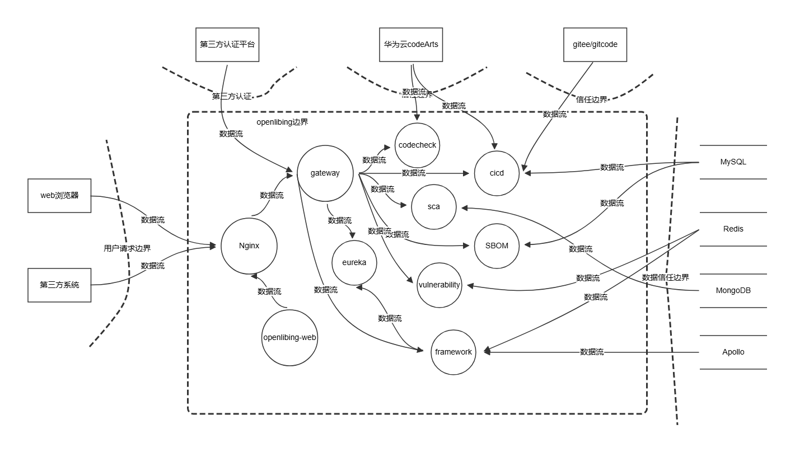
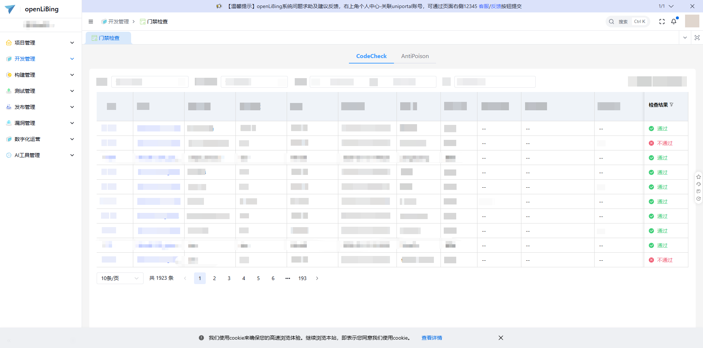
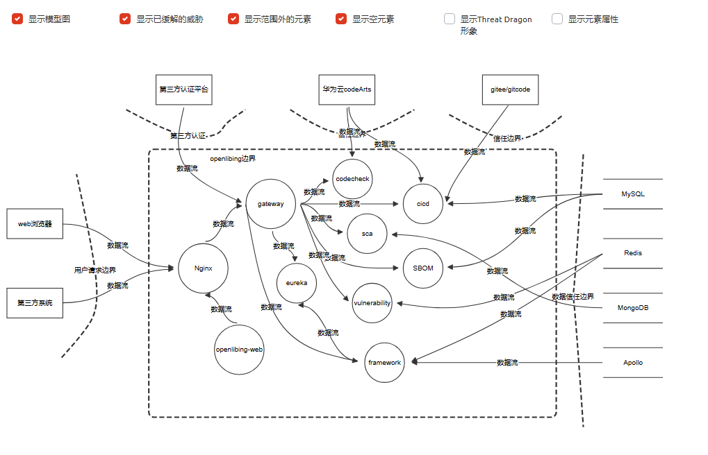

#1 openLiBing技术架构设计说明书 (Architecture Design Document)
---

## 1. 基础信息

> 本文对openLiBing技术架构设计进行说明，openLiBing是为解决蓝区开发效率问题打造的蓝区作业桌面，支撑开源社区项目看护代码质量、构件工程、自动发布。
---

## 2. 功能设计

> **说明**：描述系统的组件构成、职责划分及交互逻辑。

### 2.1 架构图

**设计说明/归档：** [openLiBing威胁分析](https://www.threatdragon.com/#/git/github/LongGitup%2FthreatDraw/main/openLiBing%20Threat%20Model/edit/%E6%96%B0STRIDE%E5%9B%BE)

### 2.2 组件职责与接口

> 列出新增/修改的组件及其定义的 API 规范。

**设计说明/归档：** 

### 2.3 中间件版本选型设计

> **设计目标**：明确系统各中间件的版本选型，确保系统稳定性、安全性和可维护性。

#### 2.3.1 核心中间件版本选型

| 中间件名称      | 版本         | 选型理由                                                                | 兼容性要求                                               | 安全特性                                   |
| ---------- |------------| ------------------------------------------------------------------- | --------------------------------------------------- | -------------------------------------- |
| **Apollo** | 2.4.0      | - 长期支持版本（LTS）- 稳定性经过大规模生产验证- 支持灰度发布和配置回滚- 完善的权限管理体系                 | - Java 21兼容- Spring Boot 3.x兼容- MySQL 8.0+          | - 支持配置加密存储- 支持审计日志- 支持权限分级管理           |
| **Eureka** | 4.3.x      | - Spring Cloud官方推荐版本- 与Spring Boot 3.5.x完美集成- 支持服务健康检查- 支持HTTPS安全通信 | - Spring Cloud 2024.x- Java 21兼容- Spring Boot 3.5.x | - 支持HTTPS服务注册- 支持服务认证- 支持访问控制列表        |
| **Nginx**  | 1.24.x     | - 稳定版本，经过充分测试- 支持HTTP/2和HTTPS- 高性能反向代理- 丰富的模块生态                     | - OpenSSL 1.1.1+- 支持TLS 1.2/1.3- 支持WebSocket        | - 支持SSL/TLS加密- 支持访问控制- 支持请求限流- 支持安全头配置 |

#### 2.3.2 数据存储中间件版本选型

| 中间件名称            | 版本    | 选型理由                                                   | 兼容性要求                                                | 安全特性                                           |
| ---------------- | ----- | ------------------------------------------------------ | ---------------------------------------------------- | ---------------------------------------------- |
| **华为云RDS MySQL** | 8.0.x | - 华为云托管服务，高可用架构- 长期支持版本- 性能优化显著- 支持窗口函数和CTE- 完善的安全特性   | - Java 21 JDBC驱动兼容- MyBatis 3.5.x兼容- Liquibase 4.x兼容 | - 支持加密连接（TLS）- 支持审计插件- 支持密码策略- 支持行级加密- 华为云安全防护 |
| **华为云Redis**     | 6.0.x | - 华为云托管服务，高可用架构- 稳定版本，经过充分验证- 性能优异- 支持ACL权限控制- 华为云安全防护 | - Java 21兼容- Spring Data Redis兼容                     | - 支持ACL权限控制- 支持TLS加密- 支持命令重命名- 支持密码保护- 华为云安全防护 |
| **华为云DDS**       | 4.x | - 华为云托管服务，高可用架构- 基于MongoDB的文档数据库- 灵活的文档模型- 支持复杂查询和聚合- 华为云安全防护 | - Java 21兼容- Spring Data MongoDB兼容- MongoDB Driver 4.x兼容 | - 支持加密连接（TLS）- 支持审计日志- 支持角色权限控制- 支持字段级加密- 华为云安全防护 |

#### 2.3.3 应用框架版本选型

| 框架名称             | 版本     | 选型理由                                    | 兼容性要求                                         | 安全特性                             |
| ---------------- | ------ | --------------------------------------- | --------------------------------------------- | -------------------------------- |
| **Spring Boot**  | 3.5.x  | - 最新稳定版本- 支持Java 21- 支持虚拟线程- 性能优化显著     | - Java 21- Spring Cloud 2024.x- MyBatis 3.5.x | - 支持安全自动配置- 支持Actuator监控- 支持配置加密 |
| **Spring Cloud** | 2024.x | - 与Spring Boot 3.5.x配套- 支持服务网格- 支持响应式编程 | - Spring Boot 3.5.x- Java 21                  | - 支持服务间认证- 支持配置加密- 支持熔断降级        |

#### 2.3.4 版本选型原则

**稳定性优先原则：**

- 优先选择长期支持版本（LTS）或稳定版本（Stable）
- 避免使用最新发布版本，选择经过生产验证的版本
- 关注社区活跃度和维护周期

**安全性原则：**

- 选择包含最新安全补丁的版本
- 避免使用已知存在安全漏洞的版本
- 确保中间件支持TLS 1.2+加密通信

**兼容性原则：**

- 确保中间件版本与Java 21兼容
- 确保中间件版本与Spring Boot 3.x兼容
- 确保中间件之间的版本兼容性

**可维护性原则：**

- 选择社区活跃、文档完善的版本
- 确保版本升级路径清晰
- 避免使用即将停止维护的版本

#### 2.3.5 版本升级策略

**升级原则：**

- 小版本升级：定期升级补丁版本，修复安全漏洞
- 大版本升级：充分测试后升级，确保兼容性
- 灰度升级：先在测试环境验证，再逐步推广到生产环境

**升级流程：**

1. 评估升级影响范围和风险
2. 在测试环境进行兼容性测试
3. 制定回滚方案
4. 选择业务低峰期进行升级
5. 升级后进行功能验证和性能测试
6. 监控系统运行状态，及时处理异常

#### 2.3.6 中间件配置规范

**Apollo配置规范：**

- 应用配置按环境隔离（BETA/GAMMA/PROD）
- 敏感配置必须加密存储
- PROD配置变更需审批和审计
- 配置版本化管理，支持回滚

**Eureka配置规范：**

- 服务注册使用HTTPS协议
- 服务实例配置健康检查
- 服务元数据包含版本信息
- 配置服务剔除和自我保护机制

**Nginx配置规范：**

- 启用HTTPS，禁用HTTP
- 配置SSL证书和加密套件
- 启用安全响应头（X-Frame-Options, X-Content-Type-Options等）
- 配置请求限流和访问控制
- 禁用不必要的模块和功能

### 2.4 UX设计

> 设计目标：确保功能不仅“可用”，而且“好用”，降低开发者的认知负担和运维人员的误操作风险。 

**设计说明/归档：** 
* 使用vben开源前端框架，自带丰富的交互组件，样式美观
* 遵从统一的前端设计开发规范，前端风格保持统一

### 2.5 SOD设计

> 设计目标：通过维护SOD权限设计文档，确保权限设计可审计、可复用、可跨服务重用。

**设计说明/归档：** 不涉及权限设计

## 3. 非功能设计

### 3.1 安全与隐私设计评估和设计

> **注意**：仅当需求判定为 **`need_security`** 时，本章节为必填项。 **无该标签可删除本章节。**

> 关注点：防御能力与合规边界。

### 3.1.1 威胁分析 (Threat Modeling)

> 基于 **STRIDE** 或类似模型，识别本项目可能面临的安全威胁。可直接复制threatdragon威胁分析报告

| 威胁类别     | 攻击场景描述 (Scenario) | 风险等级/评分 | 对应减缓措施 (Mitigation) |
|----------|-------------------|---------|---------------------|
| **横向越权** | 用户可以跨项目权限访问数据     | 高       | 业务增加横向越权校验          |
| **密钥泄露** | 主机、数据库等资源密钥泄露     | 中       | 使用华为云安全服务管理密钥       |

**设计说明/归档：** [openLiBing威胁分析报告](https://www.threatdragon.com/#/git/github/LongGitup%2FthreatDraw/main/openLiBing%20Threat%20Model/report)

### 3.1.2 安全设计实现 (Security Mechanisms)

> 威胁模型评估：
> * 已根据业务逻辑绘制 Data Flow Diagram 并识别单点风险
>
> 软件供应链：
>* 扫描并修补了已知漏洞（CVE）
>* 限制了第三方二进制包的直接引入
>*
>凭证管理：
>* 严禁硬编码。
>* 密钥定期自动轮转（Rotation）
>
>身份认证：
>* 华为云开启多因素认证
>* 使用第三方授权认证登录，不记录用户密码，token有过期时间
>
>数据安全：
>* 用户请求、微服务、中间件通信链路加密（TLS 1.2+）与静态加密（AES-128）全覆盖
>* 对高敏感字段（如手机号、邮箱）进行三段式加密保存
>
>运行时隔离：
>* 微服务以非 Root 用户运行（Non-root Enforcement）
>
>日志审计：
>* 记录关键操作日志并具备防篡改性
>* 日志包含了足够用于追溯的 4W 信息（Who, When, Where, What）

**设计说明/归档：**  利用codeArts能力，token加密存储

### 3.1.3 最小权限设计 (Least Privilege Design)

> **设计目标**：明确每个组件所需的最小权限集，严格限制特权账户的使用，默认拒绝所有额外请求。

#### 3.1.3.1 前端服务权限设计

| 组件名称                       | 最小权限集      | 权限说明                              | 特权账户限制              |
| -------------------------- | ---------- | --------------------------------- |---------------------|
| **openlibing-web**         | 只读静态资源访问权限 | 仅允许读取前端静态文件（HTML/CSS/JS），禁止写入系统目录 | 以非root用户运行 |
| **openlibing-ai-web**      | 只读静态资源访问权限 | 仅允许读取前端静态文件，禁止写入系统目录              | 以非root用户运行    |
| **openlibing-ops-web**     | 只读静态资源访问权限 | 仅允许读取前端静态文件，禁止写入系统目录              | 以非root用户运行    |
| **openlibing-develop-web** | 只读静态资源访问权限 | 仅允许读取前端静态文件，禁止写入系统目录              | 以非root用户运行    |

#### 3.1.3.2 网关与代理权限设计

| 组件名称          | 最小权限集                             | 权限说明                             | 特权账户限制                   |
|---------------| --------------------------------- | -------------------------------- | ------------------------ |
| **Nginx**     | 网络端口监听权限（80/443）SSL证书读取权限静态资源读取权限 | 仅监听指定端口，读取SSL证书和静态资源，禁止执行系统命令    | 以普通用户运行，禁止root权限配置只读文件系统 |

#### 3.1.3.3 服务注册与配置中心权限设计

| 组件名称                    | 最小权限集                              | 权限说明                           | 特权账户限制                                         |
| ----------------------- |------------------------------------| ------------------------------ | ---------------------------------------------- |
| **Eureka Server 4.3.x** | 服务注册/发现权限、服务心跳接收权限、服务元数据读取权限       | 仅允许服务注册、发现、心跳检测，禁止修改服务实例数据     | 以非root用户运行禁止访问业务数据库                            |
| **Apollo 2.4.0**        | 配置读取权限（应用级）、配置发布权限（管理员）、配置审计日志写入权限 | 应用仅能读取自身配置，管理员可发布配置，所有操作记录审计日志 | 分级权限管理：- 应用账户：仅读取- 发布账户：配置发布- 管理员：完全控制禁止root运行 |

#### 3.1.3.4 后端微服务权限设计

| 组件名称      | 最小权限集                                                            | 权限说明                             | 特权账户限制                       |
| --------- |------------------------------------------------------------------| -------------------------------- | ---------------------------- |
| **Gateway服务** | 服务路由转发权限、服务发现读取权限、认证token验证权限                                    | 仅允许路由转发、服务发现查询、token验证 | 以非root用户运行禁止访问敏感配置       |
| **业务微服务** | 数据库读写权限（指定库表）、Redis缓存读写权限（指定key前缀）、OBS对象存储读写权限（指定桶）、Apollo配置读取权限 | 仅允许访问业务所需的数据资源，禁止跨库/跨表访问，禁止系统级操作 | 以非root用户运行禁止访问其他服务配置禁止执行系统命令 |
| **服务间通信** | Feign客户端调用权限、服务发现查询权限                                            | 仅允许通过Feign调用已授权服务，禁止直接访问其他服务地址   | 使用服务账户认证禁止使用特权账户             |

#### 3.1.3.5 数据存储权限设计

| 组件名称             | 最小权限集                               | 权限说明                                        | 特权账户限制                                                      |
| ---------------- |-------------------------------------| ------------------------------------------- | ----------------------------------------------------------- |
| **华为云RDS MySQL** | 业务库读写权限（应用账户）、只读权限（只读账户）、备份权限（备份账户） | 应用账户仅能操作业务库表，禁止系统库访问，禁止超级用户权限               | 禁止root远程登录应用账户禁止GRANT权限分离读写账户华为云安全防护                        |
| **华为云Redis**     | 缓存读写权限（指定DB）、key操作权限（指定前缀）          | 仅允许访问指定DB和key前缀，禁止FLUSHALL/FLUSHDB，禁止CONFIG | 禁用危险命令：FLUSHALL, FLUSHDB, CONFIG, KEYS使用ACL限制key访问范围华为云安全防护 |
| **华为云DDS**       | 数据库读写权限（指定库）、集合操作权限（指定集合）索引管理权限     | 仅允许访问指定数据库和集合，禁止dropDatabase，禁止执行系统命令       | 禁用危险命令：dropDatabase, dropAllUsersFromDatabase, shutdown使用角色权限控制华为云安全防护 |
| **华为云OBS**       | 对象读写权限（指定桶）、对象列表权限（指定前缀）            | 仅允许访问指定桶和前缀，禁止桶级删除，禁止跨桶访问                   | 使用IAM最小权限策略禁止桶策略修改权限禁止访问其他桶                                 |

#### 3.1.3.6 安全服务权限设计

| 组件名称    | 最小权限集                     | 权限说明                     | 特权账户限制                 |
|---------|---------------------------| ------------------------ | ---------------------- |
| **华为云WAF** | 流量转发权限、日志写入权限、规则配置权限（管理员） | 仅允许流量转发和日志记录，规则配置需管理员权限  | 分离运维账户和应用账户禁止超级管理员日常使用 |
| **华为云主机** | 应用程序运行权限、网络端口监听权限         | 仅允许运行应用程序，禁止系统配置修改，禁止安装软件    | 以非root用户运行禁止sudo权限禁止SSH直接登录 |
| **堡垒机** | 主机管理权限、用户管理权限、审计日志查看权限    | 仅允许管理主机和用户，禁止直接操作业务系统         | 使用管理员账户登录操作全程审计定期审计权限使用     |

#### 3.1.3.8 权限管理原则

**默认拒绝原则：**

- 所有组件默认拒绝所有未明确授权的访问请求
- 新增权限需经过安全评审和审批流程
- 定期审计权限配置，清理冗余权限

**特权账户管理：**

- 严格限制特权账户数量，按需申请、按需授权
- 特权账户禁止日常运维使用，仅用于紧急故障处理
- 特权账户密码定期轮换（90天）

**权限隔离原则：**

- 不同业务服务使用不同的数据库账户
- 不同环境（开发/测试/生产）使用独立的权限体系
- 敏感操作需要审批

**审计与监控：**

- 所有权限变更操作记录审计日志
- 异常权限使用触发告警
- 定期进行权限合规性检查

### 3.2 可靠性与韧性设计评估和设计（可选）

> **注意**：根据项目定级决定，含Core、Critical服务变更需要完成

> **关注点**：极端情况下的生存与恢复能力。
> **参考：**
> * 面向失败设计：是否识别了强依赖风险？当游依赖失效时，本服务是否具备降级或熔断能力？
> * 重试与避让：重试逻辑中是否包含指数退避和随机抖动以防止请求风暴？
> * 熔断限流：核心接口是否定义了明确的限流阈值？是否实现了断路器模式以保护下游？
> * 幂等设计：所有涉及写操作的任务是否支持重复调用而无副作用？

**设计说明/归档：** 内部服务不涉及

---

### 3.3 可服务性与可观测性评估和设计（可选）

> **关注点**：排障效率与全生命周期管理，确保故障可感知、可定位、可修复。

> **参考：**
>* 排障文档：是否提供了错误码对照表及对应的排障步骤？
>* 健康诊断：是否提供 /health 或 /status 接口，展示系统内部子模块的状态？
>* 平滑变更：升级或配置变更时如何实现灰度发布？是否具备一键回滚的判定指标？
>* 黄金指标覆盖：是否已定义并暴露出延迟、错误、流量和饱和度指标？

**设计说明/归档：** 内部服务不涉及

---

### 3.4 性能与伸缩性评估和设计（可选）

> **关注点**：社区生态兼容性与未来扩展。

> **参考：**
> * 并发模型：在高并发场景下，锁竞争、连接池和线程池的配置是否已评估？
> * 水平扩展：服务是否实现了完全无状态化，支持快速扩容？
> * 延迟评估：关键路径的延迟是否业务需求？是否存在明显的 IO 或计算瓶颈？

**设计说明/归档：** 内部服务不涉及

---
