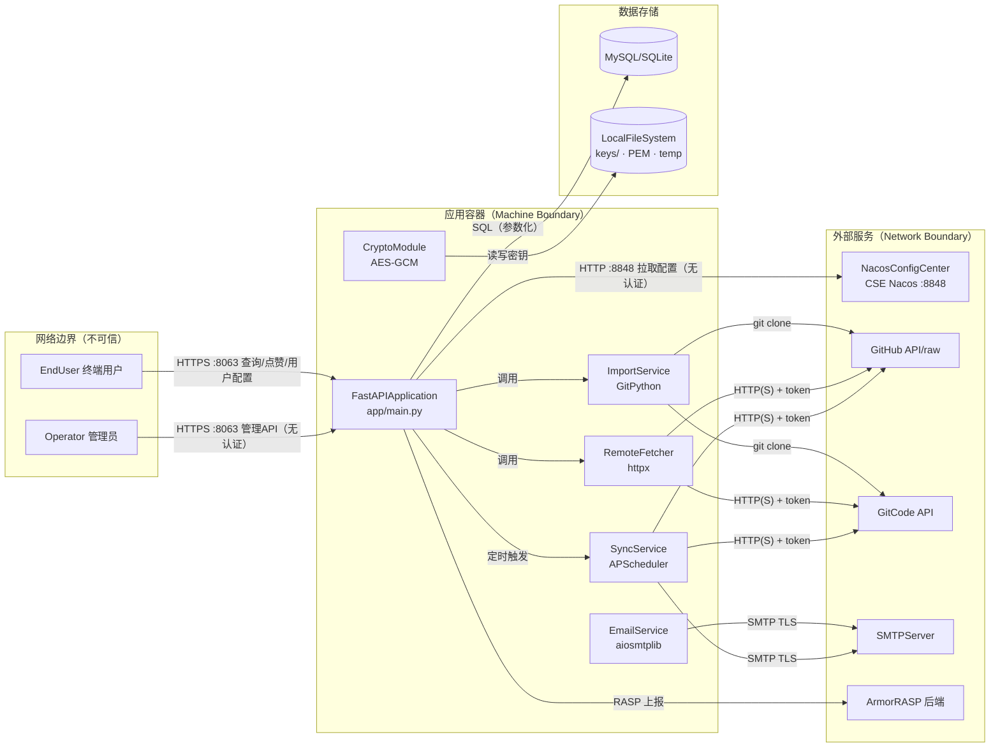

# 安全威胁分析报告 — openlibing-ai-agent

> **分析方法**：STRIDE-A（STRIDE + Abuse）威胁建模 + 纵深防御（Defense-in-Depth）+ 零信任（Zero Trust）原则
> **仓库**：`https://gitcode.com/openlibing/openlibing-ai-agent.git`
> **分支**：`master`
> **提交**：`eef5758`（2026-09-01 12:00:06 +0800）
> **分析时间**：2026-09-02
> **部署分类**：`NETWORK_SERVICE`（对外暴露 HTTPS 服务）

---

## 1. 执行摘要（Executive Summary）

openlibing-ai-agent 是一个"Skill / MCP Server 市场"后端服务，基于 FastAPI + Uvicorn/Gunicorn 构建，对外通过 HTTPS（`0.0.0.0:8063`）提供服务，内部从华为云 CSE Nacos 配置中心拉取配置与凭据，并对接 GitHub/GitCode 远程仓库、MySQL/SQLite、SMTP 邮件等外部系统。

本次分析共识别 **15 项安全发现**，其中 **1 项严重（Critical）**、**5 项高危（High）**、**6 项中危（Medium）**、**3 项低危（Low）**。

**最关键风险**是：**所有管理接口（`/api/admin/*`、导入接口）完全缺失认证与授权**——任何能访问该服务端口的人都可以匿名增删改 Skill/Project/MCP Server 数据，并可触发服务端克隆任意 Git 仓库。这是一个"匿名到管理员"的完整越权，属于可直接被远程利用的严重漏洞。

**整体风险评级：高危（High）**。系统在设计上假设了"服务只在内网/可信环境运行"，但代码层面（`bind 0.0.0.0`、`CORS *`、`allow_credentials`）并未落实该假设，缺少统一的认证/授权/审计层。

---

## 2. 部署分类与可利用性判定

| 属性                | 值                                                                 |
| ------------------- | ------------------------------------------------------------------ |
| 部署分类            | `NETWORK_SERVICE`                                                  |
| 判定依据            | `gunicorn.conf.py` 中 `bind = "0.0.0.0:8063"`，对外暴露 HTTPS 服务 |
| Tier 1 威胁是否允许 | **允许**（服务可从不可信网络被访问，无前置身份前提的攻击均被纳入） |

> 由于服务对外暴露且管理接口无认证，所有"仅需网络可达"的攻击（Tier 1）均视为可被直接利用。

---

## 3. 架构概览

### 3.1 组件清单

| 组件 ID              | 类型                | 说明                                                           | 锚定代码/配置                                             |
| -------------------- | ------------------- | -------------------------------------------------------------- | --------------------------------------------------------- |
| `FastAPIApplication` | process             | Web 服务入口，路由、CORS、双重解码中间件、APScheduler 定时同步 | `app/main.py`、`gunicorn.conf.py`                         |
| `NacosConfigCenter`  | external_service    | 华为云 CSE Nacos，提供配置与加密凭据                           | `app/nacos_connect.py`（`server_addresses`）              |
| `RemoteFetcher`      | process             | 通过 httpx 抓取 GitHub/GitCode 文件内容                        | `app/utils/remote_fetcher.py`                             |
| `ImportService`      | process             | 预览/导入 Skill 与 MCP Server，触发 git clone                  | `app/services/import_service.py`                          |
| `GitClient`          | process             | Git 仓库 clone/pull 封装                                       | `app/utils/git_client.py`                                 |
| `SyncService`        | process             | 定时同步 Skill / MCP Server                                    | `app/services/sync_service.py`                            |
| `EmailService`       | process             | 发送同步报告邮件                                               | `app/services/email_service.py`                           |
| `CryptoModule`       | process             | AES-GCM + PBKDF2 加解密，密钥派生                              | `app/utils/security/crypto_core.py`                       |
| `MySQL`              | data_store          | 生产数据库（SSL 连接）                                         | `app/database.py`（`spring.datasource.*`）                |
| `SQLite`             | data_store          | 开发/本地数据库                                                | `app/config.py`（`database_url`）                         |
| `GitHub` / `GitCode` | external_service    | 外部代码托管平台                                               | `app/utils/platform.py`                                   |
| `SMTPServer`         | external_service    | 邮件发送                                                       | `app/services/email_service.py`                           |
| `ArmorRASP`          | external_service    | 华为 RASP 后端                                                 | `app/xarmor_pyrasp.ini`                                   |
| `LocalFileSystem`    | data_store          | 密钥文件、PEM 证书、临时私钥                                   | `app/ssl_context.py`、`app/utils/security/crypto_core.py` |
| `Operator`           | external_interactor | 管理员/操作者（浏览器或 API 客户端）                           | —                                                         |
| `EndUser`            | external_interactor | 终端用户（市场查询/点赞/生成用户配置）                         | —                                                         |

### 3.2 技术栈

| 层         | 技术                                              |
| ---------- | ------------------------------------------------- |
| Web 框架   | FastAPI + Uvicorn（Gunicorn 自定义 `SSLWorker`）  |
| ORM        | SQLAlchemy 2.0（async，`aiomysql` / `aiosqlite`） |
| 配置中心   | Huawei Cloud CSE Nacos（`nacos-sdk-python`）      |
| 加密       | `cryptography`（AES-GCM + PBKDF2-HMAC-SHA256）    |
| 远程抓取   | `httpx`、GitPython（`Repo.clone_from`）           |
| 邮件       | `aiosmtplib`                                      |
| 安全运行时 | `armorrasp`（RASP）                               |
| 调度       | `apscheduler`（AsyncIOScheduler，cron）           |

### 3.3 数据流图（DFD）

---

## 4. 信任边界

| 边界                       | 类型              | 说明                                            |
| -------------------------- | ----------------- | ----------------------------------------------- |
| `InternetBoundary`         | NetworkBoundary   | 不可信网络与 Web 服务之间（`0.0.0.0:8063`）     |
| `ContainerBoundary`        | MachineBoundary   | 应用容器（密钥、临时文件、代码均在此）          |
| `NacosBoundary`            | NetworkBoundary   | 应用 ↔ 配置中心（**当前无认证，边界形同虚设**） |
| `DataStoreBoundary`        | PrivilegeBoundary | 应用 ↔ 数据库（仅应用凭据访问）                 |
| `ExternalPlatformBoundary` | NetworkBoundary   | 应用 ↔ GitHub/GitCode/SMTP/RASP                 |

**关键结论**：`InternetBoundary` 与 `NacosBoundary` 均缺少有效的认证/授权控制，是本次分析的主要风险来源。

---

## 5. STRIDE-A 威胁分析

### 5.1 覆盖矩阵

| 类别           | 威胁                                 | 相关发现            |
| -------------- | ------------------------------------ | ------------------- |
| **S** 身份伪造 | 无认证冒充管理员/任意用户            | F1、F2、F7          |
| **T** 篡改     | 篡改市场数据、注入邮件/配置内容      | F8、F9              |
| **R** 抵赖     | 管理操作无法追溯到操作者             | F15                 |
| **I** 信息泄露 | 私钥/密钥/凭据/跨域泄露              | F3、F4、F5、F6、F13 |
| **D** 拒绝服务 | 资源耗尽、递归炸弹                   | F10、F11            |
| **E** 提权     | 匿名→管理员                          | F1                  |
| **A** 滥用     | 任意导入内容、服务端作代理、内容污染 | F10、F12            |

### 5.2 逐组件分析

**FastAPIApplication**（`app/main.py`）

- 无任何认证中间件，所有路由（含管理路由）直接注册；CORS `allow_origins=["*"]` + `allow_credentials=True`；自定义 `double_decode` 中间件对 query string 二次 URL 解码，可能与下游安全校验产生不一致。

**NacosConfigCenter**（`app/nacos_connect.py`）

- `nacos.NacosClient(server_addresses=..., namespace=...)` **未传入用户名/密码**，配置中心地址与 namespace 硬编码，配置中含数据库口令、GitHub/GitCode token、邮件口令等加密凭据的解密材料。

**RemoteFetcher / ImportService / GitClient**

- 依据外部传入的 `repo_url` 构造请求并携带平台 token；`Repo.clone_from` 克隆仓库，缺少 URL 规模、仓库大小、克隆超时与递归深度限制。

**CryptoModule**（`app/utils/security/crypto_core.py`）

- 三段式密钥（`tcpFile.ks` / `tcsFile.ks` / `tcwFile.ks`）+ `part1`（来自 Nacos）；`PBKDF2_ITERATIONS = 10000`（对 SHA256 偏低）；`rootSalt` 来自环境变量 `rootSalt`。

**EmailService**（`app/services/email_service.py`）

- 同步报告 HTML 直接拼接 skill 名称/错误信息，**未做 HTML 转义**。

**DataStore（MySQL/SQLite）**

- MySQL SSL 连接 `ctx.check_hostname = False`（跳过主机名校验）；数据访问层使用 SQLAlchemy 参数化查询，未发现直接 SQL 注入。

---

## 6. 安全发现清单（按严重性排序）

> 严重性/评分采用 CVSS 4.0（向量为估算值）；CWE 提供 MITRE 链接；OWASP 对应 Top 10:2025。

### 6.1 严重（Critical）

#### F1 — 管理接口无认证/无授权（匿名可写全量数据并触发克隆）

- **STRIDE-A**：S（伪造）/ E（提权）
- **可利用性**：Tier 1（仅需网络可达）
- **严重性**：Critical
- **CVSS 4.0**：`CVSS:4.0/AV:N/AC:L/AT:N/PR:N/UI:N/VC:H/VI:H/VA:H/SC:N/SI:N/SA:N`（约 9.3）
- **CWE**：[CWE-306 关键功能缺少认证](https://cwe.mitre.org/data/definitions/306.html)
- **OWASP**：[A01:2025 Broken Access Control](https://owasp.org/Top10/A01_2021-Broken_Access_Control/)
- **位置**：`app/routers/admin.py`（`/api/admin/*`）、`app/routers/import_.py`（`/api/admin/import-skills/*`）、`app/routers/mcp_import.py`（`/api/admin/import-mcp-servers/*`）
- **描述**：`POST /api/admin/skills`、`/api/admin/projects`、`/api/admin/mcp-servers` 及其 delete/update 变体，以及 `import-skills` / `import-mcp-servers` 的 `preview` 与确认导入接口，均未做任何身份校验。任何可达服务端口的匿名客户端都可增删改数据、触发服务端 `git clone` 任意仓库。
- **影响**：数据被任意篡改/删除；导入内容被污染后经邮件/市场向用户传播；服务端成为任意仓库克隆的代理。
- **修复建议**：为所有管理/写接口引入统一认证中间件（如 API Key / OAuth2 / mTLS）与基于角色的授权（RBAC）；管理接口与公开查询接口分离部署或网络隔离；对导入接口增加白名单（仅允许受信 owner/repo）。

### 6.2 高危（High）

#### F2 — Nacos 配置中心无认证

- **STRIDE-A**：S（伪造）/ I（泄露）
- **可利用性**：Tier 1
- **严重性**：High
- **CVSS 4.0**：`CVSS:4.0/AV:N/AC:L/AT:N/PR:N/UI:N/VC:H/VI:H/VA:N/SC:N/SI:N/SA:N`（约 8.7）
- **CWE**：[CWE-306](https://cwe.mitre.org/data/definitions/306.html) / [CWE-522 凭据保护不足](https://cwe.mitre.org/data/definitions/522.html)
- **位置**：`app/nacos_connect.py`（`NacosClient` 未传 `username`/`password`）
- **描述**：Nacos 客户端仅指定 `server_addresses` 与 `namespace`，未提供认证凭据。若 Nacos 端未额外启用鉴权，任何人都能读取（或篡改）`application` / `openlibing-ai-agent` 配置，其中包含数据库口令、平台 token 的密文及 `security.part1` 解密材料。
- **影响**：配置/凭据泄露；配置篡改导致凭据替换、服务被接管。
- **修复建议**：为 Nacos 启用并强制鉴权（`username`/`password` 或 AK/SK），并对 namespace/group 做最小权限隔离。

#### F3 — TLS 私钥落盘未设置安全权限

- **STRIDE-A**：I（泄露）
- **可利用性**：Tier 2（需本地/容器内访问）
- **严重性**：High
- **CVSS 4.0**：`CVSS:4.0/AV:L/AC:L/AT:N/PR:L/UI:N/VC:H/VI:N/VA:N/SC:N/SI:N/SA:N`（约 6.2）
- **CWE**：[CWE-732 权限分配不正确](https://cwe.mitre.org/data/definitions/732.html) / [CWE-377 不安全的临时文件](https://cwe.mitre.org/data/definitions/377.html)
- **位置**：`app/ssl_context.py`（`extract_cert_key`，写入 `tempfile.gettempdir()/ssl_key.key`）
- **描述**：私钥被写入系统临时目录固定路径 `ssl_key.key`，但未显式设置 `0600` 权限（`open(path, "w")` 使用默认 umask）。这与 `SSL_STARTUP.md` 中"私钥 600"的声明不符。
- **影响**：同一主机/容器内的其他本地进程或用户可读取 TLS 私钥，实现流量解密或服务冒充。
- **修复建议**：写入后立即 `os.chmod(key_path, 0o600)`；优先使用内存中的 `SSLContext` 直接加载证书链，避免私钥落盘。

#### F4 — 密钥文件与证书打包进 Docker 镜像

- **STRIDE-A**：I（泄露）
- **可利用性**：Tier 2（需获取镜像）
- **严重性**：High
- **CVSS 4.0**：`CVSS:4.0/AV:L/AC:L/AT:N/PR:N/UI:N/VC:H/VI:N/VA:N/SC:N/SI:N/SA:N`（约 6.2）
- **CWE**：[CWE-798 硬编码凭据](https://cwe.mitre.org/data/definitions/798.html) / [CWE-312 敏感数据明文存储](https://cwe.mitre.org/data/definitions/312.html)
- **位置**：`Dockerfile`（`COPY ./tcpFile.ks /app/keys/tcpFile.ks` 等，含 `tcsFile.ks`、`tcwFile.ks`、`openlibing.pem`、`cacerts.pem`）
- **描述**：加密密钥的三段式材料（`tcpFile.ks`、`tcsFile.ks`、`tcwFile.ks`）及 TLS PEM 被直接 COPY 进镜像层。
- **影响**：任何能拉取/导出镜像的人可取得密钥材料，配合 `security.part1`（Nacos）即可还原工作密钥，解密所有加密凭据。
- **修复建议**：密钥材料通过运行时密钥管理服务（KMS/Secrets Manager/挂载卷）注入，不打入镜像；清理镜像历史层。

#### F5 — MySQL SSL 关闭主机名校验

- **STRIDE-A**：I（泄露）
- **可利用性**：Tier 2（需中间人位置）
- **严重性**：High
- **CVSS 4.0**：`CVSS:4.0/AV:A/AC:H/AT:N/PR:N/UI:N/VC:H/VI:H/VA:N/SC:N/SI:N/SA:N`（约 6.4）
- **CWE**：[CWE-295 证书校验不正确](https://cwe.mitre.org/data/definitions/295.html)
- **位置**：`app/database.py`（`get_ssl_context`，`ctx.check_hostname = False`）
- **描述**：为兼容"内网 IP + 域名签发证书"，代码关闭了 MySQL SSL 连接的主机名校验（仅校验 CA 链）。
- **影响**：在内网可实施 ARP/DNS 欺骗的场景下，可能被中间人攻击窃取数据库口令与数据。
- **修复建议**：使用与连接地址匹配的证书 SAN，或改用 IP SAN 证书，恢复 `check_hostname=True`。

#### F6 — CORS 过于宽松且允许携带凭据

- **STRIDE-A**：I（泄露）/ A（滥用）
- **可利用性**：Tier 1
- **严重性**：High
- **CVSS 4.0**：`CVSS:4.0/AV:N/AC:H/AT:N/PR:N/UI:R/VC:H/VI:N/VA:N/SC:N/SI:N/SA:N`（约 5.9）
- **CWE**：[CWE-942 过度宽松的 CORS](https://cwe.mitre.org/data/definitions/942.html)
- **位置**：`app/config.py`（`cors_origin_list` 默认 `["*"]`）、`app/main.py`（`allow_credentials=True`）
- **描述**：默认 `allow_origins=["*"]` 且 `allow_credentials=True`，`allow_methods`/`allow_headers` 均为 `*`。
- **影响**：任意站点可携带用户凭据跨域访问接口；一旦未来引入基于 Cookie 的认证，将直接导致凭据泄露与跨站请求伪造。
- **修复建议**：显式配置受信 origin 白名单；当需要 `allow_credentials` 时禁止使用 `*`。

### 6.3 中危（Medium）

#### F7 — 用户配置接口存在 IDOR（越权读写）

- **STRIDE-A**：S（伪造）/ I（泄露）
- **可利用性**：Tier 1
- **严重性**：Medium
- **CVSS 4.0**：`CVSS:4.0/AV:N/AC:L/AT:N/PR:N/UI:N/VC:L/VI:L/VA:N/SC:N/SI:N/SA:N`（约 5.3）
- **CWE**：[CWE-639 通过用户可控键的授权绕过](https://cwe.mitre.org/data/definitions/639.html)
- **位置**：`app/routers/mcp_servers.py`（`get_user_config` / `generate_user_config`，`userId` 查询参数）
- **描述**：`/api/mcp-servers/{name}/user-config` 的读写仅依赖 `userId` 查询参数，无身份认证与属主校验。
- **影响**：攻击者可枚举 `userId` 读取/覆盖任意用户的 MCP 配置（其中可能包含用户填写的令牌等敏感参数）。
- **修复建议**：基于认证会话中的用户身份确定 `userId`，禁止由客户端直接指定；校验资源属主。

#### F8 — 同步报告邮件 HTML 注入

- **STRIDE-A**：T（篡改）
- **可利用性**：Tier 2（需可控 skill/仓库名 + 管理员打开邮件）
- **严重性**：Medium
- **CVSS 4.0**：`CVSS:4.0/AV:N/AC:L/AT:N/PR:L/UI:R/VC:N/VI:L/VA:N/SC:N/SI:N/SA:N`（约 3.5）
- **CWE**：[CWE-80 脚本相关 HTML 中的不安全中性化](https://cwe.mitre.org/data/definitions/80.html)
- **位置**：`app/services/email_service.py`（`build_sync_report` / `build_mcp_sync_report`）
- **描述**：报告 HTML 中 `updated`/`failed`/`outdated`/`skipped` 的 skill 名称与错误信息直接拼接，未做 HTML 转义；这些名称/错误可来源于外部仓库内容。
- **影响**：邮件客户端若渲染 HTML，可能执行注入的脚本/钓鱼内容，向管理员投递恶意链接。
- **修复建议**：对所有插入 HTML 的动态值使用 `html.escape()`；或改用纯文本邮件。

#### F9 — 用户配置模板字符串替换注入

- **STRIDE-A**：T（篡改）
- **可利用性**：Tier 2
- **严重性**：Medium
- **CVSS 4.0**：`CVSS:4.0/AV:N/AC:L/AT:N/PR:N/UI:N/VC:L/VI:L/VA:N/SC:N/SI:N/SA:N`（约 5.3）
- **CWE**：[CWE-74 特殊元素中和不当](https://cwe.mitre.org/data/definitions/74.html)
- **位置**：`app/repositories/mcp_server_repo.py`（`upsert_user_config`，`remote_config.replace(f"<{key}>", value)`）
- **描述**：用户参数通过字符串替换写入 JSON 配置模板，未对 `value` 做 JSON 转义。
- **影响**：恶意 `value` 可破坏 JSON 结构或注入额外配置字段，导致生成的配置被篡改。
- **修复建议**：先解析 JSON，对字段值做类型化赋值，再序列化；禁止裸字符串替换。

#### F10 — 任意 Git 仓库克隆（资源耗尽 / 滥用）

- **STRIDE-A**：D（拒绝服务）/ A（滥用）
- **可利用性**：Tier 1
- **严重性**：Medium
- **CVSS 4.0**：`CVSS:4.0/AV:N/AC:L/AT:N/PR:N/UI:N/VC:N/VI:N/VA:L/SC:N/SI:N/SA:N`（约 5.3）
- **CWE**：[CWE-400 未受控的资源消耗](https://cwe.mitre.org/data/definitions/400.html)
- **位置**：`app/services/import_service.py`（`_clone_repo`）、`app/utils/git_client.py`（`ensure_repo`）
- **描述**：导入接口接受任意 `repo_url`（虽被 `parse_repo_url` 限制为 github.com/gitcode.com），无仓库大小、克隆超时、并发与磁盘占用限制。
- **影响**：可触发大仓库克隆耗尽磁盘/内存/CPU；服务端被用作任意内容抓取代理（内容污染市场）。
- **修复建议**：对导入来源做 owner/repo 白名单；限制仓库大小、克隆超时与并发；克隆到受限临时目录并事后清理。

#### F11 — 目录树递归抓取无深度限制

- **STRIDE-A**：D（拒绝服务）
- **可利用性**：Tier 2
- **严重性**：Medium
- **CVSS 4.0**：`CVSS:4.0/AV:N/AC:L/AT:N/PR:N/UI:N/VC:N/VI:N/VA:L/SC:N/SI:N/SA:N`（约 5.3）
- **CWE**：[CWE-674 未受控的递归](https://cwe.mitre.org/data/definitions/674.html)
- **位置**：`app/utils/remote_fetcher.py`（`fetch_directory_tree` 的 `_list_files` 递归）
- **描述**：递归列举仓库目录树无深度/条目数上限。
- **影响**：深层目录结构可导致递归栈溢出或长时间占用连接，造成 DoS。
- **修复建议**：增加递归深度与文件总数上限。

#### F12 — 自定义二次 URL 解码中间件

- **STRIDE-A**：A（滥用）
- **可利用性**：Tier 1
- **严重性**：Medium
- **CVSS 4.0**：`CVSS:4.0/AV:N/AC:H/AT:N/PR:N/UI:N/VC:L/VI:L/VA:N/SC:N/SI:N/SA:N`（约 4.3）
- **CWE**：[CWE-177 URL 编码处理不正确](https://cwe.mitre.org/data/definitions/177.html)
- **位置**：`app/main.py`（`double_decode` 中间件）
- **描述**：对 query string 做二次 URL 解码并改写 `request.scope["query_string"]`，可能使请求在进入下游安全组件（如后续引入的 WAF/鉴权）前发生解码不一致。
- **影响**：可能被用于绕过依赖原始编码的过滤/签名校验，形成请求走私类风险。
- **修复建议**：移除该中间件，改为在业务侧按需解码；统一解码语义。

### 6.4 低危（Low）

#### F13 — RASP 配置硬编码（APP_ID / TENANT_ID / BACKEND_URL）

- **STRIDE-A**：I（泄露）
- **严重性**：Low
- **CWE**：[CWE-798](https://cwe.mitre.org/data/definitions/798.html)
- **位置**：`app/xarmor_pyrasp.ini`
- **描述**：`APP_ID`、`TENANT_ID`、`BACKEND_URL` 硬编码于仓库配置。
- **修复建议**：改由环境变量/配置中心注入，避免仓库泄露标识信息。

#### F14 — PBKDF2 迭代次数偏低

- **STRIDE-A**：I（泄露）
- **严重性**：Low
- **CWE**：[CWE-916 口令散列计算强度不足](https://cwe.mitre.org/data/definitions/916.html)
- **位置**：`app/utils/security/crypto_core.py`（`PBKDF2_ITERATIONS = 10000`）
- **描述**：用于派生根密钥的 PBKDF2-HMAC-SHA256 仅 10000 次迭代，低于现代建议（SHA256 建议 ≥ 600k）。
- **修复建议**：提高迭代次数（或迁移至 Argon2id），并评估对既有密文的兼容迁移。

#### F15 — 管理操作缺少审计日志

- **STRIDE-A**：R（抵赖）
- **严重性**：Low
- **CWE**：[CWE-778 日志记录不足](https://cwe.mitre.org/data/definitions/778.html)
- **位置**：`app/routers/admin.py`、`app/logging_config.py`
- **描述**：管理写操作未记录操作者身份（因无认证，也无法记录），缺少审计与责任追溯。
- **修复建议**：引入认证后，对写操作记录操作者、时间、对象、变更内容等审计日志。

---

## 7. 修复优先级与行动计划

| 优先级 | 发现            | 建议动作                                          | 预期收益                             |
| ------ | --------------- | ------------------------------------------------- | ------------------------------------ |
| P0     | F1              | 为管理/写接口增加认证 + RBAC                      | 消除匿名越权，阻断数据篡改与恶意导入 |
| P0     | F2              | Nacos 启用并强制鉴权                              | 保护配置与凭据解密材料               |
| P1     | F4              | 密钥/PEM 移出镜像，改用运行时注入                 | 阻断镜像泄露 → 密钥泄露链            |
| P1     | F3              | 私钥落盘 `chmod 0600` 或改内存加载                | 阻断本地私钥泄露                     |
| P1     | F5              | 恢复 `check_hostname=True`，使用匹配证书          | 阻断数据库中间人                     |
| P1     | F6              | 收紧 CORS 白名单，禁止 `*` + credentials          | 阻断跨域凭据泄露                     |
| P2     | F7              | user-config 绑定会话身份，禁止客户端指定 userId   | 修复 IDOR                            |
| P2     | F9              | 用户参数改用结构化 JSON 赋值                      | 修复配置注入                         |
| P2     | F8              | 邮件 HTML 转义                                    | 修复邮件注入                         |
| P2     | F10/F11         | 导入白名单 + 克隆大小/深度/并发限制               | 缓解 DoS 与滥用                      |
| P3     | F12/F13/F14/F15 | 移除二次解码、配置外置、提高 KDF 迭代、补审计日志 | 纵深防御与可追溯性                   |

---

## 8. 结论

openlibing-ai-agent 作为对外暴露的网络服务，**缺少统一的认证与授权层**是当前最核心的系统性缺陷：管理接口匿名可写、配置中心无鉴权、CORS 过度宽松。此外，密钥与私钥的落盘/打包方式存在多路径信息泄露风险，导入链路缺少资源与来源约束。

建议优先落实 P0/P1 项：**引入认证与 RBAC、为 Nacos 启用鉴权、将密钥移出镜像并对私钥落盘收紧权限**。完成上述治理后，可显著降低系统的整体攻击面与风险等级。

---

_本报告基于 STRIDE-A 方法生成，发现均已对照当前源码（提交 `eef5758`）逐一核实；CVSS 4.0 分数为基于上下文的人工估算，正式定级请结合实际部署环境与资产价值复核。_
