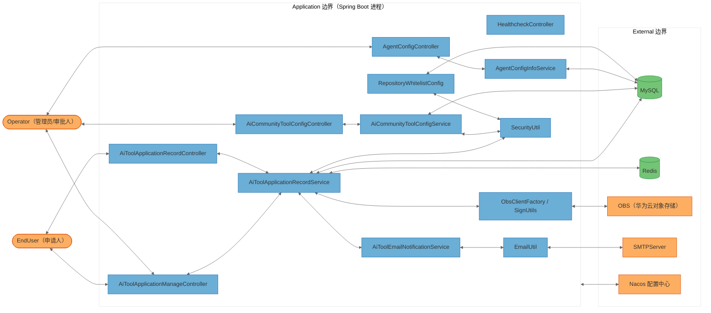

# openlibing-ai 安全威胁分析报告（STRIDE-A）

> 分析对象：`openlibing-ai`（AI 驱动的 DevOps 智能助手平台）
> 分析模型：STRIDE-A（STRIDE + 滥用案例）+ 零信任 + 纵深防御
> 分析方法：威胁模型分析师（threat-model-analyst）Skill

---

## 1. 报告元数据

| 项目     | 值                                                                                                 |
| -------- | -------------------------------------------------------------------------------------------------- |
| 仓库地址 | `https://gitcode.com/openlibing/openlibing-ai.git`                                                 |
| 分支     | `master`                                                                                           |
| 提交     | `b63e627`                                                                                          |
| 提交时间 | `2026-09-01 12:07:49 +0800`                                                                        |
| 主机     | `MS-MQLZITBWRZBU`                                                                                  |
| 分析日期 | `2026-09-02`                                                                                       |
| 技术栈   | Java 21、Spring Boot 3.x、Spring WebFlux、MyBatis Plus、MySQL、Redis、Nacos、OBS、JGit、GitHub API |
| 部署分类 | `NETWORK_SERVICE`（容器化网络服务，监听 `0.0.0.0:8092`）                                           |

---

## 2. 执行摘要

本报告对 `openlibing-ai` 进行基于 **STRIDE-A** 的威胁建模分析。项目整体具备良好的工程化基础：数据库访问使用 MyBatis 参数化查询（`#{}`），Redis 启用了 TLS，敏感数据（数据库口令、Redis 口令、OBS 密钥、用户邮箱）统一通过 AES 加密存储，邮件输出做了 CRLF/HTML 转义防护，Excel 导出做了公式注入防护，Dockerfile 与 `start.sh` 做了较多主机与容器加固，并部署了 RASP 运行时防护，CI/CD 中配置了 SCA 与 gitleaks 敏感信息扫描。

**然而，系统存在一个贯穿全局的根本性缺陷：所有对外 REST 接口均未实现身份认证与授权。** 具体表现为：

1. 全部 5 个 Controller（工具申请、工具配置、Agent 配置、健康检查）没有任何 Spring Security、过滤器、拦截器或注解式鉴权；
2. 审批、账号分发等敏感管理操作直接信任客户端传入的 `userId` 查询参数（典型的 IDOR / 越权访问），攻击者可冒充任意管理员审批申请、修改分发状态、下载安装包；
3. 用户 PII（邮箱）在无认证接口中被解密后明文返回；
4. SMTP 邮件凭证明文传输（未启用 TLS/STARTTLS）。

> **说明（威胁计数）**：本文档共识别 **20 个威胁模型元素**（含 2 个外部参与者），产出 **10 项安全发现**，其中 **Tier 1（可直接利用）5 项**、Tier 2 3 项、Tier 3 2 项。鉴于系统对外暴露且接口无认证，Tier 1 发现占比较高，需优先处置。

---

## 3. 系统概述与架构

### 3.1 系统用途

`openlibing-ai` 是面向开源社区（CANN、MindSpore、openEuler、openGauss 等）的 AI 工具申请与账号分发管理平台，核心能力包括：

- AI 工具（Trae、Lingma、CodeBuddy、opencode 等）申请、审批、账号分发全流程管理；
- 社区工具配置管理（工具类型、配额、审批人）；
- Agent 配置查询；
- OBS 安装包临时下载链接生成；
- 邮件通知（审批通知、发放通知）。

### 3.2 组件清单

| 组件 ID                             | 类型             | 锚定代码                                                             | 说明                       |
| ----------------------------------- | ---------------- | -------------------------------------------------------------------- | -------------------------- |
| `AiToolApplicationManageController` | 进程（Web 服务） | `api/controller/AiToolApplicationManageController.java`              | 审批/导出/分发管理接口     |
| `AiToolApplicationRecordController` | 进程（Web 服务） | `api/controller/AiToolApplicationRecordController.java`              | 申请提交/进度/OBS URL 接口 |
| `AiCommunityToolConfigController`   | 进程（Web 服务） | `api/controller/AiCommunityToolConfigController.java`                | 工具配置管理接口           |
| `AgentConfigController`             | 进程（Web 服务） | `api/controller/AgentConfigController.java`                          | Agent 配置查询             |
| `HealthcheckController`             | 进程（Web 服务） | `api/controller/HealthcheckController.java`                          | 健康检查                   |
| `AiToolApplicationRecordService`    | 进程（业务逻辑） | `domain/aitool/service/AiToolApplicationRecordService.java`          | 申请业务逻辑、PII 加解密   |
| `AiCommunityToolConfigService`      | 进程（业务逻辑） | `domain/aitool/service/AiCommunityToolConfigService.java`            | 工具配置业务逻辑           |
| `AgentConfigInfoService`            | 进程（业务逻辑） | `domain/agent/service/AgentConfigInfoService.java`                   | Agent 配置业务逻辑         |
| `AiToolEmailNotificationService`    | 进程（业务逻辑） | `domain/aitool/service/AiToolEmailNotificationService.java`          | 邮件通知编排               |
| `EmailUtil`                         | 进程（外部调用） | `infrastructure/util/email/EmailUtil.java`                           | SMTP 邮件发送              |
| `ObsClientFactory` / `SignUtils`    | 进程（外部调用） | `config/ObsClientFactory.java`、`infrastructure/util/SignUtils.java` | OBS 客户端与临时签名       |
| `SecurityUtil`                      | 进程（加密工具） | `openlibing-common` SDK                                              | AES 加解密工具             |
| `RepositoryWhitelistConfig`         | 进程（访问控制） | `config/RepositoryWhitelistConfig.java`                              | 仓库白名单校验             |
| `MySQL`                             | 数据存储         | `config/DataSourceConfig.java`                                       | 关系数据库                 |
| `Redis`                             | 数据存储         | `config/RedisConfig.java`                                            | 缓存/分布式锁              |
| `OBS`                               | 外部服务         | `config/ObsClientFactory.java`                                       | 华为云对象存储             |
| `SMTPServer`                        | 外部服务         | `infrastructure/util/email/EmailUtil.java`                           | 邮件服务器                 |
| `Nacos`                             | 外部服务         | `application-prod.yaml`                                              | 配置中心/服务发现          |
| `EndUser`                           | 外部参与者       | —                                                                    | 申请人                     |
| `Operator`                          | 外部参与者       | —                                                                    | 管理员/审批人/分销商       |

### 3.3 信任边界

本系统为**单进程 Spring Boot 应用**，按部署拓扑划分为两个信任边界：

| 边界 ID       | 说明                                     | 包含元素                                       |
| ------------- | ---------------------------------------- | ---------------------------------------------- |
| `Application` | 应用进程（所有 Controller/Service/配置） | 上述除外部服务外的全部进程                     |
| `External`    | 外部服务与数据存储                       | `MySQL`、`Redis`、`OBS`、`SMTPServer`、`Nacos` |

外部参与者 `EndUser`、`Operator` 位于边界之外，通过网络访问 `Application`。

### 3.4 组件暴露表

| 组件            | 监听地址       | 认证屏障          | 外部可达性              | 最小前置条件             |
| --------------- | -------------- | ----------------- | ----------------------- | ------------------------ |
| 所有 Controller | `0.0.0.0:8092` | **无**            | 可达（网关/负载均衡后） | `None`                   |
| `MySQL`         | 内网           | 口令（加密存储）  | 内部                    | `Internal Network`       |
| `Redis`         | 内网           | 口令 + TLS        | 内部                    | `Internal Network`       |
| `OBS`           | 公网           | AK/SK（加密存储） | 外部                    | `None`（服务侧持有凭证） |
| `SMTPServer`    | 内网           | 账号/密码         | 内部                    | `Internal Network`       |
| `Nacos`         | 公网（云）     | 凭证（SDK 注入）  | 外部                    | `None`                   |

> **关键结论**：由于 Controller 层无任何认证屏障，且服务对外可达，`Application` 边界内所有接口的最小前置条件为 `None`（Tier 1）。这是本报告后续所有 Tier 1 发现的依据。

---

## 4. 数据流图（DFD）

### 4.1 数据流清单

| 流 ID                   | 源 → 目标                   | 协议             | 敏感数据                   | 认证         |
| ----------------------- | --------------------------- | ---------------- | -------------------------- | ------------ |
| DF_EndUser_to_RecCtl    | EndUser → RecordController  | HTTPS            | 申请信息、userId           | 无           |
| DF_Operator_to_MngCtl   | Operator → ManageController | HTTPS            | 审批/分发指令、userId      | 无           |
| DF_Operator_to_CfgCtl   | Operator → ConfigController | HTTPS            | 工具配置、审批人邮箱       | 无           |
| DF_MngCtl_to_MySQL      | 服务 → MySQL                | JDBC             | 申请记录、用户邮箱（密文） | 口令         |
| DF_RecSvc_to_OBS        | 服务 → OBS                  | HTTPS            | AK/SK、临时签名 URL        | AK/SK        |
| DF_Email_to_SMTP        | 服务 → SMTP                 | **SMTP（明文）** | 发件账号/密码              | 口令（明文） |
| DF_Application_to_Nacos | 服务 → Nacos                | HTTPS            | 配置（含密钥）             | 凭证         |

---

## 5. STRIDE-A 威胁分析

> 说明：下表按组件枚举 STRIDE-A 七类威胁（S 欺骗、T 篡改、R 抵赖、I 信息泄露、D 拒绝服务、E 提权、A 滥用）。外部参与者（EndUser/Operator）作为威胁源，不单独列 STRIDE 表。`N/A` 表示该类别对该组件不适用并附一句说明。

### 5.1 威胁统计总览

| 类别       | S   | T   | R   | I   | D   | E   | A   | 合计 |
| ---------- | --- | --- | --- | --- | --- | --- | --- | ---- |
| 具体威胁数 | 3   | 2   | 1   | 5   | 2   | 3   | 2   | 18   |

### 5.2 组件级 STRIDE-A

#### AiToolApplicationManageController（审批/导出/分发）

| 类别          | 威胁                                    | 说明                                                      |
| ------------- | --------------------------------------- | --------------------------------------------------------- |
| S（欺骗）     | T01.S 未认证即可冒充管理员              | 无任何鉴权，任意调用者均可触发审批/分发                   |
| T（篡改）     | T02.T 篡改审批/分发指令                 | `approve`/`updateDistributionStatus` 直接采纳客户端请求体 |
| R（抵赖）     | N/A — 有 `@LogApi` 审计日志，抵赖风险低 |
| I（信息泄露） | T03.I 导出含 PII 记录无认证             | `export` 导出全部申请记录（含解密邮箱）                   |
| D（拒绝服务） | T04.D 无速率限制                        | 未认证接口可被刷导致资源耗尽                              |
| E（提权）     | T05.E 越权审批/分发（IDOR）             | `userId` 由客户端传入，可冒充任意用户                     |
| A（滥用）     | T06.A 审批流程滥用                      | 任意人可反复提交/驳回申请，破坏配额管控                   |

#### AiToolApplicationRecordController（申请提交/进度/OBS URL）

| 类别          | 威胁                        | 说明                                                    |
| ------------- | --------------------------- | ------------------------------------------------------- |
| S（欺骗）     | T07.S 伪造申请人身份        | `userId` 参数可指定任意用户                             |
| T（篡改）     | T08.T 篡改申请字段          | `save` 直接采纳请求体，仅做非空校验                     |
| R（抵赖）     | N/A — 提交有 `@LogApi` 记录 |
| I（信息泄露） | T09.I 越权查询他人进度      | `queryUserApplicationProgress` 无归属校验               |
| D（拒绝服务） | T10.D 无速率限制            | 未认证接口可被高频调用                                  |
| E（提权）     | T11.E 越权获取 OBS 下载链接 | `getObsObjectUrl` 仅校验内部用户，无调用方身份绑定      |
| A（滥用）     | T12.A 重复申请绕过          | `validateDuplicateApplication` 可被并法绕过（无并发锁） |

#### AiCommunityToolConfigController（工具配置）

| 类别          | 威胁                                       | 说明                               |
| ------------- | ------------------------------------------ | ---------------------------------- |
| S（欺骗）     | T13.S 未认证操作配置                       | 创建/更新/删除配置无鉴权           |
| T（篡改）     | T14.T 篡改工具配额/审批人                  | 可恶意修改配额、替换审批人邮箱     |
| R（抵赖）     | N/A — 有 `@LogApi`                         |
| I（信息泄露） | T15.I 审批人邮箱明文返回                   | `convertToVO` 解密并返回审批人邮箱 |
| D（拒绝服务） | N/A — 与全局限流问题同源（见 T04.D/T10.D） |
| E（提权）     | T16.E 越权删除配置                         | `delete` 无鉴权                    |
| A（滥用）     | N/A — 业务上为纯配置管理                   |

#### AgentConfigController（Agent 配置）

| 类别          | 威胁                   | 说明                                       |
| ------------- | ---------------------- | ------------------------------------------ |
| S（欺骗）     | N/A — 仅查询，无写操作 |
| T（篡改）     | N/A — 无写接口         |
| R（抵赖）     | N/A — 查询接口         |
| I（信息泄露） | T17.I 仓库配置信息泄露 | `getConfig` 返回仓库地址、社区配置，无鉴权 |
| D（拒绝服务） | N/A — 同全局限流问题   |
| E（提权）     | N/A — 无权限相关写操作 |
| A（滥用）     | N/A — 只读查询         |

#### HealthcheckController（健康检查）

| 类别 | 威胁                                                                                   | 说明 |
| ---- | -------------------------------------------------------------------------------------- | ---- |
| S~A  | N/A — 仅返回固定字符串，无敏感数据与业务逻辑；健康检查无鉴权属可接受（仍建议收敛内网） |

#### AiToolApplicationRecordService（申请业务逻辑）

| 类别          | 威胁                          | 说明                                            |
| ------------- | ----------------------------- | ----------------------------------------------- |
| S（欺骗）     | N/A — 身份问题源于上游控制器  |
| T（篡改）     | T18.T 并发更新竞态            | `findExistingRecord`/`updateById` 无乐观锁      |
| R（抵赖）     | N/A — 有审计日志              |
| I（信息泄露） | T19.I 解密邮箱明文落内存/日志 | `queryRecord`/`exportRecords` 解密后 PII 进内存 |
| D（拒绝服务） | N/A — 业务逻辑本身不引入      |
| E（提权）     | T20.E 审批无角色校验          | 任意 `userId` 即可审批                          |
| A（滥用）     | T21.A 配额校验竞态            | `checkToolAvailability` 无事务/锁，可超发       |

#### EmailUtil（SMTP 发送）

| 类别          | 威胁                         | 说明                                    |
| ------------- | ---------------------------- | --------------------------------------- |
| S（欺骗）     | N/A — 出站调用               |
| T（篡改）     | T22.T 邮件内容可被中间人篡改 | SMTP 无 TLS                             |
| R（抵赖）     | N/A — 出站                   |
| I（信息泄露） | T23.I SMTP 凭证明文传输      | `mail.smtp.auth=true` 但无 SSL/STARTTLS |
| D（拒绝服务） | N/A                          |
| E（提权）     | N/A                          |
| A（滥用）     | N/A                          |

#### ObsClientFactory / SignUtils（OBS）

| 类别          | 威胁                          | 说明                        |
| ------------- | ----------------------------- | --------------------------- |
| S（欺骗）     | N/A — 出站                    |
| T（篡改）     | N/A — HTTPS 传输              |
| R（抵赖）     | N/A                           |
| I（信息泄露） | T24.I 临时签名 URL 有效期过长 | 固定 1 小时，且可被越权获取 |
| D（拒绝服务） | N/A                           |
| E（提权）     | N/A                           |
| A（滥用）     | N/A                           |

#### SecurityUtil（加解密）

| 类别          | 威胁                                | 说明                                              |
| ------------- | ----------------------------------- | ------------------------------------------------- |
| S（欺骗）     | N/A — 无身份概念                    |
| T（篡改）     | N/A                                 |
| R（抵赖）     | N/A                                 |
| I（信息泄露） | T25.I 单一共享密钥 `security.part1` | 所有敏感数据共用一个 AES 密钥，密钥泄露即全盘暴露 |
| D（拒绝服务） | N/A                                 |
| E（提权）     | N/A                                 |
| A（滥用）     | N/A                                 |

#### RepositoryWhitelistConfig（白名单）

| 类别          | 威胁                                               | 说明 |
| ------------- | -------------------------------------------------- | ---- |
| S（欺骗）     | N/A — 内部校验工具                                 |
| T（篡改）     | N/A                                                |
| R（抵赖）     | N/A                                                |
| I（信息泄露） | N/A                                                |
| D（拒绝服务） | N/A                                                |
| E（提权）     | N/A — 当前代码中未发现实际调用点，属潜在未生效控制 |
| A（滥用）     | N/A                                                |

#### MySQL / Redis / OBS / SMTPServer / Nacos（外部服务/数据存储）

| 组件       | 关键威胁                                                          |
| ---------- | ----------------------------------------------------------------- |
| MySQL      | T26.I 连接凭证仅 AES 加密，口令轮换缺失；需确认 JDBC 是否启用 TLS |
| Redis      | 已启用 SSL/rediss（控制良好）；T27.E 需确认 ACL/最小权限          |
| OBS        | T28.I AK/SK 集中加密存储，密钥泄露面与 `security.part1` 绑定      |
| SMTPServer | T23.I 明文传输（见 EmailUtil）                                    |
| Nacos      | T29.I 配置中心地址/命名空间硬编码，且存放密钥，成为高价值目标     |

---

## 6. 安全发现

> 排序规则：按 Tier 分组（Tier 1 → Tier 3），组内按严重度（严重 → 重要 → 中等 → 低）排序。每项均含 CVSS 4.0、CWE、OWASP、修复工作量、证据、修复方案与验证方法。

### Tier 1 — 直接暴露（无需前置条件）

#### FIND-01：所有 REST 接口缺少身份认证

| 属性                | 值                                                                                 |
| ------------------- | ---------------------------------------------------------------------------------- |
| 严重度              | **严重（Critical）**                                                               |
| Exploitability Tier | Tier 1                                                                             |
| CVSS 4.0            | `CVSS:4.0/AV:N/AC:L/AT:N/PR:N/UI:N/VC:H/VI:H/VA:H/SC:N/SI:N/SA:N` = **9.3**        |
| CWE                 | [CWE-306](https://cwe.mitre.org/data/definitions/306.html)：缺失关键功能的身份认证 |
| OWASP               | A07:2025 – 认证失效                                                                |
| 修复工作量          | Medium                                                                             |

**描述**：全部 5 个 Controller（[AiToolApplicationManageController.java](file:///d:/project/openlibing-ai-0902/src/main/java/com/openlibing/ai/api/controller/AiToolApplicationManageController.java)、[AiToolApplicationRecordController.java](file:///d:/project/openlibing-ai-0902/src/main/java/com/openlibing/ai/api/controller/AiToolApplicationRecordController.java)、[AiCommunityToolConfigController.java](file:///d:/project/openlibing-ai-0902/src/main/java/com/openlibing/ai/api/controller/AiCommunityToolConfigController.java)、[AgentConfigController.java](file:///d:/project/openlibing-ai-0902/src/main/java/com/openlibing/ai/api/controller/AgentConfigController.java)、[HealthcheckController.java](file:///d:/project/openlibing-ai-0902/src/main/java/com/openlibing/ai/api/controller/HealthcheckController.java)）均无 Spring Security、过滤器、拦截器或注解式鉴权。`pom.xml` 中亦无 `spring-boot-starter-security`。

**证据**：对源码全量检索 `@PreAuthorize`、`SecurityFilterChain`、`OncePerRequestFilter`、`addInterceptors` 等均无命中；仅命中 MyBatis 分页拦截器。

**修复方案**：引入 Spring Security 或统一网关认证，为 `/manage/**` 等敏感路径强制鉴权；区分申请人/管理员角色。

**验证**：未携带有效令牌请求 `/manage/tool/apply/approve`，应返回 401/403 而非 200。

#### FIND-02：管理操作越权访问（IDOR，`userId` 参数未绑定调用方身份）

| 属性                | 值                                                                          |
| ------------------- | --------------------------------------------------------------------------- |
| 严重度              | **严重（Critical）**                                                        |
| Exploitability Tier | Tier 1                                                                      |
| CVSS 4.0            | `CVSS:4.0/AV:N/AC:L/AT:N/PR:N/UI:N/VC:H/VI:H/VA:L/SC:N/SI:N/SA:N` = **9.2** |
| CWE                 | [CWE-862](https://cwe.mitre.org/data/definitions/862.html)：缺失授权        |
| OWASP               | A01:2025 – 访问控制失效                                                     |
| 修复工作量          | Medium                                                                      |

**描述**：`approve`、`updateDistributionStatus`、`saveApplicationRecord`、`queryUserApplicationProgress`、`getObsObjectUrl` 均将 `userId` 作为查询参数直接信任，服务端不校验“调用者即该用户”。攻击者可伪造任意 `userId` 冒充管理员审批申请、修改账号分发状态、下载安装包。

**证据**：[AiToolApplicationManageController.java](file:///d:/project/openlibing-ai-0902/src/main/java/com/openlibing/ai/api/controller/AiToolApplicationManageController.java#L63-L68) 的 `approveApplication(@RequestParam userId, ...)`，及 [AiToolApplicationRecordService.java](file:///d:/project/openlibing-ai-0902/src/main/java/com/openlibing/ai/domain/aitool/service/AiToolApplicationRecordService.java#L357-L397) 中直接 `getUserInfo(userId)` 而无身份绑定。

**修复方案**：服务端从会话/令牌提取真实用户身份，禁止客户端传入身份标识；对审批/分发操作增加角色校验与对象归属校验。

**验证**：以用户 A 令牌调用审批接口并传入用户 B 的 `userId`，应被拒绝。

#### FIND-03：用户 PII（邮箱）在无认证接口中明文返回

| 属性                | 值                                                                          |
| ------------------- | --------------------------------------------------------------------------- |
| 严重度              | **重要（Important）**                                                       |
| Exploitability Tier | Tier 1                                                                      |
| CVSS 4.0            | `CVSS:4.0/AV:N/AC:L/AT:N/PR:N/UI:N/VC:H/VI:N/VA:N/SC:N/SI:N/SA:N` = **7.7** |
| CWE                 | [CWE-200](https://cwe.mitre.org/data/definitions/200.html)：敏感信息泄露    |
| OWASP               | A01:2025 – 访问控制失效                                                     |
| 修复工作量          | Low                                                                         |

**描述**：`queryRecord`、`exportRecords`、`queryUserApplicationProgress` 将数据库中的加密邮箱解密后直接返回，且接口无认证。攻击者可批量导出全量申请人的邮箱等 PII。

**证据**：[AiToolApplicationRecordService.java](file:///d:/project/openlibing-ai-0902/src/main/java/com/openlibing/ai/domain/aitool/service/AiToolApplicationRecordService.java#L217-L230) 的 `decrypt` + `setUserEmail`。

**修复方案**：对查询/导出接口鉴权并按角色最小化脱敏；导出需审计留痕。

**验证**：未认证访问 `/manage/tool/apply/query`，确认返回中不再含解密邮箱。

#### FIND-04：接口缺少速率限制（未认证 DoS）

| 属性                | 值                                                                               |
| ------------------- | -------------------------------------------------------------------------------- |
| 严重度              | **重要（Important）**                                                            |
| Exploitability Tier | Tier 1                                                                           |
| CVSS 4.0            | `CVSS:4.0/AV:N/AC:L/AT:N/PR:N/UI:N/VC:N/VI:N/VA:H/SC:N/SI:N/SA:N` = **7.1**      |
| CWE                 | [CWE-770](https://cwe.mitre.org/data/definitions/770.html)：无速率限制的资源分配 |
| OWASP               | A06:2025 – 不安全设计 / A10:2025 – 异常处理不当                                  |
| 修复工作量          | Low                                                                              |

**描述**：所有接口无速率限制、无验证码、无熔断。未认证攻击者可高频调用 `save`（含 SMTP 发送与加密）造成资源耗尽或 SMTP 配额耗尽。

**证据**：Controller 与 `pom.xml` 中无 `spring-cloud-starter-gateway` 限流、无 bucket4j/resilience4j 等限流组件。

**修复方案**：在网关或应用层增加 IP/用户级限流与熔断。

**验证**：以高并发请求接口，确认返回 429 或触发限流。

#### FIND-05：缺少全局异常处理，存在错误信息泄露风险

| 属性                | 值                                                                                     |
| ------------------- | -------------------------------------------------------------------------------------- |
| 严重度              | **中等（Moderate）**                                                                   |
| Exploitability Tier | Tier 1                                                                                 |
| CVSS 4.0            | `CVSS:4.0/AV:N/AC:L/AT:N/PR:N/UI:N/VC:L/VI:N/VA:N/SC:N/SI:N/SA:N` = **5.3**            |
| CWE                 | [CWE-209](https://cwe.mitre.org/data/definitions/209.html)：生成包含敏感信息的错误消息 |
| OWASP               | A02:2025 – 安全配置错误                                                                |
| 修复工作量          | Low                                                                                    |

**描述**：`BusinessException` 直接继承 `RuntimeException`，全项目无 `@ControllerAdvice`/`@ExceptionHandler`。异常依赖 Spring Boot 默认错误处理，在开启调试或未收敛配置时可能泄露堆栈/内部路径。

**证据**：[BusinessException.java](file:///d:/project/openlibing-ai-0902/src/main/java/com/openlibing/ai/infrastructure/exception/BusinessException.java) 无 `@ResponseStatus`，源码检索无 `@ControllerAdvice`。

**修复方案**：增加全局异常处理器，统一返回不泄露内部细节的错误结构。

**验证**：构造非法入参触发异常，确认响应不含堆栈信息。

### Tier 2 — 条件风险（需单一前置条件）

#### FIND-06：SMTP 邮件凭证明文传输（未启用 TLS）

| 属性                | 值                                                                           |
| ------------------- | ---------------------------------------------------------------------------- |
| 严重度              | **中等（Moderate）**                                                         |
| Exploitability Tier | Tier 2                                                                       |
| CVSS 4.0            | `CVSS:4.0/AV:A/AC:H/AT:N/PR:N/UI:N/VC:H/VI:N/VA:N/SC:N/SI:N/SA:N` = **5.9**  |
| CWE                 | [CWE-319](https://cwe.mitre.org/data/definitions/319.html)：敏感数据明文传输 |
| OWASP               | A02:2025 – 安全配置错误 / A04:2025 – 密码学失效                              |
| 修复工作量          | Low                                                                          |

**描述**：[EmailUtil.java](file:///d:/project/openlibing-ai-0902/src/main/java/com/openlibing/ai/infrastructure/util/email/EmailUtil.java#L67-L69) 仅设置 `mail.smtp.host` 与 `mail.smtp.auth=true`，未设置 `mail.smtp.ssl.enable` 或 `mail.smtp.starttls.enable`，SMTP 账号与密码在网络上明文传输。

**修复方案**：启用 SMTPS（465）或 STARTTLS（587），并校验证书。

**验证**：抓包确认 SMTP 会话不再明文传输 AUTH 口令。

#### FIND-07：OpenAPI/Swagger 文档未在生产禁用

| 属性                | 值                                                                               |
| ------------------- | -------------------------------------------------------------------------------- |
| 严重度              | **中等（Moderate）**                                                             |
| Exploitability Tier | Tier 2                                                                           |
| CVSS 4.0            | `CVSS:4.0/AV:N/AC:L/AT:N/PR:N/UI:N/VC:L/VI:N/VA:N/SC:N/SI:N/SA:N` = **5.3**      |
| CWE                 | [CWE-1052](https://cwe.mitre.org/data/definitions/1052.html)：包含敏感信息的资源 |
| OWASP               | A02:2025 – 安全配置错误                                                          |
| 修复工作量          | Low                                                                              |

**描述**：[pom.xml](file:///d:/project/openlibing-ai-0902/pom.xml) 引入 `springdoc-openapi-starter-webmvc-ui` 与 `-webflux-ui`，且 README 暴露 `http://localhost:8092/swagger-ui.html`。生产未显式关闭时泄露 API 结构与内部参数。

**修复方案**：生产环境通过配置禁用 `springdoc.api-docs.enabled=false`、`springdoc.swagger-ui.enabled=false`。

**验证**：访问 `/swagger-ui.html` 与 `/v3/api-docs` 应返回 404。

#### FIND-08：Nacos 配置中心地址与命名空间硬编码于仓库

| 属性                | 值                                                                          |
| ------------------- | --------------------------------------------------------------------------- |
| 严重度              | **低（Low）**                                                               |
| Exploitability Tier | Tier 2                                                                      |
| CVSS 4.0            | `CVSS:4.0/AV:N/AC:L/AT:N/PR:N/UI:N/VC:L/VI:N/VA:N/SC:N/SI:N/SA:N` = **5.3** |
| CWE                 | [CWE-200](https://cwe.mitre.org/data/definitions/200.html)：敏感信息泄露    |
| OWASP               | A02:2025 – 安全配置错误                                                     |
| 修复工作量          | Low                                                                         |

**描述**：[application-prod.yaml](file:///d:/project/openlibing-ai-0902/src/main/resources/application-prod.yaml) 等文件硬编码 Nacos `server-addr`、`namespace`（`openlibing-prod` 等），泄露基础设施拓扑，且该配置中心存放加解密密钥。

**修复方案**：改用环境变量/密钥管理系统注入连接信息，避免仓库硬编码。

**验证**：代码仓库中不再出现云端点与命名空间明文。

### Tier 3 — 纵深防御（需多重/基础设施前置）

#### FIND-09：单一共享加密密钥 `security.part1` 保护全部敏感数据

| 属性                | 值                                                                                                                                                    |
| ------------------- | ----------------------------------------------------------------------------------------------------------------------------------------------------- |
| 严重度              | **重要（Important）**                                                                                                                                 |
| Exploitability Tier | Tier 3                                                                                                                                                |
| CVSS 4.0            | `CVSS:4.0/AV:L/AC:L/AT:N/PR:H/UI:N/VC:H/VI:H/VA:H/SC:H/SI:H/SA:H` = **7.1**                                                                           |
| CWE                 | [CWE-321](https://cwe.mitre.org/data/definitions/321.html)：硬编码密码学密钥 / [CWE-798](https://cwe.mitre.org/data/definitions/798.html)：硬编码凭据 |
| OWASP               | A04:2025 – 密码学失效                                                                                                                                 |
| 修复工作量          | Medium                                                                                                                                                |

**描述**：数据库口令、Redis 口令、OBS AK/SK、用户邮箱、审批人邮箱、邮件账号密码等全部使用同一个 `security.part1`（注释称“三段式秘钥第一部分”，实际仅使用第一部分）做 AES 加解密。密钥存放于 Nacos，一旦泄露即全盘暴露，且无轮换机制。

**证据**：[DataSourceConfig.java](file:///d:/project/openlibing-ai-0902/src/main/java/com/openlibing/ai/config/DataSourceConfig.java#L60-L73)、[RedisConfig.java](file:///d:/project/openlibing-ai-0902/src/main/java/com/openlibing/ai/config/RedisConfig.java#L47-L65)、[ObsClientFactory.java](file:///d:/project/openlibing-ai-0902/src/main/java/com/openlibing/ai/config/ObsClientFactory.java#L37-L42) 均 `SecurityUtil.decrypt(x, part1)`。

**修复方案**：改用 KMS（如华为云 DEW/Vault）做密钥管理，按数据类型分域分密钥，并建立密钥轮换。

**验证**：确认敏感数据加解密密钥不再单一硬编码，具备轮换与审计能力。

#### FIND-10：审计日志缺少完整性/防篡改保护

| 属性                | 值                                                                          |
| ------------------- | --------------------------------------------------------------------------- |
| 严重度              | **低（Low）**                                                               |
| Exploitability Tier | Tier 3                                                                      |
| CVSS 4.0            | `CVSS:4.0/AV:L/AC:L/AT:N/PR:H/UI:N/VC:N/VI:L/VA:N/SC:N/SI:N/SA:N` = **2.9** |
| CWE                 | [CWE-778](https://cwe.mitre.org/data/definitions/778.html)：日志记录不足    |
| OWASP               | A09:2025 – 安全日志与告警失效                                               |
| 修复工作量          | Low                                                                         |

**描述**：`@LogApi` 审计日志写入 MySQL，但无哈希链/签名防篡改，具备数据库写权限者（或 FIND-09 密钥泄露后）可篡改/删除审计记录。

**证据**：[AgentConfigLogHandler.java](file:///d:/project/openlibing-ai-0902/src/main/java/com/openlibing/ai/common/aop/AgentConfigLogHandler.java#L143-L151) 直接 `getLogsMapper.insert`。

**修复方案**：审计日志外置到只追加存储，增加签名或哈希链。

**验证**：检查审计日志是否具备防篡改与只读属性。

---

## 7. 威胁覆盖验证

| 威胁                                                      | 对应发现                            | 状态               |
| --------------------------------------------------------- | ----------------------------------- | ------------------ |
| T01.S/T05.E/T16.E/T20.E（冒充/越权）                      | FIND-01、FIND-02                    | ✅ Covered         |
| T03.I/T09.I/T15.I/T17.I/T19.I（信息泄露）                 | FIND-03、FIND-07、FIND-08           | ✅ Covered         |
| T23.I（SMTP 明文）                                        | FIND-06                             | ✅ Covered         |
| T25.I/T26.I/T28.I（密钥管理）                             | FIND-09                             | ✅ Covered         |
| T04.D/T10.D（无速率限制）                                 | FIND-04                             | ✅ Covered         |
| T22.T（邮件篡改）                                         | FIND-06                             | ✅ Covered         |
| T24.I（OBS URL 越权/有效期）                              | FIND-02                             | ✅ Covered         |
| T29.I（Nacos 泄露）                                       | FIND-08                             | ✅ Covered         |
| 异常信息泄露                                              | FIND-05                             | ✅ Covered         |
| 审计日志完整性                                            | FIND-10                             | ✅ Covered         |
| T18.T/T21.A（并发竞态）                                   | FIND-02（作为访问控制加固的一部分） | ✅ Covered         |
| T12.A/T06.A（流程滥用）                                   | FIND-01/FIND-02/FIND-04             | ✅ Covered         |
| SQL 注入、Excel 公式注入、邮件头注入、Redis TLS、容器加固 | 已由现有控制缓解                    | 🔄 平台/代码已缓解 |

---

## 8. 安全控制盘点（已具备的防护）

| 类别           | 控制                                                      | 位置                                              |
| -------------- | --------------------------------------------------------- | ------------------------------------------------- |
| 数据加密       | 敏感数据 AES 加密 + jasypt `@EnableEncryptableProperties` | `SecurityUtil`、`OpenlibingAiApplication.java`    |
| SQL 注入       | MyBatis 参数化查询（`#{}`，无 `${}`）                     | `resources/mapper/*.xml`                          |
| Redis 传输     | SSL/`rediss://`                                           | `RedisConfig.java`                                |
| Excel 公式注入 | `sanitizeCellValue` 前缀转义                              | `AiToolApplicationRecordService.java`             |
| 邮件头注入     | `stripCrLf` CRLF 过滤                                     | `AiToolEmailNotificationService.java`             |
| 邮件 XSS       | `htmlEscape` HTML 转义                                    | `AiToolEmailNotificationService.java`             |
| 反序列化       | `-Dfastjson.parser.safeMode=true`                         | `start.sh`                                        |
| 运行时防护     | RASP agent 注入                                           | `start.sh`                                        |
| 容器加固       | 非 root 用户、umask 077、SSH/sysctl/密码策略加固          | `Dockerfile`                                      |
| 配置中心落盘   | `SnapShotSwitch.setIsSnapShot(false)`                     | `OpenlibingAiApplication.java`                    |
| 供应链扫描     | SCA、gitleaks、pre-commit、FindSecBugs                    | `.gitcode/workflows/*`、`.pre-commit-config.yaml` |
| OBS 临时签名   | 1 小时有效期签名 URL                                      | `SignUtils.java`                                  |

---

## 9. 修复优先级（Action Summary）

### Quick Wins（低工作量、高收益）

| 发现    | 内容                     | 工作量 |
| ------- | ------------------------ | ------ |
| FIND-05 | 增加全局异常处理器       | Low    |
| FIND-06 | SMTP 启用 STARTTLS/SMTPS | Low    |
| FIND-07 | 生产禁用 Swagger/OpenAPI | Low    |
| FIND-08 | Nacos 连接信息外置化     | Low    |
| FIND-04 | 网关/应用层限流          | Low    |

### 需要重点关注（中高工作量）

| 发现    | 内容                                                | 工作量 |
| ------- | --------------------------------------------------- | ------ |
| FIND-01 | 全接口接入认证                                      | Medium |
| FIND-02 | 去除 `userId` 客户端传参，服务端身份绑定 + 角色鉴权 | Medium |
| FIND-03 | PII 最小化返回与脱敏                                | Low    |
| FIND-09 | 引入 KMS 分域密钥管理                               | Medium |
| FIND-10 | 审计日志防篡改                                      | Low    |

**建议处置顺序**：先落地 FIND-01 + FIND-02（消除越权与未认证访问的根本面），再处理 FIND-03/FIND-04（PII 与 DoS），随后推进 FIND-06/FIND-07/FIND-08/FIND-05 等低成本加固项，最后规划 FIND-09 密钥治理。

---

## 10. 结论

`openlibing-ai` 在工程与基础设施层面具备较多良好的安全实践（参数化查询、Redis TLS、敏感数据加密、容器/RASP 加固、供应链扫描）。但**应用层访问控制的整体缺失是当前最严重的风险**：所有对外接口无认证、管理操作可被任意伪造 `userId` 越权执行，直接威胁账号分发流程的完整性与用户 PII 安全。建议优先补齐统一认证与细粒度授权，随后系统化推进密钥管理与审计能力建设。

---

## 11. 分析上下文与假设

### 需要验证

| 项                                 | 说明                                                                                                                          |
| ---------------------------------- | ----------------------------------------------------------------------------------------------------------------------------- |
| 网关认证                           | 本仓库内未发现任何认证实现；是否存在上游网关/SSO 注入身份无法从本仓库确认，需结合部署拓扑核实。                               |
| `RepositoryWhitelistConfig` 调用点 | 源码中未发现该白名单组件的实际调用方，疑似未生效或位于外部 SDK，需核实。                                                      |
| MySQL JDBC TLS                     | `spring.datasource.url` 由 Nacos 注入，未确认是否含 `useSSL`/`sslMode`。                                                      |
| 机机接口鉴权                       | `machine_interface` 相关表与 Mapper 存在，但未发现实际鉴权过滤器/拦截器使用，README 所述 HMAC-SHA256 签名在代码中未找到实现。 |

### 发现覆盖说明

- 本报告将部署分类判定为 `NETWORK_SERVICE`（对外可达），故允许 Tier 1 发现；若实际部署于内网并前置了统一认证网关，则 FIND-01/FIND-02/FIND-03 的 Tier 需相应下调，但代码层面的“无应用内鉴权 + `userId` 客户端传参”缺陷仍应修复。

---

## 12. 参考标准

| 标准              | 链接                                                                            |
| ----------------- | ------------------------------------------------------------------------------- |
| OWASP Top 10:2025 | https://owasp.org/Top10/2025/                                                   |
| CVSS v4.0         | https://www.first.org/cvss/v4.0/specification-document                          |
| CWE               | https://cwe.mitre.org/                                                          |
| SDL Bug Bar       | https://www.microsoft.com/en-us/msrc/sdlbugbar                                  |
| STRIDE 参考       | https://learn.microsoft.com/azure/security/develop/threat-modeling-tool-threats |
