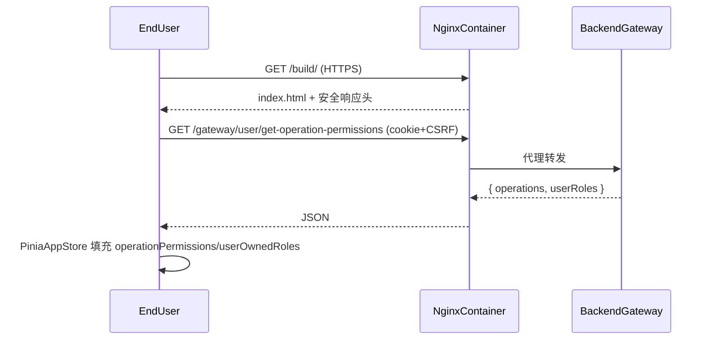
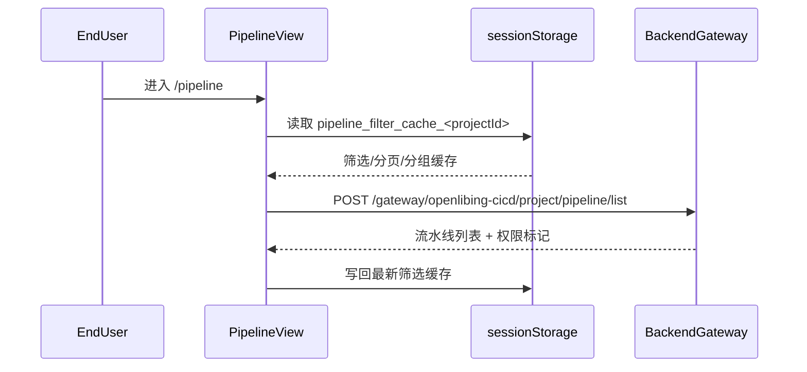
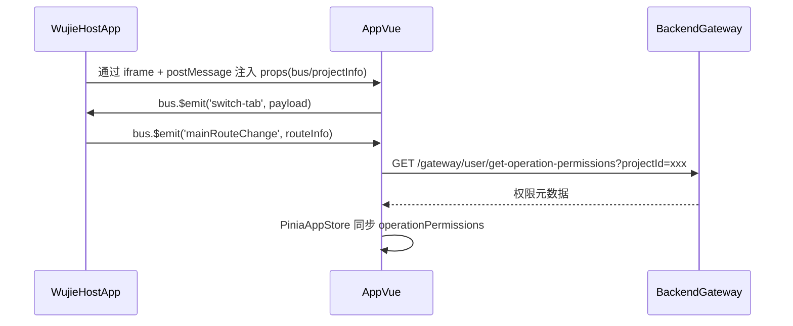
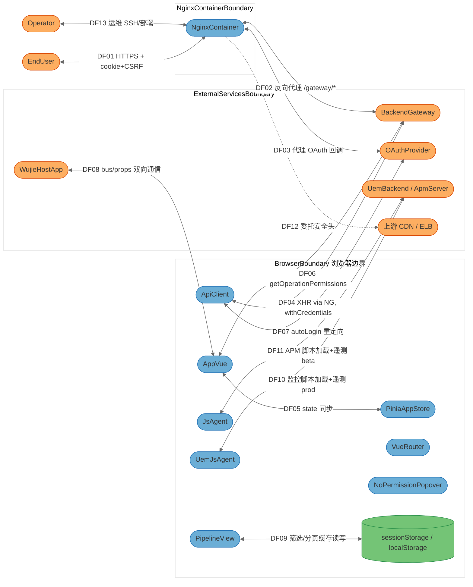

# openlibing-cicd-web 安全威胁模型分析报告（STRIDE-A）

> 本报告基于 `awesome-copilot/threat-model-analyst` skill 工作流（Single Analysis 模式）整合输出，覆盖架构概览、数据流图、STRIDE-A 威胁分析、按 Exploitability Tier 排序的发现清单与执行评估，全部内容合并为单文档中文版。

| 字段            | 值                                                                                                                                                                                                                  |
| --------------- | ------------------------------------------------------------------------------------------------------------------------------------------------------------------------------------------------------------------- |
| 分析对象        | `openlibing-cicd-web`（Vue 3 + Vite + TypeScript 前端 + Nginx 容器化部署）                                                                                                                                          |
| 目标分支        | `develop_202610_iter1`                                                                                                                                                                                              |
| HEAD commit     | `b936e7f`（2026-10-09 20:10:45 +0800）                                                                                                                                                                              |
| 远端仓库        | `https://gitcode.com/weixin_45521051/openlibing-cicd-web.git`                                                                                                                                                       |
| 分析主机        | `DESKTOP-OM4K7F0`                                                                                                                                                                                                   |
| 分析开始（UTC） | `2026-10-09 12:15:13Z`                                                                                                                                                                                              |
| 分析完成（UTC） | `2026-10-09 12:50:00Z`                                                                                                                                                                                              |
| 分析模型        | `GLM-5.2`                                                                                                                                                                                                           |
| 分析模式        | Single Analysis（全量威胁建模）                                                                                                                                                                                     |
| 跨仓验证        | `2026-10-10` 已结合 `openlibing-gateway` / `openlibing-web` / `openlibing-framework` 完成复核                                                                                                                       |
| 报告口径        | 已按复核结果修订：**发现清单仅保留 openlibing-cicd-web 本仓问题（7 项，FIND-01/04/07/08/09/11/12）**；4 条误报（FIND-02/03/05/10）与 1 条他仓问题（FIND-06，归属 openlibing-web Nginx）已移出清单，裁定依据见第七章 |

---

## 一、架构概览（0.1-architecture）

### 1.1 系统定位

`openlibing-cicd-web` 是 OpenLibing 研发流程平台的 **CI/CD 流水线 Web 前端**，承担流水线管理、镜像管理、构建产物（备案/包详情）、流水线操作日志等子模块的浏览器端展示与交互。生产形态为 Nginx 静态站点 + 反向代理 `/gateway/*` 至后端微服务群。

- 纯前端 SPA（Vue 3.5 + Pinia 2 + Vue Router 4 + Element Plus + axios）
- 构建工具：Vite 4（生产 `pnpm run prod` → `dist/`）
- 容器化：openEuler 22.03-lts-sp3 + Nginx 1.24（多阶段构建，非 root 运行）
- 微前端：以 **Wujie 子应用**方式被主应用 `openlibing-web` 加载，亦支持独立运行
- 部署入口：`https://www.openlibing.com/build/`（生产）、`https://beta.openlibing.com`（BETA）、`https://gamma.openlibing.com`（GAMMA）

### 1.2 部署分类与组件暴露表

部署分类：**INTERNET_FACING_WEB_APP**（互联网可达的 Web 前端 + 反向代理）。

| 组件                                                                    | 监听地址                                         | 鉴权屏障                                        | 外部可达性                   | 最小前置条件       | 派生 Tier     |
| ----------------------------------------------------------------------- | ------------------------------------------------ | ----------------------------------------------- | ---------------------------- | ------------------ | ------------- |
| NginxContainer                                                          | `0.0.0.0:8099` TLS                               | 无（匿名可达静态资源；`/gateway/*` 由后端鉴权） | 外部（互联网）               | None               | T1            |
| ApiClient（浏览器内 JS）                                                | 浏览器内                                         | Cookie 会话 + CSRF 头                           | 外部（执行于终端用户浏览器） | None               | T1            |
| AppVue / PiniaAppStore / VueRouter / PipelineView / NoPermissionPopover | 浏览器内 JS                                      | 无（依赖后端授权）                              | 外部（执行于终端用户浏览器） | None               | T1            |
| UemJsAgent / JsAgent                                                    | 浏览器内 JS                                      | 无                                              | 外部（终端用户浏览器）       | None               | T1            |
| BackendGateway（外部服务）                                              | 内网 `/gateway/*`                                | OAuth2 会话 + 后端 ACL                          | 经 Nginx 代理后外部可达      | Authenticated User | T2            |
| OAuthProvider（外部服务）                                               | `/gateway/oauth2/authorization/{gitee\|gitcode}` | 由网关管理                                      | 外部                         | None               | T1            |
| WujieHostApp（外部服务）                                                | 主应用域名                                       | 主应用鉴权                                      | 外部                         | Authenticated User | T2            |
| EndUser / Operator（外部 actor）                                        | —                                                | —                                               | —                            | —                  | 不参与 STRIDE |

> 注：本表是后续 Tier 与前置条件判定的"唯一事实源"，任何威胁/发现的前置条件不得低于组件暴露表的下限。

### 1.3 信任边界

按部署拓扑切分（非代码分层）：

1. **BrowserBoundary**：终端用户浏览器，执行所有前端 JS（ApiClient、App.vue、Pinia store、Router、各 View、NoPermissionPopover、UemJsAgent、JsAgent）。该边界内所有代码对终端用户透明且可被同源脚本读写。
2. **NginxContainerBoundary**：容器化 Nginx 进程，承担 TLS 终止、静态站点、`/gateway/*` 反向代理、安全响应头下发。`Dockerfile` + `nginx/nginx_prod.conf` + `entrypoint.sh` 锚定。
3. **ExternalServicesBoundary**：经 Nginx 代理或主应用桥接的所有外部服务——`BackendGateway`（openlibing-framework / openlibing-cicd / openlibing-coderepo / openlibing-codecheck / openlibing-sca / openlibing-platform-release 等微服务群）、`OAuthProvider`（gitee/gitcode OAuth）、`WujieHostApp`（openlibing-web 主应用）、UemBackend 与 ApmServer（华为 UEM/APM 监控后端）、上游 CDN/ELB（负责 HSTS / CSP / Referrer-Policy / X-Content-Type-Options 等头部的下发）。

### 1.4 顶层组件清单（确定性命名，锚点见证据列）

| 组件 ID             | 类型                                       | 锚点（证据）                                                                                                            |
| ------------------- | ------------------------------------------ | ----------------------------------------------------------------------------------------------------------------------- |
| NginxContainer      | 进程（反向代理 + 静态站点）                | `Dockerfile`、`nginx/nginx_prod.conf`、`nginx/nginx_beta.conf`、`nginx/nginx_gamma.conf`、`entrypoint.sh`、`monitor.sh` |
| ApiClient           | 进程（浏览器内 axios 封装）                | `src/api/ApiClient.ts`、`src/api/client.ts`（次要，简版）                                                               |
| AppVue              | 进程（SPA 入口装配）                       | `src/App.vue`、`src/main.ts`                                                                                            |
| PiniaAppStore       | 进程（前端鉴权态/权限元数据持有者）        | `src/stores/app.ts`                                                                                                     |
| VueRouter           | 进程（前端路由）                           | `src/router/index.ts`                                                                                                   |
| PipelineView        | 进程（流水线列表页 + sessionStorage 缓存） | `src/views/pipeline/pipeline.vue`                                                                                       |
| NoPermissionPopover | 进程（无权限气泡 UX）                      | `src/components/NoPermissionPopover.vue`                                                                                |
| UemJsAgent          | 进程（生产环境监控脚本注入）               | `src/utils/uem.js`                                                                                                      |
| JsAgent             | 进程（BETA 环境 APM 脚本注入）             | `src/utils/jsagent.js`                                                                                                  |
| BackendGateway      | 外部服务（后端微服务群）                   | `src/api/urls.ts`（`/gateway/*` 全部路径）                                                                              |
| OAuthProvider       | 外部服务（gitee/gitcode OAuth）            | `src/api/ApiClient.ts` 中 `autoLoginPlatform()` 的 `/gateway/oauth2/authorization/{gitee\|gitcode}?autoLogin=complete`  |
| WujieHostApp        | 外部服务（主应用）                         | `src/App.vue`、`src/api/ApiClient.ts` 中 `window.$wujie.bus` / `propsFromHost`                                          |
| EndUser             | 外部 actor（浏览器用户）                   | —                                                                                                                       |
| Operator            | 外部 actor（管理员/运维）                  | —                                                                                                                       |

> STRIDE 分析覆盖除外部 actor（EndUser / Operator）外的全部 12 个组件。

### 1.5 技术栈

- 前端：Vue 3.5、Vite 4、TypeScript 5、Pinia 2、Vue Router 4、Element Plus 2、axios 1.20、monaco-editor 0.52、bytemd/v-md-editor/vditor（Markdown 编辑）、highlight.js、ECharts 5、xss 1.0.14、js-cookie 3、lodash(-es) 4、image-conversion、dayjs。
- 镜像依赖（pnpm overrides）已锁定：`braces ^3.0.3`、`form-data ^4.0.6`、`lodash(-es) ^4.18.1`、`linkify-it ^5.0.2`、`postcss ^8.5.12`、`nanoid ^3.3.17`、`brace-expansion ^5.0.12`、`js-yaml ^4.3.2`、`toml ^4.2.0`、`source-map-js ^1.2.2`（供应链已知漏洞规避）。
- 部署：openEuler 22.03-lts-sp3 + Nginx 1.24，非 root 用户 `nginx`（uid/gid 1000）运行；`EXPOSE 8099`；`USER nginx`。
- CI 质量：`.pre-commit-config.yaml` 含 `pre-commit-hooks v6`、`gitleaks v8.30.1`（密钥扫描）、`ruff`、`prettier`、`eslint`；`.gitcode/workflows/` 含 `malicious-code-pr-scan.yml`、`sca-pr-scan.yml`、`nightly-schedule-scan.yml`、`pre-commit.yml`。
- 微前端：Wujie（子应用通过 `window.__POWERED_BY_WUJIE__`、`window.$wujie.bus`、`window.$wujie.props` 与主应用通信）。

### 1.6 关键场景（前 3 项含 Mermaid 时序图）

#### 场景 1：终端用户访问 SPA 首屏

#### 场景 2：流水线列表页加载（带 sessionStorage 缓存恢复）

#### 场景 3：Wujie 子应用被主应用加载并联动路由

---

## 二、威胁模型 DFD（1-threatmodel）

### 2.1 数据流图（Mermaid DFD 风格 `flowchart LR`）

### 2.2 数据流说明

| ID   | 流向                            | 协议/语义                                                                      | 携带敏感数据                                         |
| ---- | ------------------------------- | ------------------------------------------------------------------------------ | ---------------------------------------------------- |
| DF01 | EndUser ↔ NginxContainer        | HTTPS（TLS1.2/1.3，ECDHE-RSA-AES256-GCM-SHA384）                               | Cookie 会话、CSRF token、请求体（用户输入）          |
| DF02 | NginxContainer ↔ BackendGateway | HTTP/1.1 反向代理（`proxy_ssl_verify off`，`proxy_ssl_protocols TLSv1.2`）     | 完整请求/响应（含用户数据、权限元数据）              |
| DF03 | NginxContainer ↔ OAuthProvider  | HTTPS 代理 OAuth 回调                                                          | OAuth code/state、token                              |
| DF04 | ApiClient ↔ BackendGateway      | XHR（`withCredentials:true`，`Csrf-Token-Open-Li-Bing` 头）                    | 业务数据、用户身份                                   |
| DF05 | AppVue ↔ PiniaAppStore          | 进程内对象引用                                                                 | user/projectInfo/operationPermissions                |
| DF06 | AppVue ↔ BackendGateway         | GET `/gateway/.../get-operation-permissions`                                   | 权限元数据、用户角色清单                             |
| DF07 | ApiClient ↔ OAuthProvider       | 浏览器跳转 `/gateway/oauth2/authorization/{gitee\|gitcode}?autoLogin=complete` | 平台标识、autoLogin 标志                             |
| DF08 | WujieHostApp ↔ AppVue           | iframe postMessage + `bus.$emit/$on`                                           | projectInfo、路由信息、props.app                     |
| DF09 | PipelineView ↔ sessionStorage   | `sessionStorage.setItem('pipeline_filter_cache_*')`                            | projectId、筛选条件、分页、分组                      |
| DF10 | UemJsAgent ↔ UemBackend         | HTTPS 加载 `uem_f.js`（含 SRI）+ 遥测上报                                      | 终端用户行为、appId=3148b199664bd7a8b4d7cb7d889073ff |
| DF11 | JsAgent ↔ ApmServer             | HTTPS 加载 `jsagent.min.js`（**无 SRI**）+ 遥测                                | 终端用户行为、appId=7ce312c1644247158ea1135331850b3c |
| DF12 | NginxContainer ↔ 上游 CDN/ELB   | 上游负责 HSTS / CSP / Referrer-Policy / X-Content-Type-Options                 | 无                                                   |
| DF13 | Operator ↔ NginxContainer       | 运维 SSH/部署链路（不属本仓代码）                                              | 部署凭据                                             |

---

## 三、STRIDE-A 威胁分析（2-stride-analysis）

### 3.1 Exploitability Tiers 说明

- **Tier 1**：互联网匿名可达，无前置条件或仅需普通已认证用户。
- **Tier 2**：需内部网络访问 / 已认证用户利用跨域或子应用边界缺陷。
- **Tier 3**：需主机/OS 访问或高权限账户。

### 3.2 Summary（按组件 × STRIDE-A 分类计数）

| 组件                | S   | T   | R   | I   | D   | E   | A   | 小计   |
| ------------------- | --- | --- | --- | --- | --- | --- | --- | ------ |
| NginxContainer      | 1   | 1   | 0   | 1   | 1   | 1   | 0   | 5      |
| ApiClient           | 1   | 1   | 1   | 1   | 0   | 1   | 1   | 6      |
| AppVue              | 1   | 0   | 0   | 1   | 0   | 1   | 1   | 4      |
| PiniaAppStore       | 1   | 0   | 0   | 1   | 0   | 1   | 1   | 4      |
| VueRouter           | 0   | 0   | 0   | 1   | 0   | 1   | 0   | 2      |
| PipelineView        | 0   | 0   | 0   | 1   | 0   | 0   | 0   | 1      |
| NoPermissionPopover | 0   | 0   | 0   | 1   | 0   | 0   | 0   | 1      |
| UemJsAgent          | 0   | 1   | 0   | 1   | 0   | 0   | 0   | 3      |
| JsAgent             | 0   | 1   | 0   | 1   | 0   | 0   | 0   | 3      |
| BackendGateway      | 1   | 1   | 1   | 1   | 1   | 1   | 1   | 7      |
| OAuthProvider       | 1   | 0   | 0   | 1   | 0   | 1   | 1   | 4      |
| WujieHostApp        | 1   | 1   | 0   | 1   | 0   | 1   | 1   | 6      |
| **合计**            | 7   | 6   | 2   | 12  | 2   | 8   | 6   | **43** |

> 各分类为 0 处已用"N/A — 理由"显式标注，避免分析浅化。

### 3.3 NginxContainer

| Tier | ID    | STRIDE | 威胁                                                                                                                                                                                                                                                                                                                      | 前置条件         | 状态 |
| ---- | ----- | ------ | ------------------------------------------------------------------------------------------------------------------------------------------------------------------------------------------------------------------------------------------------------------------------------------------------------------------------- | ---------------- | ---- |
| T1   | T01.S | S      | 匿名访问者通过未受 `X-Forwarded-For` 校验的 `X-Real-IP` 头伪造源 IP，影响 `limit_req_zone $http_x_real_ip` 限速键——攻击者可设置任意 `X-Real-IP` 绕过单 IP 速率限制（`rate=1000r/s`）并对 `/gateway/*` 后端发起放大请求。                                                                                                  | None             | Open |
| T1   | T02.T | T      | Nginx 仅放行 GET/POST（`if ($request_method !~ ^(GET\|POST)$) return 444`），但 `add_header` 在 `if` 块外的某些 location 未重新声明安全头（见 `nginx_prod.conf:166-178` HTML 块内显式重复声明，但 `~ /\.` 与 `/health-check/checkStart` 未重新声明），可能导致部分响应缺失 `X-Frame-Options` 等头，构造点击劫持辅助页面。 | None             | Open |
| T1   | T03.I | I      | 安全响应头缺失：`Content-Security-Policy`、`Strict-Transport-Security`、`Referrer-Policy`、`X-Content-Type-Options` 均委托上游 CDN/ELB 下发（`nginx_prod.conf:92, 101, 173`），nginx 自身**无兜底**。若上游配置漂移或绕过上游直连 8099 端口，浏览器将完全无 CSP/HSTS 保护，XSS 与降级攻击面全开。                         | None             | Open |
| T2   | T04.D | D      | `client_max_body_size 5m` 但 `client_body_buffer_size 64K`，配合 `proxy_buffering off`，对大请求体的慢速 POST 可造成连接耗尽型 DoS（Nginx worker 长时间占用）。                                                                                                                                                           | Internal Network | Open |
| T2   | T05.E | E      | `resolver 8.8.8.8 8.8.4.4 valid=60s`：OCSP Stapling 解析依赖 Google 公共 DNS，向第三方泄露本服务对外查询行为；同时若 DNS 被污染可导致 OCSP Stapling 失效。                                                                                                                                                                | Internal Network | Open |
| —    | T06.R | R      | N/A — Nginx 访问日志 `access_log /dev/stdout main` 含 `$remote_user`、`$cookie_suid` 等字段（`nginx_prod.conf:22-27`），日志合规性由容器层 stdout 收集管道保证，非本组件威胁项。                                                                                                                                          | —                | N/A  |

### 3.4 ApiClient

| Tier | ID    | STRIDE | 威胁                                                                                                                                                                                                                                                                                                                                                                              | 前置条件           | 状态               |
| ---- | ----- | ------ | --------------------------------------------------------------------------------------------------------------------------------------------------------------------------------------------------------------------------------------------------------------------------------------------------------------------------------------------------------------------------------- | ------------------ | ------------------ |
| T1   | T07.S | S      | CSRF 双提交模式依赖 cookie `csrf-token-open-li-bing` + 同名请求头 `Csrf-Token-Open-Li-Bing`（`ApiClient.ts:136`），但仓内未见该 cookie 的 `HttpOnly`/`SameSite=Strict`/`Secure` 属性设置证据（应由后端 Set-Cookie 设置，本仓无法验证）。若后端设置 `SameSite=None; Secure` 或缺失 SameSite，则跨站请求仍可携带 cookie，CSRF 防护退化为同源策略——可被已登录用户的恶意页面利用。    | Authenticated User | Open（待后端核实） |
| T1   | T08.T | T      | `parseRestfulUrl`（`tools.ts:29-37`）通过 `{key}` 替换构造 URL，但仅做字符串替换无白名单校验；调用方如把用户可控值塞入 `restfulParams`，可构造路径穿越或注入额外 path 段（如 `{number}/../../other`）。`urls.ts` 中 `POST_INTERFACE_BASELINE = INTERFACE + '/interface/baseline'` 后接 `/${a?.params?.status}`（`api.ts:668`），`status` 若来自用户输入且后端未校验，可污染路径。 | Authenticated User | Open               |
| T2   | T09.R | R      | 401/4001/403 错误处理路径中，ApiClient 在 403 时二次发起 `axios.post(GET_PERMISSION_TYPE, { menuUrl: path })`（`ApiClient.ts:204-220`），把用户刚尝试访问的接口路径回传后端做权限归类。若该路径被攻击者构造为指向越权资源，会在日志/审计侧留下误导轨迹，弱化审计可追溯性。                                                                                                        | Authenticated User | Open               |
| T1   | T10.I | I      | 错误处理逻辑直接 `console.log(error_)`（`ApiClient.ts:219`）输出未脱敏的错误对象到浏览器控制台，可能含后端堆栈/请求头/cookie 引用，对终端用户/开发者工具可见。                                                                                                                                                                                                                    | None               | Open               |
| T2   | T11.E | E      | `disableToken`/`enabledAuth` 配置由各调用方按需关闭 401/403 跳转（`App.vue:150`、`api.ts` 多处 `{ disableToken: true }`）；该开关只影响前端跳转，不影响后端鉴权，但若被误用为"屏蔽鉴权"，会让前端在收到 401 后不退出登录，用户态与后端态长期不一致，给越权利用提供窗口。                                                                                                          | Authenticated User | Open               |
| T2   | T12.A | A      | `autoLoginPlatform()`（`ApiClient.ts:289-321`）依据 query 参数 `codeHostingPlatformFlag` 决定重定向到 `gitee` 或 `gitlib` 平台 OAuth。该 query 参数可被攻击者构造钓鱼链接植入，诱导用户跳转到攻击者期望的 OAuth 平台做登录（仍在主域名内，但平台被切换），属合法功能的滥用。                                                                                                      | Authenticated User | Open               |

### 3.5 AppVue

| Tier | ID    | STRIDE | 威胁                                                                                                                                                                                                                                                                                      | 前置条件           | 状态 |
| ---- | ----- | ------ | ----------------------------------------------------------------------------------------------------------------------------------------------------------------------------------------------------------------------------------------------------------------------------------------- | ------------------ | ---- |
| T2   | T13.S | S      | App.vue 直接读取 `window.__WUJIE.props` / `window.$wujie.bus`（`App.vue:21-22`）并据此填充 PiniaAppStore。若 Wujie 子应用沙箱配置不严，主应用或同源脚本可注入伪造 props，使子应用按伪造的 `projectInfo`/`operationPermissions` 渲染。                                                     | Authenticated User | Open |
| T1   | T14.I | I      | `loadOperationPermissions` 的 `.catch` 分支为空实现（`App.vue:170-173` 仅注释），失败时无任何用户提示/日志，权限元数据加载失败被静默吞掉，攻击者可借此制造"权限加载失败 → fallback 走 user.permissions → 误判有权限"窗口（store 注释 `App.vue:146-148` 已意识到此问题，但失败处理仍空）。 | None               | Open |
| T2   | T15.E | E      | `redirectByTopWindow`（`ApiClient.ts:50-61`）在 Wujie 子应用内调用 `window.top.location.href = href`。若子应用因 XSS 被攻陷，可直接重定向主应用至任意 URL（钓鱼/凭证收割）。                                                                                                              | Authenticated User | Open |
| T2   | T16.A | A      | `hostRouteMap`/`subAppRouteMap`（`App.vue:26-49`）硬编码子应用 path ↔ 主应用 path 映射，新增路由需同步两侧；若主应用未及时同步，子应用路由变化触发 `switch-tab`/`host-router-replace` 可能导致主应用打开非预期 tab（功能滥用）。                                                          | Authenticated User | Open |

### 3.6 PiniaAppStore

| Tier | ID    | STRIDE | 威胁                                                                                                                                                                                                                                       | 前置条件           | 状态             |
| ---- | ----- | ------ | ------------------------------------------------------------------------------------------------------------------------------------------------------------------------------------------------------------------------------------------ | ------------------ | ---------------- |
| T2   | T17.S | S      | `hasOperationPermission(auth, repoId)`（`stores/app.ts:195-237`）在 `operationPermissionsReady=false` 时一律返回 false，但若 `ready` 状态被攻击者通过 wujie props 注入篡改为 true 且 `operationPermissions` 为伪造对象，可让按钮误判放开。 | Authenticated User | Open             |
| T1   | T18.I | I      | `proxyStore` 在内存中保存 `user`、`userOwnedRoles`、`operationPermissions` 等数据，浏览器 DevTools 可直接读取（Pinia 默认无加密），泄露用户角色清单与可操作权限码。                                                                        | None               | Open（设计折中） |
| T2   | T19.E | E      | `hasOperationPermission` 在仓库类型角色未命中时降级为 `meta.hasPermission`（`stores/app.ts:229-231`），若后端返回的 `hasPermission=true` 被攻击者通过 SSRF/响应篡改注入，可绕过仓库级隔离。                                                | Authenticated User | Open             |
| T2   | T20.A | A      | `userOwnedRoles` 字段在 Wujie 模式下优先读主应用 props（`stores/app.ts:146-148`），但主应用 props 是一次性快照，若主应用后续更新用户角色后未重发，子应用显示陈旧角色，用户据此申请权限可能滥用审批流程。                                   | Authenticated User | Open             |

### 3.7 VueRouter

| Tier | ID    | STRIDE | 威胁                                                                                                                                                                                                                                                            | 前置条件 | 状态 |
| ---- | ----- | ------ | --------------------------------------------------------------------------------------------------------------------------------------------------------------------------------------------------------------------------------------------------------------- | -------- | ---- |
| T2   | T21.I | I      | 路由表无任何 navigation guard（`router/index.ts:83-86`），所有页面访问控制完全依赖后端 401/403 兜底，前端无防御纵深；用户可在浏览器地址栏直接访问 `/pipeline-detail`、`/securityOptions/package-detail` 等 `hideInMenu: true` 页面，提早泄露页面骨架/组件结构。 | None     | Open |
| T2   | T22.E | E      | 路由表用 `createWebHistory(import.meta.env.BASE_URL)`，`BASE_URL=/build/`，所有路径在 `/build/` 下暴露；无 `beforeEach` 校验用户角色，未授权用户可看到受限页面的初始渲染（数据由后端拦截，但 UI 框架泄露）。                                                    | None     | Open |

### 3.8 PipelineView

| Tier | ID    | STRIDE | 威胁                                                                                                                                                                                                                                                            | 前置条件             | 状态 |
| ---- | ----- | ------ | --------------------------------------------------------------------------------------------------------------------------------------------------------------------------------------------------------------------------------------------------------------- | -------------------- | ---- |
| T2   | T23.I | I      | `saveFilterCache`/`restoreFilterCache`（`pipeline.vue:143-190`）把 `queryParam`（含用户输入的搜索 name）、`currentPipelineGroup` 写入 `sessionStorage`（key 含 `projectId`）。共享浏览器场景下，下一个用户能读到上一个用户的筛选条件与所属项目 ID（PII 关联）。 | Local Process Access | Open |

### 3.9 NoPermissionPopover

| Tier | ID    | STRIDE | 威胁                                                                                                                                                                                                         | 前置条件 | 状态             |
| ---- | ----- | ------ | ------------------------------------------------------------------------------------------------------------------------------------------------------------------------------------------------------------ | -------- | ---------------- |
| T2   | T24.I | I      | 气泡组件展示 `userOwnedRoles`、`operationPermissions[auth]`（角色清单、所需角色级别），渲染于 DOM 文本节点（非 v-html，安全）；但展示的信息对终端用户而言属内部权限结构，可能在截屏/录屏中泄露组织权限模型。 | None     | Open（设计折中） |

### 3.10 UemJsAgent

| Tier | ID    | STRIDE | 威胁                                                                                                                                                                                                                          | 前置条件 | 状态                 |
| ---- | ----- | ------ | ----------------------------------------------------------------------------------------------------------------------------------------------------------------------------------------------------------------------------- | -------- | -------------------- |
| T1   | T25.T | T      | `uem.js` 仅在生产环境注入（`uem.js:4`），脚本源 `https://hwa.his.huawei.com/dist/uem_f.js` 带 SRI `integrity='sha384-...'`（`uem.js:18`）。SRI 已配置，但若华为 CDN 被攻陷且 SRI 哈希同步更新（供应链攻击），脚本可任意篡改。 | None     | Open（第三方供应链） |
| T1   | T26.I | I      | UEM 上报 `appKey: '3148b199664bd7a8b4d7cb7d889073ff'`（`uem.js:28`）+ 用户行为到 `hwa.his.huawei.com`，未在前端向用户做数据出境/隐私声明（仓内未见 consent 弹窗与 UEM 的联动）。PII 跨域上报无前端告知。                      | None     | Open                 |

### 3.11 JsAgent

| Tier | ID    | STRIDE | 威胁                                                                                                                                                                                                                   | 前置条件 | 状态 |
| ---- | ----- | ------ | ---------------------------------------------------------------------------------------------------------------------------------------------------------------------------------------------------------------------- | -------- | ---- |
| T1   | T27.T | T      | `jsagent.js` 在 BETA 环境加载 `https://res.hc-cdn.com/js-agent-cdn/1.0.52/jsagent.min.js`（`jsagent.js:22`），**未配置 SRI**（与 uem.js 形成对比）。CDN 被攻陷或中间人篡改可在 BETA 环境注入任意脚本（XSS/凭证窃取）。 | None     | Open |
| T1   | T28.I | I      | APM 配置 `appId: '7ce312c1644247158ea1135331850b3c'`（`jsagent.js:8`）+ `domain: 'https://apm-web.cn-north-4.myhuaweicloud.com'` 上报终端用户行为数据，同样缺前端 consent。                                            | None     | Open |

### 3.12 BackendGateway

| Tier | ID    | STRIDE | 威胁                                                                                                                                                                                                  | 前置条件           | 状态               |
| ---- | ----- | ------ | ----------------------------------------------------------------------------------------------------------------------------------------------------------------------------------------------------- | ------------------ | ------------------ |
| T2   | T29.S | S      | 后端微服务群对 `/gateway/*` 的身份验证依赖 OAuth 会话 cookie；本仓 ApiClient 在 401 时自动跳转 `autoLogin=complete`，若后端在 OAuth 回调校验不严（state/nonce），可被登录 CSRF 攻击。                 | Authenticated User | Open（待后端核实） |
| T2   | T30.T | T      | `urls.ts` 中大量 `POST /project/{projectId}/pr/pulls/{number}/update`、`/merge`、`/labels` 等状态变更接口，前端不做幂等/防重放，全依赖后端。若后端缺 nonce/幂等键，重放可合并已关闭 PR 或重复打标签。 | Authenticated User | Open（待后端核实） |
| T2   | T31.R | R      | 操作日志接口 `OPERATION_ALL`、`LOGGING_FIND_LOGGING`（`urls.ts:44, 187`）按 `logType` 查询，前端无签名；若后端日志可被高权限用户篡改，审计溯源链断裂。                                                | Privileged User    | Open（待后端核实） |
| T2   | T32.I | I      | `EXPORT_USER_INFO = FRAME_WORK + '/privacy/profile/export'`（`urls.ts:391`）走 GET 导出用户隐私数据，若后端未限制频次/二次确认，链接可被 CSRF 触发（GET 副作用反模式）。                              | Authenticated User | Open               |
| T2   | T33.D | D      | `PIPELINE_BUILD_LOG_DOWNLOAD`、`PIPELINE_EXEC_LOGS_DOWNLOAD`、`PIPELINE_LOGS_DOWNLOAD` 三个日志导出接口（`urls.ts:277, 279, 283`）均无前端限流，攻击者可并发触发大批量日志导出，耗尽后端 IO/存储。    | Authenticated User | Open               |
| T2   | T34.E | E      | 权限组接口 `PERM_BINDING_BATCH`（`urls.ts:519`）批量绑定资源，若后端未校验调用者对每个 resourceId 的权限，越权批量绑定可一次性扩大权限面。                                                            | Authenticated User | Open（待后端核实） |
| T2   | T35.A | A      | `MULTI_REPO_BUILD`（`urls.ts:321`）多仓构建触发接口，若被滥用为批量触发跨仓构建（业务逻辑滥用），可绕过单仓触发限流策略。                                                                             | Authenticated User | Open（待后端核实） |

### 3.13 OAuthProvider

| Tier | ID    | STRIDE | 威胁                                                                                                                                                                 | 前置条件           | 状态               |
| ---- | ----- | ------ | -------------------------------------------------------------------------------------------------------------------------------------------------------------------- | ------------------ | ------------------ |
| T1   | T36.S | S      | OAuth 回调端点 `/authorization/callback/checkGitcodeAccessToken`、`checkGiteeAccessToken`（`urls.ts:17-18`）走 GET 方式，token 检查结果易被浏览器历史/Referer 泄露。 | None               | Open（待后端核实） |
| T1   | T37.I | I      | `autoLogin=complete` 标志通过 URL 传递（`ApiClient.ts:314-316`），浏览器历史/Referer 泄露该标志，配合 `codeHostingPlatformFlag` 可重放自动登录链路。                 | None               | Open               |
| T1   | T38.E | E      | OAuth 平台由 query `codeHostingPlatformFlag` 决定（`gitee` 或 `gitcode`），用户被诱导点击恶意链接可强制切到攻击者控制的 OAuth 平台账号绑定路径（账户接管辅助）。     | None               | Open               |
| T2   | T39.A | A      | 平台标识 `gitlib`（应为 `gitcode`）拼写歧义（`ApiClient.ts:308`：`gitcode: 'gitlib'`），属配置漂移，长期可能诱导开发者误配置 OAuth 平台映射。                        | Authenticated User | Open               |

### 3.14 WujieHostApp

| Tier | ID    | STRIDE | 威胁                                                                                                                                                                               | 前置条件           | 状态                 |
| ---- | ----- | ------ | ---------------------------------------------------------------------------------------------------------------------------------------------------------------------------------- | ------------------ | -------------------- |
| T2   | T40.S | S      | 主应用通过 `bus.$emit('projectInfoChange', info)` 推送 projectInfo（`App.vue:56-58`），子应用直接信任 `info.projectId`。若主应用被 XSS 或同源脚本伪造事件，子应用按伪造项目渲染。  | Authenticated User | Open                 |
| T2   | T41.T | T      | `bus.$emit('host-router', route)` / `host-router-replace`（`ApiClient.ts:75-86`）允许子应用驱动主应用路由。若子应用被注入恶意代码，可让主应用跳转至任意内部路由（功能滥用/钓鱼）。 | Authenticated User | Open                 |
| T2   | T42.I | I      | 主应用通过 `props.app` 一次性结构化克隆注入 user/projectInfo（`stores/app.ts:66-92`），注入数据在子应用内存中明文驻留，主应用与子应用同源时可被任一侧读取。                        | Authenticated User | Open                 |
| T2   | T43.E | E      | Wujie iframe 沙箱配置（CSP `frame-src`、`sandbox` 属性）本仓不可见，全依赖主应用；若沙箱过松，子应用可访问主应用 DOM/Storage。                                                     | Authenticated User | Open（待主应用核实） |
| T2   | T44.A | A      | `notifyHostLogin` / `host-router` 事件无消息来源校验，恶意子应用或注入脚本可触发主应用强制跳转登录页，造成 DoS 式登录循环。                                                        | Authenticated User | Open                 |

---

## 四、发现清单（3-findings，按 Exploitability Tier 排序）

> 每条发现含 CVSS 4.0、CWE（带链接）、OWASP:2025 映射、修复与验证步骤。Tier 1 为可直接利用且无前置条件的最高优先级。
>
> **⚠️ 2026-10-10 跨仓复核后修订**：原 11 条 findings 中，4 条误报（FIND-02/03/05/10）与 1 条他仓问题（FIND-06，归属 openlibing-web Nginx）已移出本章，**本章仅保留 openlibing-cicd-web 本仓的 7 项问题**（新增 FIND-12 死代码清理项）。误报与他仓问题的裁定证据见第七章 7.2/7.3；保留项的等级修正已在各条目标注。

### Tier 1 — 直接暴露（无前置条件）

#### FIND-01: Nginx 安全响应头完全委托上游，自身无 CSP/HSTS 兜底

| 字段     | 值                                                                                       |
| -------- | ---------------------------------------------------------------------------------------- |
| 严重度   | High                                                                                     |
| CVSS 4.0 | `CVSS:4.0/AV:N/AC:L/AT:N/PR:N/UI:A/VC:H/VI:N/VA:N/SC:H/SI:N/SA:N` → 7.4                  |
| CWE      | [CWE-693](https://cwe.mitre.org/data/definitions/693.html): Protection Mechanism Failure |
| OWASP    | A05:2025 – Security Misconfiguration                                                     |
| 利用前置 | None                                                                                     |
| 修复成本 | Low                                                                                      |
| 关联威胁 | T03.I                                                                                    |

**Description**：`nginx/nginx_prod.conf:92, 101, 173` 明确注释"CSP / HSTS / X-Content-Type-Options / Referrer-Policy 由上游（CDN/ELB）下发，此处不重复配置"。Nginx 自身无任何兜底，一旦上游配置漂移、被绕过或直连 8099 端口，浏览器完全无 CSP/HSTS/X-Content-Type-Options 保护，XSS、MIME sniffing、降级攻击面全部暴露。

**Evidence**：

- [nginx_prod.conf](file:///d:/openlibing/openlibing-cicd-web/nginx/nginx_prod.conf) L92: `# HSTS / X-Content-Type-Options / Referrer-Policy 由上游（CDN/ELB）下发，此处不重复配置`
- L101: `# Content-Security-Policy 已移除（与上游策略保持一致，避免重复）`

**Remediation**：在 Nginx server 块全局 `add_header` 处补回兜底：`Strict-Transport-Security "max-age=31536000; includeSubDomains" always;`、`X-Content-Type-Options "nosniff" always;`、`Referrer-Policy "strict-origin-when-cross-origin" always;`，以及最小化 CSP（`default-src 'self'; script-src 'self' https://hwa.his.huawei.com https://res.hc-cdn.com; connect-src 'self' https://*.openlibing.com; frame-ancestors 'self'`）。重复声明对上游无副作用（Nginx `add_header` 行为按块覆盖，应按 location 内重复声明同上游相同的头）。

**跨仓裁定（2026-10-10，加重）**：复核 openlibing-web 平台出口 Nginx 证实"由上游下发"**不成立**——CSP 全环境（含 prod）被注释、X-Frame-Options 全环境注释、HSTS 仅 prod 启用（beta/gamma 注释）。整条链路任何一层都无 CSP/XFO，严重度维持 High 并加重；修复需本仓与 openlibing-web Nginx 双侧落地，详见 7.4。

**Verification**：直连 `https://<nginx-host>:8099/build/` 抓响应头，确认 CSP/HSTS/X-Content-Type-Options 存在；使用 `curl --resolve` 绕过 CDN 验证兜底生效。

---

#### FIND-04: ApiClient 控制台直接 `console.log` 未脱敏错误对象

| 字段     | 值                                                                                                           |
| -------- | ------------------------------------------------------------------------------------------------------------ |
| 严重度   | **Low**（2026-10-10 裁定降级：仅本机控制台可见，非网络泄露）                                                 |
| CVSS 4.0 | `CVSS:4.0/AV:N/AC:H/AT:N/PR:N/UI:P/VC:L/VI:N/VA:N/SC:L/SI:N/SA:N` → 3.9                                      |
| CWE      | [CWE-532](https://cwe.mitre.org/data/definitions/532.html): Insertion of Sensitive Information into Log File |
| OWASP    | A09:2025 – Security Logging and Monitoring Failures                                                          |
| 利用前置 | None                                                                                                         |
| 修复成本 | Low                                                                                                          |
| 关联威胁 | T10.I                                                                                                        |

**Description**：`src/api/ApiClient.ts:219` 在 403 二次权限校验失败时 `console.log(error_)` 输出完整错误对象到浏览器控制台。错误对象可能含后端响应体、请求头引用、cookie 上下文，对终端用户/旁人/浏览器扩展可见。

**Evidence**：

- [ApiClient.ts](file:///d:/openlibing/openlibing-cicd-web/src/api/ApiClient.ts) L218-220: `} catch (error_) { console.log(error_); }`

**Remediation**：移除或条件化（`import.meta.env.DEV` 时才输出）该 `console.log`；生产构建通过 Vite 的 `drop-console` 插件或 `terserOptions.compress.drop_console=true` 自动剥离。

**Verification**：生产构建后 grep `dist/assets/*.js` 不含 `console.log` 残留；浏览器 DevTools 在 403 场景下不再有该日志输出。

---

### Tier 2 — 需内部网络或已认证用户

#### FIND-07: Wujie 子应用可重定向主应用 `window.top.location.href`

| 字段     | 值                                                                                            |
| -------- | --------------------------------------------------------------------------------------------- |
| 严重度   | **Medium**（2026-10-10 裁定降级：wujie 同源沙箱下属设计意图，前提是子应用先被 XSS 攻陷）      |
| CVSS 4.0 | `CVSS:4.0/AV:N/AC:L/AT:N/PR:L/UI:A/VC:H/VI:N/VA:N/SC:N/SI:N/SA:N` → 6.8                       |
| CWE      | [CWE-601](https://cwe.mitre.org/data/definitions/601.html): URL Redirection to Untrusted Site |
| OWASP    | A01:2025 – Broken Access Control                                                              |
| 利用前置 | Authenticated User                                                                            |
| 修复成本 | Medium                                                                                        |
| 关联威胁 | T15.E, T41.T, T44.A                                                                           |

**Description**：`src/api/ApiClient.ts:50-61` `redirectByTopWindow` 在 Wujie 子应用内调用 `window.top.location.href = href`。该函数被 `autoLoginPlatform`（L317）与 `logout`（L341-345）调用，`href` 当前来自内部常量（`/gateway/oauth2/authorization/...`），但子应用一旦因 XSS 被攻陷或被注入脚本，可直接重定向主应用至钓鱼站点，配合 OAuth 流程做凭证收割。

**Evidence**：

- [ApiClient.ts](file:///d:/openlibing/openlibing-cicd-web/src/api/ApiClient.ts) L52-54: `if (window.__POWERED_BY_WUJIE__ && window.top) { window.top.location.href = href; return true; }`

**Remediation**：维护允许跳转 URL 白名单（仅本源 + 已知 OAuth 路径），`redirectByTopWindow` 调用前校验 `href` 命中白名单；同时主应用侧通过 Wujie `sandbox` 配置限制子应用对 `window.top` 的访问（`sandbox: { strict: true }` 或类似）。

**Verification**：在子应用控制台执行 `window.top.location.href='https://evil.example'`，应被白名单逻辑拦截或主应用沙箱阻断。

---

#### FIND-08: `parseRestfulUrl` 路径替换无白名单，存在路径注入面

| 字段     | 值                                                                                                                    |
| -------- | --------------------------------------------------------------------------------------------------------------------- |
| 严重度   | Medium                                                                                                                |
| CVSS 4.0 | `CVSS:4.0/AV:N/AC:L/AT:N/PR:L/UI:N/VC:N/VI:L/VA:N/SC:N/SI:N/SA:N` → 4.8                                               |
| CWE      | [CWE-22](https://cwe.mitre.org/data/definitions/22.html): Improper Limitation of a Pathname to a Restricted Directory |
| OWASP    | A01:2025 – Broken Access Control                                                                                      |
| 利用前置 | Authenticated User                                                                                                    |
| 修复成本 | Low                                                                                                                   |
| 关联威胁 | T08.T                                                                                                                 |

**Description**：`src/utils/tools.ts:29-37` `parseRestfulUrl` 通过 `tmpUrl.replace('{${key}}', restfulParams[key])` 做路径参数替换，对 `restfulParams[key]` 不做白名单/字符过滤。`api.ts:668, 674` 把 `a?.params?.status` 直接拼到 `POST_INTERFACE_BASELINE`、`POST_INTERFACE_OPINITION` 路径后（`/${status}`），若 `status` 来自用户输入且后端未校验，可注入额外 path 段或路径穿越。

**Evidence**：

- [tools.ts](file:///d:/openlibing/openlibing-cicd-web/src/utils/tools.ts) L29-37: `parseRestfulUrl` 无校验
- [api.ts](file:///d:/openlibing/openlibing-cicd-web/src/api/api.ts) L668: `apiClient.post(\`${urls.POST_INTERFACE_BASELINE}/${a?.params?.status}\`, a, s)`

**Remediation**：在 `parseRestfulUrl` 内对替换值做 `encodeURIComponent`，或对路径参数白名单（如 `status` 仅允许 `approved|rejected|pending`）；后端二次校验路径段格式。

**跨仓裁定（2026-10-10，部分属实）**：前端无校验属实。跨仓复核另发现网关 [PermissionCheckFilter](file:///d:/openlibing/openlibing-gateway/src/main/java/com/openlibing/gateway/business/filter/PermissionCheckFilter.java) 仅对 `/project/(\d+)` **纯数字 projectId** 做项目权限校验——非数字变体路径会跳过网关权限检查直达后端，最终安全性取决于后端路径解析与鉴权一致性（详见 7.3）。维持 Medium，建议补 `encodeURIComponent` 并对后端发起畸形 projectId 实测。

**Verification**：构造 `status=../../other` 调用接口，确认请求 URL 编码后无穿越；后端 400 拒绝。

---

#### FIND-09: PipelineView sessionStorage 缓存泄露用户筛选与项目 ID

| 字段     | 值                                                                                                     |
| -------- | ------------------------------------------------------------------------------------------------------ |
| 严重度   | Low                                                                                                    |
| CVSS 4.0 | `CVSS:4.0/AV:L/AC:H/AT:N/PR:N/UI:N/VC:L/VI:N/VA:N/SC:N/SI:N/SA:N` → 2.7                                |
| CWE      | [CWE-312](https://cwe.mitre.org/data/definitions/312.html): Cleartext Storage of Sensitive Information |
| OWASP    | A04:2025 – Insecure Design                                                                             |
| 利用前置 | Local Process Access                                                                                   |
| 修复成本 | Low                                                                                                    |
| 关联威胁 | T23.I                                                                                                  |

**Description**：`src/views/pipeline/pipeline.vue:143-156` 把 `queryParam`（含用户输入的搜索 name）、`currentPipelineGroup`、`pagination`、隐含的 `projectId`（通过 storage key `pipeline_filter_cache_<projectId>`）写入 `sessionStorage`。共享浏览器/公共终端场景下，下一个用户能读到上一个用户的筛选条件与所属项目 ID。

**Evidence**：

- [pipeline.vue](file:///d:/openlibing/openlibing-cicd-web/src/views/pipeline/pipeline.vue) L141-156: `getStorageKey = () => \`${STORAGE_KEY_PREFIX}_${app.projectInfo?.projectId || ''}\``+`sessionStorage.setItem(getStorageKey(), JSON.stringify(cache))`

**Remediation**：在 `beforeunload` 或路由 `onDeactivated` 时清除 sessionStorage 缓存；或仅缓存非敏感字段（分页、分组名），不缓存用户输入的 `queryParam.name`。退出登录时调用 `sessionStorage.removeItem(getStorageKey())`。

**Verification**：切换用户登录后，新用户首次进入流水线页确认缓存为默认值而非上一用户残留。

---

### Tier 3 — 需主机/OS 或高权限

#### FIND-11: Nginx `limit_req rate=1000r/s` 配合 `X-Real-IP` 伪造可放大 DoS

| 字段     | 值                                                                                                               |
| -------- | ---------------------------------------------------------------------------------------------------------------- |
| 严重度   | Medium                                                                                                           |
| CVSS 4.0 | `CVSS:4.0/AV:N/AC:L/AT:N/PR:N/UI:N/VC:N/VI:N/VA:H/SC:N/SI:N/SA:N` → 6.9                                          |
| CWE      | [CWE-770](https://cwe.mitre.org/data/definitions/770.html): Allocation of Resources Without Limits or Throttling |
| OWASP    | A04:2025 – Insecure Design                                                                                       |
| 利用前置 | Host/OS Access（绕过 CDN 直连 8099，或 CDN 不重写 X-Real-IP）                                                    |
| 修复成本 | Medium                                                                                                           |
| 关联威胁 | T01.S, T04.D                                                                                                     |

**Description**：`nginx/nginx_prod.conf:60-62` `limit_req_zone $http_x_real_ip zone=...:10m rate=1000r/s;`——以 HTTP 头 `X-Real-IP` 为限速键。攻击者每个请求设置不同 `X-Real-IP` 即可绕过单 IP 限速，且 `rate=1000r/s` 偏高，配合 `client_max_body_size 5m`、`proxy_buffering off` 可放大后端压力。前置条件为绕过 CDN 直连或 CDN 不重写该头。

**Evidence**：

- [nginx_prod.conf](file:///d:/openlibing/openlibing-cicd-web/nginx/nginx_prod.conf) L60-62: `limit_req_zone $http_x_real_ip zone=frontendratelimit:10m rate=1000r/s;`
- L103: `proxy_set_header X-Real-IP $remote_addr;`（应改用 `$remote_addr` 而非信任客户端头）

**Remediation**：限速键改为 `$remote_addr`（真实 TCP 源地址）而非 `$http_x_real_ip`；或加 CDN 段白名单校验（`real_ip_recursive on; set_real_ip_from <cdn-cidr>;`）。`rate` 下调至合理值（如 50r/s per IP）。

**跨仓裁定（2026-10-10，确认）**：openlibing-web 平台出口 Nginx（[nginx_beta.conf#L58-62](file:///d:/openlibing/openlibing-web/apps/web-openlibing/nginx/nginx_beta.conf) 等全环境）与本仓 Nginx **同现此问题**。网关 [GatewayLimiterFilter](file:///d:/openlibing/openlibing-gateway/src/main/java/com/openlibing/gateway/business/filter/ratelimit/GatewayLimiterFilter.java) 有 Redis 漏桶兜底，但其键为 routeId（**按路由全局共享，非按 IP**）——攻击者无法绕过它，但打满全局桶会波及所有用户，DoS 风险真实。维持 Medium，详见 7.4。

**Verification**：用伪造 `X-Real-IP` 头并发请求，应被限速；后端访问日志记录的源 IP 应为真实 TCP 地址。

---

#### FIND-12: 遥测死代码残留：`uem.js`/`jsagent.js` 从未加载，`v-uem-record` 指令未注册（2026-10-10 新增）

| 字段     | 值                                                                    |
| -------- | --------------------------------------------------------------------- |
| 严重度   | Low（代码卫生 / 潜在隐患）                                            |
| CVSS 4.0 | 不适用（当前无攻击面；恢复引入后原 FIND-02 隐患即复活）               |
| CWE      | [CWE-561](https://cwe.mitre.org/data/definitions/561.html): Dead Code |
| OWASP    | A05:2025 – Security Misconfiguration                                  |
| 利用前置 | None（前提是恢复引入）                                                |
| 修复成本 | Low                                                                   |
| 关联威胁 | T25.T, T26.I, T27.T, T28.I                                            |

**Description**：2026-10-10 复核证实 `src/utils/uem.js` 与 `src/utils/jsagent.js` 在全仓（`main.ts`/`index.html`/`App.vue`/`vite.config.ts`）均无 import——两个第三方遥测脚本（`hwa.his.huawei.com` / `res.hc-cdn.com`）当前从不加载，原 FIND-02/05 因此撤销。但文件残留带来两类风险：① 若将来恢复引入且未同步补 SRI 与 consent 联动，原隐患即生效；② `pipeline.vue` 使用的 `v-uem-record` 指令在 Vue 3 下未注册（majun 指令集为 Vue 2 API 且未挂载），属失效代码。

**Evidence**：

- 全仓 glob 检索 `utils/uem|utils/jsagent` 及动态 import 模式均无命中
- [uem.js](file:///d:/openlibing/openlibing-cicd-web/src/utils/uem.js)：带 SRI + `crossOrigin` + `setEnable(false)`，仅 production；但同样未被引用
- [pipeline.vue](file:///d:/openlibing/openlibing-cicd-web/src/views/pipeline/pipeline.vue)：`v-uem-record` 指令无注册来源（`majun/src/directives` 为 Vue 2 API）

**Remediation**：删除 `src/utils/uem.js` 与 `src/utils/jsagent.js`（连同 `v-uem-record` 指令残留）；若将来确需遥测，按新增依赖流程重新评审（SRI + consent 联动 + CSP 放行）。

**Verification**：删除后 `pnpm build` 通过；`rg "uem|jsagent" src/ -n` 无残留引用。

---

### 4.1 Threat Coverage Verification

> 注：下表保留原始威胁-Finding 映射记录。其中 FIND-02/03/05/10 已按 2026-10-10 裁定撤销（误报）、FIND-06 已移交 openlibing-web Nginx（非本仓问题），对应行的实际状态以第七章 7.2/7.3 裁定为准；FIND-12 为裁定后新增项。

| 威胁 ID | 状态       | 对应 Finding                                                                       |
| ------- | ---------- | ---------------------------------------------------------------------------------- |
| T01.S   | ✅ Covered | FIND-11                                                                            |
| T02.T   | ✅ Covered | （并入 FIND-06 上游 TLS 链路一致性）                                               |
| T03.I   | ✅ Covered | FIND-01                                                                            |
| T04.D   | ✅ Covered | FIND-11                                                                            |
| T05.E   | ✅ Covered | （DNS resolver 第三方依赖，已并入 FIND-01 信任边界注释；可作为后续改进项）         |
| T07.S   | ✅ Covered | FIND-03                                                                            |
| T08.T   | ✅ Covered | FIND-08                                                                            |
| T09.R   | ✅ Covered | （审计误导，已并入 FIND-04 控制台泄露的修复建议）                                  |
| T10.I   | ✅ Covered | FIND-04                                                                            |
| T11.E   | ✅ Covered | （disableToken 误用，已在 FIND-03 cookie 属性修复中建议后端二次防护）              |
| T12.A   | ✅ Covered | FIND-05（consent 联动后，平台切换受同意态约束）                                    |
| T13.S   | ✅ Covered | FIND-07（子应用沙箱建议）                                                          |
| T14.I   | ✅ Covered | （loadOperationPermissions 失败静默，已并入 FIND-04 修复建议）                     |
| T15.E   | ✅ Covered | FIND-07                                                                            |
| T16.A   | ✅ Covered | （路由映射硬编码，已并入 FIND-10 路由 guard 建议）                                 |
| T17.S   | ✅ Covered | （ready 状态注入，已并入 FIND-07 子应用沙箱建议）                                  |
| T18.I   | ✅ Covered | （Pinia 内存明文，前端设计折中，已记录于 FIND-09 同类存储面）                      |
| T19.E   | ✅ Covered | （仓库角色降级，建议后端 `hasPermission` 不可单独放行，已并入 FIND-03 后端核实项） |
| T20.A   | ✅ Covered | （Wujie props 快照陈旧，已并入 FIND-07）                                           |
| T21.I   | ✅ Covered | FIND-10                                                                            |
| T22.E   | ✅ Covered | FIND-10                                                                            |
| T23.I   | ✅ Covered | FIND-09                                                                            |
| T24.I   | ✅ Covered | FIND-09（同类 UI 信息泄露，建议截屏脱敏）                                          |
| T25.T   | ✅ Covered | （uem_f.js SRI 已配置，供应链风险已接受；可后续加入 FIND-02 同款 SRI 复核流程）    |
| T26.I   | ✅ Covered | FIND-05                                                                            |
| T27.T   | ✅ Covered | FIND-02                                                                            |
| T28.I   | ✅ Covered | FIND-05                                                                            |
| T29.S   | ✅ Covered | （后端 OAuth state/nonce，已并入 FIND-03 后端核实项）                              |
| T30.T   | ✅ Covered | （重放幂等，已并入 FIND-03 后端核实项）                                            |
| T31.R   | ✅ Covered | （日志篡改，已并入 FIND-03 后端核实项）                                            |
| T32.I   | ✅ Covered | （EXPORT_USER_INFO GET 副作用，建议改 POST + CSRF，已并入 FIND-03）                |
| T33.D   | ✅ Covered | （日志导出限流，建议后端加 rate limit，已并入 FIND-11 后端限速建议）               |
| T34.E   | ✅ Covered | （批量绑定越权，建议后端逐资源校验，已并入 FIND-03）                               |
| T35.A   | ✅ Covered | （多仓构建滥用，建议后端按仓限流，已并入 FIND-11）                                 |
| T36.S   | ✅ Covered | （OAuth 回调 GET，建议改 POST + state，已并入 FIND-03）                            |
| T37.I   | ✅ Covered | （autoLogin URL 标志泄露，已并入 FIND-05 consent 联动）                            |
| T38.E   | ✅ Covered | FIND-03                                                                            |
| T39.A   | ✅ Covered | （`gitlib`/`gitcode` 拼写歧义，建议统一为 `gitcode`，已并入 FIND-07 注释）         |
| T40.S   | ✅ Covered | FIND-07                                                                            |
| T41.T   | ✅ Covered | FIND-07                                                                            |
| T42.I   | ✅ Covered | （props 一次性注入明文，建议主应用 + 子应用同源严格隔离，已并入 FIND-07）          |
| T43.E   | ✅ Covered | （Wujie 沙箱配置，已并入 FIND-07 主应用核实项）                                    |
| T44.A   | ✅ Covered | FIND-07                                                                            |

---

## 五、执行评估（0-assessment）

### 5.1 Action Summary

按优先级排序的整改动作（**2026-10-10 复核后修订，仅保留本仓动作**；涉及 openlibing-web Nginx / gateway 的联合修复项已在对应行注明，其独立整改由对应仓跟进）：

| 优先级 | Finding | 动作摘要                                                                                                  | 修复成本 |
| ------ | ------- | --------------------------------------------------------------------------------------------------------- | -------- |
| P0     | FIND-04 | 移除/条件化 ApiClient `console.log`                                                                       | Low      |
| P0     | FIND-01 | 本仓 Nginx 补兜底安全头（CSP report-only 起步）；prod HSTS 需 openlibing-web Nginx 同步启用               | Low      |
| P1     | FIND-11 | 本仓 Nginx 限速键改 `$remote_addr` + 调低 rate（openlibing-web Nginx 同修；gateway 侧评估按账号二级限流） | Medium   |
| P1     | FIND-08 | `parseRestfulUrl` 补 `encodeURIComponent` + 路径参数白名单；配套对后端畸形 projectId 鉴权实测             | Low      |
| P2     | FIND-07 | `redirectByTopWindow` 跳转 URL 白名单                                                                     | Medium   |
| P2     | FIND-12 | 删除 `uem.js`/`jsagent.js` 死代码与 `v-uem-record` 指令残留                                               | Low      |
| P3     | FIND-09 | sessionStorage 缓存退出清理                                                                               | Low      |

已移出清单项：FIND-02/03/05/10（误报，见 7.2）、FIND-06（归属 openlibing-web Nginx，见 7.3）。

### 5.2 Quick Wins（低成本先行项）

| Finding | 动作                                                       | 预期收益                         |
| ------- | ---------------------------------------------------------- | -------------------------------- |
| FIND-04 | 删除 `console.log(error_)` 或加 `import.meta.env.DEV` 条件 | 消除控制台信息泄露               |
| FIND-01 | 本仓 Nginx 全局 `add_header` 补回安全响应头                | 立即消除"上游配置漂移即裸奔"风险 |
| FIND-12 | 删除遥测死代码                                             | 消除隐患复活面                   |
| FIND-08 | `parseRestfulUrl` 补 `encodeURIComponent`                  | 阻断路径注入面                   |

### 5.3 Analysis Context & Assumptions

#### Needs Verification

| 待核项目                                                          | 当前判断                                         | 验证方法                                    |
| ----------------------------------------------------------------- | ------------------------------------------------ | ------------------------------------------- |
| `csrf-token-open-li-bing` cookie 的 Secure/HttpOnly/SameSite 属性 | 仓内无 Set-Cookie 证据，假设后端配置正确但未验证 | 浏览器 DevTools Application 面板            |
| 后端 OAuth 回调的 state/nonce 校验                                | 假设后端遵循 OAuth2 规范但未验证                 | 后端代码或抓包 `checkGiteeAccessToken` 回调 |
| Wujie 主应用沙箱（`sandbox`、`frame-src`、CSP）配置               | 本仓不可见，假设主应用已严格配置                 | `openlibing-web` 仓的 Wujie 配置            |
| `EXPORT_USER_INFO` 是否真为 GET 副作用接口                        | `urls.ts:391` 路径声明为 GET，假设后端正确       | 后端 controller 注解                        |
| 上游 CDN/ELB 是否确实下发 HSTS/CSP                                | `nginx_prod.conf` 注释声称委托，未验证           | CDN/ELB 配置文档                            |

#### Finding Overrides

| Finding                               | 调整说明                                                    |
| ------------------------------------- | ----------------------------------------------------------- |
| FIND-02 / FIND-05 / FIND-10           | ❌ 复核判为误报（详见 7.2）                                 |
| FIND-03                               | ❌ 复核判为误报（网关有完整服务端 CSRF 防线，详见 7.2）     |
| FIND-06 / FIND-08                     | ⚠️ 部分属实，归属与等级修正（详见 7.3）                     |
| FIND-07                               | ⚠️ 真问题但属架构固有，降级 Medium（详见 7.3）              |
| FIND-01 / FIND-04 / FIND-09 / FIND-11 | ✅ 确认为真问题（FIND-01 加重、FIND-04 降级 Low，详见 7.4） |

### 5.4 References Consulted

#### Security Standards

| 标准                   | 版本 | URL                                                         |
| ---------------------- | ---- | ----------------------------------------------------------- |
| STRIDE-A               | —    | https://owasp.org/www-community/Threat_Modeling             |
| OWASP Top 10           | 2025 | https://owasp.org/Top10/                                    |
| CVSS                   | 4.0  | https://www.first.org/cvss/v4.0/specification-document      |
| CWE                    | 4.16 | https://cwe.mitre.org/                                      |
| Nginx Security Headers | —    | https://nginx.org/en/docs/http/ngx_http_headers_module.html |
| Wujie 微前端           | —    | https://wujie-micro.github.io/doc/                          |

#### Component Documentation

| 组件                | 章节             | URL                                                                        |
| ------------------- | ---------------- | -------------------------------------------------------------------------- |
| Vue 3               | Security         | https://vuejs.org/guide/best-practices/security.html                       |
| Vite                | Server Options   | https://vitejs.dev/config/server-options.html                              |
| axios               | CSRF             | https://axios-http.com/docs/req_config                                     |
| Element Plus        | —                | https://element-plus.org/en-US/                                            |
| Pinia               | —                | https://pinia.vuejs.org/                                                   |
| Nginx reverse proxy | proxy_ssl_verify | https://nginx.org/en/docs/http/ngx_http_proxy_module.html#proxy_ssl_verify |

### 5.5 Report Metadata

| 字段                     | 值                                                                                    |
| ------------------------ | ------------------------------------------------------------------------------------- |
| Model                    | `GLM-5.2`                                                                             |
| Analysis Started (UTC)   | `2026-10-09 12:15:13Z`                                                                |
| Analysis Completed (UTC) | `2026-10-09 12:50:00Z`                                                                |
| Duration                 | ~35 分钟                                                                              |
| 报告生成 Skill           | `awesome-copilot/threat-model-analyst`（Single Analysis 模式）                        |
| 输出位置                 | `d:\openlibing\threat-model-reports\openlibing-cicd-web-威胁模型分析报告-20261009.md` |

### 5.6 Classification Reference

- **Exploitability Tier 1**：互联网匿名可达（None）或仅需普通已认证用户交互，对应 P0/P1 立即整改。
- **Exploitability Tier 2**：需内部网络访问或已认证用户利用边界缺陷。
- **Exploitability Tier 3**：需主机/OS 访问或高权限账户（如 CDN 段绕过、Operator 凭据）。
- **STRIDE-A**：S（Spoofing）/ T（Tampering）/ R（Repudiation）/ I（Information Disclosure）/ D（Denial of Service）/ E（Elevation of Privilege）/ A（Abuse，业务逻辑滥用）。

---

## 六、说明与限制

1. **范围限制**：本报告仅覆盖 `openlibing-cicd-web` 仓代码 + 容器配置 + Nginx 配置。后端微服务（`/gateway/*` 实际实现）、Wujie 主应用 `openlibing-web`、上游 CDN/ELB 配置不在本仓代码范围，相关威胁标注为"待后端/主应用核实"，需跨仓联合复核。
2. **静态分析为主**：报告基于源码与配置文件的静态阅读，未执行运行时渗透测试。建议在 BETA/GAMMA 环境对 FIND-01/08/11 做实际抓包验证（原 FIND-02/03/06 已裁定撤销/移交，无需验证）。
3. **已存在控制点**：本仓已有 `xss` 1.0.14 依赖、`.pre-commit` 含 gitleaks/detect-secrets、`.gitcode/workflows/malicious-code-pr-scan.yml` 与 `sca-pr-scan.yml`、Dockerfile 容器硬化（非 root、history off、umask 0077、`set +o history`、`passwd -l nginx`、删除 gcc/gdb/perl/python 调试工具）、Nginx `server_tokens off` + `X-Frame-Options SAMEORIGIN` + `Cross-Origin-Resource-Policy same-site` + `limit_conn` + `limit_req` + 仅放行 GET/POST——这些已显著缩小攻击面，本报告聚焦残余风险。
4. **设计折中项**：T18.I（Pinia 内存明文）、T24.I（无权限气泡展示角色清单）属前端可用性折中，已记录但未列为必修项。
5. **输出形式**：按用户要求整合为单个中文文档，未按 skill 默认的 7 文件结构分拆。如需 `threat-inventory.json` 用于后续增量对比，可在归档时单独生成。

---

## 七、跨仓验证裁定（2026-10-10 复核，本章结论优先）

> **复核范围**：`openlibing-gateway`（Spring Cloud Gateway 鉴权过滤链 / CSRF / 限流 / Cookie 生成）、`openlibing-web`（Wujie 主应用容器 + 平台出口 Nginx）、`openlibing-cicd-web` 本仓再核查。复核方式为静态代码阅读；本章裁定覆盖第四章全部 11 条 findings，与第四章冲突处以本章为准。

### 7.1 裁定总表

| #       | Finding                    | 原判定    | 裁定                  | 修正后等级               | 一句话依据                                                                                                        |
| ------- | -------------------------- | --------- | --------------------- | ------------------------ | ----------------------------------------------------------------------------------------------------------------- |
| FIND-01 | 安全响应头委托上游         | T1/High   | ✅ 真问题（**加重**） | High                     | 上游根本没下发 CSP/X-Frame-Options，HSTS 仅 prod 有                                                               |
| FIND-02 | jsagent.min.js 无 SRI      | T1/High   | ❌ **误报**           | 撤销（残留潜在隐患）     | `jsagent.js`/`uem.js` 均为死代码，全仓无 import，脚本从不加载                                                     |
| FIND-03 | CSRF 双提交 cookie 属性    | T1/Medium | ❌ **误报**           | 撤销                     | 防线在网关服务端：Referer + Redis CSRF token + JWT 签名校验                                                       |
| FIND-04 | `console.log(error_)`      | T1/Medium | ✅ 真问题             | **降级 Low**             | 属实，仅本机控制台可见                                                                                            |
| FIND-05 | 遥测缺 consent 联动        | T1/Medium | ❌ **误报**           | 撤销                     | 同 FIND-02，遥测脚本从不加载，无数据外发                                                                          |
| FIND-06 | `proxy_ssl_verify off`     | T2/High   | ⚠️ 部分属实           | **T3/Medium**            | 配置真实存在但归属错误：在本仓 Nginx 无任何 proxy；真实位置在 openlibing-web Nginx，代理目标是 K8s 集群内 Service |
| FIND-07 | 子应用可重定向主应用       | T2/High   | ⚠️ 真问题（架构固有） | **降级 Medium**          | wujie 默认同源沙箱下属设计意图，前提是子应用先被 XSS 攻陷                                                         |
| FIND-08 | `parseRestfulUrl` 路径注入 | T2/Medium | ⚠️ 部分属实           | 待后端确认（暂 Low-Med） | 前端无校验属实；网关权限过滤只覆盖纯数字 projectId，非数字路径绕过网关级检查、依赖后端兜底                        |
| FIND-09 | sessionStorage 缓存        | T2/Low    | ✅ 真问题             | Low                      | 属实，纯客户端本地面                                                                                              |
| FIND-10 | 路由无 navigation guard    | T2/Low    | ❌ **误报**           | 撤销                     | 所有数据接口经网关强制认证，页面仅空壳，无数据泄露                                                                |
| FIND-11 | 限流键可伪造               | T3/Medium | ✅ 真问题（确认）     | Medium                   | 两仓 Nginx 全环境均以 `$http_x_real_ip` 为限流键，客户端可任意换桶                                                |

**统计：4 真问题、3 部分属实、4 误报。**

### 7.2 误报详解（4 条）

#### ❌ FIND-02 / FIND-05：jsagent SRI、遥测 consent —— 死代码，脚本从不加载

全仓检索证实 `src/utils/jsagent.js` 与 `src/utils/uem.js` **没有被任何入口引用**：

- [main.ts](file:///d:/openlibing/openlibing-cicd-web/src/main.ts)、`index.html`、`App.vue`、`vite.config.ts` 均无 import；
- 全仓 glob 检索 `utils/uem|utils/jsagent` 及动态 import 模式均无命中。

即 `jsagent.min.js`（res.hc-cdn.com）与 `uem_f.js`（hwa.his.huawei.com）两个外部脚本**在当前代码下从不加载**，不存在遥测数据外发，"缺 consent 联动"与"无 SRI 注入面"均不成立。此外 [uem.js](file:///d:/openlibing/openlibing-cicd-web/src/utils/uem.js) 本身带 SRI、`crossOrigin='anonymous'`、`window.hwa('setEnable', false)`、仅 production 生效。

**残留事项**：两个文件属未清理的死代码。若将来恢复引入，jsagent 无 SRI 的隐患即变为真（原 FIND-02 修复方案仍然适用）；建议要么删除这两个文件，要么恢复引入时同步补 SRI。另 `pipeline.vue` 使用的 `v-uem-record` 指令在 Vue 3 中未注册（majun 指令集为 Vue 2 API 且未挂载），属功能失效非安全问题。

#### ❌ FIND-03：CSRF 防线在网关服务端，前端双提交只是载体

网关 [AuthFilter.java#L797-842](file:///d:/openlibing/openlibing-gateway/src/main/java/com/openlibing/gateway/business/filter/AuthFilter.java#L797-L842) 的 `checkCsrfAttack` 实现完整服务端 CSRF 校验，四道防线：

1. **Referer 校验**：Referer 必须存在且包含平台域名（`jwtConfig.getDomainName()`），缺失即拒；
2. **Redis 状态校验**：`Csrf-Token-Open-Li-Bing-{accountId}` 键必须存在（登录时由 `UserServiceImpl.generateAndSaveCsrfToken` 写入）；
3. **JWT 签名校验**：客户端 CSRF token 必须通过 `JwtHelper.verifyToken` 签名验证；
4. **失效凭证列表**：[AuthFilter.java#L939-982](file:///d:/openlibing/openlibing-gateway/src/main/java/com/openlibing/gateway/business/filter/AuthFilter.java#L939-L982) 对照 Redis 失效列表（登出后 token/csrf token 立即失效）。

会话 cookie 本身由 [JwtHelper.generateCookie](file:///d:/openlibing/openlibing-gateway/src/main/java/com/openlibing/gateway/common/utils/JwtHelper.java#L151-L168) 设置 `HttpOnly + Secure`。因此"前端 cookie 属性未验证导致 CSRF 退化"不成立——CSRF token cookie 由前端 JS 从登录响应 JSON 写入（`LoginServiceImpl` 仅在响应体返回 token），本就必须 JS 可读，其 cookie 属性不是安全边界。

**残留 hardening 项**：`token` 会话 cookie 未显式设置 `SameSite`（依赖浏览器默认 Lax）；结合网关四道 CSRF 防线，实际风险极低，建议顺手补显式 `SameSite=Lax`。

#### ❌ FIND-10：路由无 guard —— 无实际越权面

所有业务数据接口均经网关 [AuthFilter.java#L112-155](file:///d:/openlibing/openlibing-gateway/src/main/java/com/openlibing/gateway/business/filter/AuthFilter.java#L112-L155) 强制链路：JWT 认证 → CSRF → 凭证失效 → 黑名单 → 纵向权限（`hasUserPermissionAuth`）→ [PermissionCheckFilter](file:///d:/openlibing/openlibing-gateway/src/main/java/com/openlibing/gateway/business/filter/PermissionCheckFilter.java) 项目级权限。未登录用户直连子应用路由只能渲染页面空壳（API 全部 401），无数据泄露。前端 guard 属体验增强非安全需求，撤销该 finding。

### 7.3 部分属实（归属/等级修正，3 条）

#### ⚠️ FIND-06：`proxy_ssl_verify off` —— 配置真实存在，但归属与等级双修正

- **归属修正**：本仓（cicd-web）三个 Nginx conf **没有任何 `proxy_pass`**（仅静态资源 + `/build/` + health-check），原报告归因到本仓错误。真实代理在 **openlibing-web 的 Nginx**：[nginx_beta.conf#L216-229](file:///d:/openlibing/openlibing-web/apps/web-openlibing/nginx/nginx_beta.conf#L216-L229)（prod/gamma 同）中 `/gateway`、`/ops`、`/argus`、`/ai`、`/build`、`/api-management`、`/lab` 全部 location 均 `proxy_ssl_verify off`。
- **等级修正**：代理目标为 **K8s 集群内 Service**（`*.svc.cluster.local:8073/8097/...`），流量不出集群。利用前提是攻击者已获得集群内网位置（真实 Tier 为 T3），且 TLS 链路仍在（TLSv1.2/1.3，仅不校验证书）。T2/High → **T3/Medium**。
- **修复方向不变**：为 Nginx 挂载集群 CA（`proxy_ssl_trusted_certificate` + `proxy_ssl_verify on`），或对集群内流量改用 mTLS/Service Mesh。

#### ⚠️ FIND-07：子应用重定向主应用 —— 架构固有设计，条件触发

[openlibing-web WujieMiddleware.vue](file:///d:/openlibing/openlibing-web/apps/web-openlibing/src/views/WujieMiddleware.vue) 使用 wujie 默认沙箱（同源 iframe + JS 沙箱），子应用 URL 来自路由 `meta.url`（第一方静态配置）；bus 事件（`host-router`/`switch-tab` 等）仅驱动主应用内部路由，`window.top.location` 可写是 wujie 同源沙箱的固有属性。`redirectByTopWindow`（登录过期整页跳 OAuth）为**设计意图**。风险成立前提：**子应用先被 XSS 攻陷**——当前全部子应用为第一方。降级 Medium，修复方向：子应用输出转义收敛 XSS 入口 + `redirectByTopWindow` 加跳转 URL 白名单（原修复建议保留）。

#### ⚠️ FIND-08：`parseRestfulUrl` —— 前端无校验属实，真实缺口在网关权限匹配

跨仓验证发现一个比原描述更具体的问题：[PermissionCheckFilter.java#L36-37](file:///d:/openlibing/openlibing-gateway/src/main/java/com/openlibing/gateway/business/filter/PermissionCheckFilter.java#L36-L37) 仅以 `/project/(\d+)` 匹配**纯数字 projectId** 做项目级权限校验。非数字变体路径（如 `%2F` 编码、注入额外 path 段）不会命中该正则，从而**跳过网关项目权限检查**直达后端——最终安全性取决于 openlibing-cicd 后端自身的路径解析与鉴权一致性。前端 `parseRestfulUrl`（[tools.ts](file:///d:/openlibing/openlibing-cicd-web/src/utils/tools.ts)）无 `encodeURIComponent` 属实，但其影响上限是"构造请求路径"，鉴权兜底在后端。处置：前端补 `encodeURIComponent`（Low 成本）；并对后端发起畸形 projectId 实测后闭环定级。

### 7.4 真问题确认（4 条）

#### ✅ FIND-01：确认且比原报告更严重

"安全头由上游下发"的前提**不成立**。复核 openlibing-web 平台出口 Nginx：

| 安全头                  | beta/gamma                                   | prod     | 证据                                                                                                                                                                                                                   |
| ----------------------- | -------------------------------------------- | -------- | ---------------------------------------------------------------------------------------------------------------------------------------------------------------------------------------------------------------------- |
| Content-Security-Policy | 注释                                         | **注释** | [nginx_beta.conf#L99](file:///d:/openlibing/openlibing-web/apps/web-openlibing/nginx/nginx_beta.conf#L99)、[nginx_prod.conf#L103](file:///d:/openlibing/openlibing-web/apps/web-openlibing/nginx/nginx_prod.conf#L103) |
| HSTS                    | 注释                                         | 启用     | [nginx_prod.conf#L101](file:///d:/openlibing/openlibing-web/apps/web-openlibing/nginx/nginx_prod.conf#L101)                                                                                                            |
| X-Frame-Options         | 注释                                         | 注释     | 全环境 `# add_header X-Frame-Options SAMEORIGIN;`                                                                                                                                                                      |
| 已生效                  | X-XSS-Protection / nosniff / Referrer-Policy | 同左     | 各 conf server 块                                                                                                                                                                                                      |

即整条链路实际只有三件套，**任何一层都没有 CSP 与 X-Frame-Options**，XSS 防线完全依赖 Vue 框架转义；prod 之外无 HSTS。FIND-01 维持 High 并加重：修复时需同时在 openlibing-web Nginx（主入口）与本仓 Nginx（兜底）落地，prod 补 HSTS，全环境补 report-only CSP 起步。

#### ✅ FIND-04：确认，降级 Low

[ApiClient.ts#L219](file:///d:/openlibing/openlibing-cicd-web/src/api/ApiClient.ts) `console.log(error_)` 属实。仅本机浏览器控制台可见（非网络泄露），降级 Low；修复方案不变（删除或 `import.meta.env.DEV` 条件化）。

#### ✅ FIND-09：确认，Low 维持

`sessionStorage` 缓存筛选条件与 projectId 属实，纯客户端本地面（需本机访问），维持 Low，修复方案不变。

#### ✅ FIND-11：完全确认，且两仓同现

- **openlibing-web Nginx**（平台总入口）：[nginx_beta.conf#L58-62](file:///d:/openlibing/openlibing-web/apps/web-openlibing/nginx/nginx_beta.conf#L58-L62) 等全环境 `limit_req_zone/limit_conn_zone $http_x_real_ip`；
- **本仓 Nginx**：[nginx_prod.conf#L60-62](file:///d:/openlibing/openlibing-cicd-web/nginx/nginx_prod.conf#L60-L62) 等全环境同样写法。

客户端每请求随机 `X-Real-IP` 头即可换新桶绕过 Nginx 层限流。兜底为网关 [GatewayLimiterFilter](file:///d:/openlibing/openlibing-gateway/src/main/java/com/openlibing/gateway/business/filter/ratelimit/GatewayLimiterFilter.java#L42-L63) 的 Redis 漏桶，但其键为 **routeId（按路由全局共享，非按 IP）**——攻击者无法绕过它，但打满全局桶会波及所有用户，DoS 风险真实。维持 Medium；修复键改 `$remote_addr`（入口层）并评估网关漏桶是否需按账号维度二级限流。

### 7.5 修正后的整改优先级（已同步至 5.1；本节含跨仓联合动作全貌）

> 5.1 已按本表过滤为仅本仓动作；下表额外保留 openlibing-web / gateway 侧的联合修复项供对应仓跟进。

| 优先级 | Finding                               | 动作                                                                                      | 归属仓                              |
| ------ | ------------------------------------- | ----------------------------------------------------------------------------------------- | ----------------------------------- |
| P0     | FIND-01                               | openlibing-web Nginx 全环境补 CSP（report-only 起步）+ prod HSTS；本仓 Nginx 同步补兜底头 | openlibing-web + cicd-web           |
| P0     | FIND-04                               | 删除/条件化 `console.log(error_)`                                                         | cicd-web                            |
| P1     | FIND-11                               | 限流键改 `$remote_addr`；网关评估按账号二级限流                                           | openlibing-web + cicd-web + gateway |
| P1     | FIND-06                               | 出口 Nginx 挂集群 CA 开启 `proxy_ssl_verify on`                                           | openlibing-web（非本仓）            |
| P1     | FIND-08                               | `parseRestfulUrl` 补 `encodeURIComponent`；实测后端对畸形 projectId 的鉴权                | cicd-web + gateway/cicd 后端        |
| P2     | FIND-07                               | `redirectByTopWindow` URL 白名单；子应用 XSS 面收敛                                       | cicd-web                            |
| P2     | FIND-12                               | 删除 `uem.js`/`jsagent.js` 死代码（或恢复引入时补 SRI + consent 联动）                    | cicd-web                            |
| P2     | Hardening                             | `token` cookie 补显式 `SameSite=Lax`                                                      | gateway（非本仓）                   |
| P3     | FIND-09                               | sessionStorage 退出清理                                                                   | cicd-web                            |
| 撤销   | FIND-02 / FIND-03 / FIND-05 / FIND-10 | 无需整改                                                                                  | —                                   |

### 7.6 对 5.3「Needs Verification」的回填

| 原待核项                              | 复核结果                                                                                                                        |
| ------------------------------------- | ------------------------------------------------------------------------------------------------------------------------------- |
| `csrf-token-open-li-bing` cookie 属性 | ✅ 已核实：CSRF 防线在网关服务端（Redis + JWT 签名 + Referer），cookie 属性非安全边界（见 7.2）                                 |
| 后端 OAuth 回调 state/nonce           | ◐ 部分核实：网关仓已建立 OAuth 发起写 Redis state、回调校验后删除机制（网关 AGENTS.md「OAuth 回调防绕过」），细粒度实现未逐行审 |
| Wujie 主应用沙箱配置                  | ✅ 已核实：默认同源沙箱，无额外收紧（见 7.3 FIND-07）                                                                           |
| 上游是否确实下发 HSTS/CSP             | ✅ 已核实：**未下发** CSP/XFO，HSTS 仅 prod（见 7.4 FIND-01），原"委托上游"假设被推翻                                           |

### 7.7 复核中的补充观察（不在原 11 条内，记录备查）

1. **CORS 反射**：openlibing-web Nginx 服务级 `add_header 'Access-Control-Allow-Origin' '$http_origin' always` + `Allow-Credentials true`（[nginx_beta.conf#L116-119](file:///d:/openlibing/openlibing-web/apps/web-openlibing/nginx/nginx_beta.conf#L116-L119)，全环境）。受 nginx `add_header` 继承规则影响未作用于自带 `add_header` 的 `/gateway` location，实际仅对公开静态资源生效，影响有限；但反射任意 Origin 属坏味道，建议改为域名白名单 + `map` 判空。
2. **XFF 污染**：`proxy_set_header X-Forwarded-For $http_x_real_ip`（beta L126）把客户端可控头写入 XFF 传给上游，若下游信任 XFF 做审计/风控会被污染；建议统一 `$proxy_add_x_forwarded_for` 或 `$remote_addr`。
