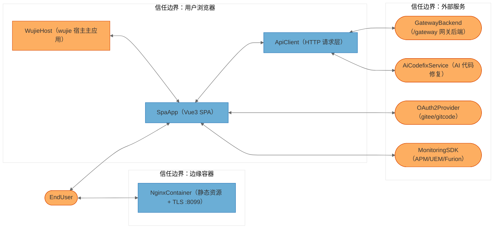
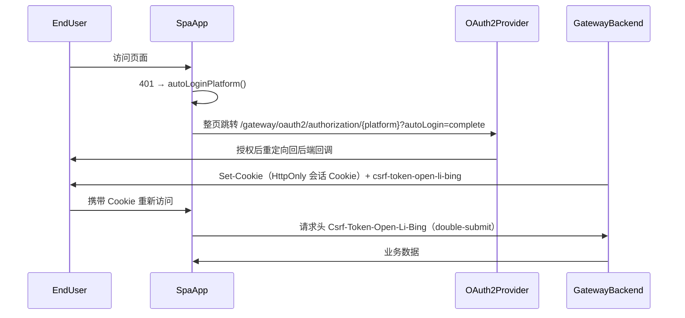
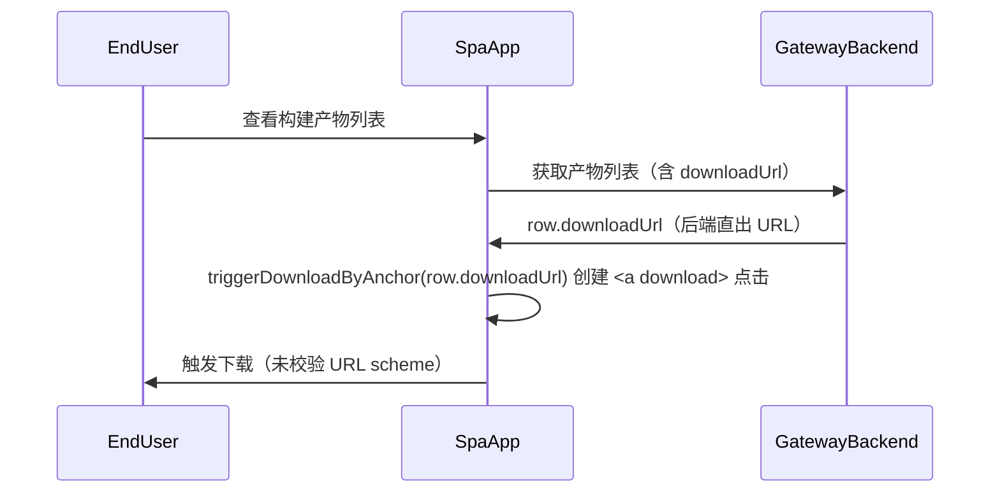

# openlibing-cicd-web 安全威胁分析报告（STRIDE-A）

## 1. 概述

本报告基于 `awesome-copilot/threat-model-analyst` skill 的 STRIDE-A 方法论（STRIDE + Abuse，即仿冒、篡改、抵赖、信息泄露、拒绝服务、权限提升、业务滥用），对 `openlibing-cicd-web`（CI/CD 流水线前端子应用）进行的安全威胁建模分析。所有发现均以仓库代码证据为准（分支 `master`，commit `b79141d`，2026-09-01）。

- 分析对象：`d:\openlibing\openlibing-cicd-web`（Vue 3 + Vite 前端 SPA，Nginx 容器部署，wujie 微前端子应用）
- 部署分类：**NETWORK_SERVICE**（经上游 CDN/ELB 对外提供的公网前端站点）
- 威胁计数说明：共识别 **8 个 STRIDE 分析组件、3 个信任边界、8 条数据流、36 项具体威胁、14 项安全发现**；另有 9 项标记为"待验证/待评审"，需业务方补充上下文。
- CVSS 评分说明：本报告 CVSS 4.0 分数为基于向量的估算值，最终评级建议由安全团队复核确认。

---

## 2. 系统架构概览

### 2.1 系统用途与技术栈

openlibing-cicd-web 是 openlibing 平台的 CI/CD 前端子应用，以 wujie 微前端方式嵌入主应用，提供流水线管理/详情/日志、镜像管理、安全选项等功能。技术栈：

| 层面   | 技术                                                         | 证据                                                                    |
| ------ | ------------------------------------------------------------ | ----------------------------------------------------------------------- |
| 框架   | Vue 3.3 / vue-router 4 / Pinia 2.2                           | `package.json`                                                          |
| UI     | element-plus 2.3、monaco-editor 0.52、echarts 5.4            | `package.json`                                                          |
| 构建   | Vite 4.4（已停止维护）、TypeScript 5                         | `package.json`、`vite.config.ts`                                        |
| 部署   | openEuler 22.03 + Nginx 1.24 容器，非 root 运行，仅暴露 8099 | `Dockerfile:2,5,194-196`                                                |
| 微前端 | wujie（iframe + postMessage 沙箱）                           | `src/App.vue:21-22`                                                     |
| 监控   | 华为云 APM / HWA UEM / Furion 动态注入                       | `src/utils/jsagent.js`、`src/utils/uem.js`、`src/assets/js/config.json` |

### 2.2 组件清单（锚定代码产物）

| 组件 ID          | 类型             | 代码锚点                                                                | 说明                                       |
| ---------------- | ---------------- | ----------------------------------------------------------------------- | ------------------------------------------ |
| EndUser          | 外部行为者       | —                                                                       | 浏览器终端用户（威胁源，不做 STRIDE 分析） |
| SpaApp           | 进程（浏览器内） | `src/main.ts`、`src/App.vue`                                            | Vue3 单页应用主体                          |
| ApiClient        | 进程（浏览器内） | `src/api/ApiClient.ts`、`src/api/client.ts`                             | HTTP 请求层，管理 CSRF 头与会话 Cookie     |
| WujieHost        | 外部集成点       | `src/App.vue:21-22`、`src/shared/wujieHostQueryConvention.ts`           | wujie 宿主主应用（同浏览器、独立应用）     |
| NginxContainer   | 进程（容器）     | `Dockerfile`、`nginx/nginx_prod.conf`                                   | 静态资源边缘服务 + TLS 终结                |
| GatewayBackend   | 外部服务         | `src/api/urls.ts:1-9`                                                   | `/gateway` 网关与 openlibing 后端          |
| OAuth2Provider   | 外部服务         | `src/api/ApiClient.ts:288-292`                                          | gitee/gitcode OAuth2 登录                  |
| AiCodefixService | 外部服务         | `src/api/urls.ts:244-246`                                               | AI 代码修复服务（硬编码测试域名）          |
| MonitoringSDK    | 外部服务         | `src/utils/jsagent.js`、`src/utils/uem.js`、`src/assets/js/config.json` | 第三方监控埋点脚本                         |

### 2.3 信任边界与数据流



| 数据流 | 路径                         | 协议/机制                                   | 信任边界穿越            |
| ------ | ---------------------------- | ------------------------------------------- | ----------------------- |
| DF01   | EndUser ↔ NginxContainer     | HTTPS :8099（经上游 CDN/ELB）               | 公网 → 边缘             |
| DF02   | EndUser ↔ SpaApp             | 浏览器交互                                  | 公网 → 浏览器           |
| DF03   | SpaApp ↔ ApiClient           | 进程内调用                                  | 浏览器内部              |
| DF04   | WujieHost ↔ SpaApp           | wujie props/bus/URL 同步                    | 沙箱边界                |
| DF05   | ApiClient ↔ GatewayBackend   | HTTPS `/gateway`，HttpOnly Cookie + CSRF 头 | 浏览器 → 后端           |
| DF06   | SpaApp ↔ OAuth2Provider      | 整页重定向 OAuth2 授权                      | 浏览器 → IdP            |
| DF07   | ApiClient ↔ AiCodefixService | HTTPS 跨域直连（含 SSE stream）             | 浏览器 → 第三方测试环境 |
| DF08   | SpaApp ↔ MonitoringSDK       | CDN 脚本加载 + 埋点上报                     | 浏览器 → 第三方 CDN     |

### 2.4 部署分类与组件暴露表

部署分类为 **NETWORK_SERVICE**（公网前端站点）。组件暴露表是后续所有威胁前置条件与分层的下限依据：

| 组件             | 监听/暴露                | 鉴权屏障       | 外部可达性 | 最小前置条件           | 最低分层 |
| ---------------- | ------------------------ | -------------- | ---------- | ---------------------- | -------- |
| NginxContainer   | :8099 TLS（经 CDN/ELB）  | 无（静态资源） | 外部可达   | None                   | Tier 1   |
| SpaApp           | 浏览器内（经 DF01 分发） | 无             | 外部可达   | None                   | Tier 1   |
| ApiClient        | 浏览器内                 | 会话 Cookie    | 外部可达   | None                   | Tier 1   |
| WujieHost        | 浏览器内                 | 宿主会话       | 需宿主环境 | Authenticated User     | Tier 2   |
| GatewayBackend   | 服务端（`/gateway`）     | 会话 + CSRF    | 外部可达   | None（未认证请求可达） | Tier 1   |
| OAuth2Provider   | IdP 服务端               | IdP 自控       | 外部可达   | Authenticated User     | Tier 2   |
| AiCodefixService | 测试环境服务             | 未知（待验证） | 外部可达   | None                   | Tier 1   |
| MonitoringSDK    | 第三方 CDN               | 无             | 外部可达   | None                   | Tier 1   |

### 2.5 关键安全场景

**场景 1：用户登录与会话建立（OAuth2 + Cookie）**



**场景 2：构建产物下载（后端 URL 直出）**



---

## 3. 安全基础设施盘点（已有控制）

分析前确认以下安全控制已存在，避免误报"缺失"：

| 类别       | 已有控制                                                                                                                | 证据                                                            |
| ---------- | ----------------------------------------------------------------------------------------------------------------------- | --------------------------------------------------------------- |
| 认证       | OAuth2 授权码流程；前端不持有令牌，会话由 HttpOnly Cookie 承载                                                          | `src/api/ApiClient.ts:134-136,288-292`                          |
| CSRF       | double-submit 模式：Cookie `csrf-token-open-li-bing` + 自定义请求头                                                     | `src/api/ApiClient.ts:125-129`、`src/api/client.ts:14-21`       |
| XSS 过滤   | 引入 `xss` 库并自定义白名单（富文本渲染层）                                                                             | `src/utils/until.js:1,238-244`；全仓 `v-html` 0 处、`eval` 0 处 |
| 容器加固   | 非 root `USER nginx`、umask 0077、sysctl 加固、攻击面裁剪（删除 gcc/gdb/perl 等）、脚本 500 权限                        | `Dockerfile:36-42,105-106,142,151-185,188-191,195`              |
| TLS        | TLSv1.2/1.3、单一 AES256-GCM 套件、OCSP Stapling、session tickets off                                                   | `nginx/nginx_prod.conf:117-141`                                 |
| Nginx 加固 | `server_tokens off`、方法白名单（444）、隐藏文件禁访、健康检查 deny all、COOP/CORP、Permissions-Policy、X-Frame-Options | `nginx_prod.conf:17,89,94-102,147-158,193-196`                  |
| 凭据卫生   | .env 文件无敏感凭据；代码无硬编码密钥；监控 appId 为公开接入标识                                                        | `.env.*`；pre-commit `detect-private-key` + `gitleaks`          |
| 供应链修补 | `pnpm.overrides` 强制升级多个已知漏洞传递依赖                                                                           | `package.json:41-53`                                            |
| 第三方脚本 | uem.js 带 SRI + `crossOrigin=anonymous`                                                                                 | `src/utils/uem.js:18`                                           |
| Tab 安全   | `window.open` 带 `noopener,noreferrer`；`safeOpen` 置空 opener                                                          | `Detail.vue:402-408`、`src/utils/until.js:209-212`              |
| 下载文件名 | 共享版 `sanitizeDownloadFilename` 过滤非法字符                                                                          | `src/utils/triggerDownloadByAnchor.ts:2-5`                      |
| 同源 API   | 后端地址全部为 `/gateway` 相对路径，无硬编码生产 host                                                                   | `src/api/urls.ts:1-9`                                           |

---

## 4. STRIDE-A 威胁分析

### 4.1 可利用性分层定义

| 分层   | 标签       | 前置条件               | 判定规则                                                                                       |
| ------ | ---------- | ---------------------- | ---------------------------------------------------------------------------------------------- |
| Tier 1 | 直接暴露   | None                   | 无需任何先验访问即可被未认证外部攻击者利用                                                     |
| Tier 2 | 条件性风险 | 单一前置条件           | 需 `Authenticated User` / `Privileged User` / `Internal Network` / `Local Process Access` 之一 |
| Tier 3 | 纵深防御   | 多重前置或基础设施访问 | 需 `Host/OS Access`、`Admin Credentials`、`{组件} Compromise` 或多条件组合                     |

### 4.2 威胁汇总表

| 组件             | S     | T     | R     | I     | D     | E     | A     | 合计   |
| ---------------- | ----- | ----- | ----- | ----- | ----- | ----- | ----- | ------ |
| SpaApp           | 0     | 1     | 0     | 2     | 0     | 1     | 1     | 5      |
| ApiClient        | 1     | 1     | 0     | 1     | 0     | 0     | 1     | 4      |
| NginxContainer   | 1     | 1     | 0     | 1     | 1     | 1     | 0     | 5      |
| WujieHost        | 0     | 1     | 0     | 1     | 0     | 1     | 0     | 3      |
| GatewayBackend   | 1     | 1     | 0     | 1     | 1     | 1     | 0     | 5      |
| OAuth2Provider   | 1     | 1     | 0     | 1     | 1     | 1     | 0     | 5      |
| AiCodefixService | 1     | 1     | 1     | 0     | 1     | 0     | 1     | 5      |
| MonitoringSDK    | 1     | 1     | 0     | 1     | 1     | 0     | 0     | 4      |
| **合计**         | **6** | **8** | **0** | **9** | **5** | **5** | **3** | **36** |

> R（抵赖）类威胁全部为 N/A：本应用为纯前端展示层，审计日志由后端网关与各服务承担，前端不记录也不应记录安全审计事件。

### 4.3 SpaApp（Vue3 单页应用）

| 威胁 ID | 类别     | 威胁描述                                                                                                                                                                                                                                                              | 前置条件                                               | 分层   | 状态      |
| ------- | -------- | --------------------------------------------------------------------------------------------------------------------------------------------------------------------------------------------------------------------------------------------------------------------- | ------------------------------------------------------ | ------ | --------- |
| T01.I-1 | 信息泄露 | 存储型 XSS：`Detail.vue:958-966` 用 `dangerouslyUseHTMLString: true` 将后端返回的 `job?.name` 未转义插入 HTML 确认框，恶意任务名可执行脚本                                                                                                                            | Authenticated User（攻击者先创建恶意命名的流水线任务） | Tier 2 | Open      |
| T01.I-2 | 信息泄露 | 下载链接触信任后端：`triggerDownloadByAnchor.ts:15-24` 及 4 处本地重复实现（`ObsProduct.vue:106-120`、`UtResult.vue:85`、`BuildProduct.vue:244`、`TestResult.vue:139`）对 `row.downloadUrl` 不校验 scheme，`javascript:` 伪协议可执行脚本；本地重复实现还不净化文件名 | Authenticated User                                     | Tier 2 | Open      |
| T01.T-1 | 篡改     | wujie bus 事件无来源/结构校验：`stores/app.ts:57-62` 直接采纳 `projectInfoChange` 事件数据写入 store                                                                                                                                                                  | {WujieHost} Compromise                                 | Tier 3 | Open      |
| T01.E-1 | 权限提升 | 前端权限判定仅为 UI 层（按钮置灰），`stores/app.ts:193-235` 存在多层降级逻辑；路由表 7 条路由均无守卫（`router/index.ts:4-72`），页面可被直接访问，实际防护完全依赖后端 401/403                                                                                       | Authenticated User                                     | Tier 2 | Open      |
| T01.A-1 | 业务滥用 | 自动重登滥用：401 时 `autoLoginPlatform()` 整页跳转 OAuth2（`ApiClient.ts:161-174,288-292`），`simpleAuth`/`autoLogin` 状态存 sessionStorage，恶意页面诱导触发可造成登录流程干扰（Login CSRF 变体）                                                                   | Authenticated User                                     | Tier 3 | ⚠️ 待评审 |
| T01.R   | 抵赖     | N/A — 审计由后端网关承担，前端不记录审计事件                                                                                                                                                                                                                          | —                                                      | —      | N/A       |
| T01.D   | 拒绝服务 | N/A — SPA 无网络监听，可用性风险在边缘与后端层                                                                                                                                                                                                                        | —                                                      | —      | N/A       |

### 4.4 ApiClient（HTTP 请求层）

| 威胁 ID | 类别     | 威胁描述                                                                                                                                           | 前置条件                                | 分层   | 状态                |
| ------- | -------- | -------------------------------------------------------------------------------------------------------------------------------------------------- | --------------------------------------- | ------ | ------------------- |
| T02.S-1 | 仿冒     | 会话凭证伪造：前端不持有令牌，全部依赖 HttpOnly Cookie + OAuth2，伪造面收敛到后端                                                                  | —                                       | —      | 🛡️ 已有控制         |
| T02.T-1 | 篡改     | 请求/响应篡改：全链路 HTTPS + 同源网关，前端无明文回退                                                                                             | —                                       | —      | 🛡️ 已有控制         |
| T02.I-1 | 信息泄露 | CSRF Token Cookie 非 HttpOnly，可被 JS 读取（`ApiClient.ts:125-129`、`client.ts:14-21`）；double-submit 是标准模式，但一旦发生 XSS 该防线即失效    | Host/OS Access（需先有 XSS 或本地访问） | Tier 3 | 🛡️ 已有控制（注记） |
| T02.A-1 | 业务滥用 | 跨域数据外发：`AI_CODEFIX` 硬编码测试环境域名 `https://majun-ai.test.osinfra.cn`（`urls.ts:244-246`），生产构建仍跨域直连测试环境（含 SSE stream） | Authenticated User                      | Tier 2 | Open                |
| T02.R   | 抵赖     | N/A — 请求审计在后端网关记录                                                                                                                       | —                                       | —      | N/A                 |
| T02.D   | 拒绝服务 | N/A — 限流由 CDN/网关执行                                                                                                                          | —                                       | —      | N/A                 |
| T02.E   | 权限提升 | N/A — 该层无权限判定逻辑                                                                                                                           | —                                       | —      | N/A                 |

### 4.5 NginxContainer（边缘容器）

| 威胁 ID | 类别     | 威胁描述                                                                                                                                                           | 前置条件                         | 分层   | 状态        |
| ------- | -------- | ------------------------------------------------------------------------------------------------------------------------------------------------------------------ | -------------------------------- | ------ | ----------- |
| T03.S-1 | 仿冒     | `resolver 8.8.8.8 8.8.4.4` 使用公共 DNS（`nginx_prod.conf:143`），DNS 劫持/污染可影响上游解析结果（当前配置无 `proxy_pass`，影响为潜在面）                         | Internal Network                 | Tier 2 | Open        |
| T03.T-1 | 篡改     | 访问日志记录 `$cookie_suid` Cookie 值（`nginx_prod.conf:26`），日志可被注入伪造字段且无防篡改保护，敏感会话标识泄露到日志系统                                      | Host/OS Access（需日志系统访问） | Tier 3 | Open        |
| T03.I-1 | 信息泄露 | TLS 私钥 `cert/server.key` 与私钥密码文件 `cert/abc.txt` 同目录挂载（`nginx_prod.conf:123-129`）；`monitor.sh:8` 启动后删除证书目录，若 monitor 异常则证书长期留存 | Host/OS Access                   | Tier 3 | Open        |
| T03.D-1 | 拒绝服务 | 限流 `1000r/s` 过宽（`nginx_prod.conf:60-62`），`limit_conn 10` 对静态资源尚可但缺乏突发保护；直连源站 IP 可绕过 CDN 限流                                          | Internal Network（需直连源站）   | Tier 2 | Open        |
| T03.E-1 | 权限提升 | `proxy_ssl_verify off`（`nginx_prod.conf:108`）关闭上游证书校验，一旦启用代理转发即存在上游 MITM 提权面                                                            | Internal Network                 | Tier 2 | Open        |
| T03.R   | 抵赖     | N/A（并入 T03.T-1 日志治理）                                                                                                                                       | —                                | —      | N/A         |
| T03.A   | 业务滥用 | N/A — HTTP 方法白名单、隐藏文件禁访已实现（`:147-158`）                                                                                                            | —                                | —      | 🛡️ 已有控制 |

### 4.6 WujieHost（wujie 宿主主应用）

| 威胁 ID     | 类别     | 威胁描述                                                                                                                                                                              | 前置条件               | 分层   | 状态                |
| ----------- | -------- | ------------------------------------------------------------------------------------------------------------------------------------------------------------------------------------- | ---------------------- | ------ | ------------------- |
| T04.E-1     | 权限提升 | 子应用无条件信任宿主：props 直读（`App.vue:21-22`、`stores/app.ts:45-51`），`redirectByTopWindow` 写 `window.top.location.href`（`ApiClient.ts:52-56`）；宿主被攻陷即可完全操纵子应用 | {WujieHost} Compromise | Tier 3 | Open                |
| T04.T-1     | 篡改     | 宿主可注入伪造 `projectInfo`/`user` props，前端仅用于展示，但若后端不二次校验项目归属则形成越权展示                                                                                   | {WujieHost} Compromise | Tier 3 | Open                |
| T04.I-1     | 信息泄露 | 路由同步把 `projectId`、`jobRunId`、`codeHostingPlatformFlag` 等业务标识写入宿主地址栏（`wujieHostQueryConvention.ts:8-26`），无凭证内容，属低敏                                      | Authenticated User     | Tier 2 | 🛡️ 已有控制（低敏） |
| T04.S/R/D/A | —        | N/A — 同浏览器沙箱内无独立身份凭据，不承担审计/可用性/业务流程职责                                                                                                                    | —                      | —      | N/A                 |

### 4.7 GatewayBackend（/gateway 网关后端，外部视角）

| 威胁 ID | 类别     | 威胁描述                                                                                  | 前置条件           | 分层   | 状态                            |
| ------- | -------- | ----------------------------------------------------------------------------------------- | ------------------ | ------ | ------------------------------- |
| T05.S-1 | 仿冒     | 会话 Cookie 属性（HttpOnly/Secure/SameSite）在前端不可见，无法证实防护到位                | —                  | —      | ⚠️ 待验证                       |
| T05.T-1 | 篡改     | 后端返回数据被污染（任务名 → XSS、downloadUrl → 任意下载）是 T01.I-1/T01.I-2 的信任链根因 | Authenticated User | Tier 2 | Open（由 FIND-02/FIND-03 覆盖） |
| T05.I-1 | 信息泄露 | 接口错误信息详细程度未知，可能泄露内部实现                                                | None               | Tier 1 | ⚠️ 待验证                       |
| T05.D-1 | 拒绝服务 | 网关过载影响前端整体可用；限流由 CDN/ELB/网关平台承担                                     | —                  | —      | 🔄 平台承担                     |
| T05.E-1 | 权限提升 | 后端对各接口的鉴权强制执行情况前端无法证实（FIND-06 的依赖前提）                          | —                  | —      | ⚠️ 待验证                       |
| T05.R/A | —        | N/A — 审计与业务流程防护在服务端域内，超出本仓可见范围                                    | —                  | —      | N/A                             |

### 4.8 OAuth2Provider（gitee/gitcode OAuth2，外部视角）

| 威胁 ID | 类别     | 威胁描述                                                                                                | 前置条件           | 分层   | 状态                |
| ------- | -------- | ------------------------------------------------------------------------------------------------------- | ------------------ | ------ | ------------------- |
| T06.S-1 | 仿冒     | OAuth2 账号仿冒：标准授权码流程 + 后端令牌交换，前端不接触 code 换 token 环节                           | —                  | —      | 🛡️ 已有控制         |
| T06.T-1 | 篡改     | 授权回调被篡改：回调路径固定为后端端点（`ApiClient.ts:288-292`）                                        | —                  | —      | 🛡️ 已有控制         |
| T06.I-1 | 信息泄露 | `autoLogin=complete` 与平台标识进入地址栏并被 sessionStorage 缓存（`ApiClient.ts:243-279`），无凭证内容 | None               | Tier 1 | 🛡️ 已有控制（低敏） |
| T06.D-1 | 拒绝服务 | IdP 不可用阻断全平台登录                                                                                | —                  | —      | 🔄 平台承担         |
| T06.E-1 | 权限提升 | Login CSRF：诱导受害者完成攻击者会话的 OAuth 授权，`autoLogin=complete` 触发面需业务确认                | Authenticated User | Tier 3 | ⚠️ 待评审           |
| T06.R/A | —        | N/A — 授权审计由 IdP 承担；无业务流程滥用面                                                             | —                  | —      | N/A                 |

### 4.9 AiCodefixService（AI 代码修复服务，外部视角）

| 威胁 ID | 类别     | 威胁描述                                                                                               | 前置条件           | 分层   | 状态                |
| ------- | -------- | ------------------------------------------------------------------------------------------------------ | ------------------ | ------ | ------------------- |
| T07.S-1 | 仿冒     | 测试环境服务端鉴权机制未知，可被伪造响应欺骗前端                                                       | None               | Tier 1 | ⚠️ 待验证           |
| T07.T-1 | 篡改     | SSE 流式响应（`AI_CODEFIX_STREAM`）内容注入：若 AI 输出以 HTML/富文本渲染可引入脚本，渲染方式待确认    | None               | Tier 1 | ⚠️ 待验证           |
| T07.I-1 | 信息泄露 | 生产用户代码/上下文数据发往测试环境域名（`urls.ts:244-246`），环境错配导致数据暴露面扩大（同 FIND-04） | Authenticated User | Tier 2 | Open                |
| T07.D-1 | 拒绝服务 | 测试环境可用性无生产级保障，AI 功能随时可能失效                                                        | —                  | —      | N/A（并入 FIND-04） |
| T07.A-1 | 业务滥用 | AI 生成内容误导用户执行危险操作（如诱导提交恶意配置）                                                  | Authenticated User | Tier 3 | ⚠️ 待评审           |
| T07.R/E | —        | N/A — 无审计与本地权限交互面                                                                           | —                  | —      | N/A                 |

### 4.10 MonitoringSDK（第三方监控脚本，外部视角）

| 威胁 ID   | 类别     | 威胁描述                                                                                                                   | 前置条件                   | 分层   | 状态               |
| --------- | -------- | -------------------------------------------------------------------------------------------------------------------------- | -------------------------- | ------ | ------------------ |
| T08.S-1   | 仿冒     | CDN 域名劫持/伪造端点：jsagent.js（`res.hc-cdn.com`）与 Furion（`config.json:10`）均无 SRI，被劫持即向全部用户投放恶意脚本 | {ThirdPartyCDN} Compromise | Tier 3 | Open               |
| T08.T-1   | 篡改     | 第三方脚本无完整性校验可被篡改（`jsagent.js:6-22`；对比 `uem.js:18` 已有 SRI）                                             | {ThirdPartyCDN} Compromise | Tier 3 | Open（同 FIND-07） |
| T08.I-1   | 信息泄露 | UEM SDK `isStorage: true` + localStorage（`uem.js:24-32`），采集范围与存储内容透明度不足                                   | None                       | Tier 1 | ⚠️ 待验证          |
| T08.D-1   | 拒绝服务 | CDN 脚本加载失败/阻塞对首屏的影响需确认注入方式是否 async                                                                  | None                       | Tier 1 | ⚠️ 待验证          |
| T08.R/E/A | —        | N/A — 无审计、权限与业务流程面                                                                                             | —                          | —      | N/A                |

---

## 5. 安全发现项

### 5.1 行动摘要

| 优先级 | 发现                                                            | 分层   | 严重度    | 修复成本 |
| ------ | --------------------------------------------------------------- | ------ | --------- | -------- |
| 1      | FIND-02 存储型 XSS（dangerouslyUseHTMLString）                  | Tier 2 | Important | Low      |
| 2      | FIND-03 下载链接未校验 scheme（5 处实现）                       | Tier 2 | Important | Low      |
| 3      | FIND-04 AI 服务硬编码测试环境域名                               | Tier 2 | Important | Low      |
| 4      | FIND-09 CI 工作流供应链风险（pull_request_target + 未 pin SHA） | Tier 3 | Important | Medium   |
| 5      | FIND-10 供应链治理（异常版本号 + Vite 4 EOL + 无依赖扫描）      | Tier 3 | Important | Medium   |
| 6      | FIND-07 第三方监控脚本无 SRI                                    | Tier 3 | Moderate  | Low      |
| 7      | FIND-05 nginx 上游 TLS 校验关闭                                 | Tier 2 | Moderate  | Low      |
| 8      | FIND-01 安全响应头纵深防御缺失                                  | Tier 1 | Low       | Low      |

#### Quick Wins

| 发现    | 分层   | 严重度    | 修复成本 | 动作                                                                                               |
| ------- | ------ | --------- | -------- | -------------------------------------------------------------------------------------------------- |
| FIND-01 | Tier 1 | Low       | Low      | 在上游 CDN/ELB 补齐 CSP/HSTS/X-Content-Type-Options/Referrer-Policy，或在 Nginx 层显式配置作为兜底 |
| FIND-02 | Tier 2 | Important | Low      | 移除 `dangerouslyUseHTMLString` 或对 `job.name` 做 HTML 转义（单文件修复）                         |
| FIND-03 | Tier 2 | Important | Low      | 统一下载函数并校验 URL scheme 白名单（https/http）+ 复用文件名净化                                 |
| FIND-04 | Tier 2 | Important | Low      | AI 服务地址改为环境变量注入，生产指向生产域名                                                      |
| FIND-05 | Tier 2 | Moderate  | Low      | `proxy_ssl_verify on` + 配置 CA 证书（当前无 proxy_pass，属于低成本加固）                          |
| FIND-07 | Tier 3 | Moderate  | Low      | 为 jsagent.js/Furion 补 SRI integrity 属性                                                         |

### 5.2 Tier 1 — 直接暴露（无前置条件）

#### FIND-01: 安全响应头纵深防御缺失（CSP/HSTS/X-Content-Type-Options/Referrer-Policy）

| 属性             | 值                                                                                       |
| ---------------- | ---------------------------------------------------------------------------------------- |
| 组件             | NginxContainer / 上游 CDN                                                                |
| 可利用性分层     | Tier 1（前置条件：None）                                                                 |
| 严重度           | Low                                                                                      |
| CVSS 4.0（估算） | 2.7 — `CVSS:4.0/AV:N/AC:L/AT:N/PR:N/UI:N/VC:N/VI:L/VA:N/SC:N/SI:N/SA:N`                  |
| CWE              | [CWE-693](https://cwe.mitre.org/data/definitions/693.html): Protection Mechanism Failure |
| OWASP            | A05:2025 – Security Misconfiguration                                                     |
| 修复成本         | Low                                                                                      |

###### Description

Nginx 层显式声明 CSP/HSTS/X-Content-Type-Options/Referrer-Policy 由上游（CDN/ELB）下发，本层不配置（`nginx_prod.conf:92-93,101-102`）。前端存在富文本/HTML 渲染面（FIND-02），缺少 CSP 意味着一旦注入成功无纵深拦截；HSTS 缺失在首次访问与 CDN 故障降级场景下存在 SSL 剥离窗口。

###### Evidence

- `nginx/nginx_prod.conf:92-93`：注释"HSTS、X-Content-Type-Options 由上游下发，本层不配置"
- `nginx_prod.conf:101-102`：Referrer-Policy、CSP 同样交由上游
- 依赖外部系统无法在本仓证实上游确实已下发（Needs Verification 交叉项）

###### Remediation

- 类型：Standard Mitigation
- 方案：与平台团队确认上游 CDN/ELB 已下发上述头；同时在 Nginx 层增加 `Content-Security-Policy`（先 Report-Only 灰度）、`Strict-Transport-Security`、`X-Content-Type-Options: nosniff`、`Referrer-Policy: strict-origin-when-cross-origin` 作为兜底，避免单点依赖。

###### Verification

- `curl -I https://www.openlibing.com/build/` 逐环境核对 4 个响应头存在且取值正确。
- 用 securityheaders.com 类工具评分不低于 B。

### 5.3 Tier 2 — 条件性风险（单一前置条件）

#### FIND-02: 存储型 XSS — dangerouslyUseHTMLString 渲染未转义后端数据

| 属性             | 值                                                                             |
| ---------------- | ------------------------------------------------------------------------------ |
| 组件             | SpaApp                                                                         |
| 可利用性分层     | Tier 2（前置条件：Authenticated User）                                         |
| 严重度           | Important                                                                      |
| CVSS 4.0（估算） | 7.7 — `CVSS:4.0/AV:N/AC:L/AT:N/PR:L/UI:A/VC:H/VI:H/VA:N/SC:N/SI:H/SA:N`        |
| CWE              | [CWE-79](https://cwe.mitre.org/data/definitions/79.html): Cross-site Scripting |
| OWASP            | A03:2025 – Injection                                                           |
| 修复成本         | Low                                                                            |

###### Description

`Detail.vue:958-966` 在"重试子任务"确认框中以 `dangerouslyUseHTMLString: true` 将 `job?.name` 直接拼入 HTML 字符串。`job.name` 源自后端流水线任务数据，而任务名可由有权限用户在流水线配置中 influence（如仓库名/任务名携带 `` 载荷）。任何查看该流水线详情的用户的浏览器中将执行脚本，配合 HttpOnly Cookie 无法读取令牌，但可以 CSRF double-submit Cookie 头发起任意已认证请求（XSS 可读 `csrf-token-open-li-bing`，见 T02.I-1），形成完整攻击链。

###### Evidence

```ts
ElMessageBox.confirm(
  `重试子任务 <span style="...">${job?.name}</span>，继续？`,
  '重试',
  { ..., dangerouslyUseHTMLString: true }
)
```

（`src/views/pipeline/PipelineDetail/Detail.vue:958-966`；全仓其余位置无 `v-html`/`eval`，此为唯一 HTML 注入点，攻击面集中）

###### Remediation

- 类型：Custom Mitigation
- 方案：改用 `ElMessageBox.confirm` 的纯文本模式（去掉 `dangerouslyUseHTMLString`，高亮需求用 CSS 而非拼接 HTML）；若必须保留富文本，对 `job.name` 经 `xss` 库过滤后再插值。

###### Verification

- 在测试环境创建任务名为 `` 的流水线，打开详情确认弹窗以文本展示。
- 全仓 grep `dangerouslyUseHTMLString` 结果为 0。

#### FIND-03: 下载链接未校验 scheme 且存在 4 处无净化重复实现

| 属性             | 值                                                                             |
| ---------------- | ------------------------------------------------------------------------------ |
| 组件             | SpaApp                                                                         |
| 可利用性分层     | Tier 2（前置条件：Authenticated User）                                         |
| 严重度           | Important                                                                      |
| CVSS 4.0（估算） | 7.1 — `CVSS:4.0/AV:N/AC:L/AT:N/PR:L/UI:A/VC:H/VI:H/VA:N/SC:N/SI:N/SA:N`        |
| CWE              | [CWE-79](https://cwe.mitre.org/data/definitions/79.html): Cross-site Scripting |
| OWASP            | A03:2025 – Injection                                                           |
| 修复成本         | Low                                                                            |

###### Description

共享版 `triggerDownloadByAnchor.ts:15-24` 对后端直出的 `row.downloadUrl` 追加时间戳后直接赋给 `a.href`，无 scheme 校验（证据：`SecurityOptions/index.vue:826-835` 使用 `row.downloadUrl`）。另有 4 处本地复制版本（`ObsProduct.vue:106-120`、`UtResult.vue:85`、`BuildProduct.vue:244`、`TestResult.vue:139`）连文件名净化都没有。若后端数据被污染或上游对象存储返回异常 URL，`javascript:` 伪协议可触发脚本执行；重复实现也放大了未来修复遗漏的风险。

###### Evidence

- `src/utils/triggerDownloadByAnchor.ts:15-24`：`a.href = ${url}${sep}_t=${Date.now()}`，无 scheme 白名单
- `src/views/SecurityOptions/index.vue:826-835`：`triggerDownloadByAnchor(row.downloadUrl, row.packageName, ...)` 直接使用后端字段
- `ObsProduct.vue:114`：`a.setAttribute('download', filename)` 未净化

###### Remediation

- 类型：Standard Mitigation
- 方案：在 `triggerDownloadByAnchor.ts` 增加 `https:`/`http:`（或相对路径 + 固定域名前缀）scheme 白名单，非法则丢弃并告警；删除 4 处本地重复实现，统一引用共享函数（同时获得文件名净化）。

###### Verification

- 单测覆盖：`javascript:alert(1)`、`data:text/html`、`vbscript:` 等输入被拒绝。
- grep 全仓 `createElement\('a'\)` 仅剩共享实现一处。

#### FIND-04: AI 代码修复服务硬编码测试环境域名，生产数据跨域外发

| 属性             | 值                                                                            |
| ---------------- | ----------------------------------------------------------------------------- |
| 组件             | ApiClient / AiCodefixService                                                  |
| 可利用性分层     | Tier 2（前置条件：Authenticated User）                                        |
| 严重度           | Important                                                                     |
| CVSS 4.0（估算） | 6.5 — `CVSS:4.0/AV:N/AC:L/AT:N/PR:L/UI:N/VC:L/VI:N/VA:N/SC:N/SI:N/SA:N`       |
| CWE              | [CWE-489](https://cwe.mitre.org/data/definitions/489.html): Active Debug Code |
| OWASP            | A05:2025 – Security Misconfiguration                                          |
| 修复成本         | Low                                                                           |

###### Description

`urls.ts:244-246` 将 `AI_CODEFIX` 硬编码为 `https://majun-ai.test.osinfra.cn`，其余所有 API 均走 `/gateway` 同源网关，唯此接口在生产构建中仍跨域直连测试环境。影响：(1) 生产用户代码上下文发往无生产级保障的测试环境（T07.I-1）；(2) 测试环境可用性/证书/限流均按测试标准配置，SSE stream 随时中断；(3) 破坏同源模型，扩大 CORS 面。

###### Evidence

```ts
export const AI_CODEFIX = 'https://majun-ai.test.osinfra.cn';
export const AI_CODEFIX_LIKE = `${AI_CODEFIX}/codefix/like`;
export const AI_CODEFIX_STREAM = `${AI_CODEFIX}/codefix/stream`;
```

（`src/api/urls.ts:244-246`；对比 `urls.ts:1-9` 全部为 `/gateway` 相对路径）

###### Remediation

- 类型：Standard Mitigation
- 方案：AI 服务经 `/gateway` 反代暴露，前端改用相对路径；如必须直连，则按 `import.meta.env.MODE` 注入环境对应域名（`.env.production` 指向生产地址）。

###### Verification

- 生产构建产物中 grep `test.osinfra.cn` 结果为 0。
- 浏览器 Network 面板确认 codefix 请求走同源 `/gateway` 路径。

#### FIND-05: Nginx 关闭上游 TLS 证书校验（proxy_ssl_verify off）

| 属性             | 值                                                                                          |
| ---------------- | ------------------------------------------------------------------------------------------- |
| 组件             | NginxContainer                                                                              |
| 可利用性分层     | Tier 2（前置条件：Internal Network）                                                        |
| 严重度           | Moderate                                                                                    |
| CVSS 4.0（估算） | 6.2 — `CVSS:4.0/AV:A/AC:L/AT:N/PR:N/UI:N/VC:H/VI:N/VA:N/SC:N/SI:N/SA:N`                     |
| CWE              | [CWE-295](https://cwe.mitre.org/data/definitions/295.html): Improper Certificate Validation |
| OWASP            | A02:2025 – Security Misconfiguration                                                        |
| 修复成本         | Low                                                                                         |

###### Description

三份 nginx 配置均设置 `proxy_ssl_verify off`（`nginx_prod.conf:108`）。当前配置中无实际 `proxy_pass`（仅静态站点 + 预留代理参数），故为潜伏风险：一旦后续启用代理转发（配置模板已含 `proxy_set_header` 系列），内网攻击者可通过 ARP/路由劫持与上游建立伪 TLS 连接，注入或截获转发流量。

###### Evidence

- `nginx/nginx_prod.conf:108`：`proxy_ssl_verify off;`（beta/gamma 同）
- `nginx_prod.conf:103-114`：已有 `proxy_set_header` 预留，说明代理转发在演进计划内

###### Remediation

- 类型：Standard Mitigation
- 方案：改为 `proxy_ssl_verify on` 并配置 `proxy_ssl_trusted_certificate`（内部 CA 或公共 CA bundle）、`proxy_ssl_verify_depth 2`；启用前用内部 CA 证书验证。

###### Verification

- grep 三份 conf `proxy_ssl_verify` 均为 `on`；模拟自签名上游证书被拒。

#### FIND-06: 前端权限仅为 UI 层控制且路由无守卫，后端强制执行待验证

| 属性             | 值                                                                                                          |
| ---------------- | ----------------------------------------------------------------------------------------------------------- |
| 组件             | SpaApp / GatewayBackend                                                                                     |
| 可利用性分层     | Tier 2（前置条件：Authenticated User）                                                                      |
| 严重度           | Low                                                                                                         |
| CVSS 4.0（估算） | 3.4 — `CVSS:4.0/AV:N/AC:L/AT:N/PR:L/UI:N/VC:L/VI:N/VA:N/SC:N/SI:N/SA:N`                                     |
| CWE              | [CWE-602](https://cwe.mitre.org/data/definitions/602.html): Client-Side Enforcement of Server-Side Security |
| OWASP            | A01:2025 – Broken Access Control                                                                            |
| 修复成本         | Medium                                                                                                      |

###### Description

权限判定 `hasOperationPermission()`（`stores/app.ts:193-235`）明确注释为 UI 侧控制（按钮置灰/气泡），且存在多层降级（接口未就绪时降级到 `user.permissions`）；路由表 7 条路由均无 `beforeEach` 守卫与鉴权 meta（`router/index.ts:4-72`）。前端防线可被绕过属预期设计，**安全前提是后端对每个接口独立强制鉴权**——该前提在本仓不可见，需后端确认（T05.E-1）。若后端存在仅依赖"入口隐蔽"的接口，即构成越权。

###### Evidence

- `src/stores/app.ts:193-235`：降级逻辑 `const perms = (this.user as any)?.permissions || []`
- `src/router/index.ts:4-72`：无任何路由守卫
- `src/constants/permissions-meta.ts:369-391`：仅为文案映射，不参与鉴权

###### Remediation

- 类型：Existing Control（待证实）+ Custom Mitigation
- 方案：与后端团队逐接口核对鉴权强制执行（特别是 `/gateway/openlibing-cicd` 写操作类接口）；前端补充轻量路由守卫仅做体验优化（重定向而非安全屏障），并在权限接口失败时默认收权（fail-closed）而非降级放行。

###### Verification

- 用无权限账号直接调用写操作 API（绕过 UI）确认返回 403。
- 断网/权限接口 500 场景下前端按钮呈收权状态。

### 5.4 Tier 3 — 纵深防御（多重前置条件/基础设施访问）

#### FIND-07: 第三方监控脚本无 SRI 完整性校验

| 属性             | 值                                                                                              |
| ---------------- | ----------------------------------------------------------------------------------------------- |
| 组件             | MonitoringSDK                                                                                   |
| 可利用性分层     | Tier 3（前置条件：{ThirdPartyCDN} Compromise）                                                  |
| 严重度           | Moderate                                                                                        |
| CVSS 4.0（估算） | 6.0 — `CVSS:4.0/AV:N/AC:H/AT:P/PR:N/UI:N/VC:H/VI:H/VA:N/SC:N/SI:N/SA:N`                         |
| CWE              | [CWE-353](https://cwe.mitre.org/data/definitions/353.html): Missing Support for Integrity Check |
| OWASP            | A08:2025 – Software/Data Integrity Failures                                                     |
| 修复成本         | Low                                                                                             |

###### Description

beta 环境 APM 脚本（`jsagent.js:6-22`，`res.hc-cdn.com/js-agent-cdn/1.0.52`）与 Furion SDK（`config.json:10`，版本锁定 3.6.10）均无 `integrity` 属性；生产 UEM 脚本已有 SRI（`uem.js:18`）。CDN 被入侵或域名被劫持时，恶意脚本将在全部用户浏览器执行（同源权限，可读写 CSRF Cookie），威胁 FIND-02 同级别的完整攻击链。

###### Evidence

- `src/utils/jsagent.js:6-22`：动态加载无 `element.integrity`
- `src/assets/js/config.json:10`：`FURION_URL` 无 SRI
- `src/utils/uem.js:18`：`element.integrity = 'sha384-vuLvs1Qsz...'`（正面参照）

###### Remediation

- 类型：Standard Mitigation
- 方案：为两处脚本计算并添加 `integrity` + `crossOrigin="anonymous"`；升级版本时同步更新哈希（可在 CI 增加自动校验）。

###### Verification

- grep `jsagent.js`/`config.json` 关联加载代码含 `integrity` 属性。
- 篡改 CDN 响应一字节后浏览器拒绝执行（控制台报 integrity 校验失败）。

#### FIND-08: Nginx 访问日志记录会话 Cookie 值

| 属性             | 值                                                                                                           |
| ---------------- | ------------------------------------------------------------------------------------------------------------ |
| 组件             | NginxContainer                                                                                               |
| 可利用性分层     | Tier 3（前置条件：Host/OS Access）                                                                           |
| 严重度           | Moderate                                                                                                     |
| CVSS 4.0（估算） | 5.1 — `CVSS:4.0/AV:L/AC:L/AT:N/PR:H/UI:N/VC:H/VI:N/VA:N/SC:N/SI:N/SA:N`                                      |
| CWE              | [CWE-532](https://cwe.mitre.org/data/definitions/532.html): Insertion of Sensitive Information into Log File |
| OWASP            | A09:2025 – Security Logging and Alerting Failures                                                            |
| 修复成本         | Low                                                                                                          |

###### Description

`nginx_prod.conf:26` 的 access_log 格式包含 `$cookie_suid`，将 Cookie 值写入日志。日志通常集中采集、多团队可读、保留期长，会话标识泄露到日志系统即等同于会话凭证扩散；同时日志注入（未编码的 CRLF/控制字符）可伪造日志条目，削弱审计可信度。

###### Evidence

- `nginx/nginx_prod.conf:26`：log_format 中 `$cookie_suid`
- 日志系统侧的访问控制与保留策略不在本仓可见范围

###### Remediation

- 类型：Standard Mitigation
- 方案：从 log_format 移除 `$cookie_suid`，如需追踪会话改用后端生成的脱敏 trace-id；对 `$request` 等用户可控字段做 JSON escape 防注入。

###### Verification

- 新配置生效后 grep 日志文件无 Cookie 值样式的字段。

#### FIND-09: CI 工作流供应链风险（pull_request_target + 未固定版本 Action + Robot Token）

| 属性             | 值                                                                                                                                                                               |
| ---------------- | -------------------------------------------------------------------------------------------------------------------------------------------------------------------------------- |
| 组件             | 仓库基础设施（`.gitcode/workflows/`）                                                                                                                                            |
| 可利用性分层     | Tier 3（前置条件：Privileged User / 恶意 PR 作者）                                                                                                                               |
| 严重度           | Important                                                                                                                                                                        |
| CVSS 4.0（估算） | 6.9 — `CVSS:4.0/AV:N/AC:H/AT:P/PR:L/UI:N/VC:H/VI:H/VA:N/SC:N/SI:H/SA:N`                                                                                                          |
| CWE              | [CWE-1357](https://cwe.mitre.org/data/definitions/1357.html): Logging Through Critical Resource / CI 注入类弱点，归类 [CWE-829](https://cwe.mitre.org/data/definitions/829.html) |
| OWASP            | A03:2025 – Software Supply Chain Failures                                                                                                                                        |
| 修复成本         | Medium                                                                                                                                                                           |

###### Description

`pre-commit.yml` 使用 `pull_request_target` 触发（`:4-6`），checkout PR 合并前 SHA 并把 `${{ secrets.ROBOT_TOKEN }}` 传入自定义 action（`:20-21,39`），所有 `uses:` 均未 pin SHA。`pull_request_target` 以目标分支上下文运行且可访问 secrets，若自定义 action 或被 checkout 的配置在 PR 可控路径下执行任意代码，外部 PR 作者即可窃取 ROBOT_TOKEN。checkout 使用 `merge_commit_sha || head.sha` 缩小了部分风险，但 action 未 pin SHA 仍是完整暴露面。

###### Evidence

- `.gitcode/workflows/pre-commit.yml:4-6,15,18-21,35-39`：`pull_request_target` + self-hosted runner + `secrets.ROBOT_TOKEN`
- 全文件无 `@<sha>` 形式的 action 固定

###### Remediation

- 类型：Standard Mitigation
- 方案：将触发改为 `pull_request`（无需 secrets 的检查），需要 master 配置时改用两阶段 workflow（先无 secrets 校验、后由维护者触发带 token 步骤）；所有 `uses:` 固定到完整 commit SHA；ROBOT_TOKEN 权限收敛为最小 scope。

###### Verification

- 工作流文件中 `uses:` 全部为 SHA 固定；fork PR 无法触发任何携带 secrets 的 step。

#### FIND-10: 依赖供应链治理缺口（异常版本号 / Vite 4 EOL / 无依赖漏洞扫描）

| 属性             | 值                                                                                                       |
| ---------------- | -------------------------------------------------------------------------------------------------------- |
| 组件             | 仓库基础设施（package.json / CI）                                                                        |
| 可利用性分层     | Tier 3（前置条件：{npm Registry} Compromise 或内部源投毒）                                               |
| 严重度           | Important                                                                                                |
| CVSS 4.0（估算） | 6.4 — `CVSS:4.0/AV:N/AC:H/AT:P/PR:N/UI:N/VC:H/VI:H/VA:N/SC:N/SI:N/SA:N`                                  |
| CWE              | [CWE-1104](https://cwe.mitre.org/data/definitions/1104.html): Use of Unmaintained Third Party Components |
| OWASP            | A03:2025 – Software Supply Chain Failures                                                                |
| 修复成本         | Medium                                                                                                   |

###### Description

三项治理缺口：(1) `package.json:31,61` 中 `lodash ^4.18.1` 并非 npm 公网存在的版本（公开线止于 4.17.x），若来自内部镜像源则缺乏公网安全通告覆盖，若为书写错误则锁文件与实际不符；(2) `vite ^4.4.9` 主版本已 EOL，不再收安全补丁；(3) CI 仅有 gitleaks/pre-commit 检查，无 `pnpm audit`/Renovate 类依赖漏洞扫描 job（`.gitcode/workflows/` 仅有 pre-commit.yml）。`pnpm.overrides` 已修补多个历史漏洞依赖，说明该风险真实发生过。

###### Evidence

- `package.json:31,61`：`lodash ^4.18.1` / `lodash-es ^4.18.1`
- `package.json:54-68`：`vite ^4.4.9`
- `.gitcode/workflows/` 目录仅 `pre-commit.yml`

###### Remediation

- 类型：Standard Mitigation
- 方案：核实 lodash 版本号来源并修正为真实版本；升级 Vite 至受支持主版本；CI 增加 `pnpm audit --prod` 门禁与定时全量扫描，配合 Renovate/Dependabot 自动更新。

###### Verification

- `pnpm audit` 无 high/critical 遗留；lodash 实际解析版本存在于 npm registry。

#### FIND-11: 开发态 Vite server CORS 全开 + 代理跳过证书校验

| 属性             | 值                                                                                        |
| ---------------- | ----------------------------------------------------------------------------------------- |
| 组件             | 仓库基础设施（vite.config.ts，仅开发态）                                                  |
| 可利用性分层     | Tier 2（前置条件：Local Process Access）                                                  |
| 严重度           | Low                                                                                       |
| CVSS 4.0（估算） | 3.9 — `CVSS:4.0/AV:A/AC:L/AT:N/PR:N/UI:N/VC:L/VI:L/VA:N/SC:N/SI:N/SA:N`                   |
| CWE              | [CWE-942](https://cwe.mitre.org/data/definitions/942.html): Permissive Crossdomain Policy |
| OWASP            | A05:2025 – Security Misconfiguration                                                      |
| 修复成本         | Low                                                                                       |

###### Description

`vite.config.ts:58-61` dev server `cors: { origin: true, credentials: true }`（任意来源 + 凭据），`:66` 代理 `secure: false` 跳过上游 TLS 校验。仅影响开发者本机（5174 端口），但开发者 Cookie 会话在恶意网页探测本机端口时可被跨站携带（配合 hosts 域名解析），且代理 MITM 会污染联调数据。

###### Evidence

- `vite.config.ts:58-61,62-68`

###### Remediation

- 类型：Standard Mitigation
- 方案：`cors.origin` 收敛为开发域名白名单；代理目标为内部固定服务时可开启 `secure: true` 并信任内部 CA，或明确注释豁免理由。

###### Verification

- 从非白名单 origin 的页面 `fetch('https://localhost.beta.openlibing.com:5174', {credentials:'include'})` 被拒。

#### FIND-12: TLS 私钥密码文件与私钥同目录存放

| 属性             | 值                                                                                         |
| ---------------- | ------------------------------------------------------------------------------------------ |
| 组件             | NginxContainer                                                                             |
| 可利用性分层     | Tier 3（前置条件：Host/OS Access）                                                         |
| 严重度           | Low                                                                                        |
| CVSS 4.0（估算） | 3.3 — `CVSS:4.0/AV:L/AC:H/AT:N/PR:H/UI:N/VC:H/VI:N/VA:N/SC:N/SI:N/SA:N`                    |
| CWE              | [CWE-257](https://cwe.mitre.org/data/definitions/257.html): Password in Configuration File |
| OWASP            | A04:2025 – Cryptographic Failures                                                          |
| 修复成本         | Low                                                                                        |

###### Description

证书目录同时挂载 `cert/server.key`、私钥密码文件 `cert/abc.txt`、`cert/dhparam.pem`（`nginx_prod.conf:123-129`）。密码文件与私钥同目录使"密码保护私钥"形同虚设——拿到目录即同时拿到两者。`monitor.sh` 虽在启动后删除证书目录并收紧权限（`monitor.sh:8-25`），但窗口期内容器文件系统快照/镜像层泄露即暴露全部材料。另 `monitor.sh:6` 变量未加引号属编码瑕疵。

###### Evidence

- `nginx/nginx_prod.conf:123-129`：`ssl_certificate_key cert/server.key` + `ssl_password_file cert/abc.txt`
- `monitor.sh:6,8-9`：`if [ -d $DST_PATH ]` 未加引号；`rm -rf /etc/nginx/cert`

###### Remediation

- 类型：Custom Mitigation
- 方案：私钥密码改由 KMS/Secret 管理注入环境变量或 tmpfs，不落盘到证书目录；monitor.sh 变量加引号。

###### Verification

- 容器内 `find / -name 'abc.txt'` 无结果；私钥仍可正常加载。

#### FIND-13: 限流策略宽松 + 公共 DNS 解析器

| 属性             | 值                                                                                                 |
| ---------------- | -------------------------------------------------------------------------------------------------- |
| 组件             | NginxContainer                                                                                     |
| 可利用性分层     | Tier 2（前置条件：Internal Network）                                                               |
| 严重度           | Low                                                                                                |
| CVSS 4.0（估算） | 3.6 — `CVSS:4.0/AV:A/AC:L/AT:N/PR:N/UI:N/VC:N/VI:N/VA:N/SC:N/SI:L/SA:N`                            |
| CWE              | [CWE-770](https://cwe.mitre.org/data/definitions/770.html): Allocation of Resources Without Limits |
| OWASP            | A10:2025 – Mishandling of Exceptional Conditions                                                   |
| 修复成本         | Low                                                                                                |

###### Description

`nginx_prod.conf:60-62` 限速 `1000r/s` 且基于 `$http_x_real_ip`（可伪造头影响限流键）；`:143` resolver 使用 `8.8.8.8/8.8.4.4` 公共 DNS。直连源站（绕过 CDN）时限流形同虚设；公共 DNS 在内网隔离环境不可达且引入外部依赖。

###### Evidence

- `nginx_prod.conf:60-62,89,143`

###### Remediation

- 类型：Standard Mitigation
- 方案：限流键改用 `$binary_remote_addr`（CDN 场景配合真实 IP 模块），按路径分级限速；resolver 换内部 DNS。

###### Verification

- 压测直连源站单 IP 超 100 r/s 触发 503/444。

#### FIND-14: wujie 宿主信任链缺乏校验（props/bus/top 窗口直写）

| 属性             | 值                                                                                                         |
| ---------------- | ---------------------------------------------------------------------------------------------------------- |
| 组件             | SpaApp / WujieHost                                                                                         |
| 可利用性分层     | Tier 3（前置条件：{WujieHost} Compromise）                                                                 |
| 严重度           | Low                                                                                                        |
| CVSS 4.0（估算） | 4.0 — `CVSS:4.0/AV:N/AC:H/AT:P/PR:N/UI:N/VC:L/VI:H/VA:N/SC:N/SI:N/SA:N`                                    |
| CWE              | [CWE-345](https://cwe.mitre.org/data/definitions/345.html): Insufficient Verification of Data Authenticity |
| OWASP            | A08:2025 – Software/Data Integrity Failures                                                                |
| 修复成本         | Medium                                                                                                     |

###### Description

子应用无条件信任宿主注入的 props 与 bus 事件：`stores/app.ts:45-51,57-62` 直读 `window.$wujie?.props.app` 并采纳 `projectInfoChange` 事件数据；`ApiClient.ts:52-56` 写 `window.top.location.href`。wujie 沙箱依赖宿主与子应用同源部署假设，无任何来源/结构校验。宿主被攻陷或未来集成第三方宿主时，可注入伪造项目上下文、劫持整页跳转。

###### Evidence

- `src/App.vue:21-22`、`src/stores/app.ts:45-62`
- `src/api/ApiClient.ts:50-61`：`window.top.location.href = href`
- 全仓无 postMessage `origin` 校验代码（域隔离完全依赖 wujie 框架与部署同域）

###### Remediation

- 类型：Custom Mitigation
- 方案：bus 事件与 props 增加最小 schema 校验（projectId 类型/格式），非法数据丢弃并上报；跳转目标保持白名单常量（当前已满足，固化并加注释约束）。

###### Verification

- 单测：向 bus 发送畸形 projectInfo 后 store 状态不变。

---

## 6. 威胁覆盖核查表

| 威胁                                   | 覆盖状态    | 对应发现/说明                                               |
| -------------------------------------- | ----------- | ----------------------------------------------------------- |
| T01.I-1 存储型 XSS                     | ✅ 已覆盖   | FIND-02                                                     |
| T01.I-2 下载链接未校验                 | ✅ 已覆盖   | FIND-03                                                     |
| T01.T-1 bus 事件无校验                 | ✅ 已覆盖   | FIND-14                                                     |
| T01.E-1 前端权限仅 UI 层               | ✅ 已覆盖   | FIND-06                                                     |
| T01.A-1 自动重登滥用                   | ⚠️ 待评审   | 需业务确认 autoLogin 触发面（Tier 3）                       |
| T02.S/T 已有控制                       | 🛡️ 已有控制 | HttpOnly Cookie + HTTPS + 同源网关                          |
| T02.I-1 CSRF Cookie 可读               | 🛡️ 已有控制 | double-submit 标准模式；XSS 场景失效已并入 FIND-02 影响分析 |
| T02.A-1 跨域数据外发                   | ✅ 已覆盖   | FIND-04                                                     |
| T03.S-1 公共 DNS                       | ✅ 已覆盖   | FIND-13                                                     |
| T03.T-1 / T03.R Cookie 入日志          | ✅ 已覆盖   | FIND-08                                                     |
| T03.I-1 私钥密码文件                   | ✅ 已覆盖   | FIND-12                                                     |
| T03.D-1 限流宽松                       | ✅ 已覆盖   | FIND-13                                                     |
| T03.E-1 proxy_ssl_verify off           | ✅ 已覆盖   | FIND-05                                                     |
| T04.E-1 / T04.T-1 宿主信任链           | ✅ 已覆盖   | FIND-14                                                     |
| T04.I-1 URL 低敏标识                   | 🛡️ 已有控制 | 无凭证内容                                                  |
| T05.S-1 / T05.I-1 / T05.E-1 后端侧未知 | ⚠️ 待验证   | 需后端团队确认（见第 7 节）                                 |
| T05.T-1 后端数据污染                   | ✅ 已覆盖   | FIND-02 / FIND-03 缓解建议覆盖信任链                        |
| T05.D-1 网关过载                       | 🔄 平台承担 | CDN/ELB/网关限流为平台职责                                  |
| T06.S/T/I/D 已有控制/平台              | 🛡️ / 🔄     | 标准 OAuth2 流程；IdP 可用性平台承担                        |
| T06.E-1 Login CSRF                     | ⚠️ 待评审   | 与 T01.A-1 同源，需业务确认                                 |
| T07.S-1 / T07.T-1 测试环境伪造/流注入  | ⚠️ 待验证   | 服务鉴权与渲染方式待确认                                    |
| T07.I-1 / T07.D-1 数据外发测试环境     | ✅ 已覆盖   | FIND-04                                                     |
| T07.A-1 AI 内容滥用                    | ⚠️ 待评审   | 需产品确认 AI 输出展示与操作确认机制                        |
| T08.S-1 / T08.T-1 CDN 无 SRI           | ✅ 已覆盖   | FIND-07                                                     |
| T08.I-1 SDK 本地存储                   | ⚠️ 待验证   | UEM 采集范围待确认                                          |
| T08.D-1 CDN 加载阻塞                   | ⚠️ 待验证   | 注入方式是否 async 待确认                                   |

覆盖核查结论：无 "Accepted Risk" 项；平台承担 2 项（T05.D-1、T06.D-1，均为外部平台职责，占比低于 20% 阈值）；待验证/待评审 9 项均为 Tier 1-3 中需业务/后端上下文的项；所有 Open 威胁均有对应发现。

---

## 7. 待验证事项与假设

### 待验证（Needs Verification）

| 编号 | 事项                                                                 | 影响发现 | 建议验证方  |
| ---- | -------------------------------------------------------------------- | -------- | ----------- |
| V-01 | 上游 CDN/ELB 是否确实下发 HSTS/CSP 等响应头                          | FIND-01  | 平台团队    |
| V-02 | 后端会话 Cookie 属性（HttpOnly/Secure/SameSite）与逐接口鉴权强制执行 | FIND-06  | 后端团队    |
| V-03 | `AI_CODEFIX` 测试环境服务的鉴权机制与 SSE 内容渲染方式               | FIND-04  | AI 服务团队 |
| V-04 | UEM/APM SDK 的数据采集范围与 localStorage 写入内容                   | —        | 安全团队    |
| V-05 | CDN 监控脚本注入是否 async（不阻塞首屏）                             | —        | 前端团队    |
| V-06 | `lodash ^4.18.1` 版本号来源（内部源 or 书写错误）                    | FIND-10  | 前端团队    |
| V-07 | 生产环境接口错误信息详细程度                                         | —        | 后端团队    |

### 分析假设（Finding Overrides）

| 假设                          | 说明                                                                                                       |
| ----------------------------- | ---------------------------------------------------------------------------------------------------------- |
| 前端 XSS 可读 CSRF Cookie     | `csrf-token-open-li-bing` 由 js-cookie/`document.cookie` 读取，必然非 HttpOnly，XSS 可利用其发起已认证请求 |
| 上游 CDN/ELB 存在且公网入口   | 部署分类 NETWORK_SERVICE 基于环境域名与 nginx conf 注释推断                                                |
| wujie 宿主与子应用同源部署    | wujie 安全模型的前提假设，若跨域部署需重新评估 FIND-14 分层                                                |
| dev server 相关风险仅限开发态 | FIND-11 不影响生产，按最低优先级处理                                                                       |

---

## 8. 参考标准

### 安全标准

| 标准                 | 用途         | 链接                                                                                  |
| -------------------- | ------------ | ------------------------------------------------------------------------------------- |
| STRIDE-A             | 威胁建模框架 | https://learn.microsoft.com/en-us/azure/security/develop/threat-modeling-tool-threats |
| CVSS 4.0             | 漏洞评分     | https://www.first.org/cvss/v4.0/specification-document                                |
| CWE                  | 弱点分类     | https://cwe.mitre.org/                                                                |
| OWASP Top 10:2025    | 风险分类     | https://owasp.org/Top10/2025/                                                         |
| Microsoft SDL Bugbar | 严重度基准   | https://www.microsoft.com/en-us/msrc/sdlbugbar                                        |

### 组件文档

| 组件                                                     | 用途                | 链接                                                                                                                 |
| -------------------------------------------------------- | ------------------- | -------------------------------------------------------------------------------------------------------------------- |
| Vite                                                     | dev server 安全配置 | https://vitejs.dev/config/server-options                                                                             |
| Nginx                                                    | TLS/代理安全        | https://nginx.org/en/docs/                                                                                           |
| wujie                                                    | 微前端安全模型      | https://wujie-micro.github.io/doc/                                                                                   |
| Subresource Integrity                                    | SRI 机制            | https://developer.mozilla.org/en-US/docs/Web/Security/Subresource_Integrity                                          |
| GitHub Actions security hardening（pull_request_target） | CI 加固参照         | https://docs.github.com/en/actions/security-for-github-actions/security-guides/security-hardening-for-github-actions |

---

## 9. 报告元数据

| 字段                       | 值                                                             |
| -------------------------- | -------------------------------------------------------------- |
| 分析模型                   | GLM-5.3-Flash（TraeCode Agent）                                |
| 方法论                     | awesome-copilot threat-model-analyst（STRIDE-A，单次分析模式） |
| 分析对象                   | openlibing-cicd-web @ master (b79141d, 2026-09-01)             |
| 分析完成日期               | 2026-09-02                                                     |
| 部署分类                   | NETWORK_SERVICE                                                |
| 组件数 / 边界数 / 数据流数 | 9（含 1 外部行为者）/ 3 / 8                                    |
| 具体威胁数 / 发现数        | 36 / 14（Tier 1: 1，Tier 2: 5，Tier 3: 8）                     |
| 输出文件                   | `threat-model-analysis.md`（本文件，单一整合文档）             |
