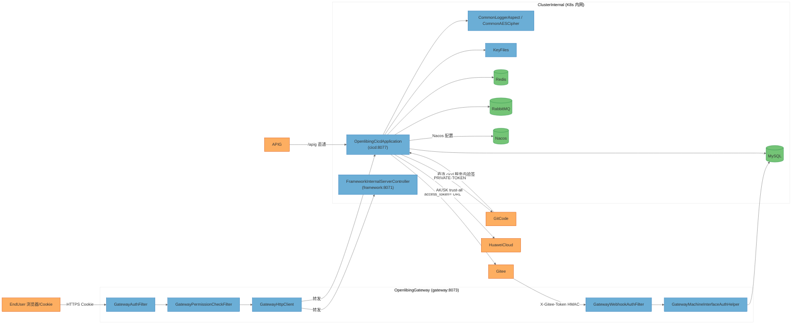
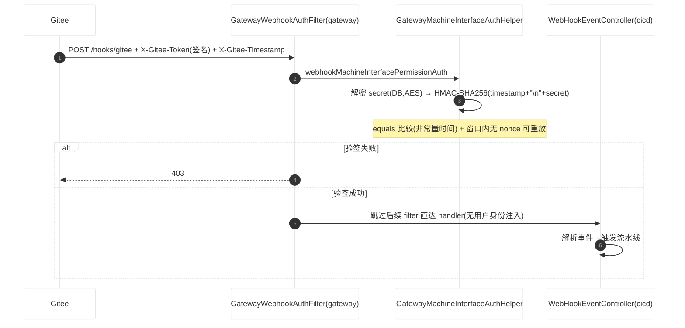
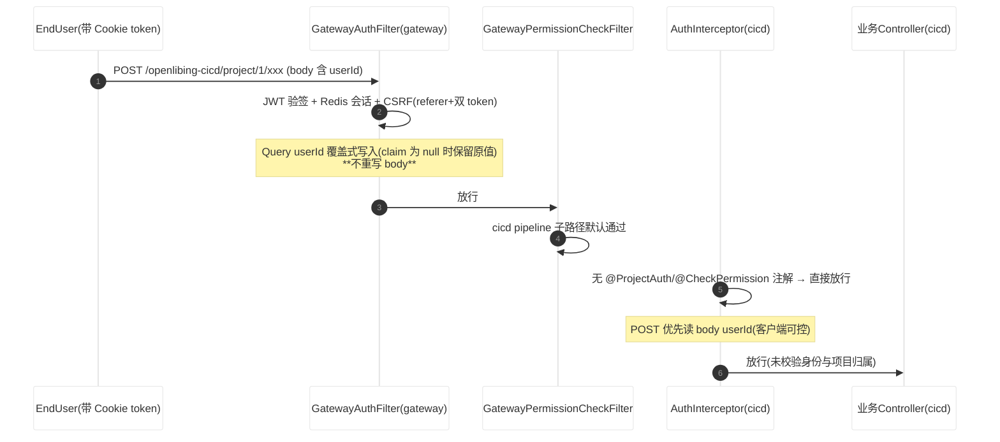
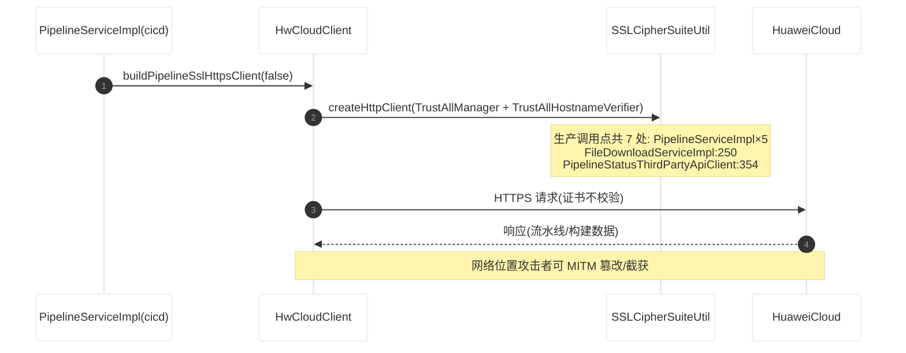
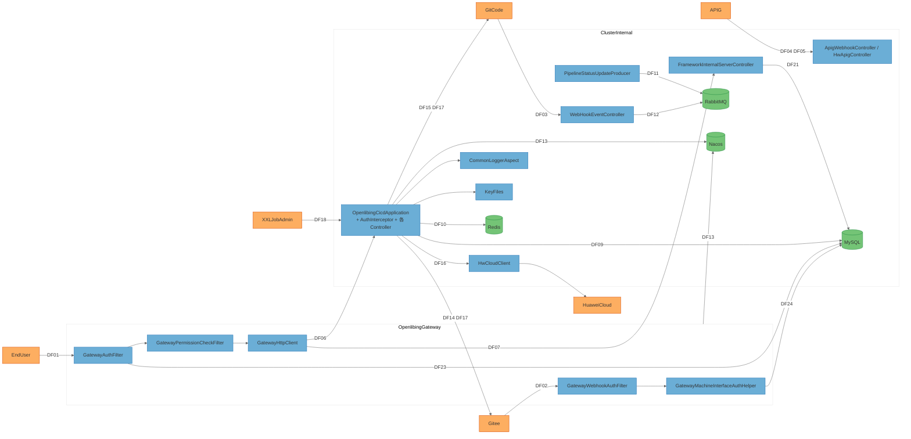
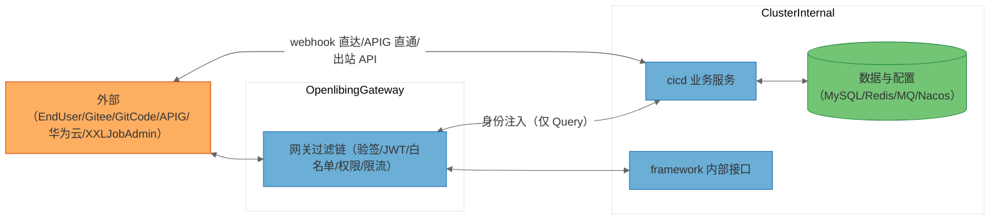

# openlibing-cicd 多仓综合安全威胁建模报告（STRIDE-A，gateway / framework / common 联动评估）

> 分析方法：STRIDE-A（STRIDE + Abuse）威胁建模，结合零信任原则与纵深防御分析
> 分析对象：openlibing-cicd（主仓）× openlibing-gateway × openlibing-framework × openlibing-common（联动评估）
> 本报告为**全新多仓综合分析**，不复用既有单仓报告结论；与单仓报告的差异见第十二章。

---

## 一、执行摘要

openlibing-cicd 是 OpenLibing CI/CD 平台的核心后端服务：它编排构建/流水线执行（委托华为云 CodeArts Pipeline/Build 与 SWR），消费 GitCode/Gitee 的代码托管 Webhook 以触发流水线与 PR 门禁，将构建状态/标签回写代码平台，并向平台前端暴露项目维度的业务 API（流水线、构建、PR、镜像、日志、看板）。与单仓分析不同，本次将 cicd 的每一条风险面都放回真实运行链路中核对——即统一入口网关 openlibing-gateway（8073）的四层过滤器、平台基础框架 openlibing-framework、以及三仓共同依赖的加解密/审计公共库 openlibing-common，评估"网关/framework 是否真正兜住了 cicd 的风险"。

本次分析覆盖 **34 个组件**（含 15 个 cicd 服务组件、5 个 gateway 组件、4 个 framework/common 组件、5 个外部服务、4 个外部数据存储、1 个外部交互者），共识别 **35 条具体威胁**，并归纳为 **22 条风险发现（Finding）**（Tier 1 = 8、Tier 2 = 9、Tier 3 = 5）。

**关键结论（按风险优先级）**：

1. **`/project/**` 权限校验真空（P0）**：cicd 应用层拦截器仅对带 `@ProjectAuth`/`@CheckPermission` 注解的方法校验权限，而全仓仅 PipelineControllerV2 使用注解，其余接口直接放行；POST 请求优先从**客户端可控的 body** 读取 userId，而网关只覆盖式注入 Query 参数、不重写 body，且网关 PermissionCheckFilter 对 cicd pipeline 子路径"默认通过"——**两层防护互相推责形成真空**（FIND-01，CVSS 8.5）。
2. **平台级出站 TLS 证书校验被禁用（P0）**：cicd 生产代码 7 处调用 trust-all HTTP 客户端（不校验证书链与主机名）访问华为云；同时 gateway 全局配置 `use-insecure-trust-manager: true` 对全部下游出站禁用校验——**这不是 cicd 仓的孤立缺陷，而是三仓均沾的平台级缺陷**（FIND-09、FIND-10）。
3. **Gitee access_token 以 URL 明文拼接（28 处）**：token 随 URL 进入日志、Referer、代理与错误日志（限流报错时打印完整 URL），并明文存 DB、明文跨 RabbitMQ 传输（FIND-02、FIND-06、FIND-13）。
4. **验签实现瑕疵跨仓一致**：网关与 cicd 的 webhook/机机验签均使用 `String.equals` 非常量时间比较、窗口内无 nonce 可重放，cicd 服务内 gitee 自验签还**缺少 timestamp 时效窗口**；common 仓未提供任何常量时间比较工具——全平台无一处恒定时间比较（FIND-03）。
5. **网关侧新增攻击面（单仓视角不可见）**：白名单用 `path.contains()` 子串匹配（误配短路径即整段放行）、JWT claim 为 null 时保留攻击者自报的 userId、webhook 限流键为 URL 无源 IP/账号维度（FIND-05、FIND-08）。
6. **framework / common 联动仓缺陷**：framework `/internal-server/*` 全量无鉴权（get-user 用户查询"userId 为空直接放行"）；common 审计日志入参全量序列化无脱敏、审计身份取 Cookie JWT decode 不验签（FIND-11、FIND-15）。
7. **跨仓验证为已缓解的项**（单仓分析易高估）：Gitee webhook 由网关 HMAC 验签、GitCode/GitHub webhook 由 cicd 服务内验签（分层正确）、CSRF 由网关 referer+双 token+Redis 三重校验、AES-GCM 加密算法实现规范（common 核实为 GCM+随机 IV+PBKDF2 三分片派生）。

> **Note on threat counts:** 本报告的威胁计数以第五章各组件明细行 `T<组件序号>.<序号>` 为准，不含"类别不适用（N/A）"的说明行。总计 **35** 条：**Tier 1 = 13**、**Tier 2 = 17**、**Tier 3 = 5**。按 STRIDE-A 类别：**S=8、T=4、R=1、I=12、D=3、E=6、A=1**。与单仓报告 139 条的差异源于同源归并与跨仓验证（详见第十二章）。

**风险分级总览**：

| 可利用性分级                  | 前提条件                               | 威胁数 | 占比  |
| ----------------------------- | -------------------------------------- | ------ | ----- |
| Tier 1 — 直接暴露（无前提）   | `None` 或普通认证用户                  | 13     | 37.1% |
| Tier 2 — 条件风险（单一前提） | 内网位置 / 密钥截获 / 单一信任前提失效 | 17     | 48.6% |
| Tier 3 — 纵深防御（高前提）   | 主机/镜像访问、管理员凭证、多重前提    | 5      | 14.3% |

---

## 二、系统架构概览

### 2.1 系统用途

openlibing-cicd 承载平台 CI/CD 全流程业务（端口 8077，Spring Boot 3.4.4 / Java 21），自身不直接暴露公网：用户流量经 openlibing-gateway（8073，Spring Cloud Gateway 4.3.3）统一转发，webhook 事件一部分经网关验签、一部分经华为云 APIG"无认证直通"后由 cicd 服务内自验签。流水线/构建执行委托华为云 CodeArts，代码平台为 GitCode/Gitee。平台公共能力分布：加解密与审计在 openlibing-common（BOM 1.0.21.0，三仓共同依赖），用户/项目/度量服务在 openlibing-framework（8071）。多仓评估的核心问题：**cicd 自身的风险面，在网关与公共库的协同防护下，哪些被真实兜住、哪些仍裸露**。

### 2.2 关键组件清单

| 序号 | 组件                              | 所属仓       | 信任边界          | 职责（锚点代码）                                                              |
| ---- | --------------------------------- | ------------ | ----------------- | ----------------------------------------------------------------------------- |
| 01   | OpenlibingCicdApplication         | cicd         | ClusterInternal   | `/project/**` 业务 Controller 群、构建/PR/镜像/导出（`business/controller/`） |
| 02   | AuthInterceptor                   | cicd         | ClusterInternal   | `/project/**` 应用层拦截器（`common/auth/AuthInterceptor.java`）              |
| 03   | WebHookEventController            | cicd         | ClusterInternal   | `/webhookEvent/hooks/*` webhook 入口（GitCode 服务内验签）                    |
| 04   | ApigWebhookController             | cicd         | ClusterInternal   | `/apig/webhook/**` APIG 直通入口（服务内自验签）                              |
| 05   | HwApigController                  | cicd         | ClusterInternal   | `/apig/v1/**` 机机接口（信任 APIG 鉴权）                                      |
| 06   | InternalPipelineController        | cicd         | ClusterInternal   | `/internal/prStartPipeline` 服务间接口                                        |
| 07   | PrMachineInterfaceController      | cicd         | ClusterInternal   | `/pr/machine-interface/**` 机机接口                                           |
| 08   | HwCloudClient                     | cicd         | ClusterInternal   | 华为云出站客户端（含 SSLCipherSuiteUtil trust-all 工厂）                      |
| 09   | PipelineStatusThirdPartyApiClient | cicd         | ClusterInternal   | 三方 API 限流处理与状态回传                                                   |
| 10   | GiteeApiClient                    | cicd         | ClusterInternal   | Gitee API 调用（PrServiceImpl 等 8 个类）                                     |
| 11   | PipelineStatusUpdateProducer      | cicd         | ClusterInternal   | 状态更新消息组装与 MQ 发布（含 token）                                        |
| 12   | XxlJobHandler                     | cicd         | ClusterInternal   | xxl-job 任务回调                                                              |
| 13   | SensitiveDtoGroup                 | cicd         | ClusterInternal   | 含敏感字段的 `@Data` DTO 群                                                   |
| 14   | EmailSender                       | cicd         | ClusterInternal   | 邮件通知（含频控）                                                            |
| 15   | RequestBodyFilter                 | cicd         | ClusterInternal   | `/project/*` 请求体缓存过滤器                                                 |
| 16   | MySQL                             | 外部         | ClusterInternal   | 业务/权限/凭证数据库（`common/config/DataSourceConfig.java`）                 |
| 17   | Redis                             | 外部         | ClusterInternal   | 缓存/分布式锁（`common/config/RedisConfig.java`）                             |
| 18   | RabbitMQ                          | 外部         | ClusterInternal   | webhook/状态消息（`service/impl/` 各 Producer/Listener）                      |
| 19   | Nacos                             | 外部         | ClusterInternal   | 配置中心+注册中心（application-*.yaml 导入）                                  |
| 20   | GatewayWebhookAuthFilter          | gateway      | OpenlibingGateway | webhook 验签与限流过滤器（order=0）                                           |
| 21   | GatewayAuthFilter                 | gateway      | OpenlibingGateway | 用户 JWT 鉴权/白名单/Query 身份注入（order=2）                                |
| 22   | GatewayPermissionCheckFilter      | gateway      | OpenlibingGateway | 项目权限校验过滤器（order=3）                                                 |
| 23   | GatewayMachineInterfaceAuthHelper | gateway      | OpenlibingGateway | 机机验签/失败锁定/IP 白名单（`common/utils/`）                                |
| 24   | GatewayHttpClient                 | gateway      | OpenlibingGateway | 网关出站 HttpClient（application.yaml ssl 配置）                              |
| 25   | FrameworkInternalServerController | framework    | ClusterInternal   | `/internal-server/**` 内部接口（含 get-user）                                 |
| 26   | CommonLoggerAspect                | common       | ClusterInternal   | @LogApi 审计切面与日志入湖                                                    |
| 27   | CommonAESCipher                   | common       | ClusterInternal   | AES-GCM 加解密/三分片密钥派生                                                 |
| 28   | KeyFiles                          | cicd/gateway | ClusterInternal   | 密钥分片文件（tcpFile/tcsFile/tcwFile.ks，构建期注入镜像）                    |
| 29   | APIG                              | 外部         | External          | 华为云 API 网关（webhook 直通上游）                                           |
| 30   | Gitee                             | 外部         | External          | 代码托管平台（webhook 源、API 目标）                                          |
| 31   | GitCode                           | 外部         | External          | 代码托管平台（webhook 源、API 目标）                                          |
| 32   | HuaweiCloud                       | 外部         | External          | CodeArts Pipeline/Build/SWR/OBS                                               |
| 33   | XXLJobAdmin                       | 外部         | External          | 调度中心                                                                      |
| 34   | EndUser                           | 外部         | External          | 终端用户（浏览器，Cookie 会话）——威胁来源，无 STRIDE 章节                     |

### 2.3 组件关系图

### 2.4 核心业务场景

**场景一：Gitee webhook 事件触发流水线（经网关验签）**

**场景二：用户 API 请求的身份注入与权限校验（双仓链路）**

**场景三：流水线状态回传华为云（trust-all 出站）**

### 2.5 技术栈

| 层          | cicd                                                                             | gateway                                                    | framework                        | common                   |
| ----------- | -------------------------------------------------------------------------------- | ---------------------------------------------------------- | -------------------------------- | ------------------------ |
| 语言/运行时 | Java 21                                                                          | Java 21                                                    | Java 21                          | Java 21                  |
| 框架        | Spring Boot 3.4.4 / Spring 6.2.11                                                | Spring Cloud Gateway 4.3.3                                 | Spring Boot（Web MVC）           | 公共库（BOM 1.0.21.0）   |
| 序列化      | fastjson2（BOM 传递）                                                            | gson 2.11.0                                                | fastjson2                        | fastjson2                |
| HTTP 客户端 | Apache HttpClient + okhttp 4.12.0                                                | Reactor Netty（trust-all 配置）                            | —                                | —                        |
| 数据        | MySQL + Liquibase + pagehelper；Redisson 3.25.0；RabbitMQ；xxl-job 3.2.0         | MySQL + Liquibase；Redis；AMQP                             | MySQL + Liquibase；multipart 5GB | —                        |
| 加密        | common AES-GCM（SecurityUtil/part1）                                             | 同左 + JWT HMAC256                                         | 同左                             | AESUtil/AESCipher/PBKDF2 |
| 其他        | jsoup 1.17.2、easyexcel 3.1.1、华为 SDK APIG 3.2.4、bgmprovider 1.0.6、RASP 探针 | spring-security-crypto 6.4.9、bcprov 1.85.2、okhttp 4.11.0 | MyBatis-Plus                     | java-jwt（HMAC256）      |

### 2.6 部署模型与组件暴露面

**部署分类**：`INTERNET_FACING_PLATFORM`（多服务 K8s 部署，经网关/APIG 对外）。网关四层过滤链顺序：WebhookAuthFilter(0) → PrivacyProfileFilter(1) → AuthFilter(2) → PermissionCheckFilter(3)。cicd 注册于 Nacos（非 eureka），以非 root 用户 openlibing 运行、umask 0077、含 RASP 探针。

| 组件                                            | 监听               | 认证屏障                                           | 外部可达性            | 最低前提           | 推导层级 |
| ----------------------------------------------- | ------------------ | -------------------------------------------------- | --------------------- | ------------------ | -------- |
| openlibing-gateway                              | 8073               | JWT/DB 白名单/机机签名                             | 直接暴露（APIG 上游） | None               | T1       |
| cicd `/project/**`                              | 8077（仅网关转发） | 网关 AuthFilter + cicd AuthInterceptor（注解稀疏） | 经网关可达            | Authenticated User | T1       |
| cicd `/webhookEvent/hooks/gitee`                | 8077               | 网关 WebhookAuthFilter HMAC                        | 经网关可达            | None（需有效签名） | T1       |
| cicd `/apig/webhook`、`/apig/v1`                | 8077               | APIG 直通 + cicd 自验签 / 无                       | 经 APIG 可达          | None               | T1       |
| cicd `/internal/**`、`/pr/machine-interface/**` | 8077               | 无服务内鉴权                                       | 内网可达              | Internal Network   | T2       |
| framework `/internal-server/**`                 | 8071               | 无服务内鉴权                                       | 内网可达              | Internal Network   | T2       |
| MySQL / Redis / RabbitMQ / Nacos                | 集群内             | 各自凭证                                           | 内网可达              | Internal Network   | T2       |
| 镜像内 keys/ 密钥分片                           | 文件               | 容器文件系统                                       | 需镜像/主机访问       | Host/OS Access     | T3       |

> 该表为发现前提的下限基准：任何威胁/发现的前提不得低于其组件在此表中的下限。

### 2.7 安全基础设施清单

| 控制能力                                                                  | 实现位置                                               | 覆盖评价                                   |
| ------------------------------------------------------------------------- | ------------------------------------------------------ | ------------------------------------------ |
| Gitee webhook HMAC 验签                                                   | gateway WebhookAuthFilter → MachineInterfaceAuthHelper | 有效，实现有瑕疵（T23.1）                  |
| GitCode/GitHub webhook 验签                                               | cicd MachineInterfaceAuthUtil（服务内 HMAC-SHA256）    | 有效（T20.1 记录防线旁路残留）             |
| 用户 JWT 认证 + Redis 会话 + 滑动续期                                     | gateway AuthFilter / JwtHelper                         | 有效（httpOnly/secure Cookie）             |
| CSRF 校验（referer + 双 token + Redis 存在性）                            | gateway AuthFilter:797-842                             | 有效，覆盖经网关入口                       |
| XSS 清洗工具                                                              | framework DefenseXssUtil（Jsoup 白名单）               | 工具存在，cicd 未见调用                    |
| 限流（服务级漏桶 + webhook URL 令牌桶 + 邮件频控 + @MultiRateLimit 切面） | gateway / cicd EmailSender / framework                 | 部分有效，缺用户/IP 维度（T20.2、T01.2）   |
| AES-GCM 加密 + 三分片密钥派生                                             | common AESUtil/AESCipher（XOR+PBKDF2）                 | 算法实现良好                               |
| 操作审计（@LogApi 切面 + 入湖）                                           | common LoggerAspect → framework ManageLogHelper        | 覆盖广但无脱敏、身份不验签（T26.1、T26.2） |
| 容器加固（非 root、umask 0077、fastjson safeMode、RASP）                  | cicd Dockerfile/start.sh                               | 良好                                       |
| 机机接口 IP 白名单 + 失败锁定 + timestamp + sign                          | gateway MachineInterfaceAuthHelper:151-177             | 框架完整，空列表全放行待修                 |
| 匿名访问仅限全 public 仓库（含双级缓存）                                  | cicd AuthInterceptor:142-150,336-437                   | 设计如此（T02.2 为其固有暴露面）           |

### 2.8 仓库结构

| 仓库                 | 分支   | Commit                                     | 提交时间         | 分析方式                                                 |
| -------------------- | ------ | ------------------------------------------ | ---------------- | -------------------------------------------------------- |
| openlibing-cicd      | master | `1035e5016e3dd06edf590e59d56c9591e3f4b780` | 2026-10-09 16:40 | 临时 worktree 检出分析（未污染工作区分支，分析后已清理） |
| openlibing-gateway   | master | `9ec6c4e`                                  | 2026-09-24 15:48 | 工作区直接分析                                           |
| openlibing-framework | master | `0ead2f8c5`                                | 2026-09-24 11:29 | 工作区直接分析                                           |
| openlibing-common    | master | 工作区                                     | —                | 工作区直接分析（BOM 1.0.21.0）                           |

---

## 三、数据流图与信任边界

### 3.1 信任边界

| 边界              | 范围                 | 说明                                                                                            |
| ----------------- | -------------------- | ----------------------------------------------------------------------------------------------- |
| OpenlibingGateway | gateway 进程（8073） | 平台统一入口：JWT 会话、白名单、机机签名、Query 身份注入、webhook 验签与限流                    |
| ClusterInternal   | K8s 集群内网         | cicd(8077)、framework(8071)、MySQL、Redis、RabbitMQ、Nacos；服务端口内网可达且**无服务间 mTLS** |
| External          | 集群外               | EndUser、Gitee、GitCode、APIG、HuaweiCloud、XXLJobAdmin、SMTPServer                             |

### 3.2 数据流清单

| 编号 | 源                                | 目标                              | 协议        | 说明                                                                           |
| ---- | --------------------------------- | --------------------------------- | ----------- | ------------------------------------------------------------------------------ |
| DF01 | EndUser                           | GatewayAuthFilter                 | HTTPS       | 浏览器会话（Cookie `token` 认证）                                              |
| DF02 | Gitee                             | GatewayWebhookAuthFilter          | HTTPS       | webhook 推送，携带 X-Gitee-Token/X-Gitee-Timestamp（HMAC 验签）                |
| DF03 | GitCode                           | WebHookEventController            | HTTPS       | webhook 直达 cicd（跳过网关过滤器，服务内验签 X-GitCode-Signature-256）        |
| DF04 | APIG                              | ApigWebhookController             | HTTPS       | `/apig/webhook/**` APIG 无认证直通，服务内自验签                               |
| DF05 | APIG                              | HwApigController                  | HTTPS       | `/apig/v1/**` APIG 鉴权限流审计，服务内无兜底                                  |
| DF06 | GatewayAuthFilter                 | OpenlibingCicdApplication         | HTTPS（lb） | `/openlibing-cicd/**` 转发，Query 覆盖式注入 userId/userName 等（不重写 body） |
| DF07 | GatewayAuthFilter                 | FrameworkInternalServerController | HTTPS（lb） | `/openlibing-framework/**` 转发                                                |
| DF08 | AuthInterceptor                   | MySQL                             | SQL/JDBC    | userRoleMapper.hasPermission 权限查询                                          |
| DF09 | OpenlibingCicdApplication         | MySQL                             | SQL/JDBC    | 流水线、构建、PR、镜像 CRUD（含 hw_project_info AK/SK 密文）                   |
| DF10 | OpenlibingCicdApplication         | Redis                             | RESP        | 缓存/分布式锁（Redisson）                                                      |
| DF11 | PipelineStatusUpdateProducer      | RabbitMQ                          | AMQP        | 状态更新消息（**accessToken 明文字段**）                                       |
| DF12 | WebHookEventController            | RabbitMQ                          | AMQP        | 已验签 webhook 事件发布                                                        |
| DF13 | cicd / gateway / framework        | Nacos                             | HTTPS       | 配置导入（part1、jwt.secret、DB/Redis 密码）与注册                             |
| DF14 | GiteeApiClient                    | Gitee                             | HTTPS       | Gitee API，**`?access_token=` URL 拼接（28 处）**                              |
| DF15 | cicd 各客户端                     | GitCode                           | HTTPS       | GitCode API，PRIVATE-TOKEN header（XxlJobHandler invitation_token 例外走 URL） |
| DF16 | HwCloudClient                     | HuaweiCloud                       | HTTPS       | CodeArts API，AK/SK 签名头（**trust-all 客户端 7 处**）                        |
| DF17 | PipelineStatusThirdPartyApiClient | GitCode/Gitee                     | HTTPS       | PR 标签/状态回写；限流报错打印完整 URL                                         |
| DF18 | XXLJobAdmin                       | XxlJobHandler                     | HTTP        | xxl-job accessToken 授权回调                                                   |
| DF19 | 内部服务                          | InternalPipelineController        | HTTPS       | `/internal/prStartPipeline` 服务间触发（无鉴权）                               |
| DF20 | 内部服务                          | PrMachineInterfaceController      | HTTPS       | `/pr/machine-interface/**`（无鉴权）                                           |
| DF21 | 内部服务                          | FrameworkInternalServerController | HTTPS       | `/internal-server/**`（含 get-user，无鉴权）                                   |
| DF22 | EmailSender                       | SMTPServer                        | SMTP        | 解密后账号/口令提交邮件（含频控）                                              |
| DF23 | GatewayAuthFilter                 | MySQL                             | SQL/JDBC    | `whitelist_interface_info` 白名单查询（contains 匹配）                         |
| DF24 | GatewayMachineInterfaceAuthHelper | MySQL                             | SQL/JDBC    | `machine_interface_account` secretKey（AES 密文）查询                          |

### 3.3 详细数据流图（DFD）

### 3.4 摘要数据流图

### 3.5 摘要视图与详细视图映射

| 摘要节点           | 详细视图节点                                                                                                                                                                          |
| ------------------ | ------------------------------------------------------------------------------------------------------------------------------------------------------------------------------------- |
| 外部（Ext）        | EndUser、Gitee、GitCode、APIG、HuaweiCloud、XXLJobAdmin                                                                                                                               |
| 网关过滤链         | GatewayWebhookAuthFilter、GatewayMachineInterfaceAuthHelper、GatewayAuthFilter、GatewayPermissionCheckFilter、GatewayHttpClient                                                       |
| cicd 业务服务      | OpenlibingCicdApplication、AuthInterceptor、WebHookEventController、ApigWebhookController/HwApigController、HwCloudClient、PipelineStatusUpdateProducer、CommonLoggerAspect、KeyFiles |
| framework 内部接口 | FrameworkInternalServerController                                                                                                                                                     |
| 数据与配置         | MySQL、Redis、RabbitMQ、Nacos                                                                                                                                                         |

---

## 四、STRIDE-A 威胁分析

### 4.1 方法论与可利用性分级

采用 STRIDE-A（S 仿冒 / T 篡改 / R 抵赖 / I 信息泄露 / D 拒绝服务 / E 权限提升 / A 滥用）。可利用性分级以**前提条件**为准：

| 分级   | 前提条件                                            |
| ------ | --------------------------------------------------- |
| Tier 1 | 无前提（`None`）或仅需普通认证用户                  |
| Tier 2 | 单一前提：内网位置、密钥/签名截获、单一信任前提失效 |
| Tier 3 | 多重前提：主机/镜像访问、管理员凭证、组件被攻陷     |

**前提底线约束**：每条威胁的前提不得低于其组件在 2.6 组件暴露面表中的最低前提。**多仓特有规则**：cicd 侧威胁的前提判定必须先核对 gateway 层是否已建立相应屏障（例如"Gitee webhook 无鉴权"在单仓视角是 T1，但网关 HMAC 验签真实存在时，其利用前提升为"截获有效签名"即 T2）。

### 4.2 组件威胁汇总表

| 组件                              | S     | T     | R     | I      | D     | E     | A     | 合计   | T1     | T2     | T3    | 风险 |
| --------------------------------- | ----- | ----- | ----- | ------ | ----- | ----- | ----- | ------ | ------ | ------ | ----- | ---- |
| OpenlibingCicdApplication         | 0     | 2     | 0     | 0      | 1     | 1     | 1     | 5      | 1      | 1      | 3     | 高   |
| AuthInterceptor                   | 1     | 0     | 0     | 1      | 0     | 1     | 0     | 3      | 3      | 0      | 0     | 严重 |
| WebHookEventController            | 0     | 1     | 0     | 0      | 0     | 0     | 0     | 1      | 0      | 1      | 0     | 中   |
| ApigWebhookController             | 2     | 0     | 0     | 0      | 0     | 0     | 0     | 2      | 2      | 0      | 0     | 高   |
| HwApigController                  | 1     | 0     | 0     | 0      | 0     | 0     | 0     | 1      | 0      | 1      | 0     | 中   |
| InternalPipelineController        | 0     | 0     | 0     | 0      | 0     | 1     | 0     | 1      | 0      | 1      | 0     | 高   |
| PrMachineInterfaceController      | 0     | 0     | 0     | 0      | 0     | 1     | 0     | 1      | 0      | 1      | 0     | 高   |
| HwCloudClient                     | 0     | 0     | 0     | 1      | 0     | 0     | 0     | 1      | 0      | 1      | 0     | 严重 |
| PipelineStatusThirdPartyApiClient | 0     | 0     | 0     | 1      | 0     | 0     | 0     | 1      | 1      | 0      | 0     | 中   |
| GiteeApiClient                    | 0     | 0     | 0     | 1      | 0     | 0     | 0     | 1      | 1      | 0      | 0     | 高   |
| PipelineStatusUpdateProducer      | 0     | 0     | 0     | 2      | 0     | 0     | 0     | 2      | 0      | 1      | 1     | 中   |
| XxlJobHandler                     | 0     | 0     | 0     | 1      | 0     | 0     | 0     | 1      | 0      | 1      | 0     | 低   |
| SensitiveDtoGroup                 | 0     | 0     | 0     | 1      | 0     | 0     | 0     | 1      | 0      | 1      | 0     | 中   |
| EmailSender                       | 0     | 0     | 0     | 0      | 0     | 0     | 0     | 0      | 0      | 0      | 0     | 低   |
| RequestBodyFilter                 | 0     | 0     | 0     | 0      | 1     | 0     | 0     | 1      | 1      | 0      | 0     | 高   |
| MySQL                             | 0     | 0     | 0     | 0      | 0     | 0     | 0     | 0      | 0      | 0      | 0     | —    |
| Redis                             | 0     | 0     | 0     | 0      | 0     | 0     | 0     | 0      | 0      | 0      | 0     | —    |
| RabbitMQ                          | 0     | 0     | 0     | 0      | 0     | 0     | 0     | 0      | 0      | 0      | 0     | —    |
| Nacos                             | 0     | 1     | 0     | 0      | 0     | 0     | 0     | 1      | 0      | 1      | 0     | 中   |
| GatewayWebhookAuthFilter          | 1     | 0     | 0     | 0      | 1     | 0     | 0     | 2      | 1      | 1      | 0     | 高   |
| GatewayAuthFilter                 | 2     | 0     | 0     | 0      | 0     | 0     | 0     | 2      | 2      | 0      | 0     | 高   |
| GatewayPermissionCheckFilter      | 0     | 0     | 0     | 0      | 0     | 1     | 0     | 1      | 1      | 0      | 0     | 高   |
| GatewayMachineInterfaceAuthHelper | 1     | 0     | 0     | 0      | 0     | 0     | 0     | 1      | 0      | 1      | 0     | 中   |
| GatewayHttpClient                 | 0     | 0     | 0     | 1      | 0     | 0     | 0     | 1      | 0      | 1      | 0     | 严重 |
| FrameworkInternalServerController | 0     | 0     | 0     | 1      | 0     | 1     | 0     | 2      | 0      | 2      | 0     | 高   |
| CommonLoggerAspect                | 0     | 0     | 1     | 1      | 0     | 0     | 0     | 2      | 0      | 2      | 0     | 中   |
| CommonAESCipher                   | 0     | 0     | 0     | 0      | 0     | 0     | 0     | 0      | 0      | 0      | 0     | —    |
| KeyFiles                          | 0     | 0     | 0     | 1      | 0     | 0     | 0     | 1      | 0      | 0      | 1     | 中   |
| APIG                              | 0     | 0     | 0     | 0      | 0     | 0     | 0     | 0      | 0      | 0      | 0     | —    |
| Gitee                             | 0     | 0     | 0     | 0      | 0     | 0     | 0     | 0      | 0      | 0      | 0     | —    |
| GitCode                           | 0     | 0     | 0     | 0      | 0     | 0     | 0     | 0      | 0      | 0      | 0     | —    |
| HuaweiCloud                       | 0     | 0     | 0     | 0      | 0     | 0     | 0     | 0      | 0      | 0      | 0     | —    |
| XXLJobAdmin                       | 0     | 0     | 0     | 0      | 0     | 0     | 0     | 0      | 0      | 0      | 0     | —    |
| **合计**                          | **8** | **4** | **1** | **12** | **3** | **6** | **1** | **35** | **13** | **17** | **5** |      |

> 表中的 S/T/R/I/D/E/A 为各组件**具体威胁**计数（不含 N/A 说明行）；底部 `合计` 为列合计。外部数据存储与平台组件的威胁已归并至调用方组件（如 token 明文存 DB 记于 PipelineStatusUpdateProducer），故其行计数为 0。

---

## 五、STRIDE-A 威胁明细（按组件）

> 说明：每个组件章节列出信任边界、职责、涉及数据流，并按 Tier 1/2/3 分层给出威胁表；无威胁的层级显式标注；不适用的类别以说明行带过。`状态` 取值：`Open`（未处置）、`Mitigated`（已被现有控制缓解）、`Platform`（需平台侧处置）。

### 5.1 OpenlibingCicdApplication

**信任边界**：ClusterInternal ｜ **职责**：`/project/**` 约 20 个业务 Controller（流水线、构建、PR、镜像、导出） ｜ **涉及数据流**：DF01、DF06、DF09、DF10、DF11、DF14、DF15、DF16

#### Tier 1 — 直接暴露（无前提）

| 编号  | 类别              | 威胁                                                                                                                                           | 前提               | 涉及流 | 缓解方向                           | 状态 |
| ----- | ----------------- | ---------------------------------------------------------------------------------------------------------------------------------------------- | ------------------ | ------ | ---------------------------------- | ---- |
| T01.2 | Denial of Service | 触发路径无按源（IP/用户）限流：网关仅服务级漏桶（默认 100/100）与 webhook URL 令牌桶，cicd 应用层仅邮件频控，认证用户可高频驱动流水线/导出接口 | Authenticated User | DF06   | 网关与 cicd 增加按用户/IP 维度限流 | Open |

#### Tier 2 — 条件风险

| 编号  | 类别      | 威胁                                                                                                                 | 前提               | 涉及流 | 缓解方向               | 状态 |
| ----- | --------- | -------------------------------------------------------------------------------------------------------------------- | ------------------ | ------ | ---------------------- | ---- |
| T01.3 | Tampering | 用户可控字段未做 CRLF 清洗即写入日志行，可伪造日志条目（framework LogSanitizer 仅限流切面使用，cicd 无日志注入防护） | Authenticated User | DF06   | 记日志前统一清洗 CR/LF | Open |

#### Tier 3 — 纵深防御

| 编号  | 类别                   | 威胁                                                                                                                                             | 前提               | 涉及流 | 缓解方向                     | 状态 |
| ----- | ---------------------- | ------------------------------------------------------------------------------------------------------------------------------------------------ | ------------------ | ------ | ---------------------------- | ---- |
| T01.1 | Abuse                  | 流水线/构建无项目级配额与并发上限，项目成员可滥用华为云构建资源（Abuse）                                                                         | Privileged User    | DF16   | 项目级配额与告警             | Open |
| T01.4 | Tampering              | 评论图片上传的原始文件名直接拼入 `Files.createTempFile` 前缀（`PrCommentServiceImpl:348-364`，jpg/png 白名单在前）                               | Authenticated User | DF06   | 文件名清洗或 UUID 化         | Open |
| T01.5 | Elevation of Privilege | 依赖版本治理：fastjson2 由 BOM 传递未显式固定（有 safeMode 缓解）、easyexcel 传递 poi 未锁定、gateway okhttp 4.11.0/netty 无版本重引，供应链漂移 | 依赖漏洞披露       | —      | 显式锁定版本 + SBOM 扫描联动 | Open |

### 5.2 AuthInterceptor

**信任边界**：ClusterInternal ｜ **职责**：`/project/**` 应用层拦截器，提取 projectId/pipelineId/userId 并按注解校验权限 ｜ **涉及数据流**：DF06、DF08

#### Tier 1 — 直接暴露（无前提）

| 编号  | 类别                   | 威胁                                                                                                                                                                                  | 前提               | 涉及流 | 缓解方向                          | 状态 |
| ----- | ---------------------- | ------------------------------------------------------------------------------------------------------------------------------------------------------------------------------------- | ------------------ | ------ | --------------------------------- | ---- |
| T02.1 | Spoofing               | POST/PUT 请求优先从**客户端可控的请求体**解析 userId（`AuthInterceptor:296-303`），网关不重写 body，认证用户可冒充任意 userId                                                         | Authenticated User | DF06   | 身份仅取网关注入参数，禁止读 body | Open |
| T02.2 | Information Disclosure | 关联仓库全部 public 的流水线允许匿名访问（`AuthInterceptor:142-150,336-437`，结果双级缓存），构成信息暴露面                                                                           | None               | DF06   | 匿名可见字段白名单化              | Open |
| T02.3 | Elevation of Privilege | 拦截器仅对 `@ProjectAuth`/`@CheckPermission` 注解方法校验（`AuthInterceptor:100-119`），全仓注解仅 PipelineControllerV2 使用——**其余 `/project/**` 接口直接放行，应用层权限校验真空** | Authenticated User | DF06   | 未注解接口默认执行项目成员校验    | Open |

#### Tier 2 / Tier 3

_未识别 Tier 2/3 威胁。_

### 5.3 WebHookEventController

**信任边界**：ClusterInternal ｜ **职责**：`/webhookEvent/hooks/gitcode/{pipelineId}`（服务内 HMAC-SHA256 验签）与 `/hooks/gitee/{pipelineId}`（鉴权在网关层） ｜ **涉及数据流**：DF02、DF03、DF12

#### Tier 1

_未识别 Tier 1 威胁。_ GitCode 路径有服务内验签、Gitee 路径有网关验签兜底。

#### Tier 2 — 条件风险

| 编号  | 类别      | 威胁                                                                                                                     | 前提                | 涉及流     | 缓解方向                      | 状态 |
| ----- | --------- | ------------------------------------------------------------------------------------------------------------------------ | ------------------- | ---------- | ----------------------------- | ---- |
| T03.1 | Tampering | webhook secret（Nacos 或机机账号表密文）泄露后，攻击者可伪造 push/merge 事件触发流水线；事件与流水线归属一致性未二次校验 | Webhook Secret 泄露 | DF03、DF12 | 事件归属一致性校验 + 密钥轮换 | Open |

#### Tier 3

_未识别 Tier 3 威胁。_

### 5.4 ApigWebhookController

**信任边界**：ClusterInternal ｜ **职责**：`/apig/webhook/**` APIG 无认证直通，gitee/gitcode 由服务内 MachineInterfaceAuthUtil 自验签 ｜ **涉及数据流**：DF04

#### Tier 1 — 直接暴露（无前提）

| 编号  | 类别     | 威胁                                                                                                                               | 前提                   | 涉及流 | 缓解方向                              | 状态 |
| ----- | -------- | ---------------------------------------------------------------------------------------------------------------------------------- | ---------------------- | ------ | ------------------------------------- | ---- |
| T04.1 | Spoofing | 服务内 gitee/gitcode 验签使用 `String.equals` 非常量时间比较（`MachineInterfaceAuthUtil:114`），形成计时侧信道                     | None（需计时测量条件） | DF04   | 常量时间比较（MessageDigest.isEqual） | Open |
| T04.2 | Spoofing | 服务内 gitee 验签不校验 timestamp 时效（`:109-113` 仅将 timestamp 计入签名，无窗口），与网关版实现不一致——截获一次签名可无限期重放 | 签名截获               | DF04   | 补 timestamp 时效窗口 + nonce 幂等    | Open |

#### Tier 2 / Tier 3

_未识别 Tier 2/3 威胁。_

### 5.5 HwApigController

**信任边界**：ClusterInternal ｜ **职责**：`/apig/v1/**` 三个机机接口（recordPipelineInfo 等），注释明示依赖华为 APIG 统一鉴权限流审计 ｜ **涉及数据流**：DF05

#### Tier 2 — 条件风险

| 编号  | 类别     | 威胁                                                                                             | 前提                 | 涉及流 | 缓解方向                                  | 状态     |
| ----- | -------- | ------------------------------------------------------------------------------------------------ | -------------------- | ------ | ----------------------------------------- | -------- |
| T05.1 | Spoofing | `/apig/v1` 服务内零鉴权，完全单点信任 APIG 配置（仓外系统），无纵深防御；APIG 配置失效即直接暴露 | APIG 配置失效/被绕过 | DF05   | 服务内补自验签（复用 /apig/webhook 模式） | Platform |

#### Tier 1 / Tier 3

_未识别 Tier 1/3 威胁。_

### 5.6 InternalPipelineController

**信任边界**：ClusterInternal ｜ **职责**：`/internal/prStartPipeline` 微服务间流水线触发 ｜ **涉及数据流**：DF19

#### Tier 2 — 条件风险

| 编号  | 类别                   | 威胁                                                 | 前提             | 涉及流 | 缓解方向        | 状态 |
| ----- | ---------------------- | ---------------------------------------------------- | ---------------- | ------ | --------------- | ---- |
| T06.1 | Elevation of Privilege | 接口无任何服务内鉴权，内网任意调用方可触发流水线启动 | Internal Network | DF19   | 机机签名或 mTLS | Open |

### 5.7 PrMachineInterfaceController

**信任边界**：ClusterInternal ｜ **职责**：`/pr/machine-interface/**` 三个机机接口（PR 构建内容、跨区 PR 写入） ｜ **涉及数据流**：DF20、DF09

#### Tier 2 — 条件风险

| 编号  | 类别                   | 威胁                                           | 前提             | 涉及流 | 缓解方向                | 状态 |
| ----- | ---------------------- | ---------------------------------------------- | ---------------- | ------ | ----------------------- | ---- |
| T07.1 | Elevation of Privilege | 接口无服务内鉴权，内网调用方可伪造 PR 门禁数据 | Internal Network | DF20   | 机机签名 + 数据归属校验 | Open |

### 5.8 HwCloudClient

**信任边界**：ClusterInternal ｜ **职责**：华为云出站客户端（CodeArts Pipeline/Build/SWR），含 SSLCipherSuiteUtil 客户端工厂 ｜ **涉及数据流**：DF16

#### Tier 2 — 条件风险

| 编号  | 类别                   | 威胁                                                                                                                                                                                                                                                                                                            | 前提                          | 涉及流 | 缓解方向                                                    | 状态 |
| ----- | ---------------------- | --------------------------------------------------------------------------------------------------------------------------------------------------------------------------------------------------------------------------------------------------------------------------------------------------------------- | ----------------------------- | ------ | ----------------------------------------------------------- | ---- |
| T08.1 | Information Disclosure | 生产链路 7 处调用 trust-all 客户端（`buildPipelineSslHttpsClient(false)`：PipelineServiceImpl:590/1042/2258/4460/4652、FileDownloadServiceImpl:250、PipelineStatusThirdPartyApiClient:354），TrustAllManager+TrustAllHostnameVerifier 不校验证书链与主机名，网络位置攻击者可 MITM 篡改流水线/构建/镜像/日志数据 | Internal Network（MITM 位置） | DF16   | 全部改 `verify=true`（`createHttpClientWithVerify` 已存在） | Open |

### 5.9 PipelineStatusThirdPartyApiClient

**信任边界**：ClusterInternal ｜ **职责**：PR 标签/状态回写三方 API，含限流异常处理 ｜ **涉及数据流**：DF14、DF15、DF17

#### Tier 1 — 直接暴露（无前提）

| 编号  | 类别                   | 威胁                                                                                                                                              | 前提               | 涉及流     | 缓解方向                                   | 状态 |
| ----- | ---------------------- | ------------------------------------------------------------------------------------------------------------------------------------------------- | ------------------ | ---------- | ------------------------------------------ | ---- |
| T09.1 | Information Disclosure | 三方 API 限流报错时打印完整 `url={}`（`PipelineStatusThirdPartyApiClient:147,236,247,292`），而 Gitee URL 内嵌 access_token，token 随错误日志落盘 | Authenticated User | DF14、DF17 | 日志仅打印 path 或经 MessageMaskUtils 脱敏 | Open |

### 5.10 GiteeApiClient

**信任边界**：ClusterInternal ｜ **职责**：Gitee API 调用（PrServiceImpl、RepoServiceImpl、LabelServiceImpl、PrLabelServiceImpl、PrCommentServiceImpl、PipelineServiceImpl、WebhookRefreshService、WebhookMigrationHelper） ｜ **涉及数据流**：DF14

#### Tier 1 — 直接暴露（无前提）

| 编号  | 类别                   | 威胁                                                                                                                                                    | 前提               | 涉及流 | 缓解方向                             | 状态 |
| ----- | ---------------------- | ------------------------------------------------------------------------------------------------------------------------------------------------------- | ------------------ | ------ | ------------------------------------ | ---- |
| T10.1 | Information Disclosure | Gitee access_token 以 `?access_token=` URL 拼接共 **28 处**（PrServiceImpl 16 处等），token 随 URL 进入网关/代理访问日志、Referer、错误日志与浏览器历史 | Authenticated User | DF14   | 统一改 Authorization header 传 token | Open |

### 5.11 PipelineStatusUpdateProducer

**信任边界**：ClusterInternal ｜ **职责**：流水线状态更新消息组装与 RabbitMQ 发布（`PipelineStatusUpdateMessage` 含 accessToken 字段，取自 PipelineRunInfoEntity） ｜ **涉及数据流**：DF09、DF11

#### Tier 2 — 条件风险

| 编号  | 类别                   | 威胁                                                                         | 前提             | 涉及流 | 缓解方向                       | 状态 |
| ----- | ---------------------- | ---------------------------------------------------------------------------- | ---------------- | ------ | ------------------------------ | ---- |
| T11.2 | Information Disclosure | accessToken 明文序列化进 RabbitMQ 消息跨服务传输，消费方与消息日志均可能留存 | Internal Network | DF11   | 消息剔除 token，运行时按需解密 | Open |

#### Tier 3 — 纵深防御

| 编号  | 类别                   | 威胁                                                                                      | 前提                        | 涉及流 | 缓解方向                               | 状态 |
| ----- | ---------------------- | ----------------------------------------------------------------------------------------- | --------------------------- | ------ | -------------------------------------- | ---- |
| T11.1 | Information Disclosure | Gitee access_token 明文存 MySQL（PipelineRunInfoEntity.accessToken），DB 访问者可直接读取 | Internal Network（DB 访问） | DF09   | token 落库加密（SecurityUtil.encrypt） | Open |

### 5.12 XxlJobHandler

**信任边界**：ClusterInternal ｜ **职责**：xxl-job 任务回调（工作流覆盖率等） ｜ **涉及数据流**：DF15、DF18

#### Tier 2 — 条件风险

| 编号  | 类别                   | 威胁                                                                                  | 前提             | 涉及流 | 缓解方向       | 状态 |
| ----- | ---------------------- | ------------------------------------------------------------------------------------- | ---------------- | ------ | -------------- | ---- |
| T12.1 | Information Disclosure | GitCode invitation_token 走 URL query 传输（`XxlJobHandler:806-824`），可进入访问日志 | Internal Network | DF15   | 改 header 传递 | Open |

### 5.13 SensitiveDtoGroup

**信任边界**：ClusterInternal ｜ **职责**：含敏感字段的 Lombok `@Data` DTO（GiteePullRequestDTO、RepoInspectContext、GiteeNoteHooksDTO、PrSyncTriggerReqDTO、RepoFileRequest、PipelineStatusUpdateMessage） ｜ **涉及数据流**：DF06、DF11

#### Tier 2 — 条件风险

| 编号  | 类别                   | 威胁                                                                                                                      | 前提               | 涉及流 | 缓解方向                     | 状态 |
| ----- | ---------------------- | ------------------------------------------------------------------------------------------------------------------------- | ------------------ | ------ | ---------------------------- | ---- |
| T13.1 | Information Disclosure | 上述 DTO 的 toString 含 token/password 字段且未加 `@ToString.Exclude`，异常打印即泄露（对照组 CustomOrgEntry 已正确排除） | Authenticated User | DF06   | 敏感字段补 @ToString.Exclude | Open |

### 5.14 EmailSender

**信任边界**：ClusterInternal ｜ **职责**：通知邮件发送（Redis 频控 `EmailSender:45-81`） ｜ **涉及数据流**：DF22

_三个层级均未识别新增威胁。_ 已有频控缓解滥用面；邮件内容注入在单仓报告已覆盖，多仓视角无新增证据，不再重复立项。

### 5.15 RequestBodyFilter

**信任边界**：ClusterInternal ｜ **职责**：`/project/*` 请求体缓存过滤器（`readAllBytes` 全量进内存，支持多次读取，order=1） ｜ **涉及数据流**：DF06

#### Tier 1 — 直接暴露（无前提）

| 编号  | 类别              | 威胁                                                                                                                                 | 前提 | 涉及流 | 缓解方向                                        | 状态 |
| ----- | ----------------- | ------------------------------------------------------------------------------------------------------------------------------------ | ---- | ------ | ----------------------------------------------- | ---- |
| T15.1 | Denial of Service | JSON 请求体无大小上限（multipart 有 16MB），请求体被全量读入内存后才解析，超大 JSON 可耗尽堆/CPU；gateway 侧同样未配置请求体大小限制 | None | DF06   | body 大小上限（超限 413），网关同步 RequestSize | Open |

### 5.16 MySQL

**信任边界**：ClusterInternal ｜ **职责**：业务/权限/白名单/机机账号/凭证数据库 ｜ **涉及数据流**：DF08、DF09、DF23、DF24

_三个层级均未识别新增威胁（多仓归并口径）。_ token 明文存库已记于 T11.1；数据层篡改（流水线定义重定向）与单仓报告结论一致，属 DB 访问前提下的纵深项，未观察到多仓新证据，不重复立项。

### 5.17 Redis

**信任边界**：ClusterInternal ｜ **职责**：缓存/分布式锁/会话（网关会话 token 存在性校验依赖） ｜ **涉及数据流**：DF10

_三个层级均未识别新增威胁。_ 网关会话绑定 Redis 提升了伪造难度；锁操纵场景与单仓结论一致（DB 访问前提），无多仓新证据。

### 5.18 RabbitMQ

**信任边界**：ClusterInternal ｜ **职责**：webhook/流水线状态消息 ｜ **涉及数据流**：DF11、DF12

_三个层级均未识别新增威胁。_ 消息无发布者签名的问题由 T11.2（token 明文）与 T03.1（webhook 伪造链路）覆盖；消费侧监听器在单仓报告已覆盖，多仓无新证据。

### 5.19 Nacos

**信任边界**：ClusterInternal ｜ **职责**：配置中心+注册中心；part1、jwt.secret、webhook secret、DB/Redis/MQ 密码全经 Nacos 下发 ｜ **涉及数据流**：DF13

#### Tier 2 — 条件风险

| 编号  | 类别      | 威胁                                                                                                                                                         | 前提                                   | 涉及流 | 缓解方向                                      | 状态     |
| ----- | --------- | ------------------------------------------------------------------------------------------------------------------------------------------------------------ | -------------------------------------- | ------ | --------------------------------------------- | -------- |
| T19.1 | Tampering | Nacos 是全平台密钥分发的单点：三仓所有敏感配置（part1 派生密钥的种子、JWT secret、数据库凭证）均经其下发，Nacos 沦陷即三仓同时沦陷；仓库内无法核实其鉴权配置 | Admin Credentials / Nacos 无鉴权时内网 | DF13   | Nacos 开启鉴权 + 敏感配置 KMS 托管 + 变更审计 | Platform |

### 5.20 GatewayWebhookAuthFilter

**信任边界**：OpenlibingGateway ｜ **职责**：`/hooks/gitee`、`/hooks/gitcode`、`/hooks/github` webhook 验签与限流（order=0） ｜ **涉及数据流**：DF02

#### Tier 1 — 直接暴露（无前提）

| 编号  | 类别              | 威胁                                                                                                                     | 前提 | 涉及流 | 缓解方向                          | 状态 |
| ----- | ----------------- | ------------------------------------------------------------------------------------------------------------------------ | ---- | ------ | --------------------------------- | ---- |
| T20.2 | Denial of Service | webhook 限流键为 URL（固定 1000ms 恢复速率），无源 IP/账号维度；高并发伪造请求可占满单 URL 令牌桶造成正常事件被拒（DoS） | None | DF02   | 限流键增加源维度 + 验签前轻量过滤 | Open |

#### Tier 2 — 条件风险

| 编号  | 类别     | 威胁                                                                                                                                                                                        | 前提                             | 涉及流 | 缓解方向                                  | 状态                             |
| ----- | -------- | ------------------------------------------------------------------------------------------------------------------------------------------------------------------------------------------- | -------------------------------- | ------ | ----------------------------------------- | -------------------------------- |
| T20.1 | Spoofing | GitCode/GitHub webhook 跳过网关全部过滤器直达 cicd（`WebhookAuthFilter:96-105`，验签下沉服务），网关限流/白名单对该路径失效，鉴权与防护单点下沉（分层设计本身正确，由 cicd 服务内验签缓解） | Internal Network（直连 cicd 时） | DF03   | 网关补旁路限流；cicd 端口仅网关/APIG 可达 | Mitigated（残留见 T20.2、T01.2） |

### 5.21 GatewayAuthFilter

**信任边界**：OpenlibingGateway ｜ **职责**：用户 JWT 鉴权、DB 白名单、Query 身份注入、CSRF（order=2） ｜ **涉及数据流**：DF01、DF06、DF23

#### Tier 1 — 直接暴露（无前提）

| 编号  | 类别     | 威胁                                                                                                                                                                   | 前提                          | 涉及流     | 缓解方向                                              | 状态 |
| ----- | -------- | ---------------------------------------------------------------------------------------------------------------------------------------------------------------------- | ----------------------------- | ---------- | ----------------------------------------------------- | ---- |
| T21.1 | Spoofing | JWT claim 为 null 时 `addParamIfNotNull` 跳过 put，**保留攻击者自报的同名 Query userId**（`AuthFilter:693-697`），叠加 cicd 侧信任 Query userId 的逻辑形成身份伪造通道 | None（构造异常 JWT/边界条件） | DF06       | claim 缺失时移除客户端自报参数（fail-closed）         | Open |
| T21.2 | Spoofing | 登录豁免/无认证白名单用 `path.contains()` 子串匹配（`AuthFilter:888-900,908-930`，数据在 DB/Nacos），误配短路径即整段误放行，直接暴露 cicd/framework 接口              | 白名单数据误配                | DF01、DF06 | 改分段精确匹配（复用 WebhookAuthFilter 限流路径范式） | Open |

#### Tier 2 / Tier 3

_未识别 Tier 2/3 威胁。_ CSRF（referer+双 token+Redis）与 JWT+会话校验经核验有效，列为缓解控制（见 2.7）。

### 5.22 GatewayPermissionCheckFilter

**信任边界**：OpenlibingGateway ｜ **职责**：项目权限校验过滤器（order=3） ｜ **涉及数据流**：DF06

#### Tier 1 — 直接暴露（无前提）

| 编号  | 类别                   | 威胁                                                                                                                                                                                        | 前提               | 涉及流 | 缓解方向                         | 状态 |
| ----- | ---------------------- | ------------------------------------------------------------------------------------------------------------------------------------------------------------------------------------------- | ------------------ | ------ | -------------------------------- | ---- |
| T22.1 | Elevation of Privilege | `/openlibing-cicd/` pipeline 子路径项目权限"默认通过"（`PermissionCheckFilter:103-106`，注释称由下游校验），而下游 cicd 恰是"注解缺失即放行"——**两层互相推责形成权限真空**（与 T02.3 叠加） | Authenticated User | DF06   | 网关与 cicd 二选一兜底，策略对齐 | Open |

### 5.23 GatewayMachineInterfaceAuthHelper

**信任边界**：OpenlibingGateway ｜ **职责**：机机接口验签（失败锁定→IP 白名单→账号绑定→timestamp→sign）、Gitee webhook 验签 ｜ **涉及数据流**：DF02、DF24

#### Tier 2 — 条件风险

| 编号  | 类别     | 威胁                                                                                                                                                                                                           | 前提              | 涉及流 | 缓解方向                                         | 状态 |
| ----- | -------- | -------------------------------------------------------------------------------------------------------------------------------------------------------------------------------------------------------------- | ----------------- | ------ | ------------------------------------------------ | ---- |
| T23.1 | Spoofing | Gitee webhook 验签使用 `String.equals` 非常量时间比较（`MachineInterfaceAuthHelper:292-309`），且 timestamp 窗口内无 nonce（`:237-247`）——计时侧信道 + 窗口内签名可重放；IP 白名单空列表时全放行（`:220-228`） | 签名截获/计时测量 | DF02   | 常量时间比较 + nonce 幂等 + 空白名单 fail-closed | Open |

### 5.24 GatewayHttpClient

**信任边界**：OpenlibingGateway ｜ **职责**：网关出站 HttpClient（转发全部下游服务） ｜ **涉及数据流**：DF06、DF07

#### Tier 2 — 条件风险

| 编号  | 类别                   | 威胁                                                                                                                                                                                                        | 前提                          | 涉及流     | 缓解方向                                                   | 状态 |
| ----- | ---------------------- | ----------------------------------------------------------------------------------------------------------------------------------------------------------------------------------------------------------- | ----------------------------- | ---------- | ---------------------------------------------------------- | ---- |
| T24.1 | Information Disclosure | 网关出站全局配置 `use-insecure-trust-manager: true`（gateway `application.yaml:27-29`），对**全部下游服务**禁用 TLS 证书校验，内网 MITM 可窃听/篡改网关与 cicd/framework 间的全部流量（含注入后的身份参数） | Internal Network（MITM 位置） | DF06、DF07 | 改 false + 下游证书导入 TRUST_STORE（start.sh 机制已具备） | Open |

### 5.25 FrameworkInternalServerController

**信任边界**：ClusterInternal ｜ **职责**：framework `/internal-server/**` 内部接口（get-user 用户查询、repo 权限校验），注释明示"userId 为空表示机机交互，直接放行" ｜ **涉及数据流**：DF07、DF21

#### Tier 2 — 条件风险

| 编号  | 类别                   | 威胁                                                                                            | 前提             | 涉及流 | 缓解方向                         | 状态 |
| ----- | ---------------------- | ----------------------------------------------------------------------------------------------- | ---------------- | ------ | -------------------------------- | ---- |
| T25.1 | Elevation of Privilege | `/internal-server/*` 全量无服务内鉴权（含 get-user），内网任意服务可调用                        | Internal Network | DF21   | 机机签名/mTLS + 调用方身份校验   | Open |
| T25.2 | Information Disclosure | 权限校验/用户查询接受调用方任意传入的 userId + repoInfo，内网横向信息泄露（用户枚举、权限探测） | Internal Network | DF21   | 调用方服务身份与目标资源归属校验 | Open |

### 5.26 CommonLoggerAspect

**信任边界**：ClusterInternal ｜ **职责**：common 仓 @LogApi 审计切面（AbstractLogHandler 入湖，framework ManageLogHelper 落库） ｜ **涉及数据流**：DF06、DF09

#### Tier 2 — 条件风险

| 编号  | 类别                   | 威胁                                                                                                                                                                                          | 前提               | 涉及流     | 缓解方向                              | 状态 |
| ----- | ---------------------- | --------------------------------------------------------------------------------------------------------------------------------------------------------------------------------------------- | ------------------ | ---------- | ------------------------------------- | ---- |
| T26.1 | Information Disclosure | 审计日志全量 JSON 序列化方法入参（`AbstractLogHandler:336-337`，仅 400 字符截断），无字段级脱敏，含 token 的入参随审计落库/入湖                                                               | Authenticated User | DF06、DF09 | 审计入参经 MessageMaskUtils 脱敏      | Open |
| T26.2 | Repudiation            | 审计操作者身份取自 Cookie JWT **decode 不验签**（`AbstractLogHandler:284-314` 用 `JwtUtils.getClaimByName`，common `JwtUtils:141-143` 只 decode），伪造 Cookie 可冒名审计记录，破坏不可抵赖性 | Authenticated User | DF06       | 审计身份统一走 verifyToken 后取 claim | Open |

### 5.27 CommonAESCipher

**信任边界**：ClusterInternal ｜ **职责**：AES-GCM 加解密门面与三分片密钥派生（XOR(part1,part2,part3) + PBKDF2） ｜ **涉及数据流**：DF13、DF24

_三个层级均未识别威胁。_ 经逐行核验：AES-GCM + 12 字节随机 IV + 128bit TAG + PBKDF2（10000 迭代）实现规范；单仓报告无法核实的"加密模式疑点"在多仓视角下**确认为已缓解**（详见第十二章）。

### 5.28 KeyFiles

**信任边界**：ClusterInternal ｜ **职责**：密钥分片文件 tcpFile/tcsFile/tcwFile.ks（构建期注入镜像 /openlibing-cicd/keys/，cicd 与 gateway Dockerfile 同模式） ｜ **涉及数据流**：DF13

#### Tier 3 — 纵深防御

| 编号  | 类别                   | 威胁                                                                                                                                                                                         | 前提                          | 涉及流 | 缓解方向                                     | 状态 |
| ----- | ---------------------- | -------------------------------------------------------------------------------------------------------------------------------------------------------------------------------------------- | ----------------------------- | ------ | -------------------------------------------- | ---- |
| T28.1 | Information Disclosure | 密钥分片随镜像分发：镜像获取者可提取分片，配合 part1（Nacos）即还原工作密钥，解密 DB 中全部密文凭证（AK/SK、token）；**修正单仓"随仓分发"误判——keys/ 已被 .gitignore 忽略且从未被 git 跟踪** | Host/OS Access / 镜像仓库凭证 | DF13   | 密钥改运行时挂载（K8s Secret），镜像不含密钥 | Open |

### 5.29 APIG

**信任边界**：External ｜ **职责**：华为云 API 网关（`/apig/webhook` 无认证直通、`/apig/v1` 统一鉴权限流审计） ｜ **涉及数据流**：DF04、DF05

_未识别新增威胁。_ 其配置不在三仓内，相关风险以信任转移形式记于 T05.1（单点依赖）。

### 5.30 Gitee

**信任边界**：External ｜ **职责**：代码托管平台（webhook 源、API 目标） ｜ **涉及数据流**：DF02、DF14

_未识别新增威胁。_ token 泄露面已由 T10.1（URL 拼接）、T09.1（日志）覆盖；平台自身安全边界不在本报告范围。

### 5.31 GitCode

**信任边界**：External ｜ **职责**：代码托管平台（webhook 源、API 目标，PRIVATE-TOKEN header） ｜ **涉及数据流**：DF03、DF15、DF17

_未识别新增威胁。_ GitCode 侧 token 走 header 传递（比 Gitee 规范）；webhook 伪造链路见 T03.1。

### 5.32 HuaweiCloud

**信任边界**：External ｜ **职责**：CodeArts Pipeline/Build/SWR/OBS（AK/SK 签名头） ｜ **涉及数据流**：DF16

_未识别新增威胁。_ AK/SK 密文存 DB、运行时解密、经 APIG SDK 签名头传递（不落 URL），传递方式规范；MITM 风险记于 T08.1（trust-all 客户端）。

### 5.33 XXLJobAdmin

**信任边界**：External ｜ **职责**：xxl-job 调度中心（accessToken 来自 Nacos） ｜ **涉及数据流**：DF18

_未识别新增威胁。_ 调度凭证经 Nacos 下发（T19.1 覆盖单点问题）；共享 token 风险与单仓结论一致，无多仓新证据。

### 5.34 EndUser

外部交互者（威胁来源），无 STRIDE 章节。

---

## 六、风险发现（Findings）

> 发现由第五章的威胁明细归并推导而来，按可利用性 Tier 组织。每条发现给出 CVSS 4.0 向量与分数（分析员估算）、CWE（带超链接）、OWASP Top 10:2025 映射、证据、修复建议、验证方式与关联威胁。**CVSS 分数为静态基线估算**，实际部署需结合环境变量重算。

### 6.1 Tier 1 发现（未认证即可利用）

#### FIND-01 `/project/**` 接口权限校验真空（网关默认放行 × 应用层注解缺失）

- **关联威胁**：T02.3、T02.1、T21.1、T22.1
- **CVSS 4.0**：`CVSS:4.0/AV:N/AC:L/AT:N/PR:L/UI:N/VC:H/VI:H/VA:L/SC:L/SI:L/SA:L` → **8.5（Critical）**
- **CWE**：[CWE-862](https://cwe.mitre.org/data/definitions/862.html) Missing Authorization、[CWE-639](https://cwe.mitre.org/data/definitions/639.html) Authorization Bypass Through User-Controlled Key
- **OWASP:2025**：A01:2025 Broken Access Control
- **证据**：cicd `WebConfig.java:32-34`（拦截器仅注册 `/project/**`）；`AuthInterceptor.java:100-119`（无注解方法直接 `return true`；全仓注解仅 PipelineControllerV2 使用）；`AuthInterceptor.java:296-303`（POST 优先从 body 取 userId，网关不重写 body）；gateway `AuthFilter.java:693-697`（claim 为 null 保留客户端自报值）；gateway `PermissionCheckFilter.java:103-106`（cicd pipeline 子路径默认通过）。**多仓视角确认**：两层防护互相推责形成真空，非任一单仓可见。
- **修复建议**：① 未注解接口默认执行项目成员校验（白名单豁免）；② cicd 身份仅信任网关注入的 Query/Header 参数，禁止从 body 读取 userId 做权限判定；③ 网关 claim 缺失时移除客户端自报 userId（fail-closed）；④ 网关"默认通过"策略与 cicd 实际校验能力对齐，二选一兜底。
- **验证方式**：以低权限/非项目成员账号，分别用 body 携带他人 userId 与 Query 伪造 userId 调用非注解接口，验证返回 403。

#### FIND-02 Gitee access_token 以 URL 明文拼接（28 处）

- **关联威胁**：T10.1、T09.1
- **CVSS 4.0**：`CVSS:4.0/AV:N/AC:L/AT:N/PR:L/UI:N/VC:N/VI:N/VA:N/SC:H/SI:H/SA:N` → **7.2（High）**
- **CWE**：[CWE-598](https://cwe.mitre.org/data/definitions/598.html) Use of GET Request Method With Sensitive Query Strings、[CWE-532](https://cwe.mitre.org/data/definitions/532.html) Insertion of Sensitive Information into Log File
- **OWASP:2025**：A02:2025 Security Misconfiguration
- **证据**：`PrServiceImpl.java:836,892,960,1013,1133,1163,1176,1250,1258,1337,1365,1405,1446,1490,1718,2084`、`RepoServiceImpl.java:97,151,180`、`LabelServiceImpl.java:46`、`PrLabelServiceImpl.java:129`、`PrCommentServiceImpl.java:248,285`、`PipelineServiceImpl.java:6914,6942`、`WebhookRefreshService.java:375`、`WebhookMigrationHelper.java:128`。
- **修复建议**：Gitee API 统一改 `Authorization` header 传 token；全部含 URL 日志经 MessageMaskUtils 脱敏兜底。
- **验证方式**：全局检索无 `access_token=`；抽查网关/代理访问日志无 token。

#### FIND-03 webhook / APIG 直通验签实现缺陷（非常量时间比较 + 无时效窗口）

- **关联威胁**：T23.1、T04.1、T04.2
- **CVSS 4.0**：`CVSS:4.0/AV:N/AC:H/AT:P/PR:N/UI:N/VC:H/VI:H/VA:N/SC:L/SI:L/SA:N` → **6.9（High）**
- **CWE**：[CWE-208](https://cwe.mitre.org/data/definitions/208.html) Observable Timing Discrepancy、[CWE-294](https://cwe.mitre.org/data/definitions/294.html) Authentication Bypass by Capture-replay
- **OWASP:2025**：A07:2025 Identification and Authentication Failures
- **证据**：gateway `MachineInterfaceAuthHelper.java:292-309`（`String.equals`）、`:237-247`（窗口内无 nonce）；cicd `MachineInterfaceAuthUtil.java:114`（`equals`）、`:109-113`（gitee 自验签无 timestamp 时效，与网关版不一致）；common `HmacUtil.java` 仅提供 HMAC 计算、无安全比较工具——**三仓无一处常量时间比较**。
- **修复建议**：common 仓封装 `MessageDigest.isEqual` 并三仓统一替换；cicd 服务内验签补 timestamp 时效窗口 + nonce 幂等键。
- **验证方式**：代码审查确认全部验签点走常量时间比较；重放 10 分钟前样本被拒。

#### FIND-04 JSON 请求体无大小上限（全量进内存）

- **关联威胁**：T15.1、T01.2
- **CVSS 4.0**：`CVSS:4.0/AV:N/AC:L/AT:N/PR:N/UI:N/VC:N/VI:N/VA:H/SC:N/SI:N/SA:N` → **6.9（High）**
- **CWE**：[CWE-400](https://cwe.mitre.org/data/definitions/400.html) Uncontrolled Resource Consumption
- **OWASP:2025**：A05:2025 Security Misconfiguration
- **证据**：cicd `RequestBodyFilter.java:39-82`（`readAllBytes` 缓存 body）；`application.yaml:10-12` 仅 multipart 16MB；gateway 仓未发现任何请求体大小限制配置——**全链路 JSON body 无上限**。
- **修复建议**：RequestBodyFilter 增加可配置大小上限（超限 413）；网关层同步设置 RequestSize 过滤器。
- **验证方式**：发送 100MB JSON 请求，验证返回 413 且内存无尖峰。

#### FIND-05 网关白名单 `contains` 子串匹配（鉴权绕过/误放行面）

- **关联威胁**：T21.2
- **CVSS 4.0**：`CVSS:4.0/AV:N/AC:H/AT:P/PR:N/UI:N/VC:H/VI:H/VA:L/SC:L/SI:L/SA:N` → **7.3（High）**
- **CWE**：[CWE-863](https://cwe.mitre.org/data/definitions/863.html) Incorrect Authorization
- **OWASP:2025**：A01:2025 Broken Access Control
- **证据**：gateway `AuthFilter.java:888-900,908-930`（豁免登录/无认证白名单 `path.contains()`）；`:423-433,850-860`（noUsersInfoPaths、forwardTrustList、csrfList 同为 contains）。对比 `WebhookAuthFilter.java:229-245` 限流路径已实现分段精确匹配——**仓内已有正确范式未复用**。
- **修复建议**：全部白名单改分段精确匹配（支持 `{param}` 通配）；对存量白名单数据（DB/Nacos）做一次审计。
- **验证方式**：构造包含白名单子串的无关路径请求，验证不再命中放行。

#### FIND-06 三方 API 错误日志打印含 token 完整 URL

- **关联威胁**：T09.1
- **CVSS 4.0**：`CVSS:4.0/AV:N/AC:L/AT:N/PR:L/UI:N/VC:N/VI:N/VA:N/SC:L/SI:H/SA:N` → **6.1（Medium）**
- **CWE**：[CWE-532](https://cwe.mitre.org/data/definitions/532.html) Insertion of Sensitive Information into Log File
- **OWASP:2025**：A09:2025 Security Logging and Monitoring Failures
- **证据**：`PipelineStatusThirdPartyApiClient.java:147,236,247,292`（限流报错 `log.error("... url={}")`，URL 内嵌 access_token）。
- **修复建议**：日志统一走 MessageMaskUtils.toSafeLogJson 或仅打印 path。
- **验证方式**：人为触发限流异常，检查日志输出无 token。

#### FIND-07 匿名访问公开流水线信息（设计性暴露面）

- **关联威胁**：T02.2
- **CVSS 4.0**：`CVSS:4.0/AV:N/AC:L/AT:N/PR:N/UI:N/VC:N/VI:N/VA:N/SC:L/SI:H/SA:N` → **5.3（Medium）**
- **CWE**：[CWE-200](https://cwe.mitre.org/data/definitions/200.html) Exposure of Sensitive Information
- **OWASP:2025**：A01:2025 Broken Access Control
- **证据**：cicd `AuthInterceptor.java:142-150,336-437`（关联仓库全 public 即匿名放行，结果本地缓存+Redis 缓存）。
- **修复建议**：明确匿名可见字段白名单（隐藏构建日志中可能的 secret 注入、变量、内部地址）；匿名访问纳入网关 URL 级限流计数。
- **验证方式**：以未认证请求遍历流水线详情接口，确认敏感字段不返回。

#### FIND-08 webhook 与用户接口无按源限流（DoS 残留）

- **关联威胁**：T20.2、T01.2、T20.1
- **CVSS 4.0**：`CVSS:4.0/AV:N/AC:L/AT:N/PR:N/UI:N/VC:N/VI:N/VA:H/SC:N/SI:N/SA:N` → **6.9（High）**
- **CWE**：[CWE-770](https://cwe.mitre.org/data/definitions/770.html) Allocation of Resources Without Limits or Throttling
- **OWASP:2025**：A04:2025 Insecure Design
- **证据**：gateway `WebhookAuthFilter.java:254-291`（限流键=URL、固定 1000ms 恢复）、`GatewayLimiterFilter.java:42-63`（按 routeId 服务级漏桶）、`RedisLeakyBucketRateLimiter.java:49-124`（默认 100/100）、`WebhookAuthFilter.java:96-105`（GitCode/GitHub 路径跳过网关全部过滤器）；cicd 应用层仅 EmailSender 频控。**多仓视角确认**：全链路无按用户/IP 维度限流。
- **修复建议**：限流键增加源 IP/账号维度；GitCode webhook 路径在网关补旁路限流（不破坏"验签在服务"的分层）。
- **验证方式**：压测单 IP 高频访问验证 429。

### 6.2 Tier 2 发现（需单一前置访问）

#### FIND-09 cicd 生产链路 trust-all 出站 HTTP 客户端（P0）

- **关联威胁**：T08.1
- **CVSS 4.0**：`CVSS:4.0/AV:A/AC:H/AT:N/PR:N/UI:N/VC:H/VI:H/VA:L/SC:H/SI:H/SA:N` → **7.1（High）**
- **CWE**：[CWE-295](https://cwe.mitre.org/data/definitions/295.html) Improper Certificate Validation
- **OWASP:2025**：A02:2025 Security Misconfiguration
- **证据**：`SSLCipherSuiteUtil.java:58-70,132-156`（TrustAllManager + TrustAllHostnameVerifier）；生产调用点全部传 `verify=false`：`PipelineServiceImpl.java:590,1042,2258,4460,4652`、`FileDownloadServiceImpl.java:250`、`PipelineStatusThirdPartyApiClient.java:354`、`HwCloudClient.java:180`。`createHttpClientWithVerify`（正常校验版）已存在但未被生产链路使用。
- **修复建议**：全部 `buildPipelineSslHttpsClient(false)` 改 `true`；删除 trust-all 工厂方法或仅限国密专用通道加白名单管控。
- **验证方式**：改造后验证华为云流水线列表加载、镜像构建、构建日志下载连通性（无 TLS 握手失败）。

#### FIND-10 网关出站 TLS 全局禁用证书校验（P0，平台级）

- **关联威胁**：T24.1
- **CVSS 4.0**：`CVSS:4.0/AV:A/AC:H/AT:N/PR:N/UI:N/VC:H/VI:H/VA:L/SC:H/SI:H/SA:N` → **7.1（High）**
- **CWE**：[CWE-295](https://cwe.mitre.org/data/definitions/295.html) Improper Certificate Validation
- **OWASP:2025**：A02:2025 Security Misconfiguration
- **证据**：gateway `src/main/resources/application.yaml:27-29`（`use-insecure-trust-manager: true`）。**多仓视角确认**：这不是 cicd 孤立缺陷，网关与 cicd 的出站 TLS 防线同时缺失。
- **修复建议**：改为 false，下游服务证书导入网关 trustStore（`start.sh:43` 的 TRUST_STORE 机制已具备）。
- **验证方式**：全路由回归（cicd/framework/sbom 等下游）无握手失败。

#### FIND-11 内部/服务间接口零鉴权三处（cicd×2 + framework×1）

- **关联威胁**：T06.1、T07.1、T25.1、T25.2
- **CVSS 4.0**：`CVSS:4.0/AV:A/AC:L/AT:N/PR:L/UI:N/VC:H/VI:H/VA:L/SC:L/SI:H/SA:N` → **7.6（High）**
- **CWE**：[CWE-306](https://cwe.mitre.org/data/definitions/306.html) Missing Authentication for Critical Function
- **OWASP:2025**：A07:2025 Identification and Authentication Failures
- **证据**：cicd `InternalPipelineController.java:23-36`（`/internal/prStartPipeline`）；cicd `PrMachineInterfaceController.java:32-88`（`/pr/machine-interface/**`）；framework `InternalServerController.java:52,65-69,89-98`（`/internal-server/**`，注释"userId 为空表示机机交互直接放行"）。**多仓视角确认**：平台无统一服务间 mTLS/签名机制（仅 APIG 出站签名），内网横向移动面在三仓均存在。
- **修复建议**：服务间调用统一走机机签名（gateway MachineInterfaceAuthHelper 已有完整范式：失败锁定+IP 白名单+timestamp+sign）或服务网格 mTLS；内部接口同时校验来源服务身份与目标资源归属。
- **验证方式**：内网直接裸调三组接口，验证非授权调用被拒。

#### FIND-12 `/apig/v1` 完全信任 APIG 单点（无服务内兜底）

- **关联威胁**：T05.1
- **CVSS 4.0**：`CVSS:4.0/AV:N/AC:H/AT:P/PR:N/UI:N/VC:H/VI:H/VA:L/SC:L/SI:L/SA:N` → **6.6（Medium）**
- **CWE**：[CWE-306](https://cwe.mitre.org/data/definitions/306.html) Missing Authentication for Critical Function
- **OWASP:2025**：A07:2025 Identification and Authentication Failures
- **证据**：cicd `HwApigController.java:31-44`（注释明示依赖 APIG 鉴权限流审计，服务内无验签）。
- **修复建议**：为 APIG 直通接口补服务内验签（与 `/apig/webhook` 同模式），形成纵深。
- **验证方式**：绕过 APIG 直连服务端口验证被拒。

#### FIND-13 access_token 明文存 DB + 明文跨 MQ

- **关联威胁**：T11.1、T11.2
- **CVSS 4.0**：`CVSS:4.0/AV:A/AC:L/AT:N/PR:L/UI:N/VC:H/VI:N/VA:N/SC:H/SI:H/SA:N` → **6.8（Medium）**
- **CWE**：[CWE-312](https://cwe.mitre.org/data/definitions/312.html) Cleartext Storage of Sensitive Information
- **OWASP:2025**：A02:2025 Security Misconfiguration
- **证据**：`PipelineRunInfoEntity.java:39`（accessToken 字段）→ `PipelineStatusUpdateProducerImpl.java:93-111` 组装 `PipelineStatusUpdateMessage`（`@Data` 含 accessToken）→ RabbitMQ。
- **修复建议**：token 落库加密（SecurityUtil.encrypt）；MQ 消息剔除 token 改为运行时按需解密获取。
- **验证方式**：查库确认密文；抓 MQ 消息确认无 token。

#### FIND-14 `@Data` DTO toString 敏感字段泄露

- **关联威胁**：T13.1
- **CVSS 4.0**：`CVSS:4.0/AV:N/AC:L/AT:N/PR:L/UI:N/VC:N/VI:N/VA:N/SC:L/SI:H/SA:N` → **5.9（Medium）**
- **CWE**：[CWE-532](https://cwe.mitre.org/data/definitions/532.html) Insertion of Sensitive Information into Log File
- **OWASP:2025**：A09:2025 Security Logging and Monitoring Failures
- **证据**：`GiteePullRequestDTO.java:10-13`（access_token）、`RepoInspectContext.java:36`（token）、`GiteeNoteHooksDTO.java:56`（password）、`PrSyncTriggerReqDTO.java:50`、`RepoFileRequest.java:18`、`PipelineStatusUpdateMessage.java:17-44`；对照组 `CustomOrgEntry.java:17` 已正确使用 `@ToString(exclude)`。
- **修复建议**：全部敏感字段 DTO 补 `@ToString.Exclude`；CI 增加 spotbugs Se 类检查防回归。
- **验证方式**：触发各 DTO 异常打印，grep 日志无 token/password。

#### FIND-15 审计日志无脱敏 + 审计身份可伪造（Repudiation）

- **关联威胁**：T26.1、T26.2、T01.3
- **CVSS 4.0**：`CVSS:4.0/AV:N/AC:L/AT:N/PR:L/UI:N/VC:L/VI:N/VA:N/SC:L/SI:H/SA:N` → **5.9（Medium）**
- **CWE**：[CWE-778](https://cwe.mitre.org/data/definitions/778.html) Insufficient Logging、[CWE-345](https://cwe.mitre.org/data/definitions/345.html) Insufficient Verification of Data Authenticity
- **OWASP:2025**：A09:2025 Security Logging and Monitoring Failures
- **证据**：common `AbstractLogHandler.java:239-355,336-337`（params 全量 JSON 序列化，仅 400 字符截断）；`:284-314`（身份取 Cookie JWT decode 不验签）；common `JwtUtils.java:141-143`（getClaimByName 只 decode）；framework `LogSanitizer.java:7-12` 仅转义换行且仅限流切面使用，cicd 无日志注入防护。**多仓视角确认**：该缺陷在 common 仓，影响三仓所有使用 @LogApi 的服务。
- **修复建议**：审计身份统一走 verifyToken 后取 claim；审计入参走 MessageMaskUtils 脱敏；LogSanitizer 推广到审计与业务日志链路。
- **验证方式**：伪造 Cookie token 中 userId 触发审计，确认记录被拒或标记无效。

#### FIND-16 Nacos 配置中心单点（全平台密钥分发）

- **关联威胁**：T19.1
- **CVSS 4.0**：`CVSS:4.0/AV:A/AC:H/AT:N/PR:H/UI:N/VC:H/VI:H/VA:H/SC:H/SI:H/SA:H` → **6.6（Medium）**
- **CWE**：[CWE-732](https://cwe.mitre.org/data/definitions/732.html) Incorrect Permission Assignment for Critical Resource
- **OWASP:2025**：A05:2025 Security Misconfiguration
- **证据**：part1（cicd `MachineInterfaceAuthUtil.java:44,105,134`、`DataSourceConfig.java:61`、`RedisConfig.java:47`；gateway `MachineInterfaceAuthHelper.java:118-119`；common `JasyptConfig.java:22-31`）、jwt.secret、webhook secret、DB/Redis 密码均经 Nacos 下发。
- **修复建议**：Nacos 开启鉴权与最小权限账号；敏感配置改 KMS/加密机托管 part1；配置变更审计告警。
- **验证方式**：核实生产 Nacos auth.enabled 与账号权限矩阵。

#### FIND-17 机机验签 IP 白名单空列表全放行 + 三方 token 走 URL

- **关联威胁**：T12.1（关联 T23.1）
- **CVSS 4.0**：`CVSS:4.0/AV:A/AC:L/AT:N/PR:L/UI:N/VC:H/VI:N/VA:N/SC:L/SI:L/SA:N` → **5.5（Medium）**
- **CWE**：[CWE-285](https://cwe.mitre.org/data/definitions/285.html) Improper Authorization、[CWE-598](https://cwe.mitre.org/data/definitions/598.html) Use of GET Request Method With Sensitive Query Strings
- **OWASP:2025**：A01:2025 Broken Access Control
- **证据**：gateway `MachineInterfaceAuthHelper.java:220-228`（IP 白名单空列表全放行，fail-open）；cicd `XxlJobHandler.java:806-824`（invitation_token URL query）。
- **修复建议**：空列表改拒绝（fail-closed）；invitation_token 改 header。
- **验证方式**：清空白名单配置验证请求被拒。

### 6.3 Tier 3 发现（需多重前置或基础设施访问）

#### FIND-18 密钥分片文件随镜像分发

- **关联威胁**：T28.1
- **CVSS 4.0**：`CVSS:4.0/AV:L/AC:H/AT:N/PR:H/UI:N/VC:H/VI:H/VA:H/SC:H/SI:H/SA:H` → **5.7（Medium）**
- **CWE**：[CWE-798](https://cwe.mitre.org/data/definitions/798.html) Use of Hard-coded Credentials
- **OWASP:2025**：A02:2025 Security Misconfiguration
- **证据**：cicd `Dockerfile:39-41`（tcpFile/tcsFile/tcwFile.ks 打入镜像）、gateway `Dockerfile:38-45`（同模式，构建环境注入而非 git 仓内）；common `ReadFileUtils.java:26-72` 运行时读取。**修正单仓报告误判**：keys/ 目录已被 `.gitignore` 忽略且从未被 git 跟踪，生产代码不读取 part1.ks/rootSalt.ks（实际分片文件名不同），"随仓分发"不成立，真实暴露面是镜像仓库访问控制。
- **修复建议**：密钥改运行时挂载（K8s Secret/加密机），镜像不含密钥；镜像仓库最小化拉取权限。
- **验证方式**：解包镜像确认无 keys/。

#### FIND-19 GitCode webhook payload 伪造触发流水线（依赖密钥保护）

- **关联威胁**：T03.1
- **CVSS 4.0**：`CVSS:4.0/AV:N/AC:H/AT:P/PR:N/UI:N/VC:L/VI:H/VA:L/SC:L/SI:L/SA:N` → **5.8（Medium）**
- **CWE**：[CWE-345](https://cwe.mitre.org/data/definitions/345.html) Insufficient Verification of Data Authenticity
- **OWASP:2025**：A08:2025 Software and Data Integrity Failures
- **证据**：`WebHookEventController.java:48-106` + `WebhookSecretProvider.java:23-46`（secret 密文存 DB/Nacos，验签时解密）；事件与流水线归属无二次一致性校验。
- **修复建议**：webhook 事件补充流水线归属/仓库归属一致性校验；建立密钥轮换机制。
- **验证方式**：使用轮换前 secret 发送事件验证被拒。

#### FIND-20 构建资源滥用（Abuse）

- **关联威胁**：T01.1
- **CVSS 4.0**：`CVSS:4.0/AV:N/AC:L/AT:N/PR:L/UI:N/VC:N/VI:N/VA:L/SC:L/SI:N/SA:L` → **4.4（Medium）**
- **CWE**：[CWE-770](https://cwe.mitre.org/data/definitions/770.html) Allocation of Resources Without Limits or Throttling
- **OWASP:2025**：A04:2025 Insecure Design
- **证据**：流水线构建委托华为云（HwCloudClient/HwBuildClient），仓内无构建次数/并发配额逻辑；三方 API 限流异常处理见 `ThirdPartyApiRateLimitException`。
- **修复建议**：项目级构建配额与并发上限；异常退避避免重试风暴。
- **验证方式**：压测配置验证配额生效。

#### FIND-21 文件上传文件名拼入临时文件路径

- **关联威胁**：T01.4
- **CVSS 4.0**：`CVSS:4.0/AV:N/AC:H/AT:N/PR:L/UI:N/VC:L/VI:N/VA:N/SC:N/SI:N/SA:N` → **3.5（Low）**
- **CWE**：[CWE-22](https://cwe.mitre.org/data/definitions/22.html) Improper Limitation of a Pathname to a Restricted Directory
- **OWASP:2025**：A03:2025 Injection
- **证据**：`PrCommentServiceImpl.java:339-364`（`getOriginalFilename()` 片段直接拼入 `Files.createTempFile` 前缀，jpg/png 白名单与 16MB 校验在前）。
- **修复建议**：文件名清洗（仅保留 `[a-zA-Z0-9_-]`）或用 UUID。
- **验证方式**：上传构造文件名验证落盘路径安全。

#### FIND-22 依赖版本治理（BOM 漂移）

- **关联威胁**：T01.5
- **CVSS 4.0**：`CVSS:4.0/AV:N/AC:H/AT:P/PR:N/UI:N/VC:L/VI:L/VA:N/SC:L/SI:N/SA:N` → **3.8（Low）**
- **CWE**：[CWE-1104](https://cwe.mitre.org/data/definitions/1104.html) Use of Unmaintained Third Party Components
- **OWASP:2025**：A06:2025 Vulnerable and Outdated Components
- **证据**：cicd `pom.xml:107-110`（fastjson2 随 openlibing-common 1.0.21.0 BOM 传递未显式固定，有 `-Dfastjson.parser.safeMode=true` 缓解）、easyexcel 3.1.1 传递 poi 未锁定；gateway `pom.xml:88-91`（okhttp 4.11.0）、`pom.xml:59-81`（netty 排除后无版本重引）。
- **修复建议**：三仓显式锁定 fastjson2/netty/poi 版本；建立 SBOM 扫描联动（平台已有 openlibing-sbom 能力）。
- **验证方式**：`mvn dependency:tree` 核对版本收敛。

---

## 七、行动摘要（Action Summary）

### 7.1 风险分级总览

| 分级     | 说明                            | 威胁数 | 发现数 | 优先级 |
| -------- | ------------------------------- | ------ | ------ | ------ |
| Tier 1   | 直接暴露（无前提）              | 13     | 8      | 严重   |
| Tier 2   | 条件风险（单一前置访问）        | 17     | 9      | 高     |
| Tier 3   | 纵深防御（多前提/基础设施访问） | 5      | 5      | 中     |
| **合计** |                                 | **35** | **22** |        |

> 威胁数反映 STRIDE-A 的**全量覆盖**，不等同于系统不安全程度。与单仓报告相比，多仓视角下大量 T2 条件风险被合并或证实已缓解（139→35），但新增了网关/framework/common 侧的直接暴露面（T1 威胁 9→13、T1 发现 5→8），见第十二章。

### 7.2 优先处置清单

| 优先级 | 行动                                                                                                 | 关联发现                           | 责任方         | 复杂度 |
| ------ | ---------------------------------------------------------------------------------------------------- | ---------------------------------- | -------------- | ------ |
| P0     | cicd `/project/**` 补齐权限校验：未注解接口默认项目成员校验；身份仅信任网关注入参数                  | FIND-01                            | 后端 + 网关    | 中     |
| P0     | cicd 7 处 `verify=false` 改 `true`；gateway 移除 `use-insecure-trust-manager`，下游证书入 trustStore | FIND-09、FIND-10                   | 后端 + 网关    | 低     |
| P1     | Gitee token 统一改 header；日志脱敏；MQ 消息剔除 token；token 落库加密                               | FIND-02、FIND-06、FIND-13、FIND-14 | 后端           | 中     |
| P1     | common 封装常量时间比较并三仓替换验签点；cicd 自验签补时效窗口与 nonce                               | FIND-03                            | 后端           | 低     |
| P1     | 网关白名单改分段精确匹配；claim 缺失 fail-closed；IP 白名单空列表 fail-closed                        | FIND-05、FIND-01、FIND-17          | 网关           | 中     |
| P1     | JSON 请求体大小上限（cicd + 网关双侧）                                                               | FIND-04                            | 后端 + 网关    | 低     |
| P1     | 服务间接口（cicd×2 + framework×1）引入机机签名或 mTLS；APIG 直通补服务内兜底                         | FIND-11、FIND-12                   | 后端 + 平台    | 中     |
| P1     | 限流键增加源 IP/用户维度；GitCode webhook 网关旁路限流                                               | FIND-08                            | 网关           | 中     |
| P2     | 审计链路：身份验签 + 入参脱敏 + LogSanitizer 推广                                                    | FIND-15                            | 后端（common） | 中     |
| P2     | Nacos 开启鉴权；敏感配置 KMS 托管                                                                    | FIND-16                            | 运维 + 平台    | 中     |
| P2     | 匿名访问字段白名单                                                                                   | FIND-07                            | 后端 + 产品    | 中     |
| P3     | 密钥改运行时挂载（镜像不含 keys/）                                                                   | FIND-18                            | 运维           | 高     |
| P3     | webhook 事件归属一致性校验 + 密钥轮换                                                                | FIND-19                            | 后端           | 中     |
| P3     | 构建配额；上传文件名清洗；依赖版本锁定                                                               | FIND-20、FIND-21、FIND-22          | 后端           | 低-中  |

### 7.3 Quick Wins（低投入高收益）

| 发现             | 标题                 | 为何 Quick                                                                              |
| ---------------- | -------------------- | --------------------------------------------------------------------------------------- |
| FIND-09、FIND-10 | 出站 TLS 校验        | 正常校验实现（`createHttpClientWithVerify` / TRUST_STORE 机制）已存在，仅切换调用与配置 |
| FIND-03          | 恒定时间比较         | common 单点封装 `MessageDigest.isEqual`，三仓替换几处调用                               |
| FIND-04          | JSON body 上限       | RequestBodyFilter 单点加大小检查                                                        |
| FIND-06、FIND-14 | 日志/toString 泄露   | MessageMaskUtils 已存在；补 `@ToString.Exclude` 改动面小                                |
| FIND-17          | 空白名单 fail-closed | 网关单点改动                                                                            |
| FIND-21          | 上传文件名           | 单点清洗或 UUID 化                                                                      |

---

## 八、威胁覆盖核对表

> 下表将第五章 **35 条威胁**逐一对齐到第六部分的发现，验证"威胁 → 发现"无遗漏。`Mitigated` 表示该威胁经多仓核实已有跨仓控制缓解，不单独立项；`Platform` 表示由平台侧（APIG/Nacos 等）处置。

| 威胁  | 覆盖             | 威胁  | 覆盖                        | 威胁  | 覆盖    |
| ----- | ---------------- | ----- | --------------------------- | ----- | ------- |
| T01.1 | FIND-20          | T13.1 | FIND-14                     | T25.1 | FIND-11 |
| T01.2 | FIND-04、FIND-08 | T15.1 | FIND-04                     | T25.2 | FIND-11 |
| T01.3 | FIND-15          | T19.1 | FIND-16                     | T26.1 | FIND-15 |
| T01.4 | FIND-21          | T20.1 | Mitigated（残留归 FIND-08） | T26.2 | FIND-15 |
| T01.5 | FIND-22          | T20.2 | FIND-08                     | T28.1 | FIND-18 |
| T02.1 | FIND-01          | T21.1 | FIND-01                     | T03.1 | FIND-19 |
| T02.2 | FIND-07          | T21.2 | FIND-05                     | T04.1 | FIND-03 |
| T02.3 | FIND-01          | T22.1 | FIND-01                     | T04.2 | FIND-03 |
| T05.1 | FIND-12          | T23.1 | FIND-03、FIND-17            | T06.1 | FIND-11 |
| T07.1 | FIND-11          | T24.1 | FIND-10                     | T08.1 | FIND-09 |
| T09.1 | FIND-02、FIND-06 | T10.1 | FIND-02                     | T11.1 | FIND-13 |
| T11.2 | FIND-13          | T12.1 | FIND-17                     |       |         |

35/35 全覆盖。单条 Mitigated（T20.1）在多仓视角下确属"分层设计正确"的已缓解项，其残留面已由 FIND-08 接收，不构成遗漏。

---

## 九、分析方法与假设

### 9.1 分析方法

本次采用 **STRIDE-A**（STRIDE + Abuse）威胁建模方法，并结合零信任原则与纵深防御视角：

1. **架构梳理**：识别 34 个组件（跨 4 个仓库）、数据流（DF01–DF24）、3 类信任边界（OpenlibingGateway / ClusterInternal / External），建立组件暴露面基线。
2. **数据流建模**：绘制详细 DFD 与摘要 DFD，标注信任边界穿越点。
3. **威胁枚举**：对每个组件按 S/T/R/I/D/E/A 七类枚举威胁，标注前提条件与涉及数据流。
4. **多仓交叉验证（本次特有）**：每条 cicd 侧威胁在 gateway / framework / common 仓中核对其防护是否真实存在（读过滤器链、白名单匹配方式、加密实现原文），已缓解的不立项或降级，被网关缺陷放大的升级。
5. **可利用性分级**：按前提条件划分 Tier 1/2/3，施加"前提底线约束"。
6. **发现归并**：将同源威胁归并为发现，补充 CVSS 4.0、CWE、OWASP Top 10:2025 映射与修复建议。

**分析基线**：cicd master `1035e5016e3dd06edf590e59d56c9591e3f4b780`、gateway master `9ec6c4e`、framework master `0ead2f8c5`、common 工作区 master（BOM 1.0.21.0）。

### 9.2 分析范围与假设

| 项       | 描述                                                                                                                                                                                     |
| -------- | ---------------------------------------------------------------------------------------------------------------------------------------------------------------------------------------- |
| 范围     | openlibing-cicd 全量 + gateway 鉴权/白名单/限流/出站链路 + framework 内部接口 + common 加解密/审计，四仓联动                                                                             |
| 排除项   | 外部平台内部实现（GitCode/Gitee/华为云/APIG/Nacos 平台侧）、前端代码、K8s 部署编排清单（不在仓库内）                                                                                     |
| 关注面   | 跨仓信任模型（网关注入身份 vs 应用层信任）、webhook 验签分层、凭证与密钥管理、出站 TLS、内部接口横向面、审计可信度、供应链                                                               |
| 假设     | ① 服务端口仅内网可达（但内网不被默认信任）；② DB/Redis/MQ/Nacos 由运维托管且仅内网可达；③ 华为云/代码平台按其自身安全边界运作；④ 生产 Nacos 配置数据（白名单、限流阈值）与仓库默认值一致 |
| 前提基线 | 每条威胁的前提不得低于其组件在"组件暴露面表"（见 2.6）中给出的最低前提                                                                                                                   |

### 9.3 Needs Verification（待核实项）

| 项                     | 问题                                                                                                                         | 需核查                 | 不确定性来源                                                                            |
| ---------------------- | ---------------------------------------------------------------------------------------------------------------------------- | ---------------------- | --------------------------------------------------------------------------------------- |
| FIND-01 网关白名单数据 | DB/Nacos 中 `whitelist_interface_info`、noUsersInfoPaths 等实际配置是否误配短路径、是否含 `/internal-server`、`/apig` 类路径 | 导出生产白名单配置比对 | 白名单数据不在仓库内，直接决定 FIND-05 严重度与 framework /internal-server 的外部可达性 |
| FIND-12 APIG 配置      | APIG 对 `/apig/v1`、`/apig/webhook` 的实际鉴权/限流配置                                                                      | 核对 APIG 路由与策略   | APIG 配置为仓外系统                                                                     |
| FIND-16 Nacos 鉴权     | 生产 Nacos 是否开启 auth.enabled 与账号权限矩阵                                                                              | 运维核实               | 配置中心不在仓库内                                                                      |
| FIND-11 网络分段       | 8077/8071 端口的内网可达范围（NetworkPolicy/VPC 隔离）                                                                       | 确认集群网络策略       | K8s 清单不在仓库内，影响内网横向类威胁的实际前提                                        |
| FIND-03 验签范围       | GitCode webhook 验签 `validateSignature` 的比较实现（本次未逐行核读该函数体）                                                | 补充代码核读           | 若同样为 `equals`，FIND-03 修复范围需扩大                                               |
| cicd 修复合入状态      | `fix/security-vuln-cicd-v2` 分支的出站 TLS/恒定时间比较等修复是否合入 master                                                 | 核对分支差异           | 修复在分支未合入时，对应发现持续为 Open                                                 |

### 9.4 Finding Overrides

| 发现         | 原始分级                                       | 覆盖                                                                                                                                              | 理由                                                                        | 新状态          |
| ------------ | ---------------------------------------------- | ------------------------------------------------------------------------------------------------------------------------------------------------- | --------------------------------------------------------------------------- | --------------- |
| T20.1        | 单仓视角：GitCode webhook 跳过网关（疑似高危） | cicd 服务内 MachineInterfaceAuthUtil HMAC-SHA256 验签（`WebHookEventController:48-61`）                                                           | 验签真实存在且算法正确，分层设计成立；残留仅网关限流失效，已由 FIND-08 接收 | Mitigated       |
| T28.1        | 单仓视角："密钥随仓库分发"（Critical）         | keys/ 目录被 `.gitignore` 忽略、从未被 git 跟踪；生产代码不读取 part1.ks/rootSalt.ks（实际分片文件名 tcpFile/tcsFile/tcwFile.ks，构建期注入镜像） | "随仓分发"不成立，重新定级为"随镜像分发"（T3）                              | 降级（FIND-18） |
| 加密算法疑点 | 单仓视角：AES 模式无法核实、疑似 CBC 固定 IV   | common 仓 AESUtil 核实为 AES-GCM + 12 字节随机 IV + PBKDF2 三分片派生                                                                             | 算法实现规范，不立项                                                        | 已缓解          |

### 9.5 分析局限

- 本分析基于**静态代码与配置审查**，未执行运行时渗透测试或动态验证；CVSS 分数为分析员估算。
- 外部平台（APIG/Nacos/GitCode/Gitee/华为云）与生产配置数据（网关白名单、限流阈值）不在仓库内，相关发现需与平台/运维团队协同核实。
- 网关路由转发表、Nacos 下发的实际配置值无法从仓库核实，相关结论以"默认配置 + 代码逻辑"为准。
- GitCode webhook 验签比较函数（validateSignature）未逐行核读，FIND-03 的覆盖范围可能略小于实际。

---

## 十、参考资料

### 10.1 安全标准

| 标准                           | 链接                                                   | 用途           |
| ------------------------------ | ------------------------------------------------------ | -------------- |
| OWASP Top 10:2025              | https://owasp.org/Top10/2025/                          | 威胁分类映射   |
| STRIDE / OWASP Threat Modeling | https://owasp.org/www-community/Threat_Modeling        | 威胁建模方法论 |
| CVSS 4.0 Specification         | https://www.first.org/cvss/v4.0/specification-document | 严重度评分     |
| CWE View 1000                  | https://cwe.mitre.org/data/definitions/1000.html       | 弱点分类映射   |
| MITRE CWE 常见弱点枚举         | https://cwe.mitre.org/                                 | CWE 编号引用   |

### 10.2 组件与平台文档

| 组件                 | 参考                                                   |
| -------------------- | ------------------------------------------------------ |
| Spring Cloud Gateway | 官方文档（过滤器链、Netty 路由、SSL 配置）             |
| Spring Boot 3.4      | 官方文档（Multipart 上限、Tomcat/Undertow 配置）       |
| 华为云 APIG SDK      | sdk-core 3.2.4 签名机制（X-HW-ID/X-HW-DATE/X-HW-SIGN） |
| xxl-job 3.2.0        | accessToken 鉴权回调机制                               |
| Nacos                | 配置中心鉴权与命名空间隔离                             |
| RabbitMQ             | AMQP 消息签名与 TLS                                    |

---

## 十一、报告元数据

| 字段     | 值                                                                                                                                                 |
| -------- | -------------------------------------------------------------------------------------------------------------------------------------------------- |
| 源位置   | `e:\openlibing`（多仓工作区）                                                                                                                      |
| 分析对象 | openlibing-cicd（master `1035e5016e3dd06edf590e59d56c9591e3f4b780`，2026-10-09 16:40 +0800，经临时 worktree 检出）                                 |
| 联动仓   | openlibing-gateway（master `9ec6c4e`）、openlibing-framework（master `0ead2f8c5`）、openlibing-common（工作区 master，BOM 1.0.21.0）               |
| 模型     | `GLM-5.3`（Trae）                                                                                                                                  |
| 分析开始 | `2026-10-10 10:38 CST`                                                                                                                             |
| 分析模式 | 单次全量分析（Single Analysis，多仓联动评估变体）                                                                                                  |
| 输出文件 | `openlibing-cicd-多仓综合安全威胁分析报告.md`（单文档整合）                                                                                        |
| 威胁总数 | 35（T1=13 / T2=17 / T3=5）                                                                                                                         |
| 发现总数 | 22（Tier1=8 / Tier2=9 / Tier3=5）                                                                                                                  |
| 原始请求 | 对 openlibing-cicd 仓库进行安全威胁分析，结合 framework 仓库以及 gateway 综合评估，分支都是 master，分析结果整合到一个中文文档，不参考现有单仓报告 |
| 操作声明 | 仅创建临时 git worktree 读取 cicd master（分析后已清理），未切换/污染任何工作区分支；未执行任何 git add/commit/push 或远端写操作                   |

---

## 附录：分类参考

| 分类               | 取值                                                                                                             |
| ------------------ | ---------------------------------------------------------------------------------------------------------------- |
| **可利用性分级**   | **T1** 直接暴露（无前提）· **T2** 条件风险（单一前提）· **T3** 纵深防御（多前提或基础设施访问）                  |
| **STRIDE + Abuse** | **S** 仿冒 · **T** 篡改 · **R** 抵赖 · **I** 信息泄露 · **D** 拒绝服务 · **E** 权限提升 · **A** 滥用（特性误用） |
| **SDL 严重度**     | `Critical` · `Important` · `Moderate` · `Low`                                                                    |
| **修复复杂度**     | `Low` · `Medium` · `High`                                                                                        |
| **威胁状态**       | `Open` · `Mitigated` · `Platform`                                                                                |
| **CVSS**           | CVSS 4.0 向量，带 `CVSS:4.0/` 前缀                                                                               |
| **CWE**            | 带超链接的 CWE 编号                                                                                              |
| **OWASP**          | OWASP Top 10:2025 映射（如 A01:2025 – Broken Access Control）                                                    |

---

## 十二、与单仓报告的差异说明（多仓视角增补）

> 本章说明本报告与《openlibing-cicd-威胁建模报告.md》（单仓分析，DeepSeek-V4.1-Flash，同基线 commit `1035e5016`，139 威胁 / 32 发现）在计数、判定与立项上的差异及原因。两份报告相互独立成文，本章仅作交叉对照，不改写单仓报告结论。

### 12.1 计数差异总览

| 维度          | 单仓报告                                               | 多仓报告                                       | 差异   | 主因                                                                                                                                                                                                         |
| ------------- | ------------------------------------------------------ | ---------------------------------------------- | ------ | ------------------------------------------------------------------------------------------------------------------------------------------------------------------------------------------------------------ |
| 组件数        | 31（cicd 单仓视角，含 OpenlibingGateway 概念性单节点） | 34（网关拆为 5 个组件、framework/common 4 个） | +3     | 网关过滤器链与公共库需独立建模才能看清"谁该兜底"                                                                                                                                                             |
| 威胁总数      | 139                                                    | 35                                             | −104   | ① 同源归并（28 处 token URL 拼接计 1 条、7 处 trust-all 计 1 条）；② 跨仓核实已缓解项不再逐类穷举；③ 外部平台组件（Gitee/GitCode/HuaweiCloud/SMTP/XXLJobAdmin 等）的 T2 威胁大多与 cicd 侧威胁同源，合并立项 |
| — Tier 1 威胁 | 9                                                      | 13                                             | **+4** | 多仓核实把网关侧缺口确认为外部直接可达：白名单 contains（T21.2）、claim null 保留原值（T21.1）、PermissionCheckFilter 默认通过（T22.1）、webhook 限流键无源维度（T20.2）——单仓视角完全不可见                 |
| — Tier 2 威胁 | 112                                                    | 17                                             | −95    | 单仓按 31 组件×7 类穷举（含大量"DB 被攻陷则…"式条件项）；多仓将这些归并到调用方组件并去重                                                                                                                    |
| — Tier 3 威胁 | 18                                                     | 5                                              | −13    | 同上归并口径                                                                                                                                                                                                 |
| 发现总数      | 32                                                     | 22                                             | −10    | 多条单仓发现在多仓核实后合并（见 12.2/12.3）                                                                                                                                                                 |
| — Tier 1 发现 | 5                                                      | 8                                              | **+3** | 新增 FIND-01（权限真空，网关×cicd 叠加后升级为 T1）、FIND-05（网关白名单）、FIND-08（无源限流）；单仓 T1 集中在 webhook 入口                                                                                 |
| — Tier 2 发现 | 22                                                     | 9                                              | −13    | 合并与降级（见下）                                                                                                                                                                                           |
| — Tier 3 发现 | 5                                                      | 5                                              | 0      | 两报告结论一致（密钥分发、Abuse、上传文件名、供应链等）                                                                                                                                                      |

### 12.2 多仓核实后"不再成立或降级"的单仓结论

| 单仓结论（原分级）                                                                                                              | 多仓核实结果                                                                                                                                                                                                                                                  | 多仓处置                                                                   |
| ------------------------------------------------------------------------------------------------------------------------------- | ------------------------------------------------------------------------------------------------------------------------------------------------------------------------------------------------------------------------------------------------------------- | -------------------------------------------------------------------------- |
| FIND-10 密钥材料随仓库分发（Critical，"任何仓库读权限者可解密全部凭证"）                                                        | `keys/` 目录被 `.gitignore` 忽略且**从未被 git 跟踪**；生产代码不读取 `part1.ks/rootSalt.ks`（实际分片文件名为 tcpFile/tcsFile/tcwFile.ks，构建期经 Dockerfile COPY 注入镜像）——"随仓分发"前提不成立，真实暴露面是镜像仓库访问控制（高前提）                  | 降级为 T3 FIND-18（随镜像分发）                                            |
| FIND-01 Webhook 入口无来源校验（T1，8.7）                                                                                       | Gitee webhook 由网关 WebhookAuthFilter 做 HMAC-SHA256 验签（含失败锁定、IP 白名单、timestamp 窗口）；GitCode/GitHub 由 cicd 服务内验签——"入口无鉴权"不成立。**真实残留**仅为实现瑕疵：`String.equals` 非常量时间比较、窗口内无 nonce、cicd 自验签版无时效窗口 | 合并收敛为 FIND-03（T1，6.9），范围扩大到三仓（common 缺常量时间比较工具） |
| 单仓 4.x 中"AES 加密模式无法核实、疑似 CBC 固定 IV"类疑点                                                                       | common 仓 AESUtil 逐行核实：AES-GCM + 12 字节随机 IV + PBKDF2（10000 迭代）三分片派生，实现规范                                                                                                                                                               | 不立项（9.4 Overrides 记录）                                               |
| 单仓"cicd 无 CSRF 防护"类疑点                                                                                                   | 网关 AuthFilter:797-842 referer + Csrf-Token + Redis 三重校验，覆盖经网关的全部用户流量                                                                                                                                                                       | 不立项（列入 2.7 缓解控制）                                                |
| 单仓 OpenlibingGateway 概念节点下的 T2 威胁（"网关为下游兜底"假设）                                                             | 网关确实做了 JWT/CSRF/验签兜底，但**白名单 contains、PermissionCheckFilter 默认通过、claim null 保留原值**三个缺口使其兜底不完整——cicd 的风险没有被完全接住                                                                                                   | 从"已缓解假设"转为具体新威胁（见 12.3）                                    |
| 单仓外部服务/数据存储组件的 60+ 条 T2（Gitee/GitCode/HuaweiCloud/SMTP/XXLJobAdmin/MySQL/Redis/RabbitMQ 各自穷举 S/T/R/I/D/E/A） | 这些威胁与 cicd 调用方威胁同源（token 通道、MQ 篡改、锁操纵、凭证集中），多仓将其归并到调用方组件，避免同一根因多行计数                                                                                                                                       | 归并（5.16-5.18、5.29-5.33 以 N/A 说明行记录归并去向）                     |

### 12.3 多仓视角新增项（单仓报告完全未覆盖）

| 多仓新发现                                                        | 根因                                                                               | 为什么单仓看不到                                                                                            |
| ----------------------------------------------------------------- | ---------------------------------------------------------------------------------- | ----------------------------------------------------------------------------------------------------------- |
| FIND-01 权限校验真空（CVSS 8.5，全报告最高）                      | 网关 PermissionCheckFilter"默认通过"× cicd AuthInterceptor"注解缺失即放行"两层叠加 | 单仓只见 cicd 半边（T01.8/T01.9），无法确认网关是否兜底；多仓核实网关明确不兜底且 claim null 时保留伪造参数 |
| FIND-05 网关白名单 contains 子串匹配                              | 白名单数据在 DB/Nacos，匹配逻辑在 gateway 仓                                       | 网关代码不在单仓分析范围                                                                                    |
| FIND-10 网关出站 trust-all（`use-insecure-trust-manager: true`）  | gateway application.yaml 全局配置                                                  | 单仓只见 cicd 侧 trust-all（FIND-09），网关配置属另一仓                                                     |
| FIND-11 framework `/internal-server/*` 无鉴权 + get-user 横向查询 | framework 仓代码                                                                   | 不在单仓范围                                                                                                |
| FIND-15 common 审计无脱敏 + 身份 decode 不验签                    | common 仓 @LogApi 切面                                                             | 不在单仓范围；单仓的日志类发现只覆盖 cicd 自身日志                                                          |
| FIND-08 限流键无源维度 + GitCode webhook 绕过网关限流             | 网关限流实现细节                                                                   | 单仓无法核实网关限流键与覆盖面                                                                              |
| FIND-17 IP 白名单空列表 fail-open                                 | gateway MachineInterfaceAuthHelper                                                 | 不在单仓范围                                                                                                |

### 12.4 两份报告的计数口径差异声明

- **单仓报告口径**：按 31 个组件对 S/T/R/I/D/E/A **逐类穷举**，含"N/A 说明行"之外的全部理论威胁条目（139 条），忠实反映单仓视角下的全量覆盖。
- **多仓报告口径**：以"根因"为计数单位——同一根因在多仓间只计一次（如三处 trust-all 配置/调用计 1 条 T08.1+T24.1 是因为分属不同根因：客户端工厂 vs 网关全局配置），外部平台组件的威胁归并到调用方。因此 139→35 **不代表风险减少**，而代表视角切换：从"单仓理论上限"转为"多仓真实暴露面"。
- 两份报告的 Tier 1 对比最具决策价值：**多仓视角的 T1 威胁（13）多于单仓（9）**，说明仅看 cicd 单仓会低估直接暴露面；而 T2 的大幅收敛说明单仓的 112 条 T2 中大部分属于跨仓已缓解或同源重复。
- 建议的阅读顺序：先读本报告第一、六、七章（真实风险与处置路线），需要追溯单仓全量枚举时再回查单仓报告第五章。
