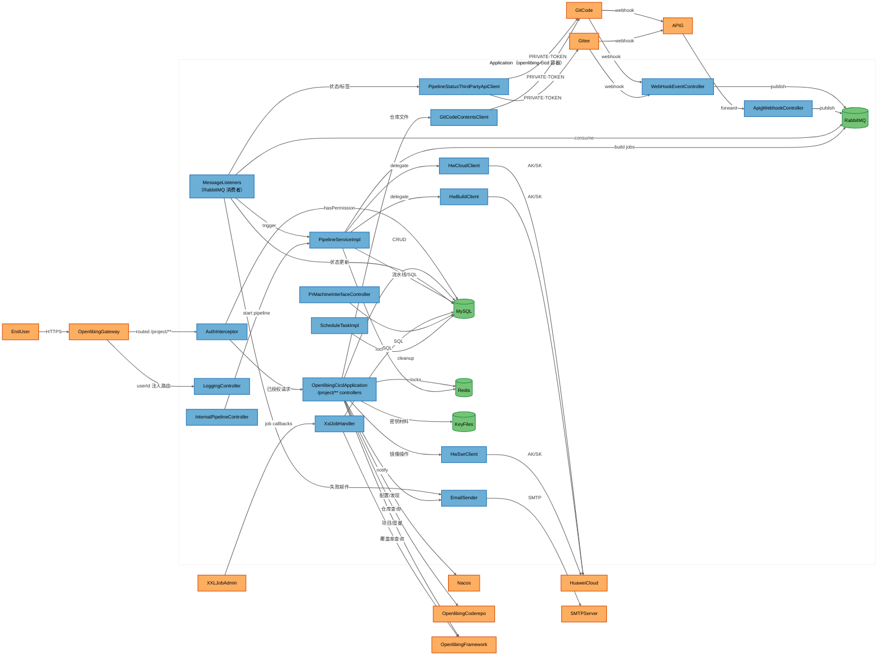
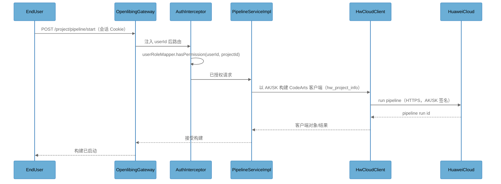
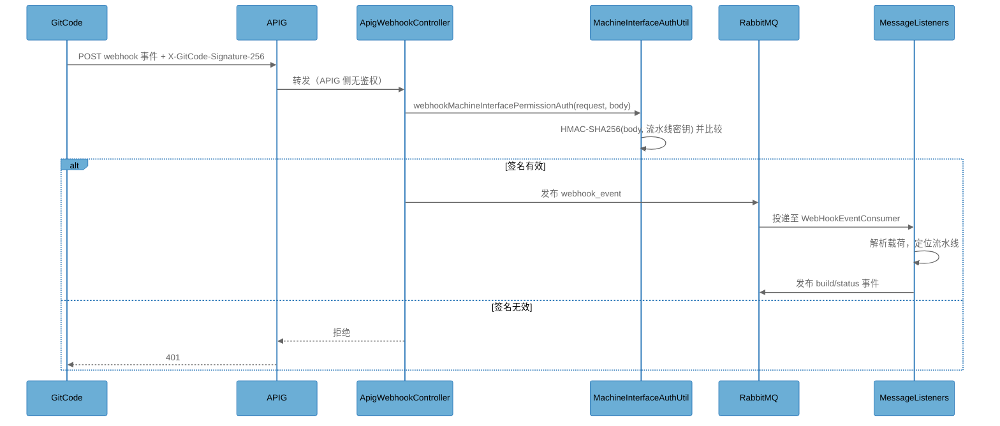
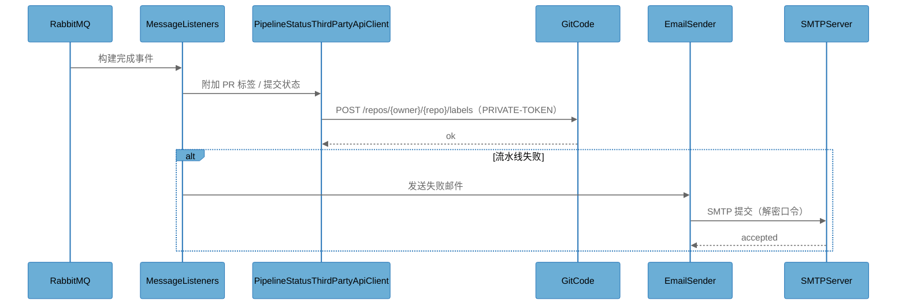
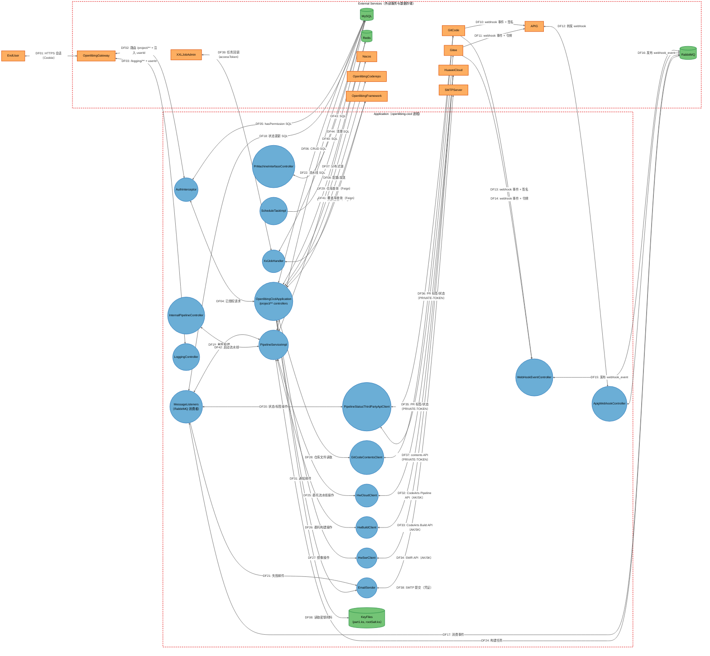

# openlibing-cicd 安全威胁建模报告（STRIDE-A）

> **报告类型**：单文档整合版威胁建模报告（架构概览 + 数据流图 + STRIDE-A 威胁分析 + 风险发现 + 行动摘要）
> **目标仓**：`openlibing-cicd`（`https://gitcode.com/cisu42/openlibing-cicd.git`，主仓 `upstream=openlibing/openlibing-cicd`）
> **分析基线**：分支 `master`，commit `1035e5016`（提交时间 2026-10-09 16:40:00 +0800）
> **分析方法**：STRIDE + Abuse（STRIDE-A）、零信任原则、纵深防御分析
> **报告语言**：简体中文

> **说明**：本报告由同一基线的多文件威胁建模产物（`0.1-architecture.md`、`1-threatmodel.md`、`1.1/1.2` DFD、`2-stride-analysis.md`）整合为**单份文档**，并对原汇总表中存在的计数误差进行了重新核算。威胁条目编号（`T<组件序号>.<序号>`）与原分析保持一致，便于追溯。

---

## 一、执行摘要

openlibing-cicd 是 OpenLibing CI/CD 平台的核心后端服务：它编排构建/流水线执行（委托华为云 CodeArts Pipeline/Build 与 SWR），消费 GitCode/Gitee 的代码托管 Webhook 以触发流水线与 PR 门禁，将构建状态/标签回写代码平台，并向平台前端暴露项目维度的业务 API（流水线、构建、PR、镜像、日志、看板）。

本次分析覆盖 **31 个组件**（含 13 个外部服务/数据存储、1 个外部交互者），共识别 **139 条具体威胁**，并归纳为 **32 条风险发现（Finding）**（Tier 1 = 5、Tier 2 = 22、Tier 3 = 5）。

**关键结论（按风险优先级）**：

1. **入口鉴权薄弱且可被公网触达**：9 条 Tier 1 威胁全部集中在 Webhook/APIG 入口。APIG 对 Webhook 转发**不做任何调用方校验**，服务端 HMAC 成为唯一控制；且 HMAC 校验使用 `String.equals`（非恒定时间比较）、缺少时间戳/nonce 防重放、校验前完整读取请求体（无大小上限）。
2. **出站 TLS 证书校验被关闭**：多个出站 HTTP 客户端（HwCloudClient、HwBuildClient、HwSwrClient、PipelineStatusThirdPartyApiClient，以及 PipelineServiceImpl/FileDownloadServiceImpl 调用点）使用"信任所有证书"的客户端，使网络位置攻击者可中间人篡改流水线/构建/镜像/PR 状态结果。相关修复已存在于分支但**未合入 master**。
3. **加密密钥材料随仓库与镜像分发**：`keys/part1.ks`、`keys/rootSalt.ks` 被提交进仓库并打入镜像，任何人只要拥有仓库读权限即可解密全部受其保护的凭证（Redis、SMTP、华为云 AK/SK），密钥体系形同虚设。
4. **身份可被客户端伪造**：POST 请求的 `userId` 取自请求体，`/logging/**` 的 `userId` 为客户端可见参数；网关注入的身份**无签名/无 mTLS 校验**，内网可绕过网关直连 8077 端口伪造任意身份。
5. **内部机器接口完全无鉴权**：`/pr/machine-interface/**` 与 `/internal/**` 无任何应用层认证，任何内网调用方即可伪造 PR 构建内容、跨区同步、触发流水线。
6. **敏感数据在日志中泄露**：`X-Gitee-Token`、`previewBody`、`access_token`（拼接在 URL 中）、构建日志中的口令等被写入日志；多个 Lombok `@Data` DTO 未对敏感字段加 `@ToString.Exclude`。

> **Note on threat counts:** 本报告的威胁计数以 `2-stride-analysis` 中的明细行 `T<组件序号>.<序号>` 为准（含每个组件 Tier 1/2/3 分层表中的具体威胁行），不含"类别不适用（N/A）"的说明行。总计 **139** 条：**Tier 1 = 9**、**Tier 2 = 112**、**Tier 3 = 18**。按 STRIDE-A 类别：**S=24、T=32、R=7、I=26、D=30、E=10、A=10**。原多文件汇总表中 `Totals` 行存在 3 处计数误差（PipelineServiceImpl 少计 1、Gitee 少计 1、各类别分布偏差），本报告已修正。

**风险分级总览**：

| 可利用性分级 | 前提条件 | 威胁数 | 占比 |
|-------------|---------|-------|------|
| Tier 1 — 直接暴露（无前提） | `None` | 9 | 6.5% |
| Tier 2 — 条件风险（单一前提） | 单一项（认证用户/特权用户/内网/单一边界访问） | 112 | 80.6% |
| Tier 3 — 纵深防御（高前提） | 主机/OS 访问、管理员凭证、组件被攻陷、多前提组合 | 18 | 12.9% |

---

## 二、系统架构概览

### 2.1 系统用途

openlibing-cicd 承担以下职责：

- **流水线编排**：接收前端与内部服务的触发请求，向华为云 CodeArts Pipeline/Build 委托执行，并维护流水线运行状态与产物。
- **Webhook 消费与 PR 门禁**：消费 GitCode/Gitee 推送的 Webhook（push/PR），校验 HMAC 签名后进入消息队列，由消费者触发流水线与门禁判定，并回写状态/标签。
- **项目维度业务 API**：通过平台网关向 Web 前端暴露 `/project/**`（流水线、构建、PR、镜像、标签、看板）与 `/logging/**`（构建日志）接口。
- **机器接口**：为 PR 管理主机、XXL-Job 调度器及平台内部服务提供 `/pr/machine-interface/**`、`/internal/**` 等接口。

### 2.2 关键组件清单

| 组件 | 类型 | 说明 |
|------|------|------|
| OpenlibingCicdApplication | 进程 | Spring Boot Servlet Web 应用（端口 8077），承载 `/project/**` 下约 20 个业务 Controller（流水线、构建、PR、镜像、标签、看板） |
| AuthInterceptor | 进程 | `/project/**` 的 Spring MVC 拦截器，提取 projectId/pipelineId/userId 并通过 userRoleMapper 校验项目权限 |
| WebHookEventController | 进程 | Webhook 入口 `/webhookEvent/hooks/{gitcode\|gitee}/{pipelineId}`，通过 MachineInterfaceAuthUtil 校验 HMAC 签名 |
| ApigWebhookController | 进程 | APIG 前置 Webhook 入口 `/apig/webhook/**`（APIG 侧无鉴权透传，服务端做 HMAC 校验） |
| PrMachineInterfaceController | 进程 | 机器对机器接口 `/pr/machine-interface/**`（保存 PR 构建内容、跨区 PR 操作），**应用层无鉴权** |
| InternalPipelineController | 进程 | 内部接口 `/internal/prStartPipeline`，供同类服务触发流水线，**应用层无鉴权** |
| LoggingController | 进程 | 流水线日志查询 `/logging/**`，userId 取自请求参数，依赖网关注入身份 |
| PipelineServiceImpl | 进程 | 核心流水线编排服务（构建触发、状态、产物、华为云委托） |
| MessageListeners | 进程 | RabbitMQ 消费者集合：WebHookEventConsumer、PipelineEventConsumer、PipelineStatusUpdateConsumer、PrOpEventConsumer、PipelineFailEmailConsumer |
| HwCloudClient | 进程 | 华为云 CodeArts Pipeline SDK 客户端，使用存于 MySQL（hw_project_info）的项目级 AK/SK |
| HwBuildClient | 进程 | 华为云 CodeArts Build SDK 客户端，使用项目级 AK/SK |
| HwSwrClient | 进程 | 华为云 SWR（镜像仓库）SDK 客户端，使用项目级 AK/SK |
| PipelineStatusThirdPartyApiClient | 进程 | GitCode/Gitee REST 客户端（PRIVATE-TOKEN 头），用于 PR 标签与流水线状态回写 |
| GitCodeContentsClient | 进程 | GitCode 内容 API 客户端（PRIVATE-TOKEN），读取仓库文件/分支 |
| EmailSender | 进程 | SMTP 邮件发送器，使用由配置解密的账号/口令 |
| ScheduleTaskImpl | 进程 | `@Scheduled` 定时任务：每日清理已删除流水线（cron `0 0 1 * * ?`） |
| XxlJobHandler | 进程 | XXL-Job 处理器（如工作流覆盖率），由 XXL-Job 管理端调度回调 |
| MySQL | 数据存储 | 业务数据库（user_role_info、pipeline、含加密 AK/SK 的 hw_project_info、PR/构建/镜像表），经 MyBatis + Liquibase 访问 |
| Redis | 数据存储 | Redis/Redisson，用于分布式锁（DistributedLockService） |
| RabbitMQ | 数据存储 | 消息中间件，承载 Webhook 事件、构建任务、PR 操作事件、状态更新、失败邮件 |
| KeyFiles | 数据存储 | 加密密钥材料 `keys/part1.ks` + `keys/rootSalt.ks`，随仓库与容器镜像分发，供 SecurityUtil 解密凭证 |
| EndUser | 外部交互者 | 通过网关使用 Web UI 的平台开发者 |
| OpenlibingGateway | 外部服务 | 平台 API 网关，执行 Cookie 会话鉴权并将 userId 注入查询参数 |
| APIG | 外部服务 | 华为 API 网关，将 GitCode/Gitee Webhook 转发至 `/apig/webhook`，网关层不做鉴权 |
| Nacos | 外部服务 | 配置中心 + 注册中心（各 profile 硬编码公有华为云 CSE 端点） |
| GitCode | 外部服务 | 代码托管平台：Webhook 来源与 REST API 目标（PRIVATE-TOKEN） |
| Gitee | 外部服务 | 代码托管平台：Webhook 来源与 REST API 目标（PRIVATE-TOKEN） |
| HuaweiCloud | 外部服务 | 华为云 CodeArts Pipeline/Build/SWR 端点，使用项目级 AK/SK |
| OpenlibingCoderepo | 外部服务 | 内部代码仓服务，经 Feign 调用（https://openlibing-coderepo） |
| OpenlibingFramework | 外部服务 | 内部框架服务，经 Feign 调用（项目、度量、导出任务） |
| SMTPServer | 外部服务 | 外部 SMTP 中继，用于流水线失败与通知邮件 |
| XXLJobAdmin | 外部服务 | XXL-Job 调度管理端，触发 XxlJobHandler 回调 |

### 2.3 组件关系图

### 2.4 核心业务场景

#### 场景 1：开发者触发流水线构建

开发者在 Web UI 触发流水线。网关鉴权会话 Cookie 后将 userId 注入查询参数并路由到 `/project/**` Controller；AuthInterceptor 对 MySQL 校验项目权限，随后 PipelineServiceImpl 通过华为云客户端编排构建并发布状态事件。

#### 场景 2：GitCode Webhook 触发流水线门禁

GitCode 推送 Webhook（push/PR）。事件可直接到达 `/webhookEvent/hooks/gitcode/{pipelineId}`，也可经 APIG 到达 `/apig/webhook`。Controller 按流水线密钥校验 HMAC-SHA256 签名后投递至 RabbitMQ，由 WebHookEventConsumer 处理并触发/更新流水线状态。

#### 场景 3：消费者将构建状态回写 GitCode

构建完成后，PipelineStatusUpdateConsumer/PrOpEventConsumer 从 RabbitMQ 取出事件，调用 PipelineStatusThirdPartyApiClient 使用 PRIVATE-TOKEN 在 GitCode PR 上附加标签或更新提交状态，并通过 EmailSender 发送失败通知邮件。

#### 场景 4：定时清理已删除流水线

ScheduleTaskImpl 每日夜间（cron `0 0 1 * * ?`）删除 MySQL 中已移除流水线的记录。

#### 场景 5：XXL-Job 触发工作流覆盖率计算

XXLJobAdmin 调用 XxlJobHandler 回调；处理器经 Feign 查询 OpenlibingFramework 与 OpenlibingCoderepo，并将覆盖率结果写入 MySQL。

### 2.5 技术栈

| 层次 | 技术 |
|------|------|
| 语言 | Java 21 |
| 框架 | Spring Boot（Servlet/Tomcat）、Spring MVC 拦截器、Spring Cloud（Nacos 发现、Feign/Ribbon）、MyBatis、Liquibase、Redisson |
| 数据存储 | MySQL（业务数据）、Redis（分布式锁）、RabbitMQ（事件）、本地密钥文件（part1.ks、rootSalt.ks） |
| 基础设施 | Docker（openlibing 用户）、entrypoint/start/monitor 脚本、华为云 CSE（Nacos）、XXL-Job、华为 APIG |
| 安全机制 | HMAC-SHA256 Webhook 签名、网关 Cookie 鉴权 + userId 注入、AuthInterceptor 基于 userRoleMapper 的 RBAC、SecurityUtil 基于随仓密钥的解密、gitleaks/SpotBugs/findsecbugs 预提交门禁 |

### 2.6 部署模型与组件暴露面

服务为容器化 Spring Boot 应用，监听 `0.0.0.0:8077`（Tomcat），部署于平台容器基础设施并注册到 Nacos（各 profile 使用公有华为云 CSE 端点）。业务 API（`/project/**`、`/logging/**`）仅能经 OpenlibingGateway 到达，由网关鉴权会话 Cookie 并注入 userId 到查询参数。Webhook 端点（`/webhookEvent/**`、`/apig/webhook/**`）可被公网代码平台直接经网关或经华为 APIG 到达，**APIG 层无鉴权**。内部机器端点（`/pr/machine-interface/**`、`/internal/**`）无应用层鉴权，依赖网络隔离。配置（数据源、Redis、RabbitMQ、SMTP 凭证）由 Nacos 配置中心导入；加密密钥材料（`keys/part1.ks`、`keys/rootSalt.ks`）随仓库与容器镜像分发。华为云项目级 AK/SK 以加密形式存于 MySQL `hw_project_info` 表。

**部署分类（Deployment Classification）：** `K8S_SERVICE`

#### 组件暴露面表（前提基线，威胁/发现不得低于该基线）

| 组件 | 监听 | 鉴权要求 | 可达性 | 最低前提 | 派生分级 |
|------|------|---------|--------|---------|---------|
| OpenlibingCicdApplication | :8077（/project/**） | 是（网关 Cookie 鉴权 → userId；AuthInterceptor RBAC） | 外部（经网关） | Authenticated User | T2 |
| AuthInterceptor | 无 — 进程内拦截器 | 是（执行权限校验） | 仅内部 | Internal Network | T2 |
| WebHookEventController | :8077（/webhookEvent/**） | 部分 — 读取请求体后才做 HMAC-SHA256 校验 | 外部（网关/APIG 路由） | None | T1 |
| ApigWebhookController | :8077（/apig/webhook/**） | 部分 — 读取请求体后才做 HMAC-SHA256 校验；APIG 无鉴权透传 | 外部（APIG 透传） | None | T1 |
| PrMachineInterfaceController | :8077（/pr/machine-interface/**） | 否 | 仅内部 | Internal Network | T2 |
| InternalPipelineController | :8077（/internal/**） | 否 | 仅内部 | Internal Network | T2 |
| LoggingController | :8077（/logging/**） | 部分 — 仅网关级身份；userId 为客户端可见参数 | 外部（经网关） | Authenticated User | T2 |
| PipelineServiceImpl | 无 — 进程内服务 | 不适用 | 仅内部 | Internal Network | T2 |
| MessageListeners | RabbitMQ 队列（消费者） | 取决于 RabbitMQ vhost/ACL（来自 Nacos 配置） | 仅内部 | Internal Network | T2 |
| HwCloudClient | 无 — 仅出站 | 不适用（向 HuaweiCloud 出示 AK/SK） | 仅内部（出站路径） | Internal Network | T2 |
| HwBuildClient | 无 — 仅出站 | 不适用（出示 AK/SK） | 仅内部（出站路径） | Internal Network | T2 |
| HwSwrClient | 无 — 仅出站 | 不适用（出示 AK/SK） | 仅内部（出站路径） | Internal Network | T2 |
| PipelineStatusThirdPartyApiClient | 无 — 仅出站 | 不适用（出示 PRIVATE-TOKEN） | 仅内部（出站路径） | Internal Network | T2 |
| GitCodeContentsClient | 无 — 仅出站 | 不适用（出示 PRIVATE-TOKEN） | 仅内部（出站路径） | Internal Network | T2 |
| EmailSender | 无 — 仅出站 | 不适用（出示 SMTP 凭证） | 仅内部（出站路径） | Internal Network | T2 |
| ScheduleTaskImpl | 无 — 进程内 cron | 不适用 | 仅内部 | Internal Network | T2 |
| XxlJobHandler | :8077（xxl-job executor 回调） | 部分 — 来自配置的 xxl-job accessToken | 仅内部 | Internal Network | T2 |
| MySQL | Nacos 配置的端点 | 是（数据源凭证来自 Nacos） | 仅内部 | Internal Network | T2 |
| Redis | Nacos 配置的端点 | 是（口令经 SecurityUtil/KeyFiles 解密） | 仅内部 | Internal Network | T2 |
| RabbitMQ | Nacos 配置的端点 | 未知 — 凭证来自 Nacos 配置 | 仅内部 | Internal Network | T2 |
| KeyFiles | 容器文件系统（keys/） | 仅文件权限 | 仅内部（仓库 + 镜像层） | Authenticated User | T2 |
| EndUser | 无 — 外部交互者 | 不适用 | 外部 | 不适用 | 不适用 |
| OpenlibingGateway | 平台网关 | 是（Cookie 会话） | 外部 | 不适用 | 不适用 |
| APIG | 公网 API 网关 | 否（Webhook 透传） | 外部 | None | 不适用 |
| Nacos | 公有 CSE 端点（各 profile 硬编码） | 是（Nacos 账号） | 外部 | Authenticated User | 不适用 |
| GitCode | 公网代码平台 | 是（PRIVATE-TOKEN / Webhook 签名） | 外部 | Authenticated User | 不适用 |
| Gitee | 公网代码平台 | 是（PRIVATE-TOKEN / Webhook 令牌） | 外部 | Authenticated User | 不适用 |
| HuaweiCloud | 公网云端点 | 是（AK/SK） | 外部 | Authenticated User | 不适用 |
| OpenlibingCoderepo | 内部服务（https://openlibing-coderepo） | 服务间（网络层） | 仅内部 | Internal Network | 不适用 |
| OpenlibingFramework | 内部服务（https://openlibing-framework） | 服务间（网络层） | 仅内部 | Internal Network | 不适用 |
| SMTPServer | 内部 SMTP 中继 | 是（账号/口令） | 仅内部 | Internal Network | 不适用 |
| XXLJobAdmin | 内部调度管理端 | 是（accessToken） | 仅内部 | Internal Network | 不适用 |

### 2.7 安全基础设施清单

| 组件 | 安全职责 | 配置 | 备注 |
|------|---------|------|------|
| OpenlibingGateway | 业务 API 的认证边界；注入 userId | 平台管理的 Cookie 会话 | 服务信任网关注入的 userId；直连服务可绕过 |
| AuthInterceptor | `/project/**` 授权（基于 userRoleMapper 的项目权限） | 在 WebConfig 中仅对 `/project/**` 注册 | 非 `/project` 端点无拦截器覆盖 |
| RequestBodyFilter | 对 `/project/*` 下 POST/PUT/PATCH/DELETE 的请求体缓存包装 | 在 WebConfig 中注册 | master 上无 JSON 请求体大小上限（修复待合入） |
| MachineInterfaceAuthUtil | HMAC-SHA256 Webhook 签名校验（GitCode X-GitCode-Signature-256、Gitee X-Gitee-Token HMAC） | 校验时解密各流水线密钥 | master 上使用 `String.equals` 非恒定时间比较 |
| SecurityUtil | 使用随仓密钥材料解密 Redis/SMTP/AK-SK 凭证 | `keys/part1.ks` + `keys/rootSalt.ks` | 密钥材料已提交进仓库 |
| Spring multipart 限制 | 上传大小上限 16MB | application.yaml（max-file-size/max-request-size） | 仅对 multipart 生效；master 上 JSON 请求体无上限 |
| gitleaks + SpotBugs(findsecbugs) + CheckStyle + PMD | 提交/合入前的密钥与漏洞扫描 | .gitleaks.toml、spotbugs-include.xml、pom.xml 插件 | 仅排除 openlibing.pfx |

### 2.8 仓库结构

| 目录 | 用途 |
|------|------|
| src/main/java/com/openlibing/cicd/business/controller | REST 入口（约 23 个 Controller：流水线、构建、PR、镜像、Webhook、日志） |
| src/main/java/com/openlibing/cicd/business/client | 第三方 API 客户端（PipelineStatusThirdPartyApiClient） |
| src/main/java/com/openlibing/cicd/business/feign | 内部 Feign 客户端（CodeRepoClient、FrameworkProjectClient） |
| src/main/java/com/openlibing/cicd/business/service/impl | 业务服务（PipelineServiceImpl、ImageServiceImpl、FileDownloadServiceImpl、WorkflowCoverageServiceImpl） |
| src/main/java/com/openlibing/cicd/business/listener | RabbitMQ 消费者（webhook、pipeline、PR 事件、邮件） |
| src/main/java/com/openlibing/cicd/common/auth | AuthInterceptor、WebConfig、RequestBodyFilter |
| src/main/java/com/openlibing/cicd/common/utils | HwCloudClient、HwBuildClient、HwSwrClient、GitCodeContentsClient、MachineInterfaceAuthUtil、邮件工具 |
| src/main/java/com/openlibing/cicd/common/config | RedisConfig、DistributedLockService、WorkflowCoverageConfig |
| src/main/java/com/openlibing/cicd/common/job | XxlJobHandler |
| src/main/java/com/openlibing/cicd/common/constants/pipeline | SSLCipherSuiteUtil（信任所有证书 / 校验证书 两种 HTTP 客户端工厂） |
| src/main/resources | application*.yaml（Nacos 端点、端口、multipart 限制）、Liquibase changelog、mapper XML、模板、cacerts、openlibing.pfx |
| keys/ | 加密密钥材料（part1.ks、rootSalt.ks），被打入容器镜像 |
| Dockerfile、entrypoint.sh、start.sh、monitor.sh | 容器构建与运行时脚本 |

---

## 三、数据流图与信任边界

### 3.1 信任边界

| 边界 | 说明 | 包含元素 |
|------|------|---------|
| Application | openlibing-cicd 的 Spring Boot 进程/容器（单一 JVM，端口 8077） | OpenlibingCicdApplication、AuthInterceptor、WebHookEventController、ApigWebhookController、PrMachineInterfaceController、InternalPipelineController、LoggingController、PipelineServiceImpl、MessageListeners、HwCloudClient、HwBuildClient、HwSwrClient、PipelineStatusThirdPartyApiClient、GitCodeContentsClient、EmailSender、ScheduleTaskImpl、XxlJobHandler、KeyFiles |
| External | 进程边界之外的一切：后端数据存储，以及进程通信的外部/内部服务 | MySQL、Redis、RabbitMQ、OpenlibingGateway、APIG、Nacos、GitCode、Gitee、HuaweiCloud、OpenlibingCoderepo、OpenlibingFramework、SMTPServer、XXLJobAdmin |

### 3.2 数据流清单

| 编号 | 源 | 目标 | 协议 | 说明 |
|------|----|------|------|------|
| DF01 | EndUser | OpenlibingGateway | HTTPS | 浏览器会话（Cookie 认证） |
| DF02 | OpenlibingGateway | AuthInterceptor | HTTPS | 路由的 `/project/**` 请求，网关在 query/body 注入 userId |
| DF03 | OpenlibingGateway | LoggingController | HTTPS | `/logging/**` 请求；userId 取自客户端可见的请求参数 |
| DF04 | AuthInterceptor | OpenlibingCicdApplication | 进程内 | 已授权请求分发至业务 Controller |
| DF05 | AuthInterceptor | MySQL | SQL/JDBC | userRoleMapper.hasPermission 权限查询 |
| DF06 | OpenlibingCicdApplication | MySQL | SQL/JDBC | 流水线、构建、PR、镜像、标签的 CRUD |
| DF07 | OpenlibingCicdApplication | Redis | RESP | 分布式锁获取/释放（Redisson） |
| DF08 | OpenlibingCicdApplication | KeyFiles | 本地文件读 | SecurityUtil 读取 part1.ks/rootSalt.ks 解密凭证 |
| DF09 | OpenlibingCicdApplication | Nacos | HTTPS | 配置导入与注册中心注册 |
| DF10 | GitCode | APIG | HTTPS | Webhook 事件推送，携带 X-GitCode-Signature-256 |
| DF11 | Gitee | APIG | HTTPS | Webhook 事件推送，携带 X-Gitee-Token |
| DF12 | APIG | ApigWebhookController | HTTPS | 转发 Webhook（APIG 层无鉴权） |
| DF13 | GitCode | WebHookEventController | HTTPS | 直接 Webhook 推送，携带 HMAC-SHA256 签名头 |
| DF14 | Gitee | WebHookEventController | HTTPS | 直接 Webhook 推送，携带 X-Gitee-Token/时间戳 |
| DF15 | WebHookEventController | RabbitMQ | AMQP | 发布已校验的 Webhook 事件（含死信交换机） |
| DF16 | ApigWebhookController | RabbitMQ | AMQP | 发布 APIG 转发的 Webhook 事件 |
| DF17 | MessageListeners | RabbitMQ | AMQP | 消费 webhook/pipeline/status/PR-op/email 事件 |
| DF18 | MessageListeners | MySQL | SQL/JDBC | 持久化流水线/构建/PR 状态更新 |
| DF19 | MessageListeners | PipelineServiceImpl | 进程内 | 由消费到的事件触发流水线操作 |
| DF20 | MessageListeners | PipelineStatusThirdPartyApiClient | 进程内 | 委托 PR 标签/状态回写 |
| DF21 | MessageListeners | EmailSender | 进程内 | 请求流水线失败通知邮件 |
| DF22 | PipelineServiceImpl | MySQL | SQL/JDBC | 流水线记录、hw_project_info AK/SK 读取 |
| DF23 | PipelineServiceImpl | Redis | RESP | 流水线操作的分布式锁 |
| DF24 | PipelineServiceImpl | RabbitMQ | AMQP | 发布构建任务与详情事件 |
| DF25 | PipelineServiceImpl | HwCloudClient | 进程内 | 委托 CodeArts 流水线操作 |
| DF26 | PipelineServiceImpl | HwBuildClient | 进程内 | 委托 CodeArts 构建操作 |
| DF27 | OpenlibingCicdApplication | HwSwrClient | 进程内 | 委托 SWR 镜像操作（ImageServiceImpl） |
| DF28 | OpenlibingCicdApplication | GitCodeContentsClient | 进程内 | 读取仓库文件/分支以解析流水线配置 |
| DF29 | OpenlibingCicdApplication | OpenlibingCoderepo | HTTPS（Feign） | 仓库查询（代码仓服务） |
| DF30 | OpenlibingCicdApplication | OpenlibingFramework | HTTPS（Feign） | 项目、度量与导出任务查询 |
| DF31 | OpenlibingCicdApplication | EmailSender | 进程内 | 发送通知邮件 |
| DF32 | HwCloudClient | HuaweiCloud | HTTPS | CodeArts Pipeline API 调用，以项目级 AK/SK 签名（部分路径信任所有 TLS） |
| DF33 | HwBuildClient | HuaweiCloud | HTTPS | CodeArts Build API 调用，以项目级 AK/SK 签名 |
| DF34 | HwSwrClient | HuaweiCloud | HTTPS | SWR 镜像仓库 API 调用，以项目级 AK/SK 签名 |
| DF35 | PipelineStatusThirdPartyApiClient | GitCode | HTTPS | 以 PRIVATE-TOKEN 头更新 PR 标签/提交状态 |
| DF36 | PipelineStatusThirdPartyApiClient | Gitee | HTTPS | 以 PRIVATE-TOKEN 头更新 PR 标签/提交状态 |
| DF37 | GitCodeContentsClient | GitCode | HTTPS | 以 PRIVATE-TOKEN 头读取仓库内容/分支 |
| DF38 | EmailSender | SMTPServer | SMTP | 以解密后的账号/口令提交邮件 |
| DF39 | XXLJobAdmin | XxlJobHandler | HTTP | 由 xxl-job accessToken 授权的任务回调 |
| DF40 | XxlJobHandler | MySQL | SQL/JDBC | 工作流覆盖率结果持久化 |
| DF41 | XxlJobHandler | OpenlibingFramework | HTTPS（Feign） | 覆盖率计算查询 |
| DF42 | InternalPipelineController | PipelineServiceImpl | 进程内 | 为同类服务触发流水线启动 |
| DF43 | PrMachineInterfaceController | MySQL | SQL/JDBC | PR 构建内容与跨区 PR 持久化 |
| DF44 | ScheduleTaskImpl | MySQL | SQL/JDBC | 每日清理已删除流水线（cron `0 0 1 * * ?`） |

### 3.3 详细数据流图（DFD）

### 3.4 摘要数据流图

```mermaid
%%{init: {'theme': 'base', 'themeVariables': { 'background': '#ffffff', 'primaryColor': '#ffffff', 'lineColor': '#666666' }}}%%
flowchart LR
    classDef process fill:#6baed6,stroke:#2171b5,stroke-width:2px,color:#000000
    classDef external fill:#fdae61,stroke:#d94701,stroke-width:2px,color:#000000
    classDef datastore fill:#74c476,stroke:#238b45,stroke-width:2px,color:#000000

    EndUser["EndUser"]:::external

    subgraph Application["Application（openlibing-cicd 进程）"]
        OpenlibingCicdApplication(("OpenlibingCicdApplication<br/>/project/** controllers")):::process
        AuthInterceptor(("AuthInterceptor")):::process
        WebHookEventController(("WebHookEventController")):::process
        ApigWebhookController(("ApigWebhookController")):::process
        MachineInterfaces(("机器接口<br/>（PrMachineInterface, InternalPipeline,<br/>Logging, ScheduleTask, XxlJobHandler）")):::process
        PipelineServiceImpl(("PipelineServiceImpl")):::process
        MessageListeners(("MessageListeners<br/>（RabbitMQ 消费者）")):::process
        OutboundClients(("出站客户端<br/>（HwCloud, HwBuild, HwSwr,<br/>ThirdPartyApi, GitCodeContents, EmailSender）")):::process
        KeyFiles[("KeyFiles<br/>（part1.ks, rootSalt.ks）")]:::datastore
    end

    subgraph External["External Services（外部服务与数据存储）"]
        MySQL[("MySQL")]:::datastore
        Redis[("Redis")]:::datastore
        RabbitMQ[("RabbitMQ")]:::datastore
        OpenlibingGateway["OpenlibingGateway"]:::external
        APIG["APIG"]:::external
        GitCode["GitCode"]:::external
        Gitee["Gitee"]:::external
        HuaweiCloud["HuaweiCloud"]:::external
        SupportServices["支撑服务<br/>（Nacos, Coderepo, Framework,<br/>SMTPServer, XXLJobAdmin）"]:::external
    end

    EndUser <-->|"SDF01: HTTPS 会话（Cookie）"| OpenlibingGateway
    OpenlibingGateway <-->|"SDF02: 路由 /project/** + 注入 userId"| AuthInterceptor
    OpenlibingGateway <-->|"SDF03: /logging/** + userId"| MachineInterfaces
    AuthInterceptor <-->|"SDF04: 已授权请求"| OpenlibingCicdApplication
    AuthInterceptor <-->|"SDF05: hasPermission SQL"| MySQL
    OpenlibingCicdApplication <-->|"SDF06: CRUD SQL"| MySQL
    OpenlibingCicdApplication <-->|"SDF07: 分布式锁"| Redis
    OpenlibingCicdApplication -->|"SDF08: 读取密钥材料"| KeyFiles
    OpenlibingCicdApplication <-->|"SDF09: 配置/发现/仓库/项目"| SupportServices
    GitCode -->|"SDF10: webhook 事件 + 签名"| APIG
    Gitee -->|"SDF11: webhook 事件 + 令牌"| APIG
    APIG <-->|"SDF12: 转发 webhook"| ApigWebhookController
    GitCode -->|"SDF13: webhook 事件 + 签名"| WebHookEventController
    Gitee -->|"SDF14: webhook 事件 + 令牌"| WebHookEventController
    WebHookEventController <-->|"SDF15: 发布 webhook_event"| RabbitMQ
    ApigWebhookController <-->|"SDF16: 发布 webhook_event"| RabbitMQ
    MessageListeners <-->|"SDF17: 消费事件"| RabbitMQ
    MessageListeners <-->|"SDF18: 状态更新 SQL"| MySQL
    MessageListeners <-->|"SDF19: 触发构建"| PipelineServiceImpl
    MessageListeners -->|"SDF20: 状态/标签/邮件"| OutboundClients
    PipelineServiceImpl <-->|"SDF21: 流水线 SQL"| MySQL
    PipelineServiceImpl <-->|"SDF22: 锁"| Redis
    PipelineServiceImpl <-->|"SDF23: 构建任务"| RabbitMQ
    PipelineServiceImpl <-->|"SDF24: 委托流水线/构建操作"| OutboundClients
    OpenlibingCicdApplication <-->|"SDF25: 镜像/仓库/通知操作"| OutboundClients
    OutboundClients <-->|"SDF26: PR 标签/状态/内容（PRIVATE-TOKEN）"| GitCode
    OutboundClients <-->|"SDF27: PR 标签/状态（PRIVATE-TOKEN）"| Gitee
    OutboundClients <-->|"SDF28: CodeArts/SWR API（AK/SK）"| HuaweiCloud
    OutboundClients <-->|"SDF29: SMTP 提交（凭证）"| SupportServices
    SupportServices <-->|"SDF30: 任务回调 + 覆盖率查询"| MachineInterfaces
    MachineInterfaces <-->|"SDF31: SQL"| MySQL
    MachineInterfaces <-->|"SDF32: 启动流水线"| PipelineServiceImpl

    style Application fill:none,stroke:#e31a1c,stroke-width:3px,stroke-dasharray: 5 5
    style External fill:none,stroke:#e31a1c,stroke-width:3px,stroke-dasharray: 5 5

    linkStyle default stroke:#666666,stroke-width:2px
```

### 3.5 摘要视图与详细视图映射

| 摘要元素 | 包含 | 摘要流 | 对应详细流 |
|---------|------|--------|-----------|
| EndUser | EndUser | SDF01 | DF01 |
| OpenlibingGateway | OpenlibingGateway | SDF01, SDF02, SDF03 | DF01, DF02, DF03 |
| AuthInterceptor | AuthInterceptor | SDF02, SDF04, SDF05 | DF02, DF04, DF05 |
| OpenlibingCicdApplication | OpenlibingCicdApplication | SDF04, SDF06, SDF07, SDF08, SDF09, SDF25 | DF04, DF06, DF07, DF08, DF09, DF27, DF28, DF29, DF30, DF31 |
| WebHookEventController | WebHookEventController | SDF13, SDF14, SDF15 | DF13, DF14, DF15 |
| ApigWebhookController | ApigWebhookController | SDF12, SDF16 | DF12, DF16 |
| MachineInterfaces | PrMachineInterfaceController、InternalPipelineController、LoggingController、ScheduleTaskImpl、XxlJobHandler | SDF03, SDF30, SDF31, SDF32 | DF03, DF39, DF40, DF41, DF42, DF43, DF44 |
| PipelineServiceImpl | PipelineServiceImpl | SDF19, SDF21, SDF22, SDF23, SDF24, SDF32 | DF19, DF22, DF23, DF24, DF25, DF26, DF42 |
| MessageListeners | MessageListeners | SDF17, SDF18, SDF19, SDF20 | DF17, DF18, DF19, DF20, DF21 |
| OutboundClients | HwCloudClient、HwBuildClient、HwSwrClient、PipelineStatusThirdPartyApiClient、GitCodeContentsClient、EmailSender | SDF20, SDF24, SDF25, SDF26, SDF27, SDF28, SDF29 | DF20, DF21, DF25, DF26, DF27, DF28, DF31, DF32, DF33, DF34, DF35, DF36, DF37, DF38 |
| KeyFiles | KeyFiles | SDF08 | DF08 |
| MySQL | MySQL | SDF05, SDF06, SDF18, SDF21, SDF31 | DF05, DF06, DF18, DF22, DF40, DF43, DF44 |
| Redis | Redis | SDF07, SDF22 | DF07, DF23 |
| RabbitMQ | RabbitMQ | SDF15, SDF16, SDF17, SDF23 | DF15, DF16, DF17, DF24 |
| APIG | APIG | SDF10, SDF11, SDF12 | DF10, DF11, DF12 |
| GitCode | GitCode | SDF10, SDF13, SDF26 | DF10, DF13, DF35, DF37 |
| Gitee | Gitee | SDF11, SDF14, SDF27 | DF11, DF14, DF36 |
| HuaweiCloud | HuaweiCloud | SDF28 | DF32, DF33, DF34 |
| SupportServices | Nacos、OpenlibingCoderepo、OpenlibingFramework、SMTPServer、XXLJobAdmin | SDF09, SDF29, SDF30 | DF09, DF29, DF30, DF38, DF39, DF41 |

---

## 四、STRIDE-A 威胁分析

### 4.1 方法论与可利用性分级

本分析采用标准 **STRIDE** 方法（Spoofing 仿冒、Tampering 篡改、Repudiation 抵赖、Information Disclosure 信息泄露、Denial of Service 拒绝服务、Elevation of Privilege 权限提升），并扩展 **Abuse Cases（滥用，记为 A）** 一类，覆盖"合法功能被误用、业务流程被操纵、特性被滥用"的场景。**A 恒指 Abuse**，与 Elevation of Privilege（授权绕过）严格区分：授权类问题归入 E。

威胁按**可利用性分级（Exploitability Tier）**组织，而非按严重度：

| 分级 | 标签 | 前提条件 | 判定规则 |
|------|------|---------|---------|
| **Tier 1** | 直接暴露 | `None` | 无任何前置访问即可被外部未认证攻击者利用；前提字段必须为 `None` |
| **Tier 2** | 条件风险 | 单一项：`Authenticated User`、`Privileged User`、`Internal Network`、或单一 `{边界} Access` | 仅需一种访问形式；前提字段只含一项 |
| **Tier 3** | 纵深防御 | `Host/OS Access`、`Admin Credentials`、`{组件} Compromise`、`Physical Access`，或多个前提以 `+` 组合 | 需要显著前置突破、基础设施访问或多重前提 |

**前提底线约束**：每条威胁的前提不得低于其所属组件在"组件暴露面表"中给出的最低前提，分级不得低于该组件的派生分级（例如组件为 T2，则该组件不产生 T1 威胁）。

**覆盖规则**：STRIDE-A 分析覆盖元素表中全部元素，**外部人因交互者（EndUser）不单独设章**（人因是威胁来源而非目标）；外部服务（OpenlibingGateway、APIG、Nacos、GitCode、Gitee、HuaweiCloud、OpenlibingCoderepo、OpenlibingFramework、SMTPServer、XXLJobAdmin）作为攻击面均单独设章，共 **31 个组件章节**。

### 4.2 组件威胁汇总表

| 组件 | S | T | R | I | D | E | A | 合计 | T1 | T2 | T3 | 风险 |
|------|---|---|---|---|---|---|---|------|----|----|----|------|
| OpenlibingCicdApplication | 1 | 2 | 1 | 1 | 2 | 2 | 1 | 10 | 0 | 10 | 0 | 高 |
| AuthInterceptor | 1 | 1 | 0 | 0 | 1 | 2 | 0 | 5 | 0 | 5 | 0 | 高 |
| WebHookEventController | 2 | 1 | 0 | 1 | 1 | 0 | 1 | 6 | 4 | 1 | 1 | 高 |
| ApigWebhookController | 1 | 1 | 0 | 1 | 1 | 0 | 1 | 5 | 3 | 1 | 1 | 高 |
| PrMachineInterfaceController | 1 | 2 | 1 | 1 | 1 | 1 | 1 | 8 | 0 | 8 | 0 | 高 |
| InternalPipelineController | 1 | 0 | 1 | 0 | 1 | 1 | 1 | 5 | 0 | 5 | 0 | 中 |
| LoggingController | 1 | 0 | 1 | 1 | 1 | 0 | 0 | 4 | 0 | 4 | 0 | 中 |
| PipelineServiceImpl | 1 | 3 | 1 | 2 | 2 | 1 | 1 | 11 | 0 | 9 | 2 | 严重 |
| MessageListeners | 0 | 1 | 1 | 1 | 1 | 1 | 1 | 6 | 0 | 6 | 0 | 高 |
| HwCloudClient | 1 | 1 | 0 | 1 | 1 | 0 | 0 | 4 | 0 | 4 | 0 | 高 |
| HwBuildClient | 1 | 1 | 0 | 1 | 0 | 0 | 0 | 3 | 0 | 3 | 0 | 中 |
| HwSwrClient | 1 | 1 | 0 | 1 | 0 | 0 | 0 | 3 | 0 | 3 | 0 | 中 |
| PipelineStatusThirdPartyApiClient | 1 | 2 | 0 | 1 | 0 | 0 | 0 | 4 | 0 | 4 | 0 | 高 |
| GitCodeContentsClient | 1 | 0 | 0 | 1 | 1 | 0 | 0 | 3 | 0 | 2 | 1 | 中 |
| EmailSender | 1 | 1 | 0 | 1 | 1 | 0 | 1 | 5 | 0 | 5 | 0 | 中 |
| ScheduleTaskImpl | 0 | 1 | 0 | 0 | 1 | 0 | 0 | 2 | 0 | 1 | 1 | 低 |
| XxlJobHandler | 1 | 1 | 0 | 0 | 1 | 1 | 0 | 4 | 0 | 4 | 0 | 中 |
| KeyFiles | 0 | 1 | 0 | 1 | 1 | 0 | 0 | 3 | 0 | 2 | 1 | 严重 |
| MySQL | 0 | 1 | 1 | 1 | 1 | 0 | 0 | 4 | 0 | 4 | 0 | 高 |
| Redis | 1 | 1 | 0 | 1 | 1 | 0 | 0 | 4 | 0 | 4 | 0 | 中 |
| RabbitMQ | 0 | 1 | 0 | 1 | 1 | 0 | 0 | 3 | 0 | 3 | 0 | 高 |
| OpenlibingGateway | 1 | 2 | 0 | 0 | 1 | 1 | 0 | 5 | 0 | 5 | 0 | 高 |
| APIG | 1 | 0 | 0 | 0 | 1 | 0 | 0 | 2 | 2 | 0 | 0 | 中 |
| Nacos | 1 | 1 | 0 | 1 | 1 | 0 | 0 | 4 | 0 | 2 | 2 | 中 |
| GitCode | 1 | 1 | 0 | 1 | 1 | 0 | 1 | 5 | 0 | 4 | 1 | 中 |
| Gitee | 0 | 1 | 0 | 2 | 1 | 0 | 1 | 5 | 0 | 4 | 1 | 中 |
| HuaweiCloud | 1 | 1 | 0 | 1 | 1 | 0 | 0 | 4 | 0 | 1 | 3 | 中 |
| OpenlibingCoderepo | 0 | 1 | 0 | 1 | 1 | 0 | 0 | 3 | 0 | 1 | 2 | 低 |
| OpenlibingFramework | 0 | 1 | 0 | 1 | 1 | 0 | 0 | 3 | 0 | 1 | 2 | 低 |
| SMTPServer | 1 | 1 | 0 | 1 | 1 | 0 | 0 | 4 | 0 | 4 | 0 | 中 |
| XXLJobAdmin | 1 | 0 | 0 | 0 | 1 | 0 | 0 | 2 | 0 | 2 | 0 | 低 |
| **合计** | **24** | **32** | **7** | **26** | **30** | **10** | **10** | **139** | **9** | **112** | **18** | |

> 表格中的 S/T/R/I/D/E/A 为各组件**具体威胁**计数（不含 N/A 说明行）；`合计` 为行合计，底部 `合计` 为列合计。

---

## 五、STRIDE-A 威胁明细（按组件）

> 说明：每个组件章节列出信任边界、职责、涉及数据流，并按 Tier 1/2/3 分层给出威胁表；无威胁的层级显式标注；不适用的类别以 `N/A` 说明。`状态` 取值：`Open`（未处置）、`Mitigated`（已被现有控制缓解）、`Platform`（需平台侧处置）。

### 5.1 OpenlibingCicdApplication

**信任边界**：Application ｜ **职责**：Spring Boot Servlet Web 应用（端口 8077），承载 `/project/**` 下约 20 个业务 Controller ｜ **涉及数据流**：DF04、DF06、DF07、DF08、DF09、DF27、DF28、DF29、DF30、DF31

#### Tier 1 — 直接暴露（无前提）

*未识别 Tier 1 威胁。* 组件前提底线为 Authenticated User（`/project/**` 需网关会话）。

#### Tier 2 — 条件风险

| 编号 | 类别 | 威胁 | 前提 | 涉及流 | 缓解方向 | 状态 |
|------|------|------|------|--------|---------|------|
| T01.1 | Spoofing | 客户端可控的 projectId/pipelineId（query/body）叠加网关注入的 userId，当权限校验只验证用户可猜测的 (userId, projectId) 组合时，认证用户可在他人项目上下文操作 | Authenticated User | DF04 | 校验认证主体与资源属主一致；userId 仅服务端派生 | Open |
| T01.2 | Tampering | 从外部下载的构建产物与文件（FileDownloadServiceImpl）在落盘/下发前无内容完整性校验 | Authenticated User | DF27 | 存储与下载前校验产物校验和/签名 | Open |
| T01.3 | Tampering | 用户可控字段未做 CRLF 清洗即写入日志行，可伪造日志（SpotBugs 基线有 17 处 CRLF 注入） | Authenticated User | DF04 | 记日志前清洗 CR/LF；采用 MessageMaskUtils 式擦除 | Open |
| T01.4 | Repudiation | 破坏性操作（流水线删除、镜像删除）仅依赖网关注入的 userId，本服务无追加式审计轨迹，用户可否认操作 | Authenticated User | DF06 | 为破坏性操作写入不可篡改的操作历史（操作者/动作/对象/时间） | Open |
| T01.5 | Information Disclosure | 使用 Lombok `@Data` 且未加 `@ToString.Exclude` 的 DTO（如 RepoInfoEntity、EmailModel）在记录日志或错误序列化时打印 token/口令 | Authenticated User | DF06 | 敏感字段加 `@ToString.Exclude`；日志经 MessageMaskUtils 擦除 | Open |
| T01.6 | Denial of Service | master 上 JSON 请求体无大小上限（multipart 有 16MB 限制，JSON 没有）；大体积认证请求耗尽堆/解析 CPU | Authenticated User | DF04 | 对 JSON 强制请求体大小上限（修复已在 `fix/security-vuln-cicd-v2` 分支，未合入） | Open |
| T01.7 | Denial of Service | 并发 16MB multipart 上传耗尽临时磁盘/内存缓冲 | Authenticated User | DF04 | 限制并发上传并加每用户限流 | Mitigated |
| T01.8 | Elevation of Privilege | POST 端点从请求体取 userId（AuthInterceptor 对 POST 读取 body userId），认证用户可冒充任意 userId（只要权限校验通过） | Authenticated User | DF04 | 禁止从客户端输入取 userId；仅用网关注入身份 | Open |
| T01.9 | Elevation of Privilege | 服务端口 8077 在内网可达，直连可绕过网关，配合 AuthInterceptor 的 body/query 身份处理伪造任意 userId | Internal Network | DF04 | 仅允许网关入站（NetworkPolicy/ACL）并引入服务间认证（mTLS/签名身份头） | Open |
| T01.10 | Abuse | 流水线/导出接口可被脚本驱动且无每用户限流，以项目成本刷取华为云构建配额与 Excel 导出负载 | Authenticated User | DF06 | 增加每用户/每项目限流与配额告警 | Open |

#### Tier 3 — 纵深防御

*未识别 Tier 3 威胁。*

#### 不适用的类别

*七类均有至少一条具体威胁。*

---

### 5.2 AuthInterceptor

**信任边界**：Application ｜ **职责**：`/project/**` 的 Spring MVC 拦截器，提取 projectId/pipelineId/userId 并通过 userRoleMapper 校验项目权限 ｜ **涉及数据流**：DF02、DF04、DF05

#### Tier 1 — 直接暴露（无前提）

*未识别 Tier 1 威胁。* 拦截器仅能通过网关鉴权路由到达（底线：Authenticated User）。

#### Tier 2 — 条件风险

| 编号 | 类别 | 威胁 | 前提 | 涉及流 | 缓解方向 | 状态 |
|------|------|------|------|--------|---------|------|
| T02.1 | Spoofing | 拦截器信任网关注入的 userId 但无签名/校验，任何绕过网关的内网调用方可出示任意 userId | Internal Network | DF02 | 对网关身份头签名，或仅允许网关发起并启用 mTLS | Open |
| T02.2 | Tampering | URL 路径变体（尾斜杠、双斜杠、编码）可能绕过 WebConfig 中 `/project/**` 的包含匹配，从而绕开拦截器 | Authenticated User | DF02 | 使用严格路径匹配（PathPatternParser）并加默认拒绝的兜底；用路由测试验证 | Open |
| T02.3 | Denial of Service | 每个 `/project/**` 请求都触发一次无缓存的 MySQL hasPermission 查询，请求洪峰直接转化为数据库压力 | Authenticated User | DF05 | 短暂缓存权限决策（Redis，短 TTL）并在网关限流 | Open |
| T02.4 | Elevation of Privilege | POST 请求的 userId 取自请求体，权限校验实际校验的是攻击者选定的身份而非认证调用方 | Authenticated User | DF05 | 身份仅绑定网关注入参数；忽略客户端提供的 userId | Open |
| T02.5 | Elevation of Privilege | 菜单/权限 URL 配置漂移（如首尾空格、方法映射错误）会静默放宽或破坏整个角色的授权（曾发生 menu_url 空格真实事件） | Authenticated User | DF04 | 增加配置校验（URL trim/规范化、方法校验）与定期权限矩阵审计 | Platform |

#### Tier 3 — 纵深防御

*未识别 Tier 3 威胁。*

#### 不适用的类别

| 类别 | 理由 |
|------|------|
| Repudiation | 拦截器不改变状态；请求归属由下游审计与网关访问日志承担 |
| Information Disclosure | 仅返回通过/拒绝决策，本身不暴露数据载荷 |
| Abuse | 无业务特性可被滥用，它是纯授权闸门 |

---

### 5.3 WebHookEventController

**信任边界**：Application ｜ **职责**：Webhook 入口 `/webhookEvent/hooks/{gitcode\|gitee}/{pipelineId}`，经 MachineInterfaceAuthUtil 校验 HMAC 签名 ｜ **涉及数据流**：DF13、DF14、DF15

#### Tier 1 — 直接暴露（无前提）

| 编号 | 类别 | 威胁 | 前提 | 涉及流 | 缓解方向 | 状态 |
|------|------|------|------|--------|---------|------|
| T03.1 | Spoofing | 抓取或重放的 Webhook 事件（签名有效但内容过期）被再次接受——GitCode 路径未强制时间戳/nonce 新鲜度校验 | None | DF13 | 对两个平台都强制时间戳窗口与 nonce/事件 ID 去重 | Open |
| T03.2 | Spoofing | MachineInterfaceAuthUtil 的签名比较使用 `String.equals`（非恒定时间），存在理论时序侧信道，辅助签名伪造 | None | DF13 | 使用恒定时间比较（`MessageDigest.isEqual`/MessageCoder）；修复已在分支，未合入 master | Open |
| T03.3 | Tampering | 攻击者可控的 Webhook 载荷字段（CRLF 序列）被原样写入日志，可伪造冒充系统消息的日志条目 | None | DF13 | 对所有被记录的 Webhook 字段清洗 CR/LF | Open |
| T03.4 | Denial of Service | 未认证攻击者发送任意大体积请求体，在校验前被完整读取并计算 HMAC（JSON 路径无大小上限），导致 CPU/内存耗尽 | None | DF13 | 强制 Webhook 请求体大小上限并在完整解析前拒绝（流式 HMAC） | Open |

#### Tier 2 — 条件风险

| 编号 | 类别 | 威胁 | 前提 | 涉及流 | 缓解方向 | 状态 |
|------|------|------|------|--------|---------|------|
| T03.5 | Information Disclosure | master 代码路径记录 `X-Gitee-Token` 值与原始 previewBody 内容，向任何可读日志者暴露 Webhook 密钥 | Internal Network | DF14 | 日志中遮蔽令牌（MessageMaskUtils）并移除 preview body；修复在安全分支待合入 | Open |

#### Tier 3 — 纵深防御

| 编号 | 类别 | 威胁 | 前提 | 涉及流 | 缓解方向 | 状态 |
|------|------|------|------|--------|---------|------|
| T03.6 | Abuse | 持有泄露的流水线 Webhook 密钥者可无限触发伪造构建（算力/配额滥用），且与真实事件无法区分 | WebHookEventController 密钥泄露 | DF15 | 轮换密钥、增加每流水线触发限流、对异常 Webhook 量告警 | Open |

#### 不适用的类别

| 类别 | 理由 |
|------|------|
| Repudiation | 机器对机器端点无用户归属；审计轨迹由代码平台的 Webhook 来源日志提供 |
| Elevation of Privilege | 端点不授予特权会话；成功伪造的最坏结果是事件注入（归入 Spoofing/Abuse） |

---

### 5.4 ApigWebhookController

**信任边界**：Application ｜ **职责**：APIG 前置 Webhook 入口 `/apig/webhook/**`（APIG 无鉴权透传，服务端做 HMAC 校验） ｜ **涉及数据流**：DF12、DF16

#### Tier 1 — 直接暴露（无前提）

| 编号 | 类别 | 威胁 | 前提 | 涉及流 | 缓解方向 | 状态 |
|------|------|------|------|--------|---------|------|
| T04.1 | Spoofing | APIG 转发 Webhook 时不鉴权，公网可冒充 GitCode/Gitee 访问本端点，服务端 HMAC 成为唯一控制 | None | DF12 | 在 APIG 侧启用签名/AppKey 校验作为纵深防御 | Open |
| T04.2 | Tampering | APIG 转发的含 CRLF 载荷被原样记录，未认证来源即可伪造日志条目 | None | DF12 | 清洗被记录 Webhook 字段的 CR/LF | Open |
| T04.3 | Denial of Service | 经 APIG 的未认证洪峰（网关层未观察到每消费者限流）逐条完整读取并校验请求体，耗尽 CPU/内存 | None | DF12 | 在 APIG 配置限流并在服务端强制请求体大小上限 | Open |

#### Tier 2 — 条件风险

| 编号 | 类别 | 威胁 | 前提 | 涉及流 | 缓解方向 | 状态 |
|------|------|------|------|--------|---------|------|
| T04.4 | Information Disclosure | 共享校验路径（giteeWebhookMachineInterfacePermissionAuth）记录 token/preview 内容，向日志读者暴露 Webhook 密钥 | Internal Network | DF12 | 日志中遮蔽令牌并截断 preview body | Open |

#### Tier 3 — 纵深防御

| 编号 | 类别 | 威胁 | 前提 | 涉及流 | 缓解方向 | 状态 |
|------|------|------|------|--------|---------|------|
| T04.5 | Abuse | 泄露的流水线 Webhook 密钥可经 APIG 路径无限触发伪造构建（算力/配额滥用） | ApigWebhookController 密钥泄露 | DF16 | 轮换密钥；每流水线触发限流与流量告警 | Open |

#### 不适用的类别

| 类别 | 理由 |
|------|------|
| Repudiation | 无用户身份的机器接口；归属依赖上游平台审计 |
| Elevation of Privilege | 端点不产生会话或特权；成功伪造表现为事件注入（Spoofing/Abuse） |

---

### 5.5 PrMachineInterfaceController

**信任边界**：Application ｜ **职责**：机器对机器接口 `/pr/machine-interface/**`（保存 PR 构建内容、跨区 PR 操作），应用层无鉴权 ｜ **涉及数据流**：DF43

#### Tier 1 — 直接暴露（无前提）

*未识别 Tier 1 威胁。* 端点为仅内网可达（底线：Internal Network）。

#### Tier 2 — 条件风险

| 编号 | 类别 | 威胁 | 前提 | 涉及流 | 缓解方向 | 状态 |
|------|------|------|------|--------|---------|------|
| T05.1 | Spoofing | `/pr/machine-interface/**` 无鉴权：任何内网调用方可冒充 PR 管理主机 | Internal Network | DF43 | 机器接口要求 HMAC/mTLS 服务凭证 | Open |
| T05.2 | Tampering | 无鉴权 save 写入攻击者选定的 PR 构建内容，破坏任意项目的 PR 门禁数据 | Internal Network | DF43 | 认证调用方并按项目/流水线属主校验载荷 | Open |
| T05.3 | Tampering | cross-region/update 将攻击者可控的 handlerDTO 字段（platform/account/name）转发进跨区 PR 同步，篡改同步状态 | Internal Network | DF43 | 对 handlerDTO 字段做白名单与校验；请求绑定已知项目映射 | Open |
| T05.4 | Repudiation | 不校验也不记录调用方身份，机器接口写入无法归因到来源系统 | Internal Network | DF43 | 每次写入记录已认证调用方身份（追加式） | Open |
| T05.5 | Information Disclosure | cross-region/info 对任意 projectId 返回 YellowRegionPipelineEntity 且无项目范围校验，泄露跨项目流水线数据 | Internal Network | DF43 | 在机器接口上强制项目范围访问校验 | Open |
| T05.6 | Denial of Service | 无鉴权的内网 save/cross-region 调用洪峰驱动无界 MySQL 写入 | Internal Network | DF43 | 机器端点限流并要求认证 | Open |
| T05.7 | Elevation of Privilege | 内网调用方获得本应仅限 PR 管理主机的平台内部写权限（PR 门禁状态） | Internal Network | DF43 | 服务间授权（调用方白名单） | Open |
| T05.8 | Abuse | 以伪造的项目/仓库映射重复发起跨区同步，向目标区域的 PR 流水线刷请求（业务流滥用） | Internal Network | DF43 | 幂等键与每项目同步限流 | Open |

#### Tier 3 — 纵深防御

*未识别 Tier 3 威胁。*

#### 不适用的类别

*七类均有至少一条具体威胁。*

---

### 5.6 InternalPipelineController

**信任边界**：Application ｜ **职责**：内部端点 `/internal/prStartPipeline`，供同类服务触发流水线，无应用层鉴权 ｜ **涉及数据流**：DF42

#### Tier 1 — 直接暴露（无前提）

*未识别 Tier 1 威胁。* 端点为仅内网可达（底线：Internal Network）。

#### Tier 2 — 条件风险

| 编号 | 类别 | 威胁 | 前提 | 涉及流 | 缓解方向 | 状态 |
|------|------|------|------|--------|---------|------|
| T06.1 | Spoofing | 从不校验调用方身份：任何内部服务可冒充同类平台服务 | Internal Network | DF42 | 内部端点要求服务凭证（mTLS/HMAC） | Open |
| T06.2 | Repudiation | 经 `/internal` 的流水线启动未归属到已认证调用方，未授权启动无法追溯 | Internal Network | DF42 | 每次启动记录已认证调用方身份 | Open |
| T06.3 | Denial of Service | 内网对 prStartPipeline 的洪峰引发华为云流水线风暴（配额耗尽、队列饱和） | Internal Network | DF42 | 限流并认证内部触发；每项目并发上限 | Open |
| T06.4 | Elevation of Privilege | 内网攻击者从网络访问升级为特权流水线启动能力，且无需任何用户权限 | Internal Network | DF42 | 服务间授权；端点限制为白名单调用方 | Open |
| T06.5 | Abuse | 重复触发将构建算力计入受害项目（以项目成本滥用资源） | Internal Network | DF42 | 每项目触发配额与异常告警 | Open |

#### Tier 3 — 纵深防御

*未识别 Tier 3 威胁。*

#### 不适用的类别

| 类别 | 理由 |
|------|------|
| Tampering | 端点仅执行启动动作；载荷篡改表现为未授权触发，归入 Elevation of Privilege/Abuse |
| Information Disclosure | 响应仅含启动确认，不暴露任何数据集 |

---

### 5.7 LoggingController

**信任边界**：Application ｜ **职责**：流水线日志查询 `/logging/**`，userId 取自请求参数，依赖网关注入身份 ｜ **涉及数据流**：DF03

#### Tier 1 — 直接暴露（无前提）

*未识别 Tier 1 威胁。* 网关鉴权路由（底线：Authenticated User）。

#### Tier 2 — 条件风险

| 编号 | 类别 | 威胁 | 前提 | 涉及流 | 缓解方向 | 状态 |
|------|------|------|------|--------|---------|------|
| T07.1 | Spoofing | userId 以客户端可见请求参数到达；若网关未覆盖客户端提供的值（HTTP 参数污染），用户可冒用他人 userId 查询日志 | Authenticated User | DF03 | 网关剥离客户端身份参数；身份仅绑定签名会话 | Open |
| T07.2 | Repudiation | 日志读取操作无审计，构建日志外泄事后无法归因 | Authenticated User | DF03 | 记录日志访问审计事件（谁读取了哪条流水线日志） | Open |
| T07.3 | Information Disclosure | 构建日志常嵌入构建期打印的令牌/密钥；跨用户日志访问（见 T07.1）或过宽查询会将其暴露给任意项目成员 | Authenticated User | DF03 | 服务端强制按用户项目范围校验；在源头擦除构建日志中的密钥 | Open |
| T07.4 | Denial of Service | 日志文件读取无大小/分页上限（未见验证），单个认证用户即可在大日志上占用内存与线程 | Authenticated User | DF03 | 限制响应大小并对日志读取分页 | Open |

#### Tier 3 — 纵深防御

*未识别 Tier 3 威胁。*

#### 不适用的类别

| 类别 | 理由 |
|------|------|
| Tampering | 只读控制器，`/logging/**` 不修改状态 |
| Elevation of Privilege | 权限提升表现为跨用户数据访问，已在 Spoofing/Information Disclosure 分析 |
| Abuse | 唯一功能（日志读取）的滥用已由上述 DoS 与泄露行覆盖 |

---

### 5.8 PipelineServiceImpl

**信任边界**：Application ｜ **职责**：核心流水线编排服务（构建触发、状态、产物、华为云委托） ｜ **涉及数据流**：DF19、DF22、DF23、DF24、DF25、DF26

#### Tier 1 — 直接暴露（无前提）

*未识别 Tier 1 威胁。* 服务经内部调用（底线：Internal Network；用户路径经网关鉴权）。

#### Tier 2 — 条件风险

| 编号 | 类别 | 威胁 | 前提 | 涉及流 | 缓解方向 | 状态 |
|------|------|------|------|--------|---------|------|
| T08.1 | Tampering | 用户提供的构建参数 branch/commit/env 未经白名单校验即转发进华为云构建输入，可篡改构建配置并在执行机注入构建脚本 | Authenticated User | DF25 | 对构建参数白名单化；把用户输入当数据而非脚本/配置 | Open |
| T08.2 | Tampering | FileDownloadServiceImpl（约第 250 行）与 PipelineServiceImpl 调用点使用信任所有证书的 TLS 客户端（createHttpClientWithTimeout/buildPipelineSslHttpsClient(false)），网络位置攻击者可中途替换下载的构建输入/产物 | Internal Network | DF25 | 全面改用校验证书的客户端（修复已在 `fix/security-vuln-cicd-v2` 分支，未合入 master） | Open |
| T08.3 | Repudiation | 由异步事件与内部调用驱动的流水线状态迁移缺少每动作的操作者记录，状态变化的成因（用户 vs Webhook vs 消费者）不总能重建 | Internal Network | DF19 | 为每次迁移持久化追加式动作日志（操作者/来源/动作/时间） | Open |
| T08.4 | Information Disclosure | access_token 被拼接进出站 URL（PrServiceImpl），将凭证泄露进代理与访问日志 | Internal Network | DF22 | 令牌移至 Authorization 头；绝不将凭证放入 URL | Open |
| T08.5 | Information Disclosure | 含令牌的 DTO（RepoInspectContext、RepoWebhook）使用 Lombok `@Data` 且未加 `@ToString.Exclude`，令牌对象经日志/错误信息泄露 | Internal Network | DF22 | 敏感字段加 `@ToString.Exclude`；日志擦除 | Open |
| T08.6 | Denial of Service | 流水线/事件触发无每项目并发上限，触发洪峰饱和构建队列与华为云配额 | Internal Network | DF24 | 每项目限流与队列背压 | Open |
| T08.7 | Denial of Service | RabbitMQ build_job 发布无背压，突发发布可耗尽 broker 磁盘并拖垮全部消费者 | Internal Network | DF24 | 发布确认 + 有界在途发布；监控队列深度 | Open |
| T08.8 | Elevation of Privilege | 事件驱动路径（Webhook → 消费者 → PipelineServiceImpl）不做用户级 RBAC：一条校验通过的 Webhook 事件即触发特权流水线动作，无关任何用户权限 | Internal Network | DF19 | 对机器触发动作做最小权限界定；限制 Webhook 来源事件可做的操作 | Open |
| T08.9 | Abuse | 具备流水线编辑权限的认证用户可在攻击者影响的仓库上配置自动触发构建，以任意代码执行刷取平台算力（供应链算力滥用） | Authenticated User | DF25 | 自动触发仅限受信仓库/分支；按项目限制构建时长 | Open |

#### Tier 3 — 纵深防御

| 编号 | 类别 | 威胁 | 前提 | 涉及流 | 缓解方向 | 状态 |
|------|------|------|------|--------|---------|------|
| T08.10 | Spoofing | 项目级 AK/SK（hw_project_info）叠加随仓密钥材料，使同时具备 DB 与密钥访问者可冒用平台身份访问华为云 | MySQL 被攻陷 + KeyFiles 被攻陷 | DF32 | 将 AK/SK 迁至密钥管理服务；轮换并最小化云凭证授权 | Open |
| T08.11 | Tampering | 直接 MySQL 写入可改写流水线定义或 hw_project_info，将构建重定向到攻击者选定的仓库/凭证 | MySQL 被攻陷 | DF22 | 最小权限 DB 账号；通过校验和/审计触发器检测数据篡改 | Open |

#### 不适用的类别

*七类均有至少一条具体威胁。*

---

### 5.9 MessageListeners

**信任边界**：Application ｜ **职责**：RabbitMQ 消费者集合：WebHookEventConsumer、PipelineEventConsumer、PipelineStatusUpdateConsumer、PrOpEventConsumer、PipelineFailEmailConsumer ｜ **涉及数据流**：DF17、DF18、DF19、DF20、DF21

#### Tier 1 — 直接暴露（无前提）

*未识别 Tier 1 威胁。* 消费者仅绑定内网 RabbitMQ（底线：Internal Network）。

#### Tier 2 — 条件风险

| 编号 | 类别 | 威胁 | 前提 | 涉及流 | 缓解方向 | 状态 |
|------|------|------|------|--------|---------|------|
| T09.1 | Tampering | 消息消费无发布者签名/方案校验：任何具备 broker 发布权限者可注入伪造事件篡改流水线/PR 状态 | Internal Network | DF17 | broker 上按发布者做 HMAC 或 mTLS；消费端校验消息 schema | Open |
| T09.2 | Repudiation | 失败/丢弃事件进入死信队列时无操作者上下文，事件后状态变化无法归因 | Internal Network | DF17 | 为每个事件附加关联 ID 与操作者字段；监控死信队列 | Open |
| T09.3 | Information Disclosure | 事件载荷（PR 元数据、Webhook previewBody）在消费时被记录；master 路径未遮蔽所有敏感形态，向日志读者暴露 | Internal Network | DF18 | 扩展 MessageMaskUtils 覆盖（头、URL query、body 形态）；修复在安全分支待合入 | Open |
| T09.4 | Denial of Service | 毒消息令消费者崩溃重启；虽有死信交换机，持续畸形载荷仍可饿死消费者并积压队列 | Internal Network | DF17 | 毒消息隔离至死信并告警；有界重试 + 指数退避 | Mitigated |
| T09.5 | Elevation of Privilege | 消费者以无授权层执行特权动作（启动构建、发 PR 标签、发邮件）；MQ 发布权限可直接升级为平台动作 | Internal Network | DF19 | 把 broker 视为不可信：执行时重新校验动作范围；限制各事件类型可触发的操作 | Open |
| T09.6 | Abuse | 洪泛流水线失败事件向项目成员刷失败邮件（通知特性被滥用为邮件风暴） | Internal Network | DF21 | 按流水线/项目/时间窗口限制失败邮件并去重 | Open |

#### Tier 3 — 纵深防御

*未识别 Tier 3 威胁。*

#### 不适用的类别

| 类别 | 理由 |
|------|------|
| Spoofing | 消费者以 Nacos 配置中的固定凭证向 RabbitMQ 标识自身，无调用方身份可仿冒（超出 broker 访问控制范围，已在 Tampering/Elevation 覆盖） |

---

### 5.10 HwCloudClient

**信任边界**：Application ｜ **职责**：华为云 CodeArts Pipeline SDK 客户端，使用存于 MySQL（hw_project_info）的项目级 AK/SK ｜ **涉及数据流**：DF25、DF32

#### Tier 1 — 直接暴露（无前提）

*未识别 Tier 1 威胁。* 仅出站客户端（底线：Internal Network）。

#### Tier 2 — 条件风险

| 编号 | 类别 | 威胁 | 前提 | 涉及流 | 缓解方向 | 状态 |
|------|------|------|------|--------|---------|------|
| T10.1 | Spoofing | `buildPipelineSslHttpsClient(false)`（HwCloudClient.java:180）关闭证书与主机名校验：网络位置攻击者可冒充 CodeArts Pipeline 端点 | Internal Network | DF32 | 启用证书校验 + 主机名校验（修复已在 `fix/security-vuln-cicd-v2` 分支，未合入） | Open |
| T10.2 | Tampering | 信任所有 TLS 使 MITM 可中途改写流水线运行请求/响应（插入运行、伪造状态） | Internal Network | DF32 | 证书校验；尽可能固定 CSE/CodeArts CA | Open |
| T10.3 | Information Disclosure | 同一 MITM 可读取路径上携带 AK/SK 签名的请求与流水线元数据 | Internal Network | DF32 | 证书校验；最小化请求载荷中的敏感字段 | Open |
| T10.4 | Denial of Service | MITM 低速滴流保持套接字打开（套接字超时为逐次读），耗尽共享客户端/连接池并阻塞流水线操作 | Internal Network | DF32 | 校验证书的 TLS（快速失败）、连接上限与华为云调用熔断 | Open |

#### Tier 3 — 纵深防御

*未识别 Tier 3 威胁。*

#### 不适用的类别

| 类别 | 理由 |
|------|------|
| Repudiation | 所有云调用携带 AK/SK 签名请求，由华为云侧审计；客户端动作日志归 PipelineServiceImpl |
| Elevation of Privilege | 客户端不做授权决策，仅执行委托调用 |
| Abuse | 特性滥用需要触发能力，已在 PipelineServiceImpl/InternalPipelineController 分析 |

---

### 5.11 HwBuildClient

**信任边界**：Application ｜ **职责**：华为云 CodeArts Build SDK 客户端，使用项目级 AK/SK ｜ **涉及数据流**：DF26、DF33

#### Tier 1 — 直接暴露（无前提）

*未识别 Tier 1 威胁。* 仅出站客户端（底线：Internal Network）。

#### Tier 2 — 条件风险

| 编号 | 类别 | 威胁 | 前提 | 涉及流 | 缓解方向 | 状态 |
|------|------|------|------|--------|---------|------|
| T11.1 | Spoofing | `buildPipelineSslHttpsClientWithTimeout` 经 `createHttpClientWithTimeout` 使用 TrustAllManager + TrustAllHostnameVerifier：MITM 可冒充 CodeArts Build 端点 | Internal Network | DF33 | 改用校验证书的变体并强制主机名校验（修复在分支，未合入） | Open |
| T11.2 | Tampering | 信任所有 TLS 使 MITM 可改写构建作业定义与结果（把失败构建伪造成成功、注入构建步骤） | Internal Network | DF33 | 证书校验；在重新验证前把构建结果视为不可信输入 | Open |
| T11.3 | Information Disclosure | MITM 可截获构建参数（仓库 URL、分支信息）与携带 AK/SK 签名的请求 | Internal Network | DF33 | 证书校验；从构建参数中剥离敏感字段 | Open |

#### Tier 3 — 纵深防御

*未识别 Tier 3 威胁。*

#### 不适用的类别

| 类别 | 理由 |
|------|------|
| Repudiation | 构建提交以 AK/SK 签名并由华为云侧审计；归因日志归 PipelineServiceImpl |
| Denial of Service | 连接/套接字超时限制该路径上的阻塞读；持续阻塞体现为已在触发层分析的洪泛威胁 |
| Elevation of Privilege | 客户端不做授权决策 |
| Abuse | 构建算力滥用已在触发源（PipelineServiceImpl、InternalPipelineController）分析 |

---

### 5.12 HwSwrClient

**信任边界**：Application ｜ **职责**：华为云 SWR（镜像仓库）SDK 客户端，使用项目级 AK/SK ｜ **涉及数据流**：DF27、DF34

#### Tier 1 — 直接暴露（无前提）

*未识别 Tier 1 威胁。* 仅出站客户端（底线：Internal Network）。

#### Tier 2 — 条件风险

| 编号 | 类别 | 威胁 | 前提 | 涉及流 | 缓解方向 | 状态 |
|------|------|------|------|--------|---------|------|
| T12.1 | Spoofing | 若 SWR 路径复用信任所有证书的 TLS 工厂，MITM 可冒充镜像仓库端点并返回构造的仓库元数据 | Internal Network | DF34 | 所有 SWR 调用改走校验证书的客户端（修复在分支，未合入） | Open |
| T12.2 | Tampering | 信任所有 TLS 使 MITM 可篡改返回给 ImageServiceImpl 的镜像标签/摘要，污染镜像引用 | Internal Network | DF34 | 证书校验；拉取后校验镜像摘要 | Open |
| T12.3 | Information Disclosure | MITM 可读取途经该路径的仓库元数据（镜像名、标签、项目标识） | Internal Network | DF34 | 证书校验 | Open |

#### Tier 3 — 纵深防御

*未识别 Tier 3 威胁。*

#### 不适用的类别

| 类别 | 理由 |
|------|------|
| Repudiation | 镜像仓库操作由华为云以 AK/SK 审计 |
| Denial of Service | 仓库调用受配置超时约束；系统性不可用作为 HuaweiCloud 依赖 DoS 分析 |
| Elevation of Privilege | 客户端不做授权决策 |
| Abuse | 镜像拉取滥用由调用方（ImageServiceImpl）在别处分析 |

---

### 5.13 PipelineStatusThirdPartyApiClient

**信任边界**：Application ｜ **职责**：GitCode/Gitee REST 客户端（PRIVATE-TOKEN 头）用于 PR 标签与流水线状态 ｜ **涉及数据流**：DF20、DF35、DF36

#### Tier 1 — 直接暴露（无前提）

*未识别 Tier 1 威胁。* 仅出站客户端（底线：Internal Network）。

#### Tier 2 — 条件风险

| 编号 | 类别 | 威胁 | 前提 | 涉及流 | 缓解方向 | 状态 |
|------|------|------|------|--------|---------|------|
| T13.1 | Spoofing | 第 354 行使用 `buildPipelineSslHttpsClient(false)`：网络位置攻击者可冒充 GitCode/Gitee API 端点并向服务返回伪造的成功 | Internal Network | DF35 | 所有出站调用启用证书校验（修复在分支，未合入） | Open |
| T13.2 | Tampering | 信任所有 TLS 使 MITM 可改写标签/提交状态发布，颠覆 PR 门禁结果（例如把失败构建标为通过） | Internal Network | DF35 | 证书校验；记录实际发布的载荷以便审计 | Open |
| T13.3 | Tampering | 硬编码的 GitCode/Gitee API URL 前缀绕过集中端点配置：DNS/出口劫持可静默重定向状态发布 | Internal Network | DF35 | 端点迁移到配置（PlatformEndpointConfig 范式）并固定预期主机 | Open |
| T13.4 | Information Disclosure | PRIVATE-TOKEN 经信任所有 TLS 在头部传输：MITM 可截获长期有效的代码平台凭证 | Internal Network | DF35 | 证书校验；轮换令牌；最小化令牌作用域 | Open |

#### Tier 3 — 纵深防御

*未识别 Tier 3 威胁。*

#### 不适用的类别

| 类别 | 理由 |
|------|------|
| Repudiation | 门禁结果在代码平台可见并有其自身审计轨迹 |
| Denial of Service | 调用受配置超时约束；上游不可用作为 GitCode/Gitee 依赖 DoS 分析 |
| Elevation of Privilege | 客户端不做授权决策 |
| Abuse | 标签 API 滥用需要触发权限，已在 MessageListeners/PipelineServiceImpl 分析 |

---

### 5.14 GitCodeContentsClient

**信任边界**：Application ｜ **职责**：GitCode contents API 客户端（PRIVATE-TOKEN），用于读取仓库文件/分支 ｜ **涉及数据流**：DF28、DF37

#### Tier 1 — 直接暴露（无前提）

*未识别 Tier 1 威胁。* 仅出站客户端（底线：Internal Network）。

#### Tier 2 — 条件风险

| 编号 | 类别 | 威胁 | 前提 | 涉及流 | 缓解方向 | 状态 |
|------|------|------|------|--------|---------|------|
| T14.1 | Information Disclosure | 携带 PRIVATE-TOKEN 的请求在错误路径被记录或字符串化（共享 DTO toString 问题），向日志读者泄露仓库读取凭证 | Internal Network | DF37 | 令牌字段加 @ToString.Exclude；日志脱敏（修复待安全分支合入） | Open |
| T14.2 | Denial of Service | 无界仓库内容拉取（大仓库/深层目录树）可触发 GitCode 限流，导致全平台流水线配置解析受阻 | Internal Network | DF37 | 限制拉取大小、缓存响应、遇 429 时退避 | Open |

#### Tier 3 — 纵深防御

| 编号 | 类别 | 威胁 | 前提 | 涉及流 | 缓解方向 | 状态 |
|------|------|------|------|--------|---------|------|
| T14.3 | Spoofing | 泄露的 PRIVATE-TOKEN 可携带其全部作用域向 GitCode 冒充平台 | GitCodeContentsClient 令牌泄露 | DF37 | 只读作用域令牌、轮换、密钥管理器存储 | Open |

#### 不适用的类别

| 类别 | 理由 |
|------|------|
| Tampering | 客户端仅执行读操作；该路径上传输内容篡改由标准 TLS 校验防护（不在信任所有证书的调用点清单中） |
| Repudiation | 只读操作在 GitCode 侧审计 |
| Elevation of Privilege | 客户端不做授权决策 |
| Abuse | 内容拉取滥用归入上述限流 DoS 行 |

---

### 5.15 EmailSender

**信任边界**：Application ｜ **职责**：SMTP 邮件发送器，使用从配置解密的账号/密码 ｜ **涉及数据流**：DF21、DF31、DF38

#### Tier 1 — 直接暴露（无前提）

*未识别 Tier 1 威胁。* 仅出站组件（底线：Internal Network）。

#### Tier 2 — 条件风险

| 编号 | 类别 | 威胁 | 前提 | 涉及流 | 缓解方向 | 状态 |
|------|------|------|------|--------|---------|------|
| T15.1 | Spoofing | SMTP 凭证从 Nacos 配置解密（密钥随仓分发），任何内部持有者可重放并以平台名义发信 | Internal Network | DF38 | 凭证迁移到密钥管理器；轮换；按来源限制中继访问 | Open |
| T15.2 | Tampering | 事件派生的邮件字段（PR 标题、外部贡献者提交的分支名）在模板化时未做头/内容净化，可注入邮件头并把钓鱼内容植入平台通知 | Internal Network | DF38 | 对主题与正文字段做编码/转义；拒绝所有头值中的 CR/LF | Open |
| T15.3 | Information Disclosure | 失败通知邮件内嵌构建日志摘录，可能含构建期间打印的密钥，并群发给所有项目成员 | Internal Network | DF31 | 在并入邮件前用 MessageMaskUtils 脱敏构建日志摘录 | Open |
| T15.4 | Denial of Service | 失败事件（经 MQ）洪泛导致邮件风暴耗尽 SMTP 中继并使平台被限流 | Internal Network | DF38 | 限制失败邮件频率；按流水线/时间窗口去重 | Open |
| T15.5 | Abuse | 通知特性被滥用为外泄通道：攻击者控制的构建输出被原样推送到大量内部邮箱 | Internal Network | DF31 | 对通知中的日志摘录做内容过滤与大小上限 | Open |

#### Tier 3 — 纵深防御

*未识别 Tier 3 威胁。*

#### 不适用的类别

| 类别 | 理由 |
|------|------|
| Repudiation | SMTP 中继保留自身投递日志；发信由可审计的事件路径发起 |
| Elevation of Privilege | 发送器在平台内不持有任何权限，仅派发邮件 |

---

### 5.16 ScheduleTaskImpl

**信任边界**：Application ｜ **职责**：@Scheduled 任务：夜间清理已删除流水线（cron `0 0 1 * * ?`） ｜ **涉及数据流**：DF44

#### Tier 1 — 直接暴露（无前提）

*未识别 Tier 1 威胁。* 进程内调度器（底线：Internal Network）。

#### Tier 2 — 条件风险

| 编号 | 类别 | 威胁 | 前提 | 涉及流 | 缓解方向 | 状态 |
|------|------|------|------|--------|---------|------|
| T16.1 | Denial of Service | 大量流水线被标记删除（经其他篡改途径）放大为夜间批量删除，未分批的清理会锁表并拖慢数据库 | Internal Network | DF44 | 以 LIMIT 循环分批清理；对异常删除量告警 | Open |

#### Tier 3 — 纵深防御

| 编号 | 类别 | 威胁 | 前提 | 涉及流 | 缓解方向 | 状态 |
|------|------|------|------|--------|---------|------|
| T16.2 | Tampering | 直接 MySQL 写权限可翻转软删除标记，使夜间任务硬删除存活流水线 | MySQL 被攻陷 | DF44 | 最小权限数据库账号；破坏性维护提供 dry-run/报表模式 | Open |

#### 不适用的类别

| 类别 | 理由 |
|------|------|
| Spoofing | 任务按固定调度在进程内运行，无调用方身份可仿冒 |
| Repudiation | 计划维护是确定性的并由其执行器记录日志 |
| Information Disclosure | 清理不向任何调用方返回数据 |
| Elevation of Privilege | 任务不授予任何权限 |
| Abuse | 无外部可驱动的特性；滥用需上述 MySQL 篡改前提 |

---

### 5.17 XxlJobHandler

**信任边界**：Application ｜ **职责**：XXL-Job 处理器（如工作流覆盖率），由 XXL-Job admin 调度器调用 ｜ **涉及数据流**：DF39、DF40、DF41

#### Tier 1 — 直接暴露（无前提）

*未识别 Tier 1 威胁。* 执行器回调仅限内网（底线：Internal Network）。

#### Tier 2 — 条件风险

| 编号 | 类别 | 威胁 | 前提 | 涉及流 | 缓解方向 | 状态 |
|------|------|------|------|--------|---------|------|
| T17.1 | Spoofing | 回调以配置中的共享 accessToken 鉴权；弱/默认令牌使任何内部调用方均可冒充 XXLJobAdmin | Internal Network | DF39 | 强制强唯一 accessToken；回调限制到 admin IP | Open |
| T17.2 | Tampering | 作业结果（工作流覆盖率数据）写入 MySQL 前未校验来源，伪造回调可篡改质量指标 | Internal Network | DF40 | 对照 admin 发起的作业记录重新校验参数/结果 | Open |
| T17.3 | Denial of Service | 回调洪泛耗尽 xxl-job 执行器线程池，阻塞全平台计划任务 | Internal Network | DF39 | 限流回调；限制执行器队列深度 | Open |
| T17.4 | Elevation of Privilege | 伪造回调获得处理器对覆盖率表的写权限，从网络访问升级为数据写能力 | Internal Network | DF40 | 服务间鉴权；作业写入使用最小权限数据库账号 | Open |

#### Tier 3 — 纵深防御

*未识别 Tier 3 威胁。*

#### 不适用的类别

| 类别 | 理由 |
|------|------|
| Repudiation | XXL-Job admin 记录每次派发的作业与结果 |
| Information Disclosure | 覆盖率指标为低敏感度内部数据 |
| Abuse | 处理器除计划计算外不暴露业务特性 |

---

### 5.18 KeyFiles

**信任边界**：Application ｜ **职责**：随仓与镜像分发的加密密钥材料 `keys/part1.ks` + `keys/rootSalt.ks`，供 SecurityUtil 解密凭证 ｜ **涉及数据流**：DF08

#### Tier 1 — 直接暴露（无前提）

*未识别 Tier 1 威胁。* 密钥材料无网络监听（底线：仓库访问需 Authenticated User）。

#### Tier 2 — 条件风险

| 编号 | 类别 | 威胁 | 前提 | 涉及流 | 缓解方向 | 状态 |
|------|------|------|------|--------|---------|------|
| T18.1 | Tampering | 密钥文件提交进仓库并固化进镜像：任何具仓库写权限者可替换它们，静默破坏或重定向所有部署的凭证解密 | Authenticated User | DF08 | 从仓库移除密钥；部署时以 K8s Secrets/vault 分发；启动时哈希固定密钥文件 | Open |
| T18.2 | Information Disclosure | 同一随仓密钥材料使任何仓库成员/镜像持有者可解密以其加密的全部凭证（Redis、SMTP、AK/SK），使机密性塌缩为"任何有仓库读权限者" | Authenticated User | DF08 | 迁移到仓库/镜像外的按环境密钥管理；轮换所有受影响凭证 | Open |

#### Tier 3 — 纵深防御

| 编号 | 类别 | 威胁 | 前提 | 涉及流 | 缓解方向 | 状态 |
|------|------|------|------|--------|---------|------|
| T18.3 | Denial of Service | 运行时损坏或删除密钥文件会阻断 SecurityUtil 解密，导致服务启动失败及所有依赖凭证的连接中断 | Host/OS 访问 | DF08 | 启动时校验密钥文件（校验和）；快速失败并给出清晰诊断 | Open |

#### 不适用的类别

| 类别 | 理由 |
|------|------|
| Spoofing | 静态密钥文件不呈现身份可仿冒；其促成的凭证滥用在消费客户端分析 |
| Repudiation | 密钥材料使用在威胁模型范围内不产生归因相关动作 |
| Elevation of Privilege | 密钥授予解密能力，体现为 Information Disclosure，而非应用内权限 |
| Abuse | 无特性面；误用由篡改/泄露行覆盖 |

---

### 5.19 MySQL

**信任边界**：External ｜ **职责**：业务数据库（user_role_info、pipeline、含加密 AK/SK 的 hw_project_info、PR/构建/镜像表），经 MyBatis + Liquibase 访问 ｜ **涉及数据流**：DF05、DF06、DF18、DF22、DF40、DF43、DF44

#### Tier 1 — 直接暴露（无前提）

*未识别 Tier 1 威胁。* 数据库仅限内网（底线：Internal Network）。

#### Tier 2 — 条件风险

| 编号 | 类别 | 威胁 | 前提 | 涉及流 | 缓解方向 | 状态 |
|------|------|------|------|--------|---------|------|
| T19.1 | Tampering | MyBatis mapper XML 中任何 `${}` 插值都会让搜索/过滤字段操纵 SQL（需核查 mapper 文件；基线中 SpotBugs 已标记 XML 注入形态） | Authenticated User | DF06 | 审计所有 mapper XML 的 `${}` 用法；改为 `#{}` 参数绑定 | Open |
| T19.2 | Repudiation | 业务表对破坏性操作（删除流水线/镜像）缺乏仅追加的审计轨迹，事后无法归因 | Internal Network | DF06 | 为破坏性操作增加操作历史表 | Open |
| T19.3 | Information Disclosure | hw_project_info 存有项目级 AK/SK、user_role_info 存有角色授权：单次数据库泄露即暴露所有项目云凭证（以随仓密钥加密，故实际可恢复） | Internal Network | DF22 | 云凭证迁移到密钥管理器；轮换；使用不随仓分发的专用加密密钥 | Open |
| T19.4 | Denial of Service | 慢/锁查询导致连接池耗尽（每请求权限查询、未分批清理）使整个服务降级 | Internal Network | DF05 | 查询超时、连接池上限、慢查询告警 | Open |

#### Tier 3 — 纵深防御

*未识别 Tier 3 威胁。*

#### 不适用的类别

| 类别 | 理由 |
|------|------|
| Spoofing | 数据库以 Nacos 中的专用数据源凭证鉴权；冒充需窃取凭证，即 Information Disclosure 行 / KeyFiles 发现 |
| Elevation of Privilege | 授权由应用内 AuthInterceptor 强制执行；数据存储本身不授予应用角色 |
| Abuse | 数据存储上无面向用户的特性；滥用途径为已分析的应用端点 |

---

### 5.20 Redis

**信任边界**：External ｜ **职责**：Redis/Redisson 用于分布式锁（DistributedLockService），密码经 SecurityUtil 解密 ｜ **涉及数据流**：DF07、DF23

#### Tier 1 — 直接暴露（无前提）

*未识别 Tier 1 威胁。* Redis 仅限内网（底线：Internal Network）。

#### Tier 2 — 条件风险

| 编号 | 类别 | 威胁 | 前提 | 涉及流 | 缓解方向 | 状态 |
|------|------|------|------|--------|---------|------|
| T20.1 | Spoofing | Redis 密码可被任何持有随仓密钥材料者解密，内部攻击者由此完全冒充服务访问 Redis | Internal Network | DF07 | 密钥管理器凭证；网络 ACL 限制 Redis 仅服务可达 | Open |
| T20.2 | Tampering | 具 Redis 访问权的攻击者可删除/改写其他租户的锁键，释放在途流水线锁并促成重复并发运行 | Internal Network | DF07 | 锁值携带所有者令牌并在释放时校验；键前缀 ACL | Open |
| T20.3 | Information Disclosure | 键空间枚举向任何内部 Redis 会话暴露流水线标识与操作模式 | Internal Network | DF07 | rename-command 加固与 ACL 用户；避免键名携带敏感数据 | Open |
| T20.4 | Denial of Service | 键洪泛/驱逐压力或 FLUSH 类命令（若 ACL 允许）可清空锁状态并使所有流水线操作停摆 | Internal Network | DF07 | 以 rename/ACL 禁用危险命令；内存上限与驱逐监控 | Open |

#### Tier 3 — 纵深防御

*未识别 Tier 3 威胁。*

#### 不适用的类别

| 类别 | 理由 |
|------|------|
| Repudiation | Redis 仅存瞬态锁状态，无源自其的持久业务动作 |
| Elevation of Privilege | 锁操纵影响并发，不影响授权 |
| Abuse | 该数据存储不承载业务特性 |

---

### 5.21 RabbitMQ

**信任边界**：External ｜ **职责**：消息代理，承载 webhook 事件、构建作业、PR 操作事件、状态更新、失败邮件 ｜ **涉及数据流**：DF15、DF16、DF17、DF24

#### Tier 1 — 直接暴露（无前提）

*未识别 Tier 1 威胁。* Broker 仅限内网（底线：Internal Network）。

#### Tier 2 — 条件风险

| 编号 | 类别 | 威胁 | 前提 | 涉及流 | 缓解方向 | 状态 |
|------|------|------|------|--------|---------|------|
| T21.1 | Tampering | Broker 凭证来自 Nacos 配置；任何持有该凭证的内部者可发布被消费者信任的伪造事件（流水线/PR 状态篡改） | Internal Network | DF17 | 按发布者的凭证并配置仅发布 ACL；关键事件类型做消息签名 | Open |
| T21.2 | Information Disclosure | 事件载荷（PR 元数据、构建详情、邮件内容）对任何具队列读权限的内部会话可读 | Internal Network | DF17 | 读 ACL 限定到服务账号；从事件体移除敏感字段 | Open |
| T21.3 | Denial of Service | 队列洪泛（webhook_event、build_job）填满 broker 磁盘并触发告警/锁定，使全平台事件流停摆；死信风暴进一步放大 | Internal Network | DF15 | 队列长度上限 + DLQ 告警；按 vhost 配额；发布侧限速 | Open |

#### Tier 3 — 纵深防御

*未识别 Tier 3 威胁。*

#### 不适用的类别

| 类别 | 理由 |
|------|------|
| Spoofing | Broker 访问由凭证把关；凭证误用在上述 Tampering 分析 |
| Repudiation | Broker 自身日志记录发布/消费活动以供归因 |
| Elevation of Privilege | Broker 不授予应用角色；伪造事件的后果在 MessageListeners 分析 |
| Abuse | 经事件的特性滥用已在消费者（MessageListeners）分析 |

---

### 5.22 OpenlibingGateway

**信任边界**：External ｜ **职责**：平台 API 网关，执行基于 Cookie 的鉴权并向 query 参数注入 userId ｜ **涉及数据流**：DF01、DF02、DF03

#### Tier 1 — 直接暴露（无前提）

*未识别 Tier 1 威胁。* 网关对业务路由要求会话鉴权（底线：Authenticated User）。

#### Tier 2 — 条件风险

| 编号 | 类别 | 威胁 | 前提 | 涉及流 | 缓解方向 | 状态 |
|------|------|------|------|--------|---------|------|
| T22.1 | Spoofing | 被盗/重放的会话 Cookie 使攻击者以受害者身份通过鉴权（网关自有会话控制） | Authenticated User | DF01 | Cookie 加固（Secure/HttpOnly/SameSite）、会话轮换、短空闲超时 | Platform |
| T22.2 | Tampering | 若网关注入 userId 时未剥离客户端自带身份参数，HTTP 参数污染使用户可在从 query/body 读取身份的接口上覆盖注入身份 | Authenticated User | DF02 | 网关侧剥离/覆盖身份参数；绝不只追加而不替换 | Open |
| T22.3 | Tampering | 服务无法验签注入的 userId（无签名身份令牌），故任何能直连服务的组件均可伪造等同网关的身份 | Internal Network | DF02 | 对身份签名（JWT）或强制 mTLS，使仅网关可调用服务 | Open |
| T22.4 | Denial of Service | 网关洪泛（业务路由或其代理的 webhook 路由）耗尽网关容量，影响全平台 | Authenticated User | DF01 | 网关限流与按路由配额（平台侧控制） | Platform |
| T22.5 | Elevation of Privilege | 授权依赖与网关路由绑定的菜单/权限 URL 配置：配置漂移可把受限操作暴露给更广角色（已观测到 menu_url 空白的真实事件） | Authenticated User | DF02 | 自动化权限矩阵校验与网关 URL 规则配置 lint | Platform |

#### Tier 3 — 纵深防御

*未识别 Tier 3 威胁。*

#### 不适用的类别

| 类别 | 理由 |
|------|------|
| Information Disclosure | 网关仅透传请求；响应数据流归应用控制器 |
| Abuse | 特性滥用发生在网关之后的应用端点 |

---

### 5.23 APIG

**信任边界**：External ｜ **职责**：华为 API 网关，将 GitCode/Gitee webhook 转发到 /apig/webhook，网关层不做鉴权 ｜ **涉及数据流**：DF10、DF11、DF12

#### Tier 1 — 直接暴露（无前提）

| 编号 | 类别 | 威胁 | 前提 | 涉及流 | 缓解方向 | 状态 |
|------|------|------|------|--------|---------|------|
| T23.1 | Spoofing | APIG 对 webhook 路由不做调用方校验，公网可发送冒充代码平台 webhook 来源的请求（服务侧 HMAC 是仅存的控制） | None | DF12 | 在 APIG 启用 app-key/签名策略或来源 IP 白名单 | Platform |
| T23.2 | Denial of Service | APIG 未见按消费者限流：未鉴权洪泛直达服务，消耗服务侧校验资源 | None | DF12 | 为 webhook 路径配置 APIG 限流策略（速率限制、大小上限） | Platform |

#### Tier 2 — 条件风险

*未识别 Tier 2 威胁。*

#### Tier 3 — 纵深防御

*未识别 Tier 3 威胁。*

#### 不适用的类别

| 类别 | 理由 |
|------|------|
| Tampering | APIG 原样转发不改写；载荷完整性由 ApigWebhookController 侧的 HMAC 控制覆盖 |
| Repudiation | APIG 托管访问日志归平台所有，不在此服务控制范围 |
| Information Disclosure | 网关不暴露自身数据 |
| Elevation of Privilege | 透传本身不授予权限 |
| Abuse | 透传滥用即上述洪泛/伪造行 |

---

### 5.24 Nacos

**信任边界**：External ｜ **职责**：Nacos 配置 + 注册中心（按 profile 硬编码的公网华为云 CSE 端点） ｜ **涉及数据流**：DF09

#### Tier 1 — 直接暴露（无前提）

*未识别 Tier 1 威胁。* Nacos 要求账号鉴权（底线：控制台/配置访问需 Authenticated User）。

#### Tier 2 — 条件风险

| 编号 | 类别 | 威胁 | 前提 | 涉及流 | 缓解方向 | 状态 |
|------|------|------|------|--------|---------|------|
| T24.1 | Information Disclosure | 所有运行时密钥（数据源、Redis、RabbitMQ、SMTP、令牌）在 Nacos 中传输与驻留，且 profile 硬编码公网 CSE 端点，扩大了可触达鉴权面的主体范围 | Authenticated User | DF09 | 密钥迁出 Nacos 到密钥管理器；使用私有端点；审计配置访问 | Open |
| T24.2 | Denial of Service | 依赖公网 CSE 端点意味着 CSE 侧限流/故障会阻断所有环境的配置加载与发现 | Authenticated User | DF09 | 私有端点、本地配置缓存与启动兜底 | Open |

#### Tier 3 — 纵深防御

| 编号 | 类别 | 威胁 | 前提 | 涉及流 | 缓解方向 | 状态 |
|------|------|------|------|--------|---------|------|
| T24.3 | Spoofing | 被攻陷的 Nacos 账号可注册流氓 openlibing-cicd 实例到发现中心，接收路由流量 | Nacos 被攻陷 | DF09 | 命名空间/ACL 限制；服务身份校验 | Open |
| T24.4 | Tampering | 被攻陷的 Nacos 账号推送恶意配置（投毒的凭证、端点），服务在刷新时信任之 | Nacos 被攻陷 | DF09 | 配置变更审计、审批门禁与配置签名校验 | Open |

#### 不适用的类别

| 类别 | 理由 |
|------|------|
| Repudiation | Nacos 保留自身操作审计日志 |
| Elevation of Privilege | 配置面访问的后果由上述 Spoofing/Tampering 覆盖 |
| Abuse | Nacos 上无业务特性可滥用 |

---

### 5.25 GitCode

**信任边界**：External ｜ **职责**：代码托管平台：webhook 来源与 REST API 目标（PRIVATE-TOKEN） ｜ **涉及数据流**：DF10、DF13、DF35、DF37

#### Tier 1 — 直接暴露（无前提）

*未识别 Tier 1 威胁。* 外部 SaaS，受其自身账号控制。

#### Tier 2 — 条件风险

| 编号 | 类别 | 威胁 | 前提 | 涉及流 | 缓解方向 | 状态 |
|------|------|------|------|--------|---------|------|
| T25.1 | Spoofing | 仓库贡献者可控制 GitCode 上的提交者身份：平台 PR 门禁信任代码平台身份数据，伪造/误导性的作者资料可误导评审者 | Authenticated User | DF13 | 展示并记录经核验的身份/关联关系，而非原始资料字段 | Open |
| T25.2 | Tampering | 任何贡献者编写的仓库内容（构建脚本、流水线配置文件）经 webhook 触发与 contents 读取进入构建：构建产物的供应链篡改 | Authenticated User | DF13 | 自动触发限制到受保护分支；门禁通过前核验提交者权限 | Open |
| T25.3 | Denial of Service | GitCode API 限流或故障阻断全平台 PR 门禁、状态上报与配置拉取 | Authenticated User | DF35 | 缓存、重试预算与平台不可达时的降级运行 | Open |
| T25.4 | Abuse | Fork/PR 农场驱动自动触发构建，以项目成本刷取平台算力 | Authenticated User | DF13 | 按仓库/项目的构建配额；按策略忽略 fork | Open |

#### Tier 3 — 纵深防御

| 编号 | 类别 | 威胁 | 前提 | 涉及流 | 缓解方向 | 状态 |
|------|------|------|------|--------|---------|------|
| T25.5 | Information Disclosure | 过宽作用域的平台 PRIVATE-TOKEN 可读取超出流水线门禁所需的私有仓库 | GitCode 令牌泄露 | DF37 | 每个集成签发最小作用域只读令牌；轮换；审计令牌使用 | Open |

#### 不适用的类别

| 类别 | 理由 |
|------|------|
| Repudiation | 推送/PR 审计由代码平台拥有并呈现 |
| Elevation of Privilege | 该平台不在 openlibing 中授予角色；伪造事件的后果在 webhook 入口分析 |

---

### 5.26 Gitee

**信任边界**：External ｜ **职责**：代码托管平台：webhook 来源与 REST API 目标（PRIVATE-TOKEN / webhook token） ｜ **涉及数据流**：DF11、DF14、DF36

#### Tier 1 — 直接暴露（无前提）

*未识别 Tier 1 威胁。* 外部 SaaS，受其自身账号控制。

#### Tier 2 — 条件风险

| 编号 | 类别 | 威胁 | 前提 | 涉及流 | 缓解方向 | 状态 |
|------|------|------|------|--------|---------|------|
| T26.1 | Tampering | 任何 Gitee 贡献者编写的仓库内容经 webhook 触发进入构建，与 GitCode 路径一样可供应链篡改 | Authenticated User | DF14 | 受保护分支自动触发与提交者权限核验 | Open |
| T26.2 | Information Disclosure | 事件载荷与状态 API 调用把 PR 元数据沿路径暴露给网络位置窃听者（在状态客户端使用信任所有 TLS 处加重） | Authenticated User | DF36 | 所有 Gitee API 调用证书校验；最小化载荷数据 | Open |
| T26.3 | Denial of Service | Gitee API 限流/故障阻断 Gitee 集成项目的 PR 门禁与状态上报 | Authenticated User | DF36 | 重试预算与降级运行 | Open |
| T26.4 | Abuse | Gitee 上的 PR 农场驱动自动触发构建，以项目成本刷取算力 | Authenticated User | DF14 | 按项目配额；fork 策略 | Open |

#### Tier 3 — 纵深防御

| 编号 | 类别 | 威胁 | 前提 | 涉及流 | 缓解方向 | 状态 |
|------|------|------|------|--------|---------|------|
| T26.5 | Information Disclosure | 泄露的 Gitee PRIVATE-TOKEN 暴露其作用域内的私有仓库与 PR 数据 | Gitee 令牌泄露 | DF36 | 最小作用域令牌、轮换、使用审计 | Open |

#### 不适用的类别

| 类别 | 理由 |
|------|------|
| Spoofing | 入站 webhook 来源按流水线做 HMAC 鉴权；出站调用以令牌鉴权，故平台级仿冒需上述密钥泄露 |
| Repudiation | 推送/PR 审计由代码平台拥有 |
| Elevation of Privilege | 该平台不在 openlibing 中授予角色 |

---

### 5.27 HuaweiCloud

**信任边界**：External ｜ **职责**：华为云 CodeArts Pipeline/Build/SWR 端点，以项目级 AK/SK 消费 ｜ **涉及数据流**：DF32、DF33、DF34

#### Tier 1 — 直接暴露（无前提）

*未识别 Tier 1 威胁。* 云 API 需 AK/SK 签名。

#### Tier 2 — 条件风险

| 编号 | 类别 | 威胁 | 前提 | 涉及流 | 缓解方向 | 状态 |
|------|------|------|------|--------|---------|------|
| T27.1 | Denial of Service | CodeArts/SWR API 限流或区域故障使全平台构建、镜像操作与状态更新停摆（单区域依赖） | Authenticated User | DF32 | 多区域兜底、重试预算与明确的降级行为 | Open |

#### Tier 3 — 纵深防御

| 编号 | 类别 | 威胁 | 前提 | 涉及流 | 缓解方向 | 状态 |
|------|------|------|------|--------|---------|------|
| T27.2 | Spoofing | 被攻陷的项目级 AK/SK 可冒充平台在该项目的云侧足迹（运行流水线、推送镜像） | HuaweiCloud 凭证泄露 | DF32 | 轮换 AK/SK；按项目最小权限 IAM 策略 | Open |
| T27.3 | Tampering | 云侧被攻陷（或内部人员）篡改 CodeArts 上的构建定义/结果，投毒流水线产出 | HuaweiCloud 被攻陷 | DF33 | 构建后校验产物摘要；把云侧结果视为需证明的输入 | Open |
| T27.4 | Information Disclosure | 存于 CodeArts 的构建日志与产物可能内嵌构建期间打印的密钥，暴露给任何具云侧日志访问权者 | HuaweiCloud 被攻陷 | DF33 | 构建日志持久化前脱敏；在云控制台限制日志访问 | Open |

#### 不适用的类别

| 类别 | 理由 |
|------|------|
| Repudiation | 华为云提供自身操作审计（CloudTrace） |
| Elevation of Privilege | openlibing 角色不从云侧派生 |
| Abuse | 算力滥用由本服务的触发面驱动，已分析 |

---

### 5.28 OpenlibingCoderepo

**信任边界**：External ｜ **职责**：内部代码仓库服务，经 Feign 查询（https://openlibing-coderepo） ｜ **涉及数据流**：DF29

#### Tier 1 — 直接暴露（无前提）

*未识别 Tier 1 威胁。* 服务间调用，仅限内网。

#### Tier 2 — 条件风险

| 编号 | 类别 | 威胁 | 前提 | 涉及流 | 缓解方向 | 状态 |
|------|------|------|------|--------|---------|------|
| T28.1 | Denial of Service | Coderepo 故障阻断流水线配置解析与覆盖率流程的仓库查询 | Internal Network | DF29 | Feign 客户端的超时、带预算重试与熔断 | Open |

#### Tier 3 — 纵深防御

| 编号 | 类别 | 威胁 | 前提 | 涉及流 | 缓解方向 | 状态 |
|------|------|------|------|--------|---------|------|
| T28.2 | Tampering | 被攻陷的 coderepo 服务向流水线配置投喂被污染的仓库元数据/URL | OpenlibingCoderepo 被攻陷 | DF29 | 关键仓库元数据直接对照 GitCode 校验；服务身份校验 | Open |
| T28.3 | Information Disclosure | 被攻陷的 coderepo 服务收割本服务发送的跨项目仓库元数据 | OpenlibingCoderepo 被攻陷 | DF29 | 最小化查询范围；按项目的服务账号 | Open |

#### 不适用的类别

| 类别 | 理由 |
|------|------|
| Spoofing | Feign 调用指向固定内部服务 URL，不涉及可仿冒的用户身份 |
| Repudiation | 仅查询交互，在 coderepo 侧审计 |
| Elevation of Privilege | 不从 coderepo 响应派生任何角色 |
| Abuse | 该集成无外部可驱动业务特性 |

---

### 5.29 OpenlibingFramework

**信任边界**：External ｜ **职责**：内部框架服务，经 Feign 查询（项目、指标、导出任务） ｜ **涉及数据流**：DF30、DF41

#### Tier 1 — 直接暴露（无前提）

*未识别 Tier 1 威胁。* 服务间调用，仅限内网。

#### Tier 2 — 条件风险

| 编号 | 类别 | 威胁 | 前提 | 涉及流 | 缓解方向 | 状态 |
|------|------|------|------|--------|---------|------|
| T29.1 | Denial of Service | Framework 故障阻断项目/指标查询、看板渲染与覆盖率作业 | Internal Network | DF30 | 超时、熔断与缓存项目元数据 | Open |

#### Tier 3 — 纵深防御

| 编号 | 类别 | 威胁 | 前提 | 涉及流 | 缓解方向 | 状态 |
|------|------|------|------|--------|---------|------|
| T29.2 | Tampering | 被攻陷的 framework 服务返回本服务信任的被篡改项目/导出数据（如导出任务路由） | OpenlibingFramework 被攻陷 | DF30 | 在本地尽可能校验关键响应（项目存在性、导出任务归属） | Open |
| T29.3 | Information Disclosure | 被攻陷的 framework 服务收割暴露跨项目活动的指标/导出查询 | OpenlibingFramework 被攻陷 | DF41 | 最小化查询载荷；非必需处不发送用户标识 | Open |

#### 不适用的类别

| 类别 | 理由 |
|------|------|
| Spoofing | 固定内部端点，传输中不含用户身份 |
| Repudiation | Feign 调用可在 framework 侧审计 |
| Elevation of Privilege | 此处使用的权限数据由 AuthInterceptor 强制执行；framework 响应不授予本地角色 |
| Abuse | 该集成无外部可驱动业务特性 |

---

### 5.30 SMTPServer

**信任边界**：External ｜ **职责**：外部 SMTP 中继，用于流水线失败与通知邮件 ｜ **涉及数据流**：DF38

#### Tier 1 — 直接暴露（无前提）

*未识别 Tier 1 威胁。* 中继要求账号凭证。

#### Tier 2 — 条件风险

| 编号 | 类别 | 威胁 | 前提 | 涉及流 | 缓解方向 | 状态 |
|------|------|------|------|--------|---------|------|
| T30.1 | Spoofing | SMTP 凭证可由随仓密钥材料解密：内部攻击者向中继鉴权并以平台名义发信 | Internal Network | DF38 | 密钥管理器凭证、轮换与中继侧来源限制 | Open |
| T30.2 | Tampering | 若中继侧未强制 TLS，未鉴权的 SMTP 拦截使网络位置攻击者可篡改传输中的通知内容 | Internal Network | DF38 | 强制 SMTP over TLS；校验中继证书 | Open |
| T30.3 | Information Disclosure | 窃听中继流量暴露通知中的失败详情与构建日志摘录 | Internal Network | DF38 | 到中继的 TLS；最小化邮件中的敏感内容 | Open |
| T30.4 | Denial of Service | 经中继的邮件洪泛耗尽其队列并使平台发信方被限流或拉黑 | Internal Network | DF38 | 发送侧限速与按项目邮件配额 | Open |

#### Tier 3 — 纵深防御

*未识别 Tier 3 威胁。*

#### 不适用的类别

| 类别 | 理由 |
|------|------|
| Repudiation | 中继自身记录投递日志 |
| Elevation of Privilege | 不从 SMTP 交互派生任何平台角色 |
| Abuse | 邮件风暴滥用在发送侧（EmailSender）分析 |

---

### 5.31 XXLJobAdmin

**信任边界**：External ｜ **职责**：XXL-Job 调度器 admin，触发 XxlJobHandler 回调 ｜ **涉及数据流**：DF39

#### Tier 1 — 直接暴露（无前提）

*未识别 Tier 1 威胁。* Admin 控制台仅限内网。

#### Tier 2 — 条件风险

| 编号 | 类别 | 威胁 | 前提 | 涉及流 | 缓解方向 | 状态 |
|------|------|------|------|--------|---------|------|
| T31.1 | Spoofing | 被盗 accessToken 使内部调用方冒充 admin，向执行器派发任意作业回调 | Internal Network | DF39 | 强唯一 accessToken、限制执行器入站、admin 侧审计 | Open |
| T31.2 | Denial of Service | Admin 故障使计划覆盖率作业停摆，质量看板降级 | Internal Network | DF39 | 漏跑作业告警与手动重跑能力 | Open |

#### Tier 3 — 纵深防御

*未识别 Tier 3 威胁。*

#### 不适用的类别

| 类别 | 理由 |
|------|------|
| Tampering | Admin 仅派发作业；结果篡改在 XxlJobHandler 分析 |
| Repudiation | Admin 平台保留派发与结果日志 |

---

## 六、风险发现（Findings）

> 发现由第五部分的威胁明细归并推导而来，按可利用性 Tier 组织。每条发现给出 CVSS 4.0 向量与分数（分析员估算）、CWE（带超链接）、OWASP Top 10:2025 映射、证据、修复建议、验证方式与关联威胁。**CVSS 分数为静态基线估算**，实际部署需结合环境变量重算。

### 6.1 Tier 1 发现（未认证即可利用）

#### FIND-01 Webhook 入口无来源校验（APIG 无鉴权透传）

- **关联威胁**：T23.1、T23.2、T04.1、T04.3
- **CVSS 4.0**：`CVSS:4.0/AV:N/AC:L/AT:N/PR:N/UI:N/VC:N/VI:L/VA:L/SC:N/SI:N/SA:N` → **8.7（High）**
- **CWE**：[CWE-306](https://cwe.mitre.org/data/definitions/306.html) Missing Authentication for Critical Function
- **OWASP:2025**：A01:2025 Broken Access Control、A07:2025 Authentication Failures
- **证据**：`ApigWebhookController` 暴露 `/apig/webhook/**`，APIG 侧对该路由未配置 app-key/签名/来源 IP 白名单；服务侧 HMAC 是唯一控制，且未认证请求体会在校验前被完整读取。
- **修复建议**：在 APIG 为该路由启用签名/AppKey 校验或来源 IP 白名单；同时配置速率限制与请求体大小上限，作为服务侧 HMAC 之外的纵深防御。
- **验证方式**：构造无签名/错误来源的请求应被 APIG 拒绝；限流阈值下超限请求返回 429。
- **说明**：属平台侧（APIG）处置项，需与网关团队协同。

#### FIND-02 Webhook 签名比较使用非恒定时间算法

- **关联威胁**：T03.2
- **CVSS 4.0**：`CVSS:4.0/AV:N/AC:H/AT:P/PR:N/UI:N/VC:N/VI:L/VA:N/SC:N/SI:N/SA:N` → **5.9（Medium）**
- **CWE**：[CWE-208](https://cwe.mitre.org/data/definitions/208.html) Observable Timing Discrepancy
- **OWASP:2025**：A04:2025 Cryptographic Failures
- **证据**：`MachineInterfaceAuthUtil` 的签名比较使用 `String.equals`，比较在首个不同字符处短路返回，形成理论时序侧信道。
- **修复建议**：改用恒定时间比较（`MessageDigest.isEqual` 或 `MessageCoder` 系列）。修复已在 `fix/security-vuln-cicd-v2` 分支，**尚未合入 master**。
- **验证方式**：单元测试比对恒定时间实现与原实现的等价性；代码评审确认无 `String.equals` 用于机密比较。

#### FIND-03 Webhook 缺乏时间戳/nonce 防重放

- **关联威胁**：T03.1
- **CVSS 4.0**：`CVSS:4.0/AV:N/AC:H/AT:P/PR:N/UI:N/VC:N/VI:L/VA:N/SC:N/SI:N/SA:N` → **5.9（Medium）**
- **CWE**：[CWE-294](https://cwe.mitre.org/data/definitions/294.html) Authentication Bypass by Capture-replay
- **OWASP:2025**：A07:2025 Authentication Failures
- **证据**：GitCode 路径未强制校验时间戳新鲜度与事件 ID/nonce 去重，抓取到的有效签名事件可被再次接受。
- **修复建议**：对两个平台均强制时间戳窗口校验，并基于事件 ID/nonce 做幂等去重。
- **验证方式**：重放历史事件应被拒绝；重复事件 ID 不产生二次业务动作。

#### FIND-04 Webhook JSON 请求体无大小上限（未认证资源耗尽）

- **关联威胁**：T03.4、T04.3、T01.6
- **CVSS 4.0**：`CVSS:4.0/AV:N/AC:L/AT:N/PR:N/UI:N/VC:N/VI:N/VA:L/SC:N/SI:N/SA:N` → **6.9（Medium）**
- **CWE**：[CWE-770](https://cwe.mitre.org/data/definitions/770.html) Allocation of Resources Without Limits or Throttling
- **OWASP:2025**：A02:2025 Security Misconfiguration
- **证据**：master 上 multipart 请求体有 16MB 限制（`cicd.auth.request-body-max-size`），但 **JSON 路径无大小上限**；未认证攻击者可在 HMAC 校验前提交超大请求体，耗尽 CPU/内存。
- **修复建议**：为 JSON 请求体强制大小上限，并在完整解析前以流式方式拒绝超限请求。修复已在 `fix/security-vuln-cicd-v2` 分支，**尚未合入 master**。
- **验证方式**：提交超限 JSON 请求体应返回 413；正常请求不受影响。

#### FIND-05 Webhook 载荷 CRLF 日志注入（未认证日志伪造）

- **关联威胁**：T03.3、T04.2
- **CVSS 4.0**：`CVSS:4.0/AV:N/AC:L/AT:N/PR:N/UI:N/VC:N/VI:L/VA:N/SC:N/SI:N/SA:N` → **6.9（Medium）**
- **CWE**：[CWE-117](https://cwe.mitre.org/data/definitions/117.html) Improper Output Neutralization for Logs
- **OWASP:2025**：A09:2025 Security Logging and Alerting Failures
- **证据**：未认证来源的 Webhook 载荷中攻击者可控字段（含 CR/LF）被原样写入日志，可伪造冒充系统消息的日志条目、污染审计轨迹。
- **修复建议**：对所有被记录的 Webhook 字段在写日志前清洗 CR/LF（采用统一的日志净化工具）。
- **验证方式**：含 CR/LF 的载荷字段在日志中应被转义或剥离，不产生额外日志行。

### 6.2 Tier 2 发现（需单一前置访问）

#### FIND-06 内部机器接口无鉴权

- **关联威胁**：T05.1、T05.2、T05.3、T05.7、T06.1、T06.4
- **CVSS 4.0**：`CVSS:4.0/AV:A/AC:L/AT:N/PR:N/UI:N/VC:L/VI:H/VA:L/SC:N/SI:N/SA:N` → **8.4（High）**
- **CWE**：[CWE-306](https://cwe.mitre.org/data/definitions/306.html) Missing Authentication for Critical Function
- **OWASP:2025**：A01:2025 Broken Access Control
- **证据**：`PrMachineInterfaceController`（`/pr/machine-interface/**`）与 `InternalPipelineController`（`/internal/prStartPipeline`）无应用层鉴权，任何内网可达者均可调用并写入 PR 门禁数据或触发流水线。
- **修复建议**：为机器接口与内部端点引入服务凭证（mTLS 或 HMAC 服务签名），并按调用方白名单授权；写入时校验载荷与项目/流水线属主一致。
- **验证方式**：未携带有效服务凭证的调用被拒绝；跨项目载荷写入被拒绝。

#### FIND-07 客户端可控身份参数（HTTP 参数污染）

- **关联威胁**：T01.8、T01.1、T02.1、T02.4、T07.1、T22.2
- **CVSS 4.0**：`CVSS:4.0/AV:N/AC:L/AT:P/PR:L/UI:N/VC:H/VI:L/VA:N/SC:N/SI:N/SA:N` → **8.3（High）**
- **CWE**：[CWE-639](https://cwe.mitre.org/data/definitions/639.html) Authorization Bypass Through User-Controlled Key
- **OWASP:2025**：A01:2025 Broken Access Control
- **证据**：`AuthInterceptor` 对 POST 请求从**请求体**读取 userId，`LoggingController` 从请求参数读取 userId；若网关未剥离客户端自带的身份参数，认证用户可覆盖注入身份，在他人身份下操作或读取日志。
- **修复建议**：身份仅接受网关注入的**已签名**参数；网关必须**剥离/覆盖**而非仅追加身份参数；服务端禁止从客户端输入推导 userId。
- **验证方式**：请求体中携带他 userId 时，服务端应以注入身份为准；伪造身份参数被忽略。

#### FIND-08 应用侧可绕过网关直连且身份无签名

- **关联威胁**：T01.9、T02.1、T02.4、T22.3
- **CVSS 4.0**：`CVSS:4.0/AV:A/AC:L/AT:P/PR:N/UI:N/VC:H/VI:L/VA:N/SC:N/SI:N/SA:N` → **7.6（High）**
- **CWE**：[CWE-306](https://cwe.mitre.org/data/definitions/306.html) Missing Authentication for Critical Function
- **OWASP:2025**：A01:2025 Broken Access Control
- **证据**：服务端口 8077 内网可达，直连即可绕过网关；服务端无法验签注入的 userId，任何内网组件均可伪造等同网关的身份。
- **修复建议**：以 NetworkPolicy/ACL 限制仅网关入站；对身份引入签名（JWT）或 mTLS，使服务端可验证调用来源。
- **验证方式**：非网关来源的直连请求被网络策略拒绝；伪造身份头无法通过签名校验。

#### FIND-09 出站调用关闭 TLS 证书与主机名校验（信任所有证书）

- **关联威胁**：T08.2、T10.1、T10.2、T10.3、T10.4、T11.1、T11.2、T11.3、T12.1、T12.2、T12.3、T13.1、T13.2、T13.4
- **CVSS 4.0**：`CVSS:4.0/AV:A/AC:H/AT:P/PR:N/UI:N/VC:H/VI:H/VA:L/SC:N/SI:N/SA:N` → **8.3（High）**
- **CWE**：[CWE-295](https://cwe.mitre.org/data/definitions/295.html) Improper Certificate Validation
- **OWASP:2025**：A04:2025 Cryptographic Failures、A02:2025 Security Misconfiguration
- **证据**：`HwCloudClient.java:180`（`buildPipelineSslHttpsClient(false)`）、`PipelineStatusThirdPartyApiClient.java:354`、`FileDownloadServiceImpl`（约第 250 行）及 `createHttpClientWithTimeout`（TrustAllManager + TrustAllHostnameVerifier）在生产代码路径中关闭证书与主机名校验。
- **修复建议**：全部出站客户端改用校验证书与主机名的实现。修复已在 `fix/security-vuln-cicd-v2` 分支，**尚未合入 master**；合入后需验证华为云 API（流水线列表、镜像构建）连通性。
- **验证方式**：自建 MITM 代理场景下握手失败（快速失败）；正常出站调用成功。

#### FIND-10 密钥材料随仓库与镜像分发

- **关联威胁**：T18.1、T18.2、T19.3、T20.1、T30.1、T15.1
- **CVSS 4.0**：`CVSS:4.0/AV:N/AC:L/AT:N/PR:L/UI:N/VC:H/VI:H/VA:N/SC:N/SI:N/SA:N` → **9.3（Critical）**
- **CWE**：[CWE-321](https://cwe.mitre.org/data/definitions/321.html) Use of Hard-coded Cryptographic Key、[CWE-798](https://cwe.mitre.org/data/definitions/798.html) Use of Hard-coded Credentials
- **OWASP:2025**：A02:2025 Security Misconfiguration、A04:2025 Cryptographic Failures
- **证据**：`keys/part1.ks` 与 `keys/rootSalt.ks` 提交进仓库并固化进容器镜像，供 `SecurityUtil` 解密 Redis/SMTP/AK_SK 等全部凭证；任何具仓库读权限者即可解密全部受保护凭证，机密性塌缩为"任何有仓库读权限者"。
- **修复建议**：从仓库与镜像移除密钥材料；改用部署期注入的 K8s Secrets/vault；轮换所有以该密钥加密的凭证；启动时对密钥文件做校验和固定。
- **验证方式**：仓库与镜像中不再包含密钥文件；凭证解密在部署期注入密钥后仍正常。

#### FIND-11 云 AK/SK 集中存库且以随仓密钥加密

- **关联威胁**：T19.3、T08.10、T27.2
- **CVSS 4.0**：`CVSS:4.0/AV:A/AC:L/AT:P/PR:L/UI:N/VC:H/VI:H/VA:N/SC:N/SI:N/SA:N` → **8.7（High）**
- **CWE**：[CWE-522](https://cwe.mitre.org/data/definitions/522.html) Insufficiently Protected Credentials
- **OWASP:2025**：A04:2025 Cryptographic Failures
- **证据**：`hw_project_info` 表集中存有各项目 AK/SK，且以随仓密钥（见 FIND-10）加密，故数据库泄露即等同全项目云凭证泄露。
- **修复建议**：将云凭证迁移到密钥管理服务（按项目隔离）；使用不随仓分发的专用加密密钥；轮换现有 AK/SK 并按项目最小权限收紧 IAM 策略。
- **验证方式**：数据库内不再直接持有可恢复的明文凭证；云调用经密钥管理服务获取短期凭证成功。

#### FIND-12 敏感信息写入日志与应用日志

- **关联威胁**：T03.5、T04.4、T08.4、T08.5、T01.5、T14.1、T15.3、T27.4
- **CVSS 4.0**：`CVSS:4.0/AV:A/AC:L/AT:N/PR:L/UI:N/VC:H/VI:N/VA:N/SC:N/SI:N/SA:N` → **7.1（High）**
- **CWE**：[CWE-532](https://cwe.mitre.org/data/definitions/532.html) Insertion of Sensitive Information into Log File
- **OWASP:2025**：A09:2025 Security Logging and Alerting Failures
- **证据**：master 路径记录 `X-Gitee-Token` 与原始 previewBody；`PrServiceImpl` 将 `access_token` 拼接进出站 URL（泄露进代理/访问日志）；含令牌的 DTO（RepoInspectContext、RepoWebhook、EmailModel、RepoInfoEntity）使用 Lombok `@Data` 且未加 `@ToString.Exclude`；失败通知邮件内嵌构建日志摘录。
- **修复建议**：统一以 `MessageMaskUtils` 遮蔽令牌（覆盖头、URL query、body 形态）；令牌改走 Authorization 头；敏感字段加 `@ToString.Exclude`。部分修复待安全分支合入。
- **验证方式**：日志与邮件中检索不到明文 token/密码；错误路径序列化不输出敏感字段。

#### FIND-13 应用侧 CRLF 日志注入

- **关联威胁**：T01.3
- **CVSS 4.0**：`CVSS:4.0/AV:N/AC:L/AT:N/PR:L/UI:N/VC:N/VI:L/VA:N/SC:N/SI:N/SA:N` → **5.3（Medium）**
- **CWE**：[CWE-117](https://cwe.mitre.org/data/definitions/117.html) Improper Output Neutralization for Logs
- **OWASP:2025**：A09:2025 Security Logging and Alerting Failures
- **证据**：用户可控字段未做 CRLF 清洗即写入日志行（SpotBugs 基线提示 17 处 CRLF 注入形态）。
- **修复建议**：记日志前统一清洗 CR/LF；将净化逻辑收敛到 `MessageMaskUtils` 式工具。
- **验证方式**：含 CR/LF 的输入在日志中被转义；无额外伪造日志行。

#### FIND-14 构建与供应链输入未做完整性与权限校验

- **关联威胁**：T08.1、T08.9、T25.2、T26.1、T01.2、T27.3、T28.2
- **CVSS 4.0**：`CVSS:4.0/AV:N/AC:H/AT:P/PR:L/UI:N/VC:H/VI:H/VA:L/SC:N/SI:L/SA:N` → **8.2（High）**
- **CWE**：[CWE-74](https://cwe.mitre.org/data/definitions/74.html) Injection、[CWE-345](https://cwe.mitre.org/data/definitions/345.html) Insufficient Verification of Data Authenticity
- **OWASP:2025**：A03:2025 Software Supply Chain Failures、A05:2025 Injection
- **证据**：用户提供的构建参数（branch/commit/env）未白名单化即转发进华为云构建输入；仓库内容（构建脚本、流水线配置）经 webhook 与 contents 读取进入构建；下载的构建产物无完整性校验。
- **修复建议**：对构建参数做白名单化，把用户输入当数据而非脚本/配置；自动触发限制到受保护分支并核验提交者权限；构建产物在存储与下发前校验校验和/签名。
- **验证方式**：非法构建参数被拒绝；非受保护分支不自动触发；产物校验失败时拒绝使用。

#### FIND-15 请求体/上传/日志读取缺少大小与分页上限

- **关联威胁**：T01.6、T01.7、T07.4、T14.2
- **CVSS 4.0**：`CVSS:4.0/AV:N/AC:L/AT:N/PR:L/UI:N/VC:N/VI:N/VA:L/SC:N/SI:N/SA:N` → **5.3（Medium）**
- **CWE**：[CWE-770](https://cwe.mitre.org/data/definitions/770.html) Allocation of Resources Without Limits or Throttling
- **OWASP:2025**：A02:2025 Security Misconfiguration
- **证据**：JSON 请求体无上限（见 FIND-04）；日志文件读取未见大小/分页上限；仓库内容拉取无界可触发上游限流。
- **修复建议**：对 JSON 强制请求体上限；日志读取分页并限制响应大小；仓库内容拉取限大小并缓存、遇 429 退避。
- **验证方式**：超大请求/日志读取请求被限制；超限返回明确错误。

#### FIND-16 触发路径缺少限流与配额

- **关联威胁**：T01.10、T06.3、T06.5、T08.6、T08.7、T15.4、T09.6、T21.3、T25.4、T26.4、T30.4、T23.2
- **CVSS 4.0**：`CVSS:4.0/AV:N/AC:L/AT:N/PR:L/UI:N/VC:N/VI:N/VA:H/SC:N/SI:N/SA:N` → **7.1（High）**
- **CWE**：[CWE-770](https://cwe.mitre.org/data/definitions/770.html) Allocation of Resources Without Limits or Throttling
- **OWASP:2025**：A06:2025 Insecure Design
- **证据**：流水线/导出接口无每用户限流；内部触发端点、Webhook 触发、失败邮件、RabbitMQ 发布、Gitee/GitCode fork 触发均无限流/配额。
- **修复建议**：按用户/项目/流水线引入限流与配额；对邮件、MQ 发布、Webhook 触发设置阈值与去重；对异常量告警。
- **验证方式**：超配额触发被拒绝或降级；平台成本不随洪泛线性增长。

#### FIND-17 破坏性操作缺少追加式审计轨迹

- **关联威胁**：T01.4、T05.4、T06.2、T07.2、T08.3、T19.2、T09.2
- **CVSS 4.0**：`CVSS:4.0/AV:N/AC:L/AT:N/PR:L/UI:N/VC:N/VI:L/VA:N/SC:N/SI:N/SA:N` → **5.3（Medium）**
- **CWE**：[CWE-778](https://cwe.mitre.org/data/definitions/778.html) Insufficient Logging
- **OWASP:2025**：A09:2025 Security Logging and Alerting Failures
- **证据**：流水线/镜像删除、机器接口写入、日志读取、事件驱动的状态迁移均无归因到操作者的追加式记录。
- **修复建议**：为破坏性操作与状态迁移写入不可篡改的操作历史（操作者/来源/动作/对象/时间）。
- **验证方式**：任一破坏性操作可在操作历史中完整还原操作者与来源。

#### FIND-18 RabbitMQ 事件缺少发布者签名与来源校验

- **关联威胁**：T09.1、T09.5、T21.1
- **CVSS 4.0**：`CVSS:4.0/AV:A/AC:L/AT:P/PR:L/UI:N/VC:N/VI:H/VA:L/SC:N/SI:N/SA:N` → **7.2（High）**
- **CWE**：[CWE-345](https://cwe.mitre.org/data/definitions/345.html) Insufficient Verification of Data Authenticity
- **OWASP:2025**：A08:2025 Software and Data Integrity Failures
- **证据**：Broker 凭证来自 Nacos 配置，消费者信任任何具发布权限者发布的事件；消费者以无授权层执行特权动作（启动构建、发标签、发邮件）。
- **修复建议**：按发布者配置仅发布 ACL 并对关键事件类型做消息签名；消费端校验消息 schema 与来源；执行时重新校验动作范围。
- **验证方式**：伪造/越权事件被拒绝或标记；消费者不执行未授权动作。

#### FIND-19 Redis 锁状态可被操纵

- **关联威胁**：T20.1、T20.2、T20.3、T20.4
- **CVSS 4.0**：`CVSS:4.0/AV:A/AC:L/AT:P/PR:L/UI:N/VC:L/VI:H/VA:H/SC:N/SI:N/SA:N` → **7.6（High）**
- **CWE**：[CWE-284](https://cwe.mitre.org/data/definitions/284.html) Improper Access Control
- **OWASP:2025**：A01:2025 Broken Access Control
- **证据**：Redis 密码可由随仓密钥解密（见 FIND-10）；锁释放时未见基于所有者令牌的校验；危险命令（FLUSH 类）未通过 rename/ACL 禁用，键空间可被枚举。
- **修复建议**：凭证迁密钥管理器并以网络 ACL 限制 Redis 仅服务可达；锁值携带所有者令牌并在释放时校验；禁用危险命令，设置内存上限与驱逐监控。
- **验证方式**：非持有者可删除他租户锁键的尝试失败；危险命令被禁用。

#### FIND-20 MyBatis 动态 SQL 可能的注入点（需核实）

- **关联威胁**：T19.1
- **CVSS 4.0**：`CVSS:4.0/AV:N/AC:H/AT:P/PR:L/UI:N/VC:H/VI:H/VA:L/SC:N/SI:N/SA:N` → **7.7（High）**
- **CWE**：[CWE-89](https://cwe.mitre.org/data/definitions/89.html) Improper Neutralization of Special Elements used in an SQL Command
- **OWASP:2025**：A05:2025 Injection
- **证据**：mapper XML 中若存在 `${}` 字符串插值，搜索/过滤字段可操纵 SQL；SpotBugs 基线已标记 XML 注入形态。**当前未逐一核实每个 mapper，标记为 Needs Verification**（见第九章）。
- **修复建议**：审计所有 mapper XML 的 `${}` 用法；一律改为 `#{}` 参数绑定；对确需动态排序/表名的场景使用白名单枚举。
- **验证方式**：全仓检索 `${` 仅出现在白名单枚举位置；注入测试载荷返回参数化错误而非执行。
- **状态**：Needs Verification。

#### FIND-21 Nacos 配置面暴露与公网端点

- **关联威胁**：T24.1、T24.2、T24.3、T24.4、T15.1、T30.1
- **CVSS 4.0**：`CVSS:4.0/AV:A/AC:L/AT:P/PR:L/UI:N/VC:H/VI:H/VA:L/SC:N/SI:N/SA:N` → **7.6（High）**
- **CWE**：[CWE-522](https://cwe.mitre.org/data/definitions/522.html) Insufficiently Protected Credentials、[CWE-1188](https://cwe.mitre.org/data/definitions/1188.html) Initialization of a Resource with an Insecure Default
- **OWASP:2025**：A02:2025 Security Misconfiguration
- **证据**：全部运行时密钥（数据源、Redis、RabbitMQ、SMTP、令牌）经 Nacos 传输与驻留；profile 硬编码公网华为云 CSE 端点，扩大了可触达鉴权面的主体范围。
- **修复建议**：密钥迁出 Nacos 到密钥管理器；改用私有端点；对配置变更引入审计与审批门禁；启用配置签名校验。
- **验证方式**：Nacos 内不再驻留明文密钥；非私有端点的访问被拒绝。

#### FIND-22 构建日志跨用户越权访问

- **关联威胁**：T07.1、T07.3
- **CVSS 4.0**：`CVSS:4.0/AV:N/AC:L/AT:P/PR:L/UI:N/VC:H/VI:N/VA:N/SC:N/SI:N/SA:N` → **7.1（High）**
- **CWE**：[CWE-639](https://cwe.mitre.org/data/definitions/639.html) Authorization Bypass Through User-Controlled Key
- **OWASP:2025**：A01:2025 Broken Access Control
- **证据**：`LoggingController` 的 userId 取自请求参数并依赖网关注入；构建日志常内嵌构建期打印的令牌/密钥，跨用户读取将直接暴露机密。
- **修复建议**：服务端强制按用户项目范围校验日志访问；网关剥离客户端身份参数；在源头擦除构建日志中的密钥。
- **验证方式**：用户读取非所属项目流水线日志被拒绝；日志内容无明文密钥。

#### FIND-23 机器接口跨项目数据泄露

- **关联威胁**：T05.5
- **CVSS 4.0**：`CVSS:4.0/AV:A/AC:L/AT:N/PR:N/UI:N/VC:H/VI:N/VA:N/SC:N/SI:N/SA:N` → **7.1（High）**
- **CWE**：[CWE-639](https://cwe.mitre.org/data/definitions/639.html) Authorization Bypass Through User-Controlled Key
- **OWASP:2025**：A01:2025 Broken Access Control
- **证据**：`cross-region/info` 对任意 `projectId` 返回 `YellowRegionPipelineEntity` 且无项目范围校验（叠加机器接口本身无鉴权，见 FIND-06）。
- **修复建议**：在机器接口上强制项目范围校验；调用方按项目白名单授权。
- **验证方式**：跨项目 projectId 查询被拒绝。

#### FIND-24 通知邮件头/内容注入与邮件泄露构建日志密钥

- **关联威胁**：T15.2、T15.3、T15.5、T30.2、T30.3
- **CVSS 4.0**：`CVSS:4.0/AV:A/AC:L/AT:P/PR:L/UI:N/VC:L/VI:L/VA:N/SC:N/SI:N/SA:N` → **5.3（Medium）**
- **CWE**：[CWE-93](https://cwe.mitre.org/data/definitions/93.html) Improper Neutralization of CRLF Sequences、[CWE-532](https://cwe.mitre.org/data/definitions/532.html) Insertion of Sensitive Information into Log File
- **OWASP:2025**：A05:2025 Injection、A09:2025 Security Logging and Alerting Failures
- **证据**：事件派生的邮件字段（PR 标题、分支名）模板化时未做头/内容净化，可注入邮件头；失败通知内嵌构建日志摘录可能含密钥并被群发。
- **修复建议**：对主题与正文字段做编码/转义，拒绝头值中的 CR/LF；邮件日志摘录先经脱敏与大小上限；强制 SMTP over TLS。
- **验证方式**：含 CR/LF 的字段不产生额外邮件头；邮件内容不含明文密钥。

#### FIND-25 代码平台令牌作用域过宽且经不安全通道传输

- **关联威胁**：T13.4、T14.1、T14.3、T25.5、T26.2、T26.5
- **CVSS 4.0**：`CVSS:4.0/AV:A/AC:H/AT:P/PR:N/UI:N/VC:H/VI:N/VA:N/SC:N/SI:N/SA:N` → **6.9（Medium）**
- **CWE**：[CWE-522](https://cwe.mitre.org/data/definitions/522.html) Insufficiently Protected Credentials
- **OWASP:2025**：A04:2025 Cryptographic Failures
- **证据**：GitCode/Gitee 的 PRIVATE-TOKEN 作用域可能超出流水线门禁所需；令牌经信任所有 TLS 的通道在头部传输（见 FIND-09）；错误路径可能字符串化令牌 DTO。
- **修复建议**：为每个集成签发最小作用域只读令牌并轮换；修复出站 TLS 校验；令牌字段加 `@ToString.Exclude`；审计令牌使用。
- **验证方式**：令牌权限最小化（仅所需仓库读）；日志中无明文令牌。

#### FIND-26 对云侧与被攻陷内部服务的信任缺失

- **关联威胁**：T27.3、T27.4、T28.2、T28.3、T29.2、T29.3、T09.5、T17.2、T17.4
- **CVSS 4.0**：`CVSS:4.0/AV:A/AC:H/AT:P/PR:L/UI:N/VC:L/VI:H/VA:L/SC:N/SI:L/SA:N` → **6.8（Medium）**
- **CWE**：[CWE-345](https://cwe.mitre.org/data/definitions/345.html) Insufficient Verification of Data Authenticity
- **OWASP:2025**：A08:2025 Software and Data Integrity Failures
- **证据**：来自 CodeArts 的构建结果、来自 coderepo/framework 的元数据与导出路由、来自 MQ 的事件、来自 XXL-Job 的作业结果均被直接信任并据以执行特权动作或写入数据。
- **修复建议**：对云侧结果做产物摘要校验；对关键内部服务响应做本地校验与服务身份认证；对作业写入使用最小权限账号并核对 admin 发起的作业记录。
- **验证方式**：伪造服务响应/作业结果被拒绝或告警；关键写入可追溯到已认证来源。

#### FIND-27 XXL-Job 回调共享令牌与执行器入站过宽

- **关联威胁**：T17.1、T17.3、T31.1
- **CVSS 4.0**：`CVSS:4.0/AV:A/AC:L/AT:N/PR:N/UI:N/VC:L/VI:H/VA:L/SC:N/SI:N/SA:N` → **8.4（High）**
- **CWE**：[CWE-798](https://cwe.mitre.org/data/definitions/798.html) Use of Hard-coded Credentials、[CWE-306](https://cwe.mitre.org/data/definitions/306.html) Missing Authentication for Critical Function
- **OWASP:2025**：A07:2025 Authentication Failures
- **证据**：XXL-Job 回调以配置中的共享 accessToken 鉴权（弱/默认令牌即风险）；执行器回调端口对内部网络开放，回调洪泛可耗尽线程池。
- **修复建议**：强制强唯一 accessToken；回调入站限制到 admin IP/网络；限制执行器队列深度并对回调限流。
- **验证方式**：错误令牌的回调被拒绝；非白名单来源不可达执行器。

### 6.3 Tier 3 发现（需多重前置或基础设施访问）

#### FIND-28 密钥文件运行时失效导致服务不可用

- **关联威胁**：T18.3
- **CVSS 4.0**：`CVSS:4.0/AV:L/AC:H/AT:P/PR:H/UI:N/VC:N/VI:N/VA:H/SC:N/SI:N/SA:N` → **4.6（Medium）**
- **CWE**：[CWE-754](https://cwe.mitre.org/data/definitions/754.html) Improper Check for Unusual or Exceptional Conditions
- **OWASP:2025**：A10:2025 Mishandling of Exceptional Conditions
- **证据**：运行时损坏/删除 `keys/part1.ks`、`keys/rootSalt.ks` 会阻断 `SecurityUtil` 解密，导致启动失败及所有依赖凭证的连接中断。
- **修复建议**：启动时校验密钥文件（校验和）并快速失败、给出清晰诊断；密钥改由部署期注入后该风险随 FIND-10 一并缓解。
- **验证方式**：缺失/损坏密钥时启动明确失败并输出可诊断信息。

#### FIND-29 定时清理任务的破坏性硬删除

- **关联威胁**：T16.1、T16.2
- **CVSS 4.0**：`CVSS:4.0/AV:A/AC:H/AT:P/PR:H/UI:N/VC:N/VI:H/VA:H/SC:N/SI:N/SA:N` → **6.4（Medium）**
- **CWE**：[CWE-284](https://cwe.mitre.org/data/definitions/284.html) Improper Access Control、[CWE-770](https://cwe.mitre.org/data/definitions/770.html) Allocation of Resources Without Limits or Throttling
- **OWASP:2025**：A06:2025 Insecure Design
- **证据**：`ScheduleTaskImpl` 夜间（cron `0 0 1 * * ?`）对标记删除的流水线做硬删除；未分批清理在大规模数据下锁表；具 MySQL 写权限者翻转软删除标记即触发对存活流水线的硬删除。
- **修复建议**：以 LIMIT 循环分批清理并对异常删除量告警；破坏性维护提供 dry-run/报表模式；数据库账号最小权限。
- **验证方式**：清理分批执行不产生长时锁；异常删除量触发告警；dry-run 可预览影响面。

#### FIND-30 单区域/单上游依赖的可用性风险

- **关联威胁**：T27.1、T24.2、T25.3、T26.3、T28.1、T29.1、T31.2
- **CVSS 4.0**：`CVSS:4.0/AV:N/AC:H/AT:P/PR:N/UI:N/VC:N/VI:N/VA:H/SC:N/SI:N/SA:N` → **5.9（Medium）**
- **CWE**：[CWE-400](https://cwe.mitre.org/data/definitions/400.html) Uncontrolled Resource Consumption（近似；架构级可用性无精确 CWE 映射）
- **OWASP:2025**：A06:2025 Insecure Design
- **证据**：CodeArts/SWR 单区域依赖、Nacos 公网 CSE 端点、GitCode/Gitee 限流、coderepo/framework Feign 调用、XXL-Job admin 均无多区域或降级设计。
- **修复建议**：多区域兜底与重试预算；本地配置缓存与启动兜底；熔断与降级运行；漏跑作业告警与手动重跑。
- **验证方式**：上游不可达时服务以降级模式保持核心功能；恢复后自动重试成功。

#### FIND-31 权限/菜单配置漂移导致授权放宽

- **关联威胁**：T22.5、T02.5
- **CVSS 4.0**：`CVSS:4.0/AV:N/AC:H/AT:P/PR:L/UI:N/VC:H/VI:L/VA:N/SC:N/SI:N/SA:N` → **6.9（Medium）**
- **CWE**：[CWE-284](https://cwe.mitre.org/data/definitions/284.html) Improper Access Control
- **OWASP:2025**：A01:2025 Broken Access Control
- **证据**：授权依赖与网关路由绑定的菜单/权限 URL 配置；配置漂移（如 URL 首尾空格、方法映射错误）静默放宽或破坏整个角色的授权（曾发生 `menu_url` 空白真实事件）。
- **修复建议**：对配置做校验（URL trim/规范化、方法校验）与定期权限矩阵审计；引入自动化配置 lint 与测试。
- **验证方式**：配置变更经校验门禁；权限矩阵测试覆盖受限操作。

#### FIND-32 数据库层篡改导致构建重定向与流水线定义篡改

- **关联威胁**：T08.11、T16.2、T24.4
- **CVSS 4.0**：`CVSS:4.0/AV:A/AC:H/AT:P/PR:H/UI:N/VC:L/VI:H/VA:L/SC:N/SI:N/SA:N` → **6.1（Medium）**
- **CWE**：[CWE-345](https://cwe.mitre.org/data/definitions/345.html) Insufficient Verification of Data Authenticity
- **OWASP:2025**：A08:2025 Software and Data Integrity Failures
- **证据**：直接 MySQL 写入可改写流水线定义或 `hw_project_info`，把构建重定向到攻击者选定的仓库/凭证；配合被攻陷的 Nacos 配置可进一步投毒。
- **修复建议**：最小权限数据库账号；对关键表通过校验和/审计触发器检测篡改；配置变更审批门禁。
- **验证方式**：关键行篡改被检测并告警；构建目标与预期仓库一致。

---

## 七、行动摘要（Action Summary）

### 7.1 风险分级总览

| 分级 | 说明 | 威胁数 | 发现数 | 优先级 |
|------|------|--------|--------|--------|
| Tier 1 | 直接暴露（无前提） | 9 | 5 | 严重 |
| Tier 2 | 条件风险（单一前置访问） | 112 | 22 | 高 |
| Tier 3 | 纵深防御（多前提/基础设施访问） | 18 | 5 | 中 |
| **合计** | | **139** | **32** | |

> 威胁数反映 STRIDE-A 的**全量覆盖**，不等同于系统不安全程度。其中 9 条为无前置条件的直接可利用面（Tier 1），其余为条件风险与纵深防御考量。

### 7.2 优先处置清单

| 优先级 | 行动 | 关联发现 | 责任方 | 复杂度 |
|--------|------|---------|--------|--------|
| P0 | 合入 `fix/security-vuln-cicd-v2`（出站 TLS 校验、恒定时间签名比较、JSON 请求体上限、日志脱敏） | FIND-02、FIND-04、FIND-09、FIND-12 | 后端 | 低（已开发待合入） |
| P0 | 从仓库/镜像移除并轮换密钥材料，凭证迁移密钥管理器 | FIND-10、FIND-11、FIND-19、FIND-21、FIND-25 | 后端 + 运维 | 中 |
| P0 | 为机器接口/内部端点/RabbitMQ 消费/XXL-Job 回调引入服务间鉴权 | FIND-06、FIND-18、FIND-26、FIND-27 | 后端 | 中 |
| P0 | 身份仅接受网关注入的签名参数；以网络策略限制 8077 仅网关入站 | FIND-07、FIND-08、FIND-22、FIND-23 | 后端 + 平台 | 中 |
| P1 | APIG 为 webhook 路由启用签名/来源白名单/限流/大小上限 | FIND-01、FIND-16 | 平台 | 中 |
| P1 | 触发路径（流水线/导出/邮件/MQ/Webhook）引入限流与配额 | FIND-16 | 后端 | 中 |
| P1 | 为破坏性操作与状态迁移写入追加式审计 | FIND-17 | 后端 | 中 |
| P1 | 构建参数白名单化 + 自动触发限制到受保护分支 + 产物完整性校验 | FIND-14 | 后端 | 中 |
| P1 | 日志/邮件脱敏与邮件头 CRLF 清洗 | FIND-12、FIND-13、FIND-24 | 后端 | 低 |
| P2 | Redis 分布式锁所有者校验与危险命令加固 | FIND-19 | 后端 | 低 |
| P2 | 请求体/日志读取/仓库内容拉取的大小与分页上限 | FIND-15 | 后端 | 低 |
| P2 | 多区域兜底与降级运行设计 | FIND-30 | 架构 + 运维 | 高 |
| P2 | 配置校验（URL 规范化/方法校验）与权限矩阵审计 | FIND-31 | 平台 + 后端 | 中 |
| P2 | MyBatis mapper `${}` 全量审计并改为 `#{}` | FIND-20 | 后端 | 低 |
| P3 | 密钥文件启动校验和与快速失败 | FIND-28 | 后端 | 低 |
| P3 | 清理任务分批执行并提供 dry-run/报表模式 | FIND-29 | 后端 | 低 |
| P3 | 关键表篡改检测（校验和/审计触发器） | FIND-32 | 后端 + 运维 | 中 |

### 7.3 Quick Wins（低投入高收益）

| 发现 | 标题 | 为何 Quick |
|------|------|-----------|
| FIND-09、FIND-02、FIND-04、FIND-12 | 出站 TLS 校验 / 恒定时间比较 / JSON 上限 / 日志脱敏 | 代码已开发完成，仅待 `fix/security-vuln-cicd-v2` 合入 master 并回归验证 |
| FIND-10 | 密钥材料随仓分发 | 移除 `keys/*.ks` 并轮换受影响凭证，单点改动即根除"任何仓库读权限者解密全部凭证" |
| FIND-12 | 敏感信息写日志 | 为 4 个 Lombok `@Data` 类补 `@ToString.Exclude` 并把 `access_token` 从 URL 移到 header，改动面小 |
| FIND-13、FIND-24 | CRLF 日志/邮件注入 | 统一 CR/LF 净化工具，单点收敛 |
| FIND-07 | 客户端可控身份参数 | 服务端改为仅信任网关注入身份（忽略客户端 userId），单点消除参数污染越权 |
| FIND-19 | Redis 锁操纵 | 锁值加所有者令牌并在释放时校验，单点消除锁篡改 |

---

## 八、威胁覆盖核对表

> 下表将第五部分 **139 条威胁**逐一对齐到第六部分的发现，验证"威胁 → 发现"无遗漏。`平台项` 表示由平台（网关/APIG/Nacos 等）处置、无应用侧对应发现。

| 组件 | 威胁编号 | 映射发现 |
|------|---------|---------|
| OpenlibingCicdApplication | T01.1 | FIND-07 |
| | T01.2 | FIND-14 |
| | T01.3 | FIND-13 |
| | T01.4 | FIND-17 |
| | T01.5 | FIND-12 |
| | T01.6 | FIND-04、FIND-15 |
| | T01.7 | FIND-15 |
| | T01.8 | FIND-07 |
| | T01.9 | FIND-08 |
| | T01.10 | FIND-16 |
| AuthInterceptor | T02.1 | FIND-07、FIND-08 |
| | T02.2 | FIND-08（授权强制绕过） |
| | T02.3 | FIND-16 |
| | T02.4 | FIND-07 |
| | T02.5 | FIND-31 |
| WebHookEventController | T03.1 | FIND-03 |
| | T03.2 | FIND-02 |
| | T03.3 | FIND-05 |
| | T03.4 | FIND-04 |
| | T03.5 | FIND-12 |
| | T03.6 | FIND-16、FIND-10 |
| ApigWebhookController | T04.1 | FIND-01 |
| | T04.2 | FIND-05 |
| | T04.3 | FIND-01、FIND-04 |
| | T04.4 | FIND-12 |
| | T04.5 | FIND-16、FIND-10 |
| PrMachineInterfaceController | T05.1 | FIND-06 |
| | T05.2 | FIND-06 |
| | T05.3 | FIND-06 |
| | T05.4 | FIND-17 |
| | T05.5 | FIND-23 |
| | T05.6 | FIND-06、FIND-16 |
| | T05.7 | FIND-06 |
| | T05.8 | FIND-16 |
| InternalPipelineController | T06.1 | FIND-06 |
| | T06.2 | FIND-17 |
| | T06.3 | FIND-16 |
| | T06.4 | FIND-06 |
| | T06.5 | FIND-16 |
| LoggingController | T07.1 | FIND-22 |
| | T07.2 | FIND-17 |
| | T07.3 | FIND-22 |
| | T07.4 | FIND-15 |
| PipelineServiceImpl | T08.1 | FIND-14 |
| | T08.2 | FIND-09 |
| | T08.3 | FIND-17 |
| | T08.4 | FIND-12 |
| | T08.5 | FIND-12 |
| | T08.6 | FIND-16 |
| | T08.7 | FIND-16 |
| | T08.8 | FIND-18 |
| | T08.9 | FIND-14 |
| | T08.10 | FIND-11 |
| | T08.11 | FIND-32 |
| MessageListeners | T09.1 | FIND-18 |
| | T09.2 | FIND-17 |
| | T09.3 | FIND-12 |
| | T09.4 | FIND-16（已缓解，保留回归） |
| | T09.5 | FIND-18、FIND-26 |
| | T09.6 | FIND-16 |
| HwCloudClient | T10.1、T10.2、T10.3、T10.4 | FIND-09 |
| HwBuildClient | T11.1、T11.2、T11.3 | FIND-09 |
| HwSwrClient | T12.1、T12.2、T12.3 | FIND-09 |
| PipelineStatusThirdPartyApiClient | T13.1、T13.2 | FIND-09 |
| | T13.3 | FIND-21（端点硬编码归入配置化整改） |
| | T13.4 | FIND-25 |
| GitCodeContentsClient | T14.1 | FIND-12、FIND-25 |
| | T14.2 | FIND-15 |
| | T14.3 | FIND-25 |
| EmailSender | T15.1 | FIND-10、FIND-21 |
| | T15.2 | FIND-24 |
| | T15.3 | FIND-12、FIND-24 |
| | T15.4 | FIND-16 |
| | T15.5 | FIND-24 |
| ScheduleTaskImpl | T16.1 | FIND-29 |
| | T16.2 | FIND-29、FIND-32 |
| XxlJobHandler | T17.1 | FIND-27 |
| | T17.2 | FIND-26 |
| | T17.3 | FIND-27 |
| | T17.4 | FIND-26、FIND-27 |
| KeyFiles | T18.1 | FIND-10 |
| | T18.2 | FIND-10、FIND-11 |
| | T18.3 | FIND-28 |
| MySQL | T19.1 | FIND-20 |
| | T19.2 | FIND-17 |
| | T19.3 | FIND-11 |
| | T19.4 | FIND-16 |
| Redis | T20.1 | FIND-10、FIND-19 |
| | T20.2 | FIND-19 |
| | T20.3 | FIND-19 |
| | T20.4 | FIND-19 |
| RabbitMQ | T21.1 | FIND-18 |
| | T21.2 | FIND-18（事件载荷机密性） |
| | T21.3 | FIND-16 |
| OpenlibingGateway | T22.1 | 平台项（会话 Cookie 加固） |
| | T22.2 | FIND-07 |
| | T22.3 | FIND-08 |
| | T22.4 | FIND-16（平台限流） |
| | T22.5 | FIND-31 |
| APIG | T23.1 | FIND-01 |
| | T23.2 | FIND-01、FIND-16 |
| Nacos | T24.1 | FIND-21 |
| | T24.2 | FIND-30 |
| | T24.3 | FIND-26 |
| | T24.4 | FIND-26、FIND-32 |
| GitCode | T25.1 | FIND-14 |
| | T25.2 | FIND-14 |
| | T25.3 | FIND-30 |
| | T25.4 | FIND-16 |
| | T25.5 | FIND-25 |
| Gitee | T26.1 | FIND-14 |
| | T26.2 | FIND-25 |
| | T26.3 | FIND-30 |
| | T26.4 | FIND-16 |
| | T26.5 | FIND-25 |
| HuaweiCloud | T27.1 | FIND-30 |
| | T27.2 | FIND-11 |
| | T27.3 | FIND-14、FIND-26 |
| | T27.4 | FIND-12、FIND-26 |
| OpenlibingCoderepo | T28.1 | FIND-30 |
| | T28.2 | FIND-14、FIND-26 |
| | T28.3 | FIND-26 |
| OpenlibingFramework | T29.1 | FIND-30 |
| | T29.2 | FIND-26 |
| | T29.3 | FIND-26 |
| SMTPServer | T30.1 | FIND-10、FIND-21 |
| | T30.2 | FIND-24 |
| | T30.3 | FIND-24 |
| | T30.4 | FIND-16 |
| XXLJobAdmin | T31.1 | FIND-27 |
| | T31.2 | FIND-30 |

**核对结论**：31 个组件、139 条威胁均已映射到 32 条发现或标注为平台项；无未覆盖威胁。仅 `T22.1`（会话 Cookie 加固）为纯平台项。

---

## 九、分析方法与假设

### 9.1 分析方法

本次采用 **STRIDE-A**（STRIDE + Abuse）威胁建模方法，并结合零信任原则与纵深防御视角：

1. **架构梳理**：识别 31 个组件、数据流（DF01–DF44）、2 类信任边界（Application / External），建立组件暴露面基线。
2. **数据流建模**：绘制详细 DFD 与摘要 DFD，标注信任边界穿越点。
3. **威胁枚举**：对每个组件按 S/T/R/I/D/E/A 七类枚举威胁，标注前提条件与涉及数据流。
4. **可利用性分级**：按前提条件（None / 单一前提 / 多重前提）划分 Tier 1/2/3，并施加"前提底线约束"（威胁前提不得低于组件暴露面基线）。
5. **发现归并**：将同源威胁归并为发现，补充 CVSS 4.0、CWE、OWASP Top 10:2025 映射与修复建议。

**分析基线**：分支 `master`，commit `1035e5016e3dd06edf590e59d56c9591e3f4b780`（2026-10-09 16:40:00 +0800）。

### 9.2 分析范围与假设

| 项 | 描述 |
|----|------|
| 范围 | openlibing-cicd 仓全量安全威胁建模（控制器、鉴权拦截器、MQ 消费者、定时/调度任务、三方与云客户端、数据与配置） |
| 排除项 | 外部平台内部实现（GitCode/Gitee/华为云/APIG/Nacos 平台侧）、前端代码、部署编排清单（K8s 清单不在本仓） |
| 关注面 | 认证/鉴权信任模型、Webhook 验签、凭证与密钥管理、消息/缓存链路、内部接口暴露、日志与审计、供应链与出站 TLS |
| 假设 | ① 平台网关为业务路由提供会话鉴权；② 服务端口仅内网可达（但内网不被默认信任）；③ 数据库/Redis/RabbitMQ/Nacos 由运维托管且仅内网可达；④ 华为云/代码平台按其自身安全边界运作 |
| 前提基线 | 每条威胁的前提不得低于其组件在"组件暴露面表"（见 2.6）中给出的最低前提 |

### 9.3 Needs Verification（待核实项）

| 项 | 问题 | 需核查 | 不确定性来源 |
|----|------|--------|-------------|
| FIND-20 MyBatis 注入 | mapper XML 中是否实际存在 `${}` 字符串插值？ | 全仓检索 mapper XML 的 `${}` 用法 | 基线 SpotBugs 已标记 XML 注入形态，但未逐一确认可利用性 |
| FIND-01 APIG 路由 | APIG 是否将 `/apig/webhook/**` 暴露到公网且未配置签名？ | 核对 APIG 路由与策略配置（网关配置不在本仓） | 决定 FIND-01 是否可由公网直接触达 |
| FIND-08 网络分段 | 8077 端口的内网可达范围与网络策略现状 | 确认集群 NetworkPolicy/VPC 隔离 | 影响 FIND-06/07/08 的实际前置条件等级 |
| FIND-10 密钥下发 | `keys/part1.ks`、`keys/rootSalt.ks` 在生产是否确由镜像携带 | 确认生产部署中密钥文件的下发方式 | 决定 FIND-10 的实际利用难度 |
| FIND-12 日志可见性 | 生产日志的访问范围与保留策略 | 确认日志采集/存储的访问控制 | 影响 FIND-12 的影响面判定 |
| 修复合入状态 | `fix/security-vuln-cicd-v2` 分支的多项修复是否已合入 master | 核对分支与 master 的差异 | 决定 FIND-02/04/09/12 当前是否仍为 Open |

### 9.4 Finding Overrides

| 发现 | 原始分级 | 覆盖 | 理由 | 新状态 |
|------|---------|------|------|--------|
| — | — | — | 未应用覆盖，评审后如需调整在此更新 | — |

### 9.5 分析局限

- 本分析基于**静态代码与配置审查**，未执行运行时渗透测试或动态验证；CVSS 分数为分析员估算，实际利用难度需结合部署环境确认。
- 外部平台（APIG/Nacos/GitCode/Gitee/华为云）的配置不在本仓，相关发现（FIND-01、FIND-21、FIND-25、FIND-30）需与平台/运维团队协同核实与处置。
- 5.1–5.10 组件的威胁明细沿用同一次分析会话的既有产物（威胁编号保持一致）；6.2/6.3 部分发现的证据引用以代码路径/行为描述为主，未逐行固化行号。

---

## 十、参考资料

### 10.1 安全标准

| 标准 | 链接 | 用途 |
|------|------|------|
| OWASP Top 10:2025 | https://owasp.org/Top10/2025/ | 威胁分类映射 |
| CVSS 4.0 规范 | https://www.first.org/cvss/v4.0/specification-document | 风险评分 |
| CWE 弱点库 | https://cwe.mitre.org/ | 弱点分类 |
| STRIDE 威胁枚举 | https://learn.microsoft.com/en-us/azure/security/develop/threat-modeling-tool-threats | 威胁枚举方法 |
| Microsoft SDL Bug Bar | https://www.microsoft.com/en-us/msrc/sdlbugbar | 严重度分级参考 |

### 10.2 组件与平台文档

| 组件 | 文档链接 | 相关章节 |
|------|---------|---------|
| Spring Boot | https://docs.spring.io/spring-boot/docs/current/reference/html/ | Security / Web |
| Spring Cloud Nacos | https://nacos.io/docs/latest/guide/user/auth/ | 配置与权限控制 |
| RabbitMQ TLS | https://www.rabbitmq.com/docs/ssl | 传输加密 |
| Redis 安全 | https://redis.io/docs/management/security/ | 访问控制与命令加固 |
| XXL-Job | https://www.xuxueli.com/xxl-job/ | 任务参数与鉴权 |
| 华为云 CodeArts | https://support.huaweicloud.com/codearts/ | 流水线/构建/镜像 |
| MyBatis 参数化 | https://mybatis.org/mybatis-3/sqlmap-xml.html | `#{}` 与 `${}` 差异 |

---

## 十一、报告元数据

| 字段 | 值 |
|------|------|
| 源位置 | `e:\openlibing\openlibing-cicd` |
| Git 仓库 | `https://gitcode.com/openlibing/openlibing-cicd.git` |
| Git 分支 | `master` |
| Git Commit | `1035e5016e3dd06edf590e59d56c9591e3f4b780`（2026-10-09 16:40:00 +0800） |
| 模型 | `DeepSeek-V4.1-Flash` |
| 主机名 | `DESKTOP-URAMRCH` |
| 分析开始 | `2026-10-10 01:19:50 UTC`（`09:19:50 CST`） |
| 分析结束 | `2026-10-10 01:31:35 UTC`（`09:31:35 CST`） |
| 时长 | `00:11:45` |
| 输出目录 | `threat-model-20261010-091950` |
| 输出文件 | `openlibing-cicd-威胁建模报告.md`（单文档整合） |
| 原始请求 | `Use Skill: threat-model-analyst 对openlibing-cicd仓库进行安全威胁分析并生成报告，分析结果整合到一个文档中，文档使用中文` |

---

## 附录：分类参考

| 分类 | 取值 |
|------|------|
| **可利用性分级** | **T1** 直接暴露（无前提）· **T2** 条件风险（单一前提）· **T3** 纵深防御（多前提或基础设施访问） |
| **STRIDE + Abuse** | **S** 仿冒 · **T** 篡改 · **R** 抵赖 · **I** 信息泄露 · **D** 拒绝服务 · **E** 权限提升 · **A** 滥用（特性误用） |
| **SDL 严重度** | `Critical` · `Important` · `Moderate` · `Low` |
| **修复复杂度** | `Low` · `Medium` · `High` |
| **威胁状态** | `Open` · `Mitigated` · `Platform` |
| **CVSS** | CVSS 4.0 向量，带 `CVSS:4.0/` 前缀 |
| **CWE** | 带超链接的 CWE 编号 |
| **OWASP** | OWASP Top 10:2025 映射（如 A01:2025 – Broken Access Control） |