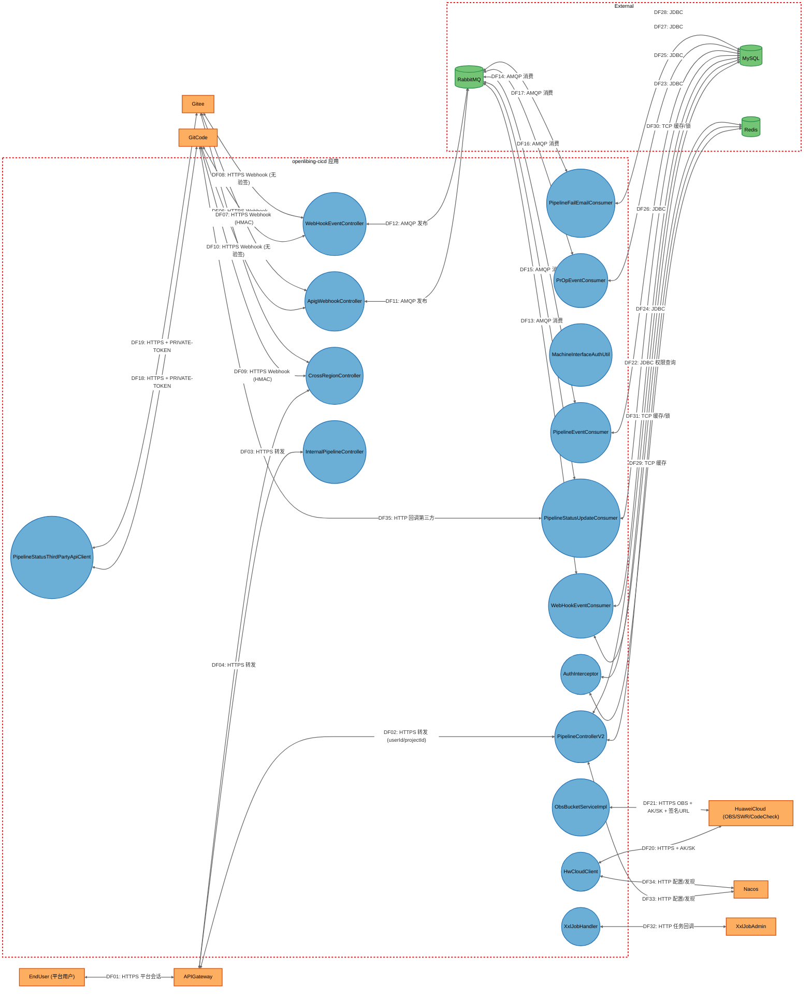
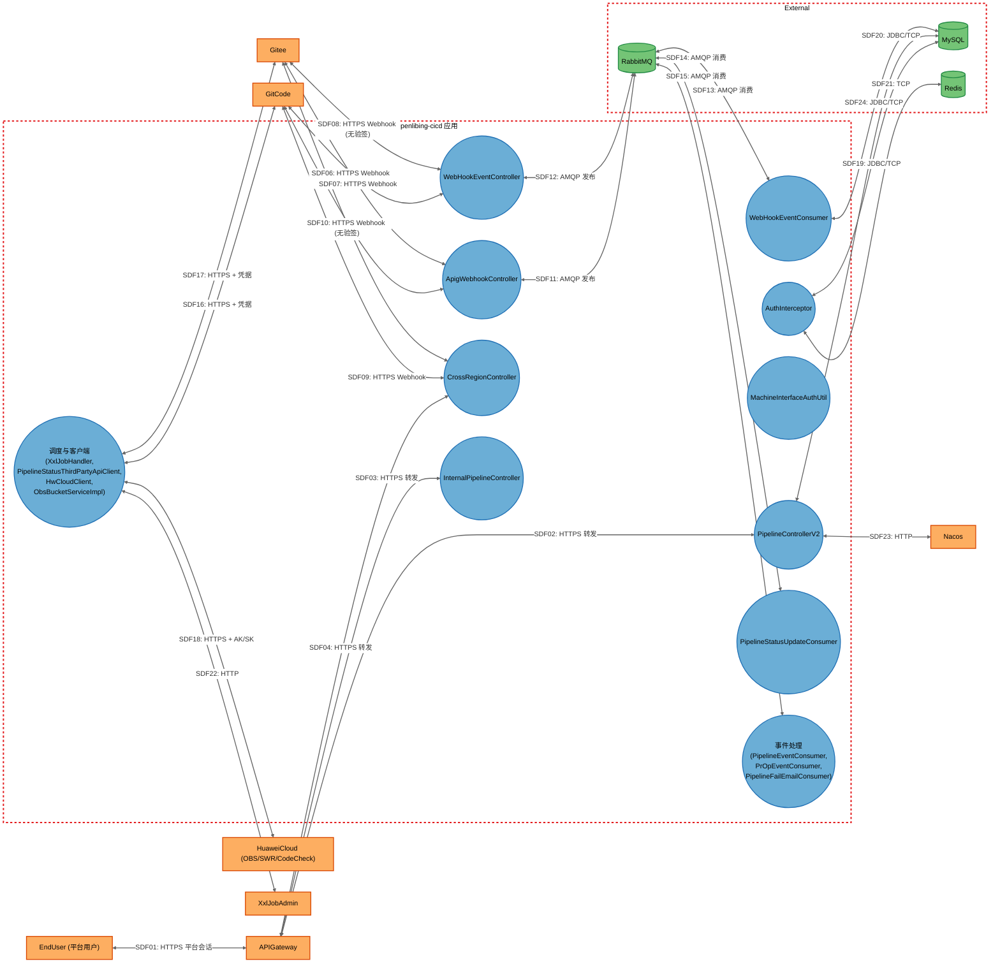

# Threat Model

## Data Flow Diagram

## Element Table

| Element                           | Type                | TMT Category             | Description                                        | Trust Boundary |
| --------------------------------- | ------------------- | ------------------------ | -------------------------------------------------- | -------------- |
| EndUser                           | External Interactor | SE.EI.TMCore.User        | openLiBing 平台用户（含管理员），经 APIG 网关访问  | External       |
| APIGateway                        | External Service    | SE.EI.TMCore.WebSvc      | 华为云 API 网关，平台用户认证与流量接入            | External       |
| GitCode                           | External Service    | SE.EI.TMCore.WebSvc      | 外部代码托管平台，Webhook 发送方 + REST API 被调方 | External       |
| Gitee                             | External Service    | SE.EI.TMCore.WebSvc      | 外部代码托管平台，Webhook 发送方 + REST API 被调方 | External       |
| HuaweiCloud                       | External Service    | SE.EI.TMCore.Megaservice | 华为云后端（OBS/SWR/CodeCheck/构建）               | External       |
| Nacos                             | External Service    | SE.EI.TMCore.WebSvc      | 配置中心与注册中心                                 | External       |
| XxlJobAdmin                       | External Service    | SE.EI.TMCore.WebSvc      | XXL-Job 调度中心                                   | External       |
| RabbitMQ                          | Data Store          | SE.DS.TMCore.NoSQL       | 消息中间件，Webhook 与内部事件队列                 | External       |
| MySQL                             | Data Store          | SE.DS.TMCore.SQL         | 业务数据库                                         | External       |
| Redis                             | Data Store          | SE.DS.TMCore.Cache       | 缓存与分布式锁                                     | External       |
| PipelineControllerV2              | Process             | SE.P.TMCore.WebSvc       | 流水线主 REST 控制器                               | Application    |
| AuthInterceptor                   | Process             | SE.P.TMCore.WebApp       | 授权拦截器                                         | Application    |
| ApigWebhookController             | Process             | SE.P.TMCore.WebSvc       | APIG Webhook 入口（HMAC 验签）                     | Application    |
| WebHookEventController            | Process             | SE.P.TMCore.WebSvc       | 遗留 Webhook 入口                                  | Application    |
| CrossRegionController             | Process             | SE.P.TMCore.WebSvc       | 跨区域/黄蓝协同入口                                | Application    |
| InternalPipelineController        | Process             | SE.P.TMCore.WebSvc       | 内部/机机/华为 APIG 入口（无服务内鉴权）           | Application    |
| MachineInterfaceAuthUtil          | Process             | SE.P.TMCore.WebApp       | Webhook 签名校验核心                               | Application    |
| WebHookEventConsumer              | Process             | SE.P.TMCore.WebApp       | Webhook 事件 MQ 消费者                             | Application    |
| PipelineEventConsumer             | Process             | SE.P.TMCore.WebApp       | 流水线业务事件 MQ 消费者                           | Application    |
| PipelineStatusUpdateConsumer      | Process             | SE.P.TMCore.WebApp       | 流水线状态更新 MQ 消费者                           | Application    |
| PrOpEventConsumer                 | Process             | SE.P.TMCore.WebApp       | PR 异步操作 MQ 消费者                              | Application    |
| PipelineFailEmailConsumer         | Process             | SE.P.TMCore.WebApp       | 失败邮件 MQ 消费者                                 | Application    |
| XxlJobHandler                     | Process             | SE.P.TMCore.WebApp       | XXL-Job 定时任务                                   | Application    |
| PipelineStatusThirdPartyApiClient | Process             | SE.P.TMCore.WebApp       | GitCode/Gitee 三方 API 客户端                      | Application    |
| HwCloudClient                     | Process             | SE.P.TMCore.WebApp       | 华为云客户端                                       | Application    |
| ObsBucketServiceImpl              | Process             | SE.P.TMCore.WebApp       | OBS 对象存储服务                                   | Application    |

## Data Flow Table

| ID   | Source                            | Target                       | Protocol | Description                                            |
| ---- | --------------------------------- | ---------------------------- | -------- | ------------------------------------------------------ |
| DF01 | EndUser                           | APIGateway                   | HTTPS    | 平台会话请求（Cookie token）                           |
| DF02 | APIGateway                        | PipelineControllerV2         | HTTPS    | 转发用户请求（userId/projectId 为参数/请求体）         |
| DF03 | APIGateway                        | InternalPipelineController   | HTTPS    | 转发内部/机机请求                                      |
| DF04 | APIGateway                        | CrossRegionController        | HTTPS    | 转发跨区域请求                                         |
| DF05 | GitCode                           | ApigWebhookController        | HTTPS    | GitCode Webhook 事件（HMAC-SHA256 验签）               |
| DF06 | Gitee                             | ApigWebhookController        | HTTPS    | Gitee Webhook 事件（token+timestamp 验签）             |
| DF07 | GitCode                           | WebHookEventController       | HTTPS    | GitCode Webhook 事件（HMAC 验签）                      |
| DF08 | Gitee                             | WebHookEventController       | HTTPS    | Gitee Webhook 事件（无服务内验签）                     |
| DF09 | GitCode                           | CrossRegionController        | HTTPS    | GitCode hooks（HMAC 验签）                             |
| DF10 | Gitee                             | CrossRegionController        | HTTPS    | Gitee hooks（无服务内验签）                            |
| DF11 | ApigWebhookController             | RabbitMQ                     | AMQP     | 发布 WebHookEvent 到 webhook_event_queue               |
| DF12 | WebHookEventController            | RabbitMQ                     | AMQP     | 发布 WebHookEvent 到 webhook_event_queue               |
| DF13 | RabbitMQ                          | WebHookEventConsumer         | AMQP     | 消费 Webhook 事件并分发 handler                        |
| DF14 | RabbitMQ                          | PipelineEventConsumer        | AMQP     | 消费流水线业务事件                                     |
| DF15 | RabbitMQ                          | PipelineStatusUpdateConsumer | AMQP     | 消费流水线状态更新消息                                 |
| DF16 | RabbitMQ                          | PrOpEventConsumer            | AMQP     | 消费 PR 异步操作消息                                   |
| DF17 | RabbitMQ                          | PipelineFailEmailConsumer    | AMQP     | 消费失败邮件消息                                       |
| DF18 | PipelineStatusThirdPartyApiClient | GitCode                      | HTTPS    | PR 标签/评论/commit status 查询与更新（PRIVATE-TOKEN） |
| DF19 | PipelineStatusThirdPartyApiClient | Gitee                        | HTTPS    | PR 标签/评论查询与更新（PRIVATE-TOKEN）                |
| DF20 | HwCloudClient                     | HuaweiCloud                  | HTTPS    | 华为云 API 调用（AK/SK，部分链路关闭 SSL 校验）        |
| DF21 | ObsBucketServiceImpl              | HuaweiCloud                  | HTTPS    | OBS 对象上传/下载与签名 URL 生成（AK/SK）              |
| DF22 | AuthInterceptor                   | MySQL                        | JDBC     | hasPermission/hasPublicPermission 权限查询             |
| DF23 | PipelineControllerV2              | MySQL                        | JDBC     | 流水线信息 CRUD                                        |
| DF24 | WebHookEventConsumer              | MySQL                        | JDBC     | 流水线/PR 信息读写                                     |
| DF25 | PipelineStatusUpdateConsumer      | MySQL                        | JDBC     | 状态更新写库                                           |
| DF26 | PipelineEventConsumer             | MySQL                        | JDBC     | 业务数据读写                                           |
| DF27 | PrOpEventConsumer                 | MySQL                        | JDBC     | PR 信息读写                                            |
| DF28 | PipelineFailEmailConsumer         | MySQL                        | JDBC     | 收件人/仓信息查询                                      |
| DF29 | AuthInterceptor                   | Redis                        | TCP      | 公开仓判定缓存                                         |
| DF30 | PipelineControllerV2              | Redis                        | TCP      | 缓存与 SETNX 分布式锁                                  |
| DF31 | WebHookEventConsumer              | Redis                        | TCP      | 缓存与分布式锁                                         |
| DF32 | XxlJobHandler                     | XxlJobAdmin                  | HTTP     | 任务注册/心跳/回调                                     |
| DF33 | PipelineControllerV2              | Nacos                        | HTTP     | 配置拉取与服务发现                                     |
| DF34 | HwCloudClient                     | Nacos                        | HTTP     | 配置拉取                                               |
| DF35 | PipelineStatusUpdateConsumer      | GitCode                      | HTTPS    | 回调第三方（token 解密后）                             |

## Trust Boundary Table

| Boundary    | Description                                                    | Contains                                                                                                                                                                                                                                                                                                                                                                          |
| ----------- | -------------------------------------------------------------- | --------------------------------------------------------------------------------------------------------------------------------------------------------------------------------------------------------------------------------------------------------------------------------------------------------------------------------------------------------------------------------- |
| External    | 外部平台、网关与基础设施，与应用进程之间存在网络信任边界       | EndUser, APIGateway, GitCode, Gitee, HuaweiCloud, Nacos, XxlJobAdmin, RabbitMQ, MySQL, Redis                                                                                                                                                                                                                                                                                      |
| Application | openlibing-cicd 单进程应用内部（组件间同进程通信，无网络边界） | PipelineControllerV2, AuthInterceptor, ApigWebhookController, WebHookEventController, CrossRegionController, InternalPipelineController, MachineInterfaceAuthUtil, WebHookEventConsumer, PipelineEventConsumer, PipelineStatusUpdateConsumer, PrOpEventConsumer, PipelineFailEmailConsumer, XxlJobHandler, PipelineStatusThirdPartyApiClient, HwCloudClient, ObsBucketServiceImpl |

## Summary View

## Summary to Detailed Mapping

| Summary Element              | Contains                                                                              | Summary Flows                     | Maps to Detailed Flows                   |
| ---------------------------- | ------------------------------------------------------------------------------------- | --------------------------------- | ---------------------------------------- |
| EndUser                      | EndUser                                                                               | SDF01                             | DF01                                     |
| APIGateway                   | APIGateway                                                                            | SDF02, SDF03, SDF04               | DF02, DF03, DF04                         |
| GitCode                      | GitCode                                                                               | SDF05, SDF07, SDF09, SDF16        | DF05, DF07, DF09, DF18, DF35             |
| Gitee                        | Gitee                                                                                 | SDF06, SDF08, SDF10, SDF17        | DF06, DF08, DF10, DF19                   |
| HuaweiCloud                  | HuaweiCloud                                                                           | SDF18                             | DF20, DF21                               |
| Nacos                        | Nacos                                                                                 | SDF23                             | DF33, DF34                               |
| XxlJobAdmin                  | XxlJobAdmin                                                                           | SDF22                             | DF32                                     |
| RabbitMQ                     | RabbitMQ                                                                              | SDF11, SDF12, SDF13, SDF14, SDF15 | DF11, DF12, DF13, DF14, DF15, DF16, DF17 |
| MySQL                        | MySQL                                                                                 | SDF19, SDF20, SDF24               | DF22, DF23, DF24, DF25, DF26, DF27, DF28 |
| Redis                        | Redis                                                                                 | SDF21                             | DF29, DF30, DF31                         |
| PipelineControllerV2         | PipelineControllerV2                                                                  | SDF02, SDF20                      | DF02, DF23, DF30, DF33                   |
| AuthInterceptor              | AuthInterceptor                                                                       | SDF19, SDF21                      | DF22, DF29                               |
| ApigWebhookController        | ApigWebhookController                                                                 | SDF05, SDF06, SDF11               | DF05, DF06, DF11                         |
| WebHookEventController       | WebHookEventController                                                                | SDF07, SDF08, SDF12               | DF07, DF08, DF12                         |
| CrossRegionController        | CrossRegionController                                                                 | SDF04, SDF09, SDF10               | DF04, DF09, DF10                         |
| InternalPipelineController   | InternalPipelineController                                                            | SDF03                             | DF03                                     |
| MachineInterfaceAuthUtil     | MachineInterfaceAuthUtil                                                              | SDF05, SDF06                      | DF05, DF06                               |
| WebHookEventConsumer         | WebHookEventConsumer                                                                  | SDF13, SDF24                      | DF13, DF24, DF31                         |
| PipelineStatusUpdateConsumer | PipelineStatusUpdateConsumer                                                          | SDF14                             | DF15, DF25, DF35                         |
| EventProcessing              | PipelineEventConsumer, PrOpEventConsumer, PipelineFailEmailConsumer                   | SDF15                             | DF14, DF16, DF17, DF26, DF27, DF28       |
| SchedulingAndClients         | XxlJobHandler, PipelineStatusThirdPartyApiClient, HwCloudClient, ObsBucketServiceImpl | SDF16, SDF17, SDF18, SDF22        | DF18, DF19, DF20, DF21, DF32, DF34       |
