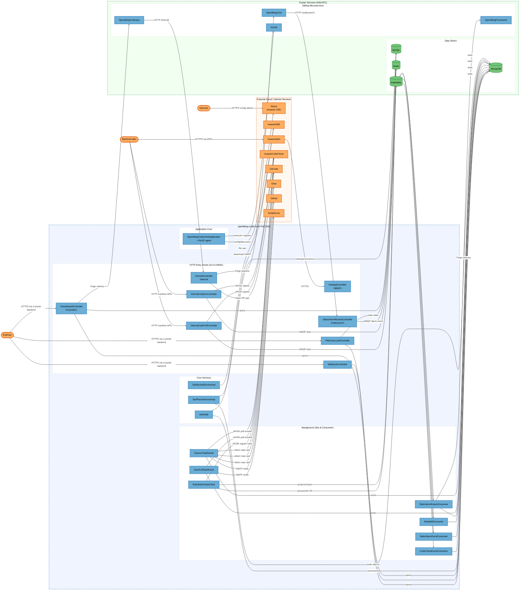

# Architecture Overview

## System Purpose

openlibing-codecheck is the code-inspection microservice of the OpenLibing R&D workflow platform. It orchestrates automated code scanning (full-scan daily tasks and incremental PR gate checks) by delegating scans to Huawei Cloud CodeCheck, receives and parses static-alarm SARIF scan results from the CICD service, manages check rule sets and defect shielding workflows, and exposes board/summary queries and Excel exports to the CI portal. Its users are platform developers (via the ci-portal frontend backend), machine callers (CI systems via the Huawei APIG gateway), and sibling microservices (openlibing-cicd, openlibing-coderepo).

## Key Components

| Component                      | Type                | Description                                                                                                                                                     |
| ------------------------------ | ------------------- | --------------------------------------------------------------------------------------------------------------------------------------------------------------- |
| OpenlibingCodecheckApplication | Process             | Spring Boot main application (bootstrap, Nacos config loading, credential decryption via DataSourceConfig/MongoConfig/RedisConfig, RASP agent host)             |
| HwApigController               | Process             | M2M API endpoints under `/apig/v1/**` for external machine callers via Huawei APIG gateway (task trigger, status query, summary query)                          |
| WebhookController              | Process             | Webhook data query endpoint `/ci-portal/webhook/codecheck/v1/find/by/mongoDB` with input whitelisting via WebhookInputValidator                                 |
| InternalController             | Process             | Service-to-service endpoints under `/internal/**` (pre-commit pipeline trigger, rule-set recompute, full task invoke for openlibing-coderepo)                   |
| StaticAlarmReceiveController   | Process             | Scan result ingestion endpoint `/codescan/v1/result/receive` receiving OBS URLs and pipeline context from the CICD service                                      |
| InternalCodeFullController     | Process             | Full-scan task endpoints under `/ci-portal/webhook/codecheck/full/**` (start full task, query status)                                                           |
| InternalCodeIncController      | Process             | Incremental gate-check endpoints under `/ci-portal/webhook/codecheck/v1/**` (start inc task, query gate status by uuid)                                         |
| FileDownLoadController         | Process             | Excel export endpoints under `/ci-portal/excel/v1/**` (export task to Redis, status query, file download)                                                       |
| CheckboardController           | Process             | Portal board/summary query endpoints under `/ci-portal/v1/**` with per-endpoint permission checks                                                               |
| AuthUtils                      | Process             | Horizontal/vertical permission decision component (repo permission, menu-role checks against MySQL, public-repo assertions)                                     |
| RuleSetScheduleTask            | Process             | Scheduled rule-set synchronization across tenants; uses Redisson locks, Redis task queues, AK/SK credentials from Redis, calls Huawei Cloud CodeCheck rule APIs |
| SaveFullTaskResult             | Process             | Scheduled job polling full-scan task progress/results from Huawei Cloud CodeCheck, saving to MongoDB, sending email notifications                               |
| SaveIncTaskResult              | Process             | Scheduled job polling incremental gate task results, decrypting account tokens, git platform operations, saving results, email notifications                    |
| CodeCheckEventConsumer         | Process             | RabbitMQ consumer processing code-check events (fullcodecheck/inccodecheck queues)                                                                              |
| StaticAlarmEventConsumer       | Process             | RabbitMQ consumer processing static-alarm parse events (static_alarm queue)                                                                                     |
| ShieldAllConsumer              | Process             | RabbitMQ consumer performing bulk defect shielding operations (shield_all queue)                                                                                |
| StaticAlarmExportConsumer      | Process             | RabbitMQ consumer performing alarm export tasks and delivering files via OpenlibingFramework (static_alarm_export queue)                                        |
| SarifParseServiceImpl          | Process             | SARIF scan-result parsing service (CodeQL parser factory), downloads files from OBS, writes parsed alarms to MongoDB                                            |
| ObsBucketServiceImpl           | Process             | Huawei OBS bucket file service (file create/query/update operations for exports and reports)                                                                    |
| MongoDB                        | Data Store          | Document store for check summaries, details, static alarms, webhook events, logs (TLS with hostname verification disabled)                                      |
| MySQL                          | Data Store          | Relational store for users, roles, permissions, projects, repos, branches, pre-commit records (Hikari pool, decrypted password)                                 |
| Redis                          | Data Store          | Cache, Redisson distributed locks, Excel export task state, rule-set task queues, AK/SK credential cache                                                        |
| RabbitMQ                       | Data Store          | Message broker for full/inc code-check tasks, static alarm parse/export events, shield-all batch ops (TLS 5671 in prod)                                         |
| OpenlibingCicd                 | External Service    | CI/CD microservice (Feign `https://openlibing-cicd`) for pipeline triggering; also delivers static-alarm scan results                                           |
| OpenlibingFramework            | External Service    | Framework microservice (Feign `https://openlibing-framework`) used for export file delivery and framework data                                                  |
| OpenlibingCoderepo             | External Service    | Code-repo microservice (Feign `https://openlibing-coderepo` via CodeMetricsFeignClient) for code metrics; calls back `/internal/**` endpoints                   |
| XxlJob                         | External Service    | Distributed job scheduler (xxl-job-admin) for scheduled task dispatch                                                                                           |
| Nacos                          | External Service    | Huawei CSE Nacos config and discovery server (application/framework/cicd/codecheck/xxl-job configs, `security.part1` key)                                       |
| HuaweiOBS                      | External Service    | Huawei Cloud Object Storage holding SARIF scan results and export files                                                                                         |
| HuaweiApiG                     | External Service    | Huawei Cloud API Gateway fronting `/apig/v1/**` M2M APIs with gateway auth, rate limiting, audit                                                                |
| HuaweiCodeCheck                | External Service    | Huawei Cloud CodeCheck service executing actual code scans; accessed via APIG SDK with AK/SK signing                                                            |
| GitCode                        | External Service    | GitCode code-hosting platform API (PR info, comments) via GitCodeHelper with account tokens                                                                     |
| Gitee                          | External Service    | Gitee code-hosting platform API via GiteeHelper; Gitee role data drives AuthUtils permission decisions                                                          |
| Github                         | External Service    | GitHub code-hosting platform API via GithubHelper                                                                                                               |
| SmtpServer                     | External Service    | SMTP email server for task result and audit notifications (EmailUtil)                                                                                           |
| EndUser                        | External Interactor | Platform developer querying boards, triggering scans, exporting reports (via ci-portal backend proxy)                                                           |
| MachineCaller                  | External Interactor | External CI systems / machine clients calling M2M APIs via Huawei APIG or ci-portal machine paths                                                               |
| Operator                       | External Interactor | Platform administrators managing Nacos configs, jobs, and the deployment                                                                                        |

## Component Diagram



## Top Scenarios

### Scenario 1: PR Incremental Gate Check (增量门禁检查)

A PR event on GitCode triggers a gate check. The ci-portal backend (or machine caller) calls `/ci-portal/webhook/codecheck/v1/task`; the service creates an incremental task, delegates the scan to Huawei Cloud CodeCheck with AK/SK, SaveIncTaskResult polls progress and writes the result summary/details to MongoDB, notifies the committer by email, and the CI pipeline queries gate status by `uuid`.

```mermaid
%%{init: {'theme': 'base', 'themeVariables': {
  'background': '#ffffff',
  'actorBkg': '#6baed6', 'actorBorder': '#2171b5', 'actorTextColor': '#000000',
  'signalColor': '#666666', 'signalTextColor': '#666666',
  'noteBkgColor': '#fdae61', 'noteBorderColor': '#d94701', 'noteTextColor': '#000000',
  'activationBkgColor': '#ddeeff', 'activationBorderColor': '#2171b5'
}}}%%
sequenceDiagram
    actor MachineCaller
    participant IncCtrl as InternalCodeIncController
    participant HCC as HuaweiCodeCheck
    participant Redis as Redis
    participant Save as SaveIncTaskResult
    participant Mongo as MongoDB
    participant SMTP as SmtpServer

    MachineCaller->>IncCtrl: POST /ci-portal/webhook/codecheck/v1/task (repoUrl, uuid)
    activate IncCtrl
    Note over IncCtrl: No code-level auth; trusts caller
    IncCtrl->>Redis: read AK/SK (AkSkVo)
    IncCtrl->>HCC: create incremental check task (AK/SK signed)
    HCC-->>IncCtrl: taskId
    IncCtrl->>Mongo: persist task record (uuid, taskId)
    IncCtrl-->>MachineCaller: task accepted
    deactivate IncCtrl
    Save->>Redis: poll pending tasks (Redisson lock)
    Save->>HCC: getTaskProgress / getTaskSummary / getTaskDetails (AK/SK)
    HCC-->>Save: progress + results
    Save->>Mongo: write result summary/details
    Save->>SMTP: send result email to committer
    MachineCaller->>IncCtrl: POST /task/status (uuid)
    IncCtrl->>Mongo: query gate result by uuid
    IncCtrl-->>MachineCaller: gate status + result path
```

### Scenario 2: Full Scan Task via APIG (全量扫描任务)

An external machine caller invokes `POST /apig/v1/ci-portal/webhook/codecheck/full/task` through the Huawei APIG gateway. After gateway authentication, the service starts a full-scan task for the given `repoUrl`, delegates execution to Huawei Cloud CodeCheck, publishes task events to RabbitMQ, and SaveFullTaskResult polls results and stores them in MongoDB with email notification.

```mermaid
%%{init: {'theme': 'base', 'themeVariables': {
  'background': '#ffffff',
  'actorBkg': '#6baed6', 'actorBorder': '#2171b5', 'actorTextColor': '#000000',
  'signalColor': '#666666', 'signalTextColor': '#666666',
  'noteBkgColor': '#fdae61', 'noteBorderColor': '#d94701', 'noteTextColor': '#000000',
  'activationBkgColor': '#ddeeff', 'activationBorderColor': '#2171b5'
}}}%%
sequenceDiagram
    actor MachineCaller
    participant APIG as HuaweiApiG
    participant ApigCtrl as HwApigController
    participant FullCtrl as InternalCodeFullController
    participant HCC as HuaweiCodeCheck
    participant MQ as RabbitMQ
    participant Consumer as CodeCheckEventConsumer
    participant Save as SaveFullTaskResult
    participant Mongo as MongoDB

    MachineCaller->>APIG: POST /apig/v1/ci-portal/webhook/codecheck/full/task
    activate APIG
    Note over APIG: Gateway auth (AppCode), rate limiting, audit
    APIG->>ApigCtrl: forward (HTTPS, in-cluster)
    deactivate APIG
    activate ApigCtrl
    Note over ApigCtrl: logs params; no code-level auth
    ApigCtrl->>FullCtrl: startFullTask(repoUrl, params)
    FullCtrl->>HCC: create full check task (AK/SK signed)
    HCC-->>FullCtrl: taskId
    FullCtrl->>MQ: publish fullcodecheck task event
    FullCtrl->>Mongo: persist task record
    ApigCtrl-->>MachineCaller: task started
    deactivate ApigCtrl
    MQ->>Consumer: consume task event
    Consumer->>Mongo: update task state
    Save->>HCC: poll task progress/results (AK/SK)
    HCC-->>Save: results
    Save->>Mongo: write summary/details
```

### Scenario 3: Static Alarm Scan Result Ingestion and SARIF Parsing (静态告警接收与解析)

The CICD service completes a static scan and calls `POST /codescan/v1/result/receive` with an OBS URL and pipeline context. The service records the receive, publishes a parse event to RabbitMQ; StaticAlarmEventConsumer triggers SarifParseServiceImpl which downloads the SARIF from OBS, parses it (CodeQL parser), and writes normalized alarms to MongoDB (Liquibase-managed collections).

```mermaid
%%{init: {'theme': 'base', 'themeVariables': {
  'background': '#ffffff',
  'actorBkg': '#6baed6', 'actorBorder': '#2171b5', 'actorTextColor': '#000000',
  'signalColor': '#666666', 'signalTextColor': '#666666',
  'noteBkgColor': '#fdae61', 'noteBorderColor': '#d94701', 'noteTextColor': '#000000',
  'activationBkgColor': '#ddeeff', 'activationBorderColor': '#2171b5'
}}}%%
sequenceDiagram
    participant Cicd as OpenlibingCicd
    participant Recv as StaticAlarmReceiveController
    participant MQ as RabbitMQ
    participant Consumer as StaticAlarmEventConsumer
    participant Parser as SarifParseServiceImpl
    participant OBS as HuaweiOBS
    participant Mongo as MongoDB

    Cicd->>Recv: POST /codescan/v1/result/receive (obsUrl, pipeline ctx)
    activate Recv
    Note over Recv: No code-level auth; trusts in-cluster caller
    Recv->>Mongo: insert scan run record
    Recv->>MQ: publish static_alarm parse event
    Recv-->>Cicd: scanRecordId
    deactivate Recv
    MQ->>Consumer: consume parse event
    Consumer->>Parser: parse(scanRecord)
    activate Parser
    Parser->>OBS: download SARIF file (obsUrl)
    OBS-->>Parser: SARIF content
    Note over Parser: CodeQlSarifParser via SarifParserFactory
    Parser->>Mongo: write parsed alarm issues/instances
    deactivate Parser
```

### Scenario 4: Tenant Rule Set Scheduled Sync (规则集定时同步)

RuleSetScheduleTask runs daily (cron 01:20). Under Redisson distributed locks it reads tenant/project/repo data from MySQL, pulls per-tenant rule sets from Huawei Cloud CodeCheck using AK/SK credentials cached in Redis, and updates rule set tables; task state and queues are tracked in Redis.

### Scenario 5: Excel Report Export (报表导出)

EndUser requests an export via the ci-portal backend; FileDownLoadController enqueues the Excel task with state in Redis, queries defect/alarm data from MongoDB, generates the workbook, and returns the file; large alarm exports run asynchronously through StaticAlarmExportConsumer which delivers files via OpenlibingFramework/OBS.

## Technology Stack

| Layer          | Technologies                                                                                                                                                                                                                                                                |
| -------------- | --------------------------------------------------------------------------------------------------------------------------------------------------------------------------------------------------------------------------------------------------------------------------- |
| Languages      | Java 21                                                                                                                                                                                                                                                                     |
| Frameworks     | Spring Boot 3.4.6, Spring Cloud (Nacos discovery/config), OpenFeign, Spring AMQP, MyBatis, Liquibase, Redisson, FastJSON2, Jackson, Apache HttpClient, Swagger/OpenAPI                                                                                                      |
| Data Stores    | MongoDB (TLS), MySQL (HikariCP), Redis, RabbitMQ (AMQP/AMQPS), Huawei OBS                                                                                                                                                                                                   |
| Infrastructure | Docker (openEuler 24.03 LTS, non-root user), Kubernetes (Huawei CCE), Nacos (Huawei CSE), XXL-Job, Huawei APIG                                                                                                                                                              |
| Security       | AES credential encryption (SecurityUtil/SecurityHelper, `security.part1` key), WebhookInputValidator, CommandArgSanitizer, RASP agent (rasp.tgz), ServiceComb TLS keystores (tcpFile.ks/tcsFile.ks/tcwFile.ks), container hardening (umask 077, SSH lockdown, tool removal) |

## Deployment Model

The service is packaged as a Docker image (openEuler 24.03, non-root `openlibing` user, RASP agent, JRE 21, pre-commit tooling) and deployed as a Kubernetes workload (Huawei CCE) behind a ClusterIP Service on port 8091 (all HTTP controllers share this listener; bind address 0.0.0.0). External M2M traffic reaches `/apig/v1/**` only through the Huawei APIG gateway, which performs gateway authentication, rate limiting, and audit; portal traffic reaches `/ci-portal/**`, `/codescan/v1/**`, and `/internal/**` paths only from inside the cluster (ci-portal backend, openlibing-cicd, openlibing-coderepo). Configuration and discovery come from Huawei CSE Nacos (`application`, `framework`, `cicd`, `codecheck`, `xxl-job` configs; group OPENLIBING, namespaces openlibing-beta/openlibing-prod). Backing stores (MongoDB, MySQL, Redis, RabbitMQ) and sibling microservices are reached over the cluster/VPC network; Huawei Cloud services (CodeCheck, OBS, APIG, CSE) are reached over HTTPS to public cloud endpoints. RabbitMQ uses TLS port 5671 in prod (5672 elsewhere).

**Deployment Classification:** `K8S_SERVICE`

### Component Exposure Table

| Component                      | Listens On                                          | Auth Required                             | Reachability              | Min Prerequisite   | Derived Tier |
| ------------------------------ | --------------------------------------------------- | ----------------------------------------- | ------------------------- | ------------------ | ------------ |
| OpenlibingCodecheckApplication | N/A — bootstrap (hosts all controllers)             | No                                        | No Listener               | Host/OS Access     | T3           |
| HwApigController               | 0.0.0.0:8091 (/apig/v1/**)                          | No (relies on HuaweiApiG gateway auth)    | External (via HuaweiApiG) | Authenticated User | T2           |
| WebhookController              | 0.0.0.0:8091 (/ci-portal/webhook/codecheck/v1/**)   | No                                        | Internal Only             | Internal Network   | T2           |
| InternalController             | 0.0.0.0:8091 (/internal/**)                         | No (service-to-service trust)             | Internal Only             | Internal Network   | T2           |
| StaticAlarmReceiveController   | 0.0.0.0:8091 (/codescan/v1/**)                      | No                                        | Internal Only             | Internal Network   | T2           |
| InternalCodeFullController     | 0.0.0.0:8091 (/ci-portal/webhook/codecheck/full/**) | No                                        | Internal Only             | Internal Network   | T2           |
| InternalCodeIncController      | 0.0.0.0:8091 (/ci-portal/webhook/codecheck/v1/**)   | No                                        | Internal Only             | Internal Network   | T2           |
| FileDownLoadController         | 0.0.0.0:8091 (/ci-portal/excel/v1/**)               | No (per-endpoint AuthUtils on some paths) | Internal Only             | Internal Network   | T2           |
| CheckboardController           | 0.0.0.0:8091 (/ci-portal/v1/**)                     | No (per-endpoint AuthUtils)               | Internal Only             | Internal Network   | T2           |
| AuthUtils                      | N/A — in-process permission checker                 | N/A                                       | No Listener               | Authenticated User | T2           |
| RuleSetScheduleTask            | N/A — @Scheduled cron                               | N/A                                       | No Listener               | Internal Network   | T2           |
| SaveFullTaskResult             | N/A — @Scheduled polling                            | N/A                                       | No Listener               | Internal Network   | T2           |
| SaveIncTaskResult              | N/A — @Scheduled polling                            | N/A                                       | No Listener               | Internal Network   | T2           |
| CodeCheckEventConsumer         | N/A — RabbitMQ consumer                             | N/A                                       | No Listener               | Internal Network   | T2           |
| StaticAlarmEventConsumer       | N/A — RabbitMQ consumer                             | N/A                                       | No Listener               | Internal Network   | T2           |
| ShieldAllConsumer              | N/A — RabbitMQ consumer                             | N/A                                       | No Listener               | Internal Network   | T2           |
| StaticAlarmExportConsumer      | N/A — RabbitMQ consumer                             | N/A                                       | No Listener               | Internal Network   | T2           |
| SarifParseServiceImpl          | N/A — in-process service                            | N/A                                       | No Listener               | Internal Network   | T2           |
| ObsBucketServiceImpl           | N/A — in-process service                            | N/A                                       | No Listener               | Internal Network   | T2           |
| MongoDB                        | N/A — external datastore (inbound from app)         | Yes (decrypted credentials)               | Internal Only             | Internal Network   | T2           |
| MySQL                          | N/A — external datastore (inbound from app)         | Yes (decrypted credentials)               | Internal Only             | Internal Network   | T2           |
| Redis                          | N/A — external datastore (inbound from app)         | Unknown (config in Nacos)                 | Internal Only             | Internal Network   | T2           |
| RabbitMQ                       | N/A — external broker (inbound from app)            | Yes (credentials from Nacos)              | Internal Only             | Internal Network   | T2           |
| OpenlibingCicd                 | N/A — outbound Feign (HTTPS)                        | N/A                                       | No Listener               | Internal Network   | T2           |
| OpenlibingFramework            | N/A — outbound Feign (HTTPS)                        | N/A                                       | No Listener               | Internal Network   | T2           |
| OpenlibingCoderepo             | N/A — outbound Feign (HTTPS)                        | N/A                                       | No Listener               | Internal Network   | T2           |
| XxlJob                         | N/A — outbound registration                         | N/A                                       | No Listener               | Internal Network   | T2           |
| Nacos                          | N/A — outbound config/discovery                     | N/A                                       | No Listener               | Admin Credentials  | T3           |
| HuaweiOBS                      | N/A — outbound HTTPS                                | N/A                                       | No Listener               | Admin Credentials  | T3           |
| HuaweiApiG                     | N/A — inbound gateway (external)                    | Yes (AppCode, externally managed)         | External                  | Admin Credentials  | T3           |
| HuaweiCodeCheck                | N/A — outbound APIG SDK (AK/SK signed)              | N/A                                       | No Listener               | Admin Credentials  | T3           |
| GitCode                        | N/A — outbound HTTPS (account token)                | N/A                                       | No Listener               | Admin Credentials  | T3           |
| Gitee                          | N/A — outbound HTTPS (account token)                | N/A                                       | No Listener               | Admin Credentials  | T3           |
| Github                         | N/A — outbound HTTPS (account token)                | N/A                                       | No Listener               | Admin Credentials  | T3           |
| SmtpServer                     | N/A — outbound SMTP                                 | N/A                                       | No Listener               | Admin Credentials  | T3           |
| EndUser                        | N/A — human (via ci-portal backend proxy)           | Yes (portal SSO, external to this repo)   | External                  | Authenticated User | T2           |
| MachineCaller                  | N/A — external system (via HuaweiApiG)              | Yes (APIG credentials)                    | External                  | Authenticated User | T2           |
| Operator                       | N/A — human admin                                   | Yes (admin credentials)                   | External                  | Privileged User    | T2           |

## Security Infrastructure Inventory

| Component                     | Security Role                                                         | Configuration                                                         | Notes                                                                                                  |
| ----------------------------- | --------------------------------------------------------------------- | --------------------------------------------------------------------- | ------------------------------------------------------------------------------------------------------ |
| WebhookInputValidator         | Input whitelisting for MongoDB queries                                | `common/security/WebhookInputValidator.java`                          | Whitelists allowed collections/fields for `readMongoDB`, blocks arbitrary NoSQL queries                |
| CommandArgSanitizer           | repoUrl sanitization                                                  | `common/security/CommandArgSanitizer.java`                            | F-002 defense: rejects malformed repoUrl before processing (InternalController.preCommitCheck)         |
| SecurityHelper / SecurityUtil | AES encryption/decryption of datastore credentials and account tokens | `security.part1` key from Nacos config                                | Key and ciphertexts co-located in the same Nacos namespace; decrypted MySQL/Mongo passwords at startup |
| AuthUtils                     | Horizontal/vertical authorization                                     | `common/utils/codecheck/AuthUtils.java`                               | Repo-permission and menu-role checks; called per-endpoint, not via a filter chain                      |
| GlobalExceptionHandler        | Centralized error handling                                            | `common/exception/GlobalExceptionHandler.java`                        | Bounds exception leakage to clients                                                                    |
| HuaweiApiG gateway            | External auth, rate limiting, audit for `/apig/v1/**`                 | Externally managed (Huawei Cloud)                                     | Code itself performs no authentication on M2M endpoints                                                |
| Docker hardening              | Container baseline                                                    | `Dockerfile`                                                          | Non-root user, umask 077, history disabled, SSH lockdown, compiler/debugger removal, RASP agent        |
| RASP agent                    | Runtime application self-protection                                   | `rasp.tgz` unpacked at `/opt/app/openlibing/rasp`                     | JVM-level runtime protection                                                                           |
| ServiceComb TLS keystores     | Service TLS                                                           | `tcpFile.ks`, `tcsFile.ks`, `tcwFile.ks`, `openlibing.pfx`, `cacerts` | Keystore files baked into image; secrets management via image                                          |
| Redisson distributed locks    | Task deduplication/locking                                            | `RuleSetScheduleTask` lock keys                                       | Prevents concurrent duplicate scheduled runs, not an auth control                                      |
| Liquibase changelogs          | Schema governance                                                     | `db/changelog/**`                                                     | MongoDB index/backfill changes tracked in repo                                                         |

## Repository Structure

| Directory                                               | Purpose                                                                          |
| ------------------------------------------------------- | -------------------------------------------------------------------------------- |
| `src/main/java/.../business/controller/`                | REST entry points (portal, machine API, APIG, internal, alarm)                   |
| `src/main/java/.../business/delegate/`                  | Feign clients (openlibing-cicd/framework/coderepo) and delegate interfaces       |
| `src/main/java/.../business/impl/`                      | Delegate/service implementations (task creation, exports, webhook queries)       |
| `src/main/java/.../business/operation/`                 | Business operations (summaries, shields, notifications, schedules)               |
| `src/main/java/.../business/service/`                   | Consumers, producers, SARIF parser, OBS service                                  |
| `src/main/java/.../business/schedule/`                  | Scheduled tasks (rule sync, result saving)                                       |
| `src/main/java/.../common/config/`                      | DataSource/Mongo/Redis/RabbitMQ/thread configs, Liquibase                        |
| `src/main/java/.../common/security/`                    | WebhookInputValidator, CommandArgSanitizer                                       |
| `src/main/java/.../common/utils/`                       | AuthUtils, SecurityHelper, RestCodeCheckUtil, EmailUtil, RedisHelper, TokenUtil  |
| `src/main/java/.../common/codeplate/`                   | GitCode/Gitee/GitHub platform adapters and helpers                               |
| `src/main/resources/`                                   | application*.yaml profiles, MyBatis mappers, Liquibase changelogs, log4j2 config |
| `Dockerfile`, `start.sh`, `entrypoint.sh`, `monitor.sh` | Container build and runtime (hardening, RASP, JRE)                               |
