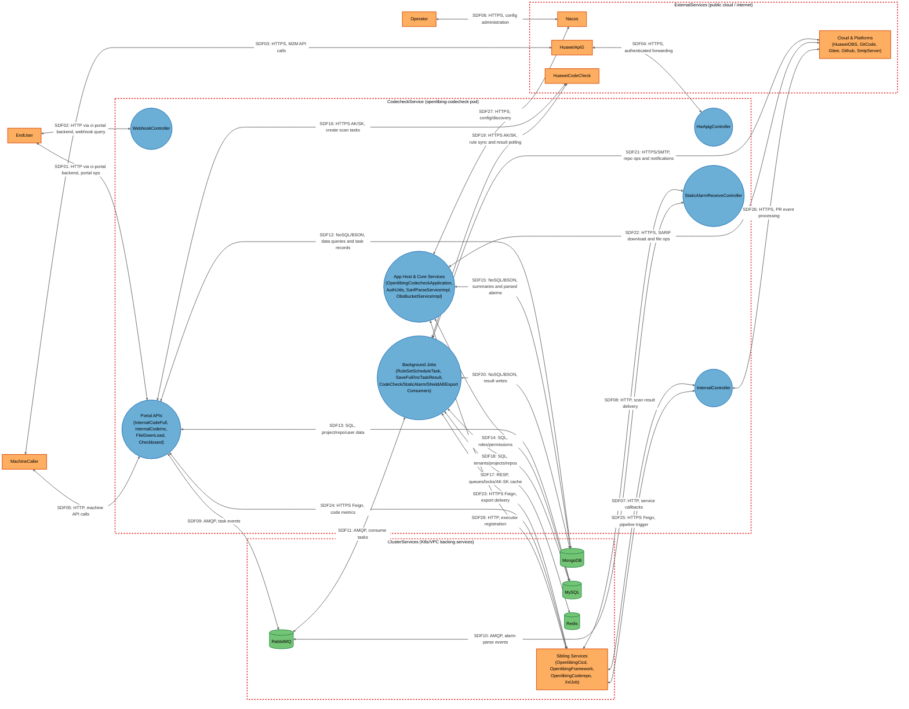

# Threat Model

## Data Flow Diagram

```mermaid
%%{init: {'theme': 'base', 'themeVariables': { 'background': '#ffffff', 'primaryColor': '#ffffff', 'lineColor': '#666666' }}}%%
flowchart LR
    classDef process fill:#6baed6,stroke:#2171b5,stroke-width:2px,color:#000000
    classDef external fill:#fdae61,stroke:#d94701,stroke-width:2px,color:#000000
    classDef datastore fill:#74c476,stroke:#238b45,stroke-width:2px,color:#000000

    EndUser["EndUser"]:::external
    MachineCaller["MachineCaller"]:::external
    Operator["Operator"]:::external

    subgraph CodecheckService["CodecheckService (openlibing-codecheck pod)"]
        OpenlibingCodecheckApplication(("OpenlibingCodecheckApplication")):::process
        HwApigController(("HwApigController")):::process
        WebhookController(("WebhookController")):::process
        InternalController(("InternalController")):::process
        StaticAlarmReceiveController(("StaticAlarmReceiveController")):::process
        InternalCodeFullController(("InternalCodeFullController")):::process
        InternalCodeIncController(("InternalCodeIncController")):::process
        FileDownLoadController(("FileDownLoadController")):::process
        CheckboardController(("CheckboardController")):::process
        AuthUtils(("AuthUtils")):::process
        RuleSetScheduleTask(("RuleSetScheduleTask")):::process
        SaveFullTaskResult(("SaveFullTaskResult")):::process
        SaveIncTaskResult(("SaveIncTaskResult")):::process
        CodeCheckEventConsumer(("CodeCheckEventConsumer")):::process
        StaticAlarmEventConsumer(("StaticAlarmEventConsumer")):::process
        ShieldAllConsumer(("ShieldAllConsumer")):::process
        StaticAlarmExportConsumer(("StaticAlarmExportConsumer")):::process
        SarifParseServiceImpl(("SarifParseServiceImpl")):::process
        ObsBucketServiceImpl(("ObsBucketServiceImpl")):::process
    end

    subgraph ClusterServices["ClusterServices (K8s/VPC backing services)"]
        MongoDB[("MongoDB")]:::datastore
        MySQL[("MySQL")]:::datastore
        Redis[("Redis")]:::datastore
        RabbitMQ[("RabbitMQ")]:::datastore
        OpenlibingCicd["OpenlibingCicd"]:::external
        OpenlibingFramework["OpenlibingFramework"]:::external
        OpenlibingCoderepo["OpenlibingCoderepo"]:::external
        XxlJob["XxlJob"]:::external
    end

    subgraph ExternalServices["ExternalServices (public cloud / internet)"]
        Nacos["Nacos"]:::external
        HuaweiOBS["HuaweiOBS"]:::external
        HuaweiApiG["HuaweiApiG"]:::external
        HuaweiCodeCheck["HuaweiCodeCheck"]:::external
        GitCode["GitCode"]:::external
        Gitee["Gitee"]:::external
        Github["Github"]:::external
        SmtpServer["SmtpServer"]:::external
    end

    EndUser <-->|"DF01: HTTP via ci-portal backend, webhook data query"| WebhookController
    EndUser <-->|"DF02: HTTP via ci-portal backend, board queries"| CheckboardController
    EndUser <-->|"DF03: HTTP via ci-portal backend, Excel export"| FileDownLoadController
    EndUser <-->|"DF04: HTTP via ci-portal backend, full task ops"| InternalCodeFullController
    EndUser <-->|"DF05: HTTP via ci-portal backend, gate ops"| InternalCodeIncController
    MachineCaller <-->|"DF06: HTTPS, M2M API calls"| HuaweiApiG
    HuaweiApiG <-->|"DF07: HTTPS, authenticated forwarding"| HwApigController
    MachineCaller <-->|"DF08: HTTP, machine API task trigger"| InternalCodeFullController
    MachineCaller <-->|"DF09: HTTP, machine API gate calls"| InternalCodeIncController
    Operator <-->|"DF10: HTTPS, config administration"| Nacos
    OpenlibingCoderepo <-->|"DF11: HTTP, rule-set recompute and full task invoke callbacks"| InternalController
    OpenlibingCicd <-->|"DF12: HTTP, scan result delivery"| StaticAlarmReceiveController
    InternalCodeFullController <-->|"DF13: AMQP, publish full task events"| RabbitMQ
    InternalCodeIncController <-->|"DF14: AMQP, publish inc task events"| RabbitMQ
    StaticAlarmReceiveController <-->|"DF15: AMQP, publish alarm parse events"| RabbitMQ
    RabbitMQ <-->|"DF16: AMQP, consume check events"| CodeCheckEventConsumer
    RabbitMQ <-->|"DF17: AMQP, consume alarm parse events"| StaticAlarmEventConsumer
    RabbitMQ <-->|"DF18: AMQP, consume shield-all tasks"| ShieldAllConsumer
    RabbitMQ <-->|"DF19: AMQP, consume export tasks"| StaticAlarmExportConsumer
    WebhookController <-->|"DF20: NoSQL/BSON, whitelisted queries"| MongoDB
    CheckboardController <-->|"DF21: NoSQL/BSON, summary and detail queries"| MongoDB
    CheckboardController <-->|"DF22: SQL, project/repo/user data"| MySQL
    CheckboardController <-->|"DF23: HTTPS Feign, code metrics"| OpenlibingCoderepo
    FileDownLoadController <-->|"DF24: NoSQL/BSON, export data queries"| MongoDB
    FileDownLoadController <-->|"DF25: RESP, Excel task state"| Redis
    InternalCodeFullController <-->|"DF26: NoSQL/BSON, task records"| MongoDB
    InternalCodeFullController <-->|"DF27: HTTPS AK/SK, create full scan task"| HuaweiCodeCheck
    InternalCodeIncController <-->|"DF28: NoSQL/BSON, task records"| MongoDB
    InternalCodeIncController <-->|"DF29: HTTPS AK/SK, create inc task"| HuaweiCodeCheck
    AuthUtils <-->|"DF30: SQL, roles/permissions/menus"| MySQL
    AuthUtils <-->|"DF31: NoSQL/BSON, summaries for permission checks"| MongoDB
    CodeCheckEventConsumer <-->|"DF32: NoSQL/BSON, task state writes"| MongoDB
    StaticAlarmEventConsumer <-->|"DF33: NoSQL/BSON, alarm writes"| MongoDB
    ShieldAllConsumer <-->|"DF34: NoSQL/BSON, bulk shield writes"| MongoDB
    StaticAlarmExportConsumer <-->|"DF35: NoSQL/BSON, export data reads"| MongoDB
    StaticAlarmExportConsumer <-->|"DF36: HTTPS Feign, export file delivery"| OpenlibingFramework
    RuleSetScheduleTask <-->|"DF37: RESP, task queues, locks, AK/SK cache"| Redis
    RuleSetScheduleTask <-->|"DF38: SQL, tenants/projects/repos"| MySQL
    RuleSetScheduleTask <-->|"DF39: HTTPS AK/SK, rule set sync"| HuaweiCodeCheck
    SaveFullTaskResult <-->|"DF40: NoSQL/BSON, result writes"| MongoDB
    SaveFullTaskResult <-->|"DF41: HTTPS AK/SK, poll progress/results"| HuaweiCodeCheck
    SaveFullTaskResult <-->|"DF42: SMTP, result notifications"| SmtpServer
    SaveIncTaskResult <-->|"DF43: NoSQL/BSON, result writes"| MongoDB
    SaveIncTaskResult <-->|"DF44: HTTPS AK/SK, poll results"| HuaweiCodeCheck
    SaveIncTaskResult <-->|"DF45: HTTPS, token-based repo/PR ops"| GitCode
    SaveIncTaskResult <-->|"DF46: HTTPS, token-based repo/PR ops"| Gitee
    SaveIncTaskResult <-->|"DF47: HTTPS, token-based repo/PR ops"| Github
    SaveIncTaskResult <-->|"DF48: SMTP, result notifications"| SmtpServer
    SarifParseServiceImpl <-->|"DF49: HTTPS, SARIF download"| HuaweiOBS
    SarifParseServiceImpl <-->|"DF50: NoSQL/BSON, parsed alarm writes"| MongoDB
    ObsBucketServiceImpl <-->|"DF51: HTTPS, file ops"| HuaweiOBS
    OpenlibingCodecheckApplication <-->|"DF52: HTTPS, config fetch and discovery"| Nacos
    OpenlibingCodecheckApplication <-->|"DF53: HTTP, executor registration"| XxlJob
    InternalController <-->|"DF54: HTTPS Feign, pipeline trigger"| OpenlibingCicd
    InternalController <-->|"DF55: HTTPS, PR event processing with token"| GitCode

    style CodecheckService fill:none,stroke:#e31a1c,stroke-width:3px,stroke-dasharray: 5 5
    style ClusterServices fill:none,stroke:#e31a1c,stroke-width:3px,stroke-dasharray: 5 5
    style ExternalServices fill:none,stroke:#e31a1c,stroke-width:3px,stroke-dasharray: 5 5

    linkStyle default stroke:#666666,stroke-width:2px
```

## Element Table

| Element                        | Type                | TMT Category        | Description                                                                                                                                      | Trust Boundary   |
| ------------------------------ | ------------------- | ------------------- | ------------------------------------------------------------------------------------------------------------------------------------------------ | ---------------- |
| EndUser                        | External Interactor | SE.EI.TMCore.User   | Platform developer using the CI portal (proxied by ci-portal backend)                                                                            | ExternalServices |
| MachineCaller                  | External Interactor | SE.EI.TMCore.WebSvc | External CI system / machine client calling M2M APIs via HuaweiApiG or ci-portal machine paths                                                   | ExternalServices |
| Operator                       | External Interactor | SE.EI.TMCore.User   | Platform administrator managing Nacos configs, jobs, and the deployment                                                                          | ExternalServices |
| OpenlibingCodecheckApplication | Process             | SE.P.TMCore.NonMS   | Spring Boot main application: bootstrap, Nacos config loading, credential decryption (DataSourceConfig/MongoConfig/RedisConfig), RASP agent host | CodecheckService |
| HwApigController               | Process             | SE.P.TMCore.WebSvc  | M2M endpoints under `/apig/v1/**` fronted by HuaweiApiG                                                                                          | CodecheckService |
| WebhookController              | Process             | SE.P.TMCore.WebSvc  | Webhook MongoDB query endpoint with WebhookInputValidator whitelisting                                                                           | CodecheckService |
| InternalController             | Process             | SE.P.TMCore.WebSvc  | Service-to-service endpoints under `/internal/**` (pre-commit, rule-set recompute, full task invoke)                                             | CodecheckService |
| StaticAlarmReceiveController   | Process             | SE.P.TMCore.WebSvc  | Scan result ingestion endpoint `/codescan/v1/result/receive`                                                                                     | CodecheckService |
| InternalCodeFullController     | Process             | SE.P.TMCore.WebSvc  | Full-scan task endpoints under `/ci-portal/webhook/codecheck/full/**`                                                                            | CodecheckService |
| InternalCodeIncController      | Process             | SE.P.TMCore.WebSvc  | Incremental gate endpoints under `/ci-portal/webhook/codecheck/v1/**`                                                                            | CodecheckService |
| FileDownLoadController         | Process             | SE.P.TMCore.WebSvc  | Excel export endpoints under `/ci-portal/excel/v1/**`                                                                                            | CodecheckService |
| CheckboardController           | Process             | SE.P.TMCore.WebSvc  | Portal board/summary query endpoints under `/ci-portal/v1/**`                                                                                    | CodecheckService |
| AuthUtils                      | Process             | SE.P.TMCore.NonMS   | Horizontal/vertical permission decision component (repo, menu-role checks)                                                                       | CodecheckService |
| RuleSetScheduleTask            | Process             | SE.P.TMCore.NonMS   | Scheduled tenant rule-set sync with Redisson locks, Redis queues, AK/SK                                                                          | CodecheckService |
| SaveFullTaskResult             | Process             | SE.P.TMCore.NonMS   | Scheduled job polling full-scan results from HuaweiCodeCheck, MongoDB writes, email                                                              | CodecheckService |
| SaveIncTaskResult              | Process             | SE.P.TMCore.NonMS   | Scheduled job polling inc results, decrypting account tokens, git platform ops, email                                                            | CodecheckService |
| CodeCheckEventConsumer         | Process             | SE.P.TMCore.NonMS   | RabbitMQ consumer for full/inc code-check events                                                                                                 | CodecheckService |
| StaticAlarmEventConsumer       | Process             | SE.P.TMCore.NonMS   | RabbitMQ consumer for static-alarm parse events                                                                                                  | CodecheckService |
| ShieldAllConsumer              | Process             | SE.P.TMCore.NonMS   | RabbitMQ consumer for bulk defect shielding                                                                                                      | CodecheckService |
| StaticAlarmExportConsumer      | Process             | SE.P.TMCore.NonMS   | RabbitMQ consumer for alarm export tasks                                                                                                         | CodecheckService |
| SarifParseServiceImpl          | Process             | SE.P.TMCore.NonMS   | SARIF parsing service (CodeQL parser), OBS download, MongoDB writes                                                                              | CodecheckService |
| ObsBucketServiceImpl           | Process             | SE.P.TMCore.NonMS   | Huawei OBS bucket file service                                                                                                                   | CodecheckService |
| MongoDB                        | Data Store          | SE.DS.TMCore.NoSQL  | Document store for summaries, details, alarms, webhook events, logs                                                                              | ClusterServices  |
| MySQL                          | Data Store          | SE.DS.TMCore.SQL    | Relational store for users, roles, permissions, projects, repos                                                                                  | ClusterServices  |
| Redis                          | Data Store          | SE.DS.TMCore.Cache  | Cache, Redisson locks, Excel task state, rule-set queues, AK/SK cache                                                                            | ClusterServices  |
| RabbitMQ                       | Data Store          | SE.DS.TMCore.NoSQL  | Message broker for check tasks, alarm parse/export, shield-all                                                                                   | ClusterServices  |
| OpenlibingCicd                 | External Service    | SE.EI.TMCore.WebSvc | CI/CD microservice (Feign HTTPS); delivers scan results                                                                                          | ClusterServices  |
| OpenlibingFramework            | External Service    | SE.EI.TMCore.WebSvc | Framework microservice (Feign HTTPS); export delivery                                                                                            | ClusterServices  |
| OpenlibingCoderepo             | External Service    | SE.EI.TMCore.WebSvc | Code-repo microservice (metrics Feign); calls back `/internal/**`                                                                                | ClusterServices  |
| XxlJob                         | External Service    | SE.EI.TMCore.WebSvc | Distributed job scheduler                                                                                                                        | ClusterServices  |
| Nacos                          | External Service    | SE.EI.TMCore.WebSvc | Huawei CSE Nacos config/discovery server (holds `security.part1`)                                                                                | ExternalServices |
| HuaweiOBS                      | External Service    | SE.EI.TMCore.WebSvc | Huawei Cloud Object Storage (SARIF files, exports)                                                                                               | ExternalServices |
| HuaweiApiG                     | External Service    | SE.EI.TMCore.WebSvc | Huawei Cloud API Gateway fronting `/apig/v1/**`                                                                                                  | ExternalServices |
| HuaweiCodeCheck                | External Service    | SE.EI.TMCore.WebSvc | Huawei Cloud CodeCheck executing scans (APIG SDK, AK/SK signed)                                                                                  | ExternalServices |
| GitCode                        | External Service    | SE.EI.TMCore.WebSvc | GitCode platform API (account tokens)                                                                                                            | ExternalServices |
| Gitee                          | External Service    | SE.EI.TMCore.WebSvc | Gitee platform API (account tokens; role data drives AuthUtils)                                                                                  | ExternalServices |
| Github                         | External Service    | SE.EI.TMCore.WebSvc | GitHub platform API (account tokens)                                                                                                             | ExternalServices |
| SmtpServer                     | External Service    | SE.EI.TMCore.WebSvc | SMTP email server for notifications                                                                                                              | ExternalServices |

## Data Flow Table

| ID   | Source                         | Target                       | Protocol      | Description                                       |
| ---- | ------------------------------ | ---------------------------- | ------------- | ------------------------------------------------- |
| DF01 | EndUser                        | WebhookController            | HTTP/JSON     | Webhook data query via ci-portal backend proxy    |
| DF02 | EndUser                        | CheckboardController         | HTTP/JSON     | Board/summary queries via ci-portal backend proxy |
| DF03 | EndUser                        | FileDownLoadController       | HTTP/JSON     | Excel export requests via ci-portal backend proxy |
| DF04 | EndUser                        | InternalCodeFullController   | HTTP/JSON     | Full task operations via ci-portal backend proxy  |
| DF05 | EndUser                        | InternalCodeIncController    | HTTP/JSON     | Gate operations via ci-portal backend proxy       |
| DF06 | MachineCaller                  | HuaweiApiG                   | HTTPS         | M2M API calls to gateway                          |
| DF07 | HuaweiApiG                     | HwApigController             | HTTPS         | Authenticated forwarding to `/apig/v1/**`         |
| DF08 | MachineCaller                  | InternalCodeFullController   | HTTP/JSON     | Machine API full task trigger (ci-portal path)    |
| DF09 | MachineCaller                  | InternalCodeIncController    | HTTP/JSON     | Machine API gate calls (ci-portal path)           |
| DF10 | Operator                       | Nacos                        | HTTPS         | Configuration administration                      |
| DF11 | OpenlibingCoderepo             | InternalController           | HTTP/JSON     | Rule-set recompute and full task invoke callbacks |
| DF12 | OpenlibingCicd                 | StaticAlarmReceiveController | HTTP/JSON     | Static-alarm scan result delivery                 |
| DF13 | InternalCodeFullController     | RabbitMQ                     | AMQP          | Publish full task events                          |
| DF14 | InternalCodeIncController      | RabbitMQ                     | AMQP          | Publish inc task events                           |
| DF15 | StaticAlarmReceiveController   | RabbitMQ                     | AMQP          | Publish alarm parse events                        |
| DF16 | RabbitMQ                       | CodeCheckEventConsumer       | AMQP          | Consume code-check events                         |
| DF17 | RabbitMQ                       | StaticAlarmEventConsumer     | AMQP          | Consume alarm parse events                        |
| DF18 | RabbitMQ                       | ShieldAllConsumer            | AMQP          | Consume shield-all tasks                          |
| DF19 | RabbitMQ                       | StaticAlarmExportConsumer    | AMQP          | Consume export tasks                              |
| DF20 | WebhookController              | MongoDB                      | NoSQL/BSON    | Whitelisted webhook queries                       |
| DF21 | CheckboardController           | MongoDB                      | NoSQL/BSON    | Summary/detail queries                            |
| DF22 | CheckboardController           | MySQL                        | SQL           | Project/repo/user data queries                    |
| DF23 | CheckboardController           | OpenlibingCoderepo           | HTTPS (Feign) | Code metrics queries                              |
| DF24 | FileDownLoadController         | MongoDB                      | NoSQL/BSON    | Export data queries                               |
| DF25 | FileDownLoadController         | Redis                        | RESP          | Excel task state                                  |
| DF26 | InternalCodeFullController     | MongoDB                      | NoSQL/BSON    | Full task records                                 |
| DF27 | InternalCodeFullController     | HuaweiCodeCheck              | HTTPS (AK/SK) | Create full scan task                             |
| DF28 | InternalCodeIncController      | MongoDB                      | NoSQL/BSON    | Inc task records                                  |
| DF29 | InternalCodeIncController      | HuaweiCodeCheck              | HTTPS (AK/SK) | Create inc check task                             |
| DF30 | AuthUtils                      | MySQL                        | SQL           | Roles/permissions/menus lookups                   |
| DF31 | AuthUtils                      | MongoDB                      | NoSQL/BSON    | Summary lookups for permission checks             |
| DF32 | CodeCheckEventConsumer         | MongoDB                      | NoSQL/BSON    | Task state writes                                 |
| DF33 | StaticAlarmEventConsumer       | MongoDB                      | NoSQL/BSON    | Alarm writes                                      |
| DF34 | ShieldAllConsumer              | MongoDB                      | NoSQL/BSON    | Bulk shield writes                                |
| DF35 | StaticAlarmExportConsumer      | MongoDB                      | NoSQL/BSON    | Export data reads                                 |
| DF36 | StaticAlarmExportConsumer      | OpenlibingFramework          | HTTPS (Feign) | Export file delivery                              |
| DF37 | RuleSetScheduleTask            | Redis                        | RESP          | Task queues, Redisson locks, AK/SK cache          |
| DF38 | RuleSetScheduleTask            | MySQL                        | SQL           | Tenant/project/repo reads                         |
| DF39 | RuleSetScheduleTask            | HuaweiCodeCheck              | HTTPS (AK/SK) | Rule set sync                                     |
| DF40 | SaveFullTaskResult             | MongoDB                      | NoSQL/BSON    | Full result writes                                |
| DF41 | SaveFullTaskResult             | HuaweiCodeCheck              | HTTPS (AK/SK) | Poll full task progress/results                   |
| DF42 | SaveFullTaskResult             | SmtpServer                   | SMTP          | Result notifications                              |
| DF43 | SaveIncTaskResult              | MongoDB                      | NoSQL/BSON    | Inc result writes                                 |
| DF44 | SaveIncTaskResult              | HuaweiCodeCheck              | HTTPS (AK/SK) | Poll inc task results                             |
| DF45 | SaveIncTaskResult              | GitCode                      | HTTPS         | Token-based repo/PR operations                    |
| DF46 | SaveIncTaskResult              | Gitee                        | HTTPS         | Token-based repo/PR operations                    |
| DF47 | SaveIncTaskResult              | Github                       | HTTPS         | Token-based repo/PR operations                    |
| DF48 | SaveIncTaskResult              | SmtpServer                   | SMTP          | Result notifications                              |
| DF49 | SarifParseServiceImpl          | HuaweiOBS                    | HTTPS         | SARIF file download                               |
| DF50 | SarifParseServiceImpl          | MongoDB                      | NoSQL/BSON    | Parsed alarm writes                               |
| DF51 | ObsBucketServiceImpl           | HuaweiOBS                    | HTTPS         | File create/query/update operations               |
| DF52 | OpenlibingCodecheckApplication | Nacos                        | HTTPS         | Config fetch and service discovery                |
| DF53 | OpenlibingCodecheckApplication | XxlJob                       | HTTP          | Executor registration and task dispatch           |
| DF54 | InternalController             | OpenlibingCicd               | HTTPS (Feign) | Pipeline trigger (pre-commit)                     |
| DF55 | InternalController             | GitCode                      | HTTPS         | PR event processing with account token            |

## Trust Boundary Table

| Boundary         | Description                                                                                                            | Contains                                                                                                                                                                                                                                                                                                                                                                                                                                       |
| ---------------- | ---------------------------------------------------------------------------------------------------------------------- | ---------------------------------------------------------------------------------------------------------------------------------------------------------------------------------------------------------------------------------------------------------------------------------------------------------------------------------------------------------------------------------------------------------------------------------------------- |
| CodecheckService | The openlibing-codecheck Spring Boot pod (single JVM process, K8s workload, port 8091, RASP agent, non-root container) | OpenlibingCodecheckApplication, HwApigController, WebhookController, InternalController, StaticAlarmReceiveController, InternalCodeFullController, InternalCodeIncController, FileDownLoadController, CheckboardController, AuthUtils, RuleSetScheduleTask, SaveFullTaskResult, SaveIncTaskResult, CodeCheckEventConsumer, StaticAlarmEventConsumer, ShieldAllConsumer, StaticAlarmExportConsumer, SarifParseServiceImpl, ObsBucketServiceImpl |
| ClusterServices  | K8s cluster / VPC internal backing services reachable only from inside the cluster network                             | MongoDB, MySQL, Redis, RabbitMQ, OpenlibingCicd, OpenlibingFramework, OpenlibingCoderepo, XxlJob                                                                                                                                                                                                                                                                                                                                               |
| ExternalServices | Public cloud and internet services outside the cluster network (Huawei Cloud endpoints, code-hosting platforms, SMTP)  | Nacos, HuaweiOBS, HuaweiApiG, HuaweiCodeCheck, GitCode, Gitee, Github, SmtpServer                                                                                                                                                                                                                                                                                                                                                              |

## Summary View

## Summary to Detailed Mapping

| Summary Element              | Contains                                                                                                                                                   | Summary Flows                                   | Maps to Detailed Flows                                    |
| ---------------------------- | ---------------------------------------------------------------------------------------------------------------------------------------------------------- | ----------------------------------------------- | --------------------------------------------------------- |
| HwApigController             | HwApigController                                                                                                                                           | SDF04                                           | DF07                                                      |
| WebhookController            | WebhookController                                                                                                                                          | SDF02                                           | DF01, DF20                                                |
| InternalController           | InternalController                                                                                                                                         | SDF07, SDF25, SDF26                             | DF11, DF54, DF55                                          |
| StaticAlarmReceiveController | StaticAlarmReceiveController                                                                                                                               | SDF08, SDF10                                    | DF12, DF15                                                |
| PortalAPIs                   | InternalCodeFullController, InternalCodeIncController, FileDownLoadController, CheckboardController                                                        | SDF01, SDF05, SDF09, SDF12, SDF13, SDF16, SDF24 | DF02-DF05, DF08, DF09, DF13, DF14, DF21-DF29              |
| BackgroundJobs               | RuleSetScheduleTask, SaveFullTaskResult, SaveIncTaskResult, CodeCheckEventConsumer, StaticAlarmEventConsumer, ShieldAllConsumer, StaticAlarmExportConsumer | SDF11, SDF17, SDF18, SDF19, SDF20, SDF21, SDF23 | DF16-DF19, DF32-DF48                                      |
| CoreServices                 | OpenlibingCodecheckApplication, AuthUtils, SarifParseServiceImpl, ObsBucketServiceImpl                                                                     | SDF14, SDF15, SDF22, SDF27, SDF28               | DF30, DF31, DF49, DF50, DF51, DF52, DF53                  |
| MongoDB                      | MongoDB                                                                                                                                                    | SDF12, SDF15, SDF20                             | DF20, DF21, DF24, DF26, DF28, DF31-DF35, DF40, DF43, DF50 |
| MySQL                        | MySQL                                                                                                                                                      | SDF13, SDF14, SDF18                             | DF22, DF30, DF38                                          |
| Redis                        | Redis                                                                                                                                                      | SDF17                                           | DF25, DF37                                                |
| RabbitMQ                     | RabbitMQ                                                                                                                                                   | SDF09, SDF10, SDF11                             | DF13-DF19                                                 |
| SiblingServices              | OpenlibingCicd, OpenlibingFramework, OpenlibingCoderepo, XxlJob                                                                                            | SDF07, SDF08, SDF23, SDF24, SDF25, SDF28        | DF11, DF12, DF23, DF36, DF53, DF54                        |
| Nacos                        | Nacos                                                                                                                                                      | SDF06, SDF27                                    | DF10, DF52                                                |
| HuaweiApiG                   | HuaweiApiG                                                                                                                                                 | SDF03, SDF04                                    | DF06, DF07                                                |
| HuaweiCodeCheck              | HuaweiCodeCheck                                                                                                                                            | SDF16, SDF19                                    | DF27, DF29, DF39, DF41, DF44                              |
| CloudPlatforms               | HuaweiOBS, GitCode, Gitee, Github, SmtpServer                                                                                                              | SDF21, SDF22, SDF26                             | DF42, DF45-DF49, DF51, DF55                               |
