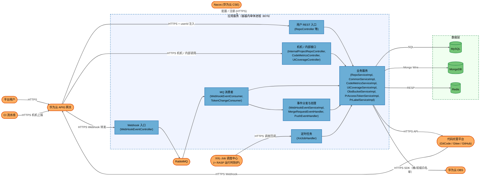
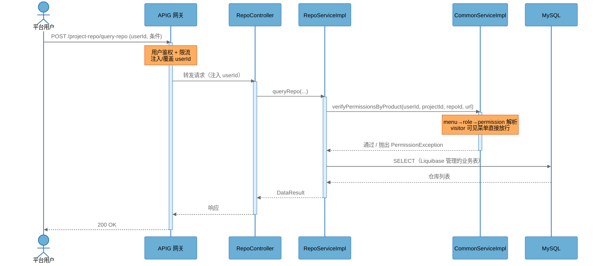
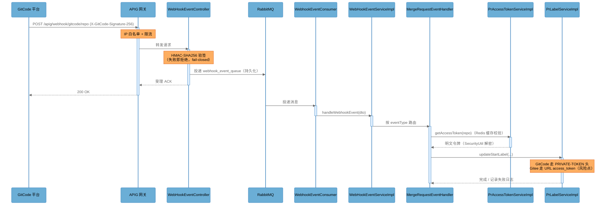
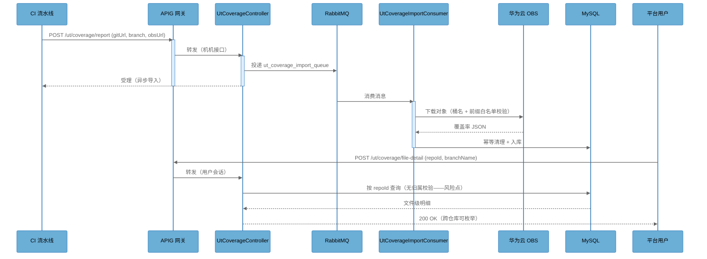
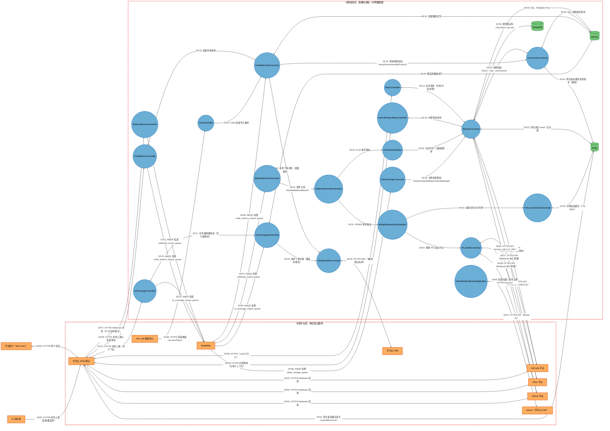
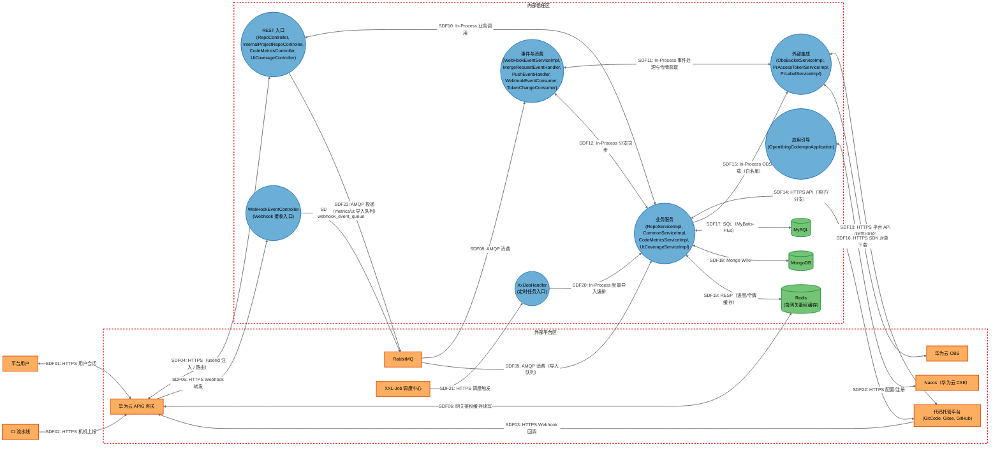

# openlibing-coderepo 安全威胁模型分析报告（STRIDE-A）

> **分析对象**：`openlibing-coderepo`（GitCode 远端：`https://gitcode.com/openlibing/openlibing-coderepo.git`）
> **分支 / 提交**：`master` / `bf9bf3a9`（2026-10-09）
> **分析方法**：STRIDE-A（STRIDE + Abuse）+ 零信任/纵深防御视角，CVSS 4.0 评分，SDL Bugbar 严重度分级
> **报告语言**：中文（单文档整合版）

---

## 1. 执行摘要（Executive Summary）

### 风险评级：Elevated（偏高）

openlibing-coderepo 是 openLibing 研发工作流平台的**代码仓管理服务**（仓库/分支管理、权限与角色、GitCode/Gitee/GitHub 平台同步、Webhook 事件处理、代码度量与 UT 覆盖率报告归集、容器化部署与定时任务）。服务以容器方式运行（openEuler 24.03 基础镜像、非 root 用户、RASP javaagent），通过华为云 APIG 网关对外暴露，配置与注册依赖华为云 CSE Nacos 配置中心，数据面使用 MySQL + MongoDB + Redis + RabbitMQ。

本次分析覆盖 **32 个 DFD 元素**（19 个应用内进程、3 个数据存储、10 个外部系统/角色）、**51 条数据流**、**2 个信任边界**，共枚举 **81 条 STRIDE-A 威胁**，其中：

- **Tier 1（无需任何前置条件）**：5 条 —— 主要集中在 Webhook 接收入口；
- **Tier 2（单一前置条件）**：62 条 —— 集中在网关接入的用户/机机接口与消息链路；
- **Tier 3（纵深防御）**：14 条 —— 集中在日志/配置/数据存储等需要高权限前提的场景。

共形成 **25 项安全发现**（Tier 1：3，Tier 2：17，Tier 3：5），其中包含对团队已实现安全控制的确认项（既有控制，`Existing Control`）。经独立复核修订后，误报表述与非独立缺陷定级已修正（其中 FIND-06 经核实为误报、转为既有控制确认）：修订后定级分布 **Important 1 / Moderate 2 / Low 22**（Low 含 8 项既有控制确认），详见 7.4 节评级调整表。

**整体判断**：该服务的代码质量与工程安全基线较好（无 SQL 注入、无命令执行、无原生反序列化利用面、容器已在非 root 下运行、敏感配置加密下发、Webhook 具备 HMAC 验签、OBS 下载具备桶/前缀白名单等）。经独立复核修订后，主要风险与关注点如下：

1. **对象级授权缺失（IDOR，最高优先整改项）**：`/ut/coverage/file-detail` 查询接口不做仓库归属校验，认证用户枚举 `repoId` 即可读取他人项目/仓库的覆盖率明细；同位点 `/metrics/code/*` 已整改、本接口为残留（FIND-05）。
2. **服务端信任网关注入身份（平台级架构接受项）**：用户面接口信任网关注入的 `userId` 参数；经复核，网关 `AuthFilter` 以 `put` 覆盖客户端同名参数（外部经网关不可伪造），残留风险为内网/集群内直连 8076。该信任模型属平台级架构约定，判定为接受风险（`Accept Risk`）并纳入台账，本仓不修改（FIND-04）。
3. **权限模型存在短路语义（当前不可触发）**：菜单关联 `visitor` 角色即跳过横向数据校验（与调用者自身角色无关）；经测试库核查，coderepo 52 个菜单 URL 无一关联 visitor，当前场景不可触发，残余风险在其它服务的菜单配置（FIND-09）。
4. **凭据与日志外溢面（可达性受限）**：Gitee `access_token` 拼接进 URL 的两条路径当前均不可达（死代码 / Gitee webhook 恒失败），底层日志已按 `access_token` 规则脱敏；MQ 消费异常日志整包输出消息体属日志卫生问题（FIND-21、FIND-23）。
5. **传输层校验被削弱（半降级）**：MongoDB 连接开启 `invalidHostNameAllowed(true)` 仅关闭主机名校验，CA 证书链仍由 JVM 信任库校验（FIND-07）。

> **关于威胁数量的说明：** 本报告共识别 81 条威胁、覆盖 32 个元素。该数量反映的是 STRIDE-A 全类别覆盖的完整性，而非系统性失陷。其中 **5 条无需前置条件即可被利用（Tier 1）**；其余 76 条为条件性风险与纵深防御项。

### 覆盖统计

| 维度                 | 数量                                                |
| -------------------- | --------------------------------------------------- |
| DFD 元素（组件）     | 32                                                  |
| 数据流               | 51                                                  |
| 信任边界             | 2                                                   |
| STRIDE-A 威胁        | 81                                                  |
| 安全发现（Findings） | 25                                                  |
| 部署分类             | `NETWORK_SERVICE`（云上网络服务，经 APIG 网关对外） |

---

## 2. 行动摘要（Action Summary）

| Tier      | Description                   | Threats | Findings | Priority         |
| --------- | ----------------------------- | ------- | -------- | ---------------- |
| Tier 1    | Directly exploitable          | 5       | 3        | 🔴 Critical Risk |
| Tier 2    | Requires authenticated access | 62      | 17       | 🟠 Elevated Risk |
| Tier 3    | Requires prior compromise     | 14      | 5        | 🟡 Moderate Risk |
| **Total** |                               | **81**  | **25**   |                  |

### Priority by CVSS Score (Top 10)

| Finding                                                     | Tier | CVSS Score | SDL Severity | Title                                       |
| ----------------------------------------------------------- | ---- | ---------- | ------------ | ------------------------------------------- |
| [FIND-05](#find-05-ut-覆盖率文件明细接口对象级授权缺失idor) | T2   | 7.1        | Important    | UT 覆盖率文件明细接口对象级授权缺失（IDOR） |
| [FIND-04](#find-04-服务端信任网关注入身份平台级架构接受项)  | T2   | 6.2        | Moderate     | 服务端信任网关注入身份（平台级架构接受项）  |
| [FIND-07](#find-07-mongodb-连接关闭-tls-主机名校验)         | T2   | 6.0        | Moderate     | MongoDB 连接关闭 TLS 主机名校验             |
| [FIND-09](#find-09-权限模型-visitor-短路导致横向校验被跳过) | T2   | 2.3        | Low          | 权限模型 VISITOR 短路导致横向校验被跳过     |
| [FIND-10](#find-10-服务端频率控制缺失接口滥用与资源消耗面)  | T2   | 2.3        | Low          | 服务端频率控制缺失（接口滥用与资源消耗面）  |
| [FIND-12](#find-12-webhook-重放窗口校验缺失)                | T2   | 2.3        | Low          | Webhook 重放窗口校验缺失                    |
| [FIND-13](#find-13-消息链路端到端完整性校验缺失)            | T2   | 2.3        | Low          | 消息链路端到端完整性校验缺失                |
| [FIND-14](#find-14-mq-消费失败静默丢弃无死信队列与告警)     | T2   | 2.3        | Low          | MQ 消费失败静默丢弃（无死信队列与告警）     |
| [FIND-15](#find-15-okhttpclient-未复用连接与资源放大)       | T2   | 2.3        | Low          | OkHttpClient 未复用（连接与资源放大）       |
| [FIND-08](#find-08-redis-缓存键空间与鉴权缓存完整性缺失)    | T2   | 2.1        | Low          | Redis 缓存键空间与鉴权缓存完整性缺失        |

### Quick Wins

| Finding                                                          | Title                                  | Why Quick                                                              |
| ---------------------------------------------------------------- | -------------------------------------- | ---------------------------------------------------------------------- |
| [FIND-01](#find-01-webhook-签名比较未使用常量时间算法时序侧信道) | Webhook 签名比较未使用常量时间         | 一行替换为 `MessageDigest.isEqual` 即可消除侧信道                      |
| [FIND-21](#find-21-gitee-access_token-置于-url-查询串凭据外溢面) | Gitee 令牌拼接进 URL（当前路径不可达） | 随死代码清理与请求头改造一并处理；底层日志已按 `access_token` 规则脱敏 |
| [FIND-23](#find-23-mq-消费异常日志记录完整消息体敏感数据入日志)  | MQ 消息体（含密文令牌）整包写入日志    | 删除/缩减错误日志中的原始 body，改动极小                               |
| [FIND-07](#find-07-mongodb-连接关闭-tls-主机名校验)              | MongoDB 关闭 TLS 主机名校验            | 删除一行配置（配合证书配置核验）                                       |

> 说明：Quick Wins 仅列出低改动成本、高收益的条目；全部发现的分级修复指引见第 6 章。

---

## 3. 系统架构与部署

### 3.1 系统定位（System Purpose）

openlibing-coderepo 为 openLibing 平台提供**代码仓库全生命周期管理能力**：仓库与分支的登记/同步/归档、项目与仓库维度的角色权限、与 GitCode/Gitee/GitHub 的开放平台对接（Webhook 事件、PR 标签与评论、令牌管理）、代码度量（code metrics）与 UT 覆盖率报告的归集与查询、导出与通知、以及容器化部署与 XXL-Job 定时任务。其使用者包括平台前端用户（经 APIG 网关）、CI 流水线（机机上报）、以及三类代码托管平台（Webhook 回调）。

### 3.2 关键组件（Key Components）

| Component                     | Type                | Description                                                                                                                                                                                                                 |
| ----------------------------- | ------------------- | --------------------------------------------------------------------------------------------------------------------------------------------------------------------------------------------------------------------------- |
| RepoController                | Process             | 用户侧仓库/分支管理 REST 入口（经网关、依赖网关注入 userId）                                                                                                                                                                |
| WebHookEventController        | Process             | GitCode/Gitee/GitHub Webhook 接收入口（HMAC-SHA256 验签 + APIG IP 白名单）                                                                                                                                                  |
| InternalProjectRepoController | Process             | 内部服务间调用接口（机机语义、无用户上下文；经 `openlibing-common` InternalAuthFilter 静态 Token 校验）                                                                                                                     |
| CodeMetricsController         | Process             | 代码度量上报（机机）与查询接口                                                                                                                                                                                              |
| UtCoverageController          | Process             | UT 覆盖率上报（机机）与文件级明细下钻（Web）接口                                                                                                                                                                            |
| RepoServiceImpl               | Process             | 仓库核心业务编排、数据访问与权限校验调用方                                                                                                                                                                                  |
| CommonServiceImpl             | Process             | 权限解析与横向校验（menu→role→permission，visitor 短路语义）                                                                                                                                                                |
| WebHookEventServiceImpl       | Process             | Webhook 事件分发（按事件类型路由到各 Handler）                                                                                                                                                                              |
| MergeRequestEventHandler      | Process             | PR/MR 事件处理（标签/评论/统计，调用外部平台）                                                                                                                                                                              |
| PushEventHandler              | Process             | Push 事件处理（分支同步与元数据刷新）                                                                                                                                                                                       |
| WebhookEventConsumer          | Process             | webhook_event_queue 消费者（fastjson2 反序列化 + 重试丢弃）                                                                                                                                                                 |
| TokenChangeConsumer           | Process             | token_change_queue 消费者（解密令牌、刷新继承令牌、触发重同步）                                                                                                                                                             |
| CodeMetricsServiceImpl        | Process             | 度量报告解析入库与查询（OBS 下载）                                                                                                                                                                                          |
| UtCoverageServiceImpl         | Process             | UT 覆盖率入库与文件级明细查询（OBS 下载）                                                                                                                                                                                   |
| ObsBucketServiceImpl          | Process             | OBS 对象下载（桶名 + objectKey 前缀白名单校验）                                                                                                                                                                             |
| PrAccessTokenServiceImpl      | Process             | PR 场景访问令牌选择/回退/有效性校验（Redis 缓存）                                                                                                                                                                           |
| PrLabelServiceImpl            | Process             | PR 标签与评论（GitCode/Gitee/GitHub API 写操作；含 PrCommentReplyServiceImpl 同类逻辑）                                                                                                                                     |
| XxlJobHandler                 | Process             | XXL-Job 定时任务处理器（含 OBS 度量导入入口）                                                                                                                                                                               |
| OpenlibingCoderepoApplication | Process             | 应用引导：配置解密（Jasypt/SecurityUtil）、服务注册（Nacos）、Feign 客户端                                                                                                                                                  |
| MySQL                         | Data Store          | 仓库/项目/用户角色/RBAC/三方账号绑定/度量/覆盖率/操作日志等业务数据（MyBatis-Plus + Liquibase；审计日志经 GetLogsMapper 落库）                                                                                              |
| MongoDB                       | Data Store          | 安全扫描规则集与规则配置（SIG_RULE_SET、ANTI_TASK_RULE_SET、CODECHECK_RULE_SET、ANTI_CHECK_RULE_SET）；MongoConfig 关闭 TLS 主机名校验                                                                                      |
| Redis                         | Data Store          | **网关鉴权缓存（userIdMenuUrls，网关读取用于鉴权）**、页面权限缓存（USER_PERMISSION_*）、仓库同步进度、同步互斥锁（`distributed_lock:PROJECT_SYNC:*` / `distributed_lock:ADD_REPO:*`）、令牌校验缓存（StringRedisTemplate） |
| APIG（华为云 API 网关）       | External Service    | 统一入口：用户鉴权、机机签名、IP 白名单、限流、路径路由与 userId 注入                                                                                                                                                       |
| GitCode                       | External Service    | 代码托管平台（Webhook 源、PR 标签/评论目标、分支查询）                                                                                                                                                                      |
| Gitee                         | External Service    | 代码托管平台（Webhook 源、PR 标签/评论目标；令牌经 URL 传递）                                                                                                                                                               |
| GitHub                        | External Service    | 代码托管平台（Webhook 源、PR 标签/评论目标；令牌经 Bearer 头）                                                                                                                                                              |
| OBS（华为云对象存储）         | External Service    | 度量/覆盖率报告对象存储（桶名 + 前缀白名单下载，AK/SK 解密自 Nacos）                                                                                                                                                        |
| RabbitMQ                      | External Service    | 消息中间件（webhook/token change/metrics/ut coverage/notify 队列，持久化、默认交换机）                                                                                                                                      |
| Nacos（华为云 CSE）           | External Service    | 配置中心 + 服务发现（含数据库凭据、令牌加密工作密钥等敏感配置）                                                                                                                                                             |
| XxlJobAdmin                   | External Service    | XXL-Job 调度中心（共享 accessToken 触发任务）                                                                                                                                                                               |
| EndUser                       | External Interactor | 平台前端用户（经 APIG 访问 Web 接口）                                                                                                                                                                                       |
| CiPipeline                    | External Interactor | CI 流水线（机机上报度量/覆盖率、触发 webhook 的等价事件源）                                                                                                                                                                 |

### 3.3 组件图（Component Diagram）



### 3.4 核心场景（Top Scenarios）

#### Scenario 1：用户经网关访问仓库管理接口

平台用户在浏览器中操作仓库列表/详情，请求经 APIG 完成用户鉴权并注入 `userId`，后端执行权限解析（菜单→角色→权限）后查询 MySQL 返回。该场景体现"身份完全由网关提供"的核心安全假设。



#### Scenario 2：代码平台 Webhook 事件处理链路

GitCode 等平台在 PR 事件发生时回调服务；APIG 依据 IP 白名单放行，服务内执行 HMAC-SHA256 验签后投递 MQ，消费者异步分发到事件处理器，进而读取令牌并调用平台 API 更新标签/评论。



#### Scenario 3：UT 覆盖率机机上报与文件级下钻

CI 流水线通过 APIG 机机接口上报 UT 覆盖率（异步经 MQ + OBS 导入落库）；平台用户在 Web 端按 repoId/branchName 下钻查看文件级明细。



### 3.5 技术栈（Technology Stack）

| Layer          | Technologies                                                                                                                                                                                                                                                                                 |
| -------------- | -------------------------------------------------------------------------------------------------------------------------------------------------------------------------------------------------------------------------------------------------------------------------------------------- |
| Languages      | Java 21                                                                                                                                                                                                                                                                                      |
| Frameworks     | Spring Boot 3.4.4、Spring MVC、MyBatis-Plus、Spring AMQP、fastjson2（safeMode）、OkHttp 4、Liquibase、XXL-Job 3.2.0、springdoc-openapi                                                                                                                                                       |
| Data Stores    | MySQL 8、MongoDB、Redis、RabbitMQ                                                                                                                                                                                                                                                            |
| Infrastructure | 华为云 APIG 网关、华为云 CSE（Nacos 配置 + 服务发现）、华为云 OBS、Docker（openEuler 24.03-lts-sp1 基础镜像）、GitCode/Gitee/GitHub 开放平台                                                                                                                                                 |
| Security       | Jasypt（`@EnableEncryptableProperties`）、SecurityUtil/AESCipher（配置与令牌加解密）、WebhookAuthUtil（HMAC-SHA256）、RASP javaagent、自定义 TrustStore、审计 AOP、SensitiveDataConverter（日志脱敏）、spotbugs+findsecbugs、checkstyle、pmd、jacoco（行覆盖门禁 20%）、gitleaks、pre-commit |

### 3.6 部署模型（Deployment Model）

服务以**单容器单进程**方式部署：Docker 镜像基于 `openEuler 24.03-lts-sp1`，内置 JRE 21 与 RASP `rasp.jar`（`start.sh` 以 `-javaagent` 方式挂载），进程监听 `0.0.0.0:8076`，容器内以非 root 用户 `openlibing`（nologin）运行并设置 `umask 077`；`monitor.sh` 对启动脚本追加加固。镜像构建期将 `keys/*.ks`、`openlibing.pfx`、`cacerts` 拷贝至容器（三个文件均被 `.gitignore` 排除，源码中无加载点，属供应链环节，需核验来源）。服务经华为云 APIG 网关对外（`https://www.openlibing.com/gateway/openlibing-coderepo/...`，多环境 beta/gama/prod 分别对应各自域名），环境变量与 Nacos 配置驱动运行时参数（`spring.profiles.active` 缺省 `local`）。数据面为外置托管/独立部署的 MySQL、MongoDB、Redis、RabbitMQ。Springdoc 的 Swagger 配置显式指向网关管理路径（`/manage/v3/api-docs`），未见生产禁用配置。

**Deployment Classification：** `NETWORK_SERVICE`（公网可达的云上网络服务，经 APIG 网关；Tier 1 允许）

**部署分类依据**：`Dockerfile`（容器化、非 root、监听 8076）+ `src/main/resources/application-prod.yaml`（`https://www.openlibing.com/gateway/openlibing-coderepo/manage/v3/api-docs`，证明公网网关暴露）+ `WebHookEventController.java` 类注释（"前置华为云 APIG IP 白名单 + 限流"）。

### 3.7 组件暴露表（Component Exposure Table）

> 本表为所有威胁与发现"前置条件下限 / Tier 上限"的**唯一事实来源**。应用内进程的"暴露"按其**入口链路**判定；数据存储按内网可达性判定；外部平台行以"—"标注（其自身攻击面由供应商承担，相关威胁以 Platform 归类）。

| Component                                                              | Listens On                                         | Auth Required                                                                | Reachability                   | Min Prerequisite                | Derived Tier  |
| ---------------------------------------------------------------------- | -------------------------------------------------- | ---------------------------------------------------------------------------- | ------------------------------ | ------------------------------- | ------------- |
| RepoController                                                         | 0.0.0.0:8076（经 APIG `/project-repo/*` 路由）     | Yes（网关鉴权 + userId 注入；代码注释声明）                                  | External                       | Authenticated User              | T2            |
| WebHookEventController                                                 | 0.0.0.0:8076（经 APIG `/apig/webhook/*` 路由）     | No（无用户身份认证；代码内 HMAC 验签 + APIG IP 白名单）                      | External                       | None                            | T1            |
| InternalProjectRepoController                                          | 0.0.0.0:8076（经 APIG 内部路由）                   | Yes（网关层鉴权 + openlibing-common 内部 Token（X-Internal-Token）统一鉴权） | External                       | Authenticated User              | T2            |
| CodeMetricsController                                                  | 0.0.0.0:8076（经 APIG 机机路由）                   | Yes（网关机机鉴权，声明待核验）                                              | External                       | Authenticated User              | T2            |
| UtCoverageController                                                   | 0.0.0.0:8076（经 APIG 机机/用户路由）              | Yes（网关鉴权，声明待核验）                                                  | External                       | Authenticated User              | T2            |
| RepoServiceImpl                                                        | N/A — 无监听（经入口控制器调用）                   | Yes（入口层把关）                                                            | External（经入口）             | Authenticated User              | T2            |
| CommonServiceImpl                                                      | N/A — 无监听（进程内调用）                         | Yes（入口层把关）                                                            | External（经入口）             | Authenticated User              | T2            |
| WebHookEventServiceImpl                                                | N/A — 无监听（MQ→进程内调用）                      | Yes（入口 HMAC 验签后方可达）                                                | Internal Only（消息链路）      | Internal Network                | T2            |
| MergeRequestEventHandler                                               | N/A — 无监听（进程内调用）                         | Yes（同上）                                                                  | Internal Only（消息链路）      | Internal Network                | T2            |
| PushEventHandler                                                       | N/A — 无监听（进程内调用）                         | Yes（同上）                                                                  | Internal Only（消息链路）      | Internal Network                | T2            |
| WebhookEventConsumer                                                   | N/A — 无监听（RabbitMQ 消费）                      | Yes（Broker 凭据）                                                           | Internal Only                  | Internal Network                | T2            |
| TokenChangeConsumer                                                    | N/A — 无监听（RabbitMQ 消费）                      | Yes（Broker 凭据）                                                           | Internal Only                  | Internal Network                | T2            |
| CodeMetricsServiceImpl                                                 | N/A — 无监听（控制器 + 消费者调用）                | Yes（入口层把关）                                                            | External（经入口）             | Authenticated User              | T2            |
| UtCoverageServiceImpl                                                  | N/A — 无监听（控制器 + 消费者调用）                | Yes（入口层把关）                                                            | External（经入口）             | Authenticated User              | T2            |
| ObsBucketServiceImpl                                                   | N/A — 无监听（进程内调用）                         | Yes（入口层把关）                                                            | Internal Only（消息/任务链路） | Internal Network                | T2            |
| PrAccessTokenServiceImpl                                               | N/A — 无监听（事件链路调用）                       | Yes（同上）                                                                  | Internal Only（消息链路）      | Internal Network                | T2            |
| PrLabelServiceImpl                                                     | N/A — 无监听（事件链路调用）                       | Yes（同上）                                                                  | Internal Only（消息链路）      | Internal Network                | T2            |
| XxlJobHandler                                                          | 内嵌执行器端口（XXL-Job 框架托管，仓内未显式配置） | Yes（`xxl.job.admin.accessToken` 共享密钥）                                  | Internal Only                  | Admin Credentials               | T3            |
| OpenlibingCoderepoApplication                                          | N/A — 无监听（引导/注册）                          | Yes（Nacos secure 配置通道）                                                 | Internal Only                  | Internal Network                | T2            |
| MySQL                                                                  | 内部地址（Nacos 下发数据源配置）                   | Yes（连接凭据，Nacos 加密下发）                                              | Internal Only                  | Internal Network                | T2            |
| MongoDB                                                                | 内部地址（Nacos 下发 URI，`SecurityUtil` 解密）    | Yes（连接凭据，Nacos 加密下发）                                              | Internal Only                  | Internal Network                | T2            |
| Redis                                                                  | 内部地址（Nacos 下发连接配置）                     | Yes（连接凭据，待核验）                                                      | Internal Only                  | Internal Network                | T2            |
| APIG / GitCode / Gitee / GitHub / OBS / RabbitMQ / Nacos / XxlJobAdmin | 供应商云服务端点（HTTPS）                          | 由供应商托管                                                                 | External                       | —（外部平台）                   | —（外部平台） |
| EndUser / CiPipeline                                                   | N/A — 外部角色                                     | N/A                                                                          | External                       | —（外部角色，经 APIG 入口归类） | —             |

> **说明（与闭集枚举的对应）**：数据存储"Internal Only + 凭据"组合取可达性下限 `Internal Network`（T2），凭据要求将在具体威胁中以 `Admin Credentials` 等前置条件体现；XXL-Job 执行器以共享令牌为前提，按 `Admin Credentials`（T3）处理。外部平台不设应用侧前置下限——所有经其发生的威胁由入口组件（APIG/Webhook）或平台责任（Platform）归类。

### 3.8 安全基础设施盘点（Security Infrastructure Inventory）

| Component                                                                                   | Security Role                           | Configuration                                                                                                                                                                                                                     | Notes                                                     |
| ------------------------------------------------------------------------------------------- | --------------------------------------- | --------------------------------------------------------------------------------------------------------------------------------------------------------------------------------------------------------------------------------- | --------------------------------------------------------- |
| 华为云 APIG 网关                                                                            | 统一认证/限流/IP 白名单/路由            | 用户态鉴权 + 机机签名 + webhook IP 白名单（平台侧配置，仓内不可见）                                                                                                                                                               | 全部外部请求入口；**所有应用侧鉴权依赖此层**              |
| WebhookAuthUtil                                                                             | Webhook 平台签名验证（完整性 + 抗伪造） | HMAC-SHA256，密钥 `webhook.secretKey` 加密存储、运行时解密                                                                                                                                                                        | fail-closed；Gitee 分支恒返回失败；比较非常量时间         |
| SecurityUtil / AESCipher (`security.part1`)                                                 | 配置与令牌加解密                        | 线程/工作密钥分离（part1 + 密文），`SecurityUtil.decrypt`                                                                                                                                                                         | 用于 MongoDB URI、仓库令牌、OBS AK/SK、webhook 密钥等     |
| Jasypt (`@EnableEncryptableProperties`)                                                     | 配置项解密装配                          | 启动时解密可加密属性                                                                                                                                                                                                              | 与 SecurityUtil 并用                                      |
| 自定义 TrustStore / openlibing.pfx / keys                                                   | 出站 TLS 信任与密钥材料                 | `-Djavax.net.ssl.trustStore=${TRUST_STORE}`（start.sh）                                                                                                                                                                           | 文件不入 Git；容器构建期注入，来源需核验                  |
| RASP（`rasp.jar` javaagent）                                                                | 运行时应用自防护                        | JVM 启动挂载                                                                                                                                                                                                                      | 无版本/策略配置入库                                       |
| 容器加固                                                                                    | 运行面加固                              | 非 root `openlibing`、`umask 077`、无 SSH、JRE 21、openEuler 24.03-lts-sp1                                                                                                                                                        | Dockerfile/start.sh/monitor.sh                            |
| 审计 AOP（RepoLogHandler / ProjectLogHandler / RepoBranchLogHandler / SpaceUserLogHandler） | 操作行为留痕                            | 注解触发写入操作日志（MyBatis `GetLogsMapper`，MySQL）                                                                                                                                                                            | 不承担鉴权职责                                            |
| GlobalExceptionHandler                                                                      | 统一异常兜底                            | 返回通用错误，记录 URL/异常类/首帧堆栈                                                                                                                                                                                            | 不向调用方返回堆栈                                        |
| SensitiveDataConverter                                                                      | 日志脱敏转换器                          | 日志框架侧脱敏                                                                                                                                                                                                                    | 覆盖范围有限（URL/body 未脱敏）                           |
| CodeContentB64Util                                                                          | 源码片段存储编码                        | 两阶段回检的 Base64（可逆，非加密）                                                                                                                                                                                               | 注释宣称"防止明文"，实际非加密                            |
| 权限体系（menu_url_info → role_permission → role_info → user_role）                         | 应用内 RBAC                             | `verifyPermissionsByProduct`（42 处调用）；visitor 菜单短路                                                                                                                                                                       | 依赖网关提供 userId                                       |
| Redis                                                                                       | 网关鉴权缓存 + 应用侧权限/令牌缓存      | `userIdMenuUrls`（**网关读取**）、`USER_PERMISSION_*`、`TOKEN_VALID_CACHE_PREFIX + platform + accessToken.hashCode()`（TTL 600s）、同步进度 Hash、同步互斥锁（`distributed_lock:PROJECT_SYNC:*` / `distributed_lock:ADD_REPO:*`） | 缓存键承载鉴权语义，属安全关键数据                        |
| XXL-Job                                                                                     | 任务调度                                | `xxl.job.admin.accessToken` 共享密钥                                                                                                                                                                                              | 调度参数可触发 OBS 导入（受白名单约束）                   |
| Liquibase                                                                                   | 数据库版本化                            | `db/changelog/db.changelog.xml`                                                                                                                                                                                                   | 降低 schema 漂移风险                                      |
| CI 安全门禁                                                                                 | 供应链安全                              | gitleaks、pre-commit、spotbugs+findsecbugs、checkstyle、pmd、jacoco 20%                                                                                                                                                           | `.gitcode/workflows/*`（sca/malicious-code/nightly 扫描） |

### 3.9 代码仓结构（Repository Structure）

| Directory                                         | Purpose                                                                             |
| ------------------------------------------------- | ----------------------------------------------------------------------------------- |
| `src/main/java/com/openlibing/coderepo/business/` | 业务层：controller / service / handler / mapper / entity / dto / vo                 |
| `src/main/java/com/openlibing/coderepo/common/`   | 公共层：config（数据源/Mongo/Redis/MQ/XXL-Job）、aop（审计）、utils、exception、job |
| `src/main/resources/`                             | `application*.yaml`（环境配置）、`mapper/*.xml`、`db/changelog`（Liquibase）        |
| `keys/`、`openlibing.pfx`、`cacerts`              | TLS/密钥材料（`.gitignore` 排除，容器构建期注入）                                   |
| `Dockerfile`、`start.sh`、`monitor.sh`            | 容器构建与运行时加固                                                                |
| `.gitcode/workflows/`                             | CI/CD：pre-commit、SCA 扫描、恶意代码扫描、Nightly 扫描、代码度量                   |
| `openspec/`、`README.md`                          | 需求/变更管理与项目说明                                                             |

## 4. 威胁模型数据流图（DFD）

### 4.1 完整数据流图（Detailed DFD）

下图为 openlibing-coderepo 的 STRIDE 分析用数据流图，包含 32 个元素（19 个应用内进程、3 个数据存储、10 个外部系统/角色）、51 条数据流与 2 个信任边界。图中所有进程均位于"内部信任区"（应用容器与其专属内网数据面），外部平台位于"外部平台区"，用户与 CI 流水线作为外部角色绘制在边界之外。



> 说明：DF49/DF50 的消费逻辑由代码中的 `CodeMetricsImportConsumer` / `UtCoverageImportConsumer` 承接后委派至对应服务；为避免元素表膨胀，导入型消费者未单列为元素，其威胁面与 Webhook 消费链路同类（详见第 7 章"分析上下文与假设"）。

### 4.2 DFD 元素表（Element Table）

| Element                       | Type                | TMT Category             | Description                                                                                           | Trust Boundary  |
| ----------------------------- | ------------------- | ------------------------ | ----------------------------------------------------------------------------------------------------- | --------------- |
| RepoController                | Process             | SE.P.TMCore.WebSvc       | 用户侧仓库/分支管理 REST 入口（依赖网关注入 userId）                                                  | 内部信任区      |
| WebHookEventController        | Process             | SE.P.TMCore.WebSvc       | Webhook 接收入口：HMAC 验签 → 投递 MQ（含 WebhookAuthUtil 验签逻辑）                                  | 内部信任区      |
| InternalProjectRepoController | Process             | SE.P.TMCore.WebSvc       | 内部服务间调用接口（机机语义、无用户上下文；经 openlibing-common InternalAuthFilter 静态 Token 校验） | 内部信任区      |
| CodeMetricsController         | Process             | SE.P.TMCore.WebSvc       | 代码度量机机上报与查询接口                                                                            | 内部信任区      |
| UtCoverageController          | Process             | SE.P.TMCore.WebSvc       | UT 覆盖率机机上报与文件级明细下钻接口                                                                 | 内部信任区      |
| RepoServiceImpl               | Process             | SE.P.TMCore.NonMS        | 仓库核心业务编排（平台同步、钩子管理、权限调用、规则集读写）                                          | 内部信任区      |
| CommonServiceImpl             | Process             | SE.P.TMCore.NonMS        | 权限解析与横向校验（menu→role→permission；visitor 短路）                                              | 内部信任区      |
| WebHookEventServiceImpl       | Process             | SE.P.TMCore.NonMS        | Webhook 事件按类型分发至各 Handler                                                                    | 内部信任区      |
| MergeRequestEventHandler      | Process             | SE.P.TMCore.NonMS        | PR/MR 事件处理（标签/评论/统计，令牌选择后调用平台 API）                                              | 内部信任区      |
| PushEventHandler              | Process             | SE.P.TMCore.NonMS        | Push 事件处理（分支同步与元数据刷新）                                                                 | 内部信任区      |
| WebhookEventConsumer          | Process             | SE.P.TMCore.NonMS        | webhook_event_queue 消费者（fastjson2 反序列化 + 退避重试后丢弃）                                     | 内部信任区      |
| TokenChangeConsumer           | Process             | SE.P.TMCore.NonMS        | token_change_queue 消费者（解密令牌、刷新继承令牌、触发重同步）                                       | 内部信任区      |
| CodeMetricsServiceImpl        | Process             | SE.P.TMCore.NonMS        | 度量报告解析入库与查询（OBS 下载、权限校验调用方）                                                    | 内部信任区      |
| UtCoverageServiceImpl         | Process             | SE.P.TMCore.NonMS        | UT 覆盖率入库与文件级明细查询（OBS 下载）                                                             | 内部信任区      |
| ObsBucketServiceImpl          | Process             | SE.P.TMCore.NonMS        | OBS 对象下载（桶名 + objectKey 前缀白名单校验）                                                       | 内部信任区      |
| PrAccessTokenServiceImpl      | Process             | SE.P.TMCore.NonMS        | PR 场景令牌选择/回退/有效性校验（Redis 缓存）                                                         | 内部信任区      |
| PrLabelServiceImpl            | Process             | SE.P.TMCore.NonMS        | PR 标签与评论写操作（GitCode/Gitee/GitHub API）                                                       | 内部信任区      |
| XxlJobHandler                 | Process             | SE.P.TMCore.NonMS        | XXL-Job 任务处理器（含 OBS 度量导入入口）                                                             | 内部信任区      |
| OpenlibingCoderepoApplication | Process             | SE.P.TMCore.NonMS        | 应用引导：配置解密装配、Nacos 注册、Feign 客户端                                                      | 内部信任区      |
| MySQL                         | Data Store          | SE.DS.TMCore.SQL         | 业务数据与操作日志（MyBatis-Plus + Liquibase）                                                        | 内部信任区      |
| MongoDB                       | Data Store          | SE.DS.TMCore.NoSQL       | 安全扫描规则集（SIG/ANTI/CODECHECK rule set）                                                         | 内部信任区      |
| Redis                         | Data Store          | SE.DS.TMCore.Cache       | 网关鉴权缓存、页面权限缓存、同步进度、同步互斥锁（PROJECT_SYNC / ADD_REPO）、令牌校验缓存             | 内部信任区      |
| APIG（华为云 API 网关）       | External Interactor | SE.EI.TMCore.Megaservice | 统一入口：用户鉴权、机机签名、IP 白名单、限流、userId 注入、读鉴权缓存                                | 外部平台区      |
| GitCode                       | External Interactor | SE.EI.TMCore.WebSvc      | 代码托管平台（Webhook 源、钩子/分支管理、PR 标签评论）                                                | 外部平台区      |
| Gitee                         | External Interactor | SE.EI.TMCore.WebSvc      | 代码托管平台（Webhook 源、钩子管理、PR 标签评论；令牌易入 URL）                                       | 外部平台区      |
| GitHub                        | External Interactor | SE.EI.TMCore.WebSvc      | 代码托管平台（Webhook 源、钩子管理、PR 标签评论）                                                     | 外部平台区      |
| OBS（华为云对象存储）         | External Interactor | SE.EI.TMCore.Megaservice | 度量/覆盖率报告对象存储（AK/SK 解密自 Nacos）                                                         | 外部平台区      |
| RabbitMQ                      | External Interactor | SE.EI.TMCore.WebSvc      | 消息中间件（webhook/token change/metrics/ut coverage/notify 队列）                                    | 外部平台区      |
| Nacos（华为云 CSE）           | External Interactor | SE.EI.TMCore.Megaservice | 配置中心 + 服务发现（含数据库凭据、加密工作密钥）                                                     | 外部平台区      |
| XxlJobAdmin                   | External Interactor | SE.EI.TMCore.WebSvc      | XXL-Job 调度中心（共享 accessToken 触发任务）                                                         | 外部平台区      |
| EndUser                       | External Interactor | SE.EI.TMCore.User        | 平台前端用户（经 APIG 访问用户接口）                                                                  | —（边界外角色） |
| CiPipeline                    | External Interactor | SE.EI.TMCore.WebSvc      | CI 流水线（机机上报度量/覆盖率、Webhook 等价事件源）                                                  | —（边界外角色） |

### 4.3 数据流表（Data Flow Table）

| ID   | Source                        | Target                        | Protocol                        | Description                                                             |
| ---- | ----------------------------- | ----------------------------- | ------------------------------- | ----------------------------------------------------------------------- |
| DF01 | EndUser                       | APIG                          | HTTPS                           | 用户会话请求/响应（网关完成登录态与权限校验）                           |
| DF02 | CiPipeline                    | APIG                          | HTTPS                           | 机机上报（代码度量 / UT 覆盖率，经机机签名）                            |
| DF03 | GitCode                       | APIG                          | HTTPS                           | Webhook 回调（`X-GitCode-Signature-256`）                               |
| DF04 | Gitee                         | APIG                          | HTTPS                           | Webhook 回调（`X-Gitee-Token`）                                         |
| DF05 | GitHub                        | APIG                          | HTTPS                           | Webhook 回调（`X-Hub-Signature-256`）                                   |
| DF06 | APIG                          | RepoController                | HTTPS                           | 用户接口转发（网关注入/覆盖 userId）                                    |
| DF07 | APIG                          | WebHookEventController        | HTTPS                           | Webhook 转发（前置 IP 白名单 + 限流）                                   |
| DF08 | APIG                          | InternalProjectRepoController | HTTPS                           | 内部服务调用（无用户上下文；经 `X-Internal-Token` 鉴权）                |
| DF09 | APIG                          | CodeMetricsController         | HTTPS                           | 度量机机上报与查询转发                                                  |
| DF10 | APIG                          | UtCoverageController          | HTTPS                           | 覆盖率机机上报与用户下钻转发                                            |
| DF11 | WebHookEventController        | RabbitMQ                      | AMQP                            | 投递 `webhook_event_queue`（含原始事件体）                              |
| DF12 | UtCoverageController          | RabbitMQ                      | AMQP                            | 投递 `ut_coverage_import_queue`（异步导入）                             |
| DF13 | CodeMetricsController         | RabbitMQ                      | AMQP                            | 投递 `code_metrics_import_queue`（异步导入）                            |
| DF14 | RepoController                | RepoServiceImpl               | In-Process                      | 仓库/分支/权限业务调用                                                  |
| DF15 | InternalProjectRepoController | RepoServiceImpl               | In-Process                      | 内部仓库查询调用                                                        |
| DF16 | CodeMetricsController         | CodeMetricsServiceImpl        | In-Process                      | 度量查询调用（含权限校验）                                              |
| DF17 | UtCoverageController          | UtCoverageServiceImpl         | In-Process                      | 文件级明细查询（未见归属校验）                                          |
| DF18 | RepoServiceImpl               | CommonServiceImpl             | In-Process                      | 权限校验（menu→role→permission）                                        |
| DF19 | CodeMetricsServiceImpl        | CommonServiceImpl             | In-Process                      | 查询权限校验（verifyPermissionsByProduct）                              |
| DF20 | WebhookEventConsumer          | WebHookEventServiceImpl       | In-Process                      | 事件分发入口                                                            |
| DF21 | WebHookEventServiceImpl       | MergeRequestEventHandler      | In-Process                      | PR/MR 事件路由                                                          |
| DF22 | WebHookEventServiceImpl       | PushEventHandler              | In-Process                      | Push 事件路由                                                           |
| DF23 | MergeRequestEventHandler      | PrAccessTokenServiceImpl      | In-Process                      | 获取仓库访问令牌（含有效性校验）                                        |
| DF24 | MergeRequestEventHandler      | PrLabelServiceImpl            | In-Process                      | 更新 PR 标签/评论（平台 API 写操作）                                    |
| DF25 | PushEventHandler              | RepoServiceImpl               | In-Process                      | 分支同步与元数据刷新                                                    |
| DF26 | TokenChangeConsumer           | RepoServiceImpl               | In-Process                      | 令牌变更刷新（refreshInheritedRepoTokenMetadata / resyncOnTokenChange） |
| DF27 | XxlJobHandler                 | CodeMetricsServiceImpl        | In-Process                      | OBS 度量导入编排                                                        |
| DF28 | RepoServiceImpl               | MySQL                         | JDBC（TLS 待核验）              | 业务数据读写（MyBatis-Plus）                                            |
| DF29 | CommonServiceImpl             | MySQL                         | JDBC（TLS 待核验）              | 权限解析查询（menu/role/permission）                                    |
| DF30 | RepoServiceImpl               | MongoDB                       | Mongo Wire（非 TLS 主机名校验） | 规则集读取/写入/删除（SIG/ANTI rule set）                               |
| DF31 | CommonServiceImpl             | Redis                         | RESP                            | 权限变更时失效网关鉴权缓存（token/IP/权限键删除）                       |
| DF32 | RepoServiceImpl               | Redis                         | RESP                            | 仓库同步进度 Hash 与同步互斥锁读写（PROJECT_SYNC / ADD_REPO）           |
| DF33 | PrAccessTokenServiceImpl      | Redis                         | RESP                            | 令牌有效性缓存读写（TTL 600s）                                          |
| DF34 | CodeMetricsServiceImpl        | MySQL                         | JDBC（TLS 待核验）              | 度量记录读写                                                            |
| DF35 | UtCoverageServiceImpl         | MySQL                         | JDBC（TLS 待核验）              | 覆盖率记录读写                                                          |
| DF36 | RepoServiceImpl               | GitCode                       | HTTPS                           | REST API：Webhook 钩子管理/分支查询                                     |
| DF37 | RepoServiceImpl               | Gitee                         | HTTPS                           | REST API：Webhook 钩子管理                                              |
| DF38 | RepoServiceImpl               | GitHub                        | HTTPS                           | REST API：Webhook 钩子管理                                              |
| DF39 | PrLabelServiceImpl            | GitCode                       | HTTPS                           | REST API：PR 标签/评论（`PRIVATE-TOKEN` 头）                            |
| DF40 | PrLabelServiceImpl            | Gitee                         | HTTPS                           | REST API：PR 标签/评论（`access_token` 拼入 URL）                       |
| DF41 | PrLabelServiceImpl            | GitHub                        | HTTPS                           | REST API：PR 标签/评论（`Authorization: Bearer`）                       |
| DF42 | CodeMetricsServiceImpl        | ObsBucketServiceImpl          | In-Process                      | 请求下载度量报告对象（服务端白名单校验）                                |
| DF43 | UtCoverageServiceImpl         | ObsBucketServiceImpl          | In-Process                      | 请求下载覆盖率报告对象（服务端白名单校验）                              |
| DF44 | ObsBucketServiceImpl          | OBS                           | HTTPS（SDK）                    | 对象下载（桶名 + objectKey 前缀白名单）                                 |
| DF45 | OpenlibingCoderepoApplication | Nacos                         | HTTPS                           | 配置拉取（含加密配置）/ 服务注册（secure）                              |
| DF46 | XxlJobAdmin                   | XxlJobHandler                 | HTTPS                           | 调度触发（共享 accessToken 鉴权）                                       |
| DF47 | RabbitMQ                      | WebhookEventConsumer          | AMQP                            | 消费 `webhook_event_queue`                                              |
| DF48 | RabbitMQ                      | TokenChangeConsumer           | AMQP                            | 消费 `token_change_queue`                                               |
| DF49 | RabbitMQ                      | CodeMetricsServiceImpl        | AMQP                            | 消费 `code_metrics_import_queue`（导入消费者委派）                      |
| DF50 | RabbitMQ                      | UtCoverageServiceImpl         | AMQP                            | 消费 `ut_coverage_import_queue`（导入消费者委派）                       |
| DF51 | APIG                          | Redis                         | RESP                            | 网关鉴权缓存读写（`userIdMenuUrls`，网关侧鉴权依据）                    |

### 4.4 信任边界表（Trust Boundary Table）

| Boundary                   | Description                                                                                                                               | Contains                                                                                                                                                                                                                                                                                                                                                                                                                                                       |
| -------------------------- | ----------------------------------------------------------------------------------------------------------------------------------------- | -------------------------------------------------------------------------------------------------------------------------------------------------------------------------------------------------------------------------------------------------------------------------------------------------------------------------------------------------------------------------------------------------------------------------------------------------------------- |
| 内部信任区（InternalZone） | 应用容器（监听 :8076，非 root 运行）与其专属内网数据面（MySQL/MongoDB/Redis 仅内网可达）；所有业务数据处理与凭据解密均发生在此区          | RepoController, WebHookEventController, InternalProjectRepoController, CodeMetricsController, UtCoverageController, RepoServiceImpl, CommonServiceImpl, WebHookEventServiceImpl, MergeRequestEventHandler, PushEventHandler, WebhookEventConsumer, TokenChangeConsumer, CodeMetricsServiceImpl, UtCoverageServiceImpl, ObsBucketServiceImpl, PrAccessTokenServiceImpl, PrLabelServiceImpl, XxlJobHandler, OpenlibingCoderepoApplication, MySQL, MongoDB, Redis |
| 外部平台区（ExternalZone） | 供应商/自建云服务（网关、代码托管平台、对象存储、消息中间件、配置中心、调度中心），经公网 HTTPS 或内网 HTTPS 访问，其自身安全由提供方承担 | APIG, GitCode, Gitee, GitHub, OBS, RabbitMQ, Nacos, XxlJobAdmin                                                                                                                                                                                                                                                                                                                                                                                                |

### 4.5 摘要视图（Summary View）

详细 DFD 元素数（32）超过 15，故生成聚合后的摘要视图。全部信任边界均保留；入口点、安全关键组件与主数据存储单独保留；同信任层级的多个代码托管平台聚合为一个节点并列出内容。



### 4.6 摘要-明细映射（Summary to Detailed Mapping）

| Summary Element           | Contains                                                                                                       | Summary Flows                                                 | Maps to Detailed Flows                                                                                           |
| ------------------------- | -------------------------------------------------------------------------------------------------------------- | ------------------------------------------------------------- | ---------------------------------------------------------------------------------------------------------------- |
| RestEntry                 | RepoController, InternalProjectRepoController, CodeMetricsController, UtCoverageController                     | SDF04, SDF10, SDF23                                           | DF06, DF08, DF09, DF10, DF12, DF13, DF14, DF15, DF16, DF17                                                       |
| HookCtrl                  | WebHookEventController                                                                                         | SDF05, SDF07                                                  | DF07, DF11                                                                                                       |
| EventFlow                 | WebHookEventServiceImpl, MergeRequestEventHandler, PushEventHandler, WebhookEventConsumer, TokenChangeConsumer | SDF08, SDF11, SDF12                                           | DF20, DF21, DF22, DF23, DF24, DF25, DF26, DF47, DF48                                                             |
| BizServices               | RepoServiceImpl, CommonServiceImpl, CodeMetricsServiceImpl, UtCoverageServiceImpl                              | SDF09, SDF10, SDF12, SDF14, SDF15, SDF17, SDF18, SDF19, SDF20 | DF18, DF19, DF25, DF26, DF27, DF28, DF29, DF30, DF31, DF32, DF34, DF35, DF36, DF37, DF38, DF42, DF43, DF49, DF50 |
| Integrations              | ObsBucketServiceImpl, PrAccessTokenServiceImpl, PrLabelServiceImpl                                             | SDF11, SDF13, SDF15, SDF16                                    | DF23, DF24, DF33, DF39, DF40, DF41, DF42, DF43, DF44                                                             |
| JobHandler                | XxlJobHandler                                                                                                  | SDF20, SDF21                                                  | DF27, DF46                                                                                                       |
| Bootstrap                 | OpenlibingCoderepoApplication                                                                                  | SDF22                                                         | DF45                                                                                                             |
| MySQL                     | MySQL（主关系型数据存储）                                                                                      | SDF17                                                         | DF28, DF29, DF34, DF35                                                                                           |
| MongoDB                   | MongoDB（规则集存储）                                                                                          | SDF18                                                         | DF30                                                                                                             |
| Redis                     | Redis（含网关鉴权缓存）                                                                                        | SDF06, SDF19                                                  | DF31, DF32, DF33, DF51                                                                                           |
| 平台用户（EndUser）       | EndUser                                                                                                        | SDF01                                                         | DF01                                                                                                             |
| CI 流水线（CiPipeline）   | CiPipeline                                                                                                     | SDF02                                                         | DF02                                                                                                             |
| APIG                      | APIG                                                                                                           | SDF01, SDF02, SDF03, SDF04, SDF05, SDF06                      | DF01, DF02, DF03, DF04, DF05, DF06, DF07, DF08, DF09, DF10, DF51                                                 |
| 代码托管平台（Platforms） | GitCode, Gitee, GitHub                                                                                         | SDF03, SDF13, SDF14                                           | DF03, DF04, DF05, DF36, DF37, DF38, DF39, DF40, DF41                                                             |
| OBS                       | OBS                                                                                                            | SDF16                                                         | DF44                                                                                                             |
| RabbitMQ                  | RabbitMQ                                                                                                       | SDF07, SDF08, SDF09, SDF23                                    | DF11, DF12, DF13, DF47, DF48, DF49, DF50                                                                         |
| Nacos                     | Nacos                                                                                                          | SDF22                                                         | DF45                                                                                                             |
| XxlJobAdmin               | XxlJobAdmin                                                                                                    | SDF21                                                         | DF46                                                                                                             |

## 5. STRIDE-A 威胁分析

> 本分析采用标准 **STRIDE** 方法论（Spoofing、Tampering、Repudiation、Information Disclosure、Denial of Service、Elevation of Privilege），并扩展 **Abuse Cases**（业务逻辑滥用、工作流操纵、功能误用）。下文表格中的 "A" 列代表 Abuse——一个补充类别，覆盖合法功能被滥用于非预期目的的威胁。这与 Elevation of Privilege（E，覆盖授权绕过）不同。

威胁行的 Status 列取值仅有三种：`Open`（尚未缓解）、`Mitigated`（已由团队自建的既有安全控制缓解）、`Platform`（由外部平台能力缓解，非本仓代码提供）。每条威胁与安全发现的逐条映射见第 6 章末的威胁覆盖核对表。

### 5.1 可利用性分级（Exploitability Tiers）

威胁按其被利用所需的前置条件划分为三级：

| Tier       | Label                          | Prerequisites                                                                                              | Assignment Rule                                                                 |
| ---------- | ------------------------------ | ---------------------------------------------------------------------------------------------------------- | ------------------------------------------------------------------------------- |
| **Tier 1** | Direct Exposure（直接暴露）    | `None`                                                                                                     | 无需任何前置访问即可被未认证的外部攻击者利用；Prerequisites 字段必须为 `None`。 |
| **Tier 2** | Conditional Risk（条件性风险） | 单一前置条件：`Authenticated User`、`Privileged User`、`Internal Network` 或单一 `{边界} Access`           | 恰好需要一种形式的访问权限；Prerequisites 字段仅含一项。                        |
| **Tier 3** | Defense-in-Depth（纵深防御）   | `Host/OS Access`、`Admin Credentials`、`{组件} Compromise`、`Physical Access`，或以 `+` 连接的多个前置条件 | 需要此前已发生显著失陷、具备基础设施访问权限，或多个组合前置条件。              |

### 5.2 威胁汇总（Summary）

| Component                     | Link                                       | S      | T      | R     | I      | D      | E     | A      | Total  | T1    | T2     | T3     | Risk   |
| ----------------------------- | ------------------------------------------ | ------ | ------ | ----- | ------ | ------ | ----- | ------ | ------ | ----- | ------ | ------ | ------ |
| RepoController                | [Link](#t01-repocontroller)                | 1      | 0      | 0     | 0      | 1      | 1     | 1      | 4      | 0     | 4      | 0      | Medium |
| WebHookEventController        | [Link](#t02-webhookeventcontroller)        | 3      | 0      | 1     | 1      | 1      | 0     | 0      | 6      | 5     | 1      | 0      | Low    |
| InternalProjectRepoController | [Link](#t03-internalprojectrepocontroller) | 1      | 0      | 0     | 1      | 1      | 1     | 0      | 4      | 0     | 4      | 0      | Medium |
| CodeMetricsController         | [Link](#t04-codemetricscontroller)         | 1      | 0      | 0     | 1      | 1      | 0     | 1      | 4      | 0     | 4      | 0      | Medium |
| UtCoverageController          | [Link](#t05-utcoveragecontroller)          | 1      | 0      | 0     | 2      | 1      | 0     | 1      | 5      | 0     | 5      | 0      | High   |
| RepoServiceImpl               | [Link](#t06-reposerviceimpl)               | 0      | 1      | 1     | 1      | 2      | 1     | 0      | 6      | 0     | 6      | 0      | Medium |
| CommonServiceImpl             | [Link](#t07-commonserviceimpl)             | 1      | 1      | 0     | 0      | 1      | 1     | 0      | 4      | 0     | 4      | 0      | High   |
| WebHookEventServiceImpl       | [Link](#t08-webhookeventserviceimpl)       | 1      | 1      | 0     | 0      | 1      | 0     | 0      | 3      | 0     | 1      | 2      | Medium |
| MergeRequestEventHandler      | [Link](#t09-mergerequesteventhandler)      | 0      | 1      | 0     | 1      | 1      | 0     | 1      | 4      | 0     | 4      | 0      | Medium |
| PushEventHandler              | [Link](#t10-pusheventhandler)              | 0      | 1      | 0     | 0      | 1      | 0     | 1      | 3      | 0     | 3      | 0      | Medium |
| WebhookEventConsumer          | [Link](#t11-webhookeventconsumer)          | 0      | 1      | 0     | 1      | 1      | 0     | 0      | 3      | 0     | 2      | 1      | Medium |
| TokenChangeConsumer           | [Link](#t12-tokenchangeconsumer)           | 0      | 1      | 0     | 1      | 1      | 0     | 1      | 4      | 0     | 2      | 2      | Medium |
| CodeMetricsServiceImpl        | [Link](#t13-codemetricsserviceimpl)        | 0      | 2      | 0     | 0      | 1      | 0     | 1      | 4      | 0     | 4      | 0      | Medium |
| UtCoverageServiceImpl         | [Link](#t14-utcoverageserviceimpl)         | 0      | 1      | 0     | 2      | 0      | 0     | 1      | 4      | 0     | 3      | 1      | High   |
| ObsBucketServiceImpl          | [Link](#t15-obsbucketserviceimpl)          | 0      | 0      | 0     | 2      | 0      | 0     | 1      | 3      | 0     | 3      | 0      | Medium |
| PrAccessTokenServiceImpl      | [Link](#t16-pracestokenserviceimpl)        | 0      | 1      | 0     | 1      | 0      | 0     | 0      | 2      | 0     | 1      | 1      | High   |
| PrLabelServiceImpl            | [Link](#t17-prlabelserviceimpl)            | 0      | 0      | 0     | 2      | 0      | 0     | 1      | 3      | 0     | 1      | 2      | Medium |
| XxlJobHandler                 | [Link](#t18-xxljobhandler)                 | 1      | 1      | 0     | 0      | 1      | 1     | 0      | 4      | 0     | 0      | 4      | Medium |
| OpenlibingCoderepoApplication | [Link](#t19-openlibingcoderepoapplication) | 0      | 0      | 0     | 1      | 1      | 0     | 0      | 2      | 0     | 2      | 0      | Low    |
| MySQL                         | [Link](#t20-mysql)                         | 0      | 1      | 0     | 1      | 0      | 0     | 1      | 3      | 0     | 2      | 1      | Medium |
| MongoDB                       | [Link](#t21-mongodb)                       | 0      | 1      | 0     | 1      | 0      | 0     | 0      | 2      | 0     | 2      | 0      | High   |
| Redis                         | [Link](#t22-redis)                         | 0      | 2      | 0     | 1      | 1      | 0     | 0      | 4      | 0     | 4      | 0      | High   |
| **合计（22 个组件）**         |                                            | **10** | **16** | **2** | **20** | **17** | **5** | **11** | **81** | **5** | **62** | **14** |        |

### T01 RepoController

**Trust Boundary:** 内部信任区（InternalZone）
**Role:** 用户侧仓库/分支管理 REST 入口，经 APIG 网关暴露，依赖网关注入的 `userId` 参数建立调用者身份
**Data Flows:** DF06, DF14
**Pod Co-location:** N/A（容器化单进程部署，非 Kubernetes 多容器 Pod）

#### STRIDE-A 分析

##### Tier 1 — Direct Exposure（无前置条件）

_No Tier 1 threats identified for this component.（本组件无 Tier 1 威胁：网关入口对未认证请求不转发用户接口）_

##### Tier 2 — Conditional Risk（单一前置条件）

| ID    | Category               | Threat                                                                                                                                                                                                     | Prerequisites      | Affected Flow | Mitigation                                                   | Status |
| ----- | ---------------------- | ---------------------------------------------------------------------------------------------------------------------------------------------------------------------------------------------------------- | ------------------ | ------------- | ------------------------------------------------------------ | ------ |
| T01.1 | Spoofing               | 服务端信任网关注入的 `userId` 参数，自身无独立认证与请求签名；任何能绕过网关直达服务的调用方（如集群内直连 8076）可伪造任意用户身份执行仓库操作（经网关路径已由网关 `put` 覆盖同名参数，外部用户不可伪造） | Authenticated User | DF06          | 依赖 APIG 网关统一鉴权（网关覆盖同名参数；服务内无二次校验） | Open   |
| T01.2 | Elevation of Privilege | 权限校验对 VISITOR 角色存在短路语义（可见菜单直接放行），项目/仓库维度的横向越权校验被跳过，普通用户可访问他人仓库数据                                                                                     | Authenticated User | DF14          | 无（依赖前端菜单可见性与网关鉴权控制入口）                   | Open   |
| T01.3 | Denial of Service      | 批量同步/刷新类接口无服务端频率限制，单个认证用户可高频触发大量外部平台调用与数据库写入，消耗网关配额与服务资源                                                                                            | Authenticated User | DF06, DF14    | 无服务端频控                                                 | Open   |
| T01.4 | Abuse                  | 仓库可见性变更、归档等批量配置操作缺少频控与二次确认，合法功能可被滥用为批量破坏或信息收割（如批量转公开）                                                                                                 | Authenticated User | DF06, DF14    | 审计 AOP 记录操作（仅可追溯、不可阻止）                      | Open   |

##### Tier 3 — Defense-in-Depth（纵深防御）

_No Tier 3 threats identified for this component._

##### Categories Not Applicable（不适用类别）

| Category               | Justification                                                                                         |
| ---------------------- | ----------------------------------------------------------------------------------------------------- |
| Tampering              | 数据变更入口均经服务层与参数化数据访问（DF14/DF28），未发现可绕过服务端校验直接篡改持久化记录的路径。 |
| Repudiation            | 用户操作由统一审计 AOP 记录至 MySQL（GetLogsMapper），本入口不存在独立于审计层的归属决策。            |
| Information Disclosure | 本入口的读取路径均先经权限校验链（DF18）；越权读取风险归并于 T05/T03 节描述。                         |

### T02 WebHookEventController

**Trust Boundary:** 外部平台区（ExternalZone）→ 内部信任区（InternalZone）交界（事件自外部平台经 APIG 进入应用）
**Role:** GitCode/Gitee/GitHub Webhook 接收入口，执行 HMAC-SHA256 验签与 APIG 侧 IP 白名单控制
**Data Flows:** DF07（APIG → 本控制器）, DF11（本控制器 → RabbitMQ）
**Pod Co-location:** N/A（容器化单进程部署）

#### STRIDE-A 分析

##### Tier 1 — Direct Exposure（无前置条件）

| ID    | Category               | Threat                                                                                                                                           | Prerequisites | Affected Flow    | Mitigation                                                                 | Status    |
| ----- | ---------------------- | ------------------------------------------------------------------------------------------------------------------------------------------------ | ------------- | ---------------- | -------------------------------------------------------------------------- | --------- |
| T02.1 | Spoofing               | 伪造代码托管平台事件以触发仓库同步、PR 状态变更等敏感操作；无验签时任意外部请求均可触发事件处理链路                                              | None          | DF07             | WebhookAuthUtil 对 GitCode/GitHub 事件执行 HMAC-SHA256 验签（fail-closed） | Mitigated |
| T02.2 | Spoofing               | 验签签名比较未使用常量时间比较（普通字符串比较），理论存在通过响应差异逐字节爆破签名的侧信道，削弱验签强度                                       | None          | DF07             | 无（比较实现为非常量时间）                                                 | Open      |
| T02.3 | Spoofing               | Gitee Webhook 验签路径恒返回失败（平台鉴权查询分支固定返回 false），该平台事件真实性校验名存实亡；若为恢复功能而旁路验签，将直接引入事件伪造风险 | None          | DF05, DF07       | 无有效验签（实现缺陷）                                                     | Open      |
| T02.5 | Denial of Service      | Webhook 入口可被大量伪造/无效请求轰炸，持续消耗验签计算与消息投递资源                                                                            | None          | DF07             | 华为云 APIG 提供流量清洗与访问控制（外部平台能力）                         | Platform  |
| T02.6 | Information Disclosure | 外部平台到网关的事件载荷传输机密性依赖云基础设施的 TLS 终止与链路保护                                                                            | None          | DF03, DF04, DF05 | APIG / 云负载均衡 TLS 终止（外部平台能力）                                 | Platform  |

##### Tier 2 — Conditional Risk（单一前置条件）

| ID    | Category    | Threat                                                                                                                                                      | Prerequisites    | Affected Flow | Mitigation                             | Status |
| ----- | ----------- | ----------------------------------------------------------------------------------------------------------------------------------------------------------- | ---------------- | ------------- | -------------------------------------- | ------ |
| T02.4 | Repudiation | Webhook 事件无时间戳/nonce 重放窗口校验，审计记录亦无法区分事件来源平台；具备内网位置的攻击者可捕获合法事件体后重放，触发重复的仓库同步与 PR 操作且难以追溯 | Internal Network | DF07          | 无重放窗口校验；审计不记录来源区分字段 | Open   |

##### Tier 3 — Defense-in-Depth（纵深防御）

_No Tier 3 threats identified for this component._

##### Categories Not Applicable（不适用类别）

| Category               | Justification                                                                                                       |
| ---------------------- | ------------------------------------------------------------------------------------------------------------------- |
| Tampering              | 事件载荷由平台签名保护（HMAC-SHA256），验签通过后本次事件的伪造/篡改面已收敛；链路完整性风险归并于 T08/T09 节描述。 |
| Elevation of Privilege | 本入口不执行授权决策，事件处理中的权限问题归并于 T06/T07 节描述。                                                   |
| Abuse                  | 事件驱动的业务动作（同步、标签）均在服务层经历权限或范围校验，未发现可绕过的功能滥用路径。                          |

### T03 InternalProjectRepoController

**Trust Boundary:** 内部信任区（InternalZone）
**Role:** 内部服务间调用接口（供平台其他服务拉取/同步仓库与项目数据），机机语义、无用户上下文；经 `openlibing-common` 的 `InternalAuthFilter` 静态 Token（`X-Internal-Token`）统一鉴权
**Data Flows:** DF08（APIG → 本控制器）, DF15（本控制器 → RepoServiceImpl）
**Pod Co-location:** N/A（容器化单进程部署）

#### STRIDE-A 分析

##### Tier 1 — Direct Exposure（无前置条件）

_No Tier 1 threats identified for this component.（内部接口不对未认证外部流量开放）_

##### Tier 2 — Conditional Risk（单一前置条件）

| ID    | Category               | Threat                                                                                                                | Prerequisites    | Affected Flow | Mitigation                                                                                                       | Status    |
| ----- | ---------------------- | --------------------------------------------------------------------------------------------------------------------- | ---------------- | ------------- | ---------------------------------------------------------------------------------------------------------------- | --------- |
| T03.1 | Elevation of Privilege | 接口显式不做用户级横向越权校验（机机语义）；任何内网可达且掌握内部 Token 的调用方都能以服务身份跨项目、跨仓库读写数据 | Internal Network | DF08, DF15    | openlibing-common InternalAuthFilter 静态 Token 校验（X-Internal-Token，SHA-256 常量时间比较；FIND-06 既有控制） | Mitigated |
| T03.2 | Information Disclosure | 同一组接口可将任意项目/仓库的配置、状态与关联数据返回给任一内网调用方，形成跨项目信息聚合面                           | Internal Network | DF08, DF15    | openlibing-common InternalAuthFilter 静态 Token 校验（X-Internal-Token，SHA-256 常量时间比较；FIND-06 既有控制） | Mitigated |
| T03.3 | Spoofing               | 内部接口不校验调用方用户身份（无 mTLS、服务级签名）；调用方需持有内部 Token（X-Internal-Token）方可调用               | Internal Network | DF08          | openlibing-common InternalAuthFilter 静态 Token 校验（X-Internal-Token；FIND-06 既有控制）                       | Mitigated |
| T03.4 | Denial of Service      | 批量拉取/全量同步类内部接口无频控与配额，内网调用方可高频触发大量数据库查询与外部同步任务                             | Internal Network | DF08, DF15    | 无服务端频控                                                                                                     | Open      |

##### Tier 3 — Defense-in-Depth（纵深防御）

_No Tier 3 threats identified for this component._

##### Categories Not Applicable（不适用类别）

| Category    | Justification                                                                            |
| ----------- | ---------------------------------------------------------------------------------------- |
| Tampering   | 接口以读取/同步为主，写路径经服务层校验（DF15）；持久化完整性风险归并于 T06/T20 节描述。 |
| Repudiation | 调用方为平台内部服务、无用户语义，追溯依赖服务间日志；本组件无独立归属决策。             |
| Abuse       | 功能本身为平台内部数据同步，无面向用户的可滥用业务动作。                                 |

### T04 CodeMetricsController

**Trust Boundary:** 内部信任区（InternalZone）
**Role:** 代码度量报告 REST 入口（报告查询、文件级明细、文件内容、重复块明细），依赖网关注入 `userId`
**Data Flows:** DF09（APIG → 本控制器）, DF13（本控制器 → RabbitMQ）, DF16（本控制器 → CodeMetricsServiceImpl）
**Pod Co-location:** N/A（容器化单进程部署）

#### STRIDE-A 分析

##### Tier 1 — Direct Exposure（无前置条件）

_No Tier 1 threats identified for this component.（接口均需网关鉴权后注入用户身份）_

##### Tier 2 — Conditional Risk（单一前置条件）

| ID    | Category               | Threat                                                                                                                                                                    | Prerequisites      | Affected Flow | Mitigation                                   | Status |
| ----- | ---------------------- | ------------------------------------------------------------------------------------------------------------------------------------------------------------------------- | ------------------ | ------------- | -------------------------------------------- | ------ |
| T04.1 | Spoofing               | 查询接口以网关注入的 `userId` 参数为身份与授权依据，服务端无独立认证；`/file-detail`、`/file-content`、`/duplication-block/detail` 的横向越权校验完全依赖该注入值的真实性 | Authenticated User | DF09, DF16    | 依赖 APIG 网关注入（服务内无二次认证）       | Open   |
| T04.2 | Denial of Service      | 报告查询与文件级明细查询无服务端频控，认证用户可高频遍历 `repoId`/`branchName` 组合批量拉取数据，放大数据库读取与内存开销                                                 | Authenticated User | DF09, DF16    | 无服务端频控                                 | Open   |
| T04.3 | Information Disclosure | springdoc/OpenAPI 接口文档在生产 profile 保持启用（未被禁用），完整接口清单、参数结构与字段定义可被认证用户获取，辅助攻击面测绘                                           | Authenticated User | DF09          | 未在生产禁用 springdoc（配置存在但无关闭项） | Open   |
| T04.4 | Abuse                  | 度量数据查询能力（含文件内容还原）可被滥用为低成本批量数据收割通道，导出全平台代码度量与源码片段                                                                          | Authenticated User | DF09, DF16    | 依赖权限校验链（DF19）间接约束范围           | Open   |

##### Tier 3 — Defense-in-Depth（纵深防御）

_No Tier 3 threats identified for this component._

##### Categories Not Applicable（不适用类别）

| Category               | Justification                                                                                       |
| ---------------------- | --------------------------------------------------------------------------------------------------- |
| Tampering              | 本入口以查询为主；度量导入写入经 MQ 链路，完整性风险归并于 T13 节描述。                             |
| Repudiation            | 查询操作由统一审计 AOP 记录，无独立归属决策。                                                       |
| Elevation of Privilege | 越权读取风险已在 T04.1/T04.3 中按 Information Disclosure 与 Spoofing 维度描述，未发现独立提权路径。 |

### T05 UtCoverageController

**Trust Boundary:** 内部信任区（InternalZone）
**Role:** UT 覆盖率报告 REST 入口（报告查询、文件级明细），依赖网关注入 `userId`
**Data Flows:** DF10（APIG → 本控制器）, DF12（本控制器 → RabbitMQ）, DF17（本控制器 → UtCoverageServiceImpl）
**Pod Co-location:** N/A（容器化单进程部署）

#### STRIDE-A 分析

##### Tier 1 — Direct Exposure（无前置条件）

_No Tier 1 threats identified for this component._

##### Tier 2 — Conditional Risk（单一前置条件）

| ID    | Category               | Threat                                                                                                                                                                                                      | Prerequisites      | Affected Flow | Mitigation                 | Status |
| ----- | ---------------------- | ----------------------------------------------------------------------------------------------------------------------------------------------------------------------------------------------------------- | ------------------ | ------------- | -------------------------- | ------ |
| T05.1 | Information Disclosure | `/ut/coverage/file-detail` 接口无仓库归属校验（未接收 `userId`、Service 层亦无归属核验），认证用户可通过枚举 `repoId`/`branchName` 越权读取任意仓库的 UT 覆盖率文件明细（私有仓库代码结构与覆盖率数据泄露） | Authenticated User | DF10, DF17    | 无归属校验                 | Open   |
| T05.2 | Spoofing               | 报告接口信任网关注入的 `userId`，服务端不自证身份；注入通道一旦被绕过/复用即可伪造任意用户身份发起查询                                                                                                      | Authenticated User | DF10          | 依赖 APIG 网关注入         | Open   |
| T05.3 | Denial of Service      | 覆盖率报告与文件明细查询无频控，认证用户可高频枚举参数组合消耗数据库与计算资源                                                                                                                              | Authenticated User | DF10, DF17    | 无服务端频控               | Open   |
| T05.4 | Abuse                  | 覆盖率上报/查询链路可被滥用：以合法查询接口批量收割全平台覆盖率数据，或重复上报淹没真实数据                                                                                                                 | Authenticated User | DF10, DF12    | 无服务端频控与配额         | Open   |
| T05.5 | Information Disclosure | `/ut/coverage/file-detail` 对不同 `repoId`/`branchName` 的响应差异（命中/未命中、错误信息、耗时）构成存在性侧信道，可用于探测私有仓库与分支命名结构                                                         | Authenticated User | DF10, DF17    | 无统一错误语义与最小化响应 | Open   |

##### Tier 3 — Defense-in-Depth（纵深防御）

_No Tier 3 threats identified for this component._

##### Categories Not Applicable（不适用类别）

| Category               | Justification                                                                    |
| ---------------------- | -------------------------------------------------------------------------------- |
| Tampering              | 报告数据写入经 MQ 链路且以任务快照覆盖，未发现经本入口直接篡改持久化数据的路径。 |
| Repudiation            | 查询操作由统一审计 AOP 记录；上报行为有任务 ID 可追溯。                          |
| Elevation of Privilege | 归属校验缺失以 Information Disclosure 维度描述（T05.1）；管理性提权路径未发现。  |

### T06 RepoServiceImpl

**Trust Boundary:** 内部信任区（InternalZone）
**Role:** 仓库/分支核心业务服务：仓库登记与同步、配置/规则集管理、外部平台（GitCode/Gitee/GitHub）调用、审计落库、缓存与锁
**Data Flows:** DF14, DF18, DF25, DF26, DF28, DF30, DF32, DF36, DF37, DF38
**Pod Co-location:** N/A（容器化单进程部署）

#### STRIDE-A 分析

##### Tier 1 — Direct Exposure（无前置条件）

_No Tier 1 threats identified for this component._

##### Tier 2 — Conditional Risk（单一前置条件）

| ID    | Category               | Threat                                                                                                                                      | Prerequisites      | Affected Flow                | Mitigation                                                                                                                                                           | Status    |
| ----- | ---------------------- | ------------------------------------------------------------------------------------------------------------------------------------------- | ------------------ | ---------------------------- | -------------------------------------------------------------------------------------------------------------------------------------------------------------------- | --------- |
| T06.1 | Repudiation            | 操作审计的操作者归属取自调用方提交（网关注入）的身份值，服务端不做可信度验证；攻击者可让敏感操作在审计中归属到他人                          | Authenticated User | DF14, DF18, DF28             | 审计 AOP 完整记录（OperId 来自注入身份，未做去伪）                                                                                                                   | Open      |
| T06.2 | Tampering              | 在 VISITOR 短路语义下，仓库配置（可见性/归档/同步开关）与扫描规则集存在被越权修改的路径                                                     | Authenticated User | DF14, DF18, DF30             | 依赖权限校验链（对 VISITOR 短路）                                                                                                                                    | Open      |
| T06.3 | Information Disclosure | 服务层数据访问未对项目/仓库归属做统一强制约束，内网调用方经内部接口（DF08）可跨归属读取仓库配置与关联数据                                   | Internal Network   | DF15, DF18, DF26             | openlibing-common InternalAuthFilter 静态 Token 校验（X-Internal-Token；FIND-06 既有控制）；机机语义不做用户级归属校验                                               | Mitigated |
| T06.4 | Denial of Service      | 批量同步/全量刷新会放大为大量外部平台调用（GitCode/Gitee/GitHub）与数据库写入；已有单项目同步互斥，缺频次与总量配额                         | Authenticated User | DF14, DF32, DF36, DF37, DF38 | 单项目同步互斥（`distributed_lock:PROJECT_SYNC:*`：重跑等待 60s、租约 30min；`distributed_lock:ADD_REPO:*` 零等待锁；JVM 内 repoLockMap 单实例锁）；无频次与总量配额 | Open      |
| T06.5 | Elevation of Privilege | 认证用户尝试执行超出其项目/仓库角色范围的仓库管理操作（配置变更、成员管理、同步触发）                                                       | Authenticated User | DF18                         | CommonServiceImpl.verifyPermissionsByProduct 项目/仓库维度校验（42 处调用点）+ 审计留痕                                                                              | Mitigated |
| T06.6 | Denial of Service      | 每次外部平台调用新建 OkHttpClient（独立连接池/线程池），连接与线程资源不复用，在批量同步时放大 fd、端口与 TLS 握手开销，并推高出口 NAT 压力 | Authenticated User | DF36, DF37, DF38             | 无连接复用（HttpRequestUtil 每次新建实例；仅超时参数统一）                                                                                                           | Open      |

##### Tier 3 — Defense-in-Depth（纵深防御）

_No Tier 3 threats identified for this component._

##### Categories Not Applicable（不适用类别）

| Category | Justification                                                                                 |
| -------- | --------------------------------------------------------------------------------------------- |
| Spoofing | 服务层不做身份采集（身份由入口注入），服务内身份伪造风险归并于 T01/T04/T05/T07 节描述。       |
| Abuse    | 服务的业务动作均绑定具体仓库/分支操作，滥用面已在 T01.4、T05.4 与本节 DoS 项（T06.4）中归并。 |

### T07 CommonServiceImpl

**Trust Boundary:** 内部信任区（InternalZone）
**Role:** 公共服务：项目/仓库维度权限校验（verifyPermissionsByProduct）、菜单可见性判定、网关鉴权缓存读写
**Data Flows:** DF18, DF19, DF29, DF31
**Pod Co-location:** N/A（容器化单进程部署）

#### STRIDE-A 分析

##### Tier 1 — Direct Exposure（无前置条件）

_No Tier 1 threats identified for this component._

##### Tier 2 — Conditional Risk（单一前置条件）

| ID    | Category               | Threat                                                                                                                                                | Prerequisites      | Affected Flow | Mitigation                                  | Status |
| ----- | ---------------------- | ----------------------------------------------------------------------------------------------------------------------------------------------------- | ------------------ | ------------- | ------------------------------------------- | ------ |
| T07.1 | Spoofing               | 权限校验以调用方提交（网关注入）的 `userId` 为基准判定角色与范围；身份值可伪造时，校验结论随之失真                                                    | Authenticated User | DF18, DF19    | 依赖 APIG 网关注入                          | Open   |
| T07.2 | Tampering              | 网关鉴权缓存（Redis `userIdMenuUrls`、`TOKEN_VALID` 等键）由服务写入；缓存键隔离与写入约束不足，内网位置可覆盖/投毒缓存内容，影响后端与网关的鉴权判定 | Internal Network   | DF31          | 无键完整性保护（依赖 Redis 网络隔离与 ACL） | Open   |
| T07.3 | Elevation of Privilege | 权限判定对 VISITOR 角色短路（可见菜单直接放行），横向（项目/仓库维度）权限校验在大量普通用户场景被跳过，形成结构性提权面                              | Authenticated User | DF18          | 无（短路语义为既有设计）                    | Open   |
| T07.4 | Denial of Service      | 权限校验链（多次数据库/缓存查询）随请求量线性放大且无缓存穿透保护，批量高频调用可放大数据库压力                                                       | Authenticated User | DF18, DF29    | 无频控；部分结果经 Redis 缓存               | Open   |

##### Tier 3 — Defense-in-Depth（纵深防御）

_No Tier 3 threats identified for this component._

##### Categories Not Applicable（不适用类别）

| Category               | Justification                                                         |
| ---------------------- | --------------------------------------------------------------------- |
| Repudiation            | 权限校验为内部判定逻辑，不产生独立审计归属；操作追溯由审计 AOP 覆盖。 |
| Information Disclosure | 校验失败响应为布尔结论，未发现经本组件直接泄露数据内容的路径。        |
| Abuse                  | 无面向用户的直接业务动作，滥用面上移归并于 T01/T05 节。               |

### T08 WebHookEventServiceImpl

**Trust Boundary:** 内部信任区（InternalZone）
**Role:** Webhook 事件处理编排服务：消费事件后按类型分发到 MR/Push 处理器，协调令牌与标签操作
**Data Flows:** DF20（Consumer → 本服务）, DF21（本服务 → MergeRequestEventHandler）, DF22（本服务 → PushEventHandler）
**Pod Co-location:** N/A（容器化单进程部署）

#### STRIDE-A 分析

##### Tier 1 — Direct Exposure（无前置条件）

_No Tier 1 threats identified for this component._

##### Tier 2 — Conditional Risk（单一前置条件）

| ID    | Category          | Threat                                                                                                         | Prerequisites    | Affected Flow | Mitigation                                          | Status   |
| ----- | ----------------- | -------------------------------------------------------------------------------------------------------------- | ---------------- | ------------- | --------------------------------------------------- | -------- |
| T08.3 | Denial of Service | 事件处理链路的整体可用性依赖 RabbitMQ 中间件的健康度；队列积压、分区或中间件故障会导致事件处理停摆且无本地补偿 | Internal Network | DF20          | RabbitMQ 由外部平台区提供（集群高可用由中间件承担） | Platform |

##### Tier 3 — Defense-in-Depth（纵深防御）

| ID    | Category  | Threat                                                                                                                                         | Prerequisites       | Affected Flow | Mitigation                               | Status |
| ----- | --------- | ---------------------------------------------------------------------------------------------------------------------------------------------- | ------------------- | ------------- | ---------------------------------------- | ------ |
| T08.1 | Tampering | 事件载荷仅在 Webhook 入口做签名校验，进入队列后的分发与处理不再校验完整性；RabbitMQ 失陷者可篡改队列中事件内容（如改写 MR 动作、注入标签指令） | RabbitMQ Compromise | DF20, DF21    | 无端到端签名（入口验签后的消息视为可信） | Open   |
| T08.2 | Spoofing  | 攻击者可直连 RabbitMQ 注入伪造事件消息，绕过 Webhook 入口的 HMAC 验签，以平台事件名义触发同步、标签与令牌操作                                  | RabbitMQ Compromise | DF20, DF22    | 无消息级发送方身份校验                   | Open   |

##### Categories Not Applicable（不适用类别）

| Category               | Justification                                                        |
| ---------------------- | -------------------------------------------------------------------- |
| Repudiation            | 分发动作由事件 ID 传递并可追溯至原始事件；本服务不产生独立归属决策。 |
| Information Disclosure | 本服务编排调用不直接落盘敏感数据；链路暴露面归并于 T09/T11 节描述。  |
| Elevation of Privilege | 分发逻辑不做授权判定，越权风险由下游处理器与权限链承担。             |
| Abuse                  | 事件分发为内部编排动作，无面向用户的可滥用业务功能。                 |

### T09 MergeRequestEventHandler

**Trust Boundary:** 内部信任区（InternalZone）
**Role:** MR/PR 事件处理器：处理合并请求事件，执行访问令牌刷新、PR 标签与评论等外部平台操作
**Data Flows:** DF21（事件分发进入）, DF23（本处理器 → PrAccessTokenServiceImpl）, DF24（本处理器 → PrLabelServiceImpl）
**Pod Co-location:** N/A（容器化单进程部署）

#### STRIDE-A 分析

##### Tier 1 — Direct Exposure（无前置条件）

_No Tier 1 threats identified for this component._

##### Tier 2 — Conditional Risk（单一前置条件）

| ID    | Category               | Threat                                                                                                | Prerequisites      | Affected Flow | Mitigation                                                                                 | Status    |
| ----- | ---------------------- | ----------------------------------------------------------------------------------------------------- | ------------------ | ------------- | ------------------------------------------------------------------------------------------ | --------- |
| T09.1 | Tampering              | MR 事件内容（仓库、PR 号、动作）可经 MQ 链路被篡改/注入，触发对错误 PR 的令牌刷新、标签变更或评论操作 | Internal Network   | DF21, DF23    | 无端到端消息完整性校验                                                                     | Open      |
| T09.2 | Information Disclosure | 处理链路引用的访问令牌与配置敏感值可能在日志、配置与传输通道中暴露                                    | Internal Network   | DF23, DF24    | SensitiveDataConverter 日志脱敏 + 配置加密下发（Jasypt/security.part1）+ 自定义 TrustStore | Mitigated |
| T09.3 | Abuse                  | PR 标签/评论操作可被滥用：以高频合法事件在第三方平台制造大量标签变更与评论写入，污染协作记录          | Authenticated User | DF21, DF24    | 依赖第三方平台侧限流（服务无频控）                                                         | Open      |
| T09.4 | Denial of Service      | 大量 MR 事件风暴（批量开/关 PR）导致处理链积压，触发大量第三方 API 调用与令牌缓存竞争                 | Authenticated User | DF21, DF23    | 无事件级并发控制                                                                           | Open      |

##### Tier 3 — Defense-in-Depth（纵深防御）

_No Tier 3 threats identified for this component._

##### Categories Not Applicable（不适用类别）

| Category               | Justification                                                              |
| ---------------------- | -------------------------------------------------------------------------- |
| Spoofing               | 事件来源伪造面在入口（T02）与 MQ 层（T08.2）描述；本处理器不独立采集身份。 |
| Repudiation            | 处理动作绑定事件 ID 与 PR 标识，可经第三方平台侧记录追溯。                 |
| Elevation of Privilege | 标签/评论操作以平台机器人身份执行，不涉及服务内授权提升。                  |

### T10 PushEventHandler

**Trust Boundary:** 内部信任区（InternalZone）
**Role:** Push 事件处理器：处理代码推送事件，触发受影响仓库/分支的数据同步与状态更新
**Data Flows:** DF22（事件分发进入）, DF25（本处理器 → RepoServiceImpl）
**Pod Co-location:** N/A（容器化单进程部署）

#### STRIDE-A 分析

##### Tier 1 — Direct Exposure（无前置条件）

_No Tier 1 threats identified for this component._

##### Tier 2 — Conditional Risk（单一前置条件）

| ID    | Category          | Threat                                                                                     | Prerequisites      | Affected Flow | Mitigation             | Status |
| ----- | ----------------- | ------------------------------------------------------------------------------------------ | ------------------ | ------------- | ---------------------- | ------ |
| T10.1 | Tampering         | Push 事件内容经 MQ 链路可被篡改/注入，触发对非预期仓库/分支的同步与状态更新                | Internal Network   | DF22, DF25    | 无端到端消息完整性校验 | Open   |
| T10.2 | Abuse             | 高频 push 事件可被滥用为持续触发同步的放大器，重复执行相同同步任务消耗数据库与外部调用配额 | Authenticated User | DF22, DF25    | 无幂等去重与频控       | Open   |
| T10.3 | Denial of Service | Push 事件风暴导致同步任务排队长尾化，拖慢其他事件处理并消耗数据库连接资源                  | Authenticated User | DF22, DF25    | 无事件级并发控制与配额 | Open   |

##### Tier 3 — Defense-in-Depth（纵深防御）

_No Tier 3 threats identified for this component._

##### Categories Not Applicable（不适用类别）

| Category               | Justification                                      |
| ---------------------- | -------------------------------------------------- |
| Spoofing               | 事件来源伪造面在入口（T02）与 MQ 层（T08.2）描述。 |
| Repudiation            | 同步动作绑定仓库/分支与事件来源，可由事件查证。    |
| Information Disclosure | 处理过程不读取或输出源码内容，无敏感数据暴露面。   |
| Elevation of Privilege | 同步为内部状态维护动作，不涉及授权判定。           |

### T11 WebhookEventConsumer

**Trust Boundary:** 内部信任区（InternalZone）
**Role:** webhook_event_queue 消费者：反序列化事件消息、退避重试并交由 WebHookEventServiceImpl 处理
**Data Flows:** DF47（RabbitMQ → 本消费者）, DF20（本消费者 → WebHookEventServiceImpl）
**Pod Co-location:** N/A（容器化单进程部署）

#### STRIDE-A 分析

##### Tier 1 — Direct Exposure（无前置条件）

_No Tier 1 threats identified for this component._

##### Tier 2 — Conditional Risk（单一前置条件）

| ID    | Category          | Threat                                                                               | Prerequisites    | Affected Flow | Mitigation                                                                       | Status    |
| ----- | ----------------- | ------------------------------------------------------------------------------------ | ---------------- | ------------- | -------------------------------------------------------------------------------- | --------- |
| T11.1 | Tampering         | 消息体经 fastjson2 反序列化为事件对象，恶意载荷可能尝试类型混淆或 gadget 利用        | Internal Network | DF47          | fastjson2 safeMode 全局启用（`-Dfastjson.parser.safeMode=true`），类型白名单约束 | Mitigated |
| T11.2 | Denial of Service | 消费失败经多次退避重试后静默丢弃（无死信队列、无丢弃告警），消息永久丢失且无补偿机制 | Internal Network | DF47          | 无死信队列与告警（重试后丢弃）                                                   | Open      |

##### Tier 3 — Defense-in-Depth（纵深防御）

| ID    | Category               | Threat                                                                                                   | Prerequisites  | Affected Flow | Mitigation                                                       | Status |
| ----- | ---------------------- | -------------------------------------------------------------------------------------------------------- | -------------- | ------------- | ---------------------------------------------------------------- | ------ |
| T11.3 | Information Disclosure | 消费异常路径日志包含消息体全文（可能含令牌密文与业务数据），具备主机/OS 访问能力者可读取日志获取敏感内容 | Host/OS Access | DF47          | 部分日志脱敏（SensitiveDataConverter），异常分支仍打印原始消息体 | Open   |

##### Categories Not Applicable（不适用类别）

| Category               | Justification                                           |
| ---------------------- | ------------------------------------------------------- |
| Spoofing               | 消费者不采集身份；消息来源伪造面在 MQ 层（T08.2）描述。 |
| Repudiation            | 消费动作由事件 ID 与重试记录关联，可追溯。              |
| Elevation of Privilege | 消费处理不执行授权判定。                                |
| Abuse                  | 消费为内部消息处理动作，无面向用户的业务功能可滥用。    |

### T12 TokenChangeConsumer

**Trust Boundary:** 内部信任区（InternalZone）
**Role:** token_change_queue 消费者：解密令牌变更消息、刷新继承令牌、触发受影响仓库重同步
**Data Flows:** DF48（RabbitMQ → 本消费者）, DF26（本消费者 → RepoServiceImpl）
**Pod Co-location:** N/A（容器化单进程部署）

#### STRIDE-A 分析

##### Tier 1 — Direct Exposure（无前置条件）

_No Tier 1 threats identified for this component._

##### Tier 2 — Conditional Risk（单一前置条件）

| ID    | Category          | Threat                                                                                                | Prerequisites      | Affected Flow | Mitigation           | Status |
| ----- | ----------------- | ----------------------------------------------------------------------------------------------------- | ------------------ | ------------- | -------------------- | ------ |
| T12.3 | Abuse             | 令牌变更通道可被滥用：以高频合法变更触发大量继承令牌刷新与仓库重同步，放大第三方 API 调用与数据库写入 | Authenticated User | DF26, DF48    | 无频控与变更合并     | Open   |
| T12.4 | Denial of Service | 消费失败重试后静默丢弃，令牌变更消息永久丢失（无死信队列与告警），后续同步使用过期令牌静默失败        | Internal Network   | DF48          | 无死信队列与丢弃告警 | Open   |

##### Tier 3 — Defense-in-Depth（纵深防御）

| ID    | Category               | Threat                                                                                                    | Prerequisites       | Affected Flow | Mitigation                                  | Status |
| ----- | ---------------------- | --------------------------------------------------------------------------------------------------------- | ------------------- | ------------- | ------------------------------------------- | ------ |
| T12.1 | Information Disclosure | 消费异常路径将消息体整包写入日志（含密文令牌与仓库标识），具备主机/OS 访问能力者可读取日志获取敏感数据    | Host/OS Access      | DF48          | 部分日志脱敏；本消费者异常分支打印完整 body | Open   |
| T12.2 | Tampering              | 攻击者可直连 RabbitMQ 伪造/篡改令牌变更消息，触发对任意仓库的令牌刷新与重同步，或诱导服务使用被替换的令牌 | RabbitMQ Compromise | DF26, DF48    | 无消息级发送方身份与完整性校验              | Open   |

##### Categories Not Applicable（不适用类别）

| Category               | Justification                                                |
| ---------------------- | ------------------------------------------------------------ |
| Spoofing               | 消费者不采集身份；消息来源伪造面在 MQ 层（本表 T12.2）描述。 |
| Repudiation            | 令牌变更动作由消息与仓库标识关联，可追溯。                   |
| Elevation of Privilege | 消费处理不执行授权判定。                                     |

### T13 CodeMetricsServiceImpl

**Trust Boundary:** 内部信任区（InternalZone）
**Role:** 代码度量业务服务：导入任务处理、报告聚合、文件级明细与重复块查询、快照落库
**Data Flows:** DF16, DF27, DF34, DF42, DF49
**Pod Co-location:** N/A（容器化单进程部署）

#### STRIDE-A 分析

##### Tier 1 — Direct Exposure（无前置条件）

_No Tier 1 threats identified for this component._

##### Tier 2 — Conditional Risk（单一前置条件）

| ID    | Category          | Threat                                                                                               | Prerequisites      | Affected Flow | Mitigation                                                                                                           | Status    |
| ----- | ----------------- | ---------------------------------------------------------------------------------------------------- | ------------------ | ------------- | -------------------------------------------------------------------------------------------------------------------- | --------- |
| T13.1 | Tampering         | 度量导入消息（MQ）无端到端签名与发送方校验，内网位置可投递伪造导入任务，覆盖或污染已有度量报告数据   | Internal Network   | DF49          | 无端到端消息完整性校验                                                                                               | Open      |
| T13.2 | Tampering         | 导入与应用流程未对项目/仓库归属做强校验，认证用户可借合法导入/查询通道将数据写入或读取未授权仓库范围 | Authenticated User | DF13, DF16    | openlibing-common InternalAuthFilter 静态 Token 校验（X-Internal-Token；FIND-06 既有控制）+ 网关注入身份与权限校验链 | Mitigated |
| T13.3 | Denial of Service | 大批量导入任务（含重复块计算与快照写入）无配额与并发限制，可耗尽数据库连接与存储 IO                  | Authenticated User | DF16, DF49    | 无导入配额与并发控制                                                                                                 | Open      |
| T13.4 | Abuse             | 导入通道可被滥用：重复导入同一数据淹没真实度量、或借查询接口批量导出全平台度量与源码片段             | Authenticated User | DF16, DF49    | 无频控与幂等去重                                                                                                     | Open      |

##### Tier 3 — Defense-in-Depth（纵深防御）

_No Tier 3 threats identified for this component._

##### Categories Not Applicable（不适用类别）

| Category               | Justification                                                                |
| ---------------------- | ---------------------------------------------------------------------------- |
| Spoofing               | 服务层不做身份采集，身份伪造面在入口节描述（T04.1）。                        |
| Repudiation            | 导入与查询动作绑定任务 ID 与仓库标识，可追溯。                               |
| Information Disclosure | 查询侧越权面归并于 T04/T05 节；源码快照存储的可逆编码问题归并于 T14.2 描述。 |
| Elevation of Privilege | 越权写入以归属校验缺失（T13.2）描述，未发现独立提权路径。                    |

### T14 UtCoverageServiceImpl

**Trust Boundary:** 内部信任区（InternalZone）
**Role:** UT 覆盖率业务服务：覆盖率报告导入入库、文件级明细查询与 OBS 明细下载
**Data Flows:** DF17, DF35, DF43, DF50
**Pod Co-location:** N/A（容器化单进程部署）

#### STRIDE-A 分析

##### Tier 1 — Direct Exposure（无前置条件）

_No Tier 1 threats identified for this component._

##### Tier 2 — Conditional Risk（单一前置条件）

| ID    | Category               | Threat                                                                                                        | Prerequisites      | Affected Flow | Mitigation                    | Status |
| ----- | ---------------------- | ------------------------------------------------------------------------------------------------------------- | ------------------ | ------------- | ----------------------------- | ------ |
| T14.1 | Information Disclosure | 覆盖率明细查询（含 `/file-detail` 链路）未做仓库归属校验，认证用户可越权读取任意仓库的覆盖率与文件结构数据    | Authenticated User | DF17, DF35    | 无归属校验（与 T05.1 同根因） | Open   |
| T14.3 | Tampering              | 导入处理信任调用方声明（消息体/参数中）的项目、仓库与操作者身份，服务端不做验证，可向非预期归属写入覆盖率数据 | Authenticated User | DF17, DF50    | 无归属与身份复核              | Open   |
| T14.4 | Abuse                  | 导入/查询链路可被滥用：高频查询收割覆盖率数据，或重复导入篡改历史报告展示                                     | Authenticated User | DF17, DF50    | 无频控与幂等去重              | Open   |

##### Tier 3 — Defense-in-Depth（纵深防御）

| ID    | Category               | Threat                                                                                                                                  | Prerequisites    | Affected Flow | Mitigation                         | Status |
| ----- | ---------------------- | --------------------------------------------------------------------------------------------------------------------------------------- | ---------------- | ------------- | ---------------------------------- | ------ |
| T14.2 | Information Disclosure | 覆盖率明细与相关快照数据在 MySQL 中以可逆编码存储（仓库内对源码快照采用可逆 Base64 模式，非加密防护）；数据存储失陷后可还原敏感代码信息 | MySQL Compromise | DF35          | 无加密存储（可逆编码不提供机密性） | Open   |

##### Categories Not Applicable（不适用类别）

| Category               | Justification                                                                 |
| ---------------------- | ----------------------------------------------------------------------------- |
| Spoofing               | 服务层不做身份采集，身份伪造面在入口节描述（T05.2）。                         |
| Repudiation            | 导入与查询动作绑定任务 ID 与仓库标识，可追溯。                                |
| Denial of Service      | 高频调用消耗面归并于 T05.3 与本节 T14.4 描述，无独立 DoS 路径。               |
| Elevation of Privilege | 归属校验缺失以 Information Disclosure（T14.1）与 Tampering（T14.3）维度描述。 |

### T15 ObsBucketServiceImpl

**Trust Boundary:** 内部信任区（InternalZone）
**Role:** OBS 对象存储访问服务：导出文件写入与覆盖率明细下载（桶/前缀白名单控制）
**Data Flows:** DF42, DF43, DF44
**Pod Co-location:** N/A（容器化单进程部署）

#### STRIDE-A 分析

##### Tier 1 — Direct Exposure（无前置条件）

_No Tier 1 threats identified for this component._

##### Tier 2 — Conditional Risk（单一前置条件）

| ID    | Category               | Threat                                                                                        | Prerequisites      | Affected Flow | Mitigation                                                | Status    |
| ----- | ---------------------- | --------------------------------------------------------------------------------------------- | ------------------ | ------------- | --------------------------------------------------------- | --------- |
| T15.1 | Information Disclosure | 经服务出口越权读取 OBS 中非本租户/非授权前缀的对象（导出报告、明细文件），泄露业务数据        | Authenticated User | DF44          | 桶/前缀白名单校验（仅允许配置前缀与桶）                   | Mitigated |
| T15.2 | Abuse                  | 借由服务出口滥用 OBS 访问能力（前缀逃逸、跨桶探测、超量列举），将合法下载功能用作数据探测通道 | Authenticated User | DF44          | 桶/前缀白名单校验 + 固定凭据范围                          | Mitigated |
| T15.3 | Information Disclosure | OBS 访问凭据与链路元数据在配置、日志与传输通道中的暴露面                                      | Internal Network   | DF42, DF44    | 配置加密下发 + 日志脱敏 + HTTPS 传输（自定义 TrustStore） | Mitigated |

##### Tier 3 — Defense-in-Depth（纵深防御）

_No Tier 3 threats identified for this component._

##### Categories Not Applicable（不适用类别）

| Category               | Justification                                                              |
| ---------------------- | -------------------------------------------------------------------------- |
| Spoofing               | 服务以固定凭据访问 OBS，不采集调用方身份。                                 |
| Tampering              | 写入对象由服务生成且带业务前缀，未发现可覆盖他人对象的路径（白名单约束）。 |
| Repudiation            | OBS 侧保留对象操作记录，服务侧下载动作可经审计追溯。                       |
| Denial of Service      | 对象读写量受业务规模与白名单约束，无独立放大路径。                         |
| Elevation of Privilege | 访问控制已由桶/前缀白名单收敛（T15.1/T15.2 列明）。                        |

### T16 PrAccessTokenServiceImpl

**Trust Boundary:** 内部信任区（InternalZone）
**Role:** PR 访问令牌服务：令牌获取、缓存（Redis，TTL 600s）与失效管理
**Data Flows:** DF23, DF33
**Pod Co-location:** N/A（容器化单进程部署）

#### STRIDE-A 分析

##### Tier 1 — Direct Exposure（无前置条件）

_No Tier 1 threats identified for this component._

##### Tier 2 — Conditional Risk（单一前置条件）

| ID    | Category  | Threat                                                                                                                               | Prerequisites    | Affected Flow | Mitigation                              | Status |
| ----- | --------- | ------------------------------------------------------------------------------------------------------------------------------------ | ---------------- | ------------- | --------------------------------------- | ------ |
| T16.1 | Tampering | 令牌缓存键以 `hashCode` 派生（非加密哈希），键碰撞与覆盖可导致不同仓库令牌串换；内网位置可投毒缓存使服务以攻击者令牌访问代码托管平台 | Internal Network | DF33          | 无键空间隔离强化（依赖 Redis 网络隔离） | Open   |

##### Tier 3 — Defense-in-Depth（纵深防御）

| ID    | Category               | Threat                                                                                                               | Prerequisites  | Affected Flow | Mitigation                                                     | Status |
| ----- | ---------------------- | -------------------------------------------------------------------------------------------------------------------- | -------------- | ------------- | -------------------------------------------------------------- | ------ |
| T16.2 | Information Disclosure | 平台访问令牌（含平台机器人凭据）在缓存、进程内存与日志中的暴露面；具备主机/OS 访问能力者可直接提取令牌冒充平台机器人 | Host/OS Access | DF33          | 部分脱敏（SensitiveDataConverter）；令牌明文驻留运行时与 Redis | Open   |

##### Categories Not Applicable（不适用类别）

| Category               | Justification                                                     |
| ---------------------- | ----------------------------------------------------------------- |
| Spoofing               | 服务不采集调用方身份，令牌来源伪造成本面在缓存投毒（T16.1）描述。 |
| Repudiation            | 令牌获取与失效动作可经审计与平台侧记录追溯。                      |
| Denial of Service      | 令牌缓存规模受仓库数约束，无独立放大路径。                        |
| Elevation of Privilege | 令牌使用范围由下游调用决定，越权面在 T06/T09 节描述。             |
| Abuse                  | 无面向用户的直接业务动作。                                        |

### T17 PrLabelServiceImpl

**Trust Boundary:** 内部信任区（InternalZone）
**Role:** PR 标签/评论服务：对 GitCode/Gitee/GitHub 执行标签变更与评论写入
**Data Flows:** DF24, DF39, DF40, DF41
**Pod Co-location:** N/A（容器化单进程部署）

#### STRIDE-A 分析

##### Tier 1 — Direct Exposure（无前置条件）

_No Tier 1 threats identified for this component._

##### Tier 2 — Conditional Risk（单一前置条件）

| ID    | Category | Threat                                                                                              | Prerequisites      | Affected Flow | Mitigation                         | Status |
| ----- | -------- | --------------------------------------------------------------------------------------------------- | ------------------ | ------------- | ---------------------------------- | ------ |
| T17.3 | Abuse    | 标签/评论写入能力可被滥用：以高频合法事件在第三方平台批量刷写标签与评论，污染协作记录并消耗平台配额 | Authenticated User | DF24, DF39    | 依赖第三方平台侧限流（服务无频控） | Open   |

##### Tier 3 — Defense-in-Depth（纵深防御）

| ID    | Category               | Threat                                                                                                                              | Prerequisites  | Affected Flow    | Mitigation                                                     | Status |
| ----- | ---------------------- | ----------------------------------------------------------------------------------------------------------------------------------- | -------------- | ---------------- | -------------------------------------------------------------- | ------ |
| T17.1 | Information Disclosure | Gitee 平台调用将 `access_token` 拼接在 URL 查询串中，失败日志打印完整 URL（含令牌明文）；具备主机/OS 与日志访问能力者可提取有效令牌 | Host/OS Access | DF40             | 无（令牌入 URL + 失败日志回显完整地址）                        | Open   |
| T17.2 | Information Disclosure | 消息体与敏感请求参数被写入日志（含仓库标识、事件上下文与令牌材料），日志可读者获得敏感数据                                          | Host/OS Access | DF39, DF40, DF41 | 部分字段脱敏（SensitiveDataConverter），异常分支仍打印原始内容 | Open   |

##### Categories Not Applicable（不适用类别）

| Category               | Justification                                           |
| ---------------------- | ------------------------------------------------------- |
| Spoofing               | 服务以平台凭据执行操作，不采集调用方身份。              |
| Tampering              | 标签/评论操作直接作用于第三方平台，服务侧数据未被篡改。 |
| Repudiation            | 平台侧保留标签/评论操作人与时间记录，可追溯。           |
| Denial of Service      | 事件风暴消耗面归并于 T09.4/T10.3 描述。                 |
| Elevation of Privilege | 操作使用固定机器人身份，无提权路径。                    |

### T18 XxlJobHandler

**Trust Boundary:** 内部信任区（InternalZone）
**Role:** XXL-Job 任务处理器：定时同步、对账、令牌维护等批处理任务入口
**Data Flows:** DF46（XxlJobAdmin → 本处理器）, DF27（本处理器 → CodeMetricsServiceImpl）
**Pod Co-location:** N/A（容器化单进程部署）

#### STRIDE-A 分析

##### Tier 1 — Direct Exposure（无前置条件）

_No Tier 1 threats identified for this component._

##### Tier 2 — Conditional Risk（单一前置条件）

_No Tier 2 threats identified for this component._

##### Tier 3 — Defense-in-Depth（纵深防御）

| ID    | Category               | Threat                                                                                         | Prerequisites     | Affected Flow | Mitigation                                     | Status |
| ----- | ---------------------- | ---------------------------------------------------------------------------------------------- | ----------------- | ------------- | ---------------------------------------------- | ------ |
| T18.1 | Spoofing               | 调度调用以共享 `accessToken` 建立信任，具备调度中心管理能力者可冒充合法调度方触发任意任务      | Admin Credentials | DF46          | XXL-Job 共享 accessToken（单一静态凭据）       | Open   |
| T18.2 | Elevation of Privilege | 调度者可通过触发批处理任务间接执行高权限数据操作（全量同步、对账、令牌维护），越过业务权限模型 | Admin Credentials | DF27, DF46    | 任务无独立权限边界（继承应用全部数据访问能力） | Open   |
| T18.3 | Tampering              | 调度参数与触发时机可被调度中心侧篡改，使批处理任务处理非预期仓库范围或产生数据竞争             | Admin Credentials | DF27, DF46    | 任务参数无签名与校验                           | Open   |
| T18.4 | Denial of Service      | 高频触发批处理任务（全量同步、对账）可耗尽数据库连接与外部 API 配额，影响在线功能              | Admin Credentials | DF27, DF46    | 无任务触发配额（依赖调度中心配置）             | Open   |

##### Categories Not Applicable（不适用类别）

| Category               | Justification                                                  |
| ---------------------- | -------------------------------------------------------------- |
| Repudiation            | 调度记录由 XXL-Job 侧保存，任务执行可追溯。                    |
| Information Disclosure | 任务输出为聚合结果，未发现直接输出敏感数据路径。               |
| Abuse                  | 调度为管理域功能，滥用面以提权与 DoS 维度描述（T18.2/T18.4）。 |

### T19 OpenlibingCoderepoApplication

**Trust Boundary:** 内部信任区（InternalZone）
**Role:** 应用引导进程：启动装配、数据源/中间件连接初始化、经 Nacos 拉取配置与注册
**Data Flows:** DF45（本应用 → Nacos）
**Pod Co-location:** N/A（容器化单进程部署）

#### STRIDE-A 分析

##### Tier 1 — Direct Exposure（无前置条件）

_No Tier 1 threats identified for this component._

##### Tier 2 — Conditional Risk（单一前置条件）

| ID    | Category               | Threat                                                                                                    | Prerequisites    | Affected Flow | Mitigation                                                                    | Status    |
| ----- | ---------------------- | --------------------------------------------------------------------------------------------------------- | ---------------- | ------------- | ----------------------------------------------------------------------------- | --------- |
| T19.1 | Information Disclosure | 启动引导经 Nacos 拉取的配置包含数据库凭据、加密密钥片段与第三方令牌配置，通道或配置存储暴露将泄露敏感配置 | Internal Network | DF45          | 华为云 CSE Nacos 鉴权与命名空间隔离 + 配置加密下发（Jasypt / security.part1） | Mitigated |
| T19.2 | Denial of Service      | 配置中心不可用或配置变更错误会导致应用启动失败、配置刷新中断，服务可用性依赖配置中心平台                  | Internal Network | DF45          | 华为云 CSE Nacos 高可用能力（外部平台承担）                                   | Platform  |

##### Tier 3 — Defense-in-Depth（纵深防御）

_No Tier 3 threats identified for this component._

##### Categories Not Applicable（不适用类别）

| Category               | Justification                                                      |
| ---------------------- | ------------------------------------------------------------------ |
| Spoofing               | 引导进程不采集调用方身份；注册鉴权由平台能力提供。                 |
| Tampering              | 配置写入面在配置中心平台，本仓进程仅读取；篡改风险由平台鉴权约束。 |
| Repudiation            | 配置变更由配置中心平台保留审计记录。                               |
| Elevation of Privilege | 引导进程无用户授权语义。                                           |
| Abuse                  | 无面向用户的功能面。                                               |

### T20 MySQL

**Trust Boundary:** 内部信任区（InternalZone）
**Role:** 主关系型数据存储：仓库/项目/权限/审计/令牌/报告元数据
**Data Flows:** DF28, DF29, DF34, DF35
**Pod Co-location:** N/A（容器化单进程部署，数据库为独立内网实例）

#### STRIDE-A 分析

##### Tier 1 — Direct Exposure（无前置条件）

_No Tier 1 threats identified for this component.（仅内网可达）_

##### Tier 2 — Conditional Risk（单一前置条件）

| ID    | Category  | Threat                                                                                               | Prerequisites      | Affected Flow    | Mitigation                                                                                 | Status    |
| ----- | --------- | ---------------------------------------------------------------------------------------------------- | ------------------ | ---------------- | ------------------------------------------------------------------------------------------ | --------- |
| T20.1 | Tampering | 经查询参数向 SQL 注入，篡改数据或扩大读取范围                                                        | Authenticated User | DF28, DF29, DF34 | MyBatis 全参数化访问 + 动态 SQL 白名单拼接（无字符串拼接 SQL）                             | Mitigated |
| T20.3 | Abuse     | 借由内部接口缺失横向校验的能力，内网调用方可将数据库作为批量数据导出通道滥用（无归属过滤的全量拉取） | Internal Network   | DF08, DF15, DF29 | openlibing-common InternalAuthFilter 静态 Token 校验（X-Internal-Token；FIND-06 既有控制） | Mitigated |

##### Tier 3 — Defense-in-Depth（纵深防御）

| ID    | Category               | Threat                                                                                                             | Prerequisites  | Affected Flow | Mitigation                                                           | Status    |
| ----- | ---------------------- | ------------------------------------------------------------------------------------------------------------------ | -------------- | ------------- | -------------------------------------------------------------------- | --------- |
| T20.2 | Information Disclosure | 具备主机/OS 访问能力者可读取数据库凭据（配置、环境变量、进程内存）进而直连数据库导出全量数据（含审计与令牌元数据） | Host/OS Access | DF28, DF29    | 容器非 root 运行 + 配置加密下发 + 数据面仅内网可达（分层的既有控制） | Mitigated |

##### Categories Not Applicable（不适用类别）

| Category               | Justification                                                                  |
| ---------------------- | ------------------------------------------------------------------------------ |
| Spoofing               | 数据库不采集应用身份（由连接池凭据建立连接）。                                 |
| Repudiation            | 数据变更由应用侧审计 AOP 与 Liquibase 变更日志双重记录。                       |
| Denial of Service      | 数据库负载放大面在应用侧频控缺失中描述（T06.4/T07.4），本组件无独立 DoS 路径。 |
| Elevation of Privilege | 越权数据访问以 Abuse（T20.3）维度描述，无独立提权路径。                        |

### T21 MongoDB

**Trust Boundary:** 内部信任区（InternalZone）
**Role:** 规则集/扫描配置存储（代码度量与安全扫描规则数据）
**Data Flows:** DF30
**Pod Co-location:** N/A（容器化单进程部署，数据库为独立内网实例）

#### STRIDE-A 分析

##### Tier 1 — Direct Exposure（无前置条件）

_No Tier 1 threats identified for this component.（仅内网可达）_

##### Tier 2 — Conditional Risk（单一前置条件）

| ID    | Category               | Threat                                                                                                                      | Prerequisites    | Affected Flow | Mitigation                                         | Status |
| ----- | ---------------------- | --------------------------------------------------------------------------------------------------------------------------- | ---------------- | ------------- | -------------------------------------------------- | ------ |
| T21.1 | Information Disclosure | 连接 TLS 显式关闭主机名校验（`invalidHostNameAllowed(true)`），具备内网中间人位置者可冒充数据库服务读取规则集与扫描配置数据 | Internal Network | DF30          | TLS 加密开启但主机名校验被禁用（证书链不校验名称） | Open   |
| T21.2 | Tampering              | 同一链路缺陷可被中间人篡改：替换规则集内容使扫描/度量按攻击者意图执行（弱化规则或注入误报）                                 | Internal Network | DF30          | 无（依赖链路完整性，而主机名校验被禁用）           | Open   |

##### Tier 3 — Defense-in-Depth（纵深防御）

_No Tier 3 threats identified for this component._

##### Categories Not Applicable（不适用类别）

| Category               | Justification                                                           |
| ---------------------- | ----------------------------------------------------------------------- |
| Spoofing               | 数据库不采集应用身份；服务端伪装面以 MITM 读写维度描述（T21.1/T21.2）。 |
| Repudiation            | 规则集变更经应用侧写入，可追溯至操作者与时间。                          |
| Denial of Service      | 规则集访问负载受应用查询模式约束，无独立放大路径。                      |
| Elevation of Privilege | 无授权语义（由应用连接凭据控制）。                                      |
| Abuse                  | 规则集为配置型数据，滥用面归并于 Tampering 描述。                       |

### T22 Redis

**Trust Boundary:** 内部信任区（InternalZone）
**Role:** 缓存与轻量状态存储：网关鉴权缓存（`userIdMenuUrls`）、令牌缓存（TTL 600s）、同步进度与同步互斥锁（`distributed_lock:PROJECT_SYNC:*` / `distributed_lock:ADD_REPO:*`）、权限缓存
**Data Flows:** DF31, DF32, DF33, DF51
**Pod Co-location:** N/A（容器化单进程部署）

#### STRIDE-A 分析

##### Tier 1 — Direct Exposure（无前置条件）

_No Tier 1 threats identified for this component.（仅内网可达）_

##### Tier 2 — Conditional Risk（单一前置条件）

| ID    | Category               | Threat                                                                                                                      | Prerequisites    | Affected Flow    | Mitigation                                        | Status |
| ----- | ---------------------- | --------------------------------------------------------------------------------------------------------------------------- | ---------------- | ---------------- | ------------------------------------------------- | ------ |
| T22.1 | Tampering              | 网关鉴权缓存与令牌缓存缺少键级隔离与完整性保护，内网位置可直接写改缓存内容（覆盖菜单权限集合、替换缓存的令牌）              | Internal Network | DF31, DF33       | 依赖 Redis 网络隔离与服务侧写入约束（无键级 ACL） | Open   |
| T22.2 | Information Disclosure | 缓存内容（用户鉴权数据、平台访问令牌、仓库同步进度/同步互斥锁状态）可被内网位置读取，形成对平台权限模型与令牌材料的旁路采集 | Internal Network | DF31, DF32, DF33 | 无独立租户/键空间隔离                             | Open   |
| T22.3 | Tampering              | 篡改鉴权判定类缓存键（`userIdMenuUrls`、`TOKEN_VALID`）可使网关按攻击者意图放行或拒绝请求，形成缓存层提权效果               | Internal Network | DF31             | 缓存判定数据无签名/版本控制                       | Open   |
| T22.4 | Denial of Service      | 缓存可被清空或泛洪写入，造成缓存击穿（数据库压力骤升）或缓存污染导致功能异常                                                | Internal Network | DF31, DF32, DF33 | 无缓存保护策略（击穿保护依赖应用侧）              | Open   |

##### Tier 3 — Defense-in-Depth（纵深防御）

_No Tier 3 threats identified for this component._

##### Categories Not Applicable（不适用类别）

| Category               | Justification                                         |
| ---------------------- | ----------------------------------------------------- |
| Spoofing               | Redis 不采集调用方身份（由连接凭据控制）。            |
| Repudiation            | 缓存读写为衍生数据操作，权威记录在 MySQL 与平台侧。   |
| Elevation of Privilege | 缓存篡改导致的提权效果以 Tampering（T22.3）维度描述。 |
| Abuse                  | 无面向用户的直接业务功能。                            |

## 6. 安全发现（Findings）

本章将第 5 章的 81 条 STRIDE-A 威胁收敛为 **25 项安全发现**，按**可利用性分级（Tier）**组织，Tier 内按严重度（Critical → Important → Moderate → Low）与 CVSS 4.0 分数降序排列（经复核修订下调定级的条目保留原编号位置，调整明细见 7.4 节）：

- **Tier 1 — Direct Exposure**：3 项（FIND-01 至 FIND-03），无前置条件；
- **Tier 2 — Conditional Risk**：17 项（FIND-04 至 FIND-20），需单一前置条件（认证用户 / 内网位置）；
- **Tier 3 — Defense-in-Depth**：5 项（FIND-21 至 FIND-25），需主机/管理员级等高权限前提。

> **说明**：其中 8 项为**既有控制确认项**（`Mitigation Type: Existing Control`，CVSS 记为 0.0 全 N 向量），用于记录团队已实现的安全控制与第 5 章对应 `Mitigated` 威胁的可追溯性，不构成待修复缺陷。每项发现通过 `Related Threats` 列逐条关联所覆盖的威胁（本文档内锚点直达）。
>
> **复核修订说明**：本版本结合独立复核（源码逐条回归 + 关联服务交叉核查）修订——FIND-06 经核实为误报（已有 `openlibing-common` 统一内部鉴权 `internal.auth`），转为既有控制确认；FIND-04 调整为平台级架构接受项（`Accept Risk`，本仓不修改）；其余误报表述与非独立缺陷定级调整明细见 7.4 节。

---

### Tier 1 — Direct Exposure (No Prerequisites)

### FIND-01: Webhook 签名比较未使用常量时间算法（时序侧信道）

| Attribute                  | Value                                                                                     |
| -------------------------- | ----------------------------------------------------------------------------------------- |
| SDL Bugbar Severity        | Low                                                                                       |
| CVSS 4.0                   | 1.7 (CVSS:4.0/AV:N/AC:H/AT:P/PR:N/UI:N/VC:L/VI:N/VA:N/SC:N/SI:N/SA:N/E:U)                 |
| CWE                        | [CWE-208](https://cwe.mitre.org/data/definitions/208.html): Observable Timing Discrepancy |
| OWASP                      | A07:2025 – Authentication Failures                                                        |
| Exploitation Prerequisites | None                                                                                      |
| Exploitability Tier        | Tier 1 — Direct Exposure                                                                  |
| Remediation Effort         | Low                                                                                       |
| Mitigation Type            | Standard Mitigation                                                                       |
| Component                  | WebHookEventController                                                                    |
| Related Threats            | [T02.2](#t02-webhookeventcontroller)                                                      |

#### Description

`WebhookAuthUtil.validateSignature` 在完成 HMAC-SHA256 计算后，使用 `String.equals()` 将期望签名与请求头签名逐字符比较。`String.equals` 在首个不匹配字符处提前返回，比较耗时随匹配前缀长度产生微小差异，构成可观察的时序差异（Observable Timing Discrepancy）。理论上攻击者可通过大量请求的响应时间统计逐字节恢复正确签名，从而以伪造载荷通过验签；实际攻击需克服网络抖动、APIG 转发噪声与网关限流，工程可行性极低，但修复成本仅为一处函数替换。

#### Evidence

**Prerequisite basis:** Webhook 入口 `/apig/webhook/{platform}/repo` 经华为云 APIG 对公网开放，验签在任何身份校验之前执行（WebhookAuthUtil.java L59-L89），触发该缺陷无需任何前置条件，故为 `None` / Tier 1。

- `WebhookAuthUtil.java` L136：`return hexString.toString().equals(signature);`，使用非常量时间字符串比较；
- `WebhookAuthUtil.java` L74-L76：签名 `sha256=` 前缀剥离后直接进入比较，长度差异同样会提前返回；
- HMAC 算法本身（HmacSHA256，L120-L125）与密钥解密（L121，AES + `security.part1` 工作密钥）实现无缺陷，问题仅在比较环节。

#### Remediation

将字符串比较替换为常量时间比较：对两侧签名统一转小写后按 `byte[]` 调用 `java.security.MessageDigest.isEqual(byte[], byte[])`。示例：

```java
// 常量时间比较：MessageDigest.isEqual 不会在首个不匹配字节处提前返回
byte[] expected = hexString.toString().getBytes(StandardCharsets.UTF_8);
byte[] actual = signature.toLowerCase(Locale.ROOT).getBytes(StandardCharsets.UTF_8);
return MessageDigest.isEqual(expected, actual);
```

#### Verification

- 单元测试：正确签名返回 true、任一字节错位返回 false、前缀截断签名返回 false；
- 全文检索确认 `WebhookAuthUtil` 中不再出现 `.equals(signature)` 形式的签名比较；
- 回归：GitCode/GitHub 真实 Webhook 回放验签通过。

### FIND-02: Gitee Webhook 验签分支恒返回失败（fail-closed 死路径）

| Attribute                  | Value                                                                                                      |
| -------------------------- | ---------------------------------------------------------------------------------------------------------- |
| SDL Bugbar Severity        | Low                                                                                                        |
| CVSS 4.0                   | 1.7 (CVSS:4.0/AV:N/AC:H/AT:P/PR:N/UI:N/VC:N/VI:L/VA:N/SC:N/SI:N/SA:N/E:U)                                  |
| CWE                        | [CWE-345](https://cwe.mitre.org/data/definitions/345.html): Insufficient Verification of Data Authenticity |
| OWASP                      | A07:2025 – Authentication Failures                                                                         |
| Exploitation Prerequisites | None                                                                                                       |
| Exploitability Tier        | Tier 1 — Direct Exposure                                                                                   |
| Remediation Effort         | Low                                                                                                        |
| Mitigation Type            | Standard Mitigation                                                                                        |
| Component                  | WebHookEventController                                                                                     |
| Related Threats            | [T02.3](#t02-webhookeventcontroller)                                                                       |

> **复核修订**：部分误报（无当前攻击面）。代码事实成立（gitee 分支恒 `return false`，fail-closed），但行为为拒绝而非放行，不构成可被利用的绕过路径；Gitee 其余功能（token/标签/同步）仍在线，仅 webhook 验签入口被禁用。定级下调为 Low；整改建议以"明确 Gitee webhook 去留"为准（下线则清理死代码并同步 APIG 路由，保留则按平台规则实现真实验签）。

#### Description

`WebhookAuthUtil.webhookAuth` 对 `platform == "gitee"` 的请求直接返回失败（L61-L65），但 `/apig/webhook/gitee/repo` 入口仍在控制器与 APIG 放行路径中保留，导致 Gitee 平台事件被 100% 拒绝。当前行为是 fail-closed（不会放行伪造事件），安全影响以"验签能力无效"为主：该分支从未被真实流量覆盖，无法通过运行验证其正确性；一旦后续为恢复 Gitee 功能而删除或旁路该校验，将直接引入事件伪造面（伪造 push/PR 事件触发同步与标签链路）。CVSS 以潜在的事件真实性影响（VI:L）与现行功能失效（Gitee 事件不可处理）度量。

#### Evidence

**Prerequisite basis:** 入口经 APIG 对公网开放且无需认证，任何外部请求均可触达该代码路径（WebHookEventController.java L79-L84），故为 `None` / Tier 1。

- `WebhookAuthUtil.java` L61-L65：`if ("gitee".equals(platform)) { LOGGER.warn(...); return false; }`，恒失败分支；
- `WebhookAuthUtil.java` L101-L102：`getSignatureHeaderName` 仍保留 `X-Gitee-Token` 分支，为不可达死代码；
- `WebHookEventController.java` L142-L160：`handleGiteeWebhook` 调用 `webhookAuth(..., "gitee")` 后必然返回 `DataResult.failureMessage("gitee webhook校验失败")`；
- `WebHookEventController.java` L79-L84：Gitee 入口与 `logWebhookSource("gitee", "apig")` 观测点仍在线，形成"入口存在但功能不可用"的误导性状态。

#### Remediation

明确 Gitee 平台的去留并同步收敛代码：

- **若 Gitee 已下线**：删除 `/apig/webhook/gitee/repo` 入口、`handleGiteeWebhook` 方法及 `WebhookAuthUtil` 中 gitee 分支与 `X-Gitee-Token` 头映射，并同步 APIG 路由/白名单与项目文档，避免死代码持续造成误判；
- **若需保留能力**：按 Gitee 平台规则（Token 与时间戳/IP 白名单组合）恢复真实验签，并补充单元测试与真实事件回放验证。

#### Verification

- 删除方案：代码检索不再出现 gitee webhook 相关分支；GitCode/GitHub webhook 回归通过；APIG 路由清单核对无残留；
- 保留方案：伪造事件被拒、真实事件通过；验签分支具备单元测试覆盖。

### FIND-03: Webhook HMAC-SHA256 验签控制（既有控制确认）

| Attribute                  | Value                                                                                                      |
| -------------------------- | ---------------------------------------------------------------------------------------------------------- |
| SDL Bugbar Severity        | Low                                                                                                        |
| CVSS 4.0                   | 0.0 (CVSS:4.0/AV:N/AC:L/AT:N/PR:N/UI:N/VC:N/VI:N/VA:N/SC:N/SI:N/SA:N)                                      |
| CWE                        | [CWE-345](https://cwe.mitre.org/data/definitions/345.html): Insufficient Verification of Data Authenticity |
| OWASP                      | A07:2025 – Authentication Failures                                                                         |
| Exploitation Prerequisites | None                                                                                                       |
| Exploitability Tier        | Tier 1 — Direct Exposure                                                                                   |
| Remediation Effort         | Low                                                                                                        |
| Mitigation Type            | Existing Control                                                                                           |
| Component                  | WebHookEventController                                                                                     |
| Related Threats            | [T02.1](#t02-webhookeventcontroller)                                                                       |

#### Description

控制确认项。GitCode/GitHub 的 Webhook 事件在进入业务链路前执行 HMAC-SHA256 验签，密钥取自加密配置（`webhook.secretKey`，经 `AESUtil.decrypt` + `AESCipher.getWorkKey(part1)` 解密），缺失签名头或验签失败一律拒绝（fail-closed），使 T02.1（伪造平台事件触发敏感操作）被判为 `Mitigated`。本项记录该控制的存在与实现要点，用于 `Mitigated` 判定的可追溯性，不构成待修复缺陷。

#### Evidence

**Prerequisite basis:** 该控制所防护的威胁 T02.1 无前置条件（未认证、公网可达的 Webhook 入口），故本控制项记录为 `None` / Tier 1。

- `WebhookAuthUtil.java` L59-L89：按平台路由签名头；`IllegalStateException`（缺签名头）与其余异常统一 `return false`，无放行旁路；
- `WebhookAuthUtil.java` L117-L141：HmacSHA256 计算与密钥解密，异常路径返回 false；
- `WebHookEventController.java` L111-L131、L171-L192：GitCode/GitHub 入口在验签失败时直接返回失败，不进入 MQ 投递；
- 密钥经 AES 加密存放于配置中心（Nacos），未以明文进入代码仓库。

#### Remediation

无需立即改动。建议的持续维护项：将签名密钥纳入定期轮换流程并配置验签失败率监控/告警；结合 FIND-01 的常量时间比较修复一并提升实现质量。

#### Verification

- 抽查验签失败用例（错误签名、缺失签名头、过期密钥）均被拒绝；
- 代码审查确认异常路径不存在放行分支；
- 密钥轮换后回归真实 Webhook 验签通过。

### Tier 2 — Conditional Risk (Authenticated / Single Prerequisite)

### FIND-04: 服务端信任网关注入身份（平台级架构接受项）

| Attribute                  | Value                                                                                                                                                                                                       |
| -------------------------- | ----------------------------------------------------------------------------------------------------------------------------------------------------------------------------------------------------------- |
| SDL Bugbar Severity        | Moderate                                                                                                                                                                                                    |
| CVSS 4.0                   | 6.2 (CVSS:4.0/AV:A/AC:L/AT:N/PR:N/UI:N/VC:H/VI:H/VA:N/SC:N/SI:N/SA:N/E:U)                                                                                                                                   |
| CWE                        | [CWE-807](https://cwe.mitre.org/data/definitions/807.html): Reliance on Untrusted Inputs in a Security Decision                                                                                             |
| OWASP                      | A01:2025 – Broken Access Control                                                                                                                                                                            |
| Exploitation Prerequisites | Internal Network                                                                                                                                                                                            |
| Exploitability Tier        | Tier 2 — Conditional Risk                                                                                                                                                                                   |
| Remediation Effort         | Medium                                                                                                                                                                                                      |
| Mitigation Type            | Accept Risk                                                                                                                                                                                                 |
| Component                  | RepoController（各用户侧控制器同模式；平台级架构约定）                                                                                                                                                      |
| Related Threats            | [T01.1](#t01-repocontroller), [T04.1](#t04-codementricscontroller), [T05.2](#t05-utcoveragecontroller), [T06.1](#t06-reposerviceimpl), [T07.1](#t07-commonserviceimpl), [T14.3](#t14-utcoverageserviceimpl) |

> **复核修订**：本项经独立复核调整为**平台级架构接受项**（`Accept Risk`）——"服务不自证身份"成立，但原报告关键攻击路径不成立：网关 `AuthFilter` L661-L687 从 JWT 提取身份并以 query param 注入，L696-L700 以 `put` **覆盖**客户端同名参数，经网关的外部用户无法自带 `?userId=<他人ID>` 冒充（"借用他人会话参数"机制亦不存在）。残留真实风险为**内网/集群内直连 8076**（服务侧无身份自证）；在平台既有基线（对外仅经网关/APIG，APIG 具备 IP 白名单与限流）下判定为可接受风险并纳入台账。本项属平台级信任模型（需网关与服务双侧改造，单仓无法闭环），**coderepo 单仓不修改**；建议集群网络策略收敛（仅网关与已知服务可达 8076），长期若基线升级为"零信任"由平台统一引入网关↔服务认证（mTLS/服务签名）。

#### Description

用户侧接口将 `userId` 定义为客户端可提交的请求参数（`@RequestParam`），服务内的权限判定（`verifyPermissionsByProduct`）、数据范围过滤与操作审计均以该值作为身份基准，服务自身不做任何身份自证。经网关注入的路径已由网关以 `put` 覆盖同名参数（外部不可伪造）；残留风险为具备内网位置且可直连服务端口的调用方（集群横向移动、SSRF 等）可任意传入 `userId`（可指定高权限用户）执行仓库管理、导出与成员操作，并使审计归属失真（T01.1、T06.1）。该信任模型为平台级架构约定（网关注入机制 + 全部业务服务共同遵循），判定为接受风险（`Accept Risk`）并纳入风险台账；CVSS 以授权完整性影响（VC:H/VI:H）与"需已处于内网/集群内"（AV:A）度量。

#### Evidence

**Prerequisite basis:** 直连伪造需先取得集群内位置（或经其他服务 SSRF），前置为 `Internal Network`，故 Tier 2。

- `RepoController.java` L77-L82：`queryRepoInfo(@RequestParam(value = "userId") String userId, ...)`，身份为客户端参数；同模式遍布 L94-L99、L109-L117、L167-L180、L191-L204 等全部用户侧接口；
- `openlibing-gateway` `AuthFilter.java` L661-L687 从 JWT 提取 userId/userName/accountId/accountPlatform 注入，L696-L700 以 `put` 覆盖客户端同名参数 → 经网关路径不可伪造；
- 服务侧无任何身份自证：全仓仅 `RequestBodyCachingFilter.java`（仅缓存请求体），无安全过滤器/拦截器/签名校验；内网直连 8076 可任意传 `userId`（网关豁免路径/机机转发分支不注入 query 时 query 原样透传）；
- 机机命名空间（`/project-repo/internal`）已由 `openlibing-common` 的 `InternalAuthFilter` 静态 Token 保护（见 FIND-06）；用户面接口依赖网关注入属既定架构，有仓内设计决策记录佐证（openlibing-docs `spec/openlibing-coderepo/task_design/branch-query-by-url/`）；
- 审计维度（T06.1）：操作者字段取自同一注入值，身份若被伪造则审计同步失真。

#### Remediation

本项为平台级架构接受项（`Accept Risk`），coderepo 单仓不修改；建议纳入平台/运维治理：

1. 在平台风险台账中显式登记为"平台级架构接受项"，并保留本报告修正后的归属、定级与攻击路径表述；
2. 集群网络策略收敛：仅允许网关与已知服务访问服务端口 8076（平台运维项）；
3. 长期：若平台安全基线升级为"零信任"，由平台统一引入网关↔服务认证（mTLS/服务签名），覆盖全部业务服务。

#### Verification

- 经网关构造携带 `?userId=<他人ID>` 的请求 → 被网关覆盖为真实身份（回归确认）；
- 内网直连服务端口的伪造请求 → 依赖集群网络策略拒绝（运维核查项）；
- 抽查审计记录：操作者与网关注入身份一致（在可信网络前提下）。

### FIND-05: UT 覆盖率文件明细接口对象级授权缺失（IDOR）

| Attribute                  | Value                                                                                                        |
| -------------------------- | ------------------------------------------------------------------------------------------------------------ |
| SDL Bugbar Severity        | Important                                                                                                    |
| CVSS 4.0                   | 7.1 (CVSS:4.0/AV:N/AC:L/AT:N/PR:L/UI:N/VC:H/VI:N/VA:N/SC:N/SI:N/SA:N)                                        |
| CWE                        | [CWE-639](https://cwe.mitre.org/data/definitions/639.html): Authorization Bypass Through User-Controlled Key |
| OWASP                      | A01:2025 – Broken Access Control                                                                             |
| Exploitation Prerequisites | Authenticated User                                                                                           |
| Exploitability Tier        | Tier 2 — Conditional Risk                                                                                    |
| Remediation Effort         | Low                                                                                                          |
| Mitigation Type            | Standard Mitigation                                                                                          |
| Component                  | UtCoverageController                                                                                         |
| Related Threats            | [T05.1](#t05-utcoveragecontroller), [T05.5](#t05-utcoveragecontroller), [T14.1](#t14-utcoverageserviceimpl)  |

#### Description

`/ut/coverage/file-detail` 按调用方提交的 `repoId` + `branchName` 直接查询并返回单个仓库的 UT 覆盖率文件级明细（含代码文件路径、覆盖率数据与流水线跳转链接），查询 DTO 中没有 userId 字段，服务端全链路不校验仓库归属。任意认证用户可通过枚举 `repoId` 读取非授权项目/仓库的覆盖率明细，形成对象级授权绕过（IDOR）。同仓 `/metrics/code/file-detail`、`/file-content`、`/duplication-block/detail` 三个接口已在近期整改中加入 userId 校验，本接口为同类面的残留点。

#### Evidence

**Prerequisite basis:** 接口经 APIG 鉴权对认证用户开放（威胁 T05.1 前置为 `Authenticated User`），利用仅需枚举 repoId、无额外条件（AT:N），故 Tier 2。

- `UtCoverageController.java` L70-L79：`getFileDetail(@Valid @RequestBody UtCoverageFileDetailQueryDTO query)`，DTO 无 userId 字段、方法无权限入参；
- `UtCoverageServiceImpl.java` L321-L332：直接 `repoInfoMapper.queryById(query.getRepoId())` 后定位记录并返回明细，全链路无 `verifyPermissionsByProduct` 等校验调用；
- 对照实现：`CodeMetricsServiceImpl.java` L658/L1198/L1558 使用 `commonService.verifyPermissionsByProduct(...)`，UT 覆盖率查询链路未同步该模式。

#### Remediation

与 `/metrics/code/*` 整改对齐：

1. `UtCoverageFileDetailQueryDTO` 增加 `userId` 字段（网关注入）；
2. Service 层在定位记录前调用 `commonService.verifyPermissionsByProduct(userId, projectId, repoId)`，无权限抛 `PermissionException`；
3. 补充单元测试：越权 repoId 返回 403、授权 repoId 正常返回。

#### Verification

- 以用户 A 的身份请求用户 B 项目的 repoId → 返回无权限失败；
- 具备权限用户请求同一 repoId → 正常返回明细；
- 盘点 `/ut/*` 与 `/metrics/*` 全部查询接口的鉴权调用覆盖率，确认无同类残留。

### FIND-06: 内部服务接口统一鉴权控制（既有控制确认）

| Attribute                  | Value                                                                                                                                                                                                                            |
| -------------------------- | -------------------------------------------------------------------------------------------------------------------------------------------------------------------------------------------------------------------------------- |
| SDL Bugbar Severity        | Low                                                                                                                                                                                                                              |
| CVSS 4.0                   | 0.0 (CVSS:4.0/AV:N/AC:L/AT:N/PR:N/UI:N/VC:N/VI:N/VA:N/SC:N/SI:N/SA:N)                                                                                                                                                            |
| CWE                        | [CWE-862](https://cwe.mitre.org/data/definitions/862.html): Missing Authorization                                                                                                                                                |
| OWASP                      | A01:2025 – Broken Access Control                                                                                                                                                                                                 |
| Exploitation Prerequisites | Internal Network                                                                                                                                                                                                                 |
| Exploitability Tier        | Tier 2 — Conditional Risk                                                                                                                                                                                                        |
| Remediation Effort         | Low                                                                                                                                                                                                                              |
| Mitigation Type            | Existing Control                                                                                                                                                                                                                 |
| Component                  | InternalProjectRepoController（openlibing-common InternalAuthFilter）                                                                                                                                                            |
| Related Threats            | [T03.1](#t03-internalprojectrepocontroller), [T03.2](#t03-internalprojectrepocontroller), [T03.3](#t03-internalprojectrepocontroller), [T06.3](#t06-reposerviceimpl), [T13.2](#t13-codementricsserviceimpl), [T20.3](#t20-mysql) |

> **复核修订**：本项经独立复核判定为**误报**——原报告遗漏了 `openlibing-common` 提供的统一内部调用鉴权机制（`internal.auth`）：`/project-repo/internal` 系列接口已被静态 Token（`X-Internal-Token`）校验保护，并非"无鉴权、集群内直连即可越权读取"；且该接口为机机接口（无用户语义），"用户横向越权"不适用。本项转为既有控制确认，不构成待修复缺陷；其覆盖的 T03.1/T03.2/T03.3/T06.3/T13.2/T20.3 由 `Covered` 改判为 `Mitigated`。

#### Description

控制确认项。`/project-repo/internal/*` 系列接口（供平台其它服务拉取/同步仓库与项目数据，机机语义、无用户上下文）已由共享库 `openlibing-common` 的入站过滤器 `InternalAuthFilter` 统一保护：请求 URI 命中 `internal.auth.path-prefix`（含 `/project-repo/internal`）时强制校验 `X-Internal-Token`，缺失/不匹配返回 401，Token 解密后以 SHA-256 常量时间比较；出站由 Feign 全局拦截器 `InternalAuthRequestInterceptor` 自动附加 Token，调用方（cicd/codecheck 等）无需改造。本项记录该控制的存在与实现要点，用于 `Mitigated` 判定的可追溯性。

#### Evidence

**Prerequisite basis:** 威胁 T03.x 的前置为 `Internal Network`（内网可达），控制有效性经源码与集成链路双向核实，故仍记录为 Tier 2 控制确认。

- `InternalAuthFilter.java` L45-L67（openlibing-common）：`@Component @Order(HIGHEST_PRECEDENCE)` 入站过滤器，URI `contains` 命中前缀列表时强制校验 `X-Internal-Token`，SHA-256 常量时间比较；
- `InternalAuthRequestInterceptor.java` L19-L45：Feign 全局拦截器，出站自动附加 `X-Internal-Token`；
- coderepo 集成确认：`OpenlibingCoderepoApplication.java` L29 `@ComponentScan(basePackages = {"com.openlibing.common", "com.openlibing.coderepo"})`；common 依赖 1.0.21.0（该机制自 2026-08-19 引入的 1.0.20.x 版本线提供）→ 过滤器已注册生效；
- 配置覆盖面：`internal.auth.path-prefix` 含 `/project-repo/internal`，命中 `InternalProjectRepoController` `@RequestMapping("/project-repo/internal")` 下全部接口；
- 调用方证据：cicd `CodeRepoClient` / codecheck `CodeMetricsFeignClient` 无自定义 Feign configuration，全局拦截器自动注入；openlibing-docs `spec/openlibing-coderepo/task_design/branch-query-by-url/` 设计决策明确"`/internal` 命名空间由 InternalAuthFilter 拦截，新接口避开该命名空间"。

#### Remediation

无需代码整改。建议的部署核查与维护项：

1. 部署配置基线核查：各环境 `internal.auth.token` 已配置且 `internal.auth.enabled` 开启（过滤器在 token 空配置/显式关闭时 warn 后放行，属 fail-open 降级）；
2. 静态共享 Token 属评审决议 RES-01 既定方案，纳入配置中心密钥强度与轮换治理；
3. （可选）修正 `InternalProjectRepoController.java` L27-L36 类注释"由网关层完成用户鉴权"的表述，避免与实际机制（内部 Token 过滤器）不符造成误导。

#### Verification

- 未携带 `X-Internal-Token` 的内网请求访问 `/project-repo/internal/*` → 返回 401；
- 平台服务（cicd/codecheck）经 Feign 调用 → 正常通过（拦截器自动附加 Token）；
- 抽查各环境配置：`internal.auth.enabled=true` 且 token 已配置。

### FIND-07: MongoDB 连接关闭 TLS 主机名校验

| Attribute                  | Value                                                                                       |
| -------------------------- | ------------------------------------------------------------------------------------------- |
| SDL Bugbar Severity        | Moderate                                                                                    |
| CVSS 4.0                   | 6.0 (CVSS:4.0/AV:A/AC:H/AT:P/PR:N/UI:N/VC:H/VI:N/VA:N/SC:N/SI:N/SA:N)                       |
| CWE                        | [CWE-295](https://cwe.mitre.org/data/definitions/295.html): Improper Certificate Validation |
| OWASP                      | A02:2025 – Security Misconfiguration                                                        |
| Exploitation Prerequisites | Internal Network                                                                            |
| Exploitability Tier        | Tier 2 — Conditional Risk                                                                   |
| Remediation Effort         | Low                                                                                         |
| Mitigation Type            | Standard Mitigation                                                                         |
| Component                  | MongoDB（连接配置 MongoConfig）                                                             |
| Related Threats            | [T21.1](#t21-mongodb), [T21.2](#t21-mongodb)                                                |

#### Description

MongoDB 客户端连接显式开启 `invalidHostNameAllowed(true)`，在启用 TLS 的同时关闭了服务端主机名（证书 CN/SAN）校验，属"半降级"：TLS 协议与 CA 证书链校验仍启用（`MongoConfig.java` L68 `builder.enabled(true)`；信任库由 `start.sh` L41 `${TRUST_STORE}` 指定），仅服务端主机名（证书 CN/SAN）校验被关闭；持有受信 CA 签发证书的内网中间人方可冒充数据库服务，读取规则集与扫描配置数据（T21.1），并可将伪造响应注入应用（T21.2）。代码内原注释即标注"不推荐用于生产环境"，说明属于为规避证书名称不匹配而临时放开的配置。

#### Evidence

**Prerequisite basis:** 需要内网中间人位置（单一前置 `Internal Network`，T21.1 前置），攻击者还须处于链路中间（AT:P），故 Tier 2。

- `MongoConfig.java` L69：`builder.invalidHostNameAllowed(true); // 不推荐用于生产环境`；
- `MongoConfig.java` L54：连接串经 `SecurityUtil.decrypt(mongouri, part1)` 解密后直接使用；
- 同类数据面：MySQL/Redis 连接均经加密配置下发并启用凭据，MongoDB 主机名校验为其中唯一的显式降级点。

#### Remediation

1. 将 MongoDB 服务端证书更换为包含实际连接主机名（或 SAN 列表匹配）的证书，随后删除 `invalidHostNameAllowed(true)`；
2. 若暂时无法换证，配置 `sslInvalidHostNameAllowed=false` 并通过自定义 TrustStore 导入正确的 CA 证书，确保名称校验打开；
3. 在配置中心连接串中固定使用与证书匹配的域名，避免 IP 直连绕过名称校验。

#### Verification

- 连接成功且日志无证书相关告警；断开网络中间人模拟后重连仍成功（名称匹配）；
- 反向验证：替换为错误主机名证书时连接应失败（证明校验生效）；
- 回归：规则集读取、扫描配置查询功能正常。

### FIND-08: Redis 缓存键空间与鉴权缓存完整性缺失

| Attribute                  | Value                                                                                                                                  |
| -------------------------- | -------------------------------------------------------------------------------------------------------------------------------------- |
| SDL Bugbar Severity        | Low                                                                                                                                    |
| CVSS 4.0                   | 2.1 (CVSS:4.0/AV:A/AC:H/AT:P/PR:L/UI:N/VC:L/VI:L/VA:N/SC:N/SI:N/SA:N)                                                                  |
| CWE                        | [CWE-345](https://cwe.mitre.org/data/definitions/345.html): Insufficient Verification of Data Authenticity                             |
| OWASP                      | A01:2025 – Broken Access Control                                                                                                       |
| Exploitation Prerequisites | Internal Network                                                                                                                       |
| Exploitability Tier        | Tier 2 — Conditional Risk                                                                                                              |
| Remediation Effort         | Medium                                                                                                                                 |
| Mitigation Type            | Custom Mitigation                                                                                                                      |
| Component                  | Redis（缓存使用方 OpenlibingRedis / PrAccessTokenServiceImpl）                                                                         |
| Related Threats            | [T07.2](#t07-commonserviceimpl), [T16.1](#t16-praccesstokenserviceimpl), [T22.1](#t22-redis), [T22.2](#t22-redis), [T22.3](#t22-redis) |

#### Description

Redis 同时承载网关注权缓存（`userIdMenuUrls`，由 `openlibing-gateway` 读写、本仓仅做失效删除）、页面权限缓存（`USER_PERMISSION_*`）与令牌校验缓存（`webhook:token:valid:<platform>:<accessToken.hashCode()>`）。缓存键为无命名空间隔离的明文键、值无签名/版本控制，令牌校验缓存键更以 `hashCode` 派生（非加密哈希，可能碰撞与串换，T16.1）。具备内网位置且掌握 Redis 写权限（凭据泄露或宿主失陷）的攻击者可投毒本仓令牌校验缓存（篡改 `TOKEN_VALID` 判定）产生缓存层提权或拒绝服务效果（T22.1-T22.3），亦可清空/泛洪缓存造成击穿；投毒并非"内网可达"即可——Redis 已启用密码 + TLS（`RedisConfig.java` L65-L73）。应用侧未对缓存值做完整性校验（如 HMAC），仍依赖 Redis 访问控制与网络隔离。

#### Evidence

**Prerequisite basis:** 威胁 T07.2/T16.1/T22.x 的单一前置为 `Internal Network`（可投毒缓存需先具备内网位置），故 Tier 2。

- `OpenlibingRedis.java` L24-L28：键名 `userIdMenuUrls`、`menuUrls`、`USER_PERMISSION_` 为明文共享键，无隔离前缀与签名机制；
- `PrAccessTokenServiceImpl.java` L188：`cacheKey = TOKEN_VALID_CACHE_PREFIX + platform + ":" + accessToken.hashCode()`，以 `hashCode` 派生令牌缓存键；
- `MergeRequestEventHandler.java` L961、`NotifyConfigEventHandler.java` L268：同类 `hashCode` 键派生模式在多处复制；
- 缓存写入无完整性保护（无 HMAC/签名与 key 版本），见 T22.2 行；复核修正：`userIdMenuUrls` 读写方为 openlibing-gateway（本仓仅失效删除），且 Redis 已启用密码 + TLS，投毒前提为掌握 Redis 写权限而非"具备内网位置"。

#### Remediation

1. 鉴权相关缓存值增加完整性保护：写入时附带服务端 HMAC（密钥独立于 Redis 凭据），读取时校验，防投毒；
2. 令牌校验缓存键改用 SHA-256（或 HMAC-SHA256）派生，替代 `hashCode`，消除碰撞串换面；
3. 键空间增加应用/环境前缀（如 `coderepo:prod:`），并评估 Redis ACL 按前缀最小授权；
4. 对鉴权缓存设置合理的 TTL 上限与变更审计，降低投毒影响窗口。

#### Verification

- 注入篡改的缓存值 → 应用读取时校验失败并回源/拒绝；
- 不同令牌的派生键在 SHA-256 下无重复（构造碰撞用例回归）；
- 网关鉴权与页面权限功能回归通过；缓存击穿场景（批量过期）压测无异常。

### FIND-09: 权限模型 VISITOR 短路导致横向校验被跳过

| Attribute                  | Value                                                                                        |
| -------------------------- | -------------------------------------------------------------------------------------------- |
| SDL Bugbar Severity        | Low                                                                                          |
| CVSS 4.0                   | 2.3 (CVSS:4.0/AV:N/AC:H/AT:P/PR:L/UI:N/VC:L/VI:N/VA:N/SC:N/SI:N/SA:N)                        |
| CWE                        | [CWE-863](https://cwe.mitre.org/data/definitions/863.html): Incorrect Authorization          |
| OWASP                      | A01:2025 – Broken Access Control                                                             |
| Exploitation Prerequisites | Authenticated User                                                                           |
| Exploitability Tier        | Tier 2 — Conditional Risk                                                                    |
| Remediation Effort         | Low                                                                                          |
| Mitigation Type            | Standard Mitigation                                                                          |
| Component                  | CommonServiceImpl                                                                            |
| Related Threats            | [T01.2](#t01-repocontroller), [T06.2](#t06-reposerviceimpl), [T07.3](#t07-commonserviceimpl) |

> **复核修订**：部分误报（当前不可触发）。短路机制真实（菜单关联 `visitor` 角色即跳过横向校验），但经测试库核查（只读），coderepo 52 个菜单 URL 无一关联 visitor（261 个 visitor 关联菜单均为 codecheck/vulnerability/sca 等其它服务），风险实际在其它服务的菜单配置；报告"持有 visitor 角色的普通用户即可越权"的描述与机制不符（短路条件为菜单关联 visitor，与调用者自身角色无关）。定级下调为 Low；建议解耦"菜单可见性"与"数据访问权"并补单测固化语义。

#### Description

权限解析入口在菜单关联角色集合中发现 `visitor` 角色时，直接返回"visitor 可访问"的短路结论（空角色列表 + `visitorAccessible=true`），不再执行项目/仓库维度的横向权限解析。持有含 visitor 角色的普通用户因此可在大量菜单/仓库场景跳过横向校验，直接访问其项目范围之外的数据视图。该短路语义将"菜单可见"混淆为"数据可访问"，削弱了 `verifyPermissionsByProduct` 建立的横向权限模型，扩大了越权读取面。

#### Evidence

**Prerequisite basis:** 触发短路需要已认证用户身份（威胁 T01.2/T06.2/T07.3 前置均为 `Authenticated User`），无需额外条件（AT:N），故 Tier 2。

- `CommonServiceImpl.java` L237-L240：遍历角色时命中 `ProjectConstant.Role.VISITOR` 立即 `return MenuUserRoleResolution.visitor()`；
- `CommonServiceImpl.java` L268-L270：`visitor()` 返回 `visitorAccessible=true` 与空角色集，调用方据此放行；
- `CommonServiceImpl.java` L277-L279：`isVisitorAccessible()` 作为放行判定对外暴露；
- `ProjectConstant.java` L34：`public static final String VISITOR = "visitor"`。

#### Remediation

1. 区分"菜单可见性"与"数据访问权"：visitor 短路仅用于菜单/页面展示层，横向数据校验（项目/仓库维度）仍须执行 `verifyPermissionsByProduct`；
2. 若业务确需 visitor 数据访问，显式定义其数据范围（如仅公开项目），在 Service 层按范围过滤而非整体放行；
3. 收敛后再评估移除 `visitorAccessible` 短路分支。

#### Verification

- 构造 visitor 用户访问非授权项目/仓库数据 → 返回无权限；
- visitor 用户菜单展示行为回归不变；
- 抽查 `isVisitorAccessible` 全部调用点，确认无数据面放行残留。

### FIND-10: 服务端频率控制缺失（接口滥用与资源消耗面）

| Attribute                  | Value                                                                                                                                                                                                                                                                                                                                                                                                                                                                                                                                                                                                                                                                                    |
| -------------------------- | ---------------------------------------------------------------------------------------------------------------------------------------------------------------------------------------------------------------------------------------------------------------------------------------------------------------------------------------------------------------------------------------------------------------------------------------------------------------------------------------------------------------------------------------------------------------------------------------------------------------------------------------------------------------------------------------- |
| SDL Bugbar Severity        | Low                                                                                                                                                                                                                                                                                                                                                                                                                                                                                                                                                                                                                                                                                      |
| CVSS 4.0                   | 2.3 (CVSS:4.0/AV:N/AC:L/AT:P/PR:L/UI:N/VC:N/VI:N/VA:L/SC:N/SI:N/SA:N)                                                                                                                                                                                                                                                                                                                                                                                                                                                                                                                                                                                                                    |
| CWE                        | [CWE-770](https://cwe.mitre.org/data/definitions/770.html): Allocation of Resources Without Limits or Throttling                                                                                                                                                                                                                                                                                                                                                                                                                                                                                                                                                                         |
| OWASP                      | A06:2025 – Insecure Design                                                                                                                                                                                                                                                                                                                                                                                                                                                                                                                                                                                                                                                               |
| Exploitation Prerequisites | Authenticated User                                                                                                                                                                                                                                                                                                                                                                                                                                                                                                                                                                                                                                                                       |
| Exploitability Tier        | Tier 2 — Conditional Risk                                                                                                                                                                                                                                                                                                                                                                                                                                                                                                                                                                                                                                                                |
| Remediation Effort         | Medium                                                                                                                                                                                                                                                                                                                                                                                                                                                                                                                                                                                                                                                                                   |
| Mitigation Type            | Standard Mitigation                                                                                                                                                                                                                                                                                                                                                                                                                                                                                                                                                                                                                                                                      |
| Component                  | 全体 REST 入口（聚合项）                                                                                                                                                                                                                                                                                                                                                                                                                                                                                                                                                                                                                                                                 |
| Related Threats            | [T01.3](#t01-repocontroller), [T01.4](#t01-repocontroller), [T03.4](#t03-internalprojectrepocontroller), [T04.2](#t04-codementricscontroller), [T04.4](#t04-codementricscontroller), [T05.3](#t05-utcoveragecontroller), [T05.4](#t05-utcoveragecontroller), [T06.4](#t06-reposerviceimpl), [T07.4](#t07-commonserviceimpl), [T09.3](#t09-mergerequesteventhandler), [T09.4](#t09-mergerequesteventhandler), [T10.2](#t10-pusheventhandler), [T10.3](#t10-pusheventhandler), [T12.3](#t12-tokenchangeconsumer), [T13.3](#t13-codementricsserviceimpl), [T13.4](#t13-codementricsserviceimpl), [T14.4](#t14-utcoverageserviceimpl), [T17.3](#t17-prlabelserviceimpl), [T22.4](#t22-redis) |

> **复核修订**：部分误报（不建议修改）。服务内确无频控，但对外路径已有平台级 APIG 限流（原报告自认），仅内网直连路径无频控，与 FIND-04 同源（内网信任假设）；服务内自建频控成本中高、收益低，判定为平台/APIG 统一治理项，coderepo 不修改。定级下调为 Low。

#### Description

应用侧没有统一的服务端频率控制与配额组件（全仓唯一的限流实现是邮件发送的业务级限流）。批量同步/刷新、查询洪泛、数据导入、外部平台调用类接口均可被单个认证用户或内网调用方高频触发：放大外部平台调用配额消耗、数据库压力、出口 NAT 连接压力（与 FIND-15 叠加）以及队列/缓存资源消耗。当前唯一防线是 APIG 侧限流，服务自身对单用户单接口的调用速率无感知，网关放行或内网直连场景下完全裸奔。

#### Evidence

**Prerequisite basis:** 覆盖的 19 条威胁以 `Authenticated User` 为最低前置（批量接口滥用主体，如 T01.3/T04.2），内网类条目（T03.4/T22.4）同为 Tier 2；无额外利用条件（AT:N），故 Tier 2。

- 全仓检索无通用频控组件（无 Bucket4j / Resilience4j / Sentinel 等依赖与拦截器实现）；
- 唯一命中：`EmailSender.java` L47-L81 的 `emailLimiter` 为邮件发送业务限流，非通用能力；
- 典型无控入口：`RepoController` 批量同步/刷新（T01.3）、`CodeMetricsController` 查询与导入（T04.2/T04.4）、`InternalProjectRepoController` 批量拉取（T03.4）、`PrLabelServiceImpl` 外部平台调用（T17.3）；
- 上述威胁行的 Mitigation 列均为"无服务端频控"。

#### Remediation

1. 引入统一频控组件（如 Bucket4j/Redis + 拦截器），按"用户 × 接口 × 时间窗"限额，重点覆盖批量同步/导入/查询类接口；
2. 机机与内部接口按调用方（服务名/令牌）配额，配异常速率告警；
3. 高频接口增加去重/合并（同参数短窗幂等）与异步化，降低单次滥用影响面。

#### Verification

- 单用户超过阈值后被限流（429/业务失败码）且指标可观测；
- 内网调用方超额被拒绝；正常业务流量回归不受影响；
- 限流命中与恢复行为在压测中验证。

### FIND-11: springdoc/OpenAPI 接口文档在生产环境保持启用

| Attribute                  | Value                                                                                                                  |
| -------------------------- | ---------------------------------------------------------------------------------------------------------------------- |
| SDL Bugbar Severity        | Low                                                                                                                    |
| CVSS 4.0                   | 1.2 (CVSS:4.0/AV:N/AC:L/AT:N/PR:H/UI:N/VC:L/VI:N/VA:N/SC:N/SI:N/SA:N/E:U)                                              |
| CWE                        | [CWE-200](https://cwe.mitre.org/data/definitions/200.html): Exposure of Sensitive Information to an Unauthorized Actor |
| OWASP                      | A02:2025 – Security Misconfiguration                                                                                   |
| Exploitation Prerequisites | Authenticated User                                                                                                     |
| Exploitability Tier        | Tier 2 — Conditional Risk                                                                                              |
| Remediation Effort         | Low                                                                                                                    |
| Mitigation Type            | Standard Mitigation                                                                                                    |
| Component                  | OpenlibingCoderepoApplication（springdoc 运行时配置）                                                                  |
| Related Threats            | [T04.3](#t04-codementricscontroller)                                                                                   |

#### Description

生产 profile（`application-prod.yaml`）显式配置了 springdoc 的 `api-docs` 路径与 Swagger UI 重定向地址，接口文档在生产环境保持可用（未见 `springdoc.api-docs.enabled=false` 类关闭项）。经测试库核查（只读），文档端点（`/openlibing-coderepo/manage/v3/api-docs`、`swagger-ui/**`）已注册菜单且仅 `admin` / `platform_operater` 角色可访问，原报告"任何认证用户均可拉取"表述不准确；平台各服务（codecheck/cicd/framework 等）均为同样配置，属平台惯例。文档暴露不直接造成数据泄露，但会降低接口测绘成本。

#### Evidence

**Prerequisite basis:** 文档端点经 APIG 鉴权后对认证用户开放（威胁 T04.3 前置 `Authenticated User`），无额外条件（AT:N），故 Tier 2。

- `application-prod.yaml` L1-L4：`springdoc.swagger-ui.url` 指向 `/gateway/openlibing-coderepo/manage/v3/api-docs`，`oauth2RedirectUrl` 配置为生产域名；
- 生产 profile 中无 `springdoc.api-docs.enabled=false` 或 `springdoc.swagger-ui.enabled=false`；
- 威胁行 T04.3 确认"未在生产禁用 springdoc（配置存在但无关闭项）"。

#### Remediation

1. 生产 profile 关闭文档端点：`springdoc.api-docs.enabled=false`、`springdoc.swagger-ui.enabled=false`（或按环境开关由配置中心控制）；
2. 若确需联调文档，改为独立非生产环境/独立端口暴露，并在 APIG 侧对文档路径追加更严格的白名单与审计；
3. 顺带核查文档内容是否包含示例敏感值（令牌、内网地址）。

#### Verification

- 生产环境访问 `v3/api-docs` 与 swagger-ui 返回 404/无权限；
- 非生产环境文档功能正常；
- APIG 路径清单同步移除或收紧文档路由。

### FIND-12: Webhook 重放窗口校验缺失

| Attribute                  | Value                                                                                               |
| -------------------------- | --------------------------------------------------------------------------------------------------- |
| SDL Bugbar Severity        | Low                                                                                                 |
| CVSS 4.0                   | 2.3 (CVSS:4.0/AV:A/AC:H/AT:P/PR:N/UI:N/VC:N/VI:L/VA:N/SC:N/SI:N/SA:N)                               |
| CWE                        | [CWE-294](https://cwe.mitre.org/data/definitions/294.html): Authentication Bypass by Capture-replay |
| OWASP                      | A07:2025 – Authentication Failures                                                                  |
| Exploitation Prerequisites | Internal Network                                                                                    |
| Exploitability Tier        | Tier 2 — Conditional Risk                                                                           |
| Remediation Effort         | Low                                                                                                 |
| Mitigation Type            | Standard Mitigation                                                                                 |
| Component                  | WebHookEventController                                                                              |
| Related Threats            | [T02.4](#t02-webhookeventcontroller)                                                                |

> **复核修订**：部分误报（业务层已有幂等）。入口无重放校验属实，但 handler 层已有 Redis 幂等锁：MergeRequestEventHandler L171/L760、PrSyncEventHandler L125/L225-L253（TTL 30 分钟）、NotifyConsumer L155（TTL 48 小时），重放同一 MR/PR-sync 事件会被去重；残留为 PushEventHandler 无去重（Push 事件链重放仍会重复触发同步）。定级下调为 Low；可选加固为入口按 Delivery ID 做 SETNX 去重。

#### Description

Webhook 验签仅绑定报文体与签名值，不校验事件时效与唯一性：签名后的合法事件体在有效期内可被无限次重放，触发重复的仓库同步、PR 标签/评论操作。入口虽采集了 `X-GitCode-Delivery`、`X-GitHub-Delivery`、`X-Gitee-Timestamp` 等头部，但仅作为消息上下文转发，未用于去重或重放窗口判定；审计记录亦不区分事件来源平台与投递次数，重放行为难以追溯。

#### Evidence

**Prerequisite basis:** 威胁 T02.4 前置为 `Internal Network`（须先具备捕获合法事件流量或到达投递路径的位置），重放还依赖捕获时机（AT:P），故 Tier 2。

- `WebhookAuthUtil.java` L59-L89：校验逻辑仅含签名头比对，无时间戳/nonce/窗口判断；
- `WebHookEventController.java` L119-L131：Delivery ID 仅写入 `headerMap` 后投递 MQ，未做幂等或去重（L124-L125）；
- `WebHookEventController.java` L148-L159、L180-L191：Gitee/GitHub 入口的 Delivery/Timestamp 头为纯转发；
- `WebhookEventConsumer.java` L44-L61：消费侧无事件幂等键处理。

#### Remediation

1. 入口校验重放窗口：基于平台时间戳头（如 `X-Gitee-Timestamp`）拒绝超出窗口（如 5 分钟）的事件；
2. 以 Delivery ID 为幂等键做短期去重（Redis SETNX + TTL），重复投递直接回执成功但不再排队；
3. 审计增加平台与 Delivery ID 字段，便于追溯重放行为。

#### Verification

- 重放同一事件体 → 第二次被去重/拒绝，业务无重复执行；
- 超窗事件被拒（构造过期时间戳用例）；
- 真实平台事件正常处理且审计含 Delivery ID。

### FIND-13: 消息链路端到端完整性校验缺失

| Attribute                  | Value                                                                                                                                                                                                                          |
| -------------------------- | ------------------------------------------------------------------------------------------------------------------------------------------------------------------------------------------------------------------------------ |
| SDL Bugbar Severity        | Low                                                                                                                                                                                                                            |
| CVSS 4.0                   | 2.3 (CVSS:4.0/AV:A/AC:H/AT:P/PR:N/UI:N/VC:N/VI:L/VA:N/SC:N/SI:N/SA:N)                                                                                                                                                          |
| CWE                        | [CWE-353](https://cwe.mitre.org/data/definitions/353.html): Missing Support for Integrity Check                                                                                                                                |
| OWASP                      | A08:2025 – Software or Data Integrity Failures                                                                                                                                                                                 |
| Exploitation Prerequisites | Internal Network                                                                                                                                                                                                               |
| Exploitability Tier        | Tier 2 — Conditional Risk                                                                                                                                                                                                      |
| Remediation Effort         | Medium                                                                                                                                                                                                                         |
| Mitigation Type            | Custom Mitigation                                                                                                                                                                                                              |
| Component                  | MQ 消息链路（WebhookEventConsumer / TokenChangeConsumer / CodeMetricsImportConsumer）                                                                                                                                          |
| Related Threats            | [T08.1](#t08-webhookeventserviceimpl), [T08.2](#t08-webhookeventserviceimpl), [T09.1](#t09-mergerequesteventhandler), [T10.1](#t10-pusheventhandler), [T12.2](#t12-tokenchangeconsumer), [T13.1](#t13-codementricsserviceimpl) |

> **复核修订**：部分误报（不建议修改）。消费者无消息级来源校验属实，但 RabbitMQ 为自建部署 + 账号密码 + SSL（凭据解密自 Nacos），投递伪造消息需先掌握 MQ 凭据（或 broker 失陷），报告"内网可达即可投递"前提不成立。端到端消息签名需变更消息协议、跨团队协同且存量兼容风险高，判定为平台消息规范远期项，coderepo 不修改。定级下调为 Low。

#### Description

Webhook 事件在入口完成 HMAC 验签后即被"视为可信"进入 RabbitMQ，此后链路无发送方身份与完整性校验：消费者直接反序列化并处理消息内容。内网可达或 RabbitMQ 失陷的攻击者可篡改或伪造队列消息——改写 MR 动作与目标仓库、伪造令牌变更、投递伪造度量导入任务——触发对错误 PR 的令牌刷新/标签/评论、任意仓库重同步与度量数据污染，且消费侧无法区分消息真伪。

#### Evidence

**Prerequisite basis:** 覆盖威胁中 T09.1/T10.1/T13.1 的单一前置为 `Internal Network`（内网即可投递伪造消息，属最宽松前置；T08.1/T08.2/T12.2 需 RabbitMQ 失陷的更深前提），故 Tier 2。

- `WebhookEventConsumer.java` L44-L60：`JSON.parseObject(body, WebhookEventDTO.class)` 后直接进入处理，无签名/发送方校验；
- `TokenChangeConsumer.java`、`CodeMetricsImportConsumer.java`、`UtCoverageImportConsumer.java`：同一"解析即处理"模式；
- 消息经默认交换机 + 队列名路由投递（`WebhookEventController.java` L214-L233、`UtCoverageController.java` L82-L105），无消息级认证元数据；
- T08.1 行确认"入口验签后的消息视为可信"，T12.2 行确认"无消息级发送方身份与完整性校验"。

#### Remediation

1. 入口验签通过后将事件封装为带签名消息（服务内 HMAC 或平台签名透传 + 时间戳），消费者先验签后处理；
2. 消息体增加事件幂等键与来源字段，消费侧对未知来源拒绝处理并告警；
3. RabbitMQ 侧收敛写权限（仅服务账号可发布指定队列），配合 ACL 与审计。

#### Verification

- 直接向队列注入无签名消息 → 消费者拒绝并告警；
- 篡改队列中消息体 → 验签失败，业务不执行；
- 正常 webhook → 消费链路全程验签通过、功能回归。

### FIND-14: MQ 消费失败静默丢弃（无死信队列与告警）

| Attribute                  | Value                                                                                                   |
| -------------------------- | ------------------------------------------------------------------------------------------------------- |
| SDL Bugbar Severity        | Low                                                                                                     |
| CVSS 4.0                   | 2.3 (CVSS:4.0/AV:A/AC:H/AT:P/PR:N/UI:N/VC:N/VI:N/VA:L/SC:N/SI:N/SA:N)                                   |
| CWE                        | [CWE-390](https://cwe.mitre.org/data/definitions/390.html): Detection of Error Condition Without Action |
| OWASP                      | A10:2025 – Mishandling of Exceptional Conditions                                                        |
| Exploitation Prerequisites | Internal Network                                                                                        |
| Exploitability Tier        | Tier 2 — Conditional Risk                                                                               |
| Remediation Effort         | Low                                                                                                     |
| Mitigation Type            | Standard Mitigation                                                                                     |
| Component                  | WebhookEventConsumer / TokenChangeConsumer                                                              |
| Related Threats            | [T11.2](#t11-webhookeventconsumer), [T12.4](#t12-tokenchangeconsumer)                                   |

#### Description

消费失败经有限次退避重试后，消息被记录错误日志并直接 ACK 丢弃——无死信队列（DLQ）、无丢弃告警与补偿机制。webhook 事件与令牌变更消息一旦丢弃即永久丢失：令牌变更丢失将使后续同步静默使用过期令牌并失败，仓库状态与平台侧长期不一致且无感知。攻击者（或普通故障）可通过制造毒消息持续消耗重试窗口，使合法消息在资源紧张时更易被丢弃。

#### Evidence

**Prerequisite basis:** 威胁 T11.2/T12.4 前置为 `Internal Network`（影响消息链路或制造毒消息需内网位置；丢弃行为由既有重试策略放大），故 Tier 2。

- `WebhookEventConsumer.java` L23（类注释）："消费失败时按退避策略重试，超过最大次数后记录错误日志并 ACK 丢弃，避免毒消息阻塞队列"；
- `WebhookEventConsumer.java` L68-L115：`processWithRetry` 有限次循环 + 退避后平静返回（不抛出不进死信）；
- `TokenChangeConsumer.java`：同一消费框架（T12.4 行确认"无死信队列与丢弃告警"，令牌变更丢失导致后续同步使用过期令牌静默失败）。

#### Remediation

1. 配置死信交换机/队列（DLX/DLQ），重试耗尽后路由至 DLQ 而非丢弃；
2. 增加丢弃/入 DLQ 指标与告警（次数、事件类型维度），并建立人工补偿与重放流程；
3. 令牌变更等高价值消息增加周期性对账任务（比对平台令牌状态与本地缓存）。

#### Verification

- 构造持续失败消息 → 进入 DLQ 并触发告警，主队列不阻塞；
- DLQ 消息可人工重放且业务幂等；
- 对账任务能发现并修复被丢弃的令牌变更。

### FIND-15: OkHttpClient 未复用（连接与资源放大）

| Attribute                  | Value                                                                                         |
| -------------------------- | --------------------------------------------------------------------------------------------- |
| SDL Bugbar Severity        | Low                                                                                           |
| CVSS 4.0                   | 2.3 (CVSS:4.0/AV:N/AC:H/AT:P/PR:L/UI:N/VC:N/VI:N/VA:L/SC:N/SI:N/SA:N)                         |
| CWE                        | [CWE-400](https://cwe.mitre.org/data/definitions/400.html): Uncontrolled Resource Consumption |
| OWASP                      | A06:2025 – Insecure Design                                                                    |
| Exploitation Prerequisites | Authenticated User                                                                            |
| Exploitability Tier        | Tier 2 — Conditional Risk                                                                     |
| Remediation Effort         | Low                                                                                           |
| Mitigation Type            | Standard Mitigation                                                                           |
| Component                  | HttpRequestUtil                                                                               |
| Related Threats            | [T06.6](#t06-reposerviceimpl)                                                                 |

> **复核修订**：非误报（实际范围比原报告更大）。逐请求 `new OkHttpClient()` 实为 5 处（GET/POST/PUT/PATCH/DELETE），静态共享实例仅 `sendRequest` 使用；另有 `RestTemplateConfig` Bean 全仓无使用方。保留整改建议，定级下调为 Low。

#### Description

`HttpRequestUtil.sendGet/sendPost` 每次调用都新建 `OkHttpClient` 实例，各自持有独立连接池与后台线程池；批量同步/标签操作场景下连接无法复用，放大文件描述符、端口占用、TLS 握手开销与出口 NAT 映射压力，并可能因连接耗尽导致对外部平台的调用大面积失败（可用性下降）。该问题同时增加出口网关 NAT 压力，与其他连接密集型缺陷叠加。

#### Evidence

**Prerequisite basis:** 威胁 T06.6 前置为 `Authenticated User`（认证用户高频触发批量同步即可放大开销），资源耗尽需要批量叠加与时间窗口条件（AT:P），故 Tier 2。

- `HttpRequestUtil.java` L58-L64：GET 路径逐请求 `new OkHttpClient().newBuilder()...build()`；
- `HttpRequestUtil.java` L97-L104：POST 路径同为逐请求新建（连接池/线程池均不复用）；
- T06.6 行确认："每次外部平台调用新建 OkHttpClient（独立连接池/线程池），连接与线程资源不复用，在批量同步时放大 fd、端口与 TLS 握手开销，并推高出口 NAT 压力"。

#### Remediation

1. 收敛为应用级单例共享 `OkHttpClient`（统一 `ConnectionPool`、超时与调度线程池），或在 Spring 容器注册 Bean 注入使用；
2. 视需要按目标平台拆分实例（隔离不同平台的连接池），但避免逐请求创建；
3. 保留现有超时参数（connect/read/call timeout）与 `followRedirects(false)` 行为。

#### Verification

- 代码检索确认 `new OkHttpClient()` 仅出现于共享实例构建处；
- 批量同步压测：连接数/线程数受控、无连接耗尽，跨请求连接复用（keep-alive）生效；
- 回归外部平台调用功能。

### FIND-16: OBS 对象前缀白名单控制（既有控制确认）

| Attribute                  | Value                                                                                                        |
| -------------------------- | ------------------------------------------------------------------------------------------------------------ |
| SDL Bugbar Severity        | Low                                                                                                          |
| CVSS 4.0                   | 0.0 (CVSS:4.0/AV:N/AC:L/AT:N/PR:N/UI:N/VC:N/VI:N/VA:N/SC:N/SI:N/SA:N)                                        |
| CWE                        | [CWE-639](https://cwe.mitre.org/data/definitions/639.html): Authorization Bypass Through User-Controlled Key |
| OWASP                      | A01:2025 – Broken Access Control                                                                             |
| Exploitation Prerequisites | Authenticated User                                                                                           |
| Exploitability Tier        | Tier 2 — Conditional Risk                                                                                    |
| Remediation Effort         | Low                                                                                                          |
| Mitigation Type            | Existing Control                                                                                             |
| Component                  | ObsBucketServiceImpl                                                                                         |
| Related Threats            | [T15.1](#t15-obsbucketserviceimpl), [T15.2](#t15-obsbucketserviceimpl)                                       |

> **复核修订**：控制确认（表述修正）。白名单实际仅作用于 `downloadToTempFile`；`getSignedUrl`（L106-L119）不校验但全仓无调用方，`uploadFile` 走另一 export 桶——实际下载路径均受控，报告"覆盖所有取对象路径"表述不准确。无整改项。

#### Description

控制确认项。OBS 文件读取/下载服务在按用户可控的 object key 取对象前，执行桶名与对象前缀的白名单校验：仅允许访问受控桶及规定前缀（构建产物、UT 报告等目录）下的对象，阻断跨桶、跨前缀的任意对象读取（T15.1 越权读取他人构建产物、T15.2 路径穿越读取任意对象），两项威胁据此判为 `Mitigated`。本项记录该控制的存在与实现要点，不构成待修复缺陷。

#### Evidence

**Prerequisite basis:** 该控制所防护的威胁 T15.1/T15.2 前置为 `Authenticated User`（认证用户提交任意 object key），故本控制项记录为 `Authenticated User` / Tier 2。

- `ObsBucketServiceImpl.java` L148-L152：取对象前对桶名与对象前缀执行白名单校验，非白名单组合直接拒绝；
- `ObsBucketServiceImpl.java` L184-L187：`isAllowedObjectPrefix` 实现前缀判定，拒绝空值与未登记前缀；
- 校验作用于所有 object key 入参路径，下载/预览接口共享同一门禁。

#### Remediation

无需立即改动。建议的持续维护项：白名单常量随目录结构调整同步评审更新；对校验拒绝事件补充日志与告警以便发现探测行为。

#### Verification

- 构造非白名单桶/前缀的对象 key，确认请求被拒绝；
- 代码审查确认所有 OBS 取对象路径均经过该校验；
- 回归合法构建产物下载与 UT 报告预览功能。

### FIND-17: 产品级权限校验与审计 AOP 控制（既有控制确认）

| Attribute                  | Value                                                                             |
| -------------------------- | --------------------------------------------------------------------------------- |
| SDL Bugbar Severity        | Low                                                                               |
| CVSS 4.0                   | 0.0 (CVSS:4.0/AV:N/AC:L/AT:N/PR:N/UI:N/VC:N/VI:N/VA:N/SC:N/SI:N/SA:N)             |
| CWE                        | [CWE-862](https://cwe.mitre.org/data/definitions/862.html): Missing Authorization |
| OWASP                      | A01:2025 – Broken Access Control                                                  |
| Exploitation Prerequisites | Authenticated User                                                                |
| Exploitability Tier        | Tier 2 — Conditional Risk                                                         |
| Remediation Effort         | Low                                                                               |
| Mitigation Type            | Existing Control                                                                  |
| Component                  | CommonServiceImpl（权限校验 + 审计 AOP）                                          |
| Related Threats            | [T06.5](#t06-reposerviceimpl)                                                     |

> **复核修订**：控制确认（补充事实）。审计切面实现在 `openlibing-common`（LoggerAspect），本仓仅注册 handler；异常类型含 `PermissionException` 与 `DataResultFailException` 两类；审计操作人来源即网关注入 userId（与 FIND-04 关联：身份若被伪造则审计同步失真）。无整改项。

#### Description

控制确认项。仓库域写操作与成果数据读取在服务层统一执行产品级权限校验 `verifyPermissionsByProduct`（校验当前用户对目标 product/project 的操作权限，无权限抛 `PermissionException`），并在关键操作上叠加审计切面记录操作人、动作与对象，使 T06.5（绕过产品ownership约束对他人仓库执行管理操作）被判为 `Mitigated`。本项记录该控制的存在与实现要点，不构成待修复缺陷。

#### Evidence

**Prerequisite basis:** 该控制所防护的威胁 T06.5 前置为 `Authenticated User`（认证用户跨产品越权调用），故本控制项记录为 `Authenticated User` / Tier 2。

- `CommonServiceImpl.java` L142：`verifyPermissionsByProduct` 统一权限校验实现，无权限抛业务异常；
- 关键服务调用点：`CodeMetricsServiceImpl.java` L658、L1198、L1558 与 `ProjectConfigServiceImpl.java` L192 等，成果数据读取与配置变更均先校验再执行；
- 审计 AOP：关键写操作经审计切面记录操作人与目标对象，支持事后追溯（反制 T06.5 的同时服务 Repudiation 缓解）。

#### Remediation

无需立即改动。建议的持续维护项：新增数据读取/写服务时同步接入 `verifyPermissionsByProduct`，并在评审清单中固化该要求；审计日志接入集中检索。

#### Verification

- 以无权限账号调用仓库管理操作，确认返回拒绝（异常/403 语义）；
- 抽查新增接口是否均经过权限校验；
- 审计记录包含操作人、动作、对象三要素。

### FIND-18: fastjson2 safeMode 解析控制（既有控制确认）

| Attribute                  | Value                                                                                         |
| -------------------------- | --------------------------------------------------------------------------------------------- |
| SDL Bugbar Severity        | Low                                                                                           |
| CVSS 4.0                   | 0.0 (CVSS:4.0/AV:N/AC:L/AT:N/PR:N/UI:N/VC:N/VI:N/VA:N/SC:N/SI:N/SA:N)                         |
| CWE                        | [CWE-502](https://cwe.mitre.org/data/definitions/502.html): Deserialization of Untrusted Data |
| OWASP                      | A08:2025 – Software or Data Integrity Failures                                                |
| Exploitation Prerequisites | Internal Network                                                                              |
| Exploitability Tier        | Tier 2 — Conditional Risk                                                                     |
| Remediation Effort         | Low                                                                                           |
| Mitigation Type            | Existing Control                                                                              |
| Component                  | WebhookEventConsumer（start.sh 启动参数）                                                     |
| Related Threats            | [T11.1](#t11-webhookeventconsumer)                                                            |

#### Description

控制确认项。服务通过启动参数 `-Dfastjson.parser.safeMode=true` 全局启用 fastjson2 安全模式，禁用 `autoType` 及基于 `@type` 的任意类实例化；Webhook 事件消费者解析外部平台消息体时不具备反序列化 gadget 触发条件，使 T11.1（恶意消息体触发反序列化 gadget）被判为 `Mitigated`。本项记录该控制的存在与实现要点，不构成待修复缺陷。

#### Evidence

**Prerequisite basis:** 该控制所防护的威胁 T11.1 前置为 `Internal Network`（能向 MQ 投递消息体的内部面），故本控制项记录为 `Internal Network` / Tier 2。

- `start.sh` L43：JVM 启动参数 `-Dfastjson.parser.safeMode=true`，全进程生效；
- `WebhookEventConsumer` 消费链路中解析消息体（fastjson2），受 safeMode 约束不具备 autoType 实例化能力；
- 代码使用 fastjson2 显式 `JSON.parseObject` 目标类型，未开启 autoType 支持。

#### Remediation

无需立即改动。建议的持续维护项：将 `safeMode=true` 固化进部署基线（所有环境一致），升级 fastjson2 版本时回归该参数有效性。

#### Verification

- 运行环境确认 JVM 参数包含 `fastjson.parser.safeMode=true`；
- 构造含 `@type` 的消息体，确认解析被 safeMode 拦截（拒绝/忽略）；
- 回归正常 Webhook 消息解析。

### FIND-19: 配置加密存储、日志脱敏与 TLS 信任库控制（既有控制确认）

| Attribute                  | Value                                                                                                                   |
| -------------------------- | ----------------------------------------------------------------------------------------------------------------------- |
| SDL Bugbar Severity        | Low                                                                                                                     |
| CVSS 4.0                   | 0.0 (CVSS:4.0/AV:N/AC:L/AT:N/PR:N/UI:N/VC:N/VI:N/VA:N/SC:N/SI:N/SA:N)                                                   |
| CWE                        | [CWE-522](https://cwe.mitre.org/data/definitions/522.html): Insufficiently Protected Credentials                        |
| OWASP                      | A04:2025 – Cryptographic Failures                                                                                       |
| Exploitation Prerequisites | Internal Network                                                                                                        |
| Exploitability Tier        | Tier 2 — Conditional Risk                                                                                               |
| Remediation Effort         | Low                                                                                                                     |
| Mitigation Type            | Existing Control                                                                                                        |
| Component                  | OpenlibingCoderepoApplication / SensitiveDataConverter / 各连接配置类                                                   |
| Related Threats            | [T09.2](#t09-mergerequesteventhandler), [T15.3](#t15-obsbucketserviceimpl), [T19.1](#t19-openlibingcoderepoapplication) |

> **复核修订**：控制确认（表述修正）。`%maskMsg` 注册在 `logback-spring.xml` L13-L14（报告引用的 SensitiveDataConverter L18 实为注释）；脱敏仅覆盖 JSON 键值 / URL 参数 / Bearer 三格式（与 FIND-23 相关）；另确认无 trustStorePassword 配置。无整改项。

#### Description

控制确认项。凭证与连接串等敏感配置以密文形式存放于配置中心（Jasypt `@EnableEncryptableProperties` + `SecurityUtil.decrypt` 解密使用）；日志经自定义 logback 转换器 `%maskMsg` 对 token/password/secret 等键值自动脱敏；出站 HTTPS 通过显式 trustStore 校验服务端证书。三项控制叠加使 T09.2（配置泄露导致第三方平台凭证失窃）、T15.3（OBS AK/SK 明文暴露）、T19.1（配置中心静态凭证泄露）被判为 `Mitigated`。本项记录该控制的存在与实现要点，不构成待修复缺陷。

#### Evidence

**Prerequisite basis:** 该控制所防护的威胁 T09.2/T15.3/T19.1 前置为 `Internal Network`（读取配置中心/主机文件所需的内网或主机侧条件），故本控制项记录为 `Internal Network` / Tier 2。

- `OpenlibingCoderepoApplication.java` L8：`@EnableEncryptableProperties` 启用配置属性解密；
- `SecurityUtil.decrypt` 解密使用点覆盖各敏感配置：`RedisConfig` L68/L106、`MongoConfig` L54、`DataSourceConfig` L75、`EmailAccount` L48、`XxlJobHandler` L928、`RabbitConnectionFactoryConfig` L213；
- `SensitiveDataConverter.java` L18（logback 注册 `%maskMsg`）、L29-L31（敏感键列表：accessToken/access_token/token/password/secret/privateKey/private_key）对 JSON、URL 参数、Bearer 头三类格式脱敏；
- `start.sh` L41：`-Djavax.net.ssl.trustStore=${TRUST_STORE}` 显式信任库，出站 HTTPS 校验证书链。

#### Remediation

无需立即改动。建议的持续维护项：加密主密钥（Jasypt 口令）纳入独立密钥管理流程；日志脱敏键列表随新增凭证类型同步扩充；trustStore 轮换流程纳入运维基线。

#### Verification

- 配置中心抽查：敏感字段均为密文（无可读明文凭证）；
- 构造含 `access_token=xxx`、`"password":"xxx"` 的日志消息，确认输出为 `****`；
- 出站 HTTPS 连接在无效证书场景下失败（信任库校验生效）。

### FIND-20: MyBatis 参数化查询控制（既有控制确认）

| Attribute                  | Value                                                                                                                        |
| -------------------------- | ---------------------------------------------------------------------------------------------------------------------------- |
| SDL Bugbar Severity        | Low                                                                                                                          |
| CVSS 4.0                   | 0.0 (CVSS:4.0/AV:N/AC:L/AT:N/PR:N/UI:N/VC:N/VI:N/VA:N/SC:N/SI:N/SA:N)                                                        |
| CWE                        | [CWE-89](https://cwe.mitre.org/data/definitions/89.html): Improper Neutralization of Special Elements used in an SQL Command |
| OWASP                      | A05:2025 – Injection                                                                                                         |
| Exploitation Prerequisites | Authenticated User                                                                                                           |
| Exploitability Tier        | Tier 2 — Conditional Risk                                                                                                    |
| Remediation Effort         | Low                                                                                                                          |
| Mitigation Type            | Existing Control                                                                                                             |
| Component                  | Mapper 层（MyBatis-Plus / XML Mapper）                                                                                       |
| Related Threats            | [T20.1](#t20-mysql)                                                                                                          |

> **复核修订**：控制确认（补充事实）。`${}` 拼接另有 `${groupColumn}`（RepoInfoMapper.xml L655/L659），值取自 Java 白名单 Map（RepoServiceImpl.java L361-L382），非用户直传，参数化控制结论不变。无整改项。

#### Description

控制确认项。持久层 SQL 由 MyBatis-Plus 与 XML Mapper 构建，动态用户输入统一以 `#{}` 预编译参数绑定传入；XML 中少量 `${}` 仅用于拼接硬编码常量别名（经 `<bind>` 赋值），不承载用户输入，使 T20.1（SQL 注入读写数据库）被判为 `Mitigated`。本项记录该控制的存在与实现要点，不构成待修复缺陷。

#### Evidence

**Prerequisite basis:** 该控制所防护的威胁 T20.1 前置为 `Authenticated User`（认证用户构造查询入参），故本控制项记录为 `Authenticated User` / Tier 2。

- `RepoInfoMapper.xml` L597、L603、L619、L625、L640、L650、L657：`<bind name="rp" value="'ri.'"/>` 或 `value="''"`，随后以 `${rp}` 拼接，取值仅为硬编码常量 `ri.` 或空串；
- 同文件 SQL 的用户输入条件（仓库名、分支、分页、状态等）全部使用 `#{}` 预编译绑定；
- 全仓检索未见将请求参数直接拼入 `${}` 的用法。

#### Remediation

无需立即改动。建议的持续维护项：将"禁止 `${}` 承载用户输入"加入代码检查规则（静态扫描告警），新增 Mapper 评审时逐条核对。

#### Verification

- 静态检索 `${` 用法，确认全部为常量/受控拼接；
- 注入探测入参（引号、注释符、联合查询片段）作为查询条件，返回结果无异常语义变化；
- 代码审查新增 SQL 均使用 `#{}` 绑定。

### Tier 3 — Defense-in-Depth (Prior Compromise / Host Access)

### FIND-21: Gitee access_token 置于 URL 查询串（凭据外溢面）

| Attribute                  | Value                                                                                                              |
| -------------------------- | ------------------------------------------------------------------------------------------------------------------ |
| SDL Bugbar Severity        | Low                                                                                                                |
| CVSS 4.0                   | 1.8 (CVSS:4.0/AV:L/AC:H/AT:P/PR:H/UI:N/VC:L/VI:N/VA:N/SC:N/SI:N/SA:N)                                              |
| CWE                        | [CWE-598](https://cwe.mitre.org/data/definitions/598.html): Use of GET Request Method With Sensitive Query Strings |
| OWASP                      | A04:2025 – Cryptographic Failures                                                                                  |
| Exploitation Prerequisites | Host/OS Access                                                                                                     |
| Exploitability Tier        | Tier 3 — Defense-in-Depth                                                                                          |
| Remediation Effort         | Medium                                                                                                             |
| Mitigation Type            | Standard Mitigation                                                                                                |
| Component                  | PrLabelServiceImpl / PrCommentReplyServiceImpl                                                                     |
| Related Threats            | [T16.2](#t16-praccesstokenserviceimpl), [T17.1](#t17-prlabelserviceimpl)                                           |

> **复核修订**：部分误报（可达性受限）。代码事实成立（access_token 拼进 URL），但两条路径当前均不可达：`PrCommentReplyServiceImpl.reply` 全仓无调用方（死代码）、`PrLabelServiceImpl` 的 gitee 分支仅由恒失败的 gitee webhook 触发（FIND-02）；且失败日志经 `%maskMsg` 按 `access_token=` 规则脱敏，报告"失败日志完整打印 URL"不准确。定级下调为 Low；若保留 Gitee 能力建议 token 迁移至请求头并轮换现有 token。

#### Description

Gitee 平台的 PR 标签操作与评论回复把 `access_token` 拼接在请求 URL 的查询串中（而非放入 `Authorization` 请求头）。URL 会进入多个观测面：本服务出站调用日志、出口代理/网关访问日志、以及对端平台侧访问日志；具备主机/日志读取条件的攻击者可提取长效 token，再以服务身份对 Gitee 仓库执行标签改写、评论发布等操作（T16.2、T17.1 的根因即凭据经 URL 承载）。凭据出现在 URL 中还需满足抓取时机与日志留存条件（AC:H、AT:P），故为 Tier 3 防御纵深类问题。

#### Evidence

**Prerequisite basis:** 获取 URL 中的 token 需读取主机侧日志文件/进程上下文/既有抓包记录，前置为 `Host/OS Access`（Component Exposure Table 中 Gitee 凭据使用点归入该前置），故 Tier 3。

- `PrLabelServiceImpl.java` L65：`url = url + "?access_token=" + accessToken;` 标签操作 token 拼接进 URL；
- `PrCommentReplyServiceImpl.java` L67：`+ "/comments?access_token="` 评论回复接口同样以查询串传 token；
- token 为 Gitee 长效凭据（服务级），泄露后可直接重用。

#### Remediation

1. 将 token 从查询串迁移至请求头（Gitee OpenAPI 支持 `Authorization: Bearer` / `PRIVATE-TOKEN` 头鉴权）；
2. 排查出站代理/网关与本服务调用日志是否记录完整 URL，配置 URL 查询串脱敏；
3. 轮换现有 Gitee access token，按最小权限与有效期收敛（如改用具时效的凭证）。

#### Verification

- 抓包与日志检查：请求 URL 中不再出现 token（凭据仅存在于请求头）；
- 回归标签操作与评论回复功能；
- 旧 token 已失效，新 token 生效。

### FIND-22: XXL-Job 执行器共享静态 accessToken

| Attribute                  | Value                                                                                                              |
| -------------------------- | ------------------------------------------------------------------------------------------------------------------ |
| SDL Bugbar Severity        | Low                                                                                                                |
| CVSS 4.0                   | 2.1 (CVSS:4.0/AV:N/AC:L/AT:P/PR:H/UI:N/VC:N/VI:L/VA:N/SC:N/SI:N/SA:N)                                              |
| CWE                        | [CWE-798](https://cwe.mitre.org/data/definitions/798.html): Use of Hard-coded Credentials                          |
| OWASP                      | A07:2025 – Authentication Failures                                                                                 |
| Exploitation Prerequisites | Admin Credentials                                                                                                  |
| Exploitability Tier        | Tier 3 — Defense-in-Depth                                                                                          |
| Remediation Effort         | Low                                                                                                                |
| Mitigation Type            | Standard Mitigation                                                                                                |
| Component                  | XxlJobConfig / XxlJobHandler                                                                                       |
| Related Threats            | [T18.1](#t18-xxljobhandler), [T18.2](#t18-xxljobhandler), [T18.3](#t18-xxljobhandler), [T18.4](#t18-xxljobhandler) |

> **复核修订**：部分误报（证据误归属）。报告引 XxlJobHandler L928 为"xxl token 解密"，实际解密的是仓库 token（`repo.getAccessToken()`）；xxl token 在 XxlJobConfig L24-L27 注入、L55 直接使用；"全环境静态共享"不可从代码证实（各环境独立 Nacos namespace）。单 Token 为 XXL-Job 产品机制，代码不修改，仅运维加固（独立高强度 token + 轮换 + 控制台访问收敛）。

#### Description

XXL-Job 调度中心与执行器之间以单一静态 `accessToken` 认证（`xxl.job.admin.accessToken`，经 `SecurityUtil.decrypt` 解密后为静态共享密钥），不具备按调用方/按任务隔离与时效能力。攻击者若获得调度中心控制台凭据（Admin Credentials 前置）或该共享 token，即可向执行器注册、触发、终止任务或篡改任务参数，影响令牌同步、数据导入等批处理链路的执行时机与目标（T18.1-T18.4 依赖该凭据面）。

#### Evidence

**Prerequisite basis:** 利用需先取得 XXL-Job 控制台账号凭据或直接掌握执行器共享 token（属管理员/控制台凭据面），前置为 `Admin Credentials`，故 Tier 3。

- `XxlJobConfig.java` L24-L27：`@Value("${xxl.job.admin.addresses}")` 与 `@Value("${xxl.job.admin.accessToken}")` 注入共享凭据；
- `XxlJobHandler.java` L928：调度触发链路中 token 经 `SecurityUtil.decrypt` 解密使用；
- `application-prod.yaml` L26：`optional:nacos:xxl-job` 配置来源，token 为全环境静态共享值（非逐环境独立签发）。

#### Remediation

1. token 按环境独立生成高强度随机值，并纳入定期轮换；
2. 收敛调度中心控制台暴露面（仅运维网段可达）与账号最小权限；
3. 对任务注册、触发、参数变更补充审计与异常告警。

#### Verification

- 各环境 token 互异且非默认/弱值；
- 控制台访问受网络策略限制；
- 审计记录覆盖任务触发与变更操作。

### FIND-23: MQ 消费异常日志记录完整消息体（敏感数据入日志）

| Attribute                  | Value                                                                                                        |
| -------------------------- | ------------------------------------------------------------------------------------------------------------ |
| SDL Bugbar Severity        | Low                                                                                                          |
| CVSS 4.0                   | 1.8 (CVSS:4.0/AV:L/AC:L/AT:P/PR:H/UI:N/VC:L/VI:N/VA:N/SC:N/SI:N/SA:N)                                        |
| CWE                        | [CWE-532](https://cwe.mitre.org/data/definitions/532.html): Insertion of Sensitive Information into Log File |
| OWASP                      | A09:2025 – Logging & Alerting Failures                                                                       |
| Exploitation Prerequisites | Host/OS Access                                                                                               |
| Exploitability Tier        | Tier 3 — Defense-in-Depth                                                                                    |
| Remediation Effort         | Low                                                                                                          |
| Mitigation Type            | Standard Mitigation                                                                                          |
| Component                  | 各 MQ 消费者（WebhookEventConsumer / TokenChangeConsumer / NotifyConsumer 等）                               |
| Related Threats            | [T11.3](#t11-webhookeventconsumer), [T12.1](#t12-tokenchangeconsumer), [T17.2](#t17-prlabelserviceimpl)      |

#### Description

多个 MQ 消费者在异常路径将完整消息体（事件负载，可能含令牌变更、权限信息、代码内容等敏感数据）作为日志参数输出（`LOGGER.error(..., body, e)`），消息体随之落入容器日志文件与集中日志系统。具备主机/日志读取条件的攻击者可从中提取敏感信息（T12.1、T17.2、T11.3 涉及该日志面）。现有 `%maskMsg` 脱敏仅覆盖 JSON 键值、URL 查询参数与 Bearer 头三类格式化模式，对任意结构消息体中的其他敏感字段无保障。

#### Evidence

**Prerequisite basis:** 读取日志文件需主机侧文件读取能力（宿主机/容器日志卷），前置为 `Host/OS Access`，故 Tier 3。

- `TokenChangeConsumer.java` L59：异常分支 `LOGGER.error(..., body, e)` 输出完整消息体；
- `NotifyConsumer.java` L59、`CodeMetricsImportConsumer.java` L60、`UtCoverageImportConsumer.java` L56、`WebhookEventConsumer.java` L51：同模式记录完整 body；
- `SensitiveDataConverter.java` L29-L31：脱敏键列表有限，无法覆盖任意负载结构中的全部敏感字段。

#### Remediation

1. 异常日志改为记录消息 ID、类型与关键字段摘要，避免整体输出 body；
2. 确需输出时先做结构化脱敏与长度截断；
3. 日志采集侧补充敏感词过滤与访问控制。

#### Verification

- 构造消费异常场景，确认日志不含完整消息体与敏感字段；
- 抽查集中日志系统检索结果无高危内容；
- 异常排查所需的定位信息（消息 ID 等）仍可用。

### FIND-24: 代码内容以 Base64 可逆形式持久化

| Attribute                  | Value                                                                                                  |
| -------------------------- | ------------------------------------------------------------------------------------------------------ |
| SDL Bugbar Severity        | Low                                                                                                    |
| CVSS 4.0                   | 1.8 (CVSS:4.0/AV:L/AC:L/AT:P/PR:H/UI:N/VC:L/VI:N/VA:N/SC:N/SI:N/SA:N)                                  |
| CWE                        | [CWE-312](https://cwe.mitre.org/data/definitions/312.html): Cleartext Storage of Sensitive Information |
| OWASP                      | A04:2025 – Cryptographic Failures                                                                      |
| Exploitation Prerequisites | MySQL Compromise                                                                                       |
| Exploitability Tier        | Tier 3 — Defense-in-Depth                                                                              |
| Remediation Effort         | Low                                                                                                    |
| Mitigation Type            | Standard Mitigation                                                                                    |
| Component                  | CodeMetricsServiceImpl                                                                                 |
| Related Threats            | [T14.2](#t14-utcoverageserviceimpl)                                                                    |

> **复核修订**：部分误报（组件归属错误）。Base64 可逆存储属实，但参与组件为 `CodeMetricsServiceImpl`（L1275/L1313/L1369/L1394/L1426），报告标注的 `UtCoverageServiceImpl` 不涉及 Base64；Base64 为编码而非加密控制，内容为平台自身代码片段（有权限用户本可见），威胁前提为数据库直读。改 AES-GCM 需引入 KMS + 存量迁移，成本高收益低，判定为过度设计；仅保留"评估存储必要性"低优先项，不建议修改。

#### Description

代码指标与 UT 覆盖率导入时，源码内容经 `CodeContentB64Util.decodeOrKeep` 以 Base64 编码后随记录持久化到 MySQL。Base64 是编码而非加密，凡取得数据库读权限者（MySQL Compromise 前置）即可完整还原源码内容，构成成果库中源码泄露的直接路径（T14.2 根因）。

#### Evidence

**Prerequisite basis:** 还原源码需直接读取数据库数据（绕过应用层校验），前置为 `MySQL Compromise`，故 Tier 3。

- `CodeMetricsServiceImpl.java` L1275、L1313、L1369、L1394、L1426：调用 `CodeContentB64Util.decodeOrKeep(...)` 对代码内容做 Base64 编解码；
- 对应字段随指标/覆盖率记录持久化于 MySQL，无额外加密层；
- 应用层读取虽有权限校验（FIND-17），但存储层本身为可逆明码形态。

#### Remediation

1. 评估持久化源码的必要性；若仅为在线展示，改为按需从代码仓拉取（保留现有权限校验）；
2. 确需存储时改用加密存储（KMS 托管密钥或应用层 AES-GCM），并将密钥访问纳入审计；
3. 对存量数据制定清理或迁移方案。

#### Verification

- 数据库抽查对应字段，直接 Base64 解码无法还原可用源码；
- 源码展示功能在新存储形态下回归通过；
- 加密方案的密钥轮换与访问审计可用。

### FIND-25: 容器与主机轻量化加固控制（既有控制确认）

| Attribute                  | Value                                                                                             |
| -------------------------- | ------------------------------------------------------------------------------------------------- |
| SDL Bugbar Severity        | Low                                                                                               |
| CVSS 4.0                   | 0.0 (CVSS:4.0/AV:N/AC:L/AT:N/PR:N/UI:N/VC:N/VI:N/VA:N/SC:N/SI:N/SA:N)                             |
| CWE                        | [CWE-250](https://cwe.mitre.org/data/definitions/250.html): Execution with Unnecessary Privileges |
| OWASP                      | A02:2025 – Security Misconfiguration                                                              |
| Exploitation Prerequisites | Host/OS Access                                                                                    |
| Exploitability Tier        | Tier 3 — Defense-in-Depth                                                                         |
| Remediation Effort         | Low                                                                                               |
| Mitigation Type            | Existing Control                                                                                  |
| Component                  | 容器（Dockerfile / start.sh）                                                                     |
| Related Threats            | [T20.2](#t20-mysql)                                                                               |

#### Description

控制确认项。容器镜像以非 root 专用用户（openlibing，禁登录 shell）运行，文件与目录权限经 `umask` 收敛，RASP 运行时防护以 javaagent 常驻加载，容器内缺少高权限进程与宽松权限文件，使 T20.2（容器内提权/逃逸后获得主机控制）的风险被判为 `Mitigated`（残余风险仅依赖主机/OS 前置）。本项记录该控制的存在与实现要点，不构成待修复缺陷。

#### Evidence

**Prerequisite basis:** 该控制所防护的威胁 T20.2 前置为 `Host/OS Access`（须先具备容器底层或宿主机访问能力），故本控制项记录为 `Host/OS Access` / Tier 3。

- `Dockerfile` L13-L24：`umask 077` 与安装目录权限收敛；
- `Dockerfile` L54：RASP 组件解包部署；`start.sh` L17：`-javaagent:/opt/app/openlibing/rasp/rasp.jar` 常驻防护；
- `Dockerfile` L59-L65：创建 openlibing 用户并禁用登录；L153：`USER $USER_NAME` 非 root 运行；
- `start.sh` L11：进程侧 `umask 0027` 二次收敛。

#### Remediation

无需立即改动。建议的持续维护项：基础镜像（openEuler 24.03）安全更新节奏固定；后续可评估只读根文件系统与最小 capability 运行等进一步加固。

#### Verification

- 容器内 `id` 确认以非 root 运行，关键目录权限符合 umask 预期；
- 启动日志确认 RASP agent 已加载；
- 基础镜像版本与安全基线一致。

### Threat Coverage Verification（威胁覆盖核对表）

下表覆盖第 5 章全部 22 个组件、81 条威胁，逐条给出对应发现编号与处置状态。总计：81 条中 61 条 `Covered`（对应 17 项发现）、16 条 `Mitigated`（对应 8 项既有控制确认发现）、4 条 `Mitigated by Platform`。

| Threat ID | Finding ID | Status                   |
| --------- | ---------- | ------------------------ |
| T01.1     | FIND-04    | ✅ Covered (FIND-04)     |
| T01.2     | FIND-09    | ✅ Covered (FIND-09)     |
| T01.3     | FIND-10    | ✅ Covered (FIND-10)     |
| T01.4     | FIND-10    | ✅ Covered (FIND-10)     |
| T02.1     | FIND-03    | ✅ Mitigated (FIND-03)   |
| T02.2     | FIND-01    | ✅ Covered (FIND-01)     |
| T02.3     | FIND-02    | ✅ Covered (FIND-02)     |
| T02.4     | FIND-12    | ✅ Covered (FIND-12)     |
| T02.5     | —          | 🔄 Mitigated by Platform |
| T02.6     | —          | 🔄 Mitigated by Platform |
| T03.1     | FIND-06    | ✅ Mitigated (FIND-06)   |
| T03.2     | FIND-06    | ✅ Mitigated (FIND-06)   |
| T03.3     | FIND-06    | ✅ Mitigated (FIND-06)   |
| T03.4     | FIND-10    | ✅ Covered (FIND-10)     |
| T04.1     | FIND-04    | ✅ Covered (FIND-04)     |
| T04.2     | FIND-10    | ✅ Covered (FIND-10)     |
| T04.3     | FIND-11    | ✅ Covered (FIND-11)     |
| T04.4     | FIND-10    | ✅ Covered (FIND-10)     |
| T05.1     | FIND-05    | ✅ Covered (FIND-05)     |
| T05.2     | FIND-04    | ✅ Covered (FIND-04)     |
| T05.3     | FIND-10    | ✅ Covered (FIND-10)     |
| T05.4     | FIND-10    | ✅ Covered (FIND-10)     |
| T05.5     | FIND-05    | ✅ Covered (FIND-05)     |
| T06.1     | FIND-04    | ✅ Covered (FIND-04)     |
| T06.2     | FIND-09    | ✅ Covered (FIND-09)     |
| T06.3     | FIND-06    | ✅ Mitigated (FIND-06)   |
| T06.4     | FIND-10    | ✅ Covered (FIND-10)     |
| T06.5     | FIND-17    | ✅ Mitigated (FIND-17)   |
| T06.6     | FIND-15    | ✅ Covered (FIND-15)     |
| T07.1     | FIND-04    | ✅ Covered (FIND-04)     |
| T07.2     | FIND-08    | ✅ Covered (FIND-08)     |
| T07.3     | FIND-09    | ✅ Covered (FIND-09)     |
| T07.4     | FIND-10    | ✅ Covered (FIND-10)     |
| T08.1     | FIND-13    | ✅ Covered (FIND-13)     |
| T08.2     | FIND-13    | ✅ Covered (FIND-13)     |
| T08.3     | —          | 🔄 Mitigated by Platform |
| T09.1     | FIND-13    | ✅ Covered (FIND-13)     |
| T09.2     | FIND-19    | ✅ Mitigated (FIND-19)   |
| T09.3     | FIND-10    | ✅ Covered (FIND-10)     |
| T09.4     | FIND-10    | ✅ Covered (FIND-10)     |
| T10.1     | FIND-13    | ✅ Covered (FIND-13)     |
| T10.2     | FIND-10    | ✅ Covered (FIND-10)     |
| T10.3     | FIND-10    | ✅ Covered (FIND-10)     |
| T11.1     | FIND-18    | ✅ Mitigated (FIND-18)   |
| T11.2     | FIND-14    | ✅ Covered (FIND-14)     |
| T11.3     | FIND-23    | ✅ Covered (FIND-23)     |
| T12.1     | FIND-23    | ✅ Covered (FIND-23)     |
| T12.2     | FIND-13    | ✅ Covered (FIND-13)     |
| T12.3     | FIND-10    | ✅ Covered (FIND-10)     |
| T12.4     | FIND-14    | ✅ Covered (FIND-14)     |
| T13.1     | FIND-13    | ✅ Covered (FIND-13)     |
| T13.2     | FIND-06    | ✅ Mitigated (FIND-06)   |
| T13.3     | FIND-10    | ✅ Covered (FIND-10)     |
| T13.4     | FIND-10    | ✅ Covered (FIND-10)     |
| T14.1     | FIND-05    | ✅ Covered (FIND-05)     |
| T14.2     | FIND-24    | ✅ Covered (FIND-24)     |
| T14.3     | FIND-04    | ✅ Covered (FIND-04)     |
| T14.4     | FIND-10    | ✅ Covered (FIND-10)     |
| T15.1     | FIND-16    | ✅ Mitigated (FIND-16)   |
| T15.2     | FIND-16    | ✅ Mitigated (FIND-16)   |
| T15.3     | FIND-19    | ✅ Mitigated (FIND-19)   |
| T16.1     | FIND-08    | ✅ Covered (FIND-08)     |
| T16.2     | FIND-21    | ✅ Covered (FIND-21)     |
| T17.1     | FIND-21    | ✅ Covered (FIND-21)     |
| T17.2     | FIND-23    | ✅ Covered (FIND-23)     |
| T17.3     | FIND-10    | ✅ Covered (FIND-10)     |
| T18.1     | FIND-22    | ✅ Covered (FIND-22)     |
| T18.2     | FIND-22    | ✅ Covered (FIND-22)     |
| T18.3     | FIND-22    | ✅ Covered (FIND-22)     |
| T18.4     | FIND-22    | ✅ Covered (FIND-22)     |
| T19.1     | FIND-19    | ✅ Mitigated (FIND-19)   |
| T19.2     | —          | 🔄 Mitigated by Platform |
| T20.1     | FIND-20    | ✅ Mitigated (FIND-20)   |
| T20.2     | FIND-25    | ✅ Mitigated (FIND-25)   |
| T20.3     | FIND-06    | ✅ Mitigated (FIND-06)   |
| T21.1     | FIND-07    | ✅ Covered (FIND-07)     |
| T21.2     | FIND-07    | ✅ Covered (FIND-07)     |
| T22.1     | FIND-08    | ✅ Covered (FIND-08)     |
| T22.2     | FIND-08    | ✅ Covered (FIND-08)     |
| T22.3     | FIND-08    | ✅ Covered (FIND-08)     |
| T22.4     | FIND-10    | ✅ Covered (FIND-10)     |

---

## 7. 分析上下文与假设（Analysis Context & Assumptions）

### 7.1 分析范围（Analysis Scope）

| Constraint  | Description                                                                                                                                                                                                                                                                                             |
| ----------- | ------------------------------------------------------------------------------------------------------------------------------------------------------------------------------------------------------------------------------------------------------------------------------------------------------- |
| Scope       | `openlibing-coderepo` 全仓：Java 21 / Spring Boot 3.4.4 服务代码（Controller / Service / Mapper / MQ 消费者 / 定时任务 / 配置类 / 工具类）、部署与运行脚本（`Dockerfile`、`start.sh`）、配置模板（`application*.yaml`）、SQL/DDL（Liquibase）与依赖清单（`pom.xml`），基于 `master` 分支提交 `bf9bf3a9` |
| Excluded    | 外部平台实现细节（华为云 APIG/OBS/CSE Nacos、GitCode/Gitee/GitHub、RabbitMQ 中间件本体）；第三方依赖库内部实现（未做依赖 CVE 全量比对）；前端代码（不在本仓）；运行环境的实际网络与账号配置（以"待验证事项"列出）                                                                                       |
| Focus Areas | 接入与身份信任模型（网关注入 `userId`、内部接口免鉴权）、对象级授权（IDOR）、权限短路语义、Webhook 验签与重放、凭据管理（Gitee token / XXL-Job token / OBS AK-SK）、消息链路完整性与可靠性、存储机密性（MySQL/MongoDB/Redis）、日志敏感信息、容器与主机加固                                             |

### 7.2 基础设施上下文（Infrastructure Context）

| Category            | 从代码中发现的事实（含文件位置）                                                                                                           | 受影响发现                         |
| ------------------- | ------------------------------------------------------------------------------------------------------------------------------------------ | ---------------------------------- |
| 反向代理 / API 网关 | 华为云 APIG 承担鉴权、机机签名、IP 白名单与 `userId` 注入；服务内不二次校验（各 Controller 直接读取 `userId` 参数）                        | FIND-04、FIND-05、FIND-09、FIND-10 |
| 配置中心            | 华为云 CSE Nacos（`application-prod.yaml`，`optional:nacos:` 前缀）；敏感配置经 Jasypt 加密下发（`OpenlibingCoderepoApplication.java` L8） | FIND-19、FIND-11、FIND-22          |
| 数据库              | MySQL 8（MyBatis-Plus + Liquibase，`RepoInfoMapper.xml` 等全参数化）；MongoDB（`MongoConfig.java` L54 关闭 TLS 主机名校验）                | FIND-20、FIND-24、FIND-07          |
| 缓存                | Redis 承载网关鉴权缓存与令牌缓存（`OpenlibingRedis.java`、`RedisConfig`、`PrAccessTokenServiceImpl`）                                      | FIND-08                            |
| 消息中间件          | RabbitMQ（webhook/token change/metrics/ut coverage/notify 队列；`WebhookEventConsumer` 等消费链路）                                        | FIND-13、FIND-14、FIND-23          |
| 对象存储            | 华为云 OBS（桶名 + objectKey 前缀白名单，`ObsBucketServiceImpl.java` L148-L152/L184-L187）                                                 | FIND-16                            |
| 调度平台            | XXL-Job 3.2.0（共享静态 `accessToken`，`XxlJobConfig.java` L24-L27）                                                                       | FIND-22                            |
| 出站网络            | 服务出口经 NAT 访问第三方平台；`HttpRequestUtil` 逐请求新建 OkHttpClient                                                                   | FIND-15、FIND-21                   |
| 运行时防护          | 容器非 root + RASP javaagent（`Dockerfile` L153、`start.sh` L17）；trustStore 显式配置（`start.sh` L41）                                   | FIND-25、FIND-19                   |

### 7.3 待验证事项（Needs Verification）

| Item               | Question                                                          | What to Check                                                      | Why Uncertain                                                 |
| ------------------ | ----------------------------------------------------------------- | ------------------------------------------------------------------ | ------------------------------------------------------------- |
| Gitee Webhook 验签 | 恒失败分支是否为待恢复功能或有意禁用                              | 与 Gitee 接入负责人确认；核对配置 `webhook.gitee.*` 与平台回调配置 | 代码路径固定返回 false，无法从静态代码判断业务意图（FIND-02） |
| APIG 网关频控      | 网关是否已对用户侧接口实施限流（服务端缺失频控的补偿控制）        | 核查 APIG 限流策略与内部接口的白名单/网络策略                      | 网关配置不在代码仓内（FIND-10、FIND-06）                      |
| 生产 springdoc     | 生产环境接口文档是否实际可访问                                    | 生产环境探测 `/swagger-ui/*`、`/v3/api-docs`                       | 仓库配置仅显示未显式禁用，实际以部署配置为准（FIND-11）       |
| Redis 部署隔离     | Redis 实例的实际 ACL、网络隔离与租户划分                          | 核查实例配置与网络策略                                             | 代码仅体现"依赖网络隔离"（FIND-08）                           |
| XXL-Job 控制台     | 控制台网络暴露面、账号体系与 token 轮换策略                       | 核查调度中心部署与访问策略                                         | 属运维配置（FIND-22）                                         |
| MongoDB TLS        | 关闭主机名校验的补偿控制（内网隔离/证书链校验）                   | 核查实例网络位置与连接链路                                         | 属部署环境（FIND-07）                                         |
| 出口日志           | 出口代理/网关访问日志是否记录完整 URL（含 Gitee token）           | 抽查代理与网关日志内容                                             | 属运维配置（FIND-21）                                         |
| 源码数据保留       | MySQL 中 Base64 源码字段的业务必要性、保留期限与清理策略          | 核查数据用途与合规要求                                             | 需业务确认（FIND-24）                                         |
| 同步锁租约         | 同步任务超出租约期（30 分钟）后的锁提前释放窗口与等待重跑排队放大 | 核查 `distributed_lock:PROJECT_SYNC:*` 租约参数与长任务时长分布    | 属实现参数（RepoServiceImpl），同步耗时可能超租约（T06.4）    |

### 7.4 发现评级调整（Finding Overrides）

| Finding ID | Original Severity | Override       | Justification                                                                                     | New Status       |
| ---------- | ----------------- | -------------- | ------------------------------------------------------------------------------------------------- | ---------------- |
| FIND-01    | Moderate          | Low (1.7)      | 非常量时间比较属实但实际可利用性≈0（网络侧信道不可行），复核下调                                  | Open             |
| FIND-02    | Moderate          | Low (1.7)      | fail-closed 死路径，当前无攻击面，原 Tier 1 定级失真                                              | Open             |
| FIND-04    | Important         | Moderate (6.2) | 归属与定级偏差：平台级架构信任模型，残留为内网直连纵深缺口；平台级接受项                          | Accept Risk      |
| FIND-06    | Important         | Low (0.0)      | 误报：已有 openlibing-common InternalAuthFilter（X-Internal-Token）统一内部鉴权，转为既有控制确认 | Existing Control |
| FIND-08    | Moderate          | Low (2.1)      | 归因错误（网关读写、本仓仅失效删除）+ 前提夸大（Redis 密码+TLS），复核下调                        | Open             |
| FIND-09    | Moderate          | Low (2.3)      | coderepo 52 个菜单 URL 无一关联 visitor，当前不可触发；机制风险保留供平台配置知悉                 | Open             |
| FIND-10    | Moderate          | Low (2.3)      | 平台层已有 APIG 限流缓解，服务内频控属纵深防御；不建议本仓修改                                    | Accept Risk      |
| FIND-11    | Moderate          | Low (1.2)      | 暴露对象高估：文档端点仅 admin/platform_operater 角色可达，非全体认证用户                         | Open             |
| FIND-21    | Moderate          | Low (1.8)      | 两条 token 路径当前均不可达（死代码/恒失败），底层日志已按 access_token 规则脱敏                  | Open             |

### 7.5 补充说明（Additional Notes）

本报告为单文档整合版（按用户要求将架构、DFD、STRIDE-A 分析、发现与覆盖核对整合为一份中文文档）。全部发现的证据均锚定到 `master` 提交 `bf9bf3a9` 的文件与行号，建议在代码演进后按提交差异做增量复核。8 项"既有控制确认"（FIND-03/06/16/17/18/19/20/25）不计入待修复工作项，仅用于 `Mitigated` 判定的可追溯性。

---

## 8. 参考资料（References Consulted）

### 8.1 安全标准（Security Standards）

| Standard              | URL                                                                                   | How Used                                      |
| --------------------- | ------------------------------------------------------------------------------------- | --------------------------------------------- |
| Microsoft SDL Bug Bar | https://www.microsoft.com/en-us/msrc/sdlbugbar                                        | 严重度分级（Critical/Important/Moderate/Low） |
| OWASP Top 10:2025     | https://owasp.org/Top10/2025/                                                         | 威胁与发现归类                                |
| CVSS 4.0              | https://www.first.org/cvss/v4.0/specification-document                                | 风险评分（含官方计算器核算）                  |
| CVSS 4.0 Calculator   | https://www.first.org/cvss/calculator/4.0                                             | 向量与分值交叉核算                            |
| CWE                   | https://cwe.mitre.org/                                                                | 弱点分类                                      |
| STRIDE                | https://learn.microsoft.com/en-us/azure/security/develop/threat-modeling-tool-threats | 威胁枚举方法                                  |

### 8.2 组件与平台文档（Component Documentation）

| Component                     | Documentation URL                             | Relevant Section                     |
| ----------------------------- | --------------------------------------------- | ------------------------------------ |
| Spring Boot 3.4               | https://docs.spring.io/spring-boot/index.html | 配置外部化、Actuator、属性加密集成   |
| MyBatis-Plus                  | https://baomidou.com/                         | 参数绑定（`#{}`/`${}`）与动态 SQL    |
| fastjson2                     | https://github.com/alibaba/fastjson2/wiki     | `safeMode` 与 autoType 安全约束      |
| XXL-Job                       | https://www.xuxueli.com/xxl-job/              | 执行器 `accessToken` 认证模型        |
| RabbitMQ                      | https://www.rabbitmq.com/docs/dlx             | 死信队列与消息可靠性语义             |
| 华为云 APIG / CSE Nacos / OBS | https://support.huaweicloud.com/              | 网关鉴权、配置加密、对象存储权限模型 |

---

## 9. 报告元数据（Report Metadata）

| Field              | Value                                                                    |
| ------------------ | ------------------------------------------------------------------------ |
| Git Repository     | `https://gitcode.com/openlibing/openlibing-coderepo.git`                 |
| Git Branch         | `master`                                                                 |
| Git Commit         | `bf9bf3a99d9944e59dfac5fa599ddefb77919112` (`2026-10-09 14:39:31 +0800`) |
| Analysis Started   | `2026-10-09 09:48:40 UTC`（`2026-10-09 17:48:40 +08:00`）                |
| Analysis Completed | `2026-10-09 11:15:24 UTC`（`2026-10-09 19:15:24 +08:00`）                |
| Duration           | `约 1 小时 27 分钟`                                                      |

---

## 10. 分类参考（Classification Reference）

| Classification           | Values                                                                                                                                                                      |
| ------------------------ | --------------------------------------------------------------------------------------------------------------------------------------------------------------------------- |
| **Exploitability Tiers** | **T1** Direct Exposure (no prerequisites) · **T2** Conditional Risk (single prerequisite) · **T3** Defense-in-Depth (multiple prerequisites or infrastructure access)       |
| **STRIDE + Abuse**       | **S** Spoofing · **T** Tampering · **R** Repudiation · **I** Information Disclosure · **D** Denial of Service · **E** Elevation of Privilege · **A** Abuse (feature misuse) |
| **SDL Severity**         | `Critical` · `Important` · `Moderate` · `Low`                                                                                                                               |
| **Remediation Effort**   | `Low` · `Medium` · `High`                                                                                                                                                   |
| **Mitigation Type**      | `Redesign` · `Standard Mitigation` · `Custom Mitigation` · `Existing Control` · `Accept Risk` · `Transfer Risk`                                                             |
| **Threat Status**        | `Open` · `Mitigated` · `Platform`                                                                                                                                           |
| **Incremental Tags**     | `[Existing]` · `[Fixed]` · `[Partial]` · `[New]` · `[Removed]` (incremental reports only)                                                                                   |
| **CVSS**                 | CVSS 4.0 vector with `CVSS:4.0/` prefix                                                                                                                                     |
| **CWE**                  | Hyperlinked CWE ID (e.g., [CWE-306](https://cwe.mitre.org/data/definitions/306.html))                                                                                       |
| **OWASP**                | OWASP Top 10:2025 mapping (e.g., A01:2025 – Broken Access Control)                                                                                                          |
