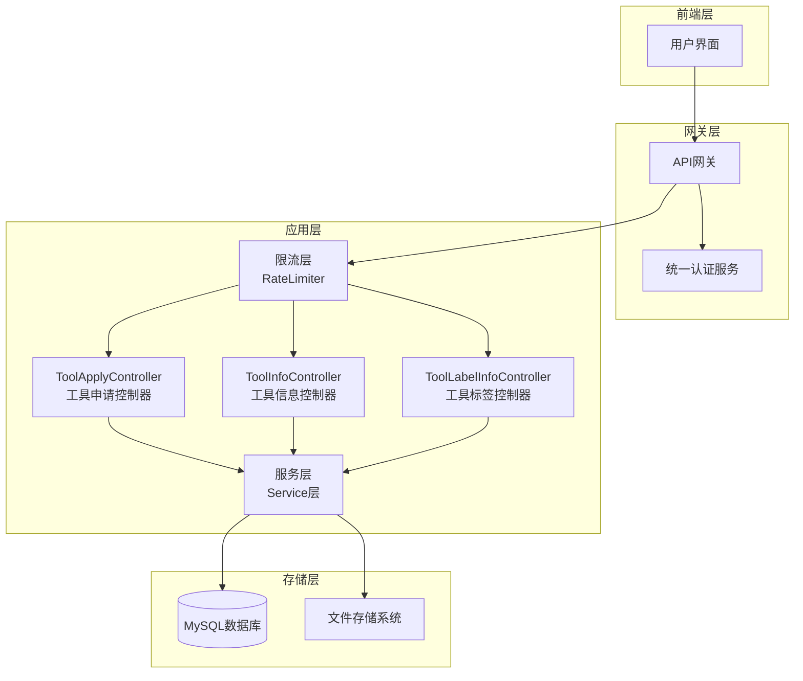
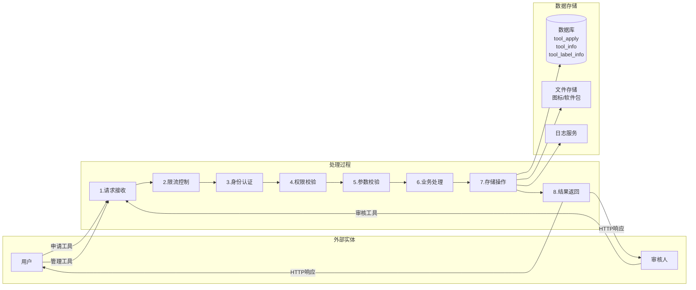
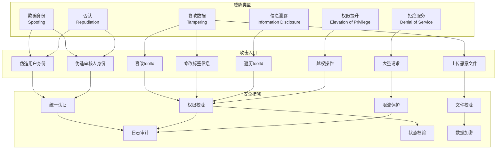
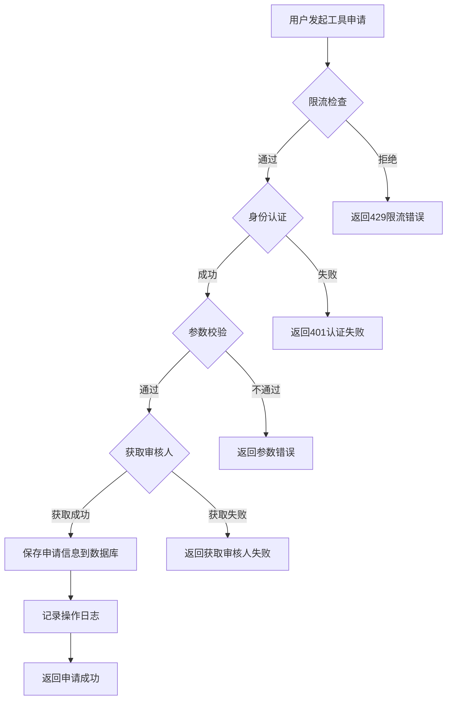
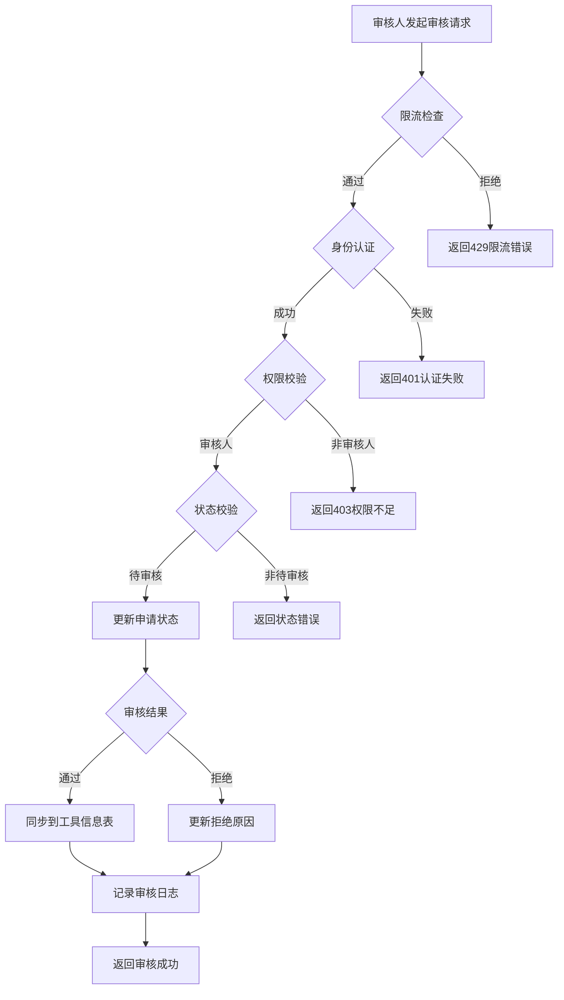
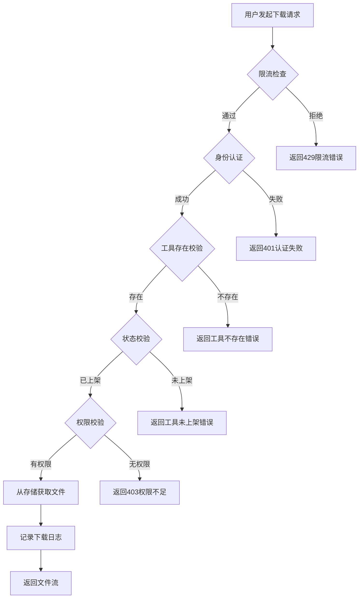
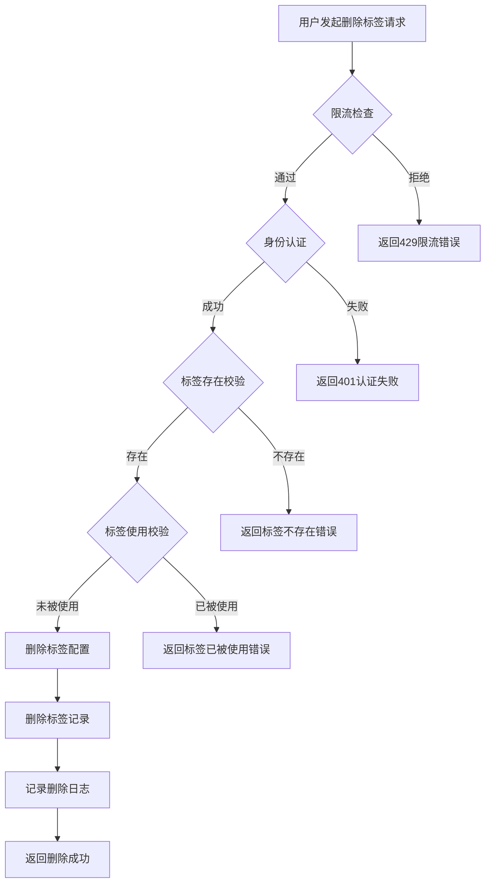
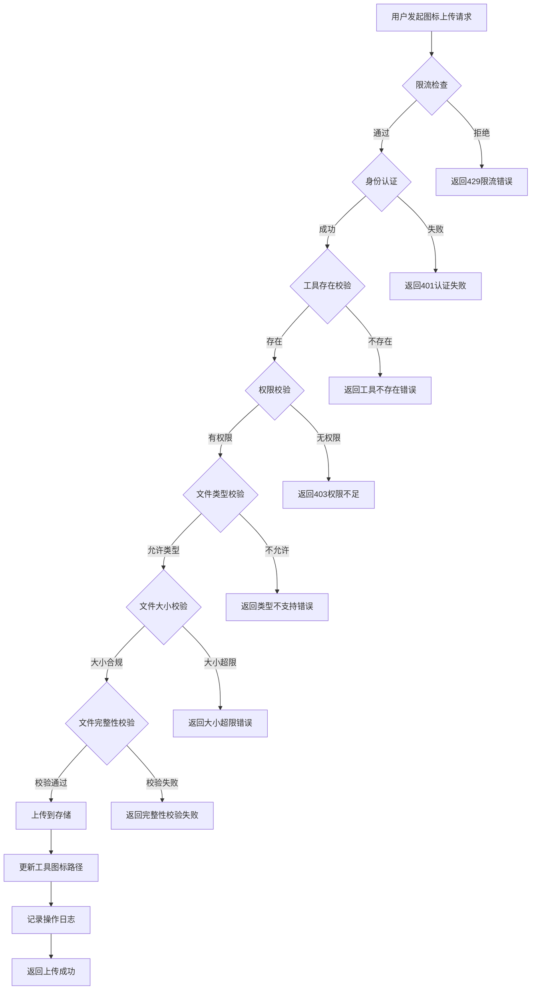

# 工具管理控制器安全威胁分析文档

---

## 1. 基础信息

> 本文对openlibing-framework项目中工具管理功能进行威胁分析，工具管理模块包含工具申请、工具信息管理、工具标签管理三个核心功能模块，负责工具的全生命周期管理。

---

## 2. 功能概述

### 2.1 功能架构图



**设计说明：** 工具管理模块采用分层架构设计，包含控制器层、服务层、存储层和限流层。

### 2.2 数据流图



**设计说明：**
1. 用户通过前端发起工具操作请求（申请、查询、修改、删除）
2. 请求经过限流层进行流量控制
3. 控制器层接收请求并调用服务层
4. 服务层进行权限校验、参数校验后操作数据库和文件存储
5. 操作结果记录到数据库和日志服务并返回用户

### 2.3 组件职责与接口

| 组件 | 职责 | 接口 |
|------|------|------|
| ToolApplyController | 处理工具申请相关请求 | /tool-apply/* (9个接口) |
| ToolInfoController | 处理工具信息管理请求 | /tool-info/* (12个接口) |
| ToolLabelInfoController | 处理工具标签管理请求 | /tool-label/* (5个接口) |
| ToolApplyServiceImpl | 工具申请业务逻辑处理 | saveToolApply, reviewToolInfo, undoApplyInfo |
| ToolInfoServiceImpl | 工具信息业务逻辑处理 | updateToolInfo, deleteToolInfo, downloadSoftwarePackage |
| ToolLabelInfoServiceImpl | 工具标签业务逻辑处理 | addToolLabelInfo, deleteToolLabelInfo |
| RateLimiterAspect | 接口限流保护 | 基于注解实现 |

---

## 3. 威胁分析 (Threat Modeling)

### 3.1 STRIDE威胁模型分析

| 威胁类别 | 攻击场景描述 (Scenario) | 风险等级/评分 | 对应减缓措施 (Mitigation)                          |
|----------|-------------------------|---------------|----------------------------------------------|
| **欺骗身份 (Spoofing)** | 攻击者伪造userId参数，冒充其他用户提交工具申请 | 高 | 1. 通过统一认证服务验证用户身份 2. userId从token中获取，不信任前端传参 |
| **欺骗身份 (Spoofing)** | 攻击者伪造审核人身份，审核工具申请 | 高 | 1. 审核操作需验证审核人权限 2. 记录审核人信息便于追溯               |
| **篡改数据 (Tampering)** | 攻击者修改请求中的toolId，操作其他用户的工具 | 高 | 1. 校验用户是否为工具创建者 2. 校验工具状态是否允许操作              |
| **篡改数据 (Tampering)** | 攻击者上传恶意文件（病毒、木马）作为工具图标或软件包 | 高 | 1. 文件类型白名单校验 2. 文件大小限制 3. 文件内容安全检测           |
| **篡改数据 (Tampering)** | 攻击者修改工具标签信息，影响工具分类 | 中 | 1. 标签操作权限校验 2. 标签删除时级联校验                     |
| **否认 (Repudiation)** | 用户否认提交过某个工具申请，声称被他人恶意操作 | 中 | 1. 记录操作日志（用户ID、时间、IP） 2. 数据库记录创建者信息          |
| **否认 (Repudiation)** | 审核人否认审核过某个工具申请 | 中 | 1. 记录审核日志（审核人、时间、审核意见） 2. 数据库记录审核人信息         |
| **信息泄露 (Information Disclosure)** | 攻击者通过遍历toolId下载他人工具软件包 | 高 | 1. 下载前校验用户权限 2. 校验工具状态（仅上架工具可下载）             |
| **信息泄露 (Information Disclosure)** | 敏感工具信息（内部工具）被未授权人员查看 | 高 | 1. 严格的权限控制 2. 工具列表查询进行权限过滤                   |
| **拒绝服务 (Denial of Service)** | 攻击者大量上传大文件，耗尽存储空间和带宽 | 高 | 1. 接口限流 2. 文件大小限制（图标20KB，软件包5GB）             |
| **拒绝服务 (Denial of Service)** | 攻击者频繁查询接口，耗尽数据库资源 | 中 | 1. 查询接口限流 2. 分页查询限制 3. 查询结果缓存                |
| **权限提升 (Elevation of Privilege)** | 普通用户通过接口漏洞直接审核工具申请 | 高 | 1. 校验用户是否具有审核权限 2. 审核接口仅对审核人开放               |
| **权限提升 (Elevation of Privilege)** | 非工具创建者通过接口漏洞删除他人工具 | 高 | 1. 校验用户是否为工具创建者 2. 校验工具状态                    |

### 3.2 威胁分析图



**设计说明/归档：** 工具管理功能面临的主要威胁包括：身份欺骗、数据篡改、信息泄露、拒绝服务攻击和权限提升。

---

## 4. 安全设计实现 (Security Mechanisms)

### 4.1 威胁模型评估

| 评估项 | 评估结果 | 说明 |
|--------|----------|------|
| 数据流图绘制 | ✅ 已完成 | 已绘制工具申请、工具信息管理、工具标签管理的数据流图 |
| 单点风险识别 | ✅ 已完成 | 识别了权限校验、文件校验、状态校验等关键节点 |

### 4.2 软件供应链安全

| 安全措施 | 实现状态 | 说明 |
|----------|----------|------|
| CVE漏洞扫描 | ✅ 已实现 | 版本级开源漏洞扫描 |
| 第三方包限制 | ✅ 已实现 | 仅引入必要的Spring组件和文件处理库 |
| 依赖版本管理 | ✅ 已实现 | 定期更新依赖版本，修复已知漏洞 |

### 4.3 凭证管理

| 安全措施 | 实现状态 | 说明 |
|----------|----------|------|
| 禁止硬编码 | ✅ 已实现 | 文件存储凭证存储在配置中心中，通过加密存储 |
| 密钥加密存储 | ✅ 已实现 | 使用三段式加密存储敏感配置 |
| 密钥定期轮转 | ✅ 已实现 | 通过配置中心管理密钥轮转 |

### 4.4 身份认证

| 安全措施 | 实现状态 | 说明 |
|----------|----------|------|
| 第三方授权登录 | ✅ 已实现 | 使用统一认证服务，不记录用户密码 |
| Token过期机制 | ✅ 已实现 | Token有过期时间，定期刷新 |
| 内部微服务调用认证 | ✅ 已实现 | 微服务间调用进行身份校验 |

### 4.5 数据安全

| 安全措施 | 实现状态 | 说明 |
|----------|----------|------|
| 传输加密 | ✅ 已实现 | 全链路TLS 1.2+加密 |
| 静态加密 | ✅ 已实现 | 文件存储启用服务端加密 |
| 敏感字段加密 | ✅ 已实现 | 用户信息等敏感字段加密存储 |
| 文件完整性校验 | ✅ 已实现 | 上传文件进行MD5/SHA256校验 |

### 4.6 运行时隔离

| 安全措施 | 实现状态 | 说明 |
|----------|----------|------|
| 非Root运行 | ✅ 已实现 | 微服务以非Root用户运行 |
| 容器隔离 | ✅ 已实现 | 使用容器化部署 |
| 文件上传隔离 | ✅ 已实现 | 上传文件存储在独立目录 |

### 4.7 日志审计

| 安全措施 | 实现状态 | 说明 |
|----------|----------|------|
| 操作日志记录 | ✅ 已实现 | 记录申请、审核、删除等操作 |
| 防篡改日志 | ✅ 已实现 | 日志存储在日志服务 |
| 4W信息记录 | ✅ 已实现 | 记录Who、When、Where、What |

---

## 5. 安全实现细节

### 5.1 权限校验实现

```java
// 工具申请权限校验：仅申请人可修改/撤销自己的申请
if (!toolApplyEntity.getApplyUserId().equals(userId)) {
    return DataResult.failureMessage("非申请人，无法进行修改/撤销操作");
}

// 工具审核权限校验：仅审核人可审核
if (!toolApplyEntity.getReviewerId().equals(userId)) {
    return DataResult.failureMessage("非审核人，无法进行审核操作");
}

// 工具信息修改权限校验：仅工具创建者可修改
if (!toolInfoEntity.getCreateBy().equals(userId)) {
    return DataResult.failureMessage("非工具创建者，无法进行修改操作");
}

// 工具下载权限校验：仅上架工具可下载
if (!"上架".equals(toolInfoEntity.getStatus())) {
    return DataResult.failureMessage("工具未上架，无法下载");
}
```

### 5.2 文件安全校验实现

```java
// 图标文件类型白名单校验
Set<String> iconAllowTypes = Set.of("png", "jpg");
boolean isContains = iconAllowTypes.contains(suffix);
if (!isContains) {
    return DataResult.failureMessage("图标类型不支持，仅支持png、jpg");
}

// 软件包文件类型白名单校验
Set<String> packageAllowTypes = Set.of("zip");
boolean isContains = packageAllowTypes.contains(suffix);
if (!isContains) {
    return DataResult.failureMessage("软件包类型不支持");
}

// 文件大小校验
long size = file.getSize();
if (suffix.matches("png|jpg") && size > 20) {
    return DataResult.failureMessage("图标大小超过20KB限制");
}
if (size > 5 * 1024 * 1024 * 1024) {
    return DataResult.failureMessage("软件包大小超过5GB限制");
}

// 文件完整性校验
String fileHash = DigestUtils.md5DigestAsHex(file.getInputStream());
```

### 5.3 限流保护实现

| 接口 | 限流速率 | 容量 | 说明 |
|------|----------|------|------|
| /tool-apply/save-tool-apply | 默认 | 默认 | 工具申请接口限流 |
| /tool-apply/review | 默认 | 默认 | 工具审核接口限流 |
| /tool-info/update-tool-icon | 默认 | 默认 | 图标更新接口限流 |
| /tool-info/download-software-package | 默认 | 默认 | 软件包下载接口限流 |
| /tool-label/add-label | 默认 | 默认 | 标签新增接口限流 |

### 5.4 状态校验实现

```java
// 工具申请状态校验：仅待审核状态可撤销
if (!"待审核".equals(toolApplyEntity.getStatus())) {
    return DataResult.failureMessage("仅待审核状态的申请可撤销");
}

// 工具申请状态校验：仅待审核状态可审核
if (!"待审核".equals(toolApplyEntity.getStatus())) {
    return DataResult.failureMessage("该申请已处理，无法再次审核");
}

// 工具信息状态校验：仅上架工具可下载
if (!"上架".equals(toolInfoEntity.getStatus())) {
    return DataResult.failureMessage("工具未上架，无法下载");
}
```

### 5.5 参数校验实现

```java
// 操作系统参数校验
@Pattern(regexp = "^(windows|linux|mac|harmonyos)$", message = "操作系统不合法")
private String operatingSystem;

// 分页参数校验
@NotNull @Range(min = 1, max = Integer.MAX_VALUE, message = "分页页码非法")
private Integer pageNum;

@NotNull @Range(min = 1, max = 100, message = "分页数量非法")
private Integer pageSize;
```

---

## 6. 安全配置项

| 配置项 | 说明            | 默认值       |
|--------|---------------|-----------|
| tool.icon.maxSize | 工具图标最大大小(KB)  | 20        |
| tool.package.maxSize | 工具软件包最大大小(GB) | 5         |
| tool.icon.allowedTypes | 允许的图标类型       | png,jpg |
| tool.package.allowedTypes | 允许的软件包类型      | zip       |

---

## 7. 安全测试用例

| 测试场景 | 测试步骤                      | 预期结果 |
|----------|---------------------------|----------|
| 越权申请 | 伪造userId提交工具申请            | 返回401认证失败 |
| 越权审核 | 非审核人尝试审核工具申请              | 返回403权限不足 |
| 越权修改 | 非工具创建者尝试修改工具信息            | 返回403权限不足 |
| 越权下载 | 尝试下载未上架工具的软件包             | 返回状态错误 |
| 恶意文件上传 | 上传exe文件作为工具图标             | 返回文件类型不支持错误 |
| 大文件上传 | 上传超过20KB的图标文件             | 返回文件大小超限错误 |
| 超大文件上传 | 上传超过5GB的软件包               | 返回文件大小超限错误 |
| 非法操作系统 | 提交操作系统参数为android          | 返回操作系统不合法错误 |
| 限流测试 | 短时间内发送大量申请请求              | 返回429限流错误 |
| 状态校验 | 在已通过状态下撤销申请               | 返回状态错误 |
| 路径遍历攻击 | 下载接口使用../../../etc/passwd | 返回参数错误或404 |
| 标签删除校验 | 删除已被使用的标签                 | 返回标签已被使用错误 |

---

## 8. 总结

工具管理功能通过以下安全措施有效减缓了STRIDE威胁：

1. **身份认证**：通过统一认证服务验证用户身份，防止身份欺骗
2. **权限控制**：严格的权限校验（申请人、审核人、创建者），防止越权操作
3. **文件校验**：类型、大小、完整性多重校验，防止恶意文件上传
4. **限流保护**：接口限流，防止拒绝服务攻击
5. **日志审计**：完整的操作日志，支持追溯和审计
6. **数据加密**：传输和存储加密，防止信息泄露
7. **状态校验**：严格的状态流转控制，防止非法操作

---

## 附录：流程图

### A.1 工具申请流程图



### A.2 工具审核流程图



### A.3 工具软件包下载流程图



### A.4 工具标签删除流程图



### A.5 工具图标上传流程图



---