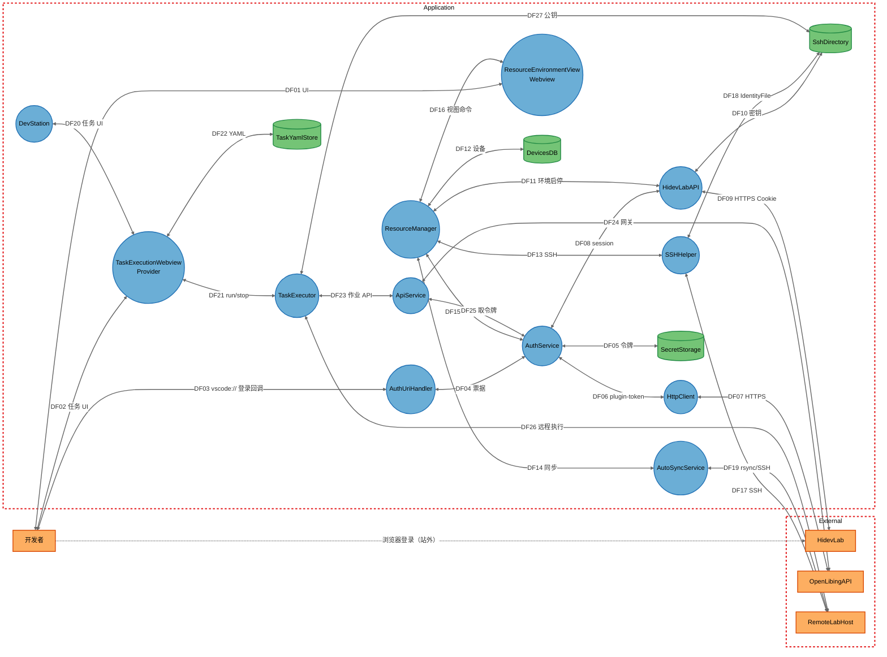

# openLiBing DevStation 安全威胁分析报告

| 字段            | 值                                                                              |
| --------------- | ------------------------------------------------------------------------------- |
| 报告版本        | 1.4                                                                             |
| 分析日期        | 2026-09-03                                                                      |
| 修订日期        | 2026-09-07（补总体风险评级口径；威胁统计可复核化；CVSS 复算）                     |
| 下次复核        | 2026-12-03（或重大版本发布后 30 天内，以较早者为准）                            |
| 仓库            | https://gitcode.com/openlibing/openlibing-ide-plugin.git                        |
| 分析基线分支    | `master`                                                                        |
| 分析基线提交    | `088fb81968403e6f3550afd6f6afc1459be8bd61`（短号 `088fb81`，提交日 2026-09-01） |
| 部署分类        | `LOCALHOST_DESKTOP`（VS Code 扩展，无产品 TCP 监听）                            |
| 风险评级        | Elevated（升高）—— 判定见 §1.1                                                  |
| 发现            | 15 条（Tier：T1 0 / T2 12 / T3 3；严重度：Critical 0 / Important 6 / Moderate 9 / Low 0） |
| 威胁            | 97 条 STRIDE-A（T1 0 / T2 71 / T3 26；其中 Platform 8、Open 89）—— 汇总见 §6    |
| 要素 / 信任边界 | 20 / 2（Application、External）；STRIDE 目标组件 19（不含 Operator）            |

> **交付说明：** 本文件为完整威胁分析交付物（单文件）。架构图、数据流、发现表、证据定位、修复建议与待核实项均收录于此，无其它配套文档。

> **披露说明：** 截至分析基线，15 条发现均为 **未修复**。公开渠道建议与插件维护方约定披露节奏；Important 项（FIND-01/02/03/04/06/07）在修复版本发布前，证据仅给文件/函数定位，不展开可复制的脆弱写法。

---

## 1. 结论摘要

DevStation 是安装在开发者工作站上的两款 VS Code 插件（ResourceManager + DevStation），用于登录华为 HidevLab / OpenLibing、申请远程环境、SSH 同步代码并执行 YAML 作业。

**攻击面口径：**

- 产品**不监听 TCP**，因此不存在“无前提、无交互的互联网直打端口”类 Tier 1 发现。
- 但 `vscode://` **深链回调**可由外部网页或邮件链接在受害者点击后触发，属于**需受害者交互的外部触发面**，不能简单等同于“本机已有恶意进程”。据此复核后，FIND-06 的前提为 Victim Interaction，CVSS 攻击向量为 Network（见第 4 节）。
- 结论应表述为：**无无交互远程直打面；存在需点击深链、需恶意扩展、需不可信网络或需打开投毒工作区等有前提路径。**

主要风险仍集中在客户端主动关闭校验与 IDE 扩展间信任过大：

1. HidevLab HTTP 客户端关闭 TLS 证书校验，相邻网络可窃听/篡改 session。
2. 所有 SSH/rsync 使用主机密钥不校验策略，可对实验室主机做 MITM。
3. 任意已加载扩展可调用令牌查询命令取得 accessToken。
4. HidevLab 的 `vscode://` 回调不校验 CSRF state，恶意深链可在用户点击后植入会话。
5. 任务 YAML 的 `run` 无沙箱，一点运行即远程任意命令。
6. 自定义设备密码明文写入本地库；默认 SSH 私钥以空口令生成。

登录令牌进入 SecretStorage、OpenLibing 授权码路径校验了 state，属于已有正向控制。

### 1.1 总体风险评级口径

**出处：** 产品级 Risk Rating 采用 threat-model-analyst 评估模板的四档体系（`Critical` / `Elevated` / `Moderate` / `Low`），与第 4 节单条发现的 **SDL Bugbar 严重度**（Critical / Important / Moderate / Low）是两套标签：前者描述**产品整体**，后者描述**单条发现**。

**档位含义（由高到低）：**

| 档位 | 含义 |
|------|------|
| Critical | 存在可无前提直打的暴露，或发现达到 Critical 严重度 |
| Elevated | 无 Critical 触发条件，但存在 Important 级开放发现，整体需优先治理 |
| Moderate | 开放发现最高仅为 Moderate |
| Low | 仅有 Low 级发现，或无开放发现 |

**由发现分布到评级的判定（自上而下，取最先命中）：**

1. **Critical**：存在 ≥1 条 Tier 1 发现，**或** 存在 ≥1 条 SDL 严重度为 Critical 的发现。  
2. **Elevated**：不满足 1，且存在 ≥1 条 Important 发现（任意 Tier）。  
3. **Moderate**：不满足 1–2，且存在 ≥1 条 Moderate 发现。  
4. **Low**：仅有 Low 级发现，或无开放发现。

**本报告推导：**

| 输入 | 值 |
|------|-----|
| Tier 1 发现 | 0 |
| Critical 严重度发现 | 0 |
| Important 发现 | 6（FIND-01、02、03、04、06、07） |
| Moderate 发现 | 9（其余 FIND） |

→ 不满足 Critical；满足「≥1 条 Important」→ **Elevated**。  
支撑本评级的核心发现为上述 6 条 Important（TLS/SSH 校验关闭、命令注入、深链 CSRF、YAML 无沙箱执行、Webview XSS）。若这 6 条全部修复且无新的 Important/Critical/Tier 1 发现，评级应下调至 Moderate 或更低。

---

## 2. 系统架构

两款扩展运行在同一台工作站的 VS Code 扩展宿主中，出站访问 HidevLab、OpenLibing 网关和远程 SSH 实验室。下图包含 AutoSyncService、Webview（ResourceEnvironmentView / TaskExecutionWebviewProvider）以及登录、环境启停相关连线。

**图注：** 虚线“浏览器登录（站外）”表示开发者在系统浏览器中完成 HidevLab 认证后，由 OS 协议处理器回跳 `vscode://`（DF03），图中以 Operator→HidevLab 虚线补齐叙事断链；实现上扩展并不代理该浏览器页。

### 主要数据流

| 场景       | 路径                                                                           | 协议                    | 图中对应              |
| ---------- | ------------------------------------------------------------------------------ | ----------------------- | --------------------- |
| 浏览器登录 | 开发者 → HidevLab → `vscode://` → AuthUriHandler → AuthService → SecretStorage | HTTPS + URI             | 虚线 + DF03–DF05      |
| 环境启停   | ResourceManager → HidevLabAPI → HidevLab                                       | HTTPS Cookie            | DF11 + DF09           |
| 代码同步   | AutoSyncService / SSHHelper → RemoteLabHost                                    | SSH（关闭主机密钥校验） | DF14/DF13 + DF19/DF17 |
| 运行作业   | TaskExecutionWebviewProvider → TaskExecutor → OpenLibing / 远程                | HTTPS + SSH             | DF21–DF26             |

---

## 3. 信任边界与暴露面

| 边界        | 含义                                                                   |
| ----------- | ---------------------------------------------------------------------- |
| Application | 本机扩展进程、Webview、SecretStorage、LevelDB、`~/.ssh`、`.devstation` |
| External    | 开发者、HidevLab、OpenLibing、远程实验室 SSH 主机                      |

### 暴露面分类

| 暴露面                 | 入口                                | 最低前提               | 说明                                                                                        |
| ---------------------- | ----------------------------------- | ---------------------- | ------------------------------------------------------------------------------------------- |
| IDE 命令 / Webview IPC | VS Code 命令、`postMessage`         | Local Process Access   | 需本机已有可向扩展发消息的进程（含其他扩展）                                                |
| **OS 深链（单列）**    | `vscode://` URI Handler             | **Victim Interaction** | 外部页面/链接即可构造；**不要求**攻击者先在本机执行代码，但需要受害者打开链接或完成登录跳转 |
| 出站 HTTPS / SSH       | HidevLab、OpenLibing、实验室        | Internal Network       | 相邻网络或路径上的 MITM                                                                     |
| 本地存储               | SecretStorage、devices.db、`~/.ssh` | Host/OS Access         | 可读用户配置目录或钥匙串材料                                                                |

### 前提词表（发现表用语）

| 前提                 | 攻击者能力画像                                               | 典型归入           |
| -------------------- | ------------------------------------------------------------ | ------------------ |
| None                 | 无认证、无交互即可从外网直达                                 | Tier 1（本产品无） |
| Victim Interaction   | 诱导受害者点击深链、完成 OAuth 跳转或打开恶意页              | Tier 2             |
| Local Process Access | 同用户会话下已有进程/已加载扩展，可调 VS Code 命令或读进程表 | Tier 2             |
| Authenticated User   | 已持有有效云端会话（或可让扩展以该会话调用 API）             | Tier 2             |
| Privileged User      | 本机操作者主动执行高影响动作（打开工作区、点运行、开同步）   | Tier 2             |
| Internal Network     | 处于出站流量路径（同 Wi-Fi、恶意代理、公司边缘 MITM 等）     | Tier 2             |
| Host/OS Access       | 可读/写用户配置目录或等价主机权限（不止“同用户进程列表”）    | Tier 3             |

**Tier 2 与 Tier 3 边界：**

- **Tier 2（Local Process Access）**：攻击面停留在“同用户下可观察/调用扩展 IPC 或进程 argv”，无需打开磁盘上的凭据存储文件。
- **Tier 3（Host/OS Access）**：需要文件系统或钥匙串级访问才能触及 at-rest 机密（如 LevelDB 明文密码、`~/.ssh` 私钥）。二者同属本机，但 Host/OS Access 假设更强的失陷深度，故设备库/密钥文件类发现归 Tier 3。

---

## 4. 安全发现（按可利用层级）

### 评分口径（CVSS 4.0）

- 版本：**CVSS 4.0**；分数均按 [FIRST CVSS 4.0](https://www.first.org/cvss/v4.0/) 官方算法由向量串复算得到（本表用 `cvss` Python 库交叉核对）。  
- **UI：** 需受害者点击深链或确认运行时记为 `UI:A`（FIND-03、FIND-06）。  
- **AV：** 出站可被相邻网络利用记 `AV:A`；深链由外部网页触发记 `AV:N` + `UI:A`；仅本机 IPC/进程/文件记 `AV:L`。  
- **部署：** 按 `LOCALHOST_DESKTOP` 评分，不假设产品对外监听。  
- **SDL 严重度与 CVSS 默认映射：** Critical ≥9.0；Important 7.0–8.9；Moderate 4.0–6.9；Low <4.0。不另作凭据类上调；**相同向量串必须对应相同分数与同一严重度档**。  
- **同分说明：** FIND-05 / FIND-10 / FIND-14 向量完全相同 → 均为 **6.8 / Moderate**；FIND-08 / FIND-09 向量相同 → 均为 **6.9 / Moderate**；FIND-11 / FIND-15 向量相同 → 均为 **4.8 / Moderate**。FIND-13 为 6.9（相对 FIND-14 多了 `VI:L`）。

### 处理状态

截至基线提交，**全部发现状态均为：未修复**。修复落地后请回写提交/版本号至本表「状态」列。

### Tier 1 — 无前提直打

无。本产品不是网络服务，且深链路径仍需受害者交互（非 `UI:N` 的无前提远程利用）。

### Tier 2 — 需单一前提

| ID | 严重度 | CVSS | 向量（CVSS 4.0） | 标题 | 前提 | 状态 | 工作量 |
|----|--------|------|------------------|------|------|------|--------|
| FIND-01 | Important | 8.6 | `CVSS:4.0/AV:A/AC:L/AT:N/PR:N/UI:N/VC:H/VI:H/VA:N/SC:N/SI:N/SA:N` | HidevLab 客户端禁用 TLS 证书校验 | Internal Network | 未修复 | Low |
| FIND-02 | Important | 8.6 | `CVSS:4.0/AV:A/AC:L/AT:N/PR:N/UI:N/VC:H/VI:H/VA:N/SC:N/SI:N/SA:N` | SSH 全面关闭主机密钥校验 | Internal Network | 未修复 | Medium |
| FIND-04 | Important | 8.5 | `CVSS:4.0/AV:L/AC:L/AT:N/PR:L/UI:N/VC:H/VI:H/VA:H/SC:N/SI:N/SA:N` | Shell 拼接导致命令注入 | Authenticated User | 未修复 | Medium |
| FIND-06 | Important | 8.5 | `CVSS:4.0/AV:N/AC:L/AT:N/PR:N/UI:A/VC:H/VI:H/VA:N/SC:N/SI:N/SA:N` | HidevLab vscode:// 回调缺少 CSRF | Victim Interaction | 未修复 | Medium |
| FIND-03 | Important | 8.4 | `CVSS:4.0/AV:L/AC:L/AT:N/PR:N/UI:A/VC:H/VI:H/VA:H/SC:N/SI:N/SA:N` | 任务 YAML 无沙箱即可远程任意命令 | Privileged User | 未修复 | Medium |
| FIND-07 | Important | 8.4 | `CVSS:4.0/AV:L/AC:L/AT:N/PR:L/UI:N/VC:H/VI:H/VA:N/SC:N/SI:N/SA:N` | 资源环境 Webview XSS 且无 CSP | Authenticated User | 未修复 | Medium |
| FIND-08 | Moderate | 6.9 | `CVSS:4.0/AV:L/AC:L/AT:N/PR:N/UI:N/VC:H/VI:N/VA:N/SC:N/SI:N/SA:N` | SSH 密码出现在进程命令行 | Local Process Access | 未修复 | Medium |
| FIND-09 | Moderate | 6.9 | `CVSS:4.0/AV:L/AC:L/AT:N/PR:N/UI:N/VC:H/VI:N/VA:N/SC:N/SI:N/SA:N` | 认证失败回落 test_token 并打印密码 | Local Process Access | 未修复 | Low |
| FIND-05 | Moderate | 6.8 | `CVSS:4.0/AV:L/AC:L/AT:N/PR:L/UI:N/VC:H/VI:N/VA:N/SC:N/SI:N/SA:N` | 任意扩展可通过命令取得 Access Token | Local Process Access | 未修复 | Medium |
| FIND-10 | Moderate | 6.8 | `CVSS:4.0/AV:L/AC:L/AT:N/PR:L/UI:N/VC:H/VI:N/VA:N/SC:N/SI:N/SA:N` | 同步与公钥上传导致密钥/源码外泄 | Privileged User | 未修复 | Medium |
| FIND-12 | Moderate | 6.8 | `CVSS:4.0/AV:L/AC:L/AT:N/PR:L/UI:N/VC:N/VI:N/VA:H/SC:N/SI:N/SA:N` | 缺少客户端节流导致云端资源滥用 | Authenticated User | 未修复 | Medium |
| FIND-11 | Moderate | 4.8 | `CVSS:4.0/AV:L/AC:L/AT:N/PR:L/UI:N/VC:L/VI:L/VA:N/SC:N/SI:N/SA:N` | 工作区 .env 可切换控制面与 Debug | Privileged User | 未修复 | Low |

### Tier 3 — 需本机/失陷前提

| ID | 严重度 | CVSS | 向量（CVSS 4.0） | 标题 | 前提 | 状态 | 工作量 |
|----|--------|------|------------------|------|------|------|--------|
| FIND-13 | Moderate | 6.9 | `CVSS:4.0/AV:L/AC:L/AT:N/PR:L/UI:N/VC:H/VI:L/VA:N/SC:N/SI:N/SA:N` | 设备密码明文写入 LevelDB | Host/OS Access | 未修复 | Medium |
| FIND-14 | Moderate | 6.8 | `CVSS:4.0/AV:L/AC:L/AT:N/PR:L/UI:N/VC:H/VI:N/VA:N/SC:N/SI:N/SA:N` | 空口令默认 SSH 私钥并改写用户 SSH config | Host/OS Access | 未修复 | Medium |
| FIND-15 | Moderate | 4.8 | `CVSS:4.0/AV:L/AC:L/AT:N/PR:L/UI:N/VC:L/VI:L/VA:N/SC:N/SI:N/SA:N` | 安全相关操作缺少防篡改审计 | Host/OS Access | 未修复 | Medium |

### 证据要点

高严重度项仅给定位入口，不展开可复制载荷。路径相对分析基线仓库根目录。

| ID      | 定位（文件 / 区域）                                                                                                             |
| ------- | ------------------------------------------------------------------------------------------------------------------------------- |
| FIND-01 | `local-build/src/utils/HidevLabHttpClient.ts`（TLS 校验关闭；Cookie 注入）                                                      |
| FIND-02 | `local-build/src/utils/SSHHelper.ts`；`ResourceEnvironmentCommands.ts`（写入 SSH config）；`AutoSyncService.ts`（ProxyCommand） |
| FIND-03 | `DevStation/src/core/taskExecutor.ts`（YAML `run` → 远程/本机执行）；`taskValidator.ts`（仅校验非空）                           |
| FIND-04 | `SSHHelper.ts`（`buildSshCommand` / `shell: true`）；`taskExecutor.ts`（远程路径拼接）                                          |
| FIND-05 | `local-build/src/auth/AuthCommands.ts`；`extension.ts`（global AuthService）；`DevStation/src/utils/authHelper.ts`              |
| FIND-06 | `AuthUriHandler.ts`（HidevLab 回调无 state；对比 OpenLibing 的 state 校验分支）                                                 |
| FIND-07 | `ResourceEnvironmentView.ts`（innerHTML / 无 CSP）；`taskExecution.html`（CSP 含 unsafe-inline）                                |
| FIND-08 | `AutoSyncService.ts`；`SSHHelper.ts`（`buildPlinkCommand`）；`ResourceEnvironmentCommands.ts`（sshpass）                        |
| FIND-09 | `DevStation/src/services/apiService.ts`（`test_token` 回落）；`HttpClient.ts`（错误响应日志）                                   |
| FIND-10 | `AutoSyncService.ts`（工作区同步）；`HidevLabApi.ts`（公钥读取/生成）；任务 YAML `env`                                          |
| FIND-11 | `AuthService.getEnvironment`、`HttpClient.loadEnvironment`、`HidevLabAPI.initDebugMode`（读工作区 `.vscode/.env`）              |
| FIND-12 | `HidevLabAPI` 启停删无节流；`ApiService.allocateContainer`；`EnvConfig IS_DELETE` 默认 true                                     |
| FIND-13 | `StorageService.ts`（devices.db JSON）；`device.types.ts`；`ResourceEnvironmentProvider` 保存 password                          |
| FIND-14 | `HidevLabApi.ts`（空口令 `ssh-keygen`）；`ResourceEnvironmentCommands.ts`（`updateSshConfig`）                                  |
| FIND-15 | `Logger`（LogOutputChannel）；`taskExecutor` 写 `results`；SecretStorage 无设备绑定审计                                         |

---

## 5. 建议优先修复

> 下列均为**待做**方向；状态列见第 4 节。FIND-10 / 12 / 15 一并给出修复方向，避免遗漏。

### 立刻可做（Quick Wins）

1. 恢复 HidevLab 出站 TLS 证书校验（FIND-01）。
2. 未登录时禁止回落测试令牌，日志禁止输出 password（FIND-09）。
3. 生产构建忽略工作区对环境控制面的覆盖（FIND-11）。

### 高优先级

4. SSH 启用 TOFU 或已存指纹校验；使用插件独立 config，避免改写用户全局主机密钥策略（FIND-02、FIND-14）。
5. 限制令牌查询命令的调用方扩展 ID（FIND-05）。
6. HidevLab 回调绑定登录发起时的 state；票据勿放在 query（FIND-06）。
7. Webview 全面编码动态文本并加严格 CSP（FIND-07）。
8. 远程命令用参数数组 spawn，禁止把 host/password/path 拼进 shell；禁止 argv 传密（FIND-04、FIND-08）。
9. 设备密码迁入 SecretStorage；密钥改为插件专用且非空口令（FIND-13、FIND-14）。
10. 运行 YAML 前展示将执行的命令，并限制路径逃逸（FIND-03）。

### 其余发现

11. **FIND-10：** 同步排除密钥与敏感路径；公钥上传前确认目标环境；远程侧限制工作区权限。
12. **FIND-12：** 客户端对创建/启停/作业提交做节流与确认；依赖服务端配额作为主控。
13. **FIND-15：** 对登录、密钥生成、环境删除等写操作增加不可轻易篡改的审计（至少本地结构化审计 + 关键时间戳），与云端审计对齐。

---

## 6. STRIDE 覆盖与威胁统计（可复核）

分析对 **19 个非人员组件**做完整 STRIDE-A（S/T/R/I/D/E + Abuse）。Operator 仅为外部人员，不作为 STRIDE 目标。单文件交付不展开每条威胁全文，下列汇总与映射足以核对头部「97 / 0 / 71 / 26」及「约 8%」平台缓解占比。

### 6.1 威胁分层判定（与第 3 节发现 Tier 对齐）

| 威胁 Tier | 标签 | 前提规则（与发现表同一套词表） |
|-----------|------|--------------------------------|
| T1 | Direct Exposure | 前提为 `None`（无认证、无交互即可从外网直达） |
| T2 | Conditional Risk | 单一前提：`Victim Interaction` / `Local Process Access` / `Authenticated User` / `Privileged User` / `Internal Network` 之一 |
| T3 | Defense-in-Depth | `Host/OS Access`，或需多重失陷前提 |

组件最低暴露前提决定该组件威胁的默认分层；具体行可因攻击路径收紧或放宽，但不得出现「产品无 TCP 监听却标 T1」这类与部署分类矛盾的条目。本产品部署为 `LOCALHOST_DESKTOP` → **威胁 T1 = 0**。

### 6.2 按组件汇总（STRIDE-A 计数）

| 组件 | S | T | R | I | D | E | A | 合计 | T1 | T2 | T3 |
|------|---|---|---|---|---|---|---|------|----|----|-----|
| ResourceManager | 1 | 1 | 1 | 1 | 0 | 1 | 0 | 5 | 0 | 3 | 2 |
| AuthService | 1 | 1 | 1 | 1 | 0 | 1 | 1 | 6 | 0 | 4 | 2 |
| AuthUriHandler | 1 | 1 | 1 | 1 | 0 | 1 | 1 | 6 | 0 | 5 | 1 |
| HidevLabAPI | 1 | 1 | 1 | 1 | 1 | 1 | 1 | 7 | 0 | 6 | 1 |
| HttpClient | 1 | 1 | 0 | 1 | 0 | 0 | 0 | 3 | 0 | 3 | 0 |
| SSHHelper | 1 | 1 | 1 | 1 | 1 | 1 | 1 | 7 | 0 | 6 | 1 |
| AutoSyncService | 1 | 1 | 0 | 1 | 0 | 1 | 1 | 5 | 0 | 5 | 0 |
| ResourceEnvironmentView | 0 | 1 | 0 | 1 | 0 | 1 | 1 | 4 | 0 | 4 | 0 |
| DevStation | 1 | 0 | 0 | 1 | 0 | 0 | 1 | 3 | 0 | 3 | 0 |
| TaskExecutor | 1 | 1 | 1 | 1 | 1 | 1 | 1 | 7 | 0 | 4 | 3 |
| ApiService | 1 | 1 | 1 | 1 | 1 | 1 | 1 | 7 | 0 | 6 | 1 |
| TaskExecutionWebviewProvider | 0 | 1 | 0 | 1 | 0 | 1 | 1 | 4 | 0 | 4 | 0 |
| SecretStorage | 0 | 1 | 0 | 1 | 1 | 1 | 0 | 4 | 0 | 0 | 4 |
| DevicesDB | 0 | 1 | 0 | 1 | 1 | 0 | 0 | 3 | 0 | 0 | 3 |
| SshDirectory | 1 | 1 | 0 | 1 | 0 | 1 | 0 | 4 | 0 | 0 | 4 |
| TaskYamlStore | 0 | 1 | 0 | 1 | 0 | 0 | 1 | 3 | 0 | 0 | 3 |
| HidevLab | 1 | 1 | 1 | 1 | 1 | 1 | 1 | 7 | 0 | 7 | 0 |
| OpenLibingAPI | 1 | 1 | 1 | 1 | 1 | 1 | 1 | 7 | 0 | 7 | 0 |
| RemoteLabHost | 0 | 1 | 0 | 1 | 1 | 1 | 1 | 5 | 0 | 4 | 1 |
| **合计** | **13** | **18** | **9** | **19** | **9** | **15** | **14** | **97** | **0** | **71** | **26** |

校验：13+18+9+19+9+15+14 = **97**；T1+T2+T3 = 0+71+26 = **97**。

### 6.3 状态与平台缓解

| 状态 | 条数 | 说明 |
|------|------|------|
| Open | 89 | 映射入第 4 节 15 条发现（多对一合并） |
| Platform | 8 | 依赖云端平台已有控制，不单开 FIND |
| Mitigated | 0 | — |

Platform（8/97 ≈ **8.2%**）：`T17.T` `T17.R` `T17.I` `T17.E`（HidevLab 侧完整性/审计/TLS/RBAC）、`T18.T` `T18.R` `T18.I` `T18.E`（OpenLibing 侧同类）。客户端仍须自证的路径（如 FIND-01 TLS 校验）不因平台 TLS 而标 Platform。

### 6.4 威胁 → 发现映射原则

1. **合并：** 同一根因/同一修复动作的多条 Open 威胁归入一条 FIND（多对一）。  
2. **全覆盖：** 89 条 Open 威胁均应出现在下表 Related 列；Platform 8 条不进 FIND。  
3. **分层继承：** FIND 的 Tier 取其所覆盖威胁中**最严重**（可利用性最高）的一层。  
4. **编号：** `T{组件序号}.{STRIDE-A 字母}`，组件序号与上表行序一致（ResourceManager=01 … RemoteLabHost=19）。

| FIND | 覆盖的 Open 威胁 ID |
|------|---------------------|
| FIND-01 | T04.S, T04.T, T04.I |
| FIND-02 | T06.S, T07.S |
| FIND-03 | T10.A, T10.D, T10.E, T12.A, T16.A, T16.T, T19.E, T19.T |
| FIND-04 | T06.T, T06.E, T06.A, T07.E, T10.T, T12.E, T19.A |
| FIND-05 | T01.S, T01.I, T02.S, T02.I, T05.S, T09.S, T09.I, T09.A |
| FIND-06 | T03.S, T03.T, T03.I, T03.E, T03.A, T02.A, T02.E, T17.S |
| FIND-07 | T08.T, T08.I, T08.E, T08.A, T12.T, T12.I |
| FIND-08 | T06.I, T07.I |
| FIND-09 | T11.S, T11.I, T11.A, T05.I, T18.S |
| FIND-10 | T07.T, T07.A, T04.A, T19.I, T16.I |
| FIND-11 | T01.T, T04.R, T05.T, T11.T |
| FIND-12 | T04.D, T06.D, T11.D, T11.E, T17.D, T17.A, T18.D, T18.A, T19.D |
| FIND-13 | T14.T, T14.I, T14.D, T01.E |
| FIND-14 | T04.E, T10.S, T15.S, T15.T, T15.I, T15.E |
| FIND-15 | T01.R, T02.T, T02.R, T03.R, T06.R, T10.R, T10.I, T11.R, T13.T, T13.I, T13.D, T13.E |

上表 Open 威胁 ID **共 89 个互不重复**（含 T19.T）；加 Platform 8 个 = **97**。

---

## 7. 待核实

下列项**不在**第 4 节发现表中，按**独立跟踪项**管理；核实结论应回写本节，并在成立时升格为 FIND-xx 或单独安全缺陷单。

| 项                                                            | 跟进方                    | 结论去向                                                                        | 若成立的影响                 | 原因                                    |
| ------------------------------------------------------------- | ------------------------- | ------------------------------------------------------------------------------- | ---------------------------- | --------------------------------------- |
| 网关是否接受 `test_token`                                     | OpenLibing / 网关后端团队 | 回写本节；成立则强化 FIND-09 或新增网关侧 FIND                                  | 未登录即可冒充测试身份       | 本仓库无服务端                          |
| GitCode `pull_request_target` + `ROBOT_TOKEN` 检出外部 PR SHA | 发布工程 / CI 负责人      | **单独立项**（供应链/CI），不并入运行时 FIND 表，除非确认可导致不可信工作流执行 | 可绕过代码评审影响构建与发布 | CI 不在运行时组件表；平台权限模型需复核 |
| HidevLab 环境级 ACL                                           | HidevLab 云端安全         | 回写本节；不足则新增平台 FIND 或 Transfer Risk                                  | 跨环境越权                   | 仅见客户端 `checkCreatePermission`      |
| `playwright-chromium` 是否打进 VSIX                           | 插件发布负责人            | 回写本节；若捆绑则新增供应链 FIND                                               | 扩大攻击面与包体积           | package.json 有依赖，src 未引用         |
