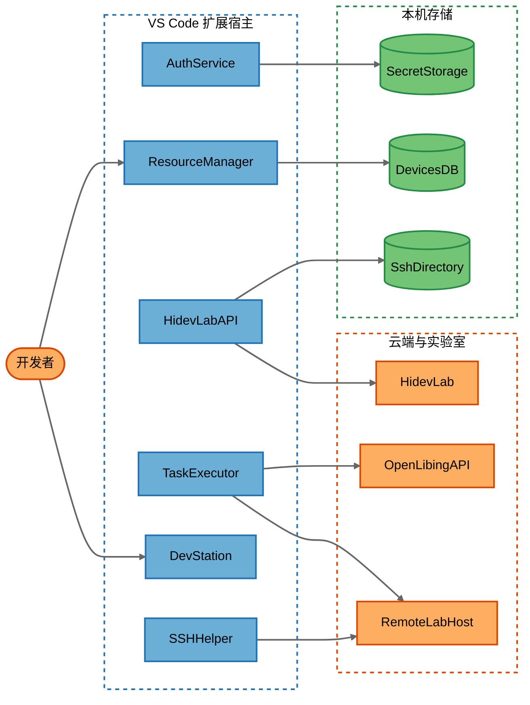

# openLiBing DevStation 安全威胁分析报告

**仓库：** https://gitcode.com/openlibing/openlibing-ide-plugin.git  
**提交：** `088fb81`（2026-09-01）  
**部署分类：** `LOCALHOST_DESKTOP`（VS Code 扩展，无对外监听端口）  
**风险评级：** Elevated（升高）  
**发现：** 15 条（Tier 1：0，Tier 2：12，Tier 3：3）  
**威胁：** 97 条 STRIDE-A（T1：0，T2：71，T3：26）  
**要素 / 信任边界：** 20 / 2（Application、External）

> 本文件为中文整合报告。完整 STRIDE 表、DFD 源文件与 JSON 清单见同目录其他文件。

---

## 1. 结论摘要

DevStation 是安装在开发者工作站上的两款 VS Code 插件（ResourceManager + DevStation），用于登录华为 HidevLab / OpenLibing、申请远程环境、SSH 同步代码并执行 YAML 作业。攻击者不能从互联网直接打到插件监听端口，因此**没有 Tier 1（无前提远程利用）发现**。

真正的问题在客户端自己关掉了本应存在的校验，以及 IDE 扩展之间的信任过大：

1. HidevLab HTTP 客户端设置 `NODE_TLS_REJECT_UNAUTHORIZED=0`，相邻网络即可窃听/篡改 session。
2. 所有 SSH/rsync 使用 `StrictHostKeyChecking=no`，可对实验室主机做 MITM。
3. 任意已加载扩展可调用 `openlibing.getUserTokenInfo` 拿到 accessToken。
4. HidevLab 的 `vscode://` 回调不校验 CSRF state，票据出现在 URL 查询串。
5. `.devstation` YAML 的 `run` 无沙箱，一点运行即远程任意命令（常为 root）。
6. 自定义设备密码明文写入 LevelDB；默认 `id_rsa` 以空口令生成。

登录令牌进入 SecretStorage、OpenLibing 授权码路径校验了 state，这些是已有的正向控制。

---

## 2. 系统架构

两款扩展运行在同一台工作站的 VS Code 扩展宿主中，出站访问 HidevLab、OpenLibing 网关和远程 SSH 实验室。

### 主要数据流

| 场景 | 路径 | 协议 |
|------|------|------|
| 浏览器登录 | 开发者 → HidevLab → `vscode://` → AuthService → SecretStorage | HTTPS + URI |
| 环境启停 | ResourceManager → HidevLabAPI → HidevLab | HTTPS Cookie `sessionId` |
| 代码同步 | AutoSyncService / SSHHelper → 远程主机 | SSH（关闭主机密钥校验） |
| 运行作业 | Webview → TaskExecutor → OpenLibing 网关 → 远程执行 `step.run` | HTTPS + SSH |

---

## 3. 信任边界与暴露面

| 边界 | 含义 |
|------|------|
| Application | 本机扩展进程、Webview、SecretStorage、LevelDB、`~/.ssh`、`.devstation` |
| External | 开发者、HidevLab、OpenLibing、远程实验室 SSH 主机 |

插件不监听 TCP。Webview `postMessage`、VS Code 命令和 `vscode://` 视为本机 IPC（最低前提：Local Process Access）。出站 HTTPS/SSH 流量可被局域网中间人看到（最低前提：Internal Network）。本地文件存储最低前提为 Host/OS Access。

---

## 4. 安全发现（按可利用层级）

### Tier 1 — 无前提直打

无。本产品不是网络服务。

### Tier 2 — 需单一前提

| ID | 严重度 | CVSS | 标题 | 前提 | 工作量 |
|----|--------|------|------|------|--------|
| FIND-01 | Important | 8.6 | HidevLab 客户端禁用 TLS 证书校验 | Internal Network | Low |
| FIND-02 | Important | 8.6 | SSH 全面关闭主机密钥校验 | Internal Network | Medium |
| FIND-03 | Important | 8.4 | 任务 YAML 无沙箱即可远程任意命令 | Privileged User | Medium |
| FIND-04 | Important | 8.3 | Shell 拼接导致命令注入 | Authenticated User | Medium |
| FIND-05 | Important | 7.3 | 任意扩展可通过命令取得 Access Token | Local Process Access | Medium |
| FIND-06 | Important | 7.3 | HidevLab vscode:// 回调缺少 CSRF | Local Process Access | Medium |
| FIND-07 | Important | 7.2 | 资源环境 Webview XSS 且无 CSP | Authenticated User | Medium |
| FIND-08 | Important | 6.8 | SSH 密码出现在进程命令行 | Local Process Access | Medium |
| FIND-09 | Moderate | 6.8 | 认证失败回落 test_token 并打印密码 | Local Process Access | Low |
| FIND-10 | Moderate | 6.7 | 同步与公钥上传导致密钥/源码外泄 | Privileged User | Medium |
| FIND-11 | Moderate | 6.1 | 工作区 .env 可切换控制面与 Debug | Privileged User | Low |
| FIND-12 | Moderate | 5.9 | 缺少客户端节流导致云端资源滥用 | Authenticated User | Medium |

### Tier 3 — 需本机/失陷前提

| ID | 严重度 | CVSS | 标题 | 前提 | 工作量 |
|----|--------|------|------|------|--------|
| FIND-13 | Important | 6.8 | 设备密码明文写入 LevelDB | Host/OS Access | Medium |
| FIND-14 | Important | 6.8 | 空口令默认 SSH 私钥并改写用户 SSH config | Host/OS Access | Medium |
| FIND-15 | Moderate | 5.1 | 安全相关操作缺少防篡改审计 | Host/OS Access | Medium |

### 证据要点

- **FIND-01：** `local-build/src/utils/HidevLabHttpClient.ts` 设置 `NODE_TLS_REJECT_UNAUTHORIZED = "0"`。
- **FIND-02：** `SSHHelper.ts`、`AutoSyncService.ts`、`updateSshConfig` 均 `StrictHostKeyChecking=no`。
- **FIND-03：** `taskExecutor.ts` 将 `step.run` 作为远程 entrypoint；校验器只检查非空。
- **FIND-05：** `AuthCommands.ts` 的 `openlibing.getUserTokenInfo` 返回完整 token；`extension.ts` 把 `authService` 挂到 `global`。
- **FIND-06：** `AuthUriHandler.ts` 对 HidevLab 回调不校验 state；OpenLibing 路径有校验。
- **FIND-07：** `ResourceEnvironmentView.ts` 用 `innerHTML` 拼接设备名，无 CSP。
- **FIND-08 / FIND-13：** `sshpass -p` / plink `-pw`；`devices.db` JSON 含 `password`。
- **FIND-14：** `ssh-keygen -N ""` 写用户 `~/.ssh/id_rsa`。

---

## 5. 建议优先修复

### 立刻可做（Quick Wins）

1. 删除 `NODE_TLS_REJECT_UNAUTHORIZED=0`（FIND-01）。
2. 未登录时禁止回落 `test_token`，日志禁止打印 password（FIND-09）。
3. 生产构建忽略工作区 `.vscode/.env` 对控制面的覆盖（FIND-11）。

### 随后

4. SSH 启用 TOFU 或已存指纹校验；用独立 config，不要改用户全局 `StrictHostKeyChecking`（FIND-02、FIND-14）。
5. 限制 `getUserTokenInfo` 调用方扩展 ID（FIND-05）。
6. HidevLab 回调绑定登录发起时的 state，票据不要放在 query（FIND-06）。
7. Webview 全面 HTML 转义并加 CSP（FIND-07）。
8. 命令用参数数组 spawn，禁止把 host/password/path 拼进 shell（FIND-04、FIND-08）。
9. 设备密码迁入 SecretStorage；密钥改为插件专用且非空口令（FIND-13、FIND-14）。
10. 运行 YAML 前展示命令并限制路径逃逸（FIND-03）。

---

## 6. STRIDE 覆盖说明

对 19 个非人员组件做了完整 STRIDE-A（Spoofing / Tampering / Repudiation / Information Disclosure / Denial of Service / Elevation of Privilege / Abuse）。云端控制面完整性、审计、RBAC、TLS 服务端配置共 8 条标为平台缓解（约 8%）。其余 Open 威胁均映射到上述 15 条发现。分组件明细见 [2-stride-analysis.md](2-stride-analysis.md)。

---

## 7. 待核实

| 项 | 原因 |
|----|------|
| 网关是否接受 `test_token` | 本仓库无服务端 |
| GitCode `pull_request_target` + `ROBOT_TOKEN` 检出 PR SHA | CI 平台权限不在运行时组件内，需平台侧复核 |
| HidevLab 环境级 ACL | 仅见客户端 `checkCreatePermission` |
| `playwright-chromium` 是否打进 VSIX | package.json 有依赖，src 未引用 |

---

## 8. 同目录文件

| 文件 | 内容 |
|------|------|
| [0-assessment.md](0-assessment.md) | 英文结构评估（元数据、引用） |
| [0.1-architecture.md](0.1-architecture.md) | 组件、场景时序、暴露表 |
| [1-threatmodel.md](1-threatmodel.md) | 详细 DFD 与流表 |
| [2-stride-analysis.md](2-stride-analysis.md) | 全量 STRIDE-A |
| [3-findings.md](3-findings.md) | 发现全文（证据/修复/验证） |
| [threat-inventory.json](threat-inventory.json) | 机器可读清单 |
