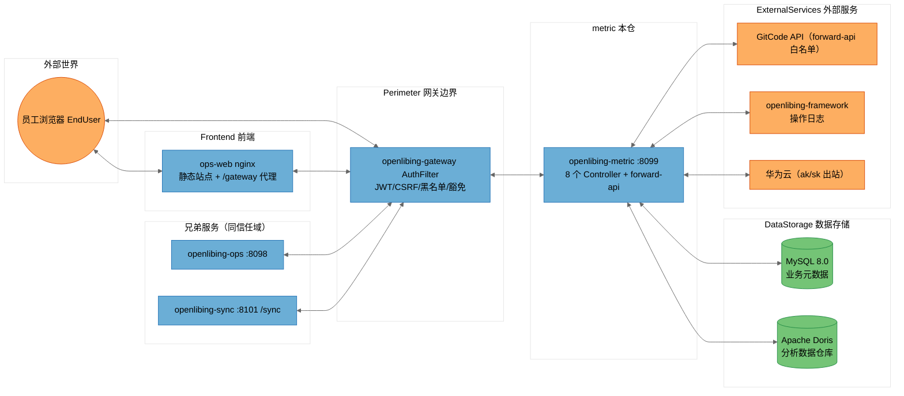

# [openlibing-metric]安全威胁建模分析报告（STRIDE-A）——远程主干基线（单仓版）

> 分析对象：`openlibing-metric` 单仓（含其与 `openlibing-gateway`、`openlibing-common`、`openlibing-framework`、`openlibing-ops`、`openlibing-sync`、`openlibing-ops-web` 及外部服务的信任关系）。
> 分析方法：STRIDE-A（欺骗 Spoofing / 篡改 Tampering / 否认 Repudiation / 信息泄露 Information Disclosure / 拒绝服务 Denial of Service / 权限提升 Elevation of Privilege / 滥用 Abuse），零信任视角 + 纵深防御。
> 结论分级：按**可利用性层级（Tier 1/2/3）**组织，而非按严重级别组织。
> 分析基线：**远程仓最新主干分支**（`origin/main`，HEAD `414def6`），通过 git worktree 独立检出，不影响本地开发分支。
> 文档性质：本报告为原合并版《[openlibing-ops、ops-web、metric、sync]安全威胁建模分析报告》拆分出的**单仓版**，拆分时保留与 metric 相关的跨仓信任边界与跨仓系统性发现章节。

---

## 文档信息与元数据

| 字段 | 值 |
| --- | --- |
| 分析模型 | DeepSeek-V4-Flash（threat-model-analyst skill 驱动）；补充 3 项缺口（sync Python 采集脚本、Dockerfile 构建供应链完整性、镜像 SBOM/cosign/seccomp）证据合并自 MiniMax-M3 独立分析报告，本仓相关项为 FIND-35 跨仓构建供应链 |
| 分析基线类型 | 远程仓主干分支（git worktree 独立检出，detached HEAD，分析完成后已清理） |
| 仓库 | `openlibing-metric`，远程主干 `origin/main`，HEAD `414def6` |
| 分析范围 | 本仓源码 + 配置 + 部署脚本 + CI 工作流；信任边界证据来自 `openlibing-gateway`/`openlibing-common` 相关代码与 docs 记录 |
| 输出位置（归档） | `openlibing-docs/architecture_desgin/openlibing-metric/[openlibing-metric]安全威胁建模分析报告.md`（PR 合入主仓 master 后生效） |

---

## 一、执行摘要（Executive Summary）

### 1.1 总体安全态势

OpenLibing 运营域 `openlibing-metric` 仓（远程主干基线）的**工程化与"默认安全"基础较好**：容器镜像加固到位（非 root、umask、删除调试工具、RASP 注入、JRE-only）、配置中心快照不落盘、SQL 全参数化（`${}` 0 命中）+ BlockAttack 防全表更新、XXE 防护齐全、CI 具备 CodeQL 静态扫描 + pre-commit 门禁、日志注入有净化处理。

但存在一个**结构性、跨仓共性的核心弱点在本仓的体现**：**metric 服务端零认证、零鉴权、零有效限流**，身份与授权完全外置到 `openlibing-gateway`（单点失效）。本仓特有的高价值暴露面是 **`/forward-api` 出站转发滥用**：客户端可自携 `token/apiKey` 出站到白名单域名并回传响应，构成凭据滥用 / 借道 SSRF / 数据外带通道；同时**华为云 ak/sk 与平台 token 明文落库**。

> **Note on threat counts:** 本报告共识别 **10 条 STRIDE-A 威胁（T13~T22）**、整合为 **8 条发现（FIND-01 记入本仓行 + FIND-10~FIND-17）**，其中 Tier 2 共 6 条、Tier 3 共 2 条（本仓无 Tier 1 直接暴露项）。威胁计数会因网关路由实际配置（本报告未覆盖 `openlibing-gateway` 的完整路由豁免表）而波动，相关不确定性已在"分析上下文与假设"中声明。
>
> **基线注意：** 远程主干 CI 已**移除 nightly 防投毒/SCA 扫描工作流**（`nightly-schedule-scan.yml` 仅存在于本地开发分支，未合入主干），供应链纵深防御弱于本地开发分支（相关跨仓发现 FIND-35）。

### 1.2 威胁计数总览（metric）

| 仓库 | Tier 1 | Tier 2 | Tier 3 | 发现合计 | 最突出弱点 |
| --- | --- | --- | --- | --- | --- |
| openlibing-metric | 0 | 6 | 2 | 8 | `/forward-api` 出站转发滥用 + 敏感凭据明文落库 |

> 注：FIND-01（跨仓系统性发现：服务端零认证 + 限流死代码）统计口径上记入本仓行（Tier 2）；FIND-14/FIND-17 为本仓 Tier 3 发现；FIND-35（跨仓构建供应链完整性）单列"跨仓"行，详见第四章。

### 1.3 需优先处置的 Top 风险（metric）

1. **（Tier 2）`/forward-api` 出站转发滥用**：客户端可注入任意 `token/apiKey` 出站到 gitcode.com 等白名单域名并回传响应，构成凭据滥用 / 借道 SSRF / 数据外带通道。
2. **（Tier 2，跨仓）服务端零认证 + 限流死代码**：metric 仓无任何服务端鉴权、`RateLimitConfig` 从未挂载到请求链路，网关是唯一屏障。
3. **（Tier 2）`delete/{metricCode}` 用 GET 语义**：配合网关纵向权限漏配可触发任意删除。
4. **（Tier 3）华为云 ak/sk 与平台 giteeToken/gitcodeToken 明文落库**。
5. **（Tier 3，跨仓）镜像构建供应链完整性缺失**：Dockerfile 以 `wget` 拉取 JRE 无签名校验，缺 SBOM/cosign/seccomp（FIND-35）。

---

## 二、系统全景、部署模型与信任边界

### 2.1 metric 在四仓体系中的角色与数据流

```
                        ┌────────────────────────────────────────────────────────────┐
                        │                        外部世界                             │
                        │   员工浏览器 EndUser        第三方应用/测试框架 ThirdParty      │
                        └───────┬───────────────────────────────┬────────────────────┘
                                │ HTTPS（含 CSRF 双提交 Cookie）  │ HTTPS
                                ▼                               ▼
                     ┌─────────────────────┐        ┌──────────────────────┐
                     │ openlibing-gateway  │        │ sync 数据接入/上传    │
                     │ AuthFilter：JWT/CSRF │        │ /sync/api/data/ingest │
                     │ 黑名单/纵向权限/豁免  │        │ /sync/testcase/metadata/upload │
                     └──┬──────┬──────┬────┘        └──────────┬───────────┘
                        ▼      ▼      ▼                        ▼
              ┌──────────┐ ┌────────┐ ┌──────────┐   ┌──────────────────────┐
              │ ops:8098 │ │metric: │ │ops-web   │   │ sync:8101 (context /sync)│
              │ 13控制器  │ │8099 8控制器│ │ nginx    │   │ 24 个 XXL-Job handler   │
              └────┬─────┘ └───┬────┘ │ 静态站点  │   └────┬───────────┬───────┘
                   │           │      └────┬─────┘        │           │
                   ▼           ▼           │              ▼           ▼
        ┌────────────────── MySQL + Doris（双数据源，DDD @DataSource 切换）────────────┐
        └────────────────────────────────────────────────────────────────────────────┘
        metric 还经 Feign/RestTemplate 出站调用：
        GitCode API（forward-api 白名单）、openlibing-framework（操作日志）、
        华为云（ak/sk 明文落库，出站调用）
```

### 2.2 部署分类（metric）

- **分类：`K8S_SERVICE`**（Kubernetes 部署，经网关暴露，Nacos Discovery 以 HTTPS `secure: true` 注册；本基线为 Apollo）。
- **配置中心**：远程主干仍为 **Apollo**（`apollo.meta` + `apollo.bootstrap.namespaces`）；Nacos 迁移在本地 `feat-apollo-eureka-nacos` 开发分支进行，未合入主干。
- **信任模型**：身份认证（JWT）、CSRF、黑名单、纵向权限统一由网关执行；metric **不承担任何服务端身份校验**，网关是该体系的唯一认证屏障（单点）。
- **前置条件底板**：metric 服务直连端口仅集群内网可达 → 网关绕过类攻击前置条件至少为 `Internal Network`（Tier 2）；经网关的用户侧接口前置条件为 `Authenticated User`（Tier 2）。

### 2.3 信任边界与 DFD（metric 视角）



**信任边界说明（metric 视角）：**

| 边界 | 含义 | 关键事实 |
| --- | --- | --- |
| `External` | 浏览器 | 员工经网关鉴权 |
| `Perimeter` | 网关边界 | AuthFilter 是唯一认证执行点（[AuthFilter.java](file:///c:/w30060144/develop/repositories/openlibing/openlibing-gateway/src/main/java/com/openlibing/gateway/business/filter/AuthFilter.java)） |
| `Frontend` | ops-web nginx | 同源 /gateway 代理；无安全响应头 |
| `SiblingServices` | ops / sync | 同信任域兄弟服务；均无服务端鉴权，Doris 为共享数据存储 |
| `MetricContext` | metric 本仓 | 服务端零认证；端口集群内网可达；forward-api 出站转发面 |
| `DataStorage` | MySQL / Doris | 双数据源；连接串由 Apollo 配置中心下发 |
| `ExternalServices` | GitCode / framework / 华为云 | 出站调用；forward-api 白名单含 gitcode 等域名 |

### 2.4 跨仓信任边界与攻击路径（metric 相关）

> 本单仓版保留跨仓视角，便于定位 metric 在体系中的受信位置与上游/下游风险传导。

| 跨仓关系 | 信任方向 | 风险传导路径 | 本仓受影响威胁 |
| --- | --- | --- | --- |
| metric → Doris（共享） | 写/读 | sync `/api/data/ingest` 零认证匿名直写 Doris → metric 指标统计读到被污染的指标数据 | T18 等读路径 |
| metric ↔ gateway | 完全信任网关 | 网关绕过（`/manage` 剥离、豁免遗漏、SSRF）→ metric 全部接口匿名可达，含 `delete/{metricCode}` 删除接口 | T13/T19 |
| metric → GitCode API（forward-api） | 出站 | 客户端自携 `token/apiKey` 借 metric 服务身份出站，白名单域名本身即可作为外带/凭据滥用目标 | T14/T22 |
| metric → framework | 出站 | framework 操作日志若被注入/篡改，审计链被污染（跨仓否认面） | T20 |
| 兄弟仓（ops/sync） | 同信任域 | 任一仓被攻破（如 sync Tier 1 零认证写接口）可横向移动直连 metric 内网端口，取用明文 ak/sk 库 | T13 |

---

## 三、openlibing-metric 安全分析

### 3.1 组件与攻击面

| 组件 ID | 锚点（证据文件） | 暴露面 |
| --- | --- | --- |
| AiDashboardController | `api/controller/AiDashboardController.java` | `metric/ai-dashboard` user-data / user-usage / **forward-api** |
| DigitalMetricInfoController | `api/controller/DigitalMetricInfoController.java` | `/manage/digital/metric` page/save/{metricCode}/delete |
| DataAssetColumnInfoController | `api/controller/DataAssetColumnInfoController.java` | `/manage/dataasset/column` query/update |
| DigitalOperationDimensionController | `api/controller/DigitalOperationDimensionController.java` | `/manage/digital/dimension` page/save/delete |
| DataAssetTableRegistryController | `api/controller/DataAssetTableRegistryController.java` | `/manage/dataasset/table` query/update |
| DigitalOperationDomainController | `api/controller/DigitalOperationDomainController.java` | `/manage/digital/domain` page/save/delete |
| AiDashboardForwarder | `app/service/metric/AiDashboardService.java` | forward-api 出站转发（SSRF 白名单） |
| SecretStore | `domain/project/entity/HwProjectInfo.java`、`ProjectCommonAccountInfo.java` | ak/sk、giteeToken/gitcodeToken 明文落库 |
| DataAccess | `DataSourceConfig.java` + `mapper/*.xml` | MySQL + Doris；BlockAttack 防全表更新 |
| LogPipeline | `LogSanitizer.java` + `DashboardLoggerAspect.java` + `AbstractLogHandler.java` | 审计日志（完整请求体序列化） |
| DockerContainer | `Dockerfile` + `start.sh` + `monitor.sh` | 运行时加固 |

### 3.2 STRIDE-A 威胁表（metric）

| 威胁 ID | STRIDE 类别 | 威胁描述 | 前置条件 | Tier |
| --- | --- | --- | --- | --- |
| T13.S | S 欺骗 | 8 个 Controller 无服务端鉴权，全依赖网关；直连/绕过后身份可伪造 | `Internal Network` | T2 |
| T14.S | S 欺骗 | `/forward-api` 允许客户端自携 `token/apiKey` 作为 Authorization 出站，可借服务身份调用 gitcode 等白名单 API | `Authenticated User` | T2 |
| T15.I | I 信息泄露 | `forward-api` catch 通用 Exception 后把 `e.getMessage()` 回传客户端（[AiDashboardController.java:92-95](file:///c:/w30060144/tmp-tm-metric/src/main/java/com/openlibing/metric/api/controller/AiDashboardController.java#L92-L95)） | `Authenticated User` | T2 |
| T16.I | I 信息泄露 | 生产/预发 Swagger api-docs 全量开放（application-prod.yaml swagger-ui enabled: true） | `Authenticated User` | T2 |
| T17.I | I 信息泄露 | 华为云 ak/sk 与平台 giteeToken/gitcodeToken 明文落库（[HwProjectInfo.java:25-28](file:///c:/w30060144/tmp-tm-metric/src/main/java/com/openlibing/metric/domain/project/entity/HwProjectInfo.java#L25-L28)） | `Admin Credentials` | T3 |
| T18.D | D 拒绝服务 | `RateLimitConfig` 死代码无消费方；`AiDashboardRequest.pageSize` 无上限校验，可超大分页击穿 Doris | `Authenticated User` | T2 |
| T19.E | E 权限提升 | `delete/{metricCode}` 用 GET 语义，配合网关纵向权限漏配可触发任意删除 | `Authenticated User` | T2 |
| T20.R | R 否认 | 审计日志把方法参数 `JSON.toJSONString(paramsMap)` 全量序列化（仅移除 `request` 键），未系统性脱敏 token/密码，且无身份强绑定 | `Authenticated User` | T2 |
| T21.I | I 信息泄露 | 解密密钥材料（`*.ks`、`openlibing.pfx`、`cacerts`）随 Docker 镜像分发（[Dockerfile:41-49](file:///c:/w30060144/tmp-tm-metric/Dockerfile)），与密文同源 `security.part1` 单点 | `Admin Credentials` | T3 |
| T22.A | A 滥用 | forward-api 对 GET 拼 query / POST 全量透传 body，无参数白名单与长度约束，可被当作外部请求代理/外带通道 | `Authenticated User` | T2 |

**STRIDE-A 汇总（metric）**：S=2，T=0，R=1，I=4，D=1，E=1，A=1，共 **10 条**。Tampering 为空是因为该仓 SQL 全部参数化（`${}` 0 命中）+ BlockAttack 拦截器；此项记为已缓解。

### 3.3 metric 组件级 STRIDE 明细（节选高风险组件）

**AiDashboardForwarder（forward-api）—— 出站转发滥用：**

| 威胁 | 证据 | 影响 |
| --- | --- | --- |
| 凭据自携出站 | [AiDashboardService.java:184-194](file:///c:/w30060144/tmp-tm-metric/src/main/java/com/openlibing/metric/app/service/metric/AiDashboardService.java)；`ApiForwardRequest.java:27,30` 允许客户端传 `token/apiKey` | 攻击者用任意凭据借服务出口 IP 调 gitcode API；可探测内网可达的 SSRF 目标（虽有白名单） |
| 白名单覆盖 gitcode | [AiDashboardService.java:45-51](file:///c:/w30060144/tmp-tm-metric/src/main/java/com/openlibing/metric/app/service/metric/AiDashboardService.java#L45-L51) 白名单含 `gitcode.com`、`api.gitcode.com`、`console.enterprise.trae.cn` 等 | 白名单域名本身即可作为外带/凭据滥用的合法目标 |
| 错误详情回传 | [AiDashboardController.java:92-95](file:///c:/w30060144/tmp-tm-metric/src/main/java/com/openlibing/metric/api/controller/AiDashboardController.java#L92-L95) `Result.error(HTTP_REQUEST_ERROR, e.getMessage())` | 内部异常/目标响应错误信息暴露给调用方 |

**SecretStore —— 静态凭据明文：** `HwProjectInfo.ak/sk`（华为云访问密钥对）与 `ProjectCommonAccountInfo.giteeToken/gitcodeToken` 均以**明文字段**读写 MySQL（`openlibing` 库），无加密、无脱敏、无审计读取。虽本仓未暴露对应写接口，但任何具备库读权限的路径（备份、DBA、横向移动）可直接取用云 AK/SK 与平台令牌。

**DataAccess —— 已缓解项：** mapper 全参数化（`${}` 0 命中）、`BlockAttackInnerInterceptor` 防全表更新/删除、密码运行时 `SecurityUtil.decrypt` 解密。

---

## 四、跨仓系统性发现（metric 相关）

### FIND-01（Tier 2，跨仓）：服务端零认证 + 限流死代码系统性单点失效

- **证据链**：ops / metric / sync 三仓 Controller 均无服务端鉴权注解/拦截器（metric 全仓无 `HandlerInterceptor`/`WebMvcConfigurer`/`@PreAuthorize` 挂载入站校验）；ops/metric 的 `RateLimitConfig.getApiConfig` 为死代码（无 Filter/Interceptor 消费，远程主干为 Apollo 版纯配置类）；身份认证、CSRF、黑名单、纵向权限全部外置于 `openlibing-gateway` 的 AuthFilter。
- **影响**：网关是唯一认证屏障（单点失效）。任何网关绕过路径（内网横向移动、SSRF、网关路由豁免遗漏、`/manage` 前缀剥离混淆、sync 第三方直连面）即 metric 全部读写接口（含 `delete/{metricCode}` 删除接口）匿名可达。
- **治理方向（分层，metric 相关）**：
  1. **服务端零信任改造**：引入统一入站校验中间件（可复用 openlibing-common 的 `FeignAccessTokenInterceptor` 思路扩展到服务端），至少对写接口/敏感接口做服务端身份与租户校验。
  2. **网关路由豁免表审计**：梳理 `/manage` 前缀豁免路径，最小化白名单，禁止无条件剥离。
  3. **限流落地**：将 RateLimitConfig 挂载到 Filter/Interceptor 或网关侧限流，覆盖 forward-api、分页查询等高频面。
  4. **纵深防御**：forward-api 收紧（固定凭据）、审计日志脱敏、静态凭据加密托管（KMS/Vault）。

### FIND-35（Tier 3，跨仓）：镜像构建供应链完整性缺失（JRE 无签名校验 + 缺 SBOM/cosign/seccomp）【合并补充】

- **证据链**：metric Dockerfile 以 `wget https://mirrors.tuna.tsinghua.edu.cn/Adoptium/...` 拉取 JRE，**无签名/SHA256 校验**（构建期供应链）；未生成镜像 SBOM（syft/cyclonedx）、未做镜像签名（cosign）、未声明 K8s seccompProfile / readOnlyRootFilesystem（运行时纵深防御）。证据来自 MiniMax-M3 独立分析。
- **影响**：构建机/镜像源被控或传输劫持时，可注入带毒 JRE 进最终镜像且事后无法核验；镜像无 SBOM/签名则 SBOM 关联分析、镜像来源审计与运行时策略约束缺失。
- **治理方向**：① JRE 改为构建期本地预下载 + SHA256 固定；② CI 集成 syft 生成 SBOM + cosign 签名；③ K8s 模板补 `seccompProfile: RuntimeDefault` 与 `readOnlyRootFilesystem`；④ 与供应链完整性合并治理，纳入 nightly SCA 扫描范围。

---

## 五、发现清单（metric，FIND-01 + FIND-10 ~ FIND-17）

| 发现 | 仓库 | Tier | STRIDE | 对应威胁 | 摘要与处置方向 |
| --- | --- | --- | --- | --- | --- |
| FIND-01 | 跨仓（记入本仓） | T2 | S/D | 跨仓 | 服务端零认证 + 限流死代码系统性单点失效（详见第四章） |
| FIND-10 | metric | T2 | S/E | T13,T19 | 服务端零认证 + GET 语义删除接口（`delete/{metricCode}`）依赖网关纵向权限 |
| FIND-11 | metric | T2 | S/A | T14,T22 | `/forward-api` 出站转发滥用：客户端自携 `token/apiKey` 出站 + 代理/外带通道 |
| FIND-12 | metric | T2 | I | T15 | forward-api 异常 `e.getMessage()` 回传客户端 |
| FIND-13 | metric | T2 | I | T16 | 生产/预发 Swagger api-docs 全量开放（远程主干 `application-prod.yaml` 已核实） |
| FIND-14 | metric | T3 | I | T17 | 华为云 ak/sk、平台 giteeToken/gitcodeToken 明文落库 |
| FIND-15 | metric | T2 | D | T18 | 限流死代码 + `pageSize` 无上限可超大分页击穿 Doris |
| FIND-16 | metric | T2 | R | T20 | 审计日志全量序列化参数未系统性脱敏 token/密码 |
| FIND-17 | metric | T3 | I | T21 | 解密密钥材料（`*.ks`/pfx/cacerts）随镜像分发、与密文同源单点 |

> 注：FIND-35（跨仓构建供应链，Tier 3）与本仓 Dockerfile 直接相关，详见第四章。

---

## 六、优先修复路线图（metric 相关）

### Phase 1 —— Tier 1，立即（本周内）

本仓无 Tier 1 直接暴露项（sync 的 Tier 1 见 sync 单仓报告）。

### Phase 2 —— Tier 2，短期（1~2 个迭代）

1. **forward-api 收紧**：服务端固定凭据、禁止客户端自携 `token/apiKey`、异常信息脱敏（FIND-11/FIND-12）。
2. **三仓限流落地**：将 `RateLimitConfig` 挂载到 Filter/Interceptor，或网关侧配置限流，覆盖 forward-api/分页查询（FIND-15）。
3. **生产 Swagger 关闭**：`swagger-ui.enabled`/`api-docs.enabled` 置 false（FIND-13）。
4. **网关豁免路径审计**：梳理 `/manage` 豁免表，最小化白名单（FIND-10）。
5. **`delete/{metricCode}` GET 语义改造**：改为 POST/DELETE 并加服务端权限校验（FIND-10）。
6. **审计日志脱敏**：token/密码字段打码后再序列化（FIND-16）。

### Phase 3 —— Tier 3，中期（结合迁移/发布窗口）

7. **静态凭据加密托管**：ak/sk、平台 token 迁至 KMS/Vault，解密密钥与密文分离存储（FIND-14）。
8. **镜像内嵌证书材料移除与轮换机制**：`*.ks`/pfx/cacerts 改由运行期从安全通道拉取（FIND-17）。
9. **镜像构建供应链完整性**：JRE 本地预下载 + SHA256 固定、CI 集成 syft/cosign、K8s 补 seccomp/readOnlyRootFilesystem（FIND-35）。

---

## 七、已缓解项与正向工程化基线（肯定面，metric）

以下控制经代码/配置证据核实为已启用，作为纵深防御基线保留：

- **容器加固**：非 root（`USER openlibing`）、`umask 0077`、nologin 锁口令、删除 gdb/perl/gcc 等调试编译工具、JRE-only、注入 RASP、`-Dfastjson.parser.safeMode=true`、显式 trustStore。
- **配置中心快照不落盘**：`SnapShotSwitch.setIsSnapShot(false)`。
- **SQL 参数化基线**：metric mapper `${}` 0 命中 + `BlockAttackInnerInterceptor` 防全表更新/删除；数据库口令经 `SecurityUtil.decrypt` 运行时解密。
- **XXE 防护**：XML 解析器禁外部实体（既有基线）。
- **日志注入净化**：共用 `LogSanitizer` 移除 CRLF/控制字符。
- **CSRF 双提交**：ops-web `http.ts` 携带 `Csrf-Token-Open-Li-Bing`；网关 AuthFilter 校验。
- **供应链 CI（主干）**：CodeQL 静态扫描（`codeql.yaml`，Push/PR 触发）+ pre-commit 门禁；**注意：nightly 防投毒/SCA 扫描（`nightly-schedule-scan.yml`）未合入主干**。

---

## 八、分析上下文、假设与局限

- **分析基线**：**远程仓最新主干分支**（metric `414def6`），通过 git worktree 独立检出（detached HEAD），分析期间不影响本地开发分支（本地 metric=`feat-apollo-eureka-nacos`），完成后已清理 worktree 并切回原分支。
- **与本地开发分支（Nacos 迁移分支）的差异**：本地 `feat-apollo-eureka-nacos` 为 Nacos 配置中心迁移版；远程主干仍为 Apollo。差异文件集中在 CI 工作流（主干移除 `nightly-schedule-scan.yml`）、`RateLimitConfig`（主干为 Apollo 纯配置类，死代码结论不变）、配置文件（`application-*.yaml`）。**业务代码（Controller/Service/Mapper）两个基线几乎一致，10 条威胁 / 8 条发现全部成立。**
- **未覆盖范围**：`openlibing-gateway` 完整路由豁免表、`openlibing-common` 内部认证中间件全部细节、第三方 SDK（CodeBuddy/Lingma/CodeArts）内部实现、Doris/MySQL 底层权限配置。
- **合并补充来源**：FIND-35（跨仓构建供应链）的证据来自 MiniMax-M3 独立分析报告，未在本报告主体的 DeepSeek 分析中独立复跑核实；相关文件行号以 MiniMax 报告为准。
- **计数波动**：威胁计数会因网关实际豁免配置而波动；Tier 划分以"本仓内可验证证据"为准，未做渗透测试/DAST 实证。
- **证据性质**：所有"已缓解"项按代码/配置证据判定，未做运行时验证（未注入、未真实攻击）。
- **敏感信息**：本报告不包含任何真实凭据/密钥值，仅描述存在性与处置方向。
- **单仓拆分说明**：本报告由合并版拆分而来，跨仓系统性发现（FIND-01/FIND-35）按与 metric 的关联度保留在第四、五章；完整跨仓视图见合并版或各兄弟仓单仓报告。
- **后续建议**：可基于本报告派生（a）网关路由豁免表专项审计；（b）metric forward-api 专项整改；（c）迁移（Nacos）合入主干后对 Tier 2 项的回归验证清单。

---

## 九、附录：STRIDE-A 汇总矩阵（metric）

| 仓库 | S 欺骗 | T 篡改 | R 否认 | I 信息泄露 | D 拒绝服务 | E 权限提升 | A 滥用 | 威胁数 | Tier1 | Tier2 | Tier3 |
| --- | --- | --- | --- | --- | --- | --- | --- | --- | --- | --- | --- |
| openlibing-metric | 2 | 0 | 1 | 4 | 1 | 1 | 1 | 10 | 0 | 8 | 2 |

> 说明：威胁层 Tier 分布（Tier2=8 / Tier3=2，合计 10 条）与发现层 Tier 分布（Tier2=6 / Tier3=2，合计 8 条）不同，系跨仓/同主题威胁合并归类所致（FIND-11 合并 T14/T22、FIND-01 为跨仓归类），属预期差异。Tampering=0 系全仓 SQL 参数化 + BlockAttack，记已缓解。

---

*报告生成：threat-model-analyst skill（STRIDE-A + 零信任 + 纵深防御），基线=远程仓主干分支（metric=origin/main），2026-08-21。本报告由《[openlibing-ops、ops-web、metric、sync]安全威胁建模分析报告》拆分而来，用于归档 openlibing-docs/architecture_desgin/openlibing-metric。*
