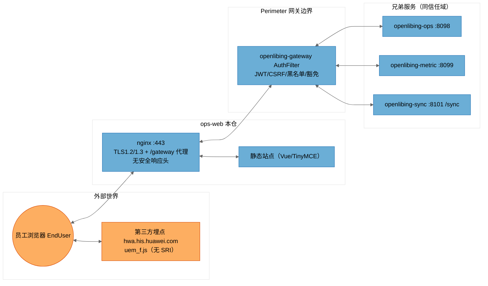

# [openlibing-ops-web]安全威胁建模分析报告（STRIDE-A）——远程主干基线（单仓版）

> 分析对象：`openlibing-ops-web` 单仓（含其与 `openlibing-gateway`、`openlibing-ops`、`openlibing-metric`、`openlibing-sync` 及外部服务的信任关系）。
> 分析方法：STRIDE-A（欺骗 Spoofing / 篡改 Tampering / 否认 Repudiation / 信息泄露 Information Disclosure / 拒绝服务 Denial of Service / 权限提升 Elevation of Privilege / 滥用 Abuse），零信任视角 + 纵深防御。
> 结论分级：按**可利用性层级（Tier 1/2/3）**组织，而非按严重级别组织。
> 分析基线：**远程仓最新主干分支**（`origin/main`，HEAD `7ca9554`），通过 git worktree 独立检出，不影响本地开发分支。
> 文档性质：本报告为原合并版《[openlibing-ops、ops-web、metric、sync]安全威胁建模分析报告》拆分出的**单仓版**，拆分时保留与 ops-web 相关的跨仓信任边界与跨仓系统性发现章节。

---

## 文档信息与元数据

| 字段 | 值 |
| --- | --- |
| 分析模型 | DeepSeek-V4-Flash（threat-model-analyst skill 驱动）；补充 3 项缺口（sync Python 采集脚本、Dockerfile 构建供应链完整性、镜像 SBOM/cosign/seccomp）证据合并自 MiniMax-M3 独立分析报告，本仓相关项为 FIND-35 跨仓构建供应链 |
| 分析基线类型 | 远程仓主干分支（git worktree 独立检出，detached HEAD，分析完成后已清理） |
| 仓库 | `openlibing-ops-web`，远程主干 `origin/main`，HEAD `7ca9554` |
| 分析范围 | 本仓源码 + nginx 配置 + 部署脚本 + CI 工作流；信任边界证据来自 `openlibing-gateway`/`openlibing-common` 相关代码与 docs 记录 |
| 输出位置（归档） | `openlibing-docs/architecture_desgin/openlibing-ops-web/[openlibing-ops-web]安全威胁建模分析报告.md`（PR 合入主仓 master 后生效） |

---

## 一、执行摘要（Executive Summary）

### 1.1 总体安全态势

OpenLibing 运营域 `openlibing-ops-web` 仓（远程主干基线）的**工程化与"默认安全"基础**：CSRF 双提交防护到位（每请求携带 `Csrf-Token-Open-Li-Bing`）、nginx 已配 TLS1.2/1.3 + OCSP、`server_tokens off`、隐藏文件 deny、仅 GET/POST、`proxy_hide_header X-Powered-By`、CodeQL 静态扫描 + pre-commit 门禁。

但本仓存在**供应链完整性缺失与第三方脚本主域注入的信任面**：**nginx 无任何安全响应头**（无 CSP / HSTS / X-Frame-Options / X-Content-Type-Options）、**`package-lock.json` 被 gitignore 导致构建期依赖树无完整性 pin**、**第三方埋点脚本 uem.js 在主域动态加载且无 SRI**、**主干无 nightly 供应链扫描兜底**。同时前端本身零鉴权（权限纯 UI 层），接口权限完全依赖网关。

> **Note on threat counts:** 本报告共识别 **9 条 STRIDE-A 威胁（T31~T39）**、整合为 **7 条发现（FIND-26~FIND-32）**，其中 Tier 2 共 6 条、Tier 3 共 1 条（本仓无 Tier 1 直接暴露项）。威胁计数会因网关路由实际配置（本报告未覆盖 `openlibing-gateway` 的完整路由豁免表）而波动，相关不确定性已在"分析上下文与假设"中声明。
>
> **基线注意：** 远程主干 CI 已**移除 nightly 防投毒/SCA 扫描工作流**（`nightly-schedule-scan.yml` 仅存在于本地开发分支，未合入主干），供应链完整性缺失在当前主干上**无 nightly 事后扫描兜底**（FIND-32 风险较开发分支上浮，相关跨仓发现 FIND-35）。

### 1.2 威胁计数总览（ops-web）

| 仓库 | Tier 1 | Tier 2 | Tier 3 | 发现合计 | 最突出弱点 |
| --- | --- | --- | --- | --- | --- |
| openlibing-ops-web | 0 | 6 | 1 | 7 | nginx 无安全响应头 + 无 lockfile 供应链完整性缺失 |

> 注：FIND-32 为本仓 Tier 3 发现；FIND-35（跨仓构建供应链完整性）单列"跨仓"行，与本仓前端构建链直接相关，详见第四章。

### 1.3 需优先处置的 Top 风险（ops-web）

1. **（Tier 2）nginx 无任何安全响应头**（无 CSP / HSTS / X-Frame-Options / X-Content-Type-Options），XSS 后无纵深兜底、无点击劫持防护、可被协议降级。
2. **（Tier 2）第三方埋点 uem.js 主域动态加载、无 SRI**：源站被入侵/传输劫持即主域任意 JS（可读 CSRF cookie、发起带会话请求）。
3. **（Tier 2）富文本（TinyMCE）与指标描述/参考链接渲染存在 DOM XSS 面**，dompurify 未覆盖全部渲染路径。
4. **（Tier 3）`package-lock.json` 被 gitignore + `^` 浮动版本**：构建期依赖树无完整性 pin，供应链投毒面（**主干无 nightly 扫描兜底，风险上浮**）。
5. **（Tier 2）nginx 限流基于可伪造 `X-Real-IP` 且 1000r/s 过高**：防刷可被绕过/形同虚设。

---

## 二、系统全景、部署模型与信任边界

### 2.1 ops-web 在四仓体系中的角色与数据流

```
                        ┌────────────────────────────────────────────────────────────┐
                        │                        外部世界                             │
                        │   员工浏览器 EndUser        第三方应用/测试框架 ThirdParty      │
                        └───────┬───────────────────────────────┬────────────────────┘
                                │ HTTPS（含 CSRF 双提交 Cookie）  │ HTTPS
                                ▼                               ▼
                     ┌─────────────────────┐        ┌──────────────────────┐
                     │ openlibing-gateway  │        │ sync 数据接入/上传    │
                     │ AuthFilter：JWT/CSRF │        │ /sync/api/data/ingest │
                     │ 黑名单/纵向权限/豁免  │        │ /sync/testcase/metadata/upload │
                     └──┬──────┬──────┬────┘        └──────────┬───────────┘
                        ▼      ▼      ▼                        ▼
              ┌──────────┐ ┌────────┐ ┌──────────┐   ┌──────────────────────┐
              │ ops:8098 │ │metric: │ │ops-web   │   │ sync:8101 (context /sync)│
              │ 13控制器  │ │8099 8控制器│ │ nginx    │   │ 24 个 XXL-Job handler   │
              └────┬─────┘ └───┬────┘ │ 静态站点  │   └────┬───────────┬───────┘
                   │           │      └────┬─────┘        │           │
                   ▼           ▼           │              ▼           ▼
        ┌────────────────── MySQL + Doris（双数据源，DDD @DataSource 切换）────────────┐
        └────────────────────────────────────────────────────────────────────────────┘
        ops-web 前端经 nginx 同源 /gateway 代理到网关，再路由到后端服务；
        uem.js 第三方埋点脚本（hwa.his.huawei.com）在主域加载
```

### 2.2 部署分类（ops-web）

- **分类：前端静态站点 + nginx 反向代理**（独立部署，`origin/beta` 为 beta 部署分支；前端 PR 直接合入 master/main 以触发 nightly 流水线）。
- **信任模型**：前端零鉴权（权限纯 UI 层：路由守卫/按钮 `v-if`）；接口权限完全依赖网关会话。nginx 是同源 `/gateway` 代理入口。
- **前置条件底板**：nginx 公网可达（443）；uex.js 第三方脚本主域加载需 `Host/OS Access`（源站被控或传输劫持）→ Tier 2/3；限流绕过无需前置条件 → `None`（Tier 2）。

### 2.3 信任边界与 DFD（ops-web 视角）



**信任边界说明（ops-web 视角）：**

| 边界 | 含义 | 关键事实 |
| --- | --- | --- |
| `External` | 浏览器、第三方脚本 | uem.js 第三方脚本在主域加载（无 SRI） |
| `FrontendContext` | ops-web 本仓 | nginx 无安全响应头；前端零鉴权；`/gateway` 同源代理 |
| `Perimeter` | 网关边界 | AuthFilter 是唯一认证执行点（[AuthFilter.java](file:///c:/w30060144/develop/repositories/openlibing/openlibing-gateway/src/main/java/com/openlibing/gateway/business/filter/AuthFilter.java)） |
| `SiblingServices` | ops / metric / sync | 后端接口权限全部依赖网关 |

### 2.4 跨仓信任边界与攻击路径（ops-web 相关）

> 本单仓版保留跨仓视角，便于定位 ops-web 在体系中的受信位置与风险传导。

| 跨仓关系 | 信任方向 | 风险传导路径 | 本仓受影响威胁 |
| --- | --- | --- | --- |
| ops-web → 网关（/gateway 代理） | 完全信任网关 | 网关绕过（豁免遗漏、SSRF）→ 前端可发起任意后端操作；前端零鉴权放大后端依赖 | T31 |
| ops-web → 后端（ops/metric/sync） | 经网关 | 后端服务端零认证时，网关一旦被绕过后端全部接口匿名可达 | T31 |
| ops-web → uem.js（第三方） | 主域加载 | uem.js 源站被控/传输劫持 → 主域任意 JS，可读 CSRF cookie、发起带会话请求 | T32/T36 |
| ops-web 构建链 → 后端 | CI | 无 lockfile + 主干无 nightly 扫描 → 依赖投毒可随发布进入生产（跨仓供应链） | T35/T38/FIND-32 |

---

## 三、openlibing-ops-web 安全分析

### 3.1 组件与攻击面

| 组件 ID | 锚点（证据文件） | 暴露面 |
| --- | --- | --- |
| nginx 网关层 | `nginx/nginx_prod.conf` + `nginx_beta.conf` | 静态站点、TLS1.2/1.3、`limit_conn`/`limit_req`、隐藏文件 deny、**无安全响应头** |
| http 客户端 | `src/api/http.ts` | 同源 `/gateway` 代理；CSRF 双提交（`Csrf-Token-Open-Li-Bing`） |
| 第三方埋点 | `src/plugins/uem.js` | 动态加载 `https://hwa.his.huawei.com/dist/uem_f.js`，**无 SRI**，localStorage 埋点 |
| 富文本 / XSS 面 | `package.json`（tinymce 6.8.6、dompurify、element-plus） | 指标描述/参考链接/富文本渲染 DOM XSS 面 |
| 依赖与供应链 | `package.json`（`^` 浮动版本）+ `.gitignore` | **无 lockfile**，构建期依赖树无完整性 pin |
| CI 供应链扫描 | `.gitcode/workflows/`（远程主干仅 `codeql.yaml` + `pre-commit.yml`） | **主干无 nightly 防投毒/SCA 扫描**（该工作流仅存在于本地开发分支，未合入主干），供应链事后扫描缓解缺失 |

### 3.2 STRIDE-A 威胁表（ops-web）

| 威胁 ID | STRIDE 类别 | 威胁描述 | 前置条件 | Tier |
| --- | --- | --- | --- | --- |
| T31.S | S 欺骗 | 前端零鉴权（权限纯 UI 层：路由守卫/按钮 `v-if`），接口权限完全依赖网关，网关绕过即任意操作 | `Internal Network` | T2 |
| T32.T | T 篡改 | uem.js 第三方脚本在主域加载、无 SRI 完整性校验，源站被入侵/传输劫持即主域任意 JS | `Host/OS Access` | T2 |
| T33.T | T 篡改 | 富文本（TinyMCE）与指标描述/参考链接渲染存在 DOM XSS 面，dompurify 未覆盖全部渲染路径 | `Authenticated User` | T2 |
| T34.I | I 信息泄露 | nginx 无 CSP/HSTS/X-Frame-Options/X-Content-Type-Options 等安全响应头，XSS 后无纵深兜底、无点击劫持防护、可被协议降级 | `Authenticated User` | T2 |
| T35.I | I 信息泄露 | `package-lock.json` 被 gitignore，依赖树无完整性 pin，供应链投毒面（**主干无 nightly 扫描兜底，风险上浮**） | `Host/OS Access` | T3 |
| T36.I | I 信息泄露 | uem.js 用 localStorage 存埋点数据（页面 URL/用户标识），采集范围与留存未审计 | `Host/OS Access` | T3 |
| T37.D | D 拒绝服务 | nginx `limit_req`/`limit_conn` 基于 `$http_x_real_ip`（客户端/前置可控）且速率 1000r/s 过高，防刷可被绕过/形同虚设 | `None` | T2 |
| T38.D | D 拒绝服务 | `^` 浮动版本 + 无 lockfile，一次依赖升级引入兼容性/安全回归即可致站点不可用 | `Host/OS Access` | T3 |
| T39.A | A 滥用 | 参考链接/指标链接（metric 表单、open-source-project）无域名白名单校验，可被用于钓鱼/恶意跳转 | `Authenticated User` | T2 |

**STRIDE-A 汇总（ops-web）**：S=1，T=2，R=0，I=3，D=2，E=0，A=1，共 **9 条**（T31~T39）。R（否认）与 E（权限提升）为空：前端无写权限语义、无服务端特权面，记不适用。

### 3.3 ops-web 组件级 STRIDE 明细（节选高风险组件）

**nginx —— 安全响应头缺失 + 限流可绕过：**

| 威胁 | 证据 | 影响 |
| --- | --- | --- |
| 安全响应头缺失 | [nginx_prod.conf](file:///c:/w30060144/tmp-tm-ops-web/nginx/nginx_prod.conf) server 块无 `add_header` CSP/HSTS/X-Frame-Options/X-Content-Type-Options；已配 `server_tokens off`、`proxy_hide_header X-Powered-By`、TLS1.2/1.3 + OCSP、隐藏文件 `deny all`、仅 GET/POST、`limit_conn limitperip 10` | XSS 无 CSP 兜底、无 HSTS（可被降级）、可被 iframe 点击劫持、MIME 嗅探 |
| 限流基于可伪造头 | [nginx_prod.conf:58-60,86](file:///c:/w30060144/tmp-tm-ops-web/nginx/nginx_prod.conf#L58-L60) `limit_conn_zone $http_x_real_ip`、`limit_req_zone $http_x_real_ip rate=1000r/s`；`X-Real-IP` 由调用方/前置代理可控，1000r/s 无实际意义 | 防刷形同虚设，配合后端无限流可被刷爆 |

**第三方埋点 uem.js —— 主域脚本注入：** [uem.js:31](file:///c:/w30060144/tmp-tm-ops-web/src/plugins/uem.js#L31) 动态向主域注入 `src: 'https://hwa.his.huawei.com/dist/uem_f.js'`，无 SRI、无完整性校验；[uem.js:33](file:///c:/w30060144/tmp-tm-ops-web/src/plugins/uem.js#L33) `storageType: 'localStorage'`。该脚本拥有主域同源能力（可读 CSRF cookie、发起带会话请求），源站被入侵即主域恶意 JS（FIND-27 对应）。

**CSRF 双提交（已缓解）：** [http.ts:75](file:///c:/w30060144/tmp-tm-ops-web/src/api/http.ts#L75) 每请求携带 `Csrf-Token-Open-Li-Bing`（= cookie `csrf-token-open-li-bing`），配合网关校验，跨站请求伪造面已收窄。

**供应链完整性：** [.gitignore:32](file:///c:/w30060144/tmp-tm-ops-web/.gitignore#L32) `package-lock.json` 被忽略；[package.json](file:///c:/w30060144/tmp-tm-ops-web/package.json) 依赖多为 `^` 浮动版本（tinymce 6.8.6、axios 1.18.1 为精确 pin）。**基线注意：** 远程主干 CI 已移除 `nightly-schedule-scan.yml`（防投毒/SCA/CodeQL 事后扫描），仅存 `codeql.yaml`（Push/PR 触发）+ `pre-commit.yml`，供应链完整性缺失在当前主干上**无 nightly 事后扫描兜底**（FIND-32 风险较开发分支上浮）。

---

## 四、跨仓系统性发现（ops-web 相关）

### FIND-32（Tier 3）：供应链完整性缺失（主干无 nightly 扫描兜底）

- **证据链**：`package-lock.json` 被 gitignore（[.gitignore:32](file:///c:/w30060144/tmp-tm-ops-web/.gitignore#L32)）、依赖多为 `^` 浮动版本；远程主干 CI 仅 `codeql.yaml`（Push/PR 触发）+ `pre-commit.yml`，**nightly 防投毒/SCA 扫描（`nightly-schedule-scan.yml`）未合入主干**。
- **影响**：构建期依赖树无完整性 pin，供应链投毒面；主干无 nightly 事后扫描兜底，风险较开发分支上浮。
- **治理方向**：① 提交 `package-lock.json` 并收敛 `^` 为精确 pin；② 评估将 nightly 防投毒/SCA 扫描合入主干；③ 埋点数据采集审计（FIND-32 补充）。

### FIND-35（Tier 3，跨仓）：镜像构建供应链完整性缺失（无签名校验 + 缺 SBOM/cosign/seccomp）【合并补充】

- **证据链**：ops-web 构建链无 lockfile 完整性 pin；CI 未集成 SBOM 生成（syft/cyclonedx）、镜像签名（cosign）与 K8s seccompProfile / readOnlyRootFilesystem。证据来自 MiniMax-M3 独立分析。
- **影响**：前端产物/镜像依赖投毒无法事后核验，供应链攻击面随发布进入生产。
- **治理方向**：① 提交 lockfile + 精确 pin；② CI 集成 syft/cosign；③ 补 seccomp/readOnlyRootFilesystem；④ 与 FIND-32 合并治理，纳入 nightly SCA 扫描范围。

---

## 五、发现清单（ops-web，FIND-26 ~ FIND-32）

| 发现 | 仓库 | Tier | STRIDE | 对应威胁 | 摘要与处置方向 |
| --- | --- | --- | --- | --- | --- |
| FIND-26 | ops-web | T2 | S | T31 | 前端零鉴权，权限纯 UI 层，接口权限完全依赖网关 |
| FIND-27 | ops-web | T2 | T | T32 | uem.js 第三方脚本主域注入、无 SRI 完整性 |
| FIND-28 | ops-web | T2 | T | T33 | 富文本（TinyMCE）/描述/链接 DOM XSS 面 |
| FIND-29 | ops-web | T2 | I | T34 | nginx 安全响应头缺失（CSP/HSTS/XFO/XCTO） |
| FIND-30 | ops-web | T2 | D | T37 | nginx 限流基于可伪造 `X-Real-IP` 且 1000r/s 过高，防刷失效 |
| FIND-31 | ops-web | T2 | A | T39 | 参考链接无域名白名单，可被用于钓鱼/恶意跳转 |
| FIND-32 | ops-web | T3 | I/T/D | T35,T36,T38 | 供应链完整性缺失：无 lockfile、`^` 浮动版本、uem.js localStorage 埋点采集未审计；**主干无 nightly 防投毒/SCA 扫描兜底，风险较开发分支上浮** |

> 注：FIND-35（跨仓构建供应链，Tier 3）与本仓前端构建链直接相关，详见第四章。

---

## 六、优先修复路线图（ops-web 相关）

### Phase 1 —— Tier 1，立即（本周内）

1. **nginx 补安全响应头**：`add_header` CSP / Strict-Transport-Security / X-Frame-Options / X-Content-Type-Options（FIND-29）。

### Phase 2 —— Tier 2，短期（1~2 个迭代）

2. **uem.js 加 SRI 或自托管**：对第三方脚本做完整性 pin（FIND-27）。
3. **富文本/参考链接 XSS 面收敛**：dompurify 覆盖全部渲染路径、链接域名白名单校验（FIND-28/FIND-31）。
4. **nginx 限流修正**：`limit_req_zone` 改用真实客户端 IP（`$remote_addr` 或可信代理头），降低速率阈值（FIND-30）。

### Phase 3 —— Tier 3，中期（结合迁移/发布窗口）

5. **提交 lockfile 并收敛版本**：将 `package-lock.json` 纳入版本库，`^` 版本改为精确 pin；**并评估将 nightly 防投毒/SCA 扫描合入主干**（FIND-32）。
6. **埋点数据采集审计**：确认 uem.js 采集字段、留存与合规（FIND-32 补充）。
7. **前端构建链供应链完整性**：CI 集成 syft/cosign、补 seccomp/readOnlyRootFilesystem（FIND-35）。

---

## 七、已缓解项与正向工程化基线（肯定面，ops-web）

以下控制经代码/配置证据核实为已启用，作为纵深防御基线保留：

- **CSRF 双提交**：[http.ts](file:///c:/w30060144/tmp-tm-ops-web/src/api/http.ts) 每请求携带 `Csrf-Token-Open-Li-Bing`（= cookie `csrf-token-open-li-bing`），配合网关校验。
- **nginx 基础加固**：TLS1.2/1.3 + OCSP、`server_tokens off`、隐藏文件 `deny all`、仅 GET/POST、`proxy_hide_header X-Powered-By`、`limit_conn limitperip 10`。
- **供应链 CI（主干）**：CodeQL 静态扫描（`codeql.yaml`，Push/PR 触发）+ pre-commit 门禁；**注意：nightly 防投毒/SCA 扫描（`nightly-schedule-scan.yml`）未合入主干**，如需事后供应链扫描兜底应评估将其纳入主干。

---

## 八、分析上下文、假设与局限

- **分析基线**：**远程仓最新主干分支**（ops-web `7ca9554`），通过 git worktree 独立检出（detached HEAD），分析期间不影响本地开发分支（本地 ops-web=`feat-apollo-eureka-nacos`），完成后已清理 worktree 并切回原分支。
- **与本地开发分支（Nacos 迁移分支）的差异**：本地 `feat-apollo-eureka-nacos` 为 Nacos 配置中心迁移版；远程主干仍为 Apollo。差异文件集中在 CI 工作流（主干移除 `nightly-schedule-scan.yml`）与配置文件。**前端业务代码两个基线几乎一致，9 条威胁 / 7 条发现全部成立。**
- **未覆盖范围**：`openlibing-gateway` 完整路由豁免表、第三方 SDK（uem.js 内部实现）细节、Doris/MySQL 底层权限配置。
- **合并补充来源**：FIND-35（跨仓构建供应链）的证据来自 MiniMax-M3 独立分析报告，未在本报告主体的 DeepSeek 分析中独立复跑核实；相关文件行号以 MiniMax 报告为准。
- **计数波动**：威胁计数会因网关实际豁免配置而波动；Tier 划分以"本仓内可验证证据"为准，未做渗透测试/DAST 实证。
- **证据性质**：所有"已缓解"项按代码/配置证据判定，未做运行时验证（未注入、未真实攻击）。
- **敏感信息**：本报告不包含任何真实凭据/密钥值，仅描述存在性与处置方向。
- **单仓拆分说明**：本报告由合并版拆分而来，跨仓系统性发现（FIND-32/FIND-35）按与 ops-web 的关联度保留在第四、五章；完整跨仓视图见合并版或各兄弟仓单仓报告。
- **后续建议**：可基于本报告派生（a）nginx 安全响应头与限流改造任务；（b）前端供应链完整性（lockfile + SRI + nightly 扫描）治理任务；（c）迁移（Nacos）合入主干后对 Tier 2 项的回归验证清单。

---

## 九、附录：STRIDE-A 汇总矩阵（ops-web）

| 仓库 | S 欺骗 | T 篡改 | R 否认 | I 信息泄露 | D 拒绝服务 | E 权限提升 | A 滥用 | 威胁数 | Tier1 | Tier2 | Tier3 |
| --- | --- | --- | --- | --- | --- | --- | --- | --- | --- | --- | --- |
| openlibing-ops-web | 1 | 2 | 0 | 3 | 2 | 0 | 1 | 9 | 0 | 6 | 3 |

> 说明：威胁层 Tier 分布（Tier2=6 / Tier3=3，合计 9 条）与发现层 Tier 分布（Tier2=6 / Tier3=1，合计 7 条）不同，系跨仓/同主题威胁合并归类所致（FIND-32 合并 T35/T36/T38 三条），属预期差异。R（否认）与 E（权限提升）为空：前端无写权限语义、无服务端特权面，记不适用。

---

*报告生成：threat-model-analyst skill（STRIDE-A + 零信任 + 纵深防御），基线=远程仓主干分支（ops-web=origin/main），2026-08-21。本报告由《[openlibing-ops、ops-web、metric、sync]安全威胁建模分析报告》拆分而来，用于归档 openlibing-docs/architecture_desgin/openlibing-ops-web。*
