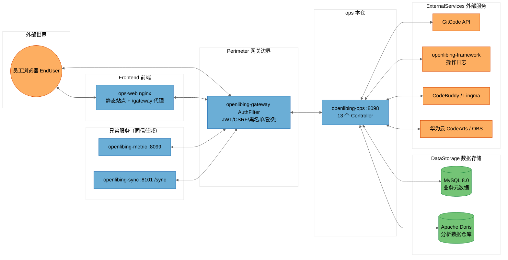

# [openlibing-ops]安全威胁建模分析报告（STRIDE-A）——远程主干基线（单仓版）

> 分析对象：`openlibing-ops` 单仓（含其与 `openlibing-gateway`、`openlibing-common`、`openlibing-framework`、`openlibing-metric`、`openlibing-sync`、`openlibing-ops-web` 及外部服务的信任关系）。
> 分析方法：STRIDE-A（欺骗 Spoofing / 篡改 Tampering / 否认 Repudiation / 信息泄露 Information Disclosure / 拒绝服务 Denial of Service / 权限提升 Elevation of Privilege / 滥用 Abuse），零信任视角 + 纵深防御。
> 结论分级：按**可利用性层级（Tier 1/2/3）**组织，而非按严重级别组织。
> 分析基线：**远程仓最新主干分支**（`origin/main`，HEAD `a1bcb28b`），通过 git worktree 独立检出，不影响本地开发分支。
> 文档性质：本报告为原合并版《[openlibing-ops、ops-web、metric、sync]安全威胁建模分析报告》拆分出的**单仓版**，拆分时保留与 ops 相关的跨仓信任边界与跨仓系统性发现章节。

---

## 文档信息与元数据

| 字段 | 值 |
| --- | --- |
| 分析模型 | DeepSeek-V4-Flash（threat-model-analyst skill 驱动）；补充 3 项缺口（sync Python 采集脚本、Dockerfile 构建供应链完整性、镜像 SBOM/cosign/seccomp）证据合并自 MiniMax-M3 独立分析报告，本仓相关项为 FIND-35 跨仓构建供应链 |
| 分析基线类型 | 远程仓主干分支（git worktree 独立检出，detached HEAD，分析完成后已清理） |
| 仓库 | `openlibing-ops`，远程主干 `origin/main`，HEAD `a1bcb28b` |
| 分析范围 | 本仓源码 + 配置 + 部署脚本 + CI 工作流；信任边界证据来自 `openlibing-gateway`/`openlibing-common` 相关代码与 docs 记录 |
| 输出位置（归档） | `openlibing-docs/architecture_desgin/openlibing-ops/[openlibing-ops]安全威胁建模分析报告.md`（PR 合入主仓 master 后生效） |

---

## 一、执行摘要（Executive Summary）

### 1.1 总体安全态势

OpenLibing 运营域 `openlibing-ops` 仓（远程主干基线）的**工程化与"默认安全"基础较好**：容器镜像加固到位（非 root、umask、删除调试工具、RASP 注入、JRE-only）、配置中心快照不落盘、无硬编码凭据入库、SQL 参数化整体规范（除 `sortRule` 外）、XXE 防护齐全、CI 具备 CodeQL 静态扫描 + pre-commit 门禁、日志注入有净化处理。

但存在一个**结构性、跨仓共性的核心弱点在本仓的体现**：**ops 服务端零认证、零鉴权、零有效限流**，身份与授权完全外置到 `openlibing-gateway`（单点失效）。一旦网关被绕过（内网横向移动、SSRF、网关路由放行遗漏、`/manage` 重写混淆），全部读写接口（含删除、数据写入）匿名可达。

> **Note on threat counts:** 本报告共识别 **12 条 STRIDE-A 威胁（T01~T12）**、整合为 **9 条发现（FIND-01~FIND-09，其中 FIND-01 为跨仓系统性发现，统计口径记入本仓行）**，其中 Tier 2 共 7 条、Tier 3 共 2 条（本仓无 Tier 1 直接暴露项）。威胁计数会因网关路由实际配置（本报告未覆盖 `openlibing-gateway` 的完整路由豁免表）而波动，相关不确定性已在"分析上下文与假设"中声明。
>
> **基线注意：** 远程主干 CI 已**移除 nightly 防投毒/SCA 扫描工作流**（`nightly-schedule-scan.yml` 仅存在于本地开发分支，未合入主干），供应链纵深防御弱于本地开发分支（相关跨仓发现 FIND-35）。

### 1.2 威胁计数总览（ops）

| 仓库 | Tier 1 | Tier 2 | Tier 3 | 发现合计 | 最突出弱点 |
| --- | --- | --- | --- | --- | --- |
| openlibing-ops | 0 | 7 | 2 | 9 | sortRule SQL 注入未根治 + 生产 Swagger 开放 + 服务端零认证 |

> 注：FIND-01（跨仓系统性发现：服务端零认证 + 限流死代码）统计口径上记入本仓行（Tier 2）；FIND-09 为本仓 Tier 3 发现；FIND-35（跨仓构建供应链完整性）单列"跨仓"行，详见第四章。

### 1.3 需优先处置的 Top 风险（ops）

1. **（Tier 2）排序方向 `sortRule` SQL 注入**：15 个 mapper 56 处 `${}`，至少 6 条服务路径只净化 `sortField`、不净化 `sortRule`，可在 ORDER BY 上下文构造子查询盲注。
2. **（Tier 2，跨仓）服务端零认证 + 限流死代码**：ops 仓无任何服务端鉴权、`RateLimitConfig` 从未挂载到请求链路，网关是唯一屏障。
3. **（Tier 2）生产/预发 Swagger 全量开放**：`api-docs` + `swagger-ui enabled: true`（`application-prod.yaml` 生效）。
4. **（Tier 2）`/manage` 前缀剥离混淆**：PathFilter 无条件剥离 `/manage`，构成网关鉴权绕过面。
5. **（Tier 3，跨仓）镜像构建供应链完整性缺失**：Dockerfile 以 `wget` 拉取 JRE 无签名校验，缺 SBOM/cosign/seccomp（FIND-35）。

---

## 二、系统全景、部署模型与信任边界

### 2.1 ops 在四仓体系中的角色与数据流

```
                        ┌────────────────────────────────────────────────────────────┐
                        │                        外部世界                             │
                        │   员工浏览器 EndUser        第三方应用/测试框架 ThirdParty      │
                        └───────┬───────────────────────────────┬────────────────────┘
                                │ HTTPS（含 CSRF 双提交 Cookie）  │ HTTPS
                                ▼                               ▼
                     ┌─────────────────────┐        ┌──────────────────────┐
                     │ openlibing-gateway  │        │ sync 数据接入/上传    │
                     │ AuthFilter：JWT/CSRF │        │ /sync/api/data/ingest │
                     │ 黑名单/纵向权限/豁免  │        │ /sync/testcase/metadata/upload │
                     └──┬──────┬──────┬────┘        └──────────┬───────────┘
                        ▼      ▼      ▼                        ▼
              ┌──────────┐ ┌────────┐ ┌──────────┐   ┌──────────────────────┐
              │ ops:8098 │ │metric: │ │ops-web   │   │ sync:8101 (context /sync)│
              │ 13控制器  │ │8099 8控制器│ │ nginx    │   │ 24 个 XXL-Job handler   │
              └────┬─────┘ └───┬────┘ │ 静态站点  │   └────┬───────────┬───────┘
                   │           │      └────┬─────┘        │           │
                   ▼           ▼           │              ▼           ▼
        ┌────────────────── MySQL + Doris（双数据源，DDD @DataSource 切换）────────────┐
        └────────────────────────────────────────────────────────────────────────────┘
        ops 还经 Feign/RestTemplate 出站调用：
        GitCode API、openlibing-framework（操作日志）、CodeBuddy、Lingma、
        华为云 CodeArts Pipeline、华为云 OBS
```

### 2.2 部署分类（ops）

- **分类：`K8S_SERVICE`**（Kubernetes 部署，经网关暴露，Nacos Discovery 以 HTTPS `secure: true` 注册；本基线为 Apollo）。
- **配置中心**：远程主干仍为 **Apollo**（`apollo.meta` + `apollo.bootstrap.namespaces`）；Nacos 迁移在本地 `feat-apollo-eureka-nacos` 开发分支进行，未合入主干。
- **信任模型**：身份认证（JWT）、CSRF、黑名单、纵向权限统一由网关执行；ops **不承担任何服务端身份校验**，网关是该体系的唯一认证屏障（单点）。
- **前置条件底板**：ops 服务直连端口仅集群内网可达 → 网关绕过类攻击前置条件至少为 `Internal Network`（Tier 2）；经网关的用户侧接口前置条件为 `Authenticated User`（Tier 2）。

### 2.3 信任边界与 DFD（ops 视角）



**信任边界说明（ops 视角）：**

| 边界 | 含义 | 关键事实 |
| --- | --- | --- |
| `External` | 浏览器 | 员工经网关鉴权 |
| `Perimeter` | 网关边界 | AuthFilter 是唯一认证执行点（[AuthFilter.java](file:///c:/w30060144/develop/repositories/openlibing/openlibing-gateway/src/main/java/com/openlibing/gateway/business/filter/AuthFilter.java)） |
| `Frontend` | ops-web nginx | 同源 /gateway 代理；无安全响应头 |
| `SiblingServices` | metric / sync | 同信任域兄弟服务；均无服务端鉴权，Doris 为共享数据存储 |
| `OpsContext` | ops 本仓 | 服务端零认证；端口集群内网可达 |
| `DataStorage` | MySQL / Doris | 双数据源，默认 Doris；连接串由 Apollo 配置中心下发 |
| `ExternalServices` | GitCode / framework / 云 AI / 华为云 | 出站调用；凭据经 `SecurityUtil.decrypt` 解密 |

### 2.4 跨仓信任边界与攻击路径（ops 相关）

> 本单仓版保留跨仓视角，便于定位 ops 在体系中的受信位置与上游/下游风险传导。

| 跨仓关系 | 信任方向 | 风险传导路径 | 本仓受影响威胁 |
| --- | --- | --- | --- |
| ops → Doris（共享） | 写/读 | sync `/api/data/ingest` 零认证匿名直写 Doris → ops 查询/统计读到被污染的指标数据（脏数据污染运营结论） | T03/T10 等读路径 |
| ops ↔ gateway | 完全信任网关 | 网关绕过（`/manage` 剥离、豁免遗漏、SSRF）→ ops 全部接口匿名可达 | T01/T04/T09 |
| ops → framework | 出站 | framework 操作日志若被注入/篡改，审计链被污染（跨仓否认面） | T05/T07 |
| ops → GitCode API | 出站 | 客户端透传 Authorization 借 ops 服务身份代查他人邮箱映射 | T02 |
| 兄弟仓（metric/sync） | 同信任域 | 任一仓被攻破（如 sync Tier 1 零认证写接口）可横向移动直连 ops 内网端口 | T01 |

---

## 三、openlibing-ops 安全分析

### 3.1 组件与攻击面

| 组件 ID | 锚点（证据文件） | 暴露面 |
| --- | --- | --- |
| OpsOverviewController | `api/controller/OpsOverviewController.java` | `/ops-overview` main/resource-summary/nightly-summary/link-config(GET/POST) |
| RepoController | `api/controller/RepoController.java` | `/repo` base/dashboard、branch/config/batch(POST) 等 |
| PipelineController | `api/controller/PipelineController.java` | `/pipeline` info/query/version-chart |
| ResourceController | `api/controller/ResourceController.java` | `/resource` summary/trend |
| ProjectController | `api/controller/ProjectController.java` | `/project` issue/summary |
| OpsGithubController | `api/controller/OpsGithubController.java` | `/ops/github` chart/export/* |
| CodeCheckDashboardController | `api/controller/CodeCheckDashboardController.java` | `/code-check-dashboard` kpi/trend/branch-config/add |
| CommonController | `api/controller/CommonController.java` | `common` remark/export/{category}/detail |
| ExternalApiControllers | `api/controller/external/GitcodeApi.java` 等 4 个 | `api/gitcode`、`ops/api/repo`、`ops/api/nightly`、`api/repo/issue` |
| OpsQueryServices | `domain/service/pipeline/impl/DwiPipelineRunInfoServiceImpl.java` 等 | SQL 组装层（sortField/sortRule） |
| DataAccess | `domain/mapper/*.xml` + `infrastructure/config/DataSourceConfig.java` | MySQL + Doris 双数据源 |
| GitcodeFeignClient | `infrastructure/client/gitcode/GitcodeFeignClient.java` | 出站 GitCode API |
| FrameworkFeignClient | `infrastructure/client/framework/FrameworkFeignClient.java` | 出站 framework 操作日志 |
| RateLimitConfig | `infrastructure/config/RateLimitConfig.java` | 限流配置（死代码） |
| ExportService | `app/service/CommonService.java` | EasyExcel 导出 |
| LogPipeline | `infrastructure/aop/DashboardLoggerAspect.java` + `logback-spring.xml` | 日志/审计 |
| DockerContainer | `Dockerfile` + `start.sh` + `monitor.sh` | 运行时加固 |

### 3.2 STRIDE-A 威胁表（ops）

| 威胁 ID | STRIDE 类别 | 威胁描述 | 前置条件 | Tier |
| --- | --- | --- | --- | --- |
| T01.S | S 欺骗 | 13 个 Controller 无服务端身份校验，网关绕过/直连后身份可任意伪造 | `Internal Network` | T2 |
| T02.S | S 欺骗 | GitcodeApi.queryUserByEmail 信任客户端透传 Authorization，可借服务代查他人邮箱映射 | `Internal Network` | T2 |
| T03.T | T 篡改 | sortRule 未净化直接拼 ORDER BY，SQL 注入/子查询盲注（6 条服务路径） | `Authenticated User` | T2 |
| T04.T | T 篡改 | `/manage` 前缀由 PathFilter 无条件剥离，路由混淆/网关鉴权绕过面 | `Internal Network` | T2 |
| T05.R | R 否认 | 无服务端身份绑定，操作审计无法追溯真实用户（依赖网关注入身份头） | `Internal Network` | T2 |
| T06.I | I 信息泄露 | 生产/预发 Swagger 全量开放（api-docs + swagger-ui enabled: true，`application-prod.yaml` 生效） | `Authenticated User` | T2 |
| T07.I | I 信息泄露 | PathFilter 对每个请求 INFO 级记录 URI，operate 日志 appender 裸 `%msg%n` 无 CRLF 清洗（日志注入/审计污染） | `Authenticated User` | T2 |
| T08.D | D 拒绝服务 | RateLimitConfig 为死代码（getApiConfig 无调用方），导出/查询/邮箱枚举接口无限流可被刷 | `Authenticated User` | T2 |
| T09.E | E 权限提升 | 经网关纵向权限若漏配（网关 forwardTrustList/豁免路径），写接口（branch-config/add、link-config POST）匿名可写 | `Internal Network` | T2 |
| T10.A | A 滥用 | 导出接口可被用于批量拖取全量运营数据（导出无频次/行数限制） | `Authenticated User` | T2 |
| T11.I | I 信息泄露 | 数据库口令与 GitCode token 经单一静态密钥 `security.part1` 对称解密，密钥与密文同存 Apollo 配置中心单点 | `Admin Credentials` | T3 |
| T12.T | T 篡改 | 镜像内嵌 pfx/cacerts 证书材料随镜像分发，来源管控与轮换缺失 | `Admin Credentials` | T3 |

**STRIDE-A 汇总（ops）**：S=2，T=3（T03/T04/T12），R=1，I=3，D=1，E=1，A=1，共 **12 条**（T01~T12）。

### 3.3 ops 组件级 STRIDE 明细（节选高风险组件）

**OpsQueryServices（SQL 组装层）—— Tampering / Injection：**

| 威胁 | 证据 | 影响 |
| --- | --- | --- |
| `sortRule` 注入 | [DwiPipelineRunInfoServiceImpl.java:146](file:///c:/w30060144/tmp-tm-ops/src/main/java/com/openlibing/ops/domain/service/pipeline/impl/DwiPipelineRunInfoServiceImpl.java#L146) `queryWrapper.last("order by " + req.getSortField() + " " + req.getSortRule())`；`sortField` 经 [FieldUtil.getSortField](file:///c:/w30060144/tmp-tm-ops/src/main/java/com/openlibing/ops/infrastructure/util/FieldUtil.java) 白名单映射，**`sortRule` 原样拼接** | ORDER BY 上下文可构造子查询/时间盲注；叠加无认证/无限流放大 |
| 同类未净化路径 | [ResourceProjectTestcaseDetailService.java:108](file:///c:/w30060144/tmp-tm-ops/src/main/java/com/openlibing/ops/domain/service/resource/detail/ResourceProjectTestcaseDetailService.java)、[DwiVersionPipelineInfoServiceImpl.java:63](file:///c:/w30060144/tmp-tm-ops/src/main/java/com/openlibing/ops/domain/service/pipeline/impl/DwiVersionPipelineInfoServiceImpl.java)、[DwiProjectStatisticsServiceImpl.java:55](file:///c:/w30060144/tmp-tm-ops/src/main/java/com/openlibing/ops/domain/service/project/impl/DwiProjectStatisticsServiceImpl.java)、[RepoHandle.java:96,113](file:///c:/w30060144/tmp-tm-ops/src/main/java/com/openlibing/ops/app/service/repo/RepoHandle.java)、[DmRdEfcRepoSumPipelineStatisticsDayServiceImpl.java:66](file:///c:/w30060144/tmp-tm-ops/src/main/java/com/openlibing/ops/domain/service/repo/impl/DmRdEfcRepoSumPipelineStatisticsDayServiceImpl.java) | 同上 |
| 已净化对照基线 | `SortFieldValidator.normalizeRule` + `validate`（asc/desc 白名单）；`FieldUtil.getSortFieldByCamel` 反射校验 | 说明修复模板已存在，`sortRule` 统一走该工具即可 |

**RateLimitConfig —— Denial of Service：**

| 威胁 | 证据 | 影响 |
| --- | --- | --- |
| 限流死代码 | [RateLimitConfig.java:46](file:///c:/w30060144/tmp-tm-ops/src/main/java/com/openlibing/ops/infrastructure/config/RateLimitConfig.java#L46) `getApiConfig` 全仓仅被自身与测试类引用，无任何 Filter/Interceptor 挂载（远程主干为 Apollo `@ApolloConfig("framework")` 版，仍无消费方） | 对外接口无限流，可被无节制刷取（撞库、全量导出、配合 SQL 盲注逐位探测、DoS） |

**DataAccess —— 口令存储（已缓解项）：** 数据库口令经 `SecurityUtil.decrypt(password, part1)` 运行时解密（[DataSourceConfig.java:87,106](file:///c:/w30060144/tmp-tm-ops/src/main/java/com/openlibing/ops/infrastructure/config/DataSourceConfig.java)），`@EnableEncryptableProperties` 启用 Jasypt；本地资源文件 0 硬编码凭据，`.gitignore` 排除 keys/pfx/cacerts。**剩余风险**：`security.part1` 与密文同存 Apollo 配置中心（单点）。

**DockerContainer —— 加固（已缓解项）：** 非 root（`USER openlibing`）、umask 0077、锁口令 nologin、删除 gdb/perl/gcc 等调试编译工具、JRE-only、注入 RASP、`-Dfastjson.parser.safeMode=true`、显式 trustStore。

---

## 四、跨仓系统性发现（ops 相关）

### FIND-01（Tier 2，跨仓）：服务端零认证 + 限流死代码系统性单点失效

- **证据链**：ops / metric / sync 三仓 Controller 均无服务端鉴权注解/拦截器（ops 全仓无 `HandlerInterceptor`/`WebMvcConfigurer`/`@PreAuthorize` 挂载入站校验）；ops/metric 的 `RateLimitConfig.getApiConfig` 为死代码（无 Filter/Interceptor 消费，远程主干为 Apollo 版纯配置类）；身份认证、CSRF、黑名单、纵向权限全部外置于 `openlibing-gateway` 的 AuthFilter。
- **影响**：网关是唯一认证屏障（单点失效）。任何网关绕过路径（内网横向移动、SSRF、网关路由豁免遗漏、`/manage` 前缀剥离混淆、sync 第三方直连面）即 ops 全部读写接口（含 branch-config/add、link-config POST 等写接口）匿名可达。
- **治理方向（分层，ops 相关）**：
  1. **服务端零信任改造**：引入统一入站校验中间件（可复用 openlibing-common 的 `FeignAccessTokenInterceptor` 思路扩展到服务端），至少对写接口/敏感接口做服务端身份与租户校验。
  2. **网关路由豁免表审计**：梳理 `/manage`、`/api` 前缀豁免路径，最小化白名单，禁止无条件剥离。
  3. **限流落地**：将 RateLimitConfig 挂载到 Filter/Interceptor 或网关侧限流，覆盖登录、导出等高频面。
  4. **纵深防御**：SQL 排序白名单工具统一、导出加频控与行数上限、静态凭据加密托管（KMS/Vault）。

### FIND-35（Tier 3，跨仓）：镜像构建供应链完整性缺失（JRE 无签名校验 + 缺 SBOM/cosign/seccomp）【合并补充】

- **证据链**：ops Dockerfile 以 `wget https://mirrors.tuna.tsinghua.edu.cn/Adoptium/...` 拉取 JRE，**无签名/SHA256 校验**（构建期供应链）；未生成镜像 SBOM（syft/cyclonedx）、未做镜像签名（cosign）、未声明 K8s seccompProfile / readOnlyRootFilesystem（运行时纵深防御）。证据来自 MiniMax-M3 独立分析。
- **影响**：构建机/镜像源被控或传输劫持时，可注入带毒 JRE 进最终镜像且事后无法核验；镜像无 SBOM/签名则 SBOM 关联分析、镜像来源审计与运行时策略约束缺失。
- **治理方向**：① JRE 改为构建期本地预下载 + SHA256 固定；② CI 集成 syft 生成 SBOM + cosign 签名；③ K8s 模板补 `seccompProfile: RuntimeDefault` 与 `readOnlyRootFilesystem`；④ 与供应链完整性合并治理，纳入 nightly SCA 扫描范围。

---

## 五、发现清单（ops，FIND-01 ~ FIND-09）

| 发现 | 仓库 | Tier | STRIDE | 对应威胁 | 摘要与处置方向 |
| --- | --- | --- | --- | --- | --- |
| FIND-01 | 跨仓（记入本仓） | T2 | S/D | 跨仓 | 服务端零认证 + 限流死代码系统性单点失效（详见第四章） |
| FIND-02 | ops | T2 | S/E | T01,T09 | 服务端零认证 + 网关纵向权限/写接口依赖（branch-config/add、link-config POST 等） |
| FIND-03 | ops | T2 | T | T03 | `sortRule` 未净化拼 ORDER BY，SQL 注入/子查询盲注；统一走 `SortFieldValidator`/`FieldUtil` 白名单 |
| FIND-04 | ops | T2 | S | T02 | GitcodeApi 信任客户端透传 Authorization，可借服务代查他人邮箱映射 |
| FIND-05 | ops | T2 | I | T06 | 生产/预发 Swagger api-docs 全量开放（远程主干 `application-prod.yaml` 已核实） |
| FIND-06 | ops | T2 | R/D | T04,T05,T07,T08 | 平台治理面：`/manage` 前缀剥离、审计否认、PathFilter 日志注入、限流死代码 |
| FIND-07 | ops | T2 | A | T10 | 导出接口无频次/行数限制，可批量拖取运营数据 |
| FIND-08 | ops | T3 | I | T11 | DB 口令与 GitCode token 单一静态密钥 `security.part1` 解密、密钥密文同存 Apollo 配置中心单点 |
| FIND-09 | ops | T3 | T | T12 | 镜像内嵌 pfx/cacerts 证书材料，来源管控与轮换缺失 |

> 注：FIND-35（跨仓构建供应链，Tier 3）与本仓 Dockerfile 直接相关，详见第四章。

---

## 六、优先修复路线图（ops 相关）

### Phase 1 —— Tier 1，立即（本周内）

本仓无 Tier 1 直接暴露项（sync 的 Tier 1 见 sync 单仓报告）。

### Phase 2 —— Tier 2，短期（1~2 个迭代）

1. **`sortRule` 统一走白名单工具**：所有 `queryWrapper.last("order by ...")` 路径改用 `SortFieldValidator`/`FieldUtil`（FIND-03）。
2. **三仓限流落地**：将 `RateLimitConfig` 挂载到 Filter/Interceptor，或网关侧配置限流，覆盖登录/导出等高频面（FIND-06）。
3. **生产 Swagger 关闭**：`swagger-ui.enabled`/`api-docs.enabled` 置 false（FIND-05）。
4. **网关豁免路径审计**：梳理 `/manage`、`/api` 豁免表，最小化白名单（FIND-02）。
5. **导出接口加频控与行数上限**（FIND-07）。
6. **GitcodeApi 透传 Authorization 收紧**：服务端固定凭据或校验客户端身份后再代查（FIND-04）。

### Phase 3 —— Tier 3，中期（结合迁移/发布窗口）

7. **静态凭据加密托管**：DB 口令、GitCode token 迁至 KMS/Vault，解密密钥与密文分离存储（FIND-08）。
8. **镜像内嵌证书材料移除与轮换机制**：pfx/cacerts 改由运行期从安全通道拉取（FIND-09）。
9. **镜像构建供应链完整性**：JRE 本地预下载 + SHA256 固定、CI 集成 syft/cosign、K8s 补 seccomp/readOnlyRootFilesystem（FIND-35）。

---

## 七、已缓解项与正向工程化基线（肯定面，ops）

以下控制经代码/配置证据核实为已启用，作为纵深防御基线保留：

- **容器加固**：非 root（`USER openlibing`）、`umask 0077`、nologin 锁口令、删除 gdb/perl/gcc 等调试编译工具、JRE-only、注入 RASP、`-Dfastjson.parser.safeMode=true`、显式 trustStore。
- **配置中心快照不落盘**：`SnapShotSwitch.setIsSnapShot(false)`。
- **无硬编码凭据入库**：本地资源文件 0 硬编码凭据，`.gitignore` 排除 keys/pfx/cacerts；数据库口令经 `SecurityUtil.decrypt` 运行时解密 + Jasypt `@EnableEncryptableProperties`。
- **SQL 参数化基线**：ops 除 `sortRule` 外均参数化。
- **XXE 防护**：XML 解析器禁外部实体（既有基线）。
- **日志注入净化**：共用 `LogSanitizer` 移除 CRLF/控制字符。
- **CSRF 双提交**：ops-web `http.ts` 携带 `Csrf-Token-Open-Li-Bing`；网关 AuthFilter 校验。
- **供应链 CI（主干）**：CodeQL 静态扫描（`codeql.yaml`，Push/PR 触发）+ pre-commit 门禁；**注意：nightly 防投毒/SCA 扫描（`nightly-schedule-scan.yml`）未合入主干**。

---

## 八、分析上下文、假设与局限

- **分析基线**：**远程仓最新主干分支**（ops `a1bcb28b`），通过 git worktree 独立检出（detached HEAD），分析期间不影响本地开发分支（本地 ops=`workflow_run_job` / `feat-apollo-eureka-nacos`），完成后已清理 worktree 并切回原分支。
- **与本地开发分支（Nacos 迁移分支）的差异**：本地 `feat-apollo-eureka-nacos` 为 Nacos 配置中心迁移版；远程主干仍为 Apollo。差异文件集中在 CI 工作流（主干移除 `nightly-schedule-scan.yml`）、`RateLimitConfig`（主干为 Apollo 纯配置类，死代码结论不变）、配置文件（`application-*.yaml`）。**业务代码（Controller/Service/Mapper）两个基线几乎一致，12 条威胁 / 9 条发现全部成立。**
- **未覆盖范围**：`openlibing-gateway` 完整路由豁免表、`openlibing-common` 内部认证中间件全部细节、第三方 SDK（CodeBuddy/Lingma/CodeArts）内部实现、Doris/MySQL 底层权限配置。
- **合并补充来源**：FIND-35（跨仓构建供应链）的证据来自 MiniMax-M3 独立分析报告，未在本报告主体的 DeepSeek 分析中独立复跑核实；相关文件行号以 MiniMax 报告为准。
- **计数波动**：威胁计数会因网关实际豁免配置而波动；Tier 划分以"本仓内可验证证据"为准，未做渗透测试/DAST 实证。
- **证据性质**：所有"已缓解"项按代码/配置证据判定，未做运行时验证（未注入、未真实攻击）。
- **敏感信息**：本报告不包含任何真实凭据/密钥值，仅描述存在性与处置方向。
- **单仓拆分说明**：本报告由合并版拆分而来，跨仓系统性发现（FIND-01/FIND-35）按与 ops 的关联度保留在第四、五章；完整跨仓视图见合并版或各兄弟仓单仓报告。
- **后续建议**：可基于本报告派生（a）网关路由豁免表专项审计；（b）ops 服务端入站校验改造任务；（c）迁移（Nacos）合入主干后对 Tier 2 项的回归验证清单。

---

## 九、附录：STRIDE-A 汇总矩阵（ops）

| 仓库 | S 欺骗 | T 篡改 | R 否认 | I 信息泄露 | D 拒绝服务 | E 权限提升 | A 滥用 | 威胁数 | Tier1 | Tier2 | Tier3 |
| --- | --- | --- | --- | --- | --- | --- | --- | --- | --- | --- | --- |
| openlibing-ops | 2 | 3 | 1 | 3 | 1 | 1 | 1 | 12 | 0 | 10 | 2 |

> 说明：威胁层 Tier 分布（Tier2=10 / Tier3=2，合计 12 条）与发现层 Tier 分布（Tier2=7 / Tier3=2，合计 9 条）不同，系跨仓/同主题威胁合并归类所致（FIND-06 合并 T04/T05/T07/T08 四条、FIND-01 为跨仓归类），属预期差异。

---

*报告生成：threat-model-analyst skill（STRIDE-A + 零信任 + 纵深防御），基线=远程仓主干分支（ops=origin/main），2026-08-21。本报告由《[openlibing-ops、ops-web、metric、sync]安全威胁建模分析报告》拆分而来，用于归档 openlibing-docs/architecture_desgin/openlibing-ops。*
