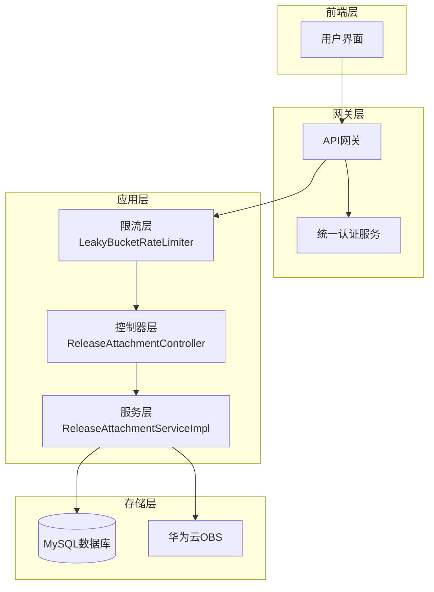
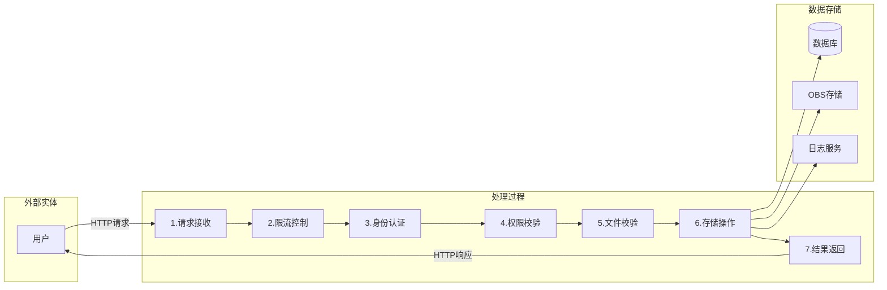
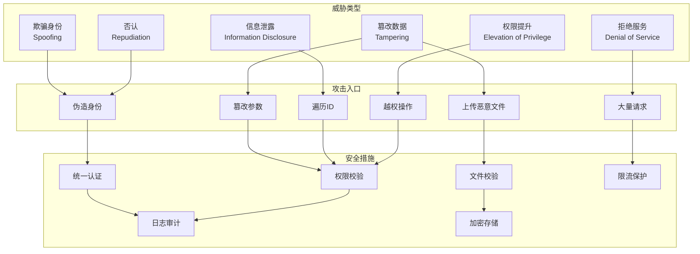
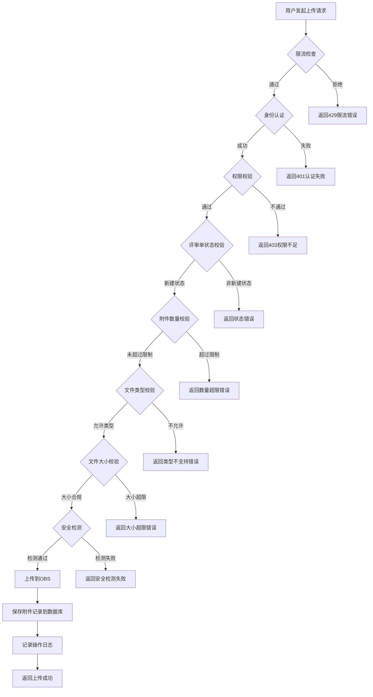
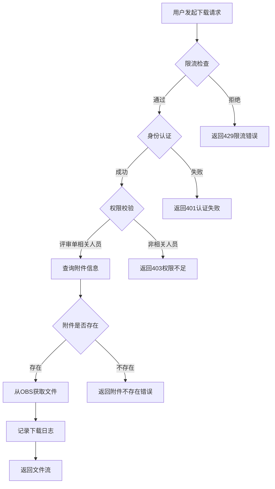
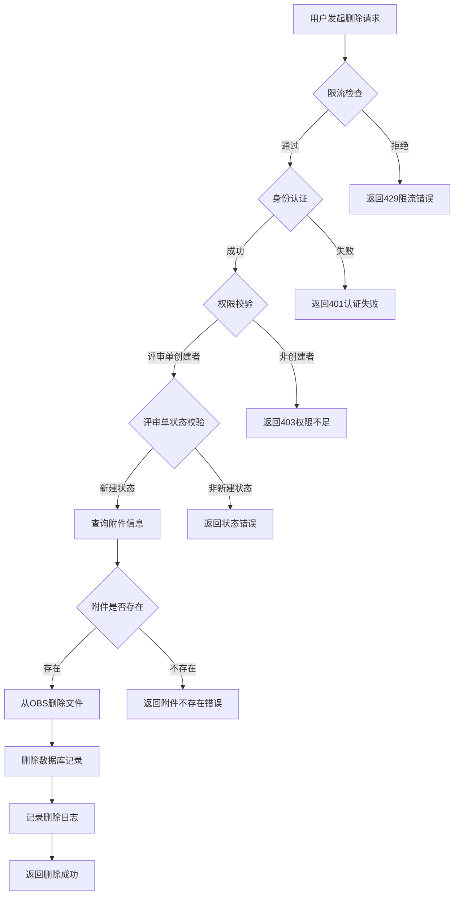

# 附件管理功能威胁分析文档

---

## 1. 基础信息

> 本文对openlibing-platform-release项目中附件管理功能进行威胁分析，附件管理模块负责发布评审过程中的附件上传、删除和下载操作。

---

## 2. 功能概述

### 2.1 功能架构图



**设计说明：** 附件管理模块采用分层架构设计，包含控制器层、服务层、存储层和限流层。

### 2.2 数据流图



**设计说明：** 
1. 用户通过前端发起附件操作请求
2. 请求经过限流层进行流量控制
3. 控制器层接收请求并调用服务层
4. 服务层进行权限校验、文件校验后操作OBS存储
5. 操作结果记录到数据库并返回用户

### 2.3 组件职责与接口

| 组件 | 职责 | 接口 |
|------|------|------|
| ReleaseAttachmentController | 处理HTTP请求，参数校验 | /release/attachment/upload, /delete, /download, /list |
| ReleaseAttachmentServiceImpl | 业务逻辑处理，权限校验，文件校验 | uploadAttachment, deleteAttachment, downloadAttachment |
| LeakyBucketRateLimiterAspect | 接口限流保护 | 基于注解实现 |
| ObsClient | 华为云OBS对象存储操作 | putObject, getObject, deleteObject |
| ReleaseAttachmentDao | 附件数据持久化 | insert, selectById, deleteById |

---

## 3. 威胁分析 (Threat Modeling)

### 3.1 STRIDE威胁模型分析

| 威胁类别 | 攻击场景描述 (Scenario) | 风险等级/评分 | 对应减缓措施 (Mitigation) |
|----------|-------------------------|---------------|---------------------------|
| **欺骗身份 (Spoofing)** | 攻击者伪造userId参数，冒充其他用户上传/删除附件 | 高 | 1. 通过统一认证服务验证用户身份 2. userId从token中获取，不信任前端传参 |
| **篡改数据 (Tampering)** | 攻击者修改请求中的reviewId，操作其他评审单的附件 | 高 | 1. 校验用户是否为评审单创建者 2. 校验评审单状态是否允许操作 |
| **篡改数据 (Tampering)** | 攻击者上传恶意文件（病毒、木马） | 高 | 1. 文件类型白名单校验 2. 压缩炸弹检测 3. PDF XSS检测 |
| **否认 (Repudiation)** | 用户否认上传过某个附件，声称被他人恶意操作 | 中 | 1. 记录操作日志（用户ID、时间、IP） 2. 数据库记录创建者信息 |
| **信息泄露 (Information Disclosure)** | 攻击者通过遍历attachmentFileId下载他人附件 | 高 | 1. 下载前校验用户权限 2. 校验用户是否为评审单相关人员 |
| **信息泄露 (Information Disclosure)** | 敏感文件（合同、设计文档）被未授权人员下载 | 高 | 1. 严格的权限控制 2. 评审单相关人员才能下载 |
| **拒绝服务 (Denial of Service)** | 攻击者大量上传大文件，耗尽存储空间和带宽 | 高 | 1. 漏桶算法限流 2. 文件大小限制（100MB） 3. 附件数量限制（10个/评审单） |
| **拒绝服务 (Denial of Service)** | 攻击者上传压缩炸弹，解压时耗尽服务器资源 | 高 | 1. 压缩炸弹检测（最大解压1GB，压缩比不超过100，文件数量限制1000） |
| **权限提升 (Elevation of Privilege)** | 非评审单创建者通过接口漏洞删除他人附件 | 高 | 1. 校验用户是否为评审单创建者 2. 校验评审单状态 |

### 3.2 威胁分析图



**设计说明/归档：** 附件管理功能面临的主要威胁包括：身份欺骗、数据篡改、信息泄露和拒绝服务攻击。

---

## 4. 安全设计实现 (Security Mechanisms)

### 4.1 威胁模型评估

| 评估项 | 评估结果 | 说明 |
|--------|----------|------|
| 数据流图绘制 | ✅ 已完成 | 已绘制附件上传、删除、下载的数据流图 |
| 单点风险识别 | ✅ 已完成 | 识别了权限校验、文件校验等关键节点 |

### 4.2 软件供应链安全

| 安全措施 | 实现状态 | 说明                    |
|----------|----------|-----------------------|
| CVE漏洞扫描 | ✅ 已实现 | 版本级开源漏洞扫描 |
| 第三方包限制 | ✅ 已实现 | 仅引入必要的华为云SDK和Spring组件 |
| 依赖版本管理 | ✅ 已实现 | 定期更新依赖版本，修复已知漏洞       |

### 4.3 凭证管理

| 安全措施 | 实现状态 | 说明                       |
|----------|----------|--------------------------|
| 禁止硬编码 | ✅ 已实现 | OBS AK/SK存储在配置中心中，通过加密存储 |
| 密钥加密存储 | ✅ 已实现 | 使用三段式加密存储敏感配置            |
| 密钥定期轮转 | ✅ 已实现 | 通过华为云安全服务管理密钥轮转          |

### 4.4 身份认证

| 安全措施 | 实现状态 | 说明 |
|----------|----------|------|
| 第三方授权登录 | ✅ 已实现 | 使用统一认证服务，不记录用户密码 |
| Token过期机制 | ✅ 已实现 | Token有过期时间，定期刷新 |

### 4.5 数据安全

| 安全措施 | 实现状态 | 说明 |
|----------|----------|------|
| 传输加密 | ✅ 已实现 | 全链路TLS 1.2+加密 |
| 静态加密 | ✅ 已实现 | OBS存储启用服务端加密 |
| 敏感字段加密 | ✅ 已实现 | 用户信息等敏感字段加密存储 |

### 4.6 运行时隔离

| 安全措施 | 实现状态 | 说明 |
|----------|----------|------|
| 非Root运行 | ✅ 已实现 | 微服务以非Root用户运行 |
| 容器隔离 | ✅ 已实现 | 使用容器化部署 |

### 4.7 日志审计

| 安全措施 | 实现状态 | 说明 |
|----------|----------|------|
| 操作日志记录 | ✅ 已实现 | 记录上传、删除、下载操作 |
| 防篡改日志 | ✅ 已实现 | 日志存储在华为云日志服务 |
| 4W信息记录 | ✅ 已实现 | 记录Who、When、Where、What |

---

## 5. 安全实现细节

### 5.1 权限校验实现

```java
// 上传/删除权限校验：仅评审单创建者可操作
if (!releaseReviewEntity.getCreatorId().equals(userId)) {
    return DataResult.build(ResultStatusConstant.USER_NOT_AUTHORIZED.getCode(), 
        "非评审单创建者，无法进行上传、删除", null);
}

// 下载权限校验：评审单相关人员可下载
boolean hasPermission = releaseBaseService.hasPermissionOfReleaseReview(userId,
    releaseReviewEntity.getProjectId(), releaseReviewEntity);
if (!hasPermission) {
    return DataResult.failureMessage("非评审单相关人员无法进行下载");
}
```

### 5.2 文件安全校验实现

```java
// 文件类型白名单校验
boolean isContains = attachmentAllowTypes.contains(suffix);
if (!isContains) {
    return DataResult.failureMessage("附件类型不支持");
}

// 文件大小校验
long size = attachmentFile.getSize();
if (size > fileMaxSize << 20) {
    return DataResult.failureMessage("上传文件大小超过限制");
}

// 压缩炸弹和PDF XSS检测
AttachmentSecurityValidator.ValidationResult securityResult =
    AttachmentSecurityValidator.validate(attachmentFile, suffix);
if (!securityResult.isValid()) {
    return DataResult.failureMessage(securityResult.getMessage());
}
```

### 5.3 限流保护实现

| 接口 | 限流速率 | 容量 | 说明 |
|------|----------|------|------|
| /upload | 3 QPS | 5 | 上传接口限流 |
| /delete | 20 QPS | 40 | 删除接口限流 |
| /download | 5 QPS | 10 | 下载接口限流 |
| /list | 默认 | 默认 | 列表接口限流 |

### 5.4 状态校验实现

```java
// 评审单状态校验：仅新建状态可操作附件
if (releaseReviewEntity.getReviewStatus() != ReleaseStatus.SAVE.code) {
    return DataResult.build(ResultStatusConstant.PARAM_ERROR.getCode(), 
        "附件只能在评审单新建状态时上传", null);
}
```

---

## 6. 安全配置项

| 配置项 | 说明 | 默认值 |
|--------|------|--------|
| attachment.obs.bucketName | OBS桶名称 | openlibing-platform |
| attachment.release.maxFileSize | 单个附件最大大小(MB) | 100 |
| attachment.release.maxSum | 单个评审单附件最大数量 | 10 |
| attachment.release.allowedTypes | 允许的附件类型 | pdf,doc,docx,xls,xlsx,zip,tar,tar.gz |
| obs.access-key-id | OBS访问密钥（加密存储） | - |
| obs.secret-access-key | OBS安全密钥（加密存储） | - |

---

## 7. 安全测试用例

| 测试场景 | 测试步骤 | 预期结果 |
|----------|----------|----------|
| 越权上传 | 非评审单创建者尝试上传附件 | 返回403错误 |
| 越权下载 | 非评审单相关人员尝试下载附件 | 返回403错误 |
| 恶意文件上传 | 上传exe、sh等可执行文件 | 返回文件类型不支持错误 |
| 大文件上传 | 上传超过100MB的文件 | 返回文件大小超限错误 |
| 压缩炸弹上传 | 上传压缩比超过100的压缩包 | 返回安全检测失败错误 |
| 限流测试 | 短时间内发送大量请求 | 返回429限流错误 |
| 状态校验 | 在非新建状态上传附件 | 返回状态错误 |

---

## 8. 总结

附件管理功能通过以下安全措施有效减缓了STRIDE威胁：

1. **身份认证**：通过统一认证服务验证用户身份，防止身份欺骗
2. **权限控制**：严格的权限校验，防止越权操作
3. **文件校验**：类型、大小、内容多重校验，防止恶意文件上传
4. **限流保护**：漏桶算法限流，防止拒绝服务攻击
5. **日志审计**：完整的操作日志，支持追溯和审计
6. **数据加密**：传输和存储加密，防止信息泄露

---

## 附录：流程图

### A.1 附件上传流程图



### A.2 附件下载流程图



### A.3 附件删除流程图



---
