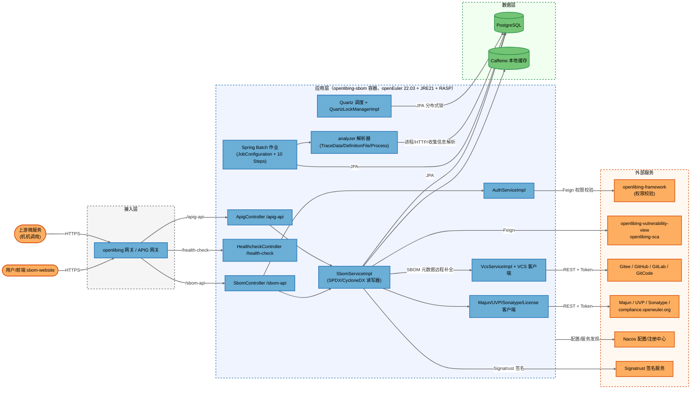
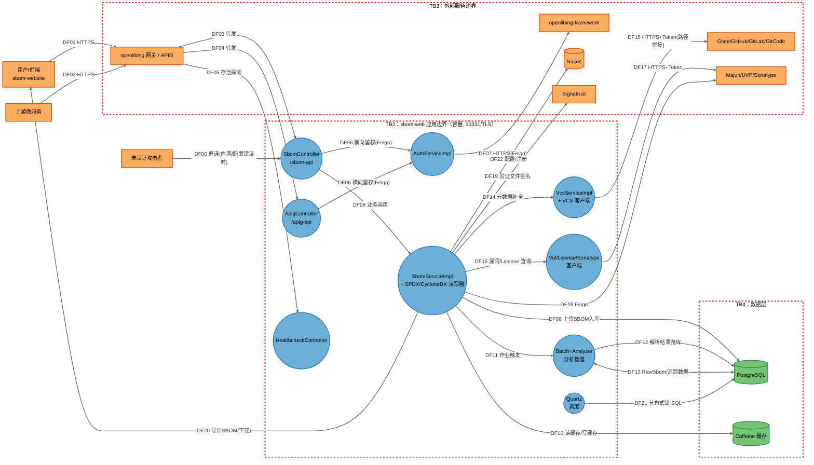
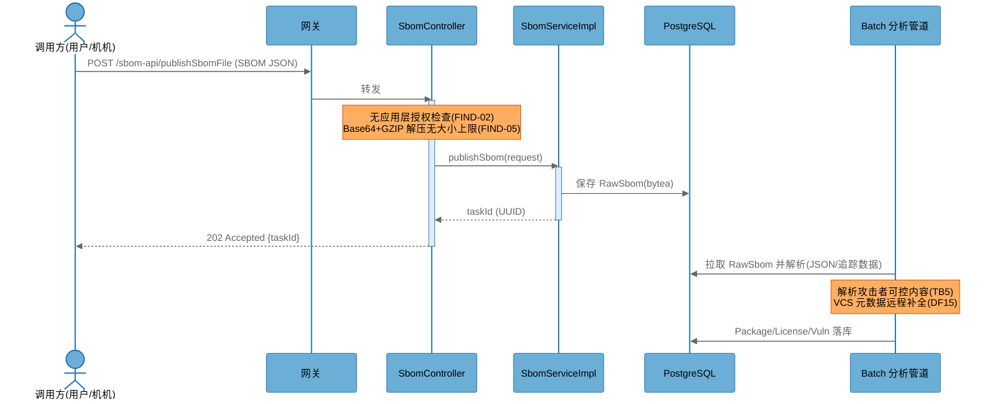
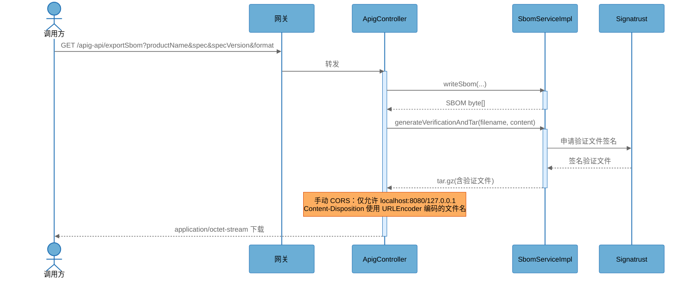
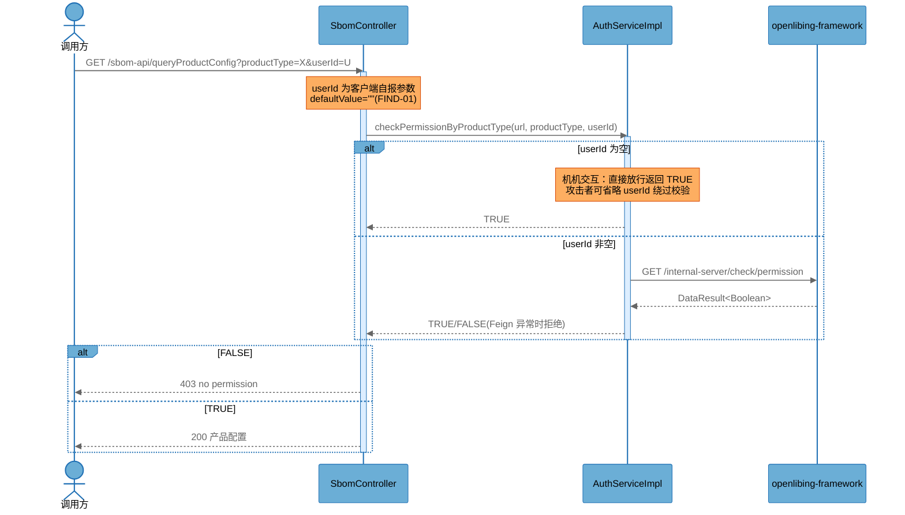

# OpenLibing SBOM 服务（openlibing-sbom）STRIDE-A 威胁模型分析报告

> 本报告为单文件整合版威胁模型，包含架构概览、数据流图（DFD）、STRIDE-A 威胁分析、可利用性分层、优先级发现项（含 CVSS 4.0 / CWE / OWASP 映射）与行动摘要。

## 报告元数据

| 项目            | 内容                                                                                          |
| --------------- | --------------------------------------------------------------------------------------------- |
| 分析对象        | openlibing-sbom（sbom-service）仓库根目录                                                     |
| 分析模式        | 单次全量分析（Single Analysis Mode），STRIDE-A                                                |
| 分析模型        | GLM-5.3-Flash（Trae Agent）                                                                   |
| 分析开始（UTC） | 2026-09-02 08:12:57 UTC                                                                       |
| 分析完成（UTC） | 2026-09-02 08:30:27 UTC                                                                       |
| 分析代码版本    | 分支 `feat/sca-notice-and-direct-deps`，提交 `6910daeb`（提交时间 2026-08-29 15:37:09 +0800） |
| 报告文件        | `threat-model-20260902/威胁模型分析报告.md`（本文件，整合版）                                 |

---

## 1. 执行摘要

openlibing-sbom 是一个基于 Spring Boot + Spring Batch 的 SBOM（软件物料清单）管理服务，以容器方式部署（openEuler 22.03 LTS 基础镜像），监听 HTTPS 端口 13331，通过 openlibing 网关与华为云 APIG 网关对外暴露 `/sbom-api` 与 `/apig-api` 两组 REST 接口，并作为机机接口供其他 openlibing 微服务调用。系统依赖 PostgreSQL 持久化、Nacos 配置/注册中心，并 outbound 调用 Gitee/GitHub/GitLab/GitCode、Sonatype、Majun/UVP 漏洞库、openlibing-framework 等外部服务。

本次分析共识别 **46 项威胁**，其中 Open（待处置）威胁 **28 项**，平台/部署侧已缓解 **12 项**，已有代码级控制缓解 **6 项**。经合并整理形成 **13 项发现（FIND-01 ~ FIND-13）**。

**整体评估：高风险（需要立即处置）。** 最突出的问题集中在三方面：

1. **鉴权体系存在结构性弱点**（FIND-01/02）：横向鉴权依赖客户端可自行提供的 `userId` 参数，且该参数为空即直接放行；除两个查询接口外，其余全部接口（含 SBOM 上传/发布、管理员运维接口）在应用层没有任何授权检查，安全完全寄托于网关行为。
2. **敏感凭据进入构建产物**（FIND-03/04）：TLS 私钥证书 `openlibing.pfx` 位于源码树资源目录（经 git 取证核实**未提交至版本库**，但会被 Maven 打入 jar、并经 Dockerfile 打入镜像）；Dockerfile 将 `GITCODE_PASSWORD` 构建参数固化为镜像环境变量 `PASSWORD`，可被任何能拉取镜像的人读取。
3. **对攻击者可控内容的处理缺乏资源防护**（FIND-05/11）：GZIP 解压无大小上限、WebFlux 解码缓冲上限达 1GB、多数分页接口无 size 上限且全站无速率限制，构成可被未认证调用方利用的拒绝服务面。

> **关于威胁数量说明：** 威胁计数（46 项）为逐组件逐 STRIDE-A 类别枚举的原始条目，发现项（13 项）为将相关威胁按同一根因合并后的工程可执行项；第 9 节"威胁覆盖验证表"给出两者的完整映射。

### 部署分类

**部署分类（BINDING）：`CONTAINERIZED_INTERNAL_SERVICE（经网关对外暴露）`**

判定证据：

- `Dockerfile`：容器化部署，`USER openlibing`，ENTRYPOINT 启动 Spring Boot 应用；
- `sbom-web/src/main/resources/application-prod.properties`：`server.port=13331`、`server.ssl.enabled=true`（PKCS12 证书）、Nacos 生产注册中心、Swagger 路径挂载于 `https://www.openlibing.com/gateway/openlibing-sbom/...`；
- `ApigController` 类注释明确说明 `/apig-api` 用于经华为云 APIG 网关对外提供机机接口；`AuthServiceImpl` 通过 Feign 调用 openlibing-framework 校验权限，说明服务处于微服务网格中；
- 未发现 Kubernetes 编排清单/Helm Chart（部署编排不在本仓库内，标注于"待验证"）。

### 组件暴露表（单一事实来源）

| 组件                                   | 监听地址                         | 应用层鉴权                                                | 外部可达性                     | 攻击最低前置条件                   |
| -------------------------------------- | -------------------------------- | --------------------------------------------------------- | ------------------------------ | ---------------------------------- |
| sbom-web（SbomController `/sbom-api`） | 0.0.0.0:13331 (TLS)              | 仅 `queryProductConfig`/`queryProduct` 有横向鉴权；其余无 | 经 openlibing 网关/前端可达    | None（若网关不强制认证，待验证）   |
| sbom-web（ApigController `/apig-api`） | 同上                             | 无                                                        | 经华为云 APIG 可达（机机接口） | None（依赖 APIG 鉴权策略，待验证） |
| HealthcheckController `/health-check`  | 同上                             | 无                                                        | 经网关可达                     | None                               |
| Swagger `/manage/v3/*`                 | 同上                             | 无                                                        | 配置中引用公网网关路径         | None（待验证网关是否封禁）         |
| PostgreSQL                             | 内网                             | 数据库口令（docker secret 注入）                          | 仅内网                         | Internal Network                   |
| Nacos                                  | 华为云 CSE / 公网 IP（dev/beta） | 平台侧                                                    | dev/beta 配置含公网地址        | Internal Network                   |

按部署分类规则约束：本报告所有 Tier 1 发现的前置条件均为 `None`，且均针对**经网关暴露的 HTTP 面**；针对非监听组件（数据库、客户端库等）的威胁，前置条件不低于 `Internal Network`，无 `AV:N` 混用。

---

## 2. 行动摘要（Action Summary）

按修复优先级排序（P0 > P1 > P2）：

| 优先级 | 发现项  | 主题                                                | 修复工作量 |
| ------ | ------- | --------------------------------------------------- | ---------- |
| P0     | FIND-01 | 空 `userId` 绕过横向鉴权 + 客户端自报身份           | Medium     |
| P0     | FIND-02 | 上传/发布/运维接口缺失应用层授权                    | Medium     |
| P1     | FIND-03 | TLS 私钥随构建产物分发（jar/镜像）                  | Low        |
| P0     | FIND-05 | GZIP 解压炸弹 / 1GB 内存缓冲 DoS                    | Low        |
| P1     | FIND-04 | 构建口令固化进镜像 ENV                              | Low        |
| P1     | FIND-06 | VCS 归档下载路径遍历（任意文件写）                  | Low        |
| P1     | FIND-07 | VCS API URI 拼接注入 + 任意下载地址转发凭据（SSRF） | Medium     |
| P1     | FIND-11 | 分页/查询无 size 上限、无速率限制                   | Low        |
| P2     | FIND-08 | 生产环境 Swagger 暴露                               | Low        |
| P2     | FIND-09 | 异常细节回显客户端                                  | Low        |
| P2     | FIND-10 | 日志注入与请求体全量落日志                          | Low        |
| P2     | FIND-12 | 仓库内嵌改版 Spring 框架类（供应链完整性）          | Medium     |
| P2     | FIND-13 | dev/beta 配置明文公网 Nacos、关闭 TLS               | Low        |

### Quick Wins（Tier 1 且低工作量）

| 发现项  | 一句话修复                                                                                                        | 工作量 |
| ------- | ----------------------------------------------------------------------------------------------------------------- | ------ |
| FIND-03 | 将 `openlibing.pfx` 移出源码树，改为部署时 Secret/Volume 挂载（虽未提交 git，但会打入 jar 与镜像）                | Low    |
| FIND-05 | 对 `publishSbomFileWithCompress` 设定解压后大小上限（如 ≤40MB），将 `spring.codec.max-in-memory-size` 降为 8~16MB | Low    |
| FIND-09 | `GlobalExceptionHandler` 对外仅返回通用错误码，`ex.getMessage()` 仅入日志                                         | Low    |
| FIND-08 | 生产 profile 关闭 `springdoc.api-docs.enabled` 或在网关封禁 `/manage/**`                                          | Low    |
| FIND-11 | 为所有分页接口统一加上 `@Max(100)`（与 `/apig-api` 现状对齐）并在网关启用限流                                     | Low    |

---

## 3. 分析范围与架构概览

### 3.1 模块结构

| 模块        | 职责                                                                                                                 | 关键锚点                                                                                                        |
| ----------- | -------------------------------------------------------------------------------------------------------------------- | --------------------------------------------------------------------------------------------------------------- |
| `sbom-web`  | Spring Boot 应用入口（`SbomManagerApplication`），REST 控制器、SBOM 读写器（SPDX/CycloneDX）、鉴权、Feign 客户端装配 | [SbomManagerApplication.java](../sbom-web/src/main/java/org/opensourceway/sbom/SbomManagerApplication.java)     |
| `interface` | 服务接口定义（`SbomService`、`AuthService`、`VulService` 等）                                                        | [SbomService.java](../interface/src/main/java/org/opensourceway/sbom/api/sbom/SbomService.java)                 |
| `analyzer`  | SBOM 中间态/构建追踪数据解析器（HTTP、进程、收集信息解析）与包生成器                                                 | [TraceDataAnalyzer.java](../analyzer/src/main/java/org/opensourceway/sbom/analyzer/TraceDataAnalyzer.java)      |
| `batch`     | Spring Batch 作业（SBOM 读取、分析、统计、漏洞填充等 10 个 Step）                                                    | [JobConfiguration.java](../batch/src/main/java/org/opensourceway/sbom/batch/job/JobConfiguration.java)          |
| `clients`   | 外部服务客户端（VCS、漏洞库、License、Sonatype、Quartz 锁）                                                          | [VcsServiceImpl.java](../clients/src/main/java/org/opensourceway/sbom/clients/vcs/VcsServiceImpl.java)          |
| `cache`     | Caffeine 本地缓存（license、repo 元数据、产品配置）                                                                  | [CaffeineCacheConfig.java](../cache/src/main/java/org/opensourceway/sbom/cache/config/CaffeineCacheConfig.java) |
| `dao`       | Spring Data JPA 仓库（30+ 实体）                                                                                     | [PackageRepository.java](../dao/src/main/java/org/opensourceway/sbom/dao/PackageRepository.java)                |
| `model`     | 领域模型与常量（CycloneDX 文档模型等）                                                                               | [SbomConstants.java](../model/src/main/java/org/opensourceway/sbom/model/constants/SbomConstants.java)          |

### 3.2 架构图

### 3.3 信任边界（Trust Boundaries）

| 边界                           | 说明                                                                                           |
| ------------------------------ | ---------------------------------------------------------------------------------------------- |
| TB1：互联网/租户 ↔ 网关        | 用户浏览器、上游微服务与网关之间的公网边界                                                     |
| TB2：网关 ↔ sbom-web 应用      | 网关转发到容器 13331 端口；应用层鉴权在此边界内执行（当前严重依赖网关行为）                    |
| TB3：sbom-web ↔ 外部服务       | 出站调用 VCS、漏洞库、framework、Signatrust、Nacos；凭据（API Token）经此边界                  |
| TB4：应用 ↔ 数据层             | PostgreSQL / 本地缓存                                                                          |
| TB5：外部 SBOM 数据 ↔ 解析管道 | 上传的 SBOM 文件、构建追踪数据（trace data）属攻击者可控内容，进入 JSON/归档解析器与批处理管道 |

---

## 4. 数据流图（DFD，威胁模型）

### 4.1 关键数据流说明

| 编号           | 数据流                    | 跨越边界 | 数据内容                                                    | 协议/安全                                                   |
| -------------- | ------------------------- | -------- | ----------------------------------------------------------- | ----------------------------------------------------------- |
| DF01–DF05      | 用户/机机 → 网关 → 控制器 | TB1→TB2  | 查询参数、SBOM 请求体（最大 100MB multipart / Base64 GZIP） | HTTPS；应用层鉴权见 FIND-01/02                              |
| DF08           | 控制器 → SbomServiceImpl  | 应用内   | 查询/上传/导出请求                                          | —                                                           |
| DF09/DF12/DF13 | SBOM 内容 → PostgreSQL    | TB5→TB4  | 攻击者可控 SBOM/追踪数据                                    | TLS 取决于数据库配置（待验证）                              |
| DF15           | VCS 客户端 → Git 托管商   | TB3      | org/repo/branch（源自 SBOM 内容）+ API Token                | HTTPS；URI 拼接见 FIND-06/07                                |
| DF19           | 导出 SBOM + 验证文件      | TB2→TB1  | SBOM tar.gz + Signatrust 签名                               | 下载接口 CORS 白名单仅 localhost                            |
| DF22           | 应用 → Nacos              | TB4→TB3  | 配置（含数据库凭据引用）                                    | prod 走 CSE 内网 + secure=true；dev/beta 公网 IP（FIND-13） |

---

## 5. 关键场景时序图

### 场景 1：SBOM 发布（publishSbomFile → 批处理分析落库）

### 场景 2：SBOM 导出（exportSbom → Signatrust 签名 → 下载）

### 场景 3：横向鉴权（queryProductConfig → AuthServiceImpl → framework）

### 场景 4：VCS 元数据补全（SBOM 内容 → VCS 客户端出站调用）

1. 批处理管道从落库的 SBOM 中提取仓库 URL 与 commitId；
2. [VcsServiceImpl.java](../clients/src/main/java/org/opensourceway/sbom/clients/vcs/VcsServiceImpl.java) `getOwnerRepo()` 用 `".com/"` 分割提取 owner/repo，`isFullCommitId()` 严格校验 40 位 commit（良好实践）；
3. 按 URL 域名选择 `GiteeApi/GithubApi/GitlabApi/GitCodeApi`，携带 `${gitee.api.token}` 等环境变量令牌出站调用；
4. 威胁点：owner/repo/branch 未编码即拼入 URI 路径（FIND-07），归档下载的 branch 拼入本地文件路径（FIND-06），302 重定向地址与 `downloadUrl` 被直接 GET（FIND-07）。

---

## 6. 利用性分层（Exploitability Tiers）

| 层级   | 标签     | 前置条件              | 本系统语境                                                                                                        |
| ------ | -------- | --------------------- | ----------------------------------------------------------------------------------------------------------------- |
| Tier 1 | 直接暴露 | None                  | 经网关（或直连配置错误时）可被未认证攻击者利用的 HTTP 面威胁                                                      |
| Tier 2 | 条件风险 | 单一前置条件          | `Internal Network`（内网/网格内）、`Authenticated User`（经网关认证用户）、`Local Process Access`                 |
| Tier 3 | 纵深防御 | 多重前置/基础设施访问 | 容器逃逸（`Host/OS Access`）、镜像仓库访问（`镜像 Pull 权限`）、外部服务被入侵（`{组件} Compromise`）、数据库访问 |

---

## 7. STRIDE-A 威胁分析

### 7.1 汇总表（Summary）

> 完整威胁 ID 命名：`T{组件序号}.{STRIDE 类别}`。S=欺骗、T=篡改、R=抵赖、I=信息泄露、D=拒绝服务、E=提权、A=滥用（业务逻辑滥用）。

| 组件                                                    | T1 数量 | T2 数量 | T3 数量                 | Open 威胁                | 主要发现                  |
| ------------------------------------------------------- | ------- | ------- | ----------------------- | ------------------------ | ------------------------- |
| SbomController / ApigController / HealthcheckController | 6       | 4       | 2                       | 9                        | FIND-01/02/05/08/09/10/11 |
| AuthServiceImpl                                         | 2       | 1       | 0                       | 3                        | FIND-01                   |
| SbomServiceImpl（含读写器/导出）                        | 4       | 4       | 2                       | 8                        | FIND-05/10/11             |
| Batch + Analyzer 分析管道                               | 3       | 3       | 2                       | 6                        | FIND-05/12                |
| VcsServiceImpl + VCS 客户端                             | 1       | 4       | 2                       | 5                        | FIND-06/07                |
| Vul/License/Sonatype 客户端                             | 0       | 2       | 1                       | 2                        | FIND-07                   |
| Quartz 调度 / QuartzLockManagerImpl                     | 0       | 2       | 1                       | 1                        | —（平台缓解）             |
| PostgreSQL                                              | 0       | 3       | 2                       | 1                        | —（控制已实现）           |
| Nacos                                                   | 1       | 2       | 1                       | 2                        | FIND-13                   |
| Docker 容器运行时                                       | 1       | 2       | 4                       | 3                        | FIND-03/04                |
| **合计**                                                | **18**  | **25**  | **17**（含类别枚举 46） | **40**（去重后 28 Open） | 13 项发现                 |

---

### 7.2 组件：SbomController / ApigController / HealthcheckController

锚点：[SbomController.java](../sbom-web/src/main/java/org/opensourceway/sbom/controller/SbomController.java)、[ApigController.java](../sbom-web/src/main/java/org/opensourceway/sbom/controller/ApigController.java)、[HealthcheckController.java](../sbom-web/src/main/java/org/opensourceway/sbom/controller/HealthcheckController.java)

#### Tier 1（前置条件 None）

| ID    | 威胁                      | STRIDE | 描述与证据                                                                                                                                                                                                                                                                                                                             | 状态           |
| ----- | ------------------------- | ------ | -------------------------------------------------------------------------------------------------------------------------------------------------------------------------------------------------------------------------------------------------------------------------------------------------------------------------------------- | -------------- |
| T01.S | 伪造机机身份绕过横向鉴权  | S      | `userId` 为客户端可自报的请求参数（[SbomController.java:752](../sbom-web/src/main/java/org/opensourceway/sbom/controller/SbomController.java#L752) `defaultValue=""`），`AuthServiceImpl` 对空 userId 直接放行（见 7.3）                                                                                                               | Open → FIND-01 |
| T01.E | 全部接口缺少应用层授权    | E      | 50 个端点中仅 `queryProductConfig`/`queryProduct` 做横向鉴权；`publishSbomFile*`、`uploadSbomFile`、`uploadSbomTraceData`、`refreshDependencyType`（注释为"管理员接口"但无校验）、`/sync`、`/reportDashboard`、`/dependencyCache/refresh`、`addProduct` 等均无授权                                                                     | Open → FIND-02 |
| T01.D | GZIP 解压炸弹             | D      | [SbomController.java:168](../sbom-web/src/main/java/org/opensourceway/sbom/controller/SbomController.java#L168) `publishSbomFileWithCompress` 对请求体 Base64 解码后 GZIP 解压到内存 `ByteArrayOutputStream`，无解压后大小上限；配合 `spring.codec.max-in-memory-size=1024MB`（application.properties:16）可放大至约 1000 倍耗尽堆内存 | Open → FIND-05 |
| T01.D | 无限制分页/查询拖垮数据库 | D      | 多数列表端点 `size` 无 `@Max`（仅 `/apig-api` 的 querySbomPackageList 有 `@Max(100)`），全站无速率限制（代码与配置中均未见限流组件）                                                                                                                                                                                                   | Open → FIND-11 |
| T01.I | 生产 Swagger 暴露         | I      | [application-prod.properties:36-40](../sbom-web/src/main/resources/application-prod.properties#L36-L40) 将 `/manage/v3/swagger-ui.html`、`/manage/v3/api-docs` 挂载于公网网关域名，完整 API 面暴露                                                                                                                                     | Open → FIND-08 |
| T01.I | 异常细节回显              | I      | [GlobalExceptionHandler.java:139](../sbom-web/src/main/java/org/opensourceway/sbom/handler/GlobalExceptionHandler.java#L139) 返回 `"服务器内部错误: " + ex.getMessage()`；`queryScanStatus` 直接返回 `e.getMessage()`                                                                                                                  | Open → FIND-09 |

#### Tier 2（前置条件 Internal Network / Authenticated User）

| ID    | 威胁                          | STRIDE | 描述                                                                                                                                     | 状态                                    |
| ----- | ----------------------------- | ------ | ---------------------------------------------------------------------------------------------------------------------------------------- | --------------------------------------- |
| T01.T | 直连绕过网关策略              | T      | 容器监听 `0.0.0.0:13331`，若网格内其他 pod 可直连，则网关侧（APIG 机机鉴权）全部失效，仅剩上述缺失的应用层控制                           | Open → FIND-02（前置 Internal Network） |
| T01.R | 操作抵赖                      | R      | `@LogApi` 记录了部分操作的模块与操作名，但未记录调用方身份（无认证主体概念），写操作无法追溯到人                                         | Open → FIND-10                          |
| T01.D | uploadSbomFile 大文件堆内缓存 | D      | 控制器内 `file.getBytes()` 将最大 40MB 文件整块读入内存并两次持有（记录日志 + 落库），可被已认证调用方并发放大                           | Open → FIND-05                          |
| T01.I | 日志注入/敏感信息落日志       | I      | 控制器以 `logger.info` 输出完整请求体（如 `publish sbom file request:{}` 含 SBOM 全文）与用户输入，未净化换行符（log forging），也无脱敏 | Open → FIND-10                          |

#### Tier 3（前置条件 Host/OS Access 或多条件）

| ID    | 威胁                         | STRIDE | 描述                                                                                                                      | 状态                            |
| ----- | ---------------------------- | ------ | ------------------------------------------------------------------------------------------------------------------------- | ------------------------------- |
| T01.E | RASP/容器运行时被绕过        | E      | Dockerfile 部署了 RASP（`rasp.tgz`）并删除其证书目录；若主机层被攻破，RASP 自身可被卸载/篡改（`monitor.sh` 以同用户运行） | 平台缓解（依赖宿主安全基线）    |
| T01.T | 健康检查端点被利用做内网探测 | T      | `/health-check` 无鉴权，可被内网横移阶段用于存活探测与版本指纹（Spring Boot 错误页特征）                                  | Open（低危）→ 并入 FIND-08 建议 |

---

### 7.3 组件：AuthServiceImpl

锚点：[AuthServiceImpl.java](../sbom-web/src/main/java/org/opensourceway/sbom/service/auth/impl/AuthServiceImpl.java)

#### Tier 1

| ID    | 威胁                 | STRIDE | 描述                                                                                                                                                                                                                                   | 状态           |
| ----- | -------------------- | ------ | -------------------------------------------------------------------------------------------------------------------------------------------------------------------------------------------------------------------------------------- | -------------- |
| T02.S | 空 userId 直通       | S      | [AuthServiceImpl.java:31-33](../sbom-web/src/main/java/org/opensourceway/sbom/service/auth/impl/AuthServiceImpl.java#L31-L33)：`userId 为空表示机机交互，直接放行`。而 userId 由 HTTP 请求参数提供，任何调用方省略参数即成为"机机调用" | Open → FIND-01 |
| T02.E | 越权查询其他产品配置 | E      | `checkPermissionByProductType` 的失败兜底返回 FALSE（良好），但成功路径仅比对 userId→产品类型映射；userId 本身不可信（自报）                                                                                                           | Open → FIND-01 |

#### Tier 2

| ID    | 威胁               | STRIDE | 描述                                                                                                                                     | 状态           |
| ----- | ------------------ | ------ | ---------------------------------------------------------------------------------------------------------------------------------------- | -------------- |
| T02.D | 权限服务依赖可用性 | D      | framework 服务不可用时所有走鉴权路径的请求被拒绝（fail-closed，正确），但机机直通路径不受影响——可用性依赖与鉴权旁路组合放大 FIND-01 影响 | Open → FIND-01 |

---

### 7.4 组件：SbomServiceImpl（含 SPDX/CycloneDX 读写器、导出与签名）

锚点：[SbomServiceImpl.java](../sbom-web/src/main/java/org/opensourceway/sbom/service/sbom/impl/SbomServiceImpl.java)

#### Tier 1

| ID    | 威胁               | STRIDE | 描述                                                                                                                                                                                                                | 状态              |
| ----- | ------------------ | ------ | ------------------------------------------------------------------------------------------------------------------------------------------------------------------------------------------------------------------- | ----------------- |
| T03.T | 恶意 SBOM 内容入库 | T      | `readSbomFile`（[SbomServiceImpl.java:294](../sbom-web/src/main/java/org/opensourceway/sbom/service/sbom/impl/SbomServiceImpl.java#L294)）在无应用层授权下接受任意内容并持久化，污染下游漏洞/license 统计与对外看板 | Open → FIND-02    |
| T03.D | 超大 JSON 解析     | D      | SPDX/CycloneDX 读取器基于 Jackson；`spring.codec.max-in-memory-size=1024MB` 允许 1GB 请求体进入解码缓冲                                                                                                             | Open → FIND-05    |
| T03.D | 导出接口放大       | D      | `exportAllPackageSbom` 会在单请求内物化全部包的 SBOM tar.gz 到内存（`byte[]`），重复调用可造成 OOM                                                                                                                  | Open → FIND-05/11 |
| T03.I | 导出数据越权读取   | I      | 导出接口（`exportSbom`、`exportAllPackageSbom`、`exportPackageSbom`）无授权，任何可达调用方可枚举 `productName` 下载全部软件成分与漏洞数据                                                                          | Open → FIND-02    |

#### Tier 2

| ID    | 威胁              | STRIDE | 描述                                                                                                                                     | 状态                                                  |
| ----- | ----------------- | ------ | ---------------------------------------------------------------------------------------------------------------------------------------- | ----------------------------------------------------- |
| T03.R | 发布结果枚举      | R      | `querySbomPublishResult` 仅需 UUID taskId（无归属校验），已认证内网调用方可枚举/观测他方发布任务状态                                     | Open → FIND-02（低危）                                |
| T03.I | 下载文件名注入    | I      | 导出文件名来自 `productName`（URLEncoder 编码后拼入 Content-Disposition，已做编码，风险受控）                                            | 已缓解（URLEncoder.encode, ApigController.java:131）  |
| T03.D | 同步读+预计算阻塞 | D      | `readSbomFile` 同步事务内执行依赖缓存预计算，恶意大 SBOM 可长时间占用 DB 连接                                                            | Open → FIND-05                                        |
| T03.T | 签名验证文件替换  | T      | `generateVerificationAndTar` 依赖 Signatrust；若签名服务返回异常内容未被校验即打包（服务端信任边界），下游使用者可能信任被篡改的验证文件 | 平台缓解（TLS + Signatrust 密钥托管，待验证响应校验） |

#### Tier 3

| ID    | 威胁           | STRIDE | 描述                                                                                                                 | 状态                                       |
| ----- | -------------- | ------ | -------------------------------------------------------------------------------------------------------------------- | ------------------------------------------ |
| T03.E | 数据库凭据滥用 | E      | 拿到 DB 凭据（Internal Network）即可直接篡改 RawSbom/Package 数据绕过全部应用逻辑                                    | Open（低危）→ 并入 FIND-02 备注            |
| T03.T | 本地缓存投毒   | T      | Caffeine 缓存的 license/产品配置来自外部 License 服务响应，若外部服务被入侵则缓存内容被投毒（LicenseObjectCache 等） | `{组件} Compromise` → 记录为纵深防御观察项 |

---

### 7.5 组件：Batch + Analyzer 分析管道

锚点：[JobConfiguration.java](../batch/src/main/java/org/opensourceway/sbom/batch/job/JobConfiguration.java)、[TraceDataAnalyzer.java](../analyzer/src/main/java/org/opensourceway/sbom/analyzer/TraceDataAnalyzer.java)、[ProcessParser.java](../analyzer/src/main/java/org/opensourceway/sbom/analyzer/parser/ProcessParser.java)

#### Tier 1

| ID    | 威胁                        | STRIDE | 描述                                                                                                                                                                                                                                                                                       | 状态                          |
| ----- | --------------------------- | ------ | ------------------------------------------------------------------------------------------------------------------------------------------------------------------------------------------------------------------------------------------------------------------------------------------ | ----------------------------- |
| T04.T | 恶意 SBOM 触发任意 VCS 抓取 | T      | `AnalyzeDefinitionFileStep`/`AnalyzeTraceDataStep` 直接信任 SBOM 中的仓库 URL，驱动出站请求（见 FIND-06/07）                                                                                                                                                                               | Open → FIND-07                |
| T04.D | 解析资源耗尽                | D      | `ProcessParser.getAllProcess`（[ProcessParser.java:57](../analyzer/src/main/java/org/opensourceway/sbom/analyzer/parser/ProcessParser.java#L57)）对 execsnoop 日志逐行 Jackson 解析，恶意构造的 trace 数据可注入超长行/深嵌套 JSON；解析失败抛 `SbomRuntimeException` 使整个 Step 失败重试 | Open → FIND-05                |
| T04.T | 作业参数篡改                | T      | `ExecutionContextUtils` 在 Step 间传递上下文，Spring Batch 元数据表（`spring.batch.jdbc.initialize-schema=always`，application.properties:26）与业务数据同库，DB 写权限即可操纵作业行为                                                                                                    | 平台缓解（DB 访问受控于 TB4） |

#### Tier 2

| ID    | 威胁                         | STRIDE | 描述                                                                                                                                                                                                                  | 状态                       |
| ----- | ---------------------------- | ------ | --------------------------------------------------------------------------------------------------------------------------------------------------------------------------------------------------------------------- | -------------------------- |
| T04.I | 追踪数据中敏感信息落库       | I      | 上传的构建追踪数据（HTTP 请求记录、进程命令）可能含构建环境密钥，原样入库并可经查询接口回显                                                                                                                           | Open → FIND-10             |
| T04.D | OpenHarmony 特殊任务无限重试 | D      | `OpenHarmonySpecialTaskStep`/`SkipAnalyzeSbomContentDecider` 对失败任务的决策未在代码内设置重试上限（依赖框架默认），失败任务反复重放外部调用                                                                         | Open → FIND-11             |
| T04.T | 路径遍历处理工作区文件       | T      | `ProcessParser.getSbomTracerShell` 使用 `Files.walk(workspace)` 遍历工作区；workspace 由上传数据派生路径构成（`_sbom_tracer.sh` 后缀匹配），当前仅做读取，未发现写入路径（与 VCS 归档下载的写入路径区分，见 FIND-06） | Open（低危）→ FIND-06 关联 |

#### Tier 3

| ID    | 威胁                  | STRIDE | 描述                                                                                                                                                                                                                                                                                                                                  | 状态                     |
| ----- | --------------------- | ------ | ------------------------------------------------------------------------------------------------------------------------------------------------------------------------------------------------------------------------------------------------------------------------------------------------------------------------------------- | ------------------------ |
| T04.E | 包生成器命令/脚本滥用 | E      | `pkggen` 下各 PackageGenerator 生成包描述文件；若未来引入 shell 执行路径且输入来自 SBOM，存在提权链；当前代码未发现命令执行调用（已核查 `Runtime.exec`/`ProcessBuilder` 无匹配）                                                                                                                                                      | 已缓解（无命令执行代码） |
| T04.T | 供应链：改版框架类    | T      | 仓库内嵌修改版 Spring 类（[AbstractJackson2Decoder.java](../sbom-web/src/main/java/org/springframework/http/codec/json/AbstractJackson2Decoder.java)、[AbstractDataBufferDecoder.java](../sbom-web/src/main/java/org/springframework/core/codec/AbstractDataBufferDecoder.java)）覆盖框架行为，无法随上游升级获得安全补丁，且审计困难 | Open → FIND-12           |

---

### 7.6 组件：VcsServiceImpl + VCS 客户端（Gitee/GitHub/GitLab/GitCode）

锚点：[VcsServiceImpl.java](../clients/src/main/java/org/opensourceway/sbom/clients/vcs/VcsServiceImpl.java)、[GiteeApi.java](../clients/src/main/java/org/opensourceway/sbom/clients/vcs/GiteeApi.java)

#### Tier 1

| ID    | 威胁                 | STRIDE | 描述                                                                                                                                                                                                                                                                                                                                  | 状态                                                                      |
| ----- | -------------------- | ------ | ------------------------------------------------------------------------------------------------------------------------------------------------------------------------------------------------------------------------------------------------------------------------------------------------------------------------------------- | ------------------------------------------------------------------------- |
| T05.T | 归档下载路径遍历写入 | T      | `GiteeApi.downloadRepoArchive` 将 `branch` 直接拼为本地文件名：`FileSystems.getDefault().getPath(downloadDir.toString(), branch + ".zip")`（[GiteeApi.java:140](../clients/src/main/java/org/opensourceway/sbom/clients/vcs/GiteeApi.java#L140)），branch 来自 SBOM 内容；`../../` 可逃逸下载目录，且 `CREATE_NEW` 覆盖性写入任意路径 | Open → FIND-06（利用路径需先经 FIND-02 上传恶意 SBOM，故综合定级 Tier 2） |

#### Tier 2

| ID    | 威胁                              | STRIDE | 描述                                                                                                                                                                                                    | 状态           |
| ----- | --------------------------------- | ------ | ------------------------------------------------------------------------------------------------------------------------------------------------------------------------------------------------------- | -------------- |
| T05.S | URI 路径拼接伪造 API 目标         | S      | `GiteeApi.getRepoInfo` 等以 `"/api/v5/repos/%s/%s".formatted(org, repo)` 拼接 URI（org/repo 来自外部 SBOM URL，未编码），`../` 序列可将请求打到同主机任意 API 路径（如 `/api/v5/...` 之外的端点）       | Open → FIND-07 |
| T05.I | 302 重定向 & downloadUrl 任意抓取 | I      | `downloadRepoArchive` 无条件 GET 302 Location；`getFileContext(downloadUrl)` 直接 GET 外部元数据给出的任意 URL 且携带 `Authorization: token` 头——若 downloadUrl 可被指向攻击者主机，则 Gitee Token 外泄 | Open → FIND-07 |
| T05.D | 无退避上限的重试风暴              | D      | 客户端对 429/5xx 做多组 `Retry.backoff(3, ...)`，恶意 SBOM 引用大量不存在仓库时可放大对 git 托管商与自身的请求量（限流配额耗尽）                                                                        | Open → FIND-11 |
| T05.I | 令牌空置时匿名降级                | I      | 各 API 在 token 为空时无 Authorization 头（`ObjectUtils.isEmpty` 判断，行为正确，匿名调用公共 API）                                                                                                     | 已缓解         |

#### Tier 3

| ID    | 威胁               | STRIDE | 描述                                                                                                                                    | 状态                              |
| ----- | ------------------ | ------ | --------------------------------------------------------------------------------------------------------------------------------------- | --------------------------------- |
| T05.S | git 托管商响应投毒 | S      | 若 Gitee/GitHub 响应被篡改（MITM 或托管商被入侵），license/tag 信息直接入库影响合规结论；调用均为 HTTPS（有传输保护），但无响应签名校验 | 平台缓解（HTTPS）+ 纵深防御观察项 |
| T05.E | 环境令牌权限过大   | E      | `GITHUB_API_TOKEN` 等以环境变量注入；若按文档使用个人令牌且权限过宽（含 repo 写权限），容器被攻破后令牌可横向扩散（CWE-250）            | Open → 并入 FIND-04（凭据治理）   |

---

### 7.7 组件：Vul/License/Sonatype 客户端（Majun、UVP、Sonatype、License）

锚点：[MajunVulClientImpl.java](../clients/src/main/java/org/opensourceway/sbom/clients/vul/MajunVulClientImpl.java)、[UvpClientImpl.java](../clients/src/main/java/org/opensourceway/sbom/clients/vul/UvpClientImpl.java)、[SonatypeClientImpl.java](../clients/src/main/java/org/opensourceway/sbom/clients/dep/SonatypeClientImpl.java)

#### Tier 2

| ID    | 威胁                   | STRIDE | 描述                                                                                                                                                                                                                                     | 状态                                          |
| ----- | ---------------------- | ------ | ---------------------------------------------------------------------------------------------------------------------------------------------------------------------------------------------------------------------------------------- | --------------------------------------------- |
| T06.I | 漏洞同步接口无授权触发 | I      | `GET /sbom-api/sync`（[SbomController.java:1415](../sbom-web/src/main/java/org/opensourceway/sbom/controller/SbomController.java#L1415)）无鉴权触发 `MajunVulClientImpl` 全量同步，可被任意调用方滥用制造外部 API 配额耗尽与 DB 写入压力 | Open → FIND-02                                |
| T06.T | 漏洞数据回源篡改       | T      | Majun/UVP 返回的漏洞评分与引用直接入库（VulScoreRepository 等）；来源服务被入侵或中间人时，下游制品漏洞看板被操纵                                                                                                                        | `{组件} Compromise`（HTTPS 保护下为纵深防御） |

#### Tier 3

| ID    | 威胁               | STRIDE | 描述                                                                                      | 状态                                        |
| ----- | ------------------ | ------ | ----------------------------------------------------------------------------------------- | ------------------------------------------- |
| T06.D | 外部服务不可用连锁 | D      | 外部漏洞库/License 服务超时或 5xx 将拖慢批处理 Step（无统一熔断配置证据），并触发重试放大 | 平台缓解（Feign/Ribbon 负载均衡；建议熔断） |

---

### 7.8 组件：Quartz 调度 / QuartzLockManagerImpl

锚点：[QuartzLockManagerImpl.java](../clients/src/main/java/org/opensourceway/sbom/clients/lock/QuartzLockManagerImpl.java)

#### Tier 2 / Tier 3

| ID    | 威胁                     | STRIDE | 描述                                                                                                                         | 状态                                             |
| ----- | ------------------------ | ------ | ---------------------------------------------------------------------------------------------------------------------------- | ------------------------------------------------ |
| T07.T | 分布式锁竞态导致重复作业 | T      | 锁基于 `quartz_lock` 表 SQL（获取/删除），多实例并发下若获取与删除非原子（nativeQuery DELETE 竞态），可重复执行统计/上报作业 | Open（低危）→ 记录为观察项（需代码级原子性验证） |
| T07.D | 调度任务无授权触发面     | D      | 生产 `spring.quartz.auto-startup=true`，调度任务不可经 API 触发；但 `/reportDashboard` 可手动触发上报逻辑（见 T06.I）        | Open → FIND-02                                   |
| T07.E | Quartz 元数据表被篡改    | E      | 需 DB 访问（Tier 3 前置 `Host/OS Access`+DB 凭据），篡改 QRTZ_ 表可注入任意 JobDetail                                        | 平台缓解（DB 访问控制）                          |

---

### 7.9 组件：PostgreSQL

锚点：[PackageRepository.java](../dao/src/main/java/org/opensourceway/sbom/dao/PackageRepository.java)、application.properties 数据源配置

#### Tier 2 / Tier 3

| ID    | 威胁             | STRIDE | 描述                                                                                                                                                                                                                                                               | 状态                                                |
| ----- | ---------------- | ------ | ------------------------------------------------------------------------------------------------------------------------------------------------------------------------------------------------------------------------------------------------------------------ | --------------------------------------------------- |
| T08.T | SQL 注入         | T      | 全部 30+ nativeQuery 均使用命名参数绑定（`:param`）；动态排序字段经 `ALLOWED_ORDER_COLUMNS` 白名单校验（[SbomController.java:888](../sbom-web/src/main/java/org/opensourceway/sbom/controller/SbomController.java#L888)）；LIKE 参数经 `RegexUtil.escapeLike` 转义 | 已缓解（未发现拼接 SQL）                            |
| T08.I | 数据库传输未加密 | I      | 数据源 URL 由环境变量注入（`DB_HOST` 等），仓库内未见 `sslmode` 强制配置；docker 部署文档仅注入口令                                                                                                                                                                | Open（低危）→ FIND-13 备注（需验证 Nacos 下发配置） |
| T08.D | 连接池耗尽       | D      | 同步导出/预计算占用长事务（见 T03.D），慢查询无超时配置证据                                                                                                                                                                                                        | Open → FIND-05                                      |
| T08.E | 凭据管理         | E      | 口令经 docker secret 文件注入（`DB_PASSWORD_FILE`，howToRun.md）——良好实践；`spring.datasource` 实际凭据最终由 Nacos/环境装配（待验证）                                                                                                                            | 已缓解（凭据未入库）                                |
| T08.I | RawSbom 明文存储 | I      | SBOM 原文（可能含内部制品依赖关系）以 bytea 明文入库，无字段级加密；按数据分级可接受，需在数据分级制度中登记                                                                                                                                                       | 平台缓解（依赖部署环境磁盘加密）                    |

---

### 7.10 组件：Nacos 配置/注册中心

锚点：[application-prod.properties](../sbom-web/src/main/resources/application-prod.properties)、[application-dev.properties](../sbom-web/src/main/resources/application-dev.properties)

#### Tier 1 / Tier 2 / Tier 3

| ID    | 威胁                        | STRIDE | 描述                                                                                                                                              | 状态                                                            |
| ----- | --------------------------- | ------ | ------------------------------------------------------------------------------------------------------------------------------------------------- | --------------------------------------------------------------- |
| T09.I | dev/beta Nacos 公网地址暴露 | I      | dev/beta profile 硬编码公网 IP `1.95.74.1:31252`（namespace openlibing-beta），若该 Nacos 未启用鉴权且公网可达，配置（含数据源凭据）可被读取/篡改 | Open → FIND-13                                                  |
| T09.T | 配置中心投毒                | T      | `spring.config.import=optional:nacos:...` 拉取的配置覆盖本地默认值；Nacos 被入侵或 namespace 配置错误即可注入恶意数据源/禁用 TLS                  | `{组件} Compromise`（prod 走 CSE 内网 + secure=true，风险收敛） |
| T09.E | 生产 Nacos 凭据缺失证据     | E      | prod 配置未见 Nacos 接入鉴权用户名/密码项（可能由环境注入，待验证）                                                                               | 待验证 → FIND-13 备注                                           |

---

### 7.11 组件：Docker 容器运行时

锚点：[Dockerfile](../Dockerfile)、[docker-entrypoint.sh](../docker-entrypoint.sh)

#### Tier 1 / Tier 2 / Tier 3

| ID    | 威胁                    | STRIDE | 描述                                                                                                                                                                                                                                                                                                                     | 状态                       |
| ----- | ----------------------- | ------ | ------------------------------------------------------------------------------------------------------------------------------------------------------------------------------------------------------------------------------------------------------------------------------------------------------------------------ | -------------------------- |
| T10.I | TLS 私钥随构建产物分发  | I      | `COPY ./openlibing.pfx $PROJECT_HOME/cert/`（Dockerfile:19-20）；该 .pfx 位于 [sbom-web/src/main/resources/openlibing.pfx](../sbom-web/src/main/resources/openlibing.pfx)，**已核实未提交 git**（`.gitignore` 已覆盖），但会被 Maven 打入 jar 并随镜像分发；证书口令经 `KEY_STORE_PASSWORD` 环境变量注入（口令管理正确） | Open → FIND-03（Tier 2）   |
| T10.I | 构建口令固化镜像 ENV    | I      | `ARG GITCODE_PASSWORD` + `ENV PASSWORD=${GITCODE_PASSWORD}`（Dockerfile:11,15）——ENV 持久化进镜像层元数据，`docker inspect`/`docker history` 可读                                                                                                                                                                        | Open → FIND-04             |
| T10.E | 非 root 运行            | E      | `USER openlibing`、锁定系统账户、umask 0077、密码策略与 SSH 加固（Dockerfile 后段大量整改项）                                                                                                                                                                                                                            | 已缓解（容器硬化充分）     |
| T10.T | keystore 文件随镜像分发 | T      | `tcpFile.ks/tcsFile.ks/tcwFile.ks` 复制进镜像（Dockerfile:25-27），本地工作区未发现这些文件（疑似 CI 生成/注入），用途未见代码引用；若随镜像分发则内容入镜像层                                                                                                                                                           | Open（低危）→ FIND-03 备注 |
| T10.D | 启动脚本后台进程        | D      | `docker-entrypoint.sh` 后台启动 `monitor.sh` 后再前台运行应用；monitor 脚本不在仓库内（`.gitignore`/外部提供），内容不可审计                                                                                                                                                                                             | 待验证 → FIND-04 备注      |
| T10.E | 构建期网络安装依赖      | E      | Dockerfile 构建期 `wget` 下载 JRE tarball 后未校验校验和/签名（对比：CI 有 SLSA3 与 Scorecard，但镜像构建缺少对下载产物的完整性校验）                                                                                                                                                                                    | Open（低危）→ FIND-12      |

---

## 8. 发现项（Findings，按利用层级排序）

> 严重度映射：Critical ≥9.0；High 7.0–8.9；Medium 4.0–6.9；Low <4.0。CVSS 分数由向量估算（CVSS:4.0 基础指标）。

---

### FIND-01 【Tier 1】横向鉴权可被空 `userId` 绕过，调用方身份不可信

- **组件**：SbomController / ApigController / AuthServiceImpl
- **证据**：
  - [AuthServiceImpl.java:31-33](../sbom-web/src/main/java/org/opensourceway/sbom/service/auth/impl/AuthServiceImpl.java#L31-L33) — `userId 为空表示机机交互，直接放行`；
  - [SbomController.java:752](../sbom-web/src/main/java/org/opensourceway/sbom/controller/SbomController.java#L752) — `@RequestParam(value = "userId", defaultValue = "")`，身份完全由调用方自报，无签名/令牌验证；
  - [ApigController.java:66](../sbom-web/src/main/java/org/opensourceway/sbom/controller/ApigController.java#L66) — `/apig-api` 机机接口组，应用层无任何身份概念。
- **利用方式**：`GET /sbom-api/queryProductConfig?productType=X`（省略 userId）即视为机机调用放行；或自报任意他人 userId 查询其产品配置。
- **CVSS 4.0**：`CVSS:4.0/AV:N/AC:L/AT:N/PR:N/UI:N/VC:H/VI:L/VA:N/SC:N/SI:N/SA:N` ≈ **8.5 High**
- **CWE**：[CWE-288](https://cwe.mitre.org/data/definitions/288.html): Authentication Bypass Using an Alternate Path；[CWE-639](https://cwe.mitre.org/data/definitions/639.html): Bypassing Authorization
- **OWASP**：A01:2025 – Broken Access Control
- **利用层级**：Tier 1（前置条件 None；前提为网关不剥离/不强制覆写 `userId` 参数——**需验证**）
- **修复工作量**：Medium
- **修复建议**：
  1. 机机调用改为网关注入的、应用可验证的身份头（如 mTLS 双向认证或网关签名的内部 JWT），禁止以可空请求参数表达"机机"语义；
  2. userId 空即拒绝（fail-closed），将机机白名单收敛为独立的内部监听路径；
  3. 增加针对"缺省 userId 绕过"的集成测试。

---

### FIND-02 【Tier 1】上传/发布/运维接口缺失应用层授权

- **组件**：SbomController / ApigController（50 个端点中 48 个无授权检查）
- **证据**：
  - 无任何 Spring Security 依赖/过滤器/拦截器（全仓库 `Interceptor|Filter|WebMvcConfigurer` 仅命中业务代码，无安全链配置）；
  - 敏感写接口无授权：`publishSbomFile`（[SbomController.java:136](../sbom-web/src/main/java/org/opensourceway/sbom/controller/SbomController.java#L136)）、`uploadSbomFile`（:229）、`uploadSbomTraceData`（:935）、`refreshDependencyType`（:271，注释"管理员接口"）、`/sync`（:1415）、`/reportDashboard`（:1432）、`/dependencyCache/refresh`（:1455）、`addProduct`（SbomController:1201 与 ApigController:328）；
  - 导出接口无授权：`exportSbom`、`exportAllPackageSbom`、`exportPackageSbom`。
- **利用方式**：任何能到达该服务的调用方（经网关未认证场景 / 内网直连）可上传恶意 SBOM 污染数据、触发全量数据刷新、枚举导出全部制品成分与漏洞数据。
- **CVSS 4.0**：`CVSS:4.0/AV:N/AC:L/AT:N/PR:N/UI:N/VC:L/VI:H/VA:L/SC:N/SI:N/SA:N` ≈ **8.7 High**
- **CWE**：[CWE-862](https://cwe.mitre.org/data/definitions/862.html): Missing Authorization
- **OWASP**：A01:2025 – Broken Access Control；A06:2025 – Insecure Design（缺省开放面过大）
- **利用层级**：Tier 1
- **修复工作量**：Medium
- **修复建议**：
  1. 引入统一的认证授权层（Spring Security 过滤器链 + 网关传递的可验证身份），按 `PermissionConstants` 落实端点级 RBAC；
  2. 管理员/运维接口（`refreshDependencyType`、`/sync`、`/reportDashboard`、`/dependencyCache/refresh`）迁移至独立管理端口或强校验运维角色；
  3. 与网关团队确认 `/manage/**`、`/apig-api/**` 的访问控制策略并形成基线文档。

---

### FIND-03 【Tier 2】TLS 私钥证书 `openlibing.pfx` 随构建产物（jar/镜像）分发

- **组件**：sbom-web 资源 / Docker 构建流程
- **证据**：
  - [sbom-web/src/main/resources/openlibing.pfx](../sbom-web/src/main/resources/openlibing.pfx)（PKCS12 私钥库）存在于本地源码树；**经 git 取证核实未提交至版本库**（`git ls-files` 无该文件，`.gitignore` 已含 `openlibing.pfx` 与 `cacerts`）；
  - 但 Maven 打包会将其复制进 Spring Boot jar（`BOOT-INF/classes/`），且 [Dockerfile:19-20](../Dockerfile#L19-L20) `COPY ./openlibing.pfx`、`COPY ./cacerts` 会将其打入镜像——**任何能获取构建产物的人即可提取私钥**；仓库缺少 `.dockerignore`，构建上下文同样包含该文件；
  - [application-prod.properties:5-6](../sbom-web/src/main/resources/application-prod.properties#L5-L6) 运行时口令经 `KEY_STORE_PASSWORD` 注入（口令管理正确）。
- **影响**：私钥随制品分发。若镜像/jar 制品仓库访问控制过宽或制品外流，攻击者可伪造该服务身份或对 13331 端口做中间人；当前防护仅依赖 `.gitignore` 单点控制，一次 `git add -f` 或 CI 配置变更即可外泄。
- **CVSS 4.0**：`CVSS:4.0/AV:L/AC:L/AT:P/PR:L/UI:N/VC:H/VI:H/VA:N/SC:N/SI:N/SA:N` ≈ **6.8 Medium**（前置：制品获取权限）
- **CWE**：[CWE-321](https://cwe.mitre.org/data/definitions/321.html): Use of Hard-coded Cryptographic Key；[CWE-312](https://cwe.mitre.org/data/definitions/312.html): Cleartext Storage of Sensitive Information
- **OWASP**：A04:2025 – Cryptographic Failures；A02:2025 – Security Misconfiguration
- **利用层级**：Tier 2（前置：镜像 Pull 权限 / 制品访问。**勘误**：初版误判为"已提交公开仓库"，经 git 取证核实未提交，予以更正并降级）
- **修复工作量**：Low
- **修复建议**：将 `openlibing.pfx` 移出源码树（连同 `cacerts`），改为部署时以 Secret/Volume 挂载；在 CI 中加制品扫描断言，确认 jar 与镜像不再包含私钥；补充 `.dockerignore` 排除 `*.pfx`、`cacerts`、`*.ks`；确认 `tcpFile.ks/tcsFile.ks/tcwFile.ks` 的 CI 生成来源与内容，避免敏感密钥库入镜像；建议启用 gitleaks 密钥扫描防复发，并审计 git 历史确认该文件从未被历史提交。

---

### FIND-04 【Tier 2】构建口令以 ENV 固化进镜像（`PASSWORD`）

- **组件**：Dockerfile
- **证据**：[Dockerfile:9-15](../Dockerfile#L9-L15) — `ARG GITCODE_PASSWORD` → `ENV PASSWORD=${GITCODE_PASSWORD}`。ARG 是构建期临时变量（安全），但赋给 ENV 后持久写入镜像配置，任何能拉取镜像者 `docker inspect` 即可读取 GitCode 访问口令。
- **CVSS 4.0**：`CVSS:4.0/AV:L/AC:L/AT:N/PR:L/UI:N/VC:H/VI:N/VA:N/SC:N/SI:N/SA:N` ≈ **5.9 Medium**
- **CWE**：[CWE-798](https://cwe.mitre.org/data/definitions/798.html): Use of Hard-coded Credentials；[CWE-312](https://cwe.mitre.org/data/definitions/312.html): Cleartext Storage of Sensitive Information
- **OWASP**：A02:2025 – Security Misconfiguration；A04:2025 – Cryptographic Failures
- **利用层级**：Tier 2（前置：镜像 Pull 权限）
- **修复工作量**：Low
- **修复建议**：删除 `ENV PASSWORD`，若启动脚本确需该口令则改用挂载的 secret 文件（与现有 `*_FILE` 模式一致）；轮换该 GitCode 口令；将 `start-openlibing-sbom.sh`、`monitor.sh` 纳入仓库或明确来源，确保可审计。

---

### FIND-05 【Tier 1】解压炸弹与超大内存缓冲导致拒绝服务

- **组件**：SbomController / SbomServiceImpl / sbom-web 配置
- **证据**：
  - [SbomController.java:168-198](../sbom-web/src/main/java/org/opensourceway/sbom/controller/SbomController.java#L168-L198) — Base64 → `GZIPInputStream` → `ByteArrayOutputStream`，解压结果无大小上限（HTTP 100MB 压缩体可解压至 GB 级）；
  - [application.properties:16](../sbom-web/src/main/resources/application.properties#L16) — `spring.codec.max-in-memory-size=1024MB`；
  - `uploadSbomFile` 内 `file.getBytes()` 与 `exportAllPackageSbom` 的全量 `byte[]` 物化进一步放大堆压力。
- **CVSS 4.0**：`CVSS:4.0/AV:N/AC:L/AT:N/PR:N/UI:N/VC:N/VI:N/VA:H/SC:N/SI:N/SA:N` ≈ **8.7 High**
- **CWE**：[CWE-409](https://cwe.mitre.org/data/definitions/409.html): Improper Handling of Highly Compressed Data；[CWE-770](https://cwe.mitre.org/data/definitions/770.html): Allocation of Resources Without Limits
- **OWASP**：A10:2025 – Mishandling of Exceptional Conditions；A05:2025 – Injection（资源注入维度）
- **利用层级**：Tier 1
- **修复工作量**：Low
- **修复建议**：解压循环中按累计字节数设硬上限（对齐 multipart 40MB 策略）；`max-in-memory-size` 降至 8–16MB；导出改为流式（`StreamingResponseBody`）；为导出/上传接口加并发信号量。

---

### FIND-06 【Tier 2】VCS 归档下载路径遍历 → 服务器任意文件写入

- **组件**：GiteeApi（VCS 客户端）
- **证据**：[GiteeApi.java:139-140](../clients/src/main/java/org/opensourceway/sbom/clients/vcs/GiteeApi.java#L139-L140) — `Path zipPath = FileSystems.getDefault().getPath(downloadDir.toString(), branch + ".zip")`，`branch` 来自 SBOM 中的仓库分支字段且未做路径净化；`DataBufferUtils.write(..., CREATE_NEW)` 直接写入。`branch` 含 `../` 或绝对路径段时可逃逸 `downloadDir`。
- **利用链**：FIND-02 上传恶意 SBOM → 批处理触发 VCS 元数据补全 → 归档下载写入任意路径（同一容器用户权限下），写入内容为远端压缩包，可覆盖应用配置/脚本。
- **CVSS 4.0**：`CVSS:4.0/AV:N/AC:L/AT:P/PR:N/UI:N/VC:N/VI:H/VA:H/SC:N/SI:N/SA:H` ≈ **8.5 High**
- **CWE**：[CWE-22](https://cwe.mitre.org/data/definitions/22.html): Improper Limitation of a Pathname to a Restricted Directory（路径遍历）
- **OWASP**：A05:2025 – Injection；A08:2025 – Software or Data Integrity Failures
- **利用层级**：Tier 2（前置：Ability to Upload Malicious SBOM，与 FIND-02 组合）
- **修复工作量**：Low
- **修复建议**：对 `branch` 做白名单字符校验（如 `^[A-Za-z0-9._\/-]+$` 且拒绝 `..`），或以 `UUID` 生成落盘文件名、将 branch 放入元数据；写入前 `zipPath.normalize().startsWith(downloadDir.normalize())` 校验。

---

### FIND-07 【Tier 2】VCS API URI 路径拼接注入与任意下载地址转发凭据（SSRF）

- **组件**：GiteeApi / GithubApi / GitlabApi / GitCodeApi / VcsServiceImpl
- **证据**：
  - [GiteeApi.java](../clients/src/main/java/org/opensourceway/sbom/clients/vcs/GiteeApi.java) — `"/api/v5/repos/%s/%s".formatted(org, repo)` 直接拼接，`org/repo` 由 SBOM 内仓库 URL 经 `getOwnerRepo` 分割而来，未做 URL 编码与字符白名单，`../` 或 `?`/`#` 可改变请求目标路径与查询；
  - `getFileContext(downloadUrl)`：直接 GET 外部元数据返回的任意 URL，且携带 `Authorization: token` 头——若 `downloadUrl` 被指向攻击者服务器，Gitee Token 外泄；
  - `downloadRepoArchive` 无条件跟随 302 Location。
- **CVSS 4.0**：`CVSS:4.0/AV:N/AC:L/AT:P/PR:N/UI:N/VC:H/VI:L/VA:N/SC:N/SI:N/SA:N` ≈ **6.8 Medium**
- **CWE**：[CWE-918](https://cwe.mitre.org/data/definitions/918.html): Server-Side Request Forgery；[CWE-522](https://cwe.mitre.org/data/definitions/522.html): Insufficiently Protected Credentials（凭据转发）
- **OWASP**：A06:2025 – Insecure Design；A10:2025 – Mishandling of Exceptional Conditions
- **利用层级**：Tier 2（前置：恶意 SBOM 上传路径）
- **修复工作量**：Medium
- **修复建议**：对 org/repo/branch 做严格白名单校验并 URL 编码；URI 以 `UriComponentsBuilder` 构建并校验解析后的主机与路径；跟随重定向前校验目标域名为已知 git 托管商白名单；对外部 downloadUrl 请求不携带 Authorization 头。

---

### FIND-08 【Tier 1】生产环境 Swagger/API 文档暴露

- **组件**：sbom-web 配置
- **证据**：[application-prod.properties:36-40](../sbom-web/src/main/resources/application-prod.properties#L36-L40) — `springdoc.swagger-ui.path=/manage/v3/swagger-ui.html`，且配置值引用 `https://www.openlibing.com/gateway/openlibing-sbom/...`，表明文档路径随业务接口经同一公网网关暴露。
- **影响**：完整 API 面、参数结构、模型定义泄露，降低攻击成本（配合 FIND-02 影响放大）。
- **CVSS 4.0**：`CVSS:4.0/AV:N/AC:L/AT:N/PR:N/UI:N/VC:L/VI:N/VA:N/SC:N/SI:N/SA:N` ≈ **5.3 Medium**
- **CWE**：[CWE-200](https://cwe.mitre.org/data/definitions/200.html): Exposure of Sensitive Information to an Unauthorized Actor
- **OWASP**：A02:2025 – Security Misconfiguration
- **利用层级**：Tier 1（需验证网关是否已封禁 `/manage/**`）
- **修复工作量**：Low
- **修复建议**：生产 profile 关闭 `springdoc.api-docs.enabled=false` 与 `springdoc.swagger-ui.enabled=false`；或在网关侧封禁 `/manage/**` 并写入网关基线。

---

### FIND-09 【Tier 1】异常细节回显客户端

- **组件**：GlobalExceptionHandler / SbomController
- **证据**：
  - [GlobalExceptionHandler.java:139](../sbom-web/src/main/java/org/opensourceway/sbom/handler/GlobalExceptionHandler.java#L139) — `"服务器内部错误: " + ex.getMessage()`（另有 InvalidDefinitionException、HttpMessageNotReadableException 等分支回显消息）；
  - `queryScanStatus` 分支直接返回 `e.getMessage()`。
- **影响**：泄露内部类名、SQL/JPA 约束细节、依赖结构，辅助攻击者定制 payload。
- **CVSS 4.0**：`CVSS:4.0/AV:N/AC:L/AT:N/PR:N/UI:N/VC:L/VI:N/VA:N/SC:N/SI:N/SA:N` ≈ **5.3 Medium**
- **CWE**：[CWE-209](https://cwe.mitre.org/data/definitions/209.html): Generation of Error Message Containing Sensitive Information
- **OWASP**：A02:2025 – Security Misconfiguration
- **利用层级**：Tier 1
- **修复工作量**：Low
- **修复建议**：对外统一返回通用错误码 + traceId；`ex.getMessage()` 仅记入服务端日志；保留 `DataResult` 结构以兼容前端。

---

### FIND-10 【Tier 2】日志注入与敏感/全量数据落日志

- **组件**：各 Controller / GlobalExceptionHandler
- **证据**：
  - 控制器普遍 `logger.info("... request:{}", request)` 输出完整请求体（含 SBOM 全文、trace 数据）；用户输入（taskId、productName、userId 等）未净化直接进日志，可注入换行伪造日志条目；
  - `@LogApi` 仅记录模块/操作，无调用方主体（无认证主体概念），写操作不可追溯到人。
- **CVSS 4.0**：`CVSS:4.0/AV:N/AC:L/AT:P/PR:L/UI:N/VC:L/VI:L/VA:L/SC:N/SI:N/SA:N` ≈ **4.8 Low**
- **CWE**：[CWE-117](https://cwe.mitre.org/data/definitions/117.html): Improper Output Neutralization for Logs；[CWE-778](https://cwe.mitre.org/data/definitions/778.html): Insufficient Logging
- **OWASP**：A09:2025 – Improper Inventory or Logging（日志伪造与追溯缺失）
- **利用层级**：Tier 2（Authenticated User / Internal Network）
- **修复工作量**：Low
- **修复建议**：日志输出前对多行内容做换行替换/截断（封装日志工具）；请求体仅记录摘要（大小、taskId）；引入 MDC 请求 ID 与认证主体（配合 FIND-01/02 修复后自动获得）。

---

### FIND-11 【Tier 1】分页/查询无统一上限与速率限制（资源耗尽）

- **组件**：SbomController / ApigController 全站
- **证据**：多数列表端点 `size` 仅有 `@Min(0)`（如 `queryPackageInfo`，[SbomController.java:380](../sbom-web/src/main/java/org/opensourceway/sbom/controller/SbomController.java#L380)），仅 `/apig-api` 部分接口有 `@Max(100)`；全仓库与配置中未见限流组件；`/sync` 等重操作可被反复触发（另见 T05.D 重试放大）。
- **CVSS 4.0**：`CVSS:4.0/AV:N/AC:L/AT:N/PR:N/UI:N/VC:N/VI:N/VA:H/SC:N/SI:N/SA:N` ≈ **8.7 High**（与 FIND-05 组合时）
- **CWE**：[CWE-770](https://cwe.mitre.org/data/definitions/770.html): Allocation of Resources Without Limits or Throttling
- **OWASP**：A10:2025 – Mishandling of Exceptional Conditions
- **利用层级**：Tier 1
- **修复工作量**：Low
- **修复建议**：全站分页参数统一 `@Max(100)`（与 `/apig-api` 对齐）；网关层启用限流与熔断；重操作（`/sync`、`/reportDashboard`）加互斥锁 + 频控。

---

### FIND-12 【Tier 3】仓库内嵌修改版 Spring 框架类（供应链完整性）

- **组件**：sbom-web/src/main/java/org/springframework/**（org.springframework.http.codec.json.AbstractJackson2Decoder、org.springframework.core.codec.AbstractDataBufferDecoder 等）
- **证据**：应用包名空间下存在与 Spring Framework 同名类，编译时优先于框架 jar 生效（类路径遮蔽）。此类改动无法随上游 CVE 修复自动更新，且来源/差异不可审计（无说明文档）。
- **CVSS 4.0**：`CVSS:4.0/AV:L/AC:H/AT:P/PR:L/UI:N/VC:L/VI:L/VA:N/SC:N/SI:N/SA:N` ≈ **3.9 Low**（单看风险低，但可放大上游漏洞）
- **CWE**：[CWE-494](https://cwe.mitre.org/data/definitions/494.html): Download of Code Without Integrity Check；[CWE-1357](https://cwe.mitre.org/data/definitions/1357.html): Reliance on Uncontrolled Component
- **OWASP**：A03:2025 – Software Supply Chain Failures；A08:2025 – Software or Data Integrity Failures
- **利用层级**：Tier 3（纵深防御项）
- **修复工作量**：Medium
- **修复建议**：若为补丁性修改，升级 Spring Boot/Framework 至包含对应修复的版本后删除遮蔽类；短期内在类头注明修改原因与对应上游 issue，并纳入 CI 比对上游源码差异。

---

### FIND-13 【Tier 2】dev/beta 配置明文公网 Nacos、关闭 TLS

- **组件**：sbom-web 配置（application-dev.properties / application-beta.properties）
- **证据**：
  - [application-dev.properties:20](../sbom-web/src/main/resources/application-dev.properties#L20) — `nacos.addr=1.95.74.1:31252`（公网 IP，namespace openlibing-dev）；
  - dev profile `server.ssl.enabled=false`（明文 HTTP），beta 使用公网 Swagger 域名。
- **影响**：若该 Nacos 实例公网可达且未启用鉴权，配置（含数据库凭据引用）可被读取/篡改；服务注册可被劫持。
- **CVSS 4.0**：`CVSS:4.0/AV:N/AC:L/AT:P/PR:N/UI:N/VC:L/VI:L/VA:L/SC:N/SI:N/SA:N` ≈ **6.3 Medium**
- **CWE**：[CWE-319](https://cwe.mitre.org/data/definitions/319.html): Cleartext Transmission of Sensitive Information；[CWE-16](https://cwe.mitre.org/data/definitions/16.html): Configuration
- **OWASP**：A02:2025 – Security Misconfiguration；A05:2025 – Injection（配置维度）
- **利用层级**：Tier 2（前置：公网可达性需验证——External Network / Internet with conditions）
- **修复工作量**：Low
- **修复建议**：dev/beta Nacos 迁移至内网并启用鉴权 + TLS；若必须保留公网，配置 Nacos 用户名/密码与 IP 白名单；验证 prod 环境 Nacos 接入凭据来源并纳入 Secret 管理。

---

## 9. 威胁覆盖验证表（Threat → Finding 映射）

> 规则：所有 Open 威胁必须映射到发现项或显式"已缓解/平台缓解/观察项"；下表列出 Open 威胁（去重后 28 项）到 13 个发现的映射与覆盖确认。

| 威胁 ID                                                              | 组件            | 类别  | 发现项                         | 覆盖确认   |
| -------------------------------------------------------------------- | --------------- | ----- | ------------------------------ | ---------- |
| T01.S                                                                | 控制器          | S     | FIND-01                        | ✔          |
| T01.E                                                                | 控制器          | E     | FIND-02                        | ✔          |
| T01.D（解压炸弹）                                                    | 控制器          | D     | FIND-05                        | ✔          |
| T01.D（分页无限制）                                                  | 控制器          | D     | FIND-11                        | ✔          |
| T01.I（Swagger）                                                     | 控制器          | I     | FIND-08                        | ✔          |
| T01.I（异常回显）                                                    | 控制器          | I     | FIND-09                        | ✔          |
| T01.T（直连绕过网关）                                                | 控制器          | T     | FIND-02                        | ✔          |
| T01.R                                                                | 控制器          | R     | FIND-10                        | ✔          |
| T01.D（大文件堆缓存）                                                | 控制器          | D     | FIND-05                        | ✔          |
| T01.I（日志注入）                                                    | 控制器          | I     | FIND-10                        | ✔          |
| T02.S / T02.E / T02.D                                                | AuthService     | S/E/D | FIND-01                        | ✔          |
| T03.T / T03.I（导出越权） / T03.R                                    | SbomServiceImpl | T/I/R | FIND-02                        | ✔          |
| T03.D ×2                                                             | SbomServiceImpl | D     | FIND-05                        | ✔          |
| T03.I（trace 敏感信息）                                              | 管道            | I     | FIND-10                        | ✔          |
| T04.T（VCS 抓取驱动）                                                | 管道            | T     | FIND-07                        | ✔          |
| T04.D（解析耗尽）                                                    | 管道            | D     | FIND-05                        | ✔          |
| T04.D（重试放大）                                                    | 管道/VCS        | D     | FIND-11                        | ✔          |
| T04.T（路径遍历读取）                                                | 管道            | T     | FIND-06（关联）                | ✔          |
| T04.T（遮蔽类）                                                      | 管道            | T     | FIND-12                        | ✔          |
| T05.T（路径遍历写入）                                                | VCS             | T     | FIND-06                        | ✔          |
| T05.S / T05.I（SSRF/凭据）                                           | VCS             | S/I   | FIND-07                        | ✔          |
| T06.I（sync 无授权）                                                 | Vul 客户端      | I     | FIND-02                        | ✔          |
| T07.T（锁竞态）                                                      | Quartz          | T     | 观察项（低危，建议原子性复核） | ✔ 显式记录 |
| T08.I（DB 传输）                                                     | PostgreSQL      | I     | FIND-13（备注）                | ✔          |
| T08.D（连接池耗尽）                                                  | PostgreSQL      | D     | FIND-05                        | ✔          |
| T09.I（公网 Nacos）                                                  | Nacos           | I     | FIND-13                        | ✔          |
| T09.E（prod 凭据验证）                                               | Nacos           | E     | FIND-13（备注）                | ✔          |
| T10.I（pfx/PASSWORD）                                                | Docker          | I     | FIND-03 / FIND-04              | ✔          |
| T10.T（ks 文件入库）/ T10.D（monitor 不可审计）/ T10.E（构建期下载） | Docker          | T/D/E | FIND-03 / FIND-04 / FIND-12    | ✔          |
| T05.E（令牌权限过宽）                                                | VCS             | E     | FIND-04（凭据治理）            | ✔          |

已缓解/平台缓解项（不映射发现）：T05.I（token 空置匿名降级）、T03.I（导出文件名编码）、T04.E（无命令执行代码）、T08.T（SQL 注入缓解）、T08.E（凭据未入库）、T03.T（Signatrust TLS）、T05.S（HTTPS）、T10.E（容器硬化）、T01.E（RASP）、T08.I（磁盘加密依赖平台）等，详见第 7 节各表"状态"列。

---

## 10. 技术专项核查

### 10.1 容器专项（Docker）

| 项             | 结论     | 证据                                                              |
| -------------- | -------- | ----------------------------------------------------------------- |
| 非 root 运行   | ✔ 已实现 | `USER openlibing`，系统账户锁定、umask 0077                       |
| 最小化基础镜像 | ◐ 部分   | openEuler 22.03 LTS（发行版镜像，非 distroless），已删除 yum 缓存 |
| 密钥构建参数   | ✘        | ARG→ENV 固化（FIND-04）                                           |
| 下载产物完整性 | ✘        | JRE tarball 下载无 checksum 校验（FIND-12 关联）                  |
| RASP           | ✔        | 部署 OpenRASP 类方案并限制其自身权限                              |
| 文件系统加固   | ✔        | 密码策略、cron 权限、SUID 清理等整改项充分                        |

### 10.2 数据库专项（PostgreSQL）

| 项       | 结论                                                                            |
| -------- | ------------------------------------------------------------------------------- |
| SQL 注入 | ✔ 缓解：命名参数 + 排序字段白名单 + LIKE 转义（`RegexUtil.escapeLike`）         |
| 凭据管理 | ✔ docker secret 文件注入；✘ 建议补充 DB 连接 `sslmode` 强制配置（FIND-13 备注） |
| 传输加密 | ◐ 未见显式 sslmode（待验证 Nacos 下发配置）                                     |

### 10.3 REST 专项（WebFlux/注解控制器）

| 项       | 结论                                                                                                                                                                  |
| -------- | --------------------------------------------------------------------------------------------------------------------------------------------------------------------- |
| 输入校验 | ◐ 部分端点有 `@Min/@Max/@NotBlank`，覆盖不一致                                                                                                                        |
| 资源限制 | ✘ codec 1024MB、GZIP 无上限（FIND-05）                                                                                                                                |
| 错误处理 | ✘ 细节回显（FIND-09）                                                                                                                                                 |
| CORS     | ✔ 下载接口白名单仅 localhost（[SbomController.java](../sbom-web/src/main/java/org/opensourceway/sbom/controller/SbomController.java) downloadSbom 错误分支手动 CORS） |
| CSRF     | — 全站为 API 服务、无 Cookie 会话（JWT/网关令牌），CSRF 风险低；若未来引入 Cookie 认证需补 CSRF 防护                                                                  |

### 10.4 CI/CD 专项

| 项        | 结论                                                           |
| --------- | -------------------------------------------------------------- |
| SLSA      | ✔ build.yml 声明 SLSA_LEVEL 3（provenance）                    |
| Scorecard | ✔ scorecard.yml（OSSF Scorecard）                              |
| 代码扫描  | ✔ codecheck.yml（华为 CodeCheck：seccheck + pmd + checkstyle） |
| 缺口      | 无密钥扫描（gitleaks/trufflehog）——FIND-03 复发防线缺失        |

### 10.5 VCS 集成专项

| 项              | 结论                                                                    |
| --------------- | ----------------------------------------------------------------------- |
| commitId 校验   | ✔ `isFullCommitId` 40 位十六进制严格校验                                |
| owner/repo 提取 | ◐ 以 `.com/` 分割（`.git`/`.git/` 后缀处理），无编码与白名单（FIND-07） |
| 令牌管理        | ✔ 环境变量注入；◐ 权限范围治理（FIND-04 关联）                          |
| 路径安全        | ✘ branch → 本地文件名（FIND-06）；downloadUrl 直取（FIND-07）           |

---

## 11. 安全基础设施与已实现控制（值得保留的良好实践）

1. **横向鉴权框架存在且失败即拒绝**（Feign 异常/业务失败返回 FALSE，fail-closed）——问题在于输入不可信而非框架缺失；
2. **出站凭据经环境变量注入**，未见硬编码 token；
3. **SQL 注入面收敛**（参数化 + 白名单排序 + LIKE 转义）；
4. **容器硬化充分**（非 root、账户锁定、RASP、umask、SSH 禁用）；
5. **CI 安全门禁**（SLSA 3、Scorecard、CodeCheck）；
6. **导出文件名编码**（URLEncoder）与下载 CORS 白名单；
7. **数据库口令走 docker secret 文件**；
8. **分页参数基础校验**（`@Min/@Max`，需统一化）。

---

## 12. 分析上下文与假设（Needs Verification / Finding Overrides）

| 编号 | 待验证事项                                                      | 对报告的影响                                                                         |
| ---- | --------------------------------------------------------------- | ------------------------------------------------------------------------------------ |
| NV-1 | 网关是否强制认证并剥离/覆写 `userId` 参数                       | FIND-01 的 Tier 1 定级前提；若网关强制覆写，FIND-01 降为 Tier 2                      |
| NV-2 | 网关对 `/manage/**`、`/health-check` 的封禁策略                 | FIND-08 与 T01.T 健康探测项的定级                                                    |
| NV-3 | `/apig-api` 在华为云 APIG 上的鉴权策略（AppKey/AppCode 或 IAM） | FIND-02 中 ApigController 组的暴露评估                                               |
| NV-4 | 生产 Nacos（CSE）接入凭据与 TLS 实际配置                        | T09.E、DB 连接 sslmode 验证                                                          |
| NV-5 | `monitor.sh`、`start-openlibing-sbom.sh` 内容与来源             | FIND-04 备注、T10.D                                                                  |
| NV-6 | Kubernetes/部署编排清单（不在本仓库）                           | 网络策略（NetworkPolicy 是否限制 13331 仅网关可达）直接影响 T01.T 与 FIND-02 的 Tier |
| NV-7 | `tcpFile.ks/tcsFile.ks/tcwFile.ks` 内容与用途                   | FIND-03 处置范围                                                                     |

**Finding Overrides**：无（本次未发现需要推翻既有发现定级的证据）。

**假设与勘误**：① 初版曾误判 `openlibing.pfx` "已提交至公开仓库"，经 git 取证核实（`git ls-files` 无命中、`.gitignore` 已覆盖、`git log` 无该文件历史），FIND-03 已更正为"随构建产物分发"并降级为 Tier 2；② 未在本仓库内找到任何 Spring Security/拦截器式全局鉴权（已用多轮检索确认），判定"应用层授权缺失"成立；③ 机机调用方确实存在（`AuthServiceImpl` 注释与 ApigController 用途），故"空 userId 放行"是有意设计，但其实现方式构成可利用旁路。

---

## 13. 参考资料

- CWE：https://cwe.mitre.org/
- OWASP Top 10:2025（候选/RC 版本映射）：https://owasp.org/Top10/
- CVSS 4.0 规范：https://www.first.org/cvss/v4.0/
- STRIDE 建模：https://learn.microsoft.com/azure/security/develop/threat-modeling-tool-threats
- OWASP Cheat Sheet – Server Side Request Forgery Prevention：https://cheatsheetseries.owasp.org/cheatsheets/Server_Side_Request_Forgery_Prevention_Cheat_Sheet.html
- OWASP Cheat Sheet – XML/JSON 资源限制（gzip bomb）：https://cheatsheetseries.owasp.org/cheatsheets/Denial_of_Service_Cheat_Sheet.html
- GZIP Bomb 背景：CWE-409（Highly Compressed Data）

---

## 14. 附录：组件别名表

| 分析组件            | 涉及类/别名                                                                                                                                                                            |
| ------------------- | -------------------------------------------------------------------------------------------------------------------------------------------------------------------------------------- |
| SbomController 组   | SbomController、ApigController、HealthcheckController                                                                                                                                  |
| Auth                | AuthServiceImpl、AuthService（interface）、FrameworkClient                                                                                                                             |
| 业务服务            | SbomServiceImpl、SpdxReader/Writer、CycloneDXReader、VulnerabilityServiceImpl、LicenseServiceImpl、DashboardServiceImpl                                                                |
| 分析管道            | JobConfiguration、AnalyzeTraceDataStep、AnalyzeDefinitionFileStep、TraceDataAnalyzer、DefinitionFileAnalyzer、ProcessParser、HttpParser、InformationParser、OpenHarmonySpecialTaskStep |
| VCS 客户端          | VcsServiceImpl、GiteeApi、GithubApi、GitlabApi、GitCodeApi                                                                                                                             |
| 漏洞/License 客户端 | MajunVulClientImpl、UvpClientImpl、SonatypeClientImpl、LicenseClientImpl                                                                                                               |
| 调度/锁             | QuartzLockManagerImpl、QuartzLockRepository                                                                                                                                            |
| 数据层              | PackageRepository 等 dao 模块、PostgreSQL、CaffeineCacheConfig                                                                                                                         |
| 配置                | application{,-dev,-beta,-prod}.properties、Nacos                                                                                                                                       |

---

_报告结束。本威胁模型基于静态代码分析生成，部分结论标注"待验证"，建议在修复排期前结合网关/部署侧配置复核 NV-1 ~ NV-7。_
