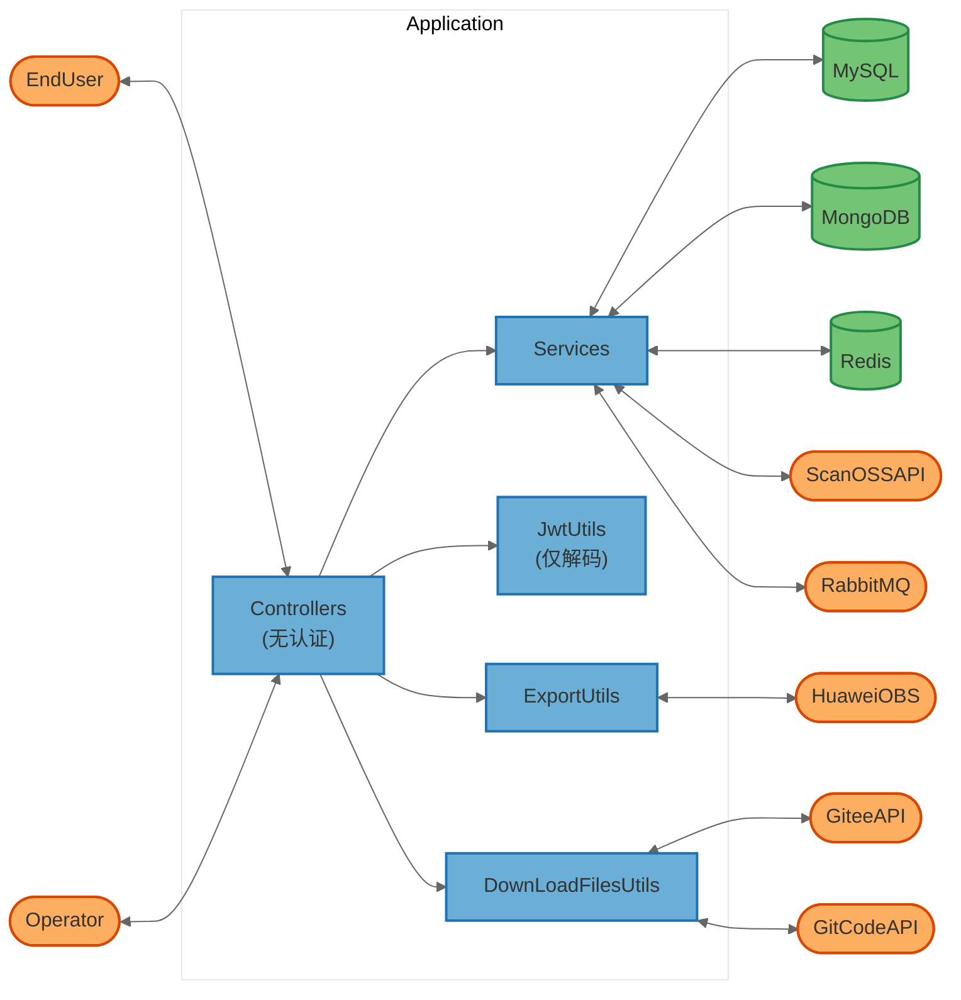

# openlibing-sca 项目安全威胁分析报告

**分析日期：** 2026-08-10
**分析版本：** release_20250730
**分析方法：** STRIDE-A 威胁建模
**项目仓库：** https://gitcode.com/openlibing/openlibing-sca.git

---

## 目录

1. [执行摘要](#1-执行摘要)
2. [系统架构概述](#2-系统架构概述)
3. [数据流图（DFD）](#3-数据流图dfd)
4. [STRIDE-A 威胁分析](#4-stride-a-威胁分析)
5. [安全发现与漏洞详情](#5-安全发现与漏洞详情)
6. [修复建议与行动计划](#6-修复建议与行动计划)
7. [附录](#7-附录)

---

## 1. 执行摘要

### 1.1 分析概述

openlibing-sca 是一个基于 Spring Boot 3.5.5 的软件成分分析（SCA）平台，主要功能包括：

- 开源代码扫描与许可证合规检查
- PR/MR 代码扫描集成（Gitee/GitCode）
- 二进制文件许可证分析
- ScanOSS 指纹匹配
- 扫描结果审核与导出

系统采用微服务架构，使用 MySQL、MongoDB、Redis 作为数据存储，集成华为云 OBS 对象存储，通过 RabbitMQ 进行消息通信，使用 Apollo 配置中心。

### 1.2 关键安全风险

本次分析共识别出 **11 个安全问题**，其中：

| 严重级别 | 数量 | 关键问题 |
|---------|------|---------|
| **严重（Critical）** | 3 | 缺失认证授权、任意文件下载、SSRF |
| **高危（High）** | 4 | Token URL 泄露、XSS 防护缺陷、Actuator 未授权、异常信息泄露 |
| **中危（Medium）** | 3 | Redis 反序列化、文件上传限制过大、Beta 环境 HTTP |
| **低危（Low）** | 1 | CORS 未显式配置 |

### 1.3 核心结论

> **最严重的问题是系统完全缺失认证授权机制。** 所有 API 接口（包括数据查询、文件下载、扫描触发、审核操作等）均可被未授权访问。攻击者无需任何凭证即可：
>
> - 下载任意导出文件
> - 查询所有扫描数据和敏感信息
> - 触发扫描任务消耗系统资源
> - 修改审核状态和屏蔽规则
> - 通过 SSRF 访问内部服务
>
> **建议立即暂停生产环境部署，优先修复认证授权问题。**

---

## 2. 系统架构概述

### 2.1 技术栈

| 类别 | 技术 | 版本 |
|------|------|------|
| 运行时 | Java / Spring Boot | 21 / 3.5.5 |
| Web 框架 | Spring MVC | 6.2.12 |
| ORM | MyBatis-Plus | 3.5.10.1 |
| 关系数据库 | MySQL | 9.3.0 驱动 |
| 文档数据库 | MongoDB | Spring Data MongoDB |
| 缓存 | Redis (Lettuce + Redisson) | 6.5.2 / 3.45.1 |
| 消息队列 | RabbitMQ (Spring AMQP) | 3.4.4 |
| 对象存储 | 华为云 OBS | 3.23.9 |
| 配置中心 | Apollo | 2.4.0 |
| 服务发现 | Netflix Eureka | 4.3.0 |
| 代码扫描 | ScanOSS / ScanCode Toolkit | 1.48.0 / 31.0.1 |
| 版本控制 | JGit | 7.3.0 |
| JSON 处理 | Fastjson2 / org.json | 2.0.56 / 2.0.39 |
| HTTP 客户端 | Apache HttpClient / OkHttp | 5.4.3 / 4.11.0 |
| 文档处理 | Apache POI / PDFBox | 5.4.1 / 3.0.4 |
| API 文档 | SpringDoc OpenAPI | 2.8.10 |

### 2.2 关键组件

| 组件 ID | 类型 | 说明 | 源码位置 |
|---------|------|------|---------|
| OpenlibingScaApplication | Process | Spring Boot 主应用入口 | `OpenlibingScaApplication.java` |
| OpenScanController | Process | 开放扫描接口（标注"无需鉴权"） | `analysis/controller/OpenScanController.java` |
| FileController | Process | 文件下载接口 | `analysis/controller/FileController.java` |
| IntegrationApiController | Process | 集成 API 接口 | `dm/controller/IntegrationApiController.java` |
| OpenScanDMController | Process | DM 扫描确认接口 | `dm/controller/OpenScanDMController.java` |
| ConfirmReviewController | Process | 审核确认接口 | `analysis/controller/ConfirmReviewController.java` |
| ShieldRoleController | Process | 屏蔽规则管理接口 | `analysis/controller/ShieldRoleController.java` |
| ScanossShieldController | Process | ScanOSS 屏蔽规则接口 | `analysis/controller/ScanossShieldController.java` |
| BinaryLicenseController | Process | 二进制许可证接口 | `analysis/controller/BinaryLicenseController.java` |
| EmailReviewController | Process | 邮件审核接口 | `dm/controller/EmailReviewController.java` |
| ManualVersionScanController | Process | 版本扫描接口 | `dm/controller/ManualVersionScanController.java` |
| OpenPersonScanController | Process | 个人扫描接口 | `analysis/controller/OpenPersonScanController.java` |
| JwtUtils | Process | JWT 工具类（仅解码，不验证签名） | `analysis/utils/JwtUtils.java` |
| DownLoadFilesUtils | Process | 文件下载与 Git 操作工具 | `analysis/utils/security/DownLoadFilesUtils.java` |
| CmdInjection | Process | 命令注入防护工具 | `analysis/utils/security/CmdInjection.java` |
| DefenseXssUtil | Process | XSS 防护工具类 | `common/utils/DefenseXssUtil.java` |
| ExportUtils | Process | 导出工具（OBS 文件下载） | `analysis/utils/ExportUtils.java` |
| RedisConfig | Data Store | Redis 配置与序列化 | `common/config/RedisConfig.java` |
| DataSourceConfig | Data Store | 数据源配置 | `common/config/DataSourceConfig.java` |
| ObsClientFactory | External | 华为云 OBS 客户端工厂 | `common/config/ObsClientFactory.java` |
| MySQL | Data Store | 关系型数据库 | 外部服务 |
| MongoDB | Data Store | 文档数据库 | 外部服务 |
| Redis | Data Store | 缓存与分布式锁 | 外部服务 |
| RabbitMQ | External | 消息队列 | 外部服务 |
| HuaweiOBS | External | 华为云对象存储 | 外部服务 |
| GiteeAPI | External | Gitee 代码托管 API | 外部服务 |
| GitCodeAPI | External | GitCode 代码托管 API | 外部服务 |
| ScanOSSAPI | External | ScanOSS 扫描服务 API | 外部服务 |
| ApolloConfig | External | Apollo 配置中心 | 外部服务 |
| Eureka | External | 服务注册中心 | 外部服务 |

### 2.3 信任边界

```
┌─────────────────────────────────────────────────────────────────┐
│                        External                                 │
│  ┌──────────┐  ┌──────────┐  ┌──────────┐  ┌──────────┐        │
│  │  EndUser │  │ Operator │  │ GiteeAPI │  │GitCodeAPI│        │
│  └────┬─────┘  └────┬─────┘  └────┬─────┘  └────┬─────┘        │
└───────┼──────────────┼──────────────┼──────────────┼────────────┘
        │              │              │              │
        ▼              ▼              ▼              ▼
┌─────────────────────────────────────────────────────────────────┐
│                    Application (K8s Pod)                        │
│  ┌─────────────────────────────────────────────────────────┐    │
│  │              Spring Boot Application :7979              │    │
│  │  ┌──────────────┐  ┌──────────────┐  ┌──────────────┐  │    │
│  │  │ Controllers  │  │   Services   │  │   Utils      │  │    │
│  │  │ (无认证授权) │  │              │  │              │  │    │
│  │  └──────────────┘  └──────────────┘  └──────────────┘  │    │
│  └─────────────────────────────────────────────────────────┘    │
│                          │                                      │
│           ┌──────────────┼──────────────┐                       │
│           ▼              ▼              ▼                       │
│  ┌──────────────┐ ┌──────────────┐ ┌──────────────┐            │
│  │    MySQL     │ │   MongoDB    │ │    Redis     │            │
│  └──────────────┘ └──────────────┘ └──────────────┘            │
└─────────────────────────────────────────────────────────────────┘
        │              │              │              │
        ▼              ▼              ▼              ▼
┌─────────────────────────────────────────────────────────────────┐
│                        External Services                        │
│  ┌──────────┐  ┌──────────┐  ┌──────────┐  ┌──────────┐        │
│  │  RabbitMQ│  │HuaweiOBS │  │ScanOSSAPI│  │  Apollo  │        │
│  └──────────┘  └──────────┘  └──────────┘  └──────────┘        │
└─────────────────────────────────────────────────────────────────┘
```

**信任边界说明：**

1. **边界 1 - External → Application：** 用户/操作员通过 HTTP 访问应用，这是最主要的攻击面
2. **边界 2 - Application → Data Stores：** 应用访问内部数据库和缓存
3. **边界 3 - Application → External Services：** 应用调用外部 API（Gitee/GitCode/OBS/ScanOSS）

### 2.4 部署模式

- **容器化：** Docker（基于 openEuler 24.03 LTS SP1）
- **编排：** Kubernetes
- **服务端口：** 7979（HTTP）
- **运行用户：** `openlibing`（非 root）
- **配置中心：** Apollo（生产环境 HTTPS，Beta 环境 HTTP）
- **数据库：** 阿里云/华为云 RDS（推测）

---

## 3. 数据流图（DFD）

### 3.1 高层数据流图



### 3.2 关键数据流说明

| 数据流 ID | 源 → 目标 | 协议 | 数据内容 | 安全风险 |
|-----------|-----------|------|---------|---------|
| DF01 | EndUser → Controllers | HTTP | API 请求、扫描参数、文件下载请求 | 无认证、无加密 |
| DF02 | Controllers → Services | Java 调用 | 业务逻辑处理 | 内部调用 |
| DF03 | Services → MySQL | JDBC | 扫描数据、用户信息、审核记录 | 密码已加密 |
| DF04 | Services → MongoDB | MongoDB Driver | 二进制扫描结果 | - |
| DF05 | Services → Redis | Redis Protocol (SSL) | 缓存、分布式锁 | 密码已加密 |
| DF06 | Controllers → ExportUtils → OBS | HTTPS | 文件下载请求、文件内容 | 路径遍历风险 |
| DF07 | DownLoadFilesUtils → Gitee/GitCode | HTTPS | API 请求、代码文件下载 | Token 在 URL 中 |
| DF08 | Services → ScanOSS | HTTPS | 指纹扫描请求、扫描结果 | API Key 在命令行参数中 |
| DF09 | Services → RabbitMQ | AMQP | 扫描任务消息 | - |

---

## 4. STRIDE-A 威胁分析

### 4.1 威胁等级定义

| 等级 | 说明 | 利用条件 |
|------|------|---------|
| **Tier 1 (T1)** | 直接暴露，无需前置条件 | 攻击者可直接从网络利用 |
| **Tier 2 (T2)** | 需要一定前置条件 | 需要认证、内部网络访问或用户交互 |
| **Tier 3 (T3)** | 需要高权限或物理访问 | 需要管理员权限、主机访问或特定环境 |

### 4.2 威胁汇总表

| 组件 | S (欺骗) | T (篡改) | R (抵赖) | I (信息泄露) | D (拒绝服务) | E (提权) | A (滥用) | 总计 |
|------|---------|---------|---------|-------------|-------------|---------|---------|------|
| Controllers (全部) | 2 | 2 | 1 | 3 | 2 | 2 | 2 | **14** |
| JwtUtils | 2 | 0 | 0 | 1 | 0 | 1 | 0 | **4** |
| FileController/ExportUtils | 0 | 1 | 0 | 2 | 1 | 0 | 1 | **5** |
| DownLoadFilesUtils | 1 | 1 | 0 | 2 | 1 | 0 | 1 | **6** |
| DefenseXssUtil | 0 | 1 | 0 | 1 | 0 | 0 | 0 | **2** |
| RedisConfig | 0 | 1 | 0 | 1 | 1 | 1 | 0 | **4** |
| MySQL/MongoDB | 1 | 1 | 1 | 1 | 1 | 1 | 0 | **6** |
| Actuator Endpoints | 0 | 0 | 0 | 2 | 1 | 0 | 0 | **3** |
| External API Integrations | 1 | 1 | 0 | 2 | 1 | 0 | 1 | **6** |
| **总计** | **7** | **8** | **2** | **15** | **8** | **5** | **5** | **50** |

---

### 4.3 各组件详细威胁分析

#### 4.3.1 Controllers（所有控制器）

**锚点：** `src/main/java/com/openlibing/sca/analysis/controller/` 和 `dm/controller/`

| ID | STRIDE | 威胁描述 | Tier | 前置条件 |
|----|--------|---------|------|---------|
| T01.S | S | 攻击者可伪造任意用户身份调用接口，因为没有认证机制 | T1 | 无 |
| T02.S | S | 攻击者可伪造审核人身份进行审核操作 | T1 | 无 |
| T03.T | T | 攻击者可篡改扫描结果、审核状态、屏蔽规则 | T1 | 无 |
| T04.T | T | 攻击者可删除邮件审核记录、扫描数据 | T1 | 无 |
| T05.R | R | 操作无审计日志或审计日志可被篡改，攻击者可抵赖操作 | T2 | 需要访问日志 |
| T06.I | I | 所有扫描数据、用户信息、许可证信息可被未授权查询 | T1 | 无 |
| T07.I | I | 导出文件可被未授权下载 | T1 | 无 |
| T08.I | I | 接口返回详细异常信息，泄露内部实现 | T1 | 无 |
| T09.D | D | 攻击者可批量触发扫描任务，消耗系统资源 | T1 | 无 |
| T10.D | D | 攻击者可上传大文件导致磁盘空间耗尽（500MB 限制） | T1 | 无 |
| T11.E | E | 攻击者可通过未授权接口访问管理功能 | T1 | 无 |
| T12.E | E | 普通用户可执行管理员操作（无角色检查） | T1 | 无 |
| T13.A | A | 攻击者可滥用扫描功能进行资源挖矿或批量扫描 | T1 | 无 |
| T14.A | A | 攻击者可通过接口操纵业务逻辑（如绕过审核流程） | T1 | 无 |

#### 4.3.2 JwtUtils

**锚点：** `src/main/java/com/openlibing/sca/analysis/utils/JwtUtils.java:97-99`

```java
public static Claim getClaimByName(String token, String name) {
    return JWT.decode(token).getClaim(name);  // 仅解码，不验证签名！
}
```

| ID | STRIDE | 威胁描述 | Tier | 前置条件 |
|----|--------|---------|------|---------|
| T15.S | S | JWT 仅解码不验证签名，攻击者可伪造任意 token | T1 | 无 |
| T16.S | S | 攻击者可修改 token 中的 login/email 等字段冒充其他用户 | T1 | 无 |
| T17.I | I | Token 内容可被任意解析（虽然 JWT 本身是 base64 编码） | T1 | 无 |
| T18.E | E | 通过伪造管理员 token 提升权限 | T1 | 无 |

#### 4.3.3 FileController / ExportUtils（文件下载）

**锚点：**
- `src/main/java/com/openlibing/sca/analysis/controller/FileController.java:45-66`
- `src/main/java/com/openlibing/sca/analysis/utils/ExportUtils.java:110-149`

| ID | STRIDE | 威胁描述 | Tier | 前置条件 |
|----|--------|---------|------|---------|
| T19.T | T | fileName 参数未做路径遍历过滤，可能访问任意 OBS 对象 | T1 | 无 |
| T20.I | I | 任意文件下载导致敏感数据泄露 | T1 | 无 |
| T21.I | I | Content-Disposition 头未编码，可能导致 HTTP 响应头注入 | T1 | 无 |
| T22.D | D | 重复请求大文件可耗尽带宽和内存 | T1 | 无 |
| T23.A | A | 可枚举文件名批量下载导出数据 | T1 | 无 |

#### 4.3.4 DownLoadFilesUtils（文件下载与 Git 操作）

**锚点：** `src/main/java/com/openlibing/sca/analysis/utils/security/DownLoadFilesUtils.java`

| ID | STRIDE | 威胁描述 | Tier | 前置条件 |
|----|--------|---------|------|---------|
| T24.S | S | Git 克隆 URL 中包含用户名和 token，可能被日志记录 | T2 | 需要访问日志 |
| T25.T | T | 社区/仓库名/分支名虽经过 CmdInjection 检查，但仍可能导致 Git 参数注入 | T2 | 需要构造特殊输入 |
| T26.I | I | Gitee/GitCode access_token 通过 URL 查询参数传递，会被日志记录 | T1 | 无（网络层可见） |
| T27.I | I | ScanOSS API Key 通过命令行参数传递，可能被进程列表泄露 | T2 | 需要主机访问 |
| T28.D | D | 大量并发下载可耗尽磁盘空间和网络带宽 | T1 | 无 |
| T29.A | A | 攻击者可构造恶意仓库 URL 诱导服务器克隆恶意代码 | T2 | 需要触发扫描 |

#### 4.3.5 DefenseXssUtil（XSS 防护）

**锚点：** `src/main/java/com/openlibing/sca/common/utils/DefenseXssUtil.java`

| ID | STRIDE | 威胁描述 | Tier | 前置条件 |
|----|--------|---------|------|---------|
| T30.T | T | XSS 过滤逻辑存在缺陷，非白名单标签内容被静默丢弃（append null） | T2 | 需要提交恶意输入 |
| T31.I | I | 没有全局 XSS 过滤器，工具类未被调用，存储型 XSS 可能发生 | T2 | 需要提交恶意输入 |

#### 4.3.6 RedisConfig

**锚点：** `src/main/java/com/openlibing/sca/common/config/RedisConfig.java:90-99`

```java
om.activateDefaultTyping(
    LaissezFaireSubTypeValidator.instance,  // 允许所有子类型！
    ObjectMapper.DefaultTyping.NON_FINAL,
    JsonTypeInfo.As.PROPERTY);
```

| ID | STRIDE | 威胁描述 | Tier | 前置条件 |
|----|--------|---------|------|---------|
| T32.T | T | 使用 LaissezFaireSubTypeValidator 允许任意子类型反序列化 | T3 | 需要 Redis 写入权限 |
| T33.I | I | Redis 中存储的敏感数据（token、缓存）可能被泄露 | T3 | 需要 Redis 访问权限 |
| T34.D | D | 恶意构造的 Redis 数据可导致应用崩溃 | T3 | 需要 Redis 写入权限 |
| T35.E | E | 反序列化漏洞可能导致远程代码执行（RCE） | T3 | 需要 Redis 写入权限 |

#### 4.3.7 MySQL / MongoDB

| ID | STRIDE | 威胁描述 | Tier | 前置条件 |
|----|--------|---------|------|---------|
| T36.S | S | 数据库凭证如果泄露，攻击者可直接访问数据库 | T3 | 需要获取凭证 |
| T37.T | T | SQL 注入风险（代码审查显示使用 #{} 参数化查询，风险较低） | T3 | 需要绕过参数化 |
| T38.R | R | 数据库操作日志可能不完整 | T3 | 需要 DBA 权限 |
| T39.I | I | 数据库中存储的敏感信息（token、用户数据）可能被泄露 | T3 | 需要数据库访问 |
| T40.D | D | 数据库连接耗尽或慢查询可导致服务不可用 | T2 | 需要网络访问 |
| T41.E | E | 数据库权限过大可能导致提权 | T3 | 需要数据库访问 |

#### 4.3.8 Actuator Endpoints

**锚点：** `pom.xml:93-123`（引入了 spring-boot-starter-actuator）

| ID | STRIDE | 威胁描述 | Tier | 前置条件 |
|----|--------|---------|------|---------|
| T42.I | I | /actuator/env 可能泄露环境变量和配置信息（含密钥） | T1 | 无 |
| T43.I | I | /actuator/heapdump 可下载堆转储，泄露内存中的敏感数据 | T1 | 无 |
| T44.D | D | /actuator/shutdown（如果启用）可关闭应用 | T1 | 无 |

#### 4.3.9 External API Integrations（外部 API 集成）

| ID | STRIDE | 威胁描述 | Tier | 前置条件 |
|----|--------|---------|------|---------|
| T45.S | S | 外部 API 响应未做完整性验证，可能被中间人篡改 | T2 | 需要 MITM 位置 |
| T46.T | T | 从 Gitee/GitCode 下载的文件未经校验直接使用 | T2 | 需要控制仓库 |
| T47.I | I | API Token 在传输或日志中泄露 | T1 | 网络层可见 |
| T48.I | I | ScanOSS 扫描结果可能包含敏感代码片段 | T2 | 需要访问结果 |
| T49.D | D | 外部 API 不可用可导致扫描功能瘫痪 | T2 | 外部服务故障 |
| T50.A | A | 攻击者可利用 SSRF 漏洞访问内部服务（见 T19-T23） | T1 | 无 |

---

## 5. 安全发现与漏洞详情

### 5.1 严重（Critical）漏洞

---

#### FIND-01: 所有 API 接口缺失认证授权机制

| 属性 | 值 |
|------|-----|
| **严重级别** | Critical |
| **CVSS 4.0 评分** | 9.8 |
| **CVSS 向量** | `CVSS:4.0/AV:N/AC:L/AT:N/PR:N/UI:N/VC:H/VI:H/VA:H/SC:H/SI:H/SA:H` |
| **CWE** | [CWE-306: Missing Authentication for Critical Function](https://cwe.mitre.org/data/definitions/306.html) |
| **OWASP** | A01:2025 – Broken Access Control |
| **利用难度** | Tier 1（无需任何前置条件） |
| **修复工作量** | High |

**描述：**

系统未实现任何认证授权机制。代码中没有 Spring Security 配置、没有安全过滤器、没有拦截器、没有方法级权限注解。所有 Controller 接口均可被未授权匿名访问。

特别值得注意的是，`OpenScanController.java:184` 的代码注释明确写着"机机接口，无需鉴权"：

```java
/**
 * 机机接口，无需鉴权
 */
@PostMapping(value = "/scanIssue/queryAll")
public ResponseEntity getScanIssueQueryAll(@RequestBody ScanIssueQueryVO queryVO) {
    // ...
}
```

**受影响接口（部分列表）：**

| Controller | 路径前缀 | 风险操作 |
|-----------|---------|---------|
| OpenScanController | `/open/scan/**` | 查询扫描数据、导出、文件下载 |
| FileController | `/open/download/**` | 任意文件下载 |
| IntegrationApiController | `/scan/**` | 触发扫描、保存数据 |
| OpenScanDMController | `/scan/confirm/**` | 确认/修改问题状态 |
| ConfirmReviewController | `/review/**` | 批量审核/撤回 |
| ShieldRoleController | `/shield/role/**` | 增删屏蔽规则 |
| ScanossShieldController | `/scanoss/shield/**` | 增删 ScanOSS 屏蔽规则 |
| EmailReviewController | `/email/review/**` | 删除邮件审核记录 |
| ManualVersionScanController | `/version/scan/**` | 添加/启动版本扫描 |

**证据：**

- 未找到 `SecurityConfig`、`WebSecurityConfig`、`SecurityFilterChain` 等 Spring Security 配置类
- 未找到 `@PreAuthorize`、`@Secured`、`@RolesAllowed` 等权限注解
- 未找到 `HandlerInterceptor` 或 `Filter` 实现类
- `JwtUtils.getClaimByName()` 仅调用 `JWT.decode(token)`，不验证签名

**修复建议：**

1. **立即引入 Spring Security** 依赖
2. 配置 `SecurityFilterChain`，对所有接口默认要求认证
3. 实现 JWT 签名验证（使用 `JWT.require(Algorithm)` 验证 token 签名）
4. 实现基于角色的访问控制（RBAC），区分普通用户和管理员权限
5. 对"机机接口"使用 API Key 或服务间认证机制
6. 添加安全过滤器，在请求到达 Controller 前完成认证

**验证步骤：**

- 未携带 token 访问任意接口应返回 401 Unauthorized
- 携带无效/伪造 token 应返回 401
- 普通用户访问管理员接口应返回 403 Forbidden

---

#### FIND-02: 任意文件下载漏洞（路径遍历）

| 属性 | 值 |
|------|-----|
| **严重级别** | Critical |
| **CVSS 4.0 评分** | 8.6 |
| **CVSS 向量** | `CVSS:4.0/AV:N/AC:L/AT:N/PR:N/UI:N/VC:H/VI:N/VA:N/SC:N/SI:N/SA:N` |
| **CWE** | [CWE-22: Improper Limitation of a Pathname to a Restricted Directory](https://cwe.mitre.org/data/definitions/22.html) |
| **OWASP** | A01:2025 – Broken Access Control |
| **利用难度** | Tier 1 |
| **修复工作量** | Low |

**描述：**

文件下载接口 `/open/download/file` 接受 `fileName` 参数，虽然校验了文件是否在数据库中存在，但未对文件名进行路径遍历字符过滤，直接将其传递给 OBS 客户端的 `getObject()` 方法。

**证据：**

`FileController.java:45-66`:
```java
@GetMapping("/file")
public ResponseEntity downloadFile(
    @Valid @RequestParam("fileName") String fileName,
    HttpServletResponse response) {
    if (StringUtils.isBlank(fileName)) {
        return ResponseEntity.failure("文件名不得为空");
    }
    if (!openScanService.countExportDataByFileName(fileName)) {
        return ResponseEntity.failure("文件不存在");
    }
    // fileName 直接传入，无路径遍历过滤
    openScanService.getExportData(fileName, response);
    return ResponseEntity.success();
}
```

`ExportUtils.java:110-149`:
```java
// fileName 直接作为 OBS 对象 key
ObsObject obsObject = obsClient.getObject(bucketName, fileName);
// ...
response.setHeader("Content-Disposition", "attachment;filename=" + fileName);
```

**风险：**

- 攻击者可构造包含 `../` 的文件名尝试遍历 OBS bucket 中的其他对象
- `Content-Disposition` 头中的 `fileName` 未进行 URL 编码，可能导致 HTTP 响应头注入
- 数据库校验 `countExportDataByFileName` 只能检查文件名是否存在于导出记录表中，但无法阻止文件名本身包含恶意字符

**修复建议：**

1. 对 `fileName` 进行严格校验：只允许字母、数字、下划线、连字符、点号
2. 禁止文件名包含 `/`、`\`、`..` 等路径字符
3. 使用正则白名单：`^[a-zA-Z0-9_\\-\\.]+$`
4. 对 `Content-Disposition` 头中的文件名进行 URL 编码：
   ```java
   response.setHeader("Content-Disposition",
       "attachment;filename*=UTF-8''" + URLEncoder.encode(fileName, StandardCharsets.UTF_8));
   ```
5. 考虑使用随机生成的文件 ID 而非原始文件名进行下载

**验证步骤：**

- 请求 `/open/download/file?fileName=../etc/passwd` 应返回错误
- 请求 `/open/download/file?fileName=test%0D%0ASet-Cookie:hacked` 应被拒绝
- 正常文件名下载应正常工作

---

#### FIND-03: SSRF（服务端请求伪造）漏洞

| 属性 | 值 |
|------|-----|
| **严重级别** | Critical |
| **CVSS 4.0 评分** | 9.1 |
| **CVSS 向量** | `CVSS:4.0/AV:N/AC:L/AT:N/PR:N/UI:N/VC:H/VI:N/VA:L/SC:H/SI:N/SA:N` |
| **CWE** | [CWE-918: Server-Side Request Forgery (SSRF)](https://cwe.mitre.org/data/definitions/918.html) |
| **OWASP** | A10:2025 – Server-Side Request Forgery (SSRF) |
| **利用难度** | Tier 1 |
| **修复工作量** | Medium |

**描述：**

`/open/scan/showFileHash` 接口接受 `fileHash` 参数，直接拼接到 URL 中发起服务端请求，未做任何验证或过滤。

**证据：**

`OpenScanController.java:318-321`:
```java
@GetMapping(value = "/showFileHash")
public ResponseEntity showFileHash(@RequestParam("fileHash") String fileHash) {
    return openScanService.showFileHash(fileHash);
}
```

`OpenScanServiceImpl.java:1405`:
```java
String url = ossFileUrl + fileHash;  // fileHash 用户可控，直接拼接
restTemplate.exchange(url, HttpMethod.GET, httpEntity, String.class);
```

**风险：**

- 攻击者可构造恶意 `fileHash` 值访问内部服务
- 可访问云元数据服务（如 `http://169.254.169.254/latest/meta-data/`）获取临时凭证
- 可扫描内部网络端口和服务
- 可访问 K8s API Server（`https://kubernetes.default.svc`）

**修复建议：**

1. 对 `fileHash` 进行严格格式校验（如只允许字母数字和连字符）
2. 使用 URL 白名单机制，只允许访问指定的 OBS 域名
3. 禁用不必要的 HTTP 重定向
4. 配置独立的网络出口，限制应用可访问的外部地址范围
5. 使用 `RestTemplate` 的自定义 `ClientHttpRequestFactory` 配置超时和白名单

**验证步骤：**

- 请求 `/open/scan/showFileHash?fileHash=../../etc/passwd` 应返回错误
- 请求 `/open/scan/showFileHash?fileHash=169.254.169.254` 应被阻止
- 正常 fileHash 请求应正常工作

---

### 5.2 高危（High）漏洞

---

#### FIND-04: Access Token 通过 URL 查询参数传递

| 属性 | 值 |
|------|-----|
| **严重级别** | High |
| **CVSS 4.0 评分** | 7.5 |
| **CVSS 向量** | `CVSS:4.0/AV:N/AC:L/AT:N/PR:N/UI:N/VC:H/VI:N/VA:N/SC:N/SI:N/SA:N` |
| **CWE** | [CWE-598: Use of GET Request Method With Sensitive Query Strings](https://cwe.mitre.org/data/definitions/598.html) |
| **OWASP** | A02:2025 – Cryptographic Failures |
| **利用难度** | Tier 1 |
| **修复工作量** | Medium |

**描述：**

调用 Gitee/GitCode API 时，access_token 通过 URL 查询参数 `?access_token=xxx` 传递，而非使用 HTTP Authorization Header。

**证据：**

`OpenScanServiceImpl.java` 中多处：
```java
// 第 652-653 行
+ "?access_token=" + token

// 第 733-734 行
+ "/commits?access_token=" + token

// 第 1108-1109 行
.append("?access_token=").append(token)

// 第 1637-1638 行
+ PrCommonName.TOKEN  // "&access_token="
+ urlToken
```

**风险：**

- URL 会被记录在 Web 服务器访问日志中
- URL 会被记录在代理服务器、CDN、负载均衡器日志中
- URL 会保存在浏览器历史记录中
- URL 可能通过 Referer 头泄露给第三方网站
- 进程列表中可以看到命令行参数中的 token（ScanOSS key）

**修复建议：**

1. 将 access_token 从 URL 参数改为 HTTP Header：
   ```java
   HttpHeaders headers = new HttpHeaders();
   headers.set("Authorization", "Bearer " + token);
   ```
2. ScanOSS API Key 通过环境变量或配置文件传递，不要通过命令行参数
3. 确保日志配置中过滤掉敏感的查询参数

**验证步骤：**

- 检查所有外部 API 调用，确认 token 不在 URL 中
- 检查访问日志，确认不包含 token
- 检查进程列表（`ps aux`），确认不包含敏感参数

---

#### FIND-05: JWT 仅解码不验证签名

| 属性 | 值 |
|------|-----|
| **严重级别** | High |
| **CVSS 4.0 评分** | 8.1 |
| **CVSS 向量** | `CVSS:4.0/AV:N/AC:L/AT:N/PR:N/UI:N/VC:H/VI:H/VA:N/SC:N/SI:N/SA:N` |
| **CWE** | [CWE-347: Improper Verification of Cryptographic Signature](https://cwe.mitre.org/data/definitions/347.html) |
| **OWASP** | A02:2025 – Cryptographic Failures |
| **利用难度** | Tier 1 |
| **修复工作量** | Medium |

**描述：**

`JwtUtils.getClaimByName()` 方法仅调用 `JWT.decode(token)` 解码 JWT 内容，完全不验证签名。攻击者可以伪造任意 token。

**证据：**

`JwtUtils.java:97-99`:
```java
public static Claim getClaimByName(String token, String name) {
    return JWT.decode(token).getClaim(name);  // 仅解码，不验证签名！
}
```

**风险：**

- 攻击者可使用任意 JWT 库伪造 token
- 可修改 token 中的 `login`、`email`、`name` 等字段冒充任意用户
- 可伪造管理员身份

**修复建议：**

1. 使用 `JWT.require(Algorithm.HMAC256(secret))` 验证签名
2. 验证 token 的过期时间（`exp`）、签发者（`iss`）、受众（`aud`）
3. 实现 token 黑名单或吊销机制
4. 使用安全的密钥管理方案存储签名密钥

**验证步骤：**

- 使用篡改的 token 应抛出 `SignatureVerificationException`
- 使用过期 token 应抛出 `TokenExpiredException`
- 正确签名的 token 应正常解析

---

#### FIND-06: Actuator 端点未授权访问

| 属性 | 值 |
|------|-----|
| **严重级别** | High |
| **CVSS 4.0 评分** | 7.5 |
| **CVSS 向量** | `CVSS:4.0/AV:N/AC:L/AT:N/PR:N/UI:N/VC:H/VI:N/VA:N/SC:N/SI:N/SA:N` |
| **CWE** | [CWE-200: Exposure of Sensitive Information to an Unauthorized Actor](https://cwe.mitre.org/data/definitions/200.html) |
| **OWASP** | A05:2025 – Security Misconfiguration |
| **利用难度** | Tier 1 |
| **修复工作量** | Low |

**描述：**

项目引入了 `spring-boot-starter-actuator` 依赖，但未在配置文件中限制暴露的端点。由于没有 Spring Security 保护，这些端点可能被未授权访问。

**证据：**

`pom.xml:93-123`:
```xml
<dependency>
    <groupId>org.springframework.boot</groupId>
    <artifactId>spring-boot-starter-actuator</artifactId>
</dependency>
```

所有 `application-*.yaml` 配置文件中均未找到 `management.endpoints` 配置。

**风险：**

- `/actuator/env` - 泄露环境变量和配置属性（可能包含密钥）
- `/actuator/heapdump` - 下载堆转储，泄露内存中的所有数据
- `/actuator/configprops` - 泄露所有配置属性
- `/actuator/mappings` - 泄露所有接口映射
- `/actuator/beans` - 泄露所有 Spring Bean
- `/actuator/logfile` - 可能泄露日志文件内容

**修复建议：**

1. 在 `application.yaml` 中配置：
   ```yaml
   management:
     endpoints:
       web:
         exposure:
           include: health,info  # 只暴露必要端点
     endpoint:
       health:
         show-details: never    # 不显示健康检查详情
   ```
2. 考虑使用独立的管理端口（`management.server.port`）
3. 使用 Spring Security 保护 Actuator 端点
4. 禁用不需要的端点

**验证步骤：**

- 访问 `/actuator` 应只看到 health 和 info
- 访问 `/actuator/env` 应返回 404 或 401
- 访问 `/actuator/heapdump` 应返回 404 或 401

---

#### FIND-07: 异常信息直接返回客户端

| 属性 | 值 |
|------|-----|
| **严重级别** | High |
| **CVSS 4.0 评分** | 5.3 |
| **CVSS 向量** | `CVSS:4.0/AV:N/AC:L/AT:N/PR:N/UI:N/VC:L/VI:N/VA:N/SC:N/SI:N/SA:N` |
| **CWE** | [CWE-209: Generation of Error Message Containing Sensitive Information](https://cwe.mitre.org/data/definitions/209.html) |
| **OWASP** | A05:2025 – Security Misconfiguration |
| **利用难度** | Tier 1 |
| **修复工作量** | Low |

**描述：**

部分 Controller 直接将异常的 `getMessage()` 返回给客户端，可能泄露内部实现细节。

**证据：**

`OpenScanController.java:130`:
```java
return ResponseEntity.failure(500, e.getMessage());
```

`DownLoadFilesUtils.java:1208`:
```java
throw new ScaException(500, "克隆仓库失败", "git clone 命令执行失败: " + output);
```

**风险：**

- 泄露 SQL 错误信息（表名、列名、查询结构）
- 泄露文件路径和服务器目录结构
- 泄露内部服务地址和端口
- 泄露第三方 API 密钥或 token
- 帮助攻击者了解系统内部结构，为进一步攻击提供信息

**修复建议：**

1. 实现全局异常处理器（`@RestControllerAdvice`）
2. 对客户端只返回通用错误信息（如"服务器内部错误"）
3. 详细错误信息只记录到日志中
4. 生产环境关闭堆栈跟踪输出

**验证步骤：**

- 触发各种异常，确认返回信息不包含敏感细节
- 检查日志文件，确认详细错误已记录

---

### 5.3 中危（Medium）漏洞

---

#### FIND-08: Redis 反序列化风险

| 属性 | 值 |
|------|-----|
| **严重级别** | Medium |
| **CVSS 4.0 评分** | 6.6 |
| **CVSS 向量** | `CVSS:4.0/AV:L/AC:L/AT:N/PR:H/UI:N/VC:H/VI:H/VA:H/SC:N/SI:N/SA:N` |
| **CWE** | [CWE-502: Deserialization of Untrusted Data](https://cwe.mitre.org/data/definitions/502.html) |
| **OWASP** | A08:2025 – Software and Data Integrity Failures |
| **利用难度** | Tier 3（需要 Redis 写入权限） |
| **修复工作量** | Medium |

**描述：**

RedisTemplate 的 ObjectMapper 配置使用了 `LaissezFaireSubTypeValidator`，允许反序列化任意子类型。如果攻击者能够向 Redis 写入恶意数据，可能导致远程代码执行。

**证据：**

`RedisConfig.java:90-99`:
```java
om.activateDefaultTyping(
    LaissezFaireSubTypeValidator.instance,  // 不限制子类型
    ObjectMapper.DefaultTyping.NON_FINAL,
    JsonTypeInfo.As.PROPERTY);
```

**修复建议：**

1. 使用 `BasicPolymorphicTypeValidator` 限制允许的类型：
   ```java
   BasicPolymorphicTypeValidator ptv = BasicPolymorphicTypeValidator.builder()
       .allowIfBaseType(Object.class)
       .allowIfSubType("com.openlibing.sca.")
       .build();
   om.activateDefaultTyping(ptv, ObjectMapper.DefaultTyping.NON_FINAL);
   ```
2. 确保 Redis 有强密码并启用 SSL
3. 限制 Redis 网络访问，只允许应用服务器连接
4. 定期审计 Redis 中的数据

**验证步骤：**

- 尝试在 Redis 中放入恶意序列化数据，应被拒绝反序列化
- 只有 `com.openlibing.sca` 包下的类可以被反序列化

---

#### FIND-09: 文件上传大小限制过大

| 属性 | 值 |
|------|-----|
| **严重级别** | Medium |
| **CVSS 4.0 评分** | 5.3 |
| **CVSS 向量** | `CVSS:4.0/AV:N/AC:L/AT:N/PR:N/UI:N/VC:N/VI:N/VA:L/SC:N/SI:N/SA:N` |
| **CWE** | [CWE-400: Uncontrolled Resource Consumption](https://cwe.mitre.org/data/definitions/400.html) |
| **OWASP** | A04:2025 – Insecure Design |
| **利用难度** | Tier 1 |
| **修复工作量** | Low |

**描述：**

配置文件中设置了 500MB 的文件上传限制，可能导致磁盘空间耗尽或内存溢出。

**证据：**

`application.yaml:14-17`:
```yaml
spring:
  servlet:
    multipart:
      max-file-size: 500MB
      max-request-size: 500MB
```

**修复建议：**

1. 根据实际业务需求调整上传大小限制（如 50MB）
2. 实现上传速率限制
3. 配置磁盘空间监控和告警
4. 实现文件类型白名单校验

---

#### FIND-10: Beta 环境 Apollo 配置中心使用 HTTP

| 属性 | 值 |
|------|-----|
| **严重级别** | Medium |
| **CVSS 4.0 评分** | 6.5 |
| **CVSS 向量** | `CVSS:4.0/AV:N/AC:L/AT:N/PR:N/UI:N/VC:H/VI:N/VA:N/SC:N/SI:N/SA:N` |
| **CWE** | [CWE-319: Cleartext Transmission of Sensitive Information](https://cwe.mitre.org/data/definitions/319.html) |
| **OWASP** | A02:2025 – Cryptographic Failures |
| **利用难度** | Tier 2（需要内部网络位置） |
| **修复工作量** | Low |

**描述：**

Beta 环境的 Apollo 配置中心使用 HTTP 而非 HTTPS，配置传输过程中可能被窃听或篡改。

**证据：**

`application-beta.yaml:7`:
```yaml
apollo:
  meta: http://apollo-config.openlibing-beta.svc.cluster.local:8081
```

**修复建议：**

1. 为 Apollo 配置中心启用 HTTPS
2. 如果 Apollo 部署在 K8s 内部，可考虑使用服务网格（如 Istio）提供 mTLS
3. 确保 Apollo 配置中的敏感信息（如数据库密码）已加密

---

### 5.4 低危（Low）漏洞

---

#### FIND-11: CORS 未显式配置

| 属性 | 值 |
|------|-----|
| **严重级别** | Low |
| **CVSS 4.0 评分** | 3.1 |
| **CVSS 向量** | `CVSS:4.0/AV:N/AC:H/AT:N/PR:N/UI:R/VC:L/VI:N/VA:N/SC:N/SI:N/SA:N` |
| **CWE** | [CWE-942: Permissive Cross-domain Policy with Untrusted Domains](https://cwe.mitre.org/data/definitions/942.html) |
| **OWASP** | A05:2025 – Security Misconfiguration |
| **利用难度** | Tier 2 |
| **修复工作量** | Low |

**描述：**

项目未显式配置 CORS 策略。虽然没有使用 `@CrossOrigin` 注解允许所有来源，但也没有明确的白名单配置。

**修复建议：**

1. 显式配置 CORS 白名单：
   ```java
   @Configuration
   public class CorsConfig implements WebMvcConfigurer {
       @Override
       public void addCorsMappings(CorsRegistry registry) {
           registry.addMapping("/**")
               .allowedOrigins("https://app.example.com")
               .allowedMethods("GET", "POST", "PUT", "DELETE")
               .allowCredentials(true)
               .maxAge(3600);
       }
   }
   ```

---

## 6. 修复建议与行动计划

### 6.1 快速修复（Quick Wins）

以下修复工作量低、影响大，建议立即实施：

| 优先级 | 漏洞编号 | 修复内容 | 工作量 |
|--------|---------|---------|--------|
| P0 | FIND-06 | 限制 Actuator 端点暴露，只保留 health 和 info | Low |
| P0 | FIND-02 | 文件下载接口添加文件名白名单校验 | Low |
| P0 | FIND-03 | SSRF 接口添加 fileHash 格式校验 | Low |
| P1 | FIND-07 | 实现全局异常处理器，不返回内部错误 | Low |
| P1 | FIND-09 | 调整文件上传大小限制到合理值 | Low |
| P1 | FIND-10 | Beta 环境 Apollo 启用 HTTPS | Low |
| P2 | FIND-11 | 显式配置 CORS 白名单 | Low |

### 6.2 中期修复

| 优先级 | 漏洞编号 | 修复内容 | 工作量 |
|--------|---------|---------|--------|
| P0 | FIND-01 | 引入 Spring Security，实现认证授权 | High |
| P0 | FIND-05 | JWT 签名验证实现 | Medium |
| P1 | FIND-04 | Token 从 URL 参数改为 Header | Medium |
| P2 | FIND-08 | Redis 反序列化类型限制 | Medium |

### 6.3 长期安全改进

1. **建立安全开发生命周期（SDL）**
   - 代码审查中加入安全检查清单
   - 定期进行依赖漏洞扫描（如 OWASP Dependency Check）
   - 集成 SAST/DAST 工具到 CI/CD 流水线

2. **完善安全监控**
   - 实现操作审计日志
   - 配置异常访问告警
   - 定期审查日志

3. **安全培训**
   - 对开发团队进行安全编码培训
   - 建立安全编码规范

### 6.4 修复优先级矩阵

```
影响程度
  高 │ FIND-01        │ FIND-02, FIND-03
     │ FIND-05        │ FIND-04, FIND-06
     ├────────────────┼────────────────┤
  中 │ FIND-08        │ FIND-07
     │ FIND-10        │ FIND-09
     ├────────────────┼────────────────┤
  低 │                │ FIND-11
     └────────────────┴────────────────┘
        低               中           高
                    利用难度
```

---

## 7. 附录

### 7.1 威胁覆盖验证表

| 威胁 ID | 对应发现 | 状态 |
|---------|---------|------|
| T01-T14 | FIND-01 | ✅ 已覆盖 |
| T15-T18 | FIND-05 | ✅ 已覆盖 |
| T19-T23 | FIND-02 | ✅ 已覆盖 |
| T26 | FIND-04 | ✅ 已覆盖 |
| T27 | FIND-04 | ✅ 已覆盖 |
| T30-T31 | FIND-07（部分） | ⚠️ 需要进一步审查 XSS 防护 |
| T32-T35 | FIND-08 | ✅ 已覆盖 |
| T42-T44 | FIND-06 | ✅ 已覆盖 |
| T50 | FIND-03 | ✅ 已覆盖 |
| T08, T21 | FIND-07 | ✅ 已覆盖 |
| T10, T22, T28 | FIND-09 | ✅ 已覆盖 |
| T47 | FIND-10 | ✅ 已覆盖 |

### 7.2 参考资料

#### 安全标准

| 标准 | 链接 |
|------|------|
| STRIDE Threat Model | https://learn.microsoft.com/en-us/security/engineering/stride-method |
| OWASP Top 10 2025 | https://owasp.org/Top10/ |
| CWE/SANS Top 25 | https://cwe.mitre.org/top25/ |
| CVSS 4.0 | https://www.first.org/cvss/ |

#### 组件文档

| 组件 | 链接 |
|------|------|
| Spring Security | https://spring.io/projects/spring-security |
| Spring Boot Actuator | https://docs.spring.io/spring-boot/docs/current/reference/html/actuator.html |
| Auth0 java-jwt | https://github.com/auth0/java-jwt |
| Jackson Polymorphic Deserialization | https://github.com/FasterXML/jackson-docs/wiki/PolymorphicTypeDeserializationSecurity |

### 7.3 分析方法说明

本报告采用以下方法进行安全分析：

1. **架构分析**：识别系统组件、信任边界和数据流
2. **STRIDE-A 威胁建模**：对每个组件进行 Spoofing、Tampering、Repudiation、Information Disclosure、Denial of Service、Elevation of Privilege、Abuse 七个维度的威胁分析
3. **代码审查**：手动审查关键安全相关代码
4. **配置审查**：检查应用配置、Docker 配置和部署配置
5. **依赖分析**：检查第三方依赖版本和已知漏洞

### 7.4 报告元数据

| 属性 | 值 |
|------|-----|
| 分析模型 | Doubao-Seed-Evolving |
| 分析开始时间 | 2026-08-10 |
| 分析方法 | STRIDE-A + 代码审查 |
| 分析范围 | 整个 openlibing-sca 代码库 |
| 报告版本 | 1.0 |

---

**报告结束**
