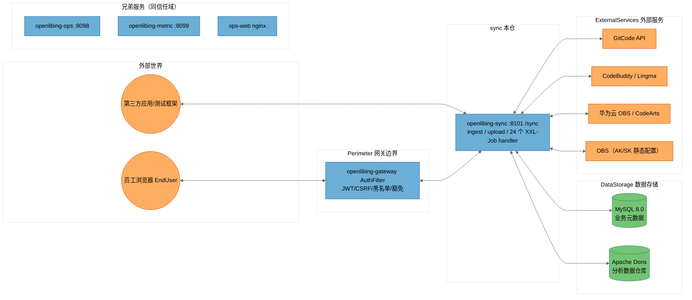

# [openlibing-sync]安全威胁建模分析报告（STRIDE-A）——远程主干基线（单仓版）

> 分析对象：`openlibing-sync` 单仓（含其与 `openlibing-gateway`、`openlibing-common`、`openlibing-framework`、`openlibing-ops`、`openlibing-metric`、`openlibing-ops-web` 及外部服务的信任关系）。
> 分析方法：STRIDE-A（欺骗 Spoofing / 篡改 Tampering / 否认 Repudiation / 信息泄露 Information Disclosure / 拒绝服务 Denial of Service / 权限提升 Elevation of Privilege / 滥用 Abuse），零信任视角 + 纵深防御。
> 结论分级：按**可利用性层级（Tier 1/2/3）**组织，而非按严重级别组织。
> 分析基线：**远程仓最新主干分支**（`origin/master`，HEAD `ccf875a`），通过 git worktree 独立检出，不影响本地开发分支。
> 文档性质：本报告为原合并版《[openlibing-ops、ops-web、metric、sync]安全威胁建模分析报告》拆分出的**单仓版**，拆分时保留与 sync 相关的跨仓信任边界与跨仓系统性发现章节。

---

## 文档信息与元数据

| 字段 | 值 |
| --- | --- |
| 分析模型 | DeepSeek-V4-Flash（threat-model-analyst skill 驱动）；补充 3 项缺口（sync Python 采集脚本、Dockerfile 构建供应链完整性、镜像 SBOM/cosign/seccomp）证据合并自 MiniMax-M3 独立分析报告，本仓相关项为 FIND-33/FIND-34（Python 脚本）与 FIND-35（跨仓构建供应链） |
| 分析基线类型 | 远程仓主干分支（git worktree 独立检出，detached HEAD，分析完成后已清理） |
| 仓库 | `openlibing-sync`，远程主干 `origin/master`，HEAD `ccf875a` |
| 分析范围 | 本仓源码 + 配置 + 部署脚本 + CI 工作流 + Python 采集脚本；信任边界证据来自 `openlibing-gateway`/`openlibing-common` 相关代码与 docs 记录 |
| 输出位置（归档） | `openlibing-docs/architecture_desgin/openlibing-sync/[openlibing-sync]安全威胁建模分析报告.md`（PR 合入主仓 master 后生效） |

---

## 一、执行摘要（Executive Summary）

### 1.1 总体安全态势

OpenLibing 运营域 `openlibing-sync` 仓（远程主干基线）的**工程化与"默认安全"基础较好**：容器镜像加固到位（非 root、umask、删除调试工具、RASP 注入、JRE-only）、配置中心快照不落盘、SQL 动态插入列名白名单 + 值参数化（注入面受限）、XXE 防护齐全、**生产/预发 Swagger 已禁用**（区别于 ops/metric）、日志注入有净化处理、XXL-Job accessToken 启动强校验。

但本仓存在**全体系唯一的 Tier 1 直接暴露项**：**对外数据接入/上传两接口（`POST /sync/api/data/ingest` 与 `POST /sync/testcase/metadata/upload`）零认证、零签名、零限流**，第三方可匿名直写 Doris、向 OBS 上传文件——这是四仓体系中最高优先的整改对象。同时，**OBS AK/SK 静态配置无轮换**、**Python 采集脚本存在日志/SSL 残余风险**（合并补充项）。

> **Note on threat counts:** 本报告共识别 **10 条 STRIDE-A 威胁（T23~T30 + T40/T41）**、整合为 **10 条发现（FIND-01 记入本仓行 + FIND-18~FIND-25 + FIND-33/FIND-34）**，其中 Tier 1 共 1 条、Tier 2 共 4 条、Tier 3 共 5 条。T40/T41 与 FIND-33/FIND-34 为本合并版补充项（sync Python 采集脚本），证据合并自 MiniMax-M3 独立分析。威胁计数会因网关路由实际配置（本报告未覆盖 `openlibing-gateway` 的完整路由豁免表）而波动，相关不确定性已在"分析上下文与假设"中声明。
>
> **基线注意：** 远程主干 CI 已**移除 nightly 防投毒/SCA 扫描工作流**（`nightly-schedule-scan.yml` 仅存在于本地开发分支，未合入主干），供应链纵深防御弱于本地开发分支（相关跨仓发现 FIND-35）。

### 1.2 威胁计数总览（sync）

| 仓库 | Tier 1 | Tier 2 | Tier 3 | 发现合计 | 最突出弱点 |
| --- | --- | --- | --- | --- | --- |
| openlibing-sync | 1 | 4 | 5 | 10 | 对外数据写入接口无认证（可直接写 Doris/OBS）+ Python 采集脚本审查 |

> 注：FIND-01（跨仓系统性发现：服务端零认证 + 限流死代码）统计口径上记入本仓行（Tier 2）；FIND-18 为本仓 **Tier 1** 发现（全体系唯一）；FIND-33/FIND-34 为本仓 Tier 3 补充发现；FIND-35（跨仓构建供应链完整性）单列"跨仓"行，详见第四章。

### 1.3 需优先处置的 Top 风险（sync）

1. **（Tier 1，全体系唯一）对外数据写入接口完全未鉴权**：`POST /sync/api/data/ingest` 与 `POST /sync/testcase/metadata/upload` 无任何认证，第三方可直接写 Doris、向 OBS 传文件。
2. **（Tier 1 派生）ingest/upload 无服务端限流、数据量无上限**：第三方可高频刷 Doris / 堆积 OBS 上传。
3. **（Tier 2）upload `archivePath` 由调用方传入**：未校验对象键格式/前缀，可越权写 OBS 指定路径。
4. **（Tier 2）ingest 数据校验薄弱**：缺类型/长度/取值校验，脏数据可污染 Doris 指标结论。
5. **（Tier 3）OBS 静态 AK/SK 无轮换**；**Python 采集脚本日志/SSL 残余风险**（合并补充项）。

---

## 二、系统全景、部署模型与信任边界

### 2.1 sync 在四仓体系中的角色与数据流

```
                        ┌────────────────────────────────────────────────────────────┐
                        │                        外部世界                             │
                        │   员工浏览器 EndUser        第三方应用/测试框架 ThirdParty      │
                        └───────┬───────────────────────────────┬────────────────────┘
                                │ HTTPS（含 CSRF 双提交 Cookie）  │ HTTPS
                                ▼                               ▼
                     ┌─────────────────────┐        ┌──────────────────────┐
                     │ openlibing-gateway  │        │ sync 数据接入/上传    │
                     │ AuthFilter：JWT/CSRF │        │ /sync/api/data/ingest │
                     │ 黑名单/纵向权限/豁免  │        │ /sync/testcase/metadata/upload │
                     └──┬──────┬──────┬────┘        └──────────┬───────────┘
                        ▼      ▼      ▼                        ▼
              ┌──────────┐ ┌────────┐ ┌──────────┐   ┌──────────────────────┐
              │ ops:8098 │ │metric: │ │ops-web   │   │ sync:8101 (context /sync)│
              │ 13控制器  │ │8099 8控制器│ │ nginx    │   │ 24 个 XXL-Job handler   │
              └────┬─────┘ └───┬────┘ │ 静态站点  │   └────┬───────────┬───────┘
                   │           │      └────┬─────┘        │           │
                   ▼           ▼           │              ▼           ▼
        ┌────────────────── MySQL + Doris（双数据源，DDD @DataSource 切换）────────────┐
        └────────────────────────────────────────────────────────────────────────────┘
        sync 还经 Feign/RestTemplate 出站调用：
        GitCode API、openlibing-framework（操作日志）、CodeBuddy、Lingma、
        华为云 CodeArts Pipeline、华为云 OBS、Python 采集器（gitCodeDataCollect）
```

### 2.2 部署分类（sync）

- **分类：`K8S_SERVICE`**（Kubernetes 部署；**部分端点经网关暴露，第三方数据接入端点存在网关转发**；Nacos Discovery 以 HTTPS `secure: true` 注册；本基线为 Apollo）。XXL-Job executor `openlibing-sync-executor` :10000。
- **配置中心**：远程主干仍为 **Apollo**（`apollo.meta` + `apollo.bootstrap.namespaces`）；Nacos 迁移在本地 `feat-apollo-eureka-nacos` 开发分支进行，未合入主干。
- **信任模型**：身份认证（JWT）、CSRF、黑名单、纵向权限统一由网关执行；sync **不承担任何服务端身份校验**。与 ops/metric 不同，sync 的第三方数据接入端点**无网关用户态校验证据** → 前置条件 `None`（Tier 1）。
- **前置条件底板**：sync 数据接入/上传端点第三方直连 → `None`（Tier 1）；XXL-Job executor 仅调度中心内网可达 → `Internal Network`（Tier 2/3）；OBS AK/SK 静态配置 → `Admin Credentials`（Tier 3）。

### 2.3 信任边界与 DFD（sync 视角）



**信任边界说明（sync 视角）：**

| 边界 | 含义 | 关键事实 |
| --- | --- | --- |
| `External` | 浏览器、第三方应用 | **第三方直连 sync 数据接入（无用户态校验）**；员工经网关 |
| `Perimeter` | 网关边界 | AuthFilter 是唯一认证执行点（[AuthFilter.java](file:///c:/w30060144/develop/repositories/openlibing/openlibing-gateway/src/main/java/com/openlibing/gateway/business/filter/AuthFilter.java)）；**sync 数据接入端点未见网关用户态校验证据** |
| `SiblingServices` | ops / metric / ops-web | 同信任域；Doris 为共享数据存储 |
| `SyncContext` | sync 本仓 | ingest/upload 零认证（Tier 1）；XXL-Job executor :10000 accessToken 强校验 |
| `DataStorage` | MySQL / Doris | sync 动态 `INSERT` 直写 Doris；连接串由 Apollo 配置中心下发 |
| `ExternalServices` | GitCode / 云 AI / 华为云 OBS | 出站调用；OBS AK/SK 静态配置（`obs.*` 配置集） |

### 2.4 跨仓信任边界与攻击路径（sync 相关）

> 本单仓版保留跨仓视角，便于定位 sync 在体系中的受信位置与风险传导。

| 跨仓关系 | 信任方向 | 风险传导路径 | 本仓受影响威胁 |
| --- | --- | --- | --- |
| sync → Doris（共享，写） | 写 | **Tier 1 零认证 ingest 匿名直写 Doris → ops/metric 查询/统计读到被污染指标**（脏数据污染运营结论，全体系最直接的跨仓投毒路径） | T23/T24/T27 |
| sync → OBS | 写 | upload `archivePath` 由调用方控制，越权对象键/前缀 → 污染 OBS 存储或覆盖文件 | T29 |
| sync ↔ gateway | 部分信任 | sync 数据接入端点绕过网关用户态校验 → 匿名可达 | T23 |
| sync → GitCode API / 云 AI | 出站 | 采集/汇总 GitCode 数据；凭据生命周期治理（Python 采集脚本 token） | T40/T41 |
| 兄弟仓（ops/metric） | 同信任域 | 任一仓被攻破可横向移动；**ops/metric 读 Doris 的结论受 sync 写入质量影响** | T24 |

---

## 三、openlibing-sync 安全分析

### 3.1 组件与攻击面

| 组件 ID | 锚点（证据文件） | 暴露面 |
| --- | --- | --- |
| DataIngestController | `api/controller/DataIngestController.java` | `POST /api/data/ingest`（context path `/sync`，即 `/sync/api/data/ingest`）第三方数据接入，**零认证** |
| TestCaseDataController | `api/controller/TestCaseDataController.java` | `POST testcase/metadata/upload` multipart 上传（即 `/sync/testcase/metadata/upload`），**零认证** |
| DataIngestServiceImpl | `app/service/thirdapi/impl/DataIngestServiceImpl.java` | 模型存在性/启用/必填字段校验 → `dynamicDorisService.dynamicInsert` 直写 Doris |
| DynamicDorisService + Mapper | `domain/service/thirdapi/impl/DynamicDorisServiceImpl.java` + `resources/mapper/DynamicDorisMapper.xml` | 动态 `INSERT INTO openlibing.${tableName}(${col}) VALUES(#{val})`，列名白名单 + 值参数化 |
| ObsUtilClient | `infrastructure/client/obs/ObsUtilClient.java` | OBS 上传（`putObject` / `uploadFile`），静态 AK/SK 经 `obs.*` 配置集下发 |
| XxlJobExecutors | `domain/service/pipeline/job/*` | 24 个 XXL-Job handler（含 5 个已弃用）；executor `openlibing-sync-executor` :10000 |
| HealthController | `api/controller/HealthController.java` | 健康检查端点（`/health-check/...`） |

### 3.2 STRIDE-A 威胁表（sync）

| 威胁 ID | STRIDE 类别 | 威胁描述 | 前置条件 | Tier |
| --- | --- | --- | --- | --- |
| T23.S | S 欺骗 | 数据接入/上传两接口无任何服务端认证/签名/apiKey，第三方可匿名伪造 appCode 调用并写入 Doris | `None` | T1 |
| T24.T | T 篡改 | ingest 数据仅列名白名单过滤，缺类型/长度/取值校验，脏数据可污染 Doris 指标结论（列名来自 DB 注册表，SQL 注入面受限，但数据完整性无保障） | `None` | T2 |
| T25.I | I 信息泄露 | upload 回传已上传文件路径列表、ingest 回传模型不存在/字段错误等内部细节，便于枚举模型表结构 | `None` | T2 |
| T26.I | I 信息泄露 | OBS AK/SK 经 `obs.*` 配置集下发且为静态配置，无服务侧轮换机制，密钥材料单点 | `Admin Credentials` | T3 |
| T27.D | D 拒绝服务 | ingest/upload 无服务端限流、数据量无上限（仅批次上限常量），第三方可高频刷 Doris / 堆积 OBS 上传 | `None` | T2 |
| T28.D | D 拒绝服务 | XXL-Job executor :10000 暴露面，accessToken 启动强校验是唯一屏障，若 token 泄露/弱配置可伪造调度轰炸 | `Internal Network` + 凭据 | T3 |
| T29.E | E 权限提升 | upload 的 `archiveConfig.archivePath` 由调用方传入，未校验对象键格式/前缀，可越权写 OBS 指定路径 | `None` | T2 |
| T30.A | A 滥用 | 批处理/定时 Job handler（含 5 个已弃用但仍在注册）若被误触发/滥用可造成重复采集、重复写库、数据污染 | `Internal Network` | T3 |
| T40.I | I 信息泄露 | Python 采集脚本 `gitCodeDataCollect` 日志/异常路径可能间接打印 `access_token`（`str(e)` 全量打印）；凭据经 `config.yaml` 的 `${ENV}` 占位符注入为已缓解项 | `Host/OS Access` | T3 |
| T41.T | T 篡改 | Python 采集脚本 `requests.get/post` 未显式声明 `verify=True`/证书锁定，依赖库默认值，代理或传输劫持场景下响应完整性无显式防护 | `Host/OS Access` | T3 |

**STRIDE-A 汇总（sync）**：S=1，T=2，R=0，I=3，D=2，E=1，A=1，共 **10 条**（T23~T30 + T40/T41）。R（否认）为空：数据接入为写后即弃的第三方通道，无用户态身份可否认，记已缓解/不适用。

### 3.3 sync 组件级 STRIDE 明细（节选高风险组件）

**DataIngestController / TestCaseDataController —— 零认证（Tier 1）：**

| 威胁 | 证据 | 影响 |
| --- | --- | --- |
| 数据接入零认证 | [DataIngestController.java:36-44](file:///c:/w30060144/tmp-tm-sync/openlibing-sync-service/src/main/java/com/openlibing/sync/api/controller/DataIngestController.java#L36-L44) `POST /api/data/ingest` 无任何认证注解/签名校验；全仓 grep `HandlerInterceptor\|WebMvcConfigurer\|@PreAuthorize\|SecurityContext` **0 命中**（与服务端零认证结论一致） | 第三方匿名可达 → `dynamicInsert` 直写 Doris；无身份、无审计归属 |
| 上传零认证 | [TestCaseDataController.java:44-87](file:///c:/w30060144/tmp-tm-sync/openlibing-sync-service/src/main/java/com/openlibing/sync/api/controller/TestCaseDataController.java#L44-L87) `testcase/metadata/upload` 无认证，仅做参数必填/批次上限校验 | 匿名上传文件 → OBS；`archivePath` 由调用方控制，存在越权对象键风险 |

**DynamicDorisService（动态写 Doris）—— 已缓解 + 残余风险：**

| 威胁 | 证据 | 影响 |
| --- | --- | --- |
| SQL 注入（已缓解） | [DynamicDorisMapper.xml:5-14](file:///c:/w30060144/tmp-tm-sync/openlibing-sync-service/src/main/resources/mapper/DynamicDorisMapper.xml#L5-L14) `INSERT INTO openlibing.${tableName}`、列 `${col}`、值 `#{val}`；`tableName` 来自 DB 注册模型（非用户直传）、列名经 [DynamicDorisServiceImpl.filterAndValidateData:58-79](file:///c:/w30060144/tmp-tm-sync/openlibing-sync-service/src/main/java/com/openlibing/sync/domain/service/thirdapi/impl/DynamicDorisServiceImpl.java#L58-L79) 对 DB 列注册表白名单过滤、值参数化 | SQL 注入面受限，此项记为已缓解 |
| 数据校验薄弱（残余） | [DynamicDorisServiceImpl.java:35-55](file:///c:/w30060144/tmp-tm-sync/openlibing-sync-service/src/main/java/com/openlibing/sync/domain/service/thirdapi/impl/DynamicDorisServiceImpl.java#L35-L55) 值仅校验"必填字段存在"，无类型/长度/范围校验；`filteredData` 无行数上限 | 脏数据污染 Doris 指标；超长文本/超大行击穿分析性能；叠加零认证可被批量投毒 |

**ObsUtilClient（OBS 上传）：** [ObsUtilClient.java:64-70,128-141](file:///c:/w30060144/tmp-tm-sync/openlibing-sync-service/src/main/java/com/openlibing/sync/infrastructure/client/obs/ObsUtilClient.java) 以静态 AK/SK（`obs.*` 配置集，Apollo 下发）初始化 `ObsClient`，`uploadFile`/`putObject` 写 OBS；无凭据轮换与最小权限拆分（与 T26/FIND-23 对应）。

**XXL-Job（executor）：** appname `openlibing-sync-executor`、端口 10000，`accessToken` 启动强校验（9 个 `xxl.*` 必需 Apollo 配置键）；已弃用的 5 个 handler（`refreshPipelineJobHandler` 等）仍在注册表，存在被误触发风险（与 T30/FIND-25 对应）。

**已缓解项（sync 特有）：** 生产/预发 Swagger 已禁用（`application-prod.yaml`/`application-gamma.yaml` 中 `swagger-ui.enabled: false`、`api-docs.enabled: false`），与 ops/metric 形成对照；`LogSanitizer` 对日志入参净化。

### 3.4 sync Python 采集脚本（gitCodeDataCollect）安全分析【合并补充】

> 本节证据来自 MiniMax-M3 独立分析报告，与 3.3 的 Java 侧证据互补；对应 FIND-33/FIND-34。

| 项 | 评估 | 处置建议 |
| --- | --- | --- |
| 凭据管理 | ✅ `config.yaml` 中 Doris 口令 / 仓库 `access_token` 均通过 `${ENV}` 占位符 + `os.getenv` 注入，**无硬编码**（`config.yaml:53,64`；`main.py:280-291`） | 保持；建议加环境变量来源审计 |
| 日志脱敏 | ⚠️ token 缺失时仅记仓库名（`main.py:289-291`）OK；但错误路径若 `str(e)` 全量打印可能间接泄漏 token | 统一走脱敏工具，禁止 `str(e)` 直出凭据类对象 |
| SSL 校验 | ✅ `requests.get/post` 未显式 `verify=False`，依赖默认校验 | 显式 `verify=True` + 可选证书锁定，规避代理/LB 注入 |
| 重试逻辑 | ⚠️ 指数退避 + 429 重试，但 `max_retries=2` 硬编码，可能掩盖凭据失效 | 重试上限可配置，凭据失效单独告警 |
| 速率限制 | ✅ 内置 `_throttle()` | 保持 |
| Token 调度 | ✅ `TokenScheduler` 多租户 token 轮转 | 保持；轮换策略审计 |

---

## 四、跨仓系统性发现（sync 相关）

### FIND-01（Tier 2，跨仓）：服务端零认证 + 限流死代码系统性单点失效

- **证据链**：ops / metric / sync 三仓 Controller 均无服务端鉴权注解/拦截器（sync grep `HandlerInterceptor`/`WebMvcConfigurer`/`@PreAuthorize`/`SecurityContext` **0 命中**）；身份认证、CSRF、黑名单、纵向权限全部外置于 `openlibing-gateway` 的 AuthFilter。sync 的 `RateLimitConfig` 同样无消费方。
- **影响**：网关是唯一认证屏障（单点失效）。**sync 的 Tier 1 数据接入端点（`/sync/api/data/ingest`、`/sync/testcase/metadata/upload`）无网关用户态校验证据，前置条件为 `None`，是本体系最直接的匿名写入路径。**
- **治理方向（分层，sync 相关）**：
  1. **Tier 1 优先：数据接入/上传接口加认证**：引入 apiKey + HMAC 签名或服务端发放的访问令牌，识别调用方并做白名单（FIND-18）。
  2. **服务端零信任改造**：引入统一入站校验中间件，至少对写接口做服务端身份与租户校验。
  3. **限流落地**：将 RateLimitConfig 挂载到 Filter/Interceptor 或网关侧限流，覆盖 ingest/upload。
  4. **纵深防御**：`archivePath` 白名单、OBS 凭据轮换、数据校验补全。

### FIND-35（Tier 3，跨仓）：镜像构建供应链完整性缺失（JRE/rasp 无签名校验 + 缺 SBOM/cosign/seccomp）【合并补充】

- **证据链**：sync Dockerfile 以 `wget https://mirrors.tuna.tsinghua.edu.cn/Adoptium/...` 拉取 JRE、复制 `rasp.tgz`，均**无签名/SHA256 校验**（构建期供应链）；未生成镜像 SBOM（syft/cyclonedx）、未做镜像签名（cosign）、未声明 K8s seccompProfile / readOnlyRootFilesystem（运行时纵深防御）。证据来自 MiniMax-M3 独立分析。
- **影响**：构建机/镜像源被控或传输劫持时，可注入带毒 JRE/rasp 进最终镜像且事后无法核验；镜像无 SBOM/签名则 SBOM 关联分析、镜像来源审计与运行时策略约束缺失。
- **治理方向**：① JRE/rasp 改为构建期本地预下载 + SHA256 固定；② CI 集成 syft 生成 SBOM + cosign 签名；③ K8s 模板补 `seccompProfile: RuntimeDefault` 与 `readOnlyRootFilesystem`；④ 与供应链完整性合并治理，纳入 nightly SCA 扫描范围。

---

## 五、发现清单（sync，FIND-01 + FIND-18 ~ FIND-25 + FIND-33/FIND-34）

| 发现 | 仓库 | Tier | STRIDE | 对应威胁 | 摘要与处置方向 |
| --- | --- | --- | --- | --- | --- |
| FIND-01 | 跨仓（记入本仓） | T2 | S/D | 跨仓 | 服务端零认证 + 限流死代码系统性单点失效（详见第四章） |
| FIND-18 | sync | T1 | S | T23 | 数据接入/上传接口零认证，第三方可直接写 Doris/OBS（最高优先） |
| FIND-19 | sync | T2 | T | T24 | ingest 数据校验薄弱（类型/长度/范围），脏数据污染 Doris 指标 |
| FIND-20 | sync | T2 | I | T25 | 上传路径列表/接入错误内部细节回显，便于枚举表结构 |
| FIND-21 | sync | T2 | D | T27 | ingest/upload 无服务端限流、无数据量上限，可刷 Doris/OBS |
| FIND-22 | sync | T2 | E | T29 | upload `archivePath` 由调用方控制，OBS 对象键路径穿越风险 |
| FIND-23 | sync | T3 | I | T26 | OBS 静态 AK/SK（`obs.*` 配置集）、无轮换、密钥单点 |
| FIND-24 | sync | T3 | D | T28 | XXL-Job executor :10000 暴露面与 accessToken 生命周期治理 |
| FIND-25 | sync | T3 | A | T30 | 批处理/定时 Job handler（含 5 个已弃用）滥用：重复采集/数据污染 |
| FIND-33 | sync | T3 | I | T40 | Python 采集脚本日志/异常路径可能间接泄漏 `access_token`；凭据 `${ENV}` 注入为已缓解【合并补充】 |
| FIND-34 | sync | T3 | T | T41 | Python 采集脚本 SSL 校验依赖默认值、无显式证书锁定/代理防护【合并补充】 |

> 注：FIND-35（跨仓构建供应链，Tier 3）与本仓 Dockerfile 直接相关，详见第四章。

---

## 六、优先修复路线图（sync 相关）

### Phase 1 —— Tier 1，立即（本周内）

1. **数据接入/上传接口加认证**：引入 apiKey + HMAC 签名或服务端发放的访问令牌，识别调用方并做白名单（FIND-18）。
2. **upload `archivePath` 白名单**：校验对象键前缀/格式，禁止任意路径写 OBS（FIND-22）。

### Phase 2 —— Tier 2，短期（1~2 个迭代）

3. **ingest/upload 服务端限流 + 数据量上限**：挂载 RateLimitConfig 或网关侧限流，覆盖 ingest/upload（FIND-21）。
4. **ingest 数据校验补全**：类型/长度/取值校验，防止脏数据污染 Doris（FIND-19）。
5. **上传/接入错误信息收敛**：避免回显内部路径与模型表结构细节（FIND-20）。
6. **Python 采集脚本整改**：日志统一脱敏、显式 `verify=True`、重试上限可配置（FIND-33/FIND-34）。

### Phase 3 —— Tier 3，中期（结合迁移/发布窗口）

7. **OBS 凭据轮换与最小权限拆分**：AK/SK 改由 KMS/Vault 托管，配置集动态刷新（FIND-23）。
8. **XXL-Job accessToken 生命周期治理**：定期轮换、executor 网络策略收敛（FIND-24）。
9. **废弃 Job handler 注销**：清理已迁移 DolphinScheduler 的 5 个 handler 注册（FIND-25）。
10. **镜像构建供应链完整性**：JRE/rasp 本地预下载 + SHA256 固定、CI 集成 syft/cosign、K8s 补 seccomp/readOnlyRootFilesystem（FIND-35）。

---

## 七、已缓解项与正向工程化基线（肯定面，sync）

以下控制经代码/配置证据核实为已启用，作为纵深防御基线保留：

- **容器加固**：非 root（`USER openlibing`）、`umask 0077`、nologin 锁口令、删除 gdb/perl/gcc 等调试编译工具、JRE-only、注入 RASP、`-Dfastjson.parser.safeMode=true`、显式 trustStore。
- **配置中心快照不落盘**：`SnapShotSwitch.setIsSnapShot(false)`。
- **动态插入 SQL 注入面受限（已缓解）**：`tableName` 来自 DB 注册模型、列名经注册表白名单过滤、值参数化。
- **XXE 防护**：XML 解析器禁外部实体（既有基线）。
- **日志注入净化**：`LogSanitizer` 移除 CRLF/控制字符。
- **XXL-Job accessToken 启动强校验**（9 个 `xxl.*` 必需 Apollo 配置键）。
- **sync Swagger 生产/预发已禁用**（区别于 ops/metric，作为基线参照）。
- **sync Python 采集脚本（已缓解，合并补充）**：凭据经 `config.yaml` 的 `${ENV}` 占位符 + `os.getenv` 注入（无硬编码）、内置 `_throttle()` 速率限制、`TokenScheduler` 多租户 token 轮转、`requests` 默认 SSL 校验。
- **供应链 CI（主干）**：CodeQL 静态扫描（`codeql.yaml`，Push/PR 触发）+ pre-commit 门禁；**注意：nightly 防投毒/SCA 扫描（`nightly-schedule-scan.yml`）未合入主干**。

---

## 八、分析上下文、假设与局限

- **分析基线**：**远程仓最新主干分支**（sync `ccf875a`），通过 git worktree 独立检出（detached HEAD），分析期间不影响本地开发分支（本地 sync=`feat-apollo-eureka-nacos`），完成后已清理 worktree 并切回原分支。
- **与本地开发分支（Nacos 迁移分支）的差异**：本地 `feat-apollo-eureka-nacos` 为 Nacos 配置中心迁移版；远程主干仍为 Apollo。差异文件集中在 CI 工作流（主干移除 `nightly-schedule-scan.yml`）、配置文件（`application-*.yaml`）与 `TestCaseDataServiceImpl`（`ListUtils`→`Lists`，无安全影响）。**业务代码（Controller/Service/Mapper）两个基线几乎一致，10 条威胁 / 10 条发现全部成立。**
- **未覆盖范围**：`openlibing-gateway` 完整路由豁免表、`openlibing-common` 内部认证中间件全部细节、第三方 SDK（CodeBuddy/Lingma/CodeArts）内部实现、Doris/MySQL 底层权限配置。
- **合并补充来源**：FIND-33/FIND-34/FIND-35（T40/T41）的证据来自 MiniMax-M3 独立分析报告（sync Python 采集脚本、Dockerfile 构建供应链、镜像 SBOM/cosign/seccomp），未在本报告主体的 DeepSeek 分析中独立复跑核实；相关文件行号以 MiniMax 报告为准。
- **计数波动**：威胁计数会因网关实际豁免配置而波动；Tier 划分以"本仓内可验证证据"为准，未做渗透测试/DAST 实证。
- **证据性质**：所有"已缓解"项按代码/配置证据判定，未做运行时验证（未注入、未真实攻击）。
- **敏感信息**：本报告不包含任何真实凭据/密钥值，仅描述存在性与处置方向。
- **单仓拆分说明**：本报告由合并版拆分而来，跨仓系统性发现（FIND-01/FIND-35）按与 sync 的关联度保留在第四、五章；完整跨仓视图见合并版或各兄弟仓单仓报告。
- **后续建议**：可基于本报告派生（a）Tier 1 数据接入认证改造任务（最高优先）；（b）OBS 凭据治理；（c）迁移（Nacos）合入主干后对 Tier 1/Tier 2 项的回归验证清单。

---

## 九、附录：STRIDE-A 汇总矩阵（sync）

| 仓库 | S 欺骗 | T 篡改 | R 否认 | I 信息泄露 | D 拒绝服务 | E 权限提升 | A 滥用 | 威胁数 | Tier1 | Tier2 | Tier3 |
| --- | --- | --- | --- | --- | --- | --- | --- | --- | --- | --- | --- |
| openlibing-sync | 1 | 2 | 0 | 3 | 2 | 1 | 1 | 10 | 1 | 4 | 5 |

> 说明：威胁层 Tier 分布（Tier1=1 / Tier2=4 / Tier3=5，合计 10 条）与发现层 Tier 分布（Tier1=1 / Tier2=4 / Tier3=5，合计 10 条）一致。T40/T41 为本合并版补充项（sync Python 采集脚本）。R（否认）=0 系数据接入为写后即弃的第三方通道，记不适用。

---

*报告生成：threat-model-analyst skill（STRIDE-A + 零信任 + 纵深防御），基线=远程仓主干分支（sync=origin/master），2026-08-21。本报告由《[openlibing-ops、ops-web、metric、sync]安全威胁建模分析报告》拆分而来，用于归档 openlibing-docs/architecture_desgin/openlibing-sync。*
