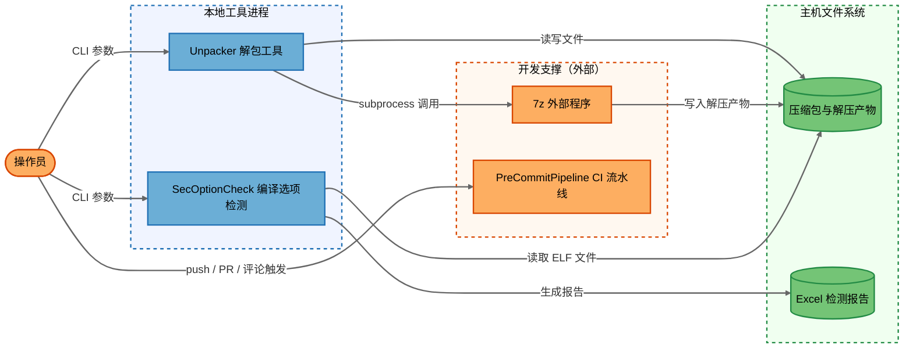
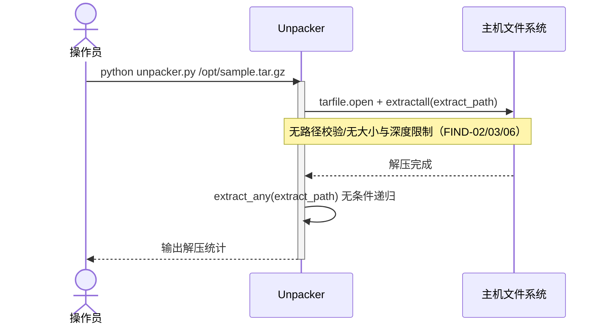
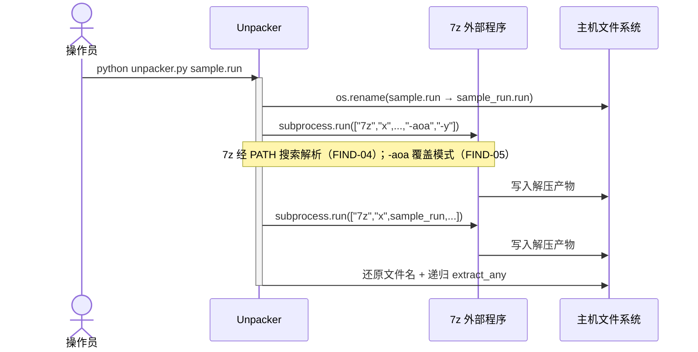
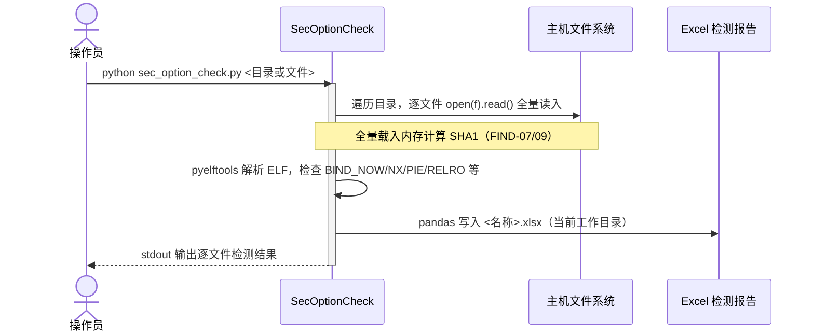
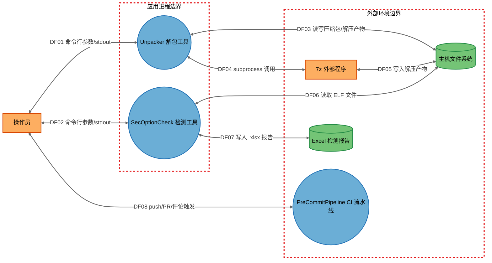

# openlibing-tools 威胁分析报告（STRIDE-A）

## 1. 报告元数据

| 项目                     | 值                                                                                                                                                                                                                                                                                                                                                                                                                                |
| ------------------------ | --------------------------------------------------------------------------------------------------------------------------------------------------------------------------------------------------------------------------------------------------------------------------------------------------------------------------------------------------------------------------------------------------------------------------------- |
| 分析对象                 | `openlibing-tools`（独立工具集：Unpacker 递归解包工具 + SecOptionCheck ELF 安全编译选项检测工具）                                                                                                                                                                                                                                                                                                                                 |
| 仓库                     | `https://gitcode.com/openlibing/openlibing-tools.git`                                                                                                                                                                                                                                                                                                                                                                             |
| 分支/Commit              | `master` / `99387cf`                                                                                                                                                                                                                                                                                                                                                                                                              |
| Commit 日期              | 2026-10-09 17:22:11 +0800                                                                                                                                                                                                                                                                                                                                                                                                         |
| 分析模型                 | GLM-5.3（STRIDE-A 单次完整分析：STRIDE + Abuse、零信任原则、纵深防御）                                                                                                                                                                                                                                                                                                                                                            |
| 分析开始/完成时间（UTC） | 2026-10-10 00:54:41 / 2026-10-10 01:02:00（用时约 8 分钟）                                                                                                                                                                                                                                                                                                                                                                        |
| 部署分类                 | `LOCALHOST_DESKTOP`（本地 CLI 工具）+ CI/CD 流水线（外部事件可触发）                                                                                                                                                                                                                                                                                                                                                              |
| 复核修订记录             | ① 2026-10-10 初版复核（原报告"Finding Overrides"节）：确认**无硬性误报**，13 项发现证据链均成立；FIND-02/03 补充 Python 版本前提，FIND-05/09/12 降级定位（设计决策/建议项/条件性建议），Tier 与 CVSS 维持原值。② 2026-10-10 整理复核（本报告）：抽查 9 项发现（6 项需修复 + 3 项降级）的代码与工作流证据，全部与原报告结论一致；仅修正 1 处引用偏差——`Unpacker/README.md` 实际共 27 行，原报告 FIND-11 证据引用"21-28"应为"21-27" |
| 报告版本                 | 整理版 v1.0（2026-10-10）                                                                                                                                                                                                                                                                                                                                                                                                         |
| 原始报告路径             | `threat-model-20261010-090143/威胁建模分析报告.md`                                                                                                                                                                                                                                                                                                                                                                                |

---

## 2. 分析结论速览

### 2.1 发现状态汇总

本分析共识别 **22 项威胁**（21 项开放威胁 + 1 项由平台默认机制缓解），整合为 **13 项安全发现**：1 Critical / 3 High / 4 Medium / 5 Low；按可利用性层级：Tier 1 = 0、Tier 2 = 9、Tier 3 = 4。

| 状态                           | 数量 | 发现编号                                             |
| ------------------------------ | ---- | ---------------------------------------------------- |
| ✅ 需修复（安全）              | 6    | FIND-01、FIND-02、FIND-03、FIND-04、FIND-06、FIND-10 |
| ⚠️ 建议改进（非安全/代码质量） | 6    | FIND-07、FIND-08、FIND-09、FIND-11、FIND-12、FIND-13 |
| ℹ️ 设计决策（非漏洞）          | 1    | FIND-05                                              |
| ❌ 误报                        | 0    | 无                                                   |

> 说明：原报告复核结论为"无硬性误报"——13 项发现的代码证据链全部成立。FIND-05/09/12 属"降级"而非"误报"：代码事实属实，仅漏洞定性或威胁可达性经复核调整（依据见第 5 节各项"复核判定"）。由于系统为本地 CLI 工具（无网络监听，`LOCALHOST_DESKTOP`），工具自身发现均为 Tier 2/3（需本地访问前提）；唯一与外部网络相关的攻击面是 CI/CD 流水线与开发钩子的供应链。

### 2.2 需修复问题（按优先级）

| 优先级 | 发现编号 | 等级     | 问题概述                                                                                                                                                                                                                                                                          | 修复方案要点                                                                                                                                                        |
| ------ | -------- | -------- | --------------------------------------------------------------------------------------------------------------------------------------------------------------------------------------------------------------------------------------------------------------------------------- | ------------------------------------------------------------------------------------------------------------------------------------------------------------------- |
| P0     | FIND-01  | Critical | CI 以 `pull_request_target` + `allow-unsafe-pr-checkout: true` 检出不可信 PR 代码，并由 `pre-commit-action` 执行 **PR 自带的钩子配置**，流水线持有 `ROBOT_TOKEN`（`pr: write`）——任意 GitCode 账号提交恶意 PR 即可窃取令牌并在 self-hosted runner 上执行任意代码（"pwn request"） | pre-commit 检查改用普通 `pull_request` 事件；仅执行默认分支钩子配置；移除 `allow-unsafe-pr-checkout`；评论触发限维护者；轮换并降权 `ROBOT_TOKEN`；runner 容器化隔离 |
| P0     | FIND-02  | High     | `tarfile.extractall()` 未指定 `filter` 参数，恶意 tar 成员含 `../` 路径可穿越解压目录任意写入文件（Zip Slip，CVE-2007-4559 变体，CWE-22）                                                                                                                                         | `tar.extractall(path=..., filter='data')` 一行修复                                                                                                                  |
| P0     | FIND-03  | High     | tar 符号链接/硬链接可指向解压目录外，后续成员经链接覆盖系统既有文件（CWE-59）                                                                                                                                                                                                     | 与 FIND-02 同一修复（`filter='data'` 拒绝链接逃逸）                                                                                                                 |
| P0     | FIND-04  | High     | `subprocess.run(["7z", ...])` 经 PATH 搜索解析外部程序，Windows 当前目录优先搜索可导致 7z 二进制劫持与任意代码执行（CWE-426）                                                                                                                                                     | `shutil.which("7z")` 解析一次绝对路径并校验存在性/版本，后续调用统一使用绝对路径                                                                                    |
| P0     | FIND-06  | Medium   | `extract_any` 对解压产物无条件递归且无深度/大小限制，嵌套压缩炸弹（zip quine）可致磁盘与内存耗尽、近乎无限的解压循环（CWE-409）                                                                                                                                                   | 递归深度上限（≤8 层）+ 累计解压字节上限 + 单成员压缩比检查（>100:1 拒绝）+ 7z 调用超时                                                                              |
| P0     | FIND-10  | Medium   | CI Actions 与 pre-commit 钩子使用第三方镜像且按可变 tag 引用（`checkout`/`setup-go` 未指定版本），镜像被接管或 tag 被覆盖时恶意代码在开发机与 runner 自动执行                                                                                                                     | 所有 `uses:` 改 commit SHA 固定；钩子优先官方源或审计后 fork；随 FIND-01 一并处理                                                                                   |

### 2.3 误报清单及驳回理由

| 发现编号 | 初版定级 | 驳回理由一句话                                                                                                                                          |
| -------- | -------- | ------------------------------------------------------------------------------------------------------------------------------------------------------- |
| 无       | —        | 原报告复核确认"无硬性误报"，13 项发现证据链全部成立；本报告整理复核再次抽查降级项 FIND-05/09/12 的代码证据，降级理由均有代码/文档依据，无需驳回任何发现 |

---

## 3. 系统架构概述

### 3.1 系统目的

为 openlibing 社区提供二进制安全审计辅助工具链：先用 Unpacker 递归解包目标软件包，再用 SecOptionCheck 对解出的 ELF 文件进行安全编译选项批量检测（BIND_NOW、NX、PIC、PIE、RELRO、栈保护、RPATH、Fortify、Ftrapv、Strip 共 10 项）并生成可视化 Excel 报告。

**核心威胁假设**：被解压/被检测的软件包可能来自不可信第三方（与工具用途一致——用于安全审计，输入天然不可信），因此"投放恶意压缩包 + 操作员运行"视为现实可达路径（Tier 2）。另假设操作员主机 OS 与 Python 运行时本身可信（不建模）。

### 3.2 技术栈

- Python ≥ 3.12（脚本无打包，直接 `python xxx.py` 运行）
- 依赖：pandas、openpyxl、pyelftools（**pyelftools 未在 README 依赖说明中声明**，见 FIND-11）
- 外部程序：7-Zip（`.run` 文件解包）
- CI：GitCode 流水线（`.gitcode/workflows/`，self-hosted runner，`atomgit.event` 语法；`pull_request_target`/self-hosted runner 安全语义按 GitHub 同名机制推断）
- 开发安全工具链：pre-commit（ruff / pylint / bandit / gitleaks）

### 3.3 部署模型与分类

**部署分类：`LOCALHOST_DESKTOP`**——两个工具均为单用户工作站上的 CLI 进程，无任何网络监听。

依据该分类的约束规则：工具自身不允许 Tier 1 发现、不允许"利用前提 = 无"、非监听组件不允许 `AV:N`——本报告全部满足。**例外**：`PreCommitPipeline` 为 CI 事件触发进程（任意 GitCode 账号提交 PR 或评论 `/pre-commit` 均可触发），其组件暴露行明确标记外部可达，相关发现（FIND-01）使用 `AV:N` 与前提 `Authenticated User`（Tier 2），符合暴露表约束。

其他前提：`requires-python >= 3.12` 成立（tarfile `filter` 参数可用、zipfile 内建清洗行为成立）；分析范围排除 `threat-model-*`、`.git`、`__pycache__` 等目录。

### 3.4 组件清单

| 组件 ID             | 类型                       | 锚点（代码证据）                                                                      | 职责                                                                             |
| ------------------- | -------------------------- | ------------------------------------------------------------------------------------- | -------------------------------------------------------------------------------- |
| `Unpacker`          | 进程（OSProcess）          | [unpacker.py](Unpacker/unpacker.py)                                                   | 递归解压 tar/zip/tgz/whl/run 压缩包；`.run` 类型经 subprocess 调用外部 `7z` 处理 |
| `SecOptionCheck`    | 进程（OSProcess）          | [sec_option_check.py](SecOptionCheck/sec_option_check.py)                             | 遍历目录解析 ELF，检查 10 项安全编译选项，计算 SHA1，生成 Excel 报告             |
| `SevenZip`          | 外部程序（ExternalApp）    | [unpacker.py](Unpacker/unpacker.py#L45-L46)（`subprocess.run(["7z", ...])`）          | 处理 `.run` 类型文件的实际解压逻辑（外部依赖）                                   |
| `HostFileSystem`    | 数据存储（FS）             | 两个工具的全部 `os.*` / 文件读写操作                                                  | 存放输入压缩包、解压产物与被检测 ELF 文件                                        |
| `ExcelReport`       | 数据存储（FS）             | [sec_option_check.py](SecOptionCheck/sec_option_check.py#L22-L41)（`check_to_excel`） | 检测结果 Excel 报告（写入当前工作目录）                                          |
| `PreCommitPipeline` | CI 进程（事件触发 WebSvc） | [pre-commit.yml](.gitcode/workflows/pre-commit.yml)                                   | push/PR/评论触发的 pre-commit 检查流水线（self-hosted runner）                   |
| `Operator`          | 外部交互者（Person）       | README 使用说明                                                                       | 在本地主机运行两个工具、提交代码并触发 CI 的操作员                               |

### 3.5 组件暴露表

（利用前提的唯一事实来源）

| 组件                | 监听地址                 | 认证屏障         | 外部可达性                         | 最低利用前提                                               | 推导层级 |
| ------------------- | ------------------------ | ---------------- | ---------------------------------- | ---------------------------------------------------------- | -------- |
| `Unpacker`          | 无（CLI 进程）           | OS 用户权限      | 不可达                             | `Local Process Access`（需投放恶意压缩包并诱导操作员运行） | T2       |
| `SecOptionCheck`    | 无（CLI 进程）           | OS 用户权限      | 不可达                             | `Local Process Access`                                     | T2       |
| `SevenZip`          | 无（被 subprocess 调用） | 继承调用方权限   | 不可达                             | `Local Process Access`                                     | T2       |
| `HostFileSystem`    | N/A                      | OS 文件权限      | 不可达                             | `Host/OS Access`                                           | T3       |
| `ExcelReport`       | N/A                      | OS 文件权限      | 不可达                             | `Host/OS Access`                                           | T3       |
| `PreCommitPipeline` | 事件触发                 | GitCode 平台认证 | **外部可触发**（任意账号 PR/评论） | `Authenticated User`                                       | T2       |

### 3.6 数据流与信任边界

信任边界：**应用进程边界**（ProcessBoundary，含 Unpacker、SecOptionCheck）与**外部环境边界**（MachineBoundary，含 SevenZip、PreCommitPipeline、HostFileSystem、ExcelReport、Operator）。

| 流 ID | 源               | 目标                | 协议/方式              | 说明                         |
| ----- | ---------------- | ------------------- | ---------------------- | ---------------------------- |
| DF01  | `Operator`       | `Unpacker`          | 命令行参数 / stdout    | 目标路径参数与执行结果回显   |
| DF02  | `Operator`       | `SecOptionCheck`    | 命令行参数 / stdout    | 检测目标路径与逐文件结果回显 |
| DF03  | `Unpacker`       | `HostFileSystem`    | 本地文件 I/O           | 读取压缩包、写入解压产物     |
| DF04  | `Unpacker`       | `SevenZip`          | subprocess（参数列表） | `.run` 文件解包调用          |
| DF05  | `SevenZip`       | `HostFileSystem`    | 本地文件 I/O           | 7z 实际写入解压产物          |
| DF06  | `SecOptionCheck` | `HostFileSystem`    | 本地文件 I/O           | 读取被检测 ELF 文件          |
| DF07  | `SecOptionCheck` | `ExcelReport`       | openpyxl 写入          | 生成 `.xlsx` 检测报告        |
| DF08  | `Operator`       | `PreCommitPipeline` | GitCode API（HTTPS）   | push / PR / 评论触发流水线   |

架构图：



关键场景：

**场景 1：解压 `.tar.gz` 压缩包（递归解压）**



**场景 2：解压 `.run` 文件（经 7z）**



**场景 3：安全编译选项检测（生成报告）**



### 3.7 已有安全控制

- pre-commit：`detect-private-key`、`gitleaks`（敏感信息/私钥泄露扫描）
- pre-commit：`bandit`（B602/B609/B103/B506）、`ruff`（S301 pickle、S603 subprocess 等安全规则）
- CI 权限声明尝试最小化（`repository: read`，标签任务 `pr: write`）
- `code-metrics-action` 按 commit SHA 固定引用（正面示例）
- Unpacker 的 subprocess 调用使用参数列表而非 `shell=True`（避免 shell 注入，平台默认安全实践）

---

## 4. STRIDE-A 威胁分析

### 4.1 数据流图



### 4.2 威胁清单总表

可利用性层级定义：**Tier 1（直接暴露）**= 利用前提 `None`，未认证外部攻击者可直接利用；**Tier 2（条件风险）**= 仅需单一前提（认证用户/内网位置/本地进程访问）；**Tier 3（纵深防御）**= 需多重前提或主机/OS 级访问、上游组件失陷。

按组件 × STRIDE 汇总：

| 组件              | S     | T     | R     | I     | D     | E     | A     | T1    | T2     | T3    | 合计   |
| ----------------- | ----- | ----- | ----- | ----- | ----- | ----- | ----- | ----- | ------ | ----- | ------ |
| Unpacker          | 0     | 3     | 1     | 1     | 1     | 1     | 1     | 0     | 6      | 2     | 8      |
| SecOptionCheck    | 0     | 1     | 0     | 1     | 1     | 0     | 0     | 0     | 3      | 0     | 3      |
| SevenZip          | 1     | 1     | 0     | 0     | 1     | 1     | 0     | 0     | 4      | 0     | 4      |
| HostFileSystem    | 0     | 2     | 0     | 1     | 1     | 0     | 0     | 0     | 3      | 1     | 4      |
| ExcelReport       | 0     | 1     | 0     | 0     | 0     | 0     | 0     | 0     | 0      | 1     | 1      |
| PreCommitPipeline | 0     | 1     | 0     | 0     | 0     | 0     | 1     | 0     | 2      | 0     | 2      |
| **合计**          | **1** | **9** | **1** | **3** | **4** | **2** | **2** | **0** | **17** | **5** | **22** |

威胁清单（22 项，覆盖核查：✅ 映射到发现 21 项、🔄 平台缓解 1 项、未覆盖 0 项）：

| 威胁 ID | STRIDE 类别   | 威胁描述                                                                                                                                                                                                                                                                                                            | 组件              | 利用前提                                  | Tier/可利用性层级 | 对应 FIND                                                                                                                              |
| ------- | ------------- | ------------------------------------------------------------------------------------------------------------------------------------------------------------------------------------------------------------------------------------------------------------------------------------------------------------------- | ----------------- | ----------------------------------------- | ----------------- | -------------------------------------------------------------------------------------------------------------------------------------- |
| T01.U   | T（篡改）     | `tarfile.extractall()` 未指定 `filter` 参数（unpacker.py:37-38），恶意 tar 成员含 `../` 路径可穿越解压目录任意写入文件（Zip Slip，CVE-2007-4559 变体，CWE-22）                                                                                                                                                      | Unpacker          | Local Process Access                      | T2                | FIND-02                                                                                                                                |
| T02.U   | T（篡改）     | tar 成员中的符号链接/硬链接可指向解压目录外，后续成员经链接覆盖系统文件（CWE-59）                                                                                                                                                                                                                                   | Unpacker          | Local Process Access                      | T2                | FIND-03                                                                                                                                |
| T03.U   | T（篡改）     | `extractall` 默认覆盖同名文件、7z 使用 `-aoa` 覆盖模式（unpacker.py:38,41,45-46），重放/交叉压缩包可静默破坏既有数据（CWE-73）                                                                                                                                                                                      | Unpacker          | Local Process Access                      | T2                | FIND-05                                                                                                                                |
| T04.U   | R（抵赖）     | 工具仅向 stdout 打印结果（unpacker.py:47-51），SUCCESS/FAILURE 计数不落盘，无持久化审计日志，事后无法追溯（CWE-778）                                                                                                                                                                                                | Unpacker          | Host/OS Access                            | T3                | FIND-13                                                                                                                                |
| T05.U   | I（信息泄露） | 解压产物权限取决于进程 umask，未显式收紧——多用户主机上敏感产物可能被其他本地用户读取（CWE-732）                                                                                                                                                                                                                     | Unpacker          | Host/OS Access                            | T3                | FIND-12                                                                                                                                |
| T06.U   | D（拒绝服务） | `extract_any(extract_path)`（unpacker.py:59）对解压产物无条件递归，且无解压深度/总大小限制——嵌套压缩炸弹（如 zip quine）可导致磁盘与内存耗尽（CWE-409）                                                                                                                                                             | Unpacker          | Local Process Access                      | T2                | FIND-06                                                                                                                                |
| T07.U   | E（权限提升） | Zip Slip 写入 `~/.bashrc`、cron、启动脚本等路径时，被覆盖文件后续执行可造成当前用户权限下的代码执行                                                                                                                                                                                                                 | Unpacker          | Local Process Access                      | T2                | FIND-02                                                                                                                                |
| T08.U   | A（滥用）     | 通配符参数 + 目录递归的组合可能在非预期范围（如系统目录）批量触发解压与覆盖，属合法功能的误用面（CWE-73 关联）                                                                                                                                                                                                      | Unpacker          | Local Process Access                      | T2                | FIND-05                                                                                                                                |
| T01.S   | T（篡改）     | 使用 `hashlib.sha1()`（sec_option_check.py:150）作为文件指纹——SHA1 已可实际碰撞，检测结果与文件的对应关系可被伪造（CWE-327）                                                                                                                                                                                        | SecOptionCheck    | Local Process Access                      | T2                | FIND-09                                                                                                                                |
| T02.S   | I（信息泄露） | 逐文件 `print(f"{' '.join(list(result.values()))}")`（sec_option_check.py:171）直接输出文件路径/名称，含 ANSI 转义序列的恶意文件名可注入伪造终端输出（CWE-117）                                                                                                                                                     | SecOptionCheck    | Local Process Access                      | T2                | FIND-08                                                                                                                                |
| T03.S   | D（拒绝服务） | `f.read()`（sec_option_check.py:150-151）将文件全量载入内存；`get_sym_str`（sec_option_check.py:398-413）对符号表做逐偏移线性扫描（O(n²)）——恶意超大 ELF 或巨型符号表可耗尽内存/CPU（CWE-400）                                                                                                                      | SecOptionCheck    | Local Process Access                      | T2                | FIND-07                                                                                                                                |
| T01.Z   | S（仿冒）     | `subprocess.run(["7z", ...])`（unpacker.py:45-46）依赖 PATH 搜索解析 7z——攻击者在 PATH 靠前位置或（Windows）当前目录放置伪造 `7z`/`7z.exe` 即可完成身份欺骗（CWE-426）                                                                                                                                              | SevenZip          | Local Process Access                      | T2                | FIND-04                                                                                                                                |
| T02.Z   | T（篡改）     | 7-Zip 自身解析不可信归档的历史漏洞面构成外部组件完整性风险，仓库未校验/锁定 7z 版本（Unpacker/README.md 仅要求手动拷贝 7zz）                                                                                                                                                                                        | SevenZip          | SevenZip 上游失陷                         | T3                | FIND-11                                                                                                                                |
| T03.Z   | D（拒绝服务） | 7z 解析不可信归档数据，超深嵌套/超大压缩比内容可致其资源耗尽，与 T06.U 叠加                                                                                                                                                                                                                                         | SevenZip          | Local Process Access                      | T2                | FIND-06                                                                                                                                |
| T04.Z   | E（权限提升） | 7z 被劫持后以 Unpacker 调用方（操作员）权限执行任意代码，完成横向提权                                                                                                                                                                                                                                               | SevenZip          | Local Process Access                      | T2                | FIND-04                                                                                                                                |
| T01.F   | T（篡改）     | 解压覆盖已有文件（`-aoa` / extractall 默认覆盖）破坏既有数据完整性                                                                                                                                                                                                                                                  | HostFileSystem    | Local Process Access                      | T2                | FIND-05                                                                                                                                |
| T02.F   | I（信息泄露） | 解压产物沿用进程 umask 权限，敏感文件可能被同机其他用户读取                                                                                                                                                                                                                                                         | HostFileSystem    | Host/OS Access                            | T3                | FIND-12                                                                                                                                |
| T03.F   | D（拒绝服务） | 压缩炸弹落盘导致磁盘耗尽（与 T06.U/T03.Z 同源）                                                                                                                                                                                                                                                                     | HostFileSystem    | Local Process Access                      | T2                | FIND-06                                                                                                                                |
| T04.F   | T（篡改）     | zip 格式成员路径穿越                                                                                                                                                                                                                                                                                                | HostFileSystem    | Local Process Access                      | T2                | 🔄 平台缓解（Python `zipfile` 的 `extract()`/`extractall()` 内建清洗逻辑剥离绝对路径、盘符与 `..` 分量；tar 格式不受此保护，见 T01.U） |
| T01.R   | T（篡改）     | 报告文件无签名/哈希校验等完整性保护（`check_to_excel` 直接写入 CWD），事后可被篡改误导审计结论（CWE-345 关联）                                                                                                                                                                                                      | ExcelReport       | Host/OS Access                            | T3                | FIND-09                                                                                                                                |
| T01.C   | T（篡改）     | `pull_request_target` + `allow-unsafe-pr-checkout: true` 检出 PR head 代码（.gitcode/workflows/pre-commit.yml），随后 `pre-commit-action` 按 **PR 自带的 `.pre-commit-config.yaml`** 执行钩子——恶意 PR 可在持有 `secrets.ROBOT_TOKEN`（`pr: write`）的 self-hosted runner 上执行任意代码并外传令牌（"pwn request"） | PreCommitPipeline | Authenticated User（GitCode 账号提交 PR） | T2                | FIND-01                                                                                                                                |
| T02.C   | A（滥用）     | `pull_request_comment` 允许任意评论 `/pre-commit` 触发流水线，可被滥用于 runner 资源消耗与流水线状态标签操纵                                                                                                                                                                                                        | PreCommitPipeline | Authenticated User                        | T2                | FIND-01                                                                                                                                |

### 4.3 各类威胁详细分析

#### S（仿冒）— 1 项

**T01.Z（SevenZip，Tier 2，Open → FIND-04）**：`subprocess.run(["7z", ...])`（unpacker.py:45-46）依赖 PATH 搜索解析 7z——攻击者在 PATH 靠前位置或（Windows）当前目录放置伪造 `7z`/`7z.exe` 即可完成身份欺骗（CWE-426）。

> Unpacker 的 S 类为 N/A——工具无身份认证机制，输入来源真实性属于供应链完整性问题，已归入 T 类威胁与供应链发现（FIND-11）；SecOptionCheck 的 S 类为 N/A——纯本地分析工具，无身份校验面。

#### T（篡改）— 9 项

- **T01.U（Unpacker，T2，Open → FIND-02）**：`tarfile.extractall()` 未指定 `filter` 参数（unpacker.py:37-38），恶意 tar 成员含 `../` 路径可穿越解压目录任意写入文件（Zip Slip，CVE-2007-4559 变体，CWE-22）。
- **T02.U（Unpacker，T2，Open → FIND-03）**：tar 成员中的符号链接/硬链接可指向解压目录外，后续成员经链接覆盖系统文件（CWE-59）。
- **T03.U（Unpacker，T2，Open → FIND-05）**：`extractall` 默认覆盖同名文件、7z 使用 `-aoa` 覆盖模式（unpacker.py:38,41,45-46），重放/交叉压缩包可静默破坏既有数据（CWE-73）。
- **T01.S（SecOptionCheck，T2，Open → FIND-09）**：使用 `hashlib.sha1()`（sec_option_check.py:150）作为文件指纹——SHA1 已可实际碰撞，检测结果与文件的对应关系可被伪造（CWE-327）。
- **T02.Z（SevenZip，T3，Open → FIND-11）**：7-Zip 自身解析不可信归档的历史漏洞面构成外部组件完整性风险，仓库未校验/锁定 7z 版本。
- **T01.F（HostFileSystem，T2，Open → FIND-05）**：解压覆盖已有文件（`-aoa` / extractall 默认覆盖）破坏既有数据完整性。
- **T04.F（HostFileSystem，T2，🔄 平台缓解）**：zip 格式成员路径穿越。**平台缓解说明**：Python `zipfile` 的 `extract()`/`extractall()` 内建清洗逻辑会剥离绝对路径、盘符与 `..` 路径分量（Python 标准库行为，非本仓库代码），故 zip 格式的路径穿越被平台默认缓解；tar 格式不受此保护（见 T01.U）。
- **T01.R（ExcelReport，T3，Open → FIND-09）**：报告文件无签名/哈希校验等完整性保护（`check_to_excel` 直接写入 CWD），事后可被篡改误导审计结论（CWE-345 关联）。
- **T01.C（PreCommitPipeline，T2，Open → FIND-01）**：`pull_request_target` + `allow-unsafe-pr-checkout: true` 检出 PR head 代码，随后 `pre-commit-action` 按 PR 自带的 `.pre-commit-config.yaml` 执行钩子——恶意 PR 可在持有 `secrets.ROBOT_TOKEN`（`pr: write`）的 self-hosted runner 上执行任意代码并外传令牌（"pwn request"）。

#### R（抵赖）— 1 项

**T04.U（Unpacker，T3，Open → FIND-13）**：工具仅向 stdout 打印结果（unpacker.py:47-51），SUCCESS/FAILURE 计数不落盘，无持久化审计日志，事后无法追溯谁在何时对哪些文件执行了解压（CWE-778）。

> SecOptionCheck 的 R 类为 N/A——结果落盘于 ExcelReport，其完整性问题归入 T01.R。

#### I（信息泄露）— 3 项

- **T05.U（Unpacker，T3，Open → FIND-12）**：解压产物权限取决于进程 umask，未显式收紧——多用户主机上敏感产物可能被其他本地用户读取（CWE-732）。
- **T02.S（SecOptionCheck，T2，Open → FIND-08）**：逐文件 print 直接输出文件路径/名称（sec_option_check.py:171），含 ANSI 转义序列的恶意文件名可注入伪造终端输出（CWE-117）。
- **T02.F（HostFileSystem，T3，Open → FIND-12）**：解压产物沿用进程 umask 权限，敏感文件可能被同机其他用户读取。

#### D（拒绝服务）— 4 项

- **T06.U（Unpacker，T2，Open → FIND-06）**：`extract_any(extract_path)`（unpacker.py:59）对解压产物无条件递归，且无解压深度/总大小限制——嵌套压缩炸弹可导致磁盘与内存耗尽（CWE-409）。
- **T03.S（SecOptionCheck，T2，Open → FIND-07）**：`f.read()` 全量载入内存 + `get_sym_str` 对符号表逐偏移线性扫描（O(n²)）——恶意超大 ELF 或巨型符号表可耗尽内存/CPU（CWE-400）。
- **T03.Z（SevenZip，T2，Open → FIND-06）**：7z 解析不可信归档数据，超深嵌套/超大压缩比内容可致其资源耗尽，与 T06.U 叠加。
- **T03.F（HostFileSystem，T2，Open → FIND-06）**：压缩炸弹落盘导致磁盘耗尽（与 T06.U/T03.Z 同源）。

#### E（权限提升）— 2 项

- **T07.U（Unpacker，T2，Open → FIND-02）**：Zip Slip 写入 `~/.bashrc`、cron、启动脚本等路径时，被覆盖文件后续执行可造成当前用户权限下的代码执行。
- **T04.Z（SevenZip，T2，Open → FIND-04）**：7z 被劫持后以 Unpacker 调用方（操作员）权限执行任意代码，完成横向提权。

> SecOptionCheck 的 E 类为 N/A——工具只读取并解析被测文件，不执行任何被测代码。

#### A（滥用）— 2 项

- **T08.U（Unpacker，T2，Open → FIND-05）**：通配符参数 + 目录递归的组合可能在非预期范围（如系统目录）批量触发解压与覆盖，属合法功能的误用面（CWE-73 关联）。
- **T02.C（PreCommitPipeline，T2，Open → FIND-01）**：`pull_request_comment` 允许任意评论 `/pre-commit` 触发流水线，可被滥用于 runner 资源消耗与流水线状态标签操纵。

> SecOptionCheck 的 A 类为 N/A——单一只读分析流程，无业务流程可滥用；SevenZip 的 R/I/A 为 N/A——7z 输出经 `capture_output=True` 收集且不外传；HostFileSystem 的 S/R/E/A 为 N/A——文件系统为被动存储；ExcelReport 除 T01.R 外均为 N/A——报告为本地小体量静态文件。

---

## 5. 安全发现详情

### FIND-01：CI 流水线不安全检出 PR 代码执行任意钩子（pwn request）

| 属性        | 值                                                                                                                     |
| ----------- | ---------------------------------------------------------------------------------------------------------------------- |
| 状态        | ✅ 需修复（安全）                                                                                                      |
| 等级        | Critical（CVSS 4.0：8.7 — `CVSS:4.0/AV:N/AC:L/AT:N/PR:L/UI:N/VC:H/VI:H/VA:H/SC:H/SI:L/SA:L`；CWE-494；OWASP A08:2025） |
| STRIDE 类别 | T（篡改）、A（滥用）（T01.C、T02.C）                                                                                   |
| 组件        | PreCommitPipeline（self-hosted runner）                                                                                |
| 利用前提    | Authenticated User（任意 GitCode 账号提交 PR 或评论 `/pre-commit`）；Tier 2                                            |

**威胁描述**

流水线以 `pull_request_target`（及其评论触发）运行于默认分支的特权上下文（持有 `secrets.ROBOT_TOKEN`，`permissions: pr: write`），却通过 `ref: ${{ atomgit.event.pull_request.merge_commit_sha || ... }}` 与 `allow-unsafe-pr-checkout: true` 显式关闭 fork PR 检出拦截、检出不可信 PR 代码，再由 `pre-commit-action` 执行该检出版本中的钩子配置。任何能向仓库提交 PR 的账号都可以修改 PR 中的 `.pre-commit-config.yaml` 指向任意远程钩子仓库，从而在 self-hosted runner 上以流水线身份执行任意代码并窃取 `ROBOT_TOKEN`。修复工作量：Medium。

**复核判定**

✅ 确认有效（2026-10-10 整理复核已逐行验证）：[pre-commit.yml](.gitcode/workflows/pre-commit.yml#L8) 第 8 行 `pull_request_target`（注释自述"确保 PR 流水线始终读取默认分支的最新配置文件"）；[第 11-13 行](.gitcode/workflows/pre-commit.yml#L11-L13) `pull_request_comment: comments: ["/pre-commit"]`；[第 16-18 行](.gitcode/workflows/pre-commit.yml#L16-L18) `permissions: pr: write`；[第 43-47 行](.gitcode/workflows/pre-commit.yml#L43-L47) checkout 步骤 `token: ${{ secrets.ROBOT_TOKEN }}` + `ref: ${{ ...pull_request.head.sha }}` + `allow-unsafe-pr-checkout: true`；[第 56 行](.gitcode/workflows/pre-commit.yml#L56) `uses: openlibing/pre-commit-action@v1.0.2` 在该检出上下文中执行 PR 自带钩子配置；[第 27/40/65 行](.gitcode/workflows/pre-commit.yml#L40) `runs-on: ["self-hosted", ...]`。证据链完整，描述属实。

原报告待确认项（Needs Verification）：`ROBOT_TOKEN` 实际权限范围（若超出 `pr: write` 则严重性上升）；self-hosted runner 是否多仓共享/容器化隔离（共享时影响跨仓扩散）；GitCode 平台 `pull_request_target` 语义是否与 GitHub 同名机制一致。

**修复建议**

1. 将 pre-commit 检查改用普通 `pull_request` 事件（无 secrets 泄露面），`pull_request_target` 仅保留给确实需要特权的打标签任务，且绝不检出 PR 代码。
2. 若必须检出 PR 代码，仅执行**默认分支**的钩子配置，并对 PR 内容做只读扫描；移除 `allow-unsafe-pr-checkout: true`。
3. 将 `/pre-commit` 评论触发限制为仓库维护者/成员；`ROBOT_TOKEN` 降为最小权限并轮换历史暴露令牌。
4. 对 self-hosted runner 做作业级隔离（容器化），避免恶意 PR 在 runner 宿主机持久化。

验证：提交一个仅修改 `.pre-commit-config.yaml`（指向本地 echo 型钩子）的测试 PR，确认流水线拒绝执行 PR 侧钩子配置；审计 runner 历史任务日志中是否存在非预期网络外联与令牌使用记录。修复前先轮换 `ROBOT_TOKEN`。

### FIND-02：tarfile.extractall 路径穿越（Zip Slip）任意文件写入

| 属性        | 值                                                                                                                |
| ----------- | ----------------------------------------------------------------------------------------------------------------- |
| 状态        | ✅ 需修复（安全）                                                                                                 |
| 等级        | High（CVSS 4.0：7.7 — `CVSS:4.0/AV:L/AC:L/AT:N/PR:L/UI:A/VC:H/VI:H/VA:H/SC:H/SI:H/SA:H`；CWE-22；OWASP A01:2025） |
| STRIDE 类别 | T（篡改）、E（权限提升）（T01.U、T07.U）                                                                          |
| 组件        | Unpacker、HostFileSystem                                                                                          |
| 利用前提    | Local Process Access（投放恶意压缩包 + 操作员运行工具）；Tier 2                                                   |

**威胁描述**

[unpacker.py](Unpacker/unpacker.py#L37-L38) 调用 `tar.extractall(path=extract_path)` 时未指定 `filter` 参数。恶意 tar 成员的文件名含 `../` 序列时可写到解压目录之外（含系统路径与用户家目录），进而覆盖配置文件、脚本等实现持久化破坏或以操作员身份执行代码（CVE-2007-4559 类）。Python ≥ 3.12 已提供官方修复手段：`extractall(filter='data')`。修复工作量：Low。Unpacker 的设计用途（解压不可信第三方软件包）使该前提在真实工作流中高度可达。

**复核判定**

✅ 确认有效（整理复核已验证）：[unpacker.py 第 37-38 行](Unpacker/unpacker.py#L37-L38) `tar.extractall(path=extract_path)` 确无 `filter` 参数；[pyproject.toml 第 12 行](pyproject.toml#L12) 声明 `requires-python = ">=3.12"`，可直接使用 `filter='data'`。原报告复核补充版本前提：Python 3.14+ 已默认 `filter='data'`（PEP 706），若运行环境为 3.14 则被平台自动缓解；但项目声明下限 3.12，在 3.12/3.13 下漏洞成立，**修复仍为必须**（显式指定 `filter='data'` 同时消除版本不确定性）。

**修复建议**

```python
tar.extractall(path=extract_path, filter='data')
```

`filter='data'` 将同时拒绝绝对路径、`..` 穿越、指向外部的符号/硬链接与设备文件；如需保留链接语义可评估 `filter='tar'` 并显式校验成员路径。验证：构造含 `./../evil.txt` 成员的测试 tar，运行修复后的 unpacker.py，确认抛出拒绝异常且解压目录外无新文件；对正常归档做回归验证。

### FIND-03：tar 符号链接/硬链接攻击

| 属性        | 值                                                                                                                |
| ----------- | ----------------------------------------------------------------------------------------------------------------- |
| 状态        | ✅ 需修复（安全）                                                                                                 |
| 等级        | High（CVSS 4.0：7.2 — `CVSS:4.0/AV:L/AC:L/AT:N/PR:L/UI:A/VC:H/VI:H/VA:H/SC:L/SI:L/SA:L`；CWE-59；OWASP A01:2025） |
| STRIDE 类别 | T（篡改）（T02.U）                                                                                                |
| 组件        | Unpacker、HostFileSystem                                                                                          |
| 利用前提    | Local Process Access；Tier 2                                                                                      |

**威胁描述**

`extractall` 未过滤链接成员：归档中的符号链接可指向解压目录外的既有文件，随后同归档中的普通成员经该链接写入，实现任意既有文件覆盖（绕过纯路径名校验）。修复工作量：Low（与 FIND-02 同一修复）。

**复核判定**

✅ 确认有效（整理复核已验证）：[unpacker.py 第 37-38 行](Unpacker/unpacker.py#L37-L38) 同 FIND-02；全文件无任何对 `TarInfo.issym()/islnk()` 成员的处理逻辑，链接成员未过滤属实。

**修复建议**

统一采用 `extractall(filter='data')`（拒绝链接逃逸）；如业务确需链接，则对每个链接成员校验 `os.path.realpath` 解析后仍位于 `extract_path` 内。验证：构造"symlink 成员指向 `/tmp/target` + 后续同名普通成员"的测试 tar，确认修复后链接被拒绝或目标文件未被写入。

### FIND-04：7z 经 PATH 搜索解析导致二进制劫持

| 属性        | 值                                                                                                                 |
| ----------- | ------------------------------------------------------------------------------------------------------------------ |
| 状态        | ✅ 需修复（安全）                                                                                                  |
| 等级        | High（CVSS 4.0：7.1 — `CVSS:4.0/AV:L/AC:H/AT:N/PR:L/UI:A/VC:H/VI:H/VA:H/SC:H/SI:H/SA:H`；CWE-426；OWASP A03:2025） |
| STRIDE 类别 | S（仿冒）、E（权限提升）（T01.Z、T04.Z）                                                                           |
| 组件        | Unpacker、SevenZip                                                                                                 |
| 利用前提    | Local Process Access（控制 PATH 目录或 Windows 当前目录）；Tier 2                                                  |

**威胁描述**

[unpacker.py](Unpacker/unpacker.py#L45-L46) 以 `subprocess.run(["7z", ...])` 调用 7z，可执行文件按 PATH 顺序解析；Windows 的 `CreateProcess` 语义会先搜索当前目录。攻击者若能在 PATH 靠前目录、或（Windows 下）运行目录放置伪造 `7z.exe`，即可以操作员权限执行任意代码。虽然参数列表形式避免了 shell 注入，但二进制解析路径不可信。修复工作量：Low。

**复核判定**

✅ 确认有效（整理复核已验证）：[unpacker.py 第 45-46 行](Unpacker/unpacker.py#L45-L46) 两处 `subprocess.run(["7z", "x", ..., "-aoa", "-y"], capture_output=True, text=True, check=True)` 均以裸命令名 `"7z"` 调用、经 PATH 解析，且无绝对路径解析与版本校验逻辑，描述属实。

**修复建议**

1. 用 `shutil.which("7z")` 解析一次绝对路径并校验存在性，后续 subprocess 全部使用该绝对路径。
2. 校验 7z 版本/哈希（与 FIND-11 的版本管理联动）。
3. 文档中明确告知用户从可信渠道安装 7-Zip 并避免在不可信目录下运行工具。

验证：在受控目录放置打印版假 `7z`/`7z.exe` 并将其置于 PATH 靠前位置，运行 unpacker 处理 `.run` 文件，确认工具报错退出而非调用假程序（修复后应使用绝对路径调用真实 7z）。

### FIND-05：解压默认覆盖既有文件（-aoa / extractall 覆盖语义）

| 属性        | 值                                                                                                                  |
| ----------- | ------------------------------------------------------------------------------------------------------------------- |
| 状态        | ℹ️ 设计决策（非漏洞）                                                                                               |
| 等级        | Medium（CVSS 4.0：6.4 — `CVSS:4.0/AV:L/AC:L/AT:N/PR:L/UI:A/VC:H/VI:H/VA:L/SC:N/SI:N/SA:N`；CWE-73；OWASP A01:2025） |
| STRIDE 类别 | T（篡改）、A（滥用）（T03.U、T08.U、T01.F）                                                                         |
| 组件        | Unpacker、HostFileSystem                                                                                            |
| 利用前提    | Local Process Access；Tier 2                                                                                        |

**威胁描述**

README 明示"默认覆盖已存在的同名文件"：zip/tar `extractall` 默认覆盖；7z 显式使用 `-aoa`。无 `--no-overwrite`/备份选项。攻击者可用只差一个字节的恶意包覆盖上次解压产物，或利用覆盖语义破坏既有工作区数据（含其他工具写入的文件），且无任何告警。

**复核判定**

ℹ️ 维持原报告降级结论（设计决策，非漏洞）：覆盖语义代码事实属实（[unpacker.py 第 38、41、45-46 行](Unpacker/unpacker.py#L38-L46)），且 [Unpacker/README.md 第 8 行](Unpacker/README.md#L8) 明示"默认覆盖已存在的同名文件"——**文档化的预期行为不构成漏洞**；真实风险在于与路径穿越**组合**时的越目录覆盖，该场景已被 FIND-02/03 的 `filter='data'` 修复消除；残余风险仅为解压目录内的静默覆盖。整理复核确认 README 明示设计属实，降级理由成立。

**修复建议**

无需行动（文档化设计决策）。可选 UX 加固：将 7z 覆盖模式从 `-aoa` 改为 `-aos`（跳过已存在）或提供 `--overwrite` 显式开关；tar/zip 路径在写入前检测目标存在性并默认跳过 + 告警；至少在覆盖发生时输出统一 WARNING 汇总。

### FIND-06：递归解压无深度/大小限制（压缩炸弹）

| 属性        | 值                                                                                                                   |
| ----------- | -------------------------------------------------------------------------------------------------------------------- |
| 状态        | ✅ 需修复（安全）                                                                                                    |
| 等级        | Medium（CVSS 4.0：5.9 — `CVSS:4.0/AV:L/AC:L/AT:N/PR:L/UI:A/VC:L/VI:N/VA:H/SC:N/SI:N/SA:N`；CWE-409；OWASP A05:2025） |
| STRIDE 类别 | D（拒绝服务）（T06.U、T03.Z、T03.F）                                                                                 |
| 组件        | Unpacker、SevenZip、HostFileSystem                                                                                   |
| 利用前提    | Local Process Access；Tier 2                                                                                         |

**威胁描述**

`extract_file` 结束后无条件 `extract_any(extract_path)` 递归处理解压产物（[unpacker.py 第 59 行](Unpacker/unpacker.py#L59)），配合 7z `-aoa` 无限覆盖，嵌套 zip 炸弹/quine（如递归自包含归档）可造成磁盘写满、内存耗尽与近乎无限的解压循环，导致工作站拒绝服务。修复工作量：Medium。

**复核判定**

✅ 确认有效（整理复核已验证）：[unpacker.py 第 59 行](Unpacker/unpacker.py#L59) `extract_any(extract_path)` 位于 `extract_file` 末尾、try/finally 之后无条件递归；全文件无深度计数器、无累计解压大小上限、无单文件大小检查；两处 7z 调用均无超时参数。描述属实。

**修复建议**

1. 增加递归深度上限（如 ≤ 8 层）与累计解压字节数上限（如压缩包体积的 100 倍且不超过剩余磁盘空间的一定比例）。
2. 逐成员检查 `TarInfo.size` / zip `file_size` 与 `compress_size` 压缩比（如 > 100:1 告警拒绝）。
3. 7z 调用增加超时参数。

验证：构造 5 层嵌套 tar.gz 与高压缩比炸弹样本，确认达到阈值后工具安全中止并输出明确错误。

### FIND-07：SecOptionCheck 全量载入与 O(n²) 扫描导致资源耗尽

| 属性        | 值                                                                                                                   |
| ----------- | -------------------------------------------------------------------------------------------------------------------- |
| 状态        | ⚠️ 建议改进（非安全/代码质量）                                                                                       |
| 等级        | Medium（CVSS 4.0：4.9 — `CVSS:4.0/AV:L/AC:L/AT:N/PR:L/UI:A/VC:N/VI:N/VA:H/SC:N/SI:N/SA:N`；CWE-400；OWASP A05:2025） |
| STRIDE 类别 | D（拒绝服务）（T03.S）                                                                                               |
| 组件        | SecOptionCheck                                                                                                       |
| 利用前提    | Local Process Access；Tier 2                                                                                         |

**威胁描述**

对每个候选文件 `f.read()` 全量读入内存计算 SHA1（sec_option_check.py:150-151），随后 `get_sym_str`（:398-413）从每个符号名偏移起对字符串表做逐字节线性扫描定位 `\x00`，整体 O(n²)。恶意超大 ELF（或被命名为 ELF 的巨文件）可耗尽内存/CPU 使检测任务长时间挂死。修复工作量：Medium。

**复核判定**

⚠️ 确认有效，按原报告最终定位列为常规迭代加固项：[sec_option_check.py 第 150-151 行](SecOptionCheck/sec_option_check.py#L150-L151) `sha1.update(f.read())` 全量读入属实；[第 398-413 行](SecOptionCheck/sec_option_check.py#L398-L413) `get_sym_str` 以 `for idx in range(sym_name_off, len(sym_data))` 逐字节找终止符，线性扫描属实。代码事实无误。

**修复建议**

1. SHA1 改为流式分块计算（同时解决 FIND-09 的算法问题：`hashlib.sha256` 分块读取）。
2. `get_sym_str` 改用 `str_data.find(b'\x00', sym_name_off)`（C 级实现）并加单符号名长度上限。
3. 对超过阈值（如 1 GB）的文件直接跳过并告警。

验证：构造 2 GB 假 ELF 与巨型 `.strtab` 样本，确认修复后内存占用平稳、耗时线性，且超大文件被跳过告警。

### FIND-08：文件路径未消毒直接打印（终端转义序列注入）

| 属性        | 值                                                                                                                |
| ----------- | ----------------------------------------------------------------------------------------------------------------- |
| 状态        | ⚠️ 建议改进（非安全/代码质量）                                                                                    |
| 等级        | Low（CVSS 4.0：3.7 — `CVSS:4.0/AV:L/AC:L/AT:N/PR:L/UI:A/VC:L/VI:L/VA:N/SC:N/SI:N/SA:N`；CWE-117；OWASP A09:2025） |
| STRIDE 类别 | I（信息泄露）（T02.S）                                                                                            |
| 组件        | SecOptionCheck                                                                                                    |
| 利用前提    | Local Process Access（控制被扫描目录中的文件名）；Tier 2                                                          |

**威胁描述**

[sec_option_check.py 第 171 行](SecOptionCheck/sec_option_check.py#L171) 将含文件路径的检测结果整行打印到 stdout。文件名中的 ANSI 转义序列可清屏、伪造检测结果行（如将 NO 伪装成 YES）或将终端光标移出等，误导审计人员。修复工作量：Low。

**复核判定**

⚠️ 确认有效（常规迭代加固项）：[sec_option_check.py 第 171 行](SecOptionCheck/sec_option_check.py#L171) `print(f"{' '.join(list(result.values()))}")` 将含 FilePath 的结果整行打印属实，文件名来自被扫描目录、未做任何控制字符过滤。代码事实无误。

**修复建议**

输出前对路径做控制字符消毒（剔除 `<0x20` 与 `\x7f`，或仅打印 `repr()`）；Excel 单元格写入同理。验证：创建名为 `\x1b[31mNO\x1b[0m` 风格转义序列命名的 ELF 样本，确认修复后输出为可见转义或被剔除。

### FIND-09：使用 SHA1 作为文件完整性指纹且报告无完整性保护

| 属性        | 值                                                                                                                |
| ----------- | ----------------------------------------------------------------------------------------------------------------- |
| 状态        | ⚠️ 建议改进（非安全/代码质量）                                                                                    |
| 等级        | Low（CVSS 4.0：3.1 — `CVSS:4.0/AV:L/AC:H/AT:N/PR:L/UI:N/VC:L/VI:L/VA:N/SC:N/SI:N/SA:N`；CWE-327；OWASP A02:2025） |
| STRIDE 类别 | T（篡改）（T01.S、T01.R）                                                                                         |
| 组件        | SecOptionCheck、ExcelReport                                                                                       |
| 利用前提    | Local Process Access；Tier 2                                                                                      |

**威胁描述**

检测结果以 SHA1 作为文件身份指纹（sec_option_check.py:150），SHA1 已被证明可实际碰撞——针对以该报告为审计证据的场景，攻击者可构造与"已检测文件"同哈希的替代文件使报告对应关系失真；Excel 报告本身亦无签名/哈希保护，事后可被篡改。修复工作量：Low。

**复核判定**

⚠️ 维持原报告降级结论（风险理论化，降为建议项）：代码事实属实——[sec_option_check.py 第 150 行](SecOptionCheck/sec_option_check.py#L150) `hashlib.sha1()`，SHA1 结果仅存入结果字典 `"SHA1"` 列（第 169 行）作为报告标识，**不参与工具内任何安全决策**；[check_to_excel（第 22-41 行）](SecOptionCheck/sec_option_check.py#L22-L41) 报告直接写盘、无完整性字段。构造 SHA1 碰撞（chosen-prefix ≈ 2^63.4）需巨量算力，对本场景不构成现实攻击路径，降为低成本加固建议合理。

**修复建议**

无需强制行动（低成本加固）：改用 `hashlib.sha256()` 分块计算；如需报告防篡改，生成报告时附 SHA-256 摘要清单或对输出文件签名。验证：检查输出报告中指纹列长度为 64 位十六进制；对报告任一单元格做修改后校验摘要不再匹配。

### FIND-10：pre-commit 钩子与 CI Actions 使用第三方镜像且引用未按 SHA 固定

| 属性        | 值                                                                                                                   |
| ----------- | -------------------------------------------------------------------------------------------------------------------- |
| 状态        | ✅ 需修复（安全）                                                                                                    |
| 等级        | Medium（CVSS 4.0：6.5 — `CVSS:4.0/AV:N/AC:H/AT:N/PR:N/UI:A/VC:H/VI:H/VA:H/SC:L/SI:L/SA:L`；CWE-829；OWASP A03:2025） |
| STRIDE 类别 | T（篡改，供应链完整性；相关威胁 T02.Z 同类外部组件完整性）                                                           |
| 组件        | PreCommitPipeline、开发环境 pre-commit                                                                               |
| 利用前提    | 上游 action/镜像仓库失陷（{MirrorRepo} Compromise）；Tier 3                                                          |

**威胁描述**

开发与 CI 供应链存在两处不固定引用：(1) `.pre-commit-config.yaml` 的钩子仓库全部来自 gitcode.com 第三方镜像（`gh_mirrors/pr/pre-commit-hooks`、`GitHub_Trending/gi/gitleaks` 等），仅按可变 tag（`rev`）锁定；(2) CI Actions 中 `openlibing/pr-label-action@v1.0.0`、`openlibing/pre-commit-action@v1.0.2` 按可变版本 tag 引用，`checkout`、`setup-go` 甚至未指定版本。tag 可被上游移动，镜像仓库被接管或 tag 被覆盖时，恶意钩子/action 将在开发者本机与 CI runner 上自动执行。对比之下 `code-metrics-action` 已按 commit SHA 固定（正确做法）。修复工作量：Low。

**复核判定**

✅ 确认有效（整理复核已验证，随 FIND-01 一并处理）：[.pre-commit-config.yaml](.pre-commit-config.yaml#L4-L46) 5 个钩子仓库全部为 gitcode.com 第三方镜像且仅按可变 tag 锁定（`gh_mirrors/pr/pre-commit-hooks` rev v6.0.0、`GitHub_Trending/gi/gitleaks` rev v8.30.1、`gh_mirrors/ru/ruff-pre-commit` v0.15.15、`gh_mirrors/pyl/pylint` v4.0.5、`gh_mirrors/ba/bandit` 1.9.4）；[pre-commit.yml 第 30/43/50/56/68 行](.gitcode/workflows/pre-commit.yml#L30) `pr-label-action@v1.0.0`、`checkout`（无版本）、`setup-go`（无版本）、`pre-commit-action@v1.0.2`；正面对照 [code-metrics-scan.yml 第 25 行](.gitcode/workflows/code-metrics-scan.yml#L25) `openlibing/code-metrics-action@117c0606ad741ef5e6b564dca9307e25e1d9e2e8` 按 40 位 SHA 固定。描述属实。

**修复建议**

所有 action 引用改为 commit SHA 固定；pre-commit 钩子优先使用官方源（或对镜像做组织内审计后 fork 固定）；`checkout`/`setup-go` 显式固定版本。验证：`git grep -nE '@v[0-9]+\.' -- .gitcode .pre-commit-config.yaml` 应无结果；所有 `uses:` 均为 40 位 SHA。

### FIND-11：依赖管理混乱（无关重型依赖、版本未锁定、pyelftools 未声明）

| 属性        | 值                                                                                                                 |
| ----------- | ------------------------------------------------------------------------------------------------------------------ |
| 状态        | ⚠️ 建议改进（非安全/代码质量）                                                                                     |
| 等级        | Low（CVSS 4.0：3.9 — `CVSS:4.0/AV:N/AC:H/AT:N/PR:N/UI:A/VC:L/VI:L/VA:N/SC:N/SI:N/SA:N`；CWE-1104；OWASP A03:2025） |
| STRIDE 类别 | T（篡改，供应链完整性）（T02.Z）                                                                                   |
| 组件        | SecOptionCheck、SevenZip、仓库级                                                                                   |
| 利用前提    | 上游依赖仓库/PyPI 失陷（{PyPI} Compromise）；Tier 3                                                                |

**威胁描述**

[pyproject.toml 第 13-32 行](pyproject.toml#L13-L32) 声明了 fastapi、uvicorn、sqlalchemy、aiomysql、alembic、apollo-client、cryptography、apscheduler、aiosmtplib、httpx、pymysql 等大量与本工具集完全无关的重型依赖，且全部为下限式版本约束（无锁定文件）；而实际必需的 `pyelftools`、`pandas`、`openpyxl` 中，`pyelftools` 未出现在任何依赖声明或 README 安装说明中（SecOptionCheck/README.md 仅 `pip install pandas openpyxl`），7z 也无版本校验（见 FIND-04）。无关依赖扩大安装面与供应链攻击面，未锁定版本使构建不可复现。修复工作量：Low。

**复核判定**

⚠️ 确认有效（治理项）：[pyproject.toml 第 13-32 行](pyproject.toml#L13-L32) 确认存在 fastapi、uvicorn、sqlalchemy、aiomysql、aiosqlite、alembic、pydantic、python-frontmatter、gitpython、python-dotenv、apollo-client-python、cryptography、apscheduler、aiosmtplib、httpx、pymysql、pyyaml 等无关重型依赖（全部下限式约束，无锁定文件）；[SecOptionCheck/README.md 第 5-8 行](SecOptionCheck/README.md#L5-L8) 仅 `pip install pandas openpyxl`，pyelftools 未声明；[Unpacker/README.md 第 21-27 行](Unpacker/README.md#L21-L27) 7z 手动安装、无版本/完整性要求。描述属实（注：原报告引用 `Unpacker/README.md:21-28`，该文件实际共 27 行，本报告已修正为 21-27）。

**修复建议**

1. 移除与本工具集无关的依赖声明（或将其移入独立 optional-dependencies 组）。
2. 为工具建立准确的依赖清单（pandas、openpyxl、pyelftools）并使用锁定文件/约束文件固定版本。
3. README 补充 pyelftools 安装说明；7z 约定受支持版本并校验。

验证：新虚拟环境仅按 README 安装后运行两工具应全部成功（当前 sec_option_check.py 会因缺 pyelftools 失败）；`pip-audit` 审计通过。

### FIND-12：解压产物未显式收紧文件权限

| 属性        | 值                                                                                                                |
| ----------- | ----------------------------------------------------------------------------------------------------------------- |
| 状态        | ⚠️ 建议改进（非安全/代码质量，条件性）                                                                            |
| 等级        | Low（CVSS 4.0：2.7 — `CVSS:4.0/AV:L/AC:L/AT:N/PR:H/UI:N/VC:L/VI:N/VA:N/SC:N/SI:N/SA:N`；CWE-732；OWASP A01:2025） |
| STRIDE 类别 | I（信息泄露）（T05.U、T02.F）                                                                                     |
| 组件        | Unpacker、HostFileSystem                                                                                          |
| 利用前提    | Host/OS Access（同机其他本地用户）；Tier 3                                                                        |

**威胁描述**

解压产物权限继承进程 umask（通常 022，其他用户可读），工具未对解压产物做任何权限收紧；多用户主机上被解压软件包中的敏感内容（配置、密钥类文件）可能被同机低权用户读取。

**复核判定**

⚠️ 维持原报告降级结论（场景依赖，条件性建议）：代码事实属实——[unpacker.py 第 32-46 行](Unpacker/unpacker.py#L32-L46) `os.makedirs`（无 mode 参数）/ `extractall` / 7z 调用均无 `mode` 或后续 `chmod` 逻辑；但该工具的典型运行环境为单用户安全审计工作站，"其他本地用户读取产物"的路径不存在，仅多用户主机场景成立。降级理由成立。

**修复建议**

无需强制行动（条件性加固）：多用户部署场景下，解压完成后对产物目录执行 `os.chmod(extract_path, 0o750)` 并逐文件限制其他用户读权限（或提供 `--private` 开关）。验证：以不同 umask 环境解压后，`stat` 检查产物权限不宽于 750/640。

### FIND-13：缺少持久化安全审计日志

| 属性        | 值                                                                                                                |
| ----------- | ----------------------------------------------------------------------------------------------------------------- |
| 状态        | ⚠️ 建议改进（非安全/代码质量）                                                                                    |
| 等级        | Low（CVSS 4.0：2.4 — `CVSS:4.0/AV:L/AC:H/AT:N/PR:H/UI:N/VC:L/VI:N/VA:N/SC:N/SI:N/SA:N`；CWE-778；OWASP A09:2025） |
| STRIDE 类别 | R（抵赖）（T04.U）                                                                                                |
| 组件        | Unpacker、SecOptionCheck                                                                                          |
| 利用前提    | Host/OS Access；Tier 3                                                                                            |

**威胁描述**

两个工具的所有执行记录仅输出到 stdout（unpacker.py:73-77 的统计、sec_option_check.py:171 的逐文件结果），无落盘日志：谁、在何时、对哪些文件执行了解压/检测、成功失败各多少，事后均不可追溯，无法支撑事件响应与审计取证。修复工作量：Low。

**复核判定**

⚠️ 确认有效（常规迭代加固项）：[unpacker.py 第 47-51 行](Unpacker/unpacker.py#L47-L51) 成功/失败仅 `print`，[第 71-77 行](Unpacker/unpacker.py#L71-L77) SUCCESS/FAILURE 为内存计数并仅打印统计；[sec_option_check.py 第 171 行](SecOptionCheck/sec_option_check.py#L171) 仅 stdout。无任何日志文件写入逻辑，属实。

**修复建议**

增加 `--log-file` 参数（默认启用），以追加模式记录时间戳、操作者、参数、逐文件结果与统计摘要；检测报告路径亦写入日志。验证：运行工具后检查日志文件包含完整时间戳与参数记录；重复运行验证追加而非覆盖。

---

## 6. 修复行动清单

| 优先级 | 行动项                                                                                                                                                                                                                             | 对应发现         | 类型                 |
| ------ | ---------------------------------------------------------------------------------------------------------------------------------------------------------------------------------------------------------------------------------- | ---------------- | -------------------- |
| P0     | 重构 CI PR 触发模型：pre-commit 检查改用普通 `pull_request` 事件；仅执行默认分支钩子配置；移除 `allow-unsafe-pr-checkout: true`；评论触发限维护者；轮换并降权 `ROBOT_TOKEN`；self-hosted runner 容器化隔离（**修复前先轮换令牌**） | FIND-01          | 安全                 |
| P0     | `tar.extractall(path=..., filter='data')` 一行修复，同时消除路径穿越与链接逃逸                                                                                                                                                     | FIND-02、FIND-03 | 安全                 |
| P0     | `shutil.which("7z")` 解析绝对路径并校验存在性/版本，后续 subprocess 统一使用绝对路径                                                                                                                                               | FIND-04          | 安全                 |
| P0     | 增加递归深度上限（≤8 层）、累计解压字节上限、单成员压缩比检查（>100:1 拒绝）、7z 调用超时                                                                                                                                          | FIND-06          | 安全                 |
| P0     | 所有 CI Action 引用改 commit SHA 固定（含 `checkout`/`setup-go`）；pre-commit 钩子优先官方源或审计后 fork 固定（随 FIND-01 一并处理）                                                                                              | FIND-10          | 安全                 |
| P1     | `hashlib.sha1` → 分块 `hashlib.sha256`；输出前剔除文件名控制字符（终端转义消毒）                                                                                                                                                   | FIND-09、FIND-08 | 非安全（加固）       |
| P1     | 流式分块哈希 + `str.find` 定位符号名终止符 + 超大文件（>1 GB）跳过告警                                                                                                                                                             | FIND-07          | 非安全（性能/加固）  |
| P1     | 依赖治理：移除无关重型依赖、补充 pyelftools 声明、锁定文件固定版本、7z 版本约定                                                                                                                                                    | FIND-11          | 非安全（治理）       |
| P1     | 多用户部署场景下解压产物权限收紧（chmod 0o750/640 或 `--private` 开关）                                                                                                                                                            | FIND-12          | 非安全（条件性加固） |
| P1     | 增加 `--log-file` 持久化审计日志（追加模式，记录时间戳/参数/逐文件结果/统计）                                                                                                                                                      | FIND-13          | 非安全（加固）       |
| —      | 无需行动（设计决策）：FIND-05 为 README 明示的文档化设计（默认覆盖同名文件），越目录覆盖风险已由 FIND-02/03 修复消除，残余仅为解压目录内静默覆盖；可选 UX 加固（`-aos`/`--overwrite` 开关/覆盖告警）                               | FIND-05          | 设计决策             |
| —      | 无需行动（误报）：无——本分析经两轮复核确认无误报项                                                                                                                                                                                 | 无               | —                    |
