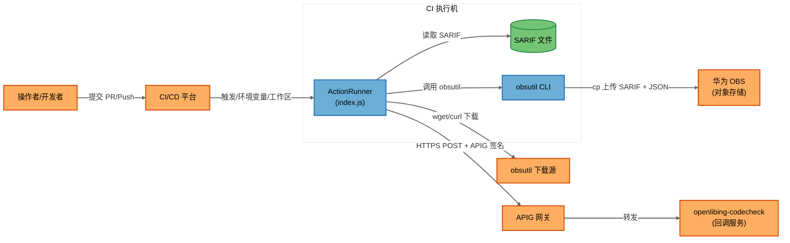

# openlibing-upload-sarif 安全威胁分析报告

## 报告元数据

| 字段 | 值 |
|------|-----|
| 分析模式 | 单次完整分析 (Single Analysis) |
| 分析时间 | 2026-09-03 |
| 仓库 | actions-explore (openlibing-upload-sarif action) |
| 分支 | dev-mff |
| 插件文件 | .gitcode/actions/openlibing-upload-sarif/ |
| 分析工具 | STRIDE-A 威胁建模方法 |

---

## 一、系统概述

### 1.1 系统用途

openlibing-upload-sarif 是一个 GitCode Actions 插件，用于在 CI/CD 流水线中将 CodeQL 扫描结果（SARIF 文件）上传到华为 OBS 对象存储，并回调通知 openlibing-codecheck 服务接收扫描结果。该插件支持单文件和目录批量上传、SARIF 打包、构建产物 JSON 生成、APIG 网关签名鉴权等功能。

### 1.2 关键组件

| 组件 | 类型 | 源文件 | 描述 |
|------|------|--------|------|
| ActionRunner | 进程 | dist/index.js | 核心 Node.js 脚本，编排 SARIF 上传全流程 |
| ActionMetadata | 配置 | action.yml | 插件元数据，定义输入参数（sarif_file, obs_ak, obs_sk, apig_app_key, apig_app_secret）和输出 |
| CodeQLWorkflow | CI 流水线 | .gitcode/workflows/codeql.yml | CodeQL 安全分析流水线（调用方，非本插件直接定义） |

### 1.3 技术栈

| 层级 | 技术 |
|------|------|
| 语言 | JavaScript (Node.js 16) |
| 运行时 | GitCode Actions Runner (node16) |
| 外部工具 | obsutil (华为 OBS 命令行工具), wget/curl, tar, zip, find, chmod |
| 存储 | 华为 OBS (对象存储) |
| 回调 | APIG 网关 (HMAC-SHA256 签名) |

### 1.4 部署模型

**部署分类：CI/CD 插件 (CICD_PLUGIN)**

该插件以 Node.js 脚本形式运行在 CI/CD 执行机环境中，不直接暴露网络端口。

| 组件 | 监听地址 | 认证屏障 | 外部可达性 | 最低前置条件 |
|------|----------|----------|------------|-------------|
| ActionRunner | 无监听 (CI 任务) | CI 平台调度 | 不可直接访问 | CI 平台触发权限 |

### 1.5 系统架构图

### 1.6 信任边界

| 边界 | 描述 | 包含组件 |
|------|------|----------|
| 外部网络边界 | CI 执行机与外部网络服务之间的边界 | ObsMirror, ObsUtilCDN, ApigGateway, CodeCheck |
| CI 平台边界 | CI 平台与 Action 插件之间的边界，通过环境变量和 secrets 传递数据 | CIPlatform → ActionRunner |
| 用户输入边界 | 用户可控输入（sarif_file 路径）和 secrets（obs_ak, obs_sk, apig_app_key, apig_app_secret）进入插件 | Operator → ActionRunner |
| 命令执行边界 | obsutil CLI 和 shell 命令在执行机上执行 | ActionRunner → Obsutil |

### 1.7 核心数据流

| ID | 源 | 目的 | 协议 | 描述 |
|----|------|------|------|------|
| DF01 | CIPlatform | ActionRunner | 环境变量 | 传递 WORKSPACE, ATOMGIT_REPOSITORY 等环境变量和 secrets |
| DF02 | ActionRunner | ObsUtilCDN | HTTPS | wget/curl 下载 obsutil 工具包 |
| DF03 | ActionRunner | ObsMirror | HTTPS (obsutil) | 上传 SARIF 文件和构建产物 JSON 到 OBS |
| DF04 | ActionRunner | SarifFile | 文件读写 | 读取本地 SARIF 文件、写入构建产物 JSON |
| DF05 | ActionRunner | ApigGateway | HTTPS | POST 回调通知，APIG HMAC-SHA256 签名 |
| DF06 | ApigGateway | CodeCheck | HTTPS | 转发回调请求到 openlibing-codecheck 服务 |

---

## 二、STRIDE-A 威胁分析

### 2.1 可利用性分级

| 等级 | 标签 | 前置条件 | 分配规则 |
|------|------|----------|----------|
| **Tier 1** | 直接暴露 | 无 | 未认证外部攻击者无需任何前置访问即可利用 |
| **Tier 2** | 条件风险 | 单一前置条件 | 需要一种形式的访问：认证用户、内部网络等 |
| **Tier 3** | 纵深防御 | 多个前置条件或基础设施访问 | 需要主机访问、管理员凭据或组件已遭入侵 |

### 2.2 威胁汇总

| 组件 | 链接 | S | T | R | I | D | E | A | 合计 | T1 | T2 | T3 | 风险 |
|------|------|---|---|---|---|---|---|---|------|----|----|----|------|
| ActionRunner | [详情](#actionrunner) | 1 | 3 | 1 | 3 | 2 | 1 | 2 | 13 | 3 | 6 | 4 | 高 |
| ActionMetadata | [详情](#actionmetadata) | 0 | 1 | 0 | 1 | 0 | 0 | 1 | 3 | 0 | 2 | 1 | 中 |
| **合计** | | **1** | **4** | **1** | **4** | **2** | **1** | **3** | **16** | **3** | **8** | **5** | |

---

### 2.3 ActionRunner

**信任边界：** CI 执行机
**角色：** 核心执行引擎，编排 obsutil 安装、SARIF 上传、构建产物生成、回调通知全流程
**数据流：** DF01-DF06

#### Tier 1 — 直接暴露（无前置条件）

| ID | 类别 | 威胁 | 前置条件 | 影响数据流 | 缓解措施 | 状态 |
|----|------|------|----------|------------|----------|------|
| T01.S | 欺骗 | wget/curl 从固定 URL 下载 obsutil，若 DNS 被劫持或中间人攻击，可下载被篡改的 obsutil 二进制 | 无 | DF02 | 使用 HTTPS 传输，但未验证下载文件完整性（无 checksum/signature 校验） | Open |
| T01.T | 篡改 | obsutil 二进制被替换后，obs_ak/obs_sk 通过命令行参数 `-i= -k=` 传入，被篡改的 obsutil 可窃取 OBS 凭据 | 无 | DF02, DF03 | 凭据通过命令行明文传递，进程列表可见；无 obsutil 完整性校验 | Open |
| T01.I | 信息泄露 | exec() 函数 console.log 输出完整命令，包含 obs_ak/obs_sk 明文：`obsutil cp ... -i="${obsAk}" -k="${obsSk}"` | 无 | DF03 | console.log 输出含凭据的完整命令行，CI 日志中可观测 | Open |

#### Tier 2 — 条件风险

| ID | 类别 | 威胁 | 前置条件 | 影响数据流 | 缓解措施 | 状态 |
|----|------|------|----------|------------|----------|------|
| T02.T | 篡改 | sarif_file 输入参数未做路径遍历校验，传入 `../../etc/passwd` 等路径可读取工作区外文件 | 认证用户（流水线"配置者"） | DF04 | 有 WORKSPACE 回退查找逻辑，但无路径规范化校验 | Open |
| T02.T | 篡改 | obsutil cp 使用 shell 模式 execSync(cmd, {shell: '/bin/bash'})，若 buildNumber 或路径含 shell 元字符可导致命令注入 | 认证用户（流水线"配置者"） | DF03 | repoName 从环境变量取值，经 split('/').pop() 处理，风险较低但未完全消除 | Open |
| T02.R | 抵赖 | OBS 上传操作（SARIF + 构建产物 JSON）无审计日志记录操作者和时间 | 内部网络 |% | DF03 | 仅 consoleC.log 输出，无独立审计机制 | Open |
| T02.I | 信息泄露 | obs_ak/obs_sk 通过命令行参数明文传递给 obsutil，执行机进程列表中可见 | 内部网络 | DF03 | 凭据经 `-i= -k=` 传入，/proc/[pid]/cmdline 可读 | Open |
| T02.I | 信息泄露 | 回调 payload 包含 ATOMGIT_REPOSITORY_URL、commitId 等仓库信息，若回调 URL 被截获可泄露 | 内部网络 | DF05 | 回调 URL 为硬编码常量，使用 HTTPS 传输 | Mitigated |
| T02.D | 拒绝服务 | SARIF 文件极大或目录中 .sarif 文件极多，打包上传可导致内存溢出或 OBS 上传超时 | 认证用户（流水线"配置者"） | DF04 | 无文件大小或数量限制检查 | Open |
| T02.E | 提权 | obs_ak/obs_sk 具有 OBS 写入权限（且 -acl=public-read），被截获后攻击者可向 OBS 写入任意公开可读文件 | 认证用户（流水线"配置者"） | DF03 | 凭据经命令行明文传递，OBS ACL 设为 public-read | Open |

#### Tier 3 — 纵深防御

| ID | 类别 | 威胁 | 前置条件 | 影响数据流 | 缓解措施 | 状态 |
|----|------|------|----------|------------|----------|------|
| T03.S | 欺骗 | APIG 签名算法实现有误（如 canonical URI 末尾强制追加 `/`），可能导致签名不一致被 APIG 拒绝或被绕过 | 主机访问 + APIG 配置 | DF05 | 使用 SDK-HMAC-SHA256 标准签名，但 canonicalURI 实现需与 APIG 对齐验证 | Open |
| T03.T | 篡改 | SARIF 文件上传后无完整性校验（如 SHA256 上传前后比对），OBS 端文件可能被篡改 | OBS 管理员访问 | DF03 | 依赖 OBS 服务端一致性，无客户端上传后校验 | Open |
| T03.D | 拒绝服务 | 回调请求设置 30s 超时，回调失败不影响最终结果（仅 WARN），但可能延迟流水线完成 | 回调服务不可达 | DF05 | 有 30s timeout 和 try-catch 降级处理 | Mitigated |
| T03.A | 滥用 | Node.js 16 已 EOL，存在已知安全漏洞，攻击者可能利用运行时漏洞 | 主机/OS 访问 | DF01 | action.yml 中 runs.using 固定为 node16 | Open |

---

### 2.4 ActionMetadata

**信任边界：** 配置文件
**角色：** 定义插件输入参数和输出
**数据流：** DF01

#### Tier 1 — 直接暴露（无前置条件）

*无 Tier 1 威胁*

#### Tier 2 — 条件风险) 

| ID | 类别 | 威胁 | 前置条件 | 影响数据流 | 缓解措施 | 状态! | 
|----|------|------|----------|------------|----------|------|
| T04.T | 篡改 | action.yml 中 obs_ak/obs_sk required: true，但 default 为空字符串，若 CI 流水线未传 secrets 则传入空值导致参数校验失败但不泄露 | 认证用户（流水线配置者） | DF01 | run() 中有 missingInputs 校验 | Mitigated |
| T04.I | 信息泄露 | apig_app_key/apig_app_secret required: false，若用户误填为明文而非 secrets 引用，CI 日志可能回显 | 认证用户（流水线配置者） | DF01 | 依赖 CI 平台 secrets masking 机制 | Open |

#### Tier 3 — 纵深防御

| ID | 类别 | 威胁 | 前置条件 | 影响数据流 | 缓解措施 | 状态 |
|----|------|------|----------|------------|----------|------|
| T04.A | 滥用 | runs.using 固定为 node16，未升级到更新的 Node.js 版本，可能存在已知漏洞 | 主机/OS 访问 | DF01 | Node 16 已 EOL | Open |

---

## 三、关键发现与建议

### 3.1 高优先级（Tier 1）

| # | 威胁 | 建议 |
|---|------|------|
| 1 | obsutil 下载无完整性校验（T01.S, T01.T） | 下载后验证 SHA256 checksum 或 GPG 签名，确保 obsutil 二进制未被篡改 |
| 2 | obs_ak/obs_sk 在命令行和日志中明文暴露（T01.I） | 将凭据写入临时配置文件（obsutil 支持配置文件模式），避免命令行参数暴露；日志中脱敏处理 |

### 3.2 中优先级（Tier 2）

| # | 威胁 | 建议 |
|---|------|------|
| 3 | sarif_file 路径遍历风险（T02.T） | 对 sarif_file 做路径规范化（path.resolve + 判断是否在 WORKSPACE 内），拒绝工作区外路径 |
| 4 | shell 命令注入风险（T02.T） | 避免将用户可控变量拼入 shell 命令，改用 execFileSync 参数数组模式或对变量做严格转义 |
| 5 | OBS 上传无大小/数量限制（T02.D） | 增加单文件大小上限和目录中 .sarif 文件数量上限检查 |
| 6 | OBS ACL 为 public-read（T02.E） | 评估是否需要 public-read 权限，若仅内部服务读取可降为私有桶 + 预签名 URL |
| 7 | APIG AppKey/AppSecret 误填明文（T04.I） | 在 action.yml 描述中明确标注"请使用 secrets 引用，勿填明文" |

### 3.3 低优先级（Tier 3）

| # | 威胁 | 建议 |
|---|------|------|
| 8 | Node.js 16 已 EOL（T03.A, T04.A） | 升级到 Node.js 18 或 20 |
| 9 | API*G 签名实现需验证（T03.S） | 对 APIG 签名实现做端到端验证，确保 canonicalURI 等处理与 APIG 网关一致 |
| 10 | SARIF 上传无完整性校验（T03.T） | 上传后从 OBS 下载文件计算 SHA256，与本地文件比对确认一致 |

---

## 四、与 openlibing-pre-commit-action 对比

| 维度 | openlibing-pre-commit-action | openlibing-upload-sarif |
|------|------------------------------|------------------------|
| 外部依赖 | PyPI/华为镜像、Go Proxy、GitCode API、GitCode Git | 华为 OBS、obsutil 下载源、APIG 网关 |
| 凭据暴露风险 | GC_TOKEN 在 git remote URL 中 | obs_ak/obs_sk 在命令行参数中 |
| 命令执行 | pre-commit hooks（任意代码执行） | obsutil CLI（文件上传） |
| 网络回调 | 无 | 有（APIG 签名回调 codecheck 服务） |
| Tier 1 威胁数 | 4 | 3 |
| 主要风险 | 镜像源劫持 + 凭据日志泄露 | obsutil 完整性 + 凭据命令行暴露 |

openlibing-upload-sarif 的凭据暴露面更大（命令行参数 + 日志输出），且 obsutil 下载完整性校验缺失是核心风险。回调机制引入了额外的攻击面（APIG 签名绕过、回调 URL 硬编码），但有超时和降级处理。
