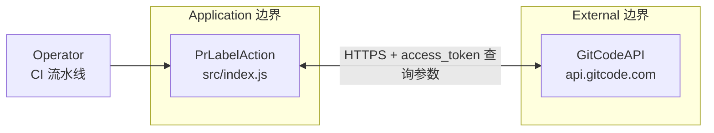

# pr-label-action 威胁建模分析报告（STRIDE-A）

> **项目**：pr-label-action
> **仓库**：https://gitcode.com/openlibing/pr-label-action.git · 分支 `main` · Commit `50e35f8`
> **方法**：STRIDE-A + Zero Trust + 可利用性分级 · 中文版
> **部署分类**：`LOCALHOST_SERVICE`（GitCode runner 出站型 CI 客户端，node16）

---

## 目录

1. [分析范围与环境](#1-分析范围与环境)
2. [架构概览](#2-架构概览)
3. [组件与信任边界（DFD）](#3-组件与信任边界dfd)
4. [STRIDE-A 分析](#4-stride-a-分析)
5. [Findings（按可利用性分级）](#5-findings按可利用性分级)
6. [Action Summary](#6-action-summary)
7. [分析上下文与假设](#7-分析上下文与假设)
8. [参考文献](#8-参考文献)

---

## 1. 分析范围与环境

### 1.1 功能简介

为 Pull Request 添加/删除标签，支持互斥标签同步清理。核心内置逻辑：

- 读取输入 `token` / `add_labels` / `remove_labels` / `fail_on_error`；
- 从环境变量推导 API base（`ATOMGIT_API_URL` / `ATOMGIT_SERVER_URL`）与 PR 编号（`MERGE_ID` / `MERGE_REQUEST_IID`）；
- 通过 `https.request` 调用 GitCode API 增删 PR 标签，token 以 `access_token` **查询参数**附带；
- 完整打印请求/响应日志。

### 1.2 技术栈

Node.js `https`，无第三方运行时依赖（`@vercel/ncc` 打包至 `dist/index.js`）。

### 1.3 组件清单

| 组件 ID | 类型 | 锚点 | 职责 |
|---------|------|------|------|
| `Operator` | 外部角色 | CI 流水线触发者 | 提交 PR、配置输入 |
| `PrLabelAction` | 进程 | src/index.js | 标签增删主逻辑 |
| `GitCodeAPI` | 外部服务 | api.gitcode.com | PR 标签 REST API |

组件 `PrLabelAction` 锚点明确（`src/index.js`），无虚构组件。

---

## 2. 架构概览

单文件 Node.js 插件（`src/index.js`，打包至 `dist/index.js`）。主流程：

1. 解析输入与环境；
2. 校验 token 与 owner/repo；
3. 自动获取 PR 编号（非 PR 事件跳过）；
4. 拉取当前标签；
5. 过滤出「需添加 / 需删除」集合；
6. 逐个执行增删；
7. 按 `fail_on_error` 决定最终退出状态。

---

## 3. 组件与信任边界（DFD）

### 组件暴露表

| 组件 | 监听地址 | 认证屏障 | 外部可达 | 最小前置条件 |
|------|----------|----------|----------|--------------|
| PrLabelAction | 无监听（出站） | — | 否（出站） | `Local Process Access` |
| GitCodeAPI | 平台托管 | 平台令牌/RBAC | 是（平台） | `Authenticated User` |

---

## 4. STRIDE-A 分析

### 4.1 PrLabelAction

| 类别 | 威胁 | 前置条件 | Tier | 状态 |
|------|------|----------|------|------|
| S (Spoofing) | 输入 `token` 可为空，未校验 token 格式；请求以 token 自证身份，无双向校验 | `Authenticated User` | T2 | Open |
| T (Tampering) | `add_labels`/`remove_labels` 未做字符过滤，标签名直接拼接进 URL 路径与请求体 | `Local Process Access` | T2 | Open |
| R (Repudiation) | 操作成功日志仅 `info` 无持久审计留存，缺少不可抵赖证据 | `Local Process Access` | T2 | Open |
| I (Information Disclosure) | token 放于 URL 查询参数，且完整记录响应头/响应体，可能泄入访问日志 | `Local Process Access` | T2 | Open |
| D (DoS) | 无重试/背压，目标 API 限流时直接失败 | `Local Process Access` | T2 | Open |
| E (Privilege Escalation) | 依赖平台令牌权限边界；本身不提升权限 | — | — | N/A（依赖平台 RBAC） |
| A (Abuse) | `fail_on_error=false` 时静默吞错，可能掩盖权限/越权操作 | `Privileged User` | T2 | Open |

### 4.2 GitCodeAPI（外部服务，本插件视角的攻击面）

| 类别 | 威胁 | 前置条件 | Tier | 状态 |
|------|------|----------|------|------|
| T (Tampering) | 标签数据经 HTTPS 传输，依赖平台 TLS；无额外端到端校验 | `Internal Network` | T2 | Mitigated（平台 TLS） |
| I (Information Disclosure) | 响应内容可能包含其他标签信息，插件完整打印到日志 | `Authenticated User` | T2 | Open |
| D (DoS) | 高频标签操作可能触发平台限流 | `Authenticated User` | T2 | Open |

---

## 5. Findings（按可利用性分级）

> 部署分类 `LOCALHOST_SERVICE` → 无 T1，全部 T2/T3。

### Tier 2 — Conditional Risk

**FIND-LAB-01：认证令牌作为 URL 查询参数传输并暴露在日志自证**
- **描述**：token 被拼入 `?access_token=${token}`（`src/index.js` 第 164/182/207 行），而非 HTTP Header。同时 `httpRequest` 打印完整响应头与响应体（第 140-141 行）。URL 经 `maskToken` 脱敏过 SELECT 值，但查询参数形式仍可能被平台/代理访问日志、第三方调用链记录。若令牌泄漏，可被用于在仓库上建删标签（在权限范围内）。
- **证据**：`src/index.js` 第 101-157 行（完整日志）、第 164/182/207 行（access_token 查询参数）。
- **缓解举措**：改用 `Authorization` 请求头携带 token；日志仅输出首尾脱敏 token；响应体按需脱敏。
- **验证**：检索 dist/index.js 是否存在 `access_token=` 拼接；确认日志无完整响应体。
- CVSS：`CVSS:4.0/AV:L/AC:L/AT:N/PR:L/UI:N/VC:H/VI:L/VA:L/SC:N/SI:N/SA:N`（6.8）
- CWE：[CWE-598](https://cwe.mitre.org/data/definitions/598.html) · OWASP：[A04:2025](https://owasp.org/Top10/2025/)
- Remediation Effort：Low

**FIND-LAB-02：标签名称输入缺少校验 → URL 路径插入/请求体污染**
- **描述**：`add_labels`/`remove_labels` 仅按逗号拆分后 trim 空值，未校验标签名中的 `/`、`?`、`#`、控制字符等。删除标签时标签名直接拼入路径（第 182 行），恶意标签名可能改变 URL 语义。
- **证据**：`src/index.js` 第 40-47 行（parseLabels）、第 162-198 行（URL 拼接）。
- **缓解举措**：对标签名做白名单字符集校验与 `encodeURIComponent`；拒绝含 `/`、`?`、`\n`、逗号的输入。
- **验证**：构造含 `/` 的标签名看是否破坏 URL。
- CVSS：`CVSS:4.0/AV:L/AC:L/AT:N/PR:L/UI:N/VC:N/VI:H/VA:N/SC:N/SI:N/SA:N`（5.9）
- CWE：[CWE-93](https://cwe.mitre.org/data/definitions/93.html): Improper Neutralization of CRLF Sequences · OWASP：[A03:2025](https://owasp.org/Top10/2025/)
- Remediation Effort：Low

**FIND-LAB-03：缺少审计留存，操作不可抵赖且静默吞错**
- **描述**：失败日志默认 `::warning::`，`fail_on_error=false` 时 step 保持成功；无结构化审计输出，事后无法追溯谁在何时对哪个 PR 做了哪些标签改动。
- **证据**：`src/index.js` 第 377-385 行（fail_on_error）。
- **缓解举措**：为每次成功增删输出结构化 JSON 审计记录；区分「用户输入引起」与「操作失败」两类失败。
- **验证**：失败场景核对该 step 输出是否留存。
- CVSS：`CVSS:4.0/AV:L/AC:L/AT:N/PR:L/UI:N/VC:N/VI:N/VA:N/SC:N/SI:H/SA:N`（4.7）
- CWE：[CWE-778](https://cwe.mitre.org/data/definitions/778.html): Insufficient Logging · OWASP：[A09:2025](https://owasp.org/Top10/2025/)
- Remediation Effort：Low

### Tier 3 — Defense-in-Depth

**FIND-LAB-04：API base 由环境变量推导，可能被重定向到任意主机（依赖 runner 环境可信）**
- **描述**：`ATOMGIT_API_URL` 完全来自环境变量，未做域名白名单；若 runner 环境被不可信方污染（极端 CI 供应链场景），token 可能被 POST 到攻击者主机。
- **证据**：`src/index.js` 第 75-96 行（resolveApiBase）。
- **缓解举措**：对 API 主机名做白名单/证书校验；文档声明该输入必须由可信 CI 配置提供。
- **验证**：确认该变量仅由平台注入。
- CVSS：`CVSS:4.0/AV:L/AC:H/AT:N/PR:H/UI:N/VC:H/VI:N/VA:N/SC:N/SI:N/SA:N`（5.0）
- CWE：[CWE-15](https://cwe.mitre.org/data/definitions/15.html): External Control of System or Configuration Setting · OWASP：[A03:2025](https://owasp.org/Top10/2025/)
- Remediation Effort：Medium

---

## 6. Action Summary

### Quick Wins（T2 低工作量修复）

| Finding | 修复动作 | 工作量 |
|---------|----------|--------|
| FIND-LAB-01 | token 改放 Header + 脱敏日志 | Low |
| FIND-LAB-02 | 标签名白名单 + encodeURIComponent | Low |
| FIND-LAB-03 | 增加结构化审计输出 | Low |

其余建议：将 `ATOMGIT_API_URL` 主机名白名单化（FIND-LAB-04，Medium）。

---

## 7. 分析上下文与假设

### Needs Verification

| 项 | 说明 |
|----|------|
| GitCode 平台对 access_token 查询参数的访问日志留存策略 | 未在仓库内确认，需平台侧核对 |
| `ATOMGIT_API_URL` 在真实流水线中的注入可信来源 | 文档声称平台注入，需 CICD 侧确认 |

### Finding Overrides

| Finding | Override 说明 |
|---------|---------------|
| FIND-LAB-01 | URL 进 header 修改后日志脱敏即可显著降低泄露面 |
| FIND-LAB-04 | 若确认该变量仅由平台注入，可降级为文档化加固项 |

---

## 8. 参考文献

### 安全标准

| 标准 | URL |
|------|-----|
| CVSS v4.0 | https://www.first.org/cvss/v4.0/specification-document |
| CWE | https://cwe.mitre.org/ |
| OWASP Top 10:2025 | https://owasp.org/Top10/2025/ |

### 组件文档

| 组件 | URL |
|------|-----|
| GitCode API 标签接口 | https://gitcode.com |
| @vercel/ncc | https://github.com/vercel/ncc |