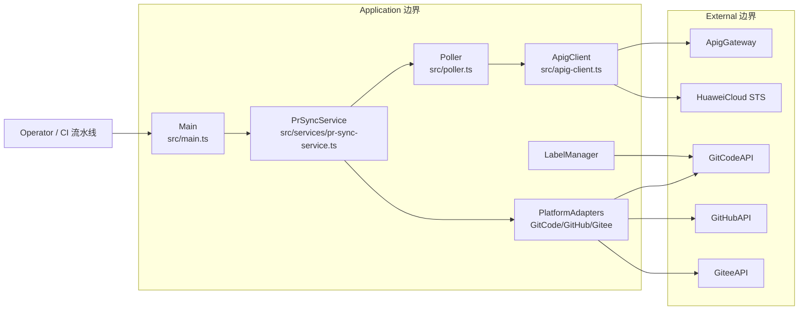

# pr-sync-action 威胁建模分析报告（STRIDE-A）

> **项目**：pr-sync-action
> **仓库**：https://gitcode.com/openlibing/pr-sync-action.git · 分支 `master` · Commit `27d7722`
> **方法**：STRIDE-A + Zero Trust + 可利用性分级 · 中文版
> **部署分类**：`LOCALHOST_SERVICE`（GitCode runner 出站型 CI 客户端，node16）

---

## 目录

1. [分析范围与环境](#1-分析范围与环境)
2. [架构概览](#2-架构概览)
3. [组件与信任边界（DFD）](#3-组件与信任边界dfd)
4. [STRIDE-A 分析](#4-stride-a-分析)
5. [Findings（按可利用性分级）](#5-findings按可利用性分级)
6. [Action Summary](#6-action-summary)
7. [分析上下文与假设](#7-分析上下文与假设)
8. [参考文献](#8-参考文献)

---

## 1. 分析范围与环境

### 1.1 功能简介

轮询代码仓同步状态，展示 PR 同步结果。核心：

- **入口** `src/main.ts`：平台检测、输入校验、认证模式选择（OIDC 免密 vs App Code）、组装事件上下文。
- **认证客户端** `src/apig-client.ts`：双认证（OIDC 经华为 STS 换证，App Code 用 `X-Apig-AppCode`），封装 `triggerPrSync` / `getPipelineInfo`。
- **业务服务** `src/services/pr-sync-service.ts`：触发 + 轮询协调，状态变化时写 PR 标签。
- **轮询器** `src/poller.ts`：超时、APIG 连续错误快速失败。
- **平台适配器** `src/platform/**`：GitCode / GitHub / Gitee 三平台自适应（`adapter.ts` 定义能力接口）。
- **标签管理** `src/label-manager.ts`、Gitee/GitHub/GitCode label client。
- **OIDC SDK** `@openlibing/huaweicloud-oidc-client`：ID Token 申请 → STS 换临时 AK/SK + SecurityToken → V11-HMAC-SHA256 签名。

### 1.2 技术栈

TypeScript、`@actions/core`、`@openlibing/huaweicloud-oidc-client`。

### 1.3 组件清单

| 组件 ID            | 类型     | 锚点                            | 职责                         |
| ------------------ | -------- | ------------------------------- | ---------------------------- |
| `Main`             | 进程     | src/main.ts                     | 编排/输入校验/认证模式选择   |
| `ApigClient`       | 进程     | src/apig-client.ts              | APIG 双认证 + 请求           |
| `PrSyncService`    | 进程     | src/services/pr-sync-service.ts | 触发+轮询业务编排            |
| `Poller`           | 进程     | src/poller.ts                   | 轮询/超时/快速失败           |
| `PlatformAdapters` | 进程     | src/platform/adapter.ts         | 平台差异封装（标签、PR详情） |
| `LabelManager`     | 进程     | src/label-manager.ts            | 标签操作封装                 |
| `ApigGateway`      | 外部服务 | APIG 端点                       | 同步状态查询/触发            |
| `HuaweiCloudSTS`   | 外部服务 | 华为云 STS                      | OIDC 换证                    |
| `GitCodeAPI`       | 外部服务 | 各平台端点                      | 标签/PR 详情                 |
| `GitHubAPI`        | 外部服务 | 各平台端点                      | 标签/PR 详情                 |
| `GiteeAPI`         | 外部服务 | 各平台端点                      | 标签/PR 详情                 |
| `Operator`         | 外部角色 | CI 触发者                       | 配置输入、审查               |

---

## 2. 架构概览

分层清晰：入口 → 业务服务 → 轮询器 → 认证客户端 → 平台适配器。通过能力接口（`LabelCapability` / `PrDetailCapability`）解耦平台差异。认证优先 OIDC 免密，配置了 id-token 即优先走；否则回退 App Code。

---

## 3. 组件与信任边界（DFD）

### 组件暴露表

| 组件               | 监听地址       | 认证屏障      | 外部可达   | 最小前置条件           |
| ------------------ | -------------- | ------------- | ---------- | ---------------------- |
| Main/ApigClient 等 | 无监听（出站） | —             | 否（出站） | `Local Process Access` |
| ApigGateway        | 平台托管       | IAM / AppCode | 是（受控） | `Authenticated User`   |
| 平台 API           | 平台托管       | 各自令牌      | 是         | `Authenticated User`   |

---

## 4. STRIDE-A 分析

### 4.1 Main

| 类别                       | 威胁                                                                | 前置条件               | Tier | 状态 |
| -------------------------- | ------------------------------------------------------------------- | ---------------------- | ---- | ---- |
| S (Spoofing)               | 平台选择可被 `platform` 输入覆盖，错误平台可能携带错误环境的令牌    | `Local Process Access` | T2   | Open |
| I (Information Disclosure) | debug=true 打印 OIDC SDK 签名头/请求详情（标称脱敏但依赖 SDK 行为） | `Local Process Access` | T2   | Open |
| A (Abuse)                  | `ignore_failure=true` 可使同步失败被静默吞掉，阻断审计信号          | `Privileged User`      | T2   | Open |

### 4.2 ApigClient

| 类别                       | 威胁                                                                                            | 前置条件               | Tier | 状态                        |
| -------------------------- | ----------------------------------------------------------------------------------------------- | ---------------------- | ---- | --------------------------- |
| S (Spoofing)               | App Code 认证用静态 `X-Apig-AppCode` 共享凭证，易被泄露出多渠道                                 | `Local Process Access` | T2   | Open                        |
| I (Information Disclosure) | OIDC 模式下 SDK 缓存临时 AK/SK+SecurityToken（内存），`configure`/`getCredentials` 暴露给同进程 | `Local Process Access` | T2   | Open                        |
| D (DoS)                    | 网关连续错误 3 次即 `FAILURE` 快速失败，无重试退避（合理但有业务可用性风险）                    | `Authenticated User`   | T2   | Mitigated（快速失败属预期） |
| E (Privilege Escalation)   | OIDC 免密依赖 id-token 权限声明，配置不当可能造成最小权限失效                                   | `Privileged User`      | T2   | Open                        |

### 4.3 Poller + PrSyncService

| 类别          | 威胁                                                                                         | 前置条件               | Tier | 状态 |
| ------------- | -------------------------------------------------------------------------------------------- | ---------------------- | ---- | ---- |
| A (Abuse)     | `poll_interval_seconds=1` 时高频轮询可能触发 APIG 限流（参数最小校验到 ≥1，未设合理下限）    | `Local Process Access` | T2   | Open |
| D (DoS)       | 轮询循环 `while(true)` 受超时控制，但记录条数随轮询累积无上限                                | `Local Process Access` | T2   | Open |
| T (Tampering) | `writeOutputFile` 用 `fs.appendFileSync`，输出文件路径来自平台 env，被污染时可能写入任意路径 | `Host/OS Access`       | T3   | Open |

### 4.4 PlatformAdapters / LabelManager / 外部平台

| 类别                       | 威胁                                                                                                                   | 前置条件             | Tier | 状态                      |
| -------------------------- | ---------------------------------------------------------------------------------------------------------------------- | -------------------- | ---- | ------------------------- |
| I (Information Disclosure) | `git_token` 输入/平台令牌拼入触发请求 `accessToken` 传给 ApigGateway（跨系统传递凭证）                                 | `Authenticated User` | T2   | Open                      |
| T (Tampering)              | GitHub 标签逐个删除用 `DELETE`，失败被静默吞掉（仅执行完整清理才加目标标签），可能残留旧标签                           | `Authenticated User` | T2   | Open                      |
| A (Abuse)                  | 标签配置由输入 `running_label/success_label/failure_label` 驱动，无对文本来源的可信校验（仅做长度/逗号/换行/重复检查） | `Privileged User`    | T2   | Mitigated（已做基础校验） |

---

## 5. Findings（按可利用性分级）

### Tier 2 — Conditional Risk

**FIND-SYNC-01：仓库访问令牌被中转到第三方 APIG 网关**

- **描述**：`buildTriggerRequest` 将 `git_token`（或平台令牌）放入 `accessToken` 字段随触发请求 POST 到 `ApigGateway`（`cross-region/pr-sync/trigger`）。这意味着仓库写权限令牌会被传递到 OpenLibing 侧网关，扩大凭证暴露面。
- **证据**：`src/main.ts` 第 57-68 行（accessToken）、`src/apig-client.ts` 第 186-196 行（triggerPrSync）。
- **缓解举措**：优先用 OIDC 免密替代中转 token；token 以运行密钥引用而非明文；对该端点开启短时效。
- **验证**：确认是否所有同步场景都需将仓库 token 传给网关。
- CVSS：`CVSS:4.0/AV:L/AC:L/AT:N/PR:L/UI:N/VC:H/VI:N/VA:N/SC:N/SI:N/SA:N`（6.6）
- CWE：[CWE-524](https://cwe.mitre.org/data/definitions/524.html)/[CWE-798](https://cwe.mitre.org/data/definitions/798.html) · OWASP：[A07:2025](https://owasp.org/Top10/2025/)
- Remediation Effort：Low

**FIND-SYNC-02：App Code 静态凭证（`X-Apig-AppCode`）作回退认证，渠道暴露风险**

- **描述**：当无 id-token 时回退到 `openlibing_apig_code` 输入，作为 `X-Apig-AppCode` 请求头发送。静态共享凭证若泄漏可被复用为该网关身份。
- **证据**：`src/apig-client.ts` 第 59-64 行、`src/credential-config.ts` 第 35-40 行。
- **缓解举措**：默认推进所有流水线启用 OIDC 免密；App Code 设为 secret 类型；加轮换策略。
- **验证**：检测实际使用比例。
- CVSS：`CVSS:4.0/AV:L/AC:L/AT:N/PR:L/UI:N/VC:H/VI:N/VA:N/SC:N/SI:N/SA:N`（6.6）
- CWE：[CWE-798](https://cwe.mitre.org/data/definitions/798.html) · OWASP：[A07:2025](https://owasp.org/Top10/2025/)
- Remediation Effort：Low

**FIND-SYNC-03：debug 日志可能暴露 OIDC 签名字段/请求内容**

- **描述**：`debug=true` 时 `configure({debug:true})` 由 SDK 打印换证步骤、V11 签名请求头、完整请求/响应详情。代码注释称「敏感字段自动脱敏」，但这是依赖第三方 SDK 内部实现，未在本仓库验证脱敏覆盖度。
- **证据**：`src/main.ts` 第 84-115 行（getCommonInputs）、`src/apig-client.ts` 第 49 行（configure debug）。
- **缓解举措**：对 SDK 输出做二次脱敏审计；将 debug 默认关闭并仅限受控环境。
- **验证**：开启 debug 检查日志是否有密钥。
- CVSS：`CVSS:4.0/AV:L/AC:L/AT:N/PR:L/UI:N/VC:H/VI:N/VA:N/SC:N/SI:N/SA:N`（6.6）
- CWE：[CWE-532](https://cwe.mitre.org/data/definitions/532.html) · OWASP：[A09:2025](https://owasp.org/Top10/2025/)
- Remediation Effort：Low

**FIND-SYNC-04：轮询配置缺少合理下限校验**

- **描述**：`poll_interval_seconds` 最小仅校验 `>=1`，注释建议 ≥30；实际可配 1 秒高频轮询，加上消费者自身并发可能造成 APIG 限流（业务可用性/滥用）。
- **证据**：`src/main.ts` 第 97-99 行。
- **缓解举措**：将下限提升至合理值（如 ≥15s），超时与重试次数设上限。
- **验证**：配置 1s 观察是否触发网关限流。
- CVSS：`CVSS:4.0/AV:L/AC:L/AT:N/PR:L/UI:N/VC:N/VI:N/VA:H/SC:N/SI:N/SA:N`（6.0）
- CWE：[CWE-770](https://cwe.mitre.org/data/definitions/770.html) · OWASP：[A06:2025](https://owasp.org/Top10/2025/)
- Remediation Effort：Low

### Tier 3 — Defense-in-Depth

**FIND-SYNC-05：输出文件路径来自环境变量，路径污染风险**

- **描述**：`writeOutputFile` 向 `env.ATOMGIT_OUTPUT` 追加写内容；若该 env 被不可信注入，可能写入非预期路径（低影响但属路径可操控）。
- **证据**：`src/platform/output.ts` 第 5-16 行。
- **缓解举措**：对路径做规范化 + 仅允许平台注入的已知输出路径。
- **验证**：注入异常路径观察落盘行为。
- CVSS：`CVSS:4.0/AV:L/AC:H/AT:N/PR:H/UI:N/VC:N/VI:L/VA:N/SC:N/SI:N/SA:N`（3.0）
- CWE：[CWE-73](https://cwe.mitre.org/data/definitions/73.html) · OWASP：[A05:2025](https://owasp.org/Top10/2025/)
- Remediation Effort：Medium

**FIND-SYNC-06：标签操作静默吞错，可能残留不一致状态**

- **描述**：GitHub 逐个删除标签时单次失败被 `catch{}` 忽略；若删除成功但添加失败，PR 会丢失全部标签却无强告警。
- **证据**：`src/platform/github/github-label-client.ts` 第 53-79 行、`src/platform/gitee/gitee-label-client.ts` 第 43-69 行。
- **缓解举措**：对「删了但没加成功」做明确 warning + 状态判定归因。
- **验证**：人工制造删除成功/添加失败组合观察日志。
- CVSS：`CVSS:4.0/AV:L/AC:L/AT:N/PR:L/UI:N/VC:N/VI:N/VA:N/SC:N/SI:H/SA:N`（4.7）
- CWE：[CWE-754](https://cwe.mitre.org/data/definitions/754.html) · OWASP：[A09:2025](https://owasp.org/Top10/2025/)
- Remediation Effort：Medium

---

## 6. Action Summary

### Quick Wins（T2 低工作量修复）

| Finding      | 修复动作                                  | 工作量 |
| ------------ | ----------------------------------------- | ------ |
| FIND-SYNC-01 | 以 OIDC 免密替代令牌中转；token 用 secret | Low    |
| FIND-SYNC-02 | 默认推进 OIDC；App Code 加轮换            | Low    |
| FIND-SYNC-03 | 二次脱敏审计 SDK 调试日志                 | Low    |
| FIND-SYNC-04 | 轮询间隔下限提升                          | Low    |

### 其余建议

- 输出路径白名单（FIND-SYNC-05，Medium）；
- 标签操作失败归因与告警（FIND-SYNC-06，Medium）。

---

## 7. 分析上下文与假设

### Needs Verification

| 项                                       | 说明                                                        |
| ---------------------------------------- | ----------------------------------------------------------- |
| `triggerPrSync` 是否必须携带仓库访问令牌 | 后端契约未在仓库内，需 OpenLibing 侧确认                    |
| SDK `debug` 脱敏覆盖度                   | 依赖 `@openlibing/huaweicloud-oidc-client` 内部实现，需实测 |
| GiteeGo 运行时注入变量名                 | 代码注释标注「待实测确认」                                  |

### Finding Overrides

| Finding      | Override 说明                                                |
| ------------ | ------------------------------------------------------------ |
| FIND-SYNC-01 | 若后端能改为由平台侧授权令牌（不中转），则降级为文档化加固项 |
| FIND-SYNC-02 | 若 App Code 已纳入轮换机制，降低影响                         |

---

## 8. 参考文献

### 安全标准

| 标准              | URL                                                    |
| ----------------- | ------------------------------------------------------ |
| CVSS v4.0         | https://www.first.org/cvss/v4.0/specification-document |
| CWE               | https://cwe.mitre.org/                                 |
| OWASP Top 10:2025 | https://owasp.org/Top10/2025/                          |

### 组件文档

| 组件                                | URL                                |
| ----------------------------------- | ---------------------------------- |
| @actions/core                       | https://github.com/actions/toolkit |
| @openlibing/huaweicloud-oidc-client | https://gitcode.com/openlibing     |
| GitCode API                         | https://gitcode.com                |
