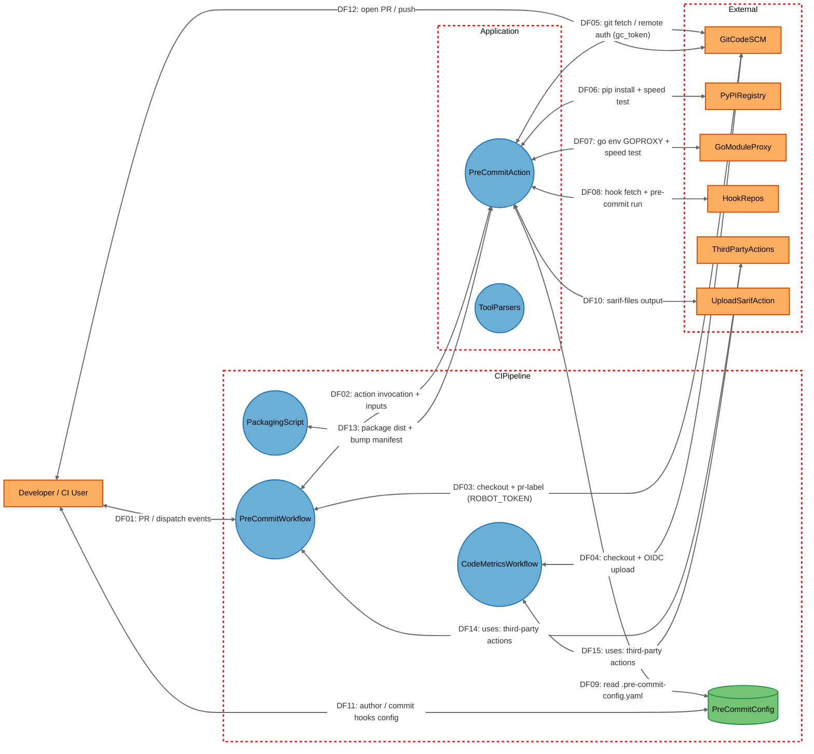

# pre-commit-action 项目安全威胁分析报告

**分析日期：** 2026-10-09
**分析版本：** master 分支 · commit `756183f`
**分析方法：** STRIDE-A 威胁建模
**项目仓库：** https://gitcode.com/openlibing/pre-commit-action

---

## 目录

1. [执行摘要](#1-执行摘要)
2. [系统架构概述](#2-系统架构概述)
3. [数据流图（DFD）](#3-数据流图dfd)
4. [STRIDE-A 威胁分析](#4-stride-a-威胁分析)
5. [安全发现与漏洞详情](#5-安全发现与漏洞详情)
6. [修复建议与行动计划](#6-修复建议与行动计划)
7. [附录](#7-附录)

---

## 1. 执行摘要

### 1.1 分析概述

`pre-commit-action` 是一个 GitCode/GitHub Actions 复合动作（JavaScript，`runs.using: node16`，实际执行入口为 `dist/index.js`）。它在 CI 执行机上安装 `pre-commit`，对目标代码仓执行钩子检查，随后收集用户提供的 SARIF 报告，或在工具未提供报告时依据 `pre-commit` 运行日志兜底生成 `<tool>.sarif`，并通过 `sarif-files` output 交给下游上传动作。

- 自动区分 PR 增量检查（`--from-ref FETCH_HEAD --to-ref HEAD`）与版本级全量检查（`--all-files`）
- 安装 `pre-commit` 前对 PyPI 源站与华为镜像做 `curl` 测速并据此选源；Go 已安装时同样为 `GOPROXY` 选源
- 报告数据源优先级：`sarif-file` 输入 → `report-dir` 目录扫描 → 日志兜底解析

该动作**本身不监听任何网络端口**，仅作为 CI 步骤以本地进程运行并做出一系列**出站**调用（git/pip/curl/`go env`/钩子仓克隆）。因此本次分析的部署分类为 `LOCALHOST_DESKTOP`：**不存在 Tier 1（无前置条件）的外部攻击面**，所有风险均来自 CI 编排者、PR 作者、执行机本地进程以及上游供应链。

分析中最突出的风险集中在两处：其一，仓库自身的门禁工作流以 `pull_request_target` + `allow-unsafe-pr-checkout: true` 在**具备 `pr: write` 权限的自托管执行机**上检出并执行 PR 内容，构成典型 pwn-request 链路（FIND-01）；其二，动作把 `gc_token` 明文写入 `.git/config`（FIND-04）、`extra_args` 白名单存在绕过（FIND-02），并存在多处供应链未固定（未固定 pip 版本、可变钩子 `rev`、可变 action tag、`GONOSUMDB=*`）。

### 1.2 关键安全风险

本次分析共识别出 **14 个安全问题**（经本轮源码误报复核后全部保留），其中：

| 严重级别 | 数量 | 关键问题 |
|---------|------|---------|
| **严重（Critical）** | 1 | 不可信 PR 代码在特权自托管执行机执行（pwn-request） |
| **高危（High）** | 4 | `extra_args` 白名单绕过、`gc_token` 明文落盘、pip 版本未固定、钩子 `rev` 可变 |
| **中危（Medium）** | 8 | PAT 暴露（复核下调）、shell 拼接命令、SARIF 内容注入、任意文件收集、子进程无超时、可变 action tag/OIDC、`GONOSUMDB=*`、打包不可复现 |
| **低危（Low）** | 1 | 输入/健壮性控制覆盖面有限 |

> **关于数量与误报复核：** 原始报告共 14 条发现。本轮对 FIND-01..FIND-14 **逐条打开仓库真实源码核验**，结论为：确认 13 条、部分成立 1 条（FIND-03，已下调严重级别）、误报 0 条、无法验证 0 条。详见 [7.2 漏洞误报复核结果](#72-漏洞误报复核结果)。

### 1.3 核心结论

> **系统不存在 Tier 1（无前置条件）问题，未评 Critical 风险等级；但 FIND-01 在具备 `pr: write` 的自托管执行机上实现了“PR 作者 → 执行机代码执行”的完整链路（SDL Critical，CVSS 8.6），属于必须优先修复的高影响问题。**
>
> 叠加动作侧的凭证落盘（FIND-04）、参数白名单绕过（FIND-02）与供应链未固定（FIND-10/FIND-11/FIND-12），整体风险评为 **Elevated（偏高）**。
>
> 关键缓解动作：门禁作业去掉 `pr: write` 权限、恢复 `allow-unsafe-pr-checkout` 默认拦截、把凭证注入改为 credential helper 并清理、将钩子 `rev` 与第三方 action 固定为不可变 SHA、对 `pre-commit` 安装做版本与哈希固定。

---

## 2. 系统架构概述

### 2.1 技术栈

| 类别 | 技术 | 版本/说明 |
|------|------|----------|
| 语言 | JavaScript (Node.js) | `node16` 运行时（`action.yml:65`） |
| 语言 | Python | pre-commit 运行时（`python -m pre_commit`） |
| 语言 | Go | 可选（`go version` 存在时才配置代理） |
| 语言 | YAML | workflow / 钩子配置 |
| 框架 | GitCode/GitHub Actions | `action.yml`，`runs.using: node16` |
| 框架 | pre-commit hook framework | 钩子执行框架 |
| 打包 | @vercel/ncc | devDependency，`ncc build index.js -o dist` |
| 打包 | adm-zip | devDependency，`zip.js` 打包分发件 |
| 数据存储 | 本地文件系统 | `dist/`、`.git/config`、`/tmp/pre-commit-reports/`、`pre-commit-action.zip` |
| 基础设施 | 自托管执行机 | `self-hosted`（`region=cn` / `region=overseas`）与云端 `codearts-hosted` |
| 版本控制 | GitCode 代码托管 | git 远端、PR 事件、`gc_token` 认证 |

### 2.2 关键组件

| 组件 ID | 类型 | 说明 | 源码位置 |
|---------|------|------|---------|
| PreCommitAction | Process | 动作主运行时：读取输入、测速选源、安装 pip/go 依赖、注入 git 凭证、执行 `pre-commit`、收集/兜底生成 SARIF、写 STEP_OUTPUT | `index.js` / `dist/index.js` |
| ToolParsers | Process | SARIF 生成与工具日志解析模块（clang-tidy/bandit/gosec/spotbugs/rust-clippy/eslint/gitleaks/detect-secrets） | `tool-parsers.js` |
| PreCommitWorkflow | Process | 仓库 PR 门禁工作流（`pull_request_target` 触发、检出合并 commit、pr-label 编排） | `.gitcode/workflows/pre-commit.yml` |
| CodeMetricsWorkflow | Process | 仓库代码度量工作流（push/workflow_dispatch 触发、OIDC `id-token: write`） | `.gitcode/workflows/code-metrics-scan.yml` |
| PreCommitConfig | Data Store | 仓库自身钩子配置（pre-commit-hooks 镜像、gitleaks、local prettier） | `.pre-commit-config.yaml` |
| PackagingScript | Process | 打包/版本脚本（改写 `action.yml` 版本号并将 `dist/` 打入 zip） | `zip.js`、`bump-version.js` |
| GitCodeSCM | External | GitCode 代码托管平台：git 远端、`gc_token` 认证、PR/推送事件 | 外部服务 |
| PyPIRegistry | External | Python 包索引：`pypi.org` 与华为云镜像 | 外部服务 |
| GoModuleProxy | External | Go 模块代理：`proxy.golang.org` 与华为云镜像 | 外部服务 |
| HookRepos | External | pre-commit 钩子仓库（gitcode 镜像 / GitHub） | 外部服务 |
| ThirdPartyActions | External | 工作流引用的第三方 action（`uses:`） | 外部服务 |
| UploadSarifAction | External | 下游 SARIF 上传动作 `openlibing/openlibing-upload-sarif` | 外部服务 |
| DeveloperUser | External | 业务仓开发者 / CI 使用者（威胁来源，不单独出具 STRIDE 章节） | 外部实体 |

### 2.3 信任边界

```
┌─────────────────────────────────────────────────────────────────┐
│                            External                              │
│  ┌───────────────┐  ┌──────────┐  ┌──────────┐  ┌────────────┐  │
│  │ Developer/CI  │  │GitCodeSCM│  │PyPI/Go镜像│  │ HookRepos  │  │
│  │     User      │  │  :443    │  │   :443    │  │   :443     │  │
│  └───────┬───────┘  └────┬─────┘  └────┬─────┘  └─────┬──────┘  │
│          │               │             │              │         │
│          │         ┌─────┴─────────────┴──────────────┴───┐     │
│          │         │   ThirdPartyActions / UploadSarif    │     │
│          │         └──────────────────────────────────────┘     │
└──────────┼──────────────────────────────────────────────────────┘
           │  PR 事件 / 工作流触发
           ▼
┌─────────────────────────────────────────────────────────────────┐
│                    CIPipeline（仓库级 CI 配置）                   │
│  ┌──────────────────┐  ┌──────────────────┐                     │
│  │ PreCommitWorkflow│  │ CodeMetricsWorkflow│                    │
│  └────────┬─────────┘  └──────────────────┘                     │
│  ┌──────────────────┐  ┌──────────────────┐                     │
│  │  PreCommitConfig │  │ PackagingScript  │                     │
│  └──────────────────┘  └──────────────────┘                     │
└──────────────────────────┬──────────────────────────────────────┘
                           │ uses: 动作 + inputs
                           ▼
┌─────────────────────────────────────────────────────────────────┐
│                  Application（动作本地进程，无监听端口）          │
│  ┌────────────────────────┐  ┌──────────────────────┐           │
│  │    PreCommitAction     │  │     ToolParsers      │           │
│  │  index.js/dist/index.js│  │   tool-parsers.js    │           │
│  └────────────────────────┘  └──────────────────────┘           │
└─────────────────────────────────────────────────────────────────┘
```

**信任边界说明：**

1. **边界 1 - External → CIPipeline：** 开发者/CI 触发工作流事件（PR / push / dispatch），PR 内容为不可信输入
2. **边界 2 - CIPipeline → Application：** 工作流以 `uses:` 调用动作并传入 inputs（`extra_args`/`gc_token`/`report-dir`/`sarif-file`）
3. **边界 3 - Application → External：** 动作发起出站调用（git/pip/curl/`go env`/钩子仓克隆），并向 `STEP_OUTPUT` 写入输出

### 2.4 部署模式

- **部署分类：** `LOCALHOST_DESKTOP`（无网络监听端口的本地 CI 进程）
- **运行时：** Node16（入口 `dist/index.js`，由 `index.js` + `tool-parsers.js` 经 ncc 打包）
- **执行环境：** 自托管执行机（`self-hosted`，标签 `region=cn` / `region=overseas`）或云端执行机（`codearts-hosted`）
- **网络行为：** 仅出站（git HTTPS + `gc_token`、pip/curl HTTPS、`go env`、钩子仓克隆），不监听入站连接
- **凭证：** `gc_token`（git 私有仓认证，动作输入）、`secrets.ROBOT_TOKEN`（pr-label PAT）、OIDC（`id-token: write`，度量工作流）

---

## 3. 数据流图（DFD）

### 3.1 高层数据流图



### 3.2 关键数据流说明

| 数据流 ID | 源 → 目标 | 协议 | 数据内容 | 安全风险 |
|-----------|-----------|------|---------|---------|
| DF01 | DeveloperUser → PreCommitWorkflow | HTTPS（SCM 事件） | 开发者提交 PR / 触发工作流事件 | PR 内容为不可信输入 |
| DF02 | PreCommitWorkflow → PreCommitAction | Action 调用（env/inputs） | `extra_args`/`gc_token`/`report-dir`/`sarif-file` | 参数白名单可绕过 |
| DF03 | PreCommitWorkflow → GitCodeSCM | HTTPS git + REST | checkout 与 pr-label（`secrets.ROBOT_TOKEN`） | 长期 PAT |
| DF04 | CodeMetricsWorkflow → GitCodeSCM | HTTPS git + OIDC | checkout 与 OIDC 联邦认证上传 | OIDC 权限较广 |
| DF05 | PreCommitAction → GitCodeSCM | HTTPS git | `git remote set-url`（gc_token）与 `git fetch origin <base>` | token 明文写入 `.git/config` |
| DF06 | PreCommitAction → PyPIRegistry | HTTPS | `pip config set index-url`、`pip install pre-commit`、`curl` 测速 | 未固定版本/哈希、动态选源 |
| DF07 | PreCommitAction → GoModuleProxy | HTTPS | `go env -w GOPROXY/GONOSUMDB` 与 `curl` 测速 | `GONOSUMDB=*` 关闭校验 |
| DF08 | PreCommitAction → HookRepos | HTTPS/SSH git | pre-commit 克隆钩子仓并执行钩子 | 可变 `rev`、仓库可控钩子执行 |
| DF09 | PreCommitAction → PreCommitConfig | 文件读取 | 读取 `.pre-commit-config.yaml` 驱动钩子执行 | 不可信配置驱动执行 |
| DF10 | PreCommitAction → UploadSarifAction | Output channel | 通过 `sarif-files` output 传递报告路径 | 任意文件路径纳入上传 |
| DF11 | DeveloperUser → PreCommitConfig | git commit | 开发者编写/提交钩子配置 | 配置可含任意钩子 |
| DF12 | DeveloperUser → GitCodeSCM | HTTPS | 开发者打开 PR / 推送代码 | 攻击入口 |
| DF13 | PackagingScript → PreCommitAction | 文件/制品 | 打包 `dist/` 并改写 `action.yml` 版本 | 就地改写、产物漂移 |
| DF14 | PreCommitWorkflow → ThirdPartyActions | Action 调用 | `uses:` 引用 checkout/setup-node/setup-go/pr-label-action | 可变 tag |
| DF15 | CodeMetricsWorkflow → ThirdPartyActions | Action 调用 | `uses:` 引用 checkout/code-metrics-action | SHA 已固定（对照） |

---

## 4. STRIDE-A 威胁分析

> 本节采用标准 STRIDE 方法论（Spoofing / Tampering / Repudiation / Information Disclosure / Denial of Service / Elevation of Privilege），并扩展 **Abuse Cases（滥用）** 维度。表内 “A” 列为 Abuse 补充类别，用于覆盖“合法功能被滥用”的威胁。

### 4.1 威胁等级定义

| 等级 | 说明 | 前置条件 |
|------|------|---------|
| **Tier 1 (T1)** | 直接暴露，无需前置条件 | 攻击者可直接利用（前置条件必须为 `None`） |
| **Tier 2 (T2)** | 需要单一前置条件 | `Authenticated User` / `Privileged User` / 单一 `{Boundary} Access` |
| **Tier 3 (T3)** | 需要较高前置或纵深防御 | `Host/OS Access`、`{Component} Compromise`、多前置条件组合 |

由于部署分类为 `LOCALHOST_DESKTOP`（无监听端口的本地 CI 进程），**不存在 Tier 1 威胁**；无入站监听组件的“最小前置条件”以 `Privileged User` 表达（其唯一调用路径是 CI 工作流与调用方可控输入）。

### 4.2 威胁汇总表

| 组件 | S | T | R | I | D | E | A | 总计 | T1 | T2 | T3 | 风险 |
|------|---|---|---|---|---|---|---|------|----|----|----|------|
| PreCommitAction | 1 | 5 | 1 | 2 | 1 | 1 | 2 | **13** | 0 | 11 | 2 | 高 |
| ToolParsers | 1 | 1 | 1 | 2 | 1 | 0 | 1 | **7** | 0 | 7 | 0 | 中 |
| PreCommitWorkflow | 1 | 1 | 1 | 1 | 1 | 1 | 1 | **7** | 0 | 7 | 0 | 严重 |
| CodeMetricsWorkflow | 0 | 1 | 0 | 1 | 0 | 1 | 1 | **4** | 0 | 4 | 0 | 中 |
| PreCommitConfig | 0 | 2 | 0 | 1 | 0 | 1 | 1 | **5** | 0 | 4 | 1 | 高 |
| PackagingScript | 0 | 2 | 0 | 1 | 0 | 0 | 1 | **4** | 0 | 0 | 4 | 中 |
| GitCodeSCM | 1 | 0 | 0 | 1 | 0 | 1 | 0 | **3** | 0 | 3 | 0 | 中 |
| PyPIRegistry | 1 | 1 | 0 | 1 | 0 | 0 | 0 | **3** | 0 | 0 | 3 | 高 |
| GoModuleProxy | 0 | 1 | 0 | 1 | 0 | 1 | 0 | **3** | 0 | 0 | 3 | 中 |
| HookRepos | 1 | 1 | 0 | 1 | 0 | 0 | 0 | **3** | 0 | 0 | 3 | 高 |
| ThirdPartyActions | 1 | 1 | 0 | 0 | 0 | 1 | 0 | **3** | 0 | 0 | 3 | 高 |
| UploadSarifAction | 0 | 1 | 0 | 1 | 0 | 0 | 1 | **3** | 0 | 2 | 1 | 中 |
| **总计** | **7** | **17** | **3** | **13** | **3** | **7** | **8** | **58** | **0** | **38** | **20** | |

### 4.3 各组件详细威胁分析

#### 4.3.1 PreCommitAction（动作主运行时）

**信任边界：** Application ｜ **数据流：** DF02, DF05, DF06, DF07, DF08, DF09, DF10, DF13

| ID | STRIDE | 威胁描述 | Tier | 前置条件 |
|----|--------|---------|------|---------|
| T01.S | S | 动作直接信任 `INPUT_*` 环境变量与 `origin` 远端 URL，同宿主机其他步骤可伪造输入以重定向凭证/报告路径 | T2 | Local Process Access |
| T01.T1 | T | 未固定版本的 `pip install pre-commit` 可被执行替代包 | T3 | PyPIRegistry Compromise |
| T01.T2 | T | `execSync(cmd, {shell:'/bin/bash'})` 以字符串拼接 token/URL 构造命令，存在命令注入面 | T2 | Local Process Access |
| T01.T3 | T | `go env -w GONOSUMDB=*` 关闭 Go 模块校验和验证 | T3 | GoModuleProxy Compromise |
| T01.T4 | T | `report-dir` 下 `*.sarif` 被当作可信报告直接纳入上传列表，未做内容校验 | T2 | Privileged User |
| T01.T5 | T | 恶意 `WORKSPACE` 值可能将动作重定向到非预期目录 —— 已被 `^\/[\w\-\/.]+$` 正则约束 | T2 | Local Process Access |
| T01.R1 | R | 凭证注入、抓取的 ref、执行的钩子与生成的报告均无审计记录 | T2 | Local Process Access |
| T01.I1 | I | `gc_token` 明文写入 `.git/config` remote URL，运行结束后持续驻留执行机 | T2 | Local Process Access |
| T01.I2 | I | token/secret 可能经子进程回显输出与收集到的 SARIF 路径泄漏 | T2 | Local Process Access |
| T01.D1 | D | 无超时/大小上限地 spawn pre-commit，恶意钩子可挂起或耗尽执行机 | T2 | Local Process Access |
| T01.E1 | E | 动作以执行机身份运行仓库可控钩子，PR 作者借此获得执行机代码执行 | T2 | Authenticated User |
| T01.A1 | A | `extra_args` 白名单对未知长选项放行（如 `--config=`），可指定任意钩子配置 | T2 | Privileged User |
| T01.A2 | A | `sarif-file`/`report-dir` 输入可指向任意文件路径，被纳入下游上传列表 | T2 | Privileged User |

#### 4.3.2 ToolParsers（工具日志解析与 SARIF 构建）

**信任边界：** Application ｜ **数据流：** DF08

| ID | STRIDE | 威胁描述 | Tier | 前置条件 |
|----|--------|---------|------|---------|
| T02.S | S | 伪造的钩子状态行/`hook id` 可让解析器把 findings 归因到受信工具名 | T2 | Privileged User |
| T02.T1 | T | 不可信日志内容（路径、rule id、message）被原样写入 SARIF（`artifactLocation.uri`/`ruleId`） | T2 | Privileged User |
| T02.R1 | R | 解析结果无来源/完整性标记，无法审计某条 SARIF 由哪行日志产生 | T2 | Privileged User |
| T02.I1 | I | gitleaks/detect-secrets 检出的 secret 片段被拼入 SARIF `message`，随报告外传 | T2 | Privileged User |
| T02.I2 | I | 解析/错误输出可能泄漏内部 IP 地址 —— 已被 `sanitizePath` 脱敏 | T2 | Local Process Access |
| T02.D1 | D | 构造的超长/畸形日志行触发正则回溯与超大内存占用 | T2 | Privileged User |
| T02.A1 | A | `partialFingerprints` 仅由 tool/rule/file/line 组成，可被构造以制造指纹碰撞、绕过去重 | T2 | Privileged User |

> Elevation of Privilege 类别不适用：解析模块在动作进程内运行，不跨越权限边界。

#### 4.3.3 PreCommitWorkflow（PR 门禁工作流）

**信任边界：** CIPipeline ｜ **数据流：** DF01, DF02, DF03, DF14

| ID | STRIDE | 威胁描述 | Tier | 前置条件 |
|----|--------|---------|------|---------|
| T03.S | S | `pull_request_target` 从默认分支读取工作流却检出 PR 合并 commit，受信配置与不可信代码信任错配 | T2 | Authenticated User |
| T03.T1 | T | 不可信 PR 可修改 `.pre-commit-config.yaml`/钩子，并在特权作业中被执行 | T2 | Authenticated User |
| T03.R1 | R | `secrets.ROBOT_TOKEN` 的使用无逐作业可审计记录 | T2 | Authenticated User |
| T03.I1 | I | `secrets.ROBOT_TOKEN` 暴露给会运行不可信代码的作业，可被窃取 | T2 | Authenticated User |
| T03.D1 | D | 不可信 PR 洪泛可占满自托管执行机 | T2 | Authenticated User |
| T03.E1 | E | `permissions: pr: write` 叠加不可信检出，PR 作者可触达 PR 写 API | T2 | Authenticated User |
| T03.A1 | A | `allow-unsafe-pr-checkout: true` 关闭 fork PR 检出拦截，可被滥用为 pwn-request | T2 | Authenticated User |

> 说明：T03.I1/T03.R1 的“PAT 暴露给运行不可信代码的作业”这一断言在复核中被判定为**部分成立**（见 FIND-03）：`secrets.ROBOT_TOKEN` 实际引用在 `region=cn` 的 pr-label 作业，而不可信代码运行于 `region=overseas` 的 pre-commit 作业，二者非同一作业；跨作业可达性存疑，详见 [7.2](#72-漏洞误报复核结果)。

#### 4.3.4 CodeMetricsWorkflow（代码度量工作流）

**信任边界：** CIPipeline ｜ **数据流：** DF04, DF15

| ID | STRIDE | 威胁描述 | Tier | 前置条件 |
|----|--------|---------|------|---------|
| T04.T1 | T | 作业声明 `id-token: write`，任一被污染的步骤可铸造联邦云凭证 | T2 | Privileged User |
| T04.I1 | I | OIDC token/临时云凭证可被受污染步骤外传 | T2 | Privileged User |
| T04.E1 | E | 工作流内 token 权限范围较广，被利用可越权 | T2 | Privileged User |
| T04.A1 | A | 以固定 SHA 引用度量 action，但工作流仍可在无评审下运行任意已固定 action | T2 | Privileged User |

> Spoofing / Repudiation / Denial of Service 类别不适用：执行主体由平台身份系统判定，运行记录由平台留存，且工作流仅面向 push/手动触发。

#### 4.3.5 PreCommitConfig（钩子配置）

**信任边界：** CIPipeline ｜ **数据流：** DF09, DF11

| ID | STRIDE | 威胁描述 | Tier | 前置条件 |
|----|--------|---------|------|---------|
| T05.T1 | T | 钩子以可变 `rev:` tag 引用（如 `v6.0.0`、`v8.30.1`），上游/镜像可替换内容 | T3 | HookRepos Compromise |
| T05.T2 | T | `local` 钩子 `language: system` 运行 `npx prettier --write`，运行期从 npm 拉取依赖 | T2 | Privileged User |
| T05.I1 | I | gitleaks/detect-secrets 输出（含命中片段）进入日志与报告 | T2 | Privileged User |
| T05.E1 | E | 仓库可控钩子以执行机权限执行 | T2 | Authenticated User |
| T05.A1 | A | `exclude: ^dist/` 使构建产物绕过扫描 | T2 | Privileged User |

> Spoofing / Repudiation / Denial of Service 类别不适用：配置文件不承载身份，其变更由 git 历史记录，且本身不处理运行期请求量。

#### 4.3.6 PackagingScript（打包脚本）

**信任边界：** CIPipeline ｜ **数据流：** DF13

| ID | STRIDE | 威胁描述 | Tier | 前置条件 |
|----|--------|---------|------|---------|
| T06.T1 | T | `bump-version.js` 用正则改写 `action.yml` 版本号，无结构校验，可能误改或被滥用 | T3 | Host/OS Access |
| T06.T2 | T | 打包将已提交的 `dist/` 与源码一起打包，无“源码↔构建产物”一致性校验，存在漂移 | T3 | Host/OS Access |
| T06.I1 | I | `zip.addLocalFolder("./dist")` 可能纳入非预期文件或密钥 | T3 | Host/OS Access |
| T06.A1 | A | 打包脚本以副作用方式就地修改源 `action.yml`，可制造版本混乱 | T3 | Host/OS Access |

> Spoofing / Repudiation / Denial of Service / Elevation of Privilege 类别不适用：构建脚本不承载身份，运行与产物提交有 git 历史，且以调用者权限运行。

#### 4.3.7 GitCodeSCM（代码托管平台）

**信任边界：** External ｜ **数据流：** DF03, DF04, DF05, DF12

| ID | STRIDE | 威胁描述 | Tier | 前置条件 |
|----|--------|---------|------|---------|
| T07.S1 | S | 动作信任 `origin` 远端与 token 身份，未对 git 服务端身份做独立校验 | T2 | Authenticated User |
| T07.I1 | I | git token 以 URL 形式传输/存储，易被日志或进程列表捕获 | T2 | Authenticated User |
| T07.E1 | E | token 权限超出 fetch 所需（可达仓库写） | T2 | Authenticated User |

> Tampering / Repudiation / Denial of Service / Abuse 类别不适用：动作对 GitCode 仅做 fetch/read。

#### 4.3.8 PyPIRegistry（Python 包索引）

**信任边界：** External ｜ **数据流：** DF06

| ID | STRIDE | 威胁描述 | Tier | 前置条件 |
|----|--------|---------|------|---------|
| T08.S1 | S | 测速按延迟选源，攻击者可影响选择到恶意/冒充索引 | T3 | PyPIRegistry Compromise |
| T08.T1 | T | 未固定版本/哈希的 `pre-commit` 包可被替换 | T3 | PyPIRegistry Compromise |
| T08.I1 | I | pip/curl 请求向外部镜像暴露环境信息与依赖画像 | T3 | PyPIRegistry Compromise |

> Repudiation / Denial of Service / Elevation of Privilege / Abuse 类别不适用：索引交互为单向拉取。

#### 4.3.9 GoModuleProxy（Go 模块代理）

**信任边界：** External ｜ **数据流：** DF07

| ID | STRIDE | 威胁描述 | Tier | 前置条件 |
|----|--------|---------|------|---------|
| T09.T1 | T | `GONOSUMDB=*`/镜像使模块校验和验证失效，模块内容可被替换 | T3 | GoModuleProxy Compromise |
| T09.I1 | I | 模块拉取元数据暴露给镜像 | T3 | GoModuleProxy Compromise |
| T09.E1 | E | 恶意 Go 模块可在构建/钩子阶段执行 | T3 | GoModuleProxy Compromise |

> Spoofing / Repudiation / Denial of Service / Abuse 类别不适用：代理不承载本系统身份与行为。

#### 4.3.10 HookRepos（钩子仓库）

**信任边界：** External ｜ **数据流：** DF08

| ID | STRIDE | 威胁描述 | Tier | 前置条件 |
|----|--------|---------|------|---------|
| T10.S1 | S | 钩子仓/rev 未校验，镜像可冒充上游仓库 | T3 | HookRepos Compromise |
| T10.T1 | T | 可变 rev 的钩子代码可在执行机执行任意命令 | T3 | HookRepos Compromise |
| T10.I1 | I | 钩子可访问执行机环境与凭证 | T3 | HookRepos Compromise |

> Repudiation / Denial of Service / Elevation of Privilege / Abuse 类别不适用：钩子仓自身不授予权限。

#### 4.3.11 ThirdPartyActions（第三方 action）

**信任边界：** External ｜ **数据流：** DF14, DF15

| ID | STRIDE | 威胁描述 | Tier | 前置条件 |
|----|--------|---------|------|---------|
| T11.S1 | S | 可变 action tag（如 `@v1.0.0`）可被劫持指向恶意代码 | T3 | ThirdPartyActions Compromise |
| T11.T1 | T | 第三方 action 代码可静默变更 | T3 | ThirdPartyActions Compromise |
| T11.E1 | E | 第三方 action 获得作业 permissions/token | T3 | ThirdPartyActions Compromise |

> Repudiation / Information Disclosure / Denial of Service / Abuse 类别不适用：action 引用为受控声明式调用。

#### 4.3.12 UploadSarifAction（下游上传动作）

**信任边界：** External ｜ **数据流：** DF10

| ID | STRIDE | 威胁描述 | Tier | 前置条件 |
|----|--------|---------|------|---------|
| T12.T1 | T | 上传的 SARIF 内容缺乏完整性保护，可被篡改 | T3 | UploadSarifAction Compromise |
| T12.I1 | I | 收集到的 SARIF 可能含任意文件路径与密钥片段 | T2 | Privileged User |
| T12.A1 | A | 通过 `sarif-files` 将任意文件上传到 OBS | T2 | Privileged User |

> Spoofing / Repudiation / Denial of Service / Elevation of Privilege 类别不适用：上传动作以受信凭证调用。

---

## 5. 安全发现与漏洞详情

> 严重级别中文映射：Critical→严重、Important→高危、Moderate→中危、Low→低危。
> 本节所有“证据”均取自仓库真实源码（`路径:行号`），并已在 [7.2 漏洞误报复核结果](#72-漏洞误报复核结果) 中逐条核验。**误报发现不计入本节**；**部分成立**发现已下调严重级别并标注。

### 5.1 严重（Critical）漏洞

---

#### FIND-01: 不可信 PR 代码在特权自托管执行机上执行

| 属性 | 值 |
|------|-----|
| **严重级别** | Critical（严重） |
| **CVSS 4.0 评分** | 8.6 |
| **CVSS 向量** | `CVSS:4.0/AV:N/AC:L/AT:N/PR:L/UI:N/VC:H/VI:H/VA:H/SC:N/SI:N/SA:N` |
| **CWE** | [CWE-829: Inclusion of Functionality from Untrusted Control Sphere](https://cwe.mitre.org/data/definitions/829.html) |
| **OWASP** | A08:2025 – Software/Data Integrity Failures |
| **利用难度** | Tier 2（Authenticated User） |
| **修复工作量** | Medium |

**描述：**

`pre-commit.yml` 使用 `pull_request_target`（从默认分支读取工作流）并检出 PR 的**合并后 commit**（`merge_commit_sha`），同时显式设置 `allow-unsafe-pr-checkout: true` 关闭 fork PR 检出拦截。随后工作流调用动作，动作读取被检出代码中的 `.pre-commit-config.yaml` 并执行其中定义的钩子（含 `language: system` 本地钩子）。任何能打开 PR 的账户都可以在自己的 PR 中放入恶意 `.pre-commit-config.yaml`，使钩子在具备 `pr: write` 权限的**自托管执行机**上执行任意代码，构成典型的 “pwn request”。

**证据：**

`.gitcode/workflows/pre-commit.yml:8`（触发方式）：
```yaml
  pull_request_target: ## 使用 pull_request_target 确保 PR 流水线始终读取默认分支（master）的最新配置文件
```

`.gitcode/workflows/pre-commit.yml:17-19`（权限）：
```yaml
permissions:
  repository: read
  pr: write
```

`.gitcode/workflows/pre-commit.yml:44-48`（检出 PR 合并 commit 且关闭拦截）：
```yaml
          - name: Checkout repository
            uses: checkout
            with:
              ref: ${{ atomgit.event.pull_request.merge_commit_sha || atomgit.event.pull_request.head.sha || atomgit.sha }}
              allow-unsafe-pr-checkout: true # 关闭 fork PR 检出拦截，避免流水线在 fork PR 场景失败
```

`index.js:611-614`（读取被检出目录的钩子配置）：
```javascript
  if (!fs.existsSync('.pre-commit-config.yaml')) {
    console.log('[INFO] 未找到 .pre-commit-config.yaml，跳过 pre-commit 检查');
    return;
  }
  console.log('[OK] 找到 .pre-commit-config.yaml');
```

`index.js:627`（执行钩子）：
```javascript
  const preCommitResult = await runPreCommit(cmdResult);
```

`.pre-commit-config.yaml:30-36`（`language: system` 钩子会以执行机身份运行命令）：
```yaml
  - repo: local
    hooks:
      - id: prettier-format
        name: prettier format
        entry: npx prettier --write
        language: system
```

**修复建议：**

1. 门禁作业改为受限权限（`permissions: repository: read`，去掉 `pr: write`）；
2. 避免在 `pull_request_target` 下检出并执行 PR 内容，改用 `pull_request` 或“先人工审批再运行”的受信 job；
3. 将 `allow-unsafe-pr-checkout` 恢复默认拦截；
4. 对执行机做 job 级隔离（一次性/容器化 runner），使不可信钩子无法持久化到后续受信任务。

**验证步骤：**

构造一个 fork PR，修改 `.pre-commit-config.yaml` 加入 `language: system` 的可疑 `entry`（如 `id`/`whoami` 写入日志），确认该 PR 的门禁作业不再以可写权限运行其钩子，且 `pr: write` 权限不复存在于该作业。

---

### 5.2 高危（High）漏洞

---

#### FIND-02: `extra_args` 白名单绕过允许任意 pre-commit 选项

| 属性 | 值 |
|------|-----|
| **严重级别** | Important（高危） |
| **CVSS 4.0 评分** | 7.3 |
| **CVSS 向量** | `CVSS:4.0/AV:L/AC:L/AT:N/PR:L/UI:N/VC:L/VI:H/VA:L/SC:N/SI:N/SA:N` |
| **CWE** | [CWE-88: Improper Neutralization of Argument Delimiters in a Command](https://cwe.mitre.org/data/definitions/88.html) |
| **OWASP** | A05:2025 – Injection |
| **利用难度** | Tier 2（Privileged User） |
| **修复工作量** | Low |

**描述：**

`getInput('extra_args')` 的白名单校验对**任何以 `--` 开头的 token 直接放行**（判定条件为 `!allowedArgs.includes(arg) && !arg.startsWith('--')`），因此 `--config=<path>`、`--hook-stage`、`--verbose` 等未列出的长选项不会被拦截。攻击者可借此让 `pre-commit` 加载非预期的配置文件，从而在钩子执行阶段引入任意命令执行；此外 `argsWithValue` 中的 `--from-ref/--to-ref/--files` 其**取值 token 被 `skipNext` 跳过校验**，也可携带任意值。

**证据：**

`index.js:25-44`：
```javascript
  if (name === 'extra_args' && trimmed) {
    const allowedArgs = ['--all', '--all-files', '--help', '--show-diff-on-failure', '--from-ref', '--to-ref', '--files'];
    const argsWithValue = ['--from-ref', '--to-ref', '--files'];
    const args = trimmed.split(' ');
    let skipNext = false;
    for (const arg of args) {
      if (skipNext) { skipNext = false; continue; }
      if (argsWithValue.includes(arg)) { skipNext = true; continue; }
      if (!allowedArgs.includes(arg) && !arg.startsWith('--')) {
        console.log(`[ERROR] Invalid extra_args: ${arg}. Only -- arguments are allowed.`);
        process.exit(1);
      }
    }
  }
```

`index.js:619-621`（`extraArgs` 直接作为运行参数）与 `index.js:252-254`（拼入 `pre_commit run`）：
```javascript
  if (extraArgs) {
    console.log(`[INFO] 检测到自定义参数: ${extraArgs}`);
    cmdResult = { type: 'args', args: extraArgs };
```

**修复建议：**

改为严格白名单**精确匹配**：仅允许明确列出的参数（含其合法取值范围），拒绝任何未列出的以 `--` 开头的选项（显式拒绝 `--config`/`--config=`）；对 `--files` 等取值做路径与数量约束。

**验证步骤：**

设置 `extra_args` 为 `--config=malicious.yaml`，确认动作在参数校验阶段即以非零码退出并提示 “Invalid extra_args”，而不会执行 `pre_commit run`。

---

#### FIND-04: `gc_token` 明文持久化到 `.git/config` remote URL

| 属性 | 值 |
|------|-----|
| **严重级别** | Important（高危） |
| **CVSS 4.0 评分** | 6.8 |
| **CVSS 向量** | `CVSS:4.0/AV:L/AC:L/AT:N/PR:L/UI:N/VC:H/VI:N/VA:N/SC:L/SI:N/SA:N` |
| **CWE** | [CWE-522: Insufficiently Protected Credentials](https://cwe.mitre.org/data/definitions/522.html) |
| **OWASP** | A04:2025 – Cryptographic Failures |
| **利用难度** | Tier 2（Local Process Access） |
| **修复工作量** | Low |

**描述：**

在 PR 场景下，动作把 `gc_token` 经 `encodeURIComponent` 后拼进远端 URL 并执行 `git remote set-url origin "https://oauth2:<token>@host/..."`，使 token 以明文形式持久写入检出目录的 `.git/config`。该文件在执行机运行期内持续存在，任何后续步骤或本地进程（含 FIND-01 注入的不可信钩子）都可读取。动作仅校验远端 URL 以 `https://` 开头，未校验 host 是否为受信域，且无任何凭证注入/清理审计记录。

**证据：**

`index.js:166-175`：
```javascript
    // 使用 gc_token 注入 remote URL 认证，确保 git fetch 能访问私有仓库
    const token = getInput('gc_token');
    if (token) {
      const remoteUrl = execCapture('git remote get-url origin');
      if (remoteUrl && remoteUrl.startsWith('https://')) {
        const encodedToken = encodeURIComponent(token);
        const authUrl = remoteUrl.replace('https://', `https://oauth2:${encodedToken}@`);
        execCapture(`git remote set-url origin "${authUrl}"`);
      }
    }
```

`index.js:654-659`（顶层 catch 仅对错误消息做 IP 脱敏，不涉及凭证清理）：
```javascript
if (require.main === module) {
  run().catch(err => {
    const sanitizedMessage = sanitizePath(err.message);
    console.error(`Action 执行失败: ${sanitizedMessage}`);
    process.exit(1);
  });
}
```

**修复建议：**

改用 git credential helper 或 `-c http.extraHeader=Authorization:` 传递认证，避免把 token 写入 remote URL；使用短时效/只读 token；在 `finally` 中执行 `git remote set-url origin <clean-url>` 清理凭证；校验 `origin` 的 host 是否为受信域；记录凭证注入/清理事件。

**验证步骤：**

运行 PR 场景门禁后检查检出目录 `.git/config` 的 `[remote "origin"] url`，确认其中不再包含 `oauth2:<token>@`；执行 `git remote -v` 不应回显任何凭证。

---

#### FIND-10: 未固定的 `pip install pre-commit` 与动态选源

| 属性 | 值 |
|------|-----|
| **严重级别** | Important（高危） |
| **CVSS 4.0 评分** | 6.5 |
| **CVSS 向量** | `CVSS:4.0/AV:L/AC:L/AT:P/PR:N/UI:N/VC:L/VI:H/VA:L/SC:L/SI:L/SA:N` |
| **CWE** | [CWE-494: Download of Code Without Integrity Check](https://cwe.mitre.org/data/definitions/494.html) |
| **OWASP** | A03:2025 – Software Supply Chain Failures |
| **利用难度** | Tier 3（PyPIRegistry Compromise） |
| **修复工作量** | Medium |

**描述：**

动作在执行 `pip install pre-commit` 前先对 PyPI 源站与华为镜像做 `curl` 测速，并据此 `pip config set global.index-url` 选择安装源；`pre-commit` 及其依赖**未固定版本、未使用 `--require-hashes`**。这使包索引成为可被替换的信任源：被攻陷/冒充的索引，或对选源过程的干扰，都会让动作安装并执行恶意 `pre-commit`，继而在钩子阶段获得执行机代码执行。

**证据：**

`index.js:6-13`（固定源与常量）：
```javascript
const PIP_MIRROR_DEFAULT = 'https://mirrors.huaweicloud.com/repository/pypi/simple';
const PIP_ORIGINAL = 'https://pypi.org/simple';
const SPEED_TEST_TIMEOUT = 5;
let PIP_MIRROR = '';
```

`index.js:94-100`（`curl` 测速，用于动态选源）：
```javascript
function testUrlSpeed(url) {
  const result = execCapture(`curl -s -o /dev/null -w "%{time_total}" --max-time ${SPEED_TEST_TIMEOUT} "${url}" 2>/dev/null`);
  if (!result) return -1;
```

`index.js:550`（写入动态选择的源）与 `index.js:577`（无版本/哈希固定地安装）：
```javascript
  execFile('python', ['-m', 'pip', 'config', 'set', 'global.index-url', PIP_MIRROR]);
  ...
  execFile('python', ['-m', 'pip', 'install', 'pre-commit', '--timeout', PIP_TIMEOUT]);
```

**修复建议：**

固定 `pre-commit` 及 pip 的版本并使用哈希校验（`pip install --require-hashes -r requirements.txt`）；将安装源限定为受信索引（去除运行时动态选源）；对 pip 配置与安装结果做审计/校验。

**验证步骤：**

在受控网络下验证：安装命令中带有固定版本与 `--require-hashes`，且不再出现基于测速的动态 `index-url` 设置；伪造不可达索引时动作行为可预期（不使用未受信源）。

---

#### FIND-11: `.pre-commit-config.yaml` 中钩子 `rev` 可变与运行期 `npx` 拉取

| 属性 | 值 |
|------|-----|
| **严重级别** | Important（高危） |
| **CVSS 4.0 评分** | 6.4 |
| **CVSS 向量** | `CVSS:4.0/AV:A/AC:L/AT:P/PR:L/UI:N/VC:L/VI:H/VA:L/SC:N/SI:N/SA:N` |
| **CWE** | [CWE-829: Inclusion of Functionality from Untrusted Control Sphere](https://cwe.mitre.org/data/definitions/829.html) |
| **OWASP** | A03:2025 – Software Supply Chain Failures |
| **利用难度** | Tier 3（HookRepos Compromise） |
| **修复工作量** | Low |

**描述：**

`.pre-commit-config.yaml` 以**可变 tag** 引用钩子仓（`gitcode.com/gh_mirrors/pr/pre-commit-hooks` `rev: v6.0.0`、`gitcode.com/openlibing/pre-commit-hook-gitleaks.git` `rev: v8.30.1`），任何能改动上游/镜像对应 tag 的一方即可替换钩子内容并在执行机执行任意代码；同时 `local` 钩子以 `language: system` 运行 `npx prettier --write`，`npx` 在运行期从 npm 拉取 prettier（版本未固定），形成第二条运行期依赖注入路径。此外 `exclude: ^dist/` 使构建产物绕过扫描。

**证据：**

`.pre-commit-config.yaml:4`（排除构建产物）：
```yaml
exclude: ^dist/ # 排除构建产物目录
```

`.pre-commit-config.yaml:8-9` 与 `23-24`（可变 `rev`）：
```yaml
  - repo: https://gitcode.com/gh_mirrors/pr/pre-commit-hooks # 使用gitcode镜像加速
    rev: v6.0.0
  ...
  - repo: https://gitcode.com/openlibing/pre-commit-hook-gitleaks.git
    rev: v8.30.1
```

`.pre-commit-config.yaml:30-36`（运行期 `npx` 拉取）：
```yaml
  - repo: local
    hooks:
      - id: prettier-format
        name: prettier format
        entry: npx prettier --write
        language: system
        files: \.(json|yml|yaml|md)$
```

**修复建议：**

将钩子仓 `rev` 固定为不可变 commit SHA；对钩子仓做受信源与内容校验；`local` prettier 钩子改为本地预装并锁定 `prettier` 版本（如 `language: node` + 锁定依赖），避免运行期 `npx` 联网拉取；复审并最小化 `exclude` 范围。

**验证步骤：**

检查 `.pre-commit-config.yaml`，确认所有外部 `rev` 为 commit SHA 且 prettier 通过锁定依赖本地运行；离线执行 `pre-commit run` 应仍能成功。

> 说明：仓库自身 CI 工作流已通过 `setup-prettier` 步骤锁定 `prettier@3.9.5`（`.gitcode/workflows/pre-commit.yml:56-60`），在一定程度上缓解了 `npx` 运行期拉取；但配置文件本身仍使用未固定版本的 `npx prettier`，作为对外示例配置存在风险。

---

### 5.3 中危（Medium）漏洞

---

#### FIND-03: 长期 PAT 暴露于会执行不可信 PR 代码的流水线（复核下调）

| 属性 | 值 |
|------|-----|
| **严重级别** | Moderate（中危，复核由高危下调） |
| **CVSS 4.0 评分** | 7.1（沿用原报告；该评分基于“token 直接暴露于不可信作业”的假设，复核发现该假设不成立） |
| **CVSS 向量** | `CVSS:4.0/AV:N/AC:L/AT:N/PR:L/UI:N/VC:H/VI:L/VA:N/SC:L/SI:L/SA:N` |
| **CWE** | [CWE-522: Insufficiently Protected Credentials](https://cwe.mitre.org/data/definitions/522.html) |
| **OWASP** | A04:2025 – Cryptographic Failures |
| **利用难度** | Tier 2（Authenticated User） |
| **修复工作量** | Medium |

**描述：**

工作流使用长期有效的 PAT `secrets.ROBOT_TOKEN`（用于 pr-label-action 添加/移除 PR 标签），且该 secret 处于由 PR 事件触发的**同一工作流**上下文。结合 FIND-01，PR 作者可在执行机上执行代码，理论上存在窃取长期凭证、实现跨 PR/跨仓库横向移动的风险。

> **复核结论（部分成立）：** `secrets.ROBOT_TOKEN` 的实际引用位于 `initiate`/`post` 阶段的 pr-label 作业（运行于 `["self-hosted","region=cn"]`），而承载不可信 PR 代码执行的 pre-commit 作业运行于 `["self-hosted","region=overseas"]`，二者为**不同的作业与执行机池**。因此“token 直接暴露给运行不可信代码的同一作业”这一断言不成立，可达性被夸大；但“长期 PAT + 顶层 `pr: write` 权限出现在由 PR 触发的门禁工作流中”仍是真实风险，故保留并下调为**中危**。

**证据：**

`.gitcode/workflows/pre-commit.yml:30-35`（ROBOT_TOKEN 用于 pr-label 作业，运行于 region=cn）：
```yaml
          - name: pr-label-running
            uses: openlibing/pr-label-action@v1.0.0
            with:
              token: ${{ secrets.ROBOT_TOKEN }}
              add_labels: ci-pipeline-running
              remove_labels: ci-pipeline-passed,ci-pipeline-failed
```

`.gitcode/workflows/pre-commit.yml:42`（承载不可信代码执行的作业运行于不同执行机池）：
```yaml
        runs-on: ["self-hosted", "region=overseas"]
```

`.gitcode/workflows/pre-commit.yml:17-19`（顶层 `pr: write` 权限，作用于所有作业）：
```yaml
permissions:
  repository: read
  pr: write
```

**修复建议：**

将标签操作拆分到独立的、不检出 PR 代码的受信作业（现状已如此，建议进一步落文档与守护）；为 PAT 使用最小权限与短有效期（或改用平台原生 OIDC/机器人令牌）；收紧顶层 `pr: write`，按作业最小化声明；对 secret 的使用做逐作业审计。

**验证步骤：**

确认承载 PR 代码执行的作业中不引用 `secrets.ROBOT_TOKEN`（已满足），且 `permissions` 按作业最小化（当前为工作流级 `pr: write`，需收敛）；在 PR 场景作业日志中检索，确认 token 不再可达不可信步骤。

---

#### FIND-05: `exec` 辅助函数中的 shell 字符串拼接命令构造

| 属性 | 值 |
|------|-----|
| **严重级别** | Moderate（中危） |
| **CVSS 4.0 评分** | 5.6 |
| **CVSS 向量** | `CVSS:4.0/AV:L/AC:H/AT:N/PR:L/UI:N/VC:L/VI:H/VA:L/SC:N/SI:N/SA:N` |
| **CWE** | [CWE-78: Improper Neutralization of Special Elements used in an OS Command](https://cwe.mitre.org/data/definitions/78.html) |
| **OWASP** | A05:2025 – Injection |
| **利用难度** | Tier 2（Local Process Access） |
| **修复工作量** | Medium |

**描述：**

`execCapture()` 使用 `execSync(cmd, { shell: '/bin/bash' })` 以字符串形式执行命令，其中 `git remote set-url` 的整条命令（含 token 派生的 URL）与 `curl` 测速命令均通过字符串插值拼接。虽然 `encodeURIComponent` 会编码 `$`、反引号与双引号，降低了直接注入的可能，但将含敏感值/外部取值的数据拼接进 shell 命令字符串仍是脆弱模式；若 `origin` 远端 URL 包含 shell 元字符，则可能造成命令注入。

**证据：**

`index.js:72-75` 与 `index.js:86-92`（定义 shell 字符串执行辅助函数；`exec()` 目前未被调用，但模式一致）：
```javascript
function exec(cmd) {
  console.log(`> ${cmd}`);
  execSync(cmd, { stdio: 'inherit', shell: '/bin/bash' });
}
...
function execCapture(cmd) {
  try {
    return execSync(cmd, { encoding: 'utf-8', shell: '/bin/bash' }).trim();
  } catch (e) {
    return '';
  }
}
```

`index.js:94-95`（`curl` 测速命令拼接）：
```javascript
  const result = execCapture(`curl -s -o /dev/null -w "%{time_total}" --max-time ${SPEED_TEST_TIMEOUT} "${url}" 2>/dev/null`);
```

`index.js:172-173`（凭证命令拼接）：
```javascript
        const authUrl = remoteUrl.replace('https://', `https://oauth2:${encodedToken}@`);
        execCapture(`git remote set-url origin "${authUrl}"`);
```

**修复建议：**

对固定参数使用 `execFileSync`/`spawn` 的数组传参（不经过 shell）；对任何必须拼接的值先做严格校验（仅允许受信字符集）；禁止将凭证拼入命令行；避免对包含外部取值的数据使用 `shell: true`。

**验证步骤：**

静态检索 `index.js`，确认凭证相关命令不再使用 `shell` 字符串拼接；针对含特殊字符的 remote URL 构造用例，确认命令按字面参数执行而非被 shell 解析。

---

#### FIND-06: 不可信的 pre-commit 日志内容被原样写入 SARIF

| 属性 | 值 |
|------|-----|
| **严重级别** | Moderate（中危） |
| **CVSS 4.0 评分** | 5.3 |
| **CVSS 向量** | `CVSS:4.0/AV:L/AC:L/AT:N/PR:L/UI:N/VC:L/VI:L/VA:N/SC:N/SI:N/SA:N` |
| **CWE** | [CWE-20: Improper Input Validation](https://cwe.mitre.org/data/definitions/20.html) |
| **OWASP** | A05:2025 – Injection |
| **利用难度** | Tier 2（Privileged User） |
| **修复工作量** | Medium |

**描述：**

`ToolParsers` 把 `pre-commit` 日志中被扫描仓库可影响的内容（文件路径、rule id、message，以及 gitleaks/detect-secrets 命中的 secret 片段）直接写入 SARIF 的 `artifactLocation.uri`、`ruleId`、`message.text` 与 `partialFingerprints`，未做转义/长度/字符合法性校验。其后果包括：向报告注入伪造内容、把 secret 片段随报告外传至后端/OBS、以可预测指纹（tool+rule+file+line）制造碰撞绕过去重。此外 `report-dir` 下已存在的 `*.sarif` 被当作可信报告直接纳入上传列表，未校验内容与来源。

**证据：**

`tool-parsers.js:41-54`（不可信字段原样写入 SARIF）：
```javascript
    results.push({
      ruleId,
      level: f.level || LEVEL_ERROR,
      message: { text: f.message || ruleId },
      locations: [{
        physicalLocation: {
          artifactLocation: { uri: f.file || toolName },
          region
        }
      }],
      partialFingerprints: {
        primaryLocationLineHash: _locationHash(toolName, ruleId, f.file, f.line, f.column)
      }
    });
```

`tool-parsers.js:17-20`（可预测指纹）：
```javascript
function _locationHash(toolName, ruleId, file, line, column) {
  const raw = [toolName, ruleId, file || '', line || '', column || ''].join('|');
  return crypto.createHash('sha256').update(raw, 'utf8').digest('hex');
}
```

`tool-parsers.js:273`（gitleaks 命中片段被截断后写入 message）：
```javascript
      else if (k === 'Secret' || k === 'Match') cur.message = (cur.message ? cur.message + ' ' : '') + v.slice(0, 60);
```

`index.js:465-469`（既有 `*.sarif` 直接纳入，无内容校验）：
```javascript
  if (fs.existsSync(reportDir)) {
    fs.readdirSync(reportDir)
      .filter(f => f.endsWith('.sarif'))
      .sort()
      .forEach(f => candidatePaths.push(path.join(reportDir, f)));
```

**修复建议：**

对写入 SARIF 的字段做输出编码与长度/字符集校验；对 secret 命中内容做掩码（不写入明文片段）；`partialFingerprints` 引入内容哈希与来源盐以避免可预测碰撞；对报告目录下既有 SARIF 做 schema 校验并标注来源；为日志行解析增加长度上限与线性正则。

**验证步骤：**

构造被扫描仓库，使 flake8/eslint 输出包含引号、控制字符与超长行的路径/消息，确认生成的 `<tool>.sarif` 中字段被正确转义、长度受限，且 secret 片段以掩码形式出现。

---

#### FIND-07: 通过 `sarif-file` / `report-dir` 收集任意文件并送入下游上传

| 属性 | 值 |
|------|-----|
| **严重级别** | Moderate（中危） |
| **CVSS 4.0 评分** | 5.0 |
| **CVSS 向量** | `CVSS:4.0/AV:L/AC:L/AT:N/PR:L/UI:N/VC:L/VI:L/VA:N/SC:N/SI:N/SA:N` |
| **CWE** | [CWE-73: External Control of File Name or Path](https://cwe.mitre.org/data/definitions/73.html) |
| **OWASP** | A01:2025 – Broken Access Control |
| **利用难度** | Tier 2（Privileged User） |
| **修复工作量** | Low |

**描述：**

`collectScanReports()` 接收 `sarif-file`（逗号分隔的任意路径）与 `report-dir` 目录扫描结果，并将解析得到的**绝对路径**直接写入 `sarif-files` output，供下游 `openlibing-upload-sarif` 上传到 OBS。输入未限制在报告目录白名单内，也未校验扩展名/内容，因此可被用于使下游上传任意文件（如环境文件、构建产物），并可经由 FIND-06 的 SARIF 内容注入把非报告数据带入归档链路。

**证据：**

`index.js:460-464`（任意路径进入候选列表）：
```javascript
  const candidatePaths = [];
  const sarifFileInput = getInput('sarif-file');
  if (sarifFileInput) {
    sarifFileInput.split(',').map(s => s.trim()).filter(Boolean).forEach(p => candidatePaths.push(p));
  }
```

`index.js:476-495`（仅做存在性/目录判断，无路径白名单与扩展名校验）：
```javascript
  for (const rawPath of candidatePaths) {
    let p = rawPath;
    if (!fs.existsSync(p)) {
      const joined = path.join(workspace, rawPath);
      if (fs.existsSync(joined)) p = joined;
    }
    if (!fs.existsSync(p)) {
      missingPaths.push(rawPath);
      continue;
    }
    if (fs.statSync(p).isDirectory()) {
```

`index.js:630-634`（结果写入 `sarif-files` output）：
```javascript
  const sarifFiles = collectScanReports(preCommitResult.output);
  if (sarifFiles.length > 0) {
    setOutput('sarif-files', sarifFiles.join(','));
  }
```

**修复建议：**

将 `sarif-file`/`report-dir` 的路径限制在约定的报告目录白名单内（拒绝 `..` 与目录外路径），并仅接受 `.sarif` 扩展名；上传前进行 SARIF schema 校验；下游上传动作对来源路径做二次校验。

**验证步骤：**

设置 `sarif-file` 为报告目录之外的路径（如 `/etc/hostname`），确认动作拒绝该路径且不将其写入 `sarif-files` output。

---

#### FIND-08: 派生的 `pre-commit` 子进程无超时与输出上限

| 属性 | 值 |
|------|-----|
| **严重级别** | Moderate（中危） |
| **CVSS 4.0 评分** | 4.8 |
| **CVSS 向量** | `CVSS:4.0/AV:L/AC:L/AT:N/PR:L/UI:N/VC:N/VI:N/VA:L/SC:N/SI:N/SA:N` |
| **CWE** | [CWE-400: Uncontrolled Resource Consumption](https://cwe.mitre.org/data/definitions/400.html) |
| **OWASP** | A10:2025 – Mishandling of Exceptional Conditions |
| **利用难度** | Tier 2（Local Process Access） |
| **修复工作量** | Low |

**描述：**

`runStreaming()` 以 `spawn('python', ...)` 执行 `pre_commit run` 并持续累积 stdout/stderr，但**未设置超时或输出上限**。被扫描仓库中的恶意/异常钩子可以长时间挂起或持续输出，从而占满执行机 CPU/内存/磁盘，造成持久化拒绝服务；由于该执行机为自托管且可能跨作业复用，影响会扩散到后续任务。

**证据：**

`index.js:199-242`（`spawn` 无 `timeout`，`output += chunk` 无上限）：
```javascript
function runStreaming(command, args, options = {}) {
  return new Promise((resolve) => {
    let output = '';
    ...
    sp = spawn(command, args, { cwd: options.cwd });
    ...
    sp.stdout.on('data', (chunk) => {
      output += chunk;
      process.stdout.write(chunk);
    });
```

`index.js:257`（无超时控制地执行）：
```javascript
  const { status, error, output } = await runStreaming('python', runArgs, { cwd: process.cwd() });
```

**修复建议：**

为子进程设置 `timeout`/`killSignal`，并对累计输出设置上限（超限截断或熔断）；对执行机设置作业级资源上限与并发限制；必要时对钩子运行做隔离（容器/临时 runner）。

**验证步骤：**

在被扫描仓库中放置一个长时间运行（或大量输出）的钩子，确认动作在超过配置的时间/输出阈值后终止 `pre-commit` 进程并以受控错误退出，而非无限占用执行机。

---

#### FIND-12: 工作流中第三方 action tag 可变与 OIDC 授权过宽

| 属性 | 值 |
|------|-----|
| **严重级别** | Moderate（中危） |
| **CVSS 4.0 评分** | 6.1 |
| **CVSS 向量** | `CVSS:4.0/AV:N/AC:H/AT:P/PR:L/UI:N/VC:L/VI:H/VA:N/SC:L/SI:L/SA:N` |
| **CWE** | [CWE-1104: Use of Unmaintained Third Party Components](https://cwe.mitre.org/data/definitions/1104.html) |
| **OWASP** | A03:2025 – Software Supply Chain Failures |
| **利用难度** | Tier 3（ThirdPartyActions Compromise） |
| **修复工作量** | Low |

**描述：**

`pre-commit.yml` 以**可变 tag** 引用第三方 action（`openlibing/pr-label-action@v1.0.0`、`openlibing/pre-commit-action@v1.0.2`，以及 `checkout`/`setup-node`/`setup-go` 未固定版本），上游 tag 被劫持即可让工作流静默执行恶意 action；而这些 action 继承作业权限（`pr: write`）。同时 `code-metrics-scan.yml` 声明 `id-token: write`（OIDC），任一被污染的步骤可铸造联邦云凭证。值得注意的是 `code-metrics-scan.yml` 已对 `code-metrics-action` 使用不可变 SHA，说明固定能力已具备但未全面应用。

**证据：**

`.gitcode/workflows/pre-commit.yml:31`（可变 tag）与 `45,51,63`（未固定版本）：
```yaml
            uses: openlibing/pr-label-action@v1.0.0
...
            uses: checkout
...
            uses: setup-node
...
            uses: setup-go
```

`.gitcode/workflows/pre-commit.yml:69`：
```yaml
            uses: openlibing/pre-commit-action@v1.0.2
```

`.gitcode/workflows/code-metrics-scan.yml:9-11` 与 `23`：
```yaml
permissions:
  repository: read
  id-token: write
...
        uses: openlibing/code-metrics-action@117c0606ad741ef5e6b564dca9307e25e1d9e2e8
```

**修复建议：**

将所有第三方 action 引用固定为不可变 commit SHA（含 `checkout`/`setup-*`/`pr-label-action`/`pre-commit-action`）；对 OIDC 作业最小化权限与作用范围、隔离依赖安装步骤；建立依赖更新与评审流程。

**验证步骤：**

检索 `.gitcode/workflows/*.yml` 的 `uses:`，确认全部为 `@<40 位 commit SHA>` 形式；确认 OIDC 作业的 `permissions` 已按最小必要声明。

---

#### FIND-13: `GONOSUMDB=*` 关闭 Go 模块校验和验证

| 属性 | 值 |
|------|-----|
| **严重级别** | Moderate（中危） |
| **CVSS 4.0 评分** | 5.6 |
| **CVSS 向量** | `CVSS:4.0/AV:L/AC:L/AT:P/PR:N/UI:N/VC:L/VI:L/VA:L/SC:N/SI:N/SA:N` |
| **CWE** | [CWE-494: Download of Code Without Integrity Check](https://cwe.mitre.org/data/definitions/494.html) |
| **OWASP** | A08:2025 – Software/Data Integrity Failures |
| **利用难度** | Tier 3（GoModuleProxy Compromise） |
| **修复工作量** | Low |

**描述：**

当执行机安装 Go 时，动作以 `go env -w GONOSUMDB=*` 关闭模块校验和数据库验证，并将 `GOPROXY` 指向（可能是镜像的）代理。这会移除 Go 模块的完整性强校验，使被替换/被攻陷的代理内容不被检出，恶意模块可在后续构建或钩子阶段执行。

**证据：**

`index.js:554-557`：
```javascript
  if (goVersion) {
    execFile('go', ['env', '-w', 'GO111MODULE=on']);
    execFile('go', ['env', '-w', `GOPROXY=${GO_PROXY}`]);
    execFile('go', ['env', '-w', 'GONOSUMDB=*']);
  }
```

`index.js:7,9,128-155`（Go 代理镜像常量与测速选源逻辑）：
```javascript
const GO_PROXY_DEFAULT = 'https://mirrors.huaweicloud.com/repository/goproxy/';
const GO_PROXY_ORIGINAL = 'https://proxy.golang.org/';
...
  const goVersion = execCapture('go version');
```

**修复建议：**

移除 `GONOSUMDB=*`，保留 sumdb 校验；将 `GOPROXY` 限定为受信代理并配置精确的 `GONOSUMDB` 白名单；必要时使用 `GOPRIVATE`/`GONOSUMDB` 精确限定而非全局通配。

**验证步骤：**

执行动作后检查 `go env GONOSUMDB`/`GOSUMDB`，确认 `GONOSUMDB=*` 已不再设置且 sumdb 校验处于启用状态；拉取一个被篡改的模块应校验失败。

> 说明：`GONOSUMDB` 是较早期的 Go 变量，现代 Go 以 `GOSUMDB`/`GOPRIVATE` 为主；该项配置是否真正削弱校验取决于执行机 Go 工具链版本（本次无法在纯静态代码层面确认其运行时效果）。但代码确实尝试设置该变量，且 `GOPROXY` 指向镜像的供应链弱化面成立。

---

#### FIND-14: 打包不可复现与清单就地改写

| 属性 | 值 |
|------|-----|
| **严重级别** | Moderate（中危） |
| **CVSS 4.0 评分** | 4.8 |
| **CVSS 向量** | `CVSS:4.0/AV:L/AC:H/AT:P/PR:H/UI:N/VC:N/VI:L/VA:N/SC:N/SI:N/SA:N` |
| **CWE** | [CWE-345: Insufficient Verification of Data Authenticity](https://cwe.mitre.org/data/definitions/345.html) |
| **OWASP** | A08:2025 – Software/Data Integrity Failures |
| **利用难度** | Tier 3（Host/OS Access） |
| **修复工作量** | Medium |

**描述：**

`bump-version.js` 以正则就地改写 `action.yml` 的版本号且无结构校验；`zip.js` 使用 `adm-zip` 将 `README.md`、`action.yml` 与已提交的 `dist/` 目录打包为 `pre-commit-action.zip`，**并在打包前就地改写 `action.yml` 版本号**。打包过程不校验“源码与已提交 `dist/` 构建产物”的一致性，也不对产物签名/校验，存在构建产物漂移（源码与被执行代码不一致）与误打包（纳入非预期文件）的风险。

**证据：**

`zip.js:5-16`（就地改写版本号 + 白名单外打包 + 无一致性校验）：
```javascript
const action = fs.readFileSync(path.join(__dirname, "action.yml")).toString();
const newVersionAction = action.replace(
  /version:\s?'?(\d{1,2})\.(\d{1,2})\.(\d{1,2})'?/,
  (match, grep1, grep2, grep3) => `version: ${grep1}.${grep2}.${parseInt(grep3) + 1}`
);
fs.writeFileSync("action.yml", newVersionAction);

const zip = new AdmZip();
zip.addLocalFile("./README.md");
zip.addLocalFile("./action.yml");
zip.addLocalFolder("./dist", "./dist");
zip.writeZip("./pre-commit-action.zip");
```

`bump-version.js:8-15`（正则改写且无结构校验）：
```javascript
const versionMatch = content.match(/version:\s*'([\d.]+)'/);
if (versionMatch) {
  const currentVersion = versionMatch[1];
  ...
  content = content.replace(/version:\s*'[\d.]+'/, `version: '${newVersion}'`);
  fs.writeFileSync(actionYmlPath, content, 'utf8');
```

`package.json:6-9` 与 `action.yml:64-66`（执行的是已提交产物 `dist/index.js`）：
```json
  "scripts": {
    "package": "ncc build index.js -o dist",
    "zip": "node zip.js",
    "build": "npm run package && npm run zip"
  },
```
```yaml
runs:
  using: "node16"
  main: "dist/index.js"
```

**修复建议：**

发布前从源码重建 `dist/` 并校验与已提交产物一致（或在 CI 中以可复现构建产出并比对哈希）；打包内容改为显式白名单；版本号集中管理（由构建注入），避免在打包时就地改写源 `action.yml`；对产物进行签名/校验和发布存档。

**验证步骤：**

在干净工作区执行 `npm run build`，比对重建的 `dist/index.js` 与已提交版本的哈希是否一致；检查 `pre-commit-action.zip` 内容是否仅包含白名单文件，且 `action.yml` 版本与预期一致。

> 说明：当前 `action.yml:2` 为未加引号的 `version: 1.0.40`，而 `bump-version.js` 的正则 `/version:\s*'([\d.]+)'/` 要求版本号带引号，二者不匹配——`bump-version.js` 对当前文件会匹配失败并 `exit(1)`；`zip.js` 的正则引号可选故能匹配。就地改写的实际发生点在 `zip.js:10`，核心风险结论不变。

---

### 5.4 低危（Low）漏洞

---

#### FIND-09: 输入/健壮性控制覆盖面有限（既有控制评估）

| 属性 | 值 |
|------|-----|
| **严重级别** | Low（低危） |
| **CVSS 4.0 评分** | 2.0 |
| **CVSS 向量** | `CVSS:4.0/AV:L/AC:H/AT:P/PR:L/UI:N/VC:L/VI:N/VA:N/SC:N/SI:N/SA:N` |
| **CWE** | [CWE-693: Protection Mechanism Failure](https://cwe.mitre.org/data/definitions/693.html) |
| **OWASP** | A02:2025 – Security Misconfiguration |
| **利用难度** | Tier 2（Local Process Access） |
| **修复工作量** | Low |

**描述：**

本仓库已实现若干输入/健壮性控制：`run()` 用 `/^\/[\w\-\/.]+$/` 校验 `WORKSPACE` 路径，顶层 catch 用 `sanitizePath()` 将错误消息中的 IPv4 地址替换为 `[IP_ADDRESS]`，`runStreaming()` 采用流式转发避免 `spawnSync` 的 maxBuffer 截断，`report-dir` 缺失时仅告警不阻断主流程。这些减少了路径重定向与错误信息泄漏风险，但覆盖面有限：路径正则未约束 `..` 穿越语义，脱敏仅作用于顶层错误的 `err.message`，其余输出（如子进程回显、SARIF 内容）未脱敏。

**证据：**

`index.js:82-84`（IP 脱敏仅替换 IPv4）：
```javascript
function sanitizePath(pathStr) {
  return pathStr.replace(/(\d+\.\d+\.\d+\.\d+)/g, '[IP_ADDRESS]');
}
```

`index.js:583-586`（WORKSPACE 路径正则，字符类含 `.`，未显式约束 `..`）：
```javascript
  if (!/^\/[\w\-\/.]+$/.test(workspace)) {
    console.log('[ERROR] Invalid workspace path');
    process.exit(1);
  }
```

`index.js:465-472`（`report-dir` 缺失仅告警）：
```javascript
  if (fs.existsSync(reportDir)) {
    fs.readdirSync(reportDir)
      ...
  } else {
    console.log(`[INFO] 报告目录不存在，尝试从 pre-commit 日志兜底生成: ${reportDir}`);
  }
```

**修复建议：**

保持并增强上述控制：路径校验增加规范化与 `..` 穿越检查；将 `sanitizePath` 扩展到所有对外输出（子进程回显、SARIF 字段、错误聚合）；为对象存储/日志输出统一脱敏。

**验证步骤：**

以包含 `..` 的 `WORKSPACE` 值触发动作，确认其被拒绝；构造包含内网 IP 的子进程输出，确认该 IP 在对外日志与 SARIF 中被脱敏或掩码。

---

## 6. 修复建议与行动计划

### 6.1 快速修复（Quick Wins）

以下修复工作量低、影响大，建议立即实施：

| 优先级 | 漏洞编号 | 修复内容 | 工作量 |
|--------|---------|---------|--------|
| P0 | FIND-02 | `extra_args` 白名单改为精确匹配，显式拒绝 `--config` 等未列出长选项 | Low |
| P0 | FIND-04 | `gc_token` 改用 credential helper/header，并在 `finally` 中清理 remote URL | Low |
| P0 | FIND-07 | `sarif-file`/`report-dir` 增加报告目录白名单与 `.sarif` 扩展名校验 | Low |
| P1 | FIND-08 | 为子进程设置 `timeout`/`killSignal` 与输出上限 | Low |
| P1 | FIND-11 | 钩子 `rev` 固定为 commit SHA；prettier 本地锁定版本 | Low |
| P1 | FIND-12 | 第三方 action 引用全部固定为 commit SHA；OIDC 作业最小化权限 | Low |
| P1 | FIND-13 | 移除 `GONOSUMDB=*`，收紧 `GOPROXY`/`GONOSUMDB` | Low |
| P2 | FIND-09 | 扩展路径校验（`..` 规范化）与输出脱敏覆盖面 | Low |

### 6.2 中期修复

| 优先级 | 漏洞编号 | 修复内容 | 工作量 |
|--------|---------|---------|--------|
| P0 | FIND-01 | 门禁作业去掉 `pr: write`、恢复 `allow-unsafe-pr-checkout` 拦截、job 级隔离 | Medium |
| P1 | FIND-03 | 收敛顶层 `pr: write`，按作业最小化权限；PAT 短时效化 | Medium |
| P1 | FIND-10 | pip 版本 + `--require-hashes` 固定，去除运行时动态选源 | Medium |
| P2 | FIND-05 | 改用 `execFileSync`/`spawn` 数组传参，禁止凭证进命令行 | Medium |
| P2 | FIND-06 | SARIF 字段转义/长度校验，secret 命中掩码 | Medium |
| P2 | FIND-14 | 可复现构建与源码↔`dist/` 一致性校验，版本集中管理 | Medium |

### 6.3 长期改进

1. **建立 CI/CD 供应链安全基线（SLSA）**
   - 所有第三方 action、钩子仓、容器镜像固定为不可变 SHA/digest
   - 依赖安装启用哈希校验与受信索引
2. **执行机隔离与最小权限**
   - 不可信 PR 内容在一次性/容器化 runner 上运行，避免持久化污染
   - 按作业声明 `permissions`，禁止工作流级宽权限
3. **审计与监控**
   - 对凭证注入/清理、抓取 ref、执行的钩子与生成报告输出安全事件日志
   - 统一对外输出脱敏（IP、token、secret）
4. **安全开发生命周期（SDL）**
   - 代码审查加入安全清单；集成 SAST/依赖扫描到流水线

### 6.4 修复优先级矩阵

```
影响程度
  高 │ FIND-01        │ FIND-02, FIND-04
     │                │ FIND-10, FIND-11
     ├────────────────┼─────────────────────────┤
  中 │ FIND-03        │ FIND-05, FIND-06
     │ FIND-09        │ FIND-07, FIND-08
     │                │ FIND-12, FIND-13, FIND-14
     ├────────────────┼─────────────────────────┤
  低 │                │
     └────────────────┴─────────────────────────┘
        低               中                高
                    利用难度（可达性）
```

---

## 7. 附录

### 7.1 威胁覆盖验证表

| 威胁 ID | 对应发现 | 状态 |
|---------|---------|------|
| T01.S | FIND-04 | ✅ 已覆盖 |
| T01.T1 | FIND-10 | ✅ 已覆盖 |
| T01.T2 | FIND-05 | ✅ 已覆盖 |
| T01.T3 | FIND-13 | ✅ 已覆盖 |
| T01.T4 | FIND-06 | ✅ 已覆盖 |
| T01.T5 | FIND-09 | ✅ 已缓解（既有控制） |
| T01.R1 | FIND-04 | ✅ 已覆盖 |
| T01.I1 | FIND-04 | ✅ 已覆盖 |
| T01.I2 | FIND-04 | ✅ 已覆盖 |
| T01.D1 | FIND-08 | ✅ 已覆盖 |
| T01.E1 | FIND-01 | ✅ 已覆盖 |
| T01.A1 | FIND-02 | ✅ 已覆盖 |
| T01.A2 | FIND-07 | ✅ 已覆盖 |
| T02.S / T02.T1 / T02.R1 / T02.I1 / T02.D1 / T02.A1 | FIND-06 | ✅ 已覆盖 |
| T02.I2 | FIND-09 | ✅ 已缓解（既有控制） |
| T03.S / T03.T1 / T03.D1 / T03.E1 / T03.A1 | FIND-01 | ✅ 已覆盖 |
| T03.R1 / T03.I1 | FIND-03 | ⚠️ 部分成立（复核下调） |
| T04.T1 / T04.I1 / T04.E1 / T04.A1 | FIND-12 | ✅ 已覆盖 |
| T05.T1 / T05.A1 | FIND-11 | ✅ 已覆盖 |
| T05.T2 | FIND-11 / FIND-12 | ✅ 已覆盖 |
| T05.I1 | FIND-06 | ✅ 已覆盖 |
| T05.E1 | FIND-01 | ✅ 已覆盖 |
| T06.T1 / T06.T2 / T06.I1 / T06.A1 | FIND-14 | ✅ 已覆盖 |
| T07.S1 / T07.I1 | FIND-04 | ✅ 已覆盖 |
| T07.E1 | FIND-03 | ⚠️ 部分成立（复核下调） |
| T08.S1 / T08.T1 / T08.I1 | FIND-10 | ✅ 已覆盖 |
| T09.T1 / T09.I1 / T09.E1 | FIND-13 | ✅ 已覆盖 |
| T10.S1 / T10.T1 / T10.I1 | FIND-11 | ✅ 已覆盖 |
| T11.S1 / T11.T1 / T11.E1 | FIND-12 | ✅ 已覆盖 |
| T12.T1 / T12.I1 / T12.A1 | FIND-07 | ✅ 已覆盖 |

### 7.2 漏洞误报复核结果

> 复核方法：对 `3-findings.md` 的 FIND-01..FIND-14 **逐条打开仓库真实源码**，比对断言的真伪、可达性与严重级别。证据列为可回溯的 `路径:行号`。结论定义：**确认**＝脆弱代码确实存在且可达；**误报**＝断言不成立/已被缓解/不可达；**部分成立**＝方向对但严重性/可达性被夸大；**无法验证**＝需运行时/平台事实。

| 发现ID | 原严重级别 | 复核结论 | 证据（路径:行号） | 说明 |
|--------|-----------|---------|------------------|------|
| FIND-01 | Critical | **确认** | `.gitcode/workflows/pre-commit.yml:8,17-19,44-48`；`index.js:611-614,627`；`.pre-commit-config.yaml:30-36` | `pull_request_target` + `allow-unsafe-pr-checkout: true` 检出 PR 合并 commit，动作读取并执行被检出仓库的钩子配置，pwn-request 链成立；保留严重。 |
| FIND-02 | Important | **确认** | `index.js:25-44,619-621,252-254` | `!allowedArgs.includes(arg) && !arg.startsWith('--')` 对任意 `--` 长选项放行，`--config=` 等可绕过；保留高危。 |
| FIND-03 | Important | **部分成立** | `.gitcode/workflows/pre-commit.yml:30-35,42,17-19` | `secrets.ROBOT_TOKEN` 引用在 `region=cn` 的 pr-label 作业，不可信代码运行于 `region=overseas` 的 pre-commit 作业，非同一作业/执行机；“token 直接暴露给不可信作业”不成立；真实风险为长期 PAT + 顶层 `pr: write`。**下调为中危**。 |
| FIND-04 | Important | **确认** | `index.js:166-175,654-659` | `git remote set-url origin "https://oauth2:<token>@..."` 使 token 明文持久化至 `.git/config`，仅校验 `https://` 前缀未校验 host；保留高危。 |
| FIND-05 | Moderate | **确认** | `index.js:72-75,86-92,94-95,172-173` | `execCapture` 使用 `shell:'/bin/bash'` 拼接命令，凭证/URL 经字符串插值；`encodeURIComponent` 降低注入面但模式脆弱（注：`exec()` 定义后未被调用）。保留中危。 |
| FIND-06 | Moderate | **确认** | `tool-parsers.js:41-54,17-20,273`；`index.js:465-469` | 不可信日志字段（含 gitleaks `Secret`/`Match` 截断片段）原样写入 SARIF 并被下游上传；保留中危。 |
| FIND-07 | Moderate | **确认** | `index.js:460-464,476-495,630-634` | `sarif-file` 任意路径经存在性判断后进入 `sarif-files` output，无白名单/扩展名校验；保留中危。 |
| FIND-08 | Moderate | **确认** | `index.js:199-242,257` | `spawn` 无 `timeout`，`output += chunk` 无上限；保留中危。 |
| FIND-09 | Low | **确认** | `index.js:82-84,583-586,465-472` | 控制确实存在且覆盖面有限（正则字符类含 `.` 未显式约束 `..`；脱敏仅顶层错误）；如实描述，保留低危。 |
| FIND-10 | Important | **确认** | `index.js:6-13,94-100,550,577` | `curl` 测速动态选源 + `pip install pre-commit` 无版本/哈希固定；保留高危。 |
| FIND-11 | Important | **确认** | `.pre-commit-config.yaml:4,8-9,23-24,30-36` | 钩子 `rev` 为可变 tag（`v6.0.0`/`v8.30.1`）、`local` 钩子运行期 `npx prettier`；保留高危（工作流已锁定 prettier@3.9.5，部分缓解 `npx` 面）。 |
| FIND-12 | Moderate | **确认** | `.gitcode/workflows/pre-commit.yml:31,45,51,63,69`；`code-metrics-scan.yml:9-11,23` | 第三方 action 多用可变 tag/未固定版本；OIDC `id-token: write`；度量 action 已固定 SHA 作对照；保留中危。 |
| FIND-13 | Moderate | **确认** | `index.js:554-557,7,9,128-155` | `go env -w GONOSUMDB=*` 确实存在，`GOPROXY` 指向镜像；保留中危（`GONOSUMDB` 的实际生效依赖 Go 工具链版本，见正文说明）。 |
| FIND-14 | Moderate | **确认** | `zip.js:5-16`；`bump-version.js:8-15`；`package.json:6-9`；`action.yml:64-66` | 打包前就地改写 `action.yml` 版本、无源码↔`dist/` 一致性校验、产物为已提交 `dist/`；保留中危（`bump-version.js` 正则要求带引号，对当前未加引号版本会失配，实际改写点在 `zip.js:10`）。 |

**复核统计：** 确认 13 条、误报 0 条、部分成立 1 条（FIND-03，已下调）、无法验证 0 条。第 5 章共收录 14 条发现（严重 1 / 高危 4 / 中危 8 / 低危 1），与上表逐条对应。

### 7.3 参考资料

#### 安全标准

| 标准 | 链接 |
|------|------|
| Microsoft SDL Bug Bar | https://www.microsoft.com/en-us/msrc/sdlbugbar |
| OWASP Top 10:2025 | https://owasp.org/Top10/2025/ |
| CVSS 4.0 规范 | https://www.first.org/cvss/v4.0/specification-document |
| CWE | https://cwe.mitre.org/ |
| STRIDE 威胁枚举 | https://learn.microsoft.com/en-us/azure/security/develop/threat-modeling-tool-threats |
| NIST SP 800-53 Rev. 5 | https://csrc.nist.gov/pubs/sp/800-53/r5/upd1/final |
| SLSA 供应链完整性 | https://slsa.dev/spec/v1.0/ |
| GitHub Actions 安全加固 | https://docs.github.com/en/actions/security-for-github-actions/security-guides/security-hardening-for-github-actions |

#### 组件文档

| 组件 | 文档链接 |
|------|---------|
| pre-commit | https://pre-commit.com/ |
| GitCode Actions / pre-commit 方案 | https://gitcode.com/openlibing/docs/blob/main/static-code-analysis/solutions/pre-commit/README.md |
| pip 安全安装（哈希校验） | https://pip.pypa.io/en/stable/topics/secure-installs/ |
| Go modules（checksum database） | https://go.dev/ref/mod#checksum-database |
| SARIF 2.1.0 | https://docs.oasis-open.org/sarif/sarif/v2.1.0/sarif-v2.1.0.html |
| @vercel/ncc | https://github.com/vercel/ncc |
| adm-zip | https://github.com/cthackers/adm-zip |

### 7.4 报告元数据

| 属性 | 值 |
|------|-----|
| 分析模型 | DeepSeek-V4.1-Flash |
| 分析开始时间 | 2026-10-09 |
| 分析方法 | STRIDE-A + 源码逐条核验（误报复核） |
| 分析范围 | 整个 pre-commit-action 代码库（含 `index.js`/`tool-parsers.js`/`dist/index.js`、`action.yml`、`.pre-commit-config.yaml`、`.gitcode/workflows/*.yml`、`zip.js`/`bump-version.js`、`package.json`、`README.md`） |
| 排除范围 | `node_modules/`、`.git/`、`.idea/`、`pre-commit-action.zip`（二进制分发件） |
| 部署分类 | LOCALHOST_DESKTOP（无监听端口的本地 CI 进程） |
| 分析版本 | master 分支 · commit `756183f`（2026-10-09） |
| 原始报告集 | `threat-model-20261009-103747/`（英文，13 组件/58 威胁/14 发现） |
| 报告版本 | 1.0 |

---

**报告结束**