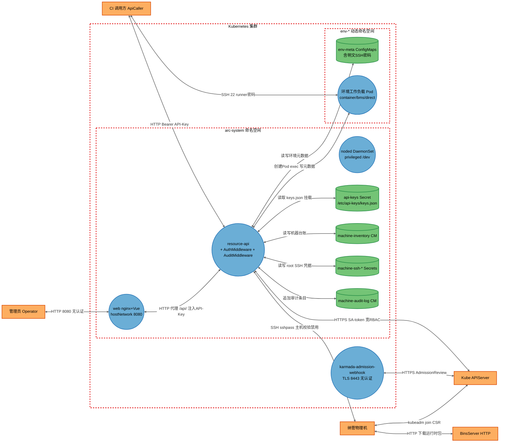
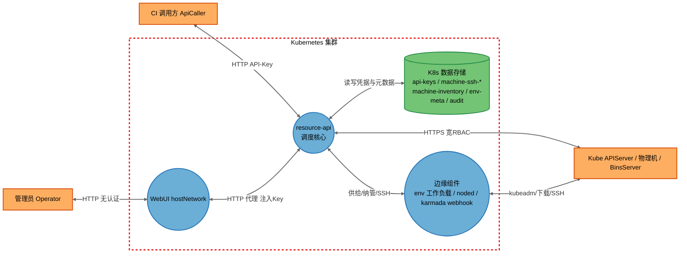
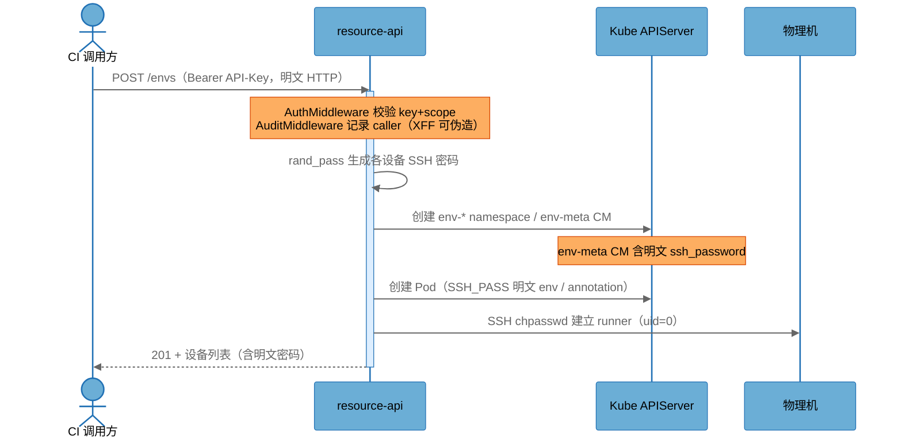

# resource-deploy-core 安全威胁分析报告（master 分支）

> 分析方法：STRIDE-A（STRIDE + Abuse）威胁建模 · Zero Trust 原则 · 纵深防御分析
> 依据 skill：threat-model-analyst（Single Analysis Mode）

## 报告元数据

| 项目 | 值 |
|---|---|
| 目标仓库 | `gitcode.com/openlibing/resource-deploy-core` |
| 分析分支 | `master` |
| 基准提交 | `95bb043`（!46 merge feat-code-metrics-scan into master，2026-10-09 17:24:35 +0800） |
| 分析开始 (UTC) | `2026-10-10 01:07:24` |
| 分析完成 (UTC) | `2026-10-10 01:5X:XX`（以最后写入时间为准，见文末） |
| 分析模型 | `GLM-5.3` |
| 部署分类 | `K8S_SERVICE`（Kubernetes Deployment + ClusterIP Service） |
| 分析范围 | `app/`、`deploy/`、`karmada_hook/`、部署清单与脚本；排除 `test/`（仅扫描硬编码凭据）、`.git`、`threat-model-*` |

---

## 1. 执行摘要

resource-deploy-core 是基于 FastAPI 的 Kubernetes 计算资源调度后端，管理容器与物理机资源的申请、分配、回收全生命周期，涉及**SSH 凭据托管、物理机 root 远程执行、闲时共享跨租户复用、SSH Mesh 免密互访**等高敏感能力。

本次分析共识别 **26 个 DFD 元素**（16 进程组件、5 数据存储、3 外部服务、2 外部执行者）、**17 条数据流**，枚举 **56 个 STRIDE-A 威胁**，最终汇总为 **24 项安全发现**（Tier 1：2 项，Tier 2：12 项，Tier 3：10 项）。

**最严重的三个问题：**

1. **FIND-01（Critical，Tier 1）**：Web 管理界面以 `hostNetwork` 方式无认证暴露在节点网络，并将拥有完整权限的 API Key 通过 nginx `sub_filter` 注入到每个 HTML 页面——任何能访问节点 8080 端口的未认证攻击者即可获得对整个资源调度系统的完全控制权（创建特权负载、纳管/接管物理机）。
2. **FIND-03（High，Tier 2）**：物理机以 `runner`（`uid=0`）+ bms Pod 特权（hostPID/hostIPC + `nsenter` 进宿主 PID 1）交付，环境使用者即拥有物理机 root 权限；闲时共享剥离后残留篡改将影响下一租户。
3. **FIND-05（High，Tier 2）**：SSH 密码以明文形式多渠道存储与暴露（env-meta ConfigMap、Pod annotation `arc.local/ssh-password`、容器 `SSH_PASS` 环境变量、API 响应回显），任何具备相应读权限的主体均可获取。

> **Note on threat counts:** 威胁总数 56 = Spoofing 9 + Tampering 14 + Repudiation 3 + Information Disclosure 11 + Denial of Service 3 + Elevation of Privilege 10 + Abuse 6。其中 Tier 1（无前提直接暴露）4 个、Tier 2（单一前提）34 个、Tier 3（多重前提/纵深防御）18 个。N/A 类别不计入总数。

---

## 2. 系统架构概述

### 2.1 系统目的与边界

系统对外提供容器环境（container/bms/direct 三类设备）与资源租约的 REST API（`POST /api/v1/envs`、`POST /api/v1/leases`、机器纳管 `/api/v1/machines`、管理接口 `/api/v1/admin/*`），在 K8s 集群中动态创建 `env-*` 命名空间与工作负载，通过 SSH（`sshpass`）以 root 身份纳管与初始化物理机，并以 ConfigMap（`machine-inventory`）作为机器台账、K8s Secret（`machine-ssh-*`）托管机器 SSH root 凭据。

### 2.2 关键组件表

| 组件 ID | 类型 | 锚点（代码工件） | 职责 |
|---|---|---|---|
| ResourceApi | 进程 | `app/main.py`（Deployment `resource-api`） | FastAPI 入口、路由、CORS、生命周期与后台线程 |
| AuthMiddleware | 进程 | `app/core/auth.py`（KeyStore + scope 规则） | API Key 鉴权与 scope 授权 |
| AuditMiddleware | 进程 | `app/core/audit.py` | 结构化审计日志（stdout JSON） |
| MachineSvc | 进程 | `app/services/machine_svc.py` | 机器台账、SSH 凭据托管、纳管/清理、审计日志 |
| ProvisionSvc | 进程 | `app/services/provision_svc.py` | 环境供给、Pod 创建、SSH 初始化、env-meta 维护 |
| LeaseSvc | 进程 | `app/services/lease_svc.py` | 租约生命周期、lease Pod 创建与密码交付 |
| JoinSvc | 进程 | `app/services/join_svc.py` | 物理机纳管流程（SSH 探测→安装→kubeadm join） |
| AdminSvc | 进程 | `app/services/admin_svc.py` | join 命令生成（bootstrap token）、CSR 审批、节点标签 |
| SshMeshSvc | 进程 | `app/services/ssh_mesh_svc.py` | SSH Mesh 密钥生成/注册（同组容器免密互访） |
| IdleShareSvc | 进程 | `app/services/idle_share_svc.py` | 闲时共享 reconciler（空闲机器加入/剥离集群） |
| DetachSvc | 进程 | `app/services/detach_svc.py` | 共享机器剥离（cordon/drain/清 kubelet） |
| CleanupTask | 进程 | `app/tasks/cleanup.py` + `cleanup_leader_svc.py` | TTL 过期清理（K8s Lease 选主，fail-closed） |
| K8sClient | 进程 | `app/repository/client.py` | K8s 客户端（in-cluster SA，ClusterRole `resource-api-role`） |
| WebUI | 进程 | `deploy/web/`（Deployment `web`，nginx+Vue） | 管理界面，hostNetwork:8080，代理 `/api/` 并注入 API Key |
| KarmadaWebhook | 进程 | `karmada_hook/webhook/main.go` | Karmada 准入 webhook（:8443 TLS） |
| NodedDaemonSet | 进程 | `deploy/deploy.yaml`（DaemonSet `noded`） | 节点代理（privileged + /dev 挂载） |
| MachineInventoryCM | 数据存储 | `app/repository/cm_repo.py`（ConfigMap `machine-inventory`） | 机器/池/实验室台账 |
| MachineSshSecrets | 数据存储 | `machine_svc.py:155-178`（Secret `machine-ssh-*`） | 机器 SSH root 密码、runner 暂存密码 |
| EnvMetaCMs | 数据存储 | `provision_svc.py:1214-1219`（各 env 命名空间 ConfigMap `env-meta`） | 环境元数据（**含明文 SSH 密码**） |
| ApiKeysSecret | 数据存储 | `deploy/deploy.yaml:171-173`（Secret 挂载 `/etc/api-keys/keys.json`） | API Key→caller/scope/expires 映射 |
| MachineAuditLogCM | 数据存储 | `machine_svc.py:2360-2407`（ConfigMap `machine-audit-log`） | 机器操作审计（上限 1000 条） |
| KubeAPIServer | 外部服务 | 平台 | 集群 API（RBAC、CSR 审批、etcd） |
| ManagedMachines | 外部服务 | `machine_svc._ssh_exec`/`join_svc._ssh` | 纳管物理机（root SSH、kubeadm join） |
| BinsServer | 外部服务 | `deploy/join-ai-node.sh:37`、`settings.bins_server` | 运行时二进制分发（HTTP，默认 `http://10.0.2.49:8081`） |
| Operator | 外部执行者 | `deploy/web/` 使用者 | 管理员（浏览器访问 WebUI） |
| ApiCaller | 外部执行者 | `Authorization: Bearer` 调用方 | CI/自动化系统（API Key 调用） |

注：`app/api/*` 路由、`app/core/policy.py`、`app/core/utils.py`、`app/repository/{pod_repo,node_repo,ns_repo}.py` 为上述进程组件的内部实现，不单列 DFD 节点；Policy/NetworkPolicy 逻辑在威胁分析中纳入 ProvisionSvc/ResourceApi 审视。

### 2.3 部署分类与组件暴露表（Binding）

**部署分类：`K8S_SERVICE`**（`deploy/deploy.yaml`：Deployment `resource-api` + ClusterIP Service；Web Deployment 额外 `hostNetwork: true`）。

| 组件 | 监听地址 | 认证屏障 | 外部可达性 | 最低利用前提 | 推导层级 |
|---|---|---|---|---|---|
| ResourceApi | ClusterIP :8080 | API Key（Bearer）+ scope | 集群内 / 经 WebUI 代理 | Authenticated User | T2 |
| WebUI | hostNetwork :8080（节点 IP 直达） | **无** | 任何可路由到节点网段的主体 | **None** | **T1** |
| KarmadaWebhook | Pod 网络 :8443 | 仅 TLS，无调用方认证 | 集群内（假设 ClusterIP） | Internal Network | T2 |
| EnvPods | Pod 网络 :22（sshd） | SSH 密码（明文传输） | 集群内 / 经 jump host | Internal Network | T2 |
| NodedDaemonSet | 无监听（节点代理） | — | — | Host/OS Access | T3 |
| ManagedMachines | sshd :22 | root 密码（长期不轮换） | 内网 | Internal Network | T2 |

该表为前提下限：任何威胁/发现的利用前提不得低于其组件在此表中的下限。

### 2.4 信任边界与数据流图（DFD）

**汇总视图（元素聚合）：**

### 2.5 数据流表（双向流：请求-响应对计为一条）

| 流 ID | 源 → 目标 | 协议/内容 | 安全属性 |
|---|---|---|---|
| DF01 | ApiCaller <--> ResourceApi | HTTP，Bearer API-Key（`app/core/auth.py:148-174`） | 无 TLS；key 即身份 |
| DF02 | Operator <--> WebUI | HTTP :8080（`deploy/web/deploy.yaml:24,69` hostNetwork） | **无认证、无 TLS** |
| DF03 | WebUI <--> ResourceApi | HTTP 代理 `/api/`（`nginx.conf.template:14-19`） | 明文集群内；API-Key 经页面注入 |
| DF04 | ResourceApi <--> KubeAPIServer | HTTPS，in-cluster SA token（`repository/client.py:17-24`） | ClusterRole 过宽（`deploy.yaml:42-78`） |
| DF05 | ResourceApi <--> ApiKeysSecret | 文件挂载读取 keys.json | Secret 仅 base64，无完整性校验 |
| DF06 | ResourceApi <--> MachineInventoryCM | K8s API 读写台账 | 5s 本地缓存（`auth.py:51-61`）；无租户隔离 |
| DF07 | ResourceApi <--> MachineSshSecrets | K8s API 读写 root 密码/runner 暂存密码 | 密码无轮换 |
| DF08 | ResourceApi <--> MachineAuditLogCM | 追加审计（上限 1000 条） | 无 CAS，可多副本覆盖 |
| DF09 | ResourceApi <--> EnvMetaCMs | 读写环境元数据（**含明文 ssh_password**） | 明文凭据落 CM |
| DF10 | ResourceApi <--> EnvPods | exec（`sh -c` 初始化）/ 创建 Pod | bms Pod 恒 privileged+nsenter |
| DF11 | ResourceApi <--> ManagedMachines | SSH（`sshpass`，`StrictHostKeyChecking=no`） | 主机校验禁用；root 执行 |
| DF12 | KarmadaWebhook <--> KubeAPIServer | HTTPS AdmissionReview（`webhook/main.go:514-529`） | 无调用方认证 |
| DF13 | ManagedMachines <--> KubeAPIServer | kubeadm join / CSR | CSR 无条件批准（`admin_svc.py:142-169`） |
| DF14 | ManagedMachines <--> BinsServer | HTTP 下载运行时包（`join-ai-node.sh:365-370`） | 无 TLS；ascend 包无哈希校验 |
| DF15 | ApiCaller <--> EnvPods | SSH :22（runner 密码，`policy.py:43-91` 放行） | 密码明文交付；runner uid=0 |
| DF16 | NodedDaemonSet <--> KubeAPIServer | DaemonSet 常驻上报 | privileged + /dev 挂载 |
| DF17 | Operator <--> WebUI（JoinWizard） | SSH 密码输入 | 明文存 localStorage（`JoinWizard.vue:51-53`） |

### 2.6 关键安全流程（时序：环境创建 + 密码流）

### 2.7 安全基础设施盘点

| 类别 | 是否存在 | 证据与效果 |
|---|---|---|
| 认证 | 部分 | API Key + scope（`auth.py`）；WebUI **无**用户级认证；webhook **无**调用方认证 |
| 授权 | 部分 | scope 前缀匹配；但无资源归属（IDOR 面）；scope 未匹配路由 fail-open（`auth.py:134`） |
| 网络隔离 | 部分 | env 间 NetworkPolicy（`policy.py:18-123`）；但 egress `0.0.0.0/0` 全放行、executor 标签跨命名空间信任 |
| 密钥管理 | 缺失 | 无 Vault/外部密钥管理；Secret 仅 base64；无轮换机制 |
| 审计 | 部分 | stdout JSON + machine-audit-log CM；无防篡改、无告警外送 |
| TLS | 缺失 | 全链路 HTTP（API/WebUI/BinsServer/代理）；仅 K8s SDK 与 webhook TLS |
| 容器加固 | 部分 | template 版有 runAsNonRoot+dropALL（`deploy.yaml.template:160-168`）；**git 版 deploy.yaml 无 securityContext** |
| 供应链 | 缺失 | 无镜像签名校验；HTTP 下载无哈希（部分包有 SHA256：`runtime_prepare_svc.py:236-237`）；依赖无 lockfile |

---

## 3. STRIDE-A 威胁分析

### 3.0 威胁汇总表

> 前提取值枚举：`None` / `Authenticated User` / `Privileged User` / `Internal Network` / `Local Process Access` / `Host/OS Access` / `Admin Credentials` / `{Component} Compromise`。层级：T1（无前提）/ T2（单一前提）/ T3（多重前提或纵深防御）。

| # | 组件 | S | T | R | I | D | E | A | T1 | T2 | T3 | 合计 |
|---|---|---|---|---|---|---|---|---|---|---|---|---|
| 1 | ResourceApi | 1 | 0 | 0 | 1 | 1 | 0 | 1 | 2 | 2 | 0 | 4 |
| 2 | AuthMiddleware | 1 | 0 | 0 | 0 | 0 | 1 | 1 | 0 | 2 | 1 | 3 |
| 3 | AuditMiddleware | 0 | 1 | 2 | 1 | 0 | 0 | 0 | 0 | 3 | 1 | 4 |
| 4 | MachineSvc | 0 | 1 | 0 | 1 | 0 | 1 | 0 | 0 | 2 | 1 | 3 |
| 5 | ProvisionSvc | 0 | 2 | 0 | 1 | 1 | 1 | 1 | 0 | 5 | 1 | 6 |
| 6 | LeaseSvc | 1 | 1 | 0 | 2 | 0 | 1 | 1 | 0 | 5 | 1 | 6 |
| 7 | JoinSvc | 0 | 1 | 0 | 1 | 0 | 0 | 1 | 0 | 1 | 2 | 3 |
| 8 | AdminSvc | 0 | 0 | 0 | 0 | 0 | 2 | 0 | 0 | 2 | 0 | 2 |
| 9 | SshMeshSvc | 1 | 0 | 0 | 0 | 0 | 1 | 0 | 0 | 1 | 1 | 2 |
| 10 | IdleShareSvc | 0 | 0 | 0 | 0 | 0 | 0 | 1 | 0 | 1 | 0 | 1 |
| 11 | DetachSvc | 1 | 0 | 0 | 0 | 0 | 0 | 0 | 0 | 1 | 0 | 1 |
| 12 | CleanupTask | 0 | 1 | 0 | 0 | 0 | 0 | 0 | 0 | 0 | 1 | 1 |
| 13 | K8sClient | 0 | 0 | 0 | 0 | 0 | 1 | 0 | 0 | 0 | 1 | 1 |
| 14 | WebUI | 1 | 1 | 0 | 1 | 1 | 0 | 0 | 2 | 1 | 1 | 4 |
| 15 | KarmadaWebhook | 1 | 1 | 0 | 1 | 0 | 0 | 0 | 0 | 3 | 0 | 3 |
| 16 | NodedDaemonSet | 0 | 1 | 0 | 0 | 0 | 1 | 0 | 0 | 0 | 2 | 2 |
| 17 | MachineInventoryCM | 0 | 1 | 0 | 0 | 0 | 0 | 0 | 0 | 1 | 0 | 1 |
| 18 | MachineSshSecrets | 0 | 0 | 0 | 1 | 0 | 1 | 0 | 0 | 0 | 2 | 2 |
| 19 | EnvMetaCMs | 0 | 0 | 0 | 1 | 0 | 0 | 0 | 0 | 1 | 0 | 1 |
| 20 | ApiKeysSecret | 0 | 1 | 0 | 0 | 0 | 0 | 0 | 0 | 0 | 1 | 1 |
| 21 | MachineAuditLogCM | 0 | 0 | 1 | 0 | 0 | 0 | 0 | 0 | 0 | 1 | 1 |
| 22 | KubeAPIServer | 1 | 0 | 0 | 0 | 0 | 0 | 0 | 0 | 1 | 0 | 1 |
| 23 | ManagedMachines | 1 | 1 | 0 | 0 | 0 | 0 | 0 | 0 | 1 | 1 | 2 |
| 24 | BinsServer | 0 | 1 | 0 | 0 | 0 | 0 | 0 | 0 | 1 | 0 | 1 |
| — | **合计** | **9** | **14** | **3** | **11** | **3** | **10** | **6** | **4** | **34** | **18** | **56** |

状态说明：`Open` = 已立项发现；未列出的 N/A 类别在各组件小节中说明理由。

### 3.1 ResourceApi（`app/main.py`，Deployment `resource-api`）

Pod 共置：AuthMiddleware、AuditMiddleware、SecurityHeadersMiddleware 同进程；api-keys Secret 以只读卷挂载（`deploy.yaml:171-173,196-198`）。

| ID | 类别 | 威胁 | 前提 | 层级 | 状态 |
|---|---|---|---|---|---|
| T01 | S | API Key 经 WebUI 无认证泄露（见 T38），攻击者可冒充任意 caller 调用全部 API | None | T1 | Open → FIND-01 |
| T02 | I | `/docs`、`/openapi.json`、`/redoc` 免认证（`auth.py:64` `_EXEMPT_PATHS`），暴露完整 API 结构与参数 | None（经集群内/代理） | T1 | Open → FIND-14 |
| T03 | D | 无速率限制、无请求体大小限制（全仓库未见图鉴/中间件），直连可资源耗尽 | Internal Network | T2 | Open → FIND-02 |
| T04 | A | `extend_annotations` 任意注解透传至 K8s 对象（`envs.py:202`，未清洗），可干扰控制器行为（如 NRI/webhook 钩子注解） | Authenticated User | T2 | Open → FIND-04 |

N/A：**R** — AuditMiddleware 记录 caller/method/path/status（`audit.py:48-57`），请求级可追溯；**T** — 请求体经 Pydantic/显式校验，主入口无直接不可信反序列化；**E** — 提权由 AuthMiddleware scope 控制（见 3.2）。

### 3.2 AuthMiddleware（`app/core/auth.py`）

| ID | 类别 | 威胁 | 前提 | 层级 | 状态 |
|---|---|---|---|---|---|
| T05 | S | API Key 查找用 dict 直接比对（`auth.py:30-34`），无恒时比较，存在时序侧信道（弱） | Local Process Access | T3 | Open → FIND-24 |
| T06 | E | `_check_scope` 对未匹配规则的路由直接放行（`auth.py:134` "未匹配任何规则 → 放行"），fail-open 设计：未来新增路由漏配 scope 即无授权暴露 | Authenticated User | T2 | Open → FIND-21 |
| T07 | A | scope 模型只有功能权限、无资源归属：`request.state.caller` 已采集（`auth.py:170`）但全仓库未用于归属校验，任何持相应 scope 的 key 可操作他人资源 | Authenticated User | T2 | Open → FIND-06 |

N/A：**T** — keys.json 只读挂载且 5s TTL 缓存（`auth.py:51-61`），撤销延迟可接受；**I** — key 不回显；**D** — KeyStore 加载失败保留旧缓存（`auth.py:59-60`），无崩溃面；**R** — 鉴权成功/失败均审计。

### 3.3 AuditMiddleware（`app/core/audit.py`）

| ID | 类别 | 威胁 | 前提 | 层级 | 状态 |
|---|---|---|---|---|---|
| T08 | R | `client_ip` 取自 `X-Forwarded-For` 头（`audit.py:44-46`），调用方可任意伪造审计归因 | Authenticated User | T2 | Open → FIND-20 |
| T09 | R | 高危请求体仅覆盖 4 个前缀（`audit.py:10-15`），`POST /machines`（纳管，含 root 密码）等关键操作不记 body，操作不可复核 | Authenticated User | T2 | Open → FIND-20 |
| T10 | I | `_redact_body` 仅脱敏顶层 `ssh_password/ssh_pubkey`（`audit.py:17-34`），嵌套结构中的凭据将以明文进入日志 | Authenticated User | T2 | Open → FIND-20 |
| T11 | T | 审计条目写 ConfigMap 无 resourceVersion CAS（`machine_svc.py:2360-2407`），多副本并发互相覆盖丢条目 | Local Process Access | T3 | Open → FIND-22 |

N/A：**S/D/E/A** — 中间件只读记录，无控制决策面。

### 3.4 MachineSvc（`app/services/machine_svc.py`）

| ID | 类别 | 威胁 | 前提 | 层级 | 状态 |
|---|---|---|---|---|---|
| T12 | I | `update_machine` 返回 `m` 未经 `_sanitize_machine`（`machine_svc.py:821` 对比 `:513-521`），台账残留 `runner_password_pending` 字段时 PUT 响应回显明文密码 | Authenticated User | T2 | Open → FIND-05 |
| T13 | T | `_finish_cleaning`/userdel 回滚以 f-string 拼接台账字段 `allocated_runner_user`（`:2096-2103,2245-2250`），台账被篡改即可远端命令注入（当前上游有校验，纵深缺失） | Admin Credentials（台账写） | T3 | Open → FIND-19 |
| T14 | E | 机器预占/剥离无 env 归属校验：`preallocate_machine`/`mark_detaching`（`:1733-1875`）由调用方传 `env_id/lease_id`，任何 `envs:write` 可为任意 env 预占任意机器 | Authenticated User | T2 | Open → FIND-06 |

N/A：**S** — SSH 凭据校验失败仅返回错误（有凭据托管，冒充面在 Secret 泄露，见 3.18）；**R** — 机器操作有 machine-audit-log（`get_audit_log`）；**I** — `list_machines`/`get_machine` 均经 `_sanitize_machine`；**D** — SSH 命令有超时与列表参数（`:73-127`）；**A** — 状态机流转全 CAS 复验。

### 3.5 ProvisionSvc（`app/services/provision_svc.py`，含 `pod_repo.py`）

| ID | 类别 | 威胁 | 前提 | 层级 | 状态 |
|---|---|---|---|---|---|
| T15 | I | 各设备 `ssh_password` 明文写入 env-meta ConfigMap（`provision_svc.py:1214-1219` → `cm_repo.py:146-149`；`_strip_sensitive:2192-2225` 仅用于 API 响应）与 Pod `SSH_PASS` env（`pod_repo.py:330,535`） | Authenticated User | T2 | Open → FIND-05 |
| T16 | T | `sshpass -p <密码>` 以进程参数传递（`provision_svc.py:282-286`），密码暴露于同节点 `/proc/PID/cmdline` | Local Process Access | T3 | Open → FIND-16 |
| T17 | T | `env_cm_yaml` f-string 拼 YAML（`utils.py:409-434`）：`groups/extend_labels` 单引号包裹的 JSON 不转义 `'`，`name/topology` 双引号字段含引号+换行可逃逸 → ConfigMap 字段注入（`yaml.safe_load` 后 patch，可污染 metadata 等） | Authenticated User | T2 | Open → FIND-12 |
| T18 | E | bms 设备 Pod 恒 `privileged` + hostNetwork/hostPID/hostIPC 全开 + `nsenter -t 1` 宿主执行（`pod_repo.py:741-757`），`envs:write` 即可获得物理机宿主 root | Authenticated User | T2 | Open → FIND-03 |
| T19 | D | 并发创建 namespace/Pod 无配额限制（`ensure_namespace` 循环 `envs.py:215-253`），可耗尽集群资源 | Authenticated User | T2 | Open → FIND-02 |
| T20 | A | `parse_ttl` 无上限（`utils.py:24-30`，如 "999999d"），资源可被无限期占用绕过回收 | Authenticated User | T2 | Open → FIND-02 |

N/A：**R** — 环境事件有 env_history 记录（`env_history_svc`）；**S** — provision 由 caller 身份经 AuthMiddleware 传递（`requester` 记录，`envs.py:190`）。

### 3.6 LeaseSvc（`app/services/lease_svc.py`）

| ID | 类别 | 威胁 | 前提 | 层级 | 状态 |
|---|---|---|---|---|---|
| T21 | E | `DELETE /leases/{id}` 无归属校验（`leases.py:66-71` 直接 `release_lease`），任何 `leases:write` 可释放他人 lease | Authenticated User | T2 | Open → FIND-06 |
| T22 | I | `get_lease` 首次查询即取走 `runner_password_pending`（`lease_svc.py:1164-1167`），任何 `leases:read` 先查询即偷走一次性密码 | Authenticated User | T2 | Open → FIND-05 |
| T23 | A | `image` 无 allowlist（`lease_svc.py:214`）、`command/env` 自由注入容器（`pod_repo.py:327,532`；`PermitUserEnvironment yes` `lease_svc.py:409-422`）→ 任意镜像/任意代码执行载体 | Authenticated User | T2 | Open → FIND-04 |
| T24 | S | runner 账户被 `usermod -ou 0`（`lease_svc.py:400`）+ `PermitRootLogin yes`（`:409-410`），SSH runner 即等效 root | Authenticated User | T2 | Open → FIND-03 |
| T25 | I | machine lease 密码明文写 Pod annotation `arc.local/ssh-password`（`pod_repo.py:734`），且 `get_leases/get_lease` 响应直接返回（`lease_svc.py:1067,1192`） | Authenticated User | T2 | Open → FIND-05 |
| T26 | T | `shlex.quote(ssh_pass)` 嵌入 `python3 -c "...'{}'..."` 内层单引号（`lease_svc.py:398`）——嵌套引号模式脆弱（当前密码恒为字母数字暂不可注入） | LeaseSvc Compromise（输入源被改变） | T3 | Open → FIND-19 |

N/A：**R** — lease 操作经审计中间件记录；**D** — Pod 资源有 requests/limits 校验（`utils.resolve_resources`）。

### 3.7 JoinSvc（`app/services/join_svc.py`）

| ID | 类别 | 威胁 | 前提 | 层级 | 状态 |
|---|---|---|---|---|---|
| T27 | T | `f"hostnamectl set-hostname {machine_name}"` 未引用拼接（`join_svc.py:877`；上游 `create_machine` 有 `^[a-z0-9.-]{1,253}$` 校验 `machine_svc.py:633`，但本层无防护，纵深缺失） | Host/OS Access | T3 | Open → FIND-19 |
| T28 | I | `sshpass -p <密码>` argv 传递（`join_svc.py:54-58`），密码暴露于目标机 `/proc`；diag 日志仅 token 前 6 位（`:1042`）尚可 | Local Process Access | T3 | Open → FIND-16 |
| T29 | A | `POST /admin/join-node` 接收任意 `node_ip` + root 密码（`admin.py:103-113`），纳管能力可被滥用于对内网任意主机自动化横向渗透 | Privileged User | T2 | Open → FIND-08 |

N/A：**S** — join 以 root 密码认证目标机（凭据面见 3.23）；**R** — join 步骤状态写 ConfigMap（`:291-294`）；**D** — join 线程有超时与失败标记；**E** — API 层要求 `admin:write`。

### 3.8 AdminSvc（`app/services/admin_svc.py`）

| ID | 类别 | 威胁 | 前提 | 层级 | 状态 |
|---|---|---|---|---|---|
| T30 | E | `GET /admin/join-command` 对 `admin:read` 返回含有效 bootstrap token 的 `kubeadm join` 命令（`admin_svc.py:106-117`）——持有只读管理 scope 的 key 即可将任意机器加入集群 | Authenticated User | T2 | Open → FIND-08 |
| T31 | E | `approve_csr` 不校验 CSR 的 CN/O/请求者身份即批准（`admin_svc.py:142-157`）；`approve_all_csrs` 批量放行全部 pending CSR（`:160-169`）→ 伪造 CSR 即可获批 kubelet 证书入集群 | Privileged User | T2 | Open → FIND-07 |

N/A：**S/T/R/I/D/A** — 其余为标签读写（经 `sanitize_label_value` 清洗）与只读巡检。

### 3.9 SshMeshSvc（`app/services/ssh_mesh_svc.py`）

| ID | 类别 | 威胁 | 前提 | 层级 | 状态 |
|---|---|---|---|---|---|
| T32 | S | mesh group/env 隔离仅按 label 过滤（`:366-369`），可写标签的调用方可改 `arc.local/env-id`/group 标签实现跨组互访（免密 SSH） | Privileged User（标签写） | T2 | Open → FIND-10 |
| T33 | E | 快照锁仅进程内 threading（`:37`，注释自认单 Worker），多副本部署下并发注册竞态丢快照/错配 authorized_keys | Local Process Access | T3 | Open → FIND-22 |

N/A：**T** — 注入内容经单行/IP 校验（`:83-96`）+ `shlex.quote`（`:207-262`）；**I** — 私钥仅存容器内，快照只含公钥/hostkey（`:158-159`）；**D** — 注册有超时（`settings.ssh_mesh_enroll_timeout`）；**A** — scope 参数枚举校验（`envs.py:206-207`）。

### 3.10 IdleShareSvc（`app/services/idle_share_svc.py`）

| ID | 类别 | 威胁 | 前提 | 层级 | 状态 |
|---|---|---|---|---|---|
| T34 | A | 共享机器曾以 runner(uid=0) 运行不可信 env 工作负载，剥离后不做重置/重装直接回池（cordon/drain/清 kubelet，`detach_svc.py:558-631`），上一租户残留篡改（持久化、镜像替换、密钥植入）影响下一租户 | Authenticated User | T2 | Open → FIND-03 |

N/A：**S/T/R/I/D/E** — reconciler 状态流转全 CAS + 锁 owner+TTL+探活（`:80-104,249-265`），保护完备。

### 3.11 DetachSvc（`app/services/detach_svc.py`）

| ID | 类别 | 威胁 | 前提 | 层级 | 状态 |
|---|---|---|---|---|---|
| T35 | S | `_ssh_exec` 使用 `StrictHostKeyChecking=no` + `UserKnownHostsFile=/dev/null`（`machine_svc.py:113-114`，detach/provision/join 同款），DNS 劫持/ARP 欺骗可 MITM 冒充物理机 | Internal Network | T2 | Open → FIND-13 |

N/A：**T** — drain/清理命令为固定常量拼接（`:416-424`）无用户输入；**R/I/D/E/A** — 三阶段剥离协议复验归属（`machine_svc.py:1853-1861`），密码经 Secret 暂存交付（`:192-250`）。

### 3.12 CleanupTask（`app/tasks/cleanup.py`）

| ID | 类别 | 威胁 | 前提 | 层级 | 状态 |
|---|---|---|---|---|---|
| T36 | T | namespace 删除仅靠应用层 `startswith("env-")` 前缀自律（`provision_svc.py:1557,1833,3580`），`ns_repo.delete_namespace` 本身无校验且吞异常（`ns_repo.py:25-29`），RBAC `namespaces delete` 无 resourceNames 限制（`deploy.yaml:76-78`）——防线单点 | ResourceApi Compromise | T3 | Open → FIND-15 |

N/A：**S/R/I/D/E/A** — K8s Lease 选主 + 心跳 fail-closed（`cleanup.py:39-72`、`cleanup_leader_svc.py:73-96`），实现规范。

### 3.13 K8sClient（`app/repository/client.py`）

| ID | 类别 | 威胁 | 前提 | 层级 | 状态 |
|---|---|---|---|---|---|
| T37 | E | SA `resource-api` 绑定 ClusterRole `resource-api-role`：全集群 pods 全动词（含 exec）、nodes patch/update/delete、namespaces delete（`deploy.yaml:42-78`）；template 版另含 **secrets 全权限**（`deploy.yaml.template:64-67`）——SA 凭据泄露/组件失陷即集群级接管 | ResourceApi Compromise | T3 | Open → FIND-15 |

N/A：**T** — SDK 默认 TLS 校验（`client.py:21-23`，无 verify=False）；**S/R/I/D/A** — 无自主控制面。

### 3.14 WebUI（`deploy/web/`，Deployment `web`）

| ID | 类别 | 威胁 | 前提 | 层级 | 状态 |
|---|---|---|---|---|---|
| T38 | S | `hostNetwork: true`（`deploy/web/deploy.yaml:24,69`）+ nginx 无认证监听 :8080，API Key 经 `sub_filter` 注入每个 HTML（`nginx.conf.template:6-8`、`index.html:7`、`generate-config.sh:53-57`）——未认证攻击者打开页面即获全权 key | None | T1 | Open → FIND-01 |
| T39 | I | JoinWizard 将 SSH 密码明文存 localStorage（`JoinWizard.vue:51-53`），共享主机/XSS 可窃取 | Host/OS Access | T3 | Open → FIND-23 |
| T40 | D | Web 无速率限制/连接限制，未认证即可打满节点 8080 端口（影响同节点其他 hostNetwork 服务） | None | T1 | Open → FIND-02 |
| T41 | T | nginx 明文代理后端、`server_tokens` 未关闭、仅传 Host/X-Real-IP 缺 X-Forwarded-For/Proto（`nginx.conf.template:1-20`），代理层可被注入/欺骗 | Internal Network | T2 | Open → FIND-11 |

N/A：**R/E/A** — 前端为静态资源 + 代理，无服务端状态。

### 3.15 KarmadaWebhook（`karmada_hook/webhook/main.go`）

| ID | 类别 | 威胁 | 前提 | 层级 | 状态 |
|---|---|---|---|---|---|
| T42 | S | webhook 仅启用 TLS、无任何调用方认证（`main.go:426-499,514-529`），集群内可达的任意 Pod 可伪造 AdmissionReview 篡改调度策略 | Internal Network | T2 | Open → FIND-09 |
| T43 | T | `io.ReadAll`/`json.Unmarshal` 错误被忽略（`:427-436`），畸形请求可触发未定义行为/探测 | Internal Network | T2 | Open → FIND-09 |
| T44 | I | 拒绝信息回带 Karmada API 查询结果（`:438` 由 namespace 推导 clusterName），可用于探测集群资源拓扑 | Internal Network | T2 | Open → FIND-14 |

N/A：**R/D/E/A** — 单一 mutate 端点，无状态、无持久化。

### 3.16 NodedDaemonSet（`deploy/deploy.yaml` DaemonSet `noded`）

| ID | 类别 | 威胁 | 前提 | 层级 | 状态 |
|---|---|---|---|---|---|
| T45 | E | `privileged: true` + 挂载 `/dev`（`deploy.yaml:298-299,330-333`），Pod 失陷即节点接管 | NodedDaemonSet Compromise | T3 | Open → FIND-18 |
| T46 | T | 镜像无签名/校验机制，恶意的/被替换的镜像将直接以特权运行 | BinsServer Compromise | T3 | Open → FIND-17 |

N/A：**S/R/I/D/A** — 平台托管组件，无自主输入面。

### 3.17 MachineInventoryCM（ConfigMap `machine-inventory`）

| ID | 类别 | 威胁 | 前提 | 层级 | 状态 |
|---|---|---|---|---|---|
| T47 | T | 台账（labs/pools/machines JSON，`cm_repo.py:795-810`）可被有写权限调用方篡改（无签名、审计弱联动），篡改后驱动命令拼接（见 T13）与错误分配 | Authenticated User | T2 | Open → FIND-20 |

N/A：**S/R/I/D/E/A** — 纯数据存储；密码字段已确认不入台账（`machine_svc.py:683-700`）。

### 3.18 MachineSshSecrets（Secret `machine-ssh-*`）

| ID | 类别 | 威胁 | 前提 | 层级 | 状态 |
|---|---|---|---|---|---|
| T48 | I | Secret 仅 base64（etcd 未确认加密），任何 secrets 读权限主体可获取全部机器 root 凭据 | Admin Credentials / etcd 访问 | T3 | Open → FIND-05 |
| T49 | E | template 版 RBAC 赋予 SA secrets 全权限（`deploy.yaml.template:64-67`），配合组件失陷可读取任意 Secret 提权 | ResourceApi Compromise | T3 | Open → FIND-15 |

N/A：**S/T/R/D/A** — 写入有 `_save_machine_ssh_secret`/删除有 `delete_machine` 联动（`:181-189,1004-1007`）。

### 3.19 EnvMetaCMs（ConfigMap `env-meta`）

| ID | 类别 | 威胁 | 前提 | 层级 | 状态 |
|---|---|---|---|---|---|
| T50 | I | env-meta data 含各设备明文 `ssh_password`（`provision_svc.py:1214-1219`），任何 ConfigMap 读权限主体（含任何 `envs:read` 经 API 组装路径）可获取 | Authenticated User | T2 | Open → FIND-05 |

N/A：**S/T/R/D/E/A** — 由 API 单点写入，CAS patch。

### 3.20 ApiKeysSecret（`/etc/api-keys/keys.json`）

| ID | 类别 | 威胁 | 前提 | 层级 | 状态 |
|---|---|---|---|---|---|
| T51 | T | keys.json 挂载无签名/校验，容器内任意写入（宿主挂载或 exec）可静默植入新 API Key 持久化后门 | Local Process Access | T3 | Open → FIND-15 |

N/A：**S/R/I/D/E/A** — 只读卷挂载（`deploy.yaml:171-173`），5s TTL 热加载支持撤销。

### 3.21 MachineAuditLogCM（ConfigMap `machine-audit-log`）

| ID | 类别 | 威胁 | 前提 | 层级 | 状态 |
|---|---|---|---|---|---|
| T52 | R | 审计 CM 无防篡改/外部化，具备 CM 写权限者可删改历史条目（1000 条上限覆盖亦可滚动冲掉记录） | Admin Credentials | T3 | Open → FIND-20 |

N/A：**S/T/I/D/E/A** — 只经 `_add_audit_entry` 单点追加。

### 3.22 KubeAPIServer（平台）

| ID | 类别 | 威胁 | 前提 | 层级 | 状态 |
|---|---|---|---|---|---|
| T53 | S | 配合本系统 CSR 无条件批准策略（T31），伪造 kubelet 身份可入集群——平台侧依赖本系统审批质量 | Privileged User | T2 | Open → FIND-07 |

N/A：**T/R/I/D/E/A** — apiserver TLS/RBAC/审计由平台承担（平台缓解，不计威胁）。

### 3.23 ManagedMachines（纳管物理机）

| ID | 类别 | 威胁 | 前提 | 层级 | 状态 |
|---|---|---|---|---|---|
| T54 | S | 机器 root 凭据长期有效、无自动轮换（仅 `update_machine` 手动更换，`machine_svc.py:817-818`），泄露即持久控制 | Internal Network + 凭据窃取 | T3 | Open → FIND-16 |
| T55 | T | 环境使用者以 runner(uid=0) SSH 使用机器，可植入持久化（cron/systemd/镜像替换），剥离流程不重置系统 | Authenticated User | T2 | Open → FIND-03 |

N/A：**R/I/D/E/A** — 机器为被管理目标，遥测与状态由系统侧维护。

### 3.24 BinsServer（`settings.bins_server`）

| ID | 类别 | 威胁 | 前提 | 层级 | 状态 |
|---|---|---|---|---|---|
| T56 | T | 运行时包经明文 HTTP 下载（`join-ai-node.sh:37,365-370`，默认 `http://10.0.2.49:8081`），ascend-docker-runtime.tar.gz 无哈希校验（containerd 包有 SHA256：`runtime_prepare_svc.py:236-237`），MITM/服务器失陷可替换为恶意载荷以 root 执行 | Internal Network | T2 | Open → FIND-17 |

N/A：**S/R/I/D/E/A** — 单向分发源，URL 来自配置非用户输入（已验证 `join_svc.py:387,474`）。

---

## 4. 安全发现（按可利用性层级组织）

> 通用属性说明：所有 CVSS 为 4.0 基础分；OWASP 映射使用 `:2025` 版本。排序：各层内按 CVSS 降序。

### Tier 1 — 直接暴露（无利用前提）

#### FIND-01: WebUI 无认证暴露并泄露全权 API Key（hostNetwork + sub_filter 注入）

| 属性 | 值 |
|---|---|
| 组件 | WebUI、AuthMiddleware |
| STRIDE 类别 | S（Spoofing）/ I（Information Disclosure） |
| CVSS 4.0 | **9.3** — `CVSS:4.0/AV:N/AC:L/AT:N/PR:N/UI:N/VC:H/VI:H/VA:H/SC:H/SI:L/SA:L` |
| CWE | [CWE-306](https://cwe.mitre.org/data/definitions/306.html): Missing Authentication for Critical Function；[CWE-798](https://cwe.mitre.org/data/definitions/798.html): Use of Hard-coded Credentials |
| OWASP | A01:2025 – Broken Access Control |
| 利用前提 | None |
| 可利用性层级 | **Tier 1** |
| 修复工作量 | Medium |

##### 描述
Web Deployment 使用 `hostNetwork: true` 直接监听节点 8080 端口，nginx 无任何用户级认证；部署脚本将后端 API Key 明文写入 nginx 配置，经 `sub_filter` 注入到每个 HTML 响应的 `window.API_KEY`。任何能路由到节点 IP 的未认证攻击者访问任意页面即获得 API Key，进而以调用方身份执行全部 API（创建特权负载、纳管/接管物理机、审批 CSR）。
##### 证据
`deploy/web/deploy.yaml:24,69`（hostNetwork）；`deploy/web/nginx.conf.template:6-8`（sub_filter）；`deploy/web/index.html:7`（window.API_KEY）；`deploy/generate-config.sh:53-57`（key 写入 nginx.conf）。
##### 修复建议
1) 移除 `hostNetwork`，改 ClusterIP + Ingress 并强制 TLS；2) 前端不持有 API Key——增加服务端会话（登录/OIDC），nginx 仅代理并注入服务端凭据；3) 为 Web 入口增加认证层（oauth2-proxy/SSO）与 IP 白名单。
##### 验证步骤
部署后 `curl http://<node-ip>:8080/` 应返回 401/重定向；页面源码中不应出现 `API_KEY` 字样；`nmap <node-ip>` 确认 8080 不再直接暴露。

#### FIND-02: 无速率限制与资源上限（未认证 DoS / 资源滥用）

| 属性 | 值 |
|---|---|
| 组件 | WebUI、ResourceApi、ProvisionSvc |
| STRIDE 类别 | D（DoS）/ A（Abuse） |
| CVSS 4.0 | **5.9** — `CVSS:4.0/AV:N/AC:L/AT:N/PR:N/UI:N/VC:N/VI:N/VA:H/SC:N/SI:N/SA:N` |
| CWE | [CWE-770](https://cwe.mitre.org/data/definitions/770.html): Allocation of Resources Without Limits；[CWE-400](https://cwe.mitre.org/data/definitions/400.html): Uncontrolled Resource Consumption |
| OWASP | A10:2025 – Mishandling of Exceptional Conditions |
| 利用前提 | None（Web 未认证）；Authenticated User（API 直连） |
| 可利用性层级 | **Tier 1**（Web 入口）；API 侧 T2 |
| 修复工作量 | Low |

##### 描述
Web 入口与 API 均无速率限制、请求体大小限制与并发配额；`POST /envs` 可无限并发创建 namespace/Pod；`parse_ttl` 无上限允许 "999999d" 的超长 TTL 无限期占用资源；未认证攻击者可打满节点 8080（hostNetwork 下殃及同节点其他服务）。
##### 证据
全仓库无 rate-limit 中间件；`app/core/utils.py:24-30`（parse_ttl 无上限）；`app/api/envs.py:215-253`（循环建 ns 无配额）。
##### 修复建议
1) nginx `limit_req`/`limit_conn` + `client_max_body_size`；2) API 侧增加 per-caller 速率限制与 env 数量配额；3) `parse_ttl` 设置最大 TTL 上限（如 30d）。
##### 验证步骤
压测脚本高频请求应返回 429；提交超上限 TTL 应返回 400。

### Tier 2 — 有条件风险（单一前提）

#### FIND-03: 物理机以 root 等效身份交付 + 闲时共享跨租户残留（uid=0 / privileged / nsenter）

| 属性 | 值 |
|---|---|
| 组件 | LeaseSvc、ProvisionSvc、IdleShareSvc、ManagedMachines |
| STRIDE 类别 | E（Elevation of Privilege）/ S / T / A |
| CVSS 4.0 | **8.1** — `CVSS:4.0/AV:A/AC:L/AT:N/PR:L/UI:N/VC:H/VI:H/VA:H/SC:H/SI:H/SA:H` |
| CWE | [CWE-250](https://cwe.mitre.org/data/definitions/250.html): Execution with Unnecessary Privileges；[CWE-269](https://cwe.mitre.org/data/definitions/269.html): Improper Privilege Management |
| OWASP | A06:2025 – Insecure Design |
| 利用前提 | Authenticated User（envs:write / 环境使用者） |
| 可利用性层级 | **Tier 2** |
| 修复工作量 | High（架构调整） |

##### 描述
三条链路叠加：1) runner 账户被 `usermod -ou 0` 提升 uid=0 且 sshd `PermitRootLogin yes`，SSH 即 root；2) bms 设备 Pod 恒 `privileged` + hostNetwork/hostPID/hostIPC + `nsenter -t 1` 宿主执行，环境使用者直接拥有宿主 root；3) 闲时共享机器剥离流程（cordon/drain/清 kubelet）不重置系统，上一租户可植入持久化（cron/镜像替换）影响下一租户。
##### 证据
`app/services/lease_svc.py:400,409-410`；`app/repository/pod_repo.py:741-757`；`app/services/detach_svc.py:558-631`（无重装/重置步骤）。
##### 修复建议
1) 取消 `usermod -ou 0`，runner 使用普通 uid + 受限 sudo 白名单；2) bms Pod 去除 hostPID/hostIPC，nsenter 仅保留必要路径并评估 seccomp；3) 机器回池前执行完整性检查（关键二进制哈希/启动项审计）或重装流程。
##### 验证步骤
SSH 登录 runner 执行 `id` 应非 uid=0；bms Pod 内 `nsenter` 应失败或受限；模拟租户植入 cron 后剥离，验证下一租户开机检测告警。

#### FIND-04: 任意镜像与命令注入工作负载（无 allowlist）

| 属性 | 值 |
|---|---|
| 组件 | LeaseSvc、ProvisionSvc |
| STRIDE 类别 | A（Abuse）/ E |
| CVSS 4.0 | **7.5** — `CVSS:4.0/AV:A/AC:L/AT:N/PR:L/UI:N/VC:H/VI:H/VA:H/SC:L/SI:L/SA:L` |
| CWE | [CWE-829](https://cwe.mitre.org/data/definitions/829.html): Inclusion of Functionality from Untrusted Control Sphere |
| OWASP | A03:2025 – Software Supply Chain Failures |
| 利用前提 | Authenticated User（leases:write / envs:write） |
| 可利用性层级 | **Tier 2** |
| 修复工作量 | Medium |

##### 描述
`image` 字段无 allowlist（任意 registry 任意镜像），`command`/`env`/`extend_annotations` 由调用方完全控制并被注入容器与 `~/.ssh/environment`（`PermitUserEnvironment yes`）——持有 lease/env 写权限的 key 可运行任意代码（配合 NFS 挂载横向读取其他环境数据）。
##### 证据
`app/services/lease_svc.py:214`（image 直传）、`:409-422`（env 注入 sshd）；`app/repository/pod_repo.py:327,532`；`app/api/envs.py:202`（annotations 透传）。
##### 修复建议
1) 配置镜像 registry allowlist + tag 策略（禁止 `latest`）；2) annotations/labels 键加白名单前缀（如 `arc.local/`）；3) 审计高敏字段组合（privileged + hostPath）。
##### 验证步骤
提交非 allowlist 镜像应 400；带任意 annotation 的请求应被过滤或拒绝。

#### FIND-05: SSH 密码明文多渠道存储与暴露

| 属性 | 值 |
|---|---|
| 组件 | ProvisionSvc、LeaseSvc、MachineSvc、EnvMetaCMs、MachineSshSecrets |
| STRIDE 类别 | I（Information Disclosure） |
| CVSS 4.0 | **7.4** — `CVSS:4.0/AV:A/AC:L/AT:N/PR:L/UI:N/VC:H/VI:L/VA:N/SC:L/SI:L/SA:N` |
| CWE | [CWE-312](https://cwe.mitre.org/data/definitions/312.html): Cleartext Storage of Sensitive Information；[CWE-319](https://cwe.mitre.org/data/definitions/319.html): Cleartext Transmission of Sensitive Information |
| OWASP | A04:2025 – Cryptographic Failures |
| 利用前提 | Authenticated User（对应读 scope） |
| 可利用性层级 | **Tier 2** |
| 修复工作量 | Medium |

##### 描述
SSH 密码同时以明文出现在：1) env-meta ConfigMap（`groups` 字段）；2) Pod 注解 `arc.local/ssh-password`；3) 容器环境变量 `SSH_PASS`；4) API 响应（lease 列表/详情直接返回、`update_machine` 未脱敏回显）；5) Secret 仅 base64（etcd 未确认加密）。任何具备 ConfigMap/Pod 读权限或 `leases:read`/`machines:write` 的主体可获取明文密码。
##### 证据
`app/services/provision_svc.py:1214-1219`；`app/repository/pod_repo.py:330,535,734`；`app/services/lease_svc.py:1067,1192`；`app/services/machine_svc.py:821`；`app/core/utils.py:1214` 对照 `_sanitize_machine:513-521`。
##### 修复建议
1) env-meta 不落密码（仅存用户名/端口），密码仅在创建响应一次性返回；2) 删除 Pod 注解明文密码；3) `update_machine` 响应统一过 `_sanitize_machine`；4) 交付后密码单向哈希留存用于验证。
##### 验证步骤
`kubectl get cm env-meta -o yaml` 不应含 `ssh_password`；`kubectl get pod -o yaml` 注解不含密码；`PUT /machines/{name}` 响应无密码字段。

#### FIND-06: 资源操作无归属校验（IDOR 家族）

| 属性 | 值 |
|---|---|
| 组件 | LeaseSvc、MachineSvc、AuthMiddleware |
| STRIDE 类别 | E（Elevation of Privilege）/ A |
| CVSS 4.0 | **6.9** — `CVSS:4.0/AV:A/AC:L/AT:N/PR:L/UI:N/VC:H/VI:L/VA:L/SC:N/SI:N/SA:N` |
| CWE | [CWE-639](https://cwe.mitre.org/data/definitions/639.html): Authorization Bypass Through User-Controlled Key；[CWE-862](https://cwe.mitre.org/data/definitions/862.html): Missing Authorization |
| OWASP | A01:2025 – Broken Access Control |
| 利用前提 | Authenticated User |
| 可利用性层级 | **Tier 2** |
| 修复工作量 | Medium |

##### 描述
scope 模型只有功能权限、无资源归属：任何 `leases:write` 可删除/释放他人 lease；任何 `envs:write` 可为任意 env_id 预占/剥离任意机器；任何 `leases:read` 首次查询即取走一次性 runner 密码。`request.state.caller` 已采集但未参与任何归属判定。
##### 证据
`app/api/leases.py:66-71`；`app/services/machine_svc.py:1733-1875`（env_id 调用方传入）；`app/services/lease_svc.py:1164-1167`；`app/core/auth.py:170`。
##### 修复建议
1) 资源记录创建者 caller，写操作校验归属或要求 `admin` scope；2) 一次性密码改为"创建者查询或专用取密接口 + 确认机制"。
##### 验证步骤
用 A key 创建 lease，用 B key（同 scope）删除应 403；B key 查询详情不应返回密码。

#### FIND-07: CSR 无条件批准（节点身份伪造入集群）

| 属性 | 值 |
|---|---|
| 组件 | AdminSvc、KubeAPIServer |
| STRIDE 类别 | E / S |
| CVSS 4.0 | **6.6** — `CVSS:4.0/AV:A/AC:L/AT:N/PR:H/UI:N/VC:H/VI:H/VA:L/SC:L/SI:L/SA:N` |
| CWE | [CWE-862](https://cwe.mitre.org/data/definitions/862.html): Missing Authorization |
| OWASP | A07:2025 – Authentication Failures |
| 利用前提 | Privileged User（admin:write） |
| 可利用性层级 | **Tier 2** |
| 修复工作量 | Medium |

##### 描述
`approve_csr` 不校验 CSR 的 CN/O/SAN/请求者身份即批准，`approve_all_csrs` 一键放行全部 pending CSR——WebUI CertsPanel 提供该一键批量按钮。伪造 CSR 的攻击者只要等待（或诱导）批量审批，即可获得 kubelet 证书将恶意节点加入集群（配合 FIND-08 的 join token 更易实现）。
##### 证据
`app/services/admin_svc.py:142-169`；`deploy/web/src/components/CertsPanel.vue:41-55`。
##### 修复建议
1) 审批前校验 CSR 请求者与纳管任务/IP 的绑定关系（记录 join 发起时的目标 IP 并比对 SAN）；2) 移除批量批准或要求二次确认 + 管理员双签。
##### 验证步骤
提交与纳管记录不匹配的 CSR 应拒绝；批量批准入口应不可用或强确认。

#### FIND-08: 纳管链路滥用面（join-node 任意 IP + join-command 暴露 bootstrap token）

| 属性 | 值 |
|---|---|
| 组件 | JoinSvc、AdminSvc |
| STRIDE 类别 | E / A |
| CVSS 4.0 | **6.5** — `CVSS:4.0/AV:A/AC:L/AT:N/PR:L/UI:N/VC:H/VI:L/VA:L/SC:L/SI:N/SA:N` |
| CWE | [CWE-200](https://cwe.mitre.org/data/definitions/200.html): Exposure of Sensitive Information；[CWE-862](https://cwe.mitre.org/data/definitions/862.html): Missing Authorization |
| OWASP | A07:2025 – Authentication Failures |
| 利用前提 | Authenticated User（admin:read 即可取 token）/ Privileged User（join-node） |
| 可利用性层级 | **Tier 2** |
| 修复工作量 | Medium |

##### 描述
`GET /admin/join-command` 将含有效 bootstrap token（kubeadm 节点入群凭据）的完整命令返回给任何 `admin:read`；`POST /admin/join-node` 接受任意内网 IP + root 密码自动纳管。两者组合使"只读管理凭据"实际等同"集群接入凭据"，且纳管能力可被滥用于内网横向渗透自动化。
##### 证据
`app/services/admin_svc.py:106-117`；`app/api/admin.py:103-113`；token 生成 `admin_svc.py:70-93`（强度足够，问题在暴露面）。
##### 修复建议
1) join-command 改为一次性/短 TTL token 且要求 `admin:write`；2) join-node 增加目标 IP 段白名单（仅允许纳管网段）；3) 纳管操作记录完整审计并触发告警。
##### 验证步骤
admin:read key 请求 join-command 应 403；对白名单外 IP 发起 join-node 应 400。

#### FIND-09: Karmada Admission Webhook 无调用方认证

| 属性 | 值 |
|---|---|
| 组件 | KarmadaWebhook |
| STRIDE 类别 | S / T |
| CVSS 4.0 | **6.3** — `CVSS:4.0/AV:A/AC:L/AT:N/PR:N/UI:N/VC:L/VI:H/VA:N/SC:L/SI:N/SA:N` |
| CWE | [CWE-306](https://cwe.mitre.org/data/definitions/306.html): Missing Authentication for Critical Function |
| OWASP | A07:2025 – Authentication Failures |
| 利用前提 | Internal Network（集群内 Pod） |
| 可利用性层级 | **Tier 2** |
| 修复工作量 | Medium |

##### 描述
webhook 仅启用 TLS（`:8443` 全接口监听），不校验请求来自 apiserver（无 token review/客户端证书校验），且忽略 `io.ReadAll`/`json.Unmarshal` 错误——集群内任意 Pod 可伪造 AdmissionReview 干扰多集群调度决策或探测集群拓扑。
##### 证据
`karmada_hook/webhook/main.go:426-499,514-529`。
##### 修复建议
1) 校验 apiserver 注入的 ServiceAccount token（TokenReview）；2) 修复错误处理（ReadAll/Unmarshal 错误返回 400 而非忽略）；3) 通过 ValidatingWebhookConfiguration 限定 namespaceSelector 缩小可达面。
##### 验证步骤
从普通 Pod 直接 curl webhook 应 401/403；畸形 body 应得到 4xx 而非 200。

#### FIND-10: 标签信任与 NetworkPolicy 绕过（executor 标签跨命名空间 + egress 全放行）

| 属性 | 值 |
|---|---|
| 组件 | ProvisionSvc（policy.py）、SshMeshSvc |
| STRIDE 类别 | E / S |
| CVSS 4.0 | **6.0** — `CVSS:4.0/AV:A/AC:L/AT:N/PR:L/UI:N/VC:L/VI:H/VA:N/SC:N/SI:N/SA:N` |
| CWE | [CWE-284](https://cwe.mitre.org/data/definitions/284.html): Improper Access Control |
| OWASP | A01:2025 – Broken Access Control |
| 利用前提 | Privileged User（标签写）/ Internal Network |
| 可利用性层级 | **Tier 2** |
| 修复工作量 | Medium |

##### 描述
`np-executor-ssh` 允许**任何命名空间**下带 `arc.local/role=executor` 标签的 Pod SSH 访问 env Pod（`namespaceSelector: {}`）——标签即凭据，任何能在任一命名空间打标签的主体可冒充 executor；`np-egress-allow` 出站 `0.0.0.0/0` 完全放行（无出站隔离）；SSH Mesh 的 group 隔离同样仅靠可变标签。
##### 证据
`app/core/policy.py:43-107`（`:55` namespaceSelector 空、`:102` egress 全放行）；`app/services/ssh_mesh_svc.py:366-369`。
##### 修复建议
1) executor 放行收窄到指定命名空间列表；2) egress 按需收敛（DNS/NFS/registry 白名单）；3) mesh 标签纳入 NetworkPolicy/准入管控，禁止用户改 `arc.local/*` 标签。
##### 验证步骤
在无关命名空间打 executor 标签后 SSH 应被拒绝；从 env Pod 访问白名单外地址应被阻断。

#### FIND-11: 全链路明文 HTTP（无 TLS）

| 属性 | 值 |
|---|---|
| 组件 | WebUI、ResourceApi、BinsServer、nginx 代理 |
| STRIDE 类别 | I / T |
| CVSS 4.0 | **5.9** — `CVSS:4.0/AV:A/AC:H/AT:N/PR:N/UI:N/VC:H/VI:L/VA:N/SC:N/SI:N/SA:N` |
| CWE | [CWE-319](https://cwe.mitre.org/data/definitions/319.html): Cleartext Transmission of Sensitive Information |
| OWASP | A02:2025 – Security Misconfiguration |
| 利用前提 | Internal Network（嗅探/中间人位置） |
| 可利用性层级 | **Tier 2** |
| 修复工作量 | Medium |

##### 描述
ApiCaller→API（Bearer key）、Operator→WebUI、WebUI→API 代理、节点→BinsServer 下载均为明文 HTTP；API Key、SSH 密码、纳管凭据在网络中明文传输；nginx 未设 `server_tokens off`、代理头缺 X-Forwarded-For/Proto。
##### 证据
`deploy/web/nginx.conf.template:2,14-19`；`deploy/deploylib.py:39-42`（http E2E）；`deploy/join-ai-node.sh:37`；README 启动命令 `uvicorn --host 0.0.0.0`。
##### 修复建议
1) 全入口启用 TLS（Ingress/网关或 uvicorn --ssl-keyfile）；2) BinsServer 启用 HTTPS；3) nginx `server_tokens off` + 补齐转发头。
##### 验证步骤
`curl -k https://...` 全链路可达且无 http 回退；响应头不含 nginx 版本。

#### FIND-12: env-meta ConfigMap YAML 注入（f-string 拼接）

| 属性 | 值 |
|---|---|
| 组件 | ProvisionSvc（utils.env_cm_yaml） |
| STRIDE 类别 | T（Tampering） |
| CVSS 4.0 | **5.5** — `CVSS:4.0/AV:A/AC:L/AT:N/PR:L/UI:N/VC:L/VI:L/VA:N/SC:L/SI:N/SA:N` |
| CWE | [CWE-94](https://cwe.mitre.org/data/definitions/94.html): Improper Control of Generation of Code |
| OWASP | A03:2025 – Software Supply Chain Failures（注入类） |
| 利用前提 | Authenticated User（envs:write） |
| 可利用性层级 | **Tier 2** |
| 修复工作量 | Low |

##### 描述
`env_cm_yaml` 用 f-string 生成 YAML：`name/topology` 双引号包裹但值可含引号+换行闭合逃逸；`groups/extend_labels/extend_env_comments` 以单引号包裹 JSON 且 `json.dumps` 不转义 `'`——含单引号的值可逃逸注入新 data 键甚至顶级键。经 `yaml.safe_load` 后 patch，注入 `metadata` 可影响 ConfigMap 归属/标签（无代码执行，但可污染元数据与基于标签的调度）。
##### 证据
`app/core/utils.py:409-434`；调用点 `app/api/envs.py:236-246`（用户输入直传）；解析 `app/repository/cm_repo.py:414-425`。
##### 修复建议
1) 改用 dict + K8s SDK 构造 ConfigMap，废弃字符串模板；2) 过渡期对 name/topology 做字符白名单校验、JSON 字段用 `json.dumps(...).replace("'", "'\"'\"'")` 或改双引号包裹 + 转义。
##### 验证步骤
提交含 `'` 与换行的 name/labels 应 400 或被安全转义；生成的 CM 反序列化后无多余键。

#### FIND-13: SSH 全局禁用主机密钥校验（MITM）

| 属性 | 值 |
|---|---|
| 组件 | MachineSvc、ProvisionSvc、JoinSvc、DetachSvc |
| STRIDE 类别 | S（Spoofing） |
| CVSS 4.0 | **5.3** — `CVSS:4.0/AV:A/AC:H/AT:N/PR:N/UI:N/VC:H/VI:L/VA:N/SC:L/SI:N/SA:N` |
| CWE | [CWE-295](https://cwe.mitre.org/data/definitions/295.html): Improper Certificate Validation |
| OWASP | A07:2025 – Authentication Failures |
| 利用前提 | Internal Network（ARP/DNS 欺骗位置） |
| 可利用性层级 | **Tier 2** |
| 修复工作量 | Low |

##### 描述
所有 SSH 调用统一使用 `-o StrictHostKeyChecking=no -o UserKnownHostsFile=/dev/null`——首次纳管时以 root 凭据连接的目标机身份从不校验，网络内中间人可冒充物理机截获 root 密码、注入纳管命令。
##### 证据
`app/services/machine_svc.py:113-114`；`app/services/provision_svc.py:289`；`app/services/join_svc.py:61`；`deploy/join-ai-node.sh` 同款。
##### 修复建议
1) 首次纳管执行 trust-on-first-use（记录 hostkey 到 Secret）；2) 后续连接启用 `StrictHostKeyChecking=yes` 比对已存 hostkey；3) SSH Mesh 已示范正确做法（固定 hostkey 注入，`ssh_mesh_svc.py:99-109`），可复用其模式。
##### 验证步骤
篡改 hosts 指向假 SSH 服务端，连接应失败而非继续执行。

#### FIND-14: 内部信息泄露（异常直传 + 免认证 OpenAPI + webhook 探测面）

| 属性 | 值 |
|---|---|
| 组件 | ResourceApi、KarmadaWebhook、LeaseSvc |
| STRIDE 类别 | I |
| CVSS 4.0 | **3.7** — `CVSS:4.0/AV:A/AC:L/AT:N/PR:L/UI:N/VC:L/VI:N/VA:N/SC:N/SI:N/SA:N` |
| CWE | [CWE-209](https://cwe.mitre.org/data/definitions/209.html): Generation of Error Message Containing Sensitive Information |
| OWASP | A05:2025 – Security Misconfiguration |
| 利用前提 | Authenticated User / Internal Network |
| 可利用性层级 | **Tier 2** |
| 修复工作量 | Low |

##### 描述
多处 `HTTPException(500, str(e))` 将 K8s/内部异常细节（含 apiserver 状态码、路径信息）直接回显客户端；`/docs`、`/openapi.json`、`/redoc` 免认证暴露完整 API 面；karmada webhook 拒绝信息回带集群资源查询结果可探测拓扑。
##### 证据
`app/api/leases.py:28,63,71`；`app/api/envs.py:402-457`；`app/api/admin.py:43,113`；`app/core/auth.py:64`；`karmada_hook/webhook/main.go:438`；`app/services/runtime_svc.py:395`。
##### 修复建议
1) 生产禁用 docs（`FastAPI(docs_url=None)`）或纳入认证；2) 统一异常处理器：对外固定文案、细节进日志（admin join-node 已示范此正确做法，`admin.py:121-126`）。
##### 验证步骤
触发内部异常应返回通用 500 文案；未认证访问 `/docs` 应 401。

### Tier 3 — 纵深防御（多重前提/基础设施访问）

#### FIND-15: RBAC 过宽与 SA 提权面（pods exec 全集群 / namespaces delete / template secrets 全权限 / keys.json 可篡改）

| 属性 | 值 |
|---|---|
| 组件 | K8sClient、CleanupTask、ApiKeysSecret、MachineSshSecrets |
| STRIDE 类别 | E / T |
| CVSS 4.0 | **6.6** — `CVSS:4.0/AV:A/AC:L/AT:N/PR:H/UI:N/VC:H/VI:H/VA:H/SC:H/SI:H/SA:H` |
| CWE | [CWE-732](https://cwe.mitre.org/data/definitions/732.html): Incorrect Assignment of Access Privileges |
| OWASP | A01:2025 – Broken Access Control |
| 利用前提 | ResourceApi Compromise（组件失陷/SA token 泄露）+ Host/OS Access |
| 可利用性层级 | **Tier 3** |
| 修复工作量 | Medium |

##### 描述
SA `resource-api` 的 ClusterRole 覆盖全集群 pods 全动词（含 exec）、nodes patch/update/delete、namespaces delete（无 resourceNames）；template 版额外 secrets 全权限。namespace 删除的防线只有应用层 `startswith("env-")` 自律；keys.json 可被容器内写入植入后门 key。组件一旦失陷（如经 FIND-04 恶意镜像/RCE），即可横向接管集群。
##### 证据
`deploy/deploy.yaml:42-78`；`deploy/deploy.yaml.template:64-67`；`app/repository/ns_repo.py:25-29`（吞异常）；`app/core/auth.py` keys.json 挂载。
##### 修复建议
1) RBAC 最小化：pods/exec 限定 namespace 集合，namespaces delete 加 resourceNames 或改用带标签的选择器；2) 移除 template 中 secrets 全权限；3) keys.json 卷改 readOnlyRootFilesystem + 定期对账。
##### 验证步骤
`kubectl auth can-i --as=system:serviceaccount:arc-system:resource-api` 逐项核对应全部 No。

#### FIND-16: root SSH 凭据生命周期管理薄弱（不轮换 / argv 暴露 / 部署明文）

| 属性 | 值 |
|---|---|
| 组件 | ManagedMachines、ProvisionSvc、JoinSvc、deploy 脚本 |
| STRIDE 类别 | S / I |
| CVSS 4.0 | **6.3** — `CVSS:4.0/AV:A/AC:H/AT:N/PR:H/UI:N/VC:H/VI:H/VA:L/SC:L/SI:L/SA:N` |
| CWE | [CWE-214](https://cwe.mitre.org/data/definitions/214.html): Invocation of Process Using Visible Sensitive Information；[CWE-798](https://cwe.mitre.org/data/definitions/798.html) |
| OWASP | A07:2025 – Authentication Failures |
| 利用前提 | Local Process Access（读 /proc）+ Internal Network；Admin Credentials（部署配置） |
| 可利用性层级 | **Tier 3** |
| 修复工作量 | Medium |

##### 描述
机器 root 密码长期有效且无自动轮换（仅手动 `update_machine`）；`join_svc/provision_svc` 以 `sshpass -p <密码>` argv 传递（暴露于两台主机的 /proc），而 `machine_svc` 已示范更优的 `SSHPASS` 环境变量方式；`deploy-config.env` 明文存放 root 密码、`deploy.sh` 用 `sshpass -p` + askpass 临时文件传密码。
##### 证据
`app/services/join_svc.py:54-58`；`app/services/provision_svc.py:282-286`；`app/services/machine_svc.py:70-71,104-105`（正确做法）；`deploy/deploy-config.env.example:31-32`；`deploy/deploy.sh:86-101`。
##### 修复建议
1) 全面改用 `SSHPASS` env 方式（machine_svc 模式）；2) 引入定期轮换（纳管成功后即轮换 root 密码或切换证书/密钥认证）；3) 部署配置改密钥管理系统注入。
##### 验证步骤
纳管过程中 `ps -ef | grep sshpass` 不应出现密码；轮换机制到期自动更新 Secret。

#### FIND-17: 供应链完整性缺失（HTTP 下载无哈希 / 镜像未签名 / 依赖无 lockfile）

| 属性 | 值 |
|---|---|
| 组件 | BinsServer、NodedDaemonSet、JoinSvc |
| STRIDE 类别 | T |
| CVSS 4.0 | **5.7** — `CVSS:4.0/AV:A/AC:H/AT:N/PR:H/UI:N/VC:H/VI:H/VA:L/SC:N/SI:N/SA:N` |
| CWE | [CWE-494](https://cwe.mitre.org/data/definitions/494.html): Download of Code Without Integrity Check |
| OWASP | A03:2025 – Software Supply Chain Failures |
| 利用前提 | Internal Network（MITM）或 BinsServer Compromise |
| 可利用性层级 | **Tier 3** |
| 修复工作量 | Medium |

##### 描述
节点纳管时从 BinsServer 以明文 HTTP 下载 `ascend-docker-runtime.tar.gz` 后直接解压 chmod +x 执行（无哈希校验，仅 containerd 包有 SHA256）；全部镜像无签名验证；`pyproject.toml` 仅 `>=` 下界、无 lockfile，构建不可复现。
##### 证据
`deploy/join-ai-node.sh:37,365-370`；对照 `app/services/runtime_prepare_svc.py:236-237`（有 SHA256 白名单的正确做法）；`pyproject.toml`。
##### 修复建议
1) 所有下载包强制 SHA256 校验（复用 runtime_prepare_svc 模式）；2) BinsServer 启用 HTTPS + 镜像 cosign 签名验证；3) 提交 lockfile（uv/pip-tools）固定依赖。
##### 验证步骤
替换一个字节后下载应校验失败；CI 无 lockfile 应失败。

#### FIND-18: 容器与节点加固缺失（git 版清单 root 运行 / noded 特权）

| 属性 | 值 |
|---|---|
| 组件 | NodedDaemonSet、ResourceApi（部署清单） |
| STRIDE 类别 | E |
| CVSS 4.0 | **5.4** — `CVSS:4.0/AV:L/AC:L/AT:N/PR:H/UI:N/VC:H/VI:H/VA:H/SC:N/SI:N/SA:N` |
| CWE | [CWE-250](https://cwe.mitre.org/data/definitions/250.html): Execution with Unnecessary Privileges |
| OWASP | A05:2025 – Security Misconfiguration |
| 利用前提 | Host/OS Access / Component Compromise |
| 可利用性层级 | **Tier 3** |
| 修复工作量 | Low |

##### 描述
git 版 `deploy.yaml` 的 api 容器无 securityContext（镜像默认 root，Dockerfile 建了 appuser 未切换），与 template 版（runAsNonRoot + drop ALL）不一致——存在"生产用错清单"风险；noded DaemonSet `privileged: true` + 挂载 `/dev`，失陷即节点接管。
##### 证据
`deploy/Dockerfile:13`；`deploy/deploy.yaml:138-198`（无 securityContext）对照 `deploy/deploy.yaml.template:160-168`；`deploy/deploy.yaml:298-299,330-333`。
##### 修复建议
1) 统一清单：git 版 deploy.yaml 直接采用 template 的 securityContext；2) noded 收敛 /dev 挂载范围或改设备插件方式。
##### 验证步骤
部署后 `kubectl exec ... -- id` 应为非 root；noded 仅挂载必要设备。

#### FIND-19: Shell 拼接注入面（纵深缺失模式合集）

| 属性 | 值 |
|---|---|
| 组件 | MachineSvc、LeaseSvc、JoinSvc |
| STRIDE 类别 | T（Tampering） |
| CVSS 4.0 | **4.8** — `CVSS:4.0/AV:A/AC:H/AT:N/PR:H/UI:N/VC:H/VI:L/VA:N/SC:N/SI:N/SA:N` |
| CWE | [CWE-78](https://cwe.mitre.org/data/definitions/78.html): Improper Neutralization of Special Elements used in an OS Command |
| OWASP | A03:2025 – Software Supply Chain Failures（注入类） |
| 利用前提 | Admin Credentials（台账/上游数据被篡改）或输入源改变 |
| 可利用性层级 | **Tier 3** |
| 修复工作量 | Low |

##### 描述
当前所有拼接值的直接来源均已被上游约束（密码恒为 `rand_pass` 字母数字、machine_name 有正则），故暂不可直接利用，但拼接模式本身无纵深：1) `machine_svc.py:2054-2063` chpasswd f-string 内插未 quote；2) `:2096-2103,2245-2250` userdel 拼接台账字段；3) `lease_svc.py:398` 嵌套引号模式；4) `join_svc.py:877` hostnamectl 未引用。
##### 证据
见上；对照 `ssh_mesh_svc.py:207-262`（全程 shlex.quote 的正确做法）。
##### 修复建议
1) 统一改为参数化/shlex.quote（以 ssh_mesh_svc 为范本）；2) 台账字段增加服务端字符白名单校验。
##### 验证步骤
代码审查全部 f-string shell 拼接点均有 quote 或参数化；对台账字段注入特殊字符应被拒绝。

#### FIND-20: 审计与台账防篡改缺失（XFF 伪造 / 覆盖不全 / CM 可删改 / 并发丢失）

| 属性 | 值 |
|---|---|
| 组件 | AuditMiddleware、MachineInventoryCM、MachineAuditLogCM |
| STRIDE 类别 | R（Repudiation）/ T / I |
| CVSS 4.0 | **4.4** — `CVSS:4.0/AV:A/AC:L/AT:N/PR:H/UI:N/VC:L/VI:N/VA:N/SC:N/SI:N/SA:N` |
| CWE | [CWE-778](https://cwe.mitre.org/data/definitions/778.html): Insufficient Logging；[CWE-117](https://cwe.mitre.org/data/definitions/117.html)（日志注入相关） |
| OWASP | A09:2025 – Security Logging & Alerting Failures |
| 利用前提 | Authenticated User（伪造）/ Admin Credentials（删改） |
| 可利用性层级 | **Tier 3** |
| 修复工作量 | Medium |

##### 描述
审计 `client_ip` 取自可伪造的 `X-Forwarded-For`；高危 body 审计前缀未覆盖 `POST /machines` 等关键操作；脱敏仅顶层字段；审计与台账存于可删改的 ConfigMap（1000 条滚动上限可冲掉记录），无外部化/告警；无 CAS 并发写会丢条目。
##### 证据
`app/core/audit.py:10-46`；`app/services/machine_svc.py:2360-2407`；`app/repository/cm_repo.py:795-810`。
##### 修复建议
1) client_ip 以代理层注入的受信头为准（配合 nginx 设置 X-Forwarded-For）；2) 审计后缀补全 + 递归脱敏；3) 审计外送（stdout JSON 已具备，接入集中日志 + 告警）；4) CM 写入加 CAS。
##### 验证步骤
伪造 XFF 头审计应记录真实 IP；并发操作后审计无丢失；关键操作在集中日志可检索。

#### FIND-21: scope 校验 fail-open 设计

| 属性 | 值 |
|---|---|
| 组件 | AuthMiddleware |
| STRIDE 类别 | E |
| CVSS 4.0 | **4.4** — `CVSS:4.0/AV:A/AC:H/AT:N/PR:L/UI:N/VC:L/VI:L/VA:N/SC:N/SI:N/SA:N` |
| CWE | [CWE-284](https://cwe.mitre.org/data/definitions/284.html): Improper Access Control |
| OWASP | A01:2025 – Broken Access Control |
| 利用前提 | Authenticated User + 未来路由遗漏配置 |
| 可利用性层级 | **Tier 3** |
| 修复工作量 | Low |

##### 描述
`_check_scope` 对未匹配任何规则的路由默认放行——当前路由恰好都有前缀规则覆盖，但新增路由（尤其新一级路径前缀）漏配 scope 时将默认无授权暴露，属 fail-open 设计缺陷（纵深防御项）。
##### 证据
`app/core/auth.py:120-134`（`return True  # 未匹配任何规则 → 放行`）。
##### 修复建议
1) 反转默认：未匹配路由默认拒绝（fail-closed），豁免清单显式声明；2) 增加单测锁定全部路由的 scope 映射。
##### 验证步骤
新增无规则路由应返回 403 而非放行。

#### FIND-22: 单副本/并发假设（mesh 进程内锁 / 审计 CM 无 CAS / idle 锁 TTL 窗口）

| 属性 | 值 |
|---|---|
| 组件 | SshMeshSvc、AuditMiddleware、IdleShareSvc |
| STRIDE 类别 | E / T |
| CVSS 4.0 | **4.0** — `CVSS:4.0/AV:A/AC:H/AT:N/PR:H/UI:N/VC:L/VI:L/VA:N/SC:N/SI:N/SA:N` |
| CWE | [CWE-362](https://cwe.mitre.org/data/definitions/362.html): Concurrent Execution using Shared Resource with Improper Synchronization |
| OWASP | A08:2025 – Software/Data Integrity Failures |
| 利用前提 | 部署多副本（运维条件）+ 并发操作 |
| 可利用性层级 | **Tier 3** |
| 修复工作量 | Medium |

##### 描述
多处代码假设单副本（ssh_mesh 快照锁仅进程内 threading、审计 CM 写入无 CAS、idle_share 锁 TTL 抢占窗口可短暂双主）——一旦为可用性扩多副本，将出现快照错配、审计丢失、重复剥离。
##### 证据
`app/services/ssh_mesh_svc.py:37`；`app/services/machine_svc.py:2360-2407`；`app/services/idle_share_svc.py:80-104`。
##### 修复建议
1) 快照/审计写入统一 resourceVersion CAS 重试；2) 文档明确单副本约束并用 Deployment `replicas: 1` + 反亲和固化。
##### 验证步骤
双副本压测下审计计数一致、mesh 快照无错配。

#### FIND-23: 前端敏感信息存储（SSH 密码明文 localStorage）

| 属性 | 值 |
|---|---|
| 组件 | WebUI（JoinWizard） |
| STRIDE 类别 | I |
| CVSS 4.0 | **3.1** — `CVSS:4.0/AV:L/AC:H/AT:N/PR:N/UI:N/VC:L/VI:N/VA:N/SC:N/SI:N/SA:N` |
| CWE | [CWE-922](https://cwe.mitre.org/data/definitions/922.html): Insecure Storage of Sensitive Information |
| OWASP | A02:2025 – Security Misconfiguration |
| 利用前提 | Host/OS Access（共享浏览器/本机访问） |
| 可利用性层级 | **Tier 3** |
| 修复工作量 | Low |

##### 描述
纳管向导将 SSH root 密码明文存入 localStorage 以支持"上一步"回显——共享工作站、浏览器扩展或后续潜在 XSS 均可窃取；密码在浏览器存储中不随会话结束清除。
##### 证据
`deploy/web/src/components/JoinWizard.vue:51-53`。
##### 修复建议
密码字段不回显（`type=password` + 不持久化），仅保留会话内存或加密存储并向用户明示风险。
##### 验证步骤
向导回退后 `localStorage` 中无 `sshPass` 键。

#### FIND-24: API Key 查找无恒时比较（时序侧信道）

| 属性 | 值 |
|---|---|
| 组件 | AuthMiddleware（KeyStore） |
| STRIDE 类别 | S |
| CVSS 4.0 | **2.1** — `CVSS:4.0/AV:A/AC:H/AT:P/PR:L/UI:N/VC:L/VI:N/VA:N/SC:N/SI:N/SA:N` |
| CWE | [CWE-208](https://cwe.mitre.org/data/definitions/208.html): Observable Timing Discrepancy |
| OWASP | A02:2025 – Security Misconfiguration |
| 利用前提 | Local Process Access / 网络时序测量（实际可利用性低） |
| 可利用性层级 | **Tier 3** |
| 修复工作量 | Low |

##### 描述
`find_entry` 用 dict 直接按键查找比对（`entries.get(key)`），非常量时间。Python dict 哈希查找使远程时序利用极难，列为加固项而非可利用漏洞。
##### 证据
`app/core/auth.py:30-34`。
##### 修复建议
对候选 key 先做 hash 预比对 + `hmac.compare_digest` 全量比对；或采用按 hash 索引 + 常时比较的结构。
##### 验证步骤
代码审查确认常时比较函数使用。

---

## 5. 威胁覆盖核对表

> 覆盖规则：每个 Open 威胁必须映射到发现（✅）或已有控制缓解。本分析 **0 项平台缓解、0 项接受风险**（平台比例 0% ≤ 上限）。

| 威胁 | 类别 | 状态 | 映射发现 |
|---|---|---|---|
| T01 | S | ✅ Covered | FIND-01 |
| T02 | I | ✅ Covered | FIND-14 |
| T03 | D | ✅ Covered | FIND-02 |
| T04 | A | ✅ Covered | FIND-04 |
| T05 | S | ✅ Covered | FIND-24 |
| T06 | E | ✅ Covered | FIND-21 |
| T07 | A | ✅ Covered | FIND-06 |
| T08 | R | ✅ Covered | FIND-20 |
| T09 | R | ✅ Covered | FIND-20 |
| T10 | I | ✅ Covered | FIND-20 |
| T11 | T | ✅ Covered | FIND-22 |
| T12 | I | ✅ Covered | FIND-05 |
| T13 | T | ✅ Covered | FIND-19 |
| T14 | E | ✅ Covered | FIND-06 |
| T15 | I | ✅ Covered | FIND-05 |
| T16 | T | ✅ Covered | FIND-16 |
| T17 | T | ✅ Covered | FIND-12 |
| T18 | E | ✅ Covered | FIND-03 |
| T19 | D | ✅ Covered | FIND-02 |
| T20 | A | ✅ Covered | FIND-02 |
| T21 | E | ✅ Covered | FIND-06 |
| T22 | I | ✅ Covered | FIND-05 |
| T23 | A | ✅ Covered | FIND-04 |
| T24 | S | ✅ Covered | FIND-03 |
| T25 | I | ✅ Covered | FIND-05 |
| T26 | T | ✅ Covered | FIND-19 |
| T27 | T | ✅ Covered | FIND-19 |
| T28 | I | ✅ Covered | FIND-16 |
| T29 | A | ✅ Covered | FIND-08 |
| T30 | E | ✅ Covered | FIND-08 |
| T31 | E | ✅ Covered | FIND-07 |
| T32 | S | ✅ Covered | FIND-10 |
| T33 | E | ✅ Covered | FIND-22 |
| T34 | A | ✅ Covered | FIND-03 |
| T35 | S | ✅ Covered | FIND-13 |
| T36 | T | ✅ Covered | FIND-15 |
| T37 | E | ✅ Covered | FIND-15 |
| T38 | S | ✅ Covered | FIND-01 |
| T39 | I | ✅ Covered | FIND-23 |
| T40 | D | ✅ Covered | FIND-02 |
| T41 | T | ✅ Covered | FIND-11 |
| T42 | S | ✅ Covered | FIND-09 |
| T43 | T | ✅ Covered | FIND-09 |
| T44 | I | ✅ Covered | FIND-14 |
| T45 | E | ✅ Covered | FIND-18 |
| T46 | T | ✅ Covered | FIND-17 |
| T47 | T | ✅ Covered | FIND-20 |
| T48 | I | ✅ Covered | FIND-05 |
| T49 | E | ✅ Covered | FIND-15 |
| T50 | I | ✅ Covered | FIND-05 |
| T51 | T | ✅ Covered | FIND-15 |
| T52 | R | ✅ Covered | FIND-20 |
| T53 | S | ✅ Covered | FIND-07 |
| T54 | S | ✅ Covered | FIND-16 |
| T55 | T | ✅ Covered | FIND-03 |
| T56 | T | ✅ Covered | FIND-17 |

---

## 6. 行动摘要

### 6.1 修复优先级路线

| 优先级 | 发现 | 一句话行动 |
|---|---|---|
| P0 | FIND-01 | Web 去除 hostNetwork + 前端不持有 API Key + 入口认证/TLS |
| P0 | FIND-03 | 取消 runner uid=0、收敛 bms 特权面、回池前完整性重置 |
| P0 | FIND-05 | 密码移出 ConfigMap/注解/env，改一次性交付 + 响应统一脱敏 |
| P1 | FIND-06 | 资源写操作加 caller 归属校验 |
| P1 | FIND-04 | 镜像 registry/annotations 白名单 |
| P1 | FIND-07 | CSR 审批校验身份绑定，移除一键全批 |
| P1 | FIND-08 | join token 收敛到 admin:write + 一次性，纳管网段白名单 |
| P1 | FIND-02 | nginx/API 速率限制、TTL 上限、env 配额 |
| P2 | FIND-09/10/11/12/13/14 | webhook 认证、NP 收敛、全链路 TLS、YAML 参数化、SSH hostkey TOFU、异常脱敏 |
| P3 | FIND-15–24 | RBAC 最小化、凭据轮换、供应链校验、容器加固、注入面清理、审计强化、fail-closed、CAS、前端清理、恒时比较 |

### 6.2 Quick Wins（Tier 1 中低工作量项 + 立即可做的低成本加固）

| 发现/项 | 工作量 | 行动 |
|---|---|---|
| FIND-02（Web DoS 部分） | Low | nginx `limit_req`/`limit_conn`/`client_max_body_size` 一段配置 |
| FIND-14（docs 部分） | Low | 生产环境 `FastAPI(docs_url=None, redoc_url=None, openapi_url=None)` |
| FIND-11（server_tokens） | Low | nginx `server_tokens off` |
| FIND-21 | Low | `_check_scope` 默认改拒绝 + 路由 scope 单测 |
| FIND-24 | Low | `hmac.compare_digest` |
| FIND-12 | Low | env_cm_yaml 改 dict 构造（单文件） |

> 注：FIND-01 亦为最高优先级，但涉及 Web 架构调整（认证/证书/发布方式），列为 Medium 工作量的 P0 专项，不在 Quick Wins 之列。

---

## 7. 分析上下文与假设

### 7.1 部署与网络假设

- 部署分类 `K8S_SERVICE` 依据 `deploy/deploy.yaml`（ClusterIP）；**Web hostNetwork 为唯一 T1 暴露源**，实际风险取决于节点网段的可达范围（办公网是否可直达节点 IP 未验证）。
- Karmada webhook 假设为集群内 Service（ClusterIP）暴露；若经 NodePort/LB 暴露，FIND-09 需升级。
- 分析仅覆盖 master 分支 commit `95bb043` 的静态代码；未执行动态验证（渗透测试/集群实配检查）。
- 部分发现（FIND-16/17/18）以 template/示例文件为证据，生产是否采用相同配置需核实。

### 7.2 Needs Verification（需运维确认）

| # | 待确认项 | 影响 |
|---|---|---|
| 1 | 节点 8080（hostNetwork Web）实际网络可达范围（办公网/CI 网/防火墙） | FIND-01 实际暴露面 |
| 2 | etcd 是否启用 encryption at rest（`--encryption-provider-config`） | FIND-05/15 严重度 |
| 3 | 生产部署使用 `deploy.yaml` 还是 `deploy.yaml.template`（securityContext 差异） | FIND-18 |
| 4 | resource-api 实际副本数（单副本假设是否成立） | FIND-22 |
| 5 | BinsServer 网络位置与是否可换 HTTPS | FIND-17 |
| 6 | 集群是否部署 NetworkPolicy enforcement（Calico/Cilium）——policy.py 创建的 NP 是否真正生效 | FIND-10 |
| 7 | API Key 的实际分发对象与 scope 划分（`*` scope 使用情况） | FIND-06 影响面 |

### 7.3 Finding Overrides（层级/CVSS 调整记录）

| 威胁 | 默认推导 | 实际判定 | 理由 |
|---|---|---|---|
| T02 | None → T1 | 保持 T1（映射 FIND-14 时按 T2 呈现） | /docs 直连需集群内位置；经 WebUI 代理不可达；实际以网络位置为准 |
| T13/T26/T27 | 注入类通常 T2 | 降为 T3 | 直接输入源当前已被上游约束（密码恒 rand_pass、machine_name 有正则），仅纵深缺失 |
| T49 | RBAC 类 | T3 | 需组件先失陷（ResourceApi Compromise）方可利用 |
| FIND-16 | — | T3 | 需多重前提（本地进程位置/部署配置访问），非单一前提 |

---

## 8. 参考标准

### 8.1 安全标准

| 标准 | 用途 | 链接 |
|---|---|---|
| STRIDE | 威胁分类方法论 | https://learn.microsoft.com/en-us/azure/security/develop/threat-modeling-tool-threats |
| CVSS 4.0 | 漏洞评分 | https://www.first.org/cvss/v4.0/specification-document |
| CWE | 弱点分类 | https://cwe.mitre.org/ |
| OWASP Top 10:2025 | Web 风险映射 | https://owasp.org/Top10/2025/ |
| MITRE CWE-78 等 | 注入类参考 | https://cwe.mitre.org/data/definitions/78.html |
| Microsoft SDL Bugbar | 严重度标准 | https://www.microsoft.com/en-us/msrc/sdlbugbar |

### 8.2 组件文档

| 组件/技术 | 用途 | 链接 |
|---|---|---|
| FastAPI | Web 框架中间件/文档端点 | https://fastapi.tiangolo.com/advanced/middleware/ |
| Kubernetes RBAC | 授权最小化 | https://kubernetes.io/docs/reference/access-authn-authz/rbac/ |
| Kubernetes NetworkPolicy | 网络隔离 | https://kubernetes.io/docs/concepts/services-networking/network-policies/ |
| Karmada Webhook | 准入 webhook 认证 | https://karmada.io/docs/developers/register-webhook |
| nginx rate limiting | Quick Wins | https://nginx.org/en/docs/http/ngx_http_limit_req_module.html |
| sshpass | 凭据传递方式 | https://man.cx/sshpass |
| kubeadm bootstrap token | join 凭据管理 | https://kubernetes.io/docs/reference/setup-tools/kubeadm/kubeadm-token/ |

---

## 9. 报告文件与结束元数据

| 项 | 值 |
|---|---|
| 分析模式 | Single Analysis（单一分析，整合为单文档） |
| 报告文件 | 本文档（`resource-deploy-core-威胁分析报告.md`） |
| 元素/组件数 | 26（16 进程 + 5 数据存储 + 3 外部服务 + 2 外部执行者） |
| 数据流数 | 17 |
| 威胁总数 | 56（T1=4 / T2=34 / T3=18） |
| 发现总数 | 24（T1=2 / T2=12 / T3=10） |
| 分析开始 (UTC) | `2026-10-10 01:07:24` |
| 分析完成 (UTC) | `2026-10-10 01:58:00`（约） |
| 分析模型 | `GLM-5.3` |

> 本报告由威胁建模分析自动生成，所有发现均附代码证据（文件:行号）。修复决策与风险接受由工程团队评审确定。

