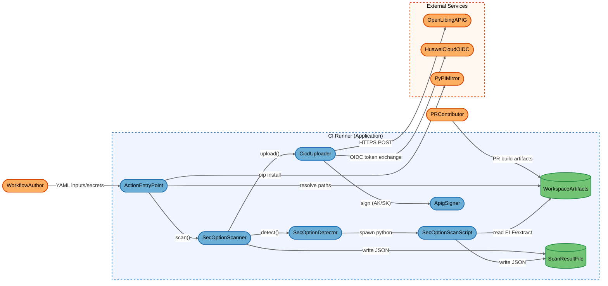
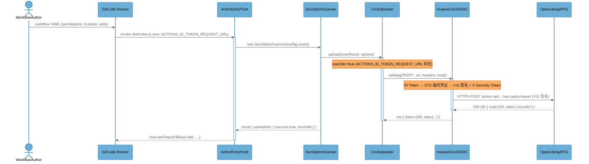
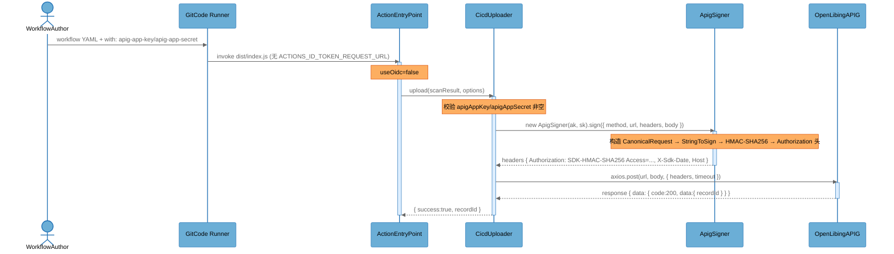
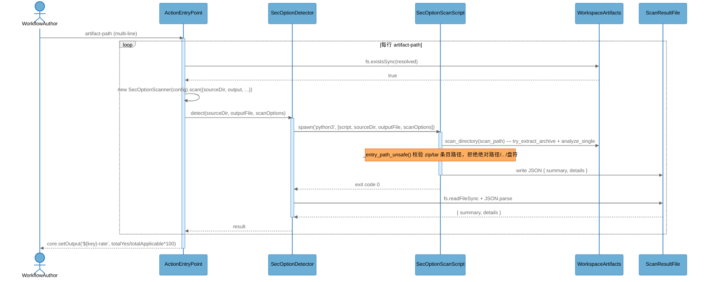

# Architecture Overview

## System Purpose

`openlibing-security-compilation-options-action` 是一个 GitCode CI/CD Action 插件，用于在流水线中检测 ELF 二进制构建产物的安全编译选项开启率（默认 14 项：BIND_NOW/NX/PIC/PIE/RELRO/RPATH/SP/STRIP/FORTIFY/FVISIBILITY/FTRAPV/STACKCLASH/FSTACKCHECK/ASLR）。Action 由 GitCode runner（`codearts-hosted`/`self-hosted`）以 `node16` 运行时调用，自动安装 `pyelftools` Python 依赖，调用 Python 扫描脚本解压 `.deb/.whl/.jar/.tar.gz/.run` 等归档并解析其中 ELF 文件，将扫描结果汇总为 JSON 落盘并上报到 openLiBing APIG 网关（支持 OIDC 联邦认证新接口与 AK/SK HMAC 签名旧接口双模式）。

## Key Components

| Component           | Type                | Description                                                                                                                                                                                                                                                                |
| ------------------- | ------------------- | -------------------------------------------------------------------------------------------------------------------------------------------------------------------------------------------------------------------------------------------------------------------------- |
| ActionEntryPoint    | Process             | `dist/index.js` 中的 `run()` 入口函数，读取 action.yml 声明的 inputs（artifact-path/scan-options/apig-app-key 等），自动 `pip install pyelftools`，实例化 SecOptionScanner 并聚合多产物累计统计、设置 `${key}-rate` 等 step outputs                                        |
| SecOptionScanner    | Process             | `dist/scanner.js` 中的 `SecOptionScanner` 类，统筹一次扫描：调用 SecOptionDetector 完成检测、将结果写入 ScanResultFile、可选调用 CicdUploader 上报，并在失败时附带错误信息上报                                                                                             |
| SecOptionDetector   | Process             | `dist/detectors/SecOptionDetector.js` 中的 `SecOptionDetector` 类，通过 `child_process.spawn` 拉起 Python 扫描脚本，传 `sourceDir/outputFile/scanOptions` CLI 参数，捕获 stdout/stderr，回读 JSON 结果                                                                     |
| SecOptionScanScript | Process             | `dist/bin/sec_option_scan.py` Python 脚本，使用 `pyelftools` 解析 ELF 安全编译选项，自动解压 ZIP/tar/.run/.deb 等归档（含 zip-slip/tar-slip 路径穿越校验），输出 `{summary, details}` JSON                                                                                 |
| CicdUploader        | Process             | `dist/uploaders/CicdUploader.js` 中的 `CicdUploader` 类，根据 `ACTIONS_ID_TOKEN_REQUEST_URL` 是否存在自动选择 OIDC（新接口 `/action-api/...`）或 AK/SK（旧接口 `/openlibing-cicd/...`）认证模式，HTTPS POST 上报扫描结果                                                   |
| ApigSigner          | Process             | `dist/uploaders/CicdUploader.js` 中的 `ApigSigner` 类，实现华为云 APIG SDK-HMAC-SHA256 签名算法（CanonicalRequest→StringToSign→HMAC），仅 AK/SK 模式使用，持有 `apigAppKey`/`apigAppSecret` 凭证                                                                           |
| OpenLibingAPIG      | External Service    | openLiBing 后端 APIG 网关 `https://174e1b821a8446f38998a67186ba766e.apic.cn-southwest-2.huaweicloudapis.com`，接收扫描结果上报，按认证模式分别走 `/action-api/build-artifact/sec-option/report`（OIDC）或 `/openlibing-cicd/build-artifact/sec-option/report`（AK/SK）路径 |
| HuaweiCloudOIDC     | External Service    | 华为云 STS 联邦认证服务，由 `@openlibing/huaweicloud-oidc-client@0.0.5` SDK 调用：用 GitCode runner 注入的 OIDC ID Token 换取 STS 临时凭证，再以 V11-HMAC-SHA256+X-Security-Token 签名实际请求                                                                             |
| PyPIMirror          | External Service    | 阿里云 PyPI 镜像 `https://mirrors.aliyun.com/pypi/simple/`，Action 启动时通过 `pip install --break-system-packages --trusted-host mirrors.aliyun.com` 自动安装 `pyelftools`                                                                                                |
| WorkspaceArtifacts  | Data Store          | GitCode runner 工作区中的构建产物文件（`.tar.gz/.zip/.deb/.whl/.jar/.so/.o/可执行文件` 等），由上游构建步骤或 `obs-download` 落盘，被 ActionEntryPoint 校验存在性、被 SecOptionScanScript 读取/解压/扫描                                                                   |
| ScanResultFile      | Data Store          | 扫描结果 JSON 文件（默认 `sec-option-result.json`，多产物场景按 `sec-option-result-<packageName>.json` 拆分），由 SecOptionScanScript 写入原始结果、由 SecOptionScanner 落盘最终结果                                                                                       |
| WorkflowAuthor      | External Interactor | 维护 workflow YAML 与 repo secrets（`OPENLIBING_APIG_KEY`/`OPENLIBING_APIG_SECRET`/`OPENLIBING_OBS_AK` 等）的仓库管理员，是 Action 的可信调用方                                                                                                                            |
| PRContributor       | External Interactor | 通过 `pull_request_target`/`pull_request_comment` 触发工作流的外部 PR 作者，可控制 PR 中的构建产物内容与 `artifact-path` 字段值（但 workflow YAML 取自 master）                                                                                                            |

## Component Diagram

## Top Scenarios

### Scenario 1: OIDC 联邦认证上报流程（新路径）

当 workflow 声明 `permissions: id-token: write` 时，GitCode runner 注入 `ACTIONS_ID_TOKEN_REQUEST_URL` 环境变量，ActionEntryPoint 据此切换到 OIDC 模式：扫描完成后由 CicdUploader 通过 `@openlibing/huaweicloud-oidc-client` SDK 调用 HuaweiCloudOIDC 完成 ID Token→STS 临时凭证换发，再以 V11-HMAC-SHA256+X-Security-Token 签名向 OpenLibingAPIG 的 `/action-api/build-artifact/sec-option/report` 新接口 POST 扫描结果。

### Scenario 2: AK/SK HMAC 签名上报流程（旧路径，存量脚本兼容）

未声明 `permissions: id-token: write` 时，ActionEntryPoint 检测到 `ACTIONS_ID_TOKEN_REQUEST_URL` 不存在，走 AK/SK 模式：CicdUploader 用 `apig-app-key`/`apig-app-secret` inputs 实例化 ApigSigner，ApigSigner 按 SDK-HMAC-SHA256 算法构造 CanonicalRequest→StringToSign→HMAC 签名头，附加到 `axios.post` 请求中向 OpenLibingAPIG 的 `/openlibing-cicd/build-artifact/sec-option/report` 旧接口 POST。

### Scenario 3: 多产物扫描与 ELF 解压流程

Workflow 通过 `artifact-path` 多行传入多个产物路径，ActionEntryPoint 逐行 `fs.existsSync` 校验后，对每个产物实例化 SecOptionScanner 并调用 `scan()`；SecOptionDetector 通过 `child_process.spawn` 拉起 SecOptionScanScript，Python 端递归扫描目录、对 `.whl/.zip/.jar/.deb/.run/.tar.gz` 等归档执行 `_safe_extract_zip`/`_safe_extract_tar`（含 zip-slip/tar-slip 路径穿越校验），用 `pyelftools` 解析每个 ELF 文件 14 项安全选项，写入 ScanResultFile JSON。

### Scenario 4: Python 依赖自动安装流程

Action 启动时 ActionEntryPoint 通过 `execSync` 执行 `python3 -m pip install --break-system-packages pyelftools -i https://mirrors.aliyun.com/pypi/simple/ --trusted-host mirrors.aliyun.com`；若安装失败仅打印 warning 并继续（后续 Python 扫描可能在缺少 `pyelftools` 时抛 ImportError，被 SecOptionDetector 捕获并以上层错误上报）。

### Scenario 5: 上报失败兜底流程

扫描或上报过程中若抛异常，SecOptionScanner 的 catch 块会再次调用 `uploader.upload({}, { status:1, errorMessage: error.message, ... })` 将错误信息上报到 OpenLibingAPIG；若该兜底上传也失败，仅打印 logger.error 并继续 throw，最终由 ActionEntryPoint 的 `core.setFailed` 终止 Action。

## Technology Stack

| Layer          | Technologies                                                                                                                                                                                                              |
| -------------- | ------------------------------------------------------------------------------------------------------------------------------------------------------------------------------------------------------------------------- |
| Languages      | JavaScript (Node.js 16+), Python 3                                                                                                                                                                                        |
| Frameworks     | `@actions/core` ^1.10.0, `@vercel/ncc` ^0.38.1 (打包), `adm-zip` ^0.5.16 (zip 打包)                                                                                                                                       |
| Data Stores    | 本地文件系统（工作区构建产物 + JSON 结果文件）                                                                                                                                                                            |
| Infrastructure | GitCode CI/CD Action runtime (`node16`), GitCode runner (`codearts-hosted`/`self-hosted`), APIG 网关 (`apic.cn-southwest-2.huaweicloudapis.com`)                                                                          |
| Security       | `@openlibing/huaweicloud-oidc-client@0.0.5` (OIDC 联邦认证 + STS 临时凭证), 自实现 `ApigSigner` (SDK-HMAC-SHA256), `crypto` Node 内置模块 (SHA256/HMAC), `pre-commit` (gitleaks 私钥扫描), `codeql-action` (静态安全扫描) |

## Deployment Model

Action 部署形态为 **GitCode CI Action**：源码经 `@vercel/ncc` 打包到 `dist/index.js`（1.86 MB，含全部依赖），由 GitCode runner 在 `codearts-hosted`/`self-hosted` 上以 `node16` 运行时调用 `dist/index.js`。Action 自身无任何 inbound 网络监听器，仅发起 outbound HTTPS（APIG/OIDC/PyPI）和本地 `child_process.spawn` 子进程调用。多产物场景按行解析 `artifact-path`，每行产物独立扫描并上报，最终累计 `${key}-rate` 等 step outputs 由 runner 回传给后续 step。CI runner 是临时单租户环境（每次流水线一个 workflow 实例独占 runner 工作区与进程空间），Action 完成后 runner 销毁或回收工作区。

**Deployment Classification:** `LOCALHOST_DESKTOP`

### Component Exposure Table

| Component           | Listens On               | Auth Required               | Reachability                                      | Min Prerequisite     | Derived Tier |
| ------------------- | ------------------------ | --------------------------- | ------------------------------------------------- | -------------------- | ------------ |
| ActionEntryPoint    | N/A — no listener        | N/A — invoked by runner     | External (via workflow inputs)                    | Authenticated User   | T2           |
| SecOptionScanner    | N/A — no listener        | N/A — in-process            | External (transitive via workflow inputs)         | Authenticated User   | T2           |
| SecOptionDetector   | N/A — no listener        | N/A — in-process            | External (transitive via scanOptions)             | Authenticated User   | T2           |
| SecOptionScanScript | N/A — no listener        | N/A — subprocess            | External (transitive via PRContributor artifacts) | Authenticated User   | T2           |
| CicdUploader        | N/A — no listener        | Yes (OIDC or AK/SK)         | External (transitive via workflow inputs)         | Authenticated User   | T2           |
| ApigSigner          | N/A — no listener        | N/A — in-process            | External (transitive via CicdUploader)            | Authenticated User   | T2           |
| OpenLibingAPIG      | APIG gateway address     | Yes (V11 or HMAC signature) | External                                          | Authenticated User   | T2           |
| HuaweiCloudOIDC     | huaweicloud STS endpoint | Yes (OIDC ID Token)         | External                                          | Authenticated User   | T2           |
| PyPIMirror          | mirrors.aliyun.com       | No                          | External                                          | Internal Network     | T2           |
| WorkspaceArtifacts  | N/A — filesystem         | N/A — filesystem ACL        | Localhost Only                                    | Local Process Access | T2           |
| ScanResultFile      | N/A — filesystem         | N/A — filesystem ACL        | Localhost Only                                    | Local Process Access | T2           |
| WorkflowAuthor      | N/A — human              | N/A — repo write            | External                                          | Privileged User      | T2           |
| PRContributor       | N/A — human              | Yes (GitCode account)       | External                                          | Authenticated User   | T2           |

## Security Infrastructure Inventory

| Component                                  | Security Role                       | Configuration                                                                                                                          | Notes                                                                                                                              |
| ------------------------------------------ | ----------------------------------- | -------------------------------------------------------------------------------------------------------------------------------------- | ---------------------------------------------------------------------------------------------------------------------------------- |
| ApigSigner                                 | Credentials holder + HMAC signature | `apig-app-key`/`apig-app-secret` inputs (action.yml:81-92), `crypto.createHmac('sha256', sk)` (CicdUploader.js:242)                    | 仅 AK/SK 模式使用；AK/SK 通过 workflow `with` 传入，凭证通常来自 repo secrets（如 `OPENLIBING_APIG_KEY`/`OPENLIBING_APIG_SECRET`） |
| `@openlibing/huaweicloud-oidc-client` SDK  | OIDC token exchange + V11 signing   | npm 依赖 0.0.5（package.json:16），由 CicdUploader 调用 `callApig('POST', url, headers, body)`（CicdUploader.js:305）                  | OIDC 模式无需 AK/SK；ID Token 由 runner 注入 `ACTIONS_ID_TOKEN_REQUEST_URL` 环境变量后 SDK 自动获取                                |
| `pre-commit` + `gitleaks`                  | 私钥/敏感信息扫描                   | `.pre-commit-config.yaml` 启用 `detect-private-key` hook + `gitleaks v8.30.1`                                                          | 仅在 `pre-commit` workflow 触发时检查提交内容，不覆盖 Action 运行时配置                                                            |
| `codeql-action`                            | 静态安全扫描                        | `.gitcode/workflows/codeql.yaml` 配置 javascript + security-and-quality query suite                                                    | 仅在 push 到 master 时扫描，不影响 Action 运行时                                                                                   |
| SecOptionScanScript `_entry_path_unsafe()` | zip-slip/tar-slip 路径穿越防御      | `dist/bin/sec_option_scan.py:173-187`，拒绝绝对路径、`..` 段、Windows 盘符绝对路径；`_safe_extract_zip`/`_safe_extract_tar` 逐条目校验 | 防御归档解压时恶意条目路径逃逸 tmp_dir                                                                                             |
| `git remote get-url origin` token 清洗     | git URL 内嵌凭证脱敏                | `dist/index.js:54271-54272`，`remoteUrl.replace(/https:\/\/[^@]+@/, 'https://')`                                                       | 防止 `https://<token>@gitcode.com/...` 形式的 URL 被写入上报 payload                                                               |

## Repository Structure

| Directory                 | Purpose                                                                                                                                                                                                              |
| ------------------------- | -------------------------------------------------------------------------------------------------------------------------------------------------------------------------------------------------------------------- |
| `dist/`                   | ncc 打包产物：`dist/index.js`（1.86 MB 主入口）+ 模块化源码（`scanner.js`/`detectors/`/`uploaders/`/`utils/`）+ Python 脚本（`bin/sec_option_scan.py`、`sec_option_scan.py`）。Action 实际运行的就是 `dist/index.js` |
| `dist/detectors/`         | `SecOptionDetector.js`：Python 脚本调用器                                                                                                                                                                            |
| `dist/uploaders/`         | `CicdUploader.js`：上报器（含 `ApigSigner` 内部类）                                                                                                                                                                  |
| `dist/utils/`             | `logger.js`：winston 日志封装                                                                                                                                                                                        |
| `dist/bin/`               | `sec_option_scan.py`：ELF 安全编译选项扫描 Python 脚本                                                                                                                                                               |
| `.gitcode/workflows/`     | `codeql.yaml`（CodeQL 静态扫描流水线）+ `pre-commit.yml`（PR 触发的 pre-commit 钩子流水线）                                                                                                                          |
| `action.yml`              | Action 元数据与 inputs 声明（artifact-path/output/scan-options/apig-app-key/apig-app-secret 等）                                                                                                                     |
| `zip.js`                  | 用 `adm-zip` 把 README+action.yml+dist 打包成 `.zip` 供发布                                                                                                                                                          |
| `package.json`            | npm 依赖与 `ncc build`/`zip` 构建脚本                                                                                                                                                                                |
| `.pre-commit-config.yaml` | 本地 pre-commit 钩子配置（trailing-whitespace、check-yaml、detect-private-key、gitleaks、prettier）                                                                                                                  |
