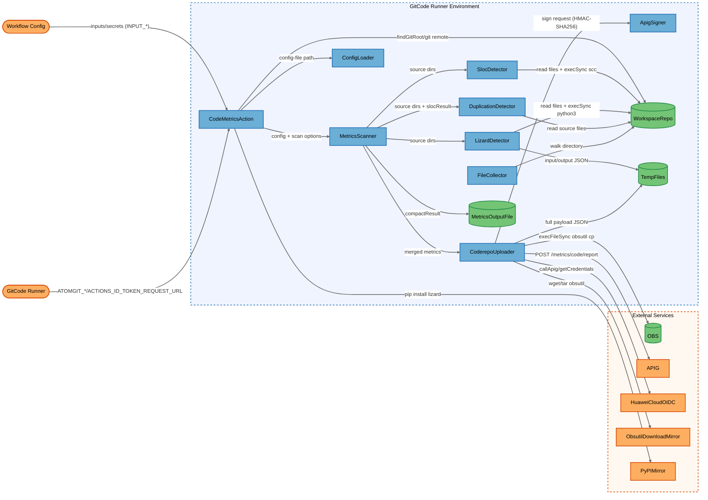
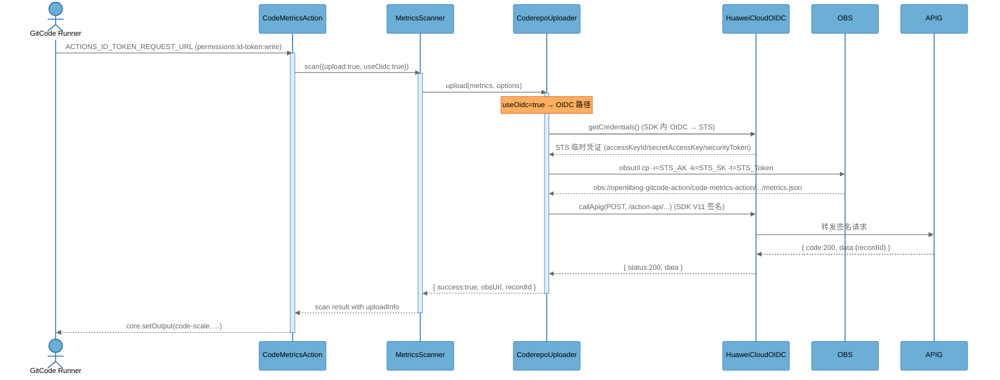
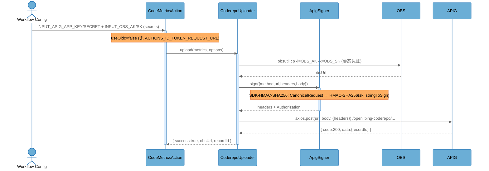
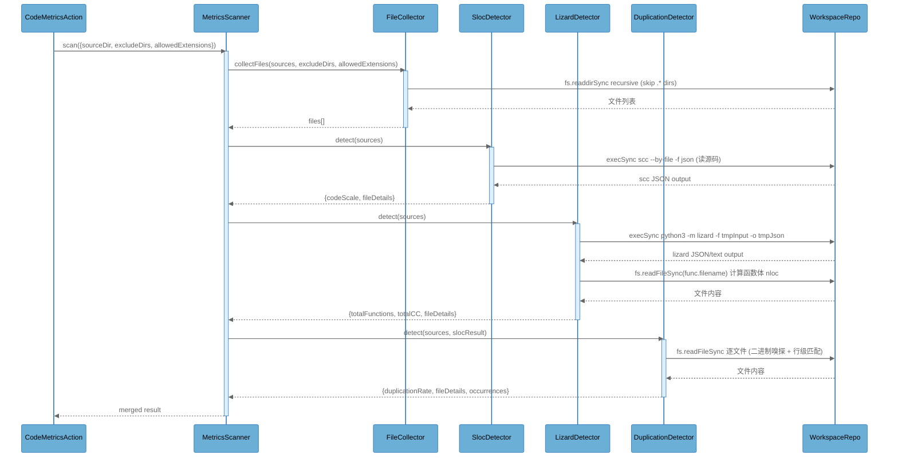

# Architecture Overview

## System Purpose

`code-metrics-action` 是 OpenLibing 平台的 GitCode CI/CD 插件（GitHub Action 形式），在 GitCode runner 上运行，对工作流所属仓的代码进行静态度量扫描：代码规模（scc 二进制）、平均函数代码行数与圈复杂度（lizard Python 包）、代码/文件重复率（内置实现）。扫描结果组装为全量 JSON 报告，先上传到华为云 OBS（中转存储），再通过 APIG 上报元数据 + OBS 下载链接给 openLiBing 后端入库。用户为 OpenLibing 平台业务仓的维护者与 CI 流水线配置者，扫描结果用于平台级代码质量跟踪与趋势分析。

## Key Components

| Component | Type | Description |
|-----------|------|-------------|
| CodeMetricsAction | Process | Action 入口（`dist/index.js` 内 `run()`），读取 env/inputs、调用 git/python3、构造 config 并启动扫描 |
| MetricsScanner | Process | 扫描编排器（`dist/scanner.js`），调度三个 detector + calculator + uploader，写本地 metrics.json |
| SlocDetector | Process | 代码规模检测器（`dist/detectors/SlocDetector.js`），调用内置 scc 二进制统计有效代码行 |
| LizardDetector | Process | 函数复杂度检测器（`dist/detectors/LizardDetector.js`），调用 `python3 -m lizard` 并解析输出 |
| DuplicationDetector | Process | 重复代码检测器（`dist/detectors/DuplicationDetector.js`），逐文件读取并跨文件行级匹配 |
| ConfigLoader | Process | 配置加载器（`dist/config/loader.js`），读取并合并 YAML/JSON config-file 与默认配置 |
| FileCollector | Process | 文件收集器（`dist/utils/fileCollector.js`），按 exclude-dirs/allowed-extensions 递归遍历工作区 |
| CoderepoUploader | Process | 上报编排器（`dist/uploaders/CoderepoUploader.js`），OBS 上传 + APIG /metrics/code/report 调用 |
| ApigSigner | Process | APIG AK/SK 签名器（`dist/uploaders/CoderepoUploader.js` 内 `ApigSigner` 类），SDK-HMAC-SHA256 |
| WorkspaceRepo | Data Store | runner 工作区内被扫描的仓库内容（含 `.git` 元数据），由 checkout 步骤注入，属不可信输入 |
| MetricsOutputFile | Data Store | 本地 `metrics.json` 输出文件（`output` 参数指定），写入到工作区 |
| TempFiles | Data Store | `os.tmpdir()` 临时文件：lizard 输入/输出、上报全量 payload、obsutil 解压目录 |
| OBS | External Service | 华为云对象存储（`obs.cn-southwest-2.myhuaweicloud.com`，桶 `openlibing-gitcode-action`） |
| APIG | External Service | 华为云 APIG 网关（`174e1b821...apic.cn-southwest-2.huaweicloudapis.com`），接收 `/metrics/code/report` |
| HuaweiCloudOIDC | External Service | 华为云 OIDC 联邦认证端点（由 `@openlibing/huaweicloud-oidc-client` SDK 通过 `ACTIONS_ID_TOKEN_REQUEST_URL` 调用） |
| ObsutilDownloadMirror | External Service | obsutil 二进制下载源（`obs-community.obs.cn-north-1.myhuaweicloud.com`），运行时拉取并解压 |
| PyPIMirror | External Service | Python 包镜像（`mirrors.aliyun.com/pypi/simple/`），用于 `pip install lizard` |
| GitCodeRunner | External Interactor | GitCode CI runner 环境（注入 `ATOMGIT_*`、`ACTIONS_ID_TOKEN_REQUEST_URL` 环境变量与工作区路径） |
| WorkflowConfig | External Interactor | 工作流 YAML + action inputs（`apig-app-key/secret`、`obs-ak/sk`、`exclude-dirs` 等，经 `INPUT_*` env 注入） |

## Component Diagram

## Top Scenarios

### Scenario 1: OIDC 联邦认证上报流程（新接口）

当工作流声明 `permissions: id-token: write` 时，runner 注入 `ACTIONS_ID_TOKEN_REQUEST_URL`，CoderepoUploader 走 OIDC 路径：SDK 内部用 OIDC ID Token 换取华为云 STS 临时凭证，obsutil 用临时 AK/SK/SecurityToken 上传全量 payload 到 OBS，再通过 `callApig` 用 V11-HMAC-SHA256 签名调用 `/action-api/metrics/code/report`。

### Scenario 2: AK/SK 旧接口上报流程（存量脚本兼容）

未声明 `permissions: id-token: write` 时，CoderepoUploader 走旧路径：使用 workflow 传入的 `apig-app-key/apig-app-secret` 由 ApigSigner 计算 SDK-HMAC-SHA256 签名调用 `/openlibing-coderepo/metrics/code/report`，OBS 上传使用 `obs-ak/obs-sk` 静态凭证。

### Scenario 3: 三检测器并行扫描与文件收集

MetricsScanner 在 scan() 中依次调用 SlocDetector、LizardDetector、DuplicationDetector，三者均通过 FileCollector 按相同 exclude-dirs/allowed-extensions 规则收集工作区文件，scc 走 `execSync` 调用二进制、lizard 走 `execSync('python3 -m lizard ...')` 调用 Python 包、DuplicationDetector 在进程内逐文件读取做行级跨文件匹配。

### Scenario 4: obsutil 二进制运行时下载与执行

CoderepoUploader.ensureObsutil() 在 runner 上检查 `os.tmpdir()/obsutil` 是否存在，不存在则从 `obs-community.obs.cn-north-1.myhuaweicloud.com` 下载 tar.gz，`execSync` 用 `/bin/bash` shell 执行 `wget`/`tar`/`chmod` 解压并赋权，最后 `execFileSync` 不经 shell 直接调用 obsutil 上传文件到 OBS。

### Scenario 5: 失败兜底上报与 obsUrl 保底补导入

scan() 在 try/catch 中捕获异常，失败时仍以 `status:1 + errorMessage` 调用 uploader.upload()，OBS 文件已上传后即使 /report 接口失败，控制台会打印固定格式 obsUrl 提示可通过平台保底定时任务按 objectKey 补导入，保证数据不丢失。

## Technology Stack

| Layer | Technologies |
|-------|--------------|
| Languages | JavaScript (Node.js ≥16)、Python 3（lizard 包）、Shell（bash：wget/tar/chmod） |
| Frameworks | `@actions/core` ^1.10.0、`@vercel/ncc` ^0.38.1（打包）、`axios` ^1.6.0、`js-yaml` ^4.1.0、`winston` ^3.11.0、`adm-zip` ^0.5.16 |
| Data Stores | 本地文件系统（工作区仓库、metrics.json、os.tmpdir 临时文件）、华为云 OBS（私有对象桶 `openlibing-gitcode-action`） |
| Infrastructure | GitCode CI Runner（`codearts-hosted/ubuntu-latest/x64/slim` 或 `self-hosted/region=overseas`）、华为云 APIG（cn-southwest-2）、华为云 OBS（cn-southwest-2）、华为云 OIDC 联邦认证、阿里云 PyPI 镜像、obsutil 二进制（obs-community 镜像源） |
| Security | SDK-HMAC-SHA256 签名（ApigSigner）、OIDC 联邦认证 + STS 临时凭证（`@openlibing/huaweicloud-oidc-client` 0.0.5）、`execFileSync` 参数数组（避免 shell 注入）、`-k/-t` 日志脱敏、git remote URL token 清洗、pre-commit `detect-private-key` + `gitleaks` 钩子 |

## Deployment Model

`code-metrics-action` 是 GitCode CI/CD 插件，以 GitHub Action 形式（`action.yml` 中 `using: node16`、`main: dist/index.js`）由 GitCode runner 拉起执行。运行环境为 GitCode 托管或自托管 runner（Ubuntu x64），插件进程为单 Node.js 进程，通过 `child_process.execSync/execFileSync` 派生 scc/python3/obsutil/git 子进程。无任何监听端口，所有外部交互为出站调用：HTTPS 调用 APIG/OIDC/obsutil 下载镜像/PyPI 镜像，obsutil 客户端走 HTTPS 上传到 OBS。runner 工作区挂载 checkout 出来的被扫描仓（不可信源码），临时文件写到 `os.tmpdir()`。认证模式由 workflow 是否声明 `permissions: id-token: write` 二选一切换：OIDC 模式无凭证输入，AK/SK 模式由 workflow secrets 注入四对凭证。

**Deployment Classification:** `CI_RUNNER`

### Component Exposure Table

| Component | Listens On | Auth Required | Reachability | Min Prerequisite | Derived Tier |
|-----------|------------|---------------|--------------|------------------|-------------|
| CodeMetricsAction | N/A — no listener | Yes（runner 触发，受 workflow 触发条件约束） | No Listener | Authenticated User | T2 |
| MetricsScanner | N/A — no listener | Yes（由 CodeMetricsAction 进程内调用） | No Listener | Authenticated User | T2 |
| SlocDetector | N/A — no listener | Yes（由 MetricsScanner 进程内调用） | No Listener | Authenticated User | T2 |
| LizardDetector | N/A — no listener | Yes（由 MetricsScanner 进程内调用） | No Listener | Authenticated User | T2 |
| DuplicationDetector | N/A — no listener | Yes（由 MetricsScanner 进程内调用） | No Listener | Authenticated User | T2 |
| ConfigLoader | N/A — no listener | Yes（由 CodeMetricsAction 进程内调用，读 workspace config-file） | No Listener | Authenticated User | T2 |
| FileCollector | N/A — no listener | Yes（由 detector 进程内调用） | No Listener | Authenticated User | T2 |
| CoderepoUploader | N/A — no listener | Yes（由 MetricsScanner 进程内调用，发起到外部服务的出站请求） | No Listener | Authenticated User | T2 |
| ApigSigner | N/A — no listener | Yes（由 CoderepoUploader 进程内调用，处理 SK） | No Listener | Authenticated User | T2 |
| WorkspaceRepo | N/A — filesystem | Yes（runner 工作区文件系统权限） | Local Process Access | Local Process Access | T2 |
| MetricsOutputFile | N/A — filesystem | Yes（runner 工作区写权限） | Local Process Access | Local Process Access | T2 |
| TempFiles | N/A — filesystem | Yes（`os.tmpdir()` 进程级） | Local Process Access | Local Process Access | T2 |
| OBS | obs.cn-southwest-2.myhuaweicloud.com:443 | Yes（AK/SK 或 STS 凭证） | External | Authenticated User | T2 |
| APIG | 174e1b821...apic.cn-southwest-2.huaweicloudapis.com:443 | Yes（HMAC 签名或 OIDC） | External | Authenticated User | T2 |
| HuaweiCloudOIDC | runner 注入的 ACTIONS_ID_TOKEN_REQUEST_URL | Yes（runner OIDC 上下文） | External | Authenticated User | T2 |
| ObsutilDownloadMirror | obs-community.obs.cn-north-1.myhuaweicloud.com:443 | No（公开 HTTPS） | External | None | T1 |
| PyPIMirror | mirrors.aliyun.com:443 | No（公开 HTTPS） | External | None | T1 |
| GitCodeRunner | N/A — runner 调度接口 | Yes（GitCode 平台账号触发 workflow） | External | Authenticated User | T2 |
| WorkflowConfig | N/A — workflow YAML + inputs | Yes（仓库写权限配置 workflow + secrets） | External | Authenticated User | T2 |

## Security Infrastructure Inventory

| Component | Security Role | Configuration | Notes |
|-----------|---------------|---------------|-------|
| ApigSigner | APIG 请求签名（完整性、防重放） | SDK-HMAC-SHA256，X-Sdk-Date 时间戳，SignedHeaders 列表，body SHA256 | 与官方 APIGW-javascript-sdk-2.0.6 signer.js 完全对齐 |
| `@openlibing/huaweicloud-oidc-client` SDK | OIDC 联邦认证 + STS 临时凭证 + V11-HMAC-SHA256 签名 | 由 `ACTIONS_ID_TOKEN_REQUEST_URL` 触发，SDK 内部缓存 STS 凭证 | 仅 OIDC 模式启用，AK/SK 模式不依赖 |
| `execFileSync`（obsutil 调用） | 命令注入防御 | 参数数组直接传递，不经 shell 解析；`-k/-t` 在日志中脱敏 | `dist/uploaders/CoderepoUploader.js:400-427` |
| `execSync`（pip install） | 依赖安装 | `--break-system-packages`、`-i mirrors.aliyun.com`、`--trusted-host mirrors.aliyun.com`、120s 超时 | 失败仅 warning，不阻断扫描 |
| git remote URL token 清洗 | 凭证泄露防御 | `remoteUrl.replace(/https:\/\/[^@]+@/, 'https://')` 剥离 URL 中的 access-token | `dist/index.js:62399` |
| `detect-private-key` pre-commit hook | 私钥泄露拦截 | `.pre-commit-config.yaml` 引用 pre-commit-hooks v6.0.0 | 本地开发防线，不阻断 CI 运行 |
| `gitleaks` pre-commit hook | 凭证/密钥泄露扫描 | `.pre-commit-config.yaml` 引用 gitleaks v8.30.1 | 本地开发防线 |
| FileCollector 跳过 `.` 前缀目录 | 工作区隔离 | `_walkDir` 中 `entry.name.startsWith('.')` 跳过 `.git`/`.idea` 等 | 防止扫描 git 元数据 |
| DuplicationDetector 二进制嗅探 | 内容安全 | 前 8KB 含 `\x00` 判定为二进制，跳过重复检测 | 防止乱码伪重复 |
| `ncc` 打包 | 供应链完整性 | `@vercel/ncc` ^0.38.1 将源码 + 依赖打包到 `dist/index.js` | runner 上不需 npm install |

## Repository Structure

| Directory | Purpose |
|-----------|---------|
| `dist/` | ncc 打包产物 + 源码子目录（`dist/index.js` 为 Action 入口 bundle） |
| `dist/calculators/` | 指标合并计算（`MetricsCalculator.js`） |
| `dist/config/` | 配置加载（`loader.js`，YAML/JSON） |
| `dist/detectors/` | 三类检测器（`SlocDetector.js`、`LizardDetector.js`、`DuplicationDetector.js`、`BaseDetector.js`） |
| `dist/uploaders/` | 上报 + 签名（`CoderepoUploader.js`，含 `ApigSigner` 内嵌类） |
| `dist/utils/` | 工具类（`fileCollector.js`、`fileUtils.js`、`logger.js`） |
| `dist/bin/` | 内置二进制（`scc` 代码行统计工具，附 `LICENSE`） |
| `.gitcode/workflows/` | GitCode workflow 定义（`code-metrics-scan.yml` Nightly、`pre-commit.yml` PR 门禁） |
| `action.yml` | Action 元数据（inputs 声明 + `runs.using: node16`） |
| `package.json` | npm 依赖与构建脚本（`ncc build` + `zip.js`） |
| `.pre-commit-config.yaml` | pre-commit 钩子配置（detect-private-key、gitleaks、prettier） |
| `zip.js` | 发布打包脚本（adm-zip 打包 README + action.yml + dist/） |
| `metrics.json` | 示例输出文件（参考） |
