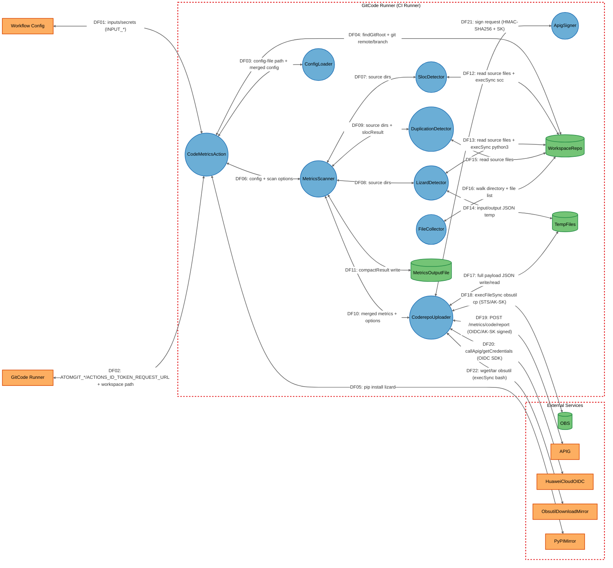
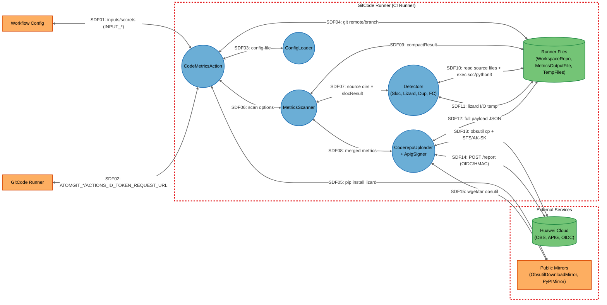

# Threat Model

## Data Flow Diagram

## Element Table

| Element | Type | TMT Category | Description | Trust Boundary |
|---------|------|--------------|-------------|----------------|
| CodeMetricsAction | Process | SE.P.TMCore.NonMS | Action 入口 run()，Node.js 进程主模块 | GitCode Runner |
| MetricsScanner | Process | SE.P.TMCore.NonMS | 扫描编排器，调度 detector + calculator + uploader | GitCode Runner |
| SlocDetector | Process | SE.P.TMCore.OSProcess | execSync 调用 scc 二进制统计代码行 | GitCode Runner |
| LizardDetector | Process | SE.P.TMCore.OSProcess | execSync 调用 python3 -m lizard 计算复杂度 | GitCode Runner |
| DuplicationDetector | Process | SE.P.TMCore.NonMS | 进程内逐文件读取做行级跨文件匹配 | GitCode Runner |
| ConfigLoader | Process | SE.P.TMCore.NonMS | 加载并合并 YAML/JSON config-file | GitCode Runner |
| FileCollector | Process | SE.P.TMCore.NonMS | 按 exclude-dirs/allowed-extensions 递归遍历工作区 | GitCode Runner |
| CoderepoUploader | Process | SE.P.TMCore.WebSvc | OBS 上传 + APIG /report 调用，OIDC/AK-SK 双模式 | GitCode Runner |
| ApigSigner | Process | SE.P.TMCore.NonMS | 内嵌类，SDK-HMAC-SHA256 签名构造 | GitCode Runner |
| WorkspaceRepo | Data Store | SE.DS.TMCore.FS | runner 工作区被扫描仓库（不可信源码 + .git 元数据） | GitCode Runner |
| MetricsOutputFile | Data Store | SE.DS.TMCore.FS | 本地 metrics.json 输出文件 | GitCode Runner |
| TempFiles | Data Store | SE.DS.TMCore.FS | os.tmpdir() 临时文件（lizard I/O、上报 payload、obsutil 解压） | GitCode Runner |
| OBS | Data Store | SE.DS.TMCore.CloudStorage | 华为云对象存储桶 openlibing-gitcode-action | External |
| APIG | External Interactor | SE.EI.TMCore.WebSvc | 华为云 APIG 网关（/metrics/code/report） | External |
| HuaweiCloudOIDC | External Interactor | SE.EI.TMCore.AuthProvider | 华为云 OIDC 联邦认证端点 | External |
| ObsutilDownloadMirror | External Interactor | SE.EI.TMCore.WebSvc | obsutil 二进制下载源（obs-community 镜像） | External |
| PyPIMirror | External Interactor | SE.EI.TMCore.WebSvc | PyPI 镜像（mirrors.aliyun.com） | External |
| GitCodeRunner | External Interactor | SE.EI.TMCore.User | GitCode CI runner 环境，注入 env + workspace | External |
| WorkflowConfig | External Interactor | SE.EI.TMCore.User | workflow YAML + action inputs（含 secrets） | External |

## Data Flow Table

| ID | Source | Target | Protocol | Description |
|----|--------|--------|----------|-------------|
| DF01 | WorkflowConfig | CodeMetricsAction | env vars (INPUT_*) | action inputs 与 secrets 通过 INPUT_* 环境变量注入（连字符/下划线兼容） |
| DF02 | GitCodeRunner | CodeMetricsAction | env vars + filesystem | 注入 ATOMGIT_REF_NAME/RUN_ID/SHA、ACTIONS_ID_TOKEN_REQUEST_URL、workspace 路径 |
| DF03 | CodeMetricsAction | ConfigLoader | function call + file read | 传入 config-file 路径，返回合并后的 DEFAULT_CONFIG + 用户配置 |
| DF04 | CodeMetricsAction | WorkspaceRepo | execSync git + fs.existsSync | findGitRoot 向上查 .git，调用 git remote get-url / rev-parse --abbrev-ref HEAD |
| DF05 | CodeMetricsAction | PyPIMirror | HTTPS (pip install) | `python3 -m pip install --break-system-packages lizard -i mirrors.aliyun.com` |
| DF06 | CodeMetricsAction | MetricsScanner | constructor + async scan() | 传入 config 与 scan options（sourceDir、upload、gitUrl、branchName、pipelineRunId、commitId） |
| DF07 | MetricsScanner | SlocDetector | async detect(sources) | 调用 scc 统计代码规模，返回 slocResult |
| DF08 | MetricsScanner | LizardDetector | async detect(sources) | 调用 lizard 计算函数复杂度，返回 lizardResult |
| DF09 | MetricsScanner | DuplicationDetector | async detect(sources, slocResult) | 传入 slocResult 作分母，返回 duplicationResult |
| DF10 | MetricsScanner | CoderepoUploader | async upload(metrics, options) | 传入 formattedMetrics + 元数据，返回 {success, obsUrl, recordId} |
| DF11 | MetricsScanner | MetricsOutputFile | fs.writeFileSync | 写本地 metrics.json（剥离 snapshotData + 裁剪超长 content） |
| DF12 | SlocDetector | WorkspaceRepo | execSync + fs.readFileSync | 调用 scc 二进制 + 后置 FileCollector.isPathExcluded 过滤 |
| DF13 | LizardDetector | WorkspaceRepo | execSync python3 + fs.readFileSync | 写 lizard_input.txt 调用 python3 -m lizard，再读源文件计算函数体 nloc |
| DF14 | LizardDetector | TempFiles | fs.writeFileSync/readFileSync/unlinkSync | lizard 输入文件 + lizard_output.json |
| DF15 | DuplicationDetector | WorkspaceRepo | fs.readFileSync | 逐文件读取（含二进制嗅探），跨文件行级匹配 |
| DF16 | FileCollector | WorkspaceRepo | fs.readdirSync recursive | 递归遍历，跳过 `.` 前缀目录，按 exclude-dirs/allowed-extensions 过滤 |
| DF17 | CoderepoUploader | TempFiles | fs.writeFileSync/unlinkSync | 全量 payload 写 tmp JSON，上传后清理 |
| DF18 | CoderepoUploader | OBS | HTTPS (obsutil cp) | execFileSync obsutil cp + STS 临时凭证或静态 AK/SK |
| DF19 | CoderepoUploader | APIG | HTTPS POST | /metrics/code/report，OIDC 模式 callApig 或 AK/SK 模式 axios.post + ApigSigner |
| DF20 | CoderepoUploader | HuaweiCloudOIDC | HTTPS (SDK callApig/getCredentials) | OIDC ID Token → STS 临时凭证 + V11 签名（SDK 内部） |
| DF21 | CoderepoUploader | ApigSigner | function call | 传入 {method, url, headers, body}，返回带 Authorization 的 headers |
| DF22 | CoderepoUploader | ObsutilDownloadMirror | HTTPS (wget/curl + tar) | execSync bash 下载 obsutil_linux_amd64.tar.gz 并解压、chmod 755 |

## Trust Boundary Table

| Boundary | Description | Contains |
|----------|-------------|----------|
| GitCode Runner (CI Runner) | GitCode CI runner 进程边界：Node.js 主进程 + 派生子进程（scc/python3/obsutil/git）+ 工作区文件系统 + 临时目录。runner 由平台调度，非公开监听端口；外部攻击者需先经 GitCode 认证并具备提交代码/修改 workflow 权限才能影响此边界内的执行 | CodeMetricsAction, MetricsScanner, SlocDetector, LizardDetector, DuplicationDetector, ConfigLoader, FileCollector, CoderepoUploader, ApigSigner, WorkspaceRepo, MetricsOutputFile, TempFiles |
| External | 不可信外部服务与公网镜像：华为云 OBS/APIG/OIDC（需凭证可达）+ obsutil 下载镜像 + PyPI 镜像（公开 HTTPS） | OBS, APIG, HuaweiCloudOIDC, ObsutilDownloadMirror, PyPIMirror, GitCodeRunner, WorkflowConfig |

## Summary View

## Summary to Detailed Mapping

| Summary Element | Contains | Summary Flows | Maps to Detailed Flows |
|----------------|----------|---------------|------------------------|
| CodeMetricsAction | CodeMetricsAction | SDF01, SDF02, SDF03, SDF04, SDF05, SDF06 | DF01, DF02, DF03, DF04, DF05, DF06 |
| MetricsScanner | MetricsScanner | SDF06, SDF07, SDF08, SDF09 | DF06, DF07, DF08, DF09, DF10, DF11 |
| Detectors | SlocDetector, LizardDetector, DuplicationDetector, FileCollector | SDF07, SDF10, SDF11 | DF07, DF08, DF09, DF12, DF13, DF14, DF15, DF16 |
| ConfigLoader | ConfigLoader | SDF03 | DF03 |
| CoderepoUploader + ApigSigner | CoderepoUploader, ApigSigner | SDF08, SDF12, SDF13, SDF14, SDF15 | DF10, DF17, DF18, DF19, DF20, DF21, DF22 |
| Runner Files | WorkspaceRepo, MetricsOutputFile, TempFiles | SDF04, SDF09, SDF10, SDF11, SDF12 | DF04, DF11, DF12, DF13, DF14, DF15, DF16, DF17 |
| Huawei Cloud | OBS, APIG, HuaweiCloudOIDC | SDF13, SDF14 | DF18, DF19, DF20 |
| Public Mirrors | ObsutilDownloadMirror, PyPIMirror | SDF05, SDF15 | DF05, DF22 |
| GitCode Runner | GitCodeRunner | SDF02 | DF02 |
| Workflow Config | WorkflowConfig | SDF01 | DF01 |
