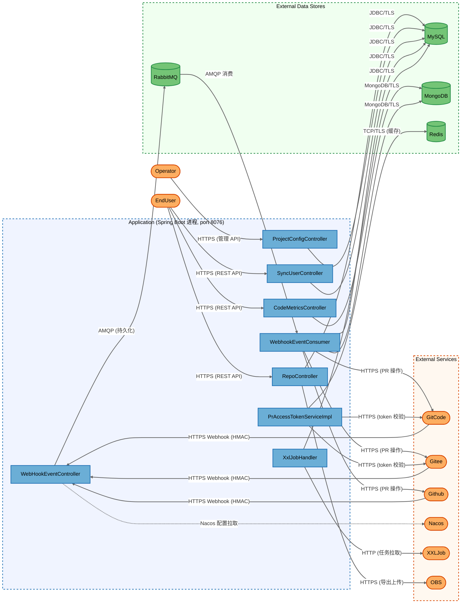
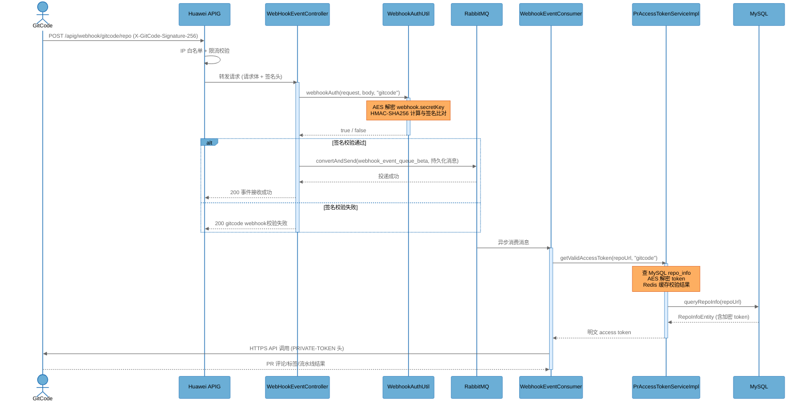
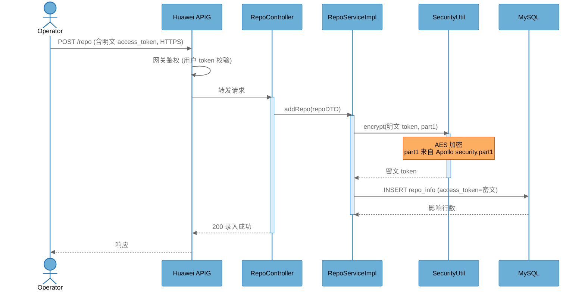
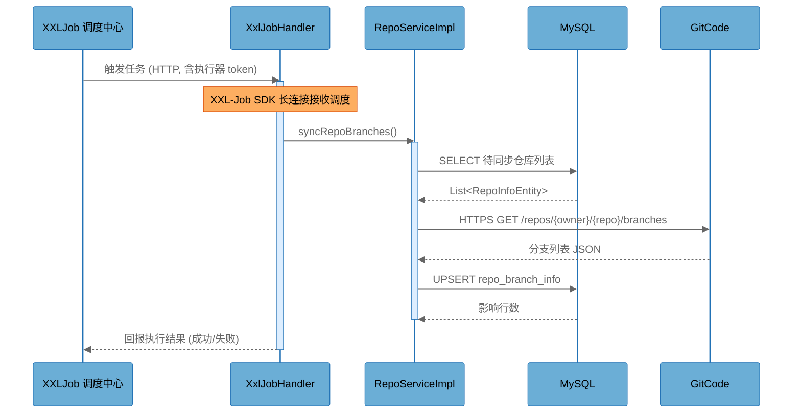

# Architecture Overview

## System Purpose

openlibing-coderepo 是 OpenLibing 研发流程平台中的**代码仓管理微服务**，基于 Java 21 + Spring Boot 3.4 构建，部署为单一容器化进程。它负责对接 GitCode/Gitee/GitHub 三大代码托管平台，提供仓库元数据 CRUD、项目配置、分支同步、用户同步、代码度量采集与 Webhook 事件接入能力。该服务通过华为云 APIG 对外暴露 Webhook 入口（接收三大平台的 push/PR 事件），并通过网关路由对外提供 REST API（供前端控制台与内部上游服务调用）。下游依赖 MySQL（业务数据）、MongoDB（日志/度量）、Redis（Token 缓存/分布式锁）、RabbitMQ（异步事件）、Nacos（配置与注册）、XXL-Job（定时任务）与华为云 OBS（导出产物）。用户为 OpenLibing 平台研发人员与运维管理员。

## Key Components

| Component | Type | Description |
|-----------|------|-------------|
| WebHookEventController | Process | REST 控制器，接收三大平台 Webhook 事件（/apig/webhook/{platform}/repo），HMAC-SHA256 签名校验后投递 RabbitMQ |
| RepoController | Process | 仓库元数据 CRUD REST 控制器，处理仓库录入/查询/批量删除/导出等接口 |
| ProjectConfigController | Process | 项目配置 REST 控制器，管理项目级 Token、全局配置、SIG 路径等敏感配置 |
| SyncUserController | Process | 用户同步 REST 控制器，对接 IAM 与 openubmc 同步用户与权限 |
| CodeMetricsController | Process | 代码度量 REST 控制器，提供 cloc/重复块/文件详情等度量查询接口 |
| PrAccessTokenServiceImpl | Process | PR 场景 access token 获取服务，负责仓库/项目级 token 解密、校验与缓存 |
| WebhookEventConsumer | Process | RabbitMQ 消费者，异步消费 webhook 事件并分发至 MergeRequestEventHandler 等处理器 |
| XxlJobHandler | Process | XXL-Job 定时任务处理器，执行仓库同步、分支刷新、Token 轮换等周期任务 |
| MySQL | Data Store | 关系型数据库，存储项目/仓库/用户/角色/Token 配置（HikariCP 连接池，密码 AES 解密） |
| MongoDB | Data Store | 文档型数据库，存储操作日志、代码度量记录、PR 流水线记录 |
| Redis | Data Store | 缓存与分布式锁，缓存 token 有效性校验结果（TTL 10 分钟），Redisson 分布式锁 |
| RabbitMQ | Data Store | 消息队列，承载 webhook_event/notify/code_metrics_import/token_change 四类队列 |
| GitCode | External Service | GitCode 代码托管平台，既是 Webhook 事件来源，也是 PR 操作的 API 调用目标 |
| Gitee | External Service | Gitee 代码托管平台，Webhook 事件来源与 API 调用目标（已停用告警抑制扫描） |
| Github | External Service | GitHub 代码托管平台，Webhook 事件来源与 API 调用目标（token 不校验有效性） |
| Nacos | External Service | 华为云 CSE Nacos，服务注册发现与配置中心（已启用 TLS） |
| XXLJob | External Service | XXL-Job 调度中心，下发定时任务到本服务执行 |
| OBS | External Service | 华为云对象存储 OBS，存放仓库导出产物（bucket: openlibing-export-beta） |
| Operator | External Interactor | 运维管理员，通过内部管理接口操作项目配置与 Token |
| EndUser | External Interactor | OpenLibing 平台研发人员，通过前端控制台调用仓库与度量查询接口 |

## Component Diagram

## Top Scenarios

### Scenario 1: GitCode Webhook 事件接入与异步处理

GitCode 平台在仓库发生 push/PR 事件时，通过华为云 APIG 转发 POST 请求到 `/apig/webhook/gitcode/repo`。APIG 前置 IP 白名单与限流，应用层 `WebHookEventController` 调用 `WebhookAuthUtil.webhookAuth` 进行 HMAC-SHA256 签名校验（密钥来自 Apollo 配置 `webhook.secretKey`，经 AES 解密后用于 HMAC）。校验通过后，将事件头与请求体封装为 `WebhookEventDTO`，通过 `RabbitTemplate.convertAndSend` 持久化投递到 `webhook_event_queue_beta` 队列。`WebhookEventConsumer` 异步消费该队列，按事件类型分发至 `MergeRequestEventHandler`/`PushEventHandler` 等处理器，处理器通过 `PrAccessTokenServiceImpl` 获取平台 token，再调用 GitCode API 执行 PR 评论、标签、流水线记录等操作。

### Scenario 2: 仓库元数据录入与 Token 加密存储

运维管理员通过前端控制台录入新仓库，调用 `RepoController` 的仓库新增接口。请求携带仓库 URL、平台类型、仓库私有 access token（明文，经网关 HTTPS 传输）。`RepoServiceImpl` 处理录入逻辑时，调用 `SecurityUtil.encrypt(token, part1)` 对 token 进行 AES 加密后存入 MySQL `repo_info` 表的 `access_token` 列。`part1` 为解密工作密钥，来自 Apollo 配置 `security.part1`。后续 PR 事件触发时，`PrAccessTokenServiceImpl` 通过 `SecurityUtil.decrypt` 反向解密获取明文 token。同一仓库可被多个项目录入，token 获取按"仓库私有 token → 项目级 token → 公共账号"优先级回退（当前实现 `isDefault=false`，不回退到公共账号）。

### Scenario 3: XXL-Job 定时任务拉取与执行

XXL-Job 调度中心按配置的 cron 表达式触发定时任务。本服务的 `XxlJobHandler` 通过 XXL-Job SDK（`xxl-job-core`）与调度中心保持长连接，接收任务调度指令。任务执行时，`XxlJobHandler` 调用 `RepoServiceImpl`/`SyncUserServiceImpl` 等服务，从 MySQL 查询需要同步的仓库或用户列表，再调用 GitCode/Gitee/Github API 执行批量同步（如分支刷新、用户信息拉取）。任务执行结果通过 XXL-Job SDK 回报给调度中心。`XxlJobConfig` 配置调度中心地址、app name 与 token（经 Apollo 注入）。

### Scenario 4: 代码度量数据查询

前端控制台调用 `CodeMetricsController` 的度量查询接口（如 `/code-metrics/file-detail`），传入仓库 ID、commit SHA、文件路径等参数。`CodeMetricsServiceImpl` 从 MongoDB 的 `code_metrics_record`/`code_metrics_file_detail`/`code_metrics_duplication_block` 集合中查询对应记录，返回文件级度量详情、重复块、复杂度等指标。度量数据由 `CodeMetricsImportConsumer` 异步消费 `code_metrics_import_queue_beta` 队列写入。

### Scenario 5: 用户与权限同步

`SyncUserController` 接收来自上游 IAM 服务的用户同步请求，调用 `SyncUserServiceImpl` 将用户信息与角色权限写入 MySQL `user_basic`/`user_role_info`/`role_info` 表。同时通过 `OpenubmcServiceImpl` 对接 openubmc 平台同步第三方用户权限。权限变更通过 `TokenChangeConsumer` 消费 `token_change_queue_beta` 队列触发 token 失效与重置。

## Technology Stack

| Layer | Technologies |
|-------|--------------|
| Languages | Java 21 (OpenJDK 21, Adoptium Temurin) |
| Frameworks | Spring Boot 3.4.4, Spring AMQP 3.4.4, Spring Data MongoDB 3.4.6, Springdoc OpenAPI 2.8.10, MyBatis Plus, HikariCP, Redisson, XXL-Job Core 3.2.0.1 |
| Data Stores | MySQL (HikariCP 连接池), MongoDB (Spring Data MongoDB), Redis (Jedis + Redisson), RabbitMQ (Spring AMQP) |
| Infrastructure | 华为云 APIG (API 网关), 华为云 CSE Nacos (服务注册+配置), 华为云 OBS (对象存储), Docker (openEuler 24.03 LTS SP1), RASP (运行时应用自保护), Liquibase (数据库变更管理) |
| Security | AES 加密 (openlibing-common SecurityUtil/AESUtil), HMAC-SHA256 (Webhook 签名), HTTPS/TLS (Redis useSsl, Nacos secure=true), 容器非 root 用户 (openlibing), umask 0077, SSH 加固, RASP, findsecbugs 静态扫描, Spotless/Checkstyle/PMD/SpotBugs 代码质量门禁 |

## Deployment Model

openlibing-coderepo 部署为**单一容器化 Spring Boot 进程**，监听端口 `8076`（`server.port: 8076`，默认绑定 `0.0.0.0`）。容器镜像基于 `openeuler/openeuler:24.03-lts-sp1`，以非 root 用户 `openlibing` 运行，umask 0077，集成 RASP 运行时防护。容器通过 `entrypoint.sh` 启动，JRE 为 Adoptium Temurin 21。

**网络暴露**：容器端口 8076 通过 Kubernetes Service 暴露，前端流量经华为云 APIG 网关路由到 `/gateway/openlibing-coderepo/manage/` 前缀的管理接口；Webhook 流量经 APIG 的 `/apig/webhook/` 路由转发，APIG 前置 IP 白名单（仅限 GitCode/Gitee/GitHub 平台源 IP）与限流。应用本身不直接对公网暴露，所有入站流量经 APIG 代理。

**下游依赖**：MySQL/MongoDB/Redis/RabbitMQ 均为华为云内部服务，通过内网访问；MySQL 密码、Redis 密码经 `SecurityUtil.decrypt(password, part1)` AES 解密后注入连接池；Redis 在非 local 环境启用 SSL（`useSsl()`），Redisson 使用 `rediss://` 协议；Nacos 启用 `secure: true`（HTTPS）。OBS 为华为云对象存储，bucket 名 `openlibing-export-beta`。XXL-Job 调度中心为独立部署服务，本服务作为执行器注册。

**部署拓扑**：单容器单进程，无 Sidecar，无多副本集群状态共享（Redisson 分布式锁保证多副本下的任务幂等）。Liquibase 在启动时自动执行数据库变更脚本（`db/changelog/db.changelog.xml`）。

**Deployment Classification:** `NETWORK_SERVICE`

### Component Exposure Table

| Component | Listens On | Auth Required | Reachability | Min Prerequisite | Derived Tier |
|-----------|------------|---------------|--------------|------------------|-------------|
| WebHookEventController | 8076 (via APIG /apig/webhook/) | Yes (HMAC-SHA256 签名 + APIG IP 白名单) | External | Authenticated User | T2 |
| RepoController | 8076 (via APIG /gateway/...) | Yes (网关用户 token 校验) | External | Authenticated User | T2 |
| ProjectConfigController | 8076 (via APIG /gateway/...) | Yes (网关用户 token 校验 + 角色权限) | External | Privileged User | T2 |
| SyncUserController | 8076 (via APIG /gateway/...) | Yes (网关用户 token 校验 + 内部服务调用) | External | Authenticated User | T2 |
| CodeMetricsController | 8076 (via APIG /gateway/...) | Yes (网关用户 token 校验) | External | Authenticated User | T2 |
| PrAccessTokenServiceImpl | N/A — no listener | No (内部服务，被 Controller/Consumer 调用) | No Listener | Local Process Access | T2 |
| WebhookEventConsumer | N/A — no listener (AMQP 消费者) | No (消费 RabbitMQ 队列) | Internal Only | Internal Network | T2 |
| XxlJobHandler | N/A — no listener (XXL-Job 执行器) | Yes (XXL-Job 执行器 token) | Internal Only | Internal Network | T2 |
| MySQL | 3306 (云数据库内网) | Yes (用户名 + AES 解密密码) | Internal Only | Internal Network | T2 |
| MongoDB | 8635 (云数据库内网) | Yes (用户名 + 密码 + SSL) | Internal Only | Internal Network | T2 |
| Redis | 6379 (云缓存内网, SSL) | Yes (AES 解密密码) | Internal Only | Internal Network | T2 |
| RabbitMQ | 5672 (云消息队列内网) | Yes (用户名 + 密码) | Internal Only | Internal Network | T2 |
| GitCode | N/A — no listener (外部 API) | Yes (access_token in PRIVATE-TOKEN 头) | External | Authenticated User | T2 |
| Gitee | N/A — no listener (外部 API) | Yes (access_token in PRIVATE-TOKEN 头) | External | Authenticated User | T2 |
| Github | N/A — no listener (外部 API) | Yes (access_token in PRIVATE-TOKEN 头) | External | Authenticated User | T2 |
| Nacos | 8848/443 (云服务内网, TLS) | Yes (用户名 + 密码) | Internal Only | Internal Network | T2 |
| XXLJob | N/A — 外部调度中心 | Yes (执行器 token) | Internal Only | Internal Network | T2 |
| OBS | 443 (云对象存储 HTTPS) | Yes (AK/SK 签名) | External | Authenticated User | T2 |
| Operator | N/A — 人工操作员 | N/A | External | None | T1 |
| EndUser | N/A — 人工操作员 | N/A | External | None | T1 |

## Security Infrastructure Inventory

| Component | Security Role | Configuration | Notes |
|-----------|---------------|---------------|-------|
| WebhookAuthUtil | Webhook 签名鉴权（HMAC-SHA256） | `webhook.secretKey` (Apollo 配置, AES 加密), `security.part1` 工作密钥 | 签名比对使用 `String.equals()`（非恒定时间，存在时序攻击风险）；Gitee 平台已停用（直接返回 false） |
| SecurityUtil / AESUtil / AESCipher | 凭证加密与解密（AES） | `security.part1` 工作密钥 (Apollo 配置) | 数据库密码、Redis 密码、仓库 access_token、Webhook secretKey 均经 AES 加密存储，运行时解密 |
| APIG (华为云 API 网关) | 入站流量前置鉴权与限流 | IP 白名单（Git 平台源 IP）+ 限流 + 路由转发 | 不在本仓代码内，但作为安全控制项记录；X-Forwarded-For 信任链需在网关侧配置 |
| RedisConfig | Redis 连接加密与认证 | `useSsl()` (非 local 环境), Redisson `rediss://` 协议, 密码 AES 解密 | local 环境 (`spring.profiles.active=local`) 不启用 SSL，仅开发用途 |
| DataSourceConfig | MySQL 连接认证 | HikariCP 连接池, 密码 AES 解密 (`SecurityUtil.decrypt`) | JDBC URL 中是否启用 SSL (`useSSL=true`) 取决于 Apollo 配置注入的 URL 参数 |
| MongoConfig | MongoDB 连接加密与认证 | SSL 启用, 用户名 + 密码认证 | 配置类设置 SSL 与认证参数 |
| Dockerfile | 容器运行时加固 | 非 root 用户 (openlibing), umask 0077, SSH 加固 (PermitRootLogin no, PasswordAuthentication no), HISTSIZE=0, TMOUT=300, RASP 安装 | 删除 gdb/perl/lua/python 调试器, 限制端口转发与 X11 转发 |
| RequestBodyCachingFilter | 请求体缓存（支持签名校验重读 body） | Servlet Filter | 缓存请求体以便 WebhookAuthUtil 重读 body 进行 HMAC 计算 |
| SensitiveDataConverter | 日志敏感数据脱敏 | 日志脱敏转换器 | 用于操作日志中 token/密码等敏感字段脱敏 |
| spotbugs + findsecbugs | 静态安全扫描 | pom.xml 配置 findsecbugs-plugin 1.14.0, effort=Max | 构建期安全漏洞扫描门禁 |
| Liquibase | 数据库变更管理 | `db/changelog/db.changelog.xml` | 启动时自动执行 schema 变更，避免手工 SQL 导致的权限漂移 |

## Repository Structure

| Directory | Purpose |
|-----------|---------|
| src/main/java/com/openlibing/coderepo/business/controller/ | REST 控制器层（WebHook/Repo/ProjectConfig/SyncUser/CodeMetrics 等入口） |
| src/main/java/com/openlibing/coderepo/business/service/impl/ | 服务实现层（PrAccessToken/Repo/WebHookEvent/CodeMetrics 等 ServiceImpl） |
| src/main/java/com/openlibing/coderepo/business/handler/ | Webhook 事件处理器（MergeRequest/Push/PrSync/NotifyConfig 等 EventHandler） |
| src/main/java/com/openlibing/coderepo/business/platform/branch/ | 多平台分支客户端工厂（GitCodeBranchClient/GiteeBranchClient/GithubBranchClient） |
| src/main/java/com/openlibing/coderepo/business/mapper/ | MyBatis Mapper 接口（RepoInfoMapper/ProjectInfoMapper/UserRoleMapper 等） |
| src/main/java/com/openlibing/coderepo/business/entity/ | 实体类（space/codecheck/permission/metrics/cross_region 等分包） |
| src/main/java/com/openlibing/coderepo/common/config/ | 配置类（DataSource/Mongo/Redis/RabbitMQ/XxlJob/RestTemplate） |
| src/main/java/com/openlibing/coderepo/common/utils/ | 工具类（WebhookAuthUtil/GitCode/Gitee/Github/HttpRequestUtil/OpenlibingRedis/EmailHelper） |
| src/main/java/com/openlibing/coderepo/common/job/ | XXL-Job 定时任务处理器（FrameworkJobs/XxlJobHandler） |
| src/main/java/com/openlibing/coderepo/common/exception/ | 全局异常处理（GlobalExceptionHandler/ErrorCode/PermissionException） |
| src/main/resources/ | 配置文件（application.yaml + Liquibase changelog + MyBatis mapper XML） |
| src/test/java/ | 单元测试与集成测试 |
| Dockerfile / start.sh / entrypoint.sh / monitor.sh | 容器构建与启动脚本（含 RASP 安装、用户切换、健康监控） |
