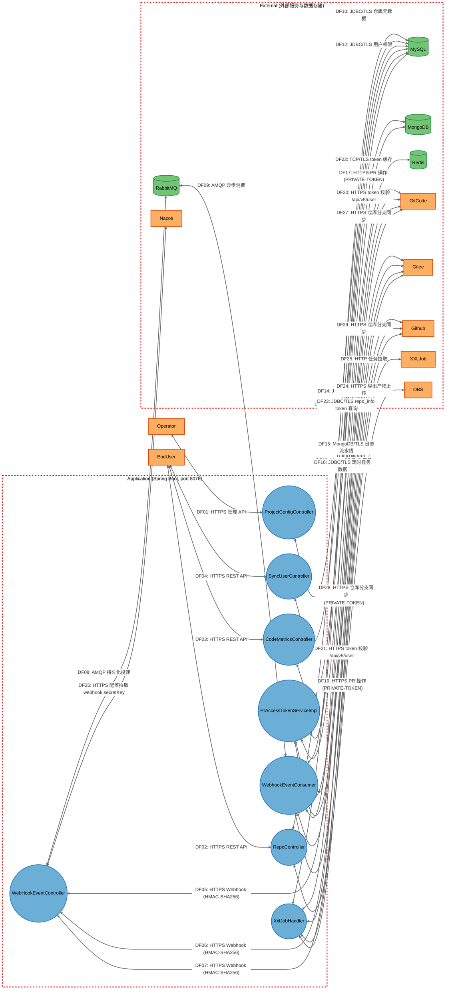
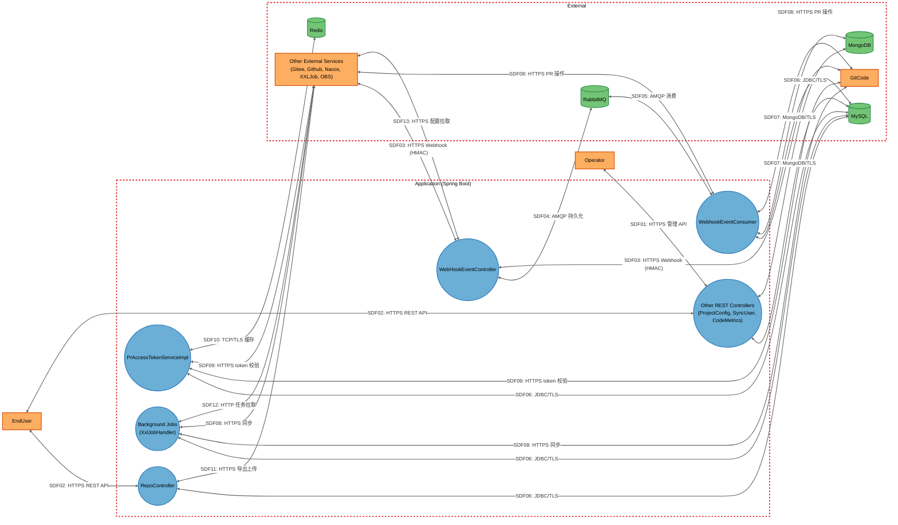

# Threat Model

## Data Flow Diagram

## Element Table

| Element | Type | TMT Category | Description | Trust Boundary |
|---------|------|--------------|-------------|----------------|
| WebHookEventController | Process | SE.P.TMCore.WebSvc | Webhook 事件接入 REST 控制器，HMAC-SHA256 签名校验后投递 RabbitMQ | Application |
| RepoController | Process | SE.P.TMCore.WebSvc | 仓库元数据 CRUD REST 控制器 | Application |
| ProjectConfigController | Process | SE.P.TMCore.WebSvc | 项目配置与全局配置管理 REST 控制器 | Application |
| SyncUserController | Process | SE.P.TMCore.WebSvc | 用户与权限同步 REST 控制器 | Application |
| CodeMetricsController | Process | SE.P.TMCore.WebSvc | 代码度量查询 REST 控制器 | Application |
| PrAccessTokenServiceImpl | Process | SE.P.TMCore.WebSvc | PR access token 解密、校验与缓存服务 | Application |
| WebhookEventConsumer | Process | SE.P.TMCore.WebSvc | RabbitMQ 异步消费者，分发 webhook 事件至处理器 | Application |
| XxlJobHandler | Process | SE.P.TMCore.WebSvc | XXL-Job 定时任务执行器，仓库/分支/Token 同步 | Application |
| MySQL | Data Store | SE.DS.TMCore.SQL | 关系型数据库，存储项目/仓库/用户/Token 配置 | External |
| MongoDB | Data Store | SE.DS.TMCore.NoSQL | 文档型数据库，存储日志/度量/流水线记录 | External |
| Redis | Data Store | SE.DS.TMCore.Cache | 缓存与分布式锁，token 有效性缓存（TTL 10 分钟） | External |
| RabbitMQ | Data Store | SE.DS.TMCore.NoSQL | 消息队列，承载 webhook/notify/metrics/token 四类队列 | External |
| GitCode | External Interactor | SE.EI.TMCore.WebSvc | GitCode 代码托管平台 API 与 Webhook 事件源 | External |
| Gitee | External Interactor | SE.EI.TMCore.WebSvc | Gitee 代码托管平台 API 与 Webhook 事件源 | External |
| Github | External Interactor | SE.EI.TMCore.WebSvc | GitHub 代码托管平台 API 与 Webhook 事件源 | External |
| Nacos | External Interactor | SE.EI.TMCore.WebSvc | 华为云 CSE Nacos 配置中心与服务注册 | External |
| XXLJob | External Interactor | SE.EI.TMCore.WebSvc | XXL-Job 调度中心，下发定时任务 | External |
| OBS | External Interactor | SE.EI.TMCore.WebSvc | 华为云对象存储，存放仓库导出产物 | External |
| Operator | External Interactor | SE.EI.TMCore.User | 运维管理员，通过内部管理接口操作项目配置与 Token | External |
| EndUser | External Interactor | SE.EI.TMCore.User | OpenLibing 平台研发人员，通过前端调用仓库与度量接口 | External |

## Data Flow Table

| ID | Source | Target | Protocol | Description |
|----|--------|--------|----------|-------------|
| DF01 | Operator | ProjectConfigController | HTTPS | 管理员调用项目配置管理 API（网关鉴权） |
| DF02 | EndUser | RepoController | HTTPS | 研发人员调用仓库元数据 CRUD API |
| DF03 | EndUser | CodeMetricsController | HTTPS | 研发人员调用代码度量查询 API |
| DF04 | EndUser | SyncUserController | HTTPS | 研发人员或上游服务调用用户同步 API |
| DF05 | GitCode | WebHookEventController | HTTPS (HMAC-SHA256) | GitCode 平台转发 push/PR 事件 webhook |
| DF06 | Gitee | WebHookEventController | HTTPS (HMAC-SHA256) | Gitee 平台转发 push/PR 事件 webhook |
| DF07 | Github | WebHookEventController | HTTPS (HMAC-SHA256) | GitHub 平台转发 push/PR 事件 webhook |
| DF08 | WebHookEventController | RabbitMQ | AMQP | Webhook 事件持久化投递到 webhook_event_queue_beta |
| DF09 | RabbitMQ | WebhookEventConsumer | AMQP | 异步消费 webhook 事件队列 |
| DF10 | RepoController | MySQL | JDBC/TLS | 仓库元数据 CRUD（repo_info 表） |
| DF11 | ProjectConfigController | MySQL | JDBC/TLS | 项目配置与全局配置 CRUD |
| DF12 | SyncUserController | MySQL | JDBC/TLS | 用户与权限同步写入（user_basic/role_info 表） |
| DF13 | CodeMetricsController | MongoDB | MongoDB/TLS | 代码度量记录查询 |
| DF14 | WebhookEventConsumer | MySQL | JDBC/TLS | 事件处理时读写仓库/PR 数据 |
| DF15 | WebhookEventConsumer | MongoDB | MongoDB/TLS | 操作日志与 PR 流水线记录写入 |
| DF16 | XxlJobHandler | MySQL | JDBC/TLS | 定时任务读写仓库/分支/Token 数据 |
| DF17 | WebhookEventConsumer | GitCode | HTTPS (PRIVATE-TOKEN) | PR 评论/标签/流水线记录操作 |
| DF18 | WebhookEventConsumer | Gitee | HTTPS (PRIVATE-TOKEN) | PR 评论/标签/流水线记录操作 |
| DF19 | WebhookEventConsumer | Github | HTTPS (PRIVATE-TOKEN) | PR 评论/标签/流水线记录操作 |
| DF20 | PrAccessTokenServiceImpl | GitCode | HTTPS (PRIVATE-TOKEN) | token 有效性校验调用 /api/v5/user |
| DF21 | PrAccessTokenServiceImpl | Gitee | HTTPS (PRIVATE-TOKEN) | token 有效性校验调用 /api/v5/user |
| DF22 | PrAccessTokenServiceImpl | Redis | TCP/TLS | token 有效性缓存读写（TTL 10 分钟） |
| DF23 | PrAccessTokenServiceImpl | MySQL | JDBC/TLS | 查询 repo_info 获取加密 token |
| DF24 | RepoController | OBS | HTTPS (AK/SK) | 仓库导出产物上传到 OBS bucket |
| DF25 | XxlJobHandler | XXLJob | HTTP | XXL-Job 执行器拉取任务调度 |
| DF26 | WebHookEventController | Nacos | HTTPS | 配置拉取（webhook.secretKey 等敏感配置） |
| DF27 | XxlJobHandler | GitCode | HTTPS (PRIVATE-TOKEN) | 定时仓库/分支同步 |
| DF28 | XxlJobHandler | Gitee | HTTPS (PRIVATE-TOKEN) | 定时仓库/分支同步 |
| DF29 | XxlJobHandler | Github | HTTPS (PRIVATE-TOKEN) | 定时仓库/分支同步 |

## Trust Boundary Table

| Boundary | Description | Contains |
|----------|-------------|----------|
| Application | Spring Boot 单进程容器化部署，监听 8076 端口，包含所有控制器、服务、消费者与定时任务处理器 | WebHookEventController, RepoController, ProjectConfigController, SyncUserController, CodeMetricsController, PrAccessTokenServiceImpl, WebhookEventConsumer, XxlJobHandler |
| External | 应用进程之外的所有外部服务、数据存储与人工操作员，通过内网或公网与 Application 交互 | MySQL, MongoDB, Redis, RabbitMQ, GitCode, Gitee, Github, Nacos, XXLJob, OBS, Operator, EndUser |

## Summary View

## Summary to Detailed Mapping

| Summary Element | Contains | Summary Flows | Maps to Detailed Flows |
|-----------------|----------|---------------|------------------------|
| Operator | Operator (kept) | SDF01 | DF01 |
| EndUser | EndUser (kept) | SDF02 | DF02, DF03, DF04 |
| WebHookEventController | WebHookEventController (kept) | SDF03, SDF04, SDF13 | DF05, DF06, DF07, DF08, DF26 |
| RepoController | RepoController (kept) | SDF02, SDF06, SDF11 | DF02, DF10, DF24 |
| PrAccessTokenServiceImpl | PrAccessTokenServiceImpl (kept) | SDF06, SDF09, SDF10 | DF20, DF21, DF22, DF23 |
| WebhookEventConsumer | WebhookEventConsumer (kept) | SDF05, SDF06, SDF07, SDF08 | DF09, DF14, DF15, DF17, DF18, DF19 |
| Other REST Controllers | ProjectConfigController, SyncUserController, CodeMetricsController | SDF01, SDF02, SDF06, SDF07 | DF01, DF03, DF04, DF11, DF12, DF13 |
| Background Jobs | XxlJobHandler | SDF06, SDF08, SDF12 | DF16, DF25, DF27, DF28, DF29 |
| MySQL | MySQL (kept) | SDF06 | DF10, DF11, DF12, DF14, DF16, DF23 |
| Redis | Redis (kept) | SDF10 | DF22 |
| RabbitMQ | RabbitMQ (kept) | SDF04, SDF05 | DF08, DF09 |
| MongoDB | MongoDB (kept) | SDF07 | DF13, DF15 |
| GitCode | GitCode (kept) | SDF03, SDF08, SDF09 | DF05, DF17, DF20, DF27 |
| Other External Services | Gitee, Github, Nacos, XXLJob, OBS | SDF03, SDF08, SDF09, SDF11, SDF12, SDF13 | DF06, DF07, DF18, DF19, DF21, DF24, DF25, DF26, DF28, DF29 |
