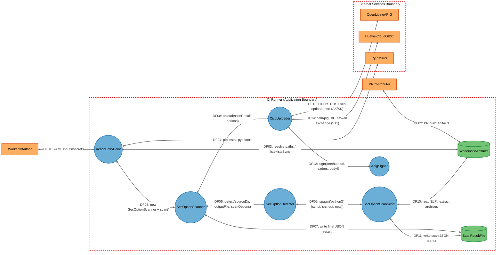

# Threat Model

## Data Flow Diagram

## Element Table

| Element | Type | TMT Category | Description | Trust Boundary |
|---------|------|--------------|-------------|----------------|
| ActionEntryPoint | Process | SE.P.TMCore.OSProcess | `dist/index.js` 中的 `run()` 入口函数：解析 inputs、自动 pip 安装、实例化 Scanner、累计多产物统计、设置 step outputs | CIRunner |
| SecOptionScanner | Process | SE.P.TMCore.OSProcess | `dist/scanner.js` 中的 `SecOptionScanner` 类：编排 detect+upload，写入最终 JSON | CIRunner |
| SecOptionDetector | Process | SE.P.TMCore.OSProcess | `dist/detectors/SecOptionDetector.js`：spawn Python 子进程、捕获 stdout/stderr、回读 JSON | CIRunner |
| SecOptionScanScript | Process | SE.P.TMCore.OSProcess | `dist/bin/sec_option_scan.py`：用 pyelftools 解析 ELF 14 项安全选项、自动解压 .deb/.whl/.jar/.tar.gz/.run | CIRunner |
| CicdUploader | Process | SE.P.TMCore.WebSvc | `dist/uploaders/CicdUploader.js`：按 OIDC/AK-SK 双模式选择新/旧接口与认证方式，HTTPS POST 上报 | CIRunner |
| ApigSigner | Process | SE.P.TMCore.OSProcess | `dist/uploaders/CicdUploader.js` 内部类：实现 SDK-HMAC-SHA256 签名算法，持有 AK/SK 凭证 | CIRunner |
| OpenLibingAPIG | External Interactor | SE.EI.TMCore.WebSvc | openLiBing 后端 APIG 网关 `https://174e1b821a8446f38998a67186ba766e.apic.cn-southwest-2.huaweicloudapis.com` | External |
| HuaweiCloudOIDC | External Interactor | SE.EI.TMCore.AuthProvider | 华为云 STS 联邦认证服务（由 `@openlibing/huaweicloud-oidc-client@0.0.5` SDK 调用） | External |
| PyPIMirror | External Interactor | SE.EI.TMCore.WebSvc | 阿里云 PyPI 镜像 `https://mirrors.aliyun.com/pypi/simple/`（无认证） | External |
| WorkspaceArtifacts | Data Store | SE.DS.TMCore.FS | CI runner 工作区构建产物文件（.tar.gz/.zip/.deb/.whl/.so 等） | CIRunner |
| ScanResultFile | Data Store | SE.DS.TMCore.FS | 扫描结果 JSON 文件（默认 `sec-option-result.json`） | CIRunner |
| WorkflowAuthor | External Interactor | SE.EI.TMCore.User | 维护 workflow YAML 与 repo secrets 的仓库管理员（可信调用方） | （外部） |
| PRContributor | External Interactor | SE.EI.TMCore.User | 通过 pull_request_target 触发 workflow 的外部 PR 作者（潜在对抗） | （外部） |

## Data Flow Table

| ID | Source | Target | Protocol | Description |
|----|--------|--------|----------|-------------|
| DF01 | WorkflowAuthor | ActionEntryPoint | YAML/env vars | workflow YAML inputs + repo secrets 经 runner 环境变量注入 `INPUT_*` |
| DF02 | PRContributor | WorkspaceArtifacts | git push/obs-upload | PR 触发的构建产物落盘到 runner 工作区 |
| DF03 | ActionEntryPoint | WorkspaceArtifacts | FS (Node fs) | `path.resolve` + `fs.existsSync` 校验 artifact-path 多行路径 |
| DF04 | ActionEntryPoint | PyPIMirror | HTTPS (pip) | `execSync('python3 -m pip install --break-system-packages pyelftools -i https://mirrors.aliyun.com/pypi/simple/ --trusted-host mirrors.aliyun.com')` |
| DF05 | ActionEntryPoint | SecOptionScanner | in-process JS call | `new SecOptionScanner(config).scan({sourceDir, output, scanOptions, ...})` |
| DF06 | SecOptionScanner | SecOptionDetector | in-process JS call | `detector.detect(resolvedSource, outputFile, options.scanOptions)` |
| DF07 | SecOptionScanner | ScanResultFile | FS (Node fs) | `fs.writeFileSync(outputFile, JSON.stringify(result, null, 2), 'utf8')` |
| DF08 | SecOptionScanner | CicdUploader | in-process JS call | `uploader.upload(scanResult, { gitUrl, runNumber, pipelineRunId, ... })` |
| DF09 | SecOptionDetector | SecOptionScanScript | process spawn (stdio) | `spawn('python3', [scriptPath, sourceDir, outputFile, scanOptions.join(',')], { stdio: ['ignore','pipe','pipe'] })` |
| DF10 | SecOptionScanScript | WorkspaceArtifacts | FS (Python os/path) | `scan_directory(scan_path)` 递归扫描 + `try_extract_archive` 解压归档 |
| DF11 | SecOptionScanScript | ScanResultFile | FS (Python json.dump) | Python 端写入 `{summary, details}` JSON 到 outputFile |
| DF12 | CicdUploader | ApigSigner | in-process JS call | `new ApigSigner(ak, sk).sign({ method, url, headers, body })` 返回含 Authorization 的 headers |
| DF13 | CicdUploader | OpenLibingAPIG | HTTPS (axios) | `axios.post(url, body, { headers, timeout })` 到 `/openlibing-cicd/build-artifact/sec-option/report`（AK/SK 模式） |
| DF14 | CicdUploader | HuaweiCloudOIDC | HTTPS (SDK callApig) | `callApig('POST', url, headers, body)` 完成 ID Token→STS→V11 签名链路后请求 `/action-api/build-artifact/sec-option/report` |

## Trust Boundary Table

| Boundary | Description | Contains |
|----------|-------------|----------|
| CIRunner | CI runner 临时单租户工作区，Action 以 node16 进程运行 + Python 子进程，仅本地文件系统访问与 outbound HTTPS | ActionEntryPoint, SecOptionScanner, SecOptionDetector, SecOptionScanScript, CicdUploader, ApigSigner, WorkspaceArtifacts, ScanResultFile |
| External | 不可信公网服务域，Action 通过 outbound HTTPS 访问的 APIG 网关、华为云 STS OIDC、阿里云 PyPI 镜像 | OpenLibingAPIG, HuaweiCloudOIDC, PyPIMirror |
