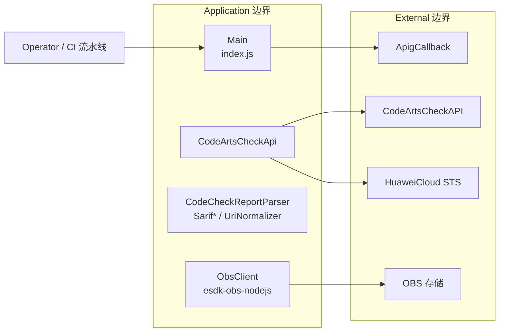

# upload-sarif-action 威胁建模分析报告（STRIDE-A）

> **项目**：openlibing-upload-sarif（upload-sarif-action）
> **仓库**：https://gitcode.com/openlibing/upload-sarif-action.git · 分支 `main` · Commit `96296fe`
> **方法**：STRIDE-A + Zero Trust + 可利用性分级 · 中文版
> **部署分类**：`LOCALHOST_SERVICE`（GitCode runner 出站型 CI 客户端，node16）

---

## 目录

1. [分析范围与环境](#1-分析范围与环境)
2. [架构概览](#2-架构概览)
3. [组件与信任边界（DFD）](#3-组件与信任边界dfd)
4. [STRIDE-A 分析](#4-stride-a-分析)
5. [Findings（按可利用性分级）](#5-findings按可利用性分级)
6. [Action Summary](#6-action-summary)
7. [分析上下文与假设](#7-分析上下文与假设)
8. [参考文献](#8-参考文献)

---

## 1. 分析范围与环境

### 1.1 功能简介

将任意工具产出的 SARIF、CodeArts 代码检查报告（Markdown/原生 SARIF）或 CodeArts Check API 拉取的问题明细转换为 SARIF，上传 OBS 生成构建产物 JSON（OIDC 认证）。三条数据源（`report_file` / CodeArts API / `sarif_file`）统一产出 SARIF 后：

1. SARIF uri 归一化（机器绝对路径 → 相对仓库根）；
2. 从源码补齐 `region.snippet` / `contextRegion.snippet`；
3. 上传 OBS（`ACL: 'public-read'`）；
4. 向 APIG 回调通知解析。

### 1.2 技术栈

Node.js `https`、`esdk-obs-nodejs`、`@openlibing/huaweicloud-oidc-client`、自实现 AK/SK 签名（`SDK-HMAC-SHA256`）。

### 1.3 组件清单

| 组件 ID                         | 类型         | 锚点                                | 职责                              |
| ------------------------------- | ------------ | ----------------------------------- | --------------------------------- |
| `Main`                          | 进程         | index.js                            | 数据源收集、OIDC 换证、上传、回调 |
| `CodeArtsCheckApi`              | 进程         | src/api/CodeArtsCheckApi.js         | AK/SK 签名拉取问题明细            |
| `CodeCheckReportParser`         | 进程         | src/parser/CodeCheckReportParser.js | Markdown 报告解析                 |
| `SarifNormalizer/UriNormalizer` | 进程         | src/sarif/*                         | SARIF 规范化/归一化               |
| `ObsClient`                     | 进程(第三方) | esdk-obs-nodejs                     | 对象上传（public-read）           |
| `CodeArtsCheckAPI`              | 外部服务     | 华为云 codecheck                    | 问题明细 API                      |
| `OBS`                           | 外部服务     | OBS 桶                              | SARIF 存储                        |
| `ApigCallback`                  | 外部服务     | OpenLibing APIG                     | 上传结果回传                      |
| `HuaweiCloudSTS`                | 外部服务     | —                                   | OIDC 换证                         |
| `Operator`                      | 外部角色     | CI 触发者                           | 配置输入                          |

---

## 2. 架构概览

模块分离良好：`api/`（CodeArts 客户端）、`parser/`（报告解析）、`sarif/`（规范化/生成）、`util/`（fetch polyfill、指纹）。上传前会做 uri 归一化与源码 snippet 补齐，最后对象以 `public-read` 上传，并向 APIG 回调。

---

## 3. 组件与信任边界（DFD）

### 组件暴露表

| 组件             | 监听地址       | 认证屏障   | 外部可达           | 最小前置条件                               |
| ---------------- | -------------- | ---------- | ------------------ | ------------------------------------------ |
| Main 等          | 无监听（出站） | —          | 否（出站）         | `Local Process Access`                     |
| OBS 对象         | 公读桶         | 无（公读） | **是（公开可读）** | `Authenticated User`（上传时）→ 读取无前置 |
| CodeArtsCheckAPI | 华为云托管     | IAM/AK-SK  | 是（受控）         | `Authenticated User`                       |

---

## 4. STRIDE-A 分析

### 4.1 Main / ObsClient

| 类别                       | 威胁                                                                                                                 | 前置条件                                     | Tier             | 状态                |
| -------------------------- | -------------------------------------------------------------------------------------------------------------------- | -------------------------------------------- | ---------------- | ------------------- |
| I (Information Disclosure) | **OBS 对象 `ACL:'public-read'`**：SARIF 含源码代码片段（snippet），被设为公读对象 → 仓库扫描到的敏感源码可被公开访问 | `Authenticated User`（上传时）→ 公开访问后果 | T2（上传后暴露） | Open（高优先级）    |
| T (Tampering)              | 从源码读取并写回 snippet，若源码被污染，上传内容随之被篡改                                                           | `Local Process Access`                       | T2               | Open                |
| D (DoS)                    | 最多拉取 50 页（10000 条）问题，异常循环受控                                                                         | `Local Process Access`                       | T2               | Mitigated（有上限） |
| A (Abuse)                  | `buildToolPrefix` 由工具名动态拼 OBS 前缀，工具名来自用户输入/文件，未规范化字符集                                   | `Privileged User`                            | T2               | Open                |
| E (Privilege Escalation)   | 依赖 OIDC 临时凭证服务端授权；不参与跨账号提升                                                                       | —                                            | —                | N/A                 |

### 4.2 CodeArtsCheckApi

| 类别                       | 威胁                                                                                     | 前置条件               | Tier | 状态 |
| -------------------------- | ---------------------------------------------------------------------------------------- | ---------------------- | ---- | ---- |
| I (Information Disclosure) | 回退模式下 `legacyAk/legacySk`（`CODEARTS_IAM_AK/SK`）为静态凭证，在内存与请求签名中使用 | `Local Process Access` | T2   | Open |
| T (Tampering)              | AK/SK 签名算法为自实现（StringToSign 3 行、无 CredentialScope），与官方 SDK 一致性需验证 | `Local Process Access` | T2   | Open |
| S (Spoofing)               | 请求参数（projectId/taskId）来自输入/URL 解析，缺少来源可信校验                          | `Authenticated User`   | T2   | Open |

### 4.3 CodeCheckReportParser / Sarif 处理

| 类别                       | 威胁                                                                                                | 前置条件                         | Tier | 状态 |
| -------------------------- | --------------------------------------------------------------------------------------------------- | -------------------------------- | ---- | ---- |
| T (Tampering)              | Markdown 报告解析按固定章节/表格进行，CSV 式跨边界数据无校验，被恶意报告可注入任意问题条目          | `Authenticated User`（报告来源） | T2   | Open |
| I (Information Disclosure) | SARIF uri 指向的文件被读取（snippet），若报告 uri 失控可读取工作区内任意文件内容并随公读 SARIF 上传 | `Local Process Access`           | T2   | Open |
| D (DoS)                    | 大报告/大 SARIF 全量载入内存后 parse                                                                | `Local Process Access`           | T2   | Open |

---

## 5. Findings（按可利用性分级）

### Tier 2 — Conditional Risk

**FIND-SARIF-01（高优先级）：OBS 对象公读，扫描源码全量公开**

- **描述**：`putObject`（index.js 第 842-847 行）使用 `ACL:'public-read'`，且常量 `OBS_BUCKET='openlibing-gitcode-action'`、`OBS_READ_ENDPOINT` 直接构造可下载 URL。SARIF 中已写入 `region.snippet`（对齐问题行源码）+ `contextRegion.snippet`（上下 2 行源码），使得被扫描仓库的**代码片段可被任何人匿名下载**。
- **证据**：`index.js` 第 48-49 行（桶/端点）、第 796-807 行（OBS 路径+downloadUrl）、第 842-847 行（public-read）、第 453-505 行（snippet 补齐）。
- **缓解举措**：改用支持私读+签名 URL 的对象 ACL；或受控的短期预签名 URL 提供给回调而非持久公读；对 snippet 做脱敏；评估是否必须回传整份源码片段。
- **验证**：匿名访问 downloadUrl 是否可读。
- CVSS：`CVSS:4.0/AV:N/AC:L/AT:N/PR:L/UI:N/VC:H/VI:N/VA:N/SC:N/SI:N/SA:N`（6.9）（对象位于公网 OBS，读取方无需本地访问 → 此处 `AV:N` 为可接受特例；Tier 2）
- CWE：[CWE-538](https://cwe.mitre.org/data/definitions/538.html)/[CWE-200](https://cwe.mitre.org/data/definitions/200.html) · OWASP：[A01:2025](https://owasp.org/Top10/2025/)
- Remediation Effort：Medium

**FIND-SARIF-02：静态 IAM AK/SK 回退凭证**

- **描述**：`CODEARTS_IAM_AK/SK` 静态凭证可被 Runner 环境注入并在 CodeArts 签名请求中使用；与 OIDC 临时凭证并存，扩大静态凭证暴露面。
- **证据**：`index.js` 第 640-641 行、第 685-687 行。
- **缓解举措**：优先 OIDC 临时凭证；静态 AK/SK 仅作受控 fallback 并纳入轮换与来源审计。
- **验证**：确认 runner 是否必须注入静态 AK/SK。
- CVSS：`CVSS:4.0/AV:L/AC:L/AT:N/PR:L/UI:N/VC:H/VI:N/VA:N/SC:N/SI:N/SA:N`（6.6）
- CWE：[CWE-798](https://cwe.mitre.org/data/definitions/798.html) · OWASP：[A07:2025](https://owasp.org/Top10/2025/)
- Remediation Effort：Low

**FIND-SARIF-03：自实现 AK/SK 签名与官方规范的一致性风险**

- **描述**：`CodeArtsCheckApi` 手写 `SDK-HMAC-SHA256` 签名，`StringToSign` 仅 3 行（无 CredentialScope），与华为云官方 SDK 可能不一致；若网关收紧校验将导致静默认证失败或重放面拓宽。
- **证据**：`src/api/CodeArtsCheckApi.js` 第 79-94 行。
- **缓解举措**：对照官方 SDK 规范核对 CanonicalRequest/StringToSign；优先使用官方 SDK。
- **验证**：与官方 SDK 签名结果交叉比对。
- CVSS：`CVSS:4.0/AV:L/AC:H/AT:N/PR:L/UI:N/VC:N/VI:N/VA:N/SC:N/SI:H/SA:N`（4.7）
- CWE：[CWE-347](https://cwe.mitre.org/data/definitions/347.html) · OWASP：[A06:2025](https://owasp.org/Top10/2025/)
- Remediation Effort：Medium

**FIND-SARIF-04：SARIF uri 驱动的文件读取可能扩展到工作区外**

- **描述**：`resolveSourceFile` 对绝对路径 uri / `file://` 直接按路径读文件（index.js 第 416-443 行），若报告/SARIF 的 uri 指向敏感文件，其内容会被吞入公读 SARIF snippet。
- **证据**：`index.js` 第 416-443 行、第 453-505 行。
- **缓解举措**：对读取路径做工作区根目录约束检查；禁止越界 uri。
- **验证**：构造指向工作区外文件的 uri 观察读取行为。
- CVSS：`CVSS:4.0/AV:L/AC:L/AT:N/PR:L/UI:N/VC:H/VI:N/VA:N/SC:N/SI:N/SA:N`（6.6）
- CWE：[CWE-22](https://cwe.mitre.org/data/definitions/22.html) · OWASP：[A05:2025](https://owasp.org/Top10/2025/)
- Remediation Effort：Medium

**FIND-SARIF-05：非受信报告/Markdown 解析缺少健壮校验**

- **描述**：报告解析依赖固定章节/表格，对跨列数据、异常行多靠 `warnings` 静默跳过，缺少对报告来源可信度与内容量级的强校验。
- **证据**：`src/parser/CodeCheckReportParser.js` 第 140-192 行。
- **缓解举措**：增强输入卫生（长度/字符集/来源校验）；对不可信报告拒绝并告警。
- **验证**：投喂畸形报告看解析行为。
- CVSS：`CVSS:4.0/AV:L/AC:L/AT:N/PR:L/UI:N/VC:L/VI:L/VA:L/SC:N/SI:N/SA:N`（5.3）
- CWE：[CWE-74](https://cwe.mitre.org/data/definitions/74.html) · OWASP：[A05:2025](https://owasp.org/Top10/2025/)
- Remediation Effort：Medium

### Tier 3 — Defense-in-Depth

**FIND-SARIF-06：工具名前缀污染 OBS 对象路径**

- **描述**：`extractToolName` 从 SARIF 工具名拼路径前缀，`buildToolPrefix` 会做字符过滤但前缀由文件内容驱动；异常内容可能导致非预期 key（影响可管理性，不直接泄露）。
- **证据**：`index.js` 第 383-403 行。
- **缓解举措**：对工具名做白名单/最大长度。
- **验证**：构造含特殊字符的工具名观察 OBS key。
- CVSS：`CVSS:4.0/AV:L/AC:L/AT:N/PR:L/UI:N/VC:N/VI:N/VA:N/SC:N/SI:L/SA:N`（3.1）
- CWE：[CWE-501](https://cwe.mitre.org/data/definitions/501.html) · OWASP：[A02:2025](https://owasp.org/Top10/2025/)
- Remediation Effort：Low

---

## 6. Action Summary

### Quick Wins（T2 修复）

| Finding       | 修复动作                            | 工作量 |
| ------------- | ----------------------------------- | ------ |
| FIND-SARIF-01 | OBS 改私读 + 签名 URL；snippet 脱敏 | Medium |
| FIND-SARIF-02 | 优先 OIDC、静态 AK/SK 纳入轮换      | Low    |
| FIND-SARIF-04 | 读取路径限定工作区根                | Medium |
| FIND-SARIF-03 | 对齐官方签名规范                    | Medium |

---

## 7. 分析上下文与假设

### Needs Verification

| 项                                      | 说明                                                         |
| --------------------------------------- | ------------------------------------------------------------ |
| OBS 对象为何需 `public-read`            | 注释称后端匿名 HTTP GET 下载；需确认是否有收紧空间的替代方案 |
| 静态 IAM AK/SK 在真实留声机中的注入范围 | 需 CICD 侧确认是否可彻底移除静态凭证                         |
| 自实现签名与官方 SDK 的逐字节一致性     | 需交叉实测                                                   |

### Finding Overrides

| Finding       | Override 说明                                                                          |
| ------------- | -------------------------------------------------------------------------------------- |
| FIND-SARIF-01 | `AV:N` 特例成立条件：对象确认处于公网 OBS 公读；若改为私读+签名 URL，Tier/向量相应下调 |
| FIND-SARIF-02 | 若静态 AK/SK 实际已不再使用，可删除该回退路径                                          |

---

## 8. 参考文献

### 安全标准

| 标准              | URL                                                    |
| ----------------- | ------------------------------------------------------ |
| CVSS v4.0         | https://www.first.org/cvss/v4.0/specification-document |
| CWE               | https://cwe.mitre.org/                                 |
| OWASP Top 10:2025 | https://owasp.org/Top10/2025/                          |

### 组件文档

| 组件                                | URL                                                       |
| ----------------------------------- | --------------------------------------------------------- |
| esdk-obs-nodejs                     | https://github.com/huaweicloud/huaweicloud-sdk-nodejs-obs |
| @openlibing/huaweicloud-oidc-client | https://gitcode.com/openlibing                            |
| 华为云 CodeArts Check               | https://www.huaweicloud.com/                              |
