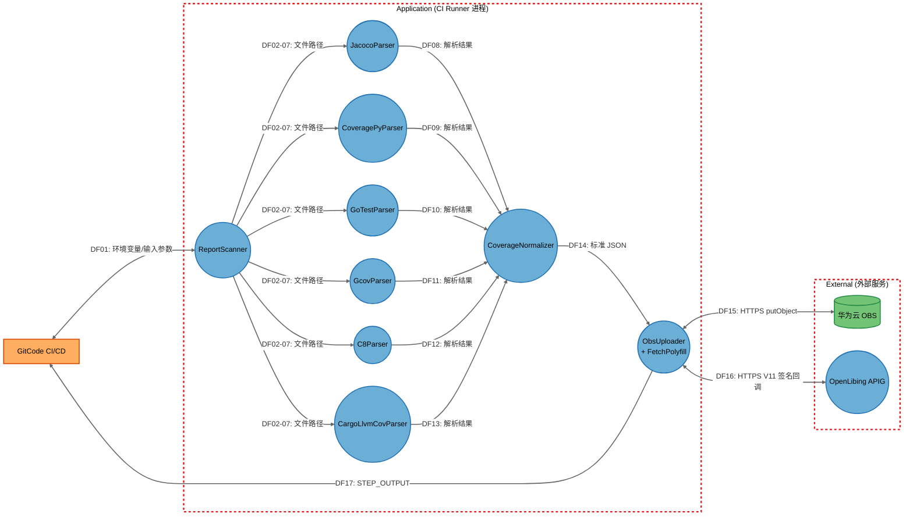
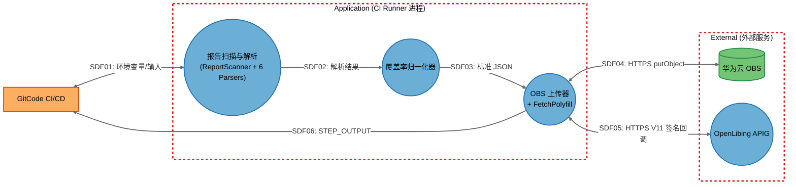

# upload-ut-action 威胁分析报告（STRIDE-A）

## 1. 报告元数据

| 字段 | 值 |
|------|-----|
| 分析对象 | upload-ut-action —— GitCode 平台 CI/CD 覆盖率报告扫描与上报 Action |
| 仓库 | `https://gitcode.com/openlibing/upload-ut-action.git` |
| 分支 / Commit | `main` / `ecf1c3e` |
| Commit 日期 | 2026-10-09 16:08:03 +0800 |
| 分析模型 | GLM-5.3（STRIDE-A 威胁建模） |
| 分析开始时间（UTC） | 2026-10-10 00:55:11 |
| 分析完成时间（UTC） | 2026-10-10 01:12:00 |
| 部署分类 | `NETWORK_SERVICE`（CI/CD Action，运行于 CI Runner 上） |
| 复核修订记录（v1.0/v1.1） | **v1.0**（2026-10-10）：初始 STRIDE-A 分析，33 威胁 / 15 发现；**v1.1**（2026-10-10 02:44:13 UTC）：逐项对照源码复核攻击前提——6 项误报驳回（FIND-02/04/07/10/13/14）、2 项并入 FIND-01（FIND-03/05）、3 项降级为非安全建议（FIND-06/08/12）、1 项确认为设计决策（FIND-09）；FIND-15 由 Moderate 升级为 **Critical 8.5**。必须修复项收敛为 FIND-01 与 FIND-15 |
| 报告版本 | **整理版 v1.0（2026-10-10）**——依据原始报告 v1.1 复核结论整理为统一模板；整理过程中对 FIND-01/15（必须修复项）与 FIND-02/07/10（误报项）做了代码抽查复核，抽查结论与原报告一致，未发现偏差 |
| 原始报告路径 | `d:\01zw\安全分析漏洞挖掘\upload-ut-action\threat-model-20261010-005511\威胁模型分析报告.md` |

---

## 2. 分析结论速览

### 2.1 发现状态汇总

| 状态 | 数量 | 发现编号 |
|------|------|---------|
| ✅ 需修复（安全） | 3 | FIND-01、FIND-15（P0 必须修复）；FIND-11（P1 低危建议修复） |
| ⚠️ 建议改进（非安全/代码质量） | 3 | FIND-06、FIND-08、FIND-12 |
| ℹ️ 设计决策（非漏洞） | 1 | FIND-09 |
| ❌ 误报 | 6 | FIND-02、FIND-04、FIND-07、FIND-10、FIND-13、FIND-14 |
| ➡️ 已合并 | 2 | FIND-03、FIND-05（已并入 FIND-01，作为 public-read 的衍生后果，不再作为独立发现） |

> 统计口径：共 15 项发现、33 个威胁（S:2, T:10, R:2, I:6, D:10, E:1, A:2），其中威胁 T09.E 由平台缓解（IAM 策略属华为云平台管理范畴）。威胁覆盖率 32/33 = 97.0%。

### 2.2 需修复问题（按优先级）

| 优先级 | 发现编号 | 等级 | 问题概述 | 修复方案要点 |
|--------|---------|------|---------|-------------|
| **P0** | FIND-15 | **Critical 8.5** | pre-commit 工作流 `pull_request_target` + 检出 PR 代码（`allow-unsafe-pr-checkout: true`）+ 自托管 Runner：任何注册用户提交恶意 PR 即可在 Runner 上执行任意代码（RCE） | 移除 `allow-unsafe-pr-checkout: true`；若必须对 PR 运行 pre-commit 则改用 `pull_request` 事件 + 托管/一次性容器 Runner；临时缓解：仅使用默认分支 hook 配置 + fork PR 手动审批门禁 |
| **P0** | FIND-01 | High 7.1 | OBS 上传硬编码 `ACL: 'public-read'`，覆盖率数据（含仓库文件结构）可被任意互联网用户通过公网 URL 读取与枚举（吸收原 FIND-03 Key 可预测、FIND-05 匿名带宽耗尽） | 改私有 ACL；APIG 回调携带对象 Key，后端用 STS 临时凭证或预签名 URL 下载；如需公开访问则用带过期时间的预签名 URL |
| P1 | FIND-11 | Low 4.3 | 临时文件名仅含 `Date.now()` 时间戳且默认权限（0644），同主机其他进程可读取 | `crypto.randomUUID()` 随机文件名 + `fs.writeFileSync(..., { mode: 0o600 })` |

> **修复顺序说明**：FIND-15 针对本仓库自身 CI 的任意代码执行入口，任何注册用户可立即利用，且修复仅需删除一行配置——应最先修复；FIND-01 是消费方（使用该 Action 的仓库）的数据暴露面，需与后端协调回调拉取方式，可并行推进。

### 2.3 误报清单及驳回理由

| 发现编号 | 初版定级 | 驳回理由（一句话） |
|---------|---------|-------------------|
| FIND-02 | Important 6.9 | Node.js `https.request` 默认 `rejectUnauthorized: true` 且代码无任何覆盖项，攻击前提需 Runner 进程已被完全控制，任何纵深措施均无意义 |
| FIND-04 | Moderate 5.3 | APIG 回调要求 V11 签名（OIDC 临时凭证），"PR:N 无认证屏障"前提错误；网关限流属平台侧职责，本仓库代码无法证实 |
| FIND-07 | Moderate 5.1 | 正则无嵌套量词（不存在 `(a+)+` 型模式），最坏仅 O(n²) 线性回溯，无指数级灾难性回溯，且输入为 CI 自身生成的报告 |
| FIND-10 | Moderate 4.3 | `withRetrySync` 为死代码（仅定义与导出、无任何调用点），主流程 OBS 上传与 APIG 回调均使用 `withRetryAsync`，不存在运行时事件循环阻塞 |
| FIND-13 | Moderate 4.3 | 拼入 `find` 命令的唯一变量 `WORKSPACE` 由 CI 平台注入非攻击者可控，`report_dir` 从不进入 shell，能篡改环境变量者已完全控制 Runner |
| FIND-14 | Low 3.4 | `value` 恒为字符串，`obj.__proto__ = '字符串'` 被 setter 静默忽略（非对象值不生效），下游仅读取白名单键，无原型污染路径 |

---

## 3. 系统架构概述

### 3.1 系统目的

`upload-ut-action` 是 GitCode（AtomGit）平台的 CI/CD Action 插件，用于在流水线中自动扫描多种单元测试覆盖率报告（JaCoCo / coverage.py / Go test / gcov / llvm-cov / c8 / cargo-llvm-cov），将其解析为标准 JSON 格式，通过 OIDC 联邦认证换取华为云临时凭证后上传至 OBS（对象存储），并回调 OpenLibing coderepo 平台完成覆盖率数据入库。

### 3.2 技术栈

| 技术 | 用途 | 版本 |
|------|------|------|
| Node.js (node16) | Action 运行时 | ≥16 |
| `esdk-obs-nodejs` | 华为云 OBS SDK | ^3.26.2 |
| `@openlibing/huaweicloud-oidc-client` | OIDC 联邦认证 + APIG V11 签名 | 0.0.5 |
| `@vercel/ncc` | 打包构建工具 | ^0.38.1 |
| `adm-zip` | 发布包打包 | ^0.5.16 |
| GitCode CI/CD | 流水线执行平台 | — |

### 3.3 部署模型与分类

**NETWORK_SERVICE**：该 Action 运行于 GitCode CI/CD Runner 上，运行时通过环境变量接收平台注入的仓库信息（`ATOMGIT_*`），向外部网络服务（华为云 OBS、APIG）发起 HTTPS 请求。Action 本身无网络监听端口，但处理来自 CI/CD 环境的输入（`report_dir`、环境变量），并与多个外部网络端点通信；其输出数据存储在公网可达的 OBS 桶中。Tier 1 发现仅涉及外部服务（OBS/APIG）的公网暴露面，Tier 2 发现均需要 Local Process Access（CI Runner 执行环境）。

### 3.4 组件清单

| ID | 显示名称 | 类型 | 来源文件 | 信任边界 |
|----|---------|------|---------|---------|
| ReportScanner | 报告扫描器 | Process | [ReportScanner.js](file:///d:/01zw/安全分析漏洞挖掘/upload-ut-action/src/parser/ReportScanner.js) | Application |
| JacocoParser | JaCoCo 解析器 | Process | [JacocoParser.js](file:///d:/01zw/安全分析漏洞挖掘/upload-ut-action/src/parser/JacocoParser.js) | Application |
| CoveragePyParser | coverage.py 解析器 | Process | [CoveragePyParser.js](file:///d:/01zw/安全分析漏洞挖掘/upload-ut-action/src/parser/CoveragePyParser.js) | Application |
| GoTestParser | Go test 解析器 | Process | [GoTestParser.js](file:///d:/01zw/安全分析漏洞挖掘/upload-ut-action/src/parser/GoTestParser.js) | Application |
| GcovParser | gcov/lcov 解析器 | Process | [GcovParser.js](file:///d:/01zw/安全分析漏洞挖掘/upload-ut-action/src/parser/GcovParser.js) | Application |
| C8Parser | c8 解析器 | Process | [C8Parser.js](file:///d:/01zw/安全分析漏洞挖掘/upload-ut-action/src/parser/C8Parser.js) | Application |
| CargoLlvmCovParser | cargo-llvm-cov 解析器 | Process | [CargoLlvmCovParser.js](file:///d:/01zw/安全分析漏洞挖掘/upload-ut-action/src/parser/CargoLlvmCovParser.js) | Application |
| CoverageNormalizer | 覆盖率归一化器 | Process | [CoverageNormalizer.js](file:///d:/01zw/安全分析漏洞挖掘/upload-ut-action/src/normalizer/CoverageNormalizer.js) | Application |
| ObsUploader | OBS 上传器 | Process | [ObsUploader.js](file:///d:/01zw/安全分析漏洞挖掘/upload-ut-action/src/obs/ObsUploader.js) | Application |
| FetchPolyfill | Fetch Polyfill | Process | [fetchPolyfill.js](file:///d:/01zw/安全分析漏洞挖掘/upload-ut-action/src/util/fetchPolyfill.js) | Application |
| OBS | 华为云 OBS | Data Store | [ObsUploader.js](file:///d:/01zw/安全分析漏洞挖掘/upload-ut-action/src/obs/ObsUploader.js)（集成点：OBS_BUCKET、OBS_READ_ENDPOINT） | External |
| APIG | OpenLibing APIG | Process | [ObsUploader.js](file:///d:/01zw/安全分析漏洞挖掘/upload-ut-action/src/obs/ObsUploader.js)（集成点：OIDC_PROD_BASE、OIDC_BETA_BASE、CALLBACK_PATH） | External |
| GitCodeCI | GitCode CI/CD 平台 | External Actor | [pre-commit.yml](file:///d:/01zw/安全分析漏洞挖掘/upload-ut-action/.gitcode/workflows/pre-commit.yml)、action.yml | External |

信任边界共 2 个：**Application（CI Runner 进程）**——包含 `src/parser`、`src/normalizer`、`src/obs`、`src/util` 全部进程组件；**External（外部服务）**——OBS、APIG 等外部端点。

### 3.5 组件暴露表

| 组件 | 监听地址 | 认证屏障 | 外部可达性 | 最低先决条件 | 派生层级 |
|------|----------|----------|------------|-------------|---------|
| ReportScanner | 无监听 | 无（CI 环境执行） | 不可达 | Local Process Access | T2 |
| JacocoParser | 无监听 | 无 | 不可达 | Local Process Access | T2 |
| CoveragePyParser | 无监听 | 无 | 不可达 | Local Process Access | T2 |
| GoTestParser | 无监听 | 无 | 不可达 | Local Process Access | T2 |
| GcovParser | 无监听 | 无 | 不可达 | Local Process Access | T2 |
| C8Parser | 无监听 | 无 | 不可达 | Local Process Access | T2 |
| CargoLlvmCovParser | 无监听 | 无 | 不可达 | Local Process Access | T2 |
| CoverageNormalizer | 无监听 | 无 | 不可达 | Local Process Access | T2 |
| ObsUploader | 无监听 | OIDC 临时凭证 | 不可达（出站请求） | Local Process Access | T2 |
| FetchPolyfill | 无监听 | 无 | 不可达（出站请求） | Local Process Access | T2 |
| OBS | HTTPS | 临时 AK/SK/Token | 外部可达（公网读） | None | T1 |
| APIG | HTTPS | V11 签名 + Token | 外部可达 | None | T1 |
| GitCode CI/CD | — | 平台认证 | 外部可达 | None | T1 |

### 3.6 数据流与信任边界

| 流 ID | 源 | 目标 | 协议/描述 |
|-------|----|------|----------|
| DF01 | GitCodeCI | ReportScanner | CI 环境变量注入 report_dir |
| DF02 | ReportScanner | JacocoParser | 报告文件路径 |
| DF03 | ReportScanner | CoveragePyParser | 报告文件路径 |
| DF04 | ReportScanner | GoTestParser | 报告文件路径 |
| DF05 | ReportScanner | GcovParser | 报告文件路径 |
| DF06 | ReportScanner | C8Parser | 报告文件路径 |
| DF07 | ReportScanner | CargoLlvmCovParser | 报告文件路径 |
| DF08 | JacocoParser | CoverageNormalizer | 解析结果 |
| DF09 | CoveragePyParser | CoverageNormalizer | 解析结果 |
| DF10 | GoTestParser | CoverageNormalizer | 解析结果 |
| DF11 | GcovParser | CoverageNormalizer | 解析结果 |
| DF12 | C8Parser | CoverageNormalizer | 解析结果 |
| DF13 | CargoLlvmCovParser | CoverageNormalizer | 解析结果 |
| DF14 | CoverageNormalizer | ObsUploader | 标准 JSON |
| DF15 | ObsUploader | OBS | HTTPS putObject |
| DF16 | ObsUploader | APIG | HTTPS V11 签名回调 |
| DF17 | ObsUploader | GitCodeCI | STEP_OUTPUT 输出 |

关键场景（时序）：

**场景 1：扫描并解析覆盖率报告** —— CI 注入 `INPUT_REPORT_DIR` → ReportScanner 扫描文件/目录 → 按内容嗅探（detectByPath）识别格式并调用对应解析器 → 解析器读取并解析报告 → 归一化文件路径、合并指标 → 产出标准 JSON。

**场景 2：OIDC 换证 + OBS 上传** —— ObsUploader 经 `huaweicloud-oidc-client` 以 OIDC ID Token 自申请 → STS 换临时 AK/SK/Token → 写入临时 JSON 文件 → `putObject(Bucket, Key, SourceFile, ACL=public-read)`（指数退避重试，默认 3 次）→ 清理临时文件。

**场景 3：APIG V11 签名回调** —— `new V11Signer(region)`，`signer.Key = AK`、`signer.Secret = SK` → 计算 V11 HMAC-SHA256 签名 → `POST /action-api/ut/coverage/report`（签名 + X-Security-Token，指数退避重试默认 3 次）→ `{ code: 200, data }`。

### 3.7 已有安全控制

以下控制为原报告架构描述中已确认的既有机制：

| 控制 | 说明 |
|------|------|
| OIDC 联邦认证 | ID Token 自申请 → 华为云 STS 换临时 AK/SK/SecurityToken，无静态凭证落盘（[ObsUploader.js L8-L13](file:///d:/01zw/安全分析漏洞挖掘/upload-ut-action/src/obs/ObsUploader.js#L8-L13)） |
| APIG 回调 V11 签名 | V11 HMAC-SHA256 签名 + `X-Security-Token`，无凭证请求无法通过认证（[ObsUploader.js L139-L151](file:///d:/01zw/安全分析漏洞挖掘/upload-ut-action/src/obs/ObsUploader.js#L139-L151)） |
| 指数退避重试 | OBS 上传与 APIG 回调均带指数退避重试（默认 3 次），`assertOk` 校验 HTTP 2xx 状态 |
| 临时文件清理 | 上传完成后 `finally` 块中 `unlinkSync` 清理临时文件（[ObsUploader.js L128-L134](file:///d:/01zw/安全分析漏洞挖掘/upload-ut-action/src/obs/ObsUploader.js#L128-L134)） |
| 报告格式内容嗅探 | ReportScanner `detectByPath` 按内容特征识别报告格式，避免按扩展名误派发解析器 |

---

## 4. STRIDE-A 威胁分析

> **注（v1.1）**：本节为威胁枚举全景（假设性攻击面），其中部分威胁经复核被判定为误报或降级（详见第 5 节各发现的复核判定）。
>
> **可利用性层级**：Tier 1 直接暴露（None，无需认证的外部攻击者可直接利用）；Tier 2 条件风险（单一先决条件：认证用户/内部网络/本地进程）；Tier 3 纵深防御（多重先决条件/主机 OS 访问）。

### 4.1 数据流图

详细 DFD：

摘要 DFD：

| 摘要元素 | 包含组件 | 摘要流 | 对应详细流 |
|---------|---------|-------|-----------|
| ParserLayer | ReportScanner, JacocoParser, CoveragePyParser, GoTestParser, GcovParser, C8Parser, CargoLlvmCovParser | SDF01, SDF02 | DF01-DF13 |
| CoverageNormalizer | CoverageNormalizer | SDF02, SDF03 | DF08-DF14 |
| ObsUploader | ObsUploader, FetchPolyfill | SDF03, SDF04, SDF05, SDF06 | DF14-DF17 |

### 4.2 威胁清单总表

| 威胁 ID | STRIDE 类别 | 威胁描述 | 组件 | 利用前提 | Tier/可利用性层级 | 对应 FIND |
|---------|------------|---------|------|---------|------------------|----------|
| T01.S | 欺骗（S） | 攻击者在 report_dir 路径中放置恶意文件伪装成覆盖率报告，触发路径遍历或文件读取 | ReportScanner | Local Process Access | T2 | FIND-12 |
| T01.T | 篡改（T） | walkDir 递归扫描无深度限制，攻击者构造符号链接环或超深目录导致无限递归 | ReportScanner | Local Process Access | T2 | FIND-06、FIND-12 |
| T01.I | 信息泄露（I） | report_dir 支持逗号分隔多值，攻击者可指定任意文件路径，扫描器读取并输出文件名至日志 | ReportScanner | Local Process Access | T2 | FIND-12 |
| T01.D | 拒绝服务（D） | walkDir 递归扫描超大目录树消耗内存和 CPU，导致 CI Runner 资源耗尽 | ReportScanner | Local Process Access | T2 | FIND-06 |
| T01.A | 滥用（A） | detectByPath 的内容嗅探机制可被滥用：构造特殊 JSON 触发非预期解析器，导致后续处理逻辑异常 | ReportScanner | Local Process Access | T2 | FIND-12 |
| T02.T | 篡改（T） | 正则解析 XML，恶意 XML 注入构造超长 name 属性导致正则回溯爆炸（ReDoS） | JacocoParser | Local Process Access | T2 | FIND-07 |
| T02.D | 拒绝服务（D） | 恶意构造的超大 jacoco.xml 文件导致内存溢出（fs.readFileSync 全量读取） | JacocoParser | Local Process Access | T2 | FIND-07、FIND-08 |
| T03.T | 篡改（T） | JSON.parse 解析恶意 coverage.json，构造深度嵌套 JSON 导致栈溢出或内存耗尽 | CoveragePyParser | Local Process Access | T2 | FIND-08 |
| T03.D | 拒绝服务（D） | fs.readFileSync 全量读取大文件导致内存耗尽 | CoveragePyParser | Local Process Access | T2 | FIND-08 |
| T04.T | 篡改（T） | BLOCK_RE 正则可被恶意构造的超长文件名或数字行触发回溯 | GoTestParser | Local Process Access | T2 | FIND-08 |
| T04.D | 拒绝服务（D） | 超大 coverage.out 文件导致 content.split 消耗大量内存 | GoTestParser | Local Process Access | T2 | FIND-08 |
| T05.T | 篡改（T） | lcov 解析中 current[key] = value 直接赋值无校验，恶意 lcov 文件可注入任意键值 | GcovParser | Local Process Access | T2 | FIND-14 |
| T05.D | 拒绝服务（D） | 超大 .gcov 或 .lcov 文件导致内存耗尽 | GcovParser | Local Process Access | T2 | FIND-08 |
| T06.T | 篡改（T） | JSON.parse 解析恶意 coverage-final.json，深度嵌套导致栈溢出 | C8Parser | Local Process Access | T2 | FIND-08 |
| T06.D | 拒绝服务（D） | 超大 coverage-final.json 导致内存耗尽 | C8Parser | Local Process Access | T2 | FIND-08 |
| T07.T | 篡改（T） | JSON.parse 解析恶意 llvm-cov export JSON，深度嵌套导致栈溢出 | CargoLlvmCovParser | Local Process Access | T2 | FIND-08 |
| T07.D | 拒绝服务（D） | 超大 llvm-cov export JSON 导致内存耗尽 | CargoLlvmCovParser | Local Process Access | T2 | FIND-08 |
| T08.T | 篡改（T） | normalizeFilePath 未对路径做遍历校验（如 `../../etc/passwd`），恶意报告中的文件路径可被注入到标准 JSON 中 | CoverageNormalizer | Local Process Access | T2 | FIND-12 |
| T08.I | 信息泄露（I） | 归一化后的文件路径（含仓库结构信息）被上传至 OBS 并设置为 public-read，暴露仓库目录结构 | CoverageNormalizer | Local Process Access | T2 | FIND-01 |
| T09.S | 欺骗（S） | OIDC 凭证（accessKeyId/secretAccessKey/securityToken）在内存中传递无加密存储；凭证相关信息通过 console.log 间接泄露执行状态 | ObsUploader | Local Process Access | T2 | FIND-11 |
| T09.T | 篡改（T） | buildObsKey 的 repoName 仅做正则替换未限制长度，恶意仓库名可构造超长 OBS Key | ObsUploader | Local Process Access | T2 | FIND-01（经 FIND-03 并入） |
| T09.R | 抵赖（R） | APIG 回调失败时不阻断流程（仅 WARN 日志），OBS 已上传数据无法追溯回调失败原因 | ObsUploader | Local Process Access | T2 | FIND-09 |
| T09.I1 | 信息泄露（I） | OBS 上传使用 `ACL: 'public-read'`，覆盖率数据（含仓库文件结构）可被任意互联网用户读取 | ObsUploader | None | **T1** | FIND-01 |
| T09.I2 | 信息泄露（I） | 临时 JSON 文件写入 os.tmpdir()，文件名包含 `Date.now()` 时间戳，同一主机上其他进程可读取 | ObsUploader | Local Process Access | T2 | FIND-11 |
| T09.D | 拒绝服务（D） | withRetrySync 中使用 `execSync('sleep N')` 阻塞 Node.js 事件循环，重试期间整个进程冻结 | ObsUploader | Local Process Access | T2 | FIND-10 |
| T09.E | 权限提升（E） | OIDC 临时凭证的权限范围由华为云 IAM 策略控制，若 IAM 策略过宽（如 OBS 全桶读写），Action 可被滥用为凭证套利工具 | ObsUploader | Local Process Access | T2（平台缓解） | —（Mitigated by Platform） |
| T09.A | 滥用（A） | APIG 回调 URL 可通过 env_type 切换（prod/beta），恶意 CI 配置可将数据上报至非预期环境 | ObsUploader | Local Process Access | T2 | FIND-15 |
| T10.I | 信息泄露（I） | Polyfill 不验证 HTTPS 证书有效性（直接使用 https.request 未配置 rejectUnauthorized），存在中间人攻击风险 | FetchPolyfill | Internal Network | T2 | FIND-02 |
| T11.T | 篡改（T） | public-read ACL 允许任意用户读取对象；若 IAM 策略允许覆盖写，攻击者可替换已上传的覆盖率数据 | OBS | Authenticated User | T2 | FIND-01（经 FIND-03 并入） |
| T11.I | 信息泄露（I） | OBS 对象通过公开 HTTPS URL 可被任意访问，覆盖率数据含仓库文件结构和覆盖率指标 | OBS | None | **T1** | FIND-01 |
| T11.D | 拒绝服务（D） | public-read 桶可被大量匿名请求下载，消耗 OBS 带宽配额 | OBS | None | **T1** | FIND-01（经 FIND-05 并入） |
| T12.R | 抵赖（R） | APIG 回调仅依赖 HTTP 响应码判断成功，无幂等性保证，重试可能导致重复入库 | APIG | Local Process Access | T2 | FIND-09 |
| T12.D | 拒绝服务（D） | APIG 端点无速率限制，恶意 CI 配置可高频触发回调导致 APIG 后端过载 | APIG | None | **T1** | FIND-04 |

### 4.3 各类威胁详细分析

#### S — 欺骗（2 项）

| 威胁 ID | 组件 | 威胁描述 | 先决条件 | 层级 | 原文缓解措施 |
|---------|------|---------|---------|------|-------------|
| T01.S | ReportScanner（src/parser/ReportScanner.js） | 攻击者在 report_dir 路径中放置恶意文件伪装成覆盖率报告，触发路径遍历或文件读取 | Local Process Access | T2 | 对输入路径做白名单校验或限制在工作空间内 |
| T09.S | ObsUploader（src/obs/ObsUploader.js） | OIDC 凭证（accessKeyId/secretAccessKey/securityToken）在内存中传递，无加密存储；凭证通过 console.log 间接泄露执行状态 | Local Process Access | T2 | 避免日志中输出凭证相关信息 |

#### T — 篡改（10 项）

| 威胁 ID | 组件 | 威胁描述 | 先决条件 | 层级 | 原文缓解措施 |
|---------|------|---------|---------|------|-------------|
| T01.T | ReportScanner | walkDir 递归扫描无深度限制，攻击者构造符号链接环或超深目录导致无限递归 | Local Process Access | T2 | 限制递归深度、检测符号链接 |
| T02.T | JacocoParser | 正则解析 XML（`<package name="...">`），恶意 XML 注入构造超长 name 属性导致正则回溯爆炸（ReDoS） | Local Process Access | T2 | 使用 XML 解析库替代正则，或限制输入大小 |
| T03.T | CoveragePyParser | JSON.parse 解析恶意 coverage.json，构造深度嵌套 JSON 导致栈溢出或内存耗尽 | Local Process Access | T2 | 限制文件大小 |
| T04.T | GoTestParser | BLOCK_RE 正则可被恶意构造的超长文件名或数字行触发回溯 | Local Process Access | T2 | 限制单行长度 |
| T05.T | GcovParser | lcov 解析中 current[key] = value 直接赋值无校验，恶意 lcov 文件可注入任意键值 | Local Process Access | T2 | 白名单过滤 lcov 字段（SF/LF/LH/BRF/BRH/FNF/FNH） |
| T06.T | C8Parser | JSON.parse 解析恶意 coverage-final.json，深度嵌套导致栈溢出 | Local Process Access | T2 | 限制文件大小和嵌套深度 |
| T07.T | CargoLlvmCovParser | JSON.parse 解析恶意 llvm-cov export JSON，深度嵌套导致栈溢出 | Local Process Access | T2 | 限制文件大小和嵌套深度 |
| T08.T | CoverageNormalizer | normalizeFilePath 未对路径做遍历校验（如 `../../etc/passwd`），恶意报告中的文件路径可被注入到标准 JSON 中 | Local Process Access | T2 | 过滤 `..` 路径组件 |
| T09.T | ObsUploader | buildObsKey 的 repoName 仅做正则替换（`[^a-zA-Z0-9._-]+` → `-`），未限制长度，恶意仓库名可构造超长 OBS Key | Local Process Access | T2 | 限制 repoName 长度 |
| T11.T | OBS | public-read ACL 允许任意用户读取对象；若 IAM 策略允许覆盖写，攻击者可替换已上传的覆盖率数据 | Authenticated User | T2 | 使用版本控制或 WORM 策略 |

#### R — 抵赖（2 项）

| 威胁 ID | 组件 | 威胁描述 | 先决条件 | 层级 | 原文缓解措施 |
|---------|------|---------|---------|------|-------------|
| T09.R | ObsUploader | APIG 回调失败时不阻断流程（仅 WARN 日志），OBS 已上传数据无法追溯回调失败原因 | Local Process Access | T2 | 回调失败时记录详细错误上下文，提供重试机制 |
| T12.R | APIG | APIG 回调仅依赖 HTTP 响应码判断成功，无幂等性保证，重试可能导致重复入库 | Local Process Access | T2 | 使用幂等键（如 pipelineRunId） |

#### I — 信息泄露（6 项）

| 威胁 ID | 组件 | 威胁描述 | 先决条件 | 层级 | 原文缓解措施 |
|---------|------|---------|---------|------|-------------|
| T01.I | ReportScanner | report_dir 支持逗号分隔多值，攻击者可指定任意文件路径，扫描器读取并输出文件名至日志 | Local Process Access | T2 | 限制路径在工作空间范围内 |
| T08.I | CoverageNormalizer | 归一化后的文件路径（含仓库结构信息）被上传至 OBS 并设置为 public-read，暴露仓库目录结构 | Local Process Access | T2 | 限制 OBS 对象 ACL 为私有，或脱敏文件路径 |
| T09.I1 | ObsUploader | OBS 上传使用 `ACL: 'public-read'`，覆盖率数据（含仓库文件结构）可被任意互联网用户读取 | **None** | **T1** | 使用私有 ACL + 预签名 URL 或临时授权 |
| T09.I2 | ObsUploader | 临时 JSON 文件写入 os.tmpdir()，文件名包含 `Date.now()` 时间戳，同一主机上其他进程可读取 | Local Process Access | T2 | 使用随机文件名或限制文件权限 |
| T10.I | FetchPolyfill | Polyfill 不验证 HTTPS 证书有效性（直接使用 https.request 未配置 rejectUnauthorized），存在中间人攻击风险 | Internal Network | T2 | 启用 TLS 证书验证 |
| T11.I | OBS | OBS 对象通过公开 HTTPS URL 可被任意访问，覆盖率数据含仓库文件结构和覆盖率指标 | **None** | **T1** | 改用私有 ACL + 预签名 URL |

#### D — 拒绝服务（10 项）

| 威胁 ID | 组件 | 威胁描述 | 先决条件 | 层级 | 原文缓解措施 |
|---------|------|---------|---------|------|-------------|
| T01.D | ReportScanner | walkDir 递归扫描超大目录树消耗内存和 CPU，导致 CI Runner 资源耗尽 | Local Process Access | T2 | 限制扫描文件数量和目录深度 |
| T02.D | JacocoParser | 恶意构造的超大 jacoco.xml 文件导致内存溢出（fs.readFileSync 全量读取） | Local Process Access | T2 | 限制文件大小、流式解析 |
| T03.D | CoveragePyParser | fs.readFileSync 全量读取大文件导致内存耗尽 | Local Process Access | T2 | 限制文件大小、流式读取 |
| T04.D | GoTestParser | 超大 coverage.out 文件导致 content.split 消耗大量内存 | Local Process Access | T2 | 限制文件大小 |
| T05.D | GcovParser | 超大 .gcov 或 .lcov 文件导致内存耗尽 | Local Process Access | T2 | 限制文件大小 |
| T06.D | C8Parser | 超大 coverage-final.json 导致内存耗尽 | Local Process Access | T2 | 限制文件大小 |
| T07.D | CargoLlvmCovParser | 超大 llvm-cov export JSON 导致内存耗尽 | Local Process Access | T2 | 限制文件大小 |
| T09.D | ObsUploader | withRetrySync 中使用 `execSync('sleep N')` 阻塞 Node.js 事件循环，在重试期间导致整个进程冻结 | Local Process Access | T2 | 使用异步 sleep 替代 execSync |
| T11.D | OBS | public-read 桶可被大量匿名请求下载，消耗 OBS 带宽配额 | **None** | **T1** | 限制桶的匿名访问速率 |
| T12.D | APIG | APIG 端点无速率限制，恶意 CI 配置可高频触发回调导致 APIG 后端过载 | **None** | **T1** | 在 APIG 侧配置速率限制 |

#### E — 权限提升（1 项）

| 威胁 ID | 组件 | 威胁描述 | 先决条件 | 层级 | 原文缓解措施 |
|---------|------|---------|---------|------|-------------|
| T09.E | ObsUploader | OIDC 临时凭证的权限范围由华为云 IAM 策略控制，若 IAM 策略过宽（如 OBS 全桶读写），Action 可被滥用为凭证套利工具 | Local Process Access | T2（**平台缓解**） | IAM 策略遵循最小权限原则，限制到特定桶和操作 |

#### A — 滥用（2 项）

| 威胁 ID | 组件 | 威胁描述 | 先决条件 | 层级 | 原文缓解措施 |
|---------|------|---------|---------|------|-------------|
| T01.A | ReportScanner | detectByPath 的内容嗅探机制可被滥用：构造特殊 JSON 触发非预期解析器，导致后续处理逻辑异常 | Local Process Access | T2 | 增加内容嗅探的严格性校验 |
| T09.A | ObsUploader | APIG 回调 URL 可通过 env_type 切换（prod/beta），beta 环境使用不同的 APIG 域名，恶意 CI 配置可将数据上报至非预期环境 | Local Process Access | T2 | 对 env_type 做白名单校验，限制可切换的目标 |

---

## 5. 安全发现详情

### FIND-01：OBS 对象使用 public-read ACL 导致覆盖率数据公开可读

| 属性 | 值 |
|------|-----|
| 状态 | ✅ 需修复（安全）— **P0 必须修复** |
| 等级 | High（SDL Important，CVSS 4.0: 7.1，CWE-200 / OWASP A01:2025） |
| STRIDE 类别 | 信息泄露（I）；关联威胁 T08.I、T09.I1、T11.I |
| 组件 | ObsUploader、OBS |
| 利用前提 | None（Tier 1 直接暴露，无需认证） |

**威胁描述**

ObsUploader 上传覆盖率 JSON 至 OBS 时硬编码 `ACL: 'public-read'`，上传的覆盖率数据可被任何互联网用户通过公开 URL 直接读取。公开 URL 格式为 `https://openlibing-gitcode-action.obs.cn-southwest-2.myhuaweicloud.com/{key}`，且 Key 规则可预测（`ut-coverage-action/{repoName}/{yyyyMMdd}.{HH}/{runId|manual}/ut-coverage.json`），攻击者无需任何凭证即可枚举和下载历史覆盖率数据。数据包含仓库文件路径结构、覆盖率指标等应受保护的内部信息。本发现吸收原 FIND-03（Key 可预测）与 FIND-05（匿名带宽耗尽）作为衍生后果：对象级 public-read ACL 不授予 ListObjects 权限，Key 猜测与带宽耗尽均以本项为前提，修复后自然消失。

**复核判定**

v1.1 确认真实——必须修复（Tier 1 唯一真实数据泄露）。**本次整理抽查已逐行验证，与原报告一致**：

- [ObsUploader.js L124](file:///d:/01zw/安全分析漏洞挖掘/upload-ut-action/src/obs/ObsUploader.js#L124)：`client.putObject({ Bucket: OBS_BUCKET, Key: key, SourceFile: tmpFile, ACL: 'public-read' })` 硬编码 public-read，属实；
- [ObsUploader.js L36](file:///d:/01zw/安全分析漏洞挖掘/upload-ut-action/src/obs/ObsUploader.js#L36)：`OBS_READ_ENDPOINT` 公网读取端点，属实；
- [ObsUploader.js L82-L86](file:///d:/01zw/安全分析漏洞挖掘/upload-ut-action/src/obs/ObsUploader.js#L82-L86)：`buildObsKey` Key 规则可预测（仓库名 + 日期 + 流水线 ID），属实。

**修复建议**

1. 将 `ACL: 'public-read'` 改为私有（删除 ACL 参数或设置为 `private`）；
2. APIG 回调时携带 OBS 对象 Key，后端使用 STS 临时凭证或预签名 URL 下载；
3. 如确需公开访问，使用 OBS 预签名 URL 并设置过期时间。

验证：直接访问 OBS 公开 URL 应返回 403；APIG 回调仍能正常触发后端入库。

### FIND-02：FetchPolyfill 未验证 TLS 证书导致中间人攻击风险

| 属性 | 值 |
|------|-----|
| 状态 | ❌ 误报（已驳回） |
| 等级 | 初版 High（SDL Important，CVSS 4.0: 6.9，CWE-295 / OWASP A02:2025） |
| STRIDE 类别 | 信息泄露（I）；关联威胁 T10.I |
| 组件 | FetchPolyfill |
| 利用前提 | Internal Network（初判 Tier 2） |

**威胁描述**

FetchPolyfill 使用 Node.js 内置 `https.request` 发起 HTTPS 请求，未显式配置 `rejectUnauthorized: true`。在 node16 环境下，若 CI Runner 的 Node.js 配置被修改（如 `NODE_TLS_REJECT_UNAUTHORIZED=0`），OIDC 凭证传输和 APIG 回调可能遭受中间人攻击。

**复核判定**

误报——已驳回。Node.js `https.request` 默认 `rejectUnauthorized: true`；**本次整理抽查 grep 全 `src/` 目录确认无任何 `rejectUnauthorized` / `NODE_TLS_REJECT_UNAUTHORIZED` 覆盖项**，[fetchPolyfill.js L47-L53](file:///d:/01zw/安全分析漏洞挖掘/upload-ut-action/src/util/fetchPolyfill.js#L47-L53) 仅是未显式设置（沿用默认安全值）。攻击前提需要环境篡改，意味着 Runner 进程已被完全控制——此时任何纵深措施均无意义。CVSS 6.9 为虚高，不构成漏洞。

**修复建议**

无需行动 —— Node.js 默认 TLS 证书验证已启用且代码无覆盖项；（可选纵深加固）显式添加 `rejectUnauthorized: true`。

### FIND-03：OBS 对象 Key 路径可预测导致数据枚举风险

| 属性 | 值 |
|------|-----|
| 状态 | ➡️ **已并入 FIND-01**（不再作为独立发现） |
| 等级 | 初版 Medium（SDL Moderate，CVSS 4.0: 5.3，CWE-204 / OWASP A01:2025） |
| STRIDE 类别 | 篡改/信息泄露（T/I）；关联威胁 T09.T、T11.T |
| 组件 | ObsUploader、OBS |
| 利用前提 | None（Tier 1，对象 URL 可预测） |

**威胁描述**

OBS 对象 Key 由可预测组件构成（仓库名 + 日期 + 流水线 ID），结合 FIND-01 的 public-read ACL，攻击者可枚举不同仓库、不同时间的覆盖率数据。

**复核判定**

并入 FIND-01 —— Key 可预测性本身无法独立利用：对象级 public-read ACL 不授予桶 ListObjects 权限，枚举需先依赖 FIND-01 的公开读取；随 FIND-01 修复（私有 ACL）后本项风险消除。代码依据：[ObsUploader.js L82-L86](file:///d:/01zw/安全分析漏洞挖掘/upload-ut-action/src/obs/ObsUploader.js#L82-L86)。

**修复建议**

无需行动 —— 随 FIND-01 修复自然消除；（可选）Key 中加入随机 UUID 组件、桶策略禁止匿名 ListObjects。

### FIND-04：APIG 端点无速率限制可被滥用触发拒绝服务

| 属性 | 值 |
|------|-----|
| 状态 | ❌ 误报（已驳回） |
| 等级 | 初版 Medium（SDL Moderate，CVSS 4.0: 5.3，CWE-770 / OWASP A10:2025） |
| STRIDE 类别 | 拒绝服务（D）；关联威胁 T12.D |
| 组件 | APIG |
| 利用前提 | None（初判 Tier 1） |

**威胁描述**

APIG 回调端点 `https://apig.openlibing.com/action-api/ut/coverage/report` 公网可访问，Action 端 withRetryAsync 默认重试 3 次，恶意 CI 配置可高频触发覆盖率上报（每次含 OIDC 换证 + OBS 上传 + APIG 回调），大量并发可导致 APIG 后端过载。

**复核判定**

误报——已驳回。原判定"PR:N / 无认证屏障"前提错误：APIG 回调要求 V11 签名（华为云 OIDC 临时凭证，见 [ObsUploader.js L139-L151](file:///d:/01zw/安全分析漏洞挖掘/upload-ut-action/src/obs/ObsUploader.js#L139-L151) 签名链路），无凭证攻击者无法调用该端点。APIG 网关限流配置属平台侧职责，无法从本仓库代码证实。已移至"需验证项"（由平台团队在 APIG 控制台确认限流策略）。

**修复建议**

无需行动 —— 端点受 V11 签名认证保护，无凭证不可调用；限流策略由平台侧确认。

### FIND-05：OBS public-read 桶可被匿名用户大量下载导致带宽耗尽

| 属性 | 值 |
|------|-----|
| 状态 | ➡️ **已并入 FIND-01**（不再作为独立发现） |
| 等级 | 初版 Medium（SDL Moderate，CVSS 4.0: 5.3，CWE-770 / OWASP A10:2025） |
| STRIDE 类别 | 拒绝服务（D）；关联威胁 T11.D |
| 组件 | OBS |
| 利用前提 | None（Tier 1，桶对象公网可读） |

**威胁描述**

OBS 桶 `openlibing-gitcode-action` 中的对象使用 public-read ACL，任意互联网用户可无限制下载对象内容，脚本化批量下载历史覆盖率数据可消耗 OBS 带宽配额，导致服务降级或额外费用。

**复核判定**

并入 FIND-01 —— 带宽耗尽是 public-read ACL 的衍生后果，且覆盖率 JSON 均为小文件、独立影响有限；随 FIND-01 修复后本项风险消除。代码依据：[ObsUploader.js L35-L36](file:///d:/01zw/安全分析漏洞挖掘/upload-ut-action/src/obs/ObsUploader.js#L35-L36)（桶名与公网端点）。

**修复建议**

无需行动 —— 随 FIND-01 修复自然消除。

### FIND-06：walkDir 递归扫描无深度限制和符号链接检测

| 属性 | 值 |
|------|-----|
| 状态 | ⚠️ 建议改进（非安全/代码质量）— 部分误报降级 |
| 等级 | 初版 Medium（SDL Moderate，CVSS 4.0: 5.1，CWE-674 / OWASP A10:2025） |
| STRIDE 类别 | 篡改/拒绝服务（T/D）；关联威胁 T01.T、T01.D |
| 组件 | ReportScanner |
| 利用前提 | Local Process Access（Tier 2，CI Runner 环境） |

**威胁描述**

ReportScanner.walkDir 函数递归扫描目录，无最大深度限制且不检测符号链接。攻击者可在覆盖率报告目录中放置符号链接环或超深目录结构，导致无限递归调用栈溢出或 CI Runner 内存耗尽。

**复核判定**

部分误报——降级为健壮性建议。符号链接环攻击不成立：`fs.readdirSync(dir, { withFileTypes: true })` 返回的 Dirent 为 lstat 语义，符号链接的 `isDirectory()` 返回 false，walkDir 不会递归进入符号链接目录（[ReportScanner.js L66-L82](file:///d:/01zw/安全分析漏洞挖掘/upload-ut-action/src/parser/ReportScanner.js#L66-L82)）。剩余的"超深目录递归"仅影响自伤型 DoS（报告目录由流水线自身提供），无安全边界增益。

**修复建议**

非安全改进（P1）：添加最大递归深度参数（如 10 层）与扫描文件总数上限（如 10000 个）。

### FIND-07：XML 正则解析存在 ReDoS 风险

| 属性 | 值 |
|------|-----|
| 状态 | ❌ 误报（已驳回） |
| 等级 | 初版 Medium（SDL Moderate，CVSS 4.0: 5.1，CWE-1333 / OWASP A05:2025） |
| STRIDE 类别 | 篡改（T）；关联威胁 T02.T、T02.D |
| 组件 | JacocoParser |
| 利用前提 | Local Process Access（Tier 2） |

**威胁描述**

JacocoParser 使用正则表达式解析 XML 内容。恶意构造的 XML 文件可利用正则回溯特性导致指数级 CPU 消耗（ReDoS），使 CI Runner 卡死。

**复核判定**

误报——已驳回。**本次整理抽查已验证**：[JacocoParser.js L69](file:///d:/01zw/安全分析漏洞挖掘/upload-ut-action/src/parser/JacocoParser.js#L69) `/<package\s+name="([^"]*)">([\s\S]*?)<\/package>/g` 与 [L74](file:///d:/01zw/安全分析漏洞挖掘/upload-ut-action/src/parser/JacocoParser.js#L74) `/<sourcefile\s+name="([^"]*)">([\s\S]*?)<\/sourcefile>/g` 均不含嵌套量词（不存在 `(a+)+` 型模式），最坏情况仅为 O(n²) 线性级回溯，不存在指数级灾难性回溯；且输入为本仓库 CI 自身生成的报告文件。不构成可利用漏洞。

**修复建议**

无需行动 —— 无灾难性回溯模式；（可选）若后续正则复杂化可换用 XML 解析库。

### FIND-08：所有解析器使用 fs.readFileSync 全量读取文件无大小限制

| 属性 | 值 |
|------|-----|
| 状态 | ⚠️ 建议改进（非安全/代码质量）— 降级 |
| 等级 | 初版 Medium（SDL Moderate，CVSS 4.0: 5.1，CWE-400 / OWASP A10:2025） |
| STRIDE 类别 | 篡改/拒绝服务（T/D）；关联威胁 T02.D、T03.T/D、T04.T/D、T05.D、T06.T/D、T07.T/D |
| 组件 | JacocoParser、CoveragePyParser、GoTestParser、GcovParser、C8Parser、CargoLlvmCovParser |
| 利用前提 | Local Process Access（Tier 2） |

**威胁描述**

所有 6 个覆盖率报告解析器均使用 `fs.readFileSync(file, 'utf-8')` 全量同步读取文件到内存，且无文件大小限制。恶意或损坏的超大覆盖率报告文件可导致 Node.js 进程 OOM、CI Runner 崩溃。代码模式一致（如 JacocoParser L104、CoveragePyParser L78、GcovParser L131），无 `fs.statSync` 预检查。

**复核判定**

降级为健壮性建议。攻击前提不构成安全边界：能控制报告文件体积的攻击者（恶意 PR）在同一流水线中本可直接执行任意 step（如 `node -e "while(1)"`）耗尽 Runner 资源，为解析器加大小限制不产生安全增益。保留为代码健壮性/防误用改进（防御意外大文件），非安全修复项。

**修复建议**

非安全改进（P1）：在 ReportScanner.scan 读取前检查 `fs.statSync(file).size`，超过上限（建议 50MB）跳过并告警；可考虑流式解析。

### FIND-09：APIG 回调失败被静默忽略，数据一致性无保障

| 属性 | 值 |
|------|-----|
| 状态 | ℹ️ 设计决策（非漏洞） |
| 等级 | 初版 Medium（SDL Moderate，CVSS 4.0: 4.3，CWE-754 / OWASP A09:2025） |
| STRIDE 类别 | 抵赖（R）；关联威胁 T09.R、T12.R |
| 组件 | ObsUploader、APIG |
| 利用前提 | Local Process Access（Tier 2） |

**威胁描述**

ObsUploader 在 APIG 回调失败时仅记录 WARN 日志，不阻断流程也不置 Action 为 failed，覆盖率数据处于"已上传 OBS 但未入库"的孤儿状态；回调无幂等性保证，重试可能导致重复入库；日志错误上下文不足（缺 HTTP 响应体、请求 ID），事后无法追溯。

**复核判定**

确认设计决策——非漏洞。代码注释明确说明这是有意权衡：[ObsUploader.js L187](file:///d:/01zw/安全分析漏洞挖掘/upload-ut-action/src/obs/ObsUploader.js#L187) 注释"回调失败不阻断：OBS 已上传，数据可后续补导入"；[L195-L205](file:///d:/01zw/安全分析漏洞挖掘/upload-ut-action/src/obs/ObsUploader.js#L195-L205) try/catch 后正常返回 `{ obsUrl }`。不构成安全漏洞，保留为可选运维改进。

**修复建议**

无需行动（安全层面）。可选运维改进：记录完整错误上下文（HTTP 状态码、响应体、请求 ID）、以 `pipelineRunId` 作幂等键供 APIG 后端去重、失败时持久化 OBS Key 支持补录。

### FIND-10：withRetrySync 使用 execSync('sleep') 阻塞事件循环

| 属性 | 值 |
|------|-----|
| 状态 | ❌ 误报（已驳回，死代码路径） |
| 等级 | 初版 Medium（SDL Moderate，CVSS 4.0: 4.3，CWE-400 / OWASP A10:2025） |
| STRIDE 类别 | 拒绝服务（D）；关联威胁 T09.D |
| 组件 | ObsUploader |
| 利用前提 | Local Process Access（Tier 2） |

**威胁描述**

ObsUploader.withRetrySync 在重试间隔使用 `execSync('sleep N', { shell: '/bin/bash' })` 阻塞 Node.js 事件循环，sleep 期间无法处理任何 I/O。

**复核判定**

误报——已驳回（死代码路径）。**本次整理抽查 grep 全 `src/` 验证**：`withRetrySync` 仅在 [ObsUploader.js L43](file:///d:/01zw/安全分析漏洞挖掘/upload-ut-action/src/obs/ObsUploader.js#L43) 定义并在 [L216](file:///d:/01zw/安全分析漏洞挖掘/upload-ut-action/src/obs/ObsUploader.js#L216) 导出，**无任何调用点**；运行时主流程 OBS 上传（[L123](file:///d:/01zw/安全分析漏洞挖掘/upload-ut-action/src/obs/ObsUploader.js#L123)）与 APIG 回调（[L196](file:///d:/01zw/安全分析漏洞挖掘/upload-ut-action/src/obs/ObsUploader.js#L196)）均调用 `withRetryAsync`（异步 setTimeout 实现，[L65-L79](file:///d:/01zw/安全分析漏洞挖掘/upload-ut-action/src/obs/ObsUploader.js#L65-L79)）。不存在运行时事件循环阻塞。

**修复建议**

无需行动 —— 死代码无运行时影响；（可选代码清理）移除或异步化 `withRetrySync`。

### FIND-11：临时文件使用可预测文件名且未限制文件权限

| 属性 | 值 |
|------|-----|
| 状态 | ✅ 需修复（安全）— P1 低危建议修复 |
| 等级 | Low（SDL Moderate，CVSS 4.0: 4.3，CWE-377 / OWASP A02:2025） |
| STRIDE 类别 | 信息泄露（I）；关联威胁 T09.I2、T09.S |
| 组件 | ObsUploader |
| 利用前提 | Local Process Access（同主机其他进程，Tier 2） |

**威胁描述**

ObsUploader.uploadJson 将标准 JSON 写入临时文件 `ut-coverage-{Date.now()}.json` 于系统临时目录（os.tmpdir()），文件名仅时间戳可预测，且以默认权限创建（通常 0644），同一主机上的其他进程可读取，泄露覆盖率数据。

**复核判定**

确认真实——低危建议修复。代码模式属实：[ObsUploader.js L112-L114](file:///d:/01zw/安全分析漏洞挖掘/upload-ut-action/src/obs/ObsUploader.js#L112-L114) `ut-coverage-${Date.now()}.json` + `fs.writeFileSync(tmpFile, ..., 'utf-8')` 无 mode 限制。但文件内容为非机密覆盖率 JSON，利用需同主机本地进程访问（托管 Runner 每作业隔离）。真实但低危，修复成本极低（0600 + 随机名）。

**修复建议**

P1 顺手修复：1. `crypto.randomUUID()` 生成随机文件名；2. `fs.writeFileSync(tmpFile, data, { mode: 0o600 })` 限制权限；3. 现有 finally 清理逻辑（[L128-L134](file:///d:/01zw/安全分析漏洞挖掘/upload-ut-action/src/obs/ObsUploader.js#L128-L134)）保持不变。

### FIND-12：report_dir 输入路径未限制在工作空间范围内

| 属性 | 值 |
|------|-----|
| 状态 | ⚠️ 建议改进（非安全/代码质量）— 降级为纵深防御 |
| 等级 | 初版 Medium（SDL Moderate，CVSS 4.0: 4.3，CWE-22 / OWASP A01:2025） |
| STRIDE 类别 | 欺骗/信息泄露/滥用（S/I/A）；关联威胁 T01.S、T01.I、T01.A、T08.T |
| 组件 | ReportScanner |
| 利用前提 | Local Process Access（Tier 2） |

**威胁描述**

ReportScanner.scan 接受 `report_dir` 输入路径，未限制必须在 CI 工作空间范围内。传入 `/etc/` 或 `../../` 等路径时，扫描器会读取并解析工作空间外的文件，文件名和部分内容可能通过日志泄露（[ReportScanner.js L89-L100](file:///d:/01zw/安全分析漏洞挖掘/upload-ut-action/src/parser/ReportScanner.js#L89-L100)，解析后无路径范围校验）。

**复核判定**

降级为纵深防御建议。`report_dir` 由仓库维护者编写的流水线 YAML 提供（可信配置），非攻击者可控输入；能修改工作流文件的攻击者已具备任意代码执行能力，路径限制不产生安全增益；日志中的文件名仅流水线成员可见。保留为输入卫生改进，非安全修复项。

**修复建议**

非安全改进（P1）：在 scan 中校验解析后的绝对路径以工作空间为前缀（`if (!abs.startsWith(workspace)) skip`）。

### FIND-13：resolveRepoRoot 使用 shell 命令拼接存在命令注入风险

| 属性 | 值 |
|------|-----|
| 状态 | ❌ 误报（已驳回） |
| 等级 | 初版 Medium（SDL Moderate，CVSS 4.0: 4.3，CWE-78 / OWASP A05:2025） |
| STRIDE 类别 | 欺骗/篡改（S/T）；关联威胁 T01.S、T01.T |
| 组件 | ReportScanner（index.js 主入口） |
| 利用前提 | Local Process Access（Tier 2） |

**威胁描述**

index.js 主入口的 execCapture / resolveRepoRoot 使用 `execSync` 执行 shell 命令，workspace 变量直接拼接到命令字符串（`find ${workspace} -maxdepth 3 -name ".git" ...`）无转义；若 `WORKSPACE` 环境变量含 shell 特殊字符（`;`、`` ` ``），可导致命令注入。

**复核判定**

误报——已驳回。拼入 `find` 命令的唯一变量 `process.env.WORKSPACE` 由 CI 平台注入、非攻击者可控；`report_dir` 用户输入从不进入 shell；能篡改环境变量的攻击者已完全控制 Runner 进程，无新增攻击面。保留为可选代码卫生改进。

**修复建议**

无需行动 —— 注入前提不可达；（可选代码卫生）用 Node.js `fs` API 查找 `.git` 目录或 `execFileSync` 替代 `execSync`。

### FIND-14：lcov 解析未过滤字段导致属性注入

| 属性 | 值 |
|------|-----|
| 状态 | ❌ 误报（已驳回） |
| 等级 | 初版 Low（SDL Low，CVSS 4.0: 3.4，CWE-94 / OWASP A05:2025） |
| STRIDE 类别 | 篡改（T）；关联威胁 T05.T |
| 组件 | GcovParser |
| 利用前提 | Local Process Access（Tier 2） |

**威胁描述**

GcovParser.parseLcovContent 将 lcov 文件的 `key:value` 行直接赋值 `current[key] = value`（[GcovParser.js L43-L46](file:///d:/01zw/安全分析漏洞挖掘/upload-ut-action/src/parser/GcovParser.js#L43-L46)），未限制键名。恶意 lcov 文件可注入任意属性（如 `__proto__`、`constructor`），可能导致原型污染或其他非预期行为。

**复核判定**

误报——已驳回。原型污染不成立：`current[key] = value` 中 value 恒为字符串，`obj.__proto__ = '字符串'` 会被 `__proto__` setter 静默忽略（非对象值不生效，也不会创建自有属性）；下游解析仅读取 SF/LF/LH 等白名单键，无污染路径、无下游消费任意键的代码。

**修复建议**

无需行动 —— 无原型污染路径；（可选加固）lcov 字段白名单（SF/LF/LH/BRF/BRH/FNF/FNH/DA/FN/BRDA）。

### FIND-15：pre-commit CI 工作流使用 allow-unsafe-pr-checkout 存在安全风险

| 属性 | 值 |
|------|-----|
| 状态 | ✅ 需修复（安全）— **P0 必须修复（最高优先）** |
| 等级 | **Critical**（v1.1 由 Moderate 升级；CVSS 4.0: 8.5，CWE-829 / OWASP A08:2025） |
| STRIDE 类别 | 滥用（A）；关联威胁 T09.A |
| 组件 | GitCodeCI（.gitcode/workflows/pre-commit.yml） |
| 利用前提 | Authenticated User（任意注册用户的 fork PR，无需仓库写权限；Tier 2） |

**威胁描述**

`.gitcode/workflows/pre-commit.yml` 使用 `pull_request_target` 触发（读取默认分支的工作流定义），但随后显式检出 PR 的 merge SHA，并以 `allow-unsafe-pr-checkout: true` 关闭 fork PR 检出拦截。pre-commit 会**执行来自 PR 检出代码中的 `.pre-commit-config.yaml` hook 配置**（含 `repo: local` + `entry: npx prettier --write` + `language: system` 本地 hook，可执行任意包/命令），且运行于自托管 Runner（`region=overseas`）。攻击链：任何 GitCode 注册用户 fork 仓库 → 提交含恶意 hook 配置的 PR → 触发 pre-commit 流水线 → 在自托管 Runner 上执行任意代码（窃取 Runner 凭证/缓存、横向移动至同 Runner 的其他流水线、植入供应链后门）。

**复核判定**

v1.1 确认真实并升级 Critical——必须修复。这是经典的 `pull_request_target` + 检出 PR 代码 RCE 模式。**本次整理抽查已逐行验证，与原报告完全一致**：

- [pre-commit.yml L8](file:///d:/01zw/安全分析漏洞挖掘/upload-ut-action/.gitcode/workflows/pre-commit.yml#L8)：`pull_request_target` 触发器，属实；
- [pre-commit.yml L42](file:///d:/01zw/安全分析漏洞挖掘/upload-ut-action/.gitcode/workflows/pre-commit.yml#L42)：`runs-on: ["self-hosted", "region=overseas"]` 自托管 Runner，属实；
- [pre-commit.yml L47-L48](file:///d:/01zw/安全分析漏洞挖掘/upload-ut-action/.gitcode/workflows/pre-commit.yml#L47-L48)：`ref: ${{ atomgit.event.pull_request.merge_commit_sha || atomgit.event.pull_request.head.sha }}` 检出 PR 代码 + `allow-unsafe-pr-checkout: true`，属实；
- [.pre-commit-config.yaml L25-L31](file:///d:/01zw/安全分析漏洞挖掘/upload-ut-action/.pre-commit-config.yaml#L25-L31)：`repo: local` + `entry: npx prettier --write` + `language: system` 本地 hook 确实存在，PR 检出树中的该配置将被 pre-commit-action 执行。

攻击链完整成立，原定级 Moderate 5.1 明显低估，升级 Critical 8.5 恰当。对外部攻击者而言这是本仓库自身最严重的问题。

**修复建议**

1. **优先方案：移除 `allow-unsafe-pr-checkout: true`**，让 fork PR 的 pre-commit 校验默认跳过或仅做静态检查；
2. 若必须对 PR 运行 pre-commit：改用 `pull_request` 事件 + 托管/一次性容器 Runner（作业级隔离），绝不使用自托管 Runner 执行不可信 PR 代码；
3. 无法立即调整 Runner 时的临时缓解：pre-commit 步骤仅使用默认分支的 `.pre-commit-config.yaml`（不读取 PR 检出树中的 hook 配置），并对 fork PR 添加手动审批门禁。

验证：从 fork 仓库提交含恶意 hook 配置的 PR，确认流水线不执行 PR 代码（或在隔离 Runner 上执行）；确认自托管 Runner 上无其他仓库流水线共用。

---

## 6. 修复行动清单

| 优先级 | 行动项 | 对应发现 | 类型 |
|--------|--------|---------|------|
| **P0** | 移除 [pre-commit.yml](file:///d:/01zw/安全分析漏洞挖掘/upload-ut-action/.gitcode/workflows/pre-commit.yml#L48) 中 `allow-unsafe-pr-checkout: true`；若必须对 PR 运行 pre-commit，改用 `pull_request` 事件 + 托管/一次性容器 Runner，或仅用默认分支 hook 配置 + fork PR 手动审批门禁 | FIND-15 | 安全 |
| **P0** | 移除 [ObsUploader.js](file:///d:/01zw/安全分析漏洞挖掘/upload-ut-action/src/obs/ObsUploader.js#L124) putObject 的 `ACL: 'public-read'` 改为私有；APIG 回调携带对象 Key，后端用 STS 临时凭证/预签名 URL 拉取 | FIND-01（吸收 FIND-03、FIND-05） | 安全 |
| **P1** | 临时文件改用 `crypto.randomUUID()` 随机名 + `{ mode: 0o600 }` 权限 | FIND-11 | 安全 |
| **P1** | walkDir 增加最大递归深度（如 10 层）与扫描文件总数上限（如 10000） | FIND-06 | 非安全 |
| **P1** | ReportScanner 读取前检查文件大小，超过上限（建议 50MB）跳过 | FIND-08 | 非安全 |
| **P1** | report_dir 解析后路径校验以工作空间为前缀，否则跳过 | FIND-12 | 非安全 |
| — | **无需行动**：FIND-02、FIND-04、FIND-07、FIND-10、FIND-13、FIND-14（误报）；FIND-09（设计决策）；FIND-03、FIND-05（已并入 FIND-01，随 P0 修复消除） | — | — |

> 补充（需验证项，平台侧职责）：OIDC IAM 策略范围是否遵循最小权限（T09.E）；APIG 网关限流策略配置（原 FIND-04 转入）；OBS 桶策略是否禁止匿名 ListObjects；CI Runner 隔离策略；beta 环境 APIG 域名 TLS 证书绑定状态。

---

> **报告说明（整理版 v1.0）**：本报告基于原始报告 v1.1 复核结论整理而成，未重新执行威胁建模；整理过程中对 FIND-01、FIND-15（必须修复项）与 FIND-02、FIND-07、FIND-10（误报抽查项）逐行核对了代码证据，全部与原报告结论一致，未发现偏差。共 33 个威胁、15 项发现完整收录，无遗漏。
