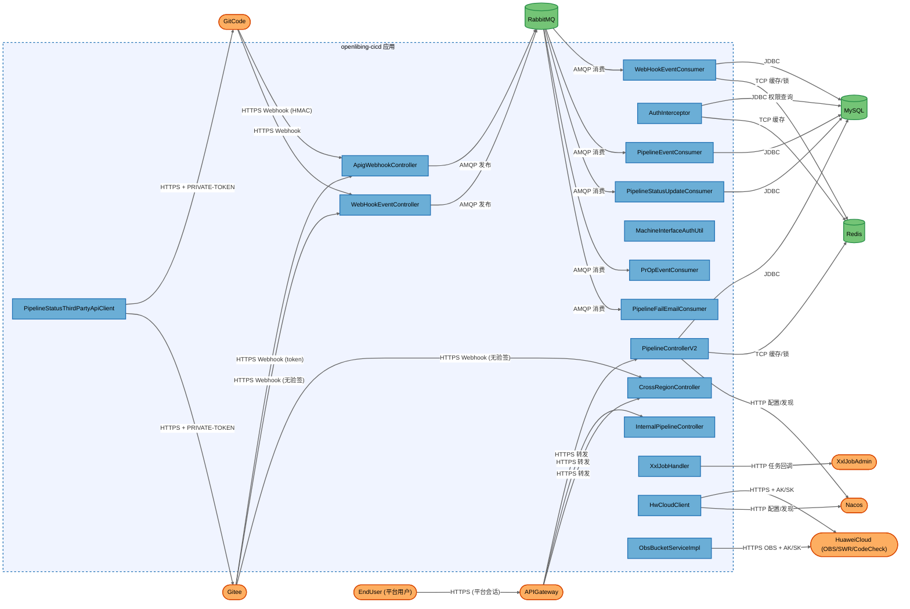
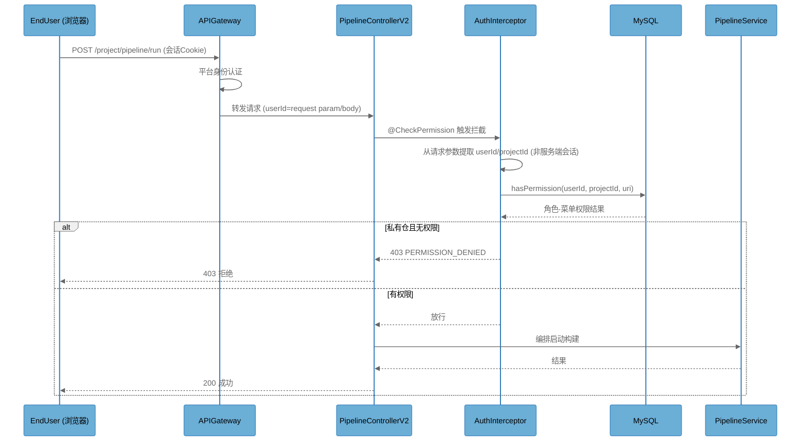
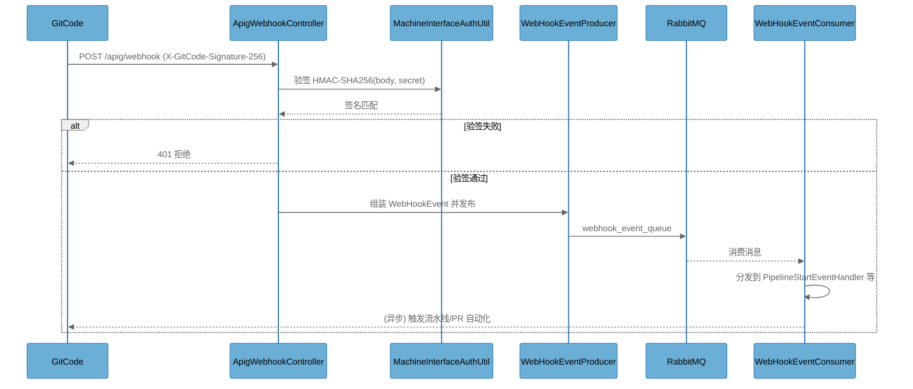
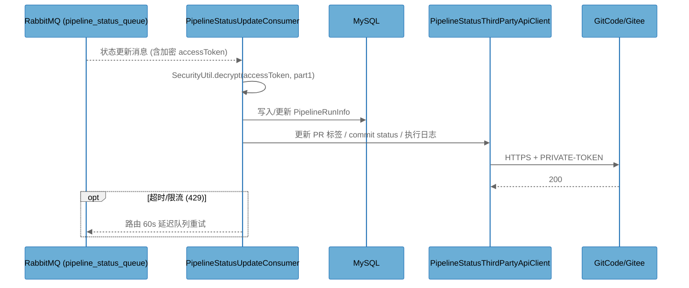

# Architecture Overview

## System Purpose

openlibing-cicd 是 openLiBing 平台的 CI/CD 核心服务，负责流水线编排与执行状态管理、代码仓（GitCode/Gitee）Webhook 事件消费、PR 自动化（标签、评论、构建触发、黄蓝协同）、构建产物（OBS 对象存储）管理与日志导出，以及面向第三方（华为云）的状态回写。系统是单进程 Spring Boot 应用，对外只暴露 HTTP API（经 APIG 网关统一接入），内部通过 RabbitMQ 事件驱动、MySQL 持久化、Redis 缓存，配置与密钥托管于 Nacos。使用者是 openLiBing 平台的前端用户（开发者/管理员）以及 GitCode/Gitee 等外部系统（作为 Webhook 调用方与 API 被调方）。

## Key Components

| Component | Type | Description |
|-----------|------|-------------|
| PipelineControllerV2 | Process | 流水线主 REST 控制器（`/project/pipeline/**`），含启动/停止/重试/白名单/导出等接口，`@CheckPermission`/`@ProjectAuth` 注解鉴权 |
| AuthInterceptor | Process | 授权拦截器，基于客户端传入的 userId/projectId 调 `UserRoleMapper.hasPermission`，处理匿名公开仓放行与本地缓存 |
| ApigWebhookController | Process | APIG 统一 Webhook 入口（`/apig/webhook/**`），7 个端点服务内 HMAC 验签后投递 MQ |
| WebHookEventController | Process | 遗留 Webhook 入口（`/webhookEvent/hooks/**`），gitcode 端点服务内验签，gitee 端点依赖网关 |
| CrossRegionController | Process | 跨区域/黄蓝协同入口（`/cross-region/**`），gitcode hooks 验签，gitee hooks 与状态回写端点无服务内验签 |
| InternalPipelineController | Process | 微服务间内部接口（`/internal/**`）与华为 APIG 入口（HwApigController）、机机接口（PrMachineInterfaceController），无服务内鉴权 |
| MachineInterfaceAuthUtil | Process | Webhook 签名校验核心（GitCode HMAC-SHA256、Gitee token+timestamp）与机机接口审计日志 |
| WebHookEventConsumer | Process | Webhook 事件 MQ 消费者，分发到各 handler（启动/停止/重试/PR 事件）并触发副作用 |
| PipelineEventConsumer | Process | 流水线业务事件消费者（bisect/下载/构建分析/详情/排队时间/自动建 Issue） |
| PipelineStatusUpdateConsumer | Process | 流水线状态更新消费者，解密 token 后回写华为云/第三方并更新 DB |
| PrOpEventConsumer | Process | PR 异步操作消费者（更新标签、刷新评论、推送 commit status） |
| PipelineFailEmailConsumer | Process | 流水线失败邮件消费者，读仓库 `.notification.yaml` 解析收件人并发邮件 |
| XxlJobHandler | Process | XXL-Job 调度任务（14 个），含批量投递 MQ、接受项目邀请、刷新 Webhook 等 |
| PipelineStatusThirdPartyApiClient | Process | GitCode/Gitee 三方 API 客户端（PR 标签/评论/commit status/执行日志），PRIVATE-TOKEN 认证 |
| HwCloudClient | Process | 华为云客户端（OBS/SWR/CodeCheck/APIGateway SDK），AK/SK 解密后调用，部分链路关闭 SSL 校验 |
| ObsBucketServiceImpl | Process | OBS 对象存储服务，AK/SK 解密创建客户端，生成临时签名下载 URL |
| EndUser | External Interactor | openLiBing 平台用户（含管理员），经 APIG 网关访问业务 API |
| APIGateway | External Service | 华为云 API 网关，承担平台用户认证与流量接入（信任边界） |
| GitCode | External Service | 外部代码托管平台，发送 Webhook 事件、提供 REST API（PR/标签/评论） |
| Gitee | External Service | 外部代码托管平台，发送 Webhook 事件、提供 REST API |
| HuaweiCloud | External Service | 华为云后端（OBS 对象存储、SWR 镜像仓、CodeCheck、构建服务） |
| Nacos | External Service | 配置中心与注册中心，托管数据库/Redis/RabbitMQ/密钥等敏感配置 |
| XxlJobAdmin | External Service | XXL-Job 调度中心，触发本服务定时任务 |
| RabbitMQ | Data Store | 消息中间件，承载 Webhook 事件与流水线内部事件队列 |
| MySQL | Data Store | 业务数据库（流水线信息、PR 信息、机机账号、权限等） |
| Redis | Data Store | 缓存（权限/公开仓判定、分布式锁、幂等） |

## Component Diagram

## Top Scenarios

### Scenario 1: 用户经 APIG 网关启动流水线

用户通过前端调用 APIG 网关，网关完成平台身份认证后转发到本服务。`PipelineControllerV2` 的 `@CheckPermission` 触发 `AuthInterceptor`：拦截器从请求参数/请求体提取 userId、projectId，查 `UserRoleMapper.hasPermission` 判断该用户对目标项目的权限（私有仓），通过后调用 `PipelineService` 编排构建并通过 `PipelineStatusUpdateProducerImpl` 投递 MQ。

### Scenario 2: GitCode Webhook 触发流水线

GitCode 推送/PR 事件经 `ApigWebhookController` 收到，`MachineInterfaceAuthUtil` 用 `X-GitCode-Signature-256` 做 HMAC-SHA256 验签（密钥来自 Nacos 或机机账号表，AES 解密），验签通过后 `WebHookEventServiceImpl` 组装 `WebHookEvent` 投递 RabbitMQ，`WebHookEventConsumer` 消费后分发给 `PipelineStartEventHandler` 等 handler 触发流水线启动或 PR 自动化。

### Scenario 3: 流水线状态更新回写三方

华为云/构建服务回调流水线状态，经 `PipelineStatusUpdateConsumer` 消费 `pipeline_status_queue`：解密消息中的 accessToken（或从 DB 解密），调用 `PipelineStatusThirdPartyApiClient` 更新 GitCode/Gitee 的 PR 标签、commit status 与执行日志，同时写入 MySQL。异常（超时/限流）路由到 60s 延迟队列重试。

### Scenario 4: 平台用户导出构建日志

用户调用 `PipelineControllerV2` 的 `POST /project/pipeline/build-log/export`，传入 projectId/taskName/jobId/buildNo 与 userId 参数，服务经 `PipelineServiceImpl.exportBuildLog` 走 `ObsBucketServiceImpl` 生成 OBS 临时签名 URL 供前端下载，或经 `FileDownloadServiceImpl` 流式导出。

### Scenario 5: 定时任务批量刷新 Webhook

`XxlJobHandler.refreshWebhookHandler` 由 `XxlJobAdmin` 触发，按 `jobParam` 批量迁移/改写 GitCode/Gitee 代码仓的 Webhook 回调 URL，支持 `customOrgs` 携带自定义 token 与 rollback 模式。

## Technology Stack

| Layer | Technologies |
|-------|--------------|
| Languages | Java 17+ |
| Frameworks | Spring Boot, Spring Cloud Alibaba (Nacos), Spring MVC, MyBatis-Plus, fastjson2, Gson, JWT (java-jwt), springdoc-openapi 2.8.10 |
| Data Stores | MySQL (HikariCP + Jasypt), Redis (Jedis/Redisson), RabbitMQ, OBS 对象存储 |
| Infrastructure | Docker 容器, XXL-Job 调度中心, Nacos 配置/注册中心, APIG 网关, Kubernetes 部署 |
| Security | 自研 AuthInterceptor + @CheckPermission/@ProjectAuth, HMAC-SHA256 验签, AES 凭据加密 (SecurityUtil), Jasypt ENC, 日志脱敏 (MessageMaskUtils) |

## Deployment Model

openlibing-cicd 以 Docker 容器形式部署于云端 Kubernetes 集群，单进程 Spring Boot 应用，服务监听应用端口（默认 8080），全部入站流量经华为云 APIG 网关接入；健康检查 `/health-check` 与应用本身同端口。数据库（MySQL）、缓存（Redis）、消息队列（RabbitMQ）、配置中心（Nacos）、调度中心（XXL-Job）均部署于集群内部网络。生产环境（prod）下 RabbitMQ 与 Redis 启用 TLS/SSL 加密链路，非 prod 环境为明文 TCP。敏感凭据（数据库/Redis/RabbitMQ/OBS/密钥）经 `SecurityUtil.decrypt(value, part1)` + Jasypt 托管于 Nacos，不落代码仓。

**Deployment Classification:** `NETWORK_SERVICE`

### Component Exposure Table

| Component | Listens On | Auth Required | Reachability | Min Prerequisite | Derived Tier |
|-----------|------------|---------------|--------------|------------------|-------------|
| EndUser | N/A — no listener | N/A | External | None | T1 |
| APIGateway | 443 (external) | Yes (平台认证) | External | None | T1 |
| GitCode | external platform | 平台认证 | External | None | T1 |
| Gitee | external platform | 平台认证 | External | None | T1 |
| HuaweiCloud | external platform | AK/SK | External | None | T1 |
| Nacos | internal port | accessToken | Internal Only | Internal Network | T2 |
| XxlJobAdmin | internal port | accessToken | Internal Only | Internal Network | T2 |
| RabbitMQ | internal AMQP port | 用户名/密码 + TLS(prod) | Internal Only | Internal Network | T2 |
| MySQL | internal 3306 | 用户名/密码 | Internal Only | Internal Network | T2 |
| Redis | internal 6379 | 密码 | Internal Only | Internal Network | T2 |
| PipelineControllerV2 | 应用端口 8080 (经网关) | 部分 (注解+网关) | External | Authenticated User | T2 |
| InternalPipelineController | 应用端口 8080 (经网关) | 否 (依赖网关) | Internal Only | Internal Network | T2 |
| ApigWebhookController | 应用端口 8080 (经网关) | 是 (HMAC-SHA256) | External | None | T1 |
| WebHookEventController | 应用端口 8080 (经网关) | 部分 (gitcode 验签 / gitee 无) | External | None | T1 |
| CrossRegionController | 应用端口 8080 (经网关) | 部分 (gitcode 验签 / gitee 无) | External | None | T1 |
| AuthInterceptor | 应用端口 8080 (经网关) | 是 (注解+网关) | External | Authenticated User | T2 |
| MachineInterfaceAuthUtil | 经 Webhook 控制器调用 | HMAC | External | None | T1 |
| WebHookEventConsumer | MQ 消费 | MQ 凭据 | Internal Only | Internal Network | T2 |
| PipelineEventConsumer | MQ 消费 | MQ 凭据 | Internal Only | Internal Network | T2 |
| PipelineStatusUpdateConsumer | MQ 消费 | MQ 凭据 | Internal Only | Internal Network | T2 |
| PrOpEventConsumer | MQ 消费 | MQ 凭据 | Internal Only | Internal Network | T2 |
| PipelineFailEmailConsumer | MQ 消费 | MQ 凭据 | Internal Only | Internal Network | T2 |
| XxlJobHandler | XXL-Job 触发 | accessToken | Internal Only | Internal Network | T2 |
| PipelineStatusThirdPartyApiClient | 无监听 (出站) | 内部调用方 | Internal Only | Internal Network | T2 |
| HwCloudClient | 无监听 (出站) | 内部调用方 | Internal Only | Internal Network | T2 |
| ObsBucketServiceImpl | 无监听 (出站) | 内部调用方 | Internal Only | Internal Network | T2 |

## Security Infrastructure Inventory

| Component | Security Role | Configuration | Notes |
|-----------|---------------|---------------|-------|
| AuthInterceptor | 授权拦截器（业务权限判断） | `/project/**` 拦截，无 excludePathPatterns；`@CheckPermission`/`@ProjectAuth` 注解驱动 | 身份取自客户端参数 userId/projectId，非服务端会话 |
| UserRoleMapper | 权限判定 SQL | `hasPermission`/`hasPublicPermission`，`role='admin'` 跨项目放行 | 参数化查询 `#{}`，无 SQL 注入 |
| MachineInterfaceAuthUtil | Webhook 验签（GitCode HMAC-SHA256 / Gitee token+timestamp） | 密钥经 WebhookSecretProvider（Nacos 优先，DB 机机账号表回退）+ AES 解密 | Gitee 验签不含请求体且无时间窗校验 |
| WebhookSecretProvider | Webhook 签名密钥解析 | Nacos 配置优先，回退 DB `machine_interface_auth` 表 | 两来源不一致可能导致验签错误 |
| JwtUtils | JWT 解码（仅 decode 不 verify） | Cookie token 读取，解密 claim 中三方 access token | 无验签无过期校验 |
| SecurityUtil / Jasypt | 凭据加密解密 | `@Value("${security.part1}")` + `@EnableEncryptableProperties` | DB/Redis/RabbitMQ/OBS/accessToken 统一解密使用 |
| DataSourceConfig | 数据库凭据注入 | HikariCP + `SecurityUtil.decrypt` | 明文不落配置 |
| RabbitConnectionFactoryConfig / WebHookRabbitConfig | MQ 连接与重试 | 仅 prod 启用 SSL；3 次重试 + 延迟队列 + 死信 | CleanHeaderRepublishMessageRecoverer 清理 x-death header |
| RedisConfig | Redis 连接 | prod 用 `rediss://` TLS，密码解密 | 非 prod 明文 |
| MessageMaskUtils / logback | 日志脱敏 | 掩码敏感字段；操作日志截断 | |
| AuthInterceptor 匿名公开仓缓存 | 公开仓放行判定 | Guava Cache TTL 1min + Redis 缓存 `projectId+pipelineId` | key 拼接无分隔符，存在碰撞风险 |
| DistributedLockService / OpenlibingRedis | 分布式锁 | Redisson 看门狗 / Redis SETNX | SETNX 锁无 owner 标识与释放逻辑 |

## Repository Structure

| Directory | Purpose |
|-----------|---------|
| src/main/java/com/openlibing/cicd/business/controller/ | REST 控制器（Webhook 入口、流水线、PR、跨区域等） |
| src/main/java/com/openlibing/cicd/business/listener/ | RabbitMQ 消费者与事件 handler |
| src/main/java/com/openlibing/cicd/business/service/ | 业务服务与第三方客户端（OBS、Webhook、流水线） |
| src/main/java/com/openlibing/cicd/common/auth/ | 鉴权拦截器、注解、过滤器 |
| src/main/java/com/openlibing/cicd/common/utils/ | 加解密、验签、HTTP 客户端、Redis 工具 |
| src/main/java/com/openlibing/cicd/common/config/ | MQ/Redis/数据源/XXL-Job/分布式锁配置 |
| src/main/java/com/openlibing/cicd/common/job/ | XXL-Job 定时任务 |
| src/main/java/com/openlibing/cicd/common/exception/ | 全局异常与安全异常 |
| src/main/resources/ | 环境配置（application-{beta,gama,prod}.yaml）、mapper XML、Liquibase changelog |
| src/main/resources/mapper/ | MyBatis 映射 XML（参数化 SQL） |
| src/main/resources/db/changelog/ | Liquibase 数据库变更脚本 |
