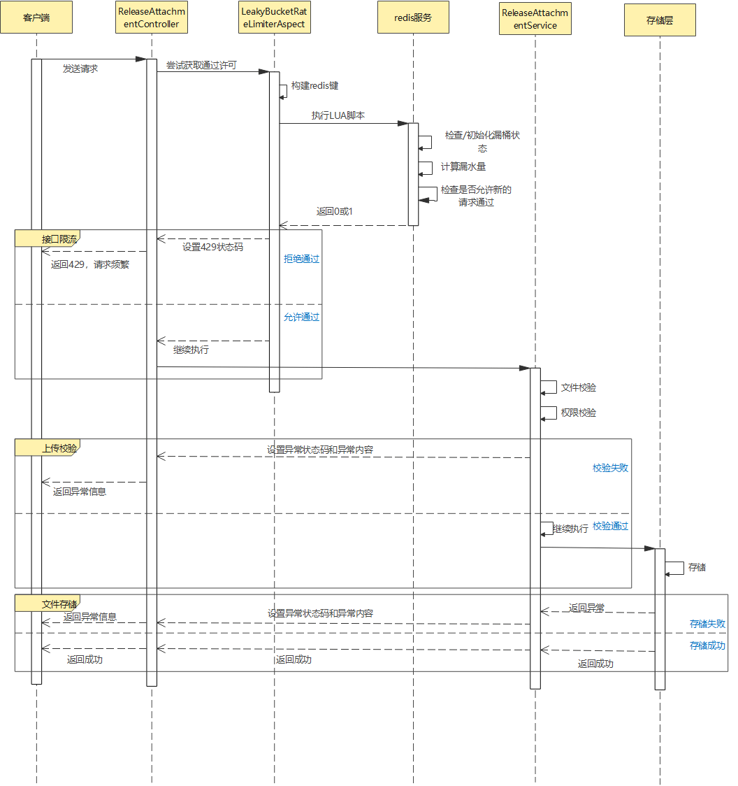

# #1 版本发布评审中增加附件相关功能需求设计

## 1. 基础信息

* **需求链接**: https://gitcode.com/openlibing/openlibing-platform-release/issues/23
* **需求名称**: 发布评审单增加附件相关功能
* **开发责任人**: wangxing-wx

---

## 2. 需求场景说明

> 附件管理模块是openlibing-platform-release项目中的核心功能模块，负责发布评审过程中的附件上传、删除和下载操作，支持用户在评审流程中添加相关文档等辅助材料。

## 3 需求验收标准

> 用户在有权限情况下，对评审单附件进行上传、删除、下载，单个评审单附件数量不超过10个，单个附件大小不超过100MB。


## 4. 需求设计与分解

| 功能点       | 描述                      | 接口路径                         | 方法 |
|-----------|-------------------------|------------------------------|------|
| 附件上传      | 允许用户上传附件到指定评审单          | /release/attachment/upload   | POST |
| 附件删除      | 允许用户删除指定评审单的附件          | /release/attachment/delete   | POST |
| 附件下载      | 允许用户下载指定评审单的附件          | /release/attachment/download | GET |
| 附件列表      | 评审单的附件列表                | /release/attachment/list     | GET |
| 文件类型限制    | 支持pdf、word、excel、压缩包等类型 | 服务端校验                        | - |
| 文件大小限制    | 限制单个文件最大上传大小            | 服务端校验                        | - |
| 评审单附件数量限制 | 限制单个评审单附件上传数量           | 服务端校验                        | - |
| 接口限流      | 对附件操作接口进行限流保护           | 基于注解实现                       | - |


### 4.1 核心逻辑方案
#### 4.1.1 架构设计
- **控制器层**：ReleaseAttachmentController 处理HTTP请求
- **服务层**：ReleaseAttachmentService 提供业务逻辑
- **限流层**：LeakyBucketRateLimiterAspect 实现接口限流
- **存储层**：华为云OBS + MySQL数据库

#### 4.1.2 数据库设计

**表名：release_attachment**

| 字段名               | 数据类型         | 约束 | 描述     |
|-------------------|--------------|------|--------|
| id                | INT(32)      | PRIMARY KEY, AUTO_INCREMENT | 主键ID   |
| review_id         | INT(32)      | NOT NULL | 评审单ID  |
| attachment_suffix | VARCHAR(256) | - | 附件类型   |
| attachment_name   | VARCHAR(256) | - | 附件名称   |
| attachment_size   | BIGINT       | - | 附件大小   |
| user_id           | VARCHAR(256) | - | 上传账号ID |
| user_name         | VARCHAR(512) | - | 上传账号名称 |
| bucket_object_key | VARCHAR(512) | - | 桶地址    |
| delete_flag       | TINYINT(1)   | - | 是否删除   |
| create_time       | DATETIME     | - | 创建时间   |
| update_time       | DATETIME     | - | 修改时间   |


#### 4.1.3 DFX设计

##### 4.1.3.1 支持的附件类型
| 文件类型 | 扩展名                            |
|---------|--------------------------------|
| PDF文档 | .pdf                           |
| Word文档 | .doc, .docx                    | 
| Excel表格 | .xls, .xlsx                    |
| 压缩包 | .zip, .tar, .tar.gz |

##### 4.1.3.2 大小限制
- **单个文件最大大小**: 100MB
- **每个评审单最大附件数**: 10个

##### 4.1.3.3 附件存储
- **文件存储**： 服务容器不进行文件落盘存储，通过流以标准存储方式到怕openlibing-platform桶中
- **存储路径**： ```openlibing-platform-release/<projectId>/<productName>/<productVersion>/<fileName>```
由表单数据动态生成存储路径，表单中同名文件覆盖存储

##### 4.1.3.4 校验/异常处理
| 异常类型   | 异常校验| 状态码| 异常内容          |
|--------|---------|---------|---------------|
| 文件大小异常 |在服务层使用MultipartFile的getSize()方法进行校验|500| 上传文件大小超过100MB |
| 文件类型异常 |基于文件扩展名进行校验|500|附件类型不支持，支持pdf,doc,docx,xls,xlsx,zip,tar,tar,gz类型|
| 数量限制异常 |基于数据库查询当前评审单的附件数量校验|500|附件数量已超过10个限制，建议合并附件后上传|
|网络异常|黄区网络超过100KB会被黄区代理拦截|403|可能受代理影响请求被拦截，建议使用互联网网络进行上传|
|权限异常|基于评审单查询创建者以及相关人员|403|“非评审单创建者，无法进行上传、删除”或“非评审单相关人员无法进行下载”|
|评审单状态异常|基于当前评审单状态|400|附件只能在评审单新建状态时上传|
|存储异常|存储到OBS桶抛出异常|500|上传失败，请重试|
|限流异常|超过流量限制|429|请求过于频繁，请稍后重试|


##### 4.1.3.5 实现逻辑
**以上传为例，删除和下载类似**


1. **文件大小校验**: 在服务层实现，使用MultipartFile的getSize()方法
2. **文件类型校验**: 基于文件扩展名校验
3. **安全校验**: 压缩包和excel的压缩炸弹（最大解压1GB和压缩比不超过100，文件数量限制1000），pdf的XSS校验
4. **权限校验**： 基于评审单查询创建者以及相关人员。非创建者，无法进行上传/删除，非评审单相关人员无法进行下载
5. **数量限制校验**: 基于数据库查询当前评审单的附件数量
6. **OBS桶存储**：服务端容器不落盘，生成UUID当作文件名称直接存储到OBS桶中
7. **错误处理**: 基于异常情况提供清晰的错误提示信息，并记录日志

#### 4.1.4 接口设计

##### 4.1.4.1 上传附件接口
- **URL**: `/release/attachment/upload`
- **方法**: POST
- **参数**:
    - userId: String - 用户ID
    - reviewId: Integer - 评审单ID
    - attachmentFile: MultipartFile - 附件文件
- **返回**: `DataResult<Integer>` - 上传附件id
- **限流**: 3QPS，容量5

##### 4.1.4.2 删除附件接口
- **URL**: `/release/attachment/delete`
- **方法**: POST
- **参数**:
    - userId: String - 用户ID
    - reviewId: Integer - 评审单ID
    - attachmentFileId: Integer - 附件文件ID
- **返回**: `DataResult<String>` - 删除结果
- **限流**: 20QPS，容量40

##### 4.1.4.3 下载附件接口
- **URL**: `/release/attachment/download`
- **方法**: GET
- **参数**:
    - userId: String - 用户ID
    - reviewId: Integer - 评审单ID
    - attachmentFileId: Integer - 附件文件ID
- **返回**: `ResponseEntity<Byte[]>` - 下载结果
- **限流**: 5QPS，容量10

##### 4.1.4.4 附件列表接口
- **URL**: `/release/attachment/list`
- **方法**: GET
- **参数**:
    - userId: String - 用户ID
    - reviewId: Integer - 评审单ID
    - projectId: String - 项目ID
- **返回**: `DataResult<List<ReleaseAttachmentVo>>` - 附件列表结果

#### 4.1.5 实现细节

##### 4.1.5.1 控制器实现
```java
@RestController
@RequestMapping("/release/attachment")
public class ReleaseAttachmentController {
    @Autowired
    ReleaseAttachmentService attachmentService;

    @LeakyBucketRateLimiter
    @PostMapping("/upload")
    public DataResult<String> uploadAttachment(
        @RequestParam(value = "userId") String userId,
        @RequestParam(value = "reviewId") Integer reviewId,
        @RequestPart(value = "attachmentFile") MultipartFile attachmentFile) {
        return attachmentService.uploadAttachment(userId, reviewId, attachmentFile);
    }

    // 删除和下载接口类似

    @GetMapping("/list")
    public DataResult<List<ReleaseAttachmentVo>> getAttachmentList(
        @RequestParam(value = "userId") String userId,
        @RequestParam(value = "projectId") String projectId,
        @RequestParam(value = "reviewId") Integer reviewId) {
        return attachmentService.getAttachmentList(userId, reviewId);
    }
}
```

##### 4.1.5.2 服务实现
```java
public class ReleaseAttachmentServiceImpl implements ReleaseAttachmentService {
    @Autowired
    ReleaseReviewDao releaseReviewDao;

    @Override
    public DataResult<String> uploadAttachment(String userId, Integer releaseId, MultipartFile attachmentFile) {
        // 1.todo校验文件类型
        // 2.todo校验文件大小
        // 3.todo文件安全校验，压缩包和excel的压缩炸弹，pdf的XSS校验
        // 查询发布评审单
        ReleaseReviewEntity releaseReviewEntity = releaseReviewDao.selectById(releaseId);
        
        // 4. todo鉴权是否为本评审单创建人
        // 5. todo评审单状态是否在新建状态
        // 6. todo校验上传数量
        // 7. todo上传到OBS桶，同名文件上传直接覆盖
        // 8. todo记录数据库，同名文件进行更新时间，重新上传已被删除的同名文件，不更新重新增加记录

        return DataResult.success();
    }

    // 删除和下载方法类似

    @Override
    public DataResult<List<ReleaseAttachmentVo>> getAttachmentList(String userId, Integer reviewId) {
        // todo鉴权是否为本评审单相关人员
        List<ReleaseAttachmentEntity> attachmentList = attachmentDao.queryReleaseAttachmentList(reviewId);
        return DataResult.success();
    }
}
```

##### 4.1.5.3 限流实现
- **注解定义**: `@LeakyBucketRateLimiter` 支持自定义容量和速率
- **切面实现**: `LeakyBucketRateLimiterAspect` 使用Redis + Lua脚本实现漏桶算法
- **限流逻辑**:
    1. openlibing-platform-bucket-rate-limit + 获取请求URI作为限流键，设置过期时间3600秒
    2. 执行Lua脚本判断是否允许请求
    3. 不允许时返回429状态码

** 核心Lua脚本**
```lua
local key = KEYS[1]
local capacity = tonumber(ARGV[1])
local rate = tonumber(ARGV[2])
local currentTime = tonumber(ARGV[3])

local bucket = redis.call('hgetall', key)
local currentWater = 0
local lastLeakTime = currentTime

if table.getn(bucket) == 0 then
    redis.call('hset', key, 'currentWater', 0)
    redis.call('hset', key, 'lastLeakTime', currentTime)
    redis.call('expire', key, 3600)
else
    for i = 1, table.getn(bucket), 2 do
        if bucket[i] == 'currentWater' then
            currentWater = tonumber(bucket[i+1])
        elseif bucket[i] == 'lastLeakTime' then
            lastLeakTime = tonumber(bucket[i+1])
        end
    end
end

-- 计算漏水量
local elapsedTime = currentTime - lastLeakTime
local leakedWater = (elapsedTime / 1000.0) * rate
currentWater = math.max(0, currentWater - leakedWater)

-- 检查是否可以添加新的水
if currentWater < capacity then
    currentWater = currentWater + 1
    redis.call('hset', key, 'currentWater', currentWater)
    redis.call('hset', key, 'lastLeakTime', currentTime)
    return 1
else
    return 0
end
```

#### 4.1.6 配置项
| 配置项                             | 说明           | 默认值                                        |
|---------------------------------|--------------|--------------------------------------------|
| attachment.obs.bucketName       | OBS桶名称       | openlibing-platform                        |
| attachment.release.maxFileSize  | 单个附件最大大小(MB) | 100                                        |
| attachment.release.maxSum       | 单个评审单附件最大数量  | 10                                         |
| attachment.release.allowedTypes | 允许的附件类型      | pdf,doc,docx,xls,xlsx,zip,tar,tar.gz |

### 4.2 任务清单

| 任务 ID | 任务描述 (Task Description) | 预期产出 (Deliverables) | 预期工作量（人天） |
|-------|-------------------------|------------|-----------|
| **1** | 上传附件                    | 配置文件/代码    | 1         |
| **2** | 删除附件                    | 配置文件/代码    | 0.5       |
| **3** | 下载附件                    | 配置文件/代码    | 0.5       |
| **4** | 附件列表                    | 配置文件/代码    | 0.5       |
| **5** | 接口限流逻辑                  | 代码 | 1         |

## 5. 需求相关性分析

> **操作说明**：根据上述拆解出的 Task，识别其变更行为。任何一项勾选为“是”：打上对应issue标签，必须执行对应的流程门禁。全部未勾选：该需求自动判定为轻量化特性，打上need_light标签。

### A. 安全相关性分析

> *若涉及以下任一项，打标 `need_security`标签，PR 必须关联特性issue的架构设计文档（含安全设计部分）**如勾选需要给出原因**。

* [ ] **边界变更**：新增公网端口、修改防火墙规则、变更网关配置。
* [ ] **凭证处理**：涉及密钥（Secret/Key）、Token、证书的存储或分发。
* [ ] **权限调整**：修改权限模型、服务账号（SA）权限或鉴权逻辑。
* [ ] **供应链**：引入新的第三方二进制文件、SDK 或重大版本依赖升级。
* [ ] **隐私风险评估**：涉及用户个人数据（Email、手机号、IP、邮箱 等）的处理。
* [ ] **AI使用**：涉及AIGC能力应用，并提供服务。

### B. 架构设计相关性分析

> *若涉及以下任一项，打标 `need_design`标签，PR 必须关联特性issue的架构设计文档。 **如勾选需要给出原因**。

* [ ] A环节判定需要完成安全设计
* [ ] 改变了现有系统的物理/逻辑拓扑
* [ ] 新增或大幅修改对外暴露的 API/CLI 接口
* [ ] 引入了新的中间件、数据库或三方核心组件 **[勾选必填]**_原因：如：引入了新的中间件、数据库或三方核心组件_

### C. 系统集成测试相关性分析

> *若涉及以下任一项，打标 `need_itest`标签，PR必须关联特性issue的测试策略和测试报告文档。 **如勾选需要给出原因**。

* [ ] 上述环节判定需要执行安全设计或架构设计。
* [ ] **跨组件影响**：变更会触发下游服务或关联系统的连锁反应（级联效应）。
* [ ] **核心组件管控**：含项目定级为 Core 的核心逻辑变更。
* [ ] **环境强依赖**：功能高度依赖内核参数、网络拓扑或特定的物理挂载。
* [x] **端到端流程**：涉及从用户输入到持久化存储的全链路逻辑。

### D. 用户体验相关性分析

> *若涉及以下任一项，打标 `need_ux`标签，PR必须关联特性issue的用户体验设计文档。 **如勾选需要给出原因**。

* [x] **交互逻辑变更**：涉及 Web 门户、控制台（Dashboard）或命令行工具（CLI）的交互流程调整。
* [ ] **感知性能变动**：变更可能显著影响页面的加载时间、同步请求的响应时延或异步任务的进度反馈。
* [ ] **文档与辅助能力**：涉及报错提示语、帮助中心链接、FAQ 或新功能的 Runbook 说明。
* [ ] **无障碍与多语种**：涉及国际化（i18n）支持、辅助功能或不同终端（移动端/桌面端）的适配。

### 5.1 需求相关性分析汇总结果

* [ ] need_security (需架构设计（含安全威胁分析和安全设计）)
* [ ] need_design (需架构设计)
* [x] need_itest (需执行测试策略设计和全链路集成测试)
* [ ] need_ux (需架构设计（含UX设计)）
* [ ] need_light (上述均未勾选，走快速合入通道)

---

## 6. 价值识别与业务评估

> **判定准则**：基础设施接纳需求必须具备明确的 ROI（投资回报比）或合规必要性。

| 维度        | 评估问题                            | 结论/说明    |
|-----------|---------------------------------|----------|
| **范围判定**  | 该需求是否属于基础设施范围内？                 | 是        |
| **规划一致性** | 该需求是否是否在年度技术规划中？                | 是        | 
| **优先级**   | 该需求优先级评估（高/中/低）？                | 高        | 
| **通用性**   | 该需求是否解决 3 个以上业务方的共性痛点？          | 否        |
| **必要性**   | 现有组件通过配置变更是否无法实现目标或没有不用开发的替代方案？ | 是        | 
| **工作量**   | 预计总工作量 5 人天？                    | 5人天      | 
| **价值评估**  | 实现后能减少多少手动操作或提升多少系统稳定性？         | 提升用户审核效率 |

> **状态定义：** **Accept (准入)** | **Reject (驳回)** |  **Pending (待议)**

**建议结论**： Accept

**原因描述:** 用户要求在发布评审过程中支持附件上传、删除和下载操作，支持用户在评审流程中添加相关文档等辅助材料。

---
