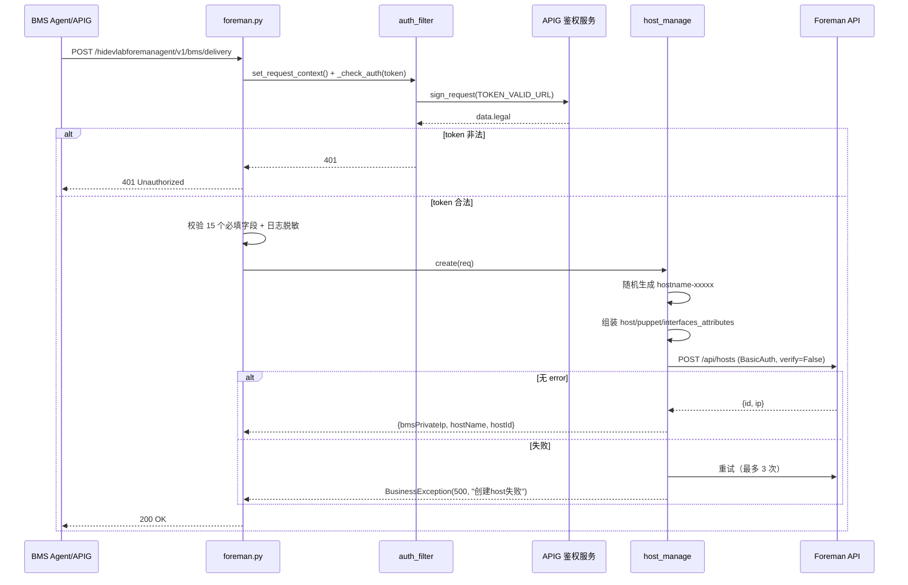
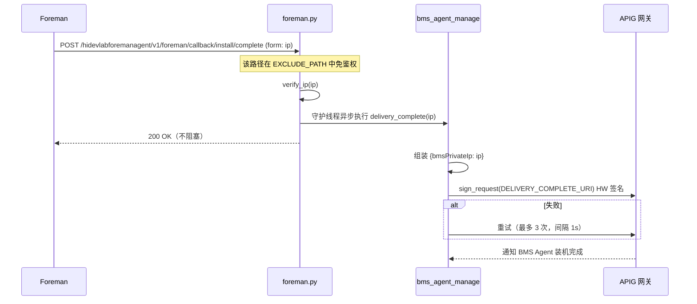

# Foreman 装机代理系统设计

## 1. 系统定位

`hidevlab-foreman-service` 是 HiDevLab 平台对接开源 Foreman（Foreman/Katello 生态，裸金属/物理机装机管理平台）的适配代理微服务。该服务作为上层业务平台与 Foreman 之间的桥接层，主要支撑以下业务场景：

- 接收 BMS Agent 下发的装机参数，组装并调用 Foreman API 创建物理机 Host
- 根据 hostId 调用 Foreman API 删除物理机 Host
- 接收 Foreman 装机完成回调，异步通知 BMS Agent 装机交付完成
- 对入向请求做 token 鉴权，对出向 APIG 调用做 HW 签名

服务自身无状态、不持久化业务数据，所有业务事实归 Foreman 与上游 BMS Agent 管理。

## 2. 业务边界

| 边界类型 | 说明 |
| --- | --- |
| 上游依赖 | BMS Agent 服务（经 APIG 网关下发装机请求） |
| 下游依赖 | Foreman REST API、Apollo 配置中心、APIG 鉴权服务 |
| 外部接口 | Foreman API（创建/删除 Host）、APIG（token 校验、回调通知） |
| 内部接口 | 对外暴露创建/删除 Host、装机完成回调、健康检查 4 个 REST 接口 |

## 3. 分层结构

本项目为 Python Flask 轻分层单体，非 Spring MVC 式严格 controller/service/entity/mapper 划分，职责对应如下：

| 分层 | 文件 | 关键单元 |
| --- | --- | --- |
| 入口/路由 | `foreman.py` | `APP`、`before_request`、`bms_delivery`、`bms_delete_host`、`install_complete`、`health_check` |
| 鉴权/过滤器 | `base/auth_filter.py` | `auth_filter()`、`sign_request()`、`get_sign()`、`get_uri()` |
| 配置 | `base/config.py` | `ReturnCode`、Apollo 配置常量、命名空间 `NS_SERVICE_CONF/NS_APIG/NS_FOREMAN/NS_SECURITY` |
| 配置中心客户端 | `base/apollo_manager.py` | `SecureApolloClient`、`init_apollo()`、`get_bool_value()` |
| 解密 | `base/decrypt.py` | `decrypt()`、`decryptbyroot()` |
| 日志 | `base/logging_handler.py` | `JsonFormatter`、`DailyLogFileHandler`、`get_logger()`、`set_request_context()` |
| 通用响应 | `base/common.py` | `return_post()`、`return_post_data()` |
| 业务 | `service/host_manage.py` | `create()`、`delete()`、`_build_request_body/_build_host/_build_interfaces_attributes/_build_puppet_attributes`、`BusinessException` |
| 业务 | `service/bms_agent_manage.py` | `delivery_complete()`、`BusinessException` |
| 工具 | `utils/mask_string.py` / `random_string.py` / `regex_util.py` | `mask()`、`get_random_string()`、`verify_ip()` |

## 4. 核心流程

### 4.1 裸金属装机交付（创建 Host）

### 4.2 装机完成回调通知

## 5. 接口列表

统一响应格式：`{"code": int, "msg": str, "data": ...}`，业务异常通过 `@APP.errorhandler(BusinessException)` 统一封装。

| API 路径 | HTTP方法 | 功能描述 |
| --- | --- | --- |
| `/health` | GET | 健康检查（免鉴权） |
| `/hidevlabforemanagent/v1/bms/delivery` | POST | 创建 Foreman Host（触发裸金属装机交付） |
| `/hidevlabforemanagent/v1/bms/delete/host` | POST | 删除 Foreman Host |
| `/hidevlabforemanagent/v1/foreman/callback/install/complete` | POST | Foreman 装机完成回调入口（免鉴权，表单参数 `ip`） |

`/bms/delivery` 请求体必填字段：`mac`、`foremanAccount`/`foremanPassword`、`foremanArchitectureId`/`operateSystemId`/`subnetId`/`mediumId`/`locationId`/`domainId`/`ptableId`/`organizationId`/`puppetProxyId`/`puppetCaProxyId`/`environmentId`、`defaultBmsPassword`。

`/bms/delete/host` 请求体必填字段：`hostId`、`foremanAccount`、`foremanPassword`。

## 6. 数据与持久化

**本服务无数据库、无 ORM、无 mapper。** 它是无状态适配层：上游参数原样透传/组装给 Foreman，Foreman 侧的实体（host、interfaces_attributes、puppet_attributes、location/organization/medium/domain/ptable/architecture/operatingsystem/subnet/environment 等）才是真正的数据归属。

Foreman Host 创建请求体涉及的关键 Foreman 实体字段（来自 `host_manage._build_host`）：

- `host.name`、`host.mac`、`host.root_pass`、`host.managed`、`host.build`、`host.enabled`、`host.pxe_loader="Grub2 UEFI"`
- 关联 ID：`location_id`、`organization_id`、`medium_id`、`domain_id`、`ptable_id`、`architecture_id`、`operatingsystem_id`
- `puppet_attributes.environment_id`
- `interfaces_attributes[0]`：`mac`、`subnet_id`、`name`、`domain_id`、`managed`

## 7. 与其他服务的依赖关系

- **Apollo 配置中心**（出向 HTTPS，带 `apollo.pem` 校验）：启动期一次性加载 4 个 namespace 配置。
- **Foreman**（出向 HTTPS，`FOREMAN_INNER_NET_DOMAIN` 内网域名，BasicAuth，`verify=False`）：`POST /api/hosts` 创建主机、`DELETE /api/hosts/{id}` 删除主机。
- **APIG 网关 / 鉴权服务**（出向 + 入向）：
  - 入向：每个业务请求调用 `TOKEN_VALID_URL`（`sign_request` POST）校验 token，返回 `data.legal`。
  - 出向：装机完成后经 `sign_request` 调用 `API_GATEWAY_DOMAIN + DELIVERY_COMPLETE_URI`（`/hidevlabbmsagent/delivery/complete`）通知 BMS Agent。
- **BMS Agent 服务**：经 APIG 转发的被通知方，接收 `bmsPrivateIp`。
- 无消息队列、无 Redis、无数据库依赖。

## 8. 配置与中间件

**配置来源**：Apollo 配置中心，4 个 namespace：

| namespace | 关键配置项 |
| --- | --- |
| `service_conf` | `SERVICE_HOST`(0.0.0.0)、`SERVICE_PORT`(18080)、`ENABLE_AUTH`(true)、`EXCLUDE_PATH`、`LAB_REGION` |
| `apig` | `API_GATEWAY_DOMAIN`、`REFERER`、`X_HW_ID`、`ENC_X_HW_APPKEY`(密文)、`TOKEN_VALID_URL`、`DELIVERY_COMPLETE_URI` |
| `foreman` | `FOREMAN_DOMAIN`、`FOREMAN_INNER_NET_DOMAIN` |
| `security` | `AES_KEY1_PATH`/`AES_KEY2_PATH`/`WORK_KEY_PATH`、`ENC_SSL_CERT_CONTENT`/`ENC_SSL_KEY_CONTENT`(密文证书) |

部署环境由 `DEPLOY_ENV` 环境变量拼接到 Apollo app_id（如 `{base}-prod`）。

**中间件清单**：

- Apollo（配置中心）
- Gunicorn + Flask（WSGI/Web，默认 8 workers，timeout 120s）
- HTTPS/TLS（自签证书，运行时解密加载）
- AES-GCM 解密体系（双密钥异或 + PBKDF2(100000) + GCM tag 校验）
- 日志：JSON 格式按天滚动落 `/var/log/hidevlab/foreman-{LAB_REGION}.YYYY-MM-DD.json`，含 request_id、IP 哈希脱敏、操作耗时等审计字段
- 无 Redis、无 MQ、无 DB

## 9. 安全机制

- **敏感配置加密**：appkey、SSL 证书/私钥均以密文存于 Apollo，启动时 AES-GCM 解密后写入临时文件加载，加载后删除。
- **入向鉴权**：业务请求经 `auth_filter` 调 APIG `TOKEN_VALID_URL` 校验 token；回调路径与 `/health` 列入 `EXCLUDE_PATH` 免鉴权。
- **出向签名**：调用 APIG 统一走 HW 签名（`X-HW-ID`/`X-HW-DATE`/`X-HW-SIGN`，SHA-256）。
- **日志脱敏**：对 `foremanAccount`、`X-HW-ID` 做 mask 脱敏，对客户端 IP 做 SHA-256+salt 哈希。

## 10. 异常处理

| 异常场景 | 处理策略 | 返回码 |
| --- | --- | --- |
| token 非法 | 直接拦截 | 401 |
| 必填字段缺失 | 返回参数错误 | 400 |
| Foreman 创建 Host 失败 | 最多重试 3 次，仍失败抛 BusinessException | 500 |
| 回调通知 BMS Agent 失败 | 最多重试 3 次，间隔 1s，仍失败抛 BusinessException | 500 |
| 回调 IP 非法 | `verify_ip` 校验失败返回错误 | 400 |
