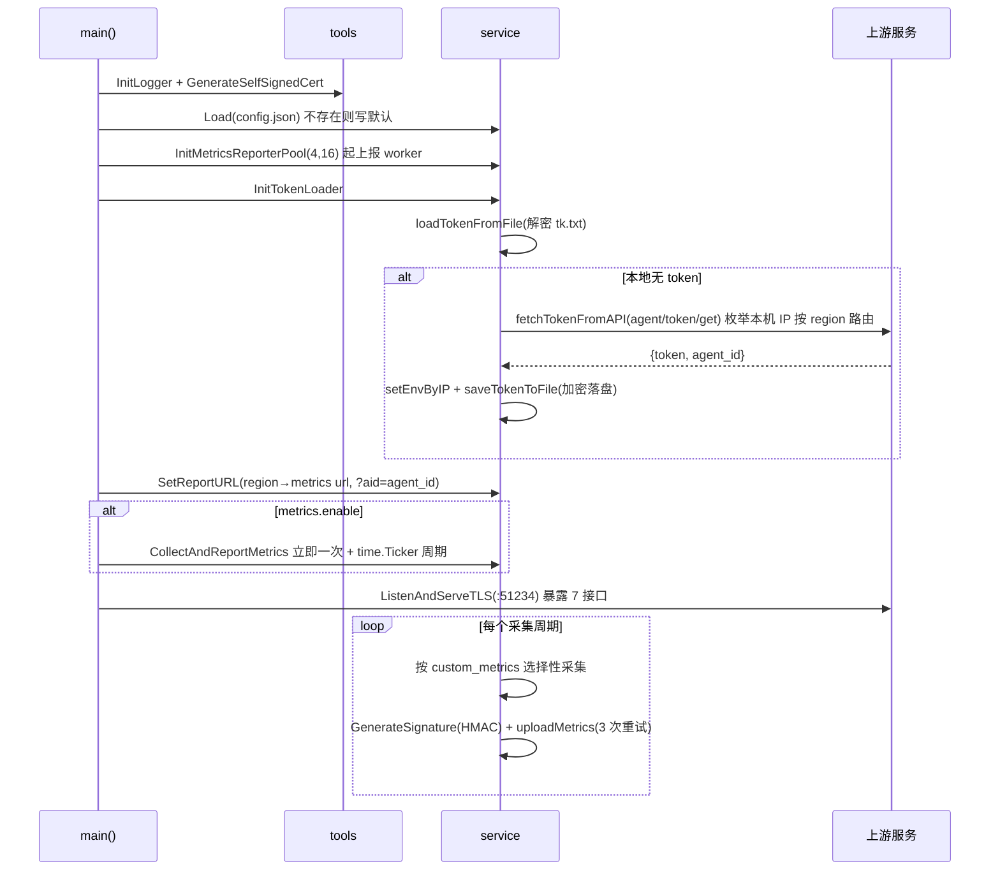
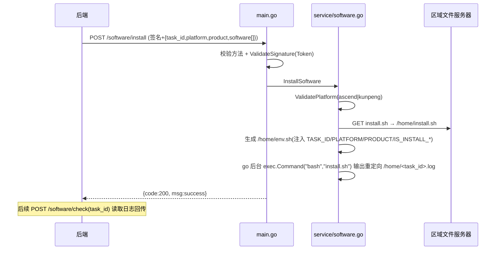

# HiD-Agent 采集与控制面系统设计

## 1. 系统定位

`hidevlab-hid-agent`（HiD-Agent）是部署在服务器/工作站上的轻量级数据采集与运维代理，运行于华为 Ascend NPU 服务器、Kunpeng 服务器、BMS 裸金属、FusionCompute 虚拟机等机型。该 Agent 主要支撑以下业务场景：

- 按配置周期采集系统指标（CPU/内存/磁盘 IO/磁盘使用率/SSH 会话/进程/NPU 数量与占用/命令执行状态/机器类型/系统类型），经 HMAC 签名后 HTTPS 上报 HiDevLab 后端
- 提供被后端远程调用的控制面接口：采集配置热更新、软件预制安装/卸载/检查、agent 自卸载、网络配置清理
- 基于本机 IP CIDR 自动识别机房 region，据此路由到对应的上报服务、transport 服务、文件服务器，并区分 prod/test 环境

Agent 为端侧无状态进程，无 DB/MQ/Redis；所有持久化均为本地文件。

## 2. 业务边界

| 边界类型 | 说明 |
| --- | --- |
| 上游依赖 | transport 服务（token 获取）、区域指标上报服务、区域文件服务器 |
| 下游依赖 | 无（Agent 为最末端被控端） |
| 外部接口 | 暴露 7 个 HTTPS REST 接口供后端调用 |
| 内部接口 | 无 |

## 3. 分层结构

Go 非 OOP 式 Controller/Service/Entity 划分，但存在等价分层：

| 分层 | 文件 | 关键单元 |
| --- | --- | --- |
| 入口/路由 | `main.go` | `main()`、`setConfig`、`handleSoftwareInstall/Uninstall/Check`、`handleAgentDelete`、`handleNetConfigDelete`、`writeJSON` |
| 业务 | `service/config.go` | `AgentConfig`/`MetricsConfig`/`AgentConfigExport`、`GlobalConfig`、`Load`/`Save`/`Export` |
| 业务 | `service/collect.go` | `MetricsRequest`/`UsageReport`、`CollectAndReportMetrics`、各采集函数、上报线程池 `InitMetricsReporterPool`/`metricsReporterWorker`/`uploadMetrics` |
| 业务 | `service/token.go` | `TokenCache`、`InitTokenLoader`/`tokenLoaderLoop`/`loadTokenFromFile`/`fetchAndStoreToken`/`fetchTokenFromAPI` |
| 业务 | `service/software.go` | `Software`/`SoftwareInstallRequest` 等、`InstallSoftware`/`UninstallSoftware`/`CheckSoftware`/`ValidatePlatform` |
| 业务 | `service/delete.go` | `DeleteAgent`/`DeleteNetworkConfigs`、`removeAgentFiles`/`cleanupBashrc`/`cleanupRedHatNetwork`/`cleanupDebianNetwork` |
| 工具 | `tools/encryptor.go` | `Encryptor`（三段式 AES-GCM） |
| 工具 | `tools/signature.go` | `GenerateSignature`/`ValidateSignature`（HMAC-SHA256） |
| 工具 | `tools/cert.go` | `GenerateSelfSignedCert` |
| 工具 | `tools/systemutils.go` | `GetOSFamily`/`SafeCommand`/`SafeRemoveDir`/`FileExists` 等 |
| 常量 | `constant/const.go` | `VERSION`(26.6.0)、`LISTEN_PORT`(:51234)、`IP_TO_REGION`、`REGION_TO_METRICS_URL`/`REGION_TO_TRANSPORT_ENDPOINT`/`REGION_TO_FILESERVER_ENDPOINT` |

## 4. 区域路由

Agent 基于本机非回环 IPv4，按 `IP_TO_REGION` 的 CIDR 匹配机房 region（Dongguan-G6/Hangzhou-Z2/Z9/Haiwei/Suzhou-B3/Helingeer-C1 等华为机房），再据 `REGION_TO_*` 映射表选择对应上游地址，并区分 prod/test 环境。

| 映射表 | 用途 |
| --- | --- |
| `IP_TO_REGION` | 本机 IP CIDR → region |
| `REGION_TO_TRANSPORT_ENDPOINT` | region → token/transport 服务地址 |
| `REGION_TO_METRICS_URL` | region → 指标上报 URL |
| `REGION_TO_FILESERVER_ENDPOINT` | region → 软件脚本文件服务器 IP |

## 5. 核心流程

### 5.1 Agent 启动 + Token 获取 + 指标上报

### 5.2 远程软件预制安装

### 5.3 Agent 自卸载

`/agent/delete` → `DeleteAgent` → `removeAgentFiles`（删 `/usr/local/hidagent`、service 文件、journald conf）→ `cleanupBashrc` → `systemctl daemon-reload` → 返回后延迟 2s `systemctl stop hidagent` + `os.Exit(0)`。

## 6. 接口列表

Agent 侧 HTTPS 服务，监听 `:51234`。所有请求需携带 `X-HiD-Signature` 头（请求体 HMAC-SHA256，密钥为 Token），响应头带 `X-Agent-Version`。

| API 路径 | HTTP方法 | 功能描述 |
| --- | --- | --- |
| `/config` | GET | 获取当前 agent 配置（metrics.enable/interval/custom_metrics、agent_id、env、log_level、region） |
| `/config` | PATCH | 增量更新采集配置，热重启采集器并持久化 |
| `/software/install` | POST | 触发软件预制安装 |
| `/software/uninstall` | POST | 触发软件预制卸载 |
| `/software/check` | POST | 读取某 task_id 的安装日志内容 |
| `/agent/delete` | POST | 卸载并删除 agent 自身（成功后进程退出） |
| `/net_config/delete` | POST | 清理主机网络配置（保留 loopback） |

> 注：`docs/API.md` 较旧，写端口 8443、`/software/check` 为 GET；以代码 `main.go` 为准（端口 51234、check 为 POST）。

## 7. 数据与持久化

**无数据库、无 ORM、无 SQL。** 所有持久化为本地文件：

| 文件 | 内容 |
| --- | --- |
| `config/config.json` | Agent 配置（agent_id、env、region、log_level、metrics） |
| `config/tk.txt` | 加密后的 Token |
| `config/build1.rk`/`build2.rk`/`build3.rk` | 三段式加密密钥文件 |
| `/home/<task_id>.log` | 软件预制执行日志 |

## 8. 与其他服务的依赖关系

- **transport 服务（token）**：`https://<REGION_TO_TRANSPORT_ENDPOINT>/agent/token/get`，POST `{ip}`，返回 `{token, agent_id}`，用于身份注册与签名密钥分发。
- **指标上报服务**：`REGION_TO_METRICS_URL[region]`，POST 指标 JSON，带 `X-HiD-Signature`/`X-Agent-Version`/`Referer`。
- **文件服务器**：`REGION_TO_FILESERVER_ENDPOINT[region]`，HTTP GET `install.sh`/`uninstall.sh`。
- 无 Feign（非 Java）、无 MQ、无 Redis。`go.mod` 仅依赖 `gopsutil`、`zap`、`golang.org/x/crypto`、`golang.org/x/text` 等。
- Agent 不主动注册心跳，其"在线"体现为周期性指标上报（默认 900000ms=15 分钟）。

## 9. 配置与中间件

**配置文件** `config/config.json`（`AgentConfig`）：

| 字段 | 说明 |
| --- | --- |
| `metrics.enable` | 采集开关 |
| `metrics.interval` | 采集周期（毫秒，1000~86400000，默认 900000） |
| `metrics.custom_metrics` | 可选采集项：`cpu`/`mem`/`disk_r`/`disk_w`/`ssh_session`/`usage`/`machine_type`/`disk`，空则采全量 |
| `agent_id` | 后端分配，上报 URL 的 `aid` 参数 |
| `env` | `prod`/`test`，由本机 IP CIDR 自动判定 |
| `region` | 华为机房区域名，决定上游 URL |
| `log_level` | debug/info/warn/error/fatal，默认 `warn` |

**中间件**：

- 数据库/消息队列/Redis：均无；仅进程内内存缓存（`TokenCache`、`cachedLocalIP`、`prevDiskIO`、`lastCommandExecCheck`）
- 日志：zap + systemd journald（`LogNamespace=hidagent`）
- TLS/证书：自签名证书运行时生成，TLS1.2/1.3；上报与 token 请求客户端侧 `InsecureSkipVerify: true`
- 加密：三段式密钥（build1~3.rk XOR → PBKDF2 10 万次 → AES-256-GCM），用于 Token 本地存储
- 签名：HMAC-SHA256（请求体 + Token）
- 并发：上报 worker 池（4 worker + 缓冲 16 channel）、采集 `time.Ticker`、配置变更通知 channel

## 10. 安全机制

- **传输层 HTTPS（非 mTLS）**：控制面接口对外提供 HTTPS 服务，使用运行时生成的自签名证书 + TLS1.2/1.3，仅为服务端单向 TLS，不涉及客户端证书双向认证。
- **控制面鉴权**：控制面请求需携带 `X-HiD-Signature`（HMAC-SHA256，密钥为 Token），由 `ValidateSignature` 校验——客户端身份认证依赖签名头而非 TLS 客户端证书。
- **客户端侧证书校验缺失（已知安全债务）**：Agent 作为客户端发起上报与 token 请求时 `InsecureSkipVerify: true`，跳过了对服务端 TLS 证书的校验，存在中间人风险；建议后续部署内部 CA 并启用证书校验。
- **Token 三段式加密存储**：Token 获取后经三段式 AES-GCM 加密落盘 `config/tk.txt`。
- **敏感配置加密**：密钥文件、Token 均以密文落盘。

## 11. 异常处理

| 异常场景 | 处理策略 |
| --- | --- |
| token 获取失败 | 枚举本机 IP 逐个尝试，全部失败则采集上报无签名密钥 |
| 指标上报失败 | 最多 3 次重试，60s 超时 |
| 软件平台非法 | `ValidatePlatform` 拦截，返回错误 |
| 控制面签名校验失败 | `ValidateSignature` 拦截，返回错误 |
| 配置 interval 越界 | 限制在 1000~86400000 毫秒 |
