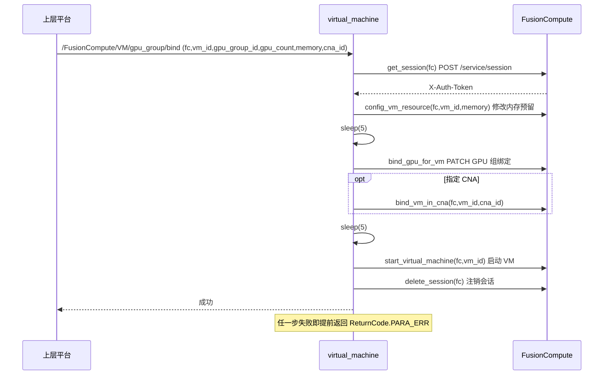
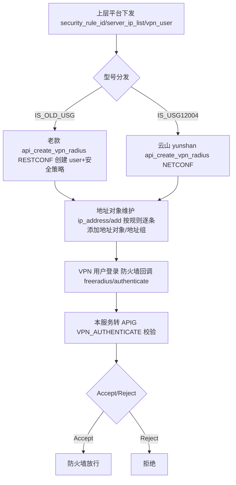

# 基础设施编排执行系统设计

## 1. 系统定位

`hidevlab-infra-manager-service`（Blue Service Agent）是 HiDevLab 实验室平台的基础设施管理服务，作为上层业务平台与底层华为基础设施之间的自动化执行代理。该服务面向裸金属服务器（BMS）、FusionCompute 虚拟机、网络设备（交换机/防火墙）、VPN、对象存储（OBS）和 K8s 集群提供统一运维编排，主要支撑以下业务场景：

- 裸金属 BMC 管理：上电/下电/强制重启、PXE 启动、BMC 用户管理、部件信息获取
- 主机操作系统网络配置：按 Debian/CentOS 编排网卡配置并清理临时 PXE IP
- FusionCompute 虚拟机生命周期：创建/删除/启停/转模板、CPU/内存/磁盘热变更、GPU 绑定、安全组
- K8s 集群管理：基于 FusionCompute KRM 创建/删除 K8s 集群
- VPN/防火墙策略：对接华为 USG 防火墙（老款 + USG12004 云山双型号）创建/删除 RADIUS 账号、NAT 映射、地址对象
- 网络隔离：核心交换机 ACL 下发/删除、端口 shutdown/undo
- OBS 对象存储配置

服务无状态、无 DB，所有数据从外部系统实时拉取/下发。

## 2. 业务边界

| 边界类型 | 说明 |
| --- | --- |
| 上游依赖 | 上层业务平台（经 HTTPS+token 调用本服务） |
| 下游依赖 | Apollo 配置中心、APIG 鉴权服务、FusionCompute、USG 防火墙、核心交换机、BMC、目标主机 |
| 外部接口 | FusionCompute REST API、防火墙 RESTCONF/NETCONF、交换机 CLI（SSH）、BMC Redfish、主机 SSH |
| 内部接口 | 主服务暴露约 40+ REST 接口；FreeRADIUS 服务暴露 4 个回调接口 |

## 3. 分层结构

本项目为 Flask 单体，分层为 **路由层 → service 层 → tools/utils/dto 层**，无传统 Java 命名，职责对应清晰。

### 3.1 关键类/模块

| 分层 | 文件 | 关键单元 |
| --- | --- | --- |
| 主服务路由 | `hidevlab_blue_service.py` | `api_configure_custom_network`、`config_obsutil`、`set_pxe_boot`、`bms_restart/shutdown/start`、`bmc_user_create/delete`、`create_vpn_radius_api`、`create_nat_mapping_api`、`add_cross_acl`、`create_vm`/`delete_vm`/`stop_vm`、`k8s_create/delete`、`security_group_create/delete` |
| RADIUS 路由 | `freeradius.py` | `authorize`/`authenticate`/`postauth`/`accounting` |
| 业务 | `service/bmc.py` | `generate_token`、`set_pxe`、`force_restart`、`system_shutdown`、`create_user`、`get_component_info`、`User`、`RedfishExcepion` |
| 业务 | `service/virtual_machine.py` | `Fc`/`FcRequest`、`get_session`、`create_virtual_machine`、`create_k8s`、`security_group_add_rules` |
| 业务 | `service/vpn_service_api.py` | 老款 USG RESTCONF/SSH |
| 业务 | `service/yunshan_vpn_service_api.py` | USG12004 云山 NETCONF/RESTCONF |
| 业务 | `service/network_isolation.py` | `add_acl_in_core_switcher`、`add_acl_in_fc_core_switcher` |
| 业务 | `service/config_network.py` | `HostConfig`、`NetworkConfig`、`configure_debian_network`、`configure_centos_network` |
| 业务 | `service/obs.py` / `service/port.py` | OBS 配置、`port_operation` |
| 工具 | `tools/ssh.py` | paramiko SSH 连接封装 |
| DTO | `dto/fusion_compute.py` | `VM`/`VmConfig`/`Disk`/`Nic`/`SecurityRule`/`NicSpecification`/`VmCustomization` |
| DTO | `dto/k8s.py` | `K8S`/`Node`/`ManageNic`/`ContainerNetwork`/`ComponentConfig` |
| DTO | `dto/firewall.py` | `NatServerMapping` |
| 安全 | `utils/auth_filter.py` | token 校验 + HW 网关签名 |
| 基础 | `base/` | `config`、`common`、`apollo_manager`、`decrypt`、`entity`、`logging_handler` |

## 4. 核心功能域

| 功能域 | 说明 |
| --- | --- |
| 裸金属（BMS）管理 | 通过 BMC Redfish API 实现上电/下电/重启/设 PXE、BMC 用户管理、网卡 MAC 与部件信息获取 |
| 主机网络配置 | SSH 登录主机，按 Debian/Ubuntu 或 CentOS 编排 netplan/network 配置并删除临时 PXE IP |
| FusionCompute VM 生命周期 | 对接 FC 7443 端口 REST API，完成 VM 创建/删除/启停/转模板、CPU/内存/磁盘热变更、GPU 绑定、安全组规则增删 |
| K8s 集群管理 | 基于 FC KRM 接口创建/删除 K8s 集群（master+worker 节点池），查询状态与失败原因 |
| VPN/防火墙策略 | 对接 USG 防火墙（老款 + 云山双型号），RESTCONF/NETCONF 创建/删除 RADIUS VPN 账号、NAT 映射、地址对象 |
| 网络隔离 | SSH 登录华为 CE/H3C 交换机，下发/删除跨域 ACL、FC 核心 K8s 规则、端口 ACL、端口 shutdown/undo |
| OBS 管理 | 通过 obsutil CLI 在目标主机配置 AK/SK 并查询桶目录大小 |
| FreeRADIUS 认证回调 | 接收防火墙 VPN authorize/authenticate/postauth/accounting 回调，转 APIG 校验，返回 Accept/Reject |

## 5. 核心流程

### 5.1 虚拟机创建并绑定 GPU

### 5.2 VPN 账号开通

## 6. 接口列表

### 6.1 主服务（hidevlab_blue_service.py，HTTPS）

| API 路径 | HTTP方法 | 功能描述 |
| --- | --- | --- |
| `/health` | GET | 健康检查（免鉴权） |
| `/configure_custom_network` | POST | 配置主机业务网卡并清理 PXE IP |
| `/obs/set` | POST | 在主机配置 OBS AK/SK |
| `/obs/size/get` | POST | 查询 OBS 桶目录大小 |
| `/set_pxe` | POST | 设 BMC 为 PXE 启动并重启 |
| `/restart` | POST | 裸金属强制重启 |
| `/shutdown` | POST | 裸金属下电 |
| `/start` | POST | 裸金属上电 |
| `/bms/port/get` | POST | 获取 BMS 网口 MAC |
| `/bms/componentInfo/get` | POST | 批量获取 BMS 部件信息 |
| `/bmc/user/create` | POST | 创建 BMC 用户 |
| `/bmc/user/delete` | POST | 删除所有 BMC 用户 |
| `/bmc/user/password/update` | POST | 修改 BMC 用户密码 |
| `/firewall/account/radius/create` | POST | 创建 VPN RADIUS 账号 |
| `/firewall/account/radius/delete` | POST | 删除 VPN RADIUS 账号 |
| `/firewall/account/nat/mapping/create` | POST | 创建 NAT Server 映射 |
| `/firewall/account/nat/mapping/delete` | POST | 删除 NAT Server 映射 |
| `/firewall/account/ip_address/add` | POST | 防火墙地址对象/组添加 |
| `/firewall/account/ip_address/delete` | POST | 防火墙地址对象/组删除 |
| `/switcher/core/cross/add` | POST | 核心交换机跨域 ACL 添加 |
| `/switcher/core/cross/delete` | POST | 核心交换机跨域 ACL 删除 |
| `/switcher/core/acl/port/add` | POST | 核心交换机端口 ACL 添加 |
| `/switcher/FCcore/k8sRule/add` | POST | FC 核心交换机 K8s 规则添加 |
| `/switcher/FCcore/k8sRule/delete` | POST | FC 核心交换机 K8s 规则删除 |
| `/switcher/shutdown_port` | POST | 关闭交换机端口 |
| `/switcher/undo_shutdown_port` | POST | 恢复交换机端口 |
| `/FusionCompute/cluster/getComputeResource` | POST | 查 FC 集群计算资源 |
| `/FusionCompute/datastore/get` | POST | 查 FC 数据存储 |
| `/FusionCompute/host/getVMList` | POST | 按 host 查 VM 列表 |
| `/FusionCompute/VM/get` | POST | 查 VM 详情 |
| `/FusionCompute/VM/create` | POST | 创建虚拟机 |
| `/FusionCompute/VM/delete` | POST | 删除虚拟机 |
| `/FusionCompute/VM/stop` | POST | 停止虚拟机 |
| `/FusionCompute/VM/reboot` | POST | 重启虚拟机 |
| `/FusionCompute/VM/id/get` | POST | 按 IP 查 VM ID |
| `/FusionCompute/VM/gpu_group/bind` | POST | 绑定 GPU 组并启动 VM |
| `/FusionCompute/VM/task` | POST | 查 VM 任务状态 |
| `/FusionCompute/VM/cpu` | POST | 变更 VM CPU 数 |
| `/FusionCompute/VM/memory` | POST | 变更 VM 内存 |
| `/FusionCompute/VM/disk` | POST | 挂载 VM 数据盘 |
| `/FusionCompute/VM/template` | POST | VM 转模板 |
| `/FusionCompute/SecurityGroup/rules/add` | POST | 安全组添加放行规则 |
| `/FusionCompute/SecurityGroup/rules/delete` | POST | 安全组删除放行规则 |
| `/FusionCompute/SecurityGroup/create` | POST | 创建安全组 |
| `/FusionCompute/SecurityGroup/delete` | POST | 删除安全组 |
| `/FusionCompute/k8s/create` | POST | 创建 K8s 集群 |
| `/FusionCompute/k8s/delete` | POST | 删除 K8s 集群 |
| `/FusionCompute/k8s/status/get` | POST | 查 K8s 集群状态 |
| `/FusionCompute/k8s/task/get` | POST | 查 K8s 任务失败原因 |

### 6.2 FreeRADIUS 服务（freeradius.py，HTTPS）

| API 路径 | HTTP方法 | 功能描述 |
| --- | --- | --- |
| `/freeradius/authorize` | POST | RADIUS 授权回调（直接 Accept） |
| `/freeradius/authenticate` | POST | VPN 账号密码校验（转 APIG） |
| `/freeradius/postauth` | POST | VPN 登录后置校验（转 APIG） |
| `/freeradius/accounting` | POST | RADIUS 计费回调（直接 Accept） |

## 7. 数据与持久化

**本服务不持有任何数据库**，无 ORM、无 mapper、无 SQL。所有数据无状态地从外部系统实时拉取/下发：

- 虚拟机/安全组/K8s 元数据来自 **FusionCompute REST API**（`/service/sites/{site}/vms`、`/securitygroups`、`/krm/v1/clusters`）
- 防火墙策略来自 **USG 防火墙 RESTCONF/NETCONF**（YANG 模型：`huawei-address-set`、`huawei-security-policy`、`huawei-nat-server`、`huawei-user-management-fw`）
- 交换机 ACL 来自 **交换机 CLI**（`display acl`、`acl number`、`rule`）
- 配置来自 **Apollo 配置中心**

本服务仅做 DTO 映射（`VM`/`K8S`/`NatServerMapping`/`SecurityRule` 等），不持久化。

## 8. 与其他服务的依赖关系

无 Feign、无 MQ，依赖关系全部为同步 HTTP/SSH 出站调用：

- **Apollo 配置中心**：`base/apollo_manager.py` 经 `pyapollo` 拉取 5 个 namespace 配置。
- **华为 APIG 网关（认证）**：`utils/auth_filter.py` 调 `TOKEN_URL` 校验调用方 token；`freeradius.py` 调 `VPN_AUTHENTICATE`/`VPN_POST_AUTH` 校验 VPN 账号。均用 `X-HW-ID` + `X-HW-SIGN`（SHA256）。
- **FusionCompute**：`service/virtual_machine.py` 调 FC 7443 端口 REST API。
- **USG 防火墙（老款）**：`service/vpn_service_api.py` + `vpn_service.py`，RESTCONF(XML) + SSH。
- **USG12004（云山）防火墙**：`service/yunshan_vpn_service_api.py`，RESTCONF + NETCONF(ncclient)。
- **核心交换机 / FC 核心交换机**：`service/network_isolation.py`、`service/port.py`，paramiko SSH 下发 CLI（自动识别华为 CE/H3C 型号）。
- **裸金属 BMC（Redfish）**：`service/bmc.py`，HTTPS 调 `redfish/v1/...`。
- **目标主机操作系统**：`service/config_network.py`、`service/obs.py`，paramiko SSH 执行 netplan/network 配置、obsutil 命令。
- **OBS 对象存储**：通过本地 `obsutil` CLI（subprocess）间接访问。

## 9. 配置与中间件

**配置来源**：Apollo 配置中心（`SecureApolloClient`，按 `DEPLOY_ENV` 拼 app_id，校验 `apollo.pem`），分 5 个 namespace：

| namespace | 关键配置项 |
| --- | --- |
| `interface_conf` | DNS1/DNS2、`SERVER_MODEL_INTERFACE`（机型↔网卡映射 JSON） |
| `network_conf` | PXE_IP、HTTPS 证书路径、TOKEN_URL、REFER_URL、TRANSPORT_IP、各服务端口（BLUE_SERVICE/FREERADIUS/SWITCHER/SSH）、FC_MAG/FC_MASK |
| `vpn` | FW 主机/账号密码(解密)、ACL_NUMBER、CORE_SWITCH 账号密码(解密)、VPN_NET、`IS_USG12004`/`IS_OLD_USG` 双型号开关、USG12004_IP/端口 |
| `apig` | X_HW_ID、X_HW_APPKEY、REFERER、`VPN_AUTHENTICATE`/`VPN_POST_AUTH` |
| `common` | 日志路径、`ENABLE_AUTH` 鉴权总开关、`LAB_REGION`、OBS_CONFIG_PATH |

**中间件/外部依赖**：

- Apollo（配置中心）
- HTTPS/TLS 1.2（两服务均强制，证书经 AES-GCM 解密后加载）
- 华为 APIG 网关（统一鉴权出口，SHA256 签名）
- FusionCompute（虚拟化与 K8s/KRM 后端）
- USG 防火墙 + FreeRADIUS（VPN 接入控制链路）
- SSH（paramiko）+ Redfish（requests）：对交换机、BMC、主机的带外/带内管控
- obsutil CLI（OBS 客户端）
- APScheduler（已 init，预留定时能力）
- 无数据库、无 Redis、无消息队列

## 10. 安全机制

- **敏感配置加密**：防火墙/交换机账号密码、HTTPS 证书/私钥均以密文存于 Apollo，运行时 AES-GCM 解密（三段密钥 XOR + PBKDF2 + GCM）。
- **入向鉴权**：`auth_filter` 调 APIG `TOKEN_URL` 校验 token，`ENABLE_AUTH` 为总开关，`/health` 免鉴权。
- **出向签名**：调用 APIG 统一走 HW 签名（`X-HW-ID`/`X-HW-SIGN`，SHA256）。
- **VPN 接入控制**：防火墙回调 FreeRADIUS 服务，由本服务转 APIG 校验账号，返回 Accept/Reject。
- 两个进程（`blue_service` 与 `freeradius`）作为两个独立部署单元，均强制 TLS1.2。

## 11. 异常处理

| 异常场景 | 处理策略 | 返回码 |
| --- | --- | --- |
| token 非法 | `auth_filter` 拦截 | 401 |
| 必填参数缺失 | 返回参数错误 | 400 |
| FusionCompute 任一步失败 | 提前返回 `ReturnCode.PARA_ERR` 并记录日志 | 业务失败 |
| 防火墙型号未匹配 | 双型号开关均关闭时无法下发 | 业务失败 |
| 交换机 SSH 失败 | 记录日志，返回错误 | 业务失败 |
| BMC Redfish 异常 | 抛 `RedfishExcepion`，记录日志 | 业务失败 |
