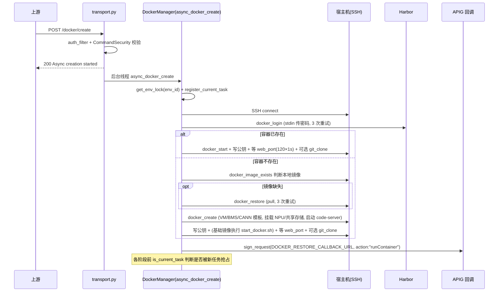
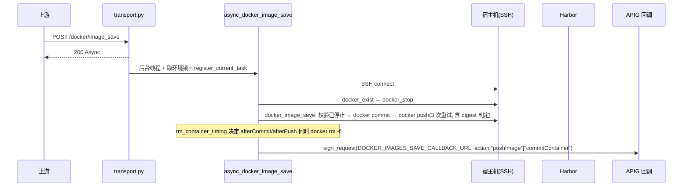

# Docker 容器编排与传输代理系统设计

## 1. 系统定位

`hidevlab-transport-service` 是 HiDevLab 体系中控制面与计算节点/Agent 之间的代理网关，向上对接 APIG 网关/业务后端，向下通过 SSH 操作宿主机、通过 HTTP 调用 host 上的 Agent。该服务主要支撑以下业务场景：

- 为 host 上的 Agent 提供鉴权转发（指标上报、token 获取、SSH 公钥查询、采集间隔下发、agent/网络配置删除）
- 软件预安装/卸载/状态检查转发
- Docker 容器生命周期管理：创建/恢复/停止/销毁开发容器（含 NPU/davinci 设备挂载、code-server、glusterfs 共享、CPU 隐藏、git clone）
- 自定义镜像拉取/打标/推送 Harbor
- 镜像多机并发发布/下架
- 容器网络隔离（iptables + glusterfs 共享存储）
- CANN 版本升级/查询
- OBS 对象存储配置

服务无状态、不直连数据库，任务态存于进程内字典+临时文件，业务事实归上游业务服务管理，本服务以回调方式上报执行结果。

## 2. 业务边界

| 边界类型 | 说明 |
| --- | --- |
| 上游依赖 | APIG 网关/业务后端（下发任务、接收回调） |
| 下游依赖 | Apollo 配置中心、APIG 鉴权服务、Harbor 镜像仓库、目标宿主机（SSH）、host Agent（HTTP）、GlusterFS、OBS |
| 外部接口 | SSH（docker/iptables/glusterfs/obsutil）、HTTP（Agent）、Harbor（docker CLI）、APIG（签名+回调） |
| 内部接口 | 暴露约 20 个 REST 接口，多为异步任务模式 |

## 3. 分层结构

本项目为轻量分层 Flask 单体，可对应映射为：

| 分层 | 实现 | 关键类/模块 |
| --- | --- | --- |
| Controller(路由) | `transport.py` 中 `@APP.route` 视图函数 | `health_check`、`transport_metrics`、`agent_get_token`、`set_agent_interval`、`delete_net_config`、`delete_agent`、`software_install/uninstall/status_check`、`docker_block_add/delete`、`docker_custom_image_pull`、`docker_restore`、`docker_create`、`docker_image_save`、`docker_stop`、`docker_remove`、`docker_cann_update/query`、`docker_image_publish/unpublish`、`set_vm_obs` |
| Service(业务) | `service/docker_manager.py` 类 `DockerManager` + 模块级 `async_*` 编排函数 | `DockerManager`（SSH+docker CLI 封装）、`async_docker_create/restore/stop/clear/image_save/custom_image_pull/image_publish/image_unpublish`；`obs.set_obs`；`pre_install.check_software_status` |
| 基础设施 | `base/` | `apollo_manager.SecureApolloClient`、`auth_filter`(`sign_request`/`auth_filter`/`getSign`)、`decrypt`(`decrypt`/`decryptbyroot`)、`config`、`common` |
| 安全工具 | `utils/command_security.py::CommandSecurity`、`utils/security.py`、`tools/ssh.py::Ssh` | 命令/路径/容器名/IP/端口/SSH 公钥白名单校验 + `shlex.quote` 转义 |
| 持久层 | 进程内字典 `_env_current_task` + 临时文件 `${tempdir}/hidevlab_transport_tasks/env_<env_id>.json` | 无 Entity/Mapper/ORM |

## 4. 核心功能模块

| 模块 | 说明 |
| --- | --- |
| 健康检查 | `GET /health` 简单探活 |
| Agent 代理转发 | 为 host Agent 提供鉴权转发：指标上报、token 获取、SSH 公钥查询、采集间隔下发、agent/网络配置删除 |
| 软件预安装 | 转发到 Agent 安装/卸载软件，结合 `SOFTWARE_CHECK` 配置解析安装日志判定状态 |
| Docker 容器生命周期（核心） | 经 SSH 在远端宿主机执行 `docker run/pull/tag/commit/push/rm`，构建/启动/停止/销毁开发容器 |
| 自定义镜像 | 拉取源镜像→打本地标签→推送 Harbor→清理，产出用户私有镜像 |
| 镜像发布/下架 | 线程池（max_workers=100）并发在多台机器上 pull/tag/rmi，结束回调 |
| 容器网络隔离（block） | 通过 iptables(DOCKER/DOCKER-USER/FORWARD/INPUT 链)、glusterfs-client、`/etc/hosts` 实现容器间网络隔离与共享存储挂载 |
| CANN 版本管理 | 在容器内调用 `manage_cann_pkg.sh` 升级/查询华为 CANN 版本 |
| OBS 对象存储配置 | 通过 SFTP 上传 `obsutil` 二进制（arm/x86 选型）并配置 AK/SK/endpoint |
| 定时调度 | `flask_apscheduler` 已初始化（预留能力） |

## 5. 核心流程

### 5.1 Docker 容器创建（异步）

### 5.2 镜像保存（异步）

### 5.3 容器网络隔离（block_add）

装 glusterfs-client → 配 `/etc/hosts` → mount glusterfs → 加 iptables DROP 规则（DOCKER/DOCKER-USER 链 + 固定 4 条 FORWARD/INPUT 规则隔离 docker0 网段）。

## 6. 接口列表

异步路由统一模式：立即返回 `200 Async ... started`，后台 `threading.Thread` 执行，完成后 `sign_request` 回调上游。

| API 路径 | HTTP方法 | 功能描述 |
| --- | --- | --- |
| `/health` | GET | 健康检查 |
| `/api/v1/metrics` | POST | 转发 Agent 指标到后端 |
| `/query/sshPubKey` | POST | 查询 SSH 公钥（经 APIG） |
| `/agent/token/get` | POST | Agent 获取 token |
| `/agent/config/set` | POST/PATCH | 设置 Agent 采集间隔 |
| `/VM/net_config/delete` | POST | 删除 VM 网络配置 |
| `/VM/agent/delete` | POST | 删除 VM 上的 Agent |
| `/software/preInstall/install` | POST | 预装软件 |
| `/software/preInstall/uninstall` | POST | 卸载软件 |
| `/software/preInstall/check` | POST | 检查软件安装状态 |
| `/docker/block/add` | POST | 添加容器网络隔离规则+共享存储挂载 |
| `/docker/block/delete` | POST | 删除容器网络隔离规则 |
| `/docker/custom/image/pull` | POST | 自定义镜像拉取/打标/推送（异步） |
| `/docker/restore` | POST | 拉取并恢复镜像（异步） |
| `/docker/create` | POST | 创建并启动容器（异步） |
| `/docker/image_save` | POST | 提交容器为新镜像并推送（异步） |
| `/docker/stop` | POST | 停止并保存镜像/清理（异步） |
| `/docker/remove` | POST | 移除容器、镜像与用户数据（异步） |
| `/docker/cann/update` | POST | 升级容器内 CANN 版本 |
| `/docker/cann/update/query` | POST | 查询 CANN 版本信息 |
| `/docker/image/publish` | POST | 多机并发发布镜像（异步） |
| `/docker/image/unpublish` | POST | 多机并发下架镜像（异步） |
| `/VM/obs/set` | POST | 配置 VM 的 OBS 工具 |

## 7. 数据与持久化

**本服务无数据库、无 Entity、无 Mapper。** 任务态保存在：

| 存储 | 内容 |
| --- | --- |
| 进程内字典 `_env_current_task`（带 `threading.Lock`） | 每个 env_id 当前 task_id |
| 临时文件 `$TEMP/hidevlab_transport_tasks/env_<env_id>.json` | 进程重启后仍能判断任务归属（`register_current_task`/`is_current_task`/`unregister_current_task`） |

业务实体（容器、镜像、用户、环境）的权威数据由上游业务服务持有，本服务仅以参数透传方式接收 `task_id`/`env_id`/`user_id`/`container_name`/`image_name` 等。

## 8. 任务并发控制

- **env_id 级互斥锁** `get_env_lock(env_id)`：同一环境的容器操作互斥。
- **当前任务登记**：`register_current_task` 写内存+文件，新任务可抢占旧任务。
- **优雅取消**：每个关键步骤前调 `is_current_task` 判断是否被抢占，被抢占则返回 `cancelled` 且不再回调。
- **线程池**：镜像发布/下架用 `ThreadPoolExecutor(max_workers=100)` 并发多机操作。

## 9. 与其他服务的依赖关系

- **Apollo 配置中心**：`SecureApolloClient` 从 6 个 namespace 拉取全部配置。
- **APIG / 上游业务后端**（经 APIG 签名）：
  - 鉴权：`auth_filter.auth_filter` → `TOKEN_URL` 校验 dynamic token。
  - 指标/公钥/token 转发：`SEND_METRIC`、`OBTAIN_SSH_CERT_URL`、`TOKEN_GET_URL`。
  - 回调（结果上报）：`DOCKER_RESTORE_CALLBACK_URL`、`DOCKER_IMAGES_SAVE_CALLBACK_URL`、`DOCKER_CLEAR_CALLBACK_URL`、`DOCKER_PUBLISH_CALLBACK_URL`（`action` 取值 `pullImage`/`runContainer`/`pushImage`/`commitContainer`/`customImage`）。
- **Host Agent**（出站 HTTP，`verify=False`，timeout=60）：`AGENT_*_URL % host_ip` 模板调用。
- **Harbor 镜像仓库**：docker CLI login/push/pull，密码通过 stdin 写入避免泄露。
- **目标宿主机**（出站 SSH，paramiko）：`DockerManager.connect`/`Ssh` 执行 docker/iptables/glusterfs/obsutil 等命令。
- **GlusterFS**：容器间共享存储（`/data/gluster` 挂载点）。
- **OBS**：obsutil CLI（arm/x86 二进制随服务分发）。
- **无 MQ**：异步靠 `threading.Thread(daemon=True)` + 线程池。

## 10. 配置与中间件

**配置来源**：Apollo 配置中心（`base/config.py` 聚合），分 namespace：

| namespace | 关键配置项 |
| --- | --- |
| `service_conf` | `SERVICE_HOST`(0.0.0.0)、`SERVICE_PORT`(18888)、`ENABLE_AUTH`、`LOCAL/REMOTE_SCRIPT_DIR`、`FILESERVER_IP`、`LAB_REGION` |
| `apig` | `TOKEN_URL`、`REFER_URL`、`X_HW_ID`、`ENC_X_HW_APPKEY`(加密)、`REFERER`、`TOKEN_GET_URL`、`SEND_METRIC`、`OBTAIN_SSH_CERT_URL` |
| `agent` | `AGENT_SET_INTERVAL_URL`、`AGENT_SOFTWARE_INSTALL/UNINSTALL/STATUS_URL`、`AGENT_DELETE_URL`、`AGENT_NET_CONFIG_DELETE_URL`（`%s` host_ip 模板） |
| `docker` | 5 个回调 URL（`DOCKER_*_CALLBACK_URL`） |
| `security` | `AES_KEY1_PATH`/`AES_KEY2_PATH`/`WORK_KEY_PATH`、`ENC_SSL_CERT_CONTENT`/`ENC_SSL_KEY_CONTENT` |
| `software` | `SOFTWARE_CHECK`（JSON，各软件安装/卸载日志 TAG/SUCCESS/FAIL 关键字） |

**中间件**：

- Apollo（配置中心）
- SSL/TLS：服务全量 https，证书从 Apollo 解密后加载
- SSH（paramiko）：到宿主机的远程执行通道
- Harbor：镜像仓库
- GlusterFS：容器间共享存储
- iptables：容器网络隔离
- obsutil + OBS：对象存储客户端
- flask_apscheduler：定时调度器（预留）
- Gunicorn + systemd：生产运行时
- 无数据库、无 Redis、无消息队列

## 11. 安全机制

- **命令注入防护**：`CommandSecurity` 对所有拼入 shell 的参数（路径、容器名、镜像名、IP、端口、user_id、SSH 公钥、token）做白名单正则校验 + `shlex.quote` 转义。
- **镜像仓库鉴权**：`docker_login` 通过 `get_pty` + stdin 传密码，避免密码出现在命令行。
- **服务间鉴权**：`auth_filter` + APIG SHA256 签名。
- **敏感配置加密**：APPKEY、SSL 证书、密钥均以密文存于 Apollo，运行时 AES-GCM 解密。
- **任务并发安全**：env_id 级互斥锁 + 当前任务登记（内存+文件），支持新任务抢占旧任务并以 `is_current_task` 在各阶段优雅取消。

## 12. 异常处理

| 异常场景 | 处理策略 |
| --- | --- |
| token 非法 | `auth_filter` 拦截 |
| 参数格式非法 | `CommandSecurity` 白名单校验拦截 |
| 任务被新任务抢占 | 各阶段 `is_current_task` 判断，返回 `cancelled` 且不再回调 |
| docker pull/push 失败 | 最多 3 次重试，依据输出含 `digest` 判定成功 |
| SSH 连接失败 | 记录日志，回调失败结果 |
| web_port 未就绪 | 最多 120 次 × 1s 轮询 |
