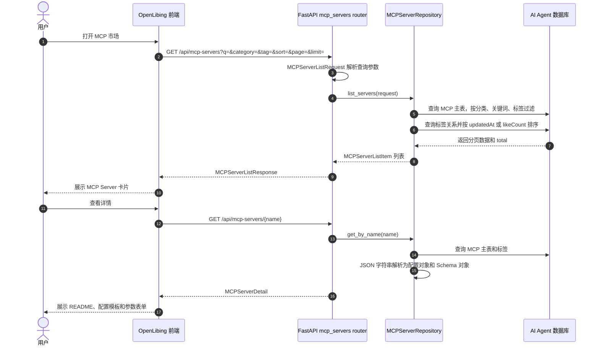
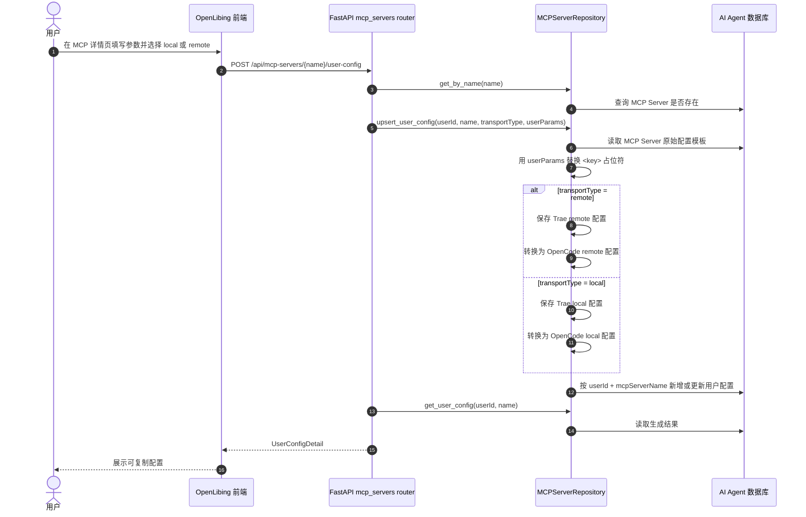

# MCP 市场系统设计

## 1. 系统定位

MCP 市场是 OpenLibing 页面中 AI 工具管理下的 MCP Server 聚合与配置分发模块。它面向 AI 编码工具用户提供 MCP Server 浏览、搜索、详情查看、点赞和配置生成能力，核心价值是把不同来源、不同接入方式的 MCP Server 标准化成市场条目，并按 Trae、OpenCode 等客户端需要生成可复制的配置。

当前后端实现集中在 `openlibing-ai-agent`：

- 公开市场路由：`app/routers/mcp_servers.py`
- 管理端路由：`app/routers/admin.py`
- 数据访问：`app/repositories/mcp_server_repo.py`
- 数据模型：`app/models/mcp_server.py`
- 请求响应模型：`app/schemas/mcp_server.py`

## 2. 业务边界

MCP 市场负责以下业务：

- 展示 MCP Server 列表，支持关键词、分类、标签筛选和排序。
- 展示 MCP Server 详情，包括 README、源码地址、远程配置模板、本地配置模板、环境变量 Schema、参数 Schema。
- 支持点赞和取消点赞，用 `like_count` 作为热度指标。
- 根据用户填写的参数生成 Trae 和 OpenCode 两种工具格式的远程或本地配置。
- 保存用户对单个 MCP Server 的最近一次配置结果，便于后续回显。

MCP 市场不负责以下业务：

- 不托管或运行 MCP Server 实例。
- 不校验用户填写的密钥是否真实可用。
- 不直接下发配置到用户本地客户端，只返回配置文本。

## 3. 领域模型

核心表包括：

| 表 | 源码模型 | 说明 |
| --- | --- | --- |
| `ai_agent_mcp_servers` | `MCPServer` | MCP Server 主数据，保存名称、展示信息、分类、团队、源码地址、README、远程和本地配置模板、参数 Schema、点赞数。 |
| `ai_agent_mcp_server_tags` | `MCPServerTag` | 标签表，支撑标签筛选和热门标签展示。 |
| `ai_agent_mcp_server_user_configs` | `MCPServerUserConfig` | 用户配置表，按 `user_id + mcp_server_name` 唯一保存远程或本地配置生成结果。 |

其中 MCP Server 的配置模板分为两类：

- `remote_server_config`：远程 MCP 配置，形如 `{"mcpServers": {"name": {"url": "...", "headers": {...}}}}`。
- `local_server_config`：本地 MCP 配置，形如 `{"mcpServers": {"name": {"command": "...", "args": [...], "env": {...}}}}`。

参数说明也分为两类：

- `env_schema`：描述环境变量参数，多用于本地命令启动。
- `parameter_schema`：描述 URL、Header 或其他占位参数，多用于远程接入。

## 4. 公开市场业务流

用户进入 MCP 市场后，前端读取列表、分类、标签和统计。所有查询由 `MCPServerRepository` 在数据库内完成，路由层只做参数收敛和响应模型封装。

## 5. 配置生成业务流

配置生成是 MCP 市场区别于普通资源市场的核心链路。管理员在录入 MCP Server 时保存带占位符的配置模板；用户在详情页输入参数后，后端将占位符替换为用户参数，并同时生成 Trae 和 OpenCode 所需格式。

## 6. 点赞与热度流

点赞接口是轻量互动能力，当前实现不按用户去重，而是直接调整 `like_count`：

- `POST /api/mcp-servers/{name}/like`：`like_count + 1`。
- `POST /api/mcp-servers/{name}/unlike`：`like_count - 1`，最小值为 0。

这让市场可以按 `likeCount` 展示热门 MCP Server，但当前语义更接近计数器，不是严格的用户收藏关系。

## 7. 配置校验与格式转换

管理端创建或更新 MCP Server 时，`MCPServerRepository` 会对配置字段做结构校验：

- `remote_server_config` 必须能解析为 `RemoteServerConfig`。
- `local_server_config` 必须能解析为 `LocalServerConfig`。
- `env_schema` 必须能解析为 `EnvSchema`。
- `parameter_schema` 必须能解析为 `ParameterSchema`。

OpenCode 格式转换在 Repository 内完成：

- 本地配置转换为 `{"mcp": {"server": {"type": "local", "command": [...], "environment": {...}}}}`。
- 远程配置转换为 `{"mcp": {"server": {"type": "remote", "url": "...", "headers": {...}}}}`。

Trae 格式则保留原始 MCP `mcpServers` 格式，减少二次转换带来的兼容风险。

## 8. 关键设计取舍

- MCP Server 主数据和用户配置拆表，避免用户参数污染市场公共模板。
- 用户配置以 `user_id + mcp_server_name` 唯一约束保存，保证同一用户对同一 MCP Server 只有一份最新配置。
- 配置模板以 JSON 字符串落库，读取详情时解析为对象，方便管理端直接录入完整模板。
- 远程、本地两套配置并存，使同一个 MCP Server 可以同时服务云端接入和本地命令启动场景。
- 点赞使用简单计数器，先满足市场热度排序，后续如需收藏关系可新增用户点赞表。

## 9. 后续演进点

- 对 `transportType` 做枚举校验，避免非法值导致无配置生成但仍写入空记录。
- 对占位符替换做缺失参数检查，明确告诉用户哪些字段没有填写。
- 对用户敏感参数增加脱敏展示或加密存储，降低密钥回显风险。
- 点赞能力可升级为用户维度收藏，支持去重、取消和个人收藏列表。
