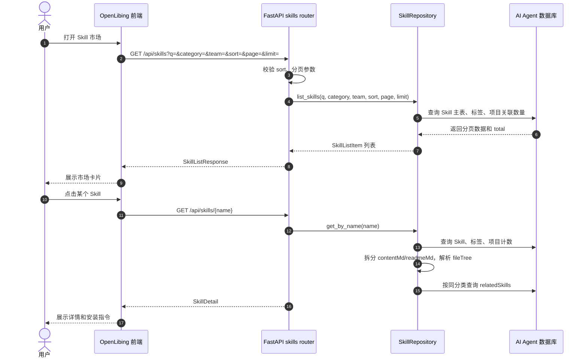
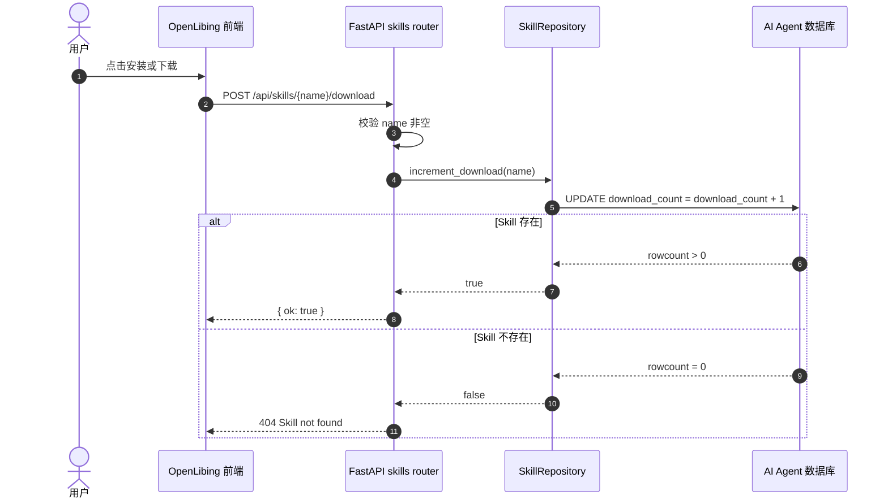

# Skill 市场系统设计

## 1. 系统定位

Skill 市场是 OpenLibing 页面中 AI 工具管理下的能力资产展示与分发模块。它面向普通用户提供 Skill 浏览、检索、详情查看、安装指令获取和下载计数能力；面向管理端提供 Skill 录入、维护和批量导入能力。系统核心不是执行 Skill，而是将分散在 Git 仓库中的 `SKILL.md` 能力说明沉淀为可检索、可分类、可分发的市场数据。

当前后端由 `openlibing-ai-agent` 提供 FastAPI 服务，公开市场接口集中在 `app/routers/skills.py`，数据访问集中在 `app/repositories/skill_repo.py`，数据模型位于 `app/models/skill.py`，批量录入解析能力位于 `app/services/import_service.py` 和 `app/utils/skill_parser.py`。

## 2. 业务边界

Skill 市场负责以下业务：

- 展示 Skill 列表，支持关键词、分类、团队筛选和排序。
- 展示 Skill 详情，包括 `SKILL.md` 内容、README 内容、文件树、标签、来源地址和相关推荐。
- 统计市场整体数据，包括 Skill 总数、团队数、下载数、项目数、最新 Skill 和热门 Skill。
- 记录用户下载或安装动作，用 `download_count` 支撑热门排序。
- 为前端提供分类、团队、标签等筛选元数据。

Skill 市场不负责以下业务：

- 不负责真正安装或执行 Skill。
- 不负责校验 Skill 运行时安全性。
- 不负责 Git 仓库的长期同步任务调度，当前源码中只保留管理端导入链路；历史设计中的定时同步属于后续扩展方向。

## 3. 领域模型

核心表包括：

| 表 | 源码模型 | 说明 |
| --- | --- | --- |
| `ai_agent_skills` | `Skill` | Skill 主数据，保存名称、展示名、描述、触发条件、分类、团队、正文、文件树、来源地址、下载数和时间字段。 |
| `ai_agent_skill_tags` | `SkillTag` | Skill 标签表，通过 `skill_name` 关联 Skill，支撑标签展示和标签检索。 |
| `ai_agent_projects` | `Project` | 项目主数据，统计中用于计算可见项目数。 |
| `ai_agent_project_skills` | `ProjectSkill` | 项目和 Skill 的关联表，支撑 `projectCount` 和项目维度归属。 |

`SkillRepository` 将 ORM 对象转换为前端响应模型：

- 列表项使用 `SkillListItem`，强调卡片展示需要的摘要信息。
- 详情使用 `SkillDetail`，在列表项基础上追加 `contentMd`、`readmeMd`、`fileTree`、`relatedSkills`。
- `content_md` 内部可能同时保存 `SKILL.md` 与 README，使用 `<!-- README.md -->` 分隔，详情读取时由 `split_content_and_readme()` 拆分。
- `installCommand` 不落库，由 `app/utils/platform.py` 基于 `source_url` 和 Skill 名称动态生成。

## 4. 公开市场业务流

用户进入 Skill 市场后，前端通常先并行请求市场统计、分类、团队、标签和第一页 Skill 列表。后端只根据查询参数读取数据库，不访问外部 Git 仓库。用户点击某个 Skill 时，后端读取主表和标签表，并根据同分类规则补充相关推荐。

## 5. 查询与排序实现流

`GET /api/skills` 的实现以数据库查询为中心：

1. 路由层接收 `q`、`category`、`team`、`sort`、`page`、`limit`。
2. `sort` 仅允许 `updatedAt`、`downloadCount`、`projectCount`，非法值回退到 `updatedAt`。
3. Repository 层构造 SQLAlchemy 条件：
   - `q` 匹配 `Skill.name`、`Skill.description` 和 `SkillTag.tag`。
   - `category` 过滤 `Skill.category`，`all` 表示不过滤。
   - `team` 过滤 `Skill.team`。
4. 通过子查询计算每个 Skill 关联项目数量。
5. 按更新时间、下载数或项目数排序，再分页返回。

该实现让公开市场接口保持无状态，所有筛选、排序和分页均由数据库完成，前端不需要感知表结构。

## 6. 下载计数流

下载计数用于反映 Skill 热度。当前接口为 `POST /api/skills/{name}/download`，后端只做计数递增，不返回安装包。

## 7. 管理录入对市场数据的影响

Skill 市场的数据来源主要有两种：

- 管理员在后台手工创建或更新 Skill。
- 管理员通过导入流程从远端仓库预览并选择导入 `SKILL.md`。

两条链路最终都调用 `SkillRepository.upsert_skill()`。该方法以 `name` 为唯一业务键，存在则更新主数据，不存在则新增；标签采用先删除再重建的方式保证前端看到的是最新标签集合。

## 8. 关键设计取舍

- 使用 `name` 作为稳定业务标识，便于 URL、标签表和项目关联表引用。
- Skill 正文直接保存 Markdown，避免详情页每次访问外部 Git 仓库，提升市场访问稳定性。
- `file_tree` 使用 JSON 字符串落库，在响应中解析为数组，降低迁移复杂度。
- 公开接口不要求管理员认证，管理接口通过 `/api/admin` 前缀统一治理。
- `download_count` 在 Repository 内直接提交事务，与只读列表接口解耦。

## 9. 后续演进点

- 文件树可从纯路径扩展为带源码跳转 URL 的结构，减少前端拼接多平台链接的复杂度。
- 定时同步可基于 `source_url` 拉取远端内容并对比更新，保留导入链路作为人工兜底。
- 下载计数可按用户或会话去重，避免重复点击造成热度失真。
